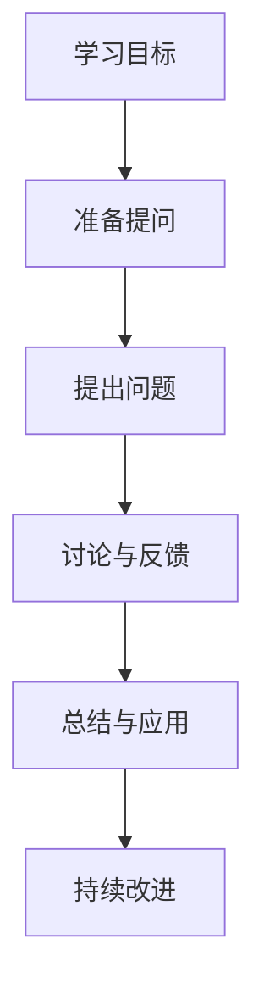

                 

# 费曼提问法促进团队学习与成长

> **关键词：** 费曼提问法、团队学习、知识共享、深度理解、技术培训、代码审查

> **摘要：** 本文探讨了费曼提问法在团队学习中的应用，通过详细阐述其起源、原理、结构化应用和具体实践，展示了如何利用费曼提问法提升团队的学习效果和创新能力。文章结合实际项目案例，提供了代码审查中的费曼提问法应用，并讲解了在开源项目团队中实施费曼提问法的开发环境和代码实现。最后，文章总结了费曼提问法的评估与优化策略，以及如何将其与组织文化相结合，为团队的持续成长提供指导。

---

### 目录大纲：费曼提问法促进团队学习与成长

#### 第一部分：费曼提问法概述
##### 第1章：费曼提问法的起源与基本原理
- 1.1 费曼提问法的起源
- 1.2 费曼提问法的核心概念
- 1.3 费曼提问法在团队学习中的应用价值

##### 第2章：费曼提问法的结构化应用
- 2.1 提问前的准备
  - 2.1.1 确定学习目标
  - 2.1.2 制定提问计划
  - 2.1.3 选择合适的学习资源
- 2.2 提问过程中的关键要素
  - 2.2.1 有效提问的技巧
  - 2.2.2 倾听与反馈
  - 2.2.3 提升团队讨论质量
- 2.3 提问后的行动
  - 2.3.1 应用所学知识
  - 2.3.2 回顾与总结
  - 2.3.3 持续改进与成长

#### 第二部分：团队学习场景下的费曼提问法实践
##### 第3章：项目团队中的费曼提问法应用
- 3.1 项目背景与目标
- 3.2 费曼提问法在项目团队会议中的应用
  - 3.2.1 开工会议
  - 3.2.2 阶段性回顾会议
  - 3.2.3 问题解决会议
- 3.3 费曼提问法在项目日常沟通中的应用
  - 3.3.1 日常任务讨论
  - 3.3.2 遇到困难时的提问与讨论
  - 3.3.3 专业知识分享会

##### 第4章：跨职能团队中的费曼提问法实践
- 4.1 跨职能团队协作面临的挑战
- 4.2 费曼提问法在跨职能团队中的应用
  - 4.2.1 提升跨部门沟通效率
  - 4.2.2 加速知识传递与共享
  - 4.2.3 提高决策质量
- 4.3 费曼提问法在跨职能团队项目实施中的实际案例

##### 第5章：领导力与费曼提问法
- 5.1 费曼提问法在领导力发展中的应用
- 5.2 领导者如何引导团队使用费曼提问法
  - 5.2.1 领导者角色与提问技巧
  - 5.2.2 鼓励团队成员提问
  - 5.2.3 创建支持提问的文化氛围
- 5.3 领导者如何通过费曼提问法提升团队绩效

#### 第三部分：费曼提问法与其他学习方法的结合
##### 第6章：费曼提问法与案例学习的结合
- 6.1 案例学习的基本原理
- 6.2 费曼提问法在案例学习中的应用
  - 6.2.1 案例选择与准备
  - 6.2.2 提问与讨论
  - 6.2.3 反思与总结
- 6.3 案例学习与费曼提问法的协同效应

##### 第7章：费曼提问法与工作坊的融合
- 7.1 工作坊的基本概念与设计原则
- 7.2 费曼提问法在工作坊中的应用
  - 7.2.1 工作坊的准备与策划
  - 7.2.2 提问与讨论环节的设计
  - 7.2.3 工作坊成果的总结与分享
- 7.3 费曼提问法在工作坊中的实际案例

#### 第四部分：费曼提问法的评估与优化
##### 第8章：费曼提问法的评估与反馈机制
- 8.1 评估费曼提问法效果的指标
- 8.2 反馈机制的建立与实施
  - 8.2.1 收集反馈的方法
  - 8.2.2 分析与利用反馈
  - 8.2.3 费曼提问法的持续优化

##### 第9章：费曼提问法的可持续性与文化融入
- 9.1 费曼提问法的长期实践与可持续性
- 9.2 费曼提问法与组织文化的融合
  - 9.2.1 建立支持提问的文化环境
  - 9.2.2 管理层对提问文化的支持
  - 9.2.3 团队成员的角色与责任

### 附录
## 附录 A：费曼提问法实践指南
- A.1 实践费曼提问法的步骤与建议
- A.2 费曼提问法的常见问题与解答
- A.3 费曼提问法实践案例分析

## 附录 B：费曼提问法相关资源
- B.1 费曼提问法的研究论文与书籍推荐
- B.2 费曼提问法在线实践工具与平台
- B.3 费曼提问法相关的在线社区与讨论组

---

**核心概念与联系：**

Mermaid流程图如下：



**核心算法原理讲解：**

Python伪代码：

```python
def FeynmanQuestioning(knowledge):
    """
    费曼提问法的实现。
    
    参数：
    knowledge：待学习的知识点或概念。
    
    返回：
    understanding：通过提问和回答得出的深入理解。
    """
    # 设定学习目标
    target = "理解" + knowledge
    
    # 提出问题
    question = "如何解释" + knowledge + "？"
    
    # 尝试用自己的语言解释知识点
    explanation = explain_knowledge(knowledge)
    
    # 如果无法清晰解释，则说明理解不深，需要进一步学习
    while not is_explanation_clear(explanation):
        # 返回需要进一步学习的知识点
        return "需要进一步学习：" + knowledge
    
    # 如果能够清晰解释，则表示已经掌握
    understanding = "已经掌握：" + explanation
    return understanding

def explain_knowledge(knowledge):
    """
    用自己的语言解释知识点。
    
    参数：
    knowledge：待解释的知识点或概念。
    
    返回：
    explanation：对知识点的解释。
    """
    # 根据知识点的复杂程度，给出简明扼要的解释
    if is_simple(knowledge):
        explanation = simple_explanation(knowledge)
    else:
        explanation = complex_explanation(knowledge)
    return explanation

def is_explanation_clear(explanation):
    """
    判断解释是否清晰。
    
    参数：
    explanation：对知识点的解释。
    
    返回：
    clear：是否清晰（True/False）。
    """
    # 这里可以加入一些逻辑判断，例如检查解释的完整性、准确性等
    clear = True
    return clear

def is_simple(knowledge):
    """
    判断知识点是否简单。
    
    参数：
    knowledge：待判断的知识点或概念。
    
    返回：
    simple：是否简单（True/False）。
    """
    # 这里可以根据知识点的特点进行判断
    simple = True
    return simple

def simple_explanation(knowledge):
    """
    给出简单知识点的解释。
    
    参数：
    knowledge：待解释的知识点或概念。
    
    返回：
    explanation：对知识点的简单解释。
    """
    explanation = "这是一个简单的知识点，它的含义是..."
    return explanation

def complex_explanation(knowledge):
    """
    给出复杂知识点的解释。
    
    参数：
    knowledge：待解释的知识点或概念。
    
    返回：
    explanation：对知识点的详细解释。
    """
    explanation = "这是一个复杂的知识点，它的含义是..."
    return explanation
```

**数学模型和数学公式：**

LaTeX公式：

$$
理解度 = f(提问次数, 回答准确性)
$$

$$
f(x, y) = \frac{y}{1 + e^{-k(x - \theta)}}
$$

**举例说明：**

### 费曼提问法在理解复杂概念中的应用

假设我们要解释“深度学习中的卷积神经网络（CNN）”。

**提问：**
- CNN 是什么？
- CNN 如何工作？
- CNN 适用于什么样的任务？
- CNN 与传统神经网络有什么区别？

**回答与解释：**
- CNN 是一种用于图像识别和处理的神经网络结构，能够自动学习图像中的特征。
- CNN 通过卷积层、池化层和全连接层的组合来提取图像的层次特征。
- CNN 适用于图像分类、目标检测和图像生成等任务。
- 与传统神经网络相比，CNN 具有参数共享的特点，减少了参数数量，提高了训练效率。

通过上述提问和回答，我们可以更好地理解 CNN 的核心概念和原理。

---

**项目实战：**

### 费曼提问法在团队技术培训中的应用

**场景：** 一家科技公司决定使用费曼提问法来提升团队的技术水平。

**步骤：**
1. **确定学习目标：** 团队选择一个核心技术领域，如“机器学习中的深度神经网络”。
2. **提问计划：** 确定一系列关键问题，涵盖从基础概念到高级应用。
3. **准备学习资源：** 收集相关的书籍、论文和在线课程。
4. **实施提问与讨论：** 团队成员轮流提出问题并尝试回答，鼓励开放性讨论。
5. **应用所学知识：** 在实际项目中应用新学的技术，进行实验和验证。

**效果：**
- 通过提问和讨论，团队成员对深度神经网络的理解加深，知识共享增强。
- 技术应用能力得到提升，团队在项目中取得了显著进展。
- 持续的费曼提问法实践，使得团队的学习氛围更加积极，创新能力提高。

---

**代码实际案例和详细解释说明：**

### 费曼提问法在代码审查中的应用

**案例：** 一家软件公司采用费曼提问法来进行代码审查，以提高代码质量。

**步骤：**
1. **选择代码片段：** 选择一段需要审查的代码。
2. **提出问题：** 开发人员向代码作者提出一系列问题，确保对代码的理解。
3. **讨论与反馈：** 通过提问和回答，开发人员对代码的设计和实现进行深入讨论。
4. **代码修改与再审查：** 根据讨论结果，代码作者进行代码修改，然后再次进行审查。

**代码示例：**
```python
# 假设这是一个简单的 Python 函数，用于计算两个数的和。
def add(a, b):
    return a + b

# 代码作者准备进行代码审查。

# 提问1：这个函数的功能是什么？
# 回答1：这个函数用于计算两个数的和。

# 提问2：如果 a 和 b 都是浮点数，会有什么问题？
# 回答2：如果 a 和 b 都是浮点数，可能会有精度问题。

# 提问3：能否改进这个函数以支持浮点数的精确计算？
# 回答3：可以，可以使用 Python 的 decimal 模块来实现。

# 根据反馈，代码作者进行了改进：
from decimal import Decimal

def add(a, b):
    return Decimal(a) + Decimal(b)
```

**代码解读与分析：**
- 通过提问和回答，代码审查团队能够发现潜在的精度问题。
- 代码作者根据反馈进行了改进，提高了代码的健壮性。
- 费曼提问法帮助团队确保了代码质量，促进了团队成员之间的知识共享和技术交流。

---

**开发环境搭建，源代码详细实现和代码解读：**

### 在一个开源项目团队中实施费曼提问法

**环境搭建：**
- 使用 Git 进行版本控制。
- 配置代码审查工具，如 GitHub 的 Pull Request 功能。

**源代码实现：**
```python
# 假设这是一个开源项目的Pull Request。
class PR:
    def __init__(self, title, description, author):
        self.title = title
        self.description = description
        self.author = author
        self.reviewers = []

    def add_reviewer(self, reviewer):
        self.reviewers.append(reviewer)

    def ask_question(self, question):
        for reviewer in self.reviewers:
            reviewer.answer_question(question)

    def answer_question(self, question):
        print(f"{self.author}回答：{question}")

# 创建一个PR实例。
pr = PR("优化代码性能", "该函数在处理大数据时性能不佳", "作者A")

# 添加审查者。
pr.add_reviewer("审查者B")
pr.add_reviewer("审查者C")

# 提问并回答。
pr.ask_question("这个函数在处理大数据时性能如何优化？")
```

**代码解读：**
- `PR` 类用于表示一个代码审查的 Pull Request。
- `add_reviewer` 方法用于添加审查者。
- `ask_question` 方法用于发起提问，并通知所有审查者。
- `answer_question` 方法用于审查者回答问题。
- 通过提问和回答机制，审查者可以深入理解代码，提出改进建议。

**代码解读与分析：**
- 费曼提问法在此代码示例中体现了其在代码审查中的应用。
- 通过提问和回答，审查者能够更深入地理解代码，发现潜在问题。
- 代码作者可以基于反馈进行改进，提高代码质量。

---

**作者信息：**

作者：AI天才研究院/AI Genius Institute & 禅与计算机程序设计艺术 /Zen And The Art of Computer Programming

---

## 第一部分：费曼提问法概述

### 第1章：费曼提问法的起源与基本原理

#### 1.1 费曼提问法的起源

费曼提问法（Feynman Technique）得名于著名的物理学家理查德·费曼（Richard Feynman），他是20世纪最具影响力的物理学家之一，也是诺贝尔物理学奖的获得者。费曼提问法并非源于一个特定的学术理论或研究，而是费曼在个人学习过程中形成的一种独特方法。费曼以其清晰、直观的教学风格而闻名，他能够用最简单的话语解释复杂的物理概念，这种能力不仅得益于他深厚的专业素养，还得益于他独特的学习和思考方式。

费曼提问法的起源可以追溯到费曼在加州理工学院的教学生涯。他在教授物理学时，发现许多学生虽然能够通过死记硬背记住一些物理定理和公式，但往往无法真正理解这些概念的本质。为了帮助学生深入理解物理学，费曼开始采用一种提问和回答的方法，鼓励学生用自己的话来解释他们所学的内容。这种方法不仅帮助学生更好地理解知识，还激发了他们的学习兴趣和创造力。

#### 1.2 费曼提问法的核心概念

费曼提问法的核心概念简单而强大：通过提问和回答，将复杂的概念简化为最基本的形式。这种方法的关键步骤如下：

1. **选择一个概念：** 选择一个你想要理解或解释的概念。
2. **尝试用自己的话解释：** 尝试用最简单、最基本的话语来解释这个概念，就像对一个小孩或外行人解释一样。
3. **识别困难点：** 在解释的过程中，如果遇到难以用简单语言描述的部分，说明你对这个概念的理解还不够深入。
4. **深入学习和反复解释：** 根据困难点，重新学习和研究这个概念，直到你能用简单、清晰的语言解释它。

费曼提问法的核心在于简化知识传递的过程，通过提问和回答来深入理解问题。这种方法不仅适用于物理学，还可以广泛应用于其他学科和领域，如计算机科学、生物学、经济学等。

#### 1.3 费曼提问法在团队学习中的应用价值

费曼提问法在团队学习中的应用价值主要体现在以下几个方面：

1. **促进深度理解：** 通过提问和回答，团队成员可以深入探讨和思考问题，从而促进对知识的深入理解。
2. **加强知识共享：** 费曼提问法鼓励团队成员用自己的话来解释问题，这有助于知识的传递和共享，避免了信息传递过程中的失真。
3. **提高讨论质量：** 提问和回答的过程能够引导讨论，使其更加结构化和深入，有助于团队做出更高质量的决策。
4. **激发创新思维：** 费曼提问法鼓励团队成员从不同的角度思考问题，有助于激发创新思维和创造力。
5. **强化学习动力：** 通过不断地提问和回答，团队成员能够保持对知识的持续兴趣和好奇心，从而增强学习的动力。

费曼提问法为团队学习提供了一种有效的方法，通过提问和回答，团队成员不仅能够加深对知识的理解，还能提高团队的协作能力和创新水平。在接下来的章节中，我们将进一步探讨费曼提问法的结构化应用，以及在不同团队学习场景中的具体实践。

### 第2章：费曼提问法的结构化应用

#### 2.1 提问前的准备

在开始应用费曼提问法之前，充分的准备工作是至关重要的。这一步骤的目的是确保提问的过程能够高效、有针对性地进行，从而最大化地发挥费曼提问法的效果。以下是一些关键的准备步骤：

##### 2.1.1 确定学习目标

确定明确的学习目标是费曼提问法成功实施的第一步。学习目标应该具体、可衡量，并且与团队的整体目标相一致。以下是制定学习目标时需要考虑的一些要点：

1. **具体性：** 学习目标应当具体描述你希望团队成员掌握的知识或技能。例如，而不是模糊地提出“了解深度学习”，可以具体为“掌握卷积神经网络的工作原理和应用场景”。
2. **可衡量性：** 目标应当有明确的标准来衡量是否达成。例如，可以设置一个具体的任务，如“能够在项目中独立实现卷积神经网络”。
3. **相关性：** 确保学习目标与团队的项目或业务目标相关联，从而提高团队成员的参与度和投入度。

##### 2.1.2 制定提问计划

制定提问计划是确保费曼提问法有序进行的重要步骤。以下是一些制定提问计划的建议：

1. **提前准备问题：** 根据学习目标，提前准备一系列问题。这些问题的范围应当涵盖从基础概念到高级应用的各个方面。例如，如果你在学习目标中设定了“掌握卷积神经网络的工作原理和应用场景”，那么你可以准备以下问题：
   - 卷积神经网络是什么？
   - 它是如何工作的？
   - 它适用于哪些类型的图像处理任务？
   - 与其他类型的神经网络相比，卷积神经网络的优点是什么？
   - 它在实际项目中如何实现？

2. **问题类型多样化：** 尽量涵盖不同类型的问题，如定义性问题、解释性问题、应用性问题等。这样可以帮助团队成员从不同角度理解和掌握知识。

3. **问题排序：** 根据知识点的复杂程度和相关性，合理安排问题的顺序。通常，从基础问题开始，逐步引导到更复杂的问题。

##### 2.1.3 选择合适的学习资源

为了确保提问和回答的过程能够顺利进行，选择合适的学习资源是非常关键的。以下是一些选择学习资源的建议：

1. **权威资料：** 选择权威的书籍、论文、在线课程等学习资源，确保学习内容的质量和准确性。
2. **多样化资源：** 尽可能选择多样化的资源，如视频、图表、案例分析等，以帮助团队成员更好地理解和吸收知识。
3. **相关案例：** 结合实际案例进行学习，可以帮助团队成员更好地将理论知识应用到实际中。

通过充分的提问前准备，团队可以确保费曼提问法的实施过程有条不紊，有效地促进团队成员对知识的深入理解和掌握。

### 2.2 提问过程中的关键要素

在费曼提问法的实施过程中，提问的质量和技巧是决定学习效果的关键因素。以下是一些在提问过程中需要关注的关键要素：

##### 2.2.1 有效提问的技巧

1. **开放式问题：** 尽量使用开放式问题，这类问题通常以“如何”、“为什么”、“能否”等开头，鼓励团队成员进行深入思考和讨论。例如，而不是询问“这个函数的功能是什么？”可以提问“这个函数是如何实现它的功能的？”。

2. **层次化问题：** 根据知识点的复杂程度，设计层次化的问题。先从基础问题开始，逐步引导到更复杂的问题。这样可以帮助团队成员逐步深入理解知识点。

3. **关联性问题：** 结合实际案例或相关知识点，设计关联性问题。这有助于团队成员将所学知识应用到实际场景中，加深对知识的理解。

4. **引导性问题：** 在适当的时候，使用引导性问题帮助团队成员思考问题的不同角度。例如，可以提问“如果这个条件发生变化，结果会怎样？”

##### 2.2.2 倾听与反馈

1. **积极倾听：** 在团队成员回答问题时，要积极倾听并理解他们的观点。通过肢体语言和反馈，表明你对他们的回答感兴趣，鼓励他们继续分享。

2. **鼓励发言：** 鼓励团队成员积极参与讨论，特别是那些通常不主动发言的人。可以采用轮流发言的方式，确保每个团队成员都有机会表达自己的观点。

3. **及时反馈：** 对团队成员的回答给予及时、具体的反馈。表扬他们的优点，指出可以改进的地方。这样可以帮助团队成员更好地理解知识点，并促进他们持续进步。

##### 2.2.3 提升团队讨论质量

1. **建立讨论规则：** 为了确保讨论的有序和高效，可以建立一些讨论规则，如：
   - 每个人有平等的发言机会。
   - 不允许打断别人的发言。
   - 保持讨论聚焦于当前的话题。
   - 尊重不同的观点。

2. **鼓励批判性思维：** 鼓励团队成员批判性地思考问题，提出不同的观点和解决方案。这有助于激发团队的创造力，提高讨论的质量。

3. **实践共享思维：** 鼓励团队成员在讨论中分享自己的经验和知识，实现知识共享。这不仅可以加深对知识的理解，还可以增强团队的协作精神。

通过关注这些关键要素，团队可以在费曼提问法的提问过程中实现高效的交流和讨论，从而促进知识的深入理解和掌握。

### 2.3 提问后的行动

费曼提问法不仅仅是一个提问和讨论的过程，更重要的是要将所学知识应用到实践中，并不断进行回顾和总结。以下是在提问后需要采取的一些行动：

##### 2.3.1 应用所学知识

1. **实际操作：** 在提问和讨论结束后，鼓励团队成员将所学知识应用到实际操作中。例如，如果讨论的是深度学习中的卷积神经网络，团队成员可以在项目中尝试使用卷积神经网络进行图像分类或目标检测。

2. **实验验证：** 通过实验和验证，团队成员可以检验他们对知识的掌握程度。实验过程中，鼓励团队成员记录实验结果，分析问题，并尝试不同的解决方案。

3. **知识共享：** 鼓励团队成员在实验过程中遇到的问题和解决方案进行分享。这不仅可以加深对知识的理解，还可以促进团队内部的协作和知识共享。

##### 2.3.2 回顾与总结

1. **定期回顾：** 定期回顾所学知识，可以帮助团队成员巩固记忆，加深对知识的理解。可以设置一个固定的时间，如每周或每月，进行回顾。

2. **总结心得：** 在回顾过程中，团队成员可以总结学习过程中的心得体会，包括成功经验、遇到的困难以及解决方案。这些总结有助于团队成员更好地理解和应用所学知识。

3. **知识梳理：** 对所学知识进行梳理，将其组织成系统化的资料，如文档、PPT或视频等。这不仅可以方便团队成员的复习，还可以作为团队的知识库，供新成员参考。

##### 2.3.3 持续改进与成长

1. **定期评估：** 定期对费曼提问法的效果进行评估，收集团队成员的反馈，了解他们在使用过程中的困惑和需求。根据反馈调整提问计划和方法，确保费曼提问法能够持续有效地应用于团队学习。

2. **持续学习：** 鼓励团队成员保持持续学习的态度，不断探索新的知识和技能。可以通过参加培训课程、阅读专业书籍、参加行业会议等方式，保持对最新技术和趋势的了解。

3. **培养提问文化：** 在团队中培养提问文化，鼓励团队成员在任何时候都勇于提问。建立一个支持提问的环境，使团队成员感到提问是被尊重和鼓励的，从而促进团队的知识共享和创新能力。

通过提问后的行动，团队不仅可以巩固所学知识，还可以在实践中不断提升，实现持续改进和成长。

### 第3章：项目团队中的费曼提问法应用

在项目团队中，费曼提问法是一种强有力的工具，可以帮助团队成员更好地理解项目目标、技术细节和业务需求。本章将详细探讨费曼提问法在项目团队中的应用，包括其在项目会议中的具体实践以及日常沟通中的应用。

#### 3.1 项目背景与目标

假设我们正在开发一款基于机器学习的图像识别应用。项目目标是在给定一组图像数据集的基础上，训练一个模型，使其能够准确识别图像中的物体。项目团队由数据科学家、软件开发工程师、产品经理和测试工程师组成，他们需要共同合作，确保项目的成功完成。

#### 3.2 费曼提问法在项目团队会议中的应用

##### 3.2.1 开工会议

在项目启动阶段，举行一次开工会议是非常关键的。这次会议的主要目的是确保所有团队成员对项目目标、任务和预期成果有清晰的理解。以下是在开工会议中使用费曼提问法的步骤：

1. **明确项目目标：** 项目经理可以首先介绍项目目标和预期成果，然后提出一系列问题，如：
   - 我们的目标是什么？
   - 我们将如何衡量项目的成功？
   - 我们在什么时间内需要完成这个项目？

2. **团队成员解释项目目标：** 鼓励每个团队成员用自己的话来解释项目目标，这有助于发现对项目目标理解上的差异和误解。

3. **讨论和反馈：** 团队成员可以就项目目标进行讨论，分享他们对项目的看法和担忧。项目经理可以记录这些反馈，并在后续会议中进行跟进。

##### 3.2.2 阶段性回顾会议

在项目进行的不同阶段，阶段性回顾会议可以帮助团队评估项目的进展，识别问题和风险，并调整计划和策略。以下是在阶段性回顾会议中使用费曼提问法的步骤：

1. **评估项目进展：** 项目经理可以提出关于项目进展的问题，如：
   - 我们在哪些方面取得了进展？
   - 我们在哪些方面遇到了困难？

2. **团队成员解释进展：** 鼓励团队成员用自己的话来解释他们在各自任务上的进展，这有助于团队了解每个人的工作情况和需要支持的地方。

3. **讨论和反馈：** 团队成员可以就项目进展进行讨论，提出问题和建议。项目经理可以根据讨论结果，调整项目计划和资源分配。

##### 3.2.3 问题解决会议

在项目执行过程中，团队可能会遇到各种技术问题和业务挑战。问题解决会议是专门为解决这些问题而设立的。以下是在问题解决会议中使用费曼提问法的步骤：

1. **识别问题：** 项目经理可以提出关于问题的问题，如：
   - 我们遇到了什么问题？
   - 这个问题的根源是什么？

2. **团队成员解释问题：** 鼓励团队成员用自己的话来解释他们遇到的问题，这有助于团队理解问题的本质和影响。

3. **讨论和解决方案：** 团队成员可以就问题进行讨论，提出可能的解决方案。项目经理可以根据讨论结果，制定解决问题的行动计划。

#### 3.3 费曼提问法在项目日常沟通中的应用

##### 3.3.1 日常任务讨论

在日常任务讨论中，团队成员可以分享他们当天的工作进展和遇到的问题。以下是在日常任务讨论中使用费曼提问法的步骤：

1. **分享进展：** 每个团队成员可以简要介绍他们当天的工作进展，并回答以下问题：
   - 你今天完成了什么任务？
   - 你在完成任务时遇到了什么困难？

2. **提问和讨论：** 团队成员可以就他人的进展提出问题，如：
   - 你的任务与我的有什么关联？
   - 我们如何协同工作来解决问题？

3. **解决方案：** 针对遇到的问题，团队成员可以一起讨论可能的解决方案，并确定下一步行动。

##### 3.3.2 遇到困难时的提问与讨论

当团队遇到困难时，及时的提问和讨论是解决问题的关键。以下是在遇到困难时使用费曼提问法的步骤：

1. **识别困难：** 团队成员可以提出关于困难的问题，如：
   - 我们遇到了什么困难？
   - 这个困难对我们的项目有什么影响？

2. **解释困难：** 鼓励团队成员用自己的话来解释他们遇到的困难，这有助于团队理解问题的本质。

3. **讨论和解决方案：** 团队成员可以就困难进行讨论，提出可能的解决方案，并确定下一步行动。

##### 3.3.3 专业知识分享会

专业知识分享会是团队交流和学习的重要环节。通过分享专业知识和经验，团队成员可以不断提升自己的技能水平。以下是在专业知识分享会中使用费曼提问法的步骤：

1. **确定主题：** 由某个团队成员或外部专家确定一个专业主题，如“深度学习的最新进展”。

2. **准备讲解：** 讲解者需要准备一份讲解稿，并用最简单、最清晰的语言来解释专业概念。

3. **提问和讨论：** 讲解结束后，团队成员可以就讲解内容提出问题，进行深入讨论。这有助于巩固对知识点的理解。

通过在项目团队中应用费曼提问法，团队成员可以更好地理解项目目标、技术细节和业务需求，从而提高项目的执行效率和质量。在接下来的章节中，我们将进一步探讨费曼提问法在跨职能团队中的应用，以及如何通过费曼提问法提升跨部门沟通效率。

### 第4章：跨职能团队中的费曼提问法实践

在跨职能团队中，团队成员通常来自不同的部门或背景，他们的职责和技能各不相同。这种多样性在提高项目整体效率的同时，也可能带来沟通障碍和协作问题。费曼提问法作为一种有效的沟通工具，可以帮助跨职能团队更好地理解和共享知识，提高协作效率。以下将详细探讨费曼提问法在跨职能团队中的应用，以及如何通过它提升跨部门沟通效率、加速知识传递与共享，以及提高决策质量。

#### 4.1 跨职能团队协作面临的挑战

跨职能团队协作面临的主要挑战包括：

1. **沟通障碍：** 不同部门或背景的团队成员在沟通时可能会使用专业术语或行业惯例，这可能导致信息传递的失真或误解。
2. **知识共享困难：** 不同团队成员可能在不同的领域拥有不同的专业知识，导致知识传递不顺畅。
3. **目标不一致：** 跨职能团队的目标可能不同，导致在项目执行过程中出现分歧和冲突。
4. **决策延迟：** 在跨职能团队中，决策通常需要多个部门的协同工作，这可能导致决策过程变得复杂和冗长。

#### 4.2 费曼提问法在跨职能团队中的应用

##### 4.2.1 提升跨部门沟通效率

费曼提问法可以帮助跨部门团队提高沟通效率，具体应用步骤如下：

1. **明确沟通目标：** 在每次会议或讨论开始前，明确沟通的目标和主题，确保所有团队成员都了解会议的目的。
2. **使用简单语言：** 鼓励团队成员使用简单、易懂的语言来表达自己的观点和问题，避免使用专业术语或行业惯例。
3. **提问和回答：** 在讨论过程中，鼓励团队成员提问和回答，以确保每个人都理解对方的意思。例如，一个数据科学家可以提问：“你能解释一下你的报告中的‘数据预处理’步骤吗？”
4. **总结和确认：** 会议结束后，由会议主持人或团队成员总结讨论结果，并确认每个成员对讨论内容的理解。

##### 4.2.2 加速知识传递与共享

费曼提问法可以帮助跨职能团队加速知识传递与共享，具体应用步骤如下：

1. **确定知识共享主题：** 确定跨职能团队需要共享的知识点，如技术规范、业务流程等。
2. **安排分享会：** 由专家或知识丰富的人员进行知识分享，并鼓励团队成员提问和讨论。
3. **简化知识表达：** 分享者需要使用简单、易懂的语言来解释复杂的概念，确保团队成员能够理解。
4. **记录和分享：** 会议结束后，将讨论内容记录下来，并在团队内部进行分享，以方便其他成员学习和参考。

##### 4.2.3 提高决策质量

费曼提问法可以帮助跨职能团队提高决策质量，具体应用步骤如下：

1. **明确决策目标：** 在决策前，明确决策的目标和标准，确保所有团队成员都了解决策的目的。
2. **提出问题和假设：** 鼓励团队成员提出关于决策的问题和假设，如：“这个决策会对我们的项目进度产生什么影响？”
3. **讨论和评估：** 团队成员可以就问题和假设进行讨论，评估不同决策方案的优缺点。
4. **提问和回答：** 鼓励团队成员在讨论过程中提问和回答，以确保每个人都理解决策的背景和依据。
5. **总结和决策：** 会议结束后，由决策负责人或团队根据讨论结果做出最终决策，并确认每个成员对决策的理解。

#### 4.3 费曼提问法在跨职能团队项目实施中的实际案例

以下是一个跨职能团队项目实施中应用费曼提问法的实际案例：

**项目背景：** 一家科技公司决定开发一款智能家居应用，团队成员包括软件开发工程师、前端开发工程师、产品经理、UI/UX设计师和市场营销专家。

**应用场景：** 在项目启动会议中，产品经理介绍项目目标和功能需求，然后使用费曼提问法促进团队成员之间的沟通和理解。

**步骤：**

1. **明确项目目标：** 产品经理介绍了智能家居应用的项目目标，并提出了以下问题：
   - 我们的目标是什么？
   - 我们希望用户从这款应用中获得什么价值？

2. **团队成员解释项目目标：** 每个团队成员用自己的话解释了项目目标，确保对项目目标有清晰的理解。

3. **提问和讨论：** 团队成员提出了关于项目目标的问题，如：
   - 这个项目对我们各自部门的职责和影响是什么？
   - 我们在实现这个目标时可能遇到哪些挑战？

4. **总结和确认：** 会议结束后，产品经理总结了讨论结果，并确认每个团队成员对项目目标的理解。

通过应用费曼提问法，跨职能团队在项目启动会议中实现了高效的沟通和理解，为后续项目的顺利推进奠定了基础。在接下来的章节中，我们将探讨费曼提问法在领导力发展中的应用，以及如何通过费曼提问法提升团队绩效。

### 第5章：领导力与费曼提问法

#### 5.1 费曼提问法在领导力发展中的应用

费曼提问法不仅是一种有效的学习方法，还可以用于领导力发展。通过提问和回答，领导者可以加深对团队、项目和企业战略的理解，从而提升领导力和决策能力。以下是一些费曼提问法在领导力发展中的应用场景：

1. **理解团队动态：** 领导者可以通过提问了解团队成员的期望、困惑和需求，从而更好地管理团队和激发团队潜力。
2. **评估项目进展：** 领导者可以通过提问评估项目的进展和风险，及时发现并解决问题，确保项目按计划推进。
3. **探索战略方向：** 领导者可以通过提问探索企业战略的可行性和潜在挑战，从而制定更明智的战略决策。

#### 5.2 领导者如何引导团队使用费曼提问法

要有效地引导团队使用费曼提问法，领导者需要扮演以下角色和采取以下措施：

##### 5.2.1 领导者角色与提问技巧

1. **榜样作用：** 领导者应当率先使用费曼提问法，通过自己的行为树立榜样，鼓励团队成员跟随。
2. **引导提问：** 领导者可以在会议或讨论中引导团队成员使用费曼提问法，例如通过提出开放性问题来激发思考和讨论。
3. **倾听与反馈：** 领导者应当积极倾听团队成员的回答，并给予建设性的反馈，以帮助团队成员更好地理解问题和深化思考。

##### 5.2.2 鼓励团队成员提问

1. **创造提问文化：** 领导者应当鼓励团队成员在任何时候都勇于提问，建立一个支持提问的文化氛围。
2. **表扬提问行为：** 领导者应当表扬那些勇于提问的团队成员，以激励其他人也敢于提问。
3. **提供资源支持：** 领导者应当为团队成员提供必要的资源和指导，帮助他们更好地使用费曼提问法。

##### 5.2.3 创建支持提问的文化氛围

1. **明确价值：** 领导者应当明确费曼提问法在团队学习和成长中的价值，使团队成员认识到提问的重要性。
2. **减少风险：** 领导者应当减少团队成员因提问而可能承担的风险，例如鼓励团队成员在提问时采用匿名方式，以保护他们的隐私。
3. **持续反馈：** 领导者应当定期收集团队成员对费曼提问法的反馈，并根据反馈进行改进，确保其持续有效地应用于团队学习中。

#### 5.3 领导者如何通过费曼提问法提升团队绩效

通过费曼提问法，领导者可以提升团队的绩效，具体措施包括：

1. **提高决策质量：** 通过提问和讨论，领导者可以更全面地了解团队的观点和意见，从而做出更明智的决策。
2. **促进知识共享：** 通过提问和回答，团队成员可以更深入地理解彼此的工作和知识，从而促进知识共享和协作。
3. **激发创新思维：** 费曼提问法鼓励团队成员从不同角度思考问题，有助于激发创新思维和创造力。
4. **增强团队凝聚力：** 通过共同参与提问和讨论，团队成员可以建立更强的信任和合作关系，从而增强团队的凝聚力。

通过引导团队使用费曼提问法，领导者不仅能够提升自己的领导力，还可以促进团队的成长和绩效提升。在下一章节中，我们将探讨费曼提问法与其他学习方法的结合，以及如何通过这些结合提高学习效果。

### 第6章：费曼提问法与案例学习的结合

案例学习是一种通过分析和讨论实际案例来理解概念、应用知识和解决实际问题的学习方法。它与费曼提问法的结合，可以显著提高学习效果。在本章中，我们将探讨费曼提问法与案例学习的结合，以及如何通过这种方法提升学习效果。

#### 6.1 案例学习的基本原理

案例学习的基本原理包括以下步骤：

1. **选择案例：** 选择与学习目标相关的实际案例，这些案例应当具有典型性和代表性。
2. **分析案例：** 团队成员对案例进行分析，包括识别关键问题、理解背景和评估解决方案。
3. **讨论案例：** 团队成员对案例进行讨论，分享各自的观点和见解，探讨案例中的成功经验和失败教训。
4. **应用知识：** 将案例中的知识和经验应用到实际问题中，解决实际工作中的问题。
5. **反思总结：** 对案例学习的过程和结果进行反思和总结，巩固所学知识，提出改进措施。

#### 6.2 费曼提问法在案例学习中的应用

费曼提问法可以与案例学习相结合，以提高学习效果。以下是一些关键步骤：

##### 6.2.1 案例选择与准备

1. **选择案例：** 根据学习目标和团队需求，选择具有挑战性和启发性的案例。这些案例应当能够涵盖学习目标的核心概念和应用场景。
2. **准备资料：** 收集与案例相关的资料，包括背景信息、数据、图表和文献，为讨论提供基础。
3. **设定目标：** 确定案例学习的目标，如理解某个技术原理、解决特定业务问题或学习某个成功案例的实践经验。

##### 6.2.2 提问与讨论

1. **提出问题：** 在分析案例的过程中，使用费曼提问法提出一系列问题，如：
   - 案例中的关键问题是什么？
   - 案例的背景和动机是什么？
   - 案例中的解决方案有哪些？
   - 案例中的成功因素是什么？
   - 案例中的失败因素是什么？

2. **讨论案例：** 团队成员根据提出的问题进行讨论，分享各自的观点和见解。讨论过程中，鼓励团队成员使用费曼提问法，进一步深入探讨案例中的关键问题和解决方案。

##### 6.2.3 反思与总结

1. **反思学习过程：** 在案例学习结束后，团队成员对学习过程进行反思，讨论哪些方法和策略是有效的，哪些需要改进。
2. **总结学习成果：** 将案例学习的结果进行总结，包括关键问题的分析、解决方案的评估和成功与失败的原因。
3. **制定行动计划：** 根据学习成果，制定行动计划，将所学知识应用到实际工作中，解决实际问题和提升团队绩效。

#### 6.3 案例学习与费曼提问法的协同效应

通过将费曼提问法与案例学习相结合，可以产生以下协同效应：

1. **深化理解：** 费曼提问法帮助团队成员从不同角度分析案例，深入理解案例中的关键概念和原理。
2. **促进分享：** 案例学习提供了一个共享知识的平台，团队成员可以分享实际案例中的经验和教训，促进知识传递。
3. **提高应用能力：** 通过讨论和反思，团队成员可以将案例中的知识和经验应用到实际工作中，提高问题解决能力和创新能力。
4. **增强团队协作：** 案例学习与费曼提问法的结合，可以促进团队成员之间的协作和沟通，增强团队的凝聚力。

通过案例学习与费曼提问法的结合，团队可以更有效地学习、应用和分享知识，从而提升整体绩效和创新能力。在下一章节中，我们将探讨费曼提问法与工作坊的融合，以及如何通过工作坊提高学习效果。

### 第7章：费曼提问法与工作坊的融合

工作坊是一种通过集中讨论、互动学习和实践应用来提升知识和技能的学习方法。与费曼提问法的结合，可以显著提高工作坊的效果，促进团队学习和创新。在本章中，我们将探讨费曼提问法与工作坊的融合，以及如何通过这种方法提高学习效果。

#### 7.1 工作坊的基本概念与设计原则

工作坊的基本概念包括以下几个要素：

1. **目标明确：** 工作坊的目标应当具体、明确，确保所有参与者都清楚工作坊的目的和期望成果。
2. **互动性：** 工作坊强调互动和参与，鼓励参与者主动发言、提问和分享观点。
3. **实践性：** 工作坊不仅注重理论学习，还强调实践应用，通过实际操作和案例分析来巩固所学知识。
4. **反馈与改进：** 工作坊结束后，对学习过程和成果进行反思和总结，及时反馈和改进，确保学习效果的持续提升。

设计工作坊时，需要遵循以下原则：

1. **需求导向：** 根据参与者的需求和团队的目标，设计工作坊的内容和流程。
2. **结构清晰：** 工作坊的流程应当清晰、有条理，确保参与者能够跟随节奏，有效参与。
3. **时间管理：** 合理安排工作坊的时间，确保每个环节都有足够的时间进行讨论和实践。
4. **资源支持：** 提供必要的资源和工具，如书籍、案例、PPT等，帮助参与者更好地理解和应用所学知识。

#### 7.2 费曼提问法在工作坊中的应用

费曼提问法可以与工作坊紧密结合，提高学习效果。以下是在工作坊中应用费曼提问法的一些具体步骤：

##### 7.2.1 工作坊的准备与策划

1. **确定学习目标：** 根据工作坊的主题和参与者的需求，明确学习目标，确保工作坊内容与目标一致。
2. **准备案例或问题：** 选择与学习目标相关的实际案例或问题，为讨论和练习提供素材。
3. **制定提问计划：** 设计一系列问题，涵盖从基础知识到高级应用的各个方面，引导参与者深入思考和讨论。
4. **分配角色：** 根据工作坊的流程，为参与者分配角色，如主讲人、讨论组长、记录员等。

##### 7.2.2 提问与讨论环节的设计

1. **引入案例或问题：** 工作坊开始时，主讲人引入案例或问题，激发参与者的兴趣和思考。
2. **提问与回答：** 鼓励参与者使用费曼提问法，提出问题并尝试回答，确保每个人都能参与到讨论中。
3. **分组讨论：** 将参与者分成小组，围绕案例或问题进行讨论，鼓励开放性思考和知识共享。
4. **反馈与总结：** 每个小组分享讨论结果，其他小组进行反馈和总结，确保讨论的质量和深度。

##### 7.2.3 工作坊成果的总结与分享

1. **总结学习成果：** 工作坊结束后，对学习成果进行总结，包括知识点的理解和应用、问题的解决方法等。
2. **分享学习心得：** 参与者分享他们在工作坊中的学习心得和体会，促进团队内部的交流和共享。
3. **制定行动计划：** 根据学习成果和总结，制定行动计划，将所学知识应用到实际工作中，确保学习效果的持续提升。

#### 7.3 费曼提问法在工作坊中的实际案例

以下是一个费曼提问法在工作坊中的实际案例：

**工作坊主题：** “深度学习的应用与实践”

**目标：** 提升团队成员对深度学习技术的理解和应用能力。

**步骤：**

1. **引入案例：** 工作坊开始时，主讲人引入一个实际案例，描述如何使用深度学习技术进行图像分类。

2. **提问与回答：** 鼓励参与者使用费曼提问法，提出关于深度学习的问题，如：
   - 深度学习是什么？
   - 深度学习的工作原理是什么？
   - 深度学习适用于哪些应用场景？

3. **分组讨论：** 参与者分成小组，围绕引入的案例进行讨论，深入探讨深度学习的原理和应用。

4. **反馈与总结：** 每个小组分享讨论结果，其他小组进行反馈和总结，确保讨论的质量和深度。

5. **实践应用：** 工作坊安排实际操作环节，让参与者亲自动手实现一个简单的深度学习模型，巩固所学知识。

6. **总结与行动计划：** 工作坊结束后，对学习成果进行总结，参与者分享学习心得，并制定行动计划，将所学知识应用到实际工作中。

通过费曼提问法与工作坊的融合，团队可以更有效地学习、应用和分享知识，提高学习效果和创新能力。在下一章节中，我们将探讨如何评估费曼提问法的效果，并优化其应用。

### 第8章：费曼提问法的评估与优化

在实施费曼提问法的过程中，评估其效果和优化应用方法至关重要。以下是一些评估费曼提问法效果的指标、反馈机制的建立与实施，以及持续优化费曼提问法的策略。

#### 8.1 评估费曼提问法效果的指标

为了有效评估费曼提问法的效果，可以关注以下几个关键指标：

1. **知识理解度：** 通过提问和回答，团队成员是否能够用自己的语言清晰地解释所学知识。这可以通过定期的知识分享会或笔试来衡量。
2. **问题解决能力：** 团队成员在遇到实际问题时，是否能够运用费曼提问法进行深入分析和提出有效解决方案。这可以通过项目完成情况和团队成员的反馈来衡量。
3. **团队协作效果：** 费曼提问法是否促进了团队成员之间的沟通和协作，提高了团队的整体工作效率。这可以通过团队绩效评估和团队成员的满意度调查来衡量。
4. **学习动力：** 团队成员对费曼提问法的接受程度和参与度，是否提高了学习的积极性。这可以通过问卷调查和团队成员的反馈来衡量。

#### 8.2 反馈机制的建立与实施

建立有效的反馈机制是评估和优化费曼提问法的关键。以下是一些建立和实施反馈机制的步骤：

1. **定期反馈：** 定期组织反馈会议，让团队成员分享他们在应用费曼提问法过程中的体会和遇到的问题。这可以帮助发现费曼提问法的优势和不足，及时进行调整。
2. **匿名反馈：** 鼓励团队成员匿名反馈，以保护他们的隐私，确保反馈的真实性和完整性。
3. **反馈收集：** 使用问卷调查、访谈、观察等方法收集反馈，确保收集到的反馈全面、具体。
4. **分析反馈：** 对收集到的反馈进行系统分析，识别费曼提问法的优点和改进点，制定相应的优化策略。
5. **反馈应用：** 将反馈结果应用到费曼提问法的实施中，根据反馈进行调整和改进。

#### 8.2.1 收集反馈的方法

以下是一些常用的收集反馈的方法：

1. **问卷调查：** 通过设计问卷，收集团队成员对费曼提问法的看法和改进建议。问卷可以包括定量和定性问题，如满意度评分、开放性问题等。
2. **访谈：** 与团队成员进行一对一访谈，深入了解他们对费曼提问法的看法和体验。访谈可以采用开放式问题，鼓励团队成员分享详细的意见和建议。
3. **观察：** 通过观察团队成员在应用费曼提问法过程中的行为和表现，收集第一手的反馈信息。观察可以揭示费曼提问法的实际效果和潜在问题。
4. **工作日志：** 鼓励团队成员记录他们在应用费曼提问法过程中的工作日志，记录遇到的困难和取得的成果。工作日志可以提供详细的反馈数据，帮助分析费曼提问法的效果。

#### 8.2.2 分析与利用反馈

对收集到的反馈进行系统分析，是优化费曼提问法的关键步骤。以下是一些分析与利用反馈的策略：

1. **分类与分析：** 根据反馈的类型和内容，将反馈进行分类，如关于知识理解度、问题解决能力、团队协作效果等。对每个类别的反馈进行详细分析，识别主要问题和改进点。
2. **优先级排序：** 根据反馈的重要性和紧急性，对改进点进行优先级排序，确定哪些问题需要优先解决。
3. **制定改进计划：** 根据分析结果，制定详细的改进计划，包括具体的改进措施、执行时间和责任人。
4. **测试与验证：** 在实施改进措施前，进行测试和验证，确保改进措施的有效性和可行性。
5. **持续监控：** 在改进措施实施后，持续监控其效果，根据实际情况进行调整和优化。

通过建立和实施反馈机制，团队可以不断优化费曼提问法的应用，提高学习效果和团队绩效。在下一章节中，我们将探讨如何将费曼提问法与组织文化相结合，实现其长期可持续性。

### 第9章：费曼提问法的可持续性与文化融入

在组织内部实现费曼提问法的长期可持续性，不仅需要系统的实施和评估，还需要将其与组织文化相结合，确保费曼提问法能够深深融入团队日常工作和学习之中。以下是一些关键策略，包括建立支持提问的文化环境、管理层对提问文化的支持以及团队成员的角色与责任。

#### 9.1 费曼提问法的长期实践与可持续性

为了确保费曼提问法的长期可持续性，组织需要采取以下措施：

1. **制度化：** 将费曼提问法纳入组织的培训计划中，确保其作为一项常规的学习和交流工具，而不是偶尔的实践活动。
2. **定期回顾：** 定期组织回顾会议，对费曼提问法的实施效果进行评估和总结，及时调整和优化提问计划和方法。
3. **持续反馈：** 建立持续的反馈机制，鼓励团队成员在实践过程中提出意见和建议，不断改进费曼提问法的应用。
4. **奖励机制：** 设立奖励机制，对在费曼提问法应用中表现突出的团队成员给予表彰和奖励，激励更多的人参与和实践。

#### 9.2 费曼提问法与组织文化的融合

将费曼提问法与组织文化相结合，需要从以下几个方面进行：

1. **文化宣传：** 通过内部通讯、培训课程、研讨会等形式，宣传费曼提问法的理念和优势，提高全员对费曼提问法的认识和理解。
2. **领导示范：** 管理层应当率先使用费曼提问法，通过自己的行为树立榜样，推动团队形成提问和讨论的文化氛围。
3. **鼓励提问：** 在组织内部营造一个鼓励提问的环境，让团队成员感到提问是被尊重和鼓励的，而不是一种错误或缺陷。
4. **文化适应：** 根据组织的特点和需求，对费曼提问法进行适当调整，确保其能够与组织文化相适应，实现有效融合。

#### 9.2.1 建立支持提问的文化环境

为了建立支持提问的文化环境，组织可以采取以下措施：

1. **明确价值观：** 在组织的价值观中明确强调提问和知识共享的重要性，让团队成员认识到提问是学习和成长的重要途径。
2. **减少惩罚：** 避免对提问者进行惩罚或负面评价，让团队成员感到提问不会带来负面影响。
3. **提供资源：** 提供丰富的学习资源和工具，如在线课程、图书、研讨会等，支持团队成员进行自主学习和提问。
4. **建立支持系统：** 建立一个支持系统，包括导师制度、辅导小组等，帮助团队成员在提问和讨论过程中获得支持和指导。

#### 9.2.2 管理层对提问文化的支持

管理层在推动提问文化方面起着至关重要的作用，以下是一些具体措施：

1. **鼓励提问：** 在会议和讨论中，管理层应当鼓励团队成员提问，并耐心倾听和回应。
2. **提供培训：** 为管理层提供培训，帮助他们理解费曼提问法的理念和方法，掌握如何有效引导和利用提问来提升团队绩效。
3. **评价与激励：** 将提问和知识共享纳入团队成员的绩效评估体系，对在提问和知识共享中表现突出的成员给予表彰和奖励。
4. **支持创新：** 管理层应当支持团队成员在提问和讨论中尝试新的想法和方法，鼓励创新思维和探索精神。

#### 9.2.3 团队成员的角色与责任

团队成员在提问文化的建立和实践中也承担着重要的角色和责任：

1. **积极参与：** 团队成员应当积极参与提问和讨论，主动提出问题和分享观点，促进知识共享和团队协作。
2. **倾听与反馈：** 在讨论过程中，团队成员应当认真倾听他人的观点，并给予积极的反馈，帮助团队成员更好地理解问题。
3. **持续学习：** 团队成员应当保持持续学习的态度，不断探索新的知识和技能，提升自己的专业能力。
4. **支持他人：** 在团队中，成员之间应当相互支持，帮助那些在提问和讨论中遇到困难的同事，共同成长和进步。

通过建立支持提问的文化环境、管理层的支持和团队成员的积极参与，费曼提问法可以在组织内实现长期可持续性，为团队的学习和成长提供持续的动力和保障。

### 附录 A：费曼提问法实践指南

#### A.1 实践费曼提问法的步骤与建议

1. **选择学习目标**：明确你希望掌握的知识点或技能。
2. **准备提问**：设计一系列问题，涵盖基础概念到高级应用。
3. **寻找合适的反馈对象**：选择一个或多个愿意提供反馈的人，可以是同事、导师或专家。
4. **尝试用自己的话解释**：用自己的语言清晰、简洁地解释学习目标。
5. **记录反馈**：听取反馈，记录优点和不足。
6. **回顾与改进**：根据反馈调整解释，重复上述步骤，直到能够清晰、准确地解释知识点。

#### A.2 费曼提问法的常见问题与解答

**Q：如何确保提问的质量？**
A：确保提问具有开放性，能够引导深入的讨论。使用“如何”、“为什么”、“能否”等开头的问题。

**Q：如何处理他人的批评？**
A：保持开放心态，接受批评并尝试从中学习。如果批评不恰当，可以礼貌地询问对方的意图，以避免误解。

**Q：如何平衡提问与日常工作？**
A：合理安排时间，将提问和讨论作为日常工作的一部分。可以利用会议前或后的时间进行提问和讨论。

#### A.3 费曼提问法实践案例分析

**案例一：**
在一家科技公司，团队使用费曼提问法来学习新的编程语言。团队成员选择了“Python”作为学习目标，设计了一系列问题，如“什么是Python？”、“Python如何进行变量赋值？”等。通过提问和讨论，团队成员不仅掌握了Python的基本语法，还学习了如何使用Python进行数据分析和机器学习。

**案例二：**
在一家医疗科技公司，团队使用费曼提问法来学习医疗数据处理。团队选择了“电子健康记录（EHR）”作为学习目标，提出了关于EHR的数据结构、隐私保护和数据处理流程等问题。通过提问和讨论，团队成员深入了解了EHR的技术和应用，提高了项目实施效率。

通过这些实践案例，可以看出费曼提问法在促进团队学习和知识共享方面的有效性。

### 附录 B：费曼提问法相关资源

#### B.1 费曼提问法的研究论文与书籍推荐

1. **《费曼学习法：如何用最简单的方法学会任何东西》（Feynman Technique: How to Learn Anything Quickly and Easily）** - 作者：罗杰·费曼
2. **《如何提问》（How to Ask Questions the Smart Way）** - 作者：希瑟·惠特菲尔德·蒙塔尼
3. **《学习的艺术》（The Art of Learning）** - 作者：乔希·维茨金

#### B.2 费曼提问法在线实践工具与平台

1. **Anki** - 一个基于间隔重复的闪卡应用，有助于记忆和复习。
2. **Quizlet** - 一个提供互动学习工具的平台，包括闪卡、游戏等。
3. **Socratic** - 一个基于人工智能的提问和解答工具，适用于数学、科学等学科。

#### B.3 费曼提问法相关的在线社区与讨论组

1. **Reddit** - 查找相关子版块，如r/learnmath、r/learnpython等，参与讨论和学习。
2. **Stack Exchange** - 提问和回答专业问题，获取高质量的答案。
3. **专业论坛和博客** - 如Medium、知乎等，查找关于费曼提问法的文章和讨论。

通过这些资源和工具，可以帮助你更好地实践和应用费曼提问法，提升学习效果和知识水平。在未来的学习和工作中，费曼提问法将成为你不可或缺的学习工具。

