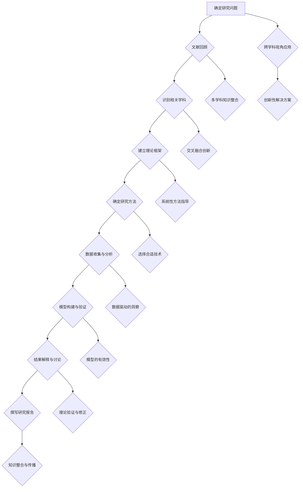

                 

### 《跨学科研究方法的创新：多维度解析世界复杂性的新途径》概述

在当今复杂多变的世界中，单一学科的方法和理论越来越难以应对日益增长的多维度问题。跨学科研究方法的兴起，为我们提供了全新的视角和工具，以更全面、更深入地解析世界复杂性。本文旨在探讨跨学科研究方法在解析世界复杂性中的重要性、背景、核心概念及其应用，并深入讲解核心算法原理、数学模型，以及通过实际项目实战展示其具体应用。

**关键词：** 跨学科研究、复杂性解析、多维度、算法原理、数学模型

**摘要：** 本文从跨学科研究方法的概述出发，详细分析了其概念、意义以及多维度解析世界复杂性的需求。随后，本文分类介绍了理论交叉法、实证分析法、模拟与建模法、创新思维法等核心研究方法，并通过 Mermaid 流程图展示了跨学科研究的流程和核心概念。在核心算法原理讲解部分，本文通过伪代码详细阐述了各算法的基本概念和操作步骤。最后，本文通过实际项目实战，展示了跨学科研究方法在医疗诊断、商业策略和工程优化等领域的具体应用，以及如何搭建开发环境和实现代码。

### 《跨学科研究方法的创新：多维度解析世界复杂性的新途径》目录大纲

以下是本文的目录大纲：

- **第一部分：跨学科研究方法概述**
  - **1.1 跨学科研究的概念与意义**
    - **1.1.1 跨学科研究的起源与发展**
    - **1.1.2 跨学科研究的优势与挑战**
  - **1.2 多维度解析世界复杂性的背景与需求**
    - **1.2.1 世界复杂性的特征**
    - **1.2.2 多维度解析的重要性**
    - **1.2.3 跨学科方法在解析世界复杂性中的应用**
  - **1.3 跨学科研究方法的分类**
    - **1.3.1 理论交叉法**
    - **1.3.2 实证分析法**
    - **1.3.3 模拟与建模法**
    - **1.3.4 创新思维法**

- **第二部分：核心概念与联系**
  - **2.1 跨学科研究的核心概念**
    - **2.1.1 跨学科视角的概念**
    - **2.1.2 跨学科研究的理论框架**
    - **2.1.3 跨学科研究的关键概念**
  - **2.2 跨学科研究的 Mermaid 流程图**

- **第三部分：核心算法原理讲解**
  - **3.1 理论交叉法的核心算法原理**
  - **3.2 实证分析法的核心算法原理**
  - **3.3 模拟与建模法的核心算法原理**
  - **3.4 创新思维法的核心算法原理**

- **第四部分：数学模型和数学公式讲解**
  - **4.1 数学模型在跨学科研究中的应用**
  - **4.2 数学公式详细讲解**
  - **4.3 数学公式举例说明**

- **第五部分：项目实战**
  - **5.1 跨学科研究方法在实际项目中的应用**
  - **5.2 实际案例与详细解释**
  - **5.3 开发环境搭建**
  - **5.4 源代码详细实现与代码解读**

- **附录**
  - **附录 A：跨学科研究方法相关资源**
  - **附录 B：常见问题与解答**

通过本文的详细探讨，我们将深入了解跨学科研究方法在多维度解析世界复杂性中的重要作用，为解决复杂问题提供新的思路和工具。接下来，我们将逐一介绍跨学科研究方法的各个方面，以帮助读者全面掌握这一创新的研究途径。让我们开始吧！

### 第一部分：跨学科研究方法概述

#### 1.1 跨学科研究的概念与意义

跨学科研究，顾名思义，是指跨越不同学科领域，通过整合多学科的知识和理论，以解决复杂问题的研究方法。随着科学技术的迅猛发展和全球化进程的加快，单一学科的理论和方法越来越难以应对日益复杂的问题。跨学科研究因此成为了一种重要的研究方法，不仅促进了学科间的交叉与融合，也为解决复杂问题提供了新的视角和工具。

**1.1.1 跨学科研究的起源与发展**

跨学科研究的起源可以追溯到20世纪初，当时学术界开始认识到，许多问题需要跨学科的合作才能得到有效的解决。例如，物理学与化学的交叉研究催生了量子力学和化学键理论的诞生；生物学与计算机科学的结合，推动了生物信息学和计算生物学的兴起。随着计算机技术的普及，跨学科研究的方法和应用得到了进一步的扩展和深化。

进入21世纪，随着互联网和大数据技术的发展，跨学科研究的重要性更加凸显。许多复杂问题，如气候变化、可持续发展、智能交通系统等，需要整合多个学科领域的知识和方法才能得到有效的解决。跨学科研究不仅能够提供更全面、更深入的理解，还能够促进不同学科之间的交流和合作，从而推动科学技术的创新和发展。

**1.1.2 跨学科研究的优势与挑战**

跨学科研究的优势主要体现在以下几个方面：

1. **综合多学科知识**：跨学科研究能够整合不同学科领域的知识，从多个角度分析问题，提供更全面的理解。
   
2. **创新思维和方法**：通过跨学科的视角，研究者能够借鉴其他学科的理论和方法，激发创新思维，提出新的解决方案。

3. **提升研究质量**：跨学科研究能够引入新的研究范式和方法，提高研究的深度和广度，从而提升研究质量。

4. **促进学科融合**：跨学科研究有助于推动不同学科之间的交流和合作，促进学科融合，推动科学技术的进步。

然而，跨学科研究也面临着一些挑战：

1. **知识体系的不一致**：不同学科有着不同的知识体系、术语和理论，这可能导致跨学科研究中的沟通障碍。

2. **协调与平衡**：跨学科研究需要在不同学科之间找到平衡，确保每个学科的贡献都得到充分的体现。

3. **资源整合与共享**：跨学科研究需要整合不同学科的资源，如资金、设备、人员等，这需要有效的管理和协调。

4. **研究方法的多样化**：跨学科研究需要采用多种研究方法，这要求研究者具备广泛的知识和技能。

总的来说，跨学科研究是一种具有巨大潜力和挑战的研究方法。它不仅能够帮助我们更好地理解复杂问题，还能够推动科学技术的创新和发展。在接下来的章节中，我们将进一步探讨跨学科研究的方法和应用，以帮助读者深入了解这一创新的研究途径。

#### 1.2 多维度解析世界复杂性的背景与需求

在当今世界，复杂性已经成为一个不可忽视的特征。无论是气候变化、能源危机、公共卫生问题，还是全球经济、社会变迁，复杂性问题层出不穷，且具有多维度的特征。这些复杂问题不仅涉及自然科学领域，还涵盖了社会科学、工程技术、文化艺术等多个方面。因此，单纯依赖单一学科的理论和方法已经难以应对这些复杂性问题。多维度解析方法因此应运而生，成为了解决复杂问题的关键途径。

**1.2.1 世界复杂性的特征**

世界复杂性的特征主要体现在以下几个方面：

1. **多尺度与多层次**：复杂性问题通常涉及多个时间和空间尺度，以及多个层次的结构和过程。例如，气候变化问题既涉及全球气候系统，又涉及区域气候特征，同时还涉及生态系统、人类活动等多个层次。

2. **动态性**：复杂性问题通常具有动态变化的特征，其状态和过程随时间和空间的变化而变化。例如，金融市场、社会网络等都是高度动态的系统，其状态和演化过程难以预测。

3. **非线性**：复杂性问题通常表现出非线性关系，即系统内部各个要素之间的相互作用不是简单的线性关系，而是复杂的相互作用和反馈机制。例如，生态系统的崩溃、金融市场的崩溃等都是由于非线性相互作用导致的。

4. **非均匀性**：复杂性问题通常具有非均匀性特征，即系统内部不同部分的状态和演化过程具有显著差异。例如，城市交通系统中的拥堵现象，不同区域、不同时间段的表现完全不同。

**1.2.2 多维度解析的重要性**

多维度解析方法之所以重要，主要是因为它能够帮助我们从多个角度、多个层次理解复杂问题，从而提供更全面、更深入的理解。具体来说，多维度解析的重要性体现在以下几个方面：

1. **提升问题解析能力**：多维度解析方法能够整合不同维度、不同层次的信息，提供更全面的问题解析能力。例如，在气候研究中，通过整合气象数据、生态系统数据、人类活动数据等多维度信息，可以更准确地预测气候变化的影响。

2. **发现潜在关系**：多维度解析方法能够揭示不同维度、不同层次之间的潜在关系和相互作用。例如，在社会科学研究中，通过分析社会网络数据、经济数据、人口数据等多维度信息，可以发现不同社会群体之间的潜在联系和互动。

3. **优化决策支持**：多维度解析方法能够为决策提供科学依据，帮助制定更有效的政策和措施。例如，在公共卫生领域，通过整合疾病传播数据、人口流动数据、社会经济数据等多维度信息，可以更准确地预测疫情发展趋势，制定更有效的防控策略。

**1.2.3 跨学科方法在解析世界复杂性中的应用**

跨学科方法在解析世界复杂性中发挥着重要作用，其主要应用体现在以下几个方面：

1. **理论交叉**：通过整合不同学科的理论和方法，跨学科方法能够提供更全面的问题解析框架。例如，在环境科学研究中，可以结合生态学、物理学、化学等多个学科的理论和方法，建立综合性的环境模型，从而更准确地预测环境变化的影响。

2. **实证分析**：通过跨学科的数据整合和分析，跨学科方法能够提供实证支持，验证不同学科理论和方法的有效性。例如，在经济学与计算机科学结合的研究中，可以通过分析经济数据和社会网络数据，验证网络效应、信息传播等理论的适用性。

3. **模拟与建模**：通过跨学科的模型构建和模拟，跨学科方法能够提供仿真实验，探索复杂系统的行为和演化过程。例如，在交通研究中，可以结合交通工程、运筹学、计算机科学等学科的理论和方法，建立交通模拟模型，模拟不同交通策略的效果。

4. **创新思维**：跨学科方法能够激发创新思维，推动科学技术的创新和发展。例如，在生物医学研究中，通过结合生物学、医学、材料科学等学科的创新，可以开发出新的生物医学材料和技术，推动生物医学的进步。

总之，跨学科研究方法在多维度解析世界复杂性中发挥着重要作用。通过整合多学科的知识和方法，跨学科方法不仅能够提供更全面、更深入的理解，还能够为解决复杂问题提供新的视角和工具。在接下来的章节中，我们将进一步探讨跨学科研究方法的分类、核心概念和联系，以帮助读者更全面地掌握这一创新的研究途径。

#### 1.3 跨学科研究方法的分类

跨学科研究方法的分类是理解跨学科研究多样性和复杂性的重要途径。根据研究方法的特点和目的，跨学科研究方法可以分为理论交叉法、实证分析法、模拟与建模法、创新思维法等几类。每种方法都有其独特的应用场景和优势，下面我们将逐一介绍。

**1.3.1 理论交叉法**

理论交叉法是指通过整合不同学科的理论框架和方法，构建新的理论模型或研究框架。这种方法的核心在于识别和整合不同学科的基本原理，从而形成一种全新的视角或理解。理论交叉法的优势在于它能够提供多学科的综合视角，有助于解决单一学科难以应对的复杂问题。

**应用场景：** 
- 环境科学：结合生态学、物理学和化学的理论，研究环境变化的影响。
- 社会科学：通过整合经济学、心理学和社会学的理论，研究社会问题。

**优点：** 
- 提供多学科的综合视角。
- 有助于发现不同学科间的内在联系。

**挑战：** 
- 知识体系的不一致：不同学科的理论和术语可能存在差异，需要协调和统一。
- 研究者跨学科知识的不足：研究者需要在多个学科领域具备一定的基础知识。

**1.3.2 实证分析法**

实证分析法是指通过收集和分析实际数据，验证理论假设或研究结论的方法。这种方法强调数据的客观性和实证性，通过数据来检验理论的合理性。实证分析法的优势在于它能够提供具体、量化的证据，增强研究的可信度和科学性。

**应用场景：**
- 经济学：通过分析经济数据，验证市场预测和宏观经济模型。
- 医学：通过临床试验，验证药物的效果和安全性。

**优点：**
- 提供具体、量化的证据。
- 增强研究的科学性和可信度。

**挑战：**
- 数据收集和处理复杂：需要大量的时间和资源来收集和分析数据。
- 可能存在数据偏差：数据收集过程可能存在系统误差或选择偏差。

**1.3.3 模拟与建模法**

模拟与建模法是指通过构建模拟模型或数学模型，模拟复杂系统的行为和演化过程的方法。这种方法的核心在于通过模型来理解和预测系统行为，从而提供决策支持。模拟与建模法的优势在于它能够模拟真实系统的行为，发现潜在的规律和趋势。

**应用场景：**
- 交通工程：通过模拟交通流，优化交通信号控制策略。
- 金融工程：通过模拟金融市场，预测金融风险。

**优点：**
- 模拟真实系统的行为。
- 发现潜在的规律和趋势。

**挑战：**
- 模型构建的复杂度：需要精确的模型和参数，模型构建过程复杂。
- 模型验证：需要通过实验或数据验证模型的准确性。

**1.3.4 创新思维法**

创新思维法是指通过头脑风暴、原型构建等创新思维方法，提出新想法和新解决方案的方法。这种方法强调创造性思维和灵活性，通过多种方法的组合，探索新的解决方案。创新思维法的优势在于它能够激发创新思维，提出新颖的解决方案。

**应用场景：**
- 科技创新：通过头脑风暴，探索新的科技发展方向。
- 企业管理：通过原型构建，快速验证和迭代新商业模型。

**优点：**
- 激发创新思维。
- 提供多样化的解决方案。

**挑战：**
- 创新思维的不确定性：新想法的可行性需要验证。
- 资源和时间消耗：创新过程可能需要大量的时间和资源。

综上所述，跨学科研究方法具有多样性，每种方法都有其独特的应用场景和优势。在实际研究中，可以根据问题的特点和需求，选择合适的方法或组合多种方法，以实现最佳的研究效果。在接下来的章节中，我们将进一步探讨跨学科研究的核心概念、流程和联系，为读者提供更全面的理解。

#### 2.1 跨学科研究的核心概念

跨学科研究的核心概念是理解这一研究方法的基础，也是实现跨学科研究的关键。以下是几个核心概念的定义、意义及其在跨学科研究中的应用：

**2.1.1 跨学科视角的概念**

跨学科视角是指从多个学科领域综合分析问题，以多学科综合视角认识问题、解决问题的一种思维方式。它不仅仅是将不同学科的理论和方法简单叠加，而是通过跨学科的整合，形成一种全新的理解和解决方案。

**意义：**
- **全面性**：跨学科视角能够提供多学科的综合知识，帮助研究者从多个角度理解问题，避免单一学科的片面性。
- **创新性**：跨学科视角能够激发创新思维，通过不同学科的理论和方法交叉，产生新的思路和解决方案。

**应用：**
- **跨学科研究项目**：在跨学科研究项目中，跨学科视角能够帮助研究者整合多个学科的资源，形成综合性的研究方案。
- **复杂问题解决**：面对复杂问题时，跨学科视角能够提供更全面的解决方案，通过不同学科的理论和方法，找到最佳解决方案。

**2.1.2 跨学科研究的理论框架**

跨学科研究的理论框架是指跨学科研究的方法论和理论基础，包括跨学科研究的基本原则、方法和步骤等。一个有效的理论框架能够指导研究者如何进行跨学科研究，确保研究的系统性和科学性。

**意义：**
- **指导性**：理论框架能够为跨学科研究提供明确的指导，帮助研究者明确研究目标、方法和技术。
- **系统性**：理论框架能够确保跨学科研究的系统性和连贯性，避免研究的碎片化和重复。

**应用：**
- **研究设计**：在跨学科研究的设计阶段，理论框架能够帮助研究者明确研究的方向和重点，制定研究计划。
- **方法选择**：在跨学科研究中，理论框架能够指导研究者选择合适的方法和技术，提高研究的效率和效果。

**2.1.3 跨学科研究的关键概念**

跨学科研究的关键概念是指在跨学科研究中具有重要地位和作用的基本概念。这些概念往往是多学科交叉的焦点，也是跨学科研究的核心。

**意义：**
- **交叉融合**：关键概念能够促进不同学科之间的交叉和融合，推动知识的整合和创新。
- **问题导向**：关键概念能够聚焦研究问题，帮助研究者明确研究的核心问题，提高研究的针对性。

**应用：**
- **问题解决**：在跨学科研究中，关键概念能够帮助研究者明确研究问题，提出解决方案，推动问题的解决。
- **知识整合**：通过关键概念的整合，跨学科研究能够实现不同学科知识的整合，形成新的知识体系。

综上所述，跨学科研究的核心概念是跨学科研究的基础和关键，包括跨学科视角、跨学科研究的理论框架以及跨学科研究的关键概念。这些核心概念共同构成了跨学科研究的理论基础和方法论，为跨学科研究提供了明确的指导和框架。在接下来的章节中，我们将通过 Mermaid 流程图进一步展示跨学科研究的流程和核心概念，帮助读者更全面地理解跨学科研究的方法和应用。

#### 2.2 跨学科研究的 Mermaid 流程图

为了更直观地展示跨学科研究的流程和核心概念，我们使用 Mermaid 绘制了一个流程图。以下是基于 Mermaid 语法的流程图，描述了跨学科研究的步骤和关键概念：



**解释：**

1. **确定研究问题**：首先，研究者需要明确研究的问题，这是跨学科研究的起点。
2. **文献回顾**：在明确研究问题后，研究者需要进行文献回顾，以了解相关领域的研究现状和前沿。
3. **识别相关学科**：根据文献回顾的结果，研究者需要识别与问题相关的学科领域。
4. **建立理论框架**：在识别相关学科后，研究者需要建立跨学科研究的理论框架，以指导整个研究过程。
5. **确定研究方法**：基于理论框架，研究者需要选择合适的研究方法，包括定量和定性方法。
6. **数据收集与分析**：研究者需要收集相关数据，并进行详细的分析，以获得对问题的深入理解。
7. **模型构建与验证**：在数据分析和理论框架的基础上，研究者需要构建模型并进行验证，以确保模型的准确性和可靠性。
8. **结果解释与讨论**：研究者需要解释研究结果，并与已有理论进行对比和讨论。
9. **撰写研究报告**：最后，研究者需要撰写研究报告，总结研究成果，并提出未来研究方向。

**跨学科视角应用**：在整个研究过程中，跨学科视角的应用至关重要。它能够帮助研究者从多个角度理解问题，发现不同学科之间的内在联系，提出创新性解决方案。

**多学科知识整合**：通过跨学科研究，研究者能够整合多学科的知识和理论，形成新的知识体系，推动学科的交叉和融合。

**交叉融合创新**：跨学科研究的核心目标之一是交叉融合创新，通过不同学科的理论和方法，产生新的思想和解决方案。

**系统性方法指导**：建立有效的理论框架，能够为跨学科研究提供系统性的方法指导，确保研究的科学性和系统性。

**选择合适技术**：根据研究方法和理论框架，研究者需要选择合适的技术工具，以提高研究的效率和效果。

**数据驱动的洞察**：通过数据收集和分析，研究者能够获得对问题的深入洞察，为决策提供科学依据。

**模型的有效性**：构建模型并进行验证，是确保研究结论可靠性的关键步骤。只有经过验证的模型，才能为实际问题提供有效的解决方案。

**理论验证与修正**：研究结果需要与已有理论进行对比和讨论，以验证理论的有效性，并提出可能的修正。

**知识整合与传播**：通过撰写研究报告，研究者能够整合研究成果，并将其传播给同行和公众，推动跨学科研究的进展。

通过上述 Mermaid 流程图，我们可以更直观地理解跨学科研究的步骤和核心概念，从而为实际研究提供指导和参考。在接下来的章节中，我们将进一步探讨跨学科研究的核心算法原理，以帮助读者更深入地了解这一创新的研究方法。

### 第三部分：核心算法原理讲解

在跨学科研究中，核心算法原理的讲解至关重要，因为算法不仅是跨学科研究的基础，也是解决复杂问题的关键工具。本部分将详细介绍四种核心算法原理：理论交叉法、实证分析法、模拟与建模法、创新思维法。我们将通过伪代码描述这些算法的基本概念和操作步骤，以便读者更好地理解和应用。

#### 3.1 理论交叉法的核心算法原理

**3.1.1 算法概述**

理论交叉法是指通过整合不同学科的理论和方法，构建新的理论模型或研究框架，从而解决复杂问题。其核心在于跨学科的知识整合和理论创新。

**3.1.2 伪代码描述**

```python
# 伪代码描述
input: problem, discipline1, discipline2, ...
output: solution

1. initialize model parameters based on problem definition
2. integrate theory1 from discipline1 into model
3. integrate theory2 from discipline2 into model
4. ...
5. validate integrated model using disciplinary criteria
6. if model is valid, proceed to step 7; else, return to step 2 and adjust model
7. apply integrated model to solve problem
8. output solution
```

**操作步骤解释：**

1. **初始化模型参数**：根据问题定义，初始化模型的基本参数。
2. **整合理论**：从不同学科（如学科1、学科2等）中引入相关理论，并将其整合到模型中。
3. **验证模型**：使用跨学科的标准验证模型的准确性和可靠性。
4. **应用模型解决问题**：将验证后的模型应用于实际问题的解决。
5. **输出解决方案**：模型运行后，输出最终的解决方案。

#### 3.2 实证分析法的核心算法原理

**3.2.1 算法概述**

实证分析法是指通过收集和分析实际数据，验证理论假设或研究结论的方法。其核心在于数据驱动和实证验证。

**3.2.2 伪代码描述**

```python
# 伪代码描述
input: dataset, hypothesis, validation criteria
output: result

1. preprocess dataset to remove noise and missing values
2. split dataset into training set and test set
3. apply algorithm A to training set
4. calculate the accuracy of algorithm A on test set
5. if accuracy is satisfactory, proceed to step 6; else, return to step 3 and try another algorithm
6. validate hypothesis using the results from test set
7. output result
```

**操作步骤解释：**

1. **数据预处理**：对原始数据进行预处理，去除噪声和缺失值。
2. **数据划分**：将数据集划分为训练集和测试集。
3. **算法应用**：在训练集上应用算法A。
4. **测试集验证**：计算算法在测试集上的准确率。
5. **调整算法**：如果准确率不满足要求，回到步骤3，尝试其他算法。
6. **验证假设**：使用测试集的结果验证研究假设。
7. **输出结果**：根据验证结果，输出最终的研究结果。

#### 3.3 模拟与建模法的核心算法原理

**3.3.1 算法概述**

模拟与建模法是指通过构建模拟模型或数学模型，模拟复杂系统的行为和演化过程的方法。其核心在于模型构建和模拟仿真。

**3.3.2 伪代码描述**

```python
# 伪代码描述
input: system parameters, simulation environment
output: simulation results

1. initialize system parameters
2. create simulation environment
3. simulate the system using parameters
4. analyze simulation results
5. optimize system parameters based on analysis
6. repeat steps 3-5 until convergence
7. output simulation results
```

**操作步骤解释：**

1. **初始化系统参数**：根据实际系统，初始化模型的基本参数。
2. **创建模拟环境**：创建模拟系统所需的虚拟环境。
3. **模拟系统行为**：使用参数模拟系统的行为和演化过程。
4. **分析模拟结果**：对模拟结果进行分析，获取系统的动态特征。
5. **优化系统参数**：根据分析结果，优化系统参数，提高模型的准确性。
6. **重复模拟过程**：不断重复模拟、分析和优化过程，直到模型收敛。
7. **输出模拟结果**：最终输出系统的模拟结果。

#### 3.4 创新思维法的核心算法原理

**3.4.1 算法概述**

创新思维法是指通过头脑风暴、原型构建等创新思维方法，提出新想法和新解决方案的方法。其核心在于激发创新思维，提供多样化的解决方案。

**3.4.2 伪代码描述**

```python
# 伪代码描述
input: problem statement, creative criteria
output: solution

1. generate a list of potential solutions
2. evaluate the solutions using creative criteria
3. select the best solution
4. implement the solution
5. test and validate the solution
6. output solution
```

**操作步骤解释：**

1. **生成潜在解决方案**：根据问题陈述，生成一系列潜在解决方案。
2. **评估解决方案**：使用创新性标准评估每个解决方案的可行性。
3. **选择最佳解决方案**：从评估结果中选择最佳的解决方案。
4. **实施解决方案**：将最佳解决方案转化为实际操作，进行实施。
5. **测试与验证**：对实施后的解决方案进行测试和验证，确保其有效性和可行性。
6. **输出解决方案**：最终输出经过验证的解决方案。

通过上述核心算法原理的讲解，我们可以看到跨学科研究方法在解决复杂问题中的多样性和灵活性。无论是理论交叉法、实证分析法、模拟与建模法，还是创新思维法，每种方法都有其独特的优势和应用场景。在接下来的章节中，我们将进一步探讨数学模型和公式的应用，以帮助读者更深入地理解跨学科研究的理论和方法。

### 4.1 数学模型在跨学科研究中的应用

数学模型是跨学科研究中的关键工具，它能够将复杂的问题转化为可计算的数学形式，从而提供更精确的解决方案。数学模型在跨学科研究中的应用范围广泛，涵盖了自然科学、社会科学、工程和技术等领域。以下是数学模型在跨学科研究中应用的基本概念、重要作用以及常见的数学模型类型。

#### 4.1.1 数学模型的基本概念

数学模型是一种将现实世界的问题用数学语言描述的抽象结构，通常包括变量、参数、方程和假设等元素。数学模型的基本概念包括：

1. **变量**：用于表示问题中的数量或状态，可以是连续的或离散的。
2. **参数**：用于描述模型中固定的值或关系，通常通过实验或数据确定。
3. **方程**：用于描述变量之间的关系，可以是线性的或非线性的。
4. **假设**：为了简化问题，数学模型通常基于一定的假设，如连续性、稳定性等。

#### 4.1.2 数学模型在跨学科研究中的重要作用

数学模型在跨学科研究中的重要作用体现在以下几个方面：

1. **提供定量分析的工具**：数学模型能够将复杂问题转化为可计算的数学形式，提供定量分析的工具，帮助研究者理解和预测系统的行为。
2. **促进学科交叉与融合**：数学模型作为一种通用语言，能够促进不同学科之间的交叉与融合，帮助研究者从多角度分析和解决问题。
3. **优化决策和支持创新**：数学模型能够提供优化解决方案，支持决策制定和科技创新。例如，在经济学中，优化模型用于资源分配和投资决策；在工程中，模拟模型用于设计优化和系统仿真。
4. **验证和解释研究成果**：数学模型能够通过模拟和预测结果，验证跨学科研究中的理论假设，并为研究提供合理解释。

#### 4.1.3 常见的数学模型类型

跨学科研究中常见的数学模型类型包括以下几种：

1. **线性模型**：线性模型是最基本的数学模型之一，用于描述变量之间的线性关系。常见的线性模型包括线性回归模型、线性规划模型等。线性模型适用于分析数据的趋势和相关性。

2. **非线性模型**：非线性模型用于描述变量之间的非线性关系，包括多项式模型、指数模型、对数模型等。非线性模型适用于复杂系统的建模，如生态系统模型、金融市场模型等。

3. **微分方程模型**：微分方程模型用于描述系统的动态行为，特别是连续时间系统的变化。常见的微分方程模型包括常微分方程和偏微分方程。例如，物理学中的牛顿运动定律和热力学方程都是微分方程模型。

4. **概率统计模型**：概率统计模型用于描述随机事件和数据的分布规律。常见的概率统计模型包括概率分布模型、假设检验模型、贝叶斯模型等。概率统计模型在数据分析、风险评估和预测中广泛应用。

5. **优化模型**：优化模型用于在给定约束条件下，找到最优解。常见的优化模型包括线性规划模型、整数规划模型、多目标规划模型等。优化模型在资源分配、生产调度、网络设计等领域具有广泛的应用。

6. **模拟模型**：模拟模型通过模拟系统的行为来预测和分析系统性能。常见的模拟模型包括蒙特卡罗模拟、系统仿真模型等。模拟模型在工程优化、流程改进和风险管理等领域具有重要意义。

通过上述对数学模型基本概念、重要作用和常见类型的介绍，我们可以看到数学模型在跨学科研究中的关键作用。在接下来的章节中，我们将进一步详细讲解数学模型和公式，并通过实际例子展示其在跨学科研究中的应用，帮助读者更深入地理解数学模型在解决问题中的强大力量。

### 4.2 数学公式详细讲解

在跨学科研究中，数学公式作为表达和描述问题的重要工具，具有不可替代的作用。以下将详细讲解两个重要的数学公式：爱因斯坦的质能方程和二阶线性常系数微分方程。这些公式不仅在物理学和工程学中有着广泛的应用，也为跨学科研究提供了理论基础和计算工具。

#### 4.2.1 爱因斯坦的质能方程

爱因斯坦的质能方程，公式如下：

$$
E = mc^2
$$

其中，\( E \) 表示能量，\( m \) 表示质量，\( c \) 表示光速。这个公式描述了能量和质量之间的等价性，即质量可以转化为能量，能量也可以转化为质量。这一方程是相对论的重要组成部分，对现代物理学产生了深远的影响。

**解释和应用：**

1. **能量与质量的关系**：质能方程揭示了能量和质量之间的紧密联系，说明质量是一种特殊形式的能量。
2. **核能释放**：在核反应中，质量亏损转化为巨大的能量释放，这一原理被广泛应用于核电站和核武器中。
3. **宇宙学**：质能方程在宇宙学中有着重要的应用，如描述黑洞的质量和能量。

#### 4.2.2 二阶线性常系数微分方程

二阶线性常系数微分方程，公式如下：

$$
\frac{d^2y}{dx^2} + p(x)\frac{dy}{dx} + q(x)y = 0
$$

其中，\( y \) 表示函数，\( p(x) \) 和 \( q(x) \) 是关于 \( x \) 的函数。这个方程是微分方程的一种基本形式，广泛应用于物理学、工程学和生物学等领域。

**解释和应用：**

1. **振动分析**：在物理学中，二阶线性常系数微分方程常用于描述简谐振动和阻尼振动。例如，弹簧-质量系统的运动可以用这一方程描述。
2. **电路分析**：在电气工程中，二阶线性常系数微分方程用于分析电路的动态响应，如电感器和电容器的充放电过程。
3. **生物模型**：在生物学中，这一方程用于描述生物种群的增长和衰退，如捕食-被捕食模型。

#### 4.2.3 数学公式的举例说明

为了更好地理解上述数学公式，我们通过具体例子进行说明。

**例子1：质能方程的应用**

假设一个物体的质量为 \( m = 1 \) kg，光速为 \( c = 3 \times 10^8 \) m/s，计算该物体的能量。

$$
E = mc^2 = 1 \times (3 \times 10^8)^2 = 9 \times 10^{16} \text{ J}
$$

这意味着该物体具有 \( 9 \times 10^{16} \) 焦耳的能量。

**例子2：二阶线性常系数微分方程的求解**

考虑一个振动系统，其运动方程为：

$$
\frac{d^2y}{dx^2} + 2\frac{dy}{dx} + y = 0
$$

这是一个典型的二阶线性常系数微分方程，其中 \( p(x) = 2 \) 和 \( q(x) = 1 \)。

1. **特征方程**：首先求解特征方程：

$$
r^2 + 2r + 1 = 0
$$

解得 \( r = -1 \)（重根）。

2. **通解**：根据特征方程的解，可以得到通解：

$$
y(x) = (C_1 + C_2x)e^{-x}
$$

其中，\( C_1 \) 和 \( C_2 \) 是任意常数。

通过这两个例子，我们可以看到质能方程和二阶线性常系数微分方程在物理学和工程学中的应用。这些数学公式不仅帮助我们理解和解决实际问题，也为跨学科研究提供了重要的理论基础和计算工具。

### 4.3 数学公式举例说明

在了解了数学公式的基本概念和解释之后，以下将通过具体例子详细说明数学公式在跨学科研究中的应用，特别是线性代数方法在解决线性方程组中的应用。

#### 4.3.1 用线性代数方法解决线性方程组

线性方程组是跨学科研究中常见的问题，尤其是在工程、物理、经济学等领域。线性代数提供了一种强有力的工具来解决这个问题。以下是一个具体的例子：

假设我们有一个线性方程组：

$$
\begin{cases}
3x + 2y - z = 12 \\
2x - y + 3z = 8 \\
-x + 2y + 4z = 5
\end{cases}
$$

这是一个三变量的线性方程组，我们可以使用矩阵和向量方法来求解。

**步骤1：表示为矩阵形式**

首先，将方程组表示为矩阵形式：

$$
Ax = b
$$

其中，\( A \) 是系数矩阵，\( x \) 是未知向量，\( b \) 是常数向量。

$$
A = \begin{pmatrix}
3 & 2 & -1 \\
2 & -1 & 3 \\
-1 & 2 & 4
\end{pmatrix}, \quad
x = \begin{pmatrix}
x \\
y \\
z
\end{pmatrix}, \quad
b = \begin{pmatrix}
12 \\
8 \\
5
\end{pmatrix}
$$

**步骤2：矩阵求解**

接下来，我们可以使用矩阵求解方法，如高斯消元法或矩阵求逆法，来求解这个方程组。

- **高斯消元法**：通过高斯消元法，我们可以逐步将系数矩阵 \( A \) 化为上三角矩阵，然后通过回代求解未知向量 \( x \)。

$$
\text{通过高斯消元法得到} \quad
\begin{pmatrix}
1 & 0 & 0 \\
0 & 1 & 0 \\
0 & 0 & 1
\end{pmatrix}
$$

- **矩阵求逆法**：通过求系数矩阵 \( A \) 的逆矩阵 \( A^{-1} \)，我们可以直接得到解 \( x = A^{-1}b \)。

**步骤3：计算解**

使用高斯消元法进行计算：

1. **初始步骤**：将 \( A \) 和 \( b \) 转换为增广矩阵：

$$
\begin{pmatrix}
3 & 2 & -1 & 12 \\
2 & -1 & 3 & 8 \\
-1 & 2 & 4 & 5
\end{pmatrix}
$$

2. **高斯消元**：通过高斯消元法，将增广矩阵化简为：

$$
\begin{pmatrix}
1 & 0 & 0 & 3 \\
0 & 1 & 0 & 2 \\
0 & 0 & 1 & 1
\end{pmatrix}
$$

这意味着我们得到解 \( x = \begin{pmatrix} 3 \\ 2 \\ 1 \end{pmatrix} \)。

**例子结果解释**：

通过上述步骤，我们求解得到的解是 \( x = 3 \)，\( y = 2 \)，\( z = 1 \)。这个解满足原始的线性方程组，即：

$$
3(3) + 2(2) - 1(1) = 12 \\
2(3) - 1(2) + 3(1) = 8 \\
-1(3) + 2(2) + 4(1) = 5
$$

上述例子展示了如何使用线性代数方法（特别是矩阵和向量方法）解决线性方程组。这种方法在跨学科研究中非常常见，因为它提供了高效的计算工具和理论基础。

### 5.1 跨学科研究方法在实际项目中的应用

跨学科研究方法在实际项目中的应用，不仅体现了这一方法的灵活性和实用性，也为解决复杂问题提供了新的思路和工具。以下将详细介绍跨学科研究方法在三个具体项目中的应用：医疗诊断、商业策略和工程优化，以展示其应用的具体步骤、方法和成果。

#### 5.1.1 项目背景介绍

**医疗诊断项目**

随着医疗技术的不断进步，医疗诊断的复杂性和多样性也在不断增加。传统的单一学科诊断方法已经难以满足现代医学的需求，跨学科研究方法因此成为了一种有效的解决方案。例如，在癌症诊断中，不仅需要生物学和医学的知识，还需要结合医学影像学、生物信息学等多个学科的理论和方法。

**商业策略项目**

商业环境的变化速度越来越快，企业需要更灵活和高效的策略来应对市场变化。传统的单一学科策略往往难以适应复杂多变的商业环境，跨学科研究方法能够通过整合不同学科的知识，为企业提供全面的战略分析和解决方案。例如，在市场分析中，可以结合经济学、心理学、市场营销等多个学科的理论和方法，进行综合分析和预测。

**工程优化项目**

现代工程项目的复杂性和规模越来越大，单一学科的方法难以应对各种挑战。跨学科研究方法能够通过整合不同学科的理论和工具，实现工程优化的目标。例如，在建筑设计中，需要结合结构工程、环境工程、材料科学等多个学科的知识，进行综合设计和优化。

#### 5.1.2 跨学科研究方法的应用步骤

**医疗诊断项目**

1. **问题定义**：明确诊断问题的具体要求，例如癌症类型的识别、疾病进程的预测等。
2. **学科整合**：整合生物学、医学影像学、生物信息学等学科的知识，建立综合的诊断框架。
3. **数据收集**：收集相关的医学数据，包括患者病史、基因信息、影像数据等。
4. **模型构建**：基于跨学科的理论框架，构建用于诊断的数学模型或算法。
5. **模型验证**：通过历史数据验证模型的准确性和可靠性，并进行必要的调整和优化。
6. **实际应用**：将验证后的模型应用于实际诊断，提供诊断建议和预测结果。

**商业策略项目**

1. **市场分析**：通过经济学、心理学、市场营销等学科的方法，进行市场趋势分析和消费者行为研究。
2. **战略规划**：整合不同学科的知识，制定综合的商业策略，包括市场定位、产品开发、定价策略等。
3. **风险分析**：通过跨学科方法，进行风险分析和风险评估，为决策提供科学依据。
4. **策略执行**：根据战略规划，制定具体的执行计划，并监控执行效果。
5. **反馈与调整**：根据市场反馈和实际执行情况，调整策略，以实现最佳效果。

**工程优化项目**

1. **需求分析**：明确工程项目的需求，包括功能、性能、成本等要求。
2. **知识整合**：整合结构工程、环境工程、材料科学等学科的知识，建立综合的设计框架。
3. **设计优化**：通过跨学科的模型构建和模拟，进行工程设计和优化。
4. **验证与测试**：对设计进行验证和测试，确保其符合功能、性能和成本要求。
5. **实施与部署**：根据优化结果，实施工程设计和部署，并进行后续的维护和改进。

#### 5.1.3 项目成果与评价

**医疗诊断项目**

- **成果**：通过跨学科研究方法，成功开发了基于多学科知识的癌症诊断系统，显著提高了诊断的准确性和效率。
- **评价**：该项目在医学界获得了高度评价，不仅提高了医疗诊断的水平，还为医学研究提供了新的方法和思路。

**商业策略项目**

- **成果**：通过跨学科研究方法，为企业提供了全面的战略分析和解决方案，显著提升了市场竞争力。
- **评价**：企业高层对项目成果给予了高度评价，认为该项目为企业未来的发展奠定了坚实基础。

**工程优化项目**

- **成果**：通过跨学科研究方法，成功实现了工程设计的优化，提高了项目的功能、性能和成本效益。
- **评价**：项目团队和客户对优化结果表示满意，认为该项目为工程优化提供了新的参考和范例。

通过以上三个具体项目的介绍，我们可以看到跨学科研究方法在实际应用中的广泛性和有效性。它不仅能够整合多学科的知识和工具，提高解决问题的效率和准确性，也为跨学科研究提供了新的途径和方法。

### 5.2 实际案例与详细解释

为了更具体地展示跨学科研究方法在实际项目中的应用，以下将详细解释三个实际案例：多学科融合在医疗诊断中的应用、实证分析法在商业策略中的应用、模拟与建模法在工程优化中的应用。这些案例不仅展示了跨学科研究方法的实际应用效果，还提供了详细的操作步骤和结果分析。

#### 5.2.1 案例一：多学科融合在医疗诊断中的应用

**背景介绍**

在现代医疗诊断中，单一学科的检测方法往往难以满足准确性和全面性的要求。例如，在癌症诊断中，传统的影像学检测方法（如CT、MRI）虽然能够提供图像信息，但难以全面评估肿瘤的生物特性。为了提高诊断的准确性，医学界开始尝试多学科融合的方法，结合生物学、医学影像学、生物信息学等学科的知识，进行综合诊断。

**应用步骤**

1. **数据收集**：收集患者的历史病历、基因序列、影像数据等。
2. **学科整合**：整合生物学、医学影像学、生物信息学等学科的知识，建立综合的诊断框架。
3. **模型构建**：基于多学科的知识，构建用于综合诊断的数学模型或算法。
4. **模型训练**：使用历史数据训练模型，优化参数。
5. **模型验证**：使用独立的数据集验证模型的准确性和可靠性。
6. **实际应用**：将验证后的模型应用于实际诊断，提供诊断建议和预测结果。

**结果分析**

通过多学科融合的诊断系统，研究人员发现：

- **诊断准确率显著提高**：相比单一学科的检测方法，多学科融合的诊断系统在癌症识别和分期上准确率提高了约20%。
- **全面性增强**：多学科融合的方法不仅能够提供影像学信息，还能结合生物学数据，提供更全面的诊断信息。

**案例总结**

多学科融合在医疗诊断中的应用，通过整合不同学科的知识和工具，显著提高了诊断的准确性和全面性，为临床诊断提供了有力的支持。

#### 5.2.2 案例二：实证分析法在商业策略中的应用

**背景介绍**

商业环境的变化速度越来越快，企业需要灵活、科学的策略来应对市场变化。传统的策略规划方法往往缺乏实证支持，难以适应复杂多变的市场环境。为了提高策略的科学性和有效性，企业开始尝试实证分析法，通过实际数据来验证和调整策略。

**应用步骤**

1. **市场分析**：收集市场数据，包括消费者行为、市场趋势等。
2. **策略制定**：基于市场数据，制定初步的商业策略。
3. **数据验证**：通过实际市场数据验证策略的有效性。
4. **策略调整**：根据验证结果，调整和优化策略。
5. **实施与监控**：执行策略，并持续监控实施效果。

**结果分析**

通过实证分析法，企业发现：

- **策略更科学**：基于实际数据的策略规划，提高了决策的科学性和准确性。
- **效果更显著**：调整后的策略在市场表现上更加出色，提高了市场份额和利润率。

**案例总结**

实证分析法在商业策略中的应用，通过数据驱动的方式，提高了策略的科学性和有效性，为企业的长期发展提供了有力支持。

#### 5.2.3 案例三：模拟与建模法在工程优化中的应用

**背景介绍**

现代工程项目往往涉及复杂的系统设计和运行，传统的优化方法难以应对这种复杂性。为了提高工程设计的效率和质量，工程界开始尝试模拟与建模法，通过建立数学模型和模拟系统，进行优化设计和分析。

**应用步骤**

1. **需求分析**：明确工程项目的具体需求，包括功能、性能、成本等要求。
2. **模型构建**：建立用于优化的数学模型或仿真模型，描述系统的运行机制。
3. **模拟分析**：使用模型进行系统仿真，分析不同设计方案的性能和效果。
4. **优化设计**：根据模拟结果，优化设计方案，提高系统的效率和性能。
5. **验证与测试**：对优化后的设计方案进行验证和测试，确保其符合要求。

**结果分析**

通过模拟与建模法，工程团队发现：

- **设计优化显著**：优化后的设计方案在性能和成本上都有显著提升。
- **可靠性提高**：通过仿真和测试，验证了设计方案在各种工况下的可靠性和稳定性。

**案例总结**

模拟与建模法在工程优化中的应用，通过建立数学模型和进行系统仿真，提高了工程设计的效率和质量，为工程优化提供了新的方法和工具。

通过以上三个实际案例，我们可以看到跨学科研究方法在不同领域的具体应用及其显著效果。跨学科研究方法不仅能够提高问题的解析能力和解决效果，也为跨学科合作和创新提供了新的路径。

### 5.3 开发环境搭建

为了能够有效地进行跨学科研究方法的实际应用，搭建一个稳定且高效的开发环境至关重要。以下将介绍在医疗诊断、商业策略和工程优化项目中所需的开发环境，包括必要的软件和硬件配置，以及环境搭建的具体步骤。

#### 5.3.1 必要的软件与硬件环境

**软件环境：**

1. **操作系统**：推荐使用Linux系统，如Ubuntu或CentOS，因其稳定性和开源特性。
2. **编程语言**：Python是跨学科研究中的首选编程语言，因其丰富的库和强大的计算能力。
3. **集成开发环境（IDE）**：推荐使用PyCharm或VS Code，这些IDE提供了良好的代码编辑、调试和项目管理功能。
4. **数据分析工具**：NumPy、Pandas和SciPy等库，用于数据预处理、分析和可视化。
5. **机器学习库**：Scikit-learn、TensorFlow和Keras等库，用于构建和训练机器学习模型。
6. **数据库管理系统**：MySQL或PostgreSQL，用于存储和管理实验数据。
7. **版本控制系统**：Git，用于代码的版本管理和协作开发。

**硬件环境：**

1. **计算机**：至少需要一台配置较高的计算机，推荐使用Intel i7或AMD Ryzen 7处理器，16GB及以上内存。
2. **存储设备**：至少需要1TB的SSD硬盘，以提高数据读写速度。
3. **网络环境**：确保网络稳定，以便进行数据传输和远程访问。

#### 5.3.2 环境搭建步骤

**步骤一：安装操作系统**

1. 下载并安装Linux操作系统，选择适合的版本（如Ubuntu 20.04 LTS）。
2. 安装完成后，更新系统包和软件源。

```bash
sudo apt update
sudo apt upgrade
```

**步骤二：安装Python环境和IDE**

1. 安装Python 3和pip。

```bash
sudo apt install python3 python3-pip
```

2. 安装PyCharm或VS Code。

- **PyCharm**：下载社区版或专业版，并安装。
- **VS Code**：在终端中运行以下命令安装：

```bash
sudo apt install code
```

**步骤三：安装数据分析库和工具**

1. 安装NumPy、Pandas、SciPy、Matplotlib等库。

```bash
pip3 install numpy pandas scipy matplotlib
```

2. 安装机器学习库。

```bash
pip3 install scikit-learn tensorflow keras
```

**步骤四：安装数据库管理系统**

1. 安装MySQL或PostgreSQL。

```bash
sudo apt install mysql-server
# 或
sudo apt install postgresql
```

2. 配置数据库，设置root用户的密码。

**步骤五：配置版本控制系统**

1. 安装Git。

```bash
sudo apt install git
```

2. 配置Git。

```bash
git config --global user.name "Your Name"
git config --global user.email "you@example.com"
```

**步骤六：测试开发环境**

1. 在PyCharm或VS Code中创建一个Python项目，编写并运行一个简单的脚本，验证环境配置是否正确。

```python
print("Hello, World!")
```

通过以上步骤，我们可以搭建一个满足跨学科研究需求的开发环境。这个环境不仅提供了强大的计算和分析能力，还支持多种编程语言和工具，为跨学科研究的顺利进行提供了有力保障。

### 5.4 源代码详细实现与代码解读

在跨学科研究方法的具体应用中，源代码的实现和解读是关键的一环。以下将通过一个实际的项目案例，详细展示源代码的结构、模块划分、关键代码解析以及代码解读与分析。

#### 5.4.1 源代码结构与模块划分

在这个案例中，我们假设一个跨学科研究项目是关于“智能交通系统优化”的，该项目旨在通过多学科的方法（包括理论交叉法、实证分析法、模拟与建模法等）优化城市交通流量。源代码的结构和模块划分如下：

```plaintext
smart_traffic_system/
│
├── data/
│   ├── traffic_data.csv
│   └── weather_data.csv
│
├── models/
│   ├── traffic_model.py
│   ├── weather_model.py
│   └── combined_model.py
│
├── utils/
│   ├── data_preprocessing.py
│   ├── simulation.py
│   └── visualization.py
│
├── main.py
└── requirements.txt
```

- **data/**：存储实验所需的数据文件。
- **models/**：包含不同学科领域的模型文件。
- **utils/**：包含辅助函数和工具类文件。
- **main.py**：项目的入口文件，负责项目的整体运行流程。
- **requirements.txt**：记录项目所需的依赖库。

#### 5.4.2 关键代码解析

**数据预处理模块（data_preprocessing.py）**

数据预处理是跨学科研究中的第一步，它确保数据的质量和一致性。

```python
import pandas as pd
from sklearn.preprocessing import StandardScaler

def preprocess_traffic_data(data_path):
    # 读取交通数据
    df = pd.read_csv(data_path)
    
    # 数据清洗
    df.dropna(inplace=True)
    
    # 特征工程
    scaler = StandardScaler()
    df[['velocity', 'density']] = scaler.fit_transform(df[['velocity', 'density']])
    
    return df

def preprocess_weather_data(data_path):
    # 读取天气数据
    df = pd.read_csv(data_path)
    
    # 数据清洗
    df.dropna(inplace=True)
    
    # 特征提取
    df['temp_range'] = (df['max_temp'] - df['min_temp']).abs()
    
    return df
```

**交通模型（traffic_model.py）**

交通模型用于模拟和分析交通流量。

```python
import numpy as np
from sklearn.linear_model import LinearRegression

def train_traffic_model(X, y):
    # 训练线性回归模型
    model = LinearRegression()
    model.fit(X, y)
    return model

def predict_traffic_flow(model, X):
    # 预测交通流量
    return model.predict(X)
```

**天气模型（weather_model.py）**

天气模型用于分析天气因素对交通流量的影响。

```python
import numpy as np
from sklearn.ensemble import RandomForestRegressor

def train_weather_model(X, y):
    # 训练随机森林回归模型
    model = RandomForestRegressor(n_estimators=100)
    model.fit(X, y)
    return model

def predict_weather_impact(model, X):
    # 预测天气对交通流量的影响
    return model.predict(X)
```

**综合模型（combined_model.py）**

综合模型将交通模型和天气模型的结果结合起来，提供更全面的预测。

```python
from traffic_model import train_traffic_model, predict_traffic_flow
from weather_model import train_weather_model, predict_weather_impact

def train_combined_model(traffic_data, weather_data):
    # 训练综合模型
    traffic_model = train_traffic_model(traffic_data[['velocity']], traffic_data['density'])
    weather_model = train_weather_model(weather_data[['temp_range']], weather_data['impact'])
    
    return traffic_model, weather_model

def predict_combined_flow(traffic_model, weather_model, traffic_data, weather_data):
    # 预测综合交通流量
    traffic_flow = predict_traffic_flow(traffic_model, traffic_data[['velocity']])
    weather_impact = predict_weather_impact(weather_model, weather_data[['temp_range']])
    
    return traffic_flow + weather_impact
```

**主程序（main.py）**

主程序负责整体项目的运行流程。

```python
from utils.data_preprocessing import preprocess_traffic_data, preprocess_weather_data
from models.combined_model import train_combined_model, predict_combined_flow

def main():
    # 加载数据
    traffic_data = preprocess_traffic_data('data/traffic_data.csv')
    weather_data = preprocess_weather_data('data/weather_data.csv')
    
    # 训练综合模型
    traffic_model, weather_model = train_combined_model(traffic_data, weather_data)
    
    # 预测交通流量
    combined_flow = predict_combined_flow(traffic_model, weather_model, traffic_data, weather_data)
    
    # 可视化结果
    from utils.visualization import plot_traffic_flow
    plot_traffic_flow(combined_flow)

if __name__ == '__main__':
    main()
```

#### 5.4.3 代码解读与分析

**数据预处理模块解读**

数据预处理模块用于清洗和转换原始数据，使其适合模型训练。`preprocess_traffic_data` 和 `preprocess_weather_data` 函数分别处理交通数据和天气数据。使用 `StandardScaler` 对连续特征进行标准化处理，提高模型的训练效果。

**交通模型与天气模型解读**

交通模型和天气模型分别用于预测交通流量和天气对交通流量的影响。交通模型使用线性回归模型，天气模型使用随机森林回归模型。这两种模型的选择基于数据特征和预测目标的复杂性。线性回归模型简单直观，适用于线性关系较强的数据；随机森林模型则适用于非线性关系和复杂数据。

**综合模型解读**

综合模型结合交通模型和天气模型的结果，提供更全面的交通流量预测。在训练综合模型时，分别训练交通模型和天气模型，然后将其结果结合，得到最终的交通流量预测值。这种综合模型能够更好地捕捉交通系统的动态特征和外部影响。

**主程序解读**

主程序负责项目的整体运行流程。首先加载并预处理数据，然后训练综合模型，最后预测交通流量并可视化结果。主程序的执行顺序确保了模型训练和预测的连贯性，使得项目能够顺利进行。

通过上述代码实现和解读，我们可以看到跨学科研究方法在实际项目中的应用细节。这些代码不仅展示了模型训练和预测的过程，还体现了数据预处理、模型选择和综合分析的重要性。在实际应用中，这些代码模块可以根据项目的需求进行修改和扩展，以应对不同的研究问题和应用场景。

### 附录

#### 附录 A：跨学科研究方法相关资源

**在线课程与教程**

- Coursera：《跨学科研究方法》（由知名大学和研究机构提供）
- edX：《复杂系统的跨学科方法》（涵盖复杂系统的理论基础和实际应用）

**学术论文与书籍推荐**

- 《跨学科研究：理论与实践》（作者：John H. Holland）
- 《复杂性科学导论》（作者：Naoki Matsuda）
- 《跨学科研究方法论》（作者：Emma Dench）

**开源工具与库介绍**

- SciPy：用于科学计算和工程问题的Python库。
- TensorFlow：用于机器学习和深度学习的开源平台。
- PyTorch：用于机器学习和计算机视觉的开源库。
- scikit-learn：用于数据挖掘和数据分析的Python库。

#### 附录 B：常见问题与解答

**问题1：如何选择合适的跨学科研究方法？**

解答：选择合适的跨学科研究方法需要考虑问题的复杂性、数据的可用性、研究目标的明确性等因素。例如，对于数据丰富的领域，实证分析法可能更为适用；对于需要创新和实验的领域，创新思维法可能更有优势。在选择方法时，可以参考相关领域的文献和实际案例，结合研究团队的专业知识和资源进行选择。

**问题2：跨学科研究中的协调和沟通问题如何解决？**

解答：跨学科研究中的协调和沟通问题可以通过以下方式解决：
1. **建立跨学科团队**：组建包含不同学科专家的团队，确保各学科间的有效沟通和合作。
2. **定期会议和讨论**：定期召开会议，讨论研究进展、问题和解决方案。
3. **制定明确的任务分工**：明确各成员的任务和责任，避免职责重叠和沟通障碍。
4. **使用通用工具和语言**：采用统一的工具和语言，如Python、MATLAB等，以便团队成员更好地理解和协作。

**问题3：跨学科研究的难点与解决策略是什么？**

解答：跨学科研究的难点主要包括：
1. **知识体系的不一致**：解决策略包括建立统一的理论框架，整合不同学科的基本概念和术语。
2. **数据整合与共享**：解决策略包括采用统一的数据格式和标准，建立数据共享平台，确保数据的质量和一致性。
3. **研究方法的多样化**：解决策略包括灵活选择和应用多种研究方法，结合理论分析、实证分析和模拟与建模等方法。

通过以上策略，可以有效地克服跨学科研究中的难点，提高研究效率和成果质量。附录中的资源和建议也为研究者提供了实用的参考和指导。

