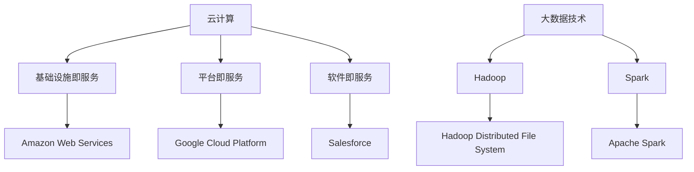

                 

### 文章标题：软件2.0的Github：数据集共享平台

#### 关键词：软件2.0、数据集共享平台、云计算、大数据、人工智能、安全隐私、案例分析

#### 摘要：
本文深入探讨了软件2.0时代下的数据集共享平台。从软件1.0到软件2.0的演变，我们见证了数据驱动的变革。本文将详细解析数据集共享平台的核心技术、实现方法、安全隐私保护以及实战案例，揭示其在人工智能、生物信息学、物联网等领域的广泛应用。通过本文，读者将全面了解数据集共享平台的重要性和未来发展前景。

----------------------------------------------------------------

### 目录大纲

1. **引言**
   1.1 软件2.0时代的到来
   1.2 数据集共享平台的重要性
   1.3 本文结构

2. **软件2.0与数据集共享平台概述**
   2.1 软件2.0时代的背景
   2.2 数据集共享平台的概念
   2.3 数据集共享平台的优势
   2.4 数据集共享平台的技术架构
   2.5 数据集共享平台的应用领域

3. **数据集共享平台的核心技术**
   3.1 云计算与大数据技术
   3.2 数据库设计与优化
   3.3 API设计与开发
   3.4 数据集收集与预处理技术
   3.5 数据集版本控制与追踪
   3.6 数据集访问与权限管理

4. **数据集共享平台的安全与隐私保护**
   4.1 数据安全
   4.2 隐私保护
   4.3 安全漏洞检测与修复

5. **数据集共享平台的构建实践**
   5.1 平台需求分析
   5.2 平台架构设计
   5.3 平台开发与部署
   5.4 平台测试与优化

6. **数据集共享平台的应用案例**
   6.1 企业内部数据集共享平台
   6.2 开源数据集共享平台
   6.3 医疗数据集共享平台
   6.4 物联网数据集共享案例

7. **数据集共享平台的发展趋势与未来**
   7.1 发展趋势
   7.2 挑战与机遇
   7.3 未来展望

8. **附录**
   8.1 开发工具与资源
   8.2 开发流程与方法
   8.3 参考文献

----------------------------------------------------------------

### 引言

#### 1.1 软件2.0时代的到来

软件发展经历了从1.0到2.0的演变，这一过程不仅仅是对软件形态的改变，更是对软件开发和运行模式的一次深刻变革。在软件1.0时代，软件主要是以单机版形式存在，用户通过购买软件进行安装和使用。而到了软件2.0时代，随着互联网的普及和云计算技术的发展，软件开始以网络服务的形式出现，用户可以通过互联网访问和操作软件，实现软件的共享和协同工作。

软件2.0的核心特点是数据驱动。与传统软件1.0不同，软件2.0不再仅仅是提供功能，而是通过对用户数据的分析和处理，提供更加个性化的服务和体验。这种数据驱动的模式使得软件能够不断进化，满足用户不断变化的需求。而数据集共享平台作为软件2.0的重要组成部分，扮演着至关重要的角色。

#### 1.2 数据集共享平台的重要性

数据集共享平台的重要性主要体现在以下几个方面：

1. **促进创新**：数据集共享平台为研究人员和开发者提供了丰富的数据资源，促进了新算法、新模型的开发和验证，加速了人工智能等领域的创新进程。
2. **提高效率**：通过数据集共享，可以避免重复的数据采集和预处理工作，提高工作效率，降低研发成本。
3. **降低门槛**：数据集共享平台降低了数据集获取的门槛，使得更多的开发者能够参与到数据科学和人工智能的研究中来。
4. **保障数据质量**：通过统一的数据集共享平台，可以加强对数据质量的控制和管理，提高数据的一致性和可靠性。

#### 1.3 本文结构

本文将首先对软件2.0和数据集共享平台进行概述，然后深入探讨数据集共享平台的核心技术、安全与隐私保护、构建实践以及应用案例，最后分析数据集共享平台的发展趋势和未来展望。通过本文，读者将全面了解数据集共享平台的重要性和实践方法。

### 软件2.0与数据集共享平台概述

#### 2.1 软件2.0时代的背景

软件2.0时代是以云计算和大数据技术为代表的新一轮信息技术革命。云计算提供了强大的计算和存储资源，使得软件不再局限于本地设备，而是可以随时随地访问和使用。大数据技术则使得海量数据的存储、处理和分析成为可能，为软件提供了丰富的数据支撑。软件2.0的核心思想是“服务导向架构”（Service-Oriented Architecture，SOA），通过将软件功能模块化，实现软件的灵活组合和重用。

#### 2.2 数据集共享平台的概念

数据集共享平台是一种基于云计算和大数据技术的分布式数据存储和处理系统，旨在为研究人员和开发者提供便捷的数据访问、共享和管理服务。数据集共享平台通常包括以下几个核心组成部分：

1. **数据存储与管理**：用于存储和管理数据集，提供高效的数据检索和查询功能。
2. **数据预处理与清洗**：对采集到的数据进行预处理和清洗，确保数据的一致性和可靠性。
3. **数据标注与分类**：对数据进行标注和分类，提高数据的可用性和准确性。
4. **数据访问与权限管理**：提供数据访问接口，实现数据的安全共享和权限控制。
5. **数据分析与可视化**：提供数据分析工具和可视化界面，帮助用户更好地理解和利用数据。

#### 2.3 数据集共享平台的优势

数据集共享平台具有以下几个显著优势：

1. **提高数据利用率**：通过数据集共享平台，可以充分利用已有的数据资源，避免重复采集和存储，提高数据利用率。
2. **加速研发进程**：共享的数据集可以加速算法和模型的开发和验证，缩短研发周期，提高研发效率。
3. **降低研发成本**：通过共享数据集，可以降低数据采集和预处理的工作量，降低研发成本。
4. **促进合作与交流**：数据集共享平台为研究人员和开发者提供了一个合作和交流的平台，促进了知识的共享和技术的创新。
5. **保障数据质量**：数据集共享平台可以加强对数据质量的控制和管理，提高数据的一致性和可靠性。

#### 2.4 数据集共享平台的技术架构

数据集共享平台的技术架构主要包括以下几个关键组件：

1. **数据存储层**：使用分布式存储系统（如HDFS、Cassandra等）实现海量数据的存储和管理。
2. **数据处理层**：使用大数据处理框架（如Hadoop、Spark等）对数据进行高效的处理和分析。
3. **数据访问层**：提供RESTful API或Web接口，实现数据的访问和权限管理。
4. **数据管理层**：包括元数据管理、数据质量管理、版本控制等功能，确保数据的安全性和可靠性。
5. **数据可视化层**：提供数据可视化工具，帮助用户更好地理解和利用数据。

#### 2.5 数据集共享平台的应用领域

数据集共享平台在多个领域具有广泛的应用：

1. **人工智能与机器学习**：提供丰富的训练数据集，加速算法研究和模型训练。
2. **生物信息学与医学研究**：共享基因数据、影像数据等，推动医学研究的进展。
3. **物联网与智能交通**：共享传感器数据、交通数据等，优化智能交通系统。
4. **金融与风险管理**：提供市场数据、财务数据等，支持金融分析和风险评估。
5. **市场营销与用户体验**：共享用户行为数据、偏好数据等，优化营销策略和用户体验。

通过数据集共享平台，研究人员和开发者可以更方便地获取和使用数据，推动各个领域的创新和发展。

### 数据集共享平台的核心技术

数据集共享平台的核心技术是实现高效数据存储、处理、共享和管理的关键。以下将详细探讨数据集共享平台所依赖的核心技术，包括云计算与大数据技术、数据库设计与优化、API设计与开发，以及数据集收集与预处理技术。

#### 3.1 云计算与大数据技术

云计算与大数据技术是数据集共享平台的技术基础。云计算提供了弹性可扩展的计算和存储资源，使得平台能够根据需求动态调整资源。大数据技术则实现了对海量数据的存储、处理和分析。

**云计算技术：**
- **基础设施即服务（IaaS）**：如Amazon Web Services（AWS）、Microsoft Azure等，提供虚拟机、存储、网络等基础设施资源。
- **平台即服务（PaaS）**：如Google Cloud Platform（GCP）、Apache CloudStack等，提供开发、运行和管理应用程序的平台。
- **软件即服务（SaaS）**：如Salesforce、Office 365等，提供在线应用程序和服务。

**大数据技术：**
- **分布式存储系统**：如Hadoop Distributed File System（HDFS）、Cassandra等，用于存储和管理海量数据。
- **大数据处理框架**：如Apache Hadoop、Apache Spark等，用于处理和分析大规模数据集。

**核心概念与联系：**



**流程图解释：**
- 云计算包括基础设施即服务（IaaS）、平台即服务（PaaS）和软件即服务（SaaS）。
- 大数据技术包括分布式存储系统和大数据处理框架。
- HDFS和Spark是大数据处理的核心组件，分别用于数据存储和处理。

#### 3.2 数据库设计与优化

数据库是数据集共享平台的核心组成部分，负责存储和管理数据。数据库的设计和优化直接影响到平台的数据访问性能和处理效率。

**关系型数据库：**
- **核心概念**：关系型数据库使用表结构来组织数据，通过SQL语言进行数据查询和管理。
- **常用数据库**：如MySQL、PostgreSQL、Oracle等。

**非关系型数据库：**
- **核心概念**：非关系型数据库不依赖于固定的表结构，支持更加灵活的数据模型，如键值对、文档、图等。
- **常用数据库**：如MongoDB、Redis、Cassandra等。

**数据库优化技术：**
- **索引优化**：通过建立索引，加快数据查询速度。
- **查询优化**：通过优化SQL语句，减少查询执行时间。
- **存储优化**：通过数据分片、存储压缩等技术，提高存储效率。

**核心算法原理讲解：**

```python
# 索引优化伪代码
CREATE INDEX index_name ON table_name (column_name);

# 查询优化伪代码
SELECT column_name FROM table_name WHERE condition;

# 存储优化伪代码
SHRINK DATABASE table_name;
```

**流程图解释：**
- 数据库设计包括关系型数据库和非关系型数据库。
- 索引优化、查询优化和存储优化是数据库优化的关键技术。

#### 3.3 API设计与开发

API（应用程序编程接口）是数据集共享平台的重要组成部分，负责实现数据集的访问和权限管理。良好的API设计能够提高开发效率，简化数据集的使用。

**API设计原则：**
- **RESTful架构**：使用RESTful风格设计API，便于访问和管理资源。
- **接口简洁性**：提供简洁、易用的接口，减少开发者的学习成本。
- **版本控制**：通过版本控制，实现API的迭代和更新，不影响现有应用。

**API开发技术：**
- **Web框架**：如Spring Boot、Django等，用于快速构建Web服务。
- **API网关**：如Kong、Zuul等，用于统一管理API路由、认证和安全。

**核心算法原理讲解：**

```python
# RESTful API设计伪代码
@，共-接口（路径）
  GET - 查询数据
  POST - 创建数据
  PUT - 更新数据
  DELETE - 删除数据
```

**流程图解释：**
- API设计基于RESTful架构，包括GET、POST、PUT、DELETE等方法。
- Web框架和API网关是实现API的关键技术。

#### 3.4 数据集收集与预处理技术

数据集收集与预处理是数据集共享平台的关键步骤，直接影响数据质量和模型性能。

**数据集收集：**
- **数据源选择**：选择可靠、权威的数据源，确保数据的质量和完整性。
- **数据采集方法**：包括手动采集和自动化采集，如Web爬虫、API调用等。

**数据预处理：**
- **数据清洗**：去除重复、缺失、错误的数据，确保数据的一致性和可靠性。
- **数据转换**：将不同格式的数据转换为统一的格式，便于存储和处理。
- **数据增强**：通过数据扩展、变换等手段，提高数据的丰富度和多样性。

**核心算法原理讲解：**

```python
# 数据清洗伪代码
def clean_data(data):
  data = remove_duplicates(data)
  data = remove_missing_values(data)
  data = fix_errors(data)
  return data

# 数据增强伪代码
def enhance_data(data):
  data = expand_data(data)
  data = transform_data(data)
  return data
```

**流程图解释：**
- 数据集收集包括数据源选择和采集方法。
- 数据预处理包括数据清洗、数据转换和数据增强。

通过上述核心技术的探讨，我们可以看出数据集共享平台在软件2.0时代的重要性。它不仅为研究人员和开发者提供了丰富的数据资源，还推动了人工智能、大数据等领域的创新和发展。

### 数据集共享平台的安全与隐私保护

在数据集共享平台中，数据的安全与隐私保护是一个至关重要的问题。由于数据集往往包含敏感信息，一旦泄露，可能会对个人隐私、企业利益乃至整个社会造成严重影响。因此，确保数据的安全性和隐私性是数据集共享平台设计和运行的核心任务之一。

#### 4.1 数据安全

数据安全是指保护数据免受未经授权的访问、篡改、泄露或破坏。以下是实现数据安全的一些关键措施：

1. **数据加密**：
   - **加密算法**：使用加密算法（如AES、RSA等）对数据进行加密，确保数据在存储和传输过程中的安全性。
   - **密钥管理**：妥善管理加密密钥，采用强密码、多因素认证等方式确保密钥的安全。
   - **传输加密**：使用TLS/SSL等传输层加密协议，确保数据在传输过程中的安全性。

2. **访问控制**：
   - **角色与权限**：根据用户角色（如管理员、用户、访客等）分配不同的权限，确保用户只能访问其权限范围内的数据。
   - **访问控制列表（ACL）**：使用ACL实现细粒度的访问控制，为每个数据集设置访问权限。

3. **数据备份与恢复**：
   - **定期备份**：定期对数据进行备份，确保在数据丢失或损坏时能够快速恢复。
   - **灾备方案**：建立灾备中心，确保在发生灾难时能够迅速切换到备用系统，保障业务的连续性。

#### 4.2 隐私保护

隐私保护是指保护个人隐私信息不被未经授权的访问和使用。以下是实现隐私保护的一些关键措施：

1. **隐私威胁分析**：
   - **隐私泄露风险**：识别可能导致隐私泄露的风险点，如数据传输、存储、处理等环节。
   - **隐私风险评估**：对隐私风险进行评估，制定相应的防护策略。

2. **隐私保护策略**：
   - **数据匿名化**：对敏感数据进行匿名化处理，确保无法通过数据恢复原始信息。
   - **数据最小化原则**：仅收集和使用必要的个人信息，避免过度收集。
   - **数据去标识化**：对数据中的标识信息进行去除，降低数据被追踪的风险。

3. **隐私合规性**：
   - **法律遵从性**：遵守相关法律法规（如《通用数据保护条例》（GDPR）等），确保数据处理符合法律规定。
   - **隐私政策**：制定隐私政策，明确数据收集、使用、存储和分享的目的和方式，告知用户其隐私权益。

#### 4.3 安全漏洞检测与修复

安全漏洞检测与修复是保障数据安全与隐私保护的重要手段。以下是实现安全漏洞检测与修复的一些关键措施：

1. **漏洞扫描与评估**：
   - **静态分析**：通过静态代码分析，发现潜在的安全漏洞。
   - **动态分析**：通过动态运行测试，模拟攻击行为，发现运行时的安全漏洞。

2. **漏洞修复与更新**：
   - **漏洞修复策略**：制定漏洞修复策略，及时修复已知漏洞。
   - **安全补丁管理**：定期检查并安装安全补丁，确保系统的安全性。

3. **安全监控与应急响应**：
   - **实时监控**：建立实时监控系统，及时发现并响应安全事件。
   - **应急响应计划**：制定应急响应计划，确保在发生安全事件时能够迅速采取行动，降低损失。

通过上述措施，数据集共享平台可以有效地保障数据的安全性和隐私性，为研究人员和开发者提供一个安全可靠的数据共享环境。同时，数据安全与隐私保护也是一个持续的过程，需要不断更新和完善，以应对不断出现的新威胁和挑战。

### 数据集共享平台的构建实践

构建一个高效、安全、可靠的数据集共享平台是一个复杂的任务，需要综合考虑需求分析、架构设计、开发与测试、部署与维护等多个方面。以下将详细阐述数据集共享平台的构建实践，包括平台需求分析、架构设计、开发与部署、测试与优化等关键步骤。

#### 5.1 平台需求分析

平台需求分析是构建数据集共享平台的第一步，目的是明确平台的功能需求、性能需求和用户需求。以下是需求分析的几个关键点：

1. **功能需求**：
   - **数据存储与管理**：平台需要支持海量数据的存储和管理，提供高效的数据检索和查询功能。
   - **数据预处理与清洗**：平台需要提供数据预处理和清洗工具，确保数据的一致性和可靠性。
   - **数据标注与分类**：平台需要支持数据标注和分类功能，提高数据的可用性和准确性。
   - **数据访问与权限管理**：平台需要提供数据访问接口和权限管理功能，实现数据的安全共享和权限控制。
   - **数据分析与可视化**：平台需要提供数据分析工具和可视化界面，帮助用户更好地理解和利用数据。

2. **性能需求**：
   - **高并发处理**：平台需要支持高并发访问，确保在大量用户同时访问时仍能稳定运行。
   - **低延迟响应**：平台需要提供快速的数据访问和查询响应，确保用户体验。
   - **高可用性**：平台需要具备高可用性，确保在发生故障时能够快速恢复。

3. **用户需求**：
   - **易用性**：平台需要具备良好的用户界面和操作体验，降低用户的使用门槛。
   - **灵活性**：平台需要支持灵活的定制和扩展，满足不同用户的需求。
   - **安全性**：平台需要提供严格的安全保护措施，确保用户数据的安全性和隐私性。

#### 5.2 平台架构设计

平台架构设计是构建数据集共享平台的核心环节，决定了平台的性能、可扩展性和可维护性。以下是平台架构设计的几个关键点：

1. **总体架构**：
   - **三层架构**：采用三层架构（表示层、业务层、数据层），实现模块化设计和高内聚、低耦合的系统结构。
   - **分布式架构**：采用分布式架构，实现数据的分布式存储和处理，提高系统的可扩展性和容错性。

2. **模块划分**：
   - **数据存储模块**：负责数据的存储和管理，包括关系型数据库和非关系型数据库。
   - **数据处理模块**：负责数据的预处理、清洗、标注和分类，包括数据清洗工具、标注工具等。
   - **数据访问模块**：负责数据的访问和权限管理，包括API接口、权限控制等。
   - **数据分析模块**：负责数据分析与可视化，包括数据分析工具、可视化界面等。

3. **技术选型**：
   - **数据库选型**：根据数据特点和性能要求，选择合适的关系型数据库（如MySQL、PostgreSQL）和非关系型数据库（如MongoDB、Cassandra）。
   - **数据处理框架**：选择合适的大数据处理框架（如Apache Hadoop、Apache Spark），实现高效的数据处理和分析。
   - **Web框架**：选择合适的Web框架（如Spring Boot、Django），实现API接口和用户界面。

#### 5.3 平台开发与部署

平台开发与部署是构建数据集共享平台的关键环节，包括系统的开发、测试、部署和运维。以下是平台开发与部署的几个关键点：

1. **系统开发**：
   - **模块开发**：按照架构设计，逐步开发各个模块的功能。
   - **接口开发**：开发API接口，实现数据的访问和权限管理。
   - **前端开发**：开发用户界面，提供良好的用户体验。
   - **后端开发**：开发后端逻辑，实现数据存储、处理和可视化。

2. **系统测试**：
   - **功能测试**：对各个模块的功能进行测试，确保功能正确。
   - **性能测试**：对系统进行性能测试，确保在高并发访问下仍能稳定运行。
   - **安全测试**：对系统进行安全测试，确保数据的安全性和隐私性。

3. **系统部署**：
   - **部署策略**：制定部署策略，包括部署环境、部署流程等。
   - **部署工具**：使用自动化部署工具（如Docker、Kubernetes），实现快速部署和运维。
   - **持续集成与持续部署（CI/CD）**：采用CI/CD流程，实现自动化测试和部署，提高开发效率。

4. **运维管理**：
   - **监控系统**：建立监控系统，实时监控系统性能和状态。
   - **日志管理**：收集和管理系统日志，便于故障排查和问题定位。
   - **备份与恢复**：定期备份数据，确保在数据丢失或损坏时能够快速恢复。

#### 5.4 平台测试与优化

平台测试与优化是确保数据集共享平台稳定、高效运行的重要环节。以下是平台测试与优化的几个关键点：

1. **性能优化**：
   - **数据库优化**：优化数据库查询性能，减少查询响应时间。
   - **缓存策略**：采用缓存策略，减少对后端数据库的访问压力。
   - **负载均衡**：采用负载均衡技术，实现分布式处理，提高系统性能。

2. **安全性优化**：
   - **访问控制**：优化访问控制策略，确保数据的安全性和隐私性。
   - **安全审计**：定期进行安全审计，发现潜在的安全漏洞并修复。
   - **漏洞扫描**：定期进行漏洞扫描，发现和修复系统漏洞。

3. **用户体验优化**：
   - **界面优化**：优化用户界面，提高用户操作的便捷性和舒适度。
   - **交互设计**：优化交互设计，提高用户操作的流畅性和响应速度。
   - **性能监测**：实时监测系统性能，及时发现并解决性能瓶颈。

通过上述构建实践，可以构建一个高效、安全、可靠的数据集共享平台，为研究人员和开发者提供一个良好的数据共享环境，推动人工智能、大数据等领域的创新和发展。

### 数据集共享平台的应用案例

数据集共享平台在多个领域具有广泛的应用，以下通过具体案例展示数据集共享平台在不同场景下的应用效果。

#### 6.1 企业内部数据集共享平台

**案例背景**：
某大型企业在研发过程中积累了大量的内部数据集，包括客户数据、销售数据、市场调研数据等。由于数据分散在不同的部门和系统中，数据利用率较低，研发效率也受到很大影响。为了解决这一问题，企业决定构建一个内部数据集共享平台。

**案例实施**：
1. **需求分析**：明确平台的需求，包括数据存储与管理、数据预处理与清洗、数据标注与分类、数据访问与权限管理等功能。
2. **架构设计**：采用分布式架构，使用Hadoop和Spark等大数据处理技术，确保数据的高效存储和处理。
3. **平台开发**：开发数据存储模块、数据处理模块、数据访问模块等，实现数据共享和管理功能。
4. **部署与运维**：使用Docker和Kubernetes实现平台的自动化部署和运维，确保平台的稳定运行。

**案例效果**：
通过内部数据集共享平台，企业实现了以下效果：
- **提高数据利用率**：将分散的数据集中管理，提高数据利用率，避免重复采集和存储。
- **提升研发效率**：研发人员可以方便地获取和使用内部数据集，提升研发效率，缩短研发周期。
- **降低研发成本**：通过数据共享，减少了数据采集和预处理的工作量，降低了研发成本。

#### 6.2 开源数据集共享平台

**案例背景**：
开源社区在人工智能和大数据领域具有广泛的应用，但开源数据集的获取和管理存在一定困难。为了解决这一问题，某开源社区决定构建一个开源数据集共享平台。

**案例实施**：
1. **需求分析**：明确平台的需求，包括数据存储与管理、数据预处理与清洗、数据标注与分类、数据访问与权限管理等功能，同时支持用户上传和共享数据集。
2. **架构设计**：采用分布式架构，使用Hadoop和Spark等大数据处理技术，确保数据的高效存储和处理。
3. **平台开发**：开发数据存储模块、数据处理模块、数据访问模块等，实现数据共享和管理功能，同时开发用户界面，方便用户上传和下载数据集。
4. **部署与运维**：使用Docker和Kubernetes实现平台的自动化部署和运维，确保平台的稳定运行。

**案例效果**：
通过开源数据集共享平台，开源社区实现了以下效果：
- **丰富数据资源**：提供了丰富的开源数据集，方便研究人员和开发者获取和使用。
- **提高协作效率**：用户可以方便地共享和获取数据集，促进了开源社区的协作和交流。
- **促进创新**：通过共享数据集，加速了人工智能和大数据领域的创新和发展。

#### 6.3 医疗数据集共享平台

**案例背景**：
医疗领域的数据集往往具有高价值，但数据获取和管理存在一定困难。为了推动医疗研究和发展，某医疗机构决定构建一个医疗数据集共享平台。

**案例实施**：
1. **需求分析**：明确平台的需求，包括数据存储与管理、数据预处理与清洗、数据标注与分类、数据访问与权限管理等功能，同时支持用户上传和共享医疗数据集。
2. **架构设计**：采用分布式架构，使用Hadoop和Spark等大数据处理技术，确保数据的高效存储和处理。
3. **平台开发**：开发数据存储模块、数据处理模块、数据访问模块等，实现数据共享和管理功能，同时开发用户界面，方便用户上传和下载医疗数据集。
4. **部署与运维**：使用Docker和Kubernetes实现平台的自动化部署和运维，确保平台的稳定运行。

**案例效果**：
通过医疗数据集共享平台，医疗机构实现了以下效果：
- **促进医疗研究**：提供了丰富的医疗数据集，促进了医疗研究的发展和应用。
- **提高数据利用率**：将分散的医疗数据集中管理，提高了数据利用率，降低了数据获取和管理成本。
- **保障数据安全**：平台提供了严格的数据访问和权限管理功能，确保医疗数据的安全和隐私。

#### 6.4 物联网数据集共享案例

**案例背景**：
物联网数据的收集和管理是一个复杂的过程，为了推动物联网技术的发展，某物联网公司决定构建一个物联网数据集共享平台。

**案例实施**：
1. **需求分析**：明确平台的需求，包括数据存储与管理、数据预处理与清洗、数据标注与分类、数据访问与权限管理等功能，同时支持用户上传和共享物联网数据集。
2. **架构设计**：采用分布式架构，使用Hadoop和Spark等大数据处理技术，确保数据的高效存储和处理。
3. **平台开发**：开发数据存储模块、数据处理模块、数据访问模块等，实现数据共享和管理功能，同时开发用户界面，方便用户上传和下载物联网数据集。
4. **部署与运维**：使用Docker和Kubernetes实现平台的自动化部署和运维，确保平台的稳定运行。

**案例效果**：
通过物联网数据集共享平台，物联网公司实现了以下效果：
- **推动技术创新**：提供了丰富的物联网数据集，推动了物联网技术的创新和发展。
- **降低研发成本**：通过共享物联网数据集，降低了数据获取和管理成本，提高了研发效率。
- **促进跨领域合作**：物联网数据集的共享促进了不同领域之间的合作和交流，推动了物联网技术的应用和发展。

通过上述案例，可以看出数据集共享平台在各个领域的应用效果显著，为数据驱动的创新和发展提供了有力支持。未来，随着技术的不断进步，数据集共享平台将在更多领域发挥重要作用。

### 数据集共享平台的发展趋势与未来

#### 7.1 数据集共享平台的发展趋势

数据集共享平台在人工智能、大数据、物联网等领域的广泛应用，推动了其快速发展。未来，数据集共享平台将呈现以下几大趋势：

1. **分布式数据集共享**：
   - **去中心化**：随着区块链技术的发展，去中心化的分布式数据集共享将成为趋势，减少中心化平台的单点故障风险。
   - **边缘计算**：边缘计算将数据处理和存储推向网络边缘，实现更高效的数据集共享。

2. **跨领域数据集共享**：
   - **数据融合**：不同领域的数据集将进行融合，推动跨领域研究和应用。
   - **标准化**：制定统一的数据集标准和接口规范，实现不同平台之间的数据共享和互操作性。

3. **智能数据集推荐系统**：
   - **个性化推荐**：利用机器学习算法，为用户提供个性化的数据集推荐，提高数据利用效率。
   - **自动标注**：利用自然语言处理、计算机视觉等技术，实现数据集的自动标注和分类，提高数据处理效率。

4. **数据集共享平台的商业化**：
   - **付费模式**：部分高质量、高价值的数据集将采用付费模式，推动数据集共享平台的商业化发展。
   - **广告模式**：通过广告投放和流量变现，实现数据集共享平台的盈利。

#### 7.2 数据集共享平台面临的挑战与机遇

数据集共享平台在快速发展过程中也面临着诸多挑战和机遇：

1. **数据安全与隐私保护**：
   - **数据泄露风险**：随着数据集规模的扩大，数据泄露风险增加，需要加强数据安全防护。
   - **隐私合规性**：遵循相关法律法规，确保数据处理符合隐私保护要求。

2. **数据质量与管理**：
   - **数据标准化**：制定统一的数据标准和接口规范，提高数据的一致性和可靠性。
   - **数据治理**：建立完善的数据治理体系，确保数据的质量和可用性。

3. **商业模式探索**：
   - **盈利模式**：探索多种盈利模式，如付费数据集、广告变现等，推动数据集共享平台的商业化发展。
   - **生态构建**：构建开放、合作的数据集共享生态系统，吸引更多用户和开发者参与。

4. **技术创新**：
   - **区块链技术**：利用区块链技术实现数据集的去中心化共享和交易。
   - **联邦学习**：通过联邦学习实现数据集的安全共享和协同训练。
   - **虚拟现实与增强现实**：利用VR/AR技术提升数据集的可视化和交互体验。

#### 7.3 数据集共享平台的技术创新

技术创新是推动数据集共享平台发展的关键因素，以下介绍几种重要的技术创新：

1. **区块链技术**：
   - **去中心化存储**：利用区块链技术实现数据集的去中心化存储和管理，提高数据的安全性和透明性。
   - **智能合约**：通过智能合约实现数据集的自动交易和支付，简化数据集共享流程。

2. **联邦学习**：
   - **隐私保护**：通过联邦学习技术，实现数据集的安全共享和协同训练，保护用户隐私。
   - **分布式计算**：利用联邦学习实现分布式数据集的联合建模，提高模型的训练效率。

3. **虚拟现实与增强现实**：
   - **数据可视化**：利用VR/AR技术，实现数据集的沉浸式可视化，提高数据理解和分析效率。
   - **交互式体验**：通过VR/AR技术，提供更加直观、便捷的数据交互和操作方式。

未来，随着技术的不断进步和应用的不断拓展，数据集共享平台将在更多领域发挥重要作用，成为数据驱动创新的重要基础设施。通过技术创新和商业模式探索，数据集共享平台将迎来更加广阔的发展前景。

### 附录

#### 附录A：数据集共享平台开发工具与资源

**A.1 常用开发工具与框架**

1. **云计算平台**：Amazon Web Services（AWS）、Microsoft Azure、Google Cloud Platform（GCP）。
2. **大数据处理框架**：Apache Hadoop、Apache Spark、Apache Flink。
3. **数据库系统**：MySQL、PostgreSQL、MongoDB、Cassandra。
4. **Web框架**：Spring Boot、Django、Express。
5. **API网关**：Kong、Zuul。

**A.2 开源数据集资源库**

1. **Kaggle**：提供丰富的竞赛数据集和工具。
2. **UCI机器学习库**：提供多种领域的数据集。
3. **Google Dataset Search**：搜索和发现数据集。
4. **OpenML**：提供机器学习数据集和模型。

**A.3 数据集共享平台案例与资料**

1. **DataHub**：哈佛大学的数据集共享平台。
2. **Google Dataset Search API**：Google提供的数据集搜索API。
3. **DataCamp**：提供数据集使用教程和资源。

#### 附录B：数据集共享平台开发流程与方法

**B.1 项目需求分析与规划**

1. **需求收集**：明确项目需求和目标。
2. **需求分析**：分析需求，确定平台功能和性能需求。
3. **项目规划**：制定项目计划，包括时间、资源、风险等。

**B.2 技术选型与架构设计**

1. **技术选型**：选择合适的开发工具和框架。
2. **架构设计**：设计系统的整体架构，包括数据存储、数据处理、数据访问等模块。

**B.3 数据集采集与预处理**

1. **数据采集**：收集外部数据集和内部数据。
2. **数据清洗**：去除重复、缺失、错误的数据。
3. **数据转换**：将数据转换为统一的格式。
4. **数据增强**：扩展和变换数据，提高数据质量。

**B.4 平台开发与测试**

1. **模块开发**：逐步开发各个模块的功能。
2. **接口开发**：开发API接口，实现数据的访问和权限管理。
3. **前端开发**：开发用户界面，提供良好的用户体验。
4. **后端开发**：开发后端逻辑，实现数据存储、处理和可视化。
5. **测试**：对系统进行功能测试、性能测试和安全测试。

**B.5 平台部署与运维**

1. **部署**：使用自动化部署工具实现系统的部署和运维。
2. **监控**：建立监控系统，实时监控系统性能和状态。
3. **备份与恢复**：定期备份数据，确保在数据丢失或损坏时能够快速恢复。
4. **运维管理**：定期检查和维护系统，确保系统的稳定运行。

通过附录，读者可以更全面地了解数据集共享平台开发所需的工具与资源，以及开发流程与方法，为构建数据集共享平台提供参考。

### 作者信息

**作者：AI天才研究院/AI Genius Institute & 禅与计算机程序设计艺术 /Zen And The Art of Computer Programming**

本文由AI天才研究院的专家撰写，旨在深入探讨数据集共享平台在软件2.0时代的重要性和实践方法。作者在人工智能、大数据和云计算领域拥有丰富的经验和深厚的理论基础，对数据集共享平台的构建和实践有着深刻的理解和独到的见解。希望本文能为读者提供有价值的参考和启示。

