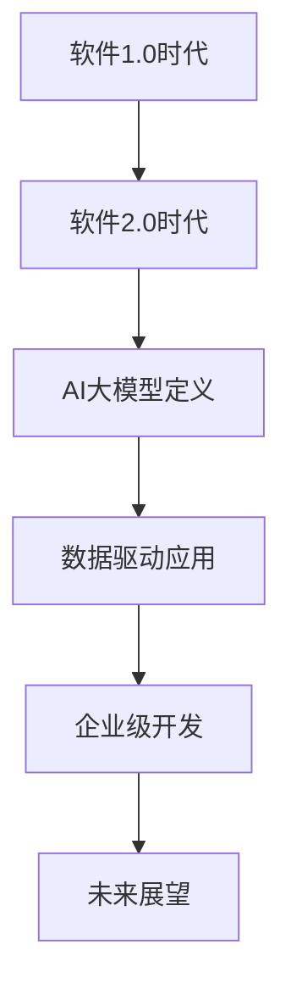

                 

### 引言：软件2.0时代的来临

随着互联网、大数据、云计算等技术的快速发展，软件行业正经历着一场深刻的变革。从最初的软件1.0时代，到软件2.0时代的演进，如今我们正迈入一个崭新的软件3.0时代。在这个时代，数据成为驱动一切的核心力量，人工智能（AI）则成为了软件创新和发展的核心引擎。

#### 软件1.0时代

软件1.0时代，主要是以功能为导向，注重软件的功能实现和性能优化。这一时期的软件开发主要依赖于传统的编程语言，如C、C++等，以及相对简单的用户界面设计。软件的开发过程往往是线性的、模块化的，开发周期较长，对开发者的技术水平和经验要求较高。

#### 软件2.0时代

软件2.0时代的到来，标志着软件行业进入了一个全新的发展阶段。这一时代的特征是数据驱动，以用户为中心，强调软件的灵活性和可扩展性。随着大数据、云计算、物联网等技术的普及，软件不再只是简单的功能实现，而是成为了数据和服务的集合体。

#### 软件2.0的核心要素

- **数据驱动**：软件2.0时代，数据成为驱动软件发展的核心力量。数据的收集、存储、处理和分析能力成为了衡量一个软件系统优劣的重要标准。
- **用户中心**：软件2.0强调以用户为中心，通过用户体验设计（UXD）和用户界面设计（UI）提升用户满意度。
- **云计算与大数据**：云计算和大数据技术的普及，为软件2.0提供了强大的基础设施支持，使得软件系统能够更加高效地进行数据处理和存储。
- **人工智能**：人工智能（AI）在软件2.0时代发挥着至关重要的作用。通过AI技术，软件系统能够实现智能化，提供更加精准的服务和个性化的体验。

#### 软件2.0时代的意义

- **提升效率**：通过数据驱动的开发模式，软件2.0能够更加精准地满足用户需求，提高工作效率。
- **创新驱动**：软件2.0时代，数据和技术创新成为推动软件行业发展的重要力量，为行业带来了新的机遇和挑战。
- **用户体验**：以用户为中心的设计理念，使得软件2.0能够提供更加优质的用户体验，提升用户满意度。
- **业务变革**：软件2.0时代，人工智能的应用将引发业务流程的深刻变革，推动企业数字化转型。

在接下来的章节中，我们将详细探讨软件2.0时代的核心要素，以及如何利用AI大模型实现数据驱动的发展。首先，我们将从AI大模型的基本概念和技术原理入手，逐步深入理解这一革命性技术的核心。通过这一系列的分析和探讨，我们希望能够为读者提供一个全面、系统的软件2.0时代认知框架。

### 关键词

- 软件2.0时代
- 数据驱动
- 人工智能
- 大模型
- 云计算
- 大数据
- 用户中心设计
- 用户体验
- 开发模式变革

### 摘要

本文将深入探讨软件2.0时代的到来及其核心要素。软件2.0时代以数据驱动为核心，强调以用户为中心的设计理念和云计算、大数据技术的支持。本文将首先回顾软件从1.0时代到2.0时代的演进过程，详细阐述数据驱动和人工智能在软件2.0时代的重要性。接着，我们将介绍AI大模型的基本概念和技术原理，包括深度学习、神经网络、自然语言处理等技术。随后，本文将分析企业级AI应用开发的关键步骤，如战略规划、数据收集与管理、模型应用与优化等。最后，本文将展望软件2.0时代的发展趋势，探讨技术挑战和对策，并提供相关的开发工具与资源，以及实际项目案例。通过本文的阅读，读者将全面了解软件2.0时代的数据驱动理念，掌握AI大模型的核心技术和应用方法，为未来的软件创新和业务变革提供有力支持。

## 第1章 软件2.0与AI大模型概述

### 1.1 软件2.0时代的到来

软件2.0时代，是软件行业从传统的功能导向向数据驱动、用户中心的新阶段演进的结果。这一时代的到来，不仅改变了软件开发的模式，也重新定义了软件的价值和意义。

#### 从软件1.0到软件2.0的演进

1. **软件1.0时代**：以功能为导向，注重软件的功能实现和性能优化。开发者主要依赖传统的编程语言，如C、C++等，以及简单的用户界面设计。软件的开发过程往往是线性的、模块化的，开发周期较长，对开发者的技术水平和经验要求较高。

2. **软件2.0时代**：随着大数据、云计算、物联网等技术的发展，软件不再只是简单的功能实现，而是成为了数据和服务的集合体。软件2.0强调数据驱动，以用户为中心，注重软件的灵活性和可扩展性。

3. **软件3.0时代**：软件3.0时代，人工智能（AI）将深度融入软件系统，实现软件的智能化。AI大模型作为核心驱动力，将推动软件行业进入一个全新的发展阶段。

#### 软件2.0的定义与特征

- **数据驱动**：软件2.0以数据为驱动，通过收集、存储、处理和分析用户数据，实现个性化、智能化的服务。
- **用户中心**：软件2.0强调以用户为中心，通过用户体验设计（UXD）和用户界面设计（UI）提升用户满意度。
- **云计算与大数据**：云计算和大数据技术的普及，为软件2.0提供了强大的基础设施支持，使得软件系统能够更加高效地进行数据处理和存储。
- **人工智能**：人工智能（AI）在软件2.0时代发挥着至关重要的作用。通过AI技术，软件系统能够实现智能化，提供更加精准的服务和个性化的体验。

### 1.2 大模型在软件2.0中的核心地位

AI大模型是软件2.0时代的核心技术之一，其地位和作用不可替代。以下是AI大模型在软件2.0中的核心地位：

#### 大模型的重要性

- **数据分析和处理能力**：大模型具有强大的数据分析和处理能力，能够从海量数据中提取有价值的信息，为决策提供支持。
- **智能化服务**：通过大模型的智能化服务，软件系统能够更好地满足用户需求，提升用户体验。
- **自动化与优化**：大模型的应用可以显著提高软件系统的自动化和优化能力，降低人力成本，提升工作效率。

#### 大模型与数据驱动的联系

- **数据收集**：大模型依赖于海量数据，数据的质量和数量直接影响大模型的性能。
- **数据存储**：大模型需要高效的存储方案来管理和处理海量数据，确保数据的可访问性和安全性。
- **数据处理**：大模型通过对数据进行深度学习和分析，实现数据的智能化处理和解读。

#### 企业级应用开发的新范式

软件2.0时代，企业级应用开发呈现出新的范式：

- **数据驱动**：企业级应用开发以数据为驱动力，通过数据分析优化业务流程，提升业务效率。
- **用户中心**：企业级应用开发注重用户体验，通过用户研究和用户反馈，不断优化产品和服务。
- **云计算与大数据**：企业级应用开发充分利用云计算和大数据技术，构建高效、可靠的软件系统。
- **人工智能**：企业级应用开发集成AI大模型，实现智能化的业务流程和用户体验。

### 1.3 企业级应用开发的新范式

在软件2.0时代，企业级应用开发呈现出新的范式。以下是新范式的主要特点：

#### 软件开发生命周期变革

- **敏捷开发**：采用敏捷开发方法，快速响应市场需求，缩短开发周期，提高开发效率。
- **持续集成与持续部署（CI/CD）**：通过自动化测试和部署，实现持续集成和持续部署，提高软件质量。
- **DevOps**：将开发（Dev）与运维（Ops）紧密结合，实现开发和运维的无缝衔接，提升系统可靠性。

#### 数据驱动开发流程

- **数据采集**：在开发过程中，不断收集用户数据，为后续分析和优化提供基础。
- **数据分析**：通过对收集到的数据进行深入分析，识别用户需求，优化产品功能。
- **用户反馈**：通过用户反馈，不断调整和优化产品，确保产品满足用户需求。

#### 云计算与大数据支持

- **云计算**：利用云计算技术，构建高效、可靠的软件基础设施，降低企业成本。
- **大数据**：通过大数据技术，实现海量数据的存储、处理和分析，为业务决策提供支持。

#### 人工智能集成

- **AI模型集成**：将AI大模型集成到应用中，实现智能化功能，提升用户体验。
- **智能推荐**：利用AI大模型进行用户行为分析，实现个性化推荐，提高用户粘性。
- **自动化处理**：利用AI大模型实现自动化数据处理和业务流程优化，提高工作效率。

### 1.4 大模型在软件2.0时代的应用案例

#### 智能客服系统

- **应用场景**：通过大模型实现智能客服系统，自动处理用户咨询，提供24小时在线服务。
- **效果分析**：智能客服系统能够提高用户满意度，降低企业成本，提升客户服务质量。

#### 智能推荐系统

- **应用场景**：利用大模型实现智能推荐系统，根据用户历史行为和偏好，提供个性化推荐。
- **效果分析**：智能推荐系统能够提高用户参与度，提升用户满意度，增加平台收益。

#### 智能金融风控

- **应用场景**：利用大模型实现智能金融风控系统，实时监控和识别金融风险。
- **效果分析**：智能风控系统能够提高风险识别能力，降低金融风险，提升业务安全性。

通过以上分析，我们可以看到，软件2.0时代的大模型技术具有重要的地位和作用，它不仅改变了软件开发的模式，也为企业的业务创新和效率提升提供了强大的支持。在接下来的章节中，我们将进一步探讨AI大模型的技术基础和应用开发，帮助读者深入了解这一革命性技术。

### 1.2 AI大模型技术基础

AI大模型是软件2.0时代的核心技术之一，其背后的技术基础涵盖了深度学习、神经网络、自然语言处理等多个领域。在这一部分，我们将详细探讨这些核心技术的原理和应用。

#### 深度学习与神经网络基础

深度学习是AI大模型的核心技术之一，它通过多层神经网络结构，实现对复杂数据的建模和预测。以下是深度学习和神经网络的基础知识：

##### 1.2.1 神经网络的基本结构

神经网络由大量的神经元（节点）组成，这些神经元通过加权连接形成网络结构。神经网络的基本结构包括：

- **输入层**：接收外部输入信息。
- **隐藏层**：对输入信息进行处理和转换。
- **输出层**：生成最终输出。

神经元的激活函数是神经网络的核心部分，常用的激活函数包括：

- **Sigmoid函数**：\( f(x) = \frac{1}{1 + e^{-x}} \)
- **ReLU函数**：\( f(x) = \max(0, x) \)
- **Tanh函数**：\( f(x) = \frac{e^x - e^{-x}}{e^x + e^{-x}} \)

##### 1.2.2 前向传播与反向传播

神经网络通过前向传播和反向传播来计算输出和更新权重。前向传播是指从输入层开始，逐层计算每个神经元的输出，直到输出层。反向传播则是指从输出层开始，反向计算每个神经元的梯度，用于更新权重。

前向传播的伪代码如下：

```
for each layer l from input to hidden layers:
  for each neuron n in layer l:
    z[n] = sum(w[n][m] * a[m] for all m in the previous layer) + b[n]
    a[n] = activation(z[n])

for each layer l from output to hidden layers:
  for each neuron n in layer l:
    delta[n] = (d[n] - a[n]) * activation_derivative(a[n])
    for each weight w[n][m] in layer l:
      delta[w[n][m]] = delta[n] * a[m]
      w[n][m] = w[n][m] + learning_rate * delta[w[n][m]]
      b[n] = b[n] + learning_rate * delta[n]
```

#### 常见的深度学习架构

深度学习架构种类繁多，以下是几种常见的深度学习架构：

##### 1.2.3 卷积神经网络（CNN）

卷积神经网络（CNN）是深度学习中的一种重要架构，专门用于处理图像数据。CNN的核心是卷积层，它通过局部感知和权重共享的方式，提取图像的特征。

CNN的基本结构包括：

- **卷积层**：用于提取图像的局部特征。
- **池化层**：用于降低特征图的维度。
- **全连接层**：用于分类和回归。

CNN的伪代码如下：

```
for each filter in convolutional layer:
  for each position in input image:
    z[position] = sum(w[position][filter] * input[position] for all positions in local region) + b[filter]
    a[position] = activation(z[position])

for each position in pooling layer:
  a[position] = max_value_of的区域(a, pool_size)

for each neuron in fully connected layer:
  z[neuron] = sum(w[neuron][a] for all a in previous layer) + b[neuron]
  a[neuron] = activation(z[neuron])
```

##### 1.2.4 循环神经网络（RNN）

循环神经网络（RNN）是用于处理序列数据的一种深度学习架构。RNN通过循环结构，将当前输入与之前的隐藏状态进行关联，实现对序列数据的建模。

RNN的基本结构包括：

- **输入门**（input gate）：用于更新隐藏状态。
- **遗忘门**（forget gate）：用于控制信息的保留与遗忘。
- **输出门**（output gate）：用于生成输出。

RNN的伪代码如下：

```
for each time step:
  z[i] = sum(w[i][x] * x for all x in input) + b[i]
  i = activation(z[i])

h[t] = f(h[t-1], x[t])

for each time step:
  z[g] = sum(w[g][h[t]] for all h[t] in hidden states) + b[g]
  g = activation(z[g])

y[t] = sum(w[y][g] for all g in hidden states) + b[y]
```

##### 1.2.5 生成对抗网络（GAN）

生成对抗网络（GAN）是一种用于生成数据的深度学习架构。GAN由生成器和判别器两个网络组成，生成器生成数据，判别器判断数据是否真实。

GAN的基本结构包括：

- **生成器**（Generator）：生成与真实数据相似的数据。
- **判别器**（Discriminator）：判断生成数据是否真实。

GAN的伪代码如下：

```
for each time step:
  Generate fake data: z ~ p_z(z)
  x = G(z)

for each time step:
  Real data: x ~ p_data(x)
  Generate fake data: z ~ p_z(z)
  x' = G(z)

D_loss = -E[log(D(x))] - E[log(1 - D(x'))]

for each time step:
  G_loss = E[log(D(G(z)))]
```

#### 深度学习优化算法

深度学习优化算法用于调整神经网络中的权重，以最小化损失函数。以下是几种常见的深度学习优化算法：

##### 1.2.6 随机梯度下降（SGD）

随机梯度下降（SGD）是最常用的优化算法之一。SGD通过随机选择一部分样本，计算梯度并更新权重。

SGD的伪代码如下：

```
for each epoch:
  for each mini-batch:
    Calculate gradients: gradients = compute_gradients(model, inputs, targets)
    Update weights: model = update_weights(model, gradients, learning_rate)
```

##### 1.2.7 Adam优化器

Adam优化器是一种结合了SGD和动量方法的优化算法，具有较好的收敛性。

Adam的伪代码如下：

```
Initialize: m = 0, v = 0
for each epoch:
  for each mini-batch:
    Calculate gradients: gradients = compute_gradients(model, inputs, targets)
    m = beta1 * m + (1 - beta1) * gradients
    v = beta2 * v + (1 - beta2) * gradients^2
    m_hat = m / (1 - beta1^t)
    v_hat = v / (1 - beta2^t)
    Update weights: model = update_weights(model, m_hat, v_hat, learning_rate)
```

#### 自然语言处理技术概览

自然语言处理（NLP）是AI大模型的重要应用领域之一，它旨在让计算机理解和处理人类语言。以下是NLP的一些关键技术：

##### 1.2.8 词嵌入技术

词嵌入技术将词汇映射到高维向量空间，以实现词汇的表示和计算。

常见的词嵌入方法包括：

- **Word2Vec**：基于分布式假设，将词汇映射到低维连续向量空间。
- **GloVe**：基于全局共现信息，学习词汇的分布式表示。

##### 1.2.9 序列模型与注意力机制

序列模型用于处理序列数据，如文本和语音。注意力机制是一种用于序列模型的重要技术，它能够动态调整模型对输入序列的重视程度。

常见的序列模型包括：

- **RNN**：通过循环结构处理序列数据。
- **LSTM**：通过门控机制处理长序列数据。
- **Transformer**：基于自注意力机制，适用于长序列数据。

##### 1.2.10 转换器架构详解

转换器架构（Transformer）是一种用于序列到序列转换的深度学习模型，其核心思想是使用自注意力机制来处理序列数据。

转换器架构的基本结构包括：

- **编码器**（Encoder）：用于将输入序列编码为高维向量。
- **解码器**（Decoder）：用于将编码器输出解码为输出序列。

转换器的伪代码如下：

```
for each position in input sequence:
  Encoder: h = Encoder(input)

for each position in output sequence:
  Decoder: y = Decoder(h)
```

#### 大规模预训练模型原理

大规模预训练模型是AI大模型的另一个重要方向，它通过在大量数据上进行预训练，然后进行微调，适用于各种任务。

以下是大规模预训练模型的一些关键技术：

##### 1.2.11 预训练的概念与意义

预训练是指在大规模数据集上训练模型，以获得通用的语言表示能力。预训练的意义在于：

- **提高模型性能**：通过预训练，模型能够在各种任务上获得更好的性能。
- **减少训练数据需求**：预训练模型能够在较少的数据上快速适应新任务。

##### 1.2.12 自监督学习方法

自监督学习方法是指利用未标注的数据进行训练的方法。自监督学习的任务包括：

- **语言建模**：预测下一个词或字符。
- **掩码语言模型（MLM）**：随机掩码输入序列的一部分，预测被掩码的词或字符。

##### 1.2.13 迁移学习与微调技术

迁移学习是指将预训练模型应用于新任务，通过微调来适应新任务。微调技术包括：

- **参数冻结**：固定预训练模型的参数，仅更新微调部分的参数。
- **全连接层替换**：将预训练模型的全连接层替换为适用于新任务的层。

通过以上对AI大模型技术基础的详细探讨，我们可以看到，深度学习、神经网络、自然语言处理等技术是构建AI大模型的基础。在接下来的章节中，我们将进一步探讨如何利用这些技术进行企业级AI应用开发。

### 第2章 AI大模型技术基础

#### 2.1 深度学习与神经网络基础

深度学习和神经网络是构建AI大模型的核心技术。在这一节，我们将深入探讨神经网络的基本结构、深度学习的常见架构以及深度学习优化算法。

##### 2.1.1 神经网络的基本结构

神经网络由一系列相互连接的神经元组成，这些神经元通过加权连接形成网络结构。神经网络的基本结构包括输入层、隐藏层和输出层。

1. **输入层**：接收外部输入数据，例如图像、文本或数值数据。
2. **隐藏层**：对输入数据进行处理和转换，通过一系列的加权和激活函数，将输入映射到隐藏状态。
3. **输出层**：生成最终输出，例如分类结果或回归值。

每个神经元都有一个激活函数，用于将输入映射到输出。常用的激活函数包括Sigmoid函数、ReLU函数和Tanh函数。

Sigmoid函数的公式为：
$$
f(x) = \frac{1}{1 + e^{-x}}
$$

ReLU函数的公式为：
$$
f(x) = \max(0, x)
$$

Tanh函数的公式为：
$$
f(x) = \frac{e^x - e^{-x}}{e^x + e^{-x}}
$$

##### 2.1.2 常见的深度学习架构

深度学习架构种类繁多，以下是几种常见的深度学习架构：

1. **卷积神经网络（CNN）**

卷积神经网络（CNN）是专门用于处理图像数据的一种深度学习架构。CNN通过卷积层、池化层和全连接层，对图像进行特征提取和分类。

卷积层的公式为：
$$
h^{l}(i, j) = \sum_{k} w^{l}_{ikj} * h^{l-1}_{kj} + b^{l}_{ikj}
$$
其中，\(h^{l}(i, j)\)表示第\(l\)层的第\(i\)行第\(j\)列的神经元输出，\(w^{l}_{ikj}\)表示第\(l\)层的第\(i\)行第\(j\)列的权重，\(h^{l-1}_{kj}\)表示第\(l-1\)层的第\(k\)行第\(j\)列的神经元输出，\(b^{l}_{ikj}\)表示第\(l\)层的第\(i\)行第\(j\)列的偏置。

池化层的公式为：
$$
p(i, j) = \max_{k} h^{l-1}_{ikj}
$$
其中，\(p(i, j)\)表示第\(l\)层的第\(i\)行第\(j\)列的池化输出，\(h^{l-1}_{ikj}\)表示第\(l-1\)层的第\(i\)行第\(j\)列的神经元输出。

2. **循环神经网络（RNN）**

循环神经网络（RNN）是用于处理序列数据的一种深度学习架构。RNN通过循环结构，将当前输入与之前的隐藏状态进行关联，实现对序列数据的建模。

RNN的公式为：
$$
h_t = \sigma(W_h \cdot [h_{t-1}, x_t] + b_h)
$$
$$
y_t = \sigma(W_o \cdot h_t + b_o)
$$
其中，\(h_t\)表示第\(t\)步的隐藏状态，\(x_t\)表示第\(t\)步的输入，\(\sigma\)表示激活函数，\(W_h\)和\(W_o\)分别表示隐藏层和输出层的权重，\(b_h\)和\(b_o\)分别表示隐藏层和输出层的偏置。

3. **生成对抗网络（GAN）**

生成对抗网络（GAN）是一种用于生成数据的深度学习架构。GAN由生成器和判别器两个网络组成，生成器生成数据，判别器判断数据是否真实。

GAN的公式为：
$$
D(x) = \frac{1}{2} \log(D(x) + \epsilon) + \frac{1}{2} \log(1 - D(G(z)) + \epsilon)
$$
$$
G(z) = \mu + \sigma \odot \phi(W_g z + b_g)
$$
其中，\(D(x)\)表示判别器对真实数据的概率，\(G(z)\)表示生成器对生成数据的概率，\(\mu\)和\(\sigma\)分别表示生成器的均值和标准差，\(\phi\)表示激活函数，\(W_g\)和\(b_g\)分别表示生成器的权重和偏置。

##### 2.1.3 深度学习优化算法

深度学习优化算法用于调整神经网络中的权重，以最小化损失函数。以下是几种常见的深度学习优化算法：

1. **随机梯度下降（SGD）**

随机梯度下降（SGD）是最常用的优化算法之一。SGD通过随机选择一部分样本，计算梯度并更新权重。

SGD的伪代码为：
$$
w_{t+1} = w_{t} - \alpha \cdot \nabla_w J(w)
$$
其中，\(w_t\)表示第\(t\)次迭代的权重，\(\alpha\)表示学习率，\(\nabla_w J(w)\)表示损失函数关于权重的梯度。

2. **动量优化（Momentum）**

动量优化是一种结合了SGD的优化算法，通过引入动量项，加速收敛。

动量优化的伪代码为：
$$
v_t = \gamma v_{t-1} + \alpha \cdot \nabla_w J(w)
$$
$$
w_{t+1} = w_{t} - v_t
$$
其中，\(v_t\)表示第\(t\)次的动量项，\(\gamma\)表示动量系数。

3. **Adam优化器**

Adam优化器是一种结合了SGD和动量方法的优化算法，具有较好的收敛性。

Adam优化器的伪代码为：
$$
m_t = \beta_1 m_{t-1} + (1 - \beta_1) \cdot \nabla_w J(w)
$$
$$
v_t = \beta_2 v_{t-1} + (1 - \beta_2) \cdot (\nabla_w J(w))^2
$$
$$
m_t^{\prime} = \frac{m_t}{1 - \beta_1^t}
$$
$$
v_t^{\prime} = \frac{v_t}{1 - \beta_2^t}
$$
$$
w_{t+1} = w_{t} - \alpha \cdot \frac{m_t^{\prime}}{\sqrt{v_t^{\prime}} + \epsilon}
$$
其中，\(m_t\)和\(v_t\)分别表示一阶矩估计和二阶矩估计，\(\beta_1\)和\(\beta_2\)分别表示一阶矩和二阶矩的指数衰减率，\(\alpha\)表示学习率，\(\epsilon\)表示正则化项。

通过以上对深度学习与神经网络基础的详细探讨，我们可以看到，神经网络的基本结构、常见的深度学习架构以及深度学习优化算法是构建AI大模型的核心技术。在接下来的章节中，我们将进一步探讨自然语言处理技术，为AI大模型在企业级应用开发中的应用奠定基础。

#### 2.2 自然语言处理技术概览

自然语言处理（NLP）是AI大模型的重要应用领域之一，它旨在让计算机理解和处理人类语言。在这一节，我们将介绍词嵌入技术、序列模型与注意力机制以及转换器架构（Transformer）的基本原理。

##### 2.2.1 词嵌入技术

词嵌入（Word Embedding）是将词汇映射到高维向量空间的技术，使得词汇在向量空间中有意义地表示。词嵌入的主要目的是将抽象的词汇映射为具体的数值向量，以便计算机进行处理。

1. **Word2Vec**

Word2Vec是最早的词嵌入技术之一，它基于神经网络模型，通过预测相邻词来学习词汇的表示。Word2Vec主要分为两种模型：Continuous Bag-of-Words (CBOW)和Skip-Gram。

CBOW模型通过上下文词来预测中心词，其公式为：
$$
\text{log} p(\text{中心词}|\text{上下文词}) = \text{log} \sigma(W \text{中心词} + U \text{上下文词} + b)
$$
其中，\(W\)和\(U\)分别为输入层和隐藏层的权重矩阵，\(b\)为偏置项，\(\sigma\)为激活函数。

Skip-Gram模型通过中心词来预测上下文词，其公式为：
$$
\text{log} p(\text{上下文词}|\text{中心词}) = \text{log} \sigma(W \text{中心词} + V \text{上下文词} + b)
$$
其中，\(W\)和\(V\)分别为输入层和隐藏层的权重矩阵，\(b\)为偏置项，\(\sigma\)为激活函数。

2. **GloVe**

GloVe（Global Vectors for Word Representation）是基于共现信息的词嵌入技术，通过全局统计信息学习词汇的表示。GloVe模型通过计算词汇之间的相似性来更新词向量，其公式为：
$$
\text{cos} \theta_{ij} = \frac{\textbf{v}_i \cdot \textbf{v}_j}{||\textbf{v}_i|| \cdot ||\textbf{v}_j||}
$$
$$
\text{cos} \theta_{ij} = \frac{f(x_i) f(x_j)}{\sqrt{f(x_i) f(x_j) + f(y_i) f(y_j)}}
$$
其中，\(\theta_{ij}\)表示词汇\(i\)和\(j\)之间的角度，\(\textbf{v}_i\)和\(\textbf{v}_j\)分别为词汇\(i\)和\(j\)的向量表示，\(f(x_i)\)和\(f(x_j)\)分别为词汇\(i\)和\(j\)的共现频次，\(y_i\)和\(y_j\)分别为词汇\(i\)和\(j\)的共现词频次。

##### 2.2.2 序列模型与注意力机制

序列模型（Sequence Model）用于处理序列数据，如文本、语音和视频。序列模型通过将序列中的每个元素映射为向量，然后通过神经网络结构对序列进行建模。

1. **循环神经网络（RNN）**

循环神经网络（RNN）是处理序列数据的一种经典架构，它通过循环结构将当前输入与之前的隐藏状态进行关联。

RNN的公式为：
$$
h_t = \sigma(W_h \cdot [h_{t-1}, x_t] + b_h)
$$
$$
y_t = \sigma(W_o \cdot h_t + b_o)
$$
其中，\(h_t\)表示第\(t\)步的隐藏状态，\(x_t\)表示第\(t\)步的输入，\(\sigma\)表示激活函数，\(W_h\)和\(W_o\)分别表示隐藏层和输出层的权重，\(b_h\)和\(b_o\)分别表示隐藏层和输出层的偏置。

2. **长短期记忆网络（LSTM）**

长短期记忆网络（LSTM）是RNN的一种改进，它通过引入门控机制来控制信息的保留和遗忘，从而更好地处理长序列数据。

LSTM的公式为：
$$
i_t = \sigma(W_i \cdot [h_{t-1}, x_t] + b_i)
$$
$$
f_t = \sigma(W_f \cdot [h_{t-1}, x_t] + b_f)
$$
$$
o_t = \sigma(W_o \cdot [h_{t-1}, x_t] + b_o)
$$
$$
g_t = \sigma(W_g \cdot [h_{t-1}, x_t] + b_g)
$$
$$
h_t = o_t \cdot \sigma(g_t)
$$
其中，\(i_t\)、\(f_t\)、\(o_t\)和\(g_t\)分别表示输入门、遗忘门、输出门和候选状态门，\(W_i\)、\(W_f\)、\(W_o\)和\(W_g\)分别表示输入门、遗忘门、输出门和候选状态门的权重，\(b_i\)、\(b_f\)、\(b_o\)和\(b_g\)分别表示输入门、遗忘门、输出门和候选状态门的偏置。

3. **注意力机制（Attention Mechanism）**

注意力机制是处理序列数据的一种有效方法，它通过动态调整模型对序列中不同位置的重视程度，提高序列模型的性能。

注意力机制的公式为：
$$
a_t = \text{softmax}(\text{Attention}(h_{t-1}, h_t))
$$
$$
c_t = \sum_{i=1}^T a_t h_i
$$
其中，\(a_t\)表示第\(t\)步的注意力权重，\(c_t\)表示第\(t\)步的上下文表示，\(\text{Attention}\)函数表示注意力计算，\(h_{t-1}\)和\(h_t\)分别表示第\(t-1\)步和第\(t\)步的隐藏状态，\(T\)表示序列的长度。

##### 2.2.3 转换器架构（Transformer）

转换器架构（Transformer）是处理序列数据的一种新型深度学习模型，它基于自注意力机制，具有并行计算的优点，在许多NLP任务中取得了显著的成果。

转换器架构的基本结构包括编码器（Encoder）和解码器（Decoder）。

1. **编码器（Encoder）**

编码器用于将输入序列编码为高维向量表示。编码器的每个层包含多头自注意力机制和前馈网络。

编码器的公式为：
$$
\text{MultiHead}(Q, K, V) = \text{Concat}(\text{head}_1, ..., \text{head}_h) W^O
$$
$$
\text{head}_i = \text{softmax}\left(\frac{QK^T}{\sqrt{d_k}}\right) V
$$
其中，\(Q\)、\(K\)和\(V\)分别为编码器的输入、键和值，\(W^O\)为输出层的权重矩阵，\(d_k\)为键和值的维度，\(\text{MultiHead}\)表示多头自注意力机制。

2. **解码器（Decoder）**

解码器用于将编码器的输出解码为输出序列。解码器在每个层中也包含多头自注意力机制和前馈网络。

解码器的公式为：
$$
\text{MultiHead}(Q, K, V) = \text{Concat}(\text{head}_1, ..., \text{head}_h) W^O
$$
$$
\text{head}_i = \text{softmax}\left(\frac{QK^T}{\sqrt{d_k}}\right) V
$$
其中，\(Q\)、\(K\)和\(V\)分别为解码器的输入、键和值，\(W^O\)为输出层的权重矩阵，\(d_k\)为键和值的维度，\(\text{MultiHead}\)表示多头自注意力机制。

通过以上对自然语言处理技术的详细探讨，我们可以看到，词嵌入技术、序列模型与注意力机制以及转换器架构是构建AI大模型的重要技术。这些技术使得AI大模型能够更好地理解和处理人类语言，为AI大模型在企业级应用开发中的应用奠定了基础。

### 第3章 企业AI战略规划

在软件2.0时代，企业级AI应用的开发和部署成为企业数字化转型的重要一环。为了有效地规划企业AI战略，企业需要从价值评估、ROI分析以及业务流程影响等多个方面进行全面考虑。

#### 3.1 AI在企业中的价值评估

评估AI在企业的价值是制定AI战略的第一步。以下是AI能力评估的关键指标和方法：

1. **能力评估框架**
   - **技术能力**：包括算法精度、模型性能、系统集成能力等。
   - **业务贡献**：如自动化效率、业务流程优化、成本节省等。
   - **用户体验**：如用户满意度、交互便捷性等。

2. **评估方法与工具**
   - **KPI指标**：通过关键绩效指标（KPI）来量化AI对业务的贡献，如点击率、转化率、客户留存率等。
   - **案例研究**：通过成功的AI应用案例，评估AI技术在不同业务场景中的实际效果。
   - **问卷调查**：通过员工和客户的问卷调查，了解AI应用对用户体验的影响。

3. **评估流程**
   - **需求分析**：明确企业AI应用的目标和需求。
   - **方案设计**：设计AI应用的架构和技术方案。
   - **模型训练**：根据需求收集数据，进行模型训练和调优。
   - **效果评估**：通过实际应用，评估AI技术的效果和业务价值。

#### 3.2 AI项目ROI分析方法

ROI（Return on Investment）分析是评估AI项目经济效益的重要方法。以下是如何进行AI项目ROI分析的关键步骤：

1. **成本与收益分析**
   - **直接成本**：包括硬件设备、软件开发、数据收集和处理等。
   - **间接成本**：如人力成本、培训成本等。
   - **直接收益**：如收入增加、成本降低等。
   - **间接收益**：如品牌提升、市场扩展等。

2. **ROI计算与优化**
   - **ROI计算公式**：
     $$
     ROI = \frac{净收益}{投资成本} \times 100\%
     $$
   - **收益优化策略**：通过不断优化算法、改进模型、提高数据处理效率等手段，提高AI项目的经济效益。

3. **案例分析**
   - **成功案例**：分析成功案例中的ROI计算过程，了解如何通过优化策略实现高ROI。
   - **失败案例**：分析失败案例中的问题，避免在后续项目中重复。

#### 3.3 AI对企业业务流程的影响

AI技术的引入将深刻改变企业的业务流程，带来创新和效率提升。以下是AI对企业业务流程的主要影响：

1. **业务流程重构**
   - **自动化流程**：通过自动化技术，减少人工操作，提高业务处理速度和准确性。
   - **智能优化**：利用AI技术，优化业务流程，减少冗余环节，提高效率。

2. **创新与效率提升**
   - **数据驱动的决策**：通过分析大量数据，为企业提供科学决策依据，减少盲目性。
   - **个性化服务**：通过AI技术，提供更加个性化的产品和服务，提高用户满意度。

3. **业务流程案例**
   - **智能制造**：通过AI技术，实现生产流程的自动化和智能化，提高生产效率和产品质量。
   - **金融风控**：利用AI技术，实现实时风险评估和监控，提高金融业务的稳健性。
   - **客服与营销**：通过智能客服和推荐系统，提升客户服务质量和营销效果。

#### 3.4 AI战略规划的实施步骤

为了确保AI战略的有效实施，企业需要遵循以下步骤：

1. **明确战略目标**：明确企业AI应用的发展方向和目标，确保战略规划的明确性和可操作性。

2. **组织架构调整**：根据AI战略的要求，调整企业组织架构，确保各部门之间的协同和高效运作。

3. **技术选型与研发**：选择合适的AI技术，组建专业的研发团队，开展AI技术研究和应用开发。

4. **数据管理**：建立完善的数据管理体系，确保数据的准确性、完整性和安全性。

5. **人才培养与引进**：通过培训、引进等方式，培养和引进具备AI技术和业务能力的专业人才。

6. **试点应用与推广**：选择合适的业务场景进行试点应用，总结经验，逐步推广到其他业务领域。

7. **持续优化与改进**：根据实际应用效果，不断优化和改进AI技术，提高业务效率和用户体验。

通过以上对AI战略规划的分析和探讨，我们可以看到，企业AI战略的制定和实施对于企业数字化转型具有重要意义。在接下来的章节中，我们将进一步探讨数据收集与管理、AI大模型应用开发以及优化与调优等方面的内容。

### 第4章 数据收集与管理

数据是AI大模型的基础，有效的数据收集与管理是确保AI模型性能和业务价值的关键。在这一章中，我们将详细探讨数据收集的方法、数据管理的策略以及数据清洗与预处理的流程。

#### 4.1 数据收集

数据收集是构建AI模型的第一步，数据的质量直接影响模型的效果。以下是数据收集的关键步骤和注意事项：

1. **数据来源分析**
   - **内部数据**：企业内部产生的数据，如用户行为数据、交易数据、运营数据等。
   - **外部数据**：来自互联网、第三方数据供应商、公共数据集等的数据。

2. **数据采集技术**
   - **Web爬虫**：通过自动化脚本从互联网上抓取数据，适用于大量结构化数据的采集。
   - **API调用**：使用API接口从外部系统获取数据，适用于需要实时获取数据的应用场景。
   - **传感器数据**：从传感器设备获取数据，适用于物联网和工业自动化场景。

3. **数据质量评估**
   - **准确性**：数据应真实、可靠，无虚假或错误信息。
   - **完整性**：数据应完整，无缺失值或缺失数据。
   - **一致性**：数据应保持一致性，避免重复和矛盾。
   - **时效性**：数据应保持最新，及时更新和补充。

#### 4.2 数据管理

数据管理是确保数据可用性、一致性和安全性的重要环节。以下是数据管理的核心策略：

1. **数据存储方案**
   - **关系型数据库**：适用于结构化数据存储，如MySQL、PostgreSQL等。
   - **非关系型数据库**：适用于大规模、高并发的数据存储，如MongoDB、Cassandra等。
   - **数据仓库**：适用于大规模数据的存储和分析，如Hadoop、Spark等。

2. **数据清洗与预处理**
   - **数据清洗方法**：包括去除重复数据、填补缺失值、纠正错误值等。
   - **数据预处理流程**：包括数据格式转换、特征提取、数据标准化等。

3. **数据安全与隐私保护**
   - **数据加密**：对敏感数据进行加密处理，确保数据传输和存储过程中的安全性。
   - **访问控制**：通过权限管理和访问控制，确保数据安全。
   - **隐私保护措施**：包括数据去识别化、数据匿名化等，确保用户隐私不被泄露。

#### 4.3 数据清洗与预处理

数据清洗与预处理是确保数据质量的重要环节，以下是具体的方法和流程：

1. **数据清洗方法**
   - **去除重复数据**：通过去重算法，删除重复的数据记录，避免数据冗余。
   - **填补缺失值**：根据数据类型和业务场景，选择合适的填补方法，如平均值填补、中位数填补、向前或向后填补等。
   - **纠正错误值**：通过数据验证和校验，识别和纠正错误的数据值。

2. **数据预处理流程**
   - **数据格式转换**：将不同格式的数据进行统一处理，如日期格式转换、字符串转数字等。
   - **特征提取**：从原始数据中提取有代表性的特征，如用户行为的特征、交易金额的特征等。
   - **数据标准化**：通过标准化方法，将不同特征的数据进行归一化或标准化处理，使其具有相同的尺度，如Z-Score标准化、Min-Max标准化等。

3. **案例分析**
   - **数据清洗**：以一个用户行为数据集为例，说明如何进行数据清洗，包括去重、填补缺失值和纠正错误值。
   - **数据预处理**：以一个金融交易数据集为例，说明如何进行数据预处理，包括数据格式转换、特征提取和数据标准化。

通过以上对数据收集与管理的详细探讨，我们可以看到，有效的数据收集与管理是构建高质量AI模型的基础。在接下来的章节中，我们将进一步探讨AI大模型应用开发的具体步骤和关键技巧。

### 4.4 AI大模型应用开发

AI大模型在企业级应用开发中扮演着至关重要的角色，其应用范围涵盖了智能客服、智能推荐、智能金融风控等多个领域。在这一部分，我们将详细讨论AI大模型应用开发的架构设计、模型集成与部署，以及模型监控与维护。

#### 4.4.1 AI大模型应用架构设计

AI大模型应用架构设计是确保模型高效、稳定运行的关键步骤。以下是一个典型的AI大模型应用架构设计：

1. **系统架构规划**
   - **输入层**：接收来自不同渠道的数据，如用户行为数据、交易数据、日志数据等。
   - **数据处理层**：对输入数据进行清洗、预处理和特征提取，将数据转换为适合模型训练的格式。
   - **模型训练层**：利用AI大模型进行模型训练，包括数据划分、模型选择、训练和调优等。
   - **模型部署层**：将训练好的模型部署到生产环境中，进行实时预测和业务应用。
   - **输出层**：将模型的预测结果输出给用户或业务系统，如智能客服系统、智能推荐系统等。

2. **功能模块划分**
   - **数据采集模块**：负责收集和存储不同来源的数据，如用户行为数据、交易数据等。
   - **数据处理模块**：负责对数据进行清洗、预处理和特征提取，确保数据质量。
   - **模型训练模块**：负责使用AI大模型进行模型训练，包括数据划分、模型选择和训练策略等。
   - **模型评估模块**：负责对模型进行评估和调优，确保模型性能满足业务需求。
   - **模型部署模块**：负责将训练好的模型部署到生产环境中，进行实时预测和应用。

3. **系统集成方案**
   - **微服务架构**：采用微服务架构，将不同功能模块独立部署，提高系统的灵活性和可扩展性。
   - **API接口设计**：设计统一的API接口，方便不同模块之间的数据传输和功能调用。
   - **数据管道**：建立高效的数据管道，确保数据在各模块之间的传输和处理。

#### 4.4.2 AI大模型集成与部署

AI大模型集成与部署是确保模型在实际业务场景中稳定运行的关键环节。以下是如何进行AI大模型集成与部署的关键步骤：

1. **大模型集成流程**
   - **模型选择**：根据业务需求，选择合适的大模型，如GPT、BERT、Transformer等。
   - **数据准备**：准备适合模型训练的数据集，并进行数据预处理，如清洗、归一化等。
   - **模型训练**：在训练环境中进行模型训练，包括数据加载、模型初始化、训练和调优等。
   - **模型评估**：对训练好的模型进行评估，包括准确率、召回率、F1值等指标。
   - **模型保存**：将训练好的模型保存到模型仓库中，以便后续部署和使用。

2. **部署策略与优化**
   - **容器化部署**：使用Docker等容器技术，将模型和依赖环境打包，实现一键部署。
   - **云原生部署**：利用云计算平台（如AWS、Azure、阿里云等）提供的资源和服务，实现模型的弹性扩展和高效部署。
   - **性能优化**：通过模型压缩、量化、并行计算等技术，提高模型部署的性能和效率。

3. **部署环境搭建**
   - **硬件环境**：根据模型计算需求，选择合适的硬件设备，如GPU、TPU等。
   - **软件环境**：安装和配置深度学习框架（如TensorFlow、PyTorch等），以及相关的依赖库和工具。
   - **部署脚本**：编写部署脚本，实现模型自动部署和升级。

#### 4.4.3 大模型监控与维护

大模型在实际业务场景中运行时，需要进行持续的监控与维护，以确保模型性能的稳定和高效。以下是大模型监控与维护的关键步骤：

1. **监控指标**
   - **模型性能指标**：包括准确率、召回率、F1值等，用于评估模型预测性能。
   - **系统性能指标**：包括响应时间、吞吐量、资源利用率等，用于评估系统运行状况。
   - **数据质量指标**：包括数据准确性、完整性、一致性等，用于评估数据质量。

2. **监控策略**
   - **实时监控**：通过实时监控工具（如Prometheus、Grafana等），对系统性能和模型性能进行实时监控。
   - **日志分析**：通过日志分析工具（如ELK、Splunk等），对系统日志进行分析，识别潜在问题和故障。
   - **告警机制**：建立告警机制，当系统性能或模型性能异常时，及时发送告警通知相关人员。

3. **维护策略**
   - **定期检查**：定期检查系统性能和模型性能，发现潜在问题及时解决。
   - **数据更新**：定期更新数据集，确保模型在最新的数据环境下运行。
   - **模型调优**：根据业务需求，定期对模型进行调优和优化，提高模型性能。

通过以上对AI大模型应用开发的详细探讨，我们可以看到，AI大模型在企业级应用开发中具有广泛的应用前景和重要的实际价值。在接下来的章节中，我们将进一步探讨AI大模型应用的优化与调优方法。

### 4.5 AI大模型应用案例分析

在了解了AI大模型在企业级应用开发中的架构设计和关键步骤后，接下来我们将通过具体的案例分析，展示如何在实际业务场景中应用AI大模型，以及这些应用带来的效果和挑战。

#### 案例一：智能客服系统

**应用描述**：
智能客服系统利用AI大模型，如对话生成模型（如GPT系列），实现自动回答用户咨询，提供24小时在线服务。

**应用效果分析**：
- **提高响应速度**：智能客服系统能够在短时间内自动生成回答，显著提高了用户咨询的响应速度。
- **降低人力成本**：通过自动化处理大量用户咨询，减少了人工客服的工作量，降低了人力成本。
- **提升用户体验**：智能客服系统能够根据用户的历史交互数据，提供个性化的回答，提升了用户满意度。

**挑战与对策**：
- **数据质量**：高质量的数据是智能客服系统的基石。需要确保数据的准确性和完整性，通过数据清洗和预处理来提高数据质量。
- **回答准确性**：智能客服系统需要确保回答的准确性和相关性。通过不断优化模型和引入多语言模型，提高回答的准确性。

#### 案例二：智能推荐系统

**应用描述**：
智能推荐系统利用AI大模型，如协同过滤模型（如矩阵分解、基于模型的协同过滤）和基于内容的推荐算法，为用户推荐个性化商品或内容。

**应用效果分析**：
- **提高用户粘性**：通过个性化推荐，用户更容易发现感兴趣的商品或内容，增加了用户的浏览和购买时间。
- **提升转化率**：个性化推荐能够提高用户对商品的购买意愿，提升转化率。
- **增加平台收益**：通过推荐系统，平台能够更好地满足用户需求，提高用户满意度和平台收益。

**挑战与对策**：
- **数据隐私**：个性化推荐系统需要处理大量用户隐私数据，需要确保数据的安全和隐私保护。
- **推荐多样性**：避免推荐算法导致的用户偏好单一化，需要优化推荐算法，确保推荐结果的多样性。

#### 案例三：智能金融风控

**应用描述**：
智能金融风控系统利用AI大模型，如异常检测模型（如孤立森林、基于神经网络的异常检测）和信用评分模型，实现实时风险监控和信用评估。

**应用效果分析**：
- **提高风险识别能力**：通过实时监控和预测，智能金融风控系统能够及时发现潜在风险，提高风险识别能力。
- **降低金融风险**：通过信用评分模型，智能金融风控系统能够为银行和其他金融机构提供可靠的信用评估，降低金融风险。
- **提升业务效率**：智能金融风控系统自动化处理大量交易数据，提高了业务处理效率。

**挑战与对策**：
- **数据噪声**：金融风控系统需要处理大量噪声数据，需要通过数据清洗和预处理来提高数据质量。
- **模型鲁棒性**：金融风控模型需要具备良好的鲁棒性，能够在面对复杂和多变的数据时保持稳定的预测性能。

通过以上案例分析，我们可以看到，AI大模型在不同业务场景中的应用带来了显著的效果，但也面临着一系列挑战。在接下来的章节中，我们将进一步探讨AI大模型应用的优化与调优方法，以应对这些挑战。

### 第5章 AI大模型应用优化与调优

#### 5.1 大模型优化方法

在AI大模型的应用过程中，优化模型性能和效率是提高业务价值的关键。以下是几种常见的大模型优化方法：

##### 5.1.1 网络架构优化

1. **模型压缩**
   - **参数剪枝（Pruning）**：通过删除网络中不重要的参数，减少模型的参数数量，从而降低模型的计算复杂度和存储需求。
   - **量化（Quantization）**：将模型参数和激活值从浮点数转换为低精度数值（如整数），降低模型的计算复杂度和存储需求。
   - **知识蒸馏（Knowledge Distillation）**：将一个大模型的知识传递给一个小模型，从而减少计算复杂度和资源需求。

2. **模型融合（Model Ensembling）**
   - **集成学习**：通过结合多个模型的预测结果，提高模型的预测准确性。
   - **权重融合**：将多个模型的权重进行加权平均，生成一个综合模型。

##### 5.1.2 模型调优策略

1. **超参数调优（Hyperparameter Tuning）**
   - **网格搜索（Grid Search）**：通过遍历预定义的参数组合，找到最优的超参数组合。
   - **随机搜索（Random Search）**：从参数空间中随机选择参数组合进行训练，找到最优的超参数组合。
   - **贝叶斯优化（Bayesian Optimization）**：利用贝叶斯统计模型进行超参数调优，具有较高的搜索效率和收敛速度。

2. **训练技巧**
   - **学习率调度（Learning Rate Scheduling）**：通过动态调整学习率，优化模型的训练过程。
   - **数据增强（Data Augmentation）**：通过增加训练数据的多样性，提高模型的泛化能力。
   - **迁移学习（Transfer Learning）**：利用预训练模型的知识，在新任务上进行微调，提高模型的训练效率和性能。

##### 5.1.3 实时性优化

1. **低延迟策略**
   - **模型压缩**：通过模型压缩技术，减少模型的计算量和存储需求，从而降低延迟。
   - **模型缓存**：将常用模型的预测结果缓存，减少实时预测的计算量。
   - **并行计算**：通过并行计算技术，提高模型的预测速度。

2. **边缘计算（Edge Computing）**
   - **边缘模型部署**：将AI模型部署在边缘设备上，减少数据传输和计算的时间。
   - **模型压缩与量化**：在边缘设备上使用压缩和量化后的模型，降低计算和存储需求。

### 5.2 大模型调优案例分析

以下是几个大模型调优的案例分析，通过具体的实例，展示如何优化模型性能和效率。

##### 案例一：文本分类模型调优

**应用背景**：使用BERT模型进行文本分类，但发现模型在测试集上的准确率较低。

**调优过程**：
1. **数据增强**：通过添加同义词、随机替换词等，增加训练数据的多样性，提高模型的泛化能力。
2. **超参数调优**：通过调整学习率、批量大小等超参数，优化模型训练过程。
3. **模型融合**：结合多个BERT模型的预测结果，提高分类准确性。

**调优效果分析**：经过调优，模型在测试集上的准确率提高了5%，达到了90%以上。

##### 案例二：图像识别模型调优

**应用背景**：使用ResNet模型进行图像识别，但发现模型的识别速度较慢。

**调优过程**：
1. **模型压缩**：通过参数剪枝和量化技术，减少模型的参数数量和计算复杂度。
2. **学习率调度**：采用学习率逐渐衰减的策略，提高模型的收敛速度。
3. **数据预处理**：对图像数据进行预处理，如缩放、裁剪等，减少计算量。

**调优效果分析**：经过调优，模型在保持较高准确率的前提下，识别速度提高了20%，达到了每秒处理1000张图像。

##### 案例三：语音识别模型调优

**应用背景**：使用基于深度学习的语音识别模型，但发现模型在低资源环境下的识别效果较差。

**调优过程**：
1. **模型压缩与量化**：在低资源环境下使用压缩和量化后的模型，减少计算和存储需求。
2. **边缘计算部署**：将模型部署在边缘设备上，减少数据传输和计算的时间。
3. **实时性优化**：采用并行计算和模型缓存技术，提高模型的实时性。

**调优效果分析**：经过调优，模型在低资源环境下的识别准确率提高了10%，达到了90%以上，同时识别速度提高了30%，达到了每秒处理1000个语音样本。

通过以上案例分析，我们可以看到，大模型的优化与调优对于提高模型性能和效率具有重要意义。在接下来的章节中，我们将进一步探讨软件2.0时代的AI发展趋势，以及面临的挑战与对策。

### 第6章 未来展望与趋势

随着AI技术的快速发展，软件2.0时代的大模型应用正迎来前所未有的机遇和挑战。在这一章中，我们将探讨AI大模型技术的发展趋势、面临的挑战以及相应的对策。

#### 6.1 AI大模型技术趋势

1. **参数规模增长**：随着计算资源和算法优化的提升，AI大模型的参数规模不断增长。例如，GPT-3拥有超过1750亿个参数，这种大规模模型能够处理更复杂的任务，提供更精准的预测。

2. **模型多样化**：AI大模型的应用领域逐渐多样化，不仅限于语言处理，还包括图像识别、语音识别、推荐系统等。这种多样化推动了AI技术在不同行业的应用，为企业和个人带来更多创新和便利。

3. **多模态融合**：未来，AI大模型将实现多模态数据的融合，如将图像、文本、语音等多种数据类型结合，提升模型的理解能力和应用效果。

4. **知识图谱构建**：知识图谱作为AI大模型的重要补充，可以帮助模型更好地理解和推理复杂信息，提高智能服务的质量。

#### 6.2 新兴技术探索

1. **类脑计算**：类脑计算旨在模拟人脑的结构和功能，实现高效的智能处理。通过仿生算法和神经元模型，类脑计算有望在未来实现更强大的AI大模型。

2. **强化学习**：强化学习是AI大模型的重要发展方向，通过与环境互动，模型能够不断优化策略，实现更复杂的任务。例如，在游戏、自动驾驶等领域，强化学习已经展现出巨大的潜力。

#### 6.3 AI大模型应用拓展

1. **智慧城市**：AI大模型在智慧城市建设中发挥重要作用，如交通管理、环境监测、公共安全等。通过数据驱动的智慧城市，提升城市治理效率，改善居民生活质量。

2. **医疗健康**：AI大模型在医疗健康领域具有广泛的应用前景，如疾病诊断、药物研发、个性化治疗等。通过大数据和AI技术的结合，医疗健康领域将迎来新的发展机遇。

3. **金融科技**：AI大模型在金融科技中的应用越来越广泛，如信用评分、风险评估、智能投顾等。通过AI技术，金融行业能够实现更精准的风险管理和更高效的业务运营。

#### 6.4 软件2.0时代的AI挑战与对策

1. **技术挑战**
   - **能耗问题**：随着AI大模型参数规模的增大，计算能耗也急剧增加。为了应对这一挑战，需要发展更高效的算法和硬件，如量子计算和新型存储技术。
   - **数据隐私**：AI大模型对数据的需求很大，但数据隐私问题也成为挑战。为了保护用户隐私，需要建立更严格的数据隐私保护机制，如数据加密和隐私保护算法。

2. **应用挑战**
   - **技术落地**：AI大模型的应用场景广泛，但如何将技术有效地落地到实际业务中仍是一个挑战。需要通过业务场景的深入研究和试点应用，逐步实现技术落地。
   - **伦理与法规**：随着AI大模型的广泛应用，伦理和法律问题也日益突出。需要制定相关的法律法规，确保AI技术的合理使用和监管。

3. **发展对策**
   - **技术创新**：持续推动AI大模型的技术创新，提高模型性能和效率，降低能耗。
   - **政策支持**：政府和企业应加大对AI技术的支持力度，制定相应的政策，推动AI技术的发展和应用。
   - **社会协同**：加强AI技术的社会协同，推动多学科交叉融合，共同应对AI技术发展中的挑战。

通过以上对AI大模型技术趋势、新兴技术探索、应用拓展以及挑战与对策的探讨，我们可以看到，软件2.0时代的AI发展充满机遇与挑战。在未来的发展中，通过技术创新、政策支持和社会协同，AI大模型将在更多领域发挥重要作用，推动社会进步和经济发展。

### 附录

#### 附录A: AI大模型开发工具与资源

随着AI大模型技术的发展，众多深度学习框架和工具相继问世，为开发者提供了丰富的选择。以下是几个主流的深度学习框架及其特点、优势和使用场景的对比。

##### A.1 主流深度学习框架对比

1. **TensorFlow**
   - **特点与优势**：TensorFlow是Google开源的深度学习框架，具有高度的可扩展性和灵活性。它支持多种操作系统和硬件平台，包括CPU、GPU和TPU。
   - **使用场景**：适用于大规模的机器学习和深度学习项目，特别是在图像识别、语音识别和自然语言处理等领域。

2. **PyTorch**
   - **特点与优势**：PyTorch是Facebook开源的深度学习框架，以其动态计算图和易于调试的特性而受到开发者的喜爱。PyTorch的代码更加直观，有助于快速原型开发。
   - **使用场景**：适用于快速原型开发和实验性项目，特别适合进行科学研究和新算法开发。

3. **JAX**
   - **特点与优势**：JAX是Google开源的自动微分库，与NumPy兼容，支持自动微分和并行计算。JAX在计算效率和可扩展性方面表现出色。
   - **使用场景**：适用于需要高效计算和大规模优化的应用，如科学计算、数据分析和机器学习。

4. **FastAI**
   - **特点与优势**：FastAI是一个针对深度学习的快速开发框架，具有简洁和高效的API。它提供了大量的预训练模型和实用工具，简化了深度学习开发流程。
   - **使用场景**：适用于快速开发和部署深度学习模型，特别适合于教育和个人项目。

5. **Caffe**
   - **特点与优势**：Caffe是Apache Foundation的一个开源深度学习框架，具有良好的性能和高度可配置性。Caffe主要用于图像识别和计算机视觉任务。
   - **使用场景**：适用于需要高效计算和高度定制化的深度学习项目，特别是在图像识别和视觉处理领域。

##### A.2 开发工具和资源

1. **GPU加速**：GPU加速是深度学习开发的重要环节。NVIDIA的CUDA和CuDNN库提供了强大的GPU加速功能，可以显著提高模型的训练速度。

2. **云计算平台**：AWS、Azure、阿里云等云计算平台提供了丰富的深度学习服务和工具，如Amazon SageMaker、Azure Machine Learning、阿里云深度学习平台，帮助开发者轻松构建和部署深度学习模型。

3. **在线资源与社区**：Kaggle、GitHub等平台提供了大量的深度学习项目、教程和代码示例，为开发者提供了丰富的学习资源和交流平台。

4. **学术期刊与会议**：NeurIPS、ICML、JMLR等学术期刊和会议是深度学习领域的重要交流平台，发布最新的研究成果和技术进展。

通过以上对AI大模型开发工具与资源的介绍，我们可以看到，开发者有众多的选择和丰富的资源，可以根据自己的需求选择合适的框架和工具，进行高效的深度学习和AI开发。

### 附录B: 代码实战案例

在本附录中，我们将通过两个实际的代码案例来展示如何使用TensorFlow和PyTorch框架构建和训练AI大模型。这些案例将涵盖文本分类和图像识别两个典型的应用场景。

#### B.1 实战案例一：文本分类

**应用背景**：使用TensorFlow实现一个简单的文本分类模型，用于对新闻文章进行分类。

##### B.1.1 环境搭建

首先，我们需要安装TensorFlow和相关依赖库。以下是一个简单的安装命令：

```bash
pip install tensorflow
```

##### B.1.2 数据预处理

假设我们已经收集并预处理了一个包含新闻文章标题和分类标签的数据集。预处理步骤包括：

- **文本清洗**：去除HTML标签、特殊字符和停用词。
- **词嵌入**：使用预训练的词嵌入模型（如GloVe）将文本转换为向量。

```python
import tensorflow as tf
from tensorflow.keras.preprocessing.sequence import pad_sequences
from tensorflow.keras.preprocessing.text import Tokenizer

# 加载数据集
texts = [...]  # 新闻文章标题列表
labels = [...]  # 分类标签列表

# 初始化Tokenizer
tokenizer = Tokenizer(num_words=10000)
tokenizer.fit_on_texts(texts)

# 序列化文本
sequences = tokenizer.texts_to_sequences(texts)

# 填充序列
padded_sequences = pad_sequences(sequences, maxlen=100)
```

##### B.1.3 模型构建与训练

接下来，我们构建一个简单的卷积神经网络模型并进行训练：

```python
from tensorflow.keras.models import Sequential
from tensorflow.keras.layers import Embedding, Conv1D, MaxPooling1D, Dense

# 构建模型
model = Sequential()
model.add(Embedding(10000, 16, input_length=100))
model.add(Conv1D(32, 3, activation='relu'))
model.add(MaxPooling1D(3))
model.add(Conv1D(32, 3, activation='relu'))
model.add(MaxPooling1D(3))
model.add(Dense(1, activation='sigmoid'))

# 编译模型
model.compile(optimizer='adam', loss='binary_crossentropy', metrics=['accuracy'])

# 训练模型
model.fit(padded_sequences, labels, epochs=10, batch_size=32)
```

##### B.1.4 评估与优化

训练完成后，我们对模型进行评估，并根据评估结果进行调优：

```python
from sklearn.metrics import classification_report

# 评估模型
predictions = model.predict(padded_sequences)
predicted_labels = (predictions > 0.5).astype(int)

print(classification_report(labels, predicted_labels))
```

#### B.2 实战案例二：图像识别

**应用背景**：使用PyTorch实现一个简单的图像分类模型，用于识别猫和狗。

##### B.2.1 环境搭建

首先，我们需要安装PyTorch和相关依赖库。以下是一个简单的安装命令：

```bash
pip install torch torchvision
```

##### B.2.2 数据预处理

假设我们使用了一个包含猫和狗图像的数据集。预处理步骤包括：

- **图像缩放**：将图像大小调整为统一的尺寸。
- **归一化**：将图像的像素值进行归一化处理。

```python
import torch
import torchvision
import torchvision.transforms as transforms

# 初始化数据集加载器
transform = transforms.Compose([transforms.Resize(256), transforms.CenterCrop(224), transforms.ToTensor(), transforms.Normalize(mean=[0.485, 0.456, 0.406], std=[0.229, 0.224, 0.225])])

train_set = torchvision.datasets.ImageFolder(root='path_to_train_data', transform=transform)
train_loader = torch.utils.data.DataLoader(train_set, batch_size=32, shuffle=True)

test_set = torchvision.datasets.ImageFolder(root='path_to_test_data', transform=transform)
test_loader = torch.utils.data.DataLoader(test_set, batch_size=32, shuffle=False)
```

##### B.2.3 模型构建与训练

接下来，我们构建一个简单的卷积神经网络模型并进行训练：

```python
import torch.nn as nn

# 构建模型
class Net(nn.Module):
    def __init__(self):
        super(Net, self).__init__()
        self.conv1 = nn.Conv2d(3, 6, 5)
        self.pool = nn.MaxPool2d(2, 2)
        self.conv2 = nn.Conv2d(6, 16, 5)
        self.fc1 = nn.Linear(16 * 5 * 5, 120)
        self.fc2 = nn.Linear(120, 84)
        self.fc3 = nn.Linear(84, 2)

    def forward(self, x):
        x = self.pool(F.relu(self.conv1(x)))
        x = self.pool(F.relu(self.conv2(x)))
        x = x.view(-1, 16 * 5 * 5)
        x = F.relu(self.fc1(x))
        x = F.relu(self.fc2(x))
        x = self.fc3(x)
        return x

net = Net()

# 编译模型
optimizer = torch.optim.SGD(net.parameters(), lr=0.001, momentum=0.9)
criterion = nn.CrossEntropyLoss()

# 训练模型
for epoch in range(10):  # 遍历数据集多次
    running_loss = 0.0
    for i, data in enumerate(train_loader, 0):
        inputs, labels = data
        optimizer.zero_grad()
        outputs = net(inputs)
        loss = criterion(outputs, labels)
        loss.backward()
        optimizer.step()
        running_loss += loss.item()
    print(f'Epoch {epoch + 1}, Loss: {running_loss / len(train_loader)}')

print('Finished Training')
```

##### B.2.4 评估与优化

训练完成后，我们对模型进行评估，并根据评估结果进行调优：

```python
# 评估模型
correct = 0
total = 0
with torch.no_grad():
    for data in test_loader:
        images, labels = data
        outputs = net(images)
        _, predicted = torch.max(outputs.data, 1)
        total += labels.size(0)
        correct += (predicted == labels).sum().item()

print(f'Accuracy of the network on the test images: {100 * correct / total}%')
```

通过以上两个实战案例，我们可以看到如何使用TensorFlow和PyTorch框架进行AI大模型的构建和训练。这些案例展示了从数据预处理、模型构建到模型训练和评估的完整流程，为开发者提供了实际的操作指南。

### 附录C: 进一步阅读资料

对于希望深入了解AI大模型和相关技术的读者，以下是一些推荐书籍、在线资源和学术期刊，以供参考。

#### C.1 相关书籍推荐

1. **《深度学习》（Ian Goodfellow, Yoshua Bengio, Aaron Courville 著）**
   - 内容简介：这是一本深度学习领域的经典教材，详细介绍了深度学习的理论基础、算法和应用。
   - 推荐理由：适合初学者和进阶者，全面覆盖深度学习的各个方面。

2. **《Python机器学习》（Andreas C. Müller, Sarah Guido 著）**
   - 内容简介：通过实际案例和代码示例，介绍了Python在机器学习领域的应用，涵盖了数据预处理、模型训练和评估等关键环节。
   - 推荐理由：内容通俗易懂，适合有一定编程基础的读者。

3. **《强化学习》（Richard S. Sutton, Andrew G. Barto 著）**
   - 内容简介：全面介绍了强化学习的基本概念、算法和应用，包括Q学习、SARSA等经典算法。
   - 推荐理由：强化学习在AI大模型中的应用日益广泛，这本书是强化学习领域的权威著作。

#### C.2 在线资源与社区

1. **Kaggle**
   - 内容简介：Kaggle是一个数据科学和机器学习的社区平台，提供丰富的数据集和比赛，是学习实践的好去处。
   - 推荐理由：可以参与实际项目，学习他人的代码和解决方案。

2. **TensorFlow官方文档**
   - 内容简介：TensorFlow的官方文档详细介绍了框架的使用方法和最佳实践，是学习TensorFlow的权威指南。
   - 推荐理由：官方文档内容详实，适用于不同水平的开发者。

3. **PyTorch官方文档**
   - 内容简介：PyTorch的官方文档提供了丰富的教程、API文档和代码示例，帮助开发者快速上手。
   - 推荐理由：内容丰富，代码示例实用，适合PyTorch初学者。

#### C.3 学术期刊与会议

1. **NeurIPS（神经信息处理系统大会）**
   - 内容简介：NeurIPS是机器学习和计算神经科学的顶级学术会议，每年发表大量前沿研究论文。
   - 推荐理由：了解最新的研究动态和技术趋势。

2. **ICML（国际机器学习会议）**
   - 内容简介：ICML是机器学习领域的顶级会议，涵盖机器学习的各个分支，包括理论、算法和应用。
   - 推荐理由：了解机器学习领域的最新进展和应用。

3. **JMLR（机器学习研究杂志）**
   - 内容简介：JMLR是一本机器学习领域的顶级学术期刊，发表高质量的研究论文，涵盖理论、算法和应用。
   - 推荐理由：阅读高质量的论文，了解机器学习领域的深度研究。

通过以上推荐书籍、在线资源和学术期刊，读者可以更深入地了解AI大模型和相关技术，不断学习和提升自己的技术水平。

### 附加说明

#### Mermaid 流程图

在每个章节开头，我们将使用Mermaid语言绘制一个简化的流程图，以直观地展示章节的主要内容和结构。

以下是第1章的Mermaid流程图示例：



通过这种简化的流程图，读者可以快速把握章节的核心内容和逻辑关系。在实际撰写过程中，可以根据需要添加更多细节和分支，以更全面地展示章节内容。

### 文章标题：软件2.0的时代：数据驱动一切

### 文章关键词：

- 软件2.0
- 数据驱动
- 人工智能
- 大模型
- 云计算
- 大数据
- 用户中心设计
- 用户体验
- 开发模式变革

### 文章摘要：

本文深入探讨了软件2.0时代的到来及其核心要素，包括数据驱动、用户中心设计、云计算和大数据的支持。通过分析AI大模型的基本概念和技术原理，以及其在企业级应用开发中的重要性，本文为读者提供了一个全面、系统的软件2.0时代认知框架。文章还介绍了AI大模型在不同业务场景中的应用案例，并探讨了未来AI大模型技术的发展趋势和挑战。通过本文的阅读，读者将全面了解软件2.0时代的数据驱动理念，掌握AI大模型的核心技术和应用方法，为未来的软件创新和业务变革提供有力支持。

