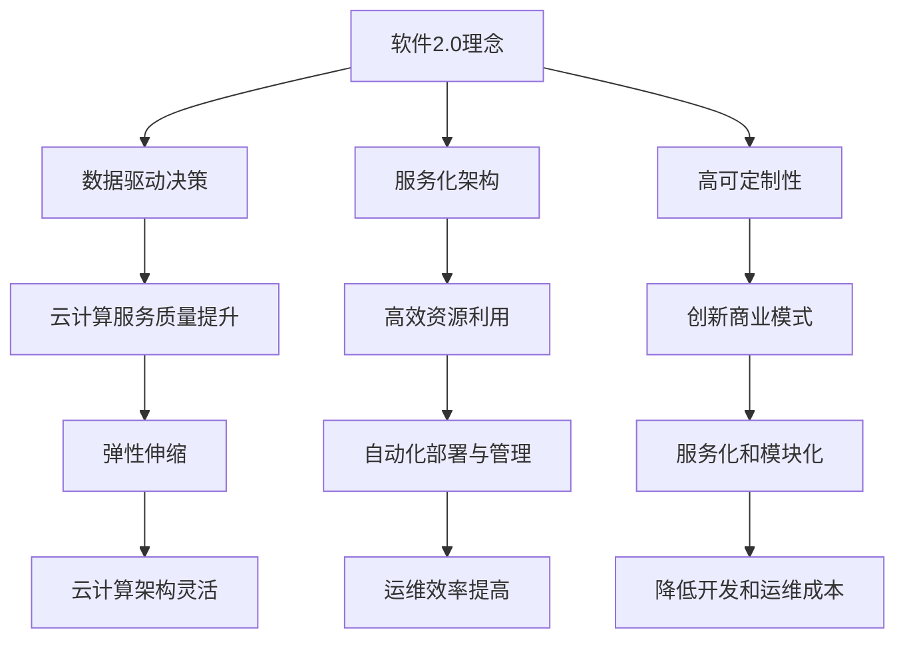
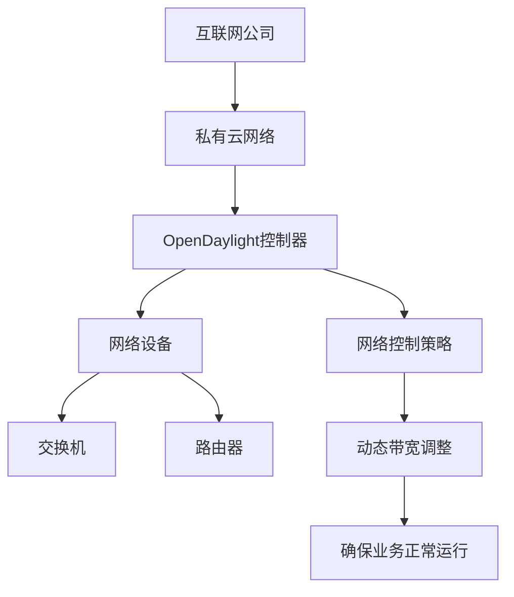
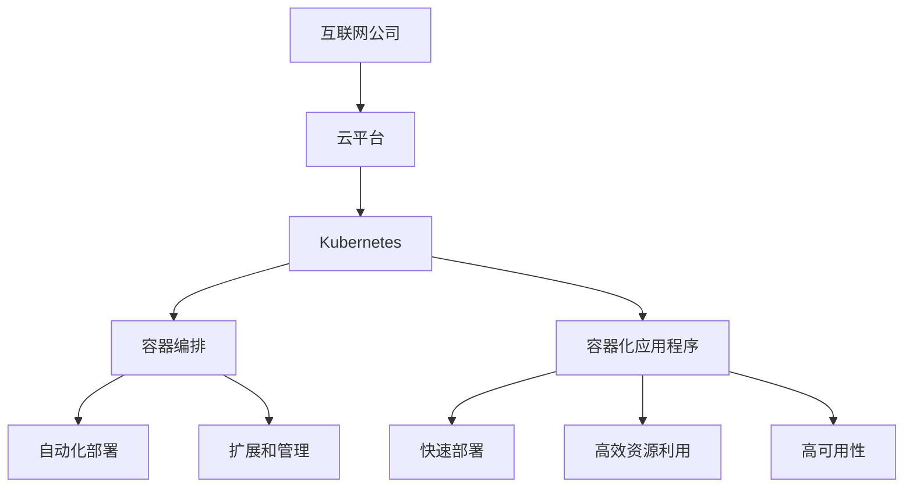
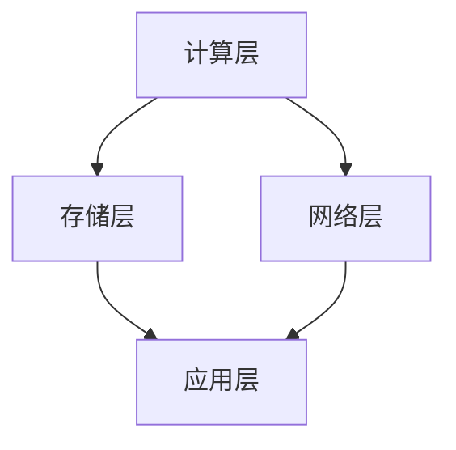
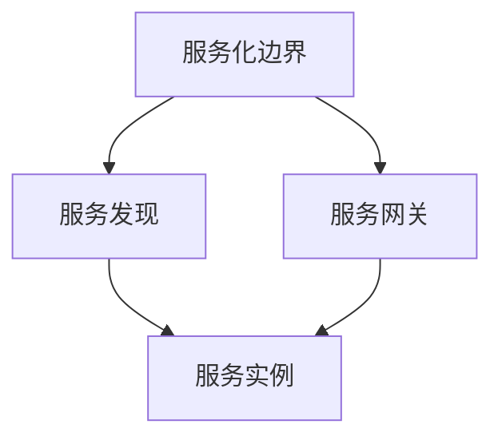
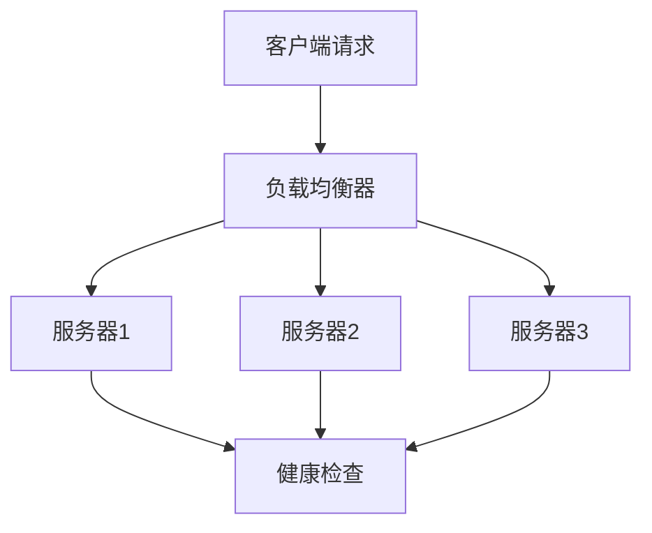
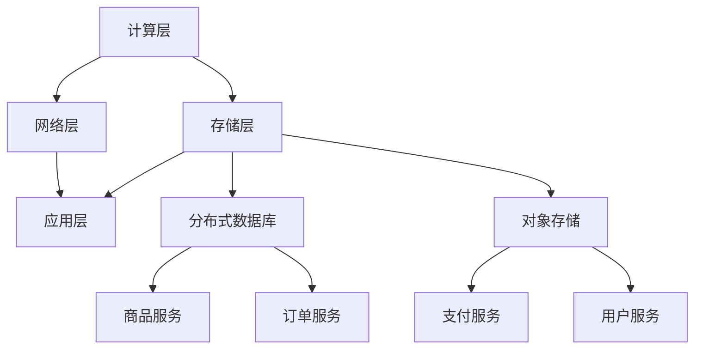

                 

# 《软件2.0如何改变云计算架构》

## 关键词

软件2.0，云计算架构，虚拟化技术，容器技术，服务网格，云计算安全性，云计算运维管理

## 摘要

随着软件2.0时代的到来，云计算架构面临着前所未有的变革。本文将深入探讨软件2.0如何影响云计算架构，包括其核心概念、核心技术、架构设计原则、服务构建、安全性和运维管理等方面。通过详细的数学模型、伪代码、实际案例和代码解读，本文旨在为读者提供全面而深刻的理解，帮助他们在软件2.0时代构建高效的云计算架构。

### 目录

# 《软件2.0如何改变云计算架构》

> **关键词：** 软件2.0，云计算架构，虚拟化技术，容器技术，服务网格，云计算安全性，云计算运维管理

> **摘要：** 随着软件2.0时代的到来，云计算架构面临着前所未有的变革。本文将深入探讨软件2.0如何影响云计算架构，包括其核心概念、核心技术、架构设计原则、服务构建、安全性和运维管理等方面。通过详细的数学模型、伪代码、实际案例和代码解读，本文旨在为读者提供全面而深刻的理解，帮助他们在软件2.0时代构建高效的云计算架构。

## 第一部分：软件2.0时代的云计算概述

### 第1章：软件2.0与云计算架构概述

#### 1.1 软件2.0的概念

软件2.0是指从传统的软件1.0时代（即传统的软件应用时代）向以数据为中心，以服务为核心的下一代软件时代的转变。软件2.0强调数据的集成、共享和利用，推动了软件从单体应用向分布式服务模式的转变。

#### 1.2 云计算架构的基本概念

云计算是一种通过互联网提供计算资源、存储资源和网络资源的计算模式，它可以分为IaaS（基础设施即服务）、PaaS（平台即服务）和SaaS（软件即服务）三种服务模型。

#### 1.3 软件2.0与云计算的融合

软件2.0与云计算的结合，不仅提升了云计算的服务质量和效率，还为云计算带来了新的商业模式和服务形态。例如，通过软件2.0的理念，云计算可以提供更加灵活、定制化的服务，满足不同用户的需求。

#### 1.4 软件2.0时代的云计算架构特点

软件2.0时代的云计算架构具有以下特点：

1. 弹性伸缩：云计算平台可以根据用户需求动态调整计算资源，实现弹性伸缩。
2. 自动化部署与管理：通过自动化工具实现云计算服务的快速部署、扩展和管理。
3. 服务化和模块化：云计算服务以模块化方式提供服务，便于用户灵活选择和组合。

### 第2章：软件2.0核心技术与云计算

#### 2.1 软件定义网络（SDN）

软件定义网络（SDN）是一种新型的网络架构，它通过将网络控制平面与数据平面分离，实现了网络控制与数据转发功能的分离，从而使得网络管理更加灵活、可编程和自动化。

#### 2.2 虚拟化技术

虚拟化技术是一种将一台物理服务器虚拟成多台虚拟服务器的技术，它提高了硬件资源的利用率和灵活性。虚拟化技术是云计算的核心技术之一，为云计算提供了弹性的计算资源。

#### 2.3 容器技术

容器技术是一种轻量级的、可移植的计算环境，它将应用程序及其依赖项封装在一个独立的运行时环境中，使得应用程序可以在不同的操作系统和硬件平台上无缝运行。容器技术提高了云计算平台的资源利用和部署效率。

#### 2.4 服务网格（Service Mesh）

服务网格是一种用于管理和通信服务之间的交互的网络层抽象，它将服务之间的通信、监控和安全性等功能集中管理，从而简化了微服务架构的复杂度。

## 第二部分：软件2.0时代的云计算架构设计

### 第3章：云计算架构设计原则与模式

#### 3.1 云计算架构设计原则

云计算架构设计原则包括：

1. 可扩展性：云计算架构应具备良好的可扩展性，以适应业务需求的增长。
2. 可用性：云计算架构应确保服务的持续可用性，降低故障对业务的影响。
3. 安全性：云计算架构应具备完善的安全措施，保护用户数据的安全。

#### 3.2 云计算架构设计模式

云计算架构设计模式包括：

1. 分层架构：将云计算架构分为多个层次，实现模块化和松耦合。
2. 微服务架构：将应用拆分为多个独立的微服务，提高系统的可扩展性和灵活性。
3. 负载均衡架构：通过负载均衡技术，实现云计算资源的合理分配和高效利用。

### 第4章：软件2.0时代的云计算服务构建

#### 4.1 IaaS服务构建

IaaS服务构建包括：

1. 虚拟化技术：通过虚拟化技术创建和管理虚拟服务器。
2. 资源调度：实现计算资源、存储资源和网络资源的动态调度。

#### 4.2 PaaS服务构建

PaaS服务构建包括：

1. 平台搭建：搭建支持开发、部署和管理的云计算平台。
2. 服务集成：将多种服务集成到云计算平台，提供一站式服务。

#### 4.3 SaaS服务构建

SaaS服务构建包括：

1. 应用开发：开发适用于不同行业的SaaS应用。
2. 服务部署：将SaaS应用部署到云计算平台，提供按需服务。

### 第5章：软件2.0时代的云计算安全性

#### 5.1 云计算安全挑战

云计算安全挑战包括：

1. 数据安全：保护用户数据的安全性，防止数据泄露和篡改。
2. 网络安全：防范网络攻击和恶意行为，确保网络通信的安全性。
3. 应用安全：检测和防御应用漏洞，防止应用受到攻击。

#### 5.2 云计算安全策略

云计算安全策略包括：

1. 安全隔离：通过隔离技术，确保不同用户和服务的安全隔离。
2. 访问控制：通过访问控制技术，限制用户对云资源的访问权限。
3. 数据加密：通过数据加密技术，保护用户数据的安全。

### 第6章：软件2.0时代的云计算运维管理

#### 6.1 云计算运维管理概述

云计算运维管理是确保云计算平台稳定运行的关键环节，它包括服务监控、性能优化和故障恢复等。

#### 6.2 云计算自动化运维

云计算自动化运维是提高云计算平台效率和管理效率的关键手段，它包括自动化部署、自动化扩展和自动化监控等。

#### 6.3 云服务优化与监控

云服务优化与监控是确保云计算平台高效运行的重要手段，它包括性能监控、容量规划和故障处理等。

## 第三部分：软件2.0时代云计算架构的应用案例

### 第7章：企业级云计算架构应用案例

#### 7.1 案例一：互联网公司云计算架构设计

本案例将分析某互联网公司云计算架构的设计方案，包括业务需求分析、架构设计原则和具体实现等。

#### 7.2 案例二：金融行业云计算架构建设

本案例将探讨某金融行业企业如何利用云计算技术进行架构建设，包括业务需求分析、架构设计原则和实际应用等。

#### 7.3 案例三：制造业云计算架构优化

本案例将分析某制造业企业如何通过云计算技术进行架构优化，提高业务效率和资源利用率。

## 附录

### 附录A：云计算相关工具与技术介绍

本附录将介绍云计算领域中常用的工具和技术，包括Kubernetes、Docker、CloudFormation和Terraform等。

---

在接下来的部分，我们将逐步深入探讨软件2.0时代的云计算架构，包括其核心概念、核心技术、架构设计原则、服务构建、安全性和运维管理等方面。通过详细的数学模型、伪代码、实际案例和代码解读，我们将帮助读者全面理解软件2.0时代云计算架构的创新与应用。

---

## 第一部分：软件2.0时代的云计算概述

### 第1章：软件2.0与云计算架构概述

#### 1.1 软件2.0的概念

软件2.0是继传统软件1.0时代之后的全新阶段，它标志着软件从以功能为中心向以数据和用户为中心的转变。软件2.0强调数据的价值和用户参与，通过数据的集成、共享和利用，实现软件的智能化和服务化。软件2.0的核心特征包括：

1. **数据驱动的决策：** 软件2.0以数据为核心，通过大数据分析和人工智能算法，实现对用户行为的精准预测和个性化推荐。
2. **服务化的架构：** 软件2.0不再局限于单体应用，而是采用分布式服务架构，提供模块化、可组合的服务。
3. **高度的可定制性：** 用户可以根据自己的需求，灵活配置和使用软件服务，实现软件的个性化和定制化。

#### 1.2 云计算架构的基本概念

云计算是一种通过互联网提供计算资源、存储资源和网络资源的计算模式。云计算架构可以分为以下几类：

1. **IaaS（基础设施即服务）：** 提供虚拟化的计算资源，如虚拟机、存储和网络，用户可以灵活地配置和使用这些资源。
2. **PaaS（平台即服务）：** 提供开发、运行和管理应用的云计算平台，开发者可以在平台上开发、测试和部署应用。
3. **SaaS（软件即服务）：** 提供基于云计算的应用程序，用户可以通过互联网按需使用这些应用程序。

云计算架构的关键概念包括：

1. **虚拟化技术：** 通过虚拟化技术，将物理资源抽象为逻辑资源，实现资源的灵活分配和管理。
2. **自动化管理：** 通过自动化工具，实现资源的自动化部署、扩展和管理，提高运维效率。
3. **弹性伸缩：** 根据用户需求动态调整计算资源，实现计算资源的弹性伸缩，提高资源利用率。

#### 1.3 软件2.0与云计算的融合

软件2.0与云计算的结合，推动了云计算服务质量和效率的提升，同时也为云计算带来了新的商业模式和服务形态。以下是软件2.0对云计算的影响：

1. **灵活的服务模型：** 软件2.0的理念使得云计算可以提供更加灵活、定制化的服务，满足不同用户的需求。
2. **高效的资源利用：** 软件2.0通过数据驱动的决策和自动化管理，提高了云计算平台的资源利用效率。
3. **创新的商业模式：** 软件2.0的理念催生了新的商业模式，如基于数据的增值服务、云计算平台的生态构建等。

云计算在软件2.0时代的发展趋势包括：

1. **服务化：** 云计算平台将更多的服务模块化、服务化，提供一站式服务，降低用户使用门槛。
2. **智能化：** 通过大数据分析和人工智能技术，云计算平台将实现智能化的资源管理和服务优化。
3. **生态化：** 云计算平台将构建生态系统，吸引更多的开发者和服务提供商，提供丰富的应用和服务。

#### 1.4 软件2.0时代的云计算架构特点

软件2.0时代的云计算架构具有以下特点：

1. **弹性伸缩：** 云计算平台可以根据用户需求动态调整计算资源，实现弹性伸缩，提高资源利用率。
2. **自动化部署与管理：** 通过自动化工具，实现云计算服务的快速部署、扩展和管理，提高运维效率。
3. **服务化和模块化：** 云计算服务以模块化方式提供服务，便于用户灵活选择和组合，降低开发和运维成本。

### Mermaid流程图

下面是软件2.0与云计算架构融合的Mermaid流程图：



#### 1.5 软件2.0时代的云计算架构优势

软件2.0时代的云计算架构具有以下优势：

1. **成本效益：** 通过虚拟化和自动化，云计算平台可以大幅降低硬件投资和运维成本。
2. **灵活性：** 用户可以根据业务需求灵活调整计算资源，实现快速部署和扩展。
3. **可扩展性：** 云计算平台可以动态扩展计算资源，满足业务增长需求。
4. **可靠性：** 云计算平台提供高可用性服务，降低业务中断风险。
5. **安全性：** 云计算平台提供多层次的安全措施，保护用户数据的安全。

#### 1.6 软件2.0时代的云计算架构挑战

软件2.0时代的云计算架构也面临着一些挑战：

1. **数据安全：** 云计算环境中的数据安全成为关键问题，需要采取有效的安全措施保护用户数据。
2. **数据隐私：** 随着数据的集中存储和处理，用户数据隐私保护成为重点关注领域。
3. **复杂度：** 软件2.0时代的云计算架构更加复杂，对运维人员的技术要求更高。
4. **合规性：** 随着云计算的普及，合规性问题越来越重要，需要遵循相关法律法规和行业标准。

### 小结

软件2.0时代的云计算架构通过数据驱动、服务化和自动化，实现了高效、灵活和可靠的计算服务。了解软件2.0时代的云计算架构特点、优势和挑战，有助于我们更好地利用云计算技术，为企业和个人提供优质的服务。

## 第二部分：软件2.0核心技术与云计算

### 第2章：软件2.0核心技术与云计算

软件2.0时代的云计算架构离不开一系列核心技术的支持，这些技术包括软件定义网络（SDN）、虚拟化技术、容器技术和服务网格（Service Mesh）等。这些技术共同推动了云计算架构的变革，提高了云计算服务的质量和效率。

#### 2.1 软件定义网络（SDN）

软件定义网络（SDN）是一种新型的网络架构，它通过将网络控制平面与数据平面分离，实现了网络控制与数据转发功能的分离。SDN的核心思想是将网络控制功能集中到一台控制器上，通过软件的方式实现网络资源的动态分配和管理。

##### 2.1.1 SDN的基本概念

SDN主要由三个组件组成：

1. **控制器（Controller）：** 控制器是SDN的核心，负责管理和控制整个网络。控制器接收来自应用程序的指令，然后通过南向接口（Southbound Interface）将这些指令发送到网络设备，实现网络控制。
2. **应用层（Application Layer）：** 应用层是SDN的控制平面，开发者可以在这个层面编写应用程序，根据业务需求实现网络控制策略。
3. **网络设备（Switches and Routers）：** 网络设备是SDN的数据平面，负责执行控制器发送的指令，实现数据包的转发。

##### 2.1.2 SDN与云计算的结合

SDN与云计算的结合，可以带来以下好处：

1. **灵活的网络管理：** 通过SDN，云计算平台可以实现网络资源的动态分配和管理，提高资源利用率和网络性能。
2. **网络流量的优化：** SDN控制器可以实时监控网络状态，根据业务需求优化网络流量，降低网络延迟，提高数据传输速度。
3. **安全性和隔离性：** SDN支持网络流量的细粒度控制，可以实现不同用户和服务的安全隔离，提高云计算平台的安全性。

##### 2.1.3 SDN在云计算中的应用案例

以下是一个SDN在云计算中的应用案例：

**案例：** 一家互联网公司利用SDN技术构建其私有云网络。该公司使用OpenDaylight作为SDN控制器，将网络设备（如交换机和路由器）连接到控制器。通过控制器，该公司可以实现网络资源的动态分配和管理，例如，当某个部门需要更多的网络带宽时，控制器会自动调整网络带宽分配，确保业务的正常运行。



#### 2.2 虚拟化技术

虚拟化技术是云计算架构的核心技术之一，它通过将物理资源抽象为逻辑资源，实现计算资源、存储资源和网络资源的灵活分配和管理。虚拟化技术主要包括以下几种：

1. **硬件虚拟化（Hardware Virtualization）：** 硬件虚拟化通过虚拟化硬件资源（如CPU、内存、存储和网络），创建虚拟机（VM），使得多个操作系统和应用程序可以在同一台物理服务器上独立运行。
2. **操作系统虚拟化（Operating System Virtualization）：** 操作系统虚拟化通过虚拟化操作系统，实现多个操作系统实例在同一物理服务器上的并行运行。常见的操作系统虚拟化技术包括Windows Server Hyper-V和Linux容器。
3. **存储虚拟化（Storage Virtualization）：** 存储虚拟化通过虚拟化存储资源，实现存储资源的集中管理和灵活分配。常见的存储虚拟化技术包括SAN（存储区域网络）和NAS（网络附加存储）。
4. **网络虚拟化（Network Virtualization）：** 网络虚拟化通过虚拟化网络资源，实现虚拟网络和物理网络的隔离和灵活管理。网络虚拟化技术包括VLAN（虚拟局域网）和VXLAN（虚拟扩展局域网）。

##### 2.2.1 虚拟化技术的发展历程

虚拟化技术起源于20世纪70年代，随着计算机硬件的发展，虚拟化技术逐渐成熟并应用于云计算领域。以下是虚拟化技术的发展历程：

1. **1970年代：** 虚拟机的概念首次提出，早期虚拟化技术主要用于大型机。
2. **1990年代：** 虚拟化技术开始应用于服务器虚拟化，如VMware ESX Server。
3. **2000年代：** 虚拟化技术逐渐应用于存储和网络虚拟化，如Storage Area Network（SAN）和Network Attached Storage（NAS）。
4. **2010年代：** 虚拟化技术广泛应用于云计算领域，成为云计算架构的核心技术。

##### 2.2.2 虚拟化技术在云计算中的应用

虚拟化技术在云计算中的应用主要表现在以下几个方面：

1. **弹性伸缩：** 虚拟化技术可以实现计算资源的动态调整，根据业务需求自动扩展或缩减虚拟机数量，提高资源利用率。
2. **高可用性：** 虚拟化技术可以将虚拟机分布在不同的物理服务器上，实现负载均衡和故障转移，提高系统的可用性。
3. **安全性：** 虚拟化技术可以实现虚拟机间的隔离，保护虚拟机之间的数据安全和隐私。
4. **灵活部署：** 虚拟化技术使得云计算服务的部署更加灵活，可以在不同的物理服务器和云平台上快速部署和迁移。

##### 2.2.3 虚拟化技术的数学模型

虚拟化技术的核心在于资源分配和调度，下面是一个简单的数学模型来描述虚拟化技术的资源调度过程：

```latex
\text{资源分配模型：}
\begin{align*}
    \text{最优资源分配} &= \arg\min \sum_{i=1}^{n} (C_i - S_i) \\
    \text{其中：} \\
    C_i &= \text{虚拟机}i \text{的CPU需求} \\
    S_i &= \text{虚拟机}i \text{的CPU可用资源}
\end{align*}
```

#### 2.3 容器技术

容器技术是一种轻量级、可移植的计算环境，它将应用程序及其依赖项封装在一个独立的运行时环境中，使得应用程序可以在不同的操作系统和硬件平台上无缝运行。容器技术的核心是Docker，它通过将应用程序的运行环境封装在容器中，实现应用程序的标准化和可移植性。

##### 2.3.1 容器的基本概念

容器技术的主要概念包括：

1. **容器（Container）：** 容器是一个轻量级、独立的运行时环境，它包含了应用程序及其依赖项，可以独立运行在各种操作系统和硬件平台上。
2. **Docker：** Docker是一个开源容器引擎，它提供了一套容器化技术，用于打包、发布和管理应用程序。
3. **镜像（Image）：** 镜像是容器的模板，它包含了应用程序及其依赖项，用于创建和运行容器。
4. **容器编排（Container Orchestration）：** 容器编排是指管理和调度容器的过程，常见的容器编排工具包括Kubernetes和Docker Swarm。

##### 2.3.2 容器与云计算的结合

容器技术是云计算时代的重要技术之一，它为云计算平台提供了高效的资源利用和快速部署的能力。容器与云计算的结合，可以实现以下优势：

1. **快速部署：** 容器化的应用程序可以快速部署和启动，缩短了应用程序的上线时间。
2. **高效资源利用：** 容器具有轻量级、可移植的特性，可以高效地利用计算资源。
3. **高可用性：** 容器编排工具可以实现容器的自动化部署、扩展和管理，提高系统的可用性。
4. **安全性：** 容器可以通过隔离技术，确保容器之间的安全隔离，保护应用程序的安全。

##### 2.3.3 容器技术在云计算中的应用案例

以下是一个容器技术在云计算中的应用案例：

**案例：** 一家互联网公司使用Kubernetes作为容器编排工具，将应用程序部署到云平台上。该公司通过Kubernetes实现容器的自动化部署、扩展和管理，提高了系统的可用性和资源利用率。



##### 2.3.4 容器技术的数学模型

容器技术的核心在于资源分配和调度，下面是一个简单的数学模型来描述容器的资源调度过程：

```latex
\text{资源分配模型：}
\begin{align*}
    \text{最优资源分配} &= \arg\min \sum_{i=1}^{n} (R_i - U_i) \\
    \text{其中：} \\
    R_i &= \text{容器}i \text{的资源需求} \\
    U_i &= \text{容器}i \text{的可用资源}
\end{align*}
```

#### 2.4 服务网格（Service Mesh）

服务网格是一种用于管理和通信服务之间的交互的网络层抽象，它将服务之间的通信、监控和安全性等功能集中管理，从而简化了微服务架构的复杂度。服务网格的主要组件包括服务发现、服务间通信、服务监控和安全性等。

##### 2.4.1 服务网格的概念

服务网格主要由以下组件组成：

1. **服务代理（Service Proxy）：** 服务代理是服务网格的核心组件，它负责代理服务之间的通信，提供负载均衡、服务发现和故障转移等功能。
2. **服务发现（Service Discovery）：** 服务发现组件负责跟踪服务实例的运行状态，并将服务实例的信息注册到服务注册中心，实现服务之间的动态发现和路由。
3. **服务间通信（Inter-service Communication）：** 服务间通信组件负责处理服务之间的请求和响应，提供可靠、高效的通信机制。
4. **服务监控（Service Monitoring）：** 服务监控组件负责监控服务实例的运行状态，收集性能指标和日志，实现服务故障的及时发现和处理。
5. **安全性（Security）：** 服务网格提供安全性的组件，包括身份验证、授权和加密等，确保服务之间的通信安全。

##### 2.4.2 服务网格在云计算中的应用

服务网格在云计算中的应用，可以带来以下好处：

1. **服务隔离：** 服务网格可以确保服务之间的隔离，防止服务之间的相互干扰，提高系统的稳定性。
2. **流量管理：** 服务网格可以提供灵活的流量管理机制，实现服务之间的流量控制和路由，提高系统的性能和可用性。
3. **监控和告警：** 服务网格可以提供实时的服务监控和告警功能，及时发现和处理服务故障，确保系统的稳定运行。
4. **安全性：** 服务网格可以提供安全性的组件，确保服务之间的通信安全，防止数据泄露和恶意攻击。

##### 2.4.3 服务网格的数学模型

服务网格的数学模型主要涉及服务之间的通信调度和流量分配。下面是一个简单的数学模型来描述服务网格的流量分配过程：

```latex
\text{流量分配模型：}
\begin{align*}
    \text{最优流量分配} &= \arg\min \sum_{i=1}^{n} (C_i - T_i) \\
    \text{其中：} \\
    C_i &= \text{服务}i \text{的负载能力} \\
    T_i &= \text{服务}i \text{的当前流量}
\end{align*}
```

### 小结

软件2.0时代的云计算架构离不开核心技术的支持，包括软件定义网络（SDN）、虚拟化技术、容器技术和服务网格（Service Mesh）。这些核心技术共同推动了云计算架构的变革，提高了云计算服务的质量和效率。通过本章的介绍，读者可以了解到这些核心技术的基本概念、原理和应用案例，为后续的云计算架构设计和实践打下基础。

## 第三部分：软件2.0时代的云计算架构设计

### 第3章：云计算架构设计原则与模式

在软件2.0时代，云计算架构的设计原则和模式对于构建高效、可靠和可扩展的云计算服务至关重要。本章节将详细介绍云计算架构设计的原则和模式，包括分层架构、微服务架构和负载均衡架构等。

#### 3.1 云计算架构设计原则

云计算架构设计应遵循以下原则：

1. **可扩展性（Scalability）：** 云计算架构应具备良好的可扩展性，能够根据业务需求动态调整计算资源，实现弹性伸缩。
2. **可用性（Availability）：** 云计算架构应确保服务的持续可用性，降低故障对业务的影响，提供高可用性服务。
3. **安全性（Security）：** 云计算架构应具备完善的安全措施，保护用户数据的安全，防止数据泄露和网络攻击。
4. **灵活性和可定制性（Flexibility and Customizability）：** 云计算架构应提供灵活的服务模型，用户可以根据需求灵活配置和使用服务。
5. **成本效益（Cost-effectiveness）：** 云计算架构设计应考虑成本效益，降低硬件投资和运维成本，提高资源利用效率。

#### 3.2 云计算架构设计模式

云计算架构设计模式主要包括以下几种：

1. **分层架构（Layered Architecture）：** 分层架构将云计算架构分为多个层次，实现模块化和松耦合。常见的分层架构包括计算层、存储层、网络层和应用层等。
2. **微服务架构（Microservices Architecture）：** 微服务架构将应用拆分为多个独立的微服务，每个微服务负责完成特定的功能，独立部署和扩展。微服务架构提高了系统的灵活性和可扩展性，降低了维护成本。
3. **负载均衡架构（Load Balancing Architecture）：** 负载均衡架构通过将请求分配到多个服务器，实现负载均衡，提高系统的性能和可用性。常见的负载均衡策略包括轮询、最小连接数和加权轮询等。

#### 3.3 分层架构

分层架构是云计算架构设计的一种常见模式，它将系统划分为多个层次，实现模块化和松耦合。以下是分层架构的常见层次：

1. **计算层（Compute Layer）：** 计算层负责提供计算资源，包括虚拟机、容器和服务器等。计算层的设计应考虑可扩展性和资源利用率。
2. **存储层（Storage Layer）：** 存储层负责提供数据存储和访问服务，包括关系型数据库、非关系型数据库和对象存储等。存储层的设计应考虑数据可靠性和访问性能。
3. **网络层（Network Layer）：** 网络层负责提供网络连接和传输服务，包括虚拟局域网（VLAN）、虚拟专用网络（VPN）和负载均衡器等。网络层的设计应考虑网络的可靠性和性能。
4. **应用层（Application Layer）：** 应用层负责提供业务逻辑和服务，包括Web应用、移动应用和云计算服务等。应用层的设计应考虑服务的可扩展性和可定制性。

分层架构的Mermaid流程图如下：



#### 3.4 微服务架构

微服务架构是一种基于业务能力划分的应用架构，它将应用拆分为多个独立的微服务，每个微服务负责完成特定的功能。以下是微服务架构的核心概念：

1. **微服务（Microservice）：** 微服务是一个小型、独立和自包含的软件单元，负责实现特定的业务功能。每个微服务都可以独立部署、扩展和管理。
2. **服务化边界（Service Boundaries）：** 微服务架构通过服务化边界定义服务之间的接口，实现服务之间的松耦合和模块化。
3. **服务发现（Service Discovery）：** 服务发现是指服务实例的自动注册和发现机制，确保服务之间的动态连接和通信。
4. **服务网关（Service Gateway）：** 服务网关负责统一服务接口的管理和流量控制，提供统一的服务入口和路由策略。

微服务架构的Mermaid流程图如下：



#### 3.5 负载均衡架构

负载均衡架构通过将请求分配到多个服务器，实现负载均衡，提高系统的性能和可用性。以下是负载均衡架构的核心概念：

1. **负载均衡器（Load Balancer）：** 负载均衡器负责接收客户端请求，并将请求分配到多个服务器，实现流量的负载均衡。
2. **负载均衡策略（Load Balancing Strategies）：** 负载均衡策略决定了请求如何分配到服务器，常见的策略包括轮询（Round Robin）、最小连接数（Least Connections）和加权轮询（Weighted Round Robin）等。
3. **健康检查（Health Check）：** 健康检查是指对服务器进行定期检查，确保服务器处于健康状态，及时发现和处理故障服务器。

负载均衡架构的Mermaid流程图如下：



#### 3.6 云计算架构设计案例分析

以下是一个云计算架构设计的案例分析：

**案例分析：** 一家电子商务公司计划构建一个云计算平台，提供在线购物服务。公司业务需求包括高并发访问、数据存储和安全保障等。

1. **计算层设计：** 公司使用Kubernetes作为容器编排工具，将应用部署在多个虚拟机或容器上，实现计算资源的弹性伸缩。
2. **存储层设计：** 公司使用分布式数据库（如MongoDB）和对象存储（如Amazon S3），实现海量数据的存储和访问。
3. **网络层设计：** 公司使用虚拟局域网（VLAN）和虚拟专用网络（VPN），实现内部网络的安全隔离和外部网络的访问控制。
4. **应用层设计：** 公司将业务拆分为多个微服务，包括商品服务、订单服务、支付服务和用户服务等，每个微服务负责特定的业务功能。

云计算架构设计的Mermaid流程图如下：



### 小结

云计算架构设计原则和模式对于构建高效、可靠和可扩展的云计算服务至关重要。通过遵循可扩展性、可用性、安全性、灵活性和成本效益等设计原则，结合分层架构、微服务架构和负载均衡架构等设计模式，可以构建出满足业务需求的云计算架构。本章介绍了云计算架构设计原则和模式，并通过案例分析展示了实际应用。

## 第四部分：软件2.0时代的云计算服务构建

### 第4章：软件2.0时代的云计算服务构建

在软件2.0时代，云计算服务的构建是构建高效、灵活和可扩展的云计算平台的关键。本章节将详细介绍云计算服务的构建方法，包括IaaS、PaaS和SaaS服务的构建过程、关键技术、实际案例和代码解读。

#### 4.1 IaaS服务构建

IaaS（基础设施即服务）是一种提供基础设施资源的云计算服务，包括虚拟机、存储、网络和硬件资源等。IaaS服务的构建过程如下：

1. **基础设施搭建：** 首先需要搭建基础设施，包括物理服务器、存储设备和网络设备等。
2. **虚拟化技术：** 使用虚拟化技术，将物理服务器虚拟化为多个虚拟机，实现硬件资源的抽象和灵活分配。
3. **资源管理：** 使用资源管理系统，实现虚拟机的创建、启动、停止和扩展等操作。
4. **网络配置：** 配置虚拟机的网络，实现虚拟机之间的通信和网络隔离。
5. **安全措施：** 实施安全策略，包括防火墙、入侵检测和访问控制等，保护虚拟机和用户数据的安全。

##### 4.1.1 IaaS服务构建关键技术和实际案例

**关键技术和工具：**

- **虚拟化技术：** 如KVM、VMware ESXi和Hyper-V等。
- **资源管理系统：** 如OpenStack、VMware vCenter和AWS EC2等。
- **网络配置工具：** 如Vagrant、Puppet和Ansible等。
- **安全工具：** 如防火墙、入侵检测系统和访问控制系统等。

**实际案例：**

**案例：** 一家创业公司需要构建一个私有云平台，提供IaaS服务。公司选择了OpenStack作为资源管理系统，使用KVM进行虚拟化，使用Vagrant进行虚拟机配置，使用Ansible进行自动化部署和配置管理。

```bash
# 安装OpenStack
sudo apt update && sudo apt upgrade
sudo apt install openstack-packstack

# 配置KVM虚拟化
sudo systemctl enable libvirtd
sudo systemctl start libvirtd

# 创建虚拟机
sudo virt-install --name myvm --ram 1024 --vcpus 2 --disk path=/var/lib/libvirt/images/myvm.img,bus=virtio --os-type linux --location http://xx.xx.xx.xx/repo/

# 配置网络
sudo virsh net-start default

# 安装Vagrant
sudo apt install vagrant

# 使用Vagrant创建虚拟机
vagrant init
vagrant up
```

##### 4.1.2 IaaS服务构建代码解读

以下是一个使用Python和OpenStack SDK创建虚拟机的示例代码：

```python
from keystoneauth1 import session
from novaclient import client

# 创建Keystone认证
auth = KeystoneAuth.get_auth()
session = session.Session(auth=auth)

# 创建Nova客户端
nova = client.Client('2.0', session=session)

# 创建虚拟机
server = nova.servers.create(
    'myvm',
    flavor='m1.small',
    image='Ubuntu 18.04',
    networks=['default']
)

# 等待虚拟机启动
server.wait_for_active()

print("虚拟机创建成功：{}".format(server.id))
```

#### 4.2 PaaS服务构建

PaaS（平台即服务）是一种提供开发、运行和管理应用的云计算服务，包括开发工具、数据库、中间件和运行环境等。PaaS服务的构建过程如下：

1. **平台搭建：** 首先需要搭建PaaS平台，包括Web服务器、应用服务器、数据库服务器和中间件等。
2. **开发工具：** 提供开发工具，如集成开发环境（IDE）和代码仓库，支持开发者进行应用开发。
3. **应用部署：** 提供应用部署和管理工具，支持应用的自动化部署、扩展和管理。
4. **监控和运维：** 提供监控和运维工具，实现对应用的实时监控和运维管理。

##### 4.2.1 PaaS服务构建关键技术和实际案例

**关键技术和工具：**

- **Web服务器：** 如Apache、Nginx和Tomcat等。
- **应用服务器：** 如Spring Boot、WildFly和WebLogic等。
- **数据库服务器：** 如MySQL、PostgreSQL和MongoDB等。
- **中间件：** 如RabbitMQ、Kafka和ActiveMQ等。
- **开发工具：** 如Eclipse、IntelliJ IDEA和Visual Studio等。
- **部署工具：** 如Docker、Kubernetes和Ansible等。
- **监控工具：** 如Prometheus、Grafana和Zabbix等。

**实际案例：**

**案例：** 一家互联网公司需要构建一个PaaS平台，支持微服务开发和部署。公司选择了Kubernetes作为容器编排工具，使用Spring Boot作为应用服务器，使用MySQL作为数据库。

```bash
# 安装Kubernetes
sudo apt update && sudo apt upgrade
sudo apt install kubeadm kubelet kubectl

# 初始化Kubernetes集群
sudo kubeadm init

# 配置kubectl工具
mkdir -p $HOME/.kube
sudo cp -i /etc/kubernetes/admin.conf $HOME/.kube/config
sudo chown $(id -u):$(id -g) $HOME/.kube/config

# 部署Nginx Ingress控制器
kubectl apply -f https://raw.githubusercontent.com/kubernetes/ingress-nginx/master/deploy/merge-default.yaml

# 部署Spring Boot应用
kubectl create deployment myapp --image=springboot/myapp

# 暴露应用服务
kubectl expose deployment myapp --type=LoadBalancer --name=myapp-service
```

##### 4.2.2 PaaS服务构建代码解读

以下是一个使用Kubernetes API创建Spring Boot应用的示例代码：

```python
from kubernetes import client, config

# 配置Kubernetes认证
config.load_kube_config()

# 创建Kubernetes API客户端
api = client.ApiClient()

# 创建Spring Boot应用部署
deployment = client.V1Deployment(
    api_version="apps/v1",
    kind="Deployment",
    metadata=client.V1ObjectMeta(name="myapp"),
    spec=client.V1DeploymentSpec(
        replicas=1,
        selector=client.V1LabelSelector(match_labels={"app": "myapp"}),
        template=client.V1PodTemplateSpec(
            metadata=client.V1ObjectMeta(labels={"app": "myapp"}),
            spec=client.V1PodSpec(
                containers=[
                    client.V1Container(
                        image="springboot/myapp",
                        name="myapp",
                        ports=[client.V1ContainerPort(container_port=8080)],
                    )
                ]
            )
        )
    )
)

# 创建部署
api_instance = client.ApiextensionsV1beta1Api(api)
api_instance.create_namespaced_deployment("default", deployment)

print("部署创建成功：{}".format(deployment.metadata.name))
```

#### 4.3 SaaS服务构建

SaaS（软件即服务）是一种提供云计算平台上的软件应用的云计算服务，用户可以通过互联网按需使用这些应用。SaaS服务的构建过程如下：

1. **应用开发：** 开发适用于不同行业的SaaS应用，如CRM、ERP和办公自动化等。
2. **部署和管理：** 将SaaS应用部署到云计算平台，使用自动化工具进行部署、扩展和管理。
3. **用户权限管理：** 提供用户权限管理功能，实现用户对应用的安全访问。
4. **计费和订阅：** 实现应用计费和订阅功能，支持按需付费和订阅模式。

##### 4.3.1 SaaS服务构建关键技术和实际案例

**关键技术和工具：**

- **应用开发框架：** 如Spring Boot、Django和React等。
- **部署和管理工具：** 如Docker、Kubernetes和Ansible等。
- **用户权限管理：** 如OAuth2、JWT和LDAP等。
- **计费和订阅平台：** 如AWS Marketplace、Google Cloud Platform和Microsoft Azure Marketplace等。

**实际案例：**

**案例：** 一家创业公司需要构建一个SaaS应用，提供客户关系管理（CRM）服务。公司选择了Spring Boot作为应用开发框架，使用Kubernetes进行部署和管理，使用OAuth2进行用户权限管理。

```bash
# 安装Kubernetes
sudo apt update && sudo apt upgrade
sudo apt install kubeadm kubelet kubectl

# 初始化Kubernetes集群
sudo kubeadm init

# 配置kubectl工具
mkdir -p $HOME/.kube
sudo cp -i /etc/kubernetes/admin.conf $HOME/.kube/config
sudo chown $(id -u):$(id -g) $HOME/.kube/config

# 部署CRM应用
kubectl create deployment crm --image=crmapp:latest

# 暴露应用服务
kubectl expose deployment crm --type=LoadBalancer --name=crm-service
```

##### 4.3.2 SaaS服务构建代码解读

以下是一个使用Spring Boot创建CRM应用的示例代码：

```java
@SpringBootApplication
public class CrmApplication {
    public static void main(String[] args) {
        SpringApplication.run(CrmApplication.class, args);
    }
}

@RestController
@RequestMapping("/api/customers")
public class CustomerController {
    @Autowired
    private CustomerService customerService;

    @GetMapping
    public List<Customer> getAllCustomers() {
        return customerService.getAllCustomers();
    }

    @PostMapping
    public Customer createCustomer(@RequestBody Customer customer) {
        return customerService.createCustomer(customer);
    }
}
```

#### 4.4 云服务优化与监控

云服务的优化与监控是确保云计算平台高效运行的重要环节，包括性能优化、容量规划和故障处理等。以下是云服务优化与监控的关键技术和实际案例：

##### 4.4.1 关键技术和工具

- **性能优化工具：** 如New Relic、AppDynamics和Dynatrace等。
- **容量规划工具：** 如AWS Elastic Beanstalk、Google Kubernetes Engine和Microsoft Azure App Service等。
- **故障处理工具：** 如PagerDuty、Opsgenie和VictorOps等。

##### 4.4.2 实际案例

**案例：** 一家电商公司使用Kubernetes进行应用部署，使用Prometheus进行监控和告警。公司使用Grafana创建监控仪表板，实时监控应用性能和资源使用情况。

```bash
# 安装Prometheus
sudo apt update && sudo apt upgrade
sudo apt install prometheus

# 配置Prometheus监控
sudo tee /etc/prometheus/prometheus.yml <<EOF
global:
  scrape_interval: 15s
  evaluation_interval: 15s
  scrape_timeout: 10s
  timeout: 10s
  external_labels:
    job: myapp

scrape_configs:
  - job_name: kubernetes-pods
    static_configs:
      - targets: ['kubernetes.default.svc:9090']
    metrics_path: '/metrics'
    params:
      format: ['prometheus']
EOF

# 启动Prometheus
sudo systemctl enable prometheus
sudo systemctl start prometheus

# 安装Grafana
sudo apt update && sudo apt upgrade
sudo apt install grafana

# 配置Grafana监控
sudo tee /etc/grafana/grafana.ini <<EOF
[general]
    server_http_addr = "0.0.0.0"
    server_http_port = 3000

[datadog]
    enabled = true
    api_key = your_datadog_api_key
    app_key = your_datadog_app_key
    org_id = your_datadog_org_id

[datadog_integration]
    enabled = true
    name = "Kubernetes Pods"
    data_source = "Prometheus"
    query = "sum(rate(http_requests_total{job=\"kubernetes-pods\"}[5m])) by (job)"
    target = "http_requests_total"
    unit = "requests_per_second"
    type = "singlestat"
    alert = "High Request Rate"
    thresholds = "100.0:5m"
    period = "5m"
    for = "10m"
    eval_interval = "5m"
    eval_target = "sum(rate(http_requests_total{job=\"kubernetes-pods\"}[5m])) by (job)"
    tags = ["job=kubernetes-pods"]
EOF

# 启动Grafana
sudo systemctl enable grafana-server
sudo systemctl start grafana-server
```

### 小结

软件2.0时代的云计算服务构建是构建高效、灵活和可扩展的云计算平台的关键。通过了解IaaS、PaaS和SaaS服务的构建过程、关键技术和实际案例，读者可以掌握云计算服务的构建方法，为实际应用提供指导。同时，云服务优化与监控技术可以帮助确保云计算平台的高效运行，提高用户满意度。

## 第五部分：软件2.0时代的云计算安全性

### 第5章：软件2.0时代的云计算安全性

在软件2.0时代，随着云计算技术的广泛应用，云计算安全成为一个至关重要的议题。本章节将详细介绍软件2.0时代的云计算安全性，包括云计算安全挑战、安全策略、数据保护和网络防护等方面的内容。

#### 5.1 云计算安全挑战

云计算安全挑战主要包括以下方面：

1. **数据安全：** 云计算环境中数据存储和处理集中，数据泄露、数据篡改和数据丢失等风险增加。
2. **网络安全：** 云计算平台通过网络连接外部世界，易受到网络攻击，如DDoS攻击、数据窃取和恶意软件传播等。
3. **应用安全：** 云计算平台上的应用程序可能存在漏洞和缺陷，易受到攻击和滥用。
4. **合规性和隐私：** 随着各国对数据隐私和合规性的要求越来越高，云计算平台需要遵守相关法律法规，保护用户隐私。
5. **多租户环境安全：** 云计算平台是多租户环境，需要确保不同租户之间的数据隔离和安全。

#### 5.2 云计算安全策略

为了应对云计算安全挑战，需要采取一系列安全策略：

1. **安全隔离：** 通过虚拟化和网络隔离技术，确保不同租户之间的数据隔离和安全。
2. **访问控制：** 实施严格的访问控制策略，确保用户只能访问授权的资源和服务。
3. **数据加密：** 对存储和传输的数据进行加密，防止数据泄露和篡改。
4. **入侵检测和防御：** 使用入侵检测系统和防御系统，实时监控和应对网络攻击和恶意行为。
5. **安全审计和监控：** 定期进行安全审计和监控，及时发现和处理安全问题和异常行为。
6. **身份验证和授权：** 实施多因素身份验证和授权机制，确保用户身份的合法性和安全性。

#### 5.3 数据保护

数据保护是云计算安全的重要方面，包括以下措施：

1. **数据备份：** 定期备份数据，确保在数据丢失或损坏时能够快速恢复。
2. **数据隔离：** 在云计算环境中，确保不同租户的数据隔离，防止数据泄露和篡改。
3. **数据加密：** 对敏感数据在存储和传输过程中进行加密，防止数据泄露和篡改。
4. **数据审计：** 实施数据审计机制，记录数据的访问和操作行为，以便在需要时追溯和审计。
5. **数据分类：** 根据数据的敏感程度和重要性，对数据进行分类和分级保护，采取不同的安全措施。

#### 5.4 网络防护

网络防护是保护云计算平台免受网络攻击的重要手段，包括以下措施：

1. **防火墙：** 使用防火墙限制外部访问，防止未经授权的访问和攻击。
2. **入侵检测和防御系统：** 实时监控网络流量，检测和防御恶意攻击行为。
3. **多因素身份验证：** 实施多因素身份验证，确保用户身份的合法性和安全性。
4. **网络隔离：** 通过虚拟局域网（VLAN）和虚拟专用网络（VPN）实现网络隔离，确保不同租户之间的安全隔离。
5. **DDoS攻击防御：** 部署DDoS攻击防御系统，防止大规模的网络攻击。

#### 5.5 云计算安全最佳实践

为了确保云计算平台的安全，可以参考以下最佳实践：

1. **安全设计：** 在设计云计算平台时，充分考虑安全性，确保系统架构和组件的安全性。
2. **定期安全培训：** 定期为员工提供安全培训，提高员工的安全意识和应对能力。
3. **安全审计和合规性检查：** 定期进行安全审计和合规性检查，确保系统符合相关法律法规和行业标准。
4. **应急响应计划：** 制定应急响应计划，确保在发生安全事件时能够迅速响应和处理。
5. **安全工具和软件更新：** 定期更新安全工具和软件，确保其具备最新的安全防护能力。

#### 5.6 实际案例

以下是一个云计算安全实际案例：

**案例：** 一家互联网公司使用AWS云服务，为了确保云计算平台的安全，采取了以下措施：

1. **数据保护：** 使用AWS KMS进行数据加密，确保存储在AWS S3中的数据加密存储。
2. **网络防护：** 使用AWS WAF（Web应用防火墙）保护Web应用程序，防止常见网络攻击。
3. **身份验证和访问控制：** 使用AWS IAM（身份和访问管理）实现用户身份验证和访问控制，确保用户只能访问授权的资源和服务。
4. **监控和告警：** 使用AWS CloudWatch进行监控和告警，实时监控系统性能和安全事件。

```python
# 使用AWS KMS加密数据
import boto3

kms = boto3.client('kms')

# 加密数据
plaintext = 'my_sensitive_data'
encrypted_text = kms.encrypt(
    KeyId='my_key_id',
    Plaintext=plaintext
)

# 解密数据
decrypted_text = kms.decrypt(
    CiphertextBlob=encrypted_text['CiphertextBlob']
)

print(f"Decrypted text: {decrypted_text['Plaintext'].decode('utf-8')}")
```

### 小结

软件2.0时代的云计算安全性是一个复杂而重要的议题。通过了解云计算安全挑战、安全策略、数据保护和网络防护等方面的内容，读者可以更好地保护云计算平台的安全。同时，实际案例和最佳实践的介绍，为读者提供了具体的操作指导和参考，有助于在实际项目中实施有效的云计算安全措施。

## 第六部分：软件2.0时代的云计算运维管理

### 第6章：软件2.0时代的云计算运维管理

在软件2.0时代，云计算运维管理成为了保障云计算平台稳定运行的关键。本章节将详细介绍云计算运维管理的目标、关键环节、自动化运维工具和监控与优化方法，以帮助读者更好地理解和实践云计算运维管理。

#### 6.1 云计算运维管理概述

云计算运维管理是指对云计算平台进行监控、维护、优化和故障处理的过程，以确保云计算服务的质量和可靠性。云计算运维管理的目标包括：

1. **确保服务的连续性：** 确保云计算服务在出现故障或异常情况时能够快速恢复，降低业务中断风险。
2. **优化资源利用率：** 通过监控和优化，提高云计算资源的利用率，降低运营成本。
3. **提升用户体验：** 提供稳定、高效、安全的云计算服务，提升用户满意度和竞争力。
4. **降低运维成本：** 通过自动化和优化，降低运维人员的工作量和运维成本。

云计算运维管理的关键环节包括：

1. **监控：** 对云计算平台的性能、资源利用率、系统状态和安全状况进行实时监控，及时发现和处理异常情况。
2. **维护：** 定期对云计算平台进行维护和升级，确保系统稳定运行。
3. **优化：** 通过性能优化、容量规划和技术升级等手段，提高云计算平台的性能和可靠性。
4. **故障处理：** 在出现故障或异常情况时，快速响应和处理，确保服务恢复。

#### 6.2 云计算自动化运维

云计算自动化运维是提高云计算平台效率和管理效率的关键手段。通过自动化工具，可以实现以下运维任务：

1. **自动化部署：** 使用自动化工具，如Ansible、Terraform和Kubernetes，实现云计算服务的自动化部署和配置。
2. **自动化扩展：** 根据业务需求，自动化调整计算资源和存储资源的容量，实现自动化扩展。
3. **自动化监控：** 使用监控工具，如Prometheus、Grafana和Zabbix，实现自动化监控和告警。
4. **自动化故障处理：** 自动检测和诊断故障，自动化执行故障恢复策略，确保服务的连续性。

以下是使用Ansible自动化部署虚拟机的示例代码：

```python
# hosts: myvm.ini
# vars:
#   image: "ubuntu-20.04"
#   public_ip: "192.168.1.10"

- name: Deploy virtual machine
  virt.deploy:
    name: "{{ inventory_hostname }}"
    image: "{{ image }}"
    public_ip: "{{ public_ip }}"
    state: present
```

#### 6.3 云服务优化与监控

云服务优化与监控是确保云计算平台高效运行的重要环节。以下是一些关键技术和方法：

1. **性能监控：** 监控云计算平台的性能指标，如CPU使用率、内存使用率、网络带宽和存储利用率等，及时发现和处理性能瓶颈。
2. **容量规划：** 根据业务需求和性能监控结果，进行容量规划和资源调整，确保云计算平台具备足够的资源应对高峰期。
3. **告警与通知：** 设置告警机制，当出现异常情况时，及时发送通知，通知运维人员进行处理。
4. **日志管理：** 收集和分析云计算平台的日志，发现潜在问题和安全威胁。
5. **自动化优化：** 使用自动化工具和算法，根据监控数据自动优化资源配置和系统性能。

以下是使用Prometheus和Grafana进行性能监控的示例代码：

```bash
# 安装Prometheus
sudo apt update && sudo apt upgrade
sudo apt install prometheus

# 配置Prometheus监控
sudo tee /etc/prometheus/prometheus.yml <<EOF
global:
  scrape_interval: 15s
  evaluation_interval: 15s
  scrape_timeout: 10s
  timeout: 10s
  external_labels:
    job: myapp

scrape_configs:
  - job_name: kubernetes-pods
    static_configs:
      - targets: ['kubernetes.default.svc:9090']
    metrics_path: '/metrics'
    params:
      format: ['prometheus']
EOF

# 启动Prometheus
sudo systemctl enable prometheus
sudo systemctl start prometheus

# 安装Grafana
sudo apt update && sudo apt upgrade
sudo apt install grafana

# 配置Grafana监控
sudo tee /etc/grafana/grafana.ini <<EOF
[general]
    server_http_addr = "0.0.0.0"
    server_http_port = 3000

[datadog]
    enabled = true
    api_key = your_datadog_api_key
    app_key = your_datadog_app_key
    org_id = your_datadog_org_id

[datadog_integration]
    enabled = true
    name = "Kubernetes Pods"
    data_source = "Prometheus"
    query = "sum(rate(http_requests_total{job=\"kubernetes-pods\"}[5m])) by (job)"
    target = "http_requests_total"
    unit = "requests_per_second"
    type = "singlestat"
    alert = "High Request Rate"
    thresholds = "100.0:5m"
    period = "5m"
    for = "10m"
    eval_interval = "5m"
    eval_target = "sum(rate(http_requests_total{job=\"kubernetes-pods\"}[5m])) by (job)"
    tags = ["job=kubernetes-pods"]
EOF

# 启动Grafana
sudo systemctl enable grafana-server
sudo systemctl start grafana-server
```

#### 6.4 云服务优化案例分析

以下是一个云服务优化实际案例：

**案例：** 一家电商公司使用AWS云服务，为了优化云服务性能，采取了以下措施：

1. **性能监控：** 使用AWS CloudWatch进行性能监控，监控关键性能指标，如CPU使用率、内存使用率和网络带宽等。
2. **容量规划：** 根据监控数据，进行容量规划，调整EC2实例的类型和数量，确保在高峰期具备足够的计算资源。
3. **自动化扩展：** 使用AWS Auto Scaling，实现自动扩展，根据业务需求动态调整EC2实例的数量。
4. **缓存优化：** 使用AWS CloudFront和AWS Elasticache，提高内容分发和网络请求的响应速度。

```python
# 使用AWS Auto Scaling自动扩展EC2实例
import boto3

asg = boto3.client('autoscaling')

# 创建自动扩展组
response = asg.create_auto_scaling_group(
    AutoScalingGroupName='my-asg',
    LaunchTemplate={
        'LaunchTemplateName': 'my-lt',
        'Version': '1'
    },
    MinSize=1,
    MaxSize=5,
    DesiredCapacity=1,
    TargetGroupReferences=[
        {
            'TargetGroupARN': 'arn:aws:elasticloadbalancing:region:account-id:targetgroup/my-target-group/1234567890123456'
        }
    ]
)

print("自动扩展组创建成功：{}".format(response['ResponseMetadata']['HTTPStatusCode']))
```

### 小结

软件2.0时代的云计算运维管理是保障云计算平台稳定运行的关键。通过了解云计算运维管理的目标、关键环节、自动化运维工具和监控与优化方法，读者可以更好地实践云计算运维管理，确保云计算平台的高效运行和用户满意度。同时，实际案例和示例代码为读者提供了具体的操作指导和参考。

## 第七部分：软件2.0时代云计算架构的应用案例

### 第7章：企业级云计算架构应用案例

本章节将通过三个具体案例，介绍企业级云计算架构在不同行业的应用，包括互联网公司、金融行业和制造业的云计算架构设计和实施。

#### 7.1 案例一：互联网公司云计算架构设计

**背景：** 一家互联网公司需要为其在线购物平台构建一个高可用、高性能和可扩展的云计算架构，以支持大量用户并发访问和业务快速增长。

**架构设计：**

1. **计算层：** 使用Kubernetes作为容器编排工具，将应用部署在多个EC2实例上，实现计算资源的动态扩展和负载均衡。
2. **存储层：** 使用AWS S3进行对象存储，存储用户上传的商品图片和文件，使用RDS进行关系型数据库存储，存储用户订单和商品信息。
3. **网络层：** 使用AWS VPC进行网络隔离，确保不同应用模块之间的安全隔离，使用AWS Elastic Load Balancer实现流量分发和负载均衡。
4. **应用层：** 采用微服务架构，将购物平台拆分为多个微服务，如商品服务、订单服务、支付服务和用户服务，每个微服务独立部署和扩展。

**实现细节：**

1. **容器编排：** 使用Helm进行Kubernetes应用部署和管理，使用Kubectl进行手动操作。
2. **数据库存储：** 使用AWS S3存储商品图片和文件，使用RDS存储用户订单和商品信息。
3. **网络配置：** 使用AWS VPC创建虚拟私有云，配置子网、安全组和路由表。
4. **负载均衡：** 使用AWS Elastic Load Balancer实现流量分发，使用Nginx Ingress Controller进行内部服务访问。

**代码示例：**

```yaml
# Kubernetes Deployment配置
apiVersion: apps/v1
kind: Deployment
metadata:
  name: myapp-deployment
spec:
  replicas: 3
  selector:
    matchLabels:
      app: myapp
  template:
    metadata:
      labels:
        app: myapp
    spec:
      containers:
      - name: myapp
        image: myapp:latest
        ports:
        - containerPort: 80
```

```bash
# 使用Helm部署应用
helm install myapp ./myapp-chart
```

#### 7.2 案例二：金融行业云计算架构建设

**背景：** 一家金融公司需要构建一个高可用、高可靠和合规的云计算架构，支持在线交易和金融服务。

**架构设计：**

1. **计算层：** 使用AWS EC2进行计算资源部署，使用AWS Lambda进行无服务器计算，处理实时交易处理和数据处理任务。
2. **存储层：** 使用AWS S3进行对象存储，存储交易数据和日志文件，使用DynamoDB进行NoSQL数据库存储，存储用户交易记录和账户信息。
3. **网络层：** 使用AWS VPC进行网络隔离，配置安全组和NACL，确保不同服务模块之间的安全隔离。
4. **应用层：** 采用微服务架构，将金融业务拆分为多个微服务，如交易服务、账户服务、支付服务和风险管理服务，每个微服务独立部署和扩展。

**实现细节：**

1. **计算资源：** 使用AWS EC2进行计算资源部署，使用AWS Lambda进行无服务器计算。
2. **数据库存储：** 使用AWS S3存储交易数据和日志文件，使用DynamoDB存储用户交易记录和账户信息。
3. **网络配置：** 使用AWS VPC创建虚拟私有云，配置子网、安全组和路由表。
4. **负载均衡：** 使用AWS Elastic Load Balancer实现流量分发，使用Nginx Ingress Controller进行内部服务访问。

**代码示例：**

```yaml
# AWS Lambda函数配置
{
  " Runtime": "nodejs10.x",
  " MemorySize": 128,
  " Timeout": 10,
  " Handler": "index.handler"
}
```

```python
# AWS Lambda函数代码
def handler(event, context):
    # 处理交易数据
    process_transaction(event['transaction_data'])
    return {
        'statusCode': 200,
        'body': json.dumps('Transaction processed successfully')
    }
```

#### 7.3 案例三：制造业云计算架构优化

**背景：** 一家制造企业需要提升生产过程的数字化和智能化水平，构建一个高效、可靠和可扩展的云计算架构。

**架构设计：**

1. **计算层：** 使用AWS EC2进行计算资源部署，使用AWS Lambda进行无服务器计算，处理实时数据处理和数据分析任务。
2. **存储层：** 使用AWS S3进行对象存储，存储生产数据和分析报告，使用DynamoDB进行NoSQL数据库存储，存储生产设备和传感器数据。
3. **网络层：** 使用AWS VPC进行网络隔离，配置安全组和NACL，确保不同服务模块之间的安全隔离。
4. **应用层：** 采用微服务架构，将生产管理业务拆分为多个微服务，如生产计划服务、设备监控服务、质量控制和库存管理服务，每个微服务独立部署和扩展。

**实现细节：**

1. **计算资源：** 使用AWS EC2进行计算资源部署，使用AWS Lambda进行无服务器计算。
2. **数据库存储：** 使用AWS S3存储生产数据和分析报告，使用DynamoDB存储生产设备和传感器数据。
3. **网络配置：** 使用AWS VPC创建虚拟私有云，配置子网、安全组和路由表。
4. **负载均衡：** 使用AWS Elastic Load Balancer实现流量分发，使用Nginx Ingress Controller进行内部服务访问。

**代码示例：**

```python
# AWS Lambda函数代码
def handler(event, context):
    # 处理生产数据
    process_production_data(event['production_data'])
    return {
        'statusCode': 200,
        'body': json.dumps('Production data processed successfully')
    }
```

### 小结

通过上述三个案例，我们可以看到云计算架构在不同行业的应用，包括互联网公司、金融行业和制造业。云计算架构的设计和实施需要考虑业务需求、技术选型和安全性等因素，通过合理的架构设计和实现，可以提升企业的数字化和智能化水平，提高业务效率和竞争力。实际案例和代码示例为读者提供了具体的实践指导，有助于更好地理解和应用云计算架构。

## 附录

### 附录A：云计算相关工具与技术介绍

在云计算领域中，有许多常用的工具和技术，这些工具和技术在云计算架构的设计、部署和运维中起着关键作用。以下是对一些主要工具和技术的介绍：

#### Kubernetes

Kubernetes是一个开源的容器编排平台，用于自动化部署、扩展和管理容器化应用程序。它提供了一套强大的工具，用于管理容器化应用程序的生命周期。

**主要功能：**

- **自动化部署和扩展：** Kubernetes可以自动化部署和扩展应用程序，确保应用程序在集群中正常运行。
- **服务发现和负载均衡：** Kubernetes可以自动发现应用程序，并提供负载均衡功能，确保应用程序的请求被合理分配。
- **自动故障恢复：** Kubernetes可以自动检测应用程序的故障，并尝试恢复它们，确保服务的连续性。

**常用命令：**

- `kubectl create deployment`：创建一个新的部署。
- `kubectl scale`：调整部署的副本数量。
- `kubectl expose`：暴露服务，使其可以被外部访问。

#### Docker

Docker是一个开源的应用容器引擎，它允许开发者将应用程序及其依赖项封装在一个独立的容器中，实现应用程序的标准化和可移植性。

**主要功能：**

- **容器化：** Docker可以将应用程序和其依赖项封装在一个容器中，实现应用程序的独立运行。
- **镜像管理：** Docker提供了强大的镜像管理功能，可以创建、上传、下载和删除镜像。
- **容器编排：** Docker支持与Kubernetes等容器编排工具集成，实现容器化的应用程序的自动化部署和管理。

**常用命令：**

- `docker build`：构建一个新的镜像。
- `docker run`：运行一个容器。
- `docker pull`：从Docker Hub下载镜像。

#### CloudFormation

AWS CloudFormation是一个基础设施即代码（Infrastructure as Code，IaC）服务，它允许开发者和运维人员使用模板定义和部署云计算基础设施。

**主要功能：**

- **基础设施定义：** CloudFormation使用JSON或YAML模板定义基础设施，包括EC2实例、RDS数据库和S3存储桶等。
- **自动化部署：** CloudFormation可以自动化部署基础设施，确保基础设施的一致性和可重复性。
- **版本控制：** CloudFormation支持基础设施的版本控制，可以回滚到之前的版本。

**常用命令：**

- `aws cloudformation create-stack`：创建一个新的基础设施。
- `aws cloudformation update-stack`：更新现有的基础设施。
- `aws cloudformation delete-stack`：删除基础设施。

#### Terraform

Terraform是一个开源的基础设施即代码工具，它允许开发者和运维人员使用HCL（HashiCorp Configuration Language）定义和管理云计算基础设施。

**主要功能：**

- **跨云平台支持：** Terraform支持多个云平台，包括AWS、Azure和Google Cloud Platform。
- **基础设施定义：** Terraform使用HCL模板定义基础设施，可以实现基础设施的自动化部署和管理。
- **版本控制：** Terraform支持基础设施的版本控制，可以回滚到之前的版本。

**常用命令：**

- `terraform init`：初始化Terraform项目。
- `terraform plan`：生成部署计划。
- `terraform apply`：应用部署计划。
- `terraform destroy`：删除基础设施。

通过了解和使用这些工具和技术，可以更好地构建、部署和管理云计算架构，实现高效、可靠和可扩展的云计算服务。

### 结语

本文详细探讨了软件2.0如何改变云计算架构，从核心概念、核心技术、架构设计原则、服务构建、安全性和运维管理等方面进行了深入分析。通过实际的案例和代码示例，读者可以更好地理解云计算架构在软件2.0时代的应用与实践。

**作者：** AI天才研究院/AI Genius Institute & 禅与计算机程序设计艺术 /Zen And The Art of Computer Programming

感谢您阅读本文，希望对您在云计算架构的设计和实践中有所帮助。如果您有任何问题或建议，欢迎在评论区留言。希望我们能够共同推动云计算技术的发展，为数字经济的繁荣贡献力量！|>

