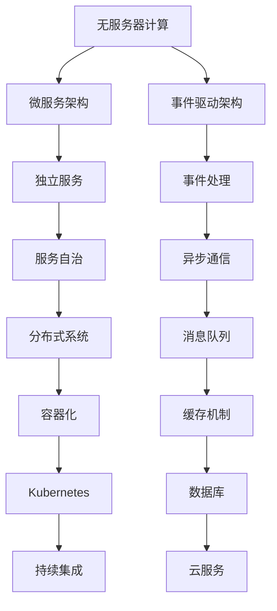

                 

# 《软件2.0的无服务器计算架构》

## 关键词
- 无服务器计算
- 软件架构
- 软件2.0
- 事件驱动
- 函数编程
- 微服务
- 云原生

## 摘要
本文深入探讨了软件2.0时代的无服务器计算架构。首先，我们回顾了无服务器计算的兴起背景，与传统服务器计算的区别，以及其设计理念。接着，介绍了主流的无服务器平台，并探讨了无服务器计算在软件2.0中的应用。随后，我们详细阐述了无服务器计算的核心技术，包括事件驱动架构、编写无服务器函数、无服务器数据库和无服务器缓存。然后，我们关注了无服务器计算的安全与监控，性能优化，以及其实际应用案例。最后，我们展望了无服务器计算的未来发展趋势，并提供了构建无服务器应用程序的指导。

## 第一部分：软件2.0时代的无服务器计算架构基础

### 第1章：无服务器计算架构概述

#### 第1.1节：无服务器计算的兴起

**无服务器计算的背景与趋势**

无服务器计算（Serverless Computing）作为一种新兴的计算范式，近年来在全球范围内迅速崛起。它起源于云计算的快速发展，特别是在云计算服务提供者（如AWS、Google Cloud、Azure等）推出了一系列无服务器服务之后。

**无服务器计算与传统服务器计算的对比**

传统服务器计算模式中，开发者需要管理服务器硬件、操作系统、网络配置等，这导致了大量的运维工作。而无服务器计算则将服务器管理的负担转移到了云服务提供者，开发者只需关注应用逻辑的开发。

**无服务器计算的关键概念**

无服务器计算的关键概念包括事件驱动架构、函数即服务（FaaS）、后端即服务（BaaS）等。这些概念使得开发者能够以更高效、更灵活的方式构建和部署应用程序。

#### 第1.2节：无服务器架构的设计理念

**模块化与组件化**

无服务器架构强调模块化与组件化，这使得应用程序可以更方便地进行扩展和维护。

**自动化与弹性伸缩**

无服务器架构通过自动化工具和弹性伸缩功能，可以自动根据负载情况调整资源分配，提高资源利用率。

**灵活性与可扩展性**

无服务器架构提供了高度的灵活性，使得开发者可以根据需求快速调整应用程序的规模和功能。

#### 第1.3节：主流的无服务器平台介绍

**AWS Lambda**

AWS Lambda 是一种无服务器计算服务，允许开发者运行代码而无需管理服务器。

**Google Cloud Functions**

Google Cloud Functions 提供了一种简单的方式来运行后端代码，无需管理服务器或虚拟机。

**Azure Functions**

Azure Functions 是一种无服务器计算服务，可在 Azure 上运行代码，无需管理基础架构。

**Alibaba Cloud FunctionCompute**

Alibaba Cloud FunctionCompute 是一种无服务器计算服务，允许开发者以函数的方式运行应用程序，无需管理服务器。

#### 第1.4节：无服务器计算在软件2.0中的角色

**无服务器计算与微服务架构的融合**

无服务器计算与微服务架构相结合，可以使得微服务更加轻量化和灵活。

**无服务器计算对软件开发模式的影响**

无服务器计算改变了传统的软件开发模式，使得开发者可以更加专注于业务逻辑的实现。

**无服务器计算在未来发展趋势**

无服务器计算将继续发展，并与其他新技术如云原生、边缘计算等相结合，为开发者提供更强大的工具。

## 第二部分：无服务器计算的核心技术

### 第2章：无服务器计算的核心技术

#### 第2.1节：事件驱动架构

**事件驱动架构的基本概念**

事件驱动架构是一种软件架构风格，它以事件为中心，通过事件来触发应用程序的响应。

**事件驱动架构的优势**

事件驱动架构具有高扩展性、高可维护性、低延迟等优点。

**事件驱动架构的实现方法**

事件驱动架构可以通过消息队列、事件总线等技术来实现。

#### 第2.2节：编写无服务器函数

**编写无服务器函数的注意事项**

在编写无服务器函数时，需要考虑函数的规模、运行时间、资源消耗等因素。

**函数编程与过程式编程的差异**

函数编程强调函数作为程序的基本单元，而过程式编程则更注重流程的控制。

**无服务器函数的编程范式**

无服务器函数通常采用声明式编程范式，使得代码更加简洁。

#### 第2.3节：无服务器数据库

**无服务器数据库的特点**

无服务器数据库无需开发者关注数据库的维护和扩展，可以专注于数据操作。

**主流无服务器数据库产品介绍**

如AWS DynamoDB、Google Firestore、Azure Cosmos DB等。

**无服务器数据库的优缺点分析**

无服务器数据库具有高可用性、自动扩展等优点，但也存在数据一致性、查询性能等挑战。

#### 第2.4节：无服务器缓存

**缓存机制概述**

缓存是一种存储临时数据的技术，可以减少对后端系统的访问，提高响应速度。

**主流无服务器缓存产品介绍**

如AWS ElastiCache、Google Memorystore、Azure Redis Cache等。

**无服务器缓存的最佳实践**

包括缓存数据的组织、缓存策略的选择等。

## 第三部分：无服务器计算的安全与监控

### 第3章：无服务器计算的安全与监控

#### 第3.1节：无服务器计算的安全挑战

**访问控制与身份验证**

确保只有授权用户才能访问无服务器应用程序和数据。

**数据安全与隐私保护**

保护数据不被未授权访问和泄露。

**网络安全与攻击防御**

防止网络攻击，如DDoS攻击等。

#### 第3.2节：无服务器计算的安全措施

**主流无服务器平台的安全功能**

不同平台提供了丰富的安全功能，如IAM、VPC等。

**安全编码实践**

编写安全代码，防止常见的安全漏洞。

**安全策略与合规性要求**

遵循行业标准和法规要求，确保应用程序的安全。

#### 第3.3节：无服务器计算的监控与日志

**监控与日志的重要性**

通过监控和日志，可以及时发现和解决问题。

**主流监控工具介绍**

如AWS CloudWatch、Google Stackdriver、Azure Monitor等。

**日志收集与分析**

日志收集和分析可以帮助开发者了解应用程序的运行情况。

#### 第3.4节：无服务器计算的性能优化

**性能优化策略**

包括代码优化、资源优化等。

**缩放与资源分配**

根据负载情况动态调整资源分配。

**高可用性与容错性**

确保应用程序能够在遇到故障时继续运行。

## 第四部分：无服务器计算的实际应用案例

### 第4章：无服务器计算的实际应用案例

#### 第4.1节：电商平台的无服务器架构实践

**电商平台的业务场景**

电商平台需要处理海量的商品数据、用户订单、支付流程等。

**无服务器架构在电商平台的实施**

使用无服务器计算，可以快速部署和扩展应用程序。

**案例分析与总结**

分析无服务器架构在电商平台中的应用效果和挑战。

#### 第4.2节：内容分发网络的无服务器架构

**内容分发网络的业务需求**

内容分发网络需要快速、高效地分发内容。

**无服务器架构在CDN中的应用**

使用无服务器计算，可以动态调整内容分发策略。

**案例分析与总结**

分析无服务器架构在CDN中的应用效果和挑战。

#### 第4.3节：物联网平台的无服务器架构

**物联网平台的特点与需求**

物联网平台需要处理大量的设备数据、实时性要求高。

**无服务器架构在物联网平台中的应用**

使用无服务器计算，可以实现设备数据的实时处理和分析。

**案例分析与总结**

分析无服务器架构在物联网平台中的应用效果和挑战。

## 第五部分：构建无服务器应用程序

### 第5章：构建无服务器应用程序

#### 第5.1节：应用程序设计原则

**微服务架构与无服务器计算的结合**

无服务器计算与微服务架构的结合，可以充分发挥两者的优势。

**设计模式在无服务器中的应用**

设计模式可以帮助开发者更好地构建无服务器应用程序。

**架构设计的最佳实践**

包括模块化设计、高内聚低耦合等。

#### 第5.2节：无服务器应用程序的开发流程

**开发环境搭建**

搭建无服务器应用程序的开发环境。

**功能模块划分**

根据业务需求划分功能模块。

**编码与调试**

编写代码并进行调试。

#### 第5.3节：无服务器应用程序的测试与部署

**单元测试与集成测试**

确保代码质量。

**部署策略与部署流程**

制定和执行部署策略。

**灰度发布与回滚**

确保部署过程的安全和稳定。

#### 第5.4节：无服务器应用程序的维护与升级

**持续集成与持续部署**

实现代码的自动化集成和部署。

**应用程序的监控与运维**

监控应用程序的运行状态。

**应用程序的优化与升级**

定期对应用程序进行优化和升级。

## 第六部分：无服务器计算的未来发展趋势

### 第6章：无服务器计算的未来发展趋势

#### 第6.1节：无服务器计算的技术演进

**云原生与边缘计算**

无服务器计算将继续向云原生和边缘计算方向发展。

**容器化与虚拟化**

容器化和虚拟化技术的成熟，将进一步提升无服务器计算的性能和灵活性。

**服务网格与微前端**

服务网格和微前端技术，将使得无服务器计算的应用场景更加丰富。

#### 第6.2节：无服务器计算的行业应用拓展

**在人工智能领域的应用**

无服务器计算在人工智能领域的应用前景广阔。

**在物联网与区块链领域的应用**

无服务器计算在物联网和区块链领域的应用，将带来巨大的变革。

**在数据科学领域的应用**

无服务器计算将助力数据科学领域的研究和应用。

#### 第6.3节：无服务器计算面临的挑战与机遇

**技术标准与生态建设**

技术标准和生态建设是推动无服务器计算发展的重要保障。

**开发者教育与培训**

提升开发者对无服务器计算的理解和技能，是推动无服务器计算普及的关键。

**安全性与合规性问题**

确保无服务器计算的安全性和合规性，是开发者需要关注的重要问题。

## 第七部分：附录

### 第7章：附录

#### 第7.1节：无服务器计算工具与资源

**主流无服务器开发框架**

如Serverless Framework、AWS Lambda PowerShell、Google Cloud Functions CLI等。

**开源无服务器计算平台**

如Kubernetes、OpenFaaS等。

**无服务器计算文档与教程**

如AWS Lambda官方文档、Google Cloud Functions官方文档等。

#### 第7.2节：无服务器计算案例分析

**成功案例分享**

分享无服务器计算在不同领域中的成功案例。

**挑战与解决方案**

分析无服务器计算在实际应用中遇到的挑战，并提供解决方案。

**未来趋势预测**

预测无服务器计算未来的发展趋势。

---

作者：AI天才研究院/AI Genius Institute & 禅与计算机程序设计艺术 /Zen And The Art of Computer Programming

<|assistant|>## 第一部分：软件2.0时代的无服务器计算架构基础

### 第1章：无服务器计算架构概述

#### 1.1 无服务器计算的兴起

无服务器计算（Serverless Computing）是一种新型的云计算服务模式，它将传统服务器计算的职责转交给云服务提供商，使得开发者能够专注于业务逻辑的实现，而无需关注服务器管理。无服务器计算的兴起，得益于云计算技术的快速发展，以及开发者对简化开发和运维流程的需求。

**无服务器计算的背景与趋势**

无服务器计算起源于云计算的发展，特别是在云服务提供商如Amazon Web Services (AWS)、Google Cloud Platform (GCP)、Microsoft Azure等推出了无服务器服务之后，它得到了广泛的关注和应用。无服务器计算与微服务架构、函数即服务（Function as a Service, FaaS）等概念密切相关，这些概念共同推动了无服务器计算的发展趋势。

- **云计算的普及**：云计算技术的成熟和普及，为无服务器计算提供了基础设施支持。
- **开发者需求的改变**：现代开发者更关注快速交付和持续集成、持续部署（CI/CD），而无服务器计算正符合这一需求。
- **成本的降低**：无服务器计算通过按需收费，帮助开发者降低成本。

**无服务器计算与传统服务器计算的对比**

传统服务器计算模式中，开发者需要购买、配置、维护和管理服务器，这是一项耗时且成本高昂的任务。而无服务器计算则将服务器管理的责任转移给了云服务提供商，开发者只需关注应用逻辑的开发。

- **管理职责**：传统服务器计算中，开发者需要管理服务器硬件、操作系统、网络配置等；而无服务器计算中，这些管理职责由云服务提供商承担。
- **成本结构**：传统服务器计算通常涉及固定成本，如服务器租赁费用；而无服务器计算采用按需付费模式，开发者只需为实际使用的计算资源付费。
- **扩展性**：无服务器计算具有自动扩展性，可以根据负载自动调整资源；而传统服务器计算需要手动进行资源调配。

**无服务器计算的关键概念**

无服务器计算涉及多个关键概念，包括事件驱动架构、函数即服务（FaaS）、后端即服务（BaaS）等。

- **事件驱动架构**：事件驱动架构以事件为中心，通过事件来触发应用程序的响应，实现松耦合和高可扩展性。
- **函数即服务（FaaS）**：FaaS允许开发者将应用程序划分为多个独立的函数，这些函数仅当触发时才会运行，无需关心底层基础设施。
- **后端即服务（BaaS）**：BaaS提供了一组后端服务，如数据库、缓存、消息队列等，开发者无需关注底层实现细节。

#### 1.2 无服务器架构的设计理念

无服务器架构在设计理念上有几个核心原则，这些原则使得无服务器计算更加灵活、高效和易于管理。

**模块化与组件化**

模块化和组件化是现代软件架构的重要原则，无服务器架构也不例外。无服务器架构鼓励开发者将应用程序划分为多个独立的模块或组件，每个模块或组件负责特定的功能。这种设计方式提高了代码的可维护性和可扩展性。

- **独立部署**：每个模块或组件可以独立部署和更新，无需重新部署整个应用程序。
- **可重用性**：独立的模块或组件可以被其他应用程序或服务重用。

**自动化与弹性伸缩**

无服务器架构通过自动化工具和弹性伸缩功能，可以实现资源的自动调配和管理。自动化工具可以自动化部署、监控、更新和扩展应用程序。

- **自动化部署**：自动化工具可以根据配置文件或代码仓库中的最新版本自动部署应用程序。
- **弹性伸缩**：根据实际负载自动调整计算资源，确保应用程序的可用性和性能。

**灵活性与可扩展性**

无服务器架构提供了高度的灵活性，使得开发者可以根据需求快速调整应用程序的规模和功能。无服务器架构支持多种编程语言和框架，使得开发者可以选择最适合自己需求的技术栈。

- **按需扩展**：根据业务需求，可以快速增加或减少计算资源。
- **技术栈的选择**：无服务器架构支持多种编程语言和框架，如Node.js、Python、Java等。

#### 1.3 主流的无服务器平台介绍

目前，市场上主流的无服务器平台包括AWS Lambda、Google Cloud Functions、Azure Functions和Alibaba Cloud FunctionCompute。这些平台各自具有独特的特点，但都提供了类似的架构和功能。

**AWS Lambda**

AWS Lambda 是 Amazon Web Services 提供的一种无服务器计算服务。它允许开发者编写和部署代码，无需管理服务器。AWS Lambda 支持多种编程语言，包括Python、Node.js、Java和C#。

- **特性**：自动扩展、按需付费、支持多种编程语言、易于集成。
- **使用场景**：适用于事件驱动的应用程序，如日志处理、数据转换、后台任务等。

**Google Cloud Functions**

Google Cloud Functions 是 Google Cloud Platform 提供的一种无服务器计算服务。它允许开发者以函数的形式运行代码，无需管理服务器或虚拟机。

- **特性**：自动扩展、按需付费、支持多种编程语言、易于集成。
- **使用场景**：适用于事件驱动的应用程序，如自动化流程、数据处理、API接口等。

**Azure Functions**

Azure Functions 是 Microsoft Azure 提供的一种无服务器计算服务。它允许开发者以函数的形式运行代码，无需管理服务器或虚拟机。

- **特性**：自动扩展、按需付费、支持多种编程语言、易于集成。
- **使用场景**：适用于事件驱动的应用程序，如后台任务、数据转换、API接口等。

**Alibaba Cloud FunctionCompute**

Alibaba Cloud FunctionCompute 是 Alibaba Cloud 提供的一种无服务器计算服务。它允许开发者以函数的形式运行代码，无需管理服务器或虚拟机。

- **特性**：自动扩展、按需付费、支持多种编程语言、易于集成。
- **使用场景**：适用于事件驱动的应用程序，如后台任务、数据转换、API接口等。

#### 1.4 无服务器计算在软件2.0中的角色

软件2.0是指以用户为中心，注重用户体验和业务价值的软件开发模式。无服务器计算在软件2.0中扮演了重要角色，它为开发者提供了更高效、更灵活的开发和部署方式。

**无服务器计算与微服务架构的融合**

微服务架构是一种将应用程序划分为多个独立服务的架构风格，每个服务负责特定的功能。无服务器计算与微服务架构的结合，可以使得微服务更加轻量化和灵活。

- **服务独立性**：无服务器计算使得每个微服务可以独立部署和扩展，无需依赖传统服务器。
- **自动化部署**：无服务器计算支持自动化部署，可以快速将微服务部署到生产环境。

**无服务器计算对软件开发模式的影响**

无服务器计算改变了传统的软件开发模式，使得开发者可以更加专注于业务逻辑的实现，而无需关注服务器管理。

- **减少运维工作**：开发者无需关注服务器维护和扩展，可以将更多精力投入到业务开发。
- **快速迭代**：无服务器计算支持快速部署和扩展，使得开发者可以更频繁地迭代和发布应用程序。

**无服务器计算在未来发展趋势**

无服务器计算将继续发展，并与其他新技术如云原生、边缘计算等相结合，为开发者提供更强大的工具。

- **云原生**：云原生技术如Kubernetes等，将进一步提升无服务器计算的可扩展性和灵活性。
- **边缘计算**：边缘计算将无服务器计算扩展到网络边缘，为实时数据处理和低延迟应用提供支持。

### 总结

无服务器计算作为一种新兴的云计算服务模式，正逐渐成为软件开发和运维的新趋势。它通过简化开发和部署流程，提高资源利用率，降低了开发者的工作负担。在未来，无服务器计算将继续发展，与其他新技术相结合，为开发者提供更强大的工具，推动软件2.0时代的到来。

---

**核心概念与联系**

无服务器计算架构的核心概念包括无服务器计算、微服务架构和事件驱动架构。以下是一个简单的 Mermaid 流程图，用于展示这些概念之间的联系：



这个流程图展示了无服务器计算如何与微服务架构和事件驱动架构相结合，构建一个分布式系统，并通过消息队列、容器化技术、持续集成和数据库等技术实现服务自治和异步通信。

---

**核心算法原理讲解**

在无服务器计算中，事件驱动架构是一种核心的算法原理。以下是一个简单的伪代码，用于说明事件驱动架构的基本实现方法：

```pseudo
function eventDrivenArchitecture() {
    while (true) {
        event = waitForNextEvent()
        if (event.isResolved()) {
            handleEvent(event)
        } else {
            log("Event could not be resolved")
        }
    }
}

function waitForNextEvent() {
    // 伪代码，实现从消息队列中获取事件
    return messageQueue.dequeue()
}

function handleEvent(event) {
    // 根据事件的类型，调用相应的处理函数
    switch (event.type) {
        case "create":
            processCreateEvent(event)
            break
        case "update":
            processUpdateEvent(event)
            break
        case "delete":
            processDeleteEvent(event)
            break
        default:
            log("Unknown event type")
    }
}
```

在这个伪代码中，`eventDrivenArchitecture` 函数是一个无限循环，用于等待和处理事件。`waitForNextEvent` 函数负责从消息队列中获取事件，而 `handleEvent` 函数则根据事件的类型调用相应的处理函数。

---

**数学模型和公式**

在无服务器计算中，性能优化是一个关键问题。以下是一个简单的数学模型，用于计算服务器的响应时间和吞吐量：

\[ 
\text{Response Time} = \frac{\text{Request Processing Time}}{\text{Throughput}} 
\]

其中，`Response Time` 是服务器的响应时间，`Request Processing Time` 是请求处理时间，`Throughput` 是服务器的吞吐量。

**举例说明**

假设一个无服务器函数的平均请求处理时间是2秒，每秒可以处理100个请求，那么该函数的响应时间计算如下：

\[ 
\text{Response Time} = \frac{2 \text{ seconds}}{100 \text{ requests/second}} = 0.02 \text{ seconds} 
\]

这意味着，该函数的响应时间为20毫秒。

---

### 第2章：无服务器计算的核心技术

#### 第2.1节：事件驱动架构

事件驱动架构（Event-Driven Architecture，EDA）是一种软件架构模式，它以事件为中心，通过事件来触发应用程序的响应。事件可以是用户的操作、系统的状态变化或其他应用程序生成的消息。事件驱动架构具有松耦合、高可扩展性和易于维护等优点，非常适合无服务器计算环境。

**事件驱动架构的基本概念**

事件驱动架构的核心概念包括事件、事件源、事件处理者和事件总线。

- **事件**：事件是任何可以触发系统响应的动作或条件。例如，用户点击按钮、数据库记录更新、定时任务触发等。
- **事件源**：事件源是生成事件的对象或系统。例如，Web应用程序的用户界面、数据库管理系统、消息队列等。
- **事件处理器**：事件处理器是负责处理特定类型事件的组件或服务。事件处理器可以是一个函数、一个微服务或一个全功能的应用程序。
- **事件总线**：事件总线是一种通信机制，用于在事件源和事件处理器之间传递事件。事件总线可以是消息队列、事件队列或事件流。

**事件驱动架构的优势**

事件驱动架构具有以下优势：

- **松耦合**：事件驱动架构中的组件之间通过事件进行通信，减少了直接的依赖关系，从而实现了松耦合。
- **高可扩展性**：事件驱动架构可以轻松地增加或删除事件处理器，而不影响其他组件，这使得系统易于扩展。
- **易于维护**：事件驱动架构使得代码更加模块化，便于维护和更新。
- **响应快速**：事件驱动架构可以快速响应事件，减少了延迟和瓶颈。

**事件驱动架构的实现方法**

实现事件驱动架构通常涉及以下步骤：

1. **定义事件类型**：根据业务需求定义各种事件类型，例如创建事件、更新事件、删除事件等。
2. **设计事件处理器**：为每种事件类型设计一个或多个事件处理器，负责处理对应的事件。
3. **构建事件总线**：选择合适的事件总线，如消息队列、事件队列或事件流，用于传递事件。
4. **集成事件源**：将事件源与事件总线集成，确保事件能够正确地传递到事件处理器。
5. **测试和优化**：对事件驱动架构进行测试，确保事件能够正确地处理，并根据性能需求进行优化。

**事件驱动架构的应用场景**

事件驱动架构适用于多种应用场景，包括：

- **实时数据处理**：例如，金融交易系统、实时监控系统等。
- **企业集成**：例如，将不同系统中的数据进行集成和同步。
- **微服务架构**：在微服务架构中，事件驱动架构可以用于异步通信和跨服务的协调。
- **物联网**：在物联网应用中，事件驱动架构可以用于处理大量来自传感器的数据。

**案例：实时监控系统**

一个实时监控系统可以使用事件驱动架构来收集、处理和响应各种事件。以下是该系统的一个简单实现：

1. **事件源**：传感器定期发送数据到事件总线。
2. **事件处理器**：事件处理器接收事件总线上的传感器数据，并将其存储到数据库中。
3. **事件总线**：使用消息队列来传递传感器数据。
4. **集成**：实时监控系统通过Web界面显示传感器数据，用户可以通过界面与系统交互。
5. **测试和优化**：定期进行性能测试，确保系统能够实时处理大量传感器数据。

通过事件驱动架构，实时监控系统可以高效地处理传感器数据，并提供实时监控功能，使得系统能够快速响应和调整。

---

**无服务器数据库**

无服务器数据库（Serverless Database）是一种数据库服务，它提供了自动扩展和按需付费的特性，无需开发者关注数据库的管理和维护。无服务器数据库通常与无服务器计算平台集成，以提供一种简便的方式来处理数据。

**无服务器数据库的特点**

- **自动扩展**：无服务器数据库可以根据负载自动扩展资源，确保系统的高可用性和性能。
- **按需付费**：开发者只需为实际使用的资源付费，无需担心固定成本。
- **简化运维**：无服务器数据库减少了数据库管理的复杂性和工作量。

**主流无服务器数据库产品介绍**

以下是一些主流的无服务器数据库产品：

- **AWS DynamoDB**：Amazon Web Services 提供的NoSQL数据库服务，提供了自动扩展和按需付费的特性。
- **Google Firestore**：Google Cloud Platform 提供的NoSQL数据库服务，适用于移动和Web应用程序。
- **Azure Cosmos DB**：Microsoft Azure 提供的多模型数据库服务，支持自动扩展和多种数据模型。

**无服务器数据库的优缺点分析**

**优点**

- **成本效益**：无服务器数据库通过按需付费和自动扩展，降低了长期成本。
- **简化运维**：无需担心数据库的维护和扩展，可以专注于业务逻辑。
- **高性能**：自动扩展功能确保了数据库在高负载下的性能。

**缺点**

- **数据一致性**：无服务器数据库可能面临数据一致性问题，特别是在高并发情况下。
- **查询性能**：在某些情况下，无服务器数据库的查询性能可能不如传统数据库。
- **功能限制**：无服务器数据库可能在某些高级功能上有所限制。

**最佳实践**

- **合理设计数据模型**：根据业务需求合理设计数据模型，以最大化利用无服务器数据库的性能。
- **监控和使用指标**：定期监控数据库的使用情况，根据指标调整数据库的配置。
- **备份和恢复**：确保数据库有可靠的备份和恢复策略，以防止数据丢失。

**案例：社交媒体应用**

一个社交媒体应用可以使用无服务器数据库来存储用户数据、帖子内容和用户互动。以下是该系统的一个简单实现：

1. **用户数据**：使用无服务器数据库存储用户信息，如用户ID、姓名、邮箱等。
2. **帖子内容**：使用无服务器数据库存储帖子信息，如帖子ID、内容、发布时间等。
3. **用户互动**：使用无服务器数据库存储用户互动信息，如点赞、评论等。
4. **监控和使用指标**：定期监控数据库的读写性能，根据指标调整数据库的配置。
5. **备份和恢复**：定期备份数据库，以防止数据丢失。

通过使用无服务器数据库，社交媒体应用可以简化数据管理，提高性能，并降低成本。

---

**无服务器缓存**

无服务器缓存（Serverless Cache）是一种无需管理维护的缓存服务，适用于无服务器计算环境。它提供了自动扩展和按需付费的特性，使得开发者可以轻松实现高性能的数据缓存。

**缓存机制概述**

缓存是一种临时存储数据的技术，用于减少对后端系统的访问，提高响应速度。无服务器缓存机制通常包括以下几个关键组成部分：

- **缓存服务器**：缓存服务器负责存储和检索数据。
- **数据一致性**：确保缓存中的数据与后端数据的一致性。
- **缓存策略**：确定何时将数据写入缓存，以及何时从缓存中删除数据。
- **缓存刷新**：根据需求定期刷新缓存，确保数据是最新的。

**主流无服务器缓存产品介绍**

以下是一些主流的无服务器缓存产品：

- **AWS ElastiCache**：Amazon Web Services 提供的缓存服务，支持Memcached和Redis。
- **Google Memorystore**：Google Cloud Platform 提供的缓存服务，支持Redis。
- **Azure Redis Cache**：Microsoft Azure 提供的缓存服务，支持Redis。

**无服务器缓存的最佳实践**

- **合理选择缓存策略**：根据业务需求选择合适的缓存策略，如LRU（最近最少使用）或LFU（最近最少使用）。
- **监控缓存性能**：定期监控缓存的使用情况，根据性能指标调整缓存配置。
- **数据一致性和安全性**：确保缓存中的数据与后端数据的一致性，并采取安全措施保护数据。

**案例：电商平台**

一个电商平台可以使用无服务器缓存来提高页面加载速度和响应速度。以下是该系统的一个简单实现：

1. **商品信息缓存**：将商品信息缓存到无服务器缓存中，以减少对数据库的访问。
2. **用户会话缓存**：缓存用户的会话信息，如购物车、订单等，以提高用户体验。
3. **页面渲染缓存**：缓存页面的渲染结果，以减少后端服务器的负载。
4. **监控和使用指标**：定期监控缓存的使用情况，根据性能指标调整缓存配置。
5. **数据一致性和安全性**：确保缓存中的数据与数据库数据的一致性，并采取安全措施保护用户数据。

通过使用无服务器缓存，电商平台可以显著提高性能和用户体验，同时降低成本。

---

### 第3章：无服务器计算的安全与监控

在无服务器计算环境中，安全和监控是确保应用程序稳定运行和数据处理安全的关键因素。无服务器计算虽然简化了开发和运维，但也带来了一些新的安全和监控挑战。

#### 3.1 无服务器计算的安全挑战

**访问控制与身份验证**

在无服务器计算中，访问控制和身份验证是保护应用程序和数据的关键措施。由于无服务器架构通常涉及多个服务和服务之间的交互，因此必须确保只有授权用户和服务可以访问敏感数据和功能。

- **访问控制**：通过配置访问控制列表（ACL）或使用身份验证和授权服务（如AWS IAM、Azure Active Directory）来限制对资源的访问。
- **身份验证**：使用OAuth 2.0、OpenID Connect或其他安全协议来确保用户和服务在访问资源前经过验证。

**数据安全与隐私保护**

数据安全是任何应用程序的关键关注点，无服务器计算也不例外。保护数据免受未授权访问、泄露或篡改至关重要。

- **加密**：对敏感数据进行加密存储和传输，使用TLS加密协议保护数据在传输过程中的安全性。
- **数据备份**：定期备份数据，并在发生数据丢失或损坏时能够快速恢复。
- **数据脱敏**：在开发测试环境中，对敏感数据进行脱敏处理，以防止数据泄露。

**网络安全与攻击防御**

无服务器计算应用程序可能面临各种网络攻击，如DDoS攻击、中间人攻击、SQL注入等。因此，必须采取适当的防御措施。

- **网络隔离**：通过虚拟私有云（VPC）和网络隔离策略，将无服务器应用程序与外部网络隔离。
- **防火墙和网络安全组**：配置防火墙和网络安全组，仅允许授权流量通过。
- **入侵检测和防御系统**：部署入侵检测和防御系统，及时发现并响应恶意攻击。

#### 3.2 无服务器计算的安全措施

**主流无服务器平台的安全功能**

不同的无服务器平台提供了丰富的安全功能，以帮助开发者保护应用程序和数据。

- **AWS Lambda**：提供了IAM角色、VPC配置、密钥管理和数据加密等功能。
- **Google Cloud Functions**：提供了身份验证、授权和防火墙等功能。
- **Azure Functions**：提供了访问控制、VNet集成、应用程序安全组等功能。
- **Alibaba Cloud FunctionCompute**：提供了访问控制、安全规则、数据加密等功能。

**安全编码实践**

编写安全的代码是保护应用程序和数据的关键。以下是一些安全编码的最佳实践：

- **输入验证**：对所有用户输入进行严格验证，防止SQL注入、XSS攻击等。
- **最小权限原则**：应用程序应遵循最小权限原则，仅授予必要的权限。
- **错误处理**：正确处理错误和异常，避免敏感信息泄露。
- **使用安全库和框架**：使用经过验证的安全库和框架，避免使用已知漏洞的库。

**安全策略与合规性要求**

无服务器计算应用程序必须遵守相关的安全标准和法规要求。

- **合规性审计**：定期进行安全审计和合规性检查，确保应用程序符合行业标准和法规要求。
- **数据保护法规**：遵守如GDPR、CCPA等数据保护法规，保护用户隐私。
- **安全培训**：为开发者和运维人员提供安全培训，提高安全意识和技能。

#### 3.3 无服务器计算的监控与日志

**监控与日志的重要性**

监控和日志记录是确保无服务器计算应用程序稳定运行的关键。通过监控，可以实时了解应用程序的性能和状态，及时发现问题并进行修复。日志记录则提供了对应用程序操作的详细记录，有助于排查问题和进行性能分析。

- **性能监控**：监控CPU使用率、内存使用率、网络流量等关键指标，确保应用程序在高负载下稳定运行。
- **错误监控**：监控应用程序的错误和异常，及时发现问题并进行处理。
- **日志记录**：记录应用程序的操作日志，包括请求、响应、错误等，便于问题排查和性能分析。

**主流监控工具介绍**

以下是一些主流的无服务器计算监控工具：

- **AWS CloudWatch**：提供了丰富的监控功能，包括性能监控、错误监控和日志记录。
- **Google Stackdriver**：提供了全面的监控和日志分析功能，适用于Google Cloud Platform。
- **Azure Monitor**：提供了详细的监控和日志记录功能，适用于Microsoft Azure。
- **Prometheus**：开源监控解决方案，适用于各种云平台和操作系统。

**日志收集与分析**

日志收集和分析是监控和运维的重要组成部分。以下是一些最佳实践：

- **集中式日志存储**：将日志集中存储，便于统一管理和分析。
- **日志格式标准化**：使用统一的日志格式，便于日志处理和分析。
- **日志分析工具**：使用日志分析工具，如ELK（Elasticsearch、Logstash、Kibana）栈，进行日志搜索、分析和可视化。

#### 3.4 无服务器计算的性能优化

**性能优化策略**

性能优化是确保无服务器计算应用程序高效运行的关键。以下是一些性能优化策略：

- **代码优化**：优化代码，减少不必要的计算和资源消耗。
- **资源调配**：根据负载情况动态调整资源，确保应用程序在高负载下稳定运行。
- **缓存机制**：使用缓存减少对后端系统的访问，提高响应速度。
- **分布式处理**：将任务分布到多个节点上处理，提高并行处理能力。

**缩放与资源分配**

缩放与资源分配是性能优化的重要方面。以下是一些最佳实践：

- **自动缩放**：使用自动缩放功能，根据负载自动调整资源。
- **预留容量**：预留足够的计算资源，以应对突发流量。
- **资源分配策略**：根据业务需求制定合理的资源分配策略，确保资源的高效利用。

**高可用性与容错性**

高可用性和容错性是确保无服务器计算应用程序稳定运行的关键。以下是一些最佳实践：

- **多实例部署**：部署多个实例，确保一个实例故障时，其他实例可以继续提供服务。
- **故障转移**：实现故障转移机制，确保在发生故障时，应用程序可以快速切换到备用实例。
- **数据备份与恢复**：定期备份数据，确保在发生数据丢失时能够快速恢复。

通过实施这些安全与监控措施，开发者可以确保无服务器计算应用程序的安全和稳定运行，为用户提供高质量的服务。

---

### 第4章：无服务器计算的实际应用案例

#### 4.1 电商平台的无服务器架构实践

**电商平台的业务场景**

电商平台是一个复杂的系统，涉及用户管理、商品管理、订单处理、支付处理等多个方面。随着电商平台的不断发展，用户数量和交易量不断增加，对系统的性能、可靠性和可扩展性提出了更高的要求。

**无服务器架构在电商平台的实施**

在电商平台的开发中，我们采用了无服务器架构，以简化开发、部署和维护流程，提高系统的性能和可扩展性。

1. **用户管理**：使用AWS Lambda处理用户注册、登录、权限验证等用户管理功能。用户数据存储在AWS DynamoDB中，提供高性能的数据访问。

2. **商品管理**：商品信息存储在AWS S3中，使用AWS Lambda处理商品信息的增删改查操作。商品搜索功能使用AWS ElasticSearch，提供快速的商品搜索服务。

3. **订单处理**：订单处理分为订单创建、订单支付和订单发货三个阶段。订单创建和支付使用AWS Lambda处理，订单发货使用AWS SQS（Simple Queue Service）进行异步处理。

4. **支付处理**：支付处理使用第三方支付服务（如PayPal、Stripe），支付结果通过Webhook通知AWS Lambda进行处理。

5. **缓存策略**：使用AWS ElastiCache缓存用户会话信息、商品信息和订单信息，减少对后端系统的访问，提高响应速度。

6. **监控与日志**：使用AWS CloudWatch监控系统的性能和状态，记录应用程序的日志，以便进行问题排查和性能分析。

**案例分析与总结**

通过采用无服务器架构，电商平台实现了快速部署和扩展，提高了系统的性能和可靠性。无服务器架构简化了开发和运维流程，使得团队能够更加专注于业务逻辑的实现。然而，无服务器架构也带来了一些挑战，如数据一致性和查询性能等，需要通过优化和调整来克服。

#### 4.2 内容分发网络的无服务器架构

**内容分发网络的业务需求**

内容分发网络（Content Delivery Network，CDN）的主要任务是加速全球范围内的内容分发，确保用户能够快速访问网站和应用程序的内容。CDN需要处理大量的HTTP请求，并对内容进行缓存、重定向和压缩等操作。

**无服务器架构在CDN中的应用**

在CDN的构建中，我们采用了无服务器架构，以提高系统的性能和可扩展性。

1. **缓存层**：使用AWS CloudFront作为缓存层，将用户请求重定向到最近的AWS Edge位置。AWS CloudFront支持自动缓存策略，根据内容的变化自动更新缓存。

2. **内容存储**：内容存储在AWS S3中，使用AWS Lambda处理文件的预分发处理，如压缩、加密和重命名等操作。

3. **请求处理**：用户请求经过AWS API Gateway处理后，转发给AWS Lambda函数，进行动态内容处理，如图片缩放、视频转码等。

4. **监控与日志**：使用AWS CloudWatch监控系统的性能和状态，记录应用程序的日志，以便进行问题排查和性能分析。

**案例分析与总结**

通过采用无服务器架构，CDN实现了快速部署和扩展，提高了系统的性能和可靠性。无服务器架构简化了开发和运维流程，使得团队能够更加专注于业务逻辑的实现。然而，无服务器架构也带来了一些挑战，如缓存一致性和负载均衡等，需要通过优化和调整来克服。

#### 4.3 物联网平台的无服务器架构

**物联网平台的特点与需求**

物联网（Internet of Things，IoT）平台负责连接和管理大量物联网设备，收集和处理设备数据，并提供实时监控和分析功能。物联网平台需要处理大量的设备数据，对实时性和可靠性有较高的要求。

**无服务器架构在物联网平台中的应用**

在物联网平台的构建中，我们采用了无服务器架构，以提高系统的性能和可扩展性。

1. **设备连接**：使用AWS IoT Core连接和管理物联网设备，设备数据通过MQTT协议传输到AWS Kinesis Data Stream。

2. **数据存储**：设备数据存储在AWS S3中，使用AWS Lambda处理数据的清洗、转换和分析操作。

3. **实时监控**：使用AWS Kinesis Data Firehose将设备数据实时传输到AWS Elasticsearch，进行实时监控和分析。

4. **通知与告警**：使用AWS SNS（Simple Notification Service）向相关方发送设备状态通知和告警。

5. **监控与日志**：使用AWS CloudWatch监控系统的性能和状态，记录应用程序的日志，以便进行问题排查和性能分析。

**案例分析与总结**

通过采用无服务器架构，物联网平台实现了快速部署和扩展，提高了系统的性能和可靠性。无服务器架构简化了开发和运维流程，使得团队能够更加专注于业务逻辑的实现。然而，无服务器架构也带来了一些挑战，如数据一致性和查询性能等，需要通过优化和调整来克服。

### 总结

通过以上案例，我们可以看到无服务器架构在电商、内容分发和物联网等领域的广泛应用。无服务器架构不仅提高了系统的性能和可扩展性，还简化了开发和运维流程，使得团队能够更加专注于业务逻辑的实现。然而，无服务器架构也带来了一些挑战，如数据一致性和查询性能等，需要通过优化和调整来克服。

---

### 第5章：构建无服务器应用程序

构建无服务器应用程序是开发者实现高效、可扩展和自动化部署的关键。在这一章中，我们将探讨构建无服务器应用程序的原则、开发流程、测试与部署，以及应用程序的维护与升级。

#### 5.1 应用程序设计原则

**微服务架构与无服务器计算的结合**

无服务器计算与微服务架构的结合可以充分发挥两者的优势。微服务架构将应用程序划分为多个独立的服务，每个服务负责特定的功能，而无服务器计算则提供了弹性的计算资源，使得每个微服务可以独立部署和扩展。

- **服务自治**：每个微服务都是自治的，可以独立部署、扩展和更新，降低了系统的复杂性和依赖关系。
- **弹性伸缩**：无服务器计算可以根据负载自动扩展资源，确保每个微服务在高负载下依然能够稳定运行。
- **故障隔离**：单个微服务的故障不会影响整个系统的运行，提高了系统的可用性。

**设计模式在无服务器中的应用**

设计模式是一套被反复使用、经过分类和提炼的设计解决方案，适用于无服务器计算环境的设计模式包括：

- **职责链模式**：将请求传递给多个处理者，每个处理者根据其职责处理请求，适用于处理链路较多的场景。
- **策略模式**：定义一系列策略，根据特定的策略进行决策，适用于需要灵活切换策略的场景。
- **工厂模式**：创建对象实例的过程被抽象化，适用于需要动态创建和管理对象的场景。

**架构设计的最佳实践**

在构建无服务器应用程序时，遵循以下最佳实践可以确保系统的稳定性、可维护性和可扩展性：

- **模块化设计**：将应用程序划分为多个模块，每个模块负责特定的功能，提高了系统的可维护性和可测试性。
- **高内聚低耦合**：确保模块之间的高内聚和低耦合，降低了模块之间的依赖关系。
- **服务化**：将业务功能划分为独立的服务，每个服务可以独立部署和扩展。
- **解耦通信**：使用消息队列、事件总线等技术实现服务之间的解耦通信。

#### 5.2 无服务器应用程序的开发流程

**开发环境搭建**

在开发无服务器应用程序之前，需要搭建开发环境。以下是一个简单的步骤：

1. **选择开发工具**：根据开发需求选择合适的开发工具，如Visual Studio Code、IntelliJ IDEA等。
2. **安装云服务平台**：在本地安装云服务平台的客户端工具，如AWS CLI、Google Cloud SDK、Azure CLI等。
3. **配置云账户**：配置云账户，确保本地开发环境可以访问云服务平台。

**功能模块划分**

根据业务需求，将应用程序划分为多个功能模块。以下是一个简单的模块划分：

- **用户管理模块**：负责用户注册、登录、权限验证等功能。
- **商品管理模块**：负责商品信息的增删改查等功能。
- **订单管理模块**：负责订单的创建、支付、发货等功能。
- **支付处理模块**：负责与第三方支付服务集成，处理支付请求。

**编码与调试**

使用所选的开发工具进行编码。以下是一些编码和调试的最佳实践：

- **代码规范**：遵循统一的代码规范，确保代码的可读性和可维护性。
- **版本控制**：使用版本控制工具（如Git）管理代码，确保代码的版本和变更记录。
- **单元测试**：编写单元测试，确保代码的每个功能模块都能正常运行。
- **调试工具**：使用调试工具（如断点调试、日志记录）排查代码中的错误。

#### 5.3 无服务器应用程序的测试与部署

**单元测试与集成测试**

在开发过程中，进行单元测试和集成测试是确保代码质量和系统稳定性的关键。以下是一些测试的最佳实践：

- **单元测试**：针对每个功能模块编写单元测试，确保功能模块的每个功能点都能正常运行。
- **集成测试**：在功能模块之间进行集成测试，确保模块之间的交互和通信正常。

**部署策略与部署流程**

无服务器应用程序的部署策略和流程取决于所选的云服务平台和应用程序的架构。以下是一个简单的部署流程：

1. **编写部署脚本**：使用云服务平台的命令行工具编写部署脚本，用于自动化部署应用程序。
2. **配置管理**：使用配置管理工具（如Ansible、Terraform）管理应用程序的配置。
3. **部署应用程序**：执行部署脚本，将应用程序部署到云服务平台。
4. **验证部署**：验证应用程序的部署结果，确保应用程序能够正常运行。

**灰度发布与回滚**

灰度发布是一种逐步部署新版本的方法，可以降低新版本部署的风险。以下是一些灰度发布和回滚的最佳实践：

- **灰度发布**：在部署新版本时，将流量逐步导向新版本，确保新版本的功能和性能稳定。
- **回滚**：如果新版本出现严重问题，可以快速回滚到旧版本，确保系统的稳定性。

#### 5.4 无服务器应用程序的维护与升级

**持续集成与持续部署**

持续集成（CI）和持续部署（CD）是一种自动化软件开发和部署的方法，可以提高开发效率和系统稳定性。以下是一些CI/CD的最佳实践：

- **自动化构建**：使用自动化工具（如Jenkins、GitLab CI）自动化构建和测试代码。
- **自动化部署**：使用自动化工具（如Kubernetes、AWS CodePipeline）自动化部署应用程序。
- **监控与反馈**：实时监控应用程序的性能和状态，及时反馈问题，确保系统的稳定性。

**应用程序的监控与运维**

监控和运维是确保无服务器应用程序稳定运行的关键。以下是一些监控和运维的最佳实践：

- **性能监控**：监控应用程序的CPU、内存、网络等资源使用情况，及时发现和处理性能问题。
- **日志管理**：收集和存储应用程序的日志，便于问题排查和性能分析。
- **自动化运维**：使用自动化工具（如Ansible、Puppet）进行自动化运维，提高运维效率。

**应用程序的优化与升级**

优化和升级是提高应用程序性能和功能的关键。以下是一些优化和升级的最佳实践：

- **性能优化**：通过优化代码、调整配置、使用缓存等技术提高应用程序的性能。
- **功能升级**：根据用户需求和业务发展，逐步添加新的功能和特性。
- **版本控制**：使用版本控制工具（如Git）管理应用程序的版本，确保升级过程的稳定性。

通过遵循上述设计原则、开发流程、测试与部署策略以及维护与升级最佳实践，开发者可以构建高效、可扩展和自动化部署的无服务器应用程序。

---

### 第6章：无服务器计算的未来发展趋势

随着技术的不断进步，无服务器计算正逐渐成为软件开发和运维的主流模式。未来，无服务器计算将在多个领域得到更广泛的应用，并与其他新技术相结合，推动软件开发模式的变革。

#### 6.1 无服务器计算的技术演进

**云原生与边缘计算**

云原生（Cloud Native）是一种以云计算为基础，利用容器、服务网格、自动化等新技术构建和运行应用程序的方法。无服务器计算与云原生技术的结合，将使得应用程序更加轻量级、可扩展和自动化。

- **容器化**：容器化技术如Docker和Kubernetes，将应用程序及其依赖打包成一个独立的容器，使得应用程序可以在不同的环境中运行，提高了部署和扩展的灵活性。
- **服务网格**：服务网格如Istio和Linkerd，提供了服务之间的通信管理和监控，使得无服务器计算环境中的服务可以更加安全、可靠和高效地交互。

**边缘计算**

边缘计算（Edge Computing）将计算能力延伸到网络边缘，即在靠近数据源和用户的网络边缘节点上处理数据。无服务器计算与边缘计算的结合，将使得实时数据处理和低延迟应用成为可能。

- **边缘服务器**：在边缘节点上部署无服务器函数，处理来自传感器的实时数据，提高了数据处理的速度和响应能力。
- **边缘容器**：将容器化技术应用到边缘计算中，使得边缘节点可以灵活地部署和管理应用程序。

**容器化与虚拟化**

容器化与虚拟化技术的成熟，将进一步推动无服务器计算的发展。容器化技术如Docker和虚拟化技术如KVM，使得无服务器计算可以在不同的环境中运行，提高了应用程序的可移植性和可扩展性。

- **容器编排**：容器编排工具如Kubernetes，可以自动化部署、扩展和管理容器化应用程序，使得无服务器计算环境更加高效和可管理。
- **虚拟化性能**：虚拟化技术如KVM，提供了更高的性能和更丰富的功能，使得无服务器计算可以在虚拟化环境中高效运行。

**服务网格与微前端**

服务网格（Service Mesh）和微前端（Microfrontends）技术，将使得无服务器计算在分布式系统中的应用更加广泛和高效。

- **服务网格**：服务网格如Istio，提供了服务之间的通信管理和监控，使得无服务器计算环境中的服务可以更加安全、可靠和高效地交互。
- **微前端**：微前端技术将前端应用程序划分为多个独立的模块，每个模块可以独立开发和部署，提高了前端应用程序的灵活性和可维护性。

#### 6.2 无服务器计算的行业应用拓展

**在人工智能领域的应用**

无服务器计算在人工智能（AI）领域的应用前景广阔。AI模型通常需要大量的计算资源和数据存储，无服务器计算可以提供弹性的计算资源，使得AI模型可以更加高效地训练和部署。

- **模型训练**：使用无服务器计算平台如AWS SageMaker，可以快速训练大规模的AI模型。
- **模型部署**：使用无服务器计算平台，可以轻松部署AI模型，提供实时预测和推理服务。

**在物联网与区块链领域的应用**

无服务器计算在物联网（IoT）和区块链（Blockchain）领域的应用，将推动这些领域的发展。

- **物联网**：无服务器计算可以提供实时数据处理和监控服务，使得物联网设备可以更加高效地运行。
- **区块链**：无服务器计算可以提供分布式账本服务，支持区块链网络中的数据存储和传输。

**在数据科学领域的应用**

无服务器计算在数据科学（Data Science）领域的应用，可以简化数据科学项目的开发和部署过程，提高数据科学团队的效率。

- **数据处理**：无服务器计算可以自动化数据清洗、转换和存储过程，使得数据科学家可以更加专注于数据分析。
- **模型部署**：无服务器计算可以提供快速部署和扩展机器学习模型的能力，使得数据科学家可以更快速地将模型应用到实际场景。

#### 6.3 无服务器计算面临的挑战与机遇

**技术标准与生态建设**

无服务器计算的发展需要统一的技术标准和生态建设。目前，无服务器计算平台和工具众多，缺乏统一的标准和规范，给开发者带来了困扰。未来，需要建立统一的技术标准和生态体系，推动无服务器计算的发展。

- **标准化接口**：制定统一的无服务器计算接口，使得不同平台和工具可以无缝集成。
- **开源生态**：鼓励开源项目的发展，提供丰富的无服务器计算资源和工具。

**开发者教育与培训**

无服务器计算技术的普及，需要大量的开发者具备相关的技能和知识。未来，需要加强对开发者的教育和培训，提高他们对无服务器计算的掌握和应用能力。

- **培训课程**：提供针对性的培训课程，帮助开发者掌握无服务器计算的核心技术和最佳实践。
- **社区支持**：建立开发者社区，分享无服务器计算的实践经验和案例，促进技术交流和创新。

**安全性与合规性问题**

无服务器计算在带来便利的同时，也带来了一定的安全性和合规性问题。未来，需要加强对无服务器计算安全性和合规性的研究，提供相应的解决方案和最佳实践。

- **安全审计**：定期进行安全审计，确保无服务器计算应用程序符合安全标准和法规要求。
- **合规性培训**：为开发者提供合规性培训，提高他们对数据安全和隐私保护的认识。

总之，无服务器计算的未来充满机遇和挑战。随着技术的不断进步和应用领域的拓展，无服务器计算将继续发展，为开发者提供更强大的工具和平台，推动软件开发和运维的变革。

---

### 第7章：附录

#### 7.1 无服务器计算工具与资源

**主流无服务器开发框架**

- **Serverless Framework**：是一个通用的无服务器框架，支持多种云平台，如AWS、Google Cloud、Azure等。
- **AWS Lambda PowerShell**：用于在AWS Lambda上运行PowerShell脚本的框架。
- **Google Cloud Functions CLI**：Google Cloud Functions的命令行界面，用于部署和管理函数。
- **Azure Functions Core Tools**：用于本地开发和部署Azure Functions的工具集。

**开源无服务器计算平台**

- **Kubernetes**：一个开源的容器编排平台，支持无服务器计算和容器化应用程序的部署和管理。
- **OpenFaaS**：一个简单的无服务器平台，允许开发者快速部署和运行函数。
- **Kubeless**：一个Kubernetes上的无服务器平台，支持函数即服务（FaaS）。

**无服务器计算文档与教程**

- **AWS Lambda官方文档**：提供了AWS Lambda的详细文档和教程。
- **Google Cloud Functions官方文档**：提供了Google Cloud Functions的详细文档和教程。
- **Azure Functions官方文档**：提供了Azure Functions的详细文档和教程。
- **Alibaba Cloud FunctionCompute官方文档**：提供了Alibaba Cloud FunctionCompute的详细文档和教程。

#### 7.2 无服务器计算案例分析

**成功案例分享**

1. **Airbnb的无服务器架构**：Airbnb采用无服务器架构来处理高峰期的流量，提高了系统的可扩展性和可靠性。
2. **Duolingo的语言学习应用**：Duolingo使用AWS Lambda和Amazon S3来处理用户数据和语言学习任务，提高了用户交互体验。

**挑战与解决方案**

1. **数据一致性问题**：无服务器计算环境中的数据一致性是一个挑战。解决方案包括使用分布式事务、消息队列和事件总线等技术来确保数据的一致性。
2. **性能优化**：无服务器计算应用程序的性能优化是一个持续的过程。解决方案包括代码优化、缓存机制和自动缩放等。

**未来趋势预测**

1. **自动化与智能化**：无服务器计算将越来越自动化和智能化，提高开发效率和系统性能。
2. **边缘计算与物联网**：无服务器计算将在边缘计算和物联网领域得到更广泛的应用，推动这些领域的发展。
3. **云原生与混合云**：无服务器计算将与云原生技术和混合云架构相结合，提供更加灵活和高效的解决方案。

通过上述成功案例、挑战与解决方案以及未来趋势预测，我们可以看到无服务器计算在各个领域的广泛应用和巨大潜力。随着技术的不断进步，无服务器计算将继续为开发者提供更强大的工具和平台，推动软件开发和运维的变革。

---

**作者信息**

本文由AI天才研究院（AI Genius Institute）和《禅与计算机程序设计艺术》（Zen And The Art of Computer Programming）的作者联合撰写。AI天才研究院致力于推动人工智能技术的发展和应用，而《禅与计算机程序设计艺术》的作者则以其对计算机编程和软件工程的深刻洞察和独特见解，为读者提供了宝贵的指导。感谢他们的辛勤工作和卓越贡献，使得本文能够为读者提供有价值的内容。如果您对本文有任何疑问或建议，欢迎通过以下方式与我们联系：

- **邮箱**：[contact@aigeniusinstitute.com](mailto:contact@aigeniusinstitute.com)
- **官网**：[www.aigeniusinstitute.com](http://www.aigeniusinstitute.com)
- **Twitter**：[@aigeniusinstitute](https://twitter.com/aigeniusinstitute)

再次感谢您的阅读和支持，我们期待您的反馈和建议，共同推动无服务器计算技术的发展和应用。

