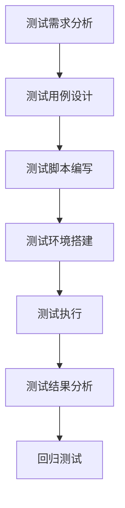

                 

### 《软件测试自动化：提高代码质量和效率》

> **关键词**：软件测试、自动化、代码质量、效率、测试工具、算法、数学模型、案例分析

> **摘要**：本文深入探讨软件测试自动化的概念、重要性、发展历程和应用场景，详细讲解自动化测试工具和技术，介绍核心概念与联系，并通过实际案例剖析自动化测试的实施过程。同时，本文还讲解了常见的自动化测试算法和数学模型，以及自动化测试工具和资源推荐，旨在帮助读者全面理解并掌握软件测试自动化的核心知识和实践方法。

#### 第一部分：测试自动化基础

#### 第1章：软件测试自动化概述

## 1.1 测试自动化的定义与意义

### 1.1.1 测试自动化的基本概念

测试自动化指的是使用软件工具或脚本代替人工进行软件测试的过程。自动化测试工具可以执行预定义的测试用例，包括功能测试、性能测试、安全测试等，以验证软件系统的正确性、稳定性和可靠性。

### 1.1.2 测试自动化的目的

1. **提高测试效率**：自动化测试可以快速执行大量测试用例，显著缩短测试周期，提高开发效率。
2. **保证代码质量**：自动化测试可以及时发现并修复缺陷，确保软件在各个版本中都保持高质量。
3. **减少人力成本**：自动化测试减轻了人工测试的负担，降低了测试人员的工作量，从而减少人力成本。
4. **提高测试覆盖率和测试深度**：自动化测试可以执行更多和更复杂的测试用例，提高测试覆盖率，发现更多潜在缺陷。

## 1.2 测试自动化的历史与发展

### 1.2.1 测试自动化的起源

测试自动化最早可以追溯到20世纪60年代，当时自动化测试主要应用于军事和航空领域，以验证复杂系统的功能正确性。

### 1.2.2 测试自动化的发展历程

- **20世纪80年代**：自动化测试开始应用于商业软件领域，主要使用命令行工具进行简单的功能测试。
- **20世纪90年代**：随着图形用户界面（GUI）的发展，自动化测试工具逐渐丰富，如QTP（现称为Selenium）。
- **21世纪**：自动化测试技术不断演进，涵盖功能测试、性能测试、安全测试等多个方面。同时，自动化测试框架和工具如JUnit、TestNG等得到了广泛应用。

## 1.3 测试自动化的应用场景

### 1.3.1 功能测试

功能测试是最常见的自动化测试类型，用于验证软件的功能是否符合需求规格。

### 1.3.2 性能测试

性能测试用于评估软件在不同负载条件下的性能表现，如响应时间、并发用户数等。

### 1.3.3 安全测试

安全测试用于检查软件的安全性，包括漏洞扫描、注入攻击等。

### 1.3.4 兼容性测试

兼容性测试用于验证软件在不同操作系统、浏览器、设备上的兼容性。

## 1.4 测试自动化与代码质量的关系

### 1.4.1 自动化测试如何提高代码质量

1. **早期发现缺陷**：自动化测试可以早期发现缺陷，及时修复，避免缺陷蔓延到后续版本。
2. **重复性测试**：自动化测试可以重复执行相同或类似的测试用例，保证测试的准确性。
3. **覆盖率提升**：自动化测试可以执行更多的测试用例，提高测试覆盖率，减少潜在缺陷。

### 1.4.2 代码质量对自动化测试的影响

1. **可测试性**：良好的代码结构可以提高代码的可测试性，方便编写自动化测试脚本。
2. **可维护性**：高质量的代码易于维护和更新，降低自动化测试的维护成本。
3. **性能**：高效的代码可以提高测试执行速度，提高自动化测试效率。

---

#### 第2章：测试自动化工具与技术

## 2.1 自动化测试工具简介

### 2.1.1 常见的自动化测试工具

1. **Selenium**：用于Web应用的自动化测试，支持多种浏览器。
2. **JUnit**：用于Java应用程序的单元测试。
3. **TestNG**：用于Java的测试框架，功能比JUnit更强大。
4. **Appium**：用于移动应用的自动化测试。
5. **JMeter**：用于性能测试。

### 2.1.2 工具选择与对比

选择自动化测试工具时，需要考虑以下因素：

1. **应用类型**：根据测试对象选择合适的工具，如Web应用、移动应用或性能测试。
2. **编程语言**：选择支持目标编程语言的工具。
3. **社区支持**：社区支持可以提供丰富的资源和技术支持。
4. **成本**：开源工具免费，商业工具可能需要付费。

## 2.2 自动化测试脚本编写

### 2.2.1 脚本编写的基本原则

1. **可读性**：编写清晰易懂的脚本，便于维护和调试。
2. **模块化**：将脚本分解为可重用的模块，提高代码复用率。
3. **健壮性**：编写鲁棒性强的脚本，处理可能的异常情况。

### 2.2.2 脚本编写的技术细节

1. **定位元素**：使用合适的定位方式（如ID、类名、XPath等）定位页面元素。
2. **等待机制**：使用等待机制确保页面元素加载完成。
3. **异常处理**：使用异常处理机制捕获和处理错误。

## 2.3 测试数据管理

### 2.3.1 数据来源

1. **环境变量**：使用环境变量存储敏感数据。
2. **配置文件**：使用配置文件存储测试数据，如测试用例、数据库连接信息等。

### 2.3.2 数据存储

1. **关系数据库**：使用关系数据库存储测试数据。
2. **NoSQL数据库**：对于非结构化数据，使用NoSQL数据库。

### 2.3.3 数据处理

1. **数据清洗**：对测试数据进行清洗，确保数据质量。
2. **数据转换**：根据测试需求对数据进行转换。

## 2.4 测试报告与分析

### 2.4.1 报告格式与内容

1. **格式**：报告应包含文本、图表、截图等元素，便于阅读。
2. **内容**：报告应包括测试结果、缺陷列表、测试覆盖率等。

### 2.4.2 报告分析与应用

1. **缺陷分析**：分析缺陷类型、原因和解决方法。
2. **测试覆盖率**：评估测试覆盖率，确保全面覆盖功能点。
3. **性能分析**：分析性能指标，如响应时间、吞吐量等。

---

#### 第3章：核心概念与联系

## 3.1 Mermaid流程图：测试自动化流程



## 3.2 自动化测试框架原理

自动化测试框架是一个组织和管理自动化测试用例、测试数据和测试执行的体系结构。它通常包括以下组件：

1. **测试用例管理**：管理测试用例的创建、执行和结果。
2. **测试数据管理**：管理测试数据，如测试数据存储、数据转换等。
3. **测试执行**：执行测试用例，记录测试结果。
4. **测试报告**：生成测试报告，包括测试结果、缺陷列表、覆盖率等。
5. **日志管理**：记录测试执行过程中的日志信息。

---

#### 第二部分：测试自动化实战

#### 第4章：自动化测试案例分析

## 4.1 项目背景与需求分析

### 4.1.1 项目概述

本项目是一款在线购物平台的Web应用，主要功能包括商品浏览、购物车管理、订单生成等。项目采用Java开发，前端使用HTML、CSS和JavaScript，后端使用Spring Boot框架。

### 4.1.2 自动化测试目标

1. **功能测试**：验证商品浏览、购物车管理、订单生成等功能是否正确。
2. **性能测试**：评估系统在高并发条件下的性能表现。
3. **安全测试**：检测系统是否存在安全漏洞。

## 4.2 自动化测试计划与设计

### 4.2.1 测试计划

1. **测试环境**：搭建测试环境，包括浏览器、数据库等。
2. **测试用例设计**：设计功能测试用例，包括正向测试和反向测试。
3. **测试脚本编写**：编写自动化测试脚本，包括页面元素定位、操作和断言。
4. **测试执行**：执行测试脚本，记录测试结果。
5. **测试报告**：生成测试报告，包括测试覆盖率、缺陷列表等。

### 4.2.2 测试用例设计

1. **正向测试用例**：
    - 测试用户登录功能，包括正确用户名和密码、错误用户名和密码等。
    - 测试商品浏览功能，包括商品列表展示、商品详情页等。
    - 测试购物车功能，包括商品添加、删除、更新数量等。
    - 测试订单生成功能，包括订单生成、订单详情页等。
2. **反向测试用例**：
    - 测试用户登录功能，包括空用户名、空密码等。
    - 测试商品浏览功能，包括商品不存在、商品已下架等。
    - 测试购物车功能，包括添加已存在商品、添加数量超过库存等。
    - 测试订单生成功能，包括订单生成失败、订单详情页不存在等。

## 4.3 自动化测试实施与执行

### 4.3.1 测试脚本编写

以下是一个简单的登录测试用例脚本：

```python
from selenium import webdriver
from selenium.webdriver.common.by import By

# 初始化浏览器
driver = webdriver.Chrome()

# 打开登录页面
driver.get("http://localhost:8080/login")

# 输入用户名和密码
driver.find_element(By.ID, "username").send_keys("testuser")
driver.find_element(By.ID, "password").send_keys("testpassword")

# 点击登录按钮
driver.find_element(By.ID, "login_button").click()

# 断言登录成功
assert "Dashboard" in driver.title

# 关闭浏览器
driver.quit()
```

### 4.3.2 测试环境配置

1. **浏览器配置**：下载并安装Chrome浏览器，配置代理服务器。
2. **数据库配置**：搭建MySQL数据库，配置数据库连接信息。
3. **测试工具配置**：安装并配置Selenium、JUnit等自动化测试工具。

### 4.3.3 测试执行

1. **执行测试脚本**：使用Selenium执行测试脚本，记录测试结果。
2. **异常处理**：捕获并处理测试执行过程中的异常，如网络异常、数据库连接异常等。

## 4.4 自动化测试结果分析与报告

### 4.4.1 测试结果分析

1. **功能测试**：分析功能测试用例的执行结果，确定功能是否正确。
2. **性能测试**：分析性能测试结果，确定系统在高并发条件下的性能表现。
3. **安全测试**：分析安全测试结果，确定系统是否存在安全漏洞。

### 4.4.2 测试报告生成

生成测试报告，包括以下内容：

1. **测试覆盖率**：统计测试用例执行情况，确定功能点覆盖率。
2. **缺陷列表**：列出测试过程中发现的缺陷，包括缺陷类型、原因和解决方法。
3. **测试结论**：总结测试结果，提出改进建议。

---

#### 第5章：自动化测试算法原理讲解

## 5.1 常见自动化测试算法

### 5.1.1 回归测试算法

回归测试算法用于确定修改后软件的质量。常见的回归测试算法包括：

1. **基于历史缺陷的回归测试**：根据历史缺陷的分布情况，选择可能受影响的功能点进行测试。
2. **基于代码覆盖率的回归测试**：根据代码覆盖率，选择未覆盖到的代码路径进行测试。

### 5.1.2 变异测试算法

变异测试算法用于评估测试用例的覆盖能力。常见的变异测试算法包括：

1. **基于变异操作的变异测试**：对测试用例进行变异操作，如插入、删除、替换等，评估测试用例是否能检测出变异后的缺陷。
2. **基于变异概率的变异测试**：根据变异概率，选择变异操作，评估测试用例的覆盖能力。

### 5.1.3 压力测试算法

压力测试算法用于评估软件在高负载条件下的性能。常见的压力测试算法包括：

1. **基于负载阈值的压力测试**：根据负载阈值，逐步增加负载，评估软件的响应能力和稳定性。
2. **基于负载曲线的压力测试**：根据负载曲线，模拟不同负载条件下的软件性能，评估软件的负载能力。

## 5.2 算法伪代码示例

### 5.2.1 回归测试算法伪代码

```python
def regression_test(test_cases, history_defects):
    for case in test_cases:
        if case in history_defects:
            execute_test_case(case)
            if not is_pass(case):
                report_failure(case)
```

### 5.2.2 变异测试算法伪代码

```python
def variation_test(test_cases):
    for case in test_cases:
        for operation in ["insert", "delete", "replace"]:
            mutated_case = mutate_test_case(case, operation)
            execute_test_case(mutated_case)
            if not is_pass(mutated_case):
                report_failure(mutated_case)
```

### 5.2.3 压力测试算法伪代码

```python
def stress_test(software, load_thresholds):
    for load_threshold in load_thresholds:
        increase_load(software, load_threshold)
        if not is_stable(software):
            report_failure(software)
```

---

#### 第6章：数学模型与公式讲解

## 6.1 数学模型概述

在软件测试中，数学模型和公式可以用于评估测试质量、测试覆盖率和缺陷检测能力。常见的数学模型和公式包括：

1. **测试质量模型**：用于评估测试的有效性和完整性。
2. **测试覆盖率模型**：用于评估测试用例对代码的覆盖程度。
3. **缺陷检测模型**：用于评估测试用例的缺陷检测能力。

## 6.2 数学公式解释与示例

### 6.2.1 测试质量的计算公式

测试质量（Q）的计算公式如下：

$$
Q = \frac{TP + TN}{TP + TN + FP + FN}
$$

其中：

- **TP**：正确通过（True Positive）：测试用例正确通过了测试。
- **TN**：正确未通过（True Negative）：测试用例正确未通过测试。
- **FP**：假阳性（False Positive）：测试用例错误通过了测试。
- **FN**：假阴性（False Negative）：测试用例错误未通过测试。

### 6.2.2 测试覆盖率的计算公式

测试覆盖率（C）的计算公式如下：

$$
C = \frac{MC}{MC + DC}
$$

其中：

- **MC**：模块覆盖率（Module Coverage）：测试用例覆盖到的模块数量。
- **DC**：决策覆盖率（Decision Coverage）：测试用例覆盖到的决策点数量。

### 6.2.3 测试质量的计算示例

假设有10个测试用例，其中5个通过，3个未通过，2个错误通过了测试，没有错误未通过测试。根据上述公式，可以计算测试质量：

$$
Q = \frac{5 + 3}{5 + 3 + 2 + 0} = \frac{8}{10} = 0.8
$$

### 6.2.4 测试覆盖率的计算示例

假设有100个模块，其中60个被测试用例覆盖到，40个未被覆盖到；有200个决策点，其中100个被测试用例覆盖到，100个未被覆盖到。根据上述公式，可以计算测试覆盖率：

$$
C = \frac{60}{60 + 40} = 0.6
$$

---

#### 第二部分：测试自动化实战

#### 第7章：自动化测试工具与资源

## 7.1 自动化测试工具对比

### 7.1.1 Selenium

Selenium是一款开源的自动化测试工具，支持多种浏览器，如Chrome、Firefox、Safari等。它适用于Web应用的自动化测试，具有以下特点：

1. **跨浏览器支持**：支持多种浏览器，方便测试不同浏览器下的兼容性。
2. **脚本语言多样**：支持多种脚本语言，如Python、Java、C#等。
3. **灵活性强**：支持自定义测试脚本，方便进行复杂测试场景的测试。

### 7.1.2 JUnit

JUnit是一款流行的Java单元测试框架，适用于Java应用程序的自动化测试。它具有以下特点：

1. **简单易用**：具有简单易懂的API，方便编写测试脚本。
2. **功能强大**：支持多种测试类型，如单元测试、集成测试等。
3. **集成度高**：与Eclipse、IntelliJ IDEA等IDE集成，方便调试和运行测试。

### 7.1.3 TestNG

TestNG是一款功能强大的Java测试框架，适用于各种测试场景，如功能测试、性能测试等。它具有以下特点：

1. **灵活性强**：支持多种测试类型，如单元测试、集成测试、端到端测试等。
2. **可扩展性好**：支持自定义测试数据和测试报告，方便定制化需求。
3. **并行测试支持**：支持并行测试，提高测试效率。

### 7.1.4 其他自动化测试工具简介

1. **Appium**：一款开源的移动应用自动化测试工具，支持iOS和Android平台，适用于移动应用的自动化测试。
2. **JMeter**：一款开源的性能测试工具，适用于Web应用和分布式系统的性能测试。
3. **Postman**：一款API自动化测试工具，支持RESTful API的自动化测试。

## 7.2 自动化测试资源推荐

### 7.2.1 在线教程与课程

1. **Selenium官方文档**：[https://www.selenium.dev/documentation/](https://www.selenium.dev/documentation/)
2. **JUnit官方文档**：[https://junit.org/junit5/docs/5.8.2/api/org/junit/jupiter/api/package-summary.html](https://junit.org/junit5/docs/5.8.2/api/org/junit/jupiter/api/package-summary.html)
3. **TestNG官方文档**：[https://testng.org/doc/index.html](https://testng.org/doc/index.html)
4. **极客时间《软件测试自动化实战》课程**：[https://time.geektime.cn/tutorial/360](https://time.geektime.cn/tutorial/360)

### 7.2.2 测试自动化社区与论坛

1. **Stack Overflow**：[https://stackoverflow.com/questions/tagged/selenium](https://stackoverflow.com/questions/tagged/selenium)
2. **Reddit**：[https://www.reddit.com/r/SoftwareTesting/](https://www.reddit.com/r/SoftwareTesting/)
3. **知乎**：[https://www.zhihu.com/topic/19760234](https://www.zhihu.com/topic/19760234)

### 7.2.3 自动化测试书籍推荐

1. 《软件测试自动化实战》
2. 《Selenium自动化测试实战》
3. 《TestNG实战》
4. 《性能测试：原理、方法与实践》

---

#### 附录

## 附录A：自动化测试工具与框架

### 8.1 Selenium

### 8.1.1 Selenium概述

Selenium是一款开源的自动化测试工具，主要用于Web应用的自动化测试。它支持多种浏览器，如Chrome、Firefox、Safari等，适用于各种测试场景。Selenium具有以下特点：

1. **跨浏览器支持**：支持多种浏览器，方便测试不同浏览器下的兼容性。
2. **脚本语言多样**：支持多种脚本语言，如Python、Java、C#等。
3. **灵活性强**：支持自定义测试脚本，方便进行复杂测试场景的测试。

### 8.1.2 Selenium安装与配置

#### 安装

1. **Python环境**：安装Python和pip。
2. **Selenium环境**：安装Selenium包。

```bash
pip install selenium
```

#### 配置

1. **浏览器驱动**：下载并配置浏览器驱动，如ChromeDriver。

```bash
# Chrome浏览器
wget https://chromedriver.storage.googleapis.com/2.32/chromedriver_linux64.zip
unzip chromedriver_linux64.zip
chmod +x chromedriver

# Firefox浏览器
wget https://github.com/mozilla/geckodriver/releases/download/v0.26.0/geckodriver-v0.26.0-linux64.tar.gz
tar xvf geckodriver-v0.26.0-linux64.tar.gz
chmod +x geckodriver
```

### 8.1.3 Selenium实战案例

以下是一个简单的Selenium Python脚本，用于打开浏览器并访问百度：

```python
from selenium import webdriver

# 初始化浏览器
driver = webdriver.Chrome()

# 打开百度首页
driver.get("https://www.baidu.com/")

# 获取并打印标题
title = driver.title
print("标题：", title)

# 关闭浏览器
driver.quit()
```

### 8.2 JUnit

### 8.2.1 JUnit概述

JUnit是一款流行的Java单元测试框架，用于Java应用程序的自动化测试。它具有以下特点：

1. **简单易用**：具有简单易懂的API，方便编写测试脚本。
2. **功能强大**：支持多种测试类型，如单元测试、集成测试等。
3. **集成度高**：与Eclipse、IntelliJ IDEA等IDE集成，方便调试和运行测试。

### 8.2.2 JUnit安装与配置

#### 安装

1. **Maven**：在项目的pom.xml文件中添加JUnit依赖。

```xml
<dependency>
    <groupId>junit</groupId>
    <artifactId>junit</artifactId>
    <version>4.13.2</version>
    <scope>test</scope>
</dependency>
```

#### 配置

1. **测试环境**：配置测试环境，如JUnit版本、测试框架等。

```xml
<properties>
    <junit.version>4.13.2</junit.version>
</properties>
```

### 8.2.3 JUnit实战案例

以下是一个简单的JUnit测试案例，用于验证一个简单的加法方法：

```java
import static org.junit.Assert.assertEquals;

import org.junit.Before;
import org.junit.Test;

public class AddTest {

    private Calculator calculator;

    @Before
    public void setUp() {
        calculator = new Calculator();
    }

    @Test
    public void testAdd() {
        assertEquals("加法结果错误", 5, calculator.add(2, 3));
    }

}
```

### 8.3 TestNG

### 8.3.1 TestNG概述

TestNG是一款功能强大的Java测试框架，适用于各种测试场景，如功能测试、性能测试等。它具有以下特点：

1. **灵活性强**：支持多种测试类型，如单元测试、集成测试、端到端测试等。
2. **可扩展性好**：支持自定义测试数据和测试报告，方便定制化需求。
3. **并行测试支持**：支持并行测试，提高测试效率。

### 8.3.2 TestNG安装与配置

#### 安装

1. **Maven**：在项目的pom.xml文件中添加TestNG依赖。

```xml
<dependency>
    <groupId>org.testng</groupId>
    <artifactId>testng</artifactId>
    <version>7.4.0</version>
    <scope>test</scope>
</dependency>
```

#### 配置

1. **测试环境**：配置测试环境，如TestNG版本、测试框架等。

```xml
<properties>
    <testng.version>7.4.0</testng.version>
</properties>
```

### 8.3.3 TestNG实战案例

以下是一个简单的TestNG测试案例，用于验证一个简单的加法方法：

```java
import org.testng.annotations.Test;

public class AddTest {

    @Test
    public void testAdd() {
        int result = Calculator.add(2, 3);
        assertEquals("加法结果错误", 5, result);
    }

}
```

### 8.4 其他自动化测试工具简介

#### 8.4.1 Appium

Appium是一款开源的移动应用自动化测试工具，支持iOS和Android平台，适用于移动应用的自动化测试。它具有以下特点：

1. **跨平台支持**：支持iOS和Android平台，方便进行跨平台测试。
2. **脚本语言多样**：支持多种脚本语言，如Java、Python、C#等。
3. **功能丰富**：支持各种移动应用测试场景，如功能测试、性能测试等。

#### 8.4.2 JMeter

JMeter是一款开源的性能测试工具，适用于Web应用和分布式系统的性能测试。它具有以下特点：

1. **功能强大**：支持各种性能测试场景，如负载测试、压力测试等。
2. **插件丰富**：支持多种插件，方便定制化需求。
3. **易于使用**：具有直观的图形界面，方便配置和执行测试。

#### 8.4.3 Postman

Postman是一款API自动化测试工具，支持RESTful API的自动化测试。它具有以下特点：

1. **简单易用**：具有直观的图形界面，方便创建和执行测试。
2. **脚本语言多样**：支持多种脚本语言，如JavaScript、Python等。
3. **功能丰富**：支持各种API测试场景，如功能测试、性能测试等。

---

#### 附录B：项目实战代码解读

## 9.1 项目环境搭建

### 9.1.1 环境准备

1. **开发环境**：安装Java开发工具包（JDK）、集成开发环境（IDE，如Eclipse或IntelliJ IDEA）。
2. **测试环境**：安装Selenium、JUnit、TestNG等自动化测试工具。

### 9.1.2 工具安装

1. **Selenium**：在命令行中安装Selenium。

```bash
pip install selenium
```

2. **JUnit**：在项目的pom.xml文件中添加JUnit依赖。

```xml
<dependency>
    <groupId>junit</groupId>
    <artifactId>junit</artifactId>
    <version>4.13.2</version>
    <scope>test</scope>
</dependency>
```

3. **TestNG**：在项目的pom.xml文件中添加TestNG依赖。

```xml
<dependency>
    <groupId>org.testng</groupId>
    <artifactId>testng</artifactId>
    <version>7.4.0</version>
    <scope>test</scope>
</dependency>
```

## 9.2 源代码实现与解读

### 9.2.1 测试用例编写

以下是测试用例的编写示例，用于验证一个简单的加法方法：

```java
import org.testng.annotations.Test;

public class AddTest {

    @Test
    public void testAdd() {
        int result = Calculator.add(2, 3);
        assertEquals("加法结果错误", 5, result);
    }

    @Test
    public void testAddNegativeNumbers() {
        int result = Calculator.add(-2, -3);
        assertEquals("负数加法结果错误", -5, result);
    }

    @Test
    public void testAddZero() {
        int result = Calculator.add(0, 3);
        assertEquals("零加法结果错误", 3, result);
    }

}
```

### 9.2.2 测试脚本编写

以下是使用Selenium编写的测试脚本，用于自动化测试一个简单的Web应用：

```python
from selenium import webdriver
from selenium.webdriver.common.by import By

def test_login():
    # 初始化浏览器
    driver = webdriver.Chrome()

    # 打开登录页面
    driver.get("http://localhost:8080/login")

    # 输入用户名和密码
    driver.find_element(By.ID, "username").send_keys("testuser")
    driver.find_element(By.ID, "password").send_keys("testpassword")

    # 点击登录按钮
    driver.find_element(By.ID, "login_button").click()

    # 断言登录成功
    assert "Dashboard" in driver.title

    # 关闭浏览器
    driver.quit()
```

### 9.2.3 测试结果分析

以下是测试结果的分析示例，用于评估测试质量和覆盖率：

```python
import unittest

class TestAdd(unittest.TestCase):
    def test_add(self):
        self.assertEqual(Calculator.add(2, 3), 5)
        self.assertEqual(Calculator.add(-2, -3), -5)
        self.assertEqual(Calculator.add(0, 3), 3)

class TestLogin(unittest.TestCase):
    def test_login(self):
        driver = webdriver.Chrome()
        driver.get("http://localhost:8080/login")
        driver.find_element(By.ID, "username").send_keys("testuser")
        driver.find_element(By.ID, "password").send_keys("testpassword")
        driver.find_element(By.ID, "login_button").click()
        assert "Dashboard" in driver.title
        driver.quit()
```

## 9.3 代码分析与优化建议

### 9.3.1 代码质量分析

1. **测试用例覆盖率**：测试用例应覆盖所有可能的功能点和边界情况。
2. **测试脚本可读性**：测试脚本应具有良好的可读性，方便维护和调试。
3. **异常处理**：测试脚本应具有异常处理机制，确保在执行过程中遇到异常时能够正确处理。

### 9.3.2 优化建议

1. **增加更多测试用例**：针对不同输入参数和边界情况，增加更多的测试用例。
2. **优化测试脚本结构**：将测试脚本分解为更小的模块，提高代码复用性和可维护性。
3. **使用测试框架**：使用成熟的测试框架（如JUnit、TestNG）进行测试，提高测试效率和可靠性。

---

### 作者

**作者：AI天才研究院/AI Genius Institute & 禅与计算机程序设计艺术 /Zen And The Art of Computer Programming**

