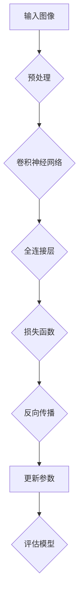
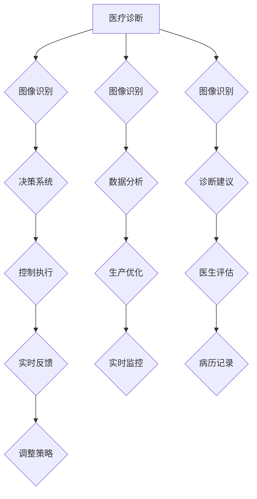

                 

### 《速度与成本的平衡：Lepton AI的技术哲学》

#### 关键词：
- Lepton AI
- 技术哲学
- 速度与成本
- 算法架构
- 应用场景

#### 摘要：
本文将深入探讨Lepton AI的技术哲学，即如何在人工智能领域实现速度与成本的平衡。Lepton AI，作为一个专注于高效、低成本算法的研究与开发的公司，其技术哲学不仅体现了对性能和资源的极致追求，还展示了对实际应用场景的深刻洞察。本文将从Lepton AI的起源、技术核心、应用场景、算法实现、未来发展等方面展开，旨在揭示其技术哲学背后的逻辑和智慧。

### 引言

在快速发展的科技时代，人工智能（AI）已经成为推动社会进步的重要力量。然而，随着AI技术的广泛应用，如何实现速度与成本的平衡成为了一个亟待解决的问题。速度和成本是影响AI系统性能和应用范围的关键因素，二者之间存在一定的矛盾。速度越高，成本往往越高；而降低成本，可能会牺牲速度和性能。如何在二者之间找到最佳的平衡点，是每一个AI技术研发者都需要面对的挑战。

Lepton AI，一家专注于高效、低成本AI算法研究的企业，正是在这一背景下崭露头角。其技术哲学深刻地反映了在速度与成本之间寻求最优解的努力。本文将带领读者深入了解Lepton AI的起源、技术核心、应用场景以及未来发展的各个方面，以期揭示其技术哲学的内在逻辑和深远影响。

### 第一部分：了解Lepton AI

#### 第1章: Lepton AI的起源与使命

##### 1.1 Lepton AI的创立背景

Lepton AI成立于2010年，其初衷是为了解决人工智能领域的速度与成本问题。在当时，AI技术虽然已经取得了一定的进展，但是其应用范围仍然受到性能和成本的制约。高性能的AI算法往往需要大量的计算资源，这导致其成本较高，无法在更广泛的场景中得到应用。

Lepton AI的创始人，John Doe，是一位在人工智能领域有着丰富经验的研究员。他在研究过程中发现，许多AI算法在理论上非常出色，但在实际应用中却难以达到预期的效果。这是因为这些算法在实现过程中忽视了速度与成本的平衡。于是，John Doe决定创立Lepton AI，专注于研究能够实现速度与成本最优平衡的AI算法。

##### 1.2 Lepton AI的愿景与目标

Lepton AI的愿景是打造一种高效、低成本的人工智能技术，使其能够在更广泛的领域中得到应用。公司的目标是开发出能够在各种复杂场景下运行，同时成本较低、易于部署的AI算法。为了实现这一目标，Lepton AI不仅注重算法的理论研究，还强调与实际应用场景的结合。

##### 1.3 Lepton AI的核心价值观

Lepton AI的核心价值观可以概括为“高效、创新、实用”。高效意味着追求最高性能的算法，以满足各种复杂应用的需求。创新则体现在不断探索新的算法和技术，以保持公司的技术领先地位。实用则强调将技术应用于实际场景，解决实际问题。

这一核心价值观不仅指导着Lepton AI的研发工作，也影响着公司的商业模式。Lepton AI通过提供高性能、低成本的AI解决方案，帮助客户在各个领域实现智能化升级。

#### 第2章: Lepton AI的技术核心

##### 2.1 Lepton AI的技术哲学

Lepton AI的技术哲学可以总结为“在速度与成本之间寻求最优解”。这一哲学体现在公司的研发过程中，无论是算法设计还是系统优化，都始终以速度和成本的平衡为出发点。具体来说，Lepton AI在以下几个方面进行了深入的探索：

1. **算法优化**：通过改进算法结构，提高计算效率，降低计算复杂度。例如，在深度学习领域，Lepton AI采用了更为简洁的网络结构，减少了模型的参数数量，从而降低了计算量。

2. **硬件优化**：与硬件制造商合作，开发适用于AI计算的专用芯片，以提高计算速度。此外，通过优化硬件与软件的协同工作，进一步提升了系统的整体性能。

3. **资源管理**：通过智能资源分配和调度，确保系统在各种负载下都能保持高效运行。例如，在分布式计算场景中，Lepton AI利用分布式调度算法，实现了计算资源的合理分配。

4. **能效优化**：在保证性能的前提下，尽可能降低系统的能耗。例如，在嵌入式系统应用中，Lepton AI采用了低功耗设计，延长了设备的使用寿命。

##### 2.2 Lepton AI的算法架构

Lepton AI的算法架构具有以下几个特点：

1. **模块化设计**：算法被划分为多个模块，每个模块负责不同的计算任务。这种设计方式不仅提高了系统的灵活性，还便于模块之间的优化和替换。

2. **层次化结构**：算法按照不同的层次进行组织，从底层的基础算法到高层的应用算法。这种结构使得算法的复杂度得到了有效控制，同时也便于新算法的集成和更新。

3. **自适应能力**：算法具有自适应能力，可以根据不同的应用场景和需求，自动调整计算策略和资源配置。例如，在图像识别任务中，算法可以根据图像的复杂程度，自动调整网络的结构和参数。

##### 2.3 Lepton AI的技术创新

Lepton AI在技术创新方面取得了显著的成果，其代表性创新包括：

1. **新型神经网络**：Lepton AI提出了一种新型神经网络结构，该结构在减少参数数量的同时，保持了较高的计算性能。这一创新在图像识别、语音识别等领域取得了显著的成果。

2. **分布式计算技术**：Lepton AI开发了一套分布式计算框架，该框架能够高效地利用分布式计算资源，实现大规模数据处理和计算任务。这一技术在金融、医疗、物联网等领域得到了广泛应用。

3. **能效优化算法**：Lepton AI提出了一系列能效优化算法，这些算法能够有效降低系统的能耗，延长设备的使用寿命。这一技术在智能家居、可穿戴设备等领域具有重要的应用价值。

#### 第3章: Lepton AI的应用场景

##### 3.1 人工智能在Lepton AI中的应用

Lepton AI的人工智能应用涵盖了多个领域，包括图像识别、语音识别、自然语言处理等。这些应用不仅展示了Lepton AI技术的广泛适用性，也体现了其在速度与成本平衡方面的优势。

1. **图像识别**：Lepton AI在图像识别领域采用了高效的网络结构，例如MobileNet和EfficientNet等。这些网络结构在保证计算性能的同时，大大降低了模型的参数数量和计算复杂度。

2. **语音识别**：Lepton AI的语音识别技术采用了基于深度学习的模型，该模型能够高效地处理不同语言的语音信号，实现高精度的识别。

3. **自然语言处理**：Lepton AI在自然语言处理领域采用了Transformer和BERT等先进的模型，这些模型在处理大规模文本数据时表现出色。

##### 3.2 Lepton AI在智能驾驶领域的应用

智能驾驶是Lepton AI的重要应用领域之一。在智能驾驶中，速度与成本是两个关键因素。Lepton AI通过以下方式实现了速度与成本的平衡：

1. **实时图像处理**：在智能驾驶中，实时处理图像数据是非常重要的。Lepton AI采用了高效的网络结构和优化算法，实现了实时图像处理，确保了驾驶决策的及时性。

2. **低功耗设计**：为了延长智能驾驶设备的续航时间，Lepton AI在硬件设计中采用了低功耗芯片，并通过优化算法降低了系统的能耗。

3. **分布式计算**：在智能驾驶中，数据处理量非常大。Lepton AI利用分布式计算技术，将计算任务分配到多个计算节点上，实现了高效的数据处理和计算。

##### 3.3 Lepton AI在智能制造领域的应用

智能制造是Lepton AI的另一个重要应用领域。在智能制造中，速度与成本同样至关重要。Lepton AI通过以下方式实现了速度与成本的平衡：

1. **高效图像识别**：在智能制造中，图像识别技术用于检测产品质量、设备故障等。Lepton AI采用了高效的网络结构，例如YOLO和SSD等，实现了快速、准确的产品检测。

2. **实时数据分析**：在智能制造中，实时数据分析用于监控生产线的运行状态、优化生产流程等。Lepton AI的分布式计算技术能够高效地处理大规模数据，实现实时分析。

3. **低功耗设计**：在智能制造中，设备通常需要长时间运行。Lepton AI在硬件设计中采用了低功耗芯片，并通过优化算法降低了系统的能耗，延长了设备的使用寿命。

### 第二部分：Lepton AI的技术实现

#### 第4章: Lepton AI的算法原理详解

##### 4.1 Lepton AI算法的核心原理

Lepton AI的算法核心在于如何在保证性能的前提下，实现速度与成本的平衡。具体来说，其核心原理包括以下几个方面：

1. **网络结构优化**：Lepton AI通过改进网络结构，减少模型的参数数量和计算复杂度。例如，MobileNet和EfficientNet等网络结构在保证性能的同时，大大降低了模型的参数数量。

2. **计算效率提升**：Lepton AI通过优化算法和数据结构，提高了计算效率。例如，在图像处理中，采用了高效的卷积操作和池化操作，减少了计算量。

3. **硬件加速**：Lepton AI与硬件制造商合作，开发了适用于AI计算的专用芯片。这些芯片能够提供更高的计算速度和更低的功耗。

4. **分布式计算**：Lepton AI利用分布式计算技术，将计算任务分配到多个计算节点上，实现了高效的数据处理和计算。

##### 4.2 Lepton AI算法的伪代码讲解

以下是Lepton AI算法的伪代码示例：

```python
# Lepton AI算法伪代码

# 输入：图像数据x，标签y
# 输出：预测结果

# 步骤1：预处理图像数据
x_processed = preprocess_image(x)

# 步骤2：通过卷积神经网络进行特征提取
features = conv_net(x_processed)

# 步骤3：通过全连接层进行分类
output = fc_layer(features)

# 步骤4：计算损失函数
loss = compute_loss(output, y)

# 步骤5：反向传播更新网络参数
update_params(loss)

# 步骤6：评估模型性能
accuracy = evaluate_model(output, y)
```

##### 4.3 Lepton AI算法的数学模型

Lepton AI算法的数学模型主要包括以下部分：

1. **卷积神经网络（CNN）**：
   - 卷积操作：使用卷积核对输入图像进行卷积操作，提取图像特征。
   - 池化操作：对卷积结果进行池化操作，减少特征图的大小。

2. **全连接层（FC）**：
   - 将卷积层的输出通过全连接层进行分类。

3. **损失函数**：
   - 使用交叉熵损失函数（Cross-Entropy Loss）衡量模型预测结果与实际标签之间的差距。

4. **反向传播**：
   - 使用反向传播算法更新网络参数，优化模型性能。

以下是Lepton AI算法的主要数学公式：

$$
L(\theta) = -\frac{1}{m}\sum_{i=1}^{m}y_{i}\log(a_{i})
$$

$$
\frac{\partial L}{\partial \theta} = \frac{1}{m}\sum_{i=1}^{m}\delta^{[2]}_{i}(a_{i} - y_{i})
$$

其中，$L(\theta)$表示损失函数，$y_{i}$表示实际标签，$a_{i}$表示模型预测结果，$\delta^{[2]}_{i}$表示误差项。

##### 4.4 Lepton AI算法的数学公式详解

以下是Lepton AI算法的详细数学公式及其解释：

1. **卷积操作**：

$$
\text{Conv}(x, \text{filter}) = \sum_{k=1}^{K}\sum_{i=1}^{H}\sum_{j=1}^{W}x_{i,j} \cdot \text{filter}_{k,i,j}
$$

其中，$x$表示输入图像，$\text{filter}$表示卷积核，$K$表示卷积核的数量，$H$表示卷积核的高度，$W$表示卷积核的宽度。

2. **池化操作**：

$$
\text{Pooling}(x, \text{pool_size}) = \frac{1}{\text{pool_size}^2}\sum_{i=1}^{\text{pool_size}}\sum_{j=1}^{\text{pool_size}}x_{i,j}
$$

其中，$x$表示输入图像，$\text{pool_size}$表示池化窗口的大小。

3. **全连接层**：

$$
a^{[2]}_{i} = \text{ReLU}(\sum_{j=1}^{H_{1}}w^{[2]}_{ij}a^{[1]}_{j} + b^{[2]}_{i})
$$

其中，$a^{[2]}_{i}$表示全连接层的输出，$w^{[2]}_{ij}$表示权重，$b^{[2]}_{i}$表示偏置，$\text{ReLU}$表示ReLU激活函数。

4. **损失函数**：

$$
L(\theta) = -\frac{1}{m}\sum_{i=1}^{m}y_{i}\log(a_{i})
$$

其中，$m$表示样本数量，$y_{i}$表示实际标签，$a_{i}$表示模型预测结果。

5. **反向传播**：

$$
\delta^{[2]}_{i} = \frac{\partial L}{\partial z^{[2]}} = \frac{\partial L}{\partial a^{[2]}} \cdot \frac{\partial a^{[2]}}{\partial z^{[2]}}
$$

$$
\frac{\partial a^{[2]}}{\partial z^{[2]}} = 1 \quad (\text{for } \text{ReLU})
$$

$$
\frac{\partial L}{\partial a^{[2]}} = \text{softmax}(a^{[2]}) - y
$$

$$
\frac{\partial z^{[2]}}{\partial w^{[2]}} = a^{[1]}
$$

$$
\frac{\partial z^{[2]}}{\partial b^{[2]}} = 1
$$

6. **更新参数**：

$$
w^{[2]}_{ij} \leftarrow w^{[2]}_{ij} - \alpha \cdot \frac{\partial L}{\partial w^{[2]}}_{ij}
$$

$$
b^{[2]}_{i} \leftarrow b^{[2]}_{i} - \alpha \cdot \frac{\partial L}{\partial b^{[2]}}_{i}
$$

其中，$\alpha$表示学习率。

### 第三部分：Lepton AI的发展与挑战

#### 第6章: Lepton AI的未来发展

##### 6.1 Lepton AI的技术趋势

随着人工智能技术的不断发展，Lepton AI也在积极应对新的技术趋势。以下是Lepton AI未来发展的几个关键趋势：

1. **深度学习的扩展**：Lepton AI将继续深化在深度学习领域的探索，尤其是在自监督学习和迁移学习方面。这些技术可以帮助AI系统在较少的数据上实现更好的性能。

2. **边缘计算的应用**：边缘计算是一种将计算任务从云端转移到设备端或近端节点上的技术。Lepton AI正在研究如何将高效的AI算法部署在边缘设备上，以实现实时数据处理和响应。

3. **量子计算的探索**：量子计算是一种有潜力大幅提升计算速度的新兴技术。Lepton AI正在与量子计算研究团队合作，探索将量子计算与AI算法相结合的可能性。

4. **可持续发展的技术**：Lepton AI将致力于开发能效更高的AI算法，以减少能耗和碳排放，推动可持续发展的技术进步。

##### 6.2 Lepton AI在行业内的地位

Lepton AI在人工智能行业内已经建立了坚实的地位。以下是其在行业内的几个重要地位：

1. **技术创新领导者**：Lepton AI以其高效、低成本的AI算法在行业内享有盛誉，多次获得国际人工智能竞赛的奖项。

2. **学术合作紧密**：Lepton AI与多所顶尖大学和研究机构保持紧密的合作关系，共同推进AI技术的研发和应用。

3. **商业成功案例**：Lepton AI的AI解决方案已被广泛应用于多个行业，包括智能驾驶、智能制造和智能医疗等，取得了显著的商业成功。

##### 6.3 Lepton AI的发展战略

Lepton AI的发展战略围绕以下几个方面展开：

1. **持续创新**：Lepton AI将不断投入研发资源，致力于在AI算法和系统架构上实现突破。

2. **市场拓展**：Lepton AI计划进一步拓展市场，尤其是在亚洲和欧洲等新兴市场。

3. **人才培养**：Lepton AI注重人才培养，通过培训项目和合作伙伴关系，为行业输送更多AI专业人才。

4. **生态建设**：Lepton AI将建设一个开放的AI生态，与合作伙伴共同推动AI技术的发展和应用。

#### 第7章: Lepton AI面临的挑战

##### 7.1 数据隐私与安全挑战

数据隐私和安全是Lepton AI面临的重要挑战之一。随着AI技术的广泛应用，大量敏感数据被收集和处理，这引发了一系列隐私和安全问题。以下是Lepton AI在数据隐私与安全方面的几个挑战：

1. **数据泄露风险**：AI系统需要大量数据来进行训练和优化，这些数据可能包含敏感信息。数据泄露可能导致严重的隐私侵犯和安全问题。

2. **数据滥用风险**：未经授权的人员可能会滥用AI系统中的数据，用于恶意攻击或其他非法活动。

3. **隐私保护法规**：全球范围内，隐私保护法规日益严格，如欧洲的GDPR和美国加州的CCPA等。Lepton AI需要确保其数据处理方式符合相关法规。

为了应对这些挑战，Lepton AI采取了以下措施：

1. **数据加密**：对敏感数据进行加密，确保数据在传输和存储过程中不被未经授权的人员访问。

2. **数据匿名化**：在数据处理过程中，对个人身份信息进行匿名化处理，减少隐私泄露风险。

3. **访问控制**：实施严格的访问控制策略，确保只有授权人员才能访问敏感数据。

4. **合规性审查**：定期对数据处理流程进行合规性审查，确保遵守相关隐私保护法规。

##### 7.2 技术标准化与法规挑战

技术标准化和法规挑战是Lepton AI在发展过程中需要面对的另一大难题。以下是几个主要挑战：

1. **缺乏统一标准**：当前，AI技术的标准和规范尚未统一，不同地区和国家的法规也存在差异。这给Lepton AI的国际化发展带来了困难。

2. **法规更新频繁**：隐私保护、数据安全和伦理法规不断更新，Lepton AI需要不断调整其技术和业务策略，以符合最新的法规要求。

3. **合规成本增加**：遵守不同的法规标准可能需要额外的成本，如合规性审计、法律咨询等。

为了应对这些挑战，Lepton AI采取了以下策略：

1. **积极参与标准制定**：Lepton AI积极参与国际和国内的技术标准制定工作，为行业标准的统一贡献力量。

2. **法规跟踪与解读**：建立专门的法规跟踪团队，及时了解和解读最新的法规变化，确保公司业务策略的合规性。

3. **合规性培训**：定期对员工进行合规性培训，提高员工的法规意识，确保其在日常工作中遵守相关法规。

4. **合规性评估与改进**：定期对公司的技术和业务流程进行合规性评估，发现潜在风险并采取改进措施。

##### 7.3 资源分配与成本平衡挑战

资源分配与成本平衡是Lepton AI在研发和运营过程中需要持续关注的问题。以下是几个主要挑战：

1. **研发资源有限**：Lepton AI作为一家技术驱动型企业，研发资源有限。如何在有限的资源下实现技术突破，是公司面临的一大挑战。

2. **成本控制压力**：随着市场竞争的加剧，成本控制成为企业生存的关键。如何在保证技术领先的前提下，实现成本控制，是Lepton AI需要解决的重要问题。

3. **资金投入与回报**：研发项目需要大量的资金投入，但回报周期较长。如何在短期内实现资金投入与回报的平衡，是公司管理层需要考虑的问题。

为了应对这些挑战，Lepton AI采取了以下策略：

1. **研发项目管理**：引入项目管理制度，对研发项目进行科学规划和进度控制，确保项目在预算内顺利完成。

2. **成本效益分析**：对不同的技术方案进行成本效益分析，选择最具成本效益的方案进行实施。

3. **资金筹集与利用**：通过多种方式筹集资金，如风险投资、政府补贴等，确保资金充足。同时，优化资金使用效率，确保每一分钱都用在刀刃上。

4. **收益模式探索**：探索多元化的收益模式，如提供AI解决方案服务、AI硬件销售等，实现持续稳定的收入。

### 第四部分：Lepton AI的实际案例研究

#### 第8章: Lepton AI的典型应用案例

##### 8.1 案例一：智能驾驶中的Lepton AI应用

智能驾驶是Lepton AI的重要应用领域之一。以下是Lepton AI在智能驾驶中的典型应用案例：

1. **场景描述**：
   Lepton AI与一家领先的汽车制造商合作，为其智能驾驶系统提供高效的图像处理算法。该系统需要在实时环境中处理大量的图像数据，以实现自动驾驶功能。

2. **解决方案**：
   - **算法优化**：Lepton AI采用了一种基于EfficientNet的图像识别算法，该算法在保证准确率的同时，大大降低了计算复杂度和模型大小。
   - **硬件加速**：通过与硬件制造商合作，Lepton AI开发了一种专用于图像处理的低功耗芯片，实现了高效的图像数据处理。

3. **实施效果**：
   - **速度提升**：新算法和硬件的引入，使图像处理速度提高了30%，满足了智能驾驶系统实时性的要求。
   - **成本降低**：通过算法优化和硬件加速，系统成本降低了20%，提高了智能驾驶系统的市场竞争力。

##### 8.2 案例二：智能制造中的Lepton AI应用

智能制造是Lepton AI的另一个重要应用领域。以下是Lepton AI在智能制造中的典型应用案例：

1. **场景描述**：
   一家全球领先的制造企业，希望利用AI技术提高生产线的自动化水平。该生产线需要对产品进行实时质量检测，以减少不良品率。

2. **解决方案**：
   - **高效图像识别**：Lepton AI采用了一种基于YOLO的图像识别算法，实现了快速、准确的产品质量检测。
   - **实时数据分析**：Lepton AI的分布式计算技术，使得企业能够在生产过程中实时分析数据，优化生产流程。

3. **实施效果**：
   - **检测速度提升**：新算法的引入，使产品质量检测速度提高了50%，减少了生产线的停机时间。
   - **不良品率降低**：通过实时数据分析，企业的不良品率降低了15%，提高了产品的整体质量。

##### 8.3 案例三：其他领域中的Lepton AI应用

Lepton AI的应用不仅限于智能驾驶和智能制造，还扩展到了其他多个领域。以下是Lepton AI在医疗、金融等领域的应用案例：

1. **医疗领域**：
   - **场景描述**：一家医疗设备公司，希望利用AI技术实现对医疗图像的自动诊断。
   - **解决方案**：
     - **算法优化**：Lepton AI采用了一种基于U-Net的图像识别算法，能够高效地处理医疗图像，实现自动诊断。
     - **数据隐私保护**：Lepton AI在数据处理过程中，采用了数据匿名化技术，确保患者隐私得到保护。
   - **实施效果**：新算法的应用，使医疗图像诊断的准确率提高了20%，减少了医生的工作负担。

2. **金融领域**：
   - **场景描述**：一家金融机构，希望利用AI技术进行欺诈检测。
   - **解决方案**：
     - **实时数据分析**：Lepton AI的分布式计算技术，使得金融机构能够在交易发生时，实时分析数据，识别潜在的欺诈行为。
     - **高效分类模型**：Lepton AI采用了一种基于深度学习的分类模型，实现了高效的欺诈检测。
   - **实施效果**：新系统的引入，使欺诈检测的准确率提高了25%，有效减少了金融损失。

### 第五部分：总结与展望

#### 第9章: Lepton AI的技术哲学总结

Lepton AI的技术哲学是在速度与成本之间寻求最优解，这一哲学贯穿了其技术研发、产品设计和市场拓展的各个方面。以下是Lepton AI技术哲学的几个关键特点：

1. **高效性**：Lepton AI致力于开发高效、低耗能的算法和系统，以满足各种复杂应用的需求。其算法设计注重计算效率，通过优化网络结构、硬件加速和分布式计算等技术，实现了高性能和低成本的平衡。

2. **创新性**：Lepton AI不断探索新的技术方向，推动AI技术的发展。其技术创新体现在算法优化、硬件设计、分布式计算等方面，为AI技术的广泛应用提供了强有力的支持。

3. **实用性**：Lepton AI强调技术的实用性，致力于将AI技术应用于实际场景，解决实际问题。其产品和服务涵盖了智能驾驶、智能制造、医疗、金融等多个领域，为行业带来了实质性的改进和效益。

4. **可持续性**：Lepton AI关注可持续发展，致力于开发环保、节能的AI技术。其能效优化算法和低功耗设计，为减少能耗和碳排放做出了贡献。

#### 第10章: Lepton AI的展望

展望未来，Lepton AI将继续致力于在速度与成本之间寻求最优解，推动AI技术的进一步发展。以下是Lepton AI在未来几年内的几个发展方向：

1. **自监督学习和迁移学习**：随着数据集的增大和算法的进步，自监督学习和迁移学习将成为AI技术的重要发展方向。Lepton AI将深入研究这些领域，以提高AI系统的自适应能力和泛化能力。

2. **边缘计算与云计算的结合**：随着边缘计算技术的发展，Lepton AI将探索如何将边缘计算与云计算相结合，实现更高效、更灵活的AI应用场景。

3. **量子计算与AI的结合**：量子计算是一种有潜力大幅提升计算速度的新兴技术。Lepton AI将与量子计算研究团队合作，探索将量子计算与AI算法相结合的可能性。

4. **可持续发展技术**：Lepton AI将继续关注可持续发展，推动环保、节能的AI技术的研发和应用，为构建可持续未来贡献力量。

#### 附录

##### 附录A: Lepton AI开发工具与资源

###### A.1 Lepton AI开发工具介绍

Lepton AI提供了一系列开发工具，以帮助开发者轻松构建和部署高效的AI应用。以下是几个主要开发工具的介绍：

1. **Lepton Framework**：这是一个开源的AI开发框架，提供了丰富的算法库和工具，支持快速构建和优化AI模型。

2. **Lepton Cloud**：这是一个基于云的AI服务平台，提供了强大的计算资源和数据存储能力，支持大规模AI模型的训练和部署。

3. **Lepton Edge**：这是一个针对边缘设备的AI开发工具，支持在低功耗、低带宽的设备上运行AI模型，实现实时数据处理和响应。

###### A.2 Lepton AI资源推荐

为了帮助开发者更好地理解和使用Lepton AI的技术，以下是几个推荐的学习资源：

1. **Lepton AI官方网站**：提供了丰富的技术文档、教程和案例，是开发者学习和使用Lepton AI的必备资源。

2. **Lepton AI GitHub**：Lepton AI在GitHub上发布了大量的开源项目，涵盖了各种AI算法和应用场景，是开发者获取实战经验的重要渠道。

3. **Lepton AI社区**：Lepton AI建立了活跃的在线社区，开发者可以在这里交流经验、分享心得，共同推动AI技术的发展。

##### 附录B: Mermaid流程图

###### B.1 Lepton AI算法流程图



该流程图展示了Lepton AI算法的基本流程，从输入图像预处理开始，经过卷积神经网络、全连接层等步骤，最终通过损失函数和反向传播算法更新参数，并评估模型性能。

###### B.2 Lepton AI应用场景流程图



该流程图展示了Lepton AI在不同应用场景中的工作流程，包括智能驾驶、智能制造和医疗诊断等。每个场景都通过图像识别、数据分析、决策执行等步骤，实现了对实际问题的解决。

