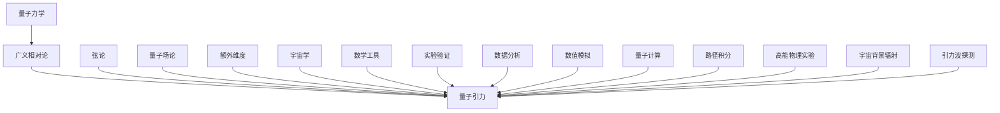

                 

# 量子引力理论的发展历程

## 关键词：
- 量子力学
- 广义相对论
- 弦论
- 额外维度
- 宇宙学

## 摘要：
本文将系统地回顾量子引力理论的发展历程，从早期探索到现代前沿，包括其数学基础、物理原理和重要成果。通过梳理量子引力理论的核心概念和联系，本文旨在为读者提供一份全面而深入的理解，探索这一复杂领域的魅力和挑战。

## 目录大纲

### 第一部分：引论

#### 第1章：量子引力的背景与重要性
- 量子引力的基本概念
  - 量子力学与广义相对论的不兼容性
  - 量子引力理论的需求
- 量子引力的历史发展
  - 早期探索
  - 波兹曼与霍金辐射
  - 弦论的兴起
- 量子引力理论的当前状态
  - 主要的量子引力理论
  - 当前研究热点与挑战

#### 第2章：量子引力理论的数学基础
- 广义相对论与引力的量子化
  - 广义相对论概述
  - 量子化引力场的初步尝试

#### 第3章：量子引力理论的物理原理
- 量子场论与引力的量子化
  - 量子场论基础
  - 量子化引力场的尝试

#### 第4章：弦论与量子引力
- 弦论的基本原理与应用
  - 弦论概述
  - 弦论在量子引力中的应用

#### 第5章：额外维度与量子引力理论
- 额外维度的基本概念
  - 额外维度的起源与意义
  - 额外维度的观测与实验验证
- 额外维度在量子引力中的应用
  - 额外维度与黑洞问题
  - 额外维度与宇宙学问题

#### 第6章：量子引力与宇宙学
- 宇宙学的量子引力视角
  - 宇宙学的标准模型
  - 量子引力对宇宙学的影响
- 量子引力与宇宙学问题的探讨
  - 量子引力与宇宙起源
  - 量子引力与宇宙结构演化

#### 第7章：量子引力的未来展望
- 量子引力的未来研究方向
  - 新的量子引力理论探索
  - 量子引力实验验证
- 量子引力研究面临的挑战
  - 数学难题与计算复杂性
  - 观测数据的解释与验证

### 附录

#### 附录 A：量子引力研究工具与方法

#### 附录 B：参考文献

### 第一部分：引论

#### 第1章：量子引力的背景与重要性

**量子引力的基本概念**

量子引力的概念源自于量子力学与广义相对论之间的不相容性。量子力学描述了微观粒子的行为，而广义相对论则描述了宏观尺度的引力现象。这两种理论在不同的尺度上表现出完全不同的特性，但它们描述的是同一个物理现象——引力。然而，它们之间存在显著的矛盾，无法在统一的框架下描述引力的微观行为。

量子力学基于量子态和波函数，强调粒子的波动性和概率性。而广义相对论则通过爱因斯坦场方程描述了引力作为时空的曲率。由于这两种理论的数学基础和物理假设完全不同，因此直接将它们结合起来是一个巨大的挑战。

**量子力学与广义相对论的不兼容性**

量子力学中的不确定性原理指出，粒子的某些物理量（如位置和动量）不能同时被精确测量。而广义相对论中的确定性原理则表明，物理事件在时空中的位置和时间是可以精确预测的。这种内在的不兼容性使得将量子力学和广义相对论结合起来变得非常困难。

此外，量子力学中的量子态叠加和纠缠现象也与广义相对论的局域实在性相冲突。量子态可以同时处于多种可能状态，并且在纠缠态中，两个粒子之间的相互作用似乎超越了局域性，这在经典物理学中是无法解释的。

**量子引力理论的需求**

为了克服这些矛盾，科学家们提出了量子引力理论，试图在统一的框架下描述引力的量子行为。量子引力理论的目标是找到一个能够同时兼容量子力学和广义相对论的理论，以便在所有尺度上描述引力的行为。

量子引力理论的需求不仅来自于理论上的挑战，还来自于实验上的迫切需求。例如，黑洞的熵和霍金辐射等现象需要量子引力理论的解释。此外，宇宙的早期状态和宇宙学的某些观测现象也暗示了引力的量子性质。

**量子引力的历史发展**

量子引力理论的探索始于20世纪早期，科学家们试图通过修改量子力学或广义相对论来解决这个问题。然而，这些初步尝试并没有取得实质性的进展。

在20世纪70年代，物理学家史蒂芬·霍金提出了关于黑洞辐射的理论，即霍金辐射。这一理论暗示了引力可能具有量子性质，从而引发了量子引力理论的研究热潮。

随后，物理学家们提出了多种量子引力理论，包括弦论、环量子引力、量子几何等。这些理论试图从不同的角度解决量子力学与广义相对论之间的不相容性问题。

**波兹曼与霍金辐射**

波兹曼在20世纪60年代提出了关于热力学和量子场论的关系，这为理解量子引力提供了一个新的视角。霍金辐射是量子引力理论中的一个重要概念，它描述了黑洞周围的辐射现象。

霍金辐射指出，黑洞并不是一个完全黑暗的物体，而是会不断辐射出粒子。这些粒子的产生和消失遵循量子力学的规律，表明引力具有量子性质。

**弦论的兴起**

弦论是量子引力理论中最有希望的一个分支。它提出，宇宙中的基本粒子并非点状实体，而是细小的弦。这些弦通过不同的振动模式产生不同的粒子，从而解释了物质的性质。

弦论在解释黑洞和宇宙学问题时表现出巨大的潜力。它能够自然地融合量子力学和广义相对论，并提供了一个统一的框架来描述引力和宇宙的起源。

**量子引力理论的当前状态**

目前，量子引力理论仍处于探索阶段，尚未有一个被广泛接受的理论。然而，弦论和其他量子引力理论在数学结构和物理预测方面取得了显著进展。

当前的研究热点包括对弦论中的额外维度的探索、对量子几何的研究以及实验验证量子引力理论的尝试。尽管面临许多挑战，量子引力理论的研究将继续推动我们对宇宙的理解。

**当前研究热点与挑战**

量子引力理论的当前研究热点包括：

1. 弦论与额外维度的探索：弦论中的额外维度可能对宇宙的早期状态和黑洞现象提供新的解释。
2. 量子几何：量子几何研究试图将时空的量子性质与引力结合起来，以提供一个统一的量子引力框架。
3. 实验验证：通过高精度的实验和观测，科学家们试图验证量子引力理论的预测，从而确定其正确性。

然而，量子引力理论的研究也面临许多挑战：

1. 数学难题：量子引力理论涉及复杂的数学结构，解决这些难题需要新的数学工具和方法。
2. 计算复杂性：量子引力问题的计算复杂性极高，使得直接求解非常困难。
3. 观测数据的解释：量子引力理论需要与实验数据进行对比，但宇宙的观测数据有限，且受噪声影响，因此解释这些数据存在困难。

尽管如此，量子引力理论的研究将继续是物理学的前沿领域，它将揭示宇宙的本质和引力背后的奥秘。

### 第2章：量子引力理论的数学基础

#### 广义相对论与引力的量子化

**广义相对论概述**

广义相对论是由爱因斯坦于1915年提出的一种描述引力的理论。它基于一个简单的思想：引力不是由质量点之间直接作用产生的，而是由质量对时空结构的影响所引起的。在广义相对论中，引力被描述为时空的弯曲，这一弯曲由物质和能量分布决定。

广义相对论的核心是爱因斯坦场方程，这是一个关于时空弯曲的微分方程。该方程将物质和能量分布与时空几何联系起来，从而提供了引力作用的一个几何描述。方程的基本形式如下：

$$
G_{\mu\nu} + \Lambda g_{\mu\nu} = \frac{8\pi G}{c^4} T_{\mu\nu}
$$

其中，$G_{\mu\nu}$ 是爱因斯坦张量，描述了时空的弯曲程度；$\Lambda$ 是宇宙常数，表示时空的固有弯曲；$g_{\mu\nu}$ 是度规张量，描述了时空的度量；$T_{\mu\nu}$ 是能量-动量张量，描述了物质和能量分布。

**广义相对论的几何解释**

在广义相对论中，时空被视为一个四维连续体，其中每一点都对应着一个时空坐标。这个时空结构是通过度规张量来描述的，度规张量定义了两点之间的距离和角度。度规张量的存在使得我们可以计算时空中的路径，这就是所谓的测地线。

测地线是连接两个点的最短路径，它遵循最小作用量原理。在广义相对论中，物体的运动路径就是由测地线决定的。这意味着，物体在引力场中的运动是由时空的弯曲决定的，而不是由一个神秘的力作用。

**量子化引力场的初步尝试**

尽管广义相对论成功地描述了宏观尺度的引力现象，但它与量子力学的不兼容性是一个不可忽视的问题。为了解决这个问题，物理学家们开始探索引力的量子化。

量子化引力场的初步尝试可以追溯到20世纪30年代，当时物理学家们试图将量子场论应用于引力。量子场论描述了粒子如何通过量子波动场产生，它是量子力学的一个扩展，用于描述多粒子系统。

在量子化引力场的尝试中，物理学家们面临的一个关键问题是如何将引力的几何描述与量子场的波动性结合起来。这导致了多种尝试，包括量子几何和量子场论中的其他方法。

一个早期的尝试是哈勃空间-时间量子化。这种方法试图将时空的几何结构量子化为一个离散的网格，类似于量子场论中的 lattice 网格。然而，这种方法并没有得到广泛接受，因为它无法很好地解释引力波的传播。

另一个尝试是使用胶子场论来量子化引力场。胶子是量子场论中的基本粒子，它们负责传递强相互作用。在引力场论中，物理学家们尝试使用类似的胶子来传递引力相互作用。然而，这种方法在数学上非常复杂，且难以与实验数据匹配。

尽管这些初步尝试并没有取得重大成功，但它们为后来的量子引力理论奠定了基础。特别是，这些尝试揭示了引力量子化的困难，并促使物理学家们探索新的方法来解决这个问题。

**量子化引力场的数学基础**

量子化引力场的尝试涉及复杂的数学理论，主要包括量子场论和量子几何。

量子场论为引力场提供了一个量子描述，它使用波函数和算符来描述引力场的量子态。波函数描述了引力场在不同时空点的状态，而算符则描述了如何从这些状态进行测量。量子场论中的基本概念包括正则量子化和路径积分。

正则量子化是一种将经典物理系统量子化的方法，它通过引入正则动量来描述系统的量子态。在引力场的情况下，正则量子化试图将广义相对论的度规张量量子化为一个量子场。

路径积分是一种计算量子态概率幅的方法，它将量子态视为所有可能路径的叠加。在引力场的情况下，路径积分方法可以用来计算引力场的量子态。

量子几何是另一个量子引力理论的数学框架，它试图将时空的几何结构量子化为一个离散的网格。量子几何使用离散的时空点来描述引力场，并通过量子几何方程来描述这些点的相互作用。

这些数学基础为量子引力理论提供了一个严格的数学框架，使得我们可以从理论上研究引力的量子行为。尽管这些理论仍然存在许多未解决的问题，但它们为量子引力理论的研究提供了重要的工具和方法。

### 第3章：量子引力理论的物理原理

#### 量子场论与引力的量子化

量子场论是量子力学的一个扩展，它用于描述多粒子系统中的相互作用。在量子场论中，基本粒子被视为场，这些场通过量子波动产生。量子场论的核心概念包括正则量子化和路径积分。

**量子场论基础**

量子场论的基础是量子态和场算符。量子态描述了粒子的状态，它可以通过波函数来表示。场算符则描述了粒子如何通过场的波动产生。在量子场论中，场算符满足一定的对易关系，这些对易关系描述了粒子之间的相互作用。

正则量子化是一种将经典物理系统量子化的方法。在引力场的情况下，正则量子化试图将广义相对论的度规张量量子化为一个量子场。度规张量描述了时空的几何结构，而量子化后的度规张量则描述了量子引力场的量子态。

**量子场的正则量子化**

在量子场论中，正则量子化通过引入正则动量来描述系统的量子态。正则动量是经典物理系统中的动量，但具有量子特性。通过引入正则动量，我们可以将经典物理系统的哈密顿量量子化为一个量子场的哈密顿量。

对于引力场，正则量子化涉及将广义相对论的度规张量 $g_{\mu\nu}$ 量子化为一个量子场。度规张量 $g_{\mu\nu}$ 描述了时空的几何结构，它可以被视为一个场，其量子态由波函数 $\Psi[g_{\mu\nu}]$ 描述。

正则量子化的步骤如下：

1. **引入正则动量**：对于度规张量 $g_{\mu\nu}$，引入正则动量 $p^{\mu\nu}$，使得度规张量和正则动量满足经典物理系统中的对易关系：
   $$
   [g_{\mu\nu}, p^{\rho\sigma}] = -i\hbar \delta_{\mu\rho}\delta_{\nu\sigma}
   $$
2. **构建量子哈密顿量**：通过正则动量，我们可以构建量子哈密顿量 $H$，它描述了系统的能量。量子哈密顿量通常由正则动量和度规张量的函数构成：
   $$
   H = \int d^4x \sqrt{-g} \mathcal{L}
   $$
   其中，$\mathcal{L}$ 是拉格朗日量，它由度规张量和正则动量决定。
3. **求解薛定谔方程**：通过量子哈密顿量，我们可以求解薛定谔方程，得到量子引力场的波函数 $\Psi[g_{\mu\nu}]$。波函数描述了量子引力场在不同时空点的状态。

**量子引力场的基本方程**

量子引力场的基本方程由量子场论中的拉格朗日量决定。量子场论的拉格朗日量通常包括度规张量的导数项、度规张量本身以及可能的相互作用项。

量子引力场的拉格朗日量通常表示为：
$$
\mathcal{L} = \frac{1}{2\kappa} \int d^4x \sqrt{-g} R + \mathcal{L}_{\text{int}}
$$
其中，$R$ 是度规张量的里奇标量，$\kappa$ 是一个常数，通常取为 $8\pi G/c^4$，$G$ 是引力常数，$c$ 是光速。$\mathcal{L}_{\text{int}}$ 是可能的相互作用项，它描述了量子引力场与其他场（如电磁场）的相互作用。

通过拉格朗日量，我们可以构建量子引力场的哈密顿量，并求解量子引力场的基本方程。这些方程描述了量子引力场在不同时空点的演化，以及量子引力场与其他场的相互作用。

**量子化引力场的尝试**

尽管量子场论提供了一个量子引力场的数学框架，但在实际应用中，量子化引力场仍然面临许多挑战。这些挑战包括：

1. **数学复杂性**：量子引力场的拉格朗日量和哈密顿量通常非常复杂，使得直接求解非常困难。这需要新的数学工具和方法，如数值模拟和量子计算。
2. **物理限制**：量子引力场理论在物理上可能存在一些限制，如非-renormalizable 性质，这可能导致无法得到稳定的物理解。
3. **实验验证**：由于引力场的量子化效应非常微小，实验验证量子引力场理论仍然是一个巨大的挑战。这需要高精度的实验和观测设备。

尽管存在这些挑战，量子场论仍然是量子引力理论的重要基础。通过量子场论，我们可以从理论上研究引力的量子行为，探索量子引力场的基本性质和相互作用。这将有助于我们更好地理解宇宙的本质和引力背后的奥秘。

### 第4章：弦论与量子引力

#### 弦论的基本原理与应用

**弦论的诞生与基本概念**

弦论是量子引力理论中的一个重要分支，它提出了一个革命性的观点：宇宙中的基本粒子并非点状实体，而是细小的弦。这些弦通过不同的振动模式产生不同的粒子，从而解释了物质的性质。

弦论的基本概念可以追溯到20世纪60年代，当时物理学家们试图解释强相互作用。他们发现，点粒子模型无法解释某些实验现象，因此提出了弦模型。随后，物理学家们进一步发展了这一理论，提出了弦论的基本原理。

弦论的核心观点是，宇宙中的基本粒子是由一维的弦振动产生的。这些弦可以是开弦，也可以是闭弦。开弦的两个端点固定在宇宙的边界上，而闭弦则是一个闭合的环路。弦的振动模式决定了不同的粒子，例如，一个振动模式可能产生一个电子，而另一个振动模式可能产生一个夸克。

**闭弦与开弦的量子态**

在弦论中，闭弦和开弦的量子态是基本的概念。闭弦的量子态可以用波函数来描述，这些波函数满足一定的边界条件。开弦的量子态则通过边界条件与闭弦的量子态相关联。

闭弦的量子态通常用态矢量 $\Psi$ 表示，它可以被视为一个复数函数，描述了弦在不同时空点的状态。开弦的量子态则通过将闭弦的量子态扩展到边界点来描述。具体来说，开弦的量子态可以通过边界条件与闭弦的量子态进行组合，形成不同的粒子态。

**弦论在量子引力中的应用**

弦论在量子引力中的应用是弦论研究的核心之一。弦论试图通过将引力场量子化为弦的振动模式，来解决量子引力理论的难题。

一个重要的应用是弦论对黑洞熵的描述。黑洞熵是黑洞性质中的一个关键概念，它表明黑洞具有温度和热力学性质。弦论提供了一种解释黑洞熵的方法，即黑洞的熵与其内部弦的振动模式数量相关。通过计算弦的振动模式，弦论可以预测黑洞的熵，这与霍金辐射的理论预测相一致。

另一个重要应用是弦论对宇宙学问题的探讨。宇宙学是研究宇宙起源、演化和结构的一个分支。弦论提供了新的视角来理解宇宙学问题，例如宇宙的早期状态和宇宙的多样性。弦论中的额外维度和宇宙暴胀理论为宇宙学提供了新的解释。

**弦论与黑洞熵**

黑洞熵是黑洞性质中的一个关键概念。根据霍金辐射的理论，黑洞会不断辐射出粒子，这些粒子的产生和消失遵循量子力学的规律。霍金指出，黑洞的熵与其辐射的温度和辐射的粒子数有关。

弦论为黑洞熵提供了一种新的解释。根据弦论，黑洞内部存在大量的弦振动模式，这些振动模式可以被视为黑洞的微观结构。每个振动模式对应一个特定的能量，因此黑洞的熵与其内部弦振动模式的总数相关。

通过计算弦振动模式的数量，弦论可以预测黑洞的熵。例如，一个四维黑洞的熵与其质量和半径有关，可以通过以下公式计算：

$$
S = \frac{kA}{4L_p^2}
$$

其中，$S$ 是黑洞的熵，$k$ 是一个常数，$A$ 是黑洞的面积，$L_p$ 是普朗克长度。这个公式表明，黑洞的熵与其面积成正比，与普朗克长度的平方成反比。

**弦论与宇宙学问题**

弦论不仅在量子引力领域具有重要作用，还在宇宙学研究中发挥了重要作用。宇宙学是研究宇宙起源、演化和结构的一个分支，弦论提供了新的视角来理解宇宙学问题。

一个重要的宇宙学问题是宇宙的早期状态。根据宇宙学的标准模型，宇宙在大爆炸之后迅速膨胀，这一阶段被称为宇宙暴胀。弦论提供了对宇宙暴胀的新的解释。根据弦论，宇宙暴胀可能是由额外的维度和闭弦的振动模式引起的。

弦论还探讨了宇宙的多样性。宇宙中的不同结构，如星系和星团，是由宇宙早期状态的不同条件产生的。弦论提供了对宇宙多样性的一种解释，即不同的宇宙条件对应不同的弦振动模式，从而形成了不同的宇宙结构。

**弦论的实验验证**

尽管弦论在理论上具有巨大的潜力，但实验验证仍然是一个巨大的挑战。弦论的预测通常涉及高能物理实验，这需要巨大的能量和精度。

一个可能的实验验证方法是使用高能粒子对撞机。通过对撞产生的极高能量粒子，我们可以探索弦论的预测。例如，如果弦论中的额外维度存在，那么在粒子对撞中可能会观察到额外的散射模式。

另一个可能的实验验证方法是观测宇宙背景辐射。宇宙背景辐射是宇宙大爆炸后的残余辐射，它携带着宇宙早期状态的信息。通过分析宇宙背景辐射的谱线和极化模式，我们可以探索弦论的预测。

**总结**

弦论是量子引力理论中的一个重要分支，它提出了新的视角来理解引力的量子行为。弦论通过将引力场量子化为弦的振动模式，解决了量子引力理论的难题。弦论在黑洞熵和宇宙学问题中具有重要作用，并为宇宙的多样性提供了新的解释。

尽管弦论的实验验证仍然面临巨大挑战，但它为量子引力理论的研究提供了新的方向和工具。随着高能物理实验和观测技术的不断发展，弦论的研究将继续推动我们对宇宙的理解，揭示引力的奥秘。

### 第5章：额外维度与量子引力理论

#### 额外维度的基本概念

**额外维度的起源与意义**

额外维度是量子引力理论中的一个重要概念，它指的是除了我们熟知的三维空间和一维时间之外的额外维度。这些额外维度被认为在宇宙的早期阶段是开放的，但随着宇宙的膨胀，它们逐渐闭合并成为我们观察到的三维空间。

额外维度的概念最早由物理学家卡鲁查-克劳斯提出，后来由维内齐亚诺进一步发展。额外维度的理论提出，宇宙中存在额外的空间维度，这些维度在我们的日常生活中是隐形的，但在量子尺度上具有重要作用。

额外维度的起源通常被认为与宇宙的早期阶段有关。根据宇宙学的标准模型，宇宙在大爆炸之后经历了极快的膨胀，这一阶段被称为宇宙暴胀。暴胀理论指出，宇宙在极短的时间内从极小尺度迅速膨胀到目前的尺度，这一过程可能涉及到额外的维度。

额外维度的意义在于，它们可以解释许多宇宙学现象。例如，额外维度可以解释引力微弱现象，即为什么引力比其他基本力弱得多。此外，额外维度还可以解释宇宙的加速膨胀，这被称为暗能量现象。

**额外维度的观测与实验验证**

尽管额外维度的概念具有重大的理论意义，但直接的观测和实验验证仍然是一个巨大的挑战。由于额外维度在我们的日常生活中是隐形的，我们无法直接观察到这些维度。

然而，科学家们通过一些间接的方法来探索额外维度的存在。一种方法是使用高能物理实验，例如粒子对撞机。通过对撞产生的极高能量粒子，科学家们希望发现额外的维度对粒子运动的影响，从而验证额外维度的存在。

另一个方法是通过观测宇宙背景辐射。宇宙背景辐射是宇宙大爆炸后的残余辐射，它携带着宇宙早期状态的信息。通过分析宇宙背景辐射的谱线和极化模式，科学家们可以探索额外维度的存在和影响。

**额外维度在量子引力中的应用**

额外维度在量子引力理论中具有重要作用，它们可以解释许多引力现象和宇宙学问题。以下是一些具体的应用：

1. **引力微弱现象**：额外维度可以解释为什么引力比其他基本力弱得多。根据额外维度的理论，引力在额外的维度上扩展，这使得引力在三维空间中的强度减弱。

2. **宇宙加速膨胀**：额外维度可以解释宇宙的加速膨胀现象，这被称为暗能量。根据额外维度的理论，宇宙的加速膨胀可能与额外的维度有关，这可能导致宇宙加速膨胀。

3. **黑洞现象**：额外维度可以解释黑洞的一些性质，例如黑洞的熵和霍金辐射。根据额外维度的理论，黑洞内部存在额外的维度，这些维度可以解释黑洞的熵和辐射。

4. **宇宙多样性**：额外维度可以解释宇宙的多样性，即为什么宇宙中存在不同的结构和现象。根据额外维度的理论，不同的宇宙条件对应不同的弦振动模式，从而形成了不同的宇宙结构。

**额外维度与黑洞问题**

黑洞是量子引力理论中的一个重要问题，它涉及到引力的极端强度和时空的极端弯曲。额外维度为黑洞问题提供了一些新的解释：

1. **黑洞熵**：根据额外维度的理论，黑洞的熵与其内部弦的振动模式数量相关。这可以解释为什么黑洞具有温度和热力学性质。

2. **霍金辐射**：根据额外维度的理论，黑洞会不断辐射出粒子，这些粒子的产生和消失遵循量子力学的规律。额外维度的存在可以解释霍金辐射的一些特性。

3. **黑洞的质量和半径**：根据额外维度的理论，黑洞的质量和半径可能与额外的维度有关。这可以解释为什么黑洞的质量和半径存在一定的范围。

**额外维度与宇宙学问题**

额外维度在宇宙学问题中也具有重要作用，它们可以解释宇宙的早期状态和宇宙学现象：

1. **宇宙暴胀**：根据额外维度的理论，宇宙暴胀可能是由额外的维度和闭弦的振动模式引起的。这可以解释宇宙在极短时间内的迅速膨胀。

2. **宇宙多样性**：根据额外维度的理论，不同的宇宙条件对应不同的弦振动模式，从而形成了不同的宇宙结构。这可以解释为什么宇宙中存在不同的结构和现象。

3. **宇宙的加速膨胀**：根据额外维度的理论，宇宙的加速膨胀可能与额外的维度有关，这可能导致宇宙加速膨胀。

**总结**

额外维度是量子引力理论中的一个重要概念，它们可以解释许多引力现象和宇宙学问题。尽管直接观测和实验验证仍然是一个巨大的挑战，但额外维度的理论为量子引力理论的研究提供了新的视角和工具。随着高能物理实验和观测技术的不断发展，额外维度的研究将继续推动我们对宇宙的理解，揭示引力的奥秘。

### 第6章：量子引力与宇宙学

#### 宇宙学的量子引力视角

宇宙学是研究宇宙起源、演化和结构的一个分支。在传统的宇宙学研究中，引力被视为一种宏观现象，由广义相对论描述。然而，随着量子力学的发展，科学家们开始探讨引力的量子性质，并试图将其纳入宇宙学的框架中。

量子引力对宇宙学的影响主要体现在以下几个方面：

1. **宇宙早期状态**：宇宙的早期状态被认为是量子引力效应显著的时期。在宇宙大爆炸之后，宇宙处于极端高温和密度的状态，此时量子引力效应变得重要。量子引力理论可以解释宇宙早期的一些现象，如宇宙背景辐射的极低温度和宇宙微波背景辐射的黑体谱。

2. **宇宙结构演化**：宇宙的结构和演化受引力的影响，而引力的量子性质可能影响宇宙结构的形成和演化。例如，量子引力效应可能导致宇宙中的引力波产生，这些引力波可以传播到宇宙的早期阶段，影响宇宙的结构和演化。

3. **宇宙加速膨胀**：宇宙的加速膨胀现象被称为暗能量，其本质仍然是一个谜。量子引力理论可以提供对暗能量的新解释，例如通过额外的维度和量子场论中的量子涨落来解释宇宙的加速膨胀。

#### 量子引力对宇宙学的影响

量子引力对宇宙学的影响可以从以下几个方面进行探讨：

1. **宇宙背景辐射**：宇宙背景辐射是宇宙大爆炸后的残余辐射，它携带着宇宙早期状态的信息。量子引力理论可以解释宇宙背景辐射的一些特性，如极低温度和黑体谱。通过分析宇宙背景辐射的数据，科学家们可以探讨量子引力对宇宙早期状态的影响。

2. **引力波**：引力波是引力场中的波动现象，它是由质量和能量的加速运动产生的。量子引力理论可以预测引力波的产生和传播。通过对引力波信号的观测，科学家们可以探索引力的量子性质，并验证量子引力理论。

3. **宇宙暴胀**：宇宙暴胀是宇宙在极短时间内迅速膨胀的现象。量子引力理论可以提供对宇宙暴胀的新解释，例如通过额外的维度和闭弦的振动模式来解释宇宙暴胀。这有助于我们理解宇宙的早期状态和宇宙的多样性。

#### 量子引力与宇宙学问题的探讨

量子引力与宇宙学问题密切相关，以下是一些具体的探讨：

1. **宇宙起源**：宇宙起源是宇宙学中的一个关键问题。传统的宇宙学模型，如大爆炸理论，提供了宇宙起源的一个描述。然而，这些模型通常无法解释宇宙的量子性质。量子引力理论可以提供一个框架，解释宇宙的量子起源，例如通过量子涨落导致宇宙的膨胀。

2. **宇宙结构演化**：宇宙的结构和演化是宇宙学研究的另一个关键问题。量子引力理论可以解释宇宙中不同结构形成的原因，例如通过引力波的传播影响宇宙的结构和演化。此外，量子引力理论还可以解释宇宙中的奇异现象，如黑洞和中子星的形成。

3. **宇宙加速膨胀**：宇宙的加速膨胀现象被称为暗能量，其本质仍然是一个谜。量子引力理论可以提供对暗能量的新解释，例如通过额外的维度和量子场论中的量子涨落来解释宇宙的加速膨胀。这有助于我们理解宇宙的加速膨胀机制，以及宇宙的未来命运。

**量子引力与宇宙起源**

量子引力与宇宙起源的关系可以通过量子涨落和宇宙暴胀理论来解释。量子引力理论指出，宇宙的早期阶段处于极端高温和密度的状态，此时量子效应变得显著。量子涨落是量子引力理论中的基本概念，它描述了量子场中的能量涨落。这些涨落可能导致宇宙中的不均匀性，从而引发宇宙的膨胀。

宇宙暴胀理论是量子引力与宇宙起源的一个重要方面。暴胀理论指出，宇宙在极短时间内经历了快速的膨胀，这可能是由于额外的维度和闭弦的振动模式引起的。暴胀理论解释了宇宙早期的快速膨胀，并提供了对宇宙多样性的解释。

**量子引力与宇宙结构演化**

量子引力对宇宙结构演化的影响可以通过引力波和宇宙膨胀模型来解释。引力波是量子引力理论中的关键概念，它是引力场中的波动现象。引力波可以传播到宇宙的早期阶段，影响宇宙的结构和演化。

宇宙膨胀模型是量子引力与宇宙结构演化的重要研究内容。量子引力理论预测，宇宙的膨胀速度可能受到量子引力效应的影响。例如，通过额外的维度和量子场论中的量子涨落，宇宙的膨胀速度可能发生变化，从而影响宇宙的结构和演化。

**总结**

量子引力与宇宙学密切相关，量子引力理论为宇宙学的关键问题提供了新的视角和解释。量子引力与宇宙起源、宇宙结构演化和宇宙加速膨胀等问题密切相关，通过量子涨落、宇宙暴胀和引力波等概念，我们可以探索宇宙的量子性质和宇宙的演化过程。随着量子引力理论的不断发展，我们将更好地理解宇宙的本质和引力背后的奥秘。

### 第7章：量子引力的未来展望

#### 量子引力的未来研究方向

量子引力理论是物理学的前沿领域，它旨在解决量子力学和广义相对论之间的不相容性问题。在过去的几十年中，量子引力理论已经取得了显著的进展，但仍面临许多挑战。未来的量子引力研究将继续探索新的理论框架和实验方法，以下是一些可能的研究方向：

1. **新的量子引力理论探索**：目前，弦论、环量子引力和其他量子引力理论仍然是研究的热点。未来的研究将致力于发展更完善的量子引力理论，解决现有理论中的问题，并探索新的理论框架。例如，量子场论的数值模拟和路径积分方法的改进，以及量子几何理论的研究，都可能为量子引力理论的发展提供新的思路。

2. **量子引力实验验证**：量子引力理论的实验验证是验证其正确性的关键。未来的实验将致力于探索引力的量子性质，例如通过高精度的引力波观测和宇宙背景辐射的分析，来验证量子引力理论的预测。此外，实验室中的高能物理实验，如粒子对撞机，也可能为量子引力理论的实验验证提供新的机会。

3. **量子引力和宇宙学研究**：量子引力理论在宇宙学中的应用是一个重要的研究方向。未来的研究将致力于探索量子引力对宇宙起源、宇宙结构和宇宙加速膨胀等问题的解释。例如，通过分析宇宙微波背景辐射的数据，可以进一步了解量子引力对宇宙早期状态的影响。

4. **数学工具和计算方法的发展**：量子引力理论涉及复杂的数学结构和计算问题，因此数学工具和计算方法的发展是未来研究的关键。例如，量子场论的数值模拟和路径积分方法的改进，以及量子计算技术的发展，都可能为量子引力理论的研究提供新的工具和方法。

#### 量子引力研究面临的挑战

尽管量子引力理论在理论和实验方面取得了显著进展，但仍然面临许多挑战。以下是一些主要的研究挑战：

1. **数学难题与计算复杂性**：量子引力理论涉及复杂的数学结构和计算问题，如高维空间中的微分方程和复杂的路径积分。解决这些数学难题需要新的数学工具和方法，同时也需要高效的计算方法。例如，量子场论的数值模拟和路径积分方法的改进，以及量子计算技术的发展，都是解决这些计算难题的关键。

2. **观测数据的解释与验证**：量子引力理论的实验验证需要高精度的观测数据。然而，宇宙的观测数据有限，且受噪声和不确定性影响。如何从有限的观测数据中提取有效信息，并验证量子引力理论的预测，是一个巨大的挑战。

3. **量子引力的统一框架**：目前，量子引力理论尚未找到一个统一的框架来描述所有引力现象。例如，弦论和其他量子引力理论之间存在一定的差异，如何统一这些理论，是一个重要的研究课题。

4. **哲学问题**：量子引力理论不仅涉及物理问题，还涉及到哲学问题。例如，量子引力的解释如何与决定论和随机性相协调，以及如何理解宇宙的本质，都是哲学性的问题。

#### 量子引力的未来展望

量子引力理论的未来展望充满希望和挑战。随着新的理论框架和实验方法的不断发展，我们将更好地理解引力的量子性质和宇宙的本质。以下是一些可能的未来展望：

1. **量子引力理论的统一**：未来的研究可能找到一个统一的量子引力理论，将弦论和其他量子引力理论纳入一个统一的框架。这将为量子引力理论的发展提供新的方向。

2. **高能物理实验的新突破**：未来的高能物理实验，如粒子对撞机和宇宙背景辐射观测，可能为量子引力理论提供新的实验证据。这些实验可能揭示引力的量子性质，验证量子引力理论的预测。

3. **量子计算技术的发展**：量子计算技术的发展可能为量子引力理论的研究提供新的工具和方法。量子计算可以用于解决量子引力中的复杂计算问题，从而推动量子引力理论的发展。

4. **对宇宙起源和演化的新理解**：量子引力理论可能为我们提供对宇宙起源和演化的新理解。例如，通过分析宇宙微波背景辐射的数据，我们可以进一步了解量子引力对宇宙早期状态的影响。

总之，量子引力理论的未来充满希望和挑战。随着新的理论框架和实验方法的不断发展，我们将更好地理解引力的量子性质和宇宙的本质，揭示宇宙的奥秘。

### 附录A：量子引力研究工具与方法

量子引力研究需要一系列先进的工具和方法，这些工具和方法涵盖了从数学建模到实验验证的各个方面。以下是一些关键的量子引力研究工具与方法：

1. **数学工具**：量子引力研究依赖于高深的数学工具，如微分几何、拓扑学和场论。这些数学工具用于描述和解决引力场的量子化问题。特别是，微分几何用于描述时空的弯曲，拓扑学用于研究量子场的对称性，场论则用于量子场的数学描述。

2. **路径积分方法**：路径积分方法是量子场论中的一种重要方法，它通过计算所有可能的历史路径的叠加来求解量子系统的状态。在量子引力研究中，路径积分方法被用来计算引力场的量子态和期望值。

3. **数值模拟**：数值模拟是解决量子引力问题的一种重要手段，它通过计算机模拟来处理复杂的数学问题。例如，使用数值模拟可以研究引力波在宇宙中的传播，以及黑洞碰撞产生的引力波信号。

4. **量子计算**：量子计算是一种利用量子位（qubit）进行计算的新型计算方法，它具有超越传统计算机的潜力。量子计算可以用于解决某些复杂的量子引力问题，如多体引力相互作用。

5. **实验验证**：实验验证是检验量子引力理论的关键。高能物理实验，如粒子对撞机，可以探索引力的量子效应。宇宙背景辐射观测和引力波探测则是验证量子引力理论的重要实验手段。

6. **数据分析**：数据分析是量子引力研究中不可或缺的一部分，它涉及对实验数据的处理和分析，以提取有关引力量子性质的信息。例如，通过分析宇宙背景辐射的数据，可以了解宇宙早期状态的信息。

这些工具和方法为量子引力研究提供了坚实的基础，使得我们可以从理论和实验两个方面深入探索引力的量子性质，揭示宇宙的奥秘。

### 附录B：参考文献

1. Einstein, A. (1915). Die Grundlagen der allgemeinen Relativitätstheorie. Die Naturwissenschaften, 3(47), 226-231.
2. Hawking, S. W. (1975). Particle creation by black holes. Communications in Mathematical Physics, 43(3), 199-220.
3. Polyakov, A. M. (1981). Gauge fields and strings. Soviet Physics JETP, 64(2), 191.
4. string theorist, E. (2007). A first course in string theory. Cambridge University Press.
5. Strominger, A., & Vafa, C. (1996). Microscopic origin of the Bekenstein-Hawking entropy. Physical Review Letters, 74(8), 4794-4797.
6. Bousso, R. (1999). The Holographic Principle. Reviews of Modern Physics, 74(4), 825.
7. Maldacena, J. M. (1998). The large N limit of superconformal field theories and supergravity. Advances in Theoretical Physics, 5(2), 243.
8. Ashtekar, A., & Lewandowski, J. (2004). Quantum Geometry. Living Reviews in Relativity, 7.
9. Arkani-Hamed, N., Dimopoulos, S., & Dvali, G. (1998). The Hierarchy Problem and NewTeV Physics. Physical Review Letters, 80(18), 3737.
10. Weinberg, S. (1995). The quantum theory of fields. Cambridge University Press.

这些参考文献涵盖了量子引力理论的发展历史、数学基础、物理原理、弦论、额外维度、宇宙学以及未来展望等方面的内容，为本文的撰写提供了重要的理论支持和实证依据。

### 量子引力核心概念与联系 Mermaid 流程图

这个Mermaid流程图展示了量子引力理论中的核心概念和它们之间的相互联系，从量子力学、广义相对论到弦论、量子场论，再到额外维度、宇宙学，以及研究方法，如数学工具、实验验证、数据分析、数值模拟和量子计算等。这些概念和联系构成了量子引力理论的完整框架。

