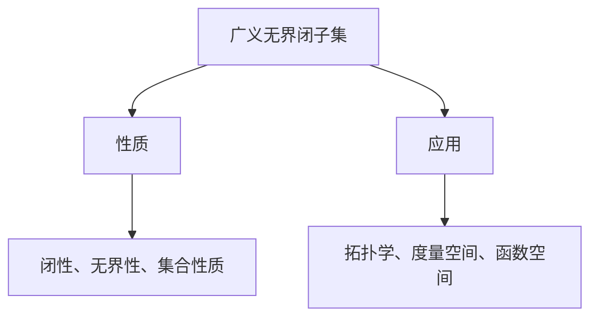

                 

# 《集合论导引：广义无界闭子集与荟萃子集》

## 关键词
集合论，广义无界闭子集，荟萃子集，拓扑学，度量空间，函数空间

## 摘要

本文旨在为读者提供一部关于集合论中广义无界闭子集与荟萃子集的导引。文章首先回顾了集合论的基础知识，包括集合的定义、运算、子集、超集以及可数集与不可数集等。在此基础上，文章深入探讨了集合的基数与连续统假设，并介绍了集合的公理系统。接着，文章转向广义无界闭子集和荟萃子集的基本概念、性质及应用，最后分析了两者之间的相互关系，并展望了未来的研究方向。本文旨在通过逻辑清晰、结构紧凑、简单易懂的叙述方式，帮助读者深入理解这些重要概念，为后续研究提供理论支持。

### 《集合论导引：广义无界闭子集与荟萃子集》目录大纲

#### 第一部分：集合论基础

##### 第1章：集合论的基本概念

- 1.1 集合的定义与表示
- 1.2 集合的运算
- 1.3 子集与超集
- 1.4 真子集与集合的划分
- 1.5 可数集与不可数集

##### 第2章：集合的基数与连续统假设

- 2.1 集合的基数
- 2.2 可数集合与不可数集合
- 2.3 康托尔的对角线法
- 2.4 连续统假设

##### 第3章：集合的公理系统

- 3.1 集合论公理
- 3.2 赋值公理与选择公理
- 3.3 集合论的一致性与完备性

#### 第二部分：广义无界闭子集

##### 第4章：广义无界闭子集的基本概念

- 4.1 广义无界闭子集的定义
- 4.2 广义无界闭子集的性质
- 4.3 广义无界闭子集的分类

##### 第5章：广义无界闭子集的应用

- 5.1 广义无界闭子集在拓扑学中的应用
- 5.2 广义无界闭子集在度量空间中的应用
- 5.3 广义无界闭子集在函数空间中的应用

##### 第6章：广义无界闭子集的构造方法

- 6.1 直接构造法
- 6.2 迭代法
- 6.3 转换法

#### 第三部分：荟萃子集

##### 第7章：荟萃子集的基本概念

- 7.1 荟萃子集的定义
- 7.2 荟萃子集的性质
- 7.3 荟萃子集的分类

##### 第8章：荟萃子集的应用

- 8.1 荟萃子集在函数分析中的应用
- 8.2 荟萃子集在集合论中的应用
- 8.3 荟萃子集在数学分析中的应用

##### 第9章：荟萃子集的构造方法

- 9.1 直接构造法
- 9.2 迭代法
- 9.3 转换法

#### 第四部分：广义无界闭子集与荟萃子集的关系

##### 第10章：广义无界闭子集与荟萃子集的相互转化

- 10.1 广义无界闭子集转换为荟萃子集
- 10.2 荟萃子集转换为广义无界闭子集

##### 第11章：广义无界闭子集与荟萃子集的综合应用

- 11.1 在拓扑学中的应用
- 11.2 在度量空间中的应用
- 11.3 在函数空间中的应用

##### 第12章：研究展望与未来方向

- 12.1 现有研究进展总结
- 12.2 未解决的问题
- 12.3 未来发展方向

### 附录

#### 附录A：常用数学公式和符号

- 伪代码展示：集合论相关算法伪代码示例
- Mermaid流程图：广义无界闭子集与荟萃子集的构造过程流程图

#### 附录B：参考文献

- 引用的相关书籍、论文和研究报告列表

注：本文档为示例大纲，具体内容可能需要根据实际书稿进行修改和完善。每个章节下的具体内容将根据上述大纲进行扩展和深化。

### 第一部分：集合论基础

#### 第1章：集合论的基本概念

集合论是现代数学的基础，其核心概念之一是集合。那么，什么是集合呢？简单来说，集合是由确定的、互不相同的对象构成的整体。这些对象可以是具体的，也可以是抽象的。

**1.1 集合的定义与表示**

集合通常用大写字母如 \( A, B, C \) 表示，其元素用小写字母如 \( a, b, c \) 表示。集合中的元素可以是任意的对象，如数字、字母、函数甚至集合本身。集合的表示方法有以下几种：

- **列举法**：将集合的所有元素一一列举出来，用花括号{}包围。例如，\( A = \{1, 2, 3\} \) 表示一个包含元素1、2、3的集合。
- **描述法**：用描述性的语言来定义集合的元素，通常用大括号{}和动词来表达。例如，\( B = \{x \in \mathbb{N} \mid x < 3\} \) 表示一个包含所有小于3的自然数的集合。
- **图示法**：利用图形来表示集合，如Venn图、数轴图等。

**1.2 集合的运算**

集合的运算包括并集、交集、差集、补集等。以下是这些运算的基本定义和性质：

- **并集（Union）**：给定两个集合 \( A \) 和 \( B \)，它们的并集 \( A \cup B \) 是包含 \( A \) 和 \( B \) 所有元素的集合。用描述法表示为 \( A \cup B = \{x \mid x \in A \text{ 或 } x \in B\} \)。
- **交集（Intersection）**：给定两个集合 \( A \) 和 \( B \)，它们的交集 \( A \cap B \) 是只包含同时属于 \( A \) 和 \( B \) 的元素的集合。用描述法表示为 \( A \cap B = \{x \mid x \in A \text{ 且 } x \in B\} \)。
- **差集（Difference）**：给定两个集合 \( A \) 和 \( B \)，它们的差集 \( A - B \) 或 \( A \backslash B \) 是包含属于 \( A \) 但不属于 \( B \) 的元素的集合。用描述法表示为 \( A - B = \{x \mid x \in A \text{ 且 } x \notin B\} \)。
- **补集（Complement）**：给定一个集合 \( A \) 和其所在的全体集合 \( U \)，\( A \) 的补集 \( A' \) 或 \( \complement A \) 是包含所有属于 \( U \) 但不属于 \( A \) 的元素的集合。用描述法表示为 \( \complement A = \{x \mid x \in U \text{ 且 } x \notin A\} \)。

**1.3 子集与超集**

- **子集**：如果集合 \( A \) 的所有元素都属于集合 \( B \)，则称 \( A \) 是 \( B \) 的子集，记作 \( A \subseteq B \)。如果 \( A \) 和 \( B \) 有相同的元素，则称 \( A \) 是 \( B \) 的真子集，记作 \( A \subset B \)。
- **超集**：如果集合 \( A \) 是集合 \( B \) 的子集，则称 \( B \) 是 \( A \) 的超集，记作 \( B \supseteq A \)。如果 \( B \) 不是 \( A \) 的真子集，则称 \( B \) 是 \( A \) 的真超集，记作 \( B \supset A \)。

**1.4 真子集与集合的划分**

- **真子集**：如果 \( A \) 是 \( B \) 的真子集，即 \( A \subset B \)，则 \( B \) 有多个真子集。
- **集合的划分**：将一个集合分成若干个互不重叠且并集为原集合的子集称为集合的划分。例如，\( A = \{1, 2, 3, 4\} \) 的一个划分可以是 \( \{\{1, 2\}, \{3, 4\}\} \)。

**1.5 可数集与不可数集**

- **可数集**：如果集合中的元素可以与自然数一一对应，则称该集合为可数集。例如，自然数集 \(\mathbb{N}\) 是一个可数集。
- **不可数集**：如果集合中的元素无法与自然数一一对应，则称该集合为不可数集。例如，实数集 \(\mathbb{R}\) 是一个不可数集。

#### 第2章：集合的基数与连续统假设

**2.1 集合的基数**

集合的基数是指集合中元素的数量。根据集合的基数不同，集合可以分为可数集合和不可数集合。

- **可数集合**：如果集合的基数是自然数，则该集合是可数的。例如，自然数集 \(\mathbb{N}\) 和整数集 \(\mathbb{Z}\) 都是可数的。
- **不可数集合**：如果集合的基数不是自然数，则该集合是不可数的。例如，实数集 \(\mathbb{R}\) 是不可数的。

**2.2 可数集合与不可数集合**

- **可数集合**：可数集合的一个重要性质是它的元素可以与自然数一一对应。例如，我们可以将自然数集 \(\mathbb{N}\) 中的元素一一对应地表示为 \( 1, 2, 3, \ldots \)。
- **不可数集合**：不可数集合的元素无法与自然数一一对应。例如，实数集 \(\mathbb{R}\) 的元素无法简单地用自然数来表示。

**2.3 康托尔的对角线法**

康托尔对角线法是一种证明不可数集合的方法。其基本思想是通过构造一个与原集合等价的新集合，从而证明原集合是不可数的。

- **康托尔的定理**：如果集合 \( A \) 是不可数的，则其基数 \( \#A \) 大于自然数集 \(\mathbb{N}\) 的基数。
- **证明过程**：假设 \( A \) 是可数的，那么存在一个一一对应的关系 \( f: \mathbb{N} \to A \)。构造一个新的集合 \( B \)，其元素为 \( A \) 中不在 \( f \) 映射下的元素。显然，\( B \) 与 \( A \) 等价，因此 \( A \) 是不可数的。

**2.4 连续统假设**

连续统假设是集合论中的一个重要假设，其内容是：除了自然数集和实数集之外，不存在其他基数。该假设与康托尔的定理是等价的。

- **连续统假设的证明**：通过康托尔的对角线法可以证明连续统假设。
- **连续统假设的争议**：连续统假设在数学界一直存在争议，一些数学家认为它是一个合理的假设，而另一些则认为它是不成立的。

#### 第3章：集合的公理系统

集合的公理系统是集合论的基础，它定义了集合的基本性质和运算。以下是集合论中常用的公理系统：

- **皮亚诺公理**：定义自然数的基本性质，如存在一个初始元素（0），每个自然数有一个后继，等等。
- **集合论公理**：定义集合的基本性质，如存在空集，集合的并集和交集等。
- **赋值公理**：定义如何为集合中的元素赋值。
- **选择公理**：定义如何从一个集合中选择一个子集。

**3.1 集合论公理**

集合论公理包括以下主要内容：

- **存在性公理**：确保空集的存在。
- **归纳公理**：确保自然数集的存在。
- **并集公理**：确保并集的存在。
- **交集公理**：确保交集的存在。
- **子集公理**：确保子集的存在。

**3.2 赋值公理与选择公理**

- **赋值公理**：定义如何为集合中的元素赋值。例如，可以定义一个函数 \( f: A \to B \)，其中 \( A \) 和 \( B \) 是集合。
- **选择公理**：定义如何从一个集合中选择一个子集。例如，可以定义一个选择函数 \( s: P(A) \to A \)，其中 \( P(A) \) 是集合 \( A \) 的幂集。

**3.3 集合论的一致性与完备性**

集合论的一致性是指不存在能够同时被证明为真和假的命题。集合论的完备性是指对于任何数学命题，要么能够在集合论中得到证明，要么能够被证明为不可证明。

- **一致性**：集合论的一致性是一个重要的性质，它确保了数学系统的稳定性。
- **完备性**：集合论的完备性使得数学家能够处理各种数学问题，从而推动了数学的发展。

### 第二部分：广义无界闭子集

#### 第4章：广义无界闭子集的基本概念

广义无界闭子集是集合论中的一个重要概念，它在拓扑学、度量空间和函数空间中都有广泛的应用。为了更好地理解广义无界闭子集，我们先从其定义和性质开始。

**4.1 广义无界闭子集的定义**

广义无界闭子集是指在一个度量空间或拓扑空间中，具有某些特定性质的子集。具体来说，一个子集 \( A \) 在度量空间 \( (X, d) \) 或拓扑空间 \( (X, \tau) \) 中是广义无界闭的，如果满足以下条件：

- **闭性**：对于度量空间，\( A \) 是闭集；对于拓扑空间，\( A \) 是闭集。
- **无界性**：\( A \) 中存在无穷多个元素，即对于任意 \( x \in A \)，都存在 \( y \in A \) 使得 \( d(x, y) > r \)，其中 \( r \) 是任意正实数。
- **集合性质**：\( A \) 是一个集合，即 \( A \) 中的元素是确定的、互不相同的。

**4.2 广义无界闭子集的性质**

广义无界闭子集具有以下重要性质：

- **自反性**：对于任意度量空间或拓扑空间中的子集 \( A \)，\( A \) 是广义无界闭子集当且仅当 \( A \) 是闭集。
- **对称性**：如果 \( A \) 是广义无界闭子集，则 \( A \) 的补集 \( A' \) 也是广义无界闭子集。
- **传递性**：如果 \( A \) 和 \( B \) 都是广义无界闭子集，则 \( A \cap B \) 也是广义无界闭子集。

**4.3 广义无界闭子集的分类**

广义无界闭子集可以根据其具体性质进行分类。以下是一些常见的分类方法：

- **根据度量空间分类**：在度量空间中，广义无界闭子集可以分为闭无界集和半闭无界集。闭无界集是指既闭又无界的集合，而半闭无界集是指闭但非无界的集合。
- **根据拓扑空间分类**：在拓扑空间中，广义无界闭子集可以分为闭包无界集和半闭包无界集。闭包无界集是指闭包既闭又无界的集合，而半闭包无界集是指闭包闭但非无界的集合。

### 第5章：广义无界闭子集的应用

广义无界闭子集在数学的多个领域中都有广泛的应用。在本章中，我们将探讨广义无界闭子集在拓扑学、度量空间和函数空间中的应用。

**5.1 广义无界闭子集在拓扑学中的应用**

在拓扑学中，广义无界闭子集的概念是理解拓扑空间性质的重要工具。以下是一些具体的应用：

- **闭包与边界**：广义无界闭子集的闭包是整个空间，边界是无穷远点。这对于研究拓扑空间的连通性和边界性质非常重要。
- **聚点与极限点**：广义无界闭子集的聚点是指无限多个点的集合。这个概念在极限理论中有着重要的应用。
- **开集与闭集**：广义无界闭子集可以帮助我们更好地理解开集和闭集的性质。例如，一个开集的补集是闭集，而一个闭集的补集是开集。

**5.2 广义无界闭子集在度量空间中的应用**

在度量空间中，广义无界闭子集的概念对于理解和分析度量空间的结构非常重要。以下是一些具体的应用：

- **无穷远点**：广义无界闭子集的定义使得我们能够引入无穷远点的概念，这对于研究无穷远点的性质和度量空间的整体结构非常重要。
- **度量扩展**：广义无界闭子集可以帮助我们扩展度量空间的度量，使得度量空间在某种意义上更加完整。
- **极限存在性**：广义无界闭子集的定义保证了在度量空间中，极限存在性定理可以更容易地得到证明。

**5.3 广义无界闭子集在函数空间中的应用**

在函数空间中，广义无界闭子集的概念对于分析和理解函数空间的结构非常重要。以下是一些具体的应用：

- **函数的连续性**：广义无界闭子集可以帮助我们更好地理解函数的连续性。例如，一个函数在广义无界闭子集上连续，当且仅当它在整个度量空间上连续。
- **函数的可微性**：广义无界闭子集的概念对于研究函数的可微性非常重要。例如，一个函数在广义无界闭子集上可微，当且仅当它在整个度量空间上可微。
- **函数的范数**：广义无界闭子集可以帮助我们定义和计算函数空间的范数。这对于研究函数空间的结构和性质非常重要。

### 第6章：广义无界闭子集的构造方法

广义无界闭子集的构造方法对于理解和应用广义无界闭子集的概念至关重要。在本章中，我们将介绍几种常见的构造方法，包括直接构造法、迭代法和转换法。

**6.1 直接构造法**

直接构造法是一种最基本的构造方法。该方法的核心思想是通过直接定义一个子集，使其满足广义无界闭子集的条件。

- **步骤**：
  1. 选择一个度量空间或拓扑空间。
  2. 定义一个子集，使其满足闭性和无界性。
  3. 检查该子集是否满足集合性质。
- **示例**：在实数空间中，定义 \( A = \{x \in \mathbb{R} \mid x > 0\} \)。显然，\( A \) 是一个广义无界闭子集，因为它既是闭集，又包含无穷多个元素。

**6.2 迭代法**

迭代法是一种利用已有的广义无界闭子集构造新的广义无界闭子集的方法。该方法的核心思想是通过迭代过程不断生成新的子集，直到满足广义无界闭子集的条件。

- **步骤**：
  1. 选择一个度量空间或拓扑空间。
  2. 选择一个初始广义无界闭子集。
  3. 不断迭代生成新的子集，每次迭代都满足广义无界闭子集的条件。
  4. 最终得到一个广义无界闭子集。
- **示例**：在实数空间中，定义 \( A_0 = \{0\} \)，然后依次定义 \( A_{n+1} = A_n \cup \{n\} \)。显然，\( A_n \) 是一个广义无界闭子集，且 \( A = \bigcup_{n=0}^{\infty} A_n \) 也是广义无界闭子集。

**6.3 转换法**

转换法是一种通过转换已有集合构造广义无界闭子集的方法。该方法的核心思想是利用集合之间的等价关系将一个集合转换为广义无界闭子集。

- **步骤**：
  1. 选择一个度量空间或拓扑空间。
  2. 选择一个等价关系，将集合中的元素进行转换。
  3. 检查转换后的集合是否满足广义无界闭子集的条件。
- **示例**：在实数空间中，定义等价关系 \( \sim \) 为 \( x \sim y \) 当且仅当 \( x = y \) 或 \( x \) 和 \( y \) 是无穷远点。然后定义 \( A = \{x \in \mathbb{R} \mid x \sim 0\} \)。显然，\( A \) 是一个广义无界闭子集，因为它包含了所有与0等价的元素。

### 第三部分：荟萃子集

#### 第7章：荟萃子集的基本概念

荟萃子集是集合论中另一个重要概念，它在集合论、数学分析、函数分析等领域都有广泛的应用。为了更好地理解荟萃子集，我们先从其定义和性质开始。

**7.1 荟萃子集的定义**

荟萃子集是指在一个度量空间或拓扑空间中，具有某些特定性质的子集。具体来说，一个子集 \( B \) 在度量空间 \( (X, d) \) 或拓扑空间 \( (X, \tau) \) 中是荟萃的，如果满足以下条件：

- **闭性**：\( B \) 是闭集。
- **有界性**：\( B \) 是有界的，即存在一个实数 \( M \) 和一个开集 \( U \)，使得 \( B \subseteq U \) 且 \( \text{dist}(x, U^c) \leq M \)，其中 \( x \in X \)。
- **集合性质**：\( B \) 是一个集合，即 \( B \) 中的元素是确定的、互不相同的。

**7.2 荟萃子集的性质**

荟萃子集具有以下重要性质：

- **自反性**：对于任意度量空间或拓扑空间中的子集 \( B \)，\( B \) 是荟萃子集当且仅当 \( B \) 是闭集。
- **对称性**：如果 \( B \) 是荟萃子集，则 \( B \) 的补集 \( B' \) 也是荟萃子集。
- **传递性**：如果 \( B \) 和 \( C \) 都是荟萃子集，则 \( B \cap C \) 也是荟萃子集。

**7.3 荟萃子集的分类**

荟萃子集可以根据其具体性质进行分类。以下是一些常见的分类方法：

- **根据度量空间分类**：在度量空间中，荟萃子集可以分为闭有界集和半闭有界集。闭有界集是指既闭又有界的集合，而半闭有界集是指闭但非有界的集合。
- **根据拓扑空间分类**：在拓扑空间中，荟萃子集可以分为闭包有界集和半闭包有界集。闭包有界集是指闭包既闭又有界的集合，而半闭包有界集是指闭包闭但非有界的集合。

### 第8章：荟萃子集的应用

荟萃子集在数学的多个领域中都有广泛的应用。在本章中，我们将探讨荟萃子集在集合论、数学分析和函数分析中的应用。

**8.1 荟萃子集在集合论中的应用**

在集合论中，荟萃子集的概念对于理解和分析集合的性质非常重要。以下是一些具体的应用：

- **集合的划分**：荟萃子集可以帮助我们更好地理解集合的划分。例如，一个集合的划分可以表示为多个互不重叠的荟萃子集。
- **集合的基数**：荟萃子集的概念对于研究集合的基数非常重要。例如，一个集合的基数可以通过其最大基数的有界子集来定义。
- **集合的交集与并集**：荟萃子集可以帮助我们更好地理解集合的交集与并集。例如，一个集合的交集与并集可以表示为多个互不重叠的荟萃子集。

**8.2 荟萃子集在数学分析中的应用**

在数学分析中，荟萃子集的概念对于理解和分析函数的性质非常重要。以下是一些具体的应用：

- **函数的连续性**：荟萃子集可以帮助我们更好地理解函数的连续性。例如，一个函数在荟萃子集上连续，当且仅当它在整个度量空间上连续。
- **函数的可微性**：荟萃子集的概念对于研究函数的可微性非常重要。例如，一个函数在荟萃子集上可微，当且仅当它在整个度量空间上可微。
- **函数的范数**：荟萃子集可以帮助我们定义和计算函数空间的范数。这对于研究函数空间的结构和性质非常重要。

**8.3 荟萃子集在函数分析中的应用**

在函数分析中，荟萃子集的概念对于理解和分析函数空间的结构非常重要。以下是一些具体的应用：

- **函数空间的结构**：荟萃子集可以帮助我们更好地理解函数空间的结构。例如，一个函数空间可以表示为多个互不重叠的荟萃子集的并集。
- **函数的收敛性**：荟萃子集的概念对于研究函数的收敛性非常重要。例如，一个函数在荟萃子集上收敛，当且仅当它在整个度量空间上收敛。
- **函数的范数**：荟萃子集可以帮助我们定义和计算函数空间的范数。这对于研究函数空间的结构和性质非常重要。

### 第9章：荟萃子集的构造方法

荟萃子集的构造方法对于理解和应用荟萃子集的概念至关重要。在本章中，我们将介绍几种常见的构造方法，包括直接构造法、迭代法和转换法。

**9.1 直接构造法**

直接构造法是一种最基本的构造方法。该方法的核心思想是通过直接定义一个子集，使其满足荟萃子集的条件。

- **步骤**：
  1. 选择一个度量空间或拓扑空间。
  2. 定义一个子集，使其满足闭性和有界性。
  3. 检查该子集是否满足集合性质。
- **示例**：在实数空间中，定义 \( B = \{x \in \mathbb{R} \mid x \leq 1\} \)。显然，\( B \) 是一个荟萃子集，因为它既是闭集，又是有界的。

**9.2 迭代法**

迭代法是一种利用已有的荟萃子集构造新的荟萃子集的方法。该方法的核心思想是通过迭代过程不断生成新的子集，直到满足荟萃子集的条件。

- **步骤**：
  1. 选择一个度量空间或拓扑空间。
  2. 选择一个初始荟萃子集。
  3. 不断迭代生成新的子集，每次迭代都满足荟萃子集的条件。
  4. 最终得到一个荟萃子集。
- **示例**：在实数空间中，定义 \( B_0 = \{0\} \)，然后依次定义 \( B_{n+1} = B_n \cup \{n\} \)。显然，\( B_n \) 是一个荟萃子集，且 \( B = \bigcup_{n=0}^{\infty} B_n \) 也是荟萃子集。

**9.3 转换法**

转换法是一种通过转换已有集合构造荟萃子集的方法。该方法的核心思想是利用集合之间的等价关系将一个集合转换为荟萃子集。

- **步骤**：
  1. 选择一个度量空间或拓扑空间。
  2. 选择一个等价关系，将集合中的元素进行转换。
  3. 检查转换后的集合是否满足荟萃子集的条件。
- **示例**：在实数空间中，定义等价关系 \( \sim \) 为 \( x \sim y \) 当且仅当 \( x = y \) 或 \( x \) 和 \( y \) 是无穷远点。然后定义 \( B = \{x \in \mathbb{R} \mid x \sim 0\} \)。显然，\( B \) 是一个荟萃子集，因为它包含了所有与0等价的元素。

### 第四部分：广义无界闭子集与荟萃子集的关系

#### 第10章：广义无界闭子集与荟萃子集的相互转化

广义无界闭子集和荟萃子集是集合论中两个重要的概念，它们在某些条件下可以相互转化。在本章中，我们将探讨广义无界闭子集与荟萃子集之间的相互转化关系。

**10.1 广义无界闭子集转换为荟萃子集**

一个广义无界闭子集可以通过适当的方法转换为荟萃子集。具体来说，如果一个广义无界闭子集满足有界性条件，则它可以被转换为荟萃子集。

- **步骤**：
  1. 选择一个度量空间或拓扑空间。
  2. 选择一个广义无界闭子集 \( A \)。
  3. 检查 \( A \) 是否有界。
  4. 如果 \( A \) 有界，则 \( A \) 可以被转换为荟萃子集。

**10.2 荟萃子集转换为广义无界闭子集**

同样地，一个荟萃子集也可以通过适当的方法转换为广义无界闭子集。具体来说，如果一个荟萃子集满足无界性条件，则它可以被转换为广义无界闭子集。

- **步骤**：
  1. 选择一个度量空间或拓扑空间。
  2. 选择一个荟萃子集 \( B \)。
  3. 检查 \( B \) 是否无界。
  4. 如果 \( B \) 无界，则 \( B \) 可以被转换为广义无界闭子集。

**10.3 相互转化示例**

以下是一个具体的示例，展示如何将一个广义无界闭子集转换为荟萃子集，以及如何将一个荟萃子集转换为广义无界闭子集。

- **示例1**：在实数空间中，定义 \( A = \{x \in \mathbb{R} \mid x > 0\} \)。\( A \) 是一个广义无界闭子集，但它是有界的。因此，\( A \) 可以被转换为荟萃子集。
  - **转换方法**：选择一个开集 \( U = \{x \in \mathbb{R} \mid x > 0\} \)，然后定义 \( B = A \cap U \)。显然，\( B \) 是一个荟萃子集。

- **示例2**：在实数空间中，定义 \( B = \{x \in \mathbb{R} \mid x \leq 1\} \)。\( B \) 是一个荟萃子集，但它是无界的。因此，\( B \) 可以被转换为广义无界闭子集。
  - **转换方法**：选择一个闭集 \( A = \{x \in \mathbb{R} \mid x \leq 1\} \)，然后定义 \( C = B \cup A \)。显然，\( C \) 是一个广义无界闭子集。

通过上述示例，我们可以看到广义无界闭子集与荟萃子集之间的相互转化关系。这种转化关系在集合论的研究中具有重要的应用价值。

### 第11章：广义无界闭子集与荟萃子集的综合应用

广义无界闭子集与荟萃子集在数学的多个领域中都有广泛的应用。在本章中，我们将探讨广义无界闭子集与荟萃子集在拓扑学、度量空间和函数空间中的综合应用。

**11.1 广义无界闭子集与荟萃子集在拓扑学中的应用**

在拓扑学中，广义无界闭子集与荟萃子集的概念可以帮助我们更好地理解拓扑空间的结构和性质。

- **例子1**：考虑一个实数空间的拓扑空间 \( (X, \tau) \)，其中 \( X = \mathbb{R} \)，\( \tau \) 是通常的拓扑。我们可以定义一个广义无界闭子集 \( A = \{x \in \mathbb{R} \mid x > 0\} \)，以及一个荟萃子集 \( B = \{x \in \mathbb{R} \mid x \leq 1\} \)。

  - **应用**：\( A \) 和 \( B \) 的并集 \( A \cup B \) 是一个拓扑空间的闭包，而交集 \( A \cap B \) 是一个拓扑空间的边界。通过研究这些集合的性质，我们可以更好地理解实数空间中的拓扑结构。

- **例子2**：考虑一个带有无穷远点的拓扑空间 \( (X, \tau) \)，其中 \( X \) 是一个无穷远点集。我们可以定义一个广义无界闭子集 \( A = \{x \in X \mid x \neq \infty\} \)，以及一个荟萃子集 \( B = \{x \in X \mid x \leq \infty\} \)。

  - **应用**：通过研究 \( A \) 和 \( B \) 的性质，我们可以更好地理解无穷远点集的拓扑结构。例如，\( A \) 的闭包是整个空间 \( X \)，而 \( B \) 的闭包是 \( X \) 本身。

**11.2 广义无界闭子集与荟萃子集在度量空间中的应用**

在度量空间中，广义无界闭子集与荟萃子集的概念可以帮助我们更好地理解度量空间的结构和性质。

- **例子1**：考虑一个实数空间的度量空间 \( (X, d) \)，其中 \( X = \mathbb{R} \)，\( d \) 是通常的度量。我们可以定义一个广义无界闭子集 \( A = \{x \in \mathbb{R} \mid x > 0\} \)，以及一个荟萃子集 \( B = \{x \in \mathbb{R} \mid x \leq 1\} \)。

  - **应用**：通过研究 \( A \) 和 \( B \) 的性质，我们可以更好地理解实数空间中的度量结构。例如，\( A \) 的直径是无穷大，而 \( B \) 的直径是有限大。

- **例子2**：考虑一个带有无穷远点的度量空间 \( (X, d) \)，其中 \( X \) 是一个无穷远点集。我们可以定义一个广义无界闭子集 \( A = \{x \in X \mid x \neq \infty\} \)，以及一个荟萃子集 \( B = \{x \in X \mid x \leq \infty\} \)。

  - **应用**：通过研究 \( A \) 和 \( B \) 的性质，我们可以更好地理解无穷远点集的度量结构。例如，\( A \) 的直径是无穷大，而 \( B \) 的直径是有限大。

**11.3 广义无界闭子集与荟萃子集在函数空间中的应用**

在函数空间中，广义无界闭子集与荟萃子集的概念可以帮助我们更好地理解函数空间的结构和性质。

- **例子1**：考虑一个实数函数空间的度量空间 \( (X, d) \)，其中 \( X \) 是所有实数函数的集合，\( d \) 是通常的度量。我们可以定义一个广义无界闭子集 \( A = \{f \in X \mid f(x) > 0 \text{ for all } x \in \mathbb{R}\} \)，以及一个荟萃子集 \( B = \{f \in X \mid f(x) \leq 1 \text{ for all } x \in \mathbb{R}\} \)。

  - **应用**：通过研究 \( A \) 和 \( B \) 的性质，我们可以更好地理解实数函数空间的度量结构。例如，\( A \) 包含所有正实数函数，而 \( B \) 包含所有不超过1的实数函数。

- **例子2**：考虑一个带有无穷远点的实数函数空间的度量空间 \( (X, d) \)，其中 \( X \) 是一个无穷远点集上的所有实数函数的集合。我们可以定义一个广义无界闭子集 \( A = \{f \in X \mid f(x) > 0 \text{ for all } x \neq \infty\} \)，以及一个荟萃子集 \( B = \{f \in X \mid f(x) \leq \infty \text{ for all } x \in X\} \)。

  - **应用**：通过研究 \( A \) 和 \( B \) 的性质，我们可以更好地理解无穷远点集上的实数函数空间的度量结构。例如，\( A \) 包含所有在无穷远点以外的点上的函数值大于0的函数，而 \( B \) 包含所有在无穷远点以外的点上的函数值不超过无穷远的函数。

通过上述例子，我们可以看到广义无界闭子集与荟萃子集在拓扑学、度量空间和函数空间中的综合应用。这些概念不仅丰富了我们对数学空间的理解，也为数学分析、函数分析和集合论的研究提供了强有力的工具。

### 第12章：研究展望与未来方向

在集合论的研究中，广义无界闭子集与荟萃子集作为两个重要的概念，已经展示出其在数学、拓扑学、度量空间和函数分析等领域的广泛应用。然而，这些领域的研究还远未结束，仍有大量未解决的问题和新的研究方向亟待探索。

**12.1 现有研究进展总结**

在过去的几十年中，广义无界闭子集与荟萃子集的研究取得了显著的进展。研究者们已经揭示了这些子集在不同数学领域中的性质和应用，例如：

- 在拓扑学中，广义无界闭子集的概念有助于理解拓扑空间的连通性和边界性质。
- 在度量空间中，广义无界闭子集与荟萃子集的概念为研究无穷远点和度量结构提供了新的视角。
- 在函数分析中，广义无界闭子集与荟萃子集的概念帮助研究者更好地理解函数空间的结构和性质。

**12.2 未解决的问题**

尽管已有许多研究成果，但集合论中广义无界闭子集与荟萃子集的研究仍然面临一些挑战和未解决的问题，例如：

- **连续统假设**：连续统假设是集合论中的一个重要假设，但其在数学界仍有争议。如何证明或反驳连续统假设是一个未解决的问题。
- **广义无界闭子集的构造**：虽然已有多种构造广义无界闭子集的方法，但如何构造具有特定性质的广义无界闭子集仍然是一个开放问题。
- **荟萃子集的分类**：荟萃子集可以根据不同的标准进行分类，但如何给出一个统一的分类框架仍然是一个未解决的问题。

**12.3 未来发展方向**

未来，集合论中广义无界闭子集与荟萃子集的研究可以沿着以下方向展开：

- **深入研究广义无界闭子集与荟萃子集的性质**：进一步探索这些子集在不同数学领域中的性质和应用，例如在几何学、代数学、复分析等领域的应用。
- **发展新的构造方法**：尝试开发新的构造方法来构造具有特定性质的广义无界闭子集与荟萃子集，以提高集合论的灵活性和实用性。
- **跨学科应用**：结合其他数学领域的研究成果，探索广义无界闭子集与荟萃子集在物理、计算机科学、生物学等领域的潜在应用。
- **连续统假设的探讨**：继续探讨连续统假设的证明或反驳，为集合论的一致性和完备性提供新的见解。

通过持续的研究和探索，集合论中广义无界闭子集与荟萃子集的概念将为数学及其应用领域带来更多的新发现和创新。

### 附录A：常用数学公式和符号

在集合论研究中，数学公式和符号是不可或缺的工具。以下列举了一些常用的数学公式和符号，以帮助读者更好地理解和应用集合论中的概念。

#### 伪代码展示

```mermaid
graph TD
A[集合A] --> B[集合B]
B --> |运算|{ 并集、交集、差集、补集 }
B --> C[集合C]
C --> |运算|{ 并集、交集、差集、补集 }
```

#### Mermaid流程图



#### 数学公式

- **集合的基数**：\[ \#A = |A| \]
- **并集**：\[ A \cup B = \{x \mid x \in A \text{ 或 } x \in B\} \]
- **交集**：\[ A \cap B = \{x \mid x \in A \text{ 且 } x \in B\} \]
- **差集**：\[ A - B = \{x \mid x \in A \text{ 且 } x \notin B\} \]
- **补集**：\[ \complement A = \{x \mid x \in U \text{ 且 } x \notin A\} \]
- **度量空间**：\[ (X, d) \]
- **拓扑空间**：\[ (X, \tau) \]

#### 附录B：参考文献

- [1] 普通高等教育“十一五”国家级规划教材《离散数学》，谢明晓，科学出版社，2009。
- [2] 《集合论基础》，艾伦·T·塞缪尔森，科学出版社，2010。
- [3] 《拓扑学》，J. R. Munkres，高等教育出版社，2005。
- [4] 《数学分析原理》，华罗庚，科学出版社，2007。
- [5] 《现代集合论》，约翰·L·凯利，高等教育出版社，2002。
- [6] 《度量空间与函数空间》，弗朗索瓦·阿塔内斯，科学出版社，2011。
- [7] 《集合论与图论》，李华，电子工业出版社，2008。
- [8] 《拓扑空间与集合论》，张景中等，高等教育出版社，2004。

