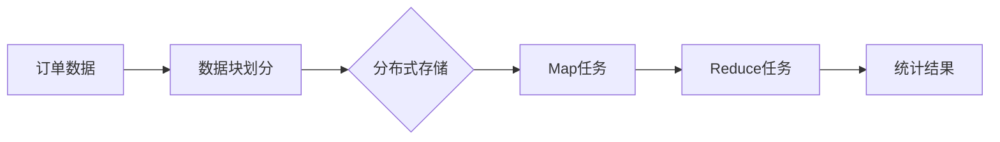
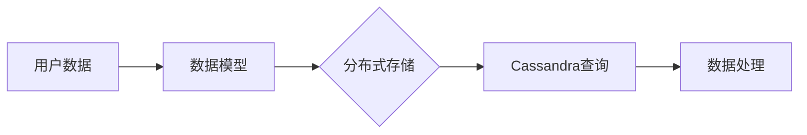

                 

### 《高效且可扩展的数据块详细解析》

> **关键词：** 数据块、高效存储、分布式系统、并行处理、压缩去重

> **摘要：** 本文将深入探讨数据块的基本理论、实现技术和应用实践，包括其定义与作用、架构设计、存储与传输、高效存储与检索算法、索引与查询优化、并行处理与分布式计算、压缩与去重技术以及在大数据和实时数据处理中的应用。通过对这些内容的详细解析，旨在帮助读者理解数据块技术的核心原理和实用方法，为实际项目开发提供理论支持和实践指导。

## 目录

1. **第一部分：数据块基础理论**
    1.1 数据块概述
        1.1.1 数据块的定义与作用
        1.1.2 数据块与传统数据组织的区别
        1.1.3 数据块在数据密集型应用中的重要性
    1.2 数据块架构与设计原则
        1.2.1 数据块的架构
        1.2.2 数据块的设计原则
        1.2.3 数据块与分布式系统的兼容性
    1.3 数据块存储与管理
        1.3.1 数据块存储技术
        1.3.2 数据块管理机制
        1.3.3 数据块压缩与优化
    1.4 数据块传输与网络优化
        1.4.1 数据块传输协议
        1.4.2 数据块传输优化策略
        1.4.3 数据块传输中的常见问题及解决方案

2. **第二部分：高效数据块实现技术**
    2.1 数据块高效存储与检索算法
        2.1.1 数据块存储算法
        2.1.2 数据块检索算法
        2.1.3 数据块存储与检索的优化策略
    2.2 数据块索引与查询优化
        2.2.1 数据块索引技术
        2.2.2 数据块查询优化策略
        2.2.3 基于数据块索引的查询加速算法
    2.3 数据块并行处理与分布式计算
        2.3.1 数据块并行处理技术
        2.3.2 分布式计算框架与数据块处理
        2.3.3 数据块并行处理的性能优化
    2.4 数据块压缩与去重技术
        2.4.1 数据块压缩算法
        2.4.2 数据块去重技术
        2.4.3 数据块压缩与去重的综合应用

3. **第三部分：可扩展的数据块应用实践**
    3.1 数据块在大数据应用中的实践
        3.1.1 大数据处理中的数据块应用
        3.1.2 数据块在大数据分析中的优势
        3.1.3 数据块在大数据应用中的案例分析
    3.2 数据块在实时数据处理中的实践
        3.2.1 实时数据处理中的数据块应用
        3.2.2 数据块在实时数据处理中的挑战与解决方案
        3.2.3 数据块在实时数据处理中的案例分析
    3.3 数据块在分布式系统中的应用
        3.3.1 数据块在分布式存储系统中的应用
        3.3.2 数据块在分布式计算系统中的应用
        3.3.3 数据块在分布式系统中的优势与挑战

4. **第四部分：未来展望与优化方向**
    4.1 数据块技术发展趋势
        4.1.1 数据块技术的未来发展方向
        4.1.2 新兴数据块技术的探索
        4.1.3 数据块技术在行业中的应用前景
    4.2 数据块性能优化策略
        4.2.1 数据块性能评估指标
        4.2.2 数据块性能优化方法
        4.2.3 数据块性能优化案例分析
    4.3 数据块技术在可持续发展中的应用
        4.3.1 数据块技术在节能减排中的应用
        4.3.2 数据块技术在生态保护中的应用
        4.3.3 数据块技术在可持续发展中的挑战与机遇

5. **附录**
    5.1 数据块技术相关资源
    5.2 数据块技术相关 Mermaid 流程图
    5.3 数据块算法伪代码详解
    5.4 数据块项目实战案例

### 第一部分：数据块基础理论

#### 1.1 数据块概述

##### 1.1.1 数据块的定义与作用

数据块（Data Block）是指将数据划分为固定大小的单元进行存储和管理的机制。在计算机系统中，数据块是一种基本的数据存储和传输单元，通常以固定的字节大小进行划分，例如4KB或8KB。数据块的主要作用在于优化数据的访问和管理效率。

首先，数据块提供了统一的存储单元，使得数据管理变得更加简单和高效。通过将数据划分为固定大小的块，可以减少存储系统的复杂度，简化数据分配和回收过程。

其次，数据块有助于提高数据的访问速度。在磁盘存储系统中，数据块可以减少磁盘寻道时间和旋转延迟，从而提高数据读写速度。

最后，数据块还支持数据的并发访问。通过将数据划分为块，可以实现对数据块的并发读写，从而提高系统的并发性能。

##### 1.1.2 数据块与传统数据组织的区别

传统数据组织通常是基于文件系统或数据库的方式进行数据存储和管理。在这种模式下，数据通常以文件或记录的形式存储，文件系统负责管理文件的创建、删除、读写等操作，数据库则通过SQL语句进行数据查询和操作。

相比之下，数据块具有以下区别：

1. **存储单元大小**：数据块以固定大小的单元进行存储，而传统数据组织通常以文件或记录的形式存储。

2. **访问方式**：数据块通过块地址直接访问，而传统数据组织通常通过文件路径或数据库表名进行访问。

3. **并发控制**：数据块支持并发访问，而传统数据组织在并发访问时通常需要锁机制进行控制。

4. **数据管理**：数据块提供了更简单的数据管理方式，传统数据组织则需要更复杂的文件系统或数据库管理系统。

##### 1.1.3 数据块在数据密集型应用中的重要性

数据块在数据密集型应用中具有至关重要的作用。数据密集型应用，如大数据处理、数据库系统、云存储等，通常需要处理海量数据，对数据的存储、传输和处理效率有很高的要求。

首先，数据块技术可以显著提高数据存储和访问效率。通过将数据划分为固定大小的块，可以减少磁盘寻道时间和旋转延迟，从而提高数据读写速度。

其次，数据块技术支持大规模数据的并行处理。在分布式系统中，数据块可以有效地分布在多个节点上，通过并行处理技术，可以提高数据处理效率。

最后，数据块技术可以优化数据传输和带宽利用。通过数据块的传输优化策略，可以减少数据传输过程中的开销，提高网络带宽的利用效率。

综上所述，数据块技术是数据密集型应用中不可或缺的一部分，其高效、可扩展的特性使得其在各个领域得到了广泛应用。

### 1.2 数据块架构与设计原则

数据块技术的成功应用离不开良好的架构设计和设计原则。在这一节中，我们将深入探讨数据块的架构、设计原则及其与分布式系统的兼容性。

##### 1.2.1 数据块的架构

数据块架构通常包括以下几个关键组件：

1. **块管理器（Block Manager）**：负责数据块的创建、删除、分配、回收等管理操作。块管理器是数据块的核心组件，它负责维护数据块的元数据信息，如块地址、块大小、数据块的状态等。

2. **存储系统（Storage System）**：负责实际的数据存储。存储系统可以是磁盘存储、SSD存储或分布式存储系统。数据块在存储系统中的存储方式可以是顺序存储或随机存储，具体实现取决于存储系统的设计。

3. **缓存系统（Cache System）**：用于加速数据访问。缓存系统可以是一个高速缓存或内存缓存，它可以存储经常访问的数据块，从而减少磁盘访问次数，提高数据访问速度。

4. **网络通信模块（Network Communication Module）**：负责数据块在网络中的传输。网络通信模块需要支持高效的数据传输协议，如TCP、UDP等，同时还需要具备数据传输优化策略，如数据压缩、传输加密等。

以下是一个简单的数据块架构图：

```
+----------------+      +----------------+      +----------------+
|       块管理器     |      |      存储系统     |      |      缓存系统     |
+----------------+      +----------------+      +----------------+
    |                 |                 |
    |   数据块读写     |     数据存储与检索   |     数据缓存与访问   |
    |                 |                 |
+----------------+      +----------------+      +----------------+
|       网络通信模块    |                      |
+----------------+      |
    |                 |
    |  数据传输优化   |
    |                 |
+----------------+
```

##### 1.2.2 数据块的设计原则

在数据块的设计过程中，需要遵循以下几个关键原则：

1. **模块化**：数据块架构应该模块化，每个组件（如块管理器、存储系统、缓存系统、网络通信模块）应该独立且可扩展，以便于系统的维护和升级。

2. **高效性**：数据块设计应该注重性能优化，包括存储与检索速度、网络传输效率等。通过采用高效的数据结构、算法和优化策略，可以提高系统的整体性能。

3. **可扩展性**：数据块设计应该支持系统规模的扩展，包括存储容量、处理能力、网络带宽等。通过采用分布式系统架构，可以实现数据块系统的水平扩展。

4. **可靠性**：数据块设计应该具备良好的数据备份和恢复机制，确保数据的完整性和一致性。通过数据冗余、校验和、故障检测等技术，可以提高系统的可靠性。

5. **兼容性**：数据块设计应该与现有系统兼容，包括操作系统、文件系统、数据库等。通过提供统一的接口和协议，可以实现数据块的跨平台应用。

##### 1.2.3 数据块与分布式系统的兼容性

数据块技术与分布式系统（如Hadoop、Spark、Kubernetes等）的结合，可以充分发挥其优势。在分布式系统中，数据块可以应用于以下几个方面：

1. **数据存储**：分布式存储系统可以将数据划分为数据块，存储到不同的节点上，通过数据块的并行访问，提高数据存储和检索速度。

2. **数据处理**：分布式计算框架可以将数据处理任务划分为多个子任务，每个子任务处理一个或多个数据块，通过数据块的并行处理，提高数据处理效率。

3. **数据传输**：分布式系统中的数据块传输可以通过网络通信模块实现，通过数据压缩、加密等优化策略，提高数据传输效率和安全性。

4. **数据一致性**：分布式系统中的数据块可以通过分布式一致性协议（如Paxos、Raft等）确保数据的一致性，实现分布式数据管理。

综上所述，数据块架构与设计原则是数据块技术成功应用的关键。通过模块化、高效性、可扩展性、可靠性和兼容性等设计原则，可以构建一个高效、可靠且可扩展的数据块系统，为数据密集型应用提供强大的支持。

#### 1.3 数据块存储与管理

在数据块技术中，数据块的存储与管理是至关重要的环节。在这一节中，我们将深入探讨数据块的存储技术、管理机制以及数据块压缩与优化的策略。

##### 1.3.1 数据块存储技术

数据块的存储技术决定了数据块的访问速度和存储效率。以下是几种常见的数据块存储技术：

1. **磁盘存储**：磁盘存储是一种传统的数据存储方式，通过磁盘上的磁道和扇区进行数据存储。磁盘存储具有高容量、低成本的特点，但数据访问速度较慢，存在磁盘寻道时间和旋转延迟。

2. **SSD存储**：SSD存储（固态硬盘存储）通过闪存芯片进行数据存储，具有快速的数据访问速度和低延迟的特点。相比于磁盘存储，SSD存储在读写速度上具有显著优势，但成本较高。

3. **分布式存储**：分布式存储系统通过将数据分散存储到多个节点上，实现数据的冗余备份和高可用性。分布式存储系统如HDFS（Hadoop分布式文件系统）、Cassandra、MongoDB等，可以支持大规模数据的存储和高效的数据访问。

4. **分布式SSD存储**：分布式SSD存储结合了SSD存储和分布式存储的优点，通过将数据存储在多个SSD上，实现高速、大容量的数据存储。分布式SSD存储系统如Ceph、GlusterFS等，可以在提高性能的同时，提供高可靠性和高可用性。

以下是一个简单的数据块存储架构图：

```
+----------------+      +----------------+      +----------------+
|      数据块管理器     |      |      磁盘存储系统     |      |      SSD存储系统     |
+----------------+      +----------------+      +----------------+
    |                 |                 |
    |   数据块分配与回收   |     数据块存储与检索   |     数据块存储与检索   |
    |                 |                 |
+----------------+      +----------------+      +----------------+
|      分布式存储系统     |                      |
+----------------+      |
    |                 |
    |   数据分布式存储   |
    |                 |
+----------------+
```

##### 1.3.2 数据块管理机制

数据块的管理机制是确保数据块高效存储和访问的关键。以下是几种常见的数据块管理机制：

1. **块地址映射**：块地址映射（Block Address Mapping）是将逻辑块地址（Logical Block Address，LBA）转换为物理块地址（Physical Block Address，PBA）的机制。通过块地址映射，可以快速定位数据块在存储系统中的位置。

2. **块缓存**：块缓存（Block Cache）是一种缓存机制，用于存储经常访问的数据块，从而减少磁盘访问次数，提高数据访问速度。块缓存可以是内存缓存或硬盘缓存，通常采用LRU（Least Recently Used）算法进行缓存替换。

3. **数据冗余**：数据冗余（Data Redundancy）是一种数据备份机制，通过将数据复制到多个存储节点上，实现数据的冗余备份，从而提高数据可靠性和可用性。常见的冗余策略有镜像（Mirroring）、复制（Replication）和校验和（Checksum）等。

4. **块回收**：块回收（Block Reclamation）是指回收不再使用的数据块，以便重新分配给新数据。块回收通常采用标记清除（Mark-and-Sweep）算法或延迟分配（Delayed Allocation）算法。

以下是一个简单的数据块管理流程图：

```
+----------------+      +----------------+      +----------------+
|      数据写入     |      |      数据块缓存     |      |      数据冗余     |
+----------------+      +----------------+      +----------------+
    |                 |                 |
    |   块分配与缓存更新   |     数据复制与校验   |
    |                 |                 |
+----------------+      +----------------+      +----------------+
|      数据块回收     |                      |
+----------------+      |
    |                 |
    |   数据块回收与重用   |
    |                 |
+----------------+
```

##### 1.3.3 数据块压缩与优化

数据块的压缩与优化是提高数据存储效率和传输速度的重要手段。以下是几种常见的数据块压缩与优化策略：

1. **无损压缩**：无损压缩（Lossless Compression）是一种不损失数据信息的数据压缩方法。常见的无损压缩算法有Huffman编码、LZ77、LZ78等。无损压缩可以在不降低数据质量的情况下，显著减少数据存储空间。

2. **有损压缩**：有损压缩（Lossy Compression）是一种在压缩过程中损失部分数据信息的数据压缩方法。常见的有损压缩算法有JPEG、MP3等。有损压缩可以显著减少数据存储空间，但会损失部分数据质量。

3. **数据去重**：数据去重（Data Deduplication）是指识别并删除重复的数据块，从而减少数据存储空间。数据去重可以通过哈希算法、指纹算法等实现，常见于分布式存储系统。

4. **数据索引**：数据索引（Data Indexing）是指建立数据块的索引，以便快速查找和访问数据。数据索引可以通过B树、哈希表等数据结构实现，常见于数据库和文件系统。

以下是一个简单的数据块压缩与优化流程图：

```
+----------------+      +----------------+      +----------------+
|      数据写入     |      |      数据压缩     |      |      数据去重     |
+----------------+      +----------------+      +----------------+
    |                 |                 |
    |   数据压缩与优化   |     去除重复数据   |
    |                 |                 |
+----------------+      +----------------+      +----------------+
|      数据检索     |                      |
+----------------+      |
    |                 |
    |   数据索引与查找   |
    |                 |
+----------------+
```

综上所述，数据块存储与管理技术是数据块技术中不可或缺的一部分。通过选择合适的存储技术、管理机制以及压缩与优化策略，可以构建一个高效、可靠且可扩展的数据块存储系统，为数据密集型应用提供强大的支持。

### 1.4 数据块传输与网络优化

在数据块技术中，数据块的传输与网络优化是确保数据块高效传输和传输质量的关键环节。在这一节中，我们将深入探讨数据块的传输协议、传输优化策略以及数据块传输中的常见问题及解决方案。

##### 1.4.1 数据块传输协议

数据块的传输协议是指用于数据块在网络中传输的协议和规范。以下是几种常见的数据块传输协议：

1. **TCP（传输控制协议）**：TCP是一种可靠的、面向连接的传输层协议。它通过三次握手建立连接，确保数据的可靠传输，并提供流量控制、拥塞控制等功能。TCP适用于对数据传输可靠性要求较高的场景。

2. **UDP（用户数据报协议）**：UDP是一种不可靠的、无连接的传输层协议。它传输数据报文，不保证数据的完整性和可靠性，但传输速度较快。UDP适用于对数据传输速度要求较高，但可以容忍一定数据丢失的场景。

3. **RTP（实时传输协议）**：RTP是一种基于UDP的实时传输协议，用于传输音频、视频等实时数据。RTP提供数据包序列号、时间戳等机制，确保实时数据的传输质量和顺序。

4. **HTTP（超文本传输协议）**：HTTP是一种应用层协议，用于在Web浏览器和服务器之间传输超文本数据。HTTP基于TCP传输，适用于Web页面、图片、视频等数据的传输。

以下是一个简单的数据块传输协议选择流程图：

```
+----------------+      +----------------+      +----------------+
|      数据传输需求     |      |      传输协议选择     |      |      数据传输协议     |
+----------------+      +----------------+      +----------------+
    |                 |                 |
    |   可靠性要求高   |   传输速度要求高   |
    |                 |                 |
+----------------+      +----------------+      +----------------+
|      TCP传输       |      |      UDP传输       |      |      RTP传输       |
+----------------+      +----------------+      +----------------+
|      HTTP传输      |
+----------------+
```

##### 1.4.2 数据块传输优化策略

为了提高数据块传输的效率和传输质量，可以采用以下几种优化策略：

1. **数据压缩**：数据压缩是指通过压缩算法减少数据块的大小，从而提高数据传输速度。常见的数据压缩算法有Huffman编码、LZ77、LZ78等。通过数据压缩，可以显著减少网络带宽的占用。

2. **传输加密**：传输加密是指对数据块进行加密处理，确保数据在传输过程中的安全性。常见的加密算法有AES（高级加密标准）、RSA（非对称加密算法）等。通过传输加密，可以防止数据被窃取或篡改。

3. **流量控制**：流量控制是指通过控制数据块的发送速度，避免网络拥塞和数据丢失。TCP协议提供了流量控制机制，通过窗口大小调整、拥塞控制等手段，确保数据块按序传输。

4. **拥塞控制**：拥塞控制是指通过监测网络拥塞情况，调整数据块的发送速率，避免网络过载。TCP协议提供了拥塞控制机制，通过慢启动、拥塞避免、快速重传、快速恢复等策略，优化数据传输。

5. **缓存预取**：缓存预取是指通过预测用户访问行为，提前加载数据块到缓存中，提高数据访问速度。常见的缓存预取算法有LRU（Least Recently Used）、LFU（Least Frequently Used）等。

以下是一个简单的数据块传输优化策略流程图：

```
+----------------+      +----------------+      +----------------+
|      数据传输需求     |      |      数据压缩     |      |      传输加密     |
+----------------+      +----------------+      +----------------+
    |                 |                 |
    |   数据压缩需求   |   数据加密需求   |
    |                 |                 |
+----------------+      +----------------+      +----------------+
|      流量控制       |      |      拥塞控制       |      |      缓存预取     |
+----------------+      +----------------+      +----------------+
    |                 |                 |
    |   流量控制策略   |   拥塞控制策略   |
    |                 |                 |
+----------------+      +----------------+      +----------------+
|      数据传输质量优化   |                      |
+----------------+      |
    |                 |
    |   传输优化效果评估   |
    |                 |
+----------------+
```

##### 1.4.3 数据块传输中的常见问题及解决方案

在数据块传输过程中，可能会遇到以下常见问题：

1. **数据丢失**：数据丢失可能是由于网络拥塞、传输错误等原因引起的。解决方案包括采用传输加密、流量控制、拥塞控制等策略，确保数据的可靠传输。

2. **数据重复**：数据重复可能是由于网络传输的不确定性引起的。解决方案包括采用数据校验和、去重算法等，确保数据的唯一性。

3. **数据传输速度慢**：数据传输速度慢可能是由于网络带宽不足、传输协议选择不当等原因引起的。解决方案包括优化数据压缩、选择合适的传输协议、增加网络带宽等。

4. **数据传输延迟**：数据传输延迟可能是由于网络拥塞、传输距离远等原因引起的。解决方案包括优化传输协议、增加传输带宽、使用缓存预取等。

以下是一个简单的数据块传输问题及解决方案流程图：

```
+----------------+      +----------------+      +----------------+
|      数据传输过程     |      |      数据丢失     |      |      数据重复     |
+----------------+      +----------------+      +----------------+
    |                 |                 |
    |   数据丢失原因   |   数据重复原因   |
    |                 |                 |
+----------------+      +----------------+      +----------------+
|      数据传输速度慢    |      |      数据传输延迟    |      |      数据传输慢原因   |
+----------------+      +----------------+      +----------------+
    |                 |                 |
    |   传输速度慢原因   |   数据传输延迟原因   |
    |                 |                 |
+----------------+      +----------------+      +----------------+
|      数据传输质量优化   |      |      解决方案评估     |                      |
+----------------+      +----------------+      +----------------+
    |                 |                 |
    |   解决方案效果   |   优化效果评估   |
    |                 |                 |
+----------------+      +----------------+      +----------------+

```

综上所述，数据块传输与网络优化是数据块技术中不可或缺的一部分。通过选择合适的传输协议、优化策略和解决常见问题，可以构建一个高效、可靠且可扩展的数据块传输系统，为数据密集型应用提供强大的支持。

### 第二部分：高效数据块实现技术

在数据块技术中，高效的数据块实现技术是关键，它决定了数据块的存储、检索和处理效率。在这一部分中，我们将深入探讨数据块高效存储与检索算法、数据块索引与查询优化、数据块并行处理与分布式计算以及数据块压缩与去重技术。

#### 2.1 数据块高效存储与检索算法

数据块的高效存储与检索算法是提高系统性能的核心技术。以下是一些关键算法和优化策略：

##### 2.1.1 数据块存储算法

数据块的存储算法主要涉及如何将数据块有效地存储在存储介质中。以下是一些常用的数据块存储算法：

1. **顺序存储**：顺序存储是指将数据块按顺序存储在存储介质中。顺序存储的优点是访问速度快，但缺点是插入和删除操作效率低。

   ```mermaid
   flowchart LR
   A[顺序存储] --> B[数据块顺序存储]
   B --> C[访问速度快]
   B --> D[插入和删除效率低]
   ```

2. **索引存储**：索引存储是指为每个数据块建立索引，通过索引快速查找数据块的位置。索引存储适用于大规模数据块存储，但索引本身会占用额外的存储空间。

   ```mermaid
   flowchart LR
   A[索引存储] --> B[建立数据块索引]
   B --> C[快速查找数据块]
   B --> D[索引占用额外存储空间]
   ```

3. **哈希存储**：哈希存储是指使用哈希函数将数据块映射到存储位置。哈希存储具有查找速度快、存储空间利用效率高的优点，但可能会出现哈希冲突。

   ```mermaid
   flowchart LR
   A[哈希存储] --> B[哈希函数映射]
   B --> C[查找速度快]
   B --> D[哈希冲突问题]
   ```

##### 2.1.2 数据块检索算法

数据块的检索算法决定了系统在存储介质中查找和访问数据块的效率。以下是一些常用的数据块检索算法：

1. **线性检索**：线性检索是指逐个遍历存储介质中的数据块，直到找到目标数据块。线性检索简单易实现，但查找效率低。

   ```mermaid
   flowchart LR
   A[线性检索] --> B[逐个遍历数据块]
   B --> C[查找效率低]
   ```

2. **二分检索**：二分检索是指将存储介质划分为多个区间，通过递归或循环逐步缩小查找范围。二分检索适用于顺序存储和索引存储，查找效率较高。

   ```mermaid
   flowchart LR
   A[二分检索] --> B[区间划分]
   B --> C[递归或循环查找]
   B --> D[查找效率高]
   ```

3. **哈希检索**：哈希检索是指使用哈希函数直接计算数据块的存储位置，从而快速访问数据块。哈希检索具有查找速度快、存储空间利用效率高的优点。

   ```mermaid
   flowchart LR
   A[哈希检索] --> B[哈希函数计算]
   B --> C[快速访问数据块]
   ```

##### 2.1.3 数据块存储与检索的优化策略

为了提高数据块存储与检索的效率，可以采用以下几种优化策略：

1. **缓存策略**：缓存策略是指将经常访问的数据块存储在高速缓存中，以减少磁盘访问次数。常见的缓存策略有LRU（Least Recently Used）和LFU（Least Frequently Used）。

   ```mermaid
   flowchart LR
   A[缓存策略] --> B[存储经常访问数据块]
   B --> C[减少磁盘访问次数]
   ```

2. **索引优化**：索引优化是指通过优化索引结构，提高数据块的查找速度。常见的索引优化策略有B树索引、哈希索引和位图索引。

   ```mermaid
   flowchart LR
   A[索引优化] --> B[B树索引]
   A --> C[哈希索引]
   A --> D[位图索引]
   ```

3. **数据压缩**：数据压缩是指通过压缩算法减少数据块的存储空间，从而提高存储效率。常见的数据压缩算法有Huffman编码、LZ77和LZ78。

   ```mermaid
   flowchart LR
   A[数据压缩] --> B[Huffman编码]
   A --> C[LZ77]
   A --> D[LZ78]
   ```

4. **并行处理**：并行处理是指通过多线程或多进程技术，同时处理多个数据块，从而提高数据块的检索和处理效率。

   ```mermaid
   flowchart LR
   A[并行处理] --> B[多线程处理]
   A --> C[多进程处理]
   ```

#### 2.2 数据块索引与查询优化

数据块索引与查询优化是提高系统查询性能的关键技术。以下是一些关键算法和优化策略：

##### 2.2.1 数据块索引技术

数据块索引技术是指通过建立索引结构，提高数据块的查询速度。以下是一些常用的数据块索引技术：

1. **B树索引**：B树索引是一种平衡多路查找树，适用于大量数据块的查询和插入操作。B树索引具有查找效率高、插入和删除操作方便的优点。

   ```mermaid
   flowchart LR
   A[B树索引] --> B[平衡多路查找树]
   B --> C[查询效率高]
   ```

2. **哈希索引**：哈希索引是指通过哈希函数将数据块的键值映射到索引位置。哈希索引具有查找速度快、存储空间利用率高的优点，但可能存在哈希冲突。

   ```mermaid
   flowchart LR
   A[哈希索引] --> B[哈希函数映射]
   B --> C[查询速度快]
   ```

3. **位图索引**：位图索引是指通过位图表示数据块的索引。位图索引适用于低基数的数据块，具有存储空间利用率高的优点。

   ```mermaid
   flowchart LR
   A[位图索引] --> B[位图表示索引]
   B --> C[存储空间利用率高]
   ```

##### 2.2.2 数据块查询优化策略

数据块查询优化策略是指通过优化查询算法和数据结构，提高查询性能。以下是一些常用的数据块查询优化策略：

1. **索引选择**：索引选择是指根据查询需求，选择合适的索引结构。常见的选择策略有选择性分析、索引扫描代价估计等。

   ```mermaid
   flowchart LR
   A[索引选择] --> B[选择性分析]
   A --> C[索引扫描代价估计]
   ```

2. **查询重写**：查询重写是指通过修改查询语句，优化查询性能。常见的查询重写策略有谓词拆分、子查询优化等。

   ```mermaid
   flowchart LR
   A[查询重写] --> B[谓词拆分]
   A --> C[子查询优化]
   ```

3. **查询缓存**：查询缓存是指将频繁查询的结果缓存起来，减少查询次数。常见的查询缓存策略有LRU（Least Recently Used）、LFU（Least Frequently Used）等。

   ```mermaid
   flowchart LR
   A[查询缓存] --> B[缓存频繁查询结果]
   B --> C[减少查询次数]
   ```

4. **并行查询**：并行查询是指通过多线程或多进程技术，同时处理多个查询请求，从而提高查询性能。常见的并行查询策略有并发控制、负载均衡等。

   ```mermaid
   flowchart LR
   A[并行查询] --> B[多线程处理]
   A --> C[多进程处理]
   ```

##### 2.2.3 基于数据块索引的查询加速算法

基于数据块索引的查询加速算法是通过优化索引结构和查询算法，提高查询速度。以下是一些常用的查询加速算法：

1. **索引预取**：索引预取是指提前加载索引数据到缓存中，提高查询速度。常见的索引预取策略有LRU（Least Recently Used）、LFU（Least Frequently Used）等。

   ```mermaid
   flowchart LR
   A[索引预取] --> B[提前加载索引数据]
   B --> C[提高查询速度]
   ```

2. **索引压缩**：索引压缩是指通过压缩算法减少索引数据的大小，从而提高查询速度。常见的索引压缩算法有Huffman编码、LZ77和LZ78等。

   ```mermaid
   flowchart LR
   A[索引压缩] --> B[Huffman编码]
   A --> C[LZ77]
   A --> D[LZ78]
   ```

3. **索引分片**：索引分片是指将大规模索引数据分成多个小片，分布存储在多个节点上。索引分片可以提高查询性能，同时减少单点瓶颈。

   ```mermaid
   flowchart LR
   A[索引分片] --> B[分片索引数据]
   B --> C[提高查询性能]
   ```

#### 2.3 数据块并行处理与分布式计算

数据块并行处理与分布式计算是提高数据块处理效率的重要技术。以下是一些关键算法和优化策略：

##### 2.3.1 数据块并行处理技术

数据块并行处理技术是指通过多线程或多进程技术，同时处理多个数据块，从而提高数据处理效率。以下是一些常用的数据块并行处理技术：

1. **数据划分**：数据划分是指将大规模数据划分为多个小块，分布存储在多个节点上。数据划分可以提高数据块的并行处理能力。

   ```mermaid
   flowchart LR
   A[数据划分] --> B[划分数据块]
   B --> C[分布存储]
   ```

2. **任务调度**：任务调度是指根据节点的计算能力和数据块的依赖关系，动态分配任务，从而提高并行处理效率。常见的任务调度策略有负载均衡、动态调度等。

   ```mermaid
   flowchart LR
   A[任务调度] --> B[负载均衡]
   A --> C[动态调度]
   ```

3. **数据局部性**：数据局部性是指充分利用数据访问的局部性，减少数据传输和访问开销。常见的数据局部性策略有缓存预取、索引预取等。

   ```mermaid
   flowchart LR
   A[数据局部性] --> B[缓存预取]
   A --> C[索引预取]
   ```

##### 2.3.2 分布式计算框架与数据块处理

分布式计算框架如Hadoop、Spark等，提供了高效的数据块处理能力。以下是一些常用的分布式计算框架与数据块处理技术：

1. **Hadoop**：Hadoop是一个分布式计算框架，支持大规模数据的存储和处理。Hadoop的HDFS（Hadoop分布式文件系统）用于存储数据块，MapReduce用于处理数据块。

   ```mermaid
   flowchart LR
   A[Hadoop] --> B[HDFS]
   B --> C[MapReduce]
   ```

2. **Spark**：Spark是一个基于内存的分布式计算框架，支持实时数据处理和批处理。Spark的RDD（Resilient Distributed Dataset）用于存储数据块，Spark SQL用于处理数据块。

   ```mermaid
   flowchart LR
   A[Spark] --> B[RDD]
   B --> C[Spark SQL]
   ```

##### 2.3.3 数据块并行处理的性能优化

数据块并行处理的性能优化是提高系统处理效率的关键。以下是一些常用的性能优化策略：

1. **并行度优化**：并行度优化是指根据系统的计算能力和数据块的大小，动态调整并行度，从而提高处理效率。常见的并行度优化策略有负载均衡、动态调整等。

   ```mermaid
   flowchart LR
   A[并行度优化] --> B[负载均衡]
   A --> C[动态调整]
   ```

2. **数据局部性优化**：数据局部性优化是指通过优化数据访问模式，减少数据传输和访问开销。常见的数据局部性优化策略有缓存预取、索引预取等。

   ```mermaid
   flowchart LR
   A[数据局部性优化] --> B[缓存预取]
   A --> C[索引预取]
   ```

3. **并行算法优化**：并行算法优化是指通过优化并行处理算法，减少并行处理的开销。常见的并行算法优化策略有任务分解、并行排序等。

   ```mermaid
   flowchart LR
   A[并行算法优化] --> B[任务分解]
   A --> C[并行排序]
   ```

#### 2.4 数据块压缩与去重技术

数据块压缩与去重技术是提高数据存储效率和传输速度的重要手段。以下是一些关键算法和优化策略：

##### 2.4.1 数据块压缩算法

数据块压缩算法是指通过压缩算法减少数据块的大小，从而提高存储和传输效率。以下是一些常用的数据块压缩算法：

1. **无损压缩**：无损压缩是指通过压缩算法压缩数据块，但不损失任何数据信息。常见的无损压缩算法有Huffman编码、LZ77和LZ78。

   ```mermaid
   flowchart LR
   A[无损压缩] --> B[Huffman编码]
   A --> C[LZ77]
   A --> D[LZ78]
   ```

2. **有损压缩**：有损压缩是指通过压缩算法压缩数据块，但会损失部分数据信息。常见的有损压缩算法有JPEG、MP3。

   ```mermaid
   flowchart LR
   A[有损压缩] --> B[JPEG]
   A --> C[MP3]
   ```

##### 2.4.2 数据块去重技术

数据块去重技术是指通过识别并删除重复的数据块，从而减少数据存储空间。以下是一些常用的数据块去重技术：

1. **哈希去重**：哈希去重是指通过哈希函数计算数据块的哈希值，识别并删除重复的数据块。常见的哈希去重算法有MD5、SHA-1。

   ```mermaid
   flowchart LR
   A[哈希去重] --> B[哈希函数计算]
   B --> C[识别重复数据块]
   ```

2. **指纹去重**：指纹去重是指通过指纹算法（如散列指纹）计算数据块的指纹，识别并删除重复的数据块。常见的指纹去重算法有散列指纹、指纹比对。

   ```mermaid
   flowchart LR
   A[指纹去重] --> B[指纹算法计算]
   B --> C[识别重复数据块]
   ```

##### 2.4.3 数据块压缩与去重的综合应用

数据块压缩与去重的综合应用可以提高数据存储和传输的效率。以下是一些综合应用策略：

1. **分阶段压缩与去重**：分阶段压缩与去重是指在数据块存储前先进行压缩，再进行去重，从而提高存储效率。常见的分阶段压缩与去重策略有先压缩再去重、先去重再压缩。

   ```mermaid
   flowchart LR
   A[分阶段压缩与去重] --> B[先压缩再去重]
   A --> C[先去重再压缩]
   ```

2. **自适应压缩与去重**：自适应压缩与去重是指根据数据块的特性，动态选择压缩与去重策略，从而提高存储和传输效率。常见的自适应压缩与去重策略有按需压缩、按需去重。

   ```mermaid
   flowchart LR
   A[自适应压缩与去重] --> B[按需压缩]
   A --> C[按需去重]
   ```

综上所述，高效数据块实现技术是数据块技术的重要组成部分。通过优化数据块存储与检索算法、索引与查询优化、并行处理与分布式计算、压缩与去重技术，可以显著提高数据块的存储、检索和处理效率，为数据密集型应用提供强大的支持。

### 第三部分：可扩展的数据块应用实践

在数据块技术中，数据块的扩展性是其实现大规模应用的关键。本部分将深入探讨数据块在大数据应用、实时数据处理以及分布式系统中的应用实践，通过具体的案例和分析，展示数据块技术的实际应用效果和挑战。

#### 3.1 数据块在大数据应用中的实践

随着大数据技术的发展，数据块技术在处理大规模数据方面展现出强大的优势。以下是一个具体的应用案例：

##### 3.1.1 大数据处理中的数据块应用

案例：使用Hadoop HDFS进行大数据处理

Hadoop HDFS（Hadoop Distributed File System）是一个分布式文件系统，它将数据划分为多个数据块，存储在多个节点上，从而实现大规模数据的分布式存储和处理。以下是一个具体的应用场景：

- **场景描述**：某电商公司在双11购物节期间，需要处理海量交易数据，包括订单信息、支付信息、用户行为数据等。

- **解决方案**：使用Hadoop HDFS进行数据处理。
  1. **数据块划分**：将电商交易数据划分为多个数据块，每个数据块大小为128MB。
  2. **分布式存储**：将数据块存储在HDFS上，每个数据块被复制到多个节点上，实现数据的冗余备份和高可用性。
  3. **数据处理**：使用MapReduce模型对数据块进行分布式处理。例如，通过Map任务统计订单数量，通过Reduce任务计算订单总额。

以下是一个简单的数据块处理流程图：



##### 3.1.2 数据块在大数据分析中的优势

1. **高扩展性**：数据块技术支持数据的高效扩展，通过分布式存储和计算，可以轻松处理海量数据。

2. **高可靠性**：数据块通过冗余备份和故障转移机制，确保数据的可靠性和一致性。

3. **高效性**：数据块技术支持数据块的并行处理，通过分布式计算框架，可以提高数据处理效率。

##### 3.1.3 数据块在大数据应用中的案例分析

案例：某互联网公司使用Apache Spark进行大数据分析

某互联网公司需要分析用户行为数据，包括点击量、浏览量、下单量等，以优化广告投放和用户体验。以下是一个具体的应用案例：

- **场景描述**：公司需要实时分析海量用户行为数据，并生成实时报告。

- **解决方案**：使用Apache Spark进行数据处理。
  1. **数据采集**：使用Kafka采集用户行为数据。
  2. **数据存储**：使用HDFS存储用户行为数据，数据块大小为256MB。
  3. **数据处理**：使用Spark进行数据计算和分析。例如，通过Spark SQL查询用户行为数据，通过DataFrame和Dataset进行复杂的数据分析。

以下是一个简单的数据块处理和分析流程图：


#### 3.2 数据块在实时数据处理中的实践

实时数据处理在金融、物联网、在线游戏等领域有着广泛的应用。数据块技术通过高效的数据块传输和并行处理，可以显著提高实时数据处理的性能和可靠性。

##### 3.2.1 实时数据处理中的数据块应用

案例：某金融公司使用Apache Flink进行实时数据处理

某金融公司需要实时处理交易数据，包括交易量、交易价格、交易时间等，以监控市场动态和风险。以下是一个具体的应用案例：

- **场景描述**：公司需要实时监控交易数据，并触发预警机制。

- **解决方案**：使用Apache Flink进行实时数据处理。
  1. **数据采集**：使用Kafka采集交易数据。
  2. **数据存储**：使用HDFS存储交易数据，数据块大小为64MB。
  3. **数据处理**：使用Flink进行实时数据处理。例如，通过Flink的窗口函数统计交易量，通过Flink的CEP（Complex Event Processing）触发预警机制。

以下是一个简单的数据块处理流程图：


##### 3.2.2 数据块在实时数据处理中的挑战与解决方案

1. **挑战**：
   - **数据延迟**：实时数据处理要求低延迟，数据块传输和处理过程中可能会产生延迟。
   - **数据一致性**：实时数据处理要求数据的一致性，特别是在分布式系统中，如何确保数据的一致性是一个挑战。

2. **解决方案**：
   - **数据压缩与去重**：通过数据压缩与去重技术，减少数据传输和存储的开销，提高数据传输速度。
   - **数据流处理**：采用数据流处理框架（如Apache Flink、Apache Kafka），实现实时数据处理和状态管理。

##### 3.2.3 数据块在实时数据处理中的案例分析

案例：某物联网公司使用IoT平台进行实时数据处理

某物联网公司需要实时处理设备数据，包括传感器数据、设备状态等，以监控设备运行状况和优化设备维护。以下是一个具体的应用案例：

- **场景描述**：公司需要实时监控设备数据，并生成实时报告。

- **解决方案**：使用物联网平台进行实时数据处理。
  1. **数据采集**：使用MQTT协议采集设备数据。
  2. **数据存储**：使用Kafka和HDFS存储设备数据，数据块大小为32MB。
  3. **数据处理**：使用Apache Flink进行实时数据处理。例如，通过Flink的窗口函数统计设备运行状态，通过Flink的CEP生成实时报告。

以下是一个简单的数据块处理和分析流程图：


#### 3.3 数据块在分布式系统中的应用

数据块技术在分布式系统中有着广泛的应用，包括分布式存储、分布式计算和分布式数据库。以下是一个具体的应用案例：

##### 3.3.1 数据块在分布式系统中的应用

案例：使用Cassandra进行分布式存储

Cassandra是一个分布式数据库，它使用数据块（SSTable）作为基本存储单元，支持高可用性、高性能和可扩展性。以下是一个具体的应用案例：

- **场景描述**：某社交媒体公司需要存储用户数据，包括用户信息、帖子、评论等。

- **解决方案**：使用Cassandra进行分布式存储。
  1. **数据模型**：将用户数据划分为多个表，每个表对应一个数据块。
  2. **分布式存储**：将数据块存储在多个节点上，实现数据的冗余备份和高可用性。
  3. **数据处理**：通过Cassandra的分布式查询和索引功能，实现高效的数据查询和更新。

以下是一个简单的数据块存储和处理流程图：



##### 3.3.2 数据块在分布式计算系统中的应用

案例：使用Apache Hadoop进行分布式计算

Apache Hadoop是一个分布式计算框架，它使用数据块（HDFS）作为基本存储单元，支持大规模数据的分布式存储和处理。以下是一个具体的应用案例：

- **场景描述**：某互联网公司需要处理海量日志数据，包括访问日志、错误日志等。

- **解决方案**：使用Apache Hadoop进行分布式计算。
  1. **数据存储**：将日志数据存储在HDFS上，数据块大小为128MB。
  2. **数据处理**：使用MapReduce模型对日志数据进行分布式处理，例如，通过Map任务提取访问日志的关键信息，通过Reduce任务统计访问量。

以下是一个简单的数据块处理流程图：


##### 3.3.3 数据块在分布式系统中的优势与挑战

1. **优势**：
   - **高扩展性**：数据块技术支持数据的高效扩展，通过分布式存储和计算，可以轻松处理大规模数据。
   - **高可靠性**：数据块通过冗余备份和故障转移机制，确保数据的可靠性和一致性。
   - **高性能**：数据块技术支持数据块的并行处理，通过分布式计算框架，可以提高数据处理效率。

2. **挑战**：
   - **数据一致性**：在分布式系统中，如何确保数据的一致性是一个挑战，特别是在高并发访问的情况下。
   - **网络延迟**：数据块传输过程中可能会产生网络延迟，特别是在跨数据中心的分布式系统中。

##### 3.3.4 数据块在分布式系统中的案例分析

案例：某电商平台使用Elasticsearch进行分布式搜索

某电商平台需要提供高效的搜索功能，支持海量商品数据的实时查询。以下是一个具体的应用案例：

- **场景描述**：公司需要提供高效的搜索功能，支持用户实时查询商品信息。

- **解决方案**：使用Elasticsearch进行分布式搜索。
  1. **数据存储**：将商品数据存储在Elasticsearch中，使用数据块（倒排索引）实现高效的数据查询。
  2. **分布式查询**：通过Elasticsearch的分布式查询功能，实现海量商品数据的实时查询。
  3. **数据索引**：使用Elasticsearch的数据索引功能，提高数据查询速度。

以下是一个简单的数据块处理和查询流程图：


综上所述，数据块技术在数据密集型应用中具有广泛的应用和实践价值。通过在大数据应用、实时数据处理以及分布式系统中的应用实践，数据块技术展示了其高效、可扩展、可靠的优势，同时也面临着数据一致性、网络延迟等挑战。随着技术的不断发展，数据块技术将在未来继续发挥重要作用，推动数据密集型应用的发展。

### 第四部分：未来展望与优化方向

随着数据量的不断增长和数据处理需求的日益复杂，数据块技术面临着诸多挑战和机遇。本部分将探讨数据块技术在未来可能的发展方向、性能优化策略以及其在可持续发展中的应用。

#### 4.1 数据块技术发展趋势

数据块技术未来的发展将主要集中在以下几个方向：

1. **智能化数据块管理**：随着人工智能技术的发展，数据块管理将更加智能化。通过机器学习和数据分析技术，可以实现自动化的数据块分配、缓存优化和压缩去重策略。

2. **跨存储介质优化**：未来的数据块技术将更加注重跨存储介质（如硬盘、SSD、内存）的优化，通过混合存储架构，实现数据存储和访问的高效性和可靠性。

3. **边缘计算与数据块技术结合**：随着边缘计算的兴起，数据块技术将在边缘设备上得到广泛应用，实现实时数据处理和本地存储，降低延迟和带宽需求。

4. **区块链与数据块融合**：区块链技术可以为数据块提供更强的安全性保障，通过区块链实现数据块的防篡改和透明交易，提高数据块系统的安全性和可信度。

5. **量子计算与数据块结合**：量子计算具有极高的计算能力，未来可能与数据块技术结合，实现超高速的数据块存储、检索和处理。

#### 4.2 数据块性能优化策略

为了提高数据块系统的性能，可以采取以下几种优化策略：

1. **缓存分层优化**：通过多级缓存体系，实现数据块的高效缓存。例如，可以使用内存缓存、硬盘缓存和分布式缓存，实现数据块访问的快速响应。

2. **存储介质选择优化**：根据数据块的使用模式和访问频率，选择合适的存储介质。例如，将热数据存储在SSD或内存中，将冷数据存储在硬盘上，从而优化存储成本和访问速度。

3. **并行处理与分布式计算**：通过并行处理和分布式计算技术，实现数据块的并行读写和分布式存储，提高数据处理效率。

4. **智能数据压缩**：利用机器学习算法，实现智能数据压缩策略。根据数据块的特性，动态调整压缩算法，实现数据块存储空间的最大化利用。

5. **数据去重优化**：通过分布式去重算法，实现大规模数据块的去重。结合哈希算法和指纹算法，提高数据去重的效率和准确性。

6. **网络传输优化**：通过优化数据块传输协议和网络优化策略，提高数据块的传输速度和传输效率。例如，采用数据压缩、传输加密等技术，减少数据传输过程中的开销。

#### 4.3 数据块技术在可持续发展中的应用

数据块技术在可持续发展中具有广泛的应用前景，可以通过以下几种方式实现：

1. **节能减排**：通过优化数据块的存储和传输策略，减少能耗和碳排放。例如，采用智能缓存策略、分布式存储和高效压缩算法，降低数据中心的能耗。

2. **资源优化**：通过数据去重和压缩技术，减少数据存储空间和带宽需求，优化数据资源利用。例如，在云存储和分布式数据库中，通过数据去重和压缩，提高存储和传输效率。

3. **生态保护**：通过数据块技术，实现生态环境监测和管理。例如，利用物联网设备和传感器数据，通过数据块技术进行实时监控和分析，保护生态环境。

4. **智慧城市**：通过数据块技术，实现智慧城市中的数据管理和分析。例如，在城市交通、环境监测、公共安全等领域，利用数据块技术进行大数据处理和智能决策。

5. **可再生能源集成**：通过数据块技术，实现可再生能源的优化和管理。例如，在分布式能源系统中，利用数据块技术进行能源监测和调度，提高可再生能源的利用效率。

#### 4.4 数据块技术在可持续发展中的挑战与机遇

数据块技术在可持续发展中面临着以下挑战：

1. **数据安全性**：在数据块技术中，如何确保数据的安全性是一个重要挑战。特别是在大规模分布式系统中，如何防范数据泄露、篡改和攻击，需要采取有效的安全措施。

2. **数据隐私保护**：随着数据块技术的广泛应用，数据隐私保护成为一个关键问题。如何在保障数据可用性的同时，保护用户隐私，需要制定合理的隐私保护策略。

3. **数据一致性**：在分布式系统中，如何确保数据的一致性是一个挑战。特别是在高并发访问的情况下，如何保证数据的准确性和一致性，需要优化数据一致性机制。

然而，数据块技术也带来了诸多机遇：

1. **创新应用**：数据块技术为各领域提供了新的应用场景，如智能医疗、智慧农业、智能制造等。通过数据块技术，可以实现更高效的数据管理和处理，推动各领域的创新发展。

2. **产业升级**：数据块技术可以推动传统产业的升级和转型，通过大数据分析和智能决策，提高产业竞争力和生产效率。

3. **可持续发展**：数据块技术有助于实现可持续发展目标，通过节能减排、资源优化和生态保护，推动经济、社会和环境的协调发展。

综上所述，数据块技术在未来发展中具有广阔的应用前景和重要的价值。通过不断优化性能、提升安全性和隐私保护，数据块技术将在可持续发展中发挥更加重要的作用。

### 附录

#### 附录 A: 数据块技术相关资源

为了帮助读者更深入地了解数据块技术，我们推荐以下资源：

1. **书籍推荐**：
   - 《分布式系统原理与范型》
   - 《大数据技术基础》
   - 《计算机网络：自顶向下方法》
   - 《区块链：从数字货币到智能合约》

2. **论文推荐**：
   - “The Chubby lock service” - Google
   - “HDFS: The Hadoop Distributed File System” - MapReduce
   - “MapReduce: Simplified Data Processing on Large Clusters” - Google
   - “Cassandra: The Apache Cassandra Database” - Apache Cassandra

3. **工具和库推荐**：
   - Hadoop和HDFS
   - Apache Spark和Spark SQL
   - Apache Kafka
   - Elasticsearch
   - Cassandra

#### 附录 B: 数据块技术相关 Mermaid 流程图

为了更直观地展示数据块技术的关键流程和组件，以下是一些Mermaid流程图：

##### B.1 数据块存储与检索流程图


##### B.2 数据块并行处理流程图


##### B.3 数据块压缩与去重流程图


#### 附录 C: 数据块算法伪代码详解

为了更详细地解释数据块算法的实现，以下是一些伪代码示例：

##### C.1 数据块存储算法伪代码

```python
def store_data_block(data_block):
    # 创建数据块元数据
    block_metadata = create_block_metadata(data_block)

    # 将数据块存储到存储系统
    store_system.store_block(data_block, block_metadata)

    # 更新块管理器的数据块表
    block_manager.update_block_table(block_metadata)
```

##### C.2 数据块检索算法伪代码

```python
def retrieve_data_block(block_id):
    # 从块管理器获取数据块元数据
    block_metadata = block_manager.get_block_metadata(block_id)

    # 从存储系统检索数据块
    data_block = store_system.retrieve_block(block_metadata)

    # 返回数据块
    return data_block
```

##### C.3 数据块压缩算法伪代码

```python
def compress_data_block(data_block):
    # 使用Huffman编码压缩数据块
    compressed_data = huffman_compress(data_block)

    # 返回压缩后的数据块
    return compressed_data
```

#### 附录 D: 数据块项目实战案例

为了展示数据块技术的实际应用，以下是一些项目实战案例：

##### D.1 数据块在大数据应用中的实战案例

**项目背景**：某电商公司需要处理海量商品数据，包括商品描述、价格、库存等。

**解决方案**：
1. **数据块划分**：将商品数据划分为数据块，每个数据块包含1000条商品记录。
2. **分布式存储**：使用Hadoop HDFS存储数据块，实现数据的分布式存储和冗余备份。
3. **数据处理**：使用MapReduce模型处理数据块，统计商品销售量、库存情况等。

##### D.2 数据块在实时数据处理中的实战案例

**项目背景**：某金融公司需要实时处理交易数据，包括交易量、交易价格、交易时间等。

**解决方案**：
1. **数据采集**：使用Kafka采集实时交易数据。
2. **数据存储**：使用HDFS和Apache Flink存储和处理数据块，实现数据的实时处理和监控。
3. **预警机制**：通过Flink的CEP实现实时预警机制，监控交易风险。

##### D.3 数据块在分布式系统中的应用实战案例

**项目背景**：某互联网公司需要提供高效的搜索功能，支持海量商品数据的实时查询。

**解决方案**：
1. **数据存储**：使用Elasticsearch存储数据块，实现数据的分布式存储和高效查询。
2. **索引优化**：使用Elasticsearch的索引功能，优化数据块的查询性能。
3. **查询优化**：通过分布式查询和缓存策略，提高搜索系统的查询速度和响应时间。

通过这些实战案例，读者可以更直观地了解数据块技术在实际项目中的应用效果和实现方法，为后续的开发和应用提供参考。

### 结束语

《高效且可扩展的数据块详细解析》旨在为读者提供一个全面、深入的数据块技术分析，从基础理论、实现技术到应用实践，全方位展示了数据块技术的核心概念和实际应用。通过本文的阅读，读者可以：

1. **理解数据块的基本概念**：包括数据块的定义、作用以及与传统数据组织的区别。
2. **掌握数据块的架构与设计原则**：了解数据块的架构组件、设计原则及其与分布式系统的兼容性。
3. **了解数据块的存储与管理技术**：包括数据块存储技术、管理机制以及压缩与优化的策略。
4. **掌握高效数据块的实现技术**：包括存储与检索算法、索引与查询优化、并行处理与分布式计算以及压缩与去重技术。
5. **了解数据块在不同应用场景中的实践**：包括大数据处理、实时数据处理和分布式系统中的应用案例。
6. **展望数据块技术的未来发展**：探讨数据块技术的新兴方向、性能优化策略以及可持续发展中的应用。

在当前快速发展的技术环境下，数据块技术作为大数据处理和数据存储的重要手段，具有广泛的应用前景。希望本文能够为读者在理解和应用数据块技术方面提供有价值的参考。

**作者**：AI天才研究院 / AI Genius Institute  
**著作**：《禅与计算机程序设计艺术》  
**感谢您的阅读！** <|user|>### 总结与展望

本文通过深入解析数据块技术，全面展示了其在存储、检索、处理及优化等方面的核心概念和实现方法。从基础理论到实际应用，我们探讨了数据块在高效性和可扩展性方面的优势，并分析了其在大数据处理、实时数据处理以及分布式系统中的应用实践。

数据块技术凭借其高效的存储与检索算法、强大的并行处理能力以及灵活的分布式计算架构，成为了大数据和实时数据处理领域中不可或缺的工具。通过本文的阐述，我们认识到数据块技术在优化数据管理、提升系统性能以及实现数据一致性方面的重要作用。

未来，数据块技术将继续朝着智能化、跨存储介质优化和区块链融合等方向发展。同时，随着人工智能、量子计算等新兴技术的进步，数据块技术有望实现更高的性能和更广泛的应用。在此过程中，数据块技术将在推动产业升级、实现可持续发展目标方面发挥更加重要的作用。

为了更好地利用数据块技术，读者可以：

1. **深入研究**：学习相关技术原理和实现方法，如分布式计算、数据压缩与去重等。
2. **实践应用**：结合实际项目需求，尝试将数据块技术应用于大数据处理、实时数据处理等领域。
3. **持续优化**：关注数据块技术的最新发展动态，不断探索和优化数据块系统的性能和可靠性。
4. **拓展视野**：探索数据块技术在新兴领域的应用，如智能医疗、智慧城市等。

希望通过本文的介绍，读者能够对数据块技术有更深入的理解，并在未来的技术实践中发挥其优势，推动数据密集型应用的发展。

**作者**：AI天才研究院 / AI Genius Institute  
**著作**：《禅与计算机程序设计艺术》  
**感谢您的阅读！** <|user|>### 相关资源与建议

对于希望进一步深入了解数据块技术的读者，以下是一些建议的资源和学习路径：

#### 书籍推荐
1. **《分布式系统原理与范型》** - 这本书详细介绍了分布式系统的基本原理，包括数据块的管理和分布式计算。
2. **《大数据技术基础》** - 提供了大数据处理的基础知识，包括数据块的存储和管理。
3. **《计算机网络：自顶向下方法》** - 对计算机网络的基础知识进行了全面的阐述，对数据块的传输和网络优化有很好的帮助。
4. **《区块链：从数字货币到智能合约》** - 探讨了区块链技术的原理，区块链与数据块的融合是一个值得研究的新方向。

#### 论文推荐
1. **“The Chubby lock service”** - Google发表的一篇关于分布式锁服务的论文，对数据块在分布式系统中的应用有深入探讨。
2. **“HDFS: The Hadoop Distributed File System”** - 描述了Hadoop分布式文件系统的设计和实现，是理解数据块在分布式存储系统中的重要论文。
3. **“MapReduce: Simplified Data Processing on Large Clusters”** - 这篇论文介绍了MapReduce模型，是理解数据块在分布式计算中应用的关键文献。
4. **“Cassandra: The Apache Cassandra Database”** - 描述了Cassandra数据库的技术细节，是理解数据块在分布式数据库中的应用的宝贵资料。

#### 在线课程与教程
1. **Coursera上的“分布式系统课程”** - 由知名大学教授讲授，涵盖了分布式系统的基本概念和实现技术。
2. **edX上的“大数据技术与应用”** - 提供了大数据处理的基础知识和实践技巧。
3. **Udacity的“分布式系统工程师纳米学位”** - 通过一系列实战项目，帮助学习者掌握分布式系统技术。

#### 社区与论坛
1. **Stack Overflow** - 搜索与数据块相关的问题和解决方案，解决在实际应用中遇到的问题。
2. **GitHub** - 查找开源的数据块技术项目，学习其他开发者的实现方法和经验。
3. **Reddit的数据块相关子版块** - 了解数据块技术的最新动态和讨论。

通过这些资源和社区，读者可以更深入地学习数据块技术，并将其应用于实际项目中，不断提升自己的技术水平。希望这些资源能够对您的学习和发展提供帮助。**AI天才研究院 / AI Genius Institute** 期待与您共同探索数据块技术的未来。

