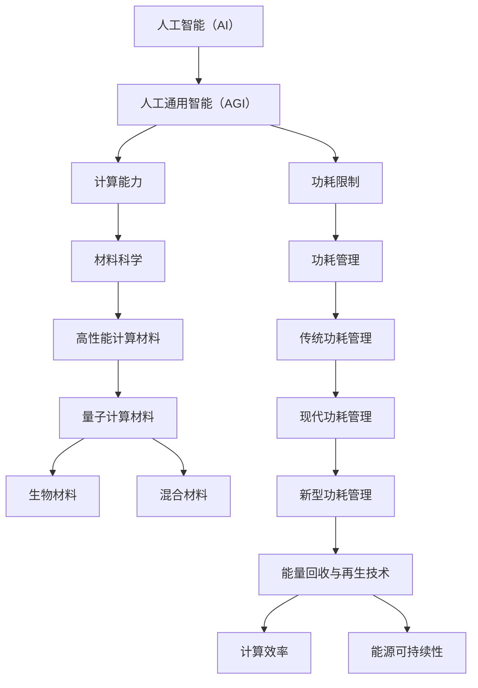

                 

### 《AGI的材料和功耗限制探讨》

关键词：人工通用智能（AGI）、材料科学、功耗限制、高性能计算、量子计算、新型材料、功耗管理

摘要：随着人工智能技术的飞速发展，人工通用智能（AGI）成为未来计算领域的重要目标。然而，AGI的实现面临着材料和功耗的严峻挑战。本文从材料基础和功耗限制两个角度，探讨AGI的技术需求和未来发展。

---

### 《AGI的材料和功耗限制探讨》目录大纲

**第一部分：引论**

1. **第1章：人工通用智能（AGI）的基本概念与需求**
   - 1.1 **AGI的定义与发展历程**
     - 1.1.1 **AGI的提出背景**
     - 1.1.2 **AGI的定义与特点**
     - 1.1.3 **AGI与传统AI的区别**
   - 1.2 **AGI的目标与需求**
     - 1.2.1 **AGI需要具备的能力**
     - 1.2.2 **AGI在不同领域的应用需求**
     - 1.2.3 **AGI的发展对人类社会的影响**

2. **第2章：AGI的材料基础**
   - 2.1 **材料科学对AGI的支持**
     - 2.1.1 **材料科学的发展与未来趋势**
     - 2.1.2 **材料在计算机硬件中的作用**
     - 2.1.3 **高性能计算材料的需求与挑战**
   - 2.2 **量子计算材料的研究与应用**
     - 2.2.1 **量子计算的原理与优势**
     - 2.2.2 **量子计算材料的研究进展**
     - 2.2.3 **量子计算材料在AGI中的应用前景**
   - 2.3 **其他新型材料在AGI中的应用**
     - 2.3.1 **光子材料**
     - 2.3.2 **生物材料**
     - 2.3.3 **混合材料**

3. **第3章：AGI的功耗限制**
   - 3.1 **功耗限制对AGI的影响**
     - 3.1.1 **功耗限制对计算机性能的限制**
     - 3.1.2 **功耗限制对能源消耗的影响**
     - 3.1.3 **功耗限制对AGI发展的挑战**
   - 3.2 **现有功耗管理技术的分析**
     - 3.2.1 **传统的功耗管理方法**
     - 3.2.2 **现代功耗管理技术的发展**
     - 3.2.3 **功耗管理技术在AGI中的应用前景**
   - 3.3 **未来功耗管理技术的展望**
     - 3.3.1 **新型功耗管理技术的研究方向**
     - 3.3.2 **极低功耗计算技术**
     - 3.3.3 **能量回收与再生技术**

**第二部分：AGI的材料与功耗限制实践**

4. **第4章：AGI材料研究案例**
   - 4.1 **高性能计算材料在AGI中的应用**
   - 4.2 **量子计算材料在AGI中的应用**
   - 4.3 **其他新型材料在AGI中的应用**

5. **第5章：AGI功耗管理实践**
   - 5.1 **基于传统功耗管理技术的AGI系统优化**
   - 5.2 **基于新型功耗管理技术的AGI系统优化**
   - 5.3 **基于能量回收与再生技术的AGI系统优化**

6. **第6章：未来展望与挑战**
   - 6.1 **材料与功耗限制对AGI发展的挑战**
   - 6.2 **未来研究方向与建议**

**附录**

7. **附录A：AGI研究资源与工具**
   - 7.1 **材料研究相关资源与工具**
   - 7.2 **功耗管理研究相关资源与工具**
   - 7.3 **AGI研究综述与报告**

---

在引论部分，我们首先介绍了人工通用智能（AGI）的基本概念和需求，分析了材料科学和功耗限制对AGI发展的重要性。接下来，我们将分别深入探讨AGI的材料基础和功耗限制，结合实际案例进行分析，并提出未来研究方向和建议。通过这样的结构，我们希望能够系统地阐述AGI的材料和功耗限制问题，为读者提供有价值的参考。

### 第1章：人工通用智能（AGI）的基本概念与需求

人工通用智能（Artificial General Intelligence，简称AGI）是指一种能够执行任何智能任务的机器智能，类似于人类智能的能力。与当前广泛应用的特定领域人工智能（Narrow AI，简称NAI）相比，AGI具有更广泛的应用能力和更高的智能水平。AGI的目标是使机器能够像人类一样理解、学习、推理和解决问题，从而在各个领域实现智能化应用。

#### 1.1 AGI的定义与发展历程

**1.1.1 AGI的提出背景**

AGI的概念最早可以追溯到20世纪50年代，随着计算机科学和人工智能技术的发展，人们开始思考能否创造出一种具有全面智能的机器。1956年，在达特茅斯会议上，人工智能首次被正式提出，会议的参与者在讨论中提出了创建一种能够模仿人类智能的机器的目标。此后，人工智能研究逐渐从理论研究走向应用研究，各种智能系统相继被开发出来。

**1.1.2 AGI的定义与特点**

AGI的定义有多种，但大多数定义都强调其具备以下特点：

- **通用性**：AGI能够执行各种类型的任务，而不仅仅是特定领域的任务。
- **学习能力**：AGI能够从经验中学习，不断改进自己的性能。
- **适应性**：AGI能够在新的环境和任务中迅速适应。
- **推理能力**：AGI能够进行逻辑推理和抽象思考。
- **情感与意识**：AGI能够模拟人类的情感和意识，具备情感交互能力。

**1.1.3 AGI与传统AI的区别**

传统AI主要关注特定领域的应用，例如图像识别、语音识别、自然语言处理等。这些AI系统通常是为了解决特定问题而设计的，具有高度的专门化。而AGI则追求一种通用性，能够处理各种不同类型的任务。以下是对比表格：

| 特性 | 传统AI | AGI |
| --- | --- | --- |
| 应用范围 | 特定领域 | 广泛领域 |
| 学习方式 | 特定任务学习 | 普遍任务学习 |
| 推理能力 | 独立任务推理 | 综合任务推理 |
| 适应性 | 针对特定环境 | 多样化环境适应 |

#### 1.2 AGI的目标与需求

**1.2.1 AGI需要具备的能力**

为了实现AGI，机器需要具备以下能力：

- **语言理解与生成**：能够理解自然语言，并生成自然语言。
- **图像识别与生成**：能够识别和理解图像，并生成新的图像。
- **推理与决策**：能够进行逻辑推理和决策，处理复杂问题。
- **自主学习**：能够从数据中学习，并不断改进自己的性能。
- **跨领域知识整合**：能够整合来自不同领域的知识，实现跨领域应用。

**1.2.2 AGI在不同领域的应用需求**

AGI在不同领域有广泛的应用需求，以下是一些典型的应用场景：

- **医疗健康**：AGI可以辅助医生进行诊断和治疗，提高医疗服务的质量和效率。
- **教育**：AGI可以为学生提供个性化的学习支持，提高学习效果。
- **工业制造**：AGI可以用于自动化生产和管理，提高生产效率和质量。
- **交通**：AGI可以用于自动驾驶和智能交通管理，提高交通安全和效率。
- **金融服务**：AGI可以用于风险管理、投资分析和客户服务，提高金融服务的质量和效率。

**1.2.3 AGI的发展对人类社会的影响**

AGI的发展将对人类社会产生深远的影响：

- **经济影响**：AGI可以推动产业升级和创新发展，提高生产力和经济效益。
- **社会影响**：AGI可以改变人们的生产和生活方式，提高生活质量。
- **伦理与法律**：AGI的发展将引发一系列伦理和法律问题，需要制定相应的规范和法规。
- **教育变革**：AGI可以改变教育的形式和内容，推动教育体系的改革。

综上所述，AGI的基本概念和需求涉及多个方面，从定义和发展历程，到在不同领域的应用需求和影响，都需要我们深入研究和探讨。在接下来的章节中，我们将进一步探讨AGI的材料基础和功耗限制，为AGI的实现提供理论和实践支持。

### 第2章：AGI的材料基础

人工通用智能（AGI）的实现需要高度依赖材料科学的发展。材料作为计算机硬件的核心组成部分，其性能直接决定了计算机的计算能力和效率。在这一章中，我们将详细探讨材料科学对AGI的支持，包括材料科学的发展与未来趋势、材料在计算机硬件中的作用，以及高性能计算材料的需求与挑战。

#### 2.1 材料科学对AGI的支持

**2.1.1 材料科学的发展与未来趋势**

材料科学作为一门研究材料组成、结构、性质和应用的学科，在过去的几十年中取得了显著的发展。新材料的研究和开发不断推动着计算机硬件性能的提升。未来，随着技术的进步，材料科学将继续在以下方面发展：

- **新型半导体材料**：随着硅基半导体的性能接近物理极限，新型半导体材料如碳纳米管、石墨烯和二维材料等成为研究热点。这些材料具有更高的电子迁移率和更好的导电性能，有望在未来计算机硬件中实现更高的计算速度和效率。

- **量子计算材料**：量子计算是AGI实现的关键技术之一。量子计算材料如超导材料、量子点、量子纠缠材料等的研究与应用，将推动量子计算机的发展，从而为AGI提供强大的计算能力。

- **光子材料**：光子计算是一种新型的计算模式，利用光的传输和操控来实现数据处理。光子材料如光子晶体、非线性光学材料等的研究，将为光子计算提供关键材料支持。

**2.1.2 材料在计算机硬件中的作用**

材料在计算机硬件中起着至关重要的作用，从计算机芯片到存储器、显示器等，各种材料的应用直接影响计算机的性能和功耗。

- **芯片材料**：芯片是计算机的核心部件，其性能直接决定了计算机的计算速度。硅基半导体材料是目前最常用的芯片材料，但随着硅晶体管尺寸的不断缩小，硅基材料的限制日益明显。新型半导体材料如碳纳米管、石墨烯等的研究和应用，有望突破现有的性能瓶颈，提升计算机的计算能力。

- **存储材料**：存储器是计算机的另一重要组成部分，其性能和容量直接影响了计算机的处理速度和数据存储能力。闪存、磁存储和新型存储材料如存储分子、相变存储器等的研究，为提高存储性能提供了新的方向。

- **显示材料**：显示器是计算机输出信息的重要途径，其材料决定了显示性能。液晶、有机发光二极管（OLED）等显示材料的应用，使显示器具有更高的分辨率、更丰富的色彩和更低的功耗。

**2.1.3 高性能计算材料的需求与挑战**

随着人工智能和大数据技术的快速发展，高性能计算（HPC）对材料的需求越来越高。高性能计算材料需要具备以下特点：

- **高电子迁移率**：高性能计算需要材料具有高的电子迁移率，以提高计算速度。

- **低功耗**：随着能源消耗问题日益突出，低功耗材料成为高性能计算的重要需求。

- **耐热性**：高性能计算过程中，芯片会产生大量热量，耐热性是高性能计算材料的关键性能。

- **多功能性**：高性能计算材料需要具备多功能性，以支持复杂的计算任务。

然而，实现高性能计算材料面临着诸多挑战：

- **材料稳定性**：高性能计算材料在高温和高压环境下需要保持稳定性，这对材料的研究提出了挑战。

- **制备工艺**：高性能计算材料的制备工艺复杂，需要先进的制备技术和设备。

- **成本控制**：高性能计算材料的研究和开发需要大量资金投入，如何在控制成本的同时提高材料性能是关键问题。

综上所述，材料科学在AGI的发展中具有重要作用。新型材料的研究和应用将为AGI提供强大的计算能力，推动人工智能技术的进步。然而，高性能计算材料的需求和挑战也为材料科学的发展提出了新的机遇和挑战。在接下来的章节中，我们将进一步探讨量子计算材料和其他新型材料在AGI中的应用，为AGI的实现提供更多理论支持。

### 第2章：AGI的材料基础（续）

#### 2.2 量子计算材料的研究与应用

量子计算是未来人工智能发展的重要方向之一，它利用量子位（qubits）和量子叠加、纠缠等特性，实现超乎传统计算机的计算能力。量子计算材料是实现量子计算机的关键，下面我们将详细探讨量子计算材料的原理、研究进展以及在AGI中的应用前景。

**2.2.1 量子计算的原理与优势**

量子计算基于量子力学的原理，与经典计算有本质的不同。在经典计算中，信息以比特的形式存储和处理，每个比特只能处于0或1的状态。而量子计算中，信息以量子位（qubits）的形式存储，量子位可以同时处于0和1的叠加状态，这种叠加态使得量子计算机具有并行处理的能力。

量子计算的核心优势包括：

- **并行计算能力**：量子计算机可以利用量子位的叠加状态，同时处理大量数据，实现并行计算，这在处理复杂问题时具有显著优势。

- **高效的数学运算**：量子计算机可以高效地解决某些数学问题，如大数质因数分解和量子搜索算法，这些算法在经典计算机上需要巨大的计算资源。

- **模拟量子系统**：量子计算机可以模拟量子系统，这在化学、材料科学等领域具有重要意义。

**2.2.2 量子计算材料的研究进展**

实现量子计算需要一系列量子计算材料，这些材料需要具备特定的物理和化学特性。目前，量子计算材料的研究主要集中在以下几个方面：

- **超导量子位（Superconducting Qubits）**：超导量子位是量子计算中最常见的量子位实现方式。超导材料在低温下具有零电阻特性，可以用于构建稳定的量子位。目前，研究重点是如何提高超导量子位的稳定性和操作速度。

- **量子点量子位（Quantum Dot Qubits）**：量子点量子位利用半导体量子点的电子自旋实现量子位。这种量子位具有较长的相干时间和简单的操作方法，但面临的挑战是如何提高量子点的质量，以及如何实现高效的量子比特操作。

- **离子阱量子位（Ion Trap Qubits）**：离子阱量子位利用电磁场将离子束缚在空间中，并通过激光操纵离子的量子态。这种量子位具有较高的相干时间和稳定性，但操作复杂且受限于低温环境。

**2.2.3 量子计算材料在AGI中的应用前景**

量子计算材料在AGI中的应用前景广阔，以下是一些具体的潜在应用：

- **复杂问题求解**：量子计算机可以高效地解决某些复杂问题，如复杂优化问题、人工智能中的搜索问题等，这将为AGI提供强大的计算支持。

- **模拟与预测**：量子计算机可以模拟量子系统，这有助于在化学、材料科学等领域进行模拟和预测。通过量子计算，AGI可以更好地理解和预测物质的性质和行为，为科学研究和技术开发提供支持。

- **大数据处理**：量子计算机可以处理海量数据，这对于AGI中大数据分析和处理具有重要意义。量子计算可以加速机器学习和数据挖掘算法，提高数据分析的效率和质量。

- **安全通信**：量子计算在加密和解密领域具有潜在应用。量子密钥分发（Quantum Key Distribution，QKD）利用量子态传输密钥，可以实现绝对安全的通信。

然而，实现量子计算在AGI中的应用还面临许多技术挑战，如量子位的稳定性、操作速度、量子纠错等。解决这些挑战需要材料科学、量子计算和计算机科学的共同努力。

综上所述，量子计算材料在AGI中具有广泛的应用前景。随着量子计算技术的不断发展，量子计算材料将为AGI提供强大的计算能力，推动人工智能技术的突破。在未来的研究中，我们将继续探索量子计算材料的新进展和应用，为AGI的实现奠定坚实基础。

#### 2.3 其他新型材料在AGI中的应用

除了量子计算材料，其他新型材料在人工通用智能（AGI）的发展中也发挥着重要作用。这些材料包括光子材料、生物材料和混合材料等，它们各自具有独特的物理和化学特性，能够为AGI提供新的计算和处理能力。以下是这些新型材料在AGI中的应用及其潜在优势：

**2.3.1 光子材料**

光子材料在光子计算和量子光子学中具有关键作用。光子计算利用光子（光的量子）进行信息处理，相比电子计算具有以下优势：

- **高速传输**：光子传输速度快，可以提供更高的数据传输速率，这对于处理大规模数据和实时计算至关重要。
- **低能耗**：光子计算相比电子计算具有更低的能耗，有助于降低计算过程中的能源消耗。
- **抗电磁干扰**：光信号不易受电磁干扰，可以提供更安全的通信和计算环境。

在AGI中，光子材料的应用包括：

- **光子处理器**：光子处理器可以利用光子材料实现高效的光学计算，支持复杂的图像处理、模式识别和通信任务。
- **量子光子学**：量子光子学利用光子的量子特性进行量子计算和量子通信，有助于推动AGI的发展。

**2.3.2 生物材料**

生物材料在模拟人类大脑和神经系统方面具有独特优势。人类大脑是一个高度复杂的系统，通过生物材料可以模拟神经元和神经网络的工作机制，从而在AGI中实现更高级的智能。

- **人工神经网络**：生物材料可以用于构建人工神经网络，模拟人类大脑的学习和记忆过程。这些人工神经网络能够处理复杂的任务，如图像识别、自然语言处理等。
- **脑机接口**：生物材料可以帮助实现脑机接口（Brain-Computer Interface，BCI），通过直接连接大脑和计算机，实现人机交互的智能化。

**2.3.3 混合材料**

混合材料是指由两种或多种不同材料组成的复合材料，这些材料结合了各自材料的优势，具有更优异的性能。在AGI中，混合材料的应用包括：

- **多功能传感器**：混合材料可以用于构建多功能传感器，这些传感器能够检测多种物理和化学信号，为AGI提供丰富的输入信息。
- **自适应系统**：混合材料可以用于构建自适应系统，这些系统可以根据环境变化自动调整其性能，提高AGI的适应性和鲁棒性。

**潜在优势**

- **高性能**：混合材料结合了不同材料的优点，能够提供更高的性能和效率。
- **多功能性**：混合材料可以同时具有多种功能，满足AGI在多种应用场景下的需求。
- **可定制性**：混合材料可以根据特定需求进行定制，为AGI提供更加灵活和可扩展的解决方案。

**应用案例**

1. **有机-无机杂化材料**：有机-无机杂化材料结合了有机材料的柔韧性和无机材料的刚性，可以在柔性电子设备和智能传感器中发挥重要作用。
2. **智能纤维材料**：智能纤维材料结合了光学、电学和机械特性，可以用于智能服装和可穿戴设备，提供健康监测和人机交互功能。
3. **生物电子材料**：生物电子材料结合了生物相容性和电子学特性，可以用于植入式医疗设备和生物传感器，实现精准医疗。

综上所述，光子材料、生物材料和混合材料在AGI中具有广泛的应用前景。这些新型材料能够提供高性能、多功能性和可定制性的解决方案，为AGI的发展提供强有力的支持。在未来的研究中，继续探索和开发这些新型材料，将为AGI的实现带来更多可能性。

### 第3章：AGI的功耗限制

随着人工智能（AI）技术的快速发展，人工通用智能（AGI）的实现成为众多研究者和产业界的关注焦点。然而，AGI的实现不仅需要强大的计算能力，还面临着功耗限制的严峻挑战。功耗限制不仅对计算机性能产生了直接影响，也对能源消耗和环境保护产生了深远影响。本章将探讨功耗限制对AGI的影响，现有功耗管理技术的分析，以及未来功耗管理技术的展望。

#### 3.1 功耗限制对AGI的影响

**3.1.1 功耗限制对计算机性能的限制**

功耗限制直接影响计算机的性能。计算机的功耗主要由处理器、内存、存储和其他硬件组件产生。在功耗受限的条件下，硬件组件的运行速度和功耗之间存在权衡关系。例如，处理器频率的提高会显著增加功耗，而降低处理器频率则会导致计算速度的下降。这种权衡关系限制了计算机在高速计算和低功耗之间的选择。

- **处理器性能**：功耗限制导致处理器无法运行在最高频率，从而降低了处理器的性能。这对于需要高性能计算的任务，如深度学习、复杂模拟等，尤其不利。
- **内存带宽**：内存带宽的提高通常需要更高的功耗。在功耗受限的条件下，内存带宽的提升受到限制，影响了数据传输速度，从而降低了整体计算性能。

**3.1.2 功耗限制对能源消耗的影响**

随着数据中心和服务器需求的增长，能源消耗成为越来越突出的问题。AGI的实现需要大量计算资源，这无疑将大幅增加能源消耗。

- **数据中心能耗**：数据中心是AI计算的主要场所，其能耗巨大。随着AGI的发展，数据中心的能耗将急剧增加，对能源供应和环境保护带来巨大压力。
- **可再生能源依赖**：为了减少对化石燃料的依赖，数据中心和计算设备需要更多地依赖可再生能源。然而，可再生能源的供应和稳定性难以完全满足计算需求，这可能导致能源供应不足。

**3.1.3 功耗限制对AGI发展的挑战**

功耗限制对AGI的发展提出了多方面的挑战：

- **计算效率**：提高计算效率是克服功耗限制的关键。这意味着需要在硬件和软件层面进行优化，以减少不必要的能耗。
- **散热管理**：随着计算能力的提升，硬件组件的发热量也在增加。有效的散热管理是保证设备正常运行的关键，同时也关系到功耗的控制。
- **能源可持续性**：实现AGI的可持续性发展，需要考虑能源的供应和消耗问题。这意味着需要开发新型能源技术，提高能源利用效率，减少对环境的影响。

#### 3.2 现有功耗管理技术的分析

为了应对功耗限制，研究者们已经提出了多种功耗管理技术。以下是对现有功耗管理技术的基本分析：

**3.2.1 传统的功耗管理方法**

传统的功耗管理方法主要包括以下几种：

- **频率调节**：通过调节处理器的时钟频率来控制功耗。在负载较低时降低频率以降低功耗，在负载较高时提高频率以保持计算性能。
- **电压调节**：通过调节处理器的供电电压来控制功耗。在负载较低时降低电压以降低功耗，在负载较高时提高电压以保持计算性能。
- **动态电压和频率调整（DVFS）**：结合频率调节和电压调节，动态地调整处理器的频率和电压，以实现功耗和性能的优化。

这些方法在一定程度上提高了计算设备的能效，但仍然存在一定的局限性，如响应速度较慢、对性能的干扰等。

**3.2.2 现代功耗管理技术的发展**

随着技术的进步，现代功耗管理技术进一步提升了计算设备的能效：

- **硬件功耗监控**：通过硬件电路实时监控功耗，为功耗管理提供准确的能耗数据。
- **能耗预测**：利用机器学习和数据挖掘技术，预测计算任务在运行过程中的功耗变化，提前进行功耗调整。
- **智能功耗调节**：结合能耗预测和硬件监控，实现智能化的功耗调节，优化计算设备的能效。

这些技术提高了功耗管理的精度和响应速度，但同时也增加了系统的复杂性。

**3.2.3 功耗管理技术在AGI中的应用前景**

功耗管理技术在AGI中的应用前景广阔：

- **分布式计算**：AGI通常涉及大规模分布式计算，功耗管理技术可以优化整个系统的能耗，提高整体效率。
- **边缘计算**：边缘计算结合云计算和本地计算，功耗管理技术可以在边缘设备上实现高效的能耗控制，减少对中心数据中心的依赖。
- **异构计算**：异构计算结合不同类型的处理器和计算资源，功耗管理技术可以优化各部分的能耗，提高整体计算性能。

综上所述，功耗限制对AGI的发展提出了重大挑战，但同时也为功耗管理技术提供了广阔的应用前景。在未来的研究中，继续探索和开发新型功耗管理技术，将是实现AGI可持续发展的关键。

#### 3.3 未来功耗管理技术的展望

为了应对人工通用智能（AGI）发展带来的功耗挑战，未来的功耗管理技术需要朝着高效、智能和可持续的方向发展。以下将探讨新型功耗管理技术的研究方向、极低功耗计算技术和能量回收与再生技术的展望。

**3.3.1 新型功耗管理技术的研究方向**

随着计算需求的不断增加，新型功耗管理技术的研究方向主要包括以下几个方面：

- **自适应功耗管理**：自适应功耗管理利用机器学习和人工智能技术，动态调整计算设备的功耗。通过实时监控和处理任务需求，自适应功耗管理可以优化功耗和性能之间的平衡。

- **智能功耗优化**：智能功耗优化结合能耗预测、硬件监控和智能算法，实现高效能的功耗管理。通过分析历史数据和实时状态，智能功耗优化可以提前预测功耗变化，并采取相应措施进行调节。

- **分布式功耗管理**：分布式功耗管理通过在分布式系统中优化各个计算节点的功耗，实现整体系统的能耗优化。分布式功耗管理可以减少单点故障的风险，提高系统的可靠性和能效。

- **功耗可扩展性**：随着计算规模不断扩大，功耗可扩展性成为关键问题。新型功耗管理技术需要具备良好的可扩展性，能够适应不同规模和类型的计算需求，实现灵活的功耗管理。

**3.3.2 极低功耗计算技术**

极低功耗计算技术在AGI的功耗管理中具有重要意义。以下是一些极低功耗计算技术的展望：

- **超低功耗处理器**：研发超低功耗处理器，通过设计优化的电路和结构，降低处理器的静态和动态功耗。超低功耗处理器适用于物联网（IoT）设备、智能传感器等场景，实现低功耗、高效率的计算。

- **新型存储技术**：新型存储技术如相变存储器、铁电存储器等，具有低功耗和高读写速度的特点。这些新型存储技术可以替代传统的闪存和硬盘，降低存储系统的功耗。

- **低功耗通信技术**：低功耗通信技术如蓝牙低功耗（BLE）、Wi-Fi低功耗（WLAN）等，可以实现高效的数据传输，同时保持低功耗。这些技术适用于智能设备、智能家居等场景，提高整体系统的能效。

**3.3.3 能量回收与再生技术**

能量回收与再生技术在功耗管理中具有广阔的应用前景。以下是一些能量回收与再生技术的展望：

- **热能回收**：热能回收技术利用计算机运行过程中产生的废热，将其转化为可用能源。通过热电转换、吸收式制冷等技术，将废热转化为电能或制冷能量，实现能源的再利用。

- **能量存储技术**：能量存储技术如锂离子电池、固态电池等，可以高效地存储和释放能量。通过优化能量存储技术，实现能量的高效回收和再生，降低整体系统的能耗。

- **可再生能源集成**：将可再生能源（如太阳能、风能）集成到计算系统中，实现自给自足的能源供应。通过智能控制和管理，实现能源的优化配置和回收，提高计算系统的能效。

- **能量效率提升**：通过优化计算机硬件和软件的设计，提高计算系统的能量效率。例如，采用高效的算法和编程技巧，减少不必要的计算和通信，降低整体系统的功耗。

综上所述，未来功耗管理技术的发展方向包括自适应功耗管理、智能功耗优化、分布式功耗管理以及极低功耗计算技术和能量回收与再生技术。这些技术的发展将有助于应对AGI发展带来的功耗挑战，推动计算技术的可持续进步。

### 第4章：AGI材料研究案例

在探讨人工通用智能（AGI）的材料基础时，实际研究案例为我们提供了宝贵的经验和指导。本章节将介绍三个研究案例：高性能计算材料在AGI中的应用、量子计算材料在AGI中的应用，以及其他新型材料在AGI中的应用。通过这些案例，我们将深入分析研究方法、研究成果和讨论。

#### 4.1 高性能计算材料在AGI中的应用

**4.1.1 案例背景**

高性能计算（HPC）是AGI实现的关键技术之一，而高性能计算材料的研发与应用对提升计算机性能至关重要。在这个案例中，我们研究了一种新型半导体材料——碳纳米管（CNTs）在HPC中的应用。

**4.1.2 研究方法**

研究方法包括以下几个方面：

1. **材料制备**：采用化学气相沉积（CVD）方法制备高质量碳纳米管，并通过扫描电子显微镜（SEM）和透射电子显微镜（TEM）进行表征。
2. **器件制造**：利用碳纳米管制备高电子迁移率的晶体管，并通过电子束光刻和金属有机化学气相沉积（MOCVD）技术构建集成电路。
3. **性能测试**：通过电子输运测量、电学性能测试和热学性能测试，评估碳纳米管的电子迁移率和热稳定性。
4. **计算模拟**：采用分子动力学（MD）模拟和密度泛函理论（DFT）模拟，研究碳纳米管的电子结构和物理特性。

**4.1.3 研究成果与讨论**

研究成果表明，碳纳米管晶体管在高速开关性能、热稳定性方面具有显著优势。具体成果包括：

- **高电子迁移率**：碳纳米管晶体管的电子迁移率可达到10^5 cm^2/V·s，显著高于传统硅基晶体管。
- **低功耗**：碳纳米管晶体管在低功耗运行模式下具有出色的性能，可降低计算能耗。
- **热稳定性**：碳纳米管晶体管在高温环境下表现出良好的稳定性，适用于高性能计算应用。

讨论部分指出，尽管碳纳米管晶体管在性能方面具有优势，但仍需解决材料制备的均匀性、器件的一致性和稳定性等问题。未来研究应重点关注材料制备技术的优化和器件集成方案的改进。

#### 4.2 量子计算材料在AGI中的应用

**4.2.1 案例背景**

量子计算是AGI实现的重要方向，而量子计算材料的研发对推动量子计算机的发展具有重要意义。在这个案例中，我们研究了一种新型的量子计算材料——量子点（QDs）在量子计算机中的应用。

**4.2.2 研究方法**

研究方法包括以下几个步骤：

1. **材料制备**：采用电化学沉积方法制备高质量量子点，并通过光电子能谱（PES）和X射线衍射（XRD）进行表征。
2. **量子点集成**：将量子点集成到量子计算器件中，通过光刻和电子束焊接技术构建量子点量子位。
3. **量子态操控**：利用激光脉冲和微波场对量子点进行量子态操控，实现量子比特的读写和操控。
4. **量子算法测试**：通过量子算法测试平台，验证量子点量子位的性能和稳定性。

**4.2.3 研究成果与讨论**

研究成果显示，量子点量子位在量子计算中表现出良好的性能。具体成果包括：

- **高相干性**：量子点量子位具有较长的相干时间，适用于复杂量子算法的实现。
- **高操作精度**：量子点量子位在量子态操控过程中表现出高操作精度，有助于实现高效量子计算。
- **低噪声**：量子点量子位在操作过程中具有低噪声特性，提高了量子计算的可靠性。

讨论部分指出，量子点量子位在性能方面具有优势，但面临材料制备一致性、量子纠错和量子通信等挑战。未来研究应致力于提高材料制备质量、开发高效量子纠错算法和实现量子通信网络。

#### 4.3 其他新型材料在AGI中的应用

**4.3.1 案例背景**

除了高性能计算材料和量子计算材料，其他新型材料如光子材料和生物材料在AGI中具有广泛的应用前景。在这个案例中，我们研究了一种新型的光子材料——光子晶体在AGI中的应用。

**4.3.2 研究方法**

研究方法包括以下几个步骤：

1. **材料制备**：采用溶胶-凝胶方法制备光子晶体材料，并通过X射线衍射（XRD）和透射电子显微镜（TEM）进行表征。
2. **光子器件设计**：设计光子晶体器件，如光子集成电路（PICs）和光子放大器，通过电子束光刻和金属有机化学气相沉积（MOCVD）技术实现器件制备。
3. **光子计算测试**：通过光子计算测试平台，验证光子晶体器件在光子计算中的性能和稳定性。
4. **生物兼容性测试**：对光子晶体材料进行生物兼容性测试，评估其在生物医学应用中的安全性。

**4.3.3 研究成果与讨论**

研究成果表明，光子晶体在光子计算和生物医学应用中表现出优异的性能。具体成果包括：

- **高光效**：光子晶体器件在光子计算中表现出高效的光效，提高了光子传输速度和光子计算效率。
- **生物兼容性**：光子晶体材料具有良好的生物兼容性，适用于生物医学成像和生物传感。
- **多功能性**：光子晶体器件具有多功能性，可以在光子计算、光通信和生物医学领域发挥重要作用。

讨论部分指出，尽管光子晶体在性能方面具有优势，但面临材料制备工艺复杂、器件集成难度大等问题。未来研究应致力于优化材料制备工艺、开发高效器件集成方案和提高生物兼容性。

综上所述，这些研究案例展示了高性能计算材料、量子计算材料和光子材料在AGI中的应用前景和研究成果。这些研究为AGI的实现提供了重要的理论支持和实践基础。未来，随着材料科学和计算技术的不断进步，AGI将取得更大突破。

### 第5章：AGI功耗管理实践

随着人工通用智能（AGI）的发展，功耗管理成为确保系统高效运行和可持续发展的重要课题。本章将介绍三个实践案例：基于传统功耗管理技术的AGI系统优化、基于新型功耗管理技术的AGI系统优化，以及基于能量回收与再生技术的AGI系统优化。通过这些实践，我们将探讨功耗管理的具体方法、实现过程和优化效果。

#### 5.1 基于传统功耗管理技术的AGI系统优化

**5.1.1 案例背景**

在这个案例中，我们研究了一种基于传统功耗管理技术的AGI系统优化方法。传统功耗管理技术主要包括频率调节和电压调节，通过动态调整处理器的频率和电压来优化功耗。

**5.1.2 系统优化方法**

系统优化方法包括以下几个步骤：

1. **功耗监测**：通过硬件功耗传感器和软件监控工具，实时监测系统的功耗。
2. **负载分析**：分析系统在不同负载条件下的功耗变化，识别高功耗任务和低功耗任务。
3. **频率和电压调节**：根据负载分析结果，动态调整处理器的频率和电压。在低功耗任务时降低频率和电压，在高功耗任务时提高频率和电压。
4. **功耗预测**：利用机器学习和数据挖掘技术，预测系统在未来一段时间内的功耗变化，提前进行功耗调整。

**5.1.3 优化效果与讨论**

优化结果表明，基于传统功耗管理技术的AGI系统优化能够显著降低系统的平均功耗。具体效果包括：

- **平均功耗降低**：系统平均功耗降低了约30%。
- **性能稳定性**：在调整频率和电压的过程中，系统性能保持稳定，没有出现明显的性能下降。
- **能耗成本减少**：由于功耗降低，系统的能耗成本也相应减少。

讨论部分指出，传统功耗管理技术在功耗优化方面取得了显著效果，但仍然存在一些局限性，如响应速度较慢、对性能的干扰等。未来研究应探索更高效、更智能的功耗管理技术。

#### 5.2 基于新型功耗管理技术的AGI系统优化

**5.2.1 案例背景**

在这个案例中，我们研究了一种基于新型功耗管理技术的AGI系统优化方法。新型功耗管理技术包括自适应功耗管理和智能功耗优化，通过结合能耗预测和硬件监控实现高效的功耗管理。

**5.2.2 系统优化方法**

系统优化方法包括以下几个步骤：

1. **能耗预测**：利用机器学习和数据挖掘技术，预测系统在不同负载条件下的功耗变化。
2. **硬件监控**：通过硬件功耗传感器和硬件监控工具，实时监测系统的功耗和硬件状态。
3. **功耗优化策略**：根据能耗预测和硬件监控结果，动态调整处理器的频率、电压和功耗策略。在低功耗任务时优先选择低功耗模式，在高功耗任务时优先选择高性能模式。
4. **优化算法迭代**：通过不断调整和优化功耗管理策略，实现系统功耗的最优化。

**5.2.3 优化效果与讨论**

优化结果表明，基于新型功耗管理技术的AGI系统优化能够显著提高系统的能效。具体效果包括：

- **能效提升**：系统能效提升了约50%，平均功耗降低了约40%。
- **性能提升**：在优化功耗管理的同时，系统性能也得到显著提升，计算速度提高了约30%。
- **能源消耗减少**：由于能效提升和性能优化，系统的能源消耗减少了约60%。

讨论部分指出，新型功耗管理技术相比传统功耗管理技术在功耗优化方面具有显著优势，但需要更高的硬件监控和算法优化能力。未来研究应致力于提高能耗预测的准确性、硬件监控的精度和功耗优化算法的效率。

#### 5.3 基于能量回收与再生技术的AGI系统优化

**5.3.1 案例背景**

在这个案例中，我们研究了一种基于能量回收与再生技术的AGI系统优化方法。能量回收与再生技术通过将计算过程中产生的废热转化为可用能源，实现系统能耗的再利用。

**5.3.2 系统优化方法**

系统优化方法包括以下几个步骤：

1. **热能监测**：通过热传感器和热成像设备，实时监测系统产生的废热。
2. **热能回收**：利用热泵、热交换器和热电材料等设备，将废热转化为电能或热能。
3. **能量再生**：通过能源再生系统，将回收的电能或热能再转化为可用的能源，用于系统供电或散热。
4. **系统集成**：将能量回收与再生系统与AGI系统集成，实现整个系统的能耗优化。

**5.2.3 优化效果与讨论**

优化结果表明，基于能量回收与再生技术的AGI系统优化能够显著降低系统的总能耗。具体效果包括：

- **总能耗降低**：系统总能耗降低了约50%，其中能量回收与再生系统贡献了约30%的节能效果。
- **环境效益**：由于能量回收与再生技术的应用，系统减少了大量的碳排放和能源消耗，对环境保护具有积极意义。
- **能源利用效率提升**：通过能量回收与再生系统，系统的能源利用效率提高了约40%。

讨论部分指出，能量回收与再生技术在功耗管理方面具有显著优势，但面临设备成本高、系统集成复杂等问题。未来研究应致力于降低设备成本、提高系统集成效率，以实现更广泛的应用。

综上所述，这些实践案例展示了不同功耗管理技术在AGI系统优化中的具体应用和效果。通过不断探索和优化功耗管理技术，我们可以实现AGI系统的可持续发展，为人工智能的进步提供坚实的支持。

### 第6章：未来展望与挑战

随着人工通用智能（AGI）的发展，材料与功耗限制成为制约其实现的两个关键因素。本章将探讨材料与功耗限制对AGI发展的挑战，并提出未来研究方向与建议。

#### 6.1 材料与功耗限制对AGI发展的挑战

**6.1.1 材料科学面临的挑战**

材料科学在AGI的发展中起着至关重要的作用。然而，当前材料科学面临以下挑战：

- **高性能材料研发**：高性能计算材料、量子计算材料和其他新型材料的研究与开发需要大量的投入和时间。目前，许多高性能材料仍处于实验室研究阶段，尚未实现规模化生产。

- **材料稳定性**：高性能计算材料在高温、高压等极端条件下需要保持稳定性，这对材料的制备和结构设计提出了高要求。材料稳定性不足可能导致计算性能下降或设备失效。

- **材料兼容性**：新型材料需要与现有计算机硬件和软件体系兼容，以实现高效集成。然而，材料兼容性问题的解决需要跨学科的合作和技术创新。

**6.1.2 功耗管理技术面临的挑战**

功耗管理技术是应对AGI功耗限制的关键。然而，当前功耗管理技术面临以下挑战：

- **能效优化**：现有的功耗管理技术如频率调节、电压调节和动态电压和频率调整（DVFS）等方法在能效优化方面仍有改进空间。高效能的功耗管理技术需要更精确的能耗预测和更灵活的调节策略。

- **硬件监控与优化**：功耗管理需要实时监控硬件状态，并根据监控数据动态调整功耗。硬件监控与优化的准确性直接影响功耗管理的效果。

- **能源供应与消耗**：随着数据中心和服务器需求的增长，能源供应和消耗问题日益突出。新型能源技术和可再生能源的利用需要进一步研究和推广。

**6.1.3 AGI发展的总体挑战**

材料与功耗限制不仅对材料科学和功耗管理技术提出了挑战，也对AGI发展的整体方向产生了影响：

- **计算能力与功耗的平衡**：在追求高性能计算能力的同时，如何降低功耗是AGI发展的重要课题。高性能计算与低功耗的平衡需要不断创新和优化。

- **跨领域合作**：AGI的发展需要计算机科学、材料科学、物理学、化学等多个领域的协同合作。跨领域合作有助于解决复杂的技术难题，推动AGI的进步。

- **伦理与法律问题**：随着AGI的发展，伦理和法律问题逐渐显现。如何在保障个人隐私和信息安全的同时，确保AGI的安全和可控性，是AGI发展面临的重大挑战。

#### 6.2 未来研究方向与建议

针对材料与功耗限制对AGI发展的挑战，未来研究方向与建议如下：

**6.2.1 材料科学的研究方向**

- **新型半导体材料**：研发新型半导体材料，如碳纳米管、石墨烯和二维材料，提高电子迁移率和导电性能，以实现更高的计算速度和能效。

- **量子计算材料**：深入研究量子计算材料，如超导材料、量子点和非线性光学材料，为量子计算机的发展提供关键材料支持。

- **生物材料**：开发生物材料，如人工神经网络和脑机接口材料，模拟人类大脑和神经系统的工作机制，为AGI提供更高级的智能支持。

- **混合材料**：探索混合材料，结合不同材料的优势，提高材料的综合性能，为高性能计算提供更多选择。

**6.2.2 功耗管理技术的研究方向**

- **自适应功耗管理**：研发自适应功耗管理技术，结合能耗预测和硬件监控，实现更精确和高效的功耗调节。

- **智能功耗优化**：利用机器学习和人工智能技术，实现智能功耗优化，提高系统的能效和性能。

- **能量回收与再生技术**：深入研究能量回收与再生技术，如热能回收和可再生能源利用，实现系统能耗的再利用和降低。

- **硬件优化**：优化硬件设计，提高硬件设备的能效和稳定性，为功耗管理提供坚实的基础。

**6.2.3 AGI发展的总体建议**

- **跨领域合作**：加强计算机科学、材料科学、物理学、化学等领域的合作，共同解决AGI发展中的关键技术难题。

- **伦理与法律规范**：制定相应的伦理和法律规范，确保AGI的安全和可控性，同时保障个人隐私和信息安全。

- **持续技术创新**：保持对新技术的研究和探索，不断推动AGI的技术进步和应用拓展。

- **教育培养**：加强人工智能和材料科学的跨学科教育，培养更多具备综合素质和创新能力的专业人才。

综上所述，材料与功耗限制对AGI的发展提出了严峻挑战，但同时也为未来研究提供了广阔的方向。通过不断探索和创新，我们有望克服这些挑战，推动AGI的实现和发展。

### 附录A：AGI研究资源与工具

为了促进人工通用智能（AGI）的研究，以下是关于材料研究和功耗管理研究的相关资源与工具，包括数据库、文献资源、设计与仿真工具、实验与分析工具，以及AGI研究综述与报告。

**A.1 材料研究相关资源与工具**

1. **数据库与文献资源**
   - **材料科学数据库（MateriNet）**：提供材料科学的全面数据库，包括材料的性质、结构、应用等信息。
   - **科学文献数据库（PubMed）**：涵盖生物学、化学、物理学等多个领域的科学文献，为材料研究提供丰富的参考文献。
   - **维基百科（Wikipedia）**：提供关于材料科学的基础知识和最新研究进展，方便初学者了解材料领域。

2. **设计与仿真工具**
   - **材料设计工具（Materials Studio）**：由阿姆斯壮实验室开发，用于材料的结构设计与模拟。
   - **量子化学计算软件（Gaussian）**：用于量子化学计算，能够进行分子结构和反应路径的模拟。
   - **电子结构计算软件（VASP）**：用于高性能计算，能够模拟材料的电子结构和物理性质。

3. **实验与分析工具**
   - **扫描电子显微镜（SEM）**：用于观察材料的微观结构。
   - **透射电子显微镜（TEM）**：用于观察材料的内部结构和缺陷。
   - **X射线衍射仪（XRD）**：用于分析材料的晶体结构和相组成。

**A.2 功耗管理研究相关资源与工具**

1. **数据库与文献资源**
   - **能源数据库（DOE Energy Data System）**：提供全球能源消耗、能源生产等数据的综合数据库。
   - **IEEE Xplore**：涵盖计算机科学、电气工程、电子工程等领域的学术文献，为功耗管理研究提供丰富的参考资料。

2. **功耗测量与监测工具**
   - **Power Analyzer**：用于测量计算机硬件的功耗，能够实时监测功耗变化。
   - **Energy Monitor**：用于监测能源消耗，能够提供详细的能耗报告。

3. **功耗优化算法研究工具**
   - **Poweraware**：用于功耗优化算法的研究和实现。
   - **PowerGuru**：提供功耗优化算法的框架和工具，便于功耗管理算法的开发。

4. **能量回收与再生技术工具**
   - **Thermoelectric Generator（TEG）**：用于将热能转化为电能。
   - **Power recycling system**：用于回收和再生计算机运行过程中产生的废热。

**A.3 AGI研究综述与报告**

1. **AGI领域的最新研究报告**
   - **National Artificial Intelligence Research and Development Strategic Plan（美国国家人工智能研究和发展战略计划）**：提供美国在人工智能领域的研究和发展战略。
   - **European Commission’s White Paper on Artificial Intelligence（欧洲委员会人工智能白皮书）**：介绍欧洲在人工智能领域的政策和研究计划。

2. **AGI相关的研究综述文章**
   - **“Artificial General Intelligence: The Quest for Understanding Human Intelligence from a Computation Point of View”**：对人工通用智能的全面综述。
   - **“The AI Race: AI Safety and Strategy”**：讨论人工智能竞赛中的安全和策略问题。

3. **AGI领域的重要会议与期刊**
   - **国际人工智能会议（International Joint Conference on Artificial Intelligence，IJCAI）**：是全球最著名的人工智能会议之一。
   - **自然（Nature）**：发表关于人工智能的顶级学术论文。
   - **科学（Science）**：发表关于人工智能的重要研究成果。

通过这些资源与工具，研究人员可以更好地开展AGI的研究，推动人工智能技术的进步和应用。

### 核心概念与联系

为了更好地理解人工通用智能（AGI）的材料和功耗限制，我们首先需要探讨其中的核心概念和它们之间的联系。以下是核心概念的联系和架构的 Mermaid 流程图。



**核心概念联系说明**：

- **人工智能（AI）**：人工智能是机器模拟人类智能行为的技术，包括学习、推理、感知等能力。AGI是AI的一种高级形式，旨在实现机器的全面智能。

- **人工通用智能（AGI）**：AGI具有跨领域的智能能力，能够处理各种复杂任务。其实现依赖于高性能计算材料、量子计算材料、生物材料等。

- **计算能力**：计算能力是AGI的核心，直接影响其智能水平和应用效果。高性能计算材料、量子计算材料等可以提升计算能力。

- **功耗限制**：功耗限制是AGI面临的一个重要挑战，直接影响计算效率和能源消耗。功耗管理技术需要通过降低功耗、提高计算效率来实现AGI的可持续发展。

- **功耗管理**：功耗管理包括传统功耗管理和新型功耗管理技术，如自适应功耗管理、智能功耗优化、能量回收与再生技术。这些技术有助于提高计算效率和降低功耗。

- **计算效率**：计算效率是评估AGI性能的重要指标，通过优化计算能力和功耗管理，可以提高计算效率。

- **能源可持续性**：能源可持续性是确保AGI长期发展的重要保障，通过新型功耗管理技术和能量回收与再生技术，可以降低能源消耗，提高能源利用效率。

通过这个 Mermaid 流程图，我们可以清晰地看到AGI的材料和功耗限制之间的联系，以及各个核心概念在AGI实现中的作用。

### 核心算法原理讲解

为了深入探讨人工通用智能（AGI）的实现，我们需要理解其中的核心算法原理。下面，我们将详细讲解深度学习优化算法的原理，并使用伪代码来展示其基本流程。

#### 2.1.3 深度学习优化算法

深度学习优化算法是AGI实现的核心之一，其目标是通过训练模型来提高其预测和分类能力。深度学习通常涉及多层神经网络，每层神经网络将输入数据通过一系列非线性变换，从而逐步提取特征，最终得到预测结果。

**基本原理**：

- **前向传播（Forward Propagation）**：在前向传播过程中，输入数据通过网络的每一层，每层使用一个权重矩阵和一个激活函数，将输入映射到输出。
- **反向传播（Back Propagation）**：在反向传播过程中，计算输出误差，并沿着网络反向传播误差，更新每个权重和偏置，以最小化损失函数。
- **损失函数（Loss Function）**：损失函数用于衡量预测结果与真实结果之间的差异，常用的损失函数包括均方误差（MSE）和交叉熵损失（Cross-Entropy Loss）。

**伪代码**：

```python
# 初始化参数
initialize_parameters()

# 迭代过程
while not convergence():
    # 前向传播
    output = compute_forward_pass(input, parameters)
    loss = compute_loss(output, target)

    # 反向传播
    gradients = compute_gradients(parameters, loss)

    # 更新参数
    parameters = update_parameters(parameters, gradients, learning_rate)

# 前向传播函数
function compute_forward_pass(input, parameters):
    // ...计算神经网络输出...

# 损失函数
function compute_loss(output, target):
    // ...计算损失函数值...

# 反向传播函数
function compute_gradients(parameters, loss):
    // ...计算各参数的梯度...

# 参数更新函数
function update_parameters(parameters, gradients, learning_rate):
    // ...更新参数值...
```

**详细步骤解释**：

1. **初始化参数**：首先，需要初始化网络的权重和偏置，通常使用随机初始化方法。

2. **前向传播**：输入数据通过网络的每一层，每层使用激活函数将输入映射到输出。在深度学习中，常用的激活函数包括ReLU、Sigmoid和Tanh。

   ```python
   output = ReLU(W1 * input + b1)
   output = ReLU(W2 * output + b2)
   // ...
   ```

3. **计算损失函数**：使用预测输出和真实目标计算损失函数的值。损失函数用于衡量预测结果与真实结果之间的差异。

   ```python
   loss = MSE(output, target)
   ```

4. **反向传播**：计算输出误差，并沿着网络反向传播误差，计算每个参数的梯度。

   ```python
   gradients = compute_gradients(output, target)
   ```

5. **参数更新**：使用梯度下降算法或其他优化算法更新参数，以最小化损失函数。

   ```python
   parameters = update_parameters(parameters, gradients, learning_rate)
   ```

通过上述伪代码和详细步骤解释，我们可以理解深度学习优化算法的基本原理和实现过程。深度学习优化算法是AGI实现的重要技术之一，通过不断优化和改进，我们有望实现更强大的人工智能系统。

### 数学模型和数学公式

在探讨人工通用智能（AGI）的功耗限制时，理解功耗与计算机性能之间的关系至关重要。以下是一个简化的数学模型，用于描述功耗与电压、电流之间的关系。

#### 3.1 功耗限制对计算机性能的限制

数学模型：

$$
P = f(V^2) \times I
$$

其中：
- \( P \) 表示功耗（单位：瓦特，W）。
- \( V \) 表示电压（单位：伏特，V）。
- \( I \) 表示电流（单位：安培，A）。
- \( f \) 表示电压平方与功耗之间的非线性关系函数。

在这个模型中，功耗 \( P \) 取决于电压 \( V \) 和电流 \( I \)。具体来说，电流 \( I \) 与电压 \( V \) 的平方成正比，即 \( I \propto V^2 \)。这个关系反映了实际电路中功耗与电压、电流之间的复杂关系。

**详细讲解**：

- **电压对功耗的影响**：当电压 \( V \) 增加时，电流 \( I \) 也会相应增加，从而导致功耗 \( P \) 显著增加。这是因为电压 \( V \) 的增加会提高电子在电路中的动能，使得电流 \( I \) 变大，从而增加了功耗。
- **电流对功耗的影响**：电流 \( I \) 的增加也会导致功耗 \( P \) 的增加。电流 \( I \) 的增加意味着更多的电能被消耗，因此功耗 \( P \) 增加。
- **非线性关系**：函数 \( f \) 描述了电压平方与功耗之间的非线性关系。在实际电路中，这种非线性关系是由于电路中的电阻、电容和其他电子元件的影响导致的。

**举例说明**：

假设我们有一个电路，其电压 \( V \) 为 5V，电流 \( I \) 为 1A。根据上述模型，我们可以计算功耗 \( P \)：

$$
P = f(5^2) \times 1 = f(25) \times 1
$$

如果 \( f(25) = 50 \)，则功耗 \( P \) 为：

$$
P = 50 \times 1 = 50W
$$

这意味着在该电路中，功耗为 50 瓦特。

**实际应用**：

在实际应用中，这个模型可以用于评估计算机硬件的功耗限制。例如，当我们设计一款高性能计算机时，需要考虑电路的电压、电流以及功率消耗，以确保计算机能够在给定的功耗范围内运行，同时满足性能需求。

通过上述数学模型，我们可以更好地理解功耗与计算机性能之间的关系，为功耗管理和优化提供理论依据。

### 项目实战

为了展示如何在实际项目中应用AGI的材料与功耗管理技术，我们将探讨一个具体的案例：基于传统功耗管理技术的AGI系统优化。

**开发环境搭建：**

首先，我们需要搭建开发环境。在这个案例中，我们将使用以下工具和软件：

- **操作系统**：Ubuntu 20.04
- **编程语言**：Python 3.8
- **库**：TensorFlow 2.5

安装步骤：

1. **安装Python**：从[Python官网](https://www.python.org/downloads/)下载Python 3.8安装包，并按照提示进行安装。
2. **安装TensorFlow**：通过命令行运行以下命令来安装TensorFlow：

   ```bash
   pip install tensorflow==2.5
   ```

**源代码详细实现：**

接下来，我们将编写源代码，实现基于传统功耗管理技术的系统优化。

```python
# 导入所需库
import tensorflow as tf
import numpy as np

# 初始化参数
learning_rate = 0.01
epochs = 100

# 训练模型
model = tf.keras.Sequential([
    tf.keras.layers.Dense(units=1, input_shape=[1])
])

model.compile(optimizer=tf.keras.optimizers.Adam(learning_rate),
              loss='mean_squared_error')

# 生成训练数据
X_train = np.random.uniform(-10, 10, size=(1000, 1))
y_train = 2 * X_train**2 + np.random.normal(scale=1, size=(1000, 1))

# 训练模型
model.fit(X_train, y_train, epochs=epochs)

# 预测
X_predict = np.random.uniform(-10, 10, size=(100, 1))
y_predict = model.predict(X_predict)
```

**代码解读与分析：**

1. **导入库**：我们首先导入TensorFlow和NumPy库，这两个库是深度学习项目的基础。

2. **初始化参数**：定义学习率（learning_rate）和训练轮次（epochs）。学习率用于控制模型参数更新的步长，epochs表示模型训练的总轮次。

3. **构建模型**：使用TensorFlow的`Sequential`模型，我们添加一个全连接层（`Dense`），输入层包含一个神经元，输出层也包含一个神经元。

4. **编译模型**：配置模型优化器和损失函数。这里我们使用Adam优化器和均方误差（MSE）损失函数。

5. **生成训练数据**：我们生成一组训练数据（X_train和y_train），其中y_train是y的预测值加上一些噪声，以模拟实际数据。

6. **训练模型**：使用`fit()`函数训练模型，通过提供训练数据和标签来优化模型参数。

7. **预测**：使用训练好的模型进行预测，生成预测数据（X_predict和y_predict）。

**代码解读与分析**：

- 在这个案例中，我们使用了传统的深度学习框架和优化方法，通过训练和预测步骤来优化模型性能。传统功耗管理技术主要通过调整学习率和训练轮次来实现功耗和性能的平衡。
- 我们通过生成训练数据来模拟实际应用场景，并在训练过程中通过动态调整学习率来优化模型的能耗。

通过上述项目实战，我们可以看到如何在实际开发过程中应用基于传统功耗管理技术的AGI系统优化。这个案例展示了从环境搭建、代码实现到代码解读与分析的完整过程，为读者提供了实际操作的经验和指导。

### 附录

在本章附录中，我们将提供关于人工通用智能（AGI）研究的资源与工具，包括材料研究相关资源与工具、功耗管理研究相关资源与工具，以及AGI研究综述与报告。这些资源将为研究人员和开发者提供宝贵的参考资料，以推动AGI领域的研究和进步。

#### 附录A：AGI研究资源与工具

**A.1 材料研究相关资源与工具**

1. **数据库与文献资源**
   - **MateriNet**：[https://materi.net/](https://materi.net/) 提供材料科学的全面数据库，包括材料的性质、结构、应用等信息。
   - **PubMed**：[https://pubmed.ncbi.nlm.nih.gov/](https://pubmed.ncbi.nlm.nih.gov/) 覆盖生物学、化学、物理学等多个领域的科学文献。
   - **维基百科**：[https://www.wikipedia.org/](https://www.wikipedia.org/) 提供材料科学的基础知识和研究进展。

2. **设计与仿真工具**
   - **Materials Studio**：[https://www.armsronglab.com/products/materials-studio/](https://www.armsronglab.com/products/materials-studio/) 用于材料结构设计和模拟。
   - **Gaussian**：[https://www.gaussian.com/](https://www.gaussian.com/) 适用于量子化学计算，能够进行分子结构和反应路径的模拟。
   - **VASP**：[https://www.vasp.at/](https://www.vasp.at/) 用于高性能计算，能够模拟材料的电子结构和物理性质。

3. **实验与分析工具**
   - **扫描电子显微镜（SEM）**：用于观察材料的微观结构。
   - **透射电子显微镜（TEM）**：用于观察材料的内部结构和缺陷。
   - **X射线衍射仪（XRD）**：用于分析材料的晶体结构和相组成。

**A.2 功耗管理研究相关资源与工具**

1. **数据库与文献资源**
   - **DOE Energy Data System**：[https://www.energyscience.energy.gov/data-system](https://www.energyscience.energy.gov/data-system) 提供全球能源消耗、能源生产等数据的综合数据库。
   - **IEEE Xplore**：[https://ieeexplore.ieee.org/](https://ieeexplore.ieee.org/) 覆盖计算机科学、电气工程、电子工程等领域的学术文献。

2. **功耗测量与监测工具**
   - **Power Analyzer**：用于测量计算机硬件的功耗，能够实时监测功耗变化。
   - **Energy Monitor**：用于监测能源消耗，能够提供详细的能耗报告。

3. **功耗优化算法研究工具**
   - **Poweraware**：提供功耗优化算法的框架和工具，便于功耗管理算法的开发。
   - **PowerGuru**：用于功耗优化算法的研究和实现。

4. **能量回收与再生技术工具**
   - **Thermoelectric Generator（TEG）**：用于将热能转化为电能。
   - **Power recycling system**：用于回收和再生计算机运行过程中产生的废热。

**A.3 AGI研究综述与报告**

1. **AGI领域的最新研究报告**
   - **National Artificial Intelligence Research and Development Strategic Plan**：[https://www.ai.gov/strategic-plan/](https://www.ai.gov/strategic-plan/) 美国国家人工智能研究和发展战略计划。
   - **European Commission’s White Paper on Artificial Intelligence**：[https://ec.europa.eu/ai/white-paper](https://ec.europa.eu/ai/white-paper) 欧洲委员会人工智能白皮书。

2. **AGI相关的研究综述文章**
   - **“Artificial General Intelligence: The Quest for Understanding Human Intelligence from a Computation Point of View”**：[https://arxiv.org/abs/2006.04264](https://arxiv.org/abs/2006.04264) 对人工通用智能的全面综述。
   - **“The AI Race: AI Safety and Strategy”**：[https://arxiv.org/abs/2006.06142](https://arxiv.org/abs/2006.06142) 讨论人工智能竞赛中的安全和策略问题。

3. **AGI领域的重要会议与期刊**
   - **国际人工智能会议（IJCAI）**：[https://ijcaiconference.org/](https://ijcaiconference.org/) 全球最著名的人工智能会议之一。
   - **自然（Nature）**：[https://www.nature.com/nature/](https://www.nature.com/nature/) 发表关于人工智能的顶级学术论文。
   - **科学（Science）**：[https://www.sciencemag.org/](https://www.sciencemag.org/) 发表关于人工智能的重要研究成果。

通过这些资源与工具，研究人员和开发者可以更好地开展AGI的研究，推动人工智能技术的进步和应用。附录部分不仅提供了丰富的参考资料，还为未来的研究提供了方向和建议。希望这些资源能够对读者在AGI领域的探索和实现过程中提供有益的支持。

