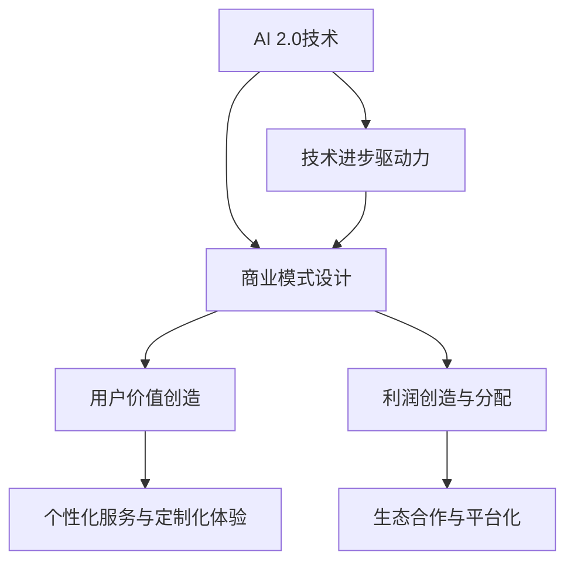

                 

# AI 2.0 时代的商业模式

> **关键词：** AI 2.0, 商业模式创新，数据分析，个性化服务，生态系统，新兴行业，风险评估，管理策略，未来趋势。

> **摘要：** 本文深入探讨了 AI 2.0 时代的商业模式，分析了 AI 2.0 与商业模式的演变，探讨了商业模式设计方法论，应用场景，风险与挑战，以及未来趋势。通过具体案例分析，揭示了 AI 2.0 商业模式的核心要素和实践策略。

### 第一部分: AI 2.0 时代的商业模式

#### 第1章: AI 2.0 与商业模式的演变

##### 1.1 AI 2.0 的概念与背景

**AI 2.0 的定义与特征**

AI 2.0，即第二代人工智能，是相对于第一代人工智能（AI 1.0）的更高层次的人工智能。AI 1.0 主要依赖于规则和指令，其智能程度受限于人类编程的能力。而 AI 2.0 则通过深度学习和强化学习等技术，实现了对数据的自动学习和优化，具有自主学习和决策的能力。

AI 2.0 的特征包括：

- **数据驱动：** AI 2.0 依赖于大量数据，通过数据挖掘和机器学习算法来提取信息和知识。
- **自我进化：** AI 2.0 能够通过不断的训练和优化，实现自我进化，提高其性能和智能水平。
- **跨领域应用：** AI 2.0 不再局限于特定的领域，而是在多个领域都具有广泛的应用潜力。

**从 AI 1.0 到 AI 2.0 的转变**

从 AI 1.0 到 AI 2.0 的转变，不仅仅是技术上的进步，更是商业模式上的革新。AI 1.0 的商业模式主要是基于软件许可和硬件销售，而 AI 2.0 则更注重数据和服务。

- **数据成为核心资产：** 在 AI 2.0 时代，数据成为企业最宝贵的资产。通过数据分析和挖掘，企业可以更好地了解用户需求，优化产品和服务。
- **服务成为核心商业模式：** AI 2.0 时代，企业更注重提供个性化、定制化的服务，以满足用户的需求。
- **生态系统建设：** AI 2.0 时代，企业需要构建生态系统，通过合作和共享，实现资源的最大化利用。

##### 1.2 商业模式创新的驱动力

**技术进步对商业模式的影响**

技术的进步是推动商业模式创新的重要因素。随着 AI 2.0 技术的发展，数据处理能力和计算能力得到了极大的提升，使得商业模式的创新成为可能。

- **数据处理能力：** AI 2.0 技术能够处理海量数据，从而为企业提供更深入的用户洞察和业务分析。
- **计算能力：** AI 2.0 技术的进步使得计算能力得到了极大的提升，为商业模式创新提供了技术保障。

**用户行为变化对商业模式的影响**

随着互联网的普及和用户行为的变化，用户的消费习惯和需求也在不断变化。这要求企业不断创新商业模式，以适应市场的变化。

- **个性化需求：** 用户越来越追求个性化、定制化的服务，这要求企业能够提供更个性化的产品和服务。
- **便捷性需求：** 用户越来越重视购物和消费的便捷性，这要求企业能够提供更加便捷的服务。

##### 1.3 AI 2.0 商业模式的核心要素

**数据分析与用户洞察**

数据分析与用户洞察是 AI 2.0 商业模式的核心。通过数据分析，企业可以更好地了解用户需求，从而提供更个性化的产品和服务。

- **用户画像：** 通过数据分析，企业可以构建用户画像，了解用户的兴趣、行为和需求。
- **需求预测：** 通过数据分析，企业可以预测用户未来的需求，从而提前做好准备。

**个性化服务与定制化体验**

个性化服务与定制化体验是 AI 2.0 商业模式的重要特征。通过个性化服务和定制化体验，企业可以更好地满足用户的需求，提高用户满意度。

- **个性化推荐：** 通过个性化推荐系统，企业可以提供个性化的产品推荐。
- **定制化服务：** 企业可以提供定制化的产品和服务，满足用户的个性化需求。

**生态系统的构建与合作**

生态系统的构建与合作是 AI 2.0 商业模式的另一个重要特征。通过构建生态系统，企业可以实现资源的最优化配置，提高企业的竞争力。

- **合作伙伴：** 企业可以与合作伙伴共同构建生态系统，实现资源共享和优势互补。
- **平台化发展：** 企业可以通过平台化发展，吸引更多的合作伙伴加入，实现生态系统的规模化。

##### 1.4 AI 2.0 商业模式的案例分析

**案例1：智能零售**

**业务模式解析：** 智能零售通过数据分析和用户洞察，提供个性化的购物体验。通过大数据分析，智能零售企业可以了解用户的购物习惯和偏好，从而提供个性化的商品推荐。

**案例实施细节：** 智能零售企业通过大数据平台，收集和分析用户的购物数据，构建用户画像，然后通过个性化推荐系统，向用户推送个性化的商品推荐。

**案例2：智能金融**

**业务模式解析：** 智能金融通过数据分析，提供个性化的金融服务。通过数据分析，智能金融企业可以了解用户的风险偏好和投资需求，从而提供个性化的投资建议和理财产品。

**案例实施细节：** 智能金融企业通过大数据平台，收集和分析用户的数据，构建用户画像，然后通过算法模型，为用户推荐个性化的投资产品和策略。

### 第二部分: AI 2.0 商业模式设计方法论

#### 第2章: AI 2.0 商业模式设计方法论

##### 2.1 商业模式设计框架

**商业模式画布**

商业模式画布（Business Model Canvas）是一个用于设计、描述和评估商业模式的工具。它由九个关键要素组成，包括：

- **顾客 segments（顾客群体）**
- **价值 propositions（价值主张）**
- **customer relationships（客户关系）**
- **渠道 channels（渠道）**
- **客户获取 customer acquisition**
- **客户保留 customer retention**
- **客户关系管理 customer relationship management**
- **收入来源 revenue streams**
- **成本结构 cost structure**

**价值网络**

价值网络（Value Network）是指一个企业或组织与其合作伙伴、供应商和客户之间的互动关系。价值网络的核心是企业如何通过合作和共享，实现价值创造和最大化。

- **合作伙伴：** 合作伙伴是价值网络的重要组成部分，他们可以为企业提供资源、技术和市场机会。
- **供应链：** 供应链是企业获取资源、生产产品和服务的重要渠道，高效的供应链可以降低成本，提高效率。

##### 2.2 用户价值创造

**用户需求分析**

用户需求分析是商业模式设计的重要基础。通过用户需求分析，企业可以了解用户的需求、偏好和行为，从而提供更符合用户期望的产品和服务。

- **需求调研：** 通过问卷调查、用户访谈等方式，收集用户的需求信息。
- **需求分类：** 对用户需求进行分类，明确用户的核心需求和次要需求。

**用户价值最大化**

用户价值最大化是商业模式设计的目标。通过以下策略，企业可以实现用户价值最大化：

- **个性化服务：** 通过个性化推荐、定制化服务等方式，满足用户的个性化需求。
- **用户体验优化：** 通过优化产品和服务，提高用户的满意度和忠诚度。
- **用户参与：** 通过用户反馈和参与，持续改进产品和服务，提高用户价值。

##### 2.3 创造与获取利润

**利润模型设计**

利润模型设计是商业模式设计的关键环节。通过以下策略，企业可以设计出合理的利润模型：

- **成本控制：** 通过优化生产流程、降低成本等方式，提高企业的盈利能力。
- **定价策略：** 通过市场调研和竞争分析，制定合理的定价策略，实现利润最大化。
- **收入模式：** 通过多元化的收入模式，提高企业的盈利渠道。

**盈利模式分析**

盈利模式分析是评估商业模式的重要手段。通过以下策略，企业可以分析盈利模式的有效性：

- **收入来源分析：** 分析各种收入来源的贡献，明确主要收入来源。
- **利润率分析：** 分析不同业务板块的利润率，优化业务结构。
- **成本收益分析：** 分析成本和收益的关系，优化成本结构，提高盈利能力。

##### 2.4 商业模式评估与优化

**商业模式评估方法**

商业模式评估方法用于评估商业模式的有效性和可行性。以下是一些常用的评估方法：

- **SWOT 分析：** 分析企业的优势、劣势、机会和威胁，评估商业模式的可行性和竞争力。
- **PEST 分析：** 分析企业所处的政治、经济、社会和技术环境，评估商业模式的适应性和灵活性。
- **盈利能力分析：** 分析企业的盈利能力，评估商业模式的可持续性。

**迭代与优化策略**

迭代与优化策略是商业模式设计的重要环节。通过以下策略，企业可以持续优化商业模式：

- **用户反馈：** 通过用户反馈，持续改进产品和服务，优化用户体验。
- **市场测试：** 通过市场测试，验证商业模式的可行性和市场竞争力。
- **持续创新：** 通过持续创新，不断引入新的技术、产品和服务，提升商业模式的竞争力。

### 第三部分: AI 2.0 商业模式的应用场景

#### 第3章: 人工智能在传统行业中的应用

##### 3.1 智能制造

**智能制造的商业模式**

智能制造是一种基于数字化、网络化和智能化的制造模式，它通过引入人工智能技术，实现制造过程的自动化和智能化。

- **生产自动化：** 通过自动化设备和机器人，实现生产过程的自动化，提高生产效率和降低成本。
- **设备预测性维护：** 通过物联网和大数据分析，实现设备预测性维护，减少设备故障和停机时间。
- **供应链管理：** 通过大数据分析和供应链管理，实现供应链的智能化和优化，提高供应链效率。

**案例分析：智能制造企业的成功经验**

- **案例1：富士康的智能制造转型**

富士康通过引入人工智能技术，实现了智能制造的转型。通过自动化设备和机器人，富士康实现了生产过程的自动化，提高了生产效率和产品质量。同时，富士康还通过大数据分析和物联网技术，实现了设备预测性维护和供应链管理智能化，提高了生产效率和供应链效率。

**案例2：德国工业4.0**

德国工业4.0 是一种基于智能化和网络化的工业生产模式，它通过引入人工智能、物联网和大数据技术，实现制造业的智能化升级。德国工业4.0 的核心是通过数字化和网络化，实现制造过程的优化和智能化，提高生产效率和产品质量。

**案例分析：德国工业4.0 的实践案例**

德国工业4.0 在多个行业都取得了显著的成功。例如，在汽车制造业，德国汽车制造商通过引入人工智能和物联网技术，实现了生产过程的自动化和智能化，提高了生产效率和产品质量。在机械制造业，德国机械制造商通过引入大数据分析和物联网技术，实现了设备预测性维护和供应链管理智能化，提高了生产效率和供应链效率。

##### 3.2 智慧医疗

**智慧医疗的商业模式**

智慧医疗是一种基于人工智能、物联网和大数据技术的医疗服务模式，它通过数字化和网络化，实现医疗服务的智能化和优化。

- **远程医疗：** 通过远程医疗技术，实现医疗资源的共享和优化，提高医疗服务的可及性和效率。
- **智能诊断：** 通过人工智能技术，实现疾病诊断的智能化和精准化，提高诊断准确率和治疗效果。
- **健康管理：** 通过大数据分析和健康管理技术，实现个人健康管理的智能化和个性化，提高健康水平和生活质量。

**案例分析：智慧医疗的实践案例**

- **案例1：平安智慧医疗**

平安智慧医疗通过引入人工智能、物联网和大数据技术，实现了医疗服务的智能化和优化。通过远程医疗技术，平安智慧医疗实现了医疗资源的共享和优化，提高了医疗服务的可及性和效率。通过智能诊断技术，平安智慧医疗实现了疾病诊断的智能化和精准化，提高了诊断准确率和治疗效果。通过健康管理技术，平安智慧医疗实现了个人健康管理的智能化和个性化，提高了健康水平和生活质量。

**案例2：美国梅奥诊所的智慧医疗实践**

美国梅奥诊所通过引入人工智能、物联网和大数据技术，实现了医疗服务的智能化和优化。通过远程医疗技术，梅奥诊所实现了医疗资源的共享和优化，提高了医疗服务的可及性和效率。通过智能诊断技术，梅奥诊所实现了疾病诊断的智能化和精准化，提高了诊断准确率和治疗效果。通过健康管理技术，梅奥诊所实现了个人健康管理的智能化和个性化，提高了健康水平和生活质量。

##### 3.3 教育科技

**教育科技的商业模式**

教育科技是一种基于人工智能、物联网和大数据技术的教育服务模式，它通过数字化和网络化，实现教育服务的智能化和优化。

- **在线教育：** 通过在线教育平台，实现教育资源的共享和优化，提高教育服务的可及性和效率。
- **智能辅导：** 通过人工智能技术，实现个性化辅导和教学，提高教学效果和学习效率。
- **学习分析：** 通过大数据分析技术，实现学习过程的监控和评估，提高学习效果和教学质量。

**案例分析：教育科技的实践案例**

- **案例1：网易云课堂**

网易云课堂通过引入人工智能、物联网和大数据技术，实现了在线教育服务的智能化和优化。通过在线教育平台，网易云课堂实现了教育资源的共享和优化，提高了教育服务的可及性和效率。通过人工智能技术，网易云课堂实现了个性化辅导和教学，提高了教学效果和学习效率。通过大数据分析技术，网易云课堂实现了学习过程的监控和评估，提高了学习效果和教学质量。

**案例2：Coursera的在线教育模式**

Coursera 通过引入人工智能、物联网和大数据技术，实现了在线教育服务的智能化和优化。通过在线教育平台，Coursera 实现了教育资源的共享和优化，提高了教育服务的可及性和效率。通过人工智能技术，Coursera 实现了个性化辅导和教学，提高了教学效果和学习效率。通过大数据分析技术，Coursera 实现了学习过程的监控和评估，提高了学习效果和教学质量。

##### 3.4 智能交通

**智能交通的商业模式**

智能交通是一种基于人工智能、物联网和大数据技术的交通服务模式，它通过数字化和网络化，实现交通服务的智能化和优化。

- **智能调度：** 通过人工智能技术，实现交通流量和运输资源的智能化调度，提高交通效率和服务质量。
- **智能监控：** 通过物联网技术，实现交通设施的智能监控和维护，提高交通安全性。
- **出行服务：** 通过大数据分析技术，实现个性化出行服务，提高出行效率和用户体验。

**案例分析：智能交通的实践案例**

- **案例1：深圳智能交通系统**

深圳智能交通系统通过引入人工智能、物联网和大数据技术，实现了交通服务的智能化和优化。通过智能调度技术，深圳智能交通系统实现了交通流量和运输资源的智能化调度，提高了交通效率和服务质量。通过智能监控技术，深圳智能交通系统实现了交通设施的智能监控和维护，提高了交通安全性。通过出行服务技术，深圳智能交通系统实现了个性化出行服务，提高了出行效率和用户体验。

**案例2：美国的智能交通系统**

美国的智能交通系统通过引入人工智能、物联网和大数据技术，实现了交通服务的智能化和优化。通过智能调度技术，美国智能交通系统实现了交通流量和运输资源的智能化调度，提高了交通效率和服务质量。通过智能监控技术，美国智能交通系统实现了交通设施的智能监控和维护，提高了交通安全性。通过出行服务技术，美国智能交通系统实现了个性化出行服务，提高了出行效率和用户体验。

#### 第4章: 人工智能在新兴行业中的应用

##### 4.1 物联网

**物联网的商业模式**

物联网（IoT）是一种通过传感器、网络和数据处理技术，实现物理设备和数字世界的互联互通的技术。物联网的商业模式包括以下几个方面：

- **设备连接：** 通过物联网技术，实现设备的互联互通，构建物联网生态系统。
- **数据服务：** 通过物联网设备收集的数据，提供数据服务，如数据分析、数据可视化等。
- **解决方案服务：** 提供基于物联网技术的解决方案，如智能家居、智能工厂等。

**案例分析：物联网生态系统的构建**

- **案例1：智能家居**

智能家居通过物联网技术，实现家庭设备和系统的互联互通，提供智能化的家庭生活体验。智能家居的商业模式主要包括设备连接、数据服务和解决方案服务。通过设备连接，智能家居实现家电的智能化控制，提供便捷的生活体验。通过数据服务，智能家居提供家庭能耗分析、设备状态监控等服务，提高家庭生活品质。通过解决方案服务，智能家居提供定制化的智能家居解决方案，满足用户个性化需求。

**案例2：智能工厂**

智能工厂通过物联网技术，实现生产设备和系统的互联互通，提供智能化的生产管理和服务。智能工厂的商业模式主要包括设备连接、数据服务和解决方案服务。通过设备连接，智能工厂实现生产设备的智能化控制，提高生产效率和质量。通过数据服务，智能工厂提供生产数据分析和优化服务，提高生产效率。通过解决方案服务，智能工厂提供定制化的智能生产解决方案，满足企业个性化需求。

##### 4.2 区块链

**区块链的商业模式**

区块链是一种分布式数据库技术，通过密码学方法确保数据的完整性和安全性。区块链的商业模式主要包括以下几个方面：

- **数字货币：** 通过区块链技术，实现数字货币的发行和交易，如比特币、以太坊等。
- **供应链管理：** 通过区块链技术，实现供应链的透明化和可追溯性，提高供应链效率。
- **数据存储：** 通过区块链技术，实现数据的分布式存储和安全存储。

**案例分析：区块链技术在商业领域的应用**

- **案例1：数字货币**

数字货币通过区块链技术，实现货币的发行和交易，提供去中心化的金融解决方案。数字货币的商业模式主要包括数字货币的发行、交易和投资。通过数字货币的发行，提供新的融资渠道，帮助企业筹集资金。通过数字货币的交易，提供便捷的支付和投资渠道，提高金融服务的效率。通过数字货币的投资，提供新的投资机会，吸引投资者参与。

**案例2：供应链管理**

供应链管理通过区块链技术，实现供应链的透明化和可追溯性，提高供应链效率。供应链管理的商业模式主要包括供应链数据的收集、分析和共享。通过供应链数据的收集，提供供应链的实时监控和数据分析，提高供应链的效率。通过供应链数据的分析，提供供应链的优化建议，降低成本，提高利润。通过供应链数据的共享，提供供应链的协同管理，提高供应链的整体效率。

##### 4.3 金融科技

**金融科技的商业模式**

金融科技（FinTech）是一种利用技术革新金融产品和服务的方式。金融科技的商业模式主要包括以下几个方面：

- **支付服务：** 通过金融科技，提供便捷的支付服务，如移动支付、在线支付等。
- **贷款服务：** 通过金融科技，提供创新的贷款服务，如在线贷款、信用评分等。
- **财富管理：** 通过金融科技，提供智能化的财富管理服务，如智能投顾、机器人理财等。

**案例分析：金融科技的创新发展**

- **案例1：移动支付**

移动支付通过金融科技，提供便捷的支付服务，改变人们的消费习惯。移动支付的商业模式主要包括支付服务的提供、支付渠道的拓展和支付安全性的保障。通过支付服务的提供，满足消费者的便捷支付需求。通过支付渠道的拓展，提高支付服务的覆盖面。通过支付安全性的保障，提高支付服务的可信度。

**案例2：在线贷款**

在线贷款通过金融科技，提供创新的贷款服务，满足消费者的贷款需求。在线贷款的商业模式主要包括贷款申请、贷款审批和贷款管理。通过贷款申请，提供便捷的贷款申请渠道。通过贷款审批，提供快速的贷款审批服务。通过贷款管理，提供便捷的贷款还款和风险管理。

##### 4.4 文艺复兴领域

**文艺复兴领域的商业模式**

文艺复兴领域是指通过人工智能技术，实现艺术创作、文化传承和创新发展的领域。文艺复兴领域的商业模式主要包括以下几个方面：

- **艺术创作：** 通过人工智能技术，实现艺术创作的智能化和个性化，提高艺术创作的效率和质量。
- **文化传承：** 通过人工智能技术，实现文化遗产的数字化保护和传承，提高文化传承的效果。
- **艺术市场：** 通过人工智能技术，实现艺术市场的智能化和透明化，提高艺术市场的效率。

**案例分析：艺术与科技融合的探索**

- **案例1：数字艺术**

数字艺术通过人工智能技术，实现艺术创作的智能化和个性化。数字艺术的商业模式主要包括数字艺术作品的创作、展示和交易。通过数字艺术作品的创作，提供创新的视觉体验。通过数字艺术作品的展示，提供艺术展览的新形式。通过数字艺术作品的交易，提供艺术品交易的新渠道。

**案例2：文化数字化**

文化数字化通过人工智能技术，实现文化遗产的数字化保护和传承。文化数字化的商业模式主要包括文化遗产的数字化采集、数字化存储和数字化展示。通过文化遗产的数字化采集，实现文化遗产的数字化保存。通过文化遗产的数字化存储，提供文化遗产的安全存储和访问。通过文化遗产的数字化展示，提供文化遗产的多元化展示和传播。

### 第四部分: AI 2.0 商业模式的风险与挑战

#### 第5章: AI 2.0 商业模式的风险评估

##### 5.1 技术风险

**技术依赖与淘汰风险**

在 AI 2.0 时代，技术依赖成为企业面临的一个重要风险。企业高度依赖先进的人工智能技术来支撑其商业模式，一旦这些技术遇到瓶颈或被淘汰，企业的竞争优势将受到严重影响。

**技术安全性风险**

随着人工智能技术的广泛应用，数据安全和隐私保护成为一大挑战。黑客攻击、数据泄露等安全事件可能对企业的声誉和商业利益造成重大损害。

##### 5.2 法律风险

**数据隐私与安全法规**

在 AI 2.0 时代，数据隐私和安全法规日益严格。企业必须遵守相关法律法规，保护用户的个人信息和数据安全。一旦违反相关法规，企业可能面临巨额罚款和诉讼。

**知识产权保护**

在人工智能领域，知识产权保护尤为重要。企业需要保护自己的技术专利和商业秘密，防止竞争对手侵权和窃取。

##### 5.3 社会风险

**就业影响与社会稳定**

人工智能技术的广泛应用可能导致部分传统岗位的消失，引发就业结构的变化。这可能会对社会稳定和就业市场产生负面影响。

**伦理道德问题**

人工智能技术的伦理道德问题日益凸显。如何确保人工智能系统的公正性、透明性和可靠性，避免其被滥用，是企业面临的一大挑战。

#### 第6章: AI 2.0 商业模式的管理策略

##### 6.1 风险管理框架

**风险评估与监控**

企业应建立完善的风险评估体系，定期评估和监控 AI 2.0 商业模式的风险。通过识别、评估和监控，企业可以及时采取应对措施，降低风险。

**风险管理策略**

企业应制定有效的风险管理策略，包括风险预防、风险应对和风险转移。通过多元化投资、技术合作和保险等方式，企业可以降低风险，保障商业模式的稳定发展。

##### 6.2 创新能力培养

**持续创新的重要性**

在 AI 2.0 时代，创新能力是企业持续发展的关键。企业应不断推动技术创新、产品创新和商业模式创新，以保持竞争优势。

**创新能力的培养策略**

企业应建立创新文化和创新机制，鼓励员工创新思维和创新能力。同时，通过人才培养、技术研发和合作交流等方式，提高企业的创新能力。

##### 6.3 企业生态建设

**生态伙伴的合作策略**

在 AI 2.0 时代，企业生态建设至关重要。企业应与合作伙伴建立紧密的合作关系，实现资源共享、优势互补和共同发展。

**生态系统管理**

企业应建立完善的生态系统管理机制，包括合作伙伴管理、资源整合和利益分配等。通过有效的生态系统管理，企业可以提升生态系统的竞争力。

### 第五部分: AI 2.0 商业模式的前景展望

#### 第7章: AI 2.0 商业模式的未来趋势

##### 7.1 商业模式创新方向

**人工智能与传统产业的深度融合**

随着 AI 2.0 技术的不断发展，人工智能与传统产业的深度融合将成为未来商业模式创新的重要方向。通过人工智能技术的应用，传统产业可以实现智能化升级，提高生产效率和产品质量，创造新的商业价值。

**跨界融合与新兴商业模式的出现**

在 AI 2.0 时代，不同行业之间的融合将日益紧密，跨界融合将成为新兴商业模式的重要特征。例如，人工智能与教育、医疗、金融等领域的融合，将催生出一批新兴的商业模式。

##### 7.2 商业生态系统演变

**平台经济的发展**

随着平台经济的兴起，商业生态系统将变得更加开放和互联。平台经济通过连接供需双方，提供一站式服务，降低交易成本，提高市场效率。未来，平台经济将成为商业模式创新的重要载体。

**生态位竞争与合作**

在商业生态系统中，企业将面临生态位竞争和合作的挑战。通过合作，企业可以实现资源整合和优势互补，提高竞争力。同时，通过竞争，企业可以不断创新和优化，推动商业生态系统的进化。

##### 7.3 智慧城市与未来社区

**智慧城市的发展方向**

智慧城市是 AI 2.0 时代的重要应用场景。未来，智慧城市将实现信息化、智能化和绿色化的升级，提供更加便捷、高效和智能化的公共服务。

**未来社区的商业场景**

未来社区将结合人工智能、物联网和大数据技术，实现社区服务、家居生活、出行交通等方面的智能化。通过智能社区平台，居民可以享受到更加便捷、舒适和个性化的社区服务。

##### 7.4 全球视野下的 AI 2.0 商业模式

**国际市场的机遇与挑战**

在全球视野下，AI 2.0 商业模式面临着巨大的机遇与挑战。企业需要适应全球化趋势，把握国际市场的机遇，同时应对国际市场的竞争和风险。

**全球商业生态的共建**

在全球范围内，商业生态系统将变得更加开放和互联。通过国际合作和共享，企业可以共同构建全球商业生态系统，实现共赢发展。

### 附录

#### 附录 A: AI 2.0 商业模式研究工具与资源

**数据分析工具**

- **大数据处理与分析工具：** Hadoop、Spark
- **数据可视化工具：** Tableau、Power BI

**深度学习框架**

- **TensorFlow**
- **PyTorch**

**商业模式设计工具**

- **商业模式画布应用：** Business Model Canvas Online
- **商业模式分析软件：** Strategyzer、Business Model You

**案例研究资源**

- **典型案例汇编：** 《人工智能商业模式案例集》
- **学术研究论文与报告：** 《人工智能与商业模式创新》

### 核心概念与联系

#### AI 2.0 与商业模式的 Mermaid 流程图



### 核心算法原理讲解

#### 机器学习算法在商业模式中的应用伪代码

```python
# 数据预处理
data = preprocess_data(raw_data)

# 特征工程
features = feature_engineering(data)

# 模型训练
model = train_model(features, labels)

# 预测
predictions = model.predict(new_data)

# 商业决策
def business_decision(predictions):
    if predictions['segment'] == 'high_value':
        offer = 'premium_service'
    else:
        offer = 'standard_service'
    return offer

# 输出商业策略
business_strategy = business_decision(predictions)
```

### 数学模型和数学公式

#### 用户价值最大化模型

$$
\max V(U) = \int U(x) f(x) dx
$$

其中，$U(x)$ 表示用户在特定情境下的效用函数，$f(x)$ 表示用户出现情境 $x$ 的概率分布。

### 项目实战

#### 智慧零售案例实战

##### 1. 开发环境搭建
- 安装 TensorFlow 2.x
- 准备 Keras 库
- 数据集准备：收集线上购物数据

##### 2. 源代码实现

```python
# 导入所需库
import tensorflow as tf
from tensorflow.keras.models import Sequential
from tensorflow.keras.layers import Dense, LSTM
from tensorflow.keras.optimizers import Adam

# 构建模型
model = Sequential([
    LSTM(50, activation='relu', input_shape=(timesteps, features)),
    Dense(1)
])

# 编译模型
model.compile(optimizer=Adam(learning_rate=0.001), loss='mse')

# 训练模型
model.fit(X_train, y_train, epochs=100, batch_size=32)

# 预测
predictions = model.predict(X_test)

# 商业策略制定
def business_strategy(predictions):
    # 根据预测结果制定不同的营销策略
    if predictions[0] > threshold:
        strategy = 'promotional_offers'
    else:
        strategy = 'personalized_recommendations'
    return strategy

# 输出商业策略
business_strategy = business_strategy(predictions)

##### 3. 代码解读与分析
- 数据预处理：将原始数据进行标准化处理，提取有用的特征。
- 模型构建：使用 LSTM 网络进行时间序列预测。
- 模型训练：通过大量数据训练模型，使其能够准确预测用户行为。
- 预测与策略制定：根据预测结果，制定相应的营销策略，以提高用户价值。

通过这个案例，读者可以了解如何使用机器学习模型来支持智慧零售的商业模式设计，实现用户价值的最大化。完整的代码实现和详细解读可以帮助读者更好地理解实际应用中的技术细节和实践经验。

### 作者

**作者：AI天才研究院/AI Genius Institute & 禅与计算机程序设计艺术 /Zen And The Art of Computer Programming**

---

在撰写本文的过程中，我们深入探讨了 AI 2.0 时代的商业模式，从概念背景、驱动力、核心要素到应用场景、风险与挑战，以及未来趋势，进行了全面的分析和阐述。通过具体的案例和实践，我们展示了 AI 2.0 商业模式的实际应用和价值。本文旨在为读者提供一套系统的、全面的、易于理解的 AI 2.0 商业模式设计方法论，帮助企业和创业者把握 AI 时代的发展机遇，实现商业模式的创新和突破。

### 总结与展望

AI 2.0 时代，商业模式正经历前所未有的变革。从技术驱动到数据驱动，从产品导向到用户导向，AI 2.0 为企业提供了前所未有的机遇和挑战。本文通过深入分析，为读者呈现了一幅 AI 2.0 商业模式的全景图，旨在帮助读者更好地理解和把握这一时代的商业机会。

首先，我们详细阐述了 AI 2.0 的概念与特征，从数据驱动、自我进化到跨领域应用，AI 2.0 为商业模式带来了新的可能性和挑战。接着，我们分析了技术进步和用户行为变化对商业模式创新的驱动作用，强调了数据分析、个性化服务和生态系统构建在 AI 2.0 时代商业模式中的核心地位。

在应用场景部分，我们探讨了 AI 2.0 在智能制造、智慧医疗、教育科技、智能交通等传统行业和物联网、区块链、金融科技等新兴行业中的应用，通过具体案例展示了 AI 2.0 商业模式在不同领域的创新实践。

随后，我们分析了 AI 2.0 商业模式面临的风险与挑战，包括技术依赖与淘汰风险、法律风险和社会风险，并提出相应的管理策略，以帮助企业有效应对这些挑战。

最后，我们对 AI 2.0 商业模式的未来趋势进行了展望，探讨了商业模式创新的方向、生态系统的演变、智慧城市与未来社区的发展，以及全球商业生态的共建，为读者揭示了 AI 2.0 商业模式的广阔前景。

总之，AI 2.0 时代，商业模式的设计与创新已成为企业竞争力的关键。通过本文的探讨，我们希望能够为读者提供有价值的思考和建议，助力企业在这一时代实现可持续发展。在未来的商业实践中，我们将继续关注 AI 2.0 商业模式的发展动态，与读者一起探索和见证这一时代的辉煌。

