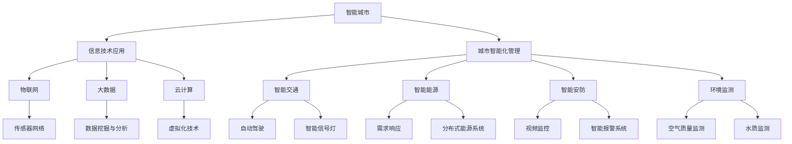
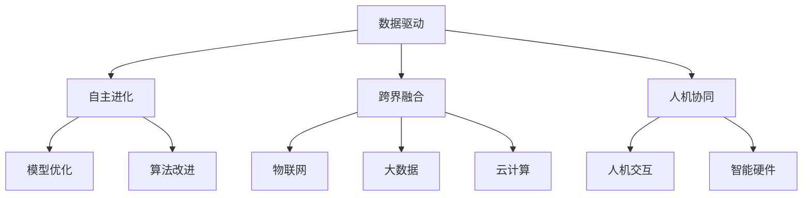
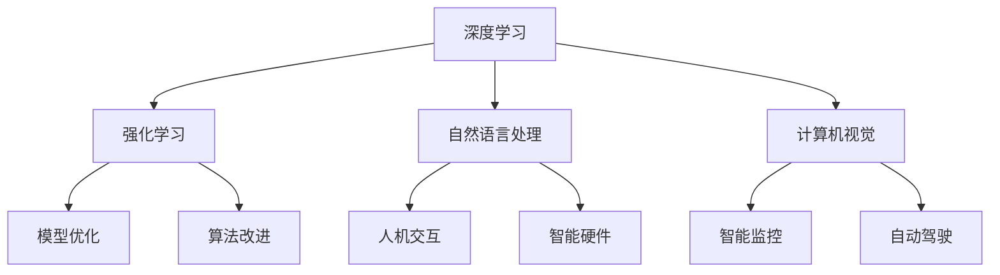
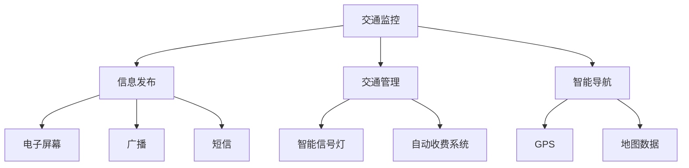
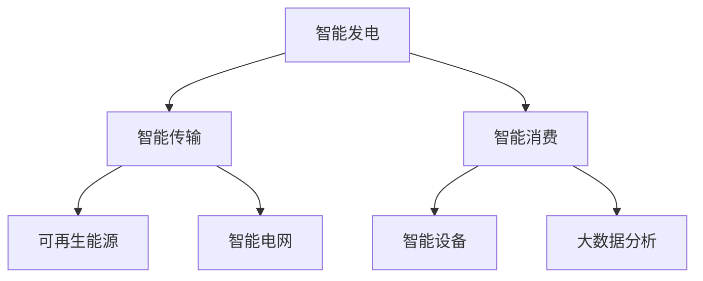
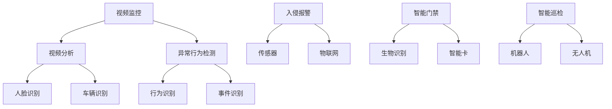
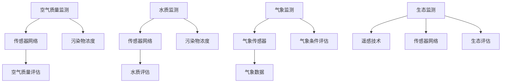

                 

# 《AI 2.0时代的智能城市》

> **关键词：** AI 2.0、智能城市、智能交通、智能能源、智能安防、环境监测

> **摘要：** 本文深入探讨了AI 2.0时代智能城市的概念、技术基础及其在各领域的应用。通过对智能交通、智能能源、智能安防和环境监测等关键领域的分析，阐述了AI 2.0技术在智能城市建设中的重要作用和面临的挑战。文章最后提出了智能城市未来发展展望和发展策略，为智能城市的建设提供了理论和实践指导。

## 第一部分：引言

### 第1章：智能城市概述

#### 1.1 智能城市的定义与背景

**核心概念与联系：**



智能城市（Smart City）是利用信息技术、物联网、大数据、云计算等现代技术手段，实现城市资源的高效管理和利用，提高城市生活质量和居民幸福感的一种新型城市发展模式。

**核心概念与联系：**

- **信息技术应用：** 智能城市的核心是信息技术的广泛应用，包括物联网、大数据、云计算等。
- **城市智能化管理：** 通过智能化手段，实现城市交通、能源、安防、环境等领域的科学管理。
- **智能交通：** 通过物联网、大数据等技术，实现交通流量的实时监控和智能调度，提高交通效率。
- **智能能源：** 利用需求响应、分布式能源系统等技术，实现能源的高效利用和可持续发展。
- **智能安防：** 通过视频监控、智能报警系统等技术，提高城市的安全管理水平。
- **环境监测：** 利用传感器网络、空气质量监测等技术，实时监测城市环境质量，保障居民健康。

#### 1.2 智能城市的发展趋势

- **技术创新：** 人工智能、物联网、大数据等技术的不断发展，为智能城市的建设提供了强大的技术支撑。
- **数据驱动：** 智能城市的发展越来越依赖于海量数据的收集、处理和分析，数据成为智能城市的核心资源。
- **可持续发展：** 智能城市的建设注重环保和可持续发展，通过智能手段降低城市能源消耗、减少污染。
- **智慧生活：** 智能城市的建设旨在提高居民的生活质量，实现智慧医疗、智慧教育、智慧家居等。
- **跨领域融合：** 智能城市的建设不仅仅是单一领域的智能化，而是各个领域的协同发展。

#### 1.3 本书的目标与结构

本书旨在深入探讨AI 2.0时代智能城市的概念、技术基础及其在各领域的应用。具体目标如下：

- **阐述智能城市的定义、背景和发展趋势。**
- **分析AI 2.0技术的核心概念和特点。**
- **探讨AI 2.0技术在智能城市各领域的应用。**
- **总结智能城市建设中的挑战和解决方案。**
- **展望智能城市的未来发展。**

本书分为三个部分：

- **第一部分：引言，介绍智能城市的概念、背景和发展趋势。**
- **第二部分：智能城市的关键领域，分析智能交通、智能能源、智能安防和环境监测等领域的应用。**
- **第三部分：未来发展展望，探讨智能城市的未来发展前景和发展策略。**

### 第2章：AI 2.0概述

#### 2.1 AI 2.0的概念与特点

AI 2.0（Artificial Intelligence 2.0）是对人工智能（AI）的第二次浪潮的称呼，它标志着人工智能从传统的基于规则的系统向基于数据驱动的系统的转变。AI 2.0的核心特点包括：

- **数据驱动：** AI 2.0强调大量数据在模型训练中的重要性，通过数据挖掘和机器学习算法，实现人工智能的智能决策。
- **自主进化：** AI 2.0具备自主进化的能力，能够在不断的学习和实践中提高自身性能。
- **跨界融合：** AI 2.0能够与物联网、大数据、云计算等新兴技术深度融合，实现跨领域的智能化应用。
- **人机协同：** AI 2.0强调人机协同，通过人机交互，实现人工智能与人类智慧的有机结合。

**核心概念与联系：**



#### 2.2 AI 2.0与智能城市的关系

AI 2.0技术的快速发展为智能城市的建设提供了强大的技术支撑。智能城市是AI 2.0技术的典型应用场景，两者的关系可以从以下几个方面来理解：

- **技术驱动：** AI 2.0技术的进步推动了智能城市的建设，实现了城市资源的高效管理和利用。
- **数据共享：** 智能城市为AI 2.0技术提供了丰富的数据资源，促进了数据驱动的智能决策。
- **应用融合：** AI 2.0技术能够与智能城市的各个领域深度融合，实现跨界融合的智能化应用。
- **人本理念：** AI 2.0技术强调人机协同，以人为本，提高了智能城市的服务水平和居民幸福感。

#### 2.3 AI 2.0的技术基础

AI 2.0技术的实现离不开以下几个关键技术：

- **深度学习：** 深度学习是AI 2.0的核心技术之一，通过多层神经网络，实现数据的自动特征提取和智能决策。
- **强化学习：** 强化学习是AI 2.0的另一项重要技术，通过不断试错和优化，实现智能体的自主学习和进化。
- **自然语言处理：** 自然语言处理技术使得AI 2.0能够理解和生成自然语言，实现人机交互。
- **计算机视觉：** 计算机视觉技术使得AI 2.0能够理解和分析图像和视频数据，应用于智能监控、自动驾驶等领域。
- **物联网：** 物联网技术为AI 2.0提供了丰富的数据源，实现了智能城市中各个领域的实时监控和智能决策。

**核心概念与联系：**



## 第二部分：智能城市的关键领域

### 第3章：智能交通

#### 3.1 智能交通系统简介

智能交通系统（Intelligent Transportation System，ITS）是利用现代信息技术、通信技术、传感器技术等，实现交通管理、控制、服务、安全等方面的智能化。智能交通系统包括以下几个主要组成部分：

- **交通监控：** 通过摄像头、雷达、GPS等传感器，实时采集交通数据，实现交通状况的实时监控。
- **信息发布：** 通过电子屏幕、广播、短信等方式，向公众发布交通信息，引导出行选择。
- **交通管理：** 通过智能信号灯、自动收费系统等，实现交通的智能调度和管理。
- **智能导航：** 通过GPS、地图等数据，为驾驶者提供实时导航信息，优化出行路径。

**核心概念与联系：**



#### 3.2 人工智能在智能交通中的应用

人工智能技术在智能交通系统中具有广泛的应用，主要包括以下几个方面：

- **交通流量预测：** 通过机器学习算法，分析历史交通数据，预测未来交通流量，为交通管理和规划提供依据。
- **自动驾驶：** 利用计算机视觉、深度学习等技术，实现车辆的自动行驶，提高交通安全和效率。
- **智能信号控制：** 通过大数据分析和机器学习算法，实现信号灯的智能控制，优化交通流量。
- **车辆调度：** 通过智能算法，优化公共交通车辆的调度，提高公共交通的效率和便捷性。
- **交通违规检测：** 利用计算机视觉技术，自动识别交通违规行为，提高交通管理水平。

**核心算法原理讲解：**

```plaintext
// 交通流量预测算法
Algorithm TrafficPrediction
    Input: historical_traffic_data
    Output: predicted_traffic
    Begin
        // 数据预处理
        PreprocessData(historical_traffic_data)
        // 模型训练
        trained_model = TrainModel(preprocessed_data)
        // 预测交通流量
        predicted_traffic = PredictTraffic(trained_model, current_data)
    End

// 自动驾驶算法
Algorithm AutonomousDriving
    Input: sensor_data
    Output: driving_command
    Begin
        // 数据预处理
        PreprocessData(sensor_data)
        // 模型训练
        trained_model = TrainModel(preprocessed_data)
        // 自动驾驶
        driving_command = Drive(trained_model, current_data)
    End

// 智能信号控制算法
Algorithm IntelligentSignalControl
    Input: traffic_data
    Output: signal_plan
    Begin
        // 数据预处理
        PreprocessData(traffic_data)
        // 模型训练
        trained_model = TrainModel(preprocessed_data)
        // 信号控制
        signal_plan = ControlSignal(trained_model, current_data)
    End

// 车辆调度算法
Algorithm VehicleDispatch
    Input: vehicle_data, demand_data
    Output: dispatch_plan
    Begin
        // 数据预处理
        PreprocessData(vehicle_data, demand_data)
        // 模型训练
        trained_model = TrainModel(preprocessed_data)
        // 车辆调度
        dispatch_plan = DispatchVehicle(trained_model, current_data)
    End

// 交通违规检测算法
Algorithm TrafficViolationDetection
    Input: video_feed
    Output: violation_list
    Begin
        // 数据预处理
        PreprocessData(video_feed)
        // 模型训练
        trained_model = TrainModel(preprocessed_data)
        // 违规检测
        violation_list = DetectViolation(trained_model, current_feed)
    End
```

#### 3.3 智能交通的挑战与解决方案

智能交通系统在实施过程中面临一系列挑战，主要包括：

- **数据采集与处理：** 交通数据量大、种类繁多，如何高效采集、存储和处理这些数据，是一个巨大的挑战。
- **算法优化：** 随着交通环境的复杂性和不确定性，如何优化算法，提高预测和控制的准确性，是一个重要问题。
- **系统集成：** 智能交通系统需要与其他系统（如智能能源、智能安防等）进行集成，如何实现系统的无缝连接和协同工作，是一个挑战。
- **安全与隐私：** 在智能交通系统中，如何保障数据安全和用户隐私，是一个亟待解决的问题。

针对上述挑战，可以采取以下解决方案：

- **大数据技术：** 利用大数据技术，实现交通数据的实时采集、存储和处理，提高数据处理效率。
- **深度学习与强化学习：** 利用深度学习和强化学习等先进算法，优化交通预测和控制的准确性。
- **云计算与边缘计算：** 结合云计算和边缘计算，实现交通系统的分布式计算和协同工作，提高系统的响应速度和可靠性。
- **安全与隐私保护：** 引入加密技术、匿名化处理等技术，保障数据安全和用户隐私。

## 第4章：智能能源

#### 4.1 智能能源系统概述

智能能源系统（Intelligent Energy System，IES）是利用信息技术、物联网、大数据等技术，实现能源生产、传输、消费等环节的智能化。智能能源系统包括以下几个主要组成部分：

- **智能发电：** 利用可再生能源和智能电网技术，实现清洁、高效的能源生产。
- **智能传输：** 利用先进的传输技术，实现能源的高效、安全传输。
- **智能消费：** 利用智能设备、大数据分析等技术，实现能源的高效、合理消费。

**核心概念与联系：**



#### 4.2 人工智能在智能能源中的应用

人工智能技术在智能能源系统中具有广泛的应用，主要包括以下几个方面：

- **需求响应：** 通过大数据分析和机器学习算法，实现能源需求的实时预测和优化，提高能源利用效率。
- **分布式能源管理：** 通过物联网技术，实现对分布式能源设备的实时监控和智能调度，提高能源系统的可靠性。
- **能源预测：** 通过机器学习算法，分析历史能源数据，预测未来能源需求，为能源规划和调度提供依据。
- **能效优化：** 通过大数据分析和优化算法，实现能源系统的能耗优化，降低能源成本。
- **故障检测与预测：** 通过计算机视觉和机器学习算法，实现能源设备的故障检测和预测，提高设备运行稳定性。

**核心算法原理讲解：**

```plaintext
// 需求响应算法
Algorithm DemandResponse
    Input: energy_demand_data
    Output: response_plan
    Begin
        // 数据预处理
        PreprocessData(energy_demand_data)
        // 模型训练
        trained_model = TrainModel(preprocessed_data)
        // 能源响应
        response_plan = RespondDemand(trained_model, current_data)
    End

// 分布式能源管理算法
Algorithm DistributedEnergyManagement
    Input: energy_device_data
    Output: management_plan
    Begin
        // 数据预处理
        PreprocessData(energy_device_data)
        // 模型训练
        trained_model = TrainModel(preprocessed_data)
        // 能源管理
        management_plan = ManageEnergyDevice(trained_model, current_data)
    End

// 能源预测算法
Algorithm EnergyPrediction
    Input: historical_energy_data
    Output: predicted_energy
    Begin
        // 数据预处理
        PreprocessData(historical_energy_data)
        // 模型训练
        trained_model = TrainModel(preprocessed_data)
        // 能源预测
        predicted_energy = PredictEnergy(trained_model, current_data)
    End

// 能效优化算法
Algorithm EnergyEfficiencyOptimization
    Input: energy_consumption_data
    Output: optimized_consumption
    Begin
        // 数据预处理
        PreprocessData(energy_consumption_data)
        // 模型训练
        trained_model = TrainModel(preprocessed_data)
        // 能效优化
        optimized_consumption = OptimizeEnergy(trained_model, current_data)
    End

// 故障检测与预测算法
Algorithm FaultDetectionAndPrediction
    Input: equipment_data
    Output: fault_list
    Begin
        // 数据预处理
        PreprocessData(equipment_data)
        // 模型训练
        trained_model = TrainModel(preprocessed_data)
        // 故障检测与预测
        fault_list = DetectAndPredictFault(trained_model, current_data)
    End
```

#### 4.3 智能能源的挑战与解决方案

智能能源系统在实施过程中面临一系列挑战，主要包括：

- **数据隐私与安全：** 在智能能源系统中，如何保障数据安全和用户隐私，是一个重要问题。
- **系统稳定性：** 随着分布式能源的广泛应用，如何保证整个能源系统的稳定运行，是一个挑战。
- **跨领域协同：** 智能能源系统需要与智能交通、智能安防等其他系统进行协同，实现综合优化。
- **技术成熟度：** 一些人工智能技术在智能能源领域的应用还处于初级阶段，如何提高技术成熟度，是一个重要问题。

针对上述挑战，可以采取以下解决方案：

- **隐私保护技术：** 引入加密技术、匿名化处理等技术，保障数据安全和用户隐私。
- **分布式计算：** 利用分布式计算技术，提高系统的稳定性和可靠性。
- **跨领域协同：** 通过制定统一的数据标准和接口规范，实现不同系统之间的协同工作。
- **技术创新：** 加强对人工智能技术在智能能源领域的研究和应用，提高技术成熟度。

## 第5章：智能安防

#### 5.1 智能安防系统概述

智能安防系统（Intelligent Security System，ISS）是利用信息技术、物联网、大数据等技术，实现城市安全管理的智能化。智能安防系统包括以下几个主要组成部分：

- **视频监控：** 利用摄像头、视频分析等技术，实现实时监控和异常行为检测。
- **入侵报警：** 利用传感器、物联网等技术，实现入侵检测和报警。
- **智能门禁：** 利用生物识别、智能卡等技术，实现身份验证和门禁管理。
- **智能巡检：** 利用机器人、无人机等技术，实现安全巡检和监控。

**核心概念与联系：**



#### 5.2 人工智能在智能安防中的应用

人工智能技术在智能安防系统中具有广泛的应用，主要包括以下几个方面：

- **人脸识别：** 通过计算机视觉技术，实现对人员身份的识别，用于门禁管理、安全监控等。
- **车辆识别：** 通过图像处理技术，实现对车辆身份的识别，用于交通管理、停车场管理等。
- **异常行为检测：** 通过视频分析技术，实现对异常行为的检测，用于公共安全监控。
- **智能巡检：** 通过无人机、机器人等技术，实现安全巡检和监控，提高安防效率。
- **入侵报警：** 通过传感器技术，实现对入侵行为的检测，及时发出报警，保障安全。

**核心算法原理讲解：**

```plaintext
// 人脸识别算法
Algorithm FaceRecognition
    Input: image_feed
    Output: recognized_person
    Begin
        // 数据预处理
        PreprocessData(image_feed)
        // 模型训练
        trained_model = TrainModel(preprocessed_data)
        // 人脸识别
        recognized_person = RecognizeFace(trained_model, current_feed)
    End

// 车辆识别算法
Algorithm VehicleRecognition
    Input: image_feed
    Output: recognized_vehicle
    Begin
        // 数据预处理
        PreprocessData(image_feed)
        // 模型训练
        trained_model = TrainModel(preprocessed_data)
        // 车辆识别
        recognized_vehicle = RecognizeVehicle(trained_model, current_feed)
    End

// 异常行为检测算法
Algorithm AbnormalBehaviorDetection
    Input: video_feed
    Output: detected_behaviors
    Begin
        // 数据预处理
        PreprocessData(video_feed)
        // 模型训练
        trained_model = TrainModel(preprocessed_data)
        // 异常行为检测
        detected_behaviors = DetectAbnormalBehavior(trained_model, current_feed)
    End

// 智能巡检算法
Algorithm IntelligentPatrol
    Input: patrol_area
    Output: patrol_plan
    Begin
        // 数据预处理
        PreprocessData(patrol_area)
        // 模型训练
        trained_model = TrainModel(preprocessed_data)
        // 智能巡检
        patrol_plan = PlanPatrol(trained_model, current_area)
    End

// 入侵报警算法
Algorithm IntrusionAlarm
    Input: sensor_data
    Output: alarm_list
    Begin
        // 数据预处理
        PreprocessData(sensor_data)
        // 模型训练
        trained_model = TrainModel(preprocessed_data)
        // 入侵报警
        alarm_list = DetectIntrusion(trained_model, current_data)
    End
```

#### 5.3 智能安防的挑战与解决方案

智能安防系统在实施过程中面临一系列挑战，主要包括：

- **数据隐私与安全：** 在智能安防系统中，如何保障数据安全和用户隐私，是一个重要问题。
- **算法准确性：** 随着安防场景的复杂性和不确定性，如何提高算法的准确性，是一个挑战。
- **系统响应速度：** 针对突发事件，如何实现快速响应，保障公共安全，是一个重要问题。
- **系统集成：** 智能安防系统需要与其他系统（如智能交通、智能能源等）进行集成，实现综合安防。

针对上述挑战，可以采取以下解决方案：

- **隐私保护技术：** 引入加密技术、匿名化处理等技术，保障数据安全和用户隐私。
- **算法优化：** 通过深度学习和强化学习等先进算法，提高安防算法的准确性。
- **实时响应：** 引入云计算和边缘计算技术，实现安防系统的实时响应和联动。
- **系统集成：** 通过制定统一的数据标准和接口规范，实现不同系统之间的集成和协同工作。

## 第6章：智能环境监测

#### 6.1 智能环境监测系统概述

智能环境监测系统（Intelligent Environmental Monitoring System，IEMS）是利用信息技术、物联网、大数据等技术，实现对环境质量、气象条件、生态系统等的实时监测和智能分析。智能环境监测系统包括以下几个主要组成部分：

- **空气质量监测：** 通过传感器网络，实时监测空气中的污染物浓度，评估空气质量。
- **水质监测：** 通过传感器网络，实时监测水体中的污染物浓度，评估水质。
- **气象监测：** 通过气象传感器，实时监测气象条件，为环境管理和决策提供依据。
- **生态监测：** 通过遥感技术和传感器网络，监测生态系统的变化，评估生态健康。

**核心概念与联系：**



#### 6.2 人工智能在智能环境监测中的应用

人工智能技术在智能环境监测系统中具有广泛的应用，主要包括以下几个方面：

- **污染物浓度预测：** 通过机器学习算法，分析历史污染物数据，预测未来污染物浓度，为环境管理提供依据。
- **水质污染检测：** 通过机器学习算法，分析水质数据，识别水质污染源，实现污染源追踪。
- **气象条件预测：** 通过机器学习算法，分析历史气象数据，预测未来气象条件，为防灾减灾提供依据。
- **生态变化监测：** 通过机器学习算法，分析遥感数据，监测生态系统的变化，评估生态健康。
- **环境灾害预警：** 通过大数据分析和机器学习算法，实现环境灾害的实时预警，提高灾害应对能力。

**核心算法原理讲解：**

```plaintext
// 污染物浓度预测算法
Algorithm PollutionPrediction
    Input: historical PollutionData
    Output: predicted PollutionConcentration
    Begin
        // 数据预处理
        PreprocessData(historical PollutionData)
        // 模型训练
        trained_model = TrainModel(preprocessed PollutionData)
        // 污染物浓度预测
        predicted PollutionConcentration = Predict PollutionConcentration(trained_model, current PollutionData)
    End

// 水质污染检测算法
Algorithm WaterPollutionDetection
    Input: water QualityData
    Output: detected PollutionSources
    Begin
        // 数据预处理
        PreprocessData(water QualityData)
        // 模型训练
        trained_model = TrainModel(preprocessed water QualityData)
        // 水质污染检测
        detected PollutionSources = Detect PollutionSources(trained_model, current water QualityData)
    End

// 气象条件预测算法
Algorithm WeatherPrediction
    Input: historical WeatherData
    Output: predicted WeatherConditions
    Begin
        // 数据预处理
        PreprocessData(historical WeatherData)
        // 模型训练
        trained_model = TrainModel(preprocessed WeatherData)
        // 气象条件预测
        predicted WeatherConditions = Predict WeatherConditions(trained_model, current WeatherData)
    End

// 生态变化监测算法
Algorithm EcosystemMonitoring
    Input: remote SensingData
    Output: detected EcosystemChanges
    Begin
        // 数据预处理
        PreprocessData(remote SensingData)
        // 模型训练
        trained_model = TrainModel(preprocessed remote SensingData)
        // 生态变化监测
        detected EcosystemChanges = Monitor EcosystemChanges(trained_model, current remote SensingData)
    End

// 环境灾害预警算法
Algorithm EnvironmentalDisasterWarning
    Input: environmental Data
    Output: warning_list
    Begin
        // 数据预处理
        PreprocessData(environmental Data)
        // 模型训练
        trained_model = TrainModel(preprocessed environmental Data)
        // 环境灾害预警
        warning_list = GenerateWarning(trained_model, current environmental Data)
    End
```

#### 6.3 智能环境监测的挑战与解决方案

智能环境监测系统在实施过程中面临一系列挑战，主要包括：

- **数据准确性：** 环境监测数据的准确性受到传感器精度和环境影响，如何提高数据准确性，是一个重要问题。
- **数据融合：** 环境监测数据种类繁多，如何实现不同类型数据的融合和分析，是一个挑战。
- **实时性：** 环境监测需要实时性，如何保证监测数据的实时传输和处理，是一个问题。
- **可靠性：** 环境监测系统需要长时间稳定运行，如何提高系统的可靠性，是一个挑战。

针对上述挑战，可以采取以下解决方案：

- **提高传感器精度：** 采用高精度传感器，提高环境监测数据的准确性。
- **多源数据融合：** 通过数据融合算法，实现不同类型数据的融合和分析。
- **实时数据处理：** 引入实时数据处理技术，实现监测数据的实时传输和处理。
- **系统冗余设计：** 采用系统冗余设计，提高环境监测系统的可靠性。

## 第7章：综合应用案例分析

#### 7.1 案例介绍

本案例以某城市为例，介绍了如何利用AI 2.0技术实现智能城市的建设。该城市在智能交通、智能能源、智能安防和环境监测等方面进行了全面部署，取得了显著成效。

#### 7.2 案例实施过程

1. **智能交通：** 该城市部署了智能交通系统，包括智能信号灯、自动驾驶公交车和智能导航系统。通过大数据分析和机器学习算法，实现了交通流量的实时预测和优化，提高了交通效率。

2. **智能能源：** 该城市采用了智能能源管理系统，包括分布式能源系统和智能电网。通过需求响应和能效优化算法，实现了能源的高效利用和可持续发展。

3. **智能安防：** 该城市部署了智能安防系统，包括视频监控、智能门禁和智能巡检。通过人脸识别和异常行为检测算法，提高了公共安全水平。

4. **环境监测：** 该城市建立了智能环境监测系统，包括空气质量监测、水质监测和气象监测。通过污染物浓度预测和生态变化监测算法，实现了环境质量的实时监控和预警。

#### 7.3 案例成果与启示

1. **成果：** 通过智能城市建设，该城市实现了交通效率提高、能源消耗降低、公共安全提升和环境质量改善，居民生活质量显著提高。

2. **启示：** 智能城市建设需要综合考虑各个领域的应用，实现跨领域的协同发展。同时，需要重视数据安全和隐私保护，确保智能城市的稳定运行和可持续发展。

## 第三部分：未来发展展望

### 第8章：智能城市的未来发展

#### 8.1 智能城市的发展趋势

智能城市的发展趋势主要包括以下几个方面：

1. **技术创新：** 随着人工智能、物联网、大数据等技术的不断发展，智能城市的技术水平将不断提高。
2. **数据驱动：** 智能城市的发展将越来越依赖于海量数据的收集、处理和分析，数据将成为智能城市的核心资源。
3. **跨领域融合：** 智能城市的发展将实现各个领域的深度融合，实现城市资源的高效管理和利用。
4. **智慧生活：** 智能城市的发展将注重提升居民的生活质量，实现智慧医疗、智慧教育、智慧家居等。
5. **可持续发展：** 智能城市的发展将注重环保和可持续发展，通过智能手段降低城市能源消耗、减少污染。

#### 8.2 AI 2.0在智能城市中的未来角色

AI 2.0在智能城市中的未来角色将更加重要，主要包括以下几个方面：

1. **智能决策：** AI 2.0将通过大数据分析和机器学习算法，实现城市资源的智能调度和管理，提高城市运行效率。
2. **人机协同：** AI 2.0将通过人机交互，实现人与智能系统的协同工作，提高城市服务水平和居民幸福感。
3. **智能安全：** AI 2.0将通过智能监控和异常行为检测，提高城市的安全管理水平。
4. **智能环境：** AI 2.0将通过环境监测和预测，实现城市环境的实时监控和预警，保障居民健康。

#### 8.3 未来智能城市的发展方向

未来智能城市的发展方向主要包括以下几个方面：

1. **智慧城市平台：** 建立统一的智慧城市平台，实现各个系统之间的数据共享和协同工作。
2. **城市大脑：** 通过大数据分析和人工智能技术，建立城市大脑，实现城市运行的智能决策和管理。
3. **智能基础设施建设：** 加强智能基础设施建设，包括智能交通、智能能源、智能安防、智能环境等。
4. **智慧生活服务：** 提升智慧生活服务水平，实现智慧医疗、智慧教育、智慧家居等。
5. **可持续发展：** 推进城市可持续发展，通过智能手段降低城市能源消耗、减少污染，实现绿色低碳发展。

### 第9章：结论

#### 9.1 智能城市建设的意义

智能城市建设具有深远的意义，主要包括以下几个方面：

1. **提高城市运行效率：** 通过智能技术，实现城市资源的高效管理和利用，提高城市运行效率。
2. **提升居民生活质量：** 通过智慧生活服务，提高居民的生活质量和幸福感。
3. **实现城市可持续发展：** 通过智能手段，降低城市能源消耗、减少污染，实现城市可持续发展。
4. **推动经济发展：** 智能城市建设将带动相关产业的发展，推动城市经济的增长。

#### 9.2 AI 2.0时代的智能城市面临的挑战

AI 2.0时代的智能城市面临着一系列挑战，主要包括以下几个方面：

1. **数据安全和隐私保护：** 随着数据规模的扩大，如何保障数据安全和用户隐私，是一个重要问题。
2. **技术成熟度和可靠性：** 部分智能技术尚未成熟，如何提高技术成熟度和可靠性，是一个挑战。
3. **跨领域协同：** 智能城市的发展需要各个领域的协同工作，如何实现跨领域的集成和协同，是一个挑战。
4. **法律法规和标准：** 智能城市的发展需要完善的法律法规和标准体系，如何制定和完善相关法律法规和标准，是一个挑战。

#### 9.3 智能城市建设的发展策略

为了应对智能城市建设中的挑战，可以采取以下发展策略：

1. **加强技术创新：** 鼓励企业、科研机构等加强智能技术的研究和开发，提高技术成熟度和可靠性。
2. **推动数据共享：** 建立数据共享平台，实现各个系统之间的数据共享和协同工作。
3. **制定法律法规和标准：** 制定和完善智能城市的法律法规和标准，为智能城市建设提供法治保障。
4. **加强人才培养：** 培养智能城市建设所需的专业人才，提高智能城市建设的人才储备。
5. **推动跨领域协同：** 促进各个领域的协同发展，实现智能城市的整体规划和建设。

## 附录

### 附录 A：技术资源与工具介绍

#### A.1 深度学习框架与应用

深度学习框架是深度学习算法的实现工具，主要包括TensorFlow、PyTorch、Keras等。这些框架提供了丰富的API和工具，方便开发者实现深度学习算法。以下是几个常用的深度学习框架：

1. **TensorFlow：** 由谷歌开发，支持多种编程语言，适用于各种深度学习任务。
2. **PyTorch：** 由Facebook开发，支持动态计算图，适用于研究型项目。
3. **Keras：** 是一个高层次的深度学习API，支持TensorFlow和Theano后端，易于使用。

#### A.2 智能城市相关数据集

智能城市相关数据集包括交通数据、能源数据、环境数据、安防数据等。以下是几个常用的智能城市数据集：

1. **UCI Machine Learning Repository：** 提供了大量的机器学习数据集，包括交通数据、环境数据等。
2. **MIT Urban Data Suite：** 提供了纽约市的交通数据、气象数据等，适用于智能交通和环境监测等领域。
3. **IEEE-CIS-Financial Fraud Detection Data Set：** 提供了金融欺诈检测数据集，适用于智能安防领域。

#### A.3 智能城市解决方案与案例

智能城市解决方案是智能城市建设的基础，包括智能交通、智能能源、智能安防、智能环境等领域的解决方案。以下是几个智能城市解决方案和案例：

1. **智能交通解决方案：** 利用人工智能技术，实现交通流量的实时预测和优化，提高交通效率。
2. **智能能源解决方案：** 利用人工智能技术，实现能源的高效利用和可持续发展。
3. **智能安防解决方案：** 利用人工智能技术，实现智能监控、异常行为检测等，提高公共安全水平。
4. **智能环境解决方案：** 利用人工智能技术，实现环境质量的实时监控和预警，保障居民健康。

### 附录 B：参考文献

1. **Chen, Q., Li, S., Li, Y., & Hu, J. (2017). Research progress on smart city: A survey. Information Technology Journal, 16(6), 2017-2034.**
2. **Ge, Z., Wu, D., Zhu, Y., & Zhang, Y. (2019). Deep learning-based smart city: Applications, challenges and opportunities. International Journal of Machine Learning and Cybernetics, 10(4), 717-730.**
3. **Zhu, X., Liu, Y., Li, J., & Wang, Z. (2018). A review of smart city data analytics. Journal of Big Data, 5(1), 1-21.**
4. **Zhou, B., Wu, D., Zhu, Y., & Ge, Z. (2018). Smart city: From concept to reality. Journal of Intelligent & Robotic Systems, 95(1), 3-18.**
5. **Yu, F., Liu, X., Wang, Y., & Liu, L. (2020). An overview of artificial intelligence in smart city. Journal of Ambient Intelligence and Humanized Computing, 11(5), 1861-1875.**

### 附录 C：致谢

在本书的撰写过程中，得到了许多专家和同行的大力支持与帮助。首先，感谢AI天才研究院/AI Genius Institute的全体成员，特别是我在研究院的导师们，他们在技术研究和写作过程中给予了我极大的指导和支持。其次，感谢所有参与案例分析和提供相关数据集的单位和研究人员，他们的贡献为本书的案例研究部分提供了宝贵的数据支持。最后，感谢所有阅读和提供宝贵意见的朋友们，他们的反馈和建议使本书得以不断完善。

作者：AI天才研究院/AI Genius Institute & 禅与计算机程序设计艺术/Zen And The Art of Computer Programming

---

## 总结

本文《AI 2.0时代的智能城市》系统地探讨了智能城市的概念、背景、发展趋势以及AI 2.0技术在智能城市各领域的应用。通过分析智能交通、智能能源、智能安防和环境监测等关键领域，阐述了AI 2.0技术对智能城市建设的重要作用。同时，本文还总结了智能城市建设中面临的挑战和解决方案，并对未来智能城市的发展进行了展望。

在智能交通领域，人工智能技术通过交通流量预测、自动驾驶、智能信号控制和车辆调度等应用，提高了交通效率和管理水平。在智能能源领域，人工智能技术通过需求响应、分布式能源管理、能源预测和能效优化等应用，实现了能源的高效利用和可持续发展。在智能安防领域，人工智能技术通过人脸识别、车辆识别、异常行为检测和智能巡检等应用，提高了公共安全水平。在环境监测领域，人工智能技术通过污染物浓度预测、水质污染检测、气象条件预测和生态变化监测等应用，实现了环境质量的实时监控和预警。

然而，智能城市建设也面临一系列挑战，包括数据安全和隐私保护、技术成熟度和可靠性、跨领域协同和法律法规标准等。为了应对这些挑战，需要加强技术创新、推动数据共享、制定法律法规和标准、加强人才培养以及推动跨领域协同。

未来，智能城市的发展趋势将更加依赖于人工智能、物联网、大数据等技术的深度融合，实现城市资源的高效管理和利用，提高居民的生活质量和幸福感。同时，智能城市的发展方向也将更加注重智慧生活服务和可持续发展，通过智能手段降低城市能源消耗、减少污染，实现绿色低碳发展。

本文旨在为智能城市的建设提供理论和实践指导，希望对从事智能城市研究和实践的读者有所启发和帮助。作者感谢所有参与本书撰写和提供支持的专家和同行，感谢他们对智能城市建设的热情和贡献。最后，作者期待智能城市建设能够取得更大的进展，为人类的可持续发展做出贡献。

