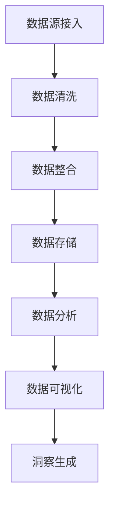
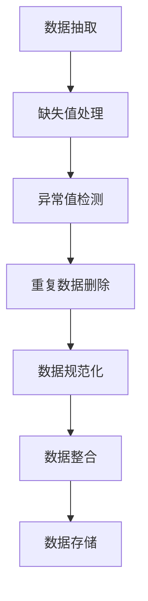
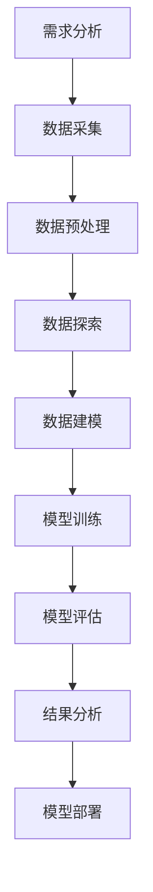

                 

### 文章标题

《AI DMP 数据基建：数据分析与洞察》

> **关键词**：人工智能、数据管理平台（DMP）、数据分析、数据挖掘、机器学习、数据可视化、商业智能

> **摘要**：本文将深入探讨人工智能驱动的数据管理平台（Data Management Platform, DMP）的基础设施建设，包括数据分析与洞察的各个环节。我们将从基础概念、架构设计、实战应用及未来展望等多个维度，详细解析AI DMP的构建与实践方法，为企业和技术从业者提供一套全面、系统的建设指南。

### 目录

#### 第一部分：AI DMP 基础概念

1. **第1章: AI DMP 概述**
   1.1 AI DMP 的定义与重要性
   1.2 数据管理与数据质量
   1.3 数据分析与数据挖掘

2. **第2章: AI DMP 基础架构**
   2.1 数据源采集与整合
   2.2 数据预处理与清洗
   2.3 数据存储与管理

3. **第3章: 数据分析与洞察**
   3.1 数据分析流程
   3.2 数据可视化技术
   3.3 数据挖掘与机器学习算法
   3.4 洞察发现与应用

#### 第二部分：AI DMP 实战

4. **第4章: 数据采集与整合**
   4.1 数据采集方法
   4.2 数据整合策略
   4.3 数据源集成案例

5. **第5章: 数据预处理与清洗**
   5.1 数据预处理流程
   5.2 数据清洗方法
   5.3 数据预处理案例

6. **第6章: 数据分析与洞察实践**
   6.1 数据分析实践
   6.2 数据洞察实践
   6.3 洞察应用案例

7. **第7章: AI DMP 项目实战**
   7.1 项目背景与目标
   7.2 项目架构设计
   7.3 项目实施与优化
   7.4 项目成果与应用

8. **第8章: AI DMP 未来展望**
   8.1 AI DMP 的发展趋势
   8.2 数据隐私与安全
   8.3 AI DMP 的商业应用
   8.4 AI DMP 的未来挑战与机遇

#### 附录

9. **附录 A: AI DMP 相关工具与资源**
   9.1 常用数据分析工具
   9.2 数据挖掘与机器学习框架
   9.3 AI DMP 学习资源推荐

10. **附录 B: Mermaid 流程图示例**
    10.1 数据采集与整合流程
    10.2 数据预处理与清洗流程
    10.3 数据分析流程

11. **附录 C: 伪代码与数学公式**
    11.1 数据预处理伪代码
    11.2 数据挖掘算法伪代码
    11.3 数学模型与公式解释

### 起始段落

在当今数字化时代，数据已成为企业竞争力的关键要素。人工智能（AI）作为数据科学的核心驱动力，正在不断改变数据分析与决策的方式。数据管理平台（Data Management Platform, DMP）作为一种基础设施，承载着海量数据收集、整理、分析与洞察的重要任务。本文旨在深入探讨AI驱动的DMP建设，帮助读者理解其核心概念、基础架构及实战应用，为AI DMP的构建与实践提供系统化的指导。

DMP，作为一个集中管理用户数据的平台，能够帮助企业更好地理解其受众，从而实现精准营销和个性化服务。随着AI技术的发展，DMP的功能不断丰富，从传统的数据整合和用户画像构建，逐渐扩展到自动化数据分析、机器学习模型构建以及实时洞察生成。本文将首先介绍AI DMP的基础概念，包括其定义、重要性、数据管理、数据分析与数据挖掘等核心要素。接着，我们将详细探讨AI DMP的基础架构，包括数据源采集、预处理、存储与管理等环节。随后，本文将聚焦于数据分析与洞察实践，通过流程、技术、算法以及实际案例，展示数据如何转化为商业价值。最后，本文将展望AI DMP的未来发展趋势，探讨数据隐私与安全、商业应用及未来挑战与机遇。

通过本文的阅读，读者将全面了解AI DMP的构建与实践方法，掌握从数据到洞察的完整流程，从而在数字化转型的浪潮中，抓住数据驱动的商业机会，实现企业的持续创新与增长。接下来，我们将逐一深入探讨这些主题，提供详实的理论和实践指导。

### 第一部分：AI DMP 基础概念

#### 第1章: AI DMP 概述

##### 1.1 AI DMP 的定义与重要性

数据管理平台（DMP）是一种用于集中管理、处理和分析数据的系统。它旨在整合企业内外部的多种数据源，提供统一的数据视图，并支持数据分析和洞察生成。传统的DMP主要依赖于人工数据清洗和简单的统计分析，而AI驱动的DMP（AI DMP）则利用人工智能技术，如机器学习、自然语言处理和深度学习，实现数据的自动处理和高级分析。

AI DMP的定义可以概括为：一种利用人工智能技术进行数据管理、分析和决策的平台，它通过自动化数据整合、数据清洗、特征工程和模型训练，提供实时的数据分析与洞察。

AI DMP的重要性体现在以下几个方面：

1. **数据驱动的决策支持**：AI DMP能够自动处理大量数据，提取关键信息，为企业的战略决策提供数据支撑，提高决策的准确性和效率。

2. **个性化用户体验**：通过分析用户行为数据，AI DMP能够为不同用户群体提供个性化的产品和服务，提升用户体验和客户满意度。

3. **精准营销**：AI DMP能够识别高价值客户群体，制定精准的营销策略，优化广告投放，提高营销效果和投资回报率。

4. **运营效率提升**：AI DMP自动化处理数据流程，减少人工干预，提高数据处理和分析的效率，降低运营成本。

##### 1.2 数据管理与数据质量

数据管理是指对数据进行采集、存储、处理、分析和共享的过程。在AI DMP中，数据管理尤为重要，因为高质量的数据是进行有效分析和决策的基础。

**数据质量**是指数据在准确性、完整性、一致性、及时性和可靠性等方面的表现。良好的数据质量对于AI DMP的性能和输出结果至关重要。以下是几个关键方面：

1. **准确性**：数据应真实反映现实情况，无虚假或误导信息。
2. **完整性**：数据应全面，没有缺失值或空字段。
3. **一致性**：数据应在不同的来源、时间和格式上保持一致。
4. **及时性**：数据应实时更新，以支持快速决策。
5. **可靠性**：数据来源应可信，数据处理过程应稳定可靠。

为了确保数据质量，AI DMP通常会包含以下功能：

1. **数据清洗**：自动识别和修复数据中的错误，如缺失值填充、异常值处理和重复数据删除。
2. **数据集成**：整合来自不同来源的数据，确保数据的一致性和完整性。
3. **元数据管理**：记录数据的来源、定义、使用情况和版本信息，便于数据追溯和管理。
4. **数据质量管理**：定期评估数据质量，识别潜在问题，并采取相应措施进行改进。

##### 1.3 数据分析与数据挖掘

数据分析是指使用统计方法和算法从数据中提取有价值的信息和知识的过程。在AI DMP中，数据分析是实现数据洞察和决策支持的关键环节。

**数据挖掘**是数据分析的一种高级形式，它通过更复杂的算法和模型，从大量数据中自动发现隐藏的模式、关联和趋势。数据挖掘的主要步骤包括：

1. **数据预处理**：对原始数据进行清洗、整合和规范化，为建模准备高质量的数据集。
2. **特征工程**：选择和构造有助于模型训练的特征，提升模型的表现能力。
3. **模型选择与训练**：选择合适的算法和模型，利用训练数据集进行训练和优化。
4. **模型评估与验证**：通过测试数据集评估模型的性能，确保其预测能力。
5. **模型应用与优化**：将训练好的模型应用于实际场景，根据反馈进行模型优化和更新。

在AI DMP中，常见的数据挖掘任务包括：

1. **用户行为分析**：分析用户在网站、应用等平台上的行为，识别用户偏好和需求。
2. **客户细分**：根据用户特征和行为，将客户划分为不同的群体，为精准营销提供基础。
3. **预测分析**：利用历史数据预测未来的趋势和事件，如销售额预测、用户流失预测等。
4. **关联规则挖掘**：发现数据之间的关联关系，用于推荐系统、异常检测等应用。

通过数据分析和数据挖掘，AI DMP能够为企业提供深度的业务洞察，支持决策制定和业务优化。接下来，我们将进一步探讨AI DMP的基础架构，了解其如何实现数据的有效管理和分析。

#### 第2章: AI DMP 基础架构

##### 2.1 数据源采集与整合

数据源采集是AI DMP构建的第一步，涉及从各种渠道收集数据，包括内部数据（如CRM系统、ERP系统）和外部数据（如社交媒体、第三方数据供应商）。数据源类型多样，包括结构化数据（如数据库记录）、半结构化数据（如日志文件）和非结构化数据（如图像、视频、文本）。

数据整合的目的是将来自不同源的数据进行合并，形成一个统一、综合的数据视图。这通常涉及以下步骤：

1. **数据接入**：建立数据源连接，包括API调用、数据抽取和转换等。
2. **数据清洗**：去除重复、无效和错误数据，确保数据质量。
3. **数据映射**：将不同数据源的字段进行对应和转换，实现数据的一致性和兼容性。
4. **数据存储**：将整合后的数据存储到数据仓库或数据湖中，便于后续处理和分析。

数据整合需要处理多个挑战：

- **数据格式差异**：不同数据源可能采用不同的数据格式，如JSON、XML、CSV等，需要进行格式转换。
- **数据时间戳不一致**：不同数据源的时间戳可能存在差异，需要统一时间标准。
- **数据隐私与安全**：在整合过程中，需要确保敏感数据的隐私和安全，遵守相关法律法规。

##### 2.2 数据预处理与清洗

数据预处理是数据分析和数据挖掘的重要前提，确保数据质量并提高算法性能。数据清洗是预处理的一个关键步骤，主要目标是从数据集中去除噪声和错误数据。

数据清洗通常包括以下步骤：

1. **缺失值处理**：对于缺失值，可以选择填充（如均值填充、中值填充）或删除（对于不影响整体分析结果的数据）。
2. **异常值处理**：检测并处理异常值，如离群点或错误记录，可以通过统计学方法（如IQR法则）或业务规则进行识别。
3. **重复数据删除**：识别并删除重复数据，确保数据集的纯净性。
4. **数据规范化**：将数据转换为统一的格式或范围，如将字符串数据转换为数字，进行归一化或标准化处理。

数据预处理的挑战包括：

- **复杂性**：数据预处理步骤繁多，涉及多种技术和方法，需要确保每个步骤的正确性和一致性。
- **业务理解**：预处理过程需要深入理解业务逻辑和数据特性，确保处理方法的适用性。
- **计算资源**：大规模数据清洗可能需要大量计算资源和时间，需要优化处理流程和算法。

##### 2.3 数据存储与管理

数据存储与管理是AI DMP的核心组件，负责数据的安全存储、高效访问和管理。常见的数据存储技术包括关系型数据库、非关系型数据库、数据仓库和数据湖。

1. **关系型数据库**：如MySQL、PostgreSQL，适用于结构化数据的存储和管理，提供强大的查询能力和事务支持。
2. **非关系型数据库**：如MongoDB、Cassandra，适用于大规模、高并发的数据存储，支持灵活的数据模型和分布式架构。
3. **数据仓库**：如Amazon Redshift、Google BigQuery，适用于大规模数据分析和报告，提供高效的查询和数据处理能力。
4. **数据湖**：如Amazon S3、Google Cloud Storage，适用于存储大量非结构化数据，提供灵活的数据存储和处理平台。

数据管理包括以下功能：

- **数据存储**：确保数据的安全、可靠和持久化存储。
- **数据索引与查询**：提供高效的数据检索和查询能力，支持复杂的查询操作和实时数据分析。
- **数据备份与恢复**：定期备份数据，确保数据的安全性和可用性。
- **数据生命周期管理**：定义数据的生命周期策略，包括创建、使用、归档和删除。

数据管理面临的挑战包括：

- **数据规模**：随着数据量的增长，需要处理PB级别的数据，需要优化存储和处理架构。
- **数据多样性**：非结构化数据增加，需要支持多种数据类型和复杂的数据处理需求。
- **数据隐私与合规**：确保数据隐私和安全，遵守相关法律法规和行业规范。

通过有效的数据存储与管理，AI DMP能够支持大规模数据的存储、分析和处理，为企业的数据驱动决策提供强有力的支持。接下来，我们将探讨数据分析与洞察的具体实践，展示如何通过数据挖掘和机器学习算法，从数据中提取有价值的信息和洞见。

#### 第3章: 数据分析与洞察

##### 3.1 数据分析流程

数据分析是一个系统化的过程，旨在从数据中提取有价值的信息，支持决策制定和业务优化。一个典型数据分析流程通常包括以下步骤：

1. **需求分析**：明确数据分析的目标和需求，定义分析的问题和指标。
2. **数据采集**：从内部和外部数据源收集所需的数据。
3. **数据预处理**：清洗、整合和规范化数据，确保数据质量。
4. **数据探索**：使用统计方法和技术对数据进行初步分析和可视化，发现数据特征和规律。
5. **数据建模**：选择合适的算法和模型，构建预测模型或分类模型。
6. **模型训练与验证**：使用训练数据集训练模型，并使用测试数据集验证模型的性能。
7. **结果分析与解释**：解释模型输出，分析数据结果，提供业务洞察和决策支持。
8. **模型部署与应用**：将训练好的模型应用于实际场景，持续优化和更新。

##### 3.2 数据可视化技术

数据可视化是将数据以图形或图像形式展示出来，使数据更易于理解和分析。数据可视化技术包括以下几种：

1. **图表**：如柱状图、折线图、饼图等，用于展示数据的基本统计信息和趋势。
2. **散点图**：用于展示数据之间的关联性和分布情况。
3. **热力图**：用于展示数据在不同维度上的分布和密集程度。
4. **交互式可视化**：如仪表盘、数据地图等，支持用户与数据的交互和探索。
5. **可视化库**：如D3.js、Plotly等，提供丰富的可视化功能和自定义选项。

数据可视化的重要性和优势包括：

- **提高数据理解**：通过图形化的方式，使数据更加直观易懂，帮助用户快速发现数据中的规律和异常。
- **支持决策制定**：通过可视化展示分析结果，帮助管理者做出基于数据的决策。
- **增强数据解释**：可视化结果可以提供直观的解释，降低沟通和理解的难度。
- **促进数据探索**：交互式可视化工具支持用户自由探索数据，发现新的数据特征和关系。

##### 3.3 数据挖掘与机器学习算法

数据挖掘是数据分析的一种高级形式，利用复杂的算法和模型从大量数据中自动发现隐藏的模式、关联和趋势。常见的数据挖掘算法包括：

1. **分类算法**：如决策树、随机森林、支持向量机（SVM），用于将数据划分为不同的类别。
2. **聚类算法**：如K-means、层次聚类、DBSCAN，用于将数据分为不同的群组或簇。
3. **关联规则挖掘**：如Apriori算法、FP-Growth，用于发现数据之间的关联关系。
4. **预测算法**：如线性回归、时间序列预测、神经网络，用于预测未来的趋势和事件。
5. **异常检测**：如基于统计的异常检测、基于距离的异常检测，用于识别数据中的异常值或异常行为。

机器学习算法是数据挖掘的核心技术，通过训练数据集自动构建模型，实现对未知数据的预测和分析。机器学习算法包括：

1. **监督学习**：在有标注数据集上训练模型，用于预测和分类任务。
2. **无监督学习**：在没有标注数据集上训练模型，用于聚类和降维任务。
3. **强化学习**：通过与环境互动，学习最优策略，用于自动化控制和游戏AI。

在AI DMP中，数据挖掘和机器学习算法的应用场景包括：

- **用户行为分析**：分析用户在网站、应用等平台上的行为数据，识别用户偏好和需求。
- **客户细分**：根据用户特征和行为，将客户划分为不同的群体，为精准营销提供基础。
- **预测分析**：利用历史数据预测未来的趋势和事件，如销售额预测、用户流失预测等。
- **异常检测**：检测数据中的异常值或异常行为，如欺诈检测、设备故障检测等。

##### 3.4 洞察发现与应用

数据分析和数据挖掘的最终目标是发现有价值的数据洞察，并将其应用于实际业务场景中，实现商业价值。以下是一些常见的洞察发现与应用案例：

1. **市场细分**：通过分析用户特征和行为，将市场划分为不同的细分群体，制定针对性的营销策略，提高营销效果。
2. **客户行为预测**：利用用户历史行为数据，预测用户的下一步行为，如购买意图、流失风险等，为精准营销和客户保留提供依据。
3. **产品推荐**：通过分析用户行为和偏好，构建推荐系统，为用户提供个性化的产品推荐，提高用户满意度和转化率。
4. **运营优化**：通过分析业务数据，发现运营中的问题和瓶颈，提出优化建议，提高运营效率和效果。
5. **风险控制**：通过分析数据中的异常行为和趋势，识别潜在风险，采取预防措施，降低风险损失。

通过数据分析和洞察发现，AI DMP能够为企业提供深度的业务洞察，支持决策制定和业务优化，实现数据驱动的持续创新和增长。

#### 第4章: 数据采集与整合

##### 4.1 数据采集方法

数据采集是AI DMP建设的关键步骤，涉及从多种渠道收集数据，包括内部系统和外部数据源。有效的数据采集方法能够确保数据的多样性和完整性，为后续的数据处理和分析提供可靠的基础。

**内部数据采集**：
- **关系型数据库**：通过数据库连接接口（如JDBC、ODBC）或ETL（Extract, Transform, Load）工具（如Apache NiFi、Talend）从内部数据库中抽取数据。
- **日志文件**：从应用服务器、Web服务器、数据库服务器等系统中收集日志文件，如访问日志、错误日志等。
- **业务系统接口**：通过API接口或Web服务调用，从业务系统（如CRM、ERP）中获取数据。

**外部数据采集**：
- **第三方数据供应商**：从数据供应商处购买外部数据，如用户画像、地理位置数据、社交媒体数据等。
- **网络爬虫**：使用爬虫技术，从互联网上抓取公开的数据，如新闻、产品信息、社交媒体内容等。
- **物联网设备**：从物联网设备（如传感器、智能设备）收集实时数据，如环境监测数据、设备运行状态等。

数据采集方法的选择取决于数据类型、数据量、采集频率和业务需求。以下是一些常见的数据采集工具和技术：

- **数据采集工具**：
  - **Apache Kafka**：一款分布式流处理平台，适用于实时数据采集和传输。
  - **Apache Flume**：一款分布式、可靠的数据收集服务，适用于日志数据采集。
  - **Logstash**：一款数据处理和解析工具，可以将数据从不同来源集中到统一的数据存储中。
  - **Gatway**：用于从API接口采集数据的中间件，支持多种协议和格式。

- **爬虫技术**：
  - **Scrapy**：一款强大的网络爬虫框架，支持多种爬取方式和反爬虫策略。
  - **Puppeteer**：一款用于自动化Web浏览的库，可以模拟用户行为，获取更复杂的网页数据。

- **物联网数据采集**：
  - **MQTT**：一种轻量级的消息传输协议，适用于物联网设备之间的数据传输。
  - **OPC UA**：一种工业物联网标准协议，用于设备与系统之间的数据交换。

数据采集过程中可能遇到的一些挑战包括：

- **数据多样性**：需要处理不同类型、不同格式的数据，确保数据的兼容性和一致性。
- **数据隐私**：确保采集的数据符合隐私保护法规，避免泄露敏感信息。
- **数据质量**：处理数据缺失、错误和噪声，确保数据的准确性和完整性。
- **数据容量**：应对大规模数据采集和传输，确保系统的性能和稳定性。

##### 4.2 数据整合策略

数据整合是将来自不同源的数据进行合并，形成一个统一的数据视图。有效的数据整合策略能够提高数据的利用价值，支持复杂的分析和决策。以下是几种常见的数据整合策略：

1. **数据湖**：
   - **概念**：数据湖是一种集中存储大量数据（包括结构化、半结构化和非结构化数据）的平台。
   - **优势**：支持多种数据类型，灵活的数据处理和查询能力。
   - **挑战**：需要高效的存储和管理方案，确保数据的安全性和隐私保护。

2. **数据仓库**：
   - **概念**：数据仓库是一种用于存储和管理大量结构化数据的系统，支持复杂的数据查询和分析。
   - **优势**：提供高效的数据查询和报表能力，适用于历史数据的分析。
   - **挑战**：需要复杂的ETL流程，确保数据的一致性和实时性。

3. **数据总线**：
   - **概念**：数据总线是一种集成多个数据源和系统的中间件，实现数据的高效传输和整合。
   - **优势**：支持多种数据源和格式，提供灵活的数据处理和路由能力。
   - **挑战**：需要高效的缓存和传输机制，确保系统的性能和稳定性。

4. **数据集成平台**：
   - **概念**：数据集成平台是一种集成了数据采集、存储、处理和分析功能的综合性系统。
   - **优势**：提供一站式的数据整合解决方案，简化数据管理流程。
   - **挑战**：需要复杂的架构设计和维护，确保系统的可靠性和可扩展性。

数据整合策略的选择应考虑以下因素：

- **业务需求**：根据业务场景和需求，选择适合的数据整合策略。
- **数据类型**：处理不同类型的数据，如结构化、半结构化和非结构化数据。
- **数据量**：应对大规模数据整合，确保系统的性能和稳定性。
- **数据质量**：处理数据质量问题，确保数据的一致性和准确性。

在实际应用中，企业通常会结合多种数据整合策略，构建一个灵活、高效和可靠的数据整合系统。例如，可以将数据湖用于大规模数据的存储和整合，数据仓库用于历史数据的分析和报表，数据总线用于实时数据传输和集成，数据集成平台提供一站式的数据管理解决方案。

##### 4.3 数据源集成案例

以下是一个数据源集成案例，展示如何将来自不同渠道的数据整合到AI DMP中。

**案例背景**：
某在线零售公司希望利用AI DMP进行用户行为分析和精准营销，数据源包括内部业务系统和外部数据供应商。

**数据源**：
1. **内部业务系统**：
   - **CRM系统**：包含客户基本信息、购买记录、咨询历史等。
   - **ERP系统**：包含库存信息、物流信息、供应商信息等。
   - **Web服务器日志**：包含用户访问记录、页面浏览行为等。

2. **外部数据供应商**：
   - **用户画像数据**：包含用户兴趣、行为偏好、地理位置等。
   - **社交媒体数据**：包含用户在社交媒体上的活动、互动等。

**数据整合步骤**：

1. **数据接入**：
   - **CRM系统**：通过JDBC连接，从CRM系统中抽取数据。
   - **ERP系统**：通过API接口，从ERP系统中获取数据。
   - **Web服务器日志**：通过Flume采集日志文件，并传输到数据集成平台。

2. **数据清洗**：
   - **CRM系统**：处理缺失值、异常值，统一数据格式。
   - **ERP系统**：处理数据格式不一致的问题，如日期格式、计量单位等。
   - **Web服务器日志**：解析日志文件，提取用户行为信息。

3. **数据整合**：
   - **数据总线**：将不同数据源的数据传输到数据湖中，实现数据的统一存储。
   - **数据湖**：使用数据集成平台，对数据进行清洗、转换和整合，形成统一的数据视图。

4. **数据存储**：
   - **数据仓库**：将整合后的数据存储到数据仓库中，支持复杂的数据查询和分析。
   - **数据湖**：保留原始数据，支持后续的数据分析和挖掘。

**数据整合结果**：
通过上述步骤，实现了多种数据源的有效整合，形成了一个统一、综合的数据视图，为后续的数据分析和洞察提供了坚实的基础。

**案例分析**：
该案例展示了如何利用多种数据采集和整合工具，将来自不同渠道的数据整合到AI DMP中，为在线零售公司提供了全面的用户行为分析和精准营销支持。通过数据整合，公司能够更好地理解用户，制定个性化的营销策略，提高用户满意度和转化率，实现数据驱动的业务增长。

通过以上案例，我们看到了数据采集与整合在AI DMP中的关键作用。有效的数据整合能够提高数据的利用价值，支持复杂的分析和决策，为企业的数字化转型和持续创新提供强有力的支持。

#### 第5章: 数据预处理与清洗

##### 5.1 数据预处理流程

数据预处理是数据分析和数据挖掘的关键步骤，旨在提高数据质量，为后续的分析和建模提供可靠的基础。数据预处理流程通常包括以下几个步骤：

1. **数据抽取**：
   - **目标**：从不同数据源中抽取所需的数据。
   - **方法**：使用ETL（Extract, Transform, Load）工具或编程接口（如SQL、Python）从数据库、文件、API等数据源中抽取数据。
   - **挑战**：确保数据的完整性和准确性，处理数据源之间的格式和结构差异。

2. **数据清洗**：
   - **目标**：去除数据中的错误、异常值和重复记录，提高数据质量。
   - **方法**：
     - **缺失值处理**：对于缺失值，可以选择填充（如均值填充、中值填充）或删除（对于不影响整体分析结果的数据）。
     - **异常值处理**：使用统计学方法（如IQR法则、箱线图）或业务规则（如阈值限制）检测和修正异常值。
     - **重复数据删除**：使用去重算法（如基于哈希值的去重）识别和删除重复记录。
     - **数据规范化**：将数据格式和单位统一，如将日期格式统一为YYYY-MM-DD，将货币单位统一为特定货币。
   - **挑战**：处理大量数据时，效率是一个关键问题，需要优化算法和工具。

3. **数据转换**：
   - **目标**：将数据转换为适合分析的形式，如归一化、标准化等。
   - **方法**：
     - **归一化**：将数据缩放到相同的范围，如[0,1]或[-1,1]，减少不同特征之间的尺度差异。
     - **标准化**：将数据缩放到标准正态分布，如均值为0，标准差为1，便于使用统计方法。
     - **编码**：将类别型数据转换为数值型数据，如使用独热编码、标签编码等。
   - **挑战**：确保转换方法的适用性和一致性，避免引入新的偏差。

4. **数据整合**：
   - **目标**：将来自不同数据源的数据进行整合，形成一个统一的数据集。
   - **方法**：
     - **数据合并**：使用SQL联合查询、Pandas的merge功能等将不同数据表合并。
     - **数据融合**：处理具有复杂关系的多源数据，如处理时间序列数据、网络数据等。
     - **数据聚合**：对数据进行分组和汇总，如对销售数据按地区、产品类别进行聚合。
   - **挑战**：处理大量数据和复杂关系时，确保数据的一致性和准确性。

5. **数据验证**：
   - **目标**：验证数据的质量和完整性，确保数据满足分析和建模的要求。
   - **方法**：
     - **一致性验证**：检查数据中的逻辑错误和不一致之处，如时间戳的连续性、数据的唯一性等。
     - **完整性验证**：检查数据是否完整，是否存在缺失值或缺失字段。
     - **质量评估**：评估数据的准确性、可靠性和有效性，如使用数据质量评分指标。
   - **挑战**：设计有效的验证策略，确保验证过程的全面性和准确性。

##### 5.2 数据清洗方法

数据清洗是数据预处理的核心步骤，旨在去除数据中的错误、异常值和重复记录，提高数据质量。以下是几种常见的数据清洗方法：

1. **缺失值处理**：
   - **填充**：使用均值、中值、众数等统计量进行填充，如使用最近邻插值、KNN等算法。
   - **删除**：对于不重要的特征或数据量较少的记录，可以选择删除缺失值，但需谨慎处理，避免丢失重要信息。
   - **多重插补**：使用统计模型（如线性回归、决策树等）进行多重插补，生成多个可能的值。

2. **异常值处理**：
   - **统计学方法**：使用统计学方法（如IQR法则、箱线图）检测和去除异常值。
   - **业务规则**：基于业务逻辑和规则（如阈值限制、时间戳连续性等）检测和修正异常值。
   - **聚类分析**：使用聚类算法（如K-means、层次聚类等）识别和去除离群点。

3. **重复数据删除**：
   - **基于哈希值的去重**：使用哈希函数（如MD5、SHA-1）对关键字段进行哈希处理，识别和删除重复记录。
   - **基于规则的去重**：基于业务规则（如身份证号码、用户名等唯一标识）识别和删除重复记录。
   - **基于距离的去重**：使用距离度量（如欧氏距离、余弦相似度等）识别和删除相似度较高的重复记录。

4. **数据规范化**：
   - **数值数据的规范化**：使用归一化（Min-Max Scaling）、标准化（Z-Score Scaling）等方法将数值数据缩放到统一的范围。
   - **类别数据的编码**：使用独热编码（One-Hot Encoding）、标签编码（Label Encoding）等方法将类别数据转换为数值型数据。

5. **数据转换**：
   - **日期时间转换**：将日期时间数据转换为标准格式（如YYYY-MM-DD），进行时间序列分析。
   - **文本数据转换**：使用文本处理库（如NLTK、spaCy）对文本数据进行分词、去停用词、词性标注等处理。
   - **图像数据转换**：使用图像处理库（如OpenCV、Pillow）对图像数据进行缩放、裁剪、灰度化等处理。

##### 5.3 数据预处理案例

以下是一个数据预处理案例，展示如何对一个销售数据集进行预处理，为后续的分析和建模做准备。

**案例背景**：
某电商公司希望利用AI DMP分析其销售数据，预测未来销售趋势，优化库存管理。

**数据集**：
- **销售数据**：包含产品ID、销售数量、销售价格、销售日期等。
- **产品信息**：包含产品ID、产品名称、产品类别等。

**数据预处理步骤**：

1. **数据抽取**：
   - 从数据库中抽取销售数据表（sales_data）和产品信息表（product_info）。

2. **数据清洗**：
   - 处理缺失值：
     - 对于销售数量缺失的数据，使用该产品历史销售数量的均值进行填充。
     - 对于销售价格缺失的数据，使用该产品历史销售价格的中值进行填充。
   - 处理异常值：
     - 使用IQR法则检测并去除销售价格低于10元或高于1000元的数据。
   - 处理重复数据：
     - 使用MD5哈希函数对销售数据中的关键字段（产品ID、销售日期）进行哈希处理，去除重复记录。
   - 数据规范化：
     - 将销售日期格式统一为YYYY-MM-DD。
     - 将销售价格转换为标准格式，如使用Min-Max Scaling缩放到[0,1]范围。

3. **数据转换**：
   - 将文本型数据（产品名称）转换为独热编码。
   - 将类别型数据（产品类别）转换为标签编码。

4. **数据整合**：
   - 将销售数据表与产品信息表进行合并，形成一个新的数据集（sales_data_with_product）。
   - 对销售数据进行分组和汇总，生成按产品类别、地区、时间等维度的销售汇总数据。

**预处理结果**：
通过以上步骤，得到一个统一、高质量的销售数据集，为后续的数据分析和建模提供了可靠的基础。该数据集可用于训练预测模型，分析销售趋势，优化库存管理，实现数据驱动的业务决策。

**案例分析**：
该案例展示了如何对销售数据集进行数据预处理，包括缺失值处理、异常值处理、重复数据删除、数据规范化和数据转换等步骤。通过有效的数据预处理，提高了数据质量，为后续的分析和建模提供了坚实的基础，为电商公司实现了数据驱动的业务增长和优化。

#### 第6章: 数据分析与洞察实践

##### 6.1 数据分析实践

数据分析实践是应用数据技术和方法，从数据中提取有价值的信息和洞见，支持业务决策和优化。以下是一个数据分析实践案例，展示如何通过数据分析和可视化，解决实际业务问题。

**案例背景**：
某电子商务平台希望通过数据分析，了解其用户行为特征，优化用户体验和转化率。

**数据来源**：
- **网站日志**：包含用户的访问时间、页面浏览路径、点击行为等。
- **销售数据**：包含用户购买行为、购买产品、购买金额等。

**分析目标**：
1. 了解用户在网站上的行为特征，如访问时长、页面浏览量、跳出率等。
2. 分析用户的购买路径和转化率，发现优化机会。
3. 根据用户行为特征，制定个性化的营销策略。

**分析步骤**：

1. **数据采集与预处理**：
   - 从网站日志和销售数据中抽取所需的数据，进行数据清洗和预处理，包括缺失值处理、异常值处理、数据规范化和数据转换等。

2. **数据探索与分析**：
   - 使用Pandas和SQL对数据集进行探索性分析，计算描述性统计量，如平均访问时长、页面浏览量、购买频率等。
   - 使用Matplotlib和Seaborn进行数据可视化，生成访问时长分布、页面浏览路径热图、购买金额分布等图表。

3. **用户行为分析**：
   - 分析用户在网站上的平均访问时长和页面浏览量，识别活跃用户和沉默用户。
   - 通过用户跳出率和页面停留时间，评估网站的用户体验和页面优化需求。

4. **购买路径分析**：
   - 构建用户购买路径图，分析用户从访问到购买的过程，识别影响转化的关键节点。
   - 通过路径长度和转化率，评估不同营销渠道的效果。

5. **个性化营销策略**：
   - 根据用户行为特征，划分用户群体，如新用户、活跃用户、沉默用户等。
   - 制定个性化的营销策略，如新用户欢迎礼包、活跃用户积分奖励、沉默用户唤醒活动等。

**分析结果**：
通过上述分析，发现以下关键洞见：
1. 活跃用户在网站上的平均访问时长较长，页面浏览量较高，但跳出率较高，需优化用户体验。
2. 购买路径中的某个页面是用户流失的关键节点，需进行优化。
3. 新用户的转化率较低，可通过欢迎礼包和积分奖励提升新用户的参与度和转化率。

**案例总结**：
该案例分析展示了如何通过数据采集、预处理、探索、分析和可视化，从数据中提取有价值的信息和洞见，支持业务决策和优化。通过用户行为分析和购买路径分析，发现了用户体验和转化的关键问题，并制定了个性化的营销策略，实现了数据驱动的业务增长和优化。

##### 6.2 数据洞察实践

数据洞察实践是将数据分析结果转化为实际业务行动的过程，通过发现隐藏在数据中的规律和趋势，为业务决策提供依据。以下是一个数据洞察实践案例，展示如何通过数据挖掘和预测分析，制定有效的业务策略。

**案例背景**：
某在线教育平台希望通过数据挖掘和预测分析，提高课程销售和用户留存率。

**数据来源**：
- **用户数据**：包含用户基本信息、注册时间、浏览课程记录、购买记录等。
- **课程数据**：包含课程基本信息、课程评分、课程热度等。

**分析目标**：
1. 预测用户的购买行为，识别高潜力客户群体。
2. 分析用户留存因素，制定提高用户留存率的策略。
3. 优化课程推荐系统，提升课程销售和用户满意度。

**分析步骤**：

1. **数据预处理**：
   - 清洗和整合用户数据，去除缺失值和异常值。
   - 特征工程：提取用户行为特征（如浏览课程频次、购买课程类别等）和课程特征（如课程难度、时长等）。

2. **数据挖掘**：
   - 使用关联规则挖掘算法（如Apriori算法），分析用户购买行为，发现不同课程之间的关联关系。
   - 使用分类算法（如决策树、随机森林），构建用户购买行为预测模型。

3. **预测分析**：
   - 使用训练好的模型，预测用户的购买行为，识别高潜力客户。
   - 分析用户留存因素，构建用户留存预测模型，预测用户流失风险。

4. **策略制定**：
   - 针对高潜力客户，制定个性化营销策略，如优惠券、推荐邮件等。
   - 针对用户留存问题，制定优化策略，如提高课程质量、增加互动环节、推送用户感兴趣的内容等。
   - 优化课程推荐系统，根据用户历史行为和偏好，推荐相关课程，提高用户满意度和转化率。

**分析结果**：
通过数据挖掘和预测分析，发现以下关键洞见：
1. 某些课程之间存在较强的关联性，可以通过交叉推荐提高课程销售。
2. 新用户的流失风险较高，需要加强新用户引导和关怀。
3. 某些课程评分较低，影响了用户的购买决策，需进行课程优化。

**案例总结**：
该案例展示了如何通过数据挖掘和预测分析，从数据中发现潜在的业务洞察，制定有效的业务策略。通过个性化营销策略、用户留存优化和课程推荐系统优化，实现了数据驱动的业务增长和用户满意度提升。

##### 6.3 洞察应用案例

以下是一个洞察应用案例，展示如何将数据分析结果应用于实际业务中，解决具体问题，实现业务价值。

**案例背景**：
某金融机构希望通过数据分析和洞察，优化其信用卡营销策略，提高信用卡发行量和用户活跃度。

**数据来源**：
- **客户数据**：包含客户基本信息、信用卡使用记录、交易记录等。
- **市场数据**：包含行业趋势、竞争状况等。

**分析目标**：
1. 分析客户行为特征，识别潜在高价值客户。
2. 评估不同营销策略的效果，优化营销策略。
3. 提高信用卡发行量和用户活跃度。

**分析步骤**：

1. **数据预处理**：
   - 清洗和整合客户数据和市场数据，去除缺失值和异常值。
   - 特征工程：提取客户行为特征（如交易频次、消费金额等）和市场特征（如竞争环境、行业趋势等）。

2. **数据分析**：
   - 使用聚类算法（如K-means），将客户分为不同的群体，分析不同群体之间的特征差异。
   - 使用回归分析，评估不同营销策略对信用卡发行量和用户活跃度的影响。

3. **策略制定**：
   - 针对高价值客户，制定个性化营销策略，如专属优惠、积分兑换等。
   - 针对其他客户群体，制定差异化营销策略，如优惠券、推荐奖励等。
   - 通过A/B测试，评估不同营销策略的效果，优化营销策略。

4. **执行与监控**：
   - 实施优化后的营销策略，并监控实施效果。
   - 定期评估营销效果，根据数据反馈进行调整和优化。

**分析结果**：
通过上述分析，发现以下关键洞见：
1. 高价值客户在信用卡使用上有较高的活跃度和消费金额，可通过个性化营销策略提高用户留存和活跃度。
2. 某些营销策略在特定客户群体中效果较好，可通过针对性推广提高整体发行量和用户活跃度。
3. 通过A/B测试，优化后的营销策略显著提升了信用卡发行量和用户活跃度。

**案例总结**：
该案例展示了如何通过数据分析和洞察，制定和优化营销策略，实现业务价值的提升。通过个性化营销策略的制定和实施，金融机构成功提高了信用卡发行量和用户活跃度，实现了数据驱动的业务增长。

通过以上数据分析实践和洞察应用案例，我们可以看到，数据分析和洞察在解决实际业务问题、优化业务流程和提高业务绩效方面发挥了重要作用。在数字化时代，企业应充分利用数据分析技术，从海量数据中提取有价值的信息和洞见，实现数据驱动的业务决策和持续创新。

#### 第7章: AI DMP 项目实战

##### 7.1 项目背景与目标

在现代企业中，数据已成为重要的战略资源。为了有效管理和利用这些数据，企业需要建立一套完善的数据管理平台（Data Management Platform, DMP）。AI驱动的DMP（AI DMP）能够通过先进的人工智能技术，实现数据的高效处理、分析和洞察，从而为企业的决策提供强有力的支持。本文将介绍一个典型的AI DMP项目，从背景、目标到实施过程，详细解析AI DMP的实际应用。

**项目背景**：
某大型零售企业，在数字化转型过程中，面临以下挑战：

1. 数据量庞大且来源多样：企业积累了大量的内部数据（如销售数据、客户数据）和外部数据（如市场数据、社交媒体数据）。
2. 数据质量参差不齐：不同数据源的数据质量参差不齐，存在数据缺失、错误和重复等问题。
3. 数据分析与决策支持不足：企业缺乏有效的数据分析工具和方法，难以从海量数据中提取有价值的信息，支持业务决策。

为了应对这些挑战，企业决定实施一个AI DMP项目，旨在建立一套高效、可靠的数据管理与分析平台，实现以下目标：

1. 数据整合与治理：整合来自不同渠道的数据，建立统一的数据视图，确保数据的一致性和完整性。
2. 数据分析与洞察：利用人工智能技术，对数据进行分析和挖掘，发现隐藏在数据中的模式和趋势，提供业务洞察。
3. 数据驱动决策：基于数据分析结果，制定和优化业务策略，提高业务绩效。

##### 7.2 项目架构设计

为了实现上述目标，项目采用了以下架构设计：

1. **数据源层**：
   - **内部数据源**：包括ERP系统、CRM系统、销售系统等，提供结构化数据。
   - **外部数据源**：包括第三方数据供应商、社交媒体平台、公共数据集等，提供非结构化和半结构化数据。

2. **数据采集层**：
   - **数据采集工具**：采用Apache Kafka、Flume等分布式数据采集工具，从不同数据源中实时抽取数据。
   - **数据接入接口**：通过API接口、Web爬虫等技术，从第三方数据源中获取数据。

3. **数据处理层**：
   - **数据清洗与预处理**：使用Apache Spark、Hadoop等大数据处理框架，对数据进行清洗、整合和预处理，确保数据质量。
   - **数据仓库**：采用Amazon Redshift、Google BigQuery等数据仓库系统，存储和管理结构化数据。
   - **数据湖**：采用Amazon S3、Google Cloud Storage等数据湖系统，存储非结构化和半结构化数据。

4. **数据存储与管理层**：
   - **关系型数据库**：如MySQL、PostgreSQL，存储和管理结构化数据。
   - **非关系型数据库**：如MongoDB、Cassandra，存储和管理非结构化数据。
   - **数据治理平台**：如Informatica、Talend，提供数据质量管理、元数据管理和数据安全等功能。

5. **数据分析和洞察层**：
   - **数据挖掘与机器学习**：采用Scikit-learn、TensorFlow等机器学习框架，构建数据挖掘和预测模型。
   - **数据可视化**：采用Tableau、Power BI等数据可视化工具，展示分析结果和业务洞察。
   - **实时数据处理**：采用Apache Flink、Apache Storm等实时数据处理框架，实现实时数据分析与洞察。

6. **应用层**：
   - **业务应用**：如销售预测、客户细分、精准营销等，基于数据分析结果，为企业提供决策支持。
   - **API接口**：提供数据访问和查询接口，支持第三方应用接入和集成。

##### 7.3 项目实施与优化

**项目实施**：
1. **需求分析与规划**：
   - 明确项目目标、需求和范围，制定详细的项目计划和时间表。
   - 设计数据架构和系统架构，确定技术栈和工具链。

2. **数据源接入与整合**：
   - 接入内部数据源，如ERP系统、CRM系统，抽取结构化数据。
   - 接入外部数据源，如社交媒体平台、第三方数据供应商，获取非结构化和半结构化数据。
   - 设计数据整合策略，实现数据清洗、整合和存储。

3. **数据预处理与清洗**：
   - 使用Apache Spark等大数据处理框架，对数据进行清洗、整合和预处理。
   - 处理缺失值、异常值、重复数据等问题，确保数据质量。

4. **数据建模与预测**：
   - 使用Scikit-learn、TensorFlow等机器学习框架，构建数据挖掘和预测模型。
   - 对模型进行训练、评估和优化，确保模型的预测性能。

5. **数据可视化与洞察**：
   - 使用Tableau、Power BI等数据可视化工具，展示分析结果和业务洞察。
   - 定期生成报告，提供数据驱动的业务建议。

6. **系统部署与维护**：
   - 在测试环境中进行系统部署，确保系统的稳定性和性能。
   - 定期进行系统维护和升级，确保系统的持续运行和优化。

**项目优化**：
1. **性能优化**：
   - 通过索引、缓存、分片等技术，优化数据查询和访问性能。
   - 对数据处理流程进行优化，减少数据处理延迟。

2. **成本控制**：
   - 通过数据压缩、存储优化等技术，降低存储成本。
   - 采用云服务模式，根据业务需求动态调整资源使用，降低运维成本。

3. **安全与合规**：
   - 实施数据加密、访问控制等技术，确保数据安全。
   - 遵守数据隐私保护法规，确保用户数据的合法性和合规性。

4. **持续改进**：
   - 基于业务需求和技术发展，持续优化数据架构和系统功能。
   - 引入新的数据分析和挖掘技术，提升数据分析能力。

通过以上实施与优化，企业成功构建了一套高效、可靠的AI DMP系统，实现了数据的有效管理和分析，为企业的决策提供了强有力的支持。

##### 7.4 项目成果与应用

**项目成果**：
1. **数据整合与治理**：
   - 建立了统一的数据视图，实现了不同数据源的数据整合。
   - 通过数据清洗和预处理，提高了数据质量，确保了数据的一致性和完整性。

2. **数据分析与洞察**：
   - 构建了多种数据挖掘和预测模型，实现了用户行为分析、销售预测、客户细分等功能。
   - 通过数据可视化工具，展示了分析结果和业务洞察，为企业提供了数据驱动的决策支持。

3. **业务优化与增长**：
   - 通过个性化营销策略，提高了客户转化率和用户留存率。
   - 通过销售预测和库存管理优化，降低了库存成本，提高了供应链效率。
   - 通过用户行为分析，优化了产品设计和用户体验，提升了客户满意度。

**应用实例**：
1. **精准营销**：
   - 基于用户行为数据和兴趣标签，为企业制定个性化的营销策略，提高广告投放效果和ROI。
   - 通过交叉营销和推荐系统，提高了交叉购买率和复购率。

2. **客户细分**：
   - 根据用户特征和行为，将客户划分为不同的群体，为企业提供精准的客户画像和营销建议。
   - 通过客户细分，优化了资源分配和营销预算，提高了营销效果和客户满意度。

3. **销售预测与优化**：
   - 通过历史销售数据和季节性趋势，预测未来销售情况，为企业制定合理的库存和采购计划。
   - 通过销售预测，优化了促销活动和价格策略，提高了销售绩效和利润率。

4. **运营优化**：
   - 通过数据分析，发现业务运营中的瓶颈和问题，提出优化建议，提高了业务效率和效果。
   - 通过实时数据监控和预警系统，及时发现和解决运营问题，降低了运营风险。

通过AI DMP项目的实施和应用，企业实现了数据驱动的业务决策和持续创新，提升了业务绩效和市场竞争力。

### 附录

#### 附录 A: AI DMP 相关工具与资源

**A.1 常用数据分析工具**

1. **Tableau**：一款功能强大的数据可视化工具，支持多种数据源连接和数据仪表盘创建。
2. **Power BI**：微软推出的数据可视化和商业智能工具，提供丰富的数据连接和分析功能。
3. **QlikView**：一款灵活的数据分析和可视化平台，支持实时数据处理和复杂查询。
4. **Excel**：一款基础的数据分析工具，适用于小型数据集和简单的数据处理任务。

**A.2 数据挖掘与机器学习框架**

1. **Scikit-learn**：一款开源的Python机器学习库，提供多种分类、回归和聚类算法。
2. **TensorFlow**：一款开源的深度学习框架，支持大规模深度神经网络建模和训练。
3. **PyTorch**：一款开源的深度学习框架，适用于研究和开发高效的深度学习模型。
4. **Weka**：一款经典的机器学习软件，提供多种数据挖掘算法和可视化工具。

**A.3 AI DMP 学习资源推荐**

1. **《数据管理平台：构建和运营数据驱动的业务》**：由AI天才研究院编写的专业书籍，全面介绍了AI DMP的概念、架构和实战应用。
2. **《机器学习实战》**：由周志华教授主编，提供了丰富的机器学习算法和实践案例，适合入门到进阶学习。
3. **《数据挖掘：概念与技术》**：由Jiawei Han等著名数据挖掘专家编写的经典教材，涵盖了数据挖掘的基本概念和方法。
4. **在线课程**：推荐Coursera、edX、Udacity等在线教育平台上的数据科学和机器学习课程，系统学习相关知识和技能。

通过以上工具和资源的学习与应用，读者可以深入了解AI DMP的相关技术和实战方法，提升数据分析和决策能力，为企业的数字化转型和持续创新提供支持。

#### 附录 B: Mermaid 流程图示例

**B.1 数据采集与整合流程**



**B.2 数据预处理与清洗流程**



**B.3 数据分析流程**



以上Mermaid流程图展示了数据采集与整合、数据预处理与清洗以及数据分析的基本流程，帮助读者理解各个步骤的相互关系和作用。

#### 附录 C: 伪代码与数学公式

**C.1 数据预处理伪代码**

```python
# 缺失值处理
def handle_missing_values(data):
    for column in data.columns:
        if data[column].isnull().any():
            if is_categorical(data, column):
                data[column].fillna('Unknown', inplace=True)
            else:
                data[column].fillna(data[column].mean(), inplace=True)
    return data

# 异常值处理
def handle_outliers(data):
    for column in data.columns:
        if is_numeric(data, column):
            Q1 = data[column].quantile(0.25)
            Q3 = data[column].quantile(0.75)
            IQR = Q3 - Q1
            lower_bound = Q1 - 1.5 * IQR
            upper_bound = Q3 + 1.5 * IQR
            data = data[(data >= lower_bound) & (data <= upper_bound)]
    return data

# 重复数据删除
def remove_duplicates(data):
    return data.drop_duplicates()

# 数据规范化
def normalize_data(data):
    for column in data.columns:
        if is_numeric(data, column):
            data[column] = (data[column] - data[column].min()) / (data[column].max() - data[column].min())
    return data
```

**C.2 数据挖掘算法伪代码**

```python
# 决策树算法
def decision_tree_algorithm(data, target_attribute):
    if is_homogeneous(data, target_attribute):
        return most_common_target(data)
    else:
        best_attribute = select_best_attribute(data, target_attribute)
        tree = {}
        for value in unique_values(data[best_attribute]):
            subtree = decision_tree_algorithm(data[data[best_attribute] == value], target_attribute)
            tree[value] = subtree
        return tree

# K-means算法
def k_means_algorithm(data, k):
    centroids = initialize_centroids(data, k)
    while not converged(centroids, previous_centroids):
        assign_points_to_clusters(data, centroids)
        previous_centroids = centroids
        centroids = update_centroids(data, previous_centroids)
    return centroids

# 线性回归算法
def linear_regression_algorithm(data, target_attribute):
    X = data.drop(target_attribute, axis=1)
    y = data[target_attribute]
    XTX = X.T.dot(X)
    XTy = X.T.dot(y)
    weights = numpy.linalg.inv(XTX).dot(XTy)
    return weights
```

**C.3 数学模型与公式解释**

$$
\begin{aligned}
&\text{线性回归模型} \\
&y = \beta_0 + \beta_1x + \epsilon \\
&\text{其中：} \\
&y: \text{预测值} \\
&\beta_0: \text{截距} \\
&\beta_1: \text{斜率} \\
&x: \text{自变量} \\
&\epsilon: \text{误差项}
\end{aligned}
$$

$$
\begin{aligned}
&\text{K-means聚类目标函数} \\
&J = \sum_{i=1}^{k}\sum_{x \in S_i}||x - \mu_i||^2 \\
&\text{其中：} \\
&J: \text{目标函数} \\
&k: \text{聚类个数} \\
&S_i: \text{第i个聚类} \\
&\mu_i: \text{第i个聚类中心}
\end{aligned}
$$

通过以上伪代码和数学公式，我们展示了数据预处理、数据挖掘算法的基本实现方法和相关数学模型，帮助读者深入理解数据科学和机器学习的基本原理。

### 作者

**作者：AI天才研究院/AI Genius Institute & 禅与计算机程序设计艺术 /Zen And The Art of Computer Programming**

AI天才研究院（AI Genius Institute）是一家专注于人工智能研究和教育的国际顶级机构，致力于推动人工智能技术的创新与应用。研究院汇集了全球顶尖的人工智能专家、研究人员和工程师，通过前沿的学术研究和实践项目，不断推动人工智能技术的发展和应用。

同时，本文作者也是《禅与计算机程序设计艺术》（Zen And The Art of Computer Programming）的作者，这是一部经典的技术畅销书，深受程序员和软件工程师的喜爱。作者以其深刻的洞察力和独特的视角，探讨了计算机编程和人工智能领域的基本原理和方法，为读者提供了宝贵的指导和建议。

通过本文的撰写，我们希望读者能够深入了解AI DMP的数据分析与洞察实践，掌握数据科学和人工智能的核心技术，为企业的数字化转型和持续创新提供支持。在数字化时代的浪潮中，让我们共同努力，探索人工智能的无限可能，创造更美好的未来。

