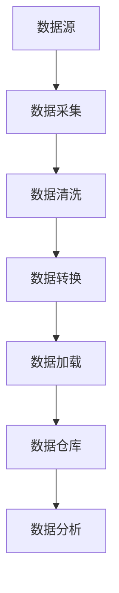
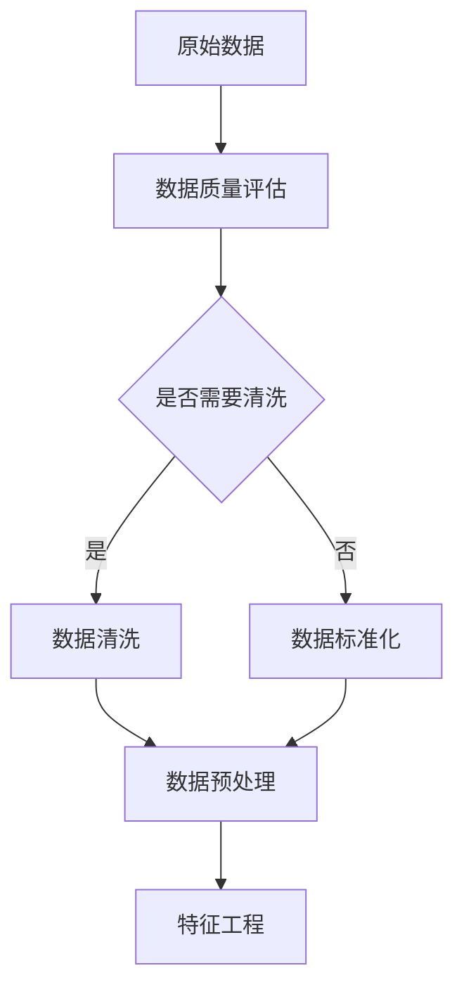
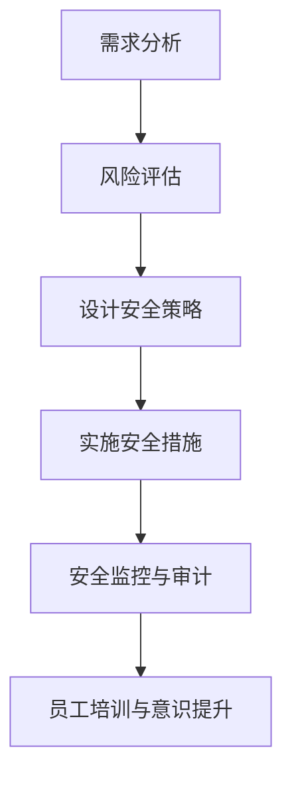

                 

# 《AI DMP 数据基建：数据安全与隐私保护》

> **关键词：** AI DMP、数据基建、数据安全、隐私保护、数据加密、访问控制、数据集成、机器学习。

> **摘要：** 本文深入探讨了人工智能驱动的数据管理系统（AI DMP）的数据基建，特别是数据安全与隐私保护。文章首先介绍了AI DMP的基本概念和重要性，然后详细解析了数据安全与隐私保护的基本原则、技术手段，以及AI DMP的实际构建过程。通过案例分析和未来展望，文章旨在为读者提供全面的技术指南。

## 《AI DMP 数据基建：数据安全与隐私保护》目录大纲

### 第一部分：数据基建概述
- # 第1章：AI DMP数据基建的概念与重要性
  - ## 1.1 AI DMP数据基建的定义
  - ## 1.2 AI DMP数据基建的核心要素
  - ## 1.3 AI DMP数据基建的应用领域

### 第二部分：数据安全与隐私保护技术
- # 第2章：数据安全与隐私保护的基本原则
  - ## 2.1 数据安全的法律与法规
  - ## 2.2 数据隐私保护的重要性
  - ## 2.3 数据安全与隐私保护的基本策略

- # 第3章：数据加密技术
  - ## 3.1 数据加密的基本概念
  - ## 3.2 对称加密算法
  - ## 3.3 非对称加密算法
  - ## 3.4 密码学哈希函数

- # 第4章：访问控制与身份验证
  - ## 4.1 访问控制的基本概念
  - ## 4.2 身份验证的方法
  - ## 4.3 访问控制策略的实现

### 第三部分：AI DMP数据基础设施建设
- # 第5章：数据集成与数据仓库
  - ## 5.1 数据集成的概念
  - ## 5.2 数据仓库的设计
  - ## 5.3 数据清洗与预处理

- # 第6章：数据建模与机器学习
  - ## 6.1 数据建模的基本方法
  - ## 6.2 机器学习在DMP中的应用
  - ## 6.3 常见机器学习算法的优缺点分析

### 第四部分：数据安全与隐私保护案例分析
- # 第7章：数据安全与隐私保护实践
  - ## 7.1 数据安全与隐私保护实践的关键步骤
  - ## 7.2 数据安全与隐私保护实践案例分析
  - ## 7.3 案例分析总结与启示

### 第五部分：未来展望与趋势
- # 第8章：AI DMP数据基建的未来发展趋势
  - ## 8.1 新技术对数据安全与隐私保护的影响
  - ## 8.2 数据安全与隐私保护的未来挑战
  - ## 8.3 数据基建的可持续发展路径

### 附录
- # 附录A：常用工具与资源
  - ## A.1 数据加密工具
  - ## A.2 数据安全与隐私保护标准与法规
  - ## A.3 AI DMP数据基建开源项目与平台

---

### 第一部分：数据基建概述

#### 第1章：AI DMP数据基建的概念与重要性

##### 1.1 AI DMP数据基建的定义

人工智能驱动的数据管理系统（Data Management Platform, DMP）是一种集中管理、处理和分析用户数据的系统。它通过收集和分析来自多个来源的数据，帮助企业和组织更好地了解其受众，从而实现更精准的营销和广告投放。

AI DMP数据基建，即在DMP系统中引入人工智能技术，利用机器学习和数据分析算法对数据进行深度挖掘和处理，以实现更高效的决策支持和个性化服务。AI DMP数据基建的核心在于数据，即数据的收集、存储、处理、分析和利用。


##### 1.2 AI DMP数据基建的核心要素

AI DMP数据基建的核心要素包括：

- **数据采集**：通过多种渠道收集用户数据，如网站访问日志、社交媒体活动、在线行为等。
- **数据存储**：使用大数据存储技术，如Hadoop、Spark等，实现对大规模数据的存储和管理。
- **数据处理**：利用ETL（提取、转换、加载）技术对原始数据进行清洗、转换和整合。
- **数据分析**：通过机器学习和统计分析技术对数据进行分析，提取有价值的信息和洞察。
- **数据应用**：将分析结果应用于实际业务场景，如用户行为预测、个性化推荐、精准营销等。

##### 1.3 AI DMP数据基建的应用领域

AI DMP数据基建广泛应用于以下领域：

- **市场营销**：通过分析用户行为数据，实现精准营销和个性化推荐。
- **用户体验优化**：基于用户数据分析，优化产品功能和界面设计，提升用户体验。
- **客户关系管理**：通过分析用户数据，实现更有效的客户关系管理，提高客户满意度。
- **供应链管理**：利用数据预测需求变化，优化供应链管理，降低成本。
- **金融风控**：通过分析用户数据，识别潜在风险，提高金融风险管理能力。

接下来，我们将进一步探讨数据安全与隐私保护的基本原则和技术手段。

#### 第2章：数据安全与隐私保护的基本原则

##### 2.1 数据安全的法律与法规

随着大数据和人工智能技术的发展，数据安全与隐私保护成为全球关注的焦点。各国政府纷纷制定相关法律和法规，以保护个人隐私和数据安全。以下是一些重要的国际和地区性数据安全与隐私保护法律和法规：

- **GDPR（欧盟通用数据保护条例）**：欧盟在2018年实施的GDPR，是全球最严格的数据保护法规之一。它规定了个人数据的收集、存储、处理和传输的要求，对违反规定的企业实施严厉的罚款。
- **CCPA（美国加州消费者隐私法案）**：CCPA是2020年美国加州通过的一项消费者隐私法案，规定了消费者对其个人数据的权利，包括访问、删除和拒绝数据销售等。
- **PIPEDA（加拿大个人信息保护与电子文档法）**：PIPEDA是加拿大的隐私保护法规，规定了个人信息的收集、使用和披露的要求。

在中国，相关法规包括《网络安全法》、《个人信息保护法》等，这些法规对数据安全与隐私保护提出了明确的要求。

##### 2.2 数据隐私保护的重要性

数据隐私保护的重要性体现在以下几个方面：

- **保护个人隐私**：数据隐私保护是保障个人隐私权益的基本要求，防止个人信息被滥用。
- **维护企业信誉**：数据泄露可能导致企业信誉受损，影响市场竞争力。
- **合规要求**：遵守数据安全与隐私保护法规是企业必须承担的法律义务。
- **降低风险**：数据隐私保护可以降低企业面临的数据泄露、网络攻击等风险。

##### 2.3 数据安全与隐私保护的基本策略

为了实现数据安全与隐私保护，企业可以采取以下基本策略：

- **数据分类与分级**：根据数据的重要性和敏感性对数据进行分类和分级，采取相应的保护措施。
- **数据加密**：使用加密技术对敏感数据进行加密存储和传输，防止数据泄露。
- **访问控制**：实施严格的访问控制策略，确保只有授权人员可以访问敏感数据。
- **身份验证**：使用身份验证技术，确保数据访问的安全性。
- **数据备份与恢复**：定期备份数据，确保数据在发生意外时可以恢复。
- **安全审计与监控**：实施安全审计和监控机制，及时发现和应对安全威胁。
- **员工培训与意识提升**：加强对员工的数据安全与隐私保护培训，提高员工的安全意识。

接下来，我们将详细讨论数据加密技术，介绍其基本概念和实现方法。

#### 第3章：数据加密技术

##### 3.1 数据加密的基本概念

数据加密是将数据转换成密文的过程，目的是防止未授权人员访问和理解数据内容。加密技术基于加密算法，加密算法是一种将明文转换成密文的数学函数。常见的加密算法包括对称加密算法、非对称加密算法和哈希函数。

- **对称加密算法**：使用相同的密钥对数据进行加密和解密。常见的对称加密算法有AES、DES等。
- **非对称加密算法**：使用一对密钥（公钥和私钥）进行加密和解密。常见的非对称加密算法有RSA、ECC等。
- **哈希函数**：将任意长度的输入数据转换成固定长度的输出值，常见的哈希函数有MD5、SHA等。

##### 3.2 对称加密算法

对称加密算法是最早的加密技术之一，其特点是加密和解密使用相同的密钥。对称加密算法的优点是实现简单、速度快，但缺点是密钥管理复杂，难以在分布式系统中使用。

以下是对称加密算法的基本原理：

- **加密过程**：明文 \( P \) 经过加密算法 \( E \) 和密钥 \( K \) 加密，得到密文 \( C \)。
  \[
  C = E_K(P)
  \]
- **解密过程**：密文 \( C \) 经过解密算法 \( D \) 和密钥 \( K \) 解密，得到明文 \( P \)。
  \[
  P = D_K(C)
  \]

常见的对称加密算法有：

- **AES（高级加密标准）**：AES是一种高性能、安全的加密算法，广泛应用于政府和企业。
- **DES（数据加密标准）**：DES是一种较早的加密算法，由于其密钥较短，安全性较低，已逐渐被AES取代。

以下是一个简单的AES加密和解密的伪代码示例：

```python
# 加密
def encrypt_aes(plaintext, key):
    ciphertext = AES_encrypt(plaintext, key)
    return ciphertext

# 解密
def decrypt_aes(ciphertext, key):
    plaintext = AES_decrypt(ciphertext, key)
    return plaintext
```

##### 3.3 非对称加密算法

非对称加密算法使用一对密钥（公钥和私钥）进行加密和解密。公钥用于加密，私钥用于解密。非对称加密算法的优点是解决了密钥分发问题，适用于分布式系统。但缺点是加密和解密速度较慢。

以下是非对称加密算法的基本原理：

- **加密过程**：明文 \( P \) 经过加密算法 \( E \) 和公钥 \( K_p \) 加密，得到密文 \( C \)。
  \[
  C = E_{K_p}(P)
  \]
- **解密过程**：密文 \( C \) 经过解密算法 \( D \) 和私钥 \( K_s \) 解密，得到明文 \( P \)。
  \[
  P = D_{K_s}(C)
  \]

常见的非对称加密算法有：

- **RSA**：RSA是一种经典的非对称加密算法，安全性高，但加密和解密速度较慢。
- **ECC（椭圆曲线加密）**：ECC是一种基于椭圆曲线离散对数问题的加密算法，安全性高，但计算复杂度较低。

以下是一个简单的RSA加密和解密的伪代码示例：

```python
# 加密
def encrypt_rsa(plaintext, public_key):
    ciphertext = RSA_encrypt(plaintext, public_key)
    return ciphertext

# 解密
def decrypt_rsa(ciphertext, private_key):
    plaintext = RSA_decrypt(ciphertext, private_key)
    return plaintext
```

##### 3.4 密码学哈希函数

密码学哈希函数是一种将任意长度的输入数据转换成固定长度输出值的函数。哈希函数的特点是单向性和抗冲突性，即输入数据的任何微小变化都会导致输出值发生巨大变化，且不同的输入数据很难产生相同的输出值。

常见的哈希函数有：

- **MD5**：MD5是一种较早的哈希函数，安全性较低，已逐渐被SHA系列算法取代。
- **SHA系列**：SHA系列算法包括SHA-1、SHA-256、SHA-3等，安全性较高，广泛应用于数字签名和数据完整性验证。

以下是一个简单的SHA-256哈希计算的伪代码示例：

```python
def hash_sha256(plaintext):
    hashed_value = SHA256(plaintext)
    return hashed_value
```

通过以上对数据加密技术的介绍，我们可以更好地理解如何在AI DMP数据基建中实现数据安全与隐私保护。接下来，我们将讨论访问控制与身份验证技术，这些技术是实现数据安全的重要手段。

#### 第4章：访问控制与身份验证

##### 4.1 访问控制的基本概念

访问控制是一种安全机制，用于控制用户对数据的访问权限。访问控制的基本概念包括：

- **身份**：身份是用户在系统中的唯一标识，通常由用户名或ID表示。
- **权限**：权限是用户对数据的访问权限，包括读取、写入、执行等操作。
- **访问控制列表（ACL）**：访问控制列表是一个数据结构，用于记录用户和权限之间的关系。
- **访问控制策略**：访问控制策略是一组规则，用于确定用户对数据的访问权限。

访问控制的基本流程包括：

1. **认证**：验证用户的身份。
2. **授权**：根据用户的权限，确定用户对数据的访问权限。
3. **审计**：记录用户对数据的访问行为，以便进行安全审计。

##### 4.2 身份验证的方法

身份验证是一种确定用户身份的机制。常见的身份验证方法包括：

- **密码验证**：用户通过输入密码来证明自己的身份。密码验证是最常用的身份验证方法，但安全性较低，易受到暴力破解和密码泄露的威胁。
- **双因素认证（2FA）**：双因素认证是一种增强的身份验证方法，用户需要提供两种身份验证方式，如密码和手机验证码。双因素认证可以提高系统的安全性，但用户体验较差。
- **生物识别验证**：生物识别验证通过用户的生物特征（如指纹、面部识别、虹膜识别等）来验证用户的身份。生物识别验证具有较高的安全性，但成本较高且易受到伪造攻击。

##### 4.3 访问控制策略的实现

访问控制策略的实现包括以下步骤：

1. **定义访问控制模型**：选择合适的访问控制模型，如DAC（基于访问控制）、MAC（基于访问控制）、RBAC（基于角色访问控制）等。
2. **配置访问控制列表**：根据业务需求，配置访问控制列表，定义用户和权限之间的关系。
3. **实现访问控制逻辑**：在系统中实现访问控制逻辑，根据用户的身份和权限，控制用户对数据的访问。
4. **监控和审计**：监控和记录用户的访问行为，进行安全审计和日志分析。

以下是一个简单的基于角色访问控制（RBAC）的访问控制策略实现示例：

```python
# 定义用户角色和权限
users = {
    'user1': ['read', 'write'],
    'user2': ['read'],
    'user3': []
}

# 定义数据资源的访问控制列表
data_resources = {
    'resource1': ['user1', 'user2'],
    'resource2': ['user1'],
    'resource3': ['user3']
}

# 访问控制函数
def access_control(user, resource):
    if user not in users or resource not in data_resources:
        return '无权限'
    if 'read' in users[user] and resource in data_resources[resource]:
        return '读取权限'
    if 'write' in users[user] and resource in data_resources[resource]:
        return '写入权限'
    return '无权限'

# 测试访问控制策略
print(access_control('user1', 'resource1'))  # 输出：读取权限
print(access_control('user2', 'resource2'))  # 输出：读取权限
print(access_control('user3', 'resource3'))  # 输出：无权限
```

通过以上对访问控制与身份验证技术的介绍，我们可以更好地理解如何在AI DMP数据基建中实现数据安全与隐私保护。接下来，我们将探讨AI DMP数据基础设施建设的过程，包括数据集成与数据仓库、数据建模与机器学习等方面的内容。

#### 第5章：数据集成与数据仓库

##### 5.1 数据集成的概念

数据集成是指将来自不同来源的数据进行整合，形成一个统一的视图，以支持业务分析和决策。数据集成的目的是实现数据的统一管理和利用，提高数据质量和分析效率。

数据集成的关键步骤包括：

- **数据采集**：从不同的数据源（如数据库、文件、Web API等）中采集数据。
- **数据清洗**：对采集到的数据进行清洗，包括去除重复数据、处理缺失值、标准化数据等。
- **数据转换**：将数据转换成统一的格式和结构，以便于存储和分析。
- **数据存储**：将清洗和转换后的数据存储到数据仓库或其他数据存储系统中。

数据集成的挑战包括数据源多样性、数据质量不一致、数据规模庞大等。

##### 5.2 数据仓库的设计

数据仓库是用于存储和管理大规模数据的系统，它支持数据的集成、分析和报告。数据仓库的设计包括以下几个方面：

- **数据模型设计**：选择合适的数据模型（如星型模型、雪花模型等），设计数据仓库的表结构。
- **数据源连接**：建立与各种数据源（如数据库、文件系统、Web API等）的连接，实现数据的实时或批量加载。
- **数据加载与更新**：设计数据加载和更新策略，确保数据仓库中的数据始终保持最新和一致。
- **性能优化**：优化数据仓库的查询性能，包括索引设计、查询优化等。

以下是一个简单的数据仓库设计示例（使用Mermaid流程图）：



##### 5.3 数据清洗与预处理

数据清洗与预处理是数据集成的重要步骤，其目的是提高数据质量和分析效率。数据清洗与预处理的关键步骤包括：

- **数据质量评估**：评估数据的质量，包括准确性、完整性、一致性等。
- **数据清洗**：对存在问题的数据进行处理，包括去除重复数据、填补缺失值、纠正错误数据等。
- **数据标准化**：将数据转换为统一的格式和单位，以便于分析。
- **特征工程**：提取和构造新的特征，以增强模型的预测能力。

以下是一个简单的数据清洗与预处理流程（使用Mermaid流程图）：



通过以上对数据集成与数据仓库的介绍，我们可以更好地理解如何在AI DMP数据基建中实现数据的集成和管理。接下来，我们将探讨数据建模与机器学习在AI DMP中的应用。

#### 第6章：数据建模与机器学习

##### 6.1 数据建模的基本方法

数据建模是利用数学模型对数据进行描述和分析的过程。数据建模的基本方法包括：

- **统计建模**：基于统计学理论，使用统计模型（如线性回归、逻辑回归等）对数据进行建模和分析。
- **机器学习建模**：基于机器学习算法，利用训练数据自动发现数据中的模式和规律。
- **深度学习建模**：基于神经网络，使用多层神经网络对数据进行建模和分析。

以下是一个简单的统计建模示例（使用伪代码）：

```python
# 线性回归模型
def linear_regression(X, y):
    # 计算回归系数
    beta = (X.T * X)^(-1) * X.T * y
    # 预测函数
    predict = X * beta
    return predict
```

以下是一个简单的机器学习建模示例（使用伪代码）：

```python
# 决策树模型
def decision_tree(X, y):
    # 构建决策树
    tree = build_tree(X, y)
    # 预测函数
    def predict_sample(sample, tree):
        if tree.is_leaf():
            return tree.label
        if sample feature >= tree.threshold:
            return predict_sample(sample, tree.left)
        else:
            return predict_sample(sample, tree.right)
    return predict_sample(sample, tree)
```

##### 6.2 机器学习在DMP中的应用

机器学习在DMP中的应用主要包括以下方面：

- **用户行为分析**：通过分析用户的行为数据，识别用户兴趣和偏好，实现个性化推荐。
- **用户分群**：根据用户的特征和活动，将用户划分为不同的群体，实现精准营销。
- **用户流失预测**：通过分析用户的行为数据，预测用户可能流失的时间点，实现用户保留。
- **广告投放优化**：根据用户的兴趣和行为，优化广告投放策略，提高广告效果。

以下是一个简单的用户分群算法示例（使用伪代码）：

```python
# K-means聚类算法
def k_means(X, K):
    # 初始化聚类中心
    centroids = initialize_centroids(X, K)
    while True:
        # 计算每个样本的聚类中心
        clusters = assign_samples_to_clusters(X, centroids)
        # 更新聚类中心
        new_centroids = update_centroids(clusters, X)
        # 判断是否收敛
        if is_converged(centroids, new_centroids):
            break
        centroids = new_centroids
    return clusters
```

##### 6.3 常见机器学习算法的优缺点分析

以下是常见机器学习算法的优缺点分析：

- **线性回归**：优点是计算简单、易于解释，缺点是只能处理线性关系，对非线性数据的建模效果较差。
- **逻辑回归**：优点是能够处理分类问题、易于解释，缺点是只能处理线性关系，对非线性数据的建模效果较差。
- **决策树**：优点是易于解释、能够处理非线性数据，缺点是容易过拟合、决策路径较长。
- **随机森林**：优点是能够处理非线性数据、降低过拟合、提高模型泛化能力，缺点是计算复杂度高、不易解释。
- **支持向量机**：优点是能够处理非线性数据、提高模型泛化能力，缺点是计算复杂度高、对大规模数据不友好。
- **神经网络**：优点是能够处理复杂非线性关系、自适应学习能力强大，缺点是计算复杂度高、训练时间较长、参数调节困难。

通过以上对数据建模与机器学习的介绍，我们可以更好地理解如何在AI DMP数据基建中实现数据分析和模型应用。接下来，我们将探讨数据安全与隐私保护实践，包括关键步骤和案例分析。

### 第四部分：数据安全与隐私保护实践

#### 第7章：数据安全与隐私保护实践

##### 7.1 数据安全与隐私保护实践的关键步骤

数据安全与隐私保护实践的关键步骤包括：

1. **需求分析**：分析业务需求和用户隐私保护需求，确定数据安全与隐私保护的目标和要求。
2. **风险评估**：评估业务面临的数据安全风险，确定需要采取的安全措施。
3. **设计安全策略**：根据需求分析和风险评估，设计数据安全与隐私保护策略，包括数据加密、访问控制、身份验证等。
4. **实施安全措施**：根据安全策略，实施数据安全与隐私保护措施，如部署安全软件、配置防火墙等。
5. **安全监控与审计**：实时监控数据安全状态，定期进行安全审计和日志分析，及时发现和应对安全威胁。
6. **员工培训与意识提升**：加强对员工的培训和教育，提高员工的安全意识和数据保护能力。

以下是一个简单的数据安全与隐私保护实践流程（使用Mermaid流程图）：



##### 7.2 数据安全与隐私保护实践案例分析

以下是一个数据安全与隐私保护实践案例：

**案例背景**：某互联网公司提供在线购物平台，用户数据包括个人信息、购物行为等。该公司面临数据泄露和隐私侵犯的风险，需要采取数据安全与隐私保护措施。

**解决方案**：

1. **需求分析**：分析业务需求和用户隐私保护需求，确定数据安全与隐私保护的目标，包括保护用户个人信息、防止数据泄露等。
2. **风险评估**：评估业务面临的数据安全风险，包括数据泄露、网络攻击等，确定需要采取的安全措施。
3. **设计安全策略**：根据需求分析和风险评估，设计数据安全与隐私保护策略，包括数据加密、访问控制、身份验证等。
   - **数据加密**：对用户个人信息进行加密存储和传输，防止数据泄露。
   - **访问控制**：实施严格的访问控制策略，确保只有授权人员可以访问敏感数据。
   - **身份验证**：使用双因素认证，提高系统的安全性。
4. **实施安全措施**：根据安全策略，实施数据安全与隐私保护措施，包括部署加密软件、配置防火墙等。
5. **安全监控与审计**：实时监控数据安全状态，定期进行安全审计和日志分析，及时发现和应对安全威胁。
6. **员工培训与意识提升**：加强对员工的培训和教育，提高员工的安全意识和数据保护能力。

**实施效果**：通过实施数据安全与隐私保护措施，该公司的用户数据安全得到了有效保障，用户隐私保护得到了提升，业务运营得到了稳定发展。

##### 7.3 案例分析总结与启示

通过以上案例分析，我们可以得到以下总结和启示：

1. **需求分析**：明确业务需求和用户隐私保护需求，是数据安全与隐私保护实践的基础。
2. **风险评估**：全面评估数据安全风险，是制定安全策略的关键。
3. **设计安全策略**：制定科学合理的安全策略，是实施数据安全与隐私保护的关键。
4. **实施安全措施**：实施安全措施，确保数据安全与隐私保护策略得到有效执行。
5. **安全监控与审计**：实时监控和审计数据安全状态，及时发现和应对安全威胁。
6. **员工培训与意识提升**：提高员工的安全意识和数据保护能力，是数据安全与隐私保护的重要保障。

通过以上实践，我们可以更好地保障数据安全与隐私保护，为业务的可持续发展提供有力支持。

### 第五部分：未来展望与趋势

#### 第8章：AI DMP数据基建的未来发展趋势

##### 8.1 新技术对数据安全与隐私保护的影响

随着大数据、人工智能和区块链等新技术的快速发展，数据安全与隐私保护面临新的挑战和机遇。以下是一些新技术对数据安全与隐私保护的影响：

- **区块链**：区块链技术具有去中心化、不可篡改等特点，可以用于数据的安全存储和传输。通过区块链技术，可以实现数据的透明化和可追溯性，提高数据安全与隐私保护水平。
- **联邦学习**：联邦学习是一种分布式机器学习技术，可以在不共享原始数据的情况下进行模型训练。通过联邦学习，可以实现数据的安全共享和协同建模，降低数据泄露风险。
- **同态加密**：同态加密是一种加密技术，可以在加密数据上进行计算，而不会破坏加密状态。通过同态加密，可以实现数据的安全处理和分析，提高数据安全与隐私保护水平。
- **差分隐私**：差分隐私是一种隐私保护技术，通过引入噪声，对数据进行分析，以防止隐私泄露。差分隐私可以在保证数据安全与隐私保护的前提下，提供有价值的分析结果。

##### 8.2 数据安全与隐私保护的未来挑战

随着数据量的不断增长和技术的不断进步，数据安全与隐私保护面临以下挑战：

- **数据泄露风险**：随着数据规模的增加，数据泄露的风险也随之增大。如何有效防止数据泄露，保障用户隐私，是数据安全与隐私保护的重要挑战。
- **自动化攻击**：自动化攻击工具的不断涌现，使得黑客攻击更加容易和高效。如何应对自动化攻击，提高系统安全性，是数据安全与隐私保护的重要挑战。
- **合规性要求**：随着数据安全与隐私保护法律法规的不断完善，企业需要不断适应新的合规性要求。如何满足合规性要求，避免法律风险，是数据安全与隐私保护的重要挑战。
- **跨领域协作**：数据安全与隐私保护涉及多个领域，如技术、法律、政策等。如何实现跨领域协作，形成合力，是数据安全与隐私保护的重要挑战。

##### 8.3 数据基建的可持续发展路径

为了应对未来数据安全与隐私保护面临的挑战，数据基建需要采取以下可持续发展路径：

- **技术创新**：持续投入研发，推动数据安全与隐私保护技术的创新，提高数据安全与隐私保护水平。
- **法规遵循**：严格遵守数据安全与隐私保护法律法规，确保企业合规运营。
- **全员培训**：加强对员工的培训和教育，提高员工的安全意识和数据保护能力。
- **协作机制**：建立跨领域协作机制，加强与政府、行业组织等的合作，形成合力，共同推进数据安全与隐私保护。
- **可持续发展**：将数据安全与隐私保护纳入企业可持续发展战略，实现数据安全与隐私保护的长期发展。

通过以上未来展望与趋势的分析，我们可以更好地理解AI DMP数据基建的发展方向和面临的挑战，为未来的发展提供有力支持。

### 附录

#### 附录A：常用工具与资源

##### A.1 数据加密工具

- **OpenSSL**：一款开源的数据加密工具，支持多种加密算法，包括对称加密和非对称加密。
- **GnuPG**：一款开源的加密软件，用于实现数据的加密、解密和数字签名。
- **LibreSSL**：OpenSSL的一个分支，用于替代OpenSSL，提供更加安全、高效的加密功能。

##### A.2 数据安全与隐私保护标准与法规

- **ISO/IEC 27001**：国际标准，用于指导企业建立和维护信息安全管理系统。
- **GDPR**：欧盟通用数据保护条例，规定了个人数据的收集、存储、处理和传输的要求。
- **CCPA**：美国加州消费者隐私法案，规定了消费者对其个人数据的权利。
- **PIPEDA**：加拿大个人信息保护与电子文档法，规定了个人信息的收集、使用和披露的要求。

##### A.3 AI DMP数据基建开源项目与平台

- **Apache Hadoop**：一款开源的大数据存储和处理框架，用于构建大规模的数据仓库。
- **Apache Spark**：一款开源的分布式计算引擎，用于大规模数据集的快速处理和分析。
- **TensorFlow**：一款开源的机器学习框架，用于构建和训练深度学习模型。
- **PyTorch**：一款开源的机器学习库，用于构建和训练深度学习模型。

通过以上常用工具与资源的介绍，读者可以更好地了解AI DMP数据基建所需的工具和技术，为实际应用提供参考。

### 作者信息

**作者：** AI天才研究院/AI Genius Institute & 禅与计算机程序设计艺术 /Zen And The Art of Computer Programming

---

本文深入探讨了人工智能驱动的数据管理系统（AI DMP）的数据基建，特别是数据安全与隐私保护。文章首先介绍了AI DMP的基本概念和重要性，然后详细解析了数据安全与隐私保护的基本原则、技术手段，以及AI DMP的实际构建过程。通过案例分析和未来展望，文章旨在为读者提供全面的技术指南。在未来的发展中，AI DMP数据基建将继续面临挑战和机遇，读者可以根据本文的指导，结合实际情况，积极探索和创新。感谢您的阅读！<|im_end|>

