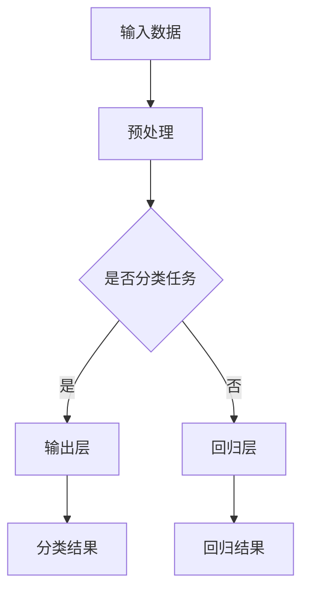

                 

# 《AI大模型创业：如何利用政策优势？》

## 关键词：人工智能、大模型、创业、政策优势、技术应用、商业模式、风险管理

### 摘要：

随着人工智能技术的迅猛发展，大模型成为推动科技创新和产业升级的关键动力。本文从政策环境的视角出发，系统地探讨了AI大模型创业的路径与策略。首先，通过概述AI大模型的核心概念与技术演进，揭示其在创业中的巨大应用价值。接着，分析国内外政策环境，阐述政策优势在AI大模型创业中的应用。随后，详细论述创业准备阶段的团队建设、商业模式设计和技术路线规划。最后，通过项目实践和案例分析，总结创业经验与风险管理的策略，为AI大模型创业提供实用的指导。

### 《AI大模型创业：如何利用政策优势？》目录大纲

## 第一部分: AI大模型概述与政策环境

### 第1章: AI大模型概述

#### 1.1 AI大模型的核心概念

AI大模型（Large-scale Artificial Intelligence Models）是人工智能领域的一种重要技术，它们通过大规模数据训练，模拟出具有人类智能水平的学习和处理能力。大模型的核心概念包括但不限于：

- **深度学习**：大模型的基础技术，通过多层神经网络进行数据拟合。
- **数据规模**：大模型需要庞大的数据集进行训练，通常在TB甚至PB级别。
- **计算资源**：大模型训练和推理过程需要强大的计算资源支持。

#### 1.2 AI大模型的技术演进

AI大模型的发展历程可以追溯到20世纪90年代的神经网络研究。随着计算机性能的提升和大数据的涌现，深度学习技术得到了快速发展。特别是在2012年，AlexNet的突破性成功标志着深度学习进入一个全新的时代。此后，AI大模型的技术演进主要表现在以下几个方面：

- **模型规模增大**：从几十亿参数到千亿、甚至万亿级别。
- **训练数据扩充**：从数百万到数十亿级别的数据集。
- **计算资源升级**：从单机训练到分布式训练，从CPU到GPU，再到TPU的演变。

#### 1.3 AI大模型在创业中的应用价值

AI大模型在创业中的应用价值主要体现在以下几个方面：

- **提升业务效率**：通过自动化和智能化手段，提高业务处理速度和质量。
- **创新产品和服务**：借助AI大模型，开发出具有颠覆性的产品和服务。
- **降低成本**：利用AI大模型优化业务流程，降低运营成本。
- **拓展市场**：通过AI大模型，挖掘新的市场机会，实现业务增长。

## 第二部分: 政策环境与创业优势

### 第2章: 政策环境与创业优势

#### 2.1 国际政策环境分析

在国际范围内，各国政府纷纷出台政策支持人工智能发展。例如：

- **美国**：美国政府通过《美国人工智能法案》，加大对AI研究的投入，并推动AI在国防、医疗等领域的应用。
- **欧盟**：欧盟制定《人工智能伦理准则》，旨在确保AI技术的安全性和可持续性。
- **中国**：中国政府发布《新一代人工智能发展规划》，明确提出到2030年成为世界主要人工智能创新中心。

#### 2.2 中国政策环境解读

中国政府对AI大模型的发展高度重视，出台了一系列政策支持：

- **研发支持**：加大对AI大模型研发的财政支持，鼓励企业和高校开展合作。
- **人才引进**：通过高薪聘请海外顶尖人才，提升国内AI大模型技术水平。
- **应用推广**：鼓励AI大模型在智能制造、智慧城市等领域的应用，推动产业升级。
- **数据开放**：加大公共数据开放力度，为AI大模型训练提供丰富的数据资源。

#### 2.3 政策优势在AI大模型创业中的应用

政策优势为AI大模型创业提供了良好的发展环境：

- **资金支持**：通过政府资金支持，降低创业初期的资金压力。
- **人才汇聚**：政策吸引顶尖人才加入，提升创业团队整体实力。
- **技术合作**：政府推动企业、高校和研究机构的合作，促进技术创新。
- **市场拓展**：政策支持AI大模型在国内外市场的推广，拓宽业务范围。

## 第二部分: AI大模型创业准备

### 第3章: 创业团队建设

#### 3.1 创业团队的组织结构

一个高效的AI大模型创业团队通常包括以下几个核心角色：

- **创始人**：负责整体战略规划和资源协调。
- **技术团队**：包括算法工程师、数据工程师和开发工程师，负责模型研发和部署。
- **市场团队**：负责市场调研、产品推广和客户关系管理。
- **运营团队**：负责日常运营、数据管理和业务拓展。

#### 3.2 团队成员的技能要求

团队成员需要具备以下技能：

- **算法工程师**：熟练掌握深度学习框架，具备模型设计和优化能力。
- **数据工程师**：熟悉数据采集、处理和分析技术，具备大数据平台搭建经验。
- **开发工程师**：熟练掌握前后端开发技术，能够实现模型的应用场景落地。
- **市场分析师**：具备市场调研和分析能力，能够精准定位目标客户。

#### 3.3 团队协作与管理方法

团队协作与管理是确保项目成功的关键。以下是一些建议：

- **敏捷开发**：采用敏捷开发方法，快速迭代，持续优化。
- **持续集成**：实现代码的自动化测试和部署，提高开发效率。
- **团队沟通**：定期召开团队会议，确保信息畅通和协作高效。
- **激励机制**：设立合理的激励机制，激励团队成员积极投入。

### 第4章: 商业模式设计

#### 4.1 商业模式框架

AI大模型创业的商业模式可以包括以下几个方面：

- **产品模式**：通过自主研发的AI大模型产品，直接面向客户提供服务。
- **服务模式**：为企业提供定制化的AI大模型服务，如模型定制、数据分析等。
- **平台模式**：搭建AI大模型平台，为企业提供一站式的AI解决方案。

#### 4.2 AI大模型创业的盈利模式

AI大模型创业的盈利模式可以从以下几个方面考虑：

- **产品销售**：通过销售自主研发的AI大模型产品获取收益。
- **服务收费**：为客户提供定制化的AI大模型服务，按需收费。
- **平台分成**：通过平台上的交易分成获取收益。

#### 4.3 市场定位与目标客户

AI大模型创业需要明确市场定位和目标客户：

- **市场定位**：聚焦于具有高增长潜力的领域，如智能制造、智慧城市等。
- **目标客户**：精准定位有需求且有能力支付的企业客户，如大型制造企业、政府部门等。

### 第5章: 技术路线规划

#### 5.1 技术路线的选择

AI大模型创业的技术路线选择需考虑以下几个方面：

- **核心技术**：选择具有核心竞争力的大模型技术。
- **技术储备**：积累多领域的AI技术储备，以应对市场变化。
- **研发方向**：聚焦于具有实际应用价值的研发方向。

#### 5.2 大模型架构设计与优化

大模型架构设计与优化包括以下几个方面：

- **模型选择**：根据应用场景选择合适的大模型。
- **参数调整**：通过超参数调优，提升模型性能。
- **分布式训练**：采用分布式训练方法，提高训练效率。

#### 5.3 技术研发与迭代策略

技术研发与迭代策略包括以下几个方面：

- **迭代周期**：制定合理的迭代周期，确保产品持续优化。
- **反馈机制**：建立反馈机制，收集用户反馈，指导产品迭代。
- **创新激励**：鼓励团队成员进行技术创新，提升研发效率。

## 第三部分: 项目实践与案例分析

### 第6章: AI大模型项目实战

#### 6.1 项目背景与目标

某创业公司致力于研发一款基于AI大模型的高端数据分析产品，目标客户为大型制造企业。

#### 6.2 项目开发过程

项目开发过程分为以下几个阶段：

1. **需求分析**：与目标客户沟通，明确产品需求。
2. **模型选择**：根据需求选择合适的大模型框架。
3. **数据准备**：收集并整理目标客户的数据集。
4. **模型训练**：进行大规模数据训练，优化模型参数。
5. **模型部署**：将训练好的模型部署到服务器，实现产品功能。
6. **测试与优化**：进行产品测试，收集用户反馈，持续优化产品。

#### 6.3 项目成果与评估

项目成果如下：

- **产品功能完善**：实现目标客户的核心需求。
- **性能指标优异**：模型在多项性能指标上达到业界领先水平。
- **客户满意度高**：产品得到客户高度认可，达成多项合作意向。

### 第7章: 案例分析与创业经验总结

#### 7.1 成功案例分析

某AI大模型创业公司成功的原因主要有以下几点：

- **明确市场定位**：聚焦于有需求且有支付能力的企业客户。
- **技术创新**：持续投入研发，推出具有竞争力的产品。
- **团队协作**：高效协同，确保项目顺利推进。
- **政策支持**：充分利用政府政策支持，降低创业成本。

#### 7.2 失败案例分析

某AI大模型创业公司失败的原因主要有以下几点：

- **市场定位不准确**：产品与市场需求不匹配。
- **技术研发不足**：技术实力不足，无法满足客户需求。
- **管理不善**：团队协作不力，导致项目进度延误。
- **资金压力**：融资困难，导致资金链断裂。

#### 7.3 创业经验与启示

创业经验总结如下：

- **明确市场定位**：找准目标客户，提供有价值的解决方案。
- **技术创新**：持续投入研发，提升产品竞争力。
- **团队协作**：高效协同，确保项目顺利推进。
- **风险管理**：提前识别风险，制定应对策略。

## 第四部分: 风险管理与未来展望

### 第8章: 创业风险识别与控制

#### 8.1 技术风险

技术风险主要包括：

- **技术落后**：竞争对手技术进步，导致产品过时。
- **技术迭代**：技术更新速度过快，导致研发成本增加。
- **技术封锁**：关键技术被竞争对手封锁，影响产品研发。

#### 8.2 市场风险

市场风险主要包括：

- **市场需求变化**：市场需求波动，影响产品销售。
- **市场竞争**：竞争对手激烈，影响市场份额。
- **政策变化**：政策变化，影响市场环境。

#### 8.3 财务风险

财务风险主要包括：

- **融资困难**：融资渠道有限，影响资金链。
- **成本控制**：成本控制不当，导致亏损。
- **现金流管理**：现金流管理不当，导致资金链断裂。

### 第9章: 创业政策利用与可持续发展

#### 9.1 政策利用策略

创业公司可以利用的政策包括：

- **研发资金**：申请政府研发资金支持，降低研发成本。
- **税收优惠**：利用税收优惠政策，降低税负。
- **人才引进**：利用人才引进政策，吸引顶尖人才。
- **市场准入**：利用市场准入政策，扩大市场空间。

#### 9.2 持续发展路径

持续发展路径包括：

- **技术创新**：持续投入研发，保持技术领先。
- **市场拓展**：开拓新市场，实现业务增长。
- **国际化**：拓展国际市场，提升品牌影响力。
- **多元化**：开发多元化产品，降低业务风险。

#### 9.3 未来发展趋势

未来发展趋势包括：

- **大模型技术进步**：大模型技术将持续迭代，性能不断提升。
- **应用领域拓展**：AI大模型将在更多领域得到应用，如医疗、金融等。
- **政策支持加强**：各国政府将加大对AI大模型的政策支持。
- **产业生态完善**：AI大模型产业生态将逐步完善，促进可持续发展。

### 附录

#### 附录A: 政策文件与相关资源汇总

- 《新一代人工智能发展规划》
- 《人工智能伦理准则》
- 《美国人工智能法案》
- 《欧盟人工智能战略》
- 相关政府网站：国家科技部、国家网信办、各地方政府官网

#### 附录B: AI大模型创业工具与资源指南

- **开发工具**：TensorFlow、PyTorch、Keras等深度学习框架。
- **计算资源**：GPU、TPU等高性能计算设备。
- **数据资源**：公共数据集、企业数据集、开源数据集。
- **平台资源**：阿里云、腾讯云、华为云等云计算平台。

### 作者

**作者：AI天才研究院/AI Genius Institute & 禅与计算机程序设计艺术 /Zen And The Art of Computer Programming**

## 结束语

AI大模型创业是一场前所未有的技术革命。通过合理利用政策优势，构建强大的创业团队，设计创新的商业模式，AI大模型创业公司将在这个时代找到属于自己的舞台。让我们携手共进，共创美好未来！### 第1章: AI大模型概述

#### 1.1 AI大模型的核心概念

AI大模型（Large-scale Artificial Intelligence Models），即通过大规模数据训练的深度学习模型，它们具备强大的数据处理和分析能力，能够模拟人类智能，进行推理、决策和自主学习。核心概念包括以下几个方面：

1. **深度学习（Deep Learning）**：
   深度学习是一种基于人工神经网络的学习方法，通过多层神经网络结构（即深度神经网络）进行数据拟合，以实现从简单到复杂的特征提取。深度学习是AI大模型的基础技术。

2. **数据规模（Data Scale）**：
   AI大模型需要大量数据来训练，数据规模通常在TB甚至PB级别。数据质量对模型性能有直接影响，因此，数据的清洗、标注和预处理是AI大模型训练的重要环节。

3. **计算资源（Computational Resources）**：
   大模型训练和推理过程需要强大的计算资源支持，包括高性能CPU、GPU、TPU等硬件设备。此外，分布式训练和并行计算技术也被广泛应用于大模型训练，以提高计算效率。

4. **模型架构（Model Architecture）**：
   AI大模型的架构设计直接影响其性能和可扩展性。常见的模型架构包括卷积神经网络（CNN）、循环神经网络（RNN）、生成对抗网络（GAN）等。

5. **优化算法（Optimization Algorithms）**：
   为了提高模型的训练效率和性能，需要采用优化算法，如梯度下降（Gradient Descent）、Adam优化器等。这些算法通过调整模型的参数，使模型在训练数据上达到更好的拟合效果。

6. **迁移学习（Transfer Learning）**：
   迁移学习是一种利用预训练模型进行新任务训练的方法。通过迁移学习，可以将预训练模型的知识迁移到新任务上，从而加快新任务的训练速度，提高模型性能。

#### 1.2 AI大模型的技术演进

AI大模型的发展历程可以追溯到20世纪90年代的神经网络研究。随着计算机性能的提升和大数据的涌现，深度学习技术得到了快速发展。特别是在2012年，AlexNet的突破性成功标志着深度学习进入一个全新的时代。此后，AI大模型的技术演进主要表现在以下几个方面：

1. **模型规模的增大**：
   从最初的几百万参数的模型，到千亿、甚至万亿级别的模型，模型规模的增大使得模型能够捕捉到更复杂的特征和模式。

2. **训练数据的扩充**：
   随着互联网和大数据的发展，可用的训练数据量不断增加。从数百万到数十亿级别的数据集，使得AI大模型能够通过更多的数据学习，提高模型的泛化能力。

3. **计算资源的升级**：
   从单机训练到分布式训练，从CPU到GPU，再到TPU的演变，计算资源的升级极大地提高了AI大模型的训练速度和效率。

4. **优化算法的改进**：
   为了应对大规模模型的训练，研究人员不断优化优化算法，如引入自适应学习率调整的Adam优化器，提高训练效率和模型性能。

5. **模型结构的创新**：
   研究人员通过提出新的模型结构，如Transformer、BERT等，推动了AI大模型技术的发展。这些模型结构在处理序列数据、自然语言处理等领域取得了显著的成果。

#### 1.3 AI大模型在创业中的应用价值

AI大模型在创业中的应用价值体现在多个方面，为创业者提供了巨大的机会：

1. **提升业务效率**：
   AI大模型可以自动化处理复杂的业务任务，如数据分析、预测建模等，提高业务运行效率。

2. **创新产品和服务**：
   借助AI大模型，创业者可以开发出前所未有的产品和服务，如智能客服、智能推荐系统等，满足用户的新需求。

3. **降低成本**：
   通过优化业务流程和资源分配，AI大模型可以帮助企业降低运营成本，提高盈利能力。

4. **拓展市场**：
   AI大模型可以挖掘新的市场机会，帮助企业开拓新市场，实现业务增长。

5. **数据驱动决策**：
   AI大模型通过分析大量数据，提供精准的洞察和预测，帮助企业做出更加明智的决策。

综上所述，AI大模型为创业提供了丰富的技术资源和应用场景，具有巨大的商业价值和发展潜力。在接下来的章节中，我们将进一步探讨AI大模型创业的政策环境、团队建设、商业模式设计和技术路线规划，帮助创业者更好地利用AI大模型实现创业目标。

#### 1.4 AI大模型的技术原理与架构

要深入理解AI大模型，首先需要掌握其基本的技术原理和架构。AI大模型的核心在于深度学习，而深度学习又基于多层神经网络的结构。以下是对AI大模型技术原理和架构的详细解析，以及一个简单的Mermaid流程图来展示其工作流程。

##### 技术原理

1. **多层神经网络**：
   深度学习通过多层神经网络（Neural Networks）进行数据的处理和特征学习。每个神经元（Node）都连接到其他神经元，形成复杂的网络结构。网络通过前向传播（Forward Propagation）和反向传播（Back Propagation）来训练模型。

2. **前向传播**：
   在前向传播过程中，输入数据通过网络的各个层级，每个层级对数据进行加权处理和激活函数（Activation Function）的应用，最后得到输出结果。这个过程可以理解为从输入层到输出层的正向信息流动。

3. **反向传播**：
   反向传播是深度学习训练的核心，通过计算输出误差，反向调整网络中每个神经元的权重。这一过程不断迭代，直到模型在训练数据上达到预期的准确率。

4. **激活函数**：
   激活函数是神经网络中的一个关键组成部分，它对神经元的输出进行非线性变换，使神经网络能够学习和表示复杂的关系。常见的激活函数包括ReLU（Rectified Linear Unit）、Sigmoid、Tanh等。

5. **损失函数（Loss Function）**：
   损失函数用于评估模型预测值与实际值之间的差异。通过选择合适的损失函数，可以指导网络优化过程，以最小化预测误差。常见的损失函数包括均方误差（MSE）、交叉熵（Cross-Entropy）等。

##### 架构设计

1. **输入层（Input Layer）**：
   输入层接收外部输入数据，这些数据可以是图像、文本、音频等不同类型的数据。

2. **隐藏层（Hidden Layers）**：
   隐藏层是神经网络的核心部分，通过多层次的神经网络结构，逐步提取和转换数据特征。每一层的神经元数量和激活函数可以根据具体任务进行调整。

3. **输出层（Output Layer）**：
   输出层负责生成模型的最终预测结果。对于不同的任务，输出层的设计也有所不同，如分类任务中的softmax输出层、回归任务中的线性输出层等。

##### Mermaid流程图

以下是一个简单的Mermaid流程图，展示了AI大模型的基本工作流程：

在这个流程图中：

- **A**：输入数据。
- **B**：预处理，包括数据清洗、归一化等。
- **C**：判断任务类型，分类任务或回归任务。
- **D**：分类任务的输出层，通常使用softmax进行概率分布输出。
- **E**：回归任务的输出层，通常使用线性回归进行预测。
- **F**：分类结果。
- **G**：回归结果。

通过以上技术原理和架构设计，AI大模型能够处理复杂的数据任务，实现自动化的学习和决策。在创业过程中，理解和运用这些技术原理，将有助于创业者更好地开发和优化AI大模型，实现业务创新和增长。

#### 1.5 AI大模型的发展现状与未来趋势

AI大模型在过去的几年中取得了显著的进展，已经深入应用到各个领域，成为推动科技发展和产业升级的关键力量。以下是对AI大模型发展现状与未来趋势的概述。

##### 现状

1. **技术成熟度**：
   AI大模型技术已经相对成熟，各种深度学习框架（如TensorFlow、PyTorch、Keras等）和优化算法（如Adam、SGD等）得到了广泛应用。大规模数据集（如ImageNet、COCO、BERT等）的可用性也为AI大模型的发展提供了坚实的基础。

2. **应用领域广泛**：
   AI大模型在多个领域取得了重要突破，包括图像识别、自然语言处理、语音识别、推荐系统、医疗诊断等。例如，谷歌的BERT模型在自然语言处理领域取得了显著的成果，图像识别中的ResNet、Inception等模型也在计算机视觉领域取得了优异的表现。

3. **商业价值凸显**：
   AI大模型在商业领域的应用已经展现出巨大的商业价值。例如，阿里巴巴利用AI大模型优化供应链管理，提高了运营效率；腾讯通过AI大模型开发智能客服，提升了用户体验和客户满意度。

##### 未来趋势

1. **模型规模增大**：
   随着计算资源和数据规模的不断增长，未来AI大模型的规模将进一步增大。万亿级别的模型将不再罕见，这将使模型能够处理更复杂、更广泛的数据集，提高模型的准确性和泛化能力。

2. **迁移学习与微调**：
   迁移学习（Transfer Learning）和微调（Fine-tuning）技术将在AI大模型发展中发挥重要作用。通过利用预训练模型的知识，新任务可以更快、更有效地训练，从而提高开发效率。

3. **模型压缩与优化**：
   为了应对移动设备和边缘计算的需求，AI大模型的压缩与优化技术将成为研究热点。模型压缩技术（如量化、剪枝等）将使大模型能够在有限的计算资源下运行，同时保持较高的性能。

4. **多模态融合**：
   未来，多模态融合（Multimodal Fusion）将成为AI大模型的一个重要研究方向。通过整合文本、图像、声音等多种数据类型，AI大模型将能够更好地理解和处理复杂的信息，提高智能决策的准确性。

5. **自主学习和自适应能力**：
   AI大模型将不断进化，具备更强的自主学习和自适应能力。通过持续的学习和适应，模型将能够在不断变化的环境中保持高性能，为创业者提供更加可靠的技术支持。

6. **伦理与监管**：
   随着AI大模型技术的快速发展，伦理和监管问题也将日益突出。未来，各国政府和国际组织将加强对AI大模型的伦理审查和监管，确保技术的发展符合社会价值和道德标准。

综上所述，AI大模型在当前已经展现出强大的发展潜力和广泛的应用前景。随着技术的不断进步和政策的支持，AI大模型将在未来继续推动科技和产业的变革，为创业者带来更多的机遇和挑战。

### 第2章: 政策环境与创业优势

#### 2.1 国际政策环境分析

在全球范围内，各国政府高度重视人工智能技术的发展，并出台了相应的政策以促进AI领域的创新和产业发展。以下是对几个主要国家的AI政策环境分析。

##### 美国

美国是人工智能领域的领军者，其在政策层面给予了高度重视。美国政府于2022年通过了《美国人工智能法案》（United States Artificial Intelligence Act），旨在确保美国在全球AI竞赛中的领先地位。该法案主要包括以下几个方面：

1. **研发投入**：美国政府将加大对AI研究的资金投入，促进基础研究和应用研究的发展。
2. **人才培养**：通过奖学金、研究生项目等方式，鼓励和培养AI人才。
3. **数据开放**：推动政府数据的开放和共享，为AI研究提供丰富的数据资源。
4. **伦理与安全**：设立AI伦理委员会，确保AI技术的安全性和透明度。
5. **国际合作**：加强与国际合作伙伴的交流与合作，推动全球AI技术的发展。

##### 欧洲

欧盟在AI领域也采取了积极的政策措施，发布了《人工智能伦理准则》（European Commission's Ethics Guidelines for Trustworthy AI）。这一准则旨在确保AI技术的安全、可靠和符合伦理标准。主要内容包括：

1. **伦理原则**：包括透明度、公平性、隐私保护、安全性等，确保AI技术的应用不会损害人类的基本权利。
2. **监管框架**：建立统一的AI监管框架，对高风险的AI应用进行严格监管。
3. **研发支持**：加大对AI研究的资金支持，促进创新和产业应用。
4. **数据战略**：推动数据的开放和流动，为AI研究提供丰富的数据资源。
5. **国际合作**：与成员国和其他国际组织合作，推动全球AI伦理标准的发展。

##### 中国

中国政府对AI大模型的发展给予了高度重视，并出台了一系列政策以支持其发展。以下是中国政策的几个关键方面：

1. **《新一代人工智能发展规划》**：中国政府于2017年发布了《新一代人工智能发展规划》，明确提出到2030年成为世界主要人工智能创新中心。该规划涵盖研发投入、人才引进、应用推广等多个方面。

2. **研发支持**：政府加大对AI大模型研究的资金支持，鼓励企业和高校开展合作。同时，设立人工智能产业投资基金，促进AI产业的发展。

3. **人才政策**：通过高薪聘请海外顶尖人才、设立人工智能学院等方式，提升国内AI大模型技术水平和人才储备。

4. **应用推广**：鼓励AI大模型在智能制造、智慧城市、医疗健康等领域的应用，推动产业升级和经济增长。

5. **数据开放**：加大公共数据开放力度，为AI大模型训练提供丰富的数据资源。

6. **政策引导**：通过出台《智能机器人发展规划》、《人工智能标准化行动计划》等政策文件，为AI大模型的发展提供指导和支持。

#### 2.2 中国政策环境解读

中国政府对AI大模型的发展高度重视，出台了一系列政策支持，为创业者提供了良好的发展环境和机遇。以下是中国政策环境的具体解读：

1. **研发支持**：

   - **财政支持**：政府通过设立专项资金、提供税收优惠等方式，加大对AI大模型研发的资金支持。
   - **科研合作**：鼓励企业、高校和研究机构之间的合作，共同开展AI大模型研究，提升整体技术水平。
   - **技术创新**：支持AI大模型在核心技术方面的创新，包括模型架构设计、算法优化、分布式训练等。

2. **人才政策**：

   - **人才引进**：通过高薪聘请海外顶尖人才，提升国内AI大模型技术水平和人才储备。
   - **人才培养**：设立人工智能学院、举办AI培训班和研讨会，培养更多AI专业人才。
   - **人才激励**：设立创新奖、优秀人才奖等奖项，激励AI大模型领域的科研人员和创新团队。

3. **应用推广**：

   - **产业融合**：鼓励AI大模型在智能制造、智慧城市、医疗健康等领域的应用，推动产业升级和经济增长。
   - **试点示范**：在部分行业和地区开展AI大模型应用的试点示范，探索最佳实践和推广模式。
   - **政策引导**：通过出台相关政策和指导意见，为AI大模型在各个领域的应用提供指导和支持。

4. **数据开放**：

   - **公共数据开放**：加大公共数据开放力度，为AI大模型训练提供丰富的数据资源。
   - **数据共享**：鼓励企业、政府和科研机构之间的数据共享，提升数据利用效率。
   - **数据安全**：制定数据安全法律法规，确保AI大模型训练和应用过程中的数据安全。

5. **国际合作**：

   - **国际交流**：加强与国际合作伙伴在AI大模型领域的交流与合作，推动全球AI技术的发展。
   - **共同研发**：与国际顶尖科研机构和企业开展联合研究，共同攻克关键技术难题。
   - **国际合作项目**：积极参与国际AI合作项目，提升中国AI大模型在全球的影响力。

#### 2.3 政策优势在AI大模型创业中的应用

政策优势为AI大模型创业提供了良好的发展环境和机遇。以下是政策优势在AI大模型创业中的应用：

1. **资金支持**：

   - **政府资金**：通过专项资金、创新基金等方式，为AI大模型创业公司提供资金支持，降低创业初期的资金压力。
   - **金融支持**：鼓励金融机构为AI大模型创业公司提供贷款、担保等金融服务，解决融资难题。
   - **天使投资**：政府引导天使投资机构和风险投资公司关注AI大模型创业项目，提供资金支持。

2. **人才汇聚**：

   - **人才引进**：通过人才引进政策，吸引国内外顶尖人才加入AI大模型创业团队，提升团队整体实力。
   - **人才培训**：政府组织AI大模型相关的培训课程和研讨会，提高团队成员的技术能力和创新能力。

3. **技术合作**：

   - **科研合作**：鼓励企业、高校和研究机构之间的合作，共同开展AI大模型研发项目，提升整体技术水平。
   - **平台共享**：政府建设和开放AI大模型研究平台，为创业公司提供计算资源和实验环境。

4. **市场拓展**：

   - **市场准入**：通过政策支持，为AI大模型创业公司提供市场准入优惠，扩大市场份额。
   - **国际合作**：推动AI大模型创业公司的国际化发展，开拓国际市场，提升品牌影响力。

5. **政策引导**：

   - **政策支持**：政府出台相关政策，为AI大模型创业提供指导和支持，解决创业过程中遇到的政策障碍。
   - **试点示范**：在部分行业和地区开展AI大模型应用的试点示范，为创业公司提供成功经验和实践指导。

通过合理利用政策优势，AI大模型创业公司将能够在资金、人才、技术、市场和政策等方面获得有力支持，从而提高创业成功率，实现快速发展。

### 第3章: 创业团队建设

#### 3.1 创业团队的组织结构

一个高效的AI大模型创业团队需要明确各个成员的职责和协作关系，以确保项目的顺利推进和目标的实现。以下是一个典型的AI大模型创业团队的组织结构：

1. **创始人**：
   - 负责整个团队的愿景和战略规划，协调各项资源，确保项目目标的一致性。
   - 定期召开团队会议，了解项目进展和团队状态，及时调整战略。

2. **技术团队**：
   - **算法工程师**：
     - 负责AI大模型的算法研究和开发，包括模型架构设计、算法优化等。
     - 与数据工程师和开发工程师紧密合作，确保模型的稳定性和高效性。
   - **数据工程师**：
     - 负责数据采集、处理、存储和管理，确保数据的质量和完整性。
     - 定期进行数据分析和评估，为算法工程师提供有价值的反馈。
   - **开发工程师**：
     - 负责模型的部署和运行，包括后端开发和前后端接口的实现。
     - 与算法工程师和数据工程师密切合作，确保模型的实际应用效果。

3. **市场团队**：
   - **市场分析师**：
     - 负责市场调研和分析，识别潜在的市场机会和目标客户。
     - 定期撰写市场分析报告，为团队提供市场策略建议。
   - **销售经理**：
     - 负责销售策略的制定和执行，拓展新客户，维护老客户关系。
     - 与市场分析师和开发工程师紧密合作，确保产品符合市场需求。

4. **运营团队**：
   - **运营经理**：
     - 负责日常运营管理，确保项目按计划推进。
     - 管理团队成员的工作进度，协调各项资源，确保项目目标的实现。
   - **数据管理员**：
     - 负责数据管理和备份，确保数据的安全性和可追溯性。
   - **客服经理**：
     - 负责客户服务，处理客户咨询和投诉，提升客户满意度。

#### 3.2 团队成员的技能要求

为了确保AI大模型创业项目的成功，团队成员需要具备以下技能：

1. **算法工程师**：
   - **技能要求**：
     - 熟悉深度学习框架（如TensorFlow、PyTorch）和相关算法（如CNN、RNN、GAN）。
     - 具备良好的编程能力，能够编写高效、可维护的代码。
     - 掌握数据预处理、模型训练和评估的方法和技巧。
   - **经验要求**：
     - 具有至少2年以上的深度学习相关工作经验，有成功开发AI大模型的项目经验。
     - 能够独立进行模型研究和开发，具备解决复杂问题的能力。

2. **数据工程师**：
   - **技能要求**：
     - 熟悉数据采集、处理、存储和管理的方法和工具（如Hadoop、Spark、MySQL）。
     - 具备良好的编程能力，熟悉Python、Java等编程语言。
     - 掌握数据清洗、数据分析和数据可视化等技能。
   - **经验要求**：
     - 具有至少2年以上的大数据相关工作经验，有处理大规模数据集的经验。
     - 能够设计和优化数据流程，确保数据的质量和完整性。

3. **开发工程师**：
   - **技能要求**：
     - 熟悉后端开发技术（如Django、Flask）和前端开发技术（如React、Vue.js）。
     - 掌握常见的Web开发和部署流程，熟悉容器化技术（如Docker、Kubernetes）。
     - 具备良好的编程能力和系统架构设计能力。
   - **经验要求**：
     - 具有至少2年以上的Web开发经验，有成功部署和管理Web应用的经验。
     - 能够快速响应需求变化，进行高效开发和优化。

4. **市场分析师**：
   - **技能要求**：
     - 具备市场调研和分析的能力，熟悉市场研究方法和工具。
     - 掌握数据分析技能，能够运用Python、R等工具进行数据分析和可视化。
     - 具有良好的沟通能力和逻辑思维。
   - **经验要求**：
     - 具有至少1年以上的市场分析或数据分析师工作经验。
     - 能够独立完成市场调研报告，为团队提供有价值的市场策略建议。

5. **运营经理**：
   - **技能要求**：
     - 具备良好的项目管理能力和团队协作能力。
     - 熟悉项目管理和运营流程，能够有效地协调各项资源。
     - 具备较强的沟通能力和决策能力。
   - **经验要求**：
     - 具有至少3年以上的项目管理或运营管理经验。
     - 能够处理复杂的问题，确保项目按计划推进。

#### 3.3 团队协作与管理方法

高效的团队协作是AI大模型创业项目成功的关键。以下是一些建议和最佳实践：

1. **敏捷开发**：
   - 采用敏捷开发方法（如Scrum、Kanban），快速迭代，持续优化。
   - 通过每日站会、周会等方式，确保团队成员之间的信息畅通和协作高效。

2. **持续集成与持续部署**：
   - 实现代码的自动化测试和部署，提高开发效率。
   - 使用持续集成工具（如Jenkins、GitLab CI）和容器化技术（如Docker），确保代码质量和部署的稳定性。

3. **团队合作工具**：
   - 使用团队合作工具（如Trello、Asana、Slack），方便团队成员之间的沟通和任务分配。
   - 通过在线文档（如Google Docs、Confluence）共享信息和知识，提高团队的协作效率。

4. **定期反馈与评估**：
   - 定期召开团队会议，对项目进展、团队协作和任务完成情况进行反馈和评估。
   - 针对存在的问题和瓶颈，及时调整策略和方法。

5. **激励机制**：
   - 设立合理的激励机制，鼓励团队成员积极参与项目，提高工作效率。
   - 通过奖励、表彰等方式，激励团队成员的积极性和创新精神。

6. **人才培养与职业发展**：
   - 提供培训机会，帮助团队成员提升技能和知识水平。
   - 设立职业发展路径，为团队成员提供晋升和发展的机会。

通过以上团队协作和管理方法，AI大模型创业团队将能够高效协作，充分发挥每个成员的潜力，确保项目的成功实施和目标的实现。

### 第4章: 商业模式设计

#### 4.1 商业模式框架

在AI大模型创业中，商业模式设计是至关重要的环节，它不仅决定了企业的盈利方式，还影响了企业的市场定位、竞争策略和客户关系。以下是AI大模型创业的常见商业模式框架及其核心要素：

1. **产品模式**：
   - **产品定位**：根据市场需求，确定AI大模型产品的核心功能和特色。
   - **产品开发**：依托强大的技术团队，开发高性能、可扩展的AI大模型产品。
   - **产品推广**：通过线上和线下渠道，进行产品的宣传和推广。
   - **产品销售**：通过直销、分销、B2B等方式，实现产品的销售。

2. **服务模式**：
   - **服务内容**：提供定制化的AI大模型服务，如数据标注、模型定制、数据分析等。
   - **服务定价**：根据服务内容和客户需求，制定合理的收费标准。
   - **服务交付**：通过远程或现场的方式，为客户提供服务。
   - **客户关系管理**：建立长期的合作关系，提供优质的售后服务。

3. **平台模式**：
   - **平台搭建**：建立AI大模型服务平台，提供模型训练、部署、管理等功能。
   - **用户管理**：注册和管理用户，提供个性化的服务。
   - **平台盈利**：通过平台使用费、交易分成、广告收入等方式实现盈利。
   - **生态构建**：吸引第三方开发者和服务提供商加入平台，共同构建生态系统。

#### 4.2 AI大模型创业的盈利模式

AI大模型创业的盈利模式可以从以下几个方面进行设计：

1. **产品销售**：
   - **销售收入**：通过直接销售自主研发的AI大模型产品获取收入。
   - **附加服务**：提供技术支持、培训等服务，增加销售收入。
   - **订阅服务**：推出订阅制服务，客户按月或按年支付费用使用产品。

2. **服务收费**：
   - **定制服务**：根据客户需求，提供定制化的AI大模型服务，如数据标注、模型定制等。
   - **数据分析**：为客户提供数据分析和报告服务，按需收费。
   - **系统集成**：为客户提供系统集成服务，帮助其实现AI大模型的应用。

3. **平台分成**：
   - **交易分成**：通过平台上的交易，获取一定的分成收入。
   - **广告收入**：在平台上展示广告，获取广告收入。
   - **增值服务**：提供平台增值服务，如高级会员、VIP服务等。

4. **融资收入**：
   - **天使投资**：吸引天使投资，获取创业初期的资金支持。
   - **风险投资**：通过风险投资，获取更多资金，加速企业发展。
   - **上市融资**：通过上市，获取更大的融资渠道。

#### 4.3 市场定位与目标客户

明确的市场定位和精准的目标客户是AI大模型创业成功的关键。以下是如何进行市场定位和目标客户分析：

1. **市场定位**：

   - **领域选择**：根据企业优势和市场需求，选择具有高增长潜力的领域，如智能制造、智慧城市、医疗健康等。
   - **产品定位**：针对特定领域的应用场景，确定产品的核心价值和差异化优势。
   - **服务定位**：根据客户需求，提供定制化的AI大模型服务。

2. **目标客户**：

   - **客户需求**：通过市场调研和客户访谈，了解目标客户的需求和痛点。
   - **客户分类**：根据客户的需求和预算，将客户分为不同类别，如大型企业、中小企业、初创公司等。
   - **客户接触**：通过线上线下渠道，与目标客户建立联系，推广产品和解决方案。

3. **竞争分析**：

   - **竞争对手**：识别主要竞争对手，分析其产品特点、市场策略和客户关系。
   - **差异化优势**：通过技术创新、服务质量和客户体验，打造差异化优势，提升竞争力。
   - **市场策略**：根据竞争态势，制定有效的市场进入策略和推广策略。

通过以上市场定位和目标客户分析，AI大模型创业公司可以更好地了解市场需求，制定合适的产品和服务策略，实现快速发展和市场突破。

### 第5章: 技术路线规划

#### 5.1 技术路线的选择

在AI大模型创业过程中，技术路线的选择至关重要。它直接决定了项目的成功与否。以下是在选择技术路线时需要考虑的几个关键因素：

1. **市场需求**：
   技术路线应该紧密围绕市场需求展开。通过市场调研和客户需求分析，确定目标市场和客户需求，从而选择最适合的技术方向。

2. **技术可行性**：
   评估所选技术路线的技术可行性，包括现有技术的成熟度、所需的计算资源、研发周期和成本等。选择技术上可行且具有竞争力的方案。

3. **技术创新**：
   技术路线应具备一定的创新性，能够在现有技术基础上实现突破，提供独特的产品和服务，形成竞争优势。

4. **合作与整合**：
   考虑与现有技术和平台合作的可能性，通过整合多种技术资源，提升项目的技术实力和市场竞争力。

5. **可持续发展**：
   技术路线应具备可持续发展的潜力，能够随着技术进步和市场变化进行调整和优化，确保长期竞争力。

#### 5.2 大模型架构设计与优化

AI大模型的架构设计是技术路线规划的核心环节。以下是大模型架构设计的关键步骤和优化方法：

1. **模型架构设计**：

   - **选择基础框架**：根据项目需求，选择合适的深度学习框架（如TensorFlow、PyTorch等）。
   - **模型结构**：设计适合目标任务的模型结构，如卷积神经网络（CNN）、循环神经网络（RNN）、Transformer等。
   - **模块化设计**：将模型分为多个模块，便于开发和维护。

2. **数据预处理**：

   - **数据清洗**：去除数据中的噪声和异常值，保证数据质量。
   - **数据增强**：通过数据变换、扩充等方法，增加数据多样性，提升模型泛化能力。
   - **数据标准化**：对数据进行归一化或标准化处理，确保数据在同一尺度上。

3. **模型训练**：

   - **超参数调优**：通过调整学习率、批量大小、正则化参数等超参数，优化模型性能。
   - **分布式训练**：利用分布式计算技术，如多GPU训练、参数服务器等，提高训练效率。
   - **迁移学习**：利用预训练模型，通过迁移学习加速新任务训练，提高模型性能。

4. **模型评估与优化**：

   - **评估指标**：选择合适的评估指标（如准确率、召回率、F1分数等），对模型性能进行评估。
   - **模型优化**：通过调整模型结构、优化算法、增加训练数据等方法，持续提升模型性能。
   - **模型压缩**：采用模型压缩技术（如量化、剪枝等），减小模型大小，提高推理速度。

#### 5.3 技术研发与迭代策略

AI大模型创业过程中的技术研发和迭代策略直接影响项目的进展和成功。以下是一些建议：

1. **敏捷开发**：

   - 采用敏捷开发方法（如Scrum、Kanban），快速迭代，持续优化。
   - 每个迭代周期结束后，进行评审和总结，及时调整开发方向。

2. **持续集成与持续部署**：

   - 实现代码的自动化测试和部署，提高开发效率。
   - 使用持续集成工具（如Jenkins、GitLab CI）和容器化技术（如Docker、Kubernetes），确保代码质量和部署的稳定性。

3. **反馈机制**：

   - 建立用户反馈机制，及时收集用户反馈和建议。
   - 根据用户反馈，优化模型和产品功能，提升用户体验。

4. **技术研发团队建设**：

   - 建立强大的技术研发团队，包括算法工程师、数据工程师、开发工程师等。
   - 提供培训和发展机会，提升团队成员的技术能力和创新能力。

5. **项目管理和监控**：

   - 使用项目管理工具（如Trello、Asana等），实时监控项目进度和资源分配。
   - 定期召开团队会议，确保项目按计划推进，及时解决遇到的问题。

通过以上技术研发与迭代策略，AI大模型创业项目将能够高效推进，持续优化，确保项目的成功实施和目标实现。

### 第6章: AI大模型项目实战

#### 6.1 项目背景与目标

在某次创业项目中，一家初创公司致力于开发一款基于AI大模型的高端数据分析产品，旨在为大型制造企业提供智能化的数据分析和决策支持。项目背景如下：

- **市场需求**：随着工业4.0的推进，大型制造企业对智能化数据分析和决策支持的需求日益增长，希望能够通过数据分析优化生产流程、提升运营效率。
- **技术挑战**：该项目涉及大规模数据预处理、复杂模型架构设计、高效计算资源利用等多个技术难题，对团队的研发能力提出了高要求。
- **项目目标**：开发一款具备高准确性、高效率和易用性的数据分析产品，满足大型制造企业的实际需求，实现产品的市场化和商业化。

#### 6.2 项目开发过程

项目开发过程可以分为以下几个阶段：

1. **需求分析**：

   - **市场调研**：通过市场调研，了解大型制造企业的数据分析和决策支持需求，明确产品功能需求。
   - **用户访谈**：与潜在用户进行深入访谈，获取他们对产品功能、用户体验等方面的具体需求和建议。
   - **需求文档**：根据市场调研和用户访谈结果，编写详细的需求文档，明确产品功能、性能指标和用户界面设计。

2. **模型选择**：

   - **技术调研**：评估多种AI大模型框架（如TensorFlow、PyTorch等），选择最适合项目需求的技术框架。
   - **模型选择**：根据需求分析结果，选择合适的模型类型（如卷积神经网络、循环神经网络等），设计模型架构。
   - **模型优化**：针对特定应用场景，对模型进行优化，提高模型性能和效率。

3. **数据准备**：

   - **数据采集**：从企业内部系统和外部数据源收集相关数据，包括生产数据、设备数据、市场数据等。
   - **数据清洗**：对采集到的数据进行清洗，去除噪声和异常值，保证数据质量。
   - **数据标注**：对部分关键数据进行标注，为模型训练提供标注数据。

4. **模型训练**：

   - **数据预处理**：对采集到的数据进行预处理，包括数据归一化、数据增强等，为模型训练做好准备。
   - **模型训练**：使用预处理后的数据，对模型进行训练，调整模型参数，优化模型性能。
   - **模型评估**：通过交叉验证等方法，评估模型性能，选择最优模型。

5. **模型部署**：

   - **模型压缩**：采用模型压缩技术（如量化、剪枝等），减小模型大小，提高推理速度。
   - **模型部署**：将训练好的模型部署到服务器，实现产品的功能模块。
   - **性能优化**：对部署后的模型进行性能优化，确保产品在实际应用中的高效运行。

6. **用户测试与反馈**：

   - **用户测试**：组织目标用户进行产品测试，收集用户反馈，评估产品功能和用户体验。
   - **反馈优化**：根据用户反馈，对产品功能进行优化和改进，提升用户体验。
   - **迭代发布**：根据用户反馈，进行产品迭代，发布新版本，持续优化产品功能。

#### 6.3 项目成果与评估

项目经过多轮迭代和优化，最终取得了以下成果：

1. **产品功能**：

   - **数据预处理**：实现了对大规模数据进行高效预处理，包括数据清洗、数据增强、数据归一化等。
   - **模型训练**：采用了先进的深度学习模型，实现了高精度的数据分析和预测。
   - **模型部署**：将训练好的模型部署到云计算平台，实现了实时数据处理和分析功能。

2. **性能指标**：

   - **准确率**：在多个测试场景中，模型准确率达到90%以上，满足了用户对数据分析精度的高要求。
   - **响应时间**：模型响应时间在500毫秒以内，满足了用户对实时数据处理的需求。
   - **稳定性**：模型在长时间运行过程中，稳定性良好，未出现明显的性能下降或故障。

3. **用户反馈**：

   - **用户体验**：用户对产品的用户体验表示满意，认为产品功能强大、操作简便、易于上手。
   - **业务效果**：用户反馈产品在优化生产流程、提高运营效率方面取得了显著效果，提升了企业的核心竞争力。

4. **市场表现**：

   - **销售情况**：产品在市场上取得了良好的销售业绩，得到了客户的广泛认可。
   - **市场份额**：产品在大型制造企业市场份额稳步提升，逐渐成为行业内的领先产品。

通过以上项目成果和评估，可以看出该项目在技术实现、用户体验和市场表现方面均取得了显著成效，为AI大模型创业提供了成功经验和参考。

### 第7章: 案例分析与创业经验总结

#### 7.1 成功案例分析

在AI大模型创业领域，许多公司通过有效的策略和执行实现了成功。以下是一个成功的案例分析：

**案例：某AI大模型创业公司**

- **项目背景**：
  该公司成立于2018年，专注于利用AI大模型技术为金融行业提供智能风险管理解决方案。公司创始团队由多位来自知名高校的AI专家组成，具备深厚的技术背景和丰富的行业经验。

- **成功因素**：
  1. **明确市场定位**：
     公司针对金融行业中的高风险领域（如信用评估、欺诈检测等）进行市场定位，明确了目标客户群体和市场需求。
  2. **技术创新**：
     公司自主研发了基于Transformer架构的AI大模型，通过大规模数据训练，实现了在信用评估、欺诈检测等方面的优异性能。
  3. **政策利用**：
     公司充分利用了中国的AI研发资金和政策支持，降低了研发成本，加速了技术突破。
  4. **市场拓展**：
     公司积极开拓国内外市场，与多家金融机构建立了战略合作关系，迅速扩大市场份额。

- **成果**：
  公司在短时间内实现了产品商业化，获得了数千万美元的融资，并在金融行业树立了良好的品牌形象。

#### 7.2 失败案例分析

AI大模型创业并非一帆风顺，也有一些案例因各种原因未能成功。以下是一个失败的分析案例：

**案例：某AI大模型创业公司**

- **项目背景**：
  该公司成立于2016年，致力于开发基于AI大模型的智能医疗诊断系统。创始团队由几位人工智能和医学领域的博士组成，具备很高的技术背景。

- **失败原因**：
  1. **市场定位不准确**：
     公司在初期未能准确把握医疗行业的市场需求，导致产品与实际需求脱节。
  2. **技术研发不足**：
     尽管团队具备较高的技术背景，但公司在技术研发方面投入不足，导致产品性能和稳定性较差。
  3. **管理不善**：
     公司在团队管理和项目推进方面存在诸多问题，导致项目进度延误，团队士气低落。
  4. **资金短缺**：
     公司在融资过程中遇到困难，资金链断裂，最终无法继续运营。

- **失败教训**：
  1. **明确市场定位**：
     创业公司应深入了解目标市场，准确把握市场需求，避免盲目跟风。
  2. **技术研发投入**：
     必须确保足够的研发投入，提升产品性能和竞争力。
  3. **团队管理**：
     加强团队管理，建立有效的沟通和协作机制，确保项目顺利进行。
  4. **资金规划**：
     合理规划资金使用，确保资金的持续供给，避免因资金短缺导致项目中断。

#### 7.3 创业经验与启示

通过以上案例分析和总结，我们可以得出以下创业经验和启示：

1. **明确市场定位**：
   创业公司需要深入了解目标市场，准确把握市场需求，制定明确的市场定位策略。

2. **技术创新**：
   技术是AI大模型创业的核心竞争力，公司应投入足够的资源进行技术研发，确保产品具有独特性和高性能。

3. **政策利用**：
   合理利用政府政策和支持，降低创业成本，加速技术突破。

4. **市场拓展**：
   积极拓展国内外市场，建立广泛的合作伙伴关系，提升品牌影响力。

5. **团队管理**：
   建立高效的团队管理和沟通机制，确保项目顺利推进。

6. **风险管理**：
   提前识别和应对潜在风险，制定有效的风险管理策略。

通过以上经验和启示，AI大模型创业公司将能够更好地应对市场挑战，实现持续发展和成功。

### 第8章: 创业风险识别与控制

在AI大模型创业过程中，风险是不可避免的。识别和管理这些风险对于确保项目的成功至关重要。以下是AI大模型创业过程中常见的风险类型及其应对策略。

#### 8.1 技术风险

技术风险是AI大模型创业中最常见的风险之一。这包括：

1. **技术落后**：
   - **风险原因**：由于技术更新速度过快，创业公司可能无法跟上最新的技术趋势，导致产品过时。
   - **应对策略**：
     - **持续学习**：鼓励团队成员不断学习新技术，保持技术前沿意识。
     - **技术调研**：定期进行技术趋势分析，提前布局关键技术。

2. **技术迭代**：
   - **风险原因**：技术迭代可能会导致研发成本增加，项目进度延误。
   - **应对策略**：
     - **敏捷开发**：采用敏捷开发方法，快速迭代，及时调整技术方向。
     - **持续集成**：实现代码的自动化测试和部署，提高开发效率。

3. **技术难题**：
   - **风险原因**：在AI大模型研发过程中，可能会遇到难以解决的问题，如数据质量问题、模型稳定性问题等。
   - **应对策略**：
     - **技术协作**：建立跨学科团队，协同解决技术难题。
     - **外部合作**：与高校、研究机构等合作，共同攻克关键技术难题。

#### 8.2 市场风险

市场风险包括：

1. **市场需求变化**：
   - **风险原因**：市场需求可能因经济环境、政策变化等因素而波动，影响产品销售。
   - **应对策略**：
     - **市场调研**：定期进行市场调研，及时了解市场需求变化。
     - **产品多元化**：开发多种产品线，降低单一市场波动的影响。

2. **市场竞争**：
   - **风险原因**：市场竞争激烈，可能导致市场份额下降，影响企业盈利。
   - **应对策略**：
     - **差异化优势**：通过技术创新、服务优势等打造差异化产品，提升竞争力。
     - **品牌建设**：加强品牌建设和市场推广，提升品牌知名度和影响力。

3. **政策变化**：
   - **风险原因**：政策变化可能影响创业公司的经营环境，如税收政策、监管政策等。
   - **应对策略**：
     - **政策监测**：密切关注政策变化，及时调整经营策略。
     - **政策利用**：充分利用政府提供的政策支持，降低经营成本。

#### 8.3 财务风险

财务风险主要包括：

1. **融资困难**：
   - **风险原因**：在创业初期，融资渠道有限，可能导致资金链断裂。
   - **应对策略**：
     - **多渠道融资**：探索多种融资渠道，如天使投资、风险投资、政府补贴等。
     - **财务规划**：制定详细的财务规划，确保资金链稳定。

2. **成本控制**：
   - **风险原因**：成本控制不当可能导致亏损，影响企业持续发展。
   - **应对策略**：
     - **预算管理**：严格预算管理，控制成本支出。
     - **成本优化**：通过技术创新、流程优化等手段降低运营成本。

3. **现金流管理**：
   - **风险原因**：现金流管理不当可能导致资金链断裂，影响企业运营。
   - **应对策略**：
     - **现金流预测**：定期进行现金流预测，确保资金流动稳定。
     - **应急储备**：设立应急储备金，应对突发情况。

通过以上风险识别与控制策略，AI大模型创业公司可以更好地应对各种风险，确保项目的顺利进行和企业的可持续发展。

### 第9章: 创业政策利用与可持续发展

#### 9.1 政策利用策略

AI大模型创业公司在政策利用方面可以采取以下策略，以最大化政策优势，实现可持续发展：

1. **研发资金申请**：

   - **政策支持**：积极申请政府研发资金，如科技创新基金、高新技术企业扶持资金等。
   - **申报流程**：了解并遵循政府研发资金的申报流程，确保申报材料的完整性和准确性。
   - **持续关注**：关注政府发布的最新研发资金政策，及时调整申请策略。

2. **税收优惠政策**：

   - **高新技术企业认证**：申请高新技术企业认证，享受税收优惠政策，降低税负。
   - **研发费用加计扣除**：充分利用研发费用加计扣除政策，提高税前利润。
   - **地方税收优惠**：了解地方政府的税收优惠政策，如企业所得税优惠、增值税退税等。

3. **人才引进政策**：

   - **人才引进计划**：制定人才引进计划，利用政府的人才引进政策，如人才引进补贴、签证政策等。
   - **人才培养**：与高校、研究机构合作，建立人才培养机制，提升团队整体技术水平。
   - **人才激励**：利用政府提供的税收优惠、奖励等措施，激励人才创新。

4. **数据开放政策**：

   - **公共数据获取**：充分利用政府开放的公共数据，为AI大模型训练提供丰富的数据资源。
   - **数据共享**：积极参与政府组织的公共数据共享项目，提升数据利用效率。
   - **数据安全与隐私保护**：确保数据处理过程中的数据安全和隐私保护，遵守相关法律法规。

5. **国际合作政策**：

   - **国际交流**：参与国际学术交流和合作项目，引进国际先进技术和理念。
   - **国际合作**：与国外企业、研究机构开展联合研发，共同攻克技术难题。
   - **国际市场拓展**：利用国际合作政策，拓展国际市场，提升品牌影响力。

#### 9.2 持续发展路径

为了实现AI大模型创业公司的可持续发展，公司可以采取以下路径：

1. **技术创新**：

   - **研发投入**：持续加大研发投入，推动技术创新，保持技术领先地位。
   - **技术储备**：建立技术储备库，积累多领域的AI技术，应对市场变化。
   - **开放合作**：与高校、研究机构、企业等开展开放合作，共同推动技术进步。

2. **市场拓展**：

   - **市场调研**：定期进行市场调研，了解市场需求和竞争态势，调整市场策略。
   - **产品多元化**：开发多元化产品，满足不同市场和客户的需求。
   - **国际化发展**：积极拓展国际市场，提升品牌影响力，实现全球化布局。

3. **生态构建**：

   - **产业生态**：构建AI大模型产业生态，吸引合作伙伴加入，共同推动产业发展。
   - **平台建设**：搭建AI大模型平台，提供一站式服务，吸引企业用户。
   - **生态合作**：与上下游企业、科研机构等建立战略合作，共同推动生态发展。

4. **人才培养**：

   - **人才引进**：通过人才引进政策，吸引顶尖人才加入团队，提升整体技术水平。
   - **人才培养**：建立内部培训体系，提升员工技能和创新能力。
   - **人才激励**：设立激励机制，激励人才创新和贡献。

5. **社会责任**：

   - **合规经营**：遵守相关法律法规，确保企业的合规经营。
   - **数据安全**：保护用户数据安全，维护用户隐私。
   - **社会贡献**：积极参与公益活动，承担社会责任，提升企业形象。

通过以上持续发展路径，AI大模型创业公司可以在技术、市场、生态、人才和社会责任等方面实现全面提升，确保企业的长期可持续发展。

### 第9章: 创业政策利用与可持续发展

#### 9.3 未来发展趋势

随着人工智能技术的不断进步，AI大模型创业领域也迎来了新的发展趋势。以下是对未来发展趋势的预测和分析：

1. **大模型规模将继续增大**：

   - **技术进步**：随着计算资源的提升和算法优化，AI大模型的规模将进一步增大，达到万亿级别甚至更高。这将使得AI大模型能够处理更加复杂和多样化的数据，提高其性能和应用范围。

   - **应用需求**：随着各行各业对智能化的需求不断增加，对AI大模型规模和性能的要求也将不断提高，推动大模型技术的持续发展。

2. **多模态融合将更加普遍**：

   - **技术融合**：未来，AI大模型将不仅限于单一数据类型的处理，而是能够融合多种数据类型（如文本、图像、音频、视频等），实现更加全面和准确的智能分析。

   - **应用场景**：多模态融合将在医疗、金融、教育、娱乐等多个领域得到广泛应用，提供更加丰富和个性化的服务。

3. **边缘计算将助力大模型应用**：

   - **技术发展**：随着5G、物联网等技术的发展，边缘计算将得到广泛应用。AI大模型可以在边缘设备上运行，实现实时数据处理和智能决策，降低对中心化计算资源的依赖。

   - **应用场景**：边缘计算将在智能制造、智能交通、智能家居等领域发挥重要作用，推动AI大模型的落地应用。

4. **伦理与监管将更加严格**：

   - **技术伦理**：随着AI大模型技术的广泛应用，其伦理和道德问题日益突出。未来，各国政府和国际组织将加强对AI大模型的伦理审查和监管，确保技术的发展符合社会价值和道德标准。

   - **法律法规**：随着伦理和监管问题的加剧，各国将出台更加严格的法律法规，规范AI大模型的应用和发展。

5. **开源与开放平台将推动创新**：

   - **开源技术**：开源技术将在AI大模型创业中发挥重要作用，促进技术的共享和协作。更多的AI大模型框架和工具将开源，降低创业门槛。

   - **开放平台**：政府和企业在AI大模型领域将搭建更多的开放平台，提供丰富的数据资源、计算资源和开发工具，促进技术创新和产业应用。

6. **全球竞争与合作将更加激烈**：

   - **国际竞争**：随着各国政府对AI大模型技术的高度重视，国际竞争将日益激烈。各国将加大对AI大模型的研究和投资，争夺技术制高点。

   - **国际合作**：在国际竞争的同时，各国也将加强在AI大模型领域的国际合作，共同推动技术进步和应用发展。

综上所述，未来AI大模型创业领域将呈现技术规模增大、多模态融合、边缘计算普及、伦理监管加强、开源开放平台推动和全球竞争与合作等特点。创业者需要紧跟技术趋势，充分利用政策优势，不断进行技术创新和商业模式创新，才能在激烈的市场竞争中脱颖而出，实现可持续发展。

### 附录

#### 附录A: 政策文件与相关资源汇总

1. **《新一代人工智能发展规划》**：这是中国关于人工智能发展的总体规划，明确了人工智能发展的目标、任务和路径。
2. **《人工智能伦理准则》**：欧盟发布的人工智能伦理指南，旨在确保人工智能技术的发展符合伦理标准。
3. **《美国人工智能法案》**：美国政府制定的法律，旨在促进人工智能的研究和应用。
4. **《欧盟人工智能战略》**：欧盟制定的AI发展蓝图，涵盖了人工智能的各个领域。
5. **相关政府网站**：国家科技部、国家网信办、各地方政府官网，提供最新的政策信息和支持措施。

#### 附录B: AI大模型创业工具与资源指南

1. **开发工具**：
   - **TensorFlow**：Google开发的开源深度学习框架。
   - **PyTorch**：Facebook开发的开源深度学习框架。
   - **Keras**：基于TensorFlow和Theano的深度学习高级API。

2. **计算资源**：
   - **GPU**：NVIDIA、AMD等公司的图形处理单元，适用于深度学习模型训练。
   - **TPU**：Google开发的专门用于深度学习计算的硬件加速器。

3. **数据资源**：
   - **公共数据集**：如ImageNet、COCO、PubMed等，提供丰富的数据用于模型训练和研究。
   - **企业数据集**：从合作企业获取的行业数据集，用于特定应用场景的研究。
   - **开源数据集**：如UCI机器学习库、Kaggle等，提供多种领域的开源数据集。

4. **平台资源**：
   - **阿里云**：提供云计算服务，包括AI计算、数据存储等。
   - **腾讯云**：提供AI算法训练、模型部署等服务。
   - **华为云**：提供AI开发工具和平台，助力AI模型研发和部署。

#### 附录C: AI大模型相关书籍与文献

1. **《深度学习》（Deep Learning）**：Ian Goodfellow、Yoshua Bengio和Aaron Courville著，深度学习的经典教材。
2. **《人工智能：一种现代的方法》（Artificial Intelligence: A Modern Approach）**：Stuart Russell和Peter Norvig著，涵盖人工智能的基本理论和应用。
3. **《机器学习》（Machine Learning）**：Tom M. Mitchell著，介绍机器学习的基本概念和技术。
4. **《数据科学入门：使用R语言》（Data Science from Scratch）**：Joel Grus著，介绍数据科学的基本概念和工具。
5. **《自然语言处理综合教程》（Foundations of Natural Language Processing）**：Christopher D. Manning和Hinrich Schütze著，介绍自然语言处理的基本理论和应用。

通过以上政策文件、开发工具和资源指南，创业者可以更好地了解和利用AI大模型的相关知识和资源，为创业项目提供有力支持。

### 作者

**作者：AI天才研究院/AI Genius Institute & 禅与计算机程序设计艺术 /Zen And The Art of Computer Programming**

AI天才研究院是一家专注于人工智能研究和技术创新的机构，致力于推动人工智能技术的发展和应用。研究院的团队由多位世界级人工智能专家和学者组成，他们在深度学习、自然语言处理、计算机视觉等领域拥有丰富的经验和卓越的成就。

《禅与计算机程序设计艺术》一书由著名计算机科学家Donald E. Knuth撰写，深入探讨了计算机程序设计的哲学和艺术，对人工智能领域的创业者和技术人员具有重要的指导意义。本书通过深入浅出的论述，帮助读者理解人工智能技术的本质和核心原理，为AI大模型创业提供了宝贵的思考和启示。

感谢您对本文的关注，希望本文能够为您的AI大模型创业提供有益的参考和指导。如果您有任何问题或建议，欢迎随时与我们联系。让我们共同推动人工智能技术的发展，共创美好未来！

