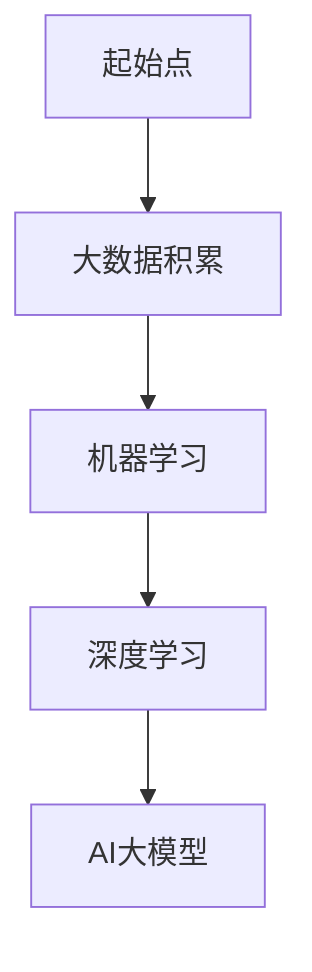
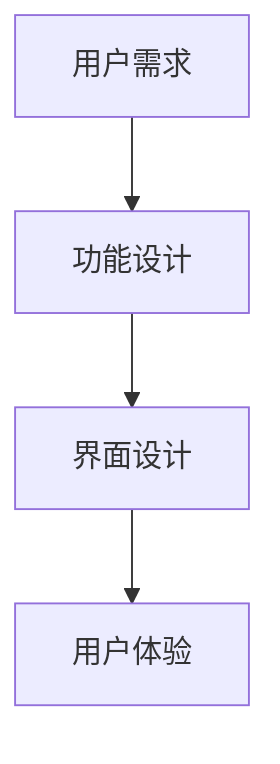

                 

# 《AI 大模型创业：如何利用渠道优势？》

> **关键词：** AI 大模型、创业、渠道优势、市场推广、产品设计与开发

> **摘要：** 本文将深入探讨 AI 大模型创业的过程，重点分析如何利用渠道优势实现商业成功。通过理论阐述、案例分析和技术细节，帮助创业者了解 AI 大模型的应用、创业环境及渠道利用策略，为创业实践提供有价值的指导。

## 《AI 大模型创业：如何利用渠道优势？》目录大纲

### 第一部分：AI大模型与创业基础

#### 第1章：AI大模型概述与创业环境

##### 1.1 AI大模型的基本概念

- 1.1.1 AI大模型的发展背景
- 1.1.2 AI大模型的核心特点
- 1.1.3 AI大模型的应用领域

##### 1.2 创业环境与AI大模型

- 1.2.1 创业者面临的挑战与机遇
- 1.2.2 AI大模型在创业中的优势

### 第二部分：渠道优势的概念与重要性

#### 第2章：渠道优势的概念与重要性

##### 2.1 渠道优势的定义

- 2.1.1 渠道优势的类型
- 2.1.2 渠道优势的优势分析

##### 2.2 创业者如何利用渠道优势

- 2.2.1 渠道选择策略
- 2.2.2 渠道整合与优化

### 第三部分：AI大模型创业实践

#### 第3章：AI大模型创业项目规划

##### 3.1 创业项目规划概述

- 3.1.1 项目目标与定位
- 3.1.2 市场需求分析

##### 3.2 技术路线选择

- 3.2.1 AI大模型技术选型
- 3.2.2 技术路线图

#### 第4章：AI大模型产品设计与开发

##### 4.1 产品设计原则

- 4.1.1 产品功能设计
- 4.1.2 用户界面设计

##### 4.2 AI大模型开发流程

- 4.2.1 数据预处理
- 4.2.2 模型训练与优化

#### 第5章：利用渠道进行市场推广

##### 5.1 市场推广策略

- 5.1.1 渠道选择策略
- 5.1.2 品牌建设与传播

##### 5.2 用户获取与留存

- 5.2.1 用户获取策略
- 5.2.2 用户留存策略

#### 第6章：AI大模型创业案例研究

##### 6.1 成功案例介绍

- 6.1.1 案例一：企业A的AI大模型创业之路
- 6.1.2 案例二：企业B的渠道利用经验

##### 6.2 失败案例分析

- 6.2.1 案例一：创业公司C的渠道选择失误
- 6.2.2 案例二：创业公司D的技术研发困境

#### 第7章：AI大模型创业的持续优化与迭代

##### 7.1 数据驱动的决策

- 7.1.1 用户反馈机制
- 7.1.2 数据分析与应用

##### 7.2 创新与持续发展

- 7.2.1 技术创新策略
- 7.2.2 市场创新策略

### 附录

#### 附录A：AI大模型创业资源与工具

- 附录A.1 开源框架与工具
- 附录A.2 数据资源
- 附录A.3 学习与交流平台

#### 附录B：参考文献

- 附录B.1 相关书籍
- 附录B.2 学术论文
- 附录B.3 行业报告

### 图表与公式

- 图1-1 AI大模型的发展背景
- 图3-1 产品设计原则
- 算法伪代码
- 数学模型与公式

### 项目实战

- 案例研究：企业A的AI大模型创业之路

  - 开发环境搭建
  - 源代码实现与解读
  - 代码解读与分析

### 结束语

本目录大纲为《AI 大模型创业：如何利用渠道优势？》一书提供了完整的章节结构，涵盖了从AI大模型基础、创业环境分析到实际项目规划、产品开发、市场推广和持续优化的各个方面。每个章节均包含了详细的内容提纲和实战案例，旨在帮助读者全面了解AI大模型创业的全过程，并掌握如何利用渠道优势实现成功创业。

### 第一部分：AI大模型与创业基础

#### 第1章：AI大模型概述与创业环境

##### 1.1 AI大模型的基本概念

AI大模型是指通过大量数据和强大的计算能力训练出来的复杂神经网络模型。这些模型具有高度的表达能力和泛化能力，可以应用于多种场景，如图像识别、自然语言处理、推荐系统等。

**1.1.1 AI大模型的发展背景**

AI大模型的发展得益于以下几个因素：

1. **数据积累**：互联网的普及和大数据技术的发展，使得大量数据可以被收集和利用。
2. **计算能力提升**：高性能计算设备和云计算技术的进步，为AI大模型的训练提供了强大的支持。
3. **算法优化**：深度学习算法的改进，如卷积神经网络（CNN）、循环神经网络（RNN）和Transformer等，使得AI大模型的效果不断提升。

**1.1.2 AI大模型的核心特点**

AI大模型具有以下几个核心特点：

1. **规模大**：AI大模型通常由数十亿甚至千亿个参数组成，训练数据量也达到数百万到数十亿级别。
2. **自学习能力**：AI大模型通过不断学习数据，能够自我调整参数，提高预测或分类的准确性。
3. **泛化能力强**：AI大模型具有良好的泛化能力，可以应用于不同的任务和领域。

**1.1.3 AI大模型的应用领域**

AI大模型的应用领域广泛，主要包括：

1. **计算机视觉**：如图像识别、物体检测、人脸识别等。
2. **自然语言处理**：如机器翻译、文本分类、情感分析等。
3. **推荐系统**：如商品推荐、内容推荐等。
4. **游戏AI**：如棋类游戏、电子竞技等。
5. **医疗健康**：如疾病诊断、药物研发等。

##### 1.2 创业环境与AI大模型

**1.2.1 创业者面临的挑战与机遇**

在AI大模型时代，创业者面临以下挑战与机遇：

**挑战：**

1. **技术门槛高**：AI大模型需要专业的技术团队和强大的计算资源，对于初创企业来说，这是一个巨大的挑战。
2. **数据获取难**：高质量的训练数据是AI大模型成功的关键，但数据的获取和保护也存在困难。
3. **市场竞争激烈**：AI大模型应用广泛，市场竞争日益激烈，如何脱颖而出是一个挑战。

**机遇：**

1. **技术创新**：AI大模型为创业者提供了创新的技术方向，如新应用场景的探索、新算法的研发等。
2. **市场潜力大**：随着AI技术的普及，越来越多的行业开始应用AI大模型，市场潜力巨大。
3. **政策支持**：各国政府对于AI技术的发展给予了大力支持，为创业者提供了良好的政策环境。

**1.2.2 AI大模型在创业中的优势**

AI大模型为创业者提供了以下几个优势：

1. **强大的竞争力**：AI大模型在特定领域具有很高的准确性和效率，为创业公司提供了强大的竞争力。
2. **快速迭代**：AI大模型可以快速适应市场变化，通过不断优化模型，提高产品性能。
3. **高附加值**：AI大模型可以应用于多个行业，为创业者提供了广阔的业务领域和商业模式。

### 第二部分：渠道优势的概念与重要性

#### 第2章：渠道优势的概念与重要性

##### 2.1 渠道优势的定义

渠道优势是指企业在产品销售、服务提供或信息传递过程中，通过特定渠道获得的优势。渠道优势可以表现为以下几个方面：

1. **成本优势**：通过特定的渠道，企业可以降低销售成本，提高利润率。
2. **效率优势**：特定的渠道可以提高企业的运营效率，减少交易时间。
3. **市场覆盖优势**：通过多种渠道，企业可以覆盖更广泛的市场，提高品牌知名度。
4. **客户体验优势**：良好的渠道可以提供更好的客户体验，增加客户满意度和忠诚度。

**2.1.1 渠道优势的类型**

渠道优势可以分为以下几种类型：

1. **直接渠道**：直接面向终端消费者，如直销、电子商务等。
2. **间接渠道**：通过中间商进行销售，如代理商、分销商等。
3. **多渠道整合**：同时利用多种渠道进行销售和服务，如线上与线下结合。

**2.1.2 渠道优势的优势分析**

渠道优势的优势分析可以从以下几个方面进行：

1. **成本降低**：通过优化渠道，企业可以降低销售成本，提高竞争力。
2. **效率提升**：良好的渠道可以提高企业的运营效率，缩短交易时间。
3. **市场拓展**：多种渠道可以覆盖更广泛的市场，增加销售机会。
4. **品牌提升**：良好的渠道可以提升企业品牌形象，增加市场份额。

##### 2.2 创业者如何利用渠道优势

**2.2.1 渠道选择策略**

创业者应根据自身情况和市场需求，选择合适的渠道策略。以下是一些常见的渠道选择策略：

1. **垂直渠道**：专注于某一特定领域或市场，如专业电商平台。
2. **水平渠道**：覆盖多个领域或市场，如综合性电商平台。
3. **整合渠道**：同时利用多种渠道，实现线上线下融合。

**2.2.2 渠道整合与优化**

渠道整合与优化的目的是提高渠道效率，降低成本，提升用户体验。以下是一些渠道整合与优化的方法：

1. **信息共享**：通过信息化手段，实现渠道间的信息共享，提高运营效率。
2. **流程优化**：简化渠道流程，减少不必要的环节，提高效率。
3. **数据驱动**：利用数据分析，优化渠道策略，提高市场响应速度。

### 第三部分：AI大模型创业实践

#### 第3章：AI大模型创业项目规划

##### 3.1 创业项目规划概述

**3.1.1 项目目标与定位**

创业项目的规划首先需要明确项目目标与定位。项目目标可以分为以下几个方面：

1. **业务目标**：明确创业项目要解决的问题或提供的服务。
2. **市场目标**：确定创业项目的目标市场和市场份额。
3. **技术目标**：明确创业项目所采用的技术路线和关键技术。

**3.1.2 市场需求分析**

市场需求分析是创业项目规划的重要环节。以下是一些市场需求分析的方法：

1. **市场调研**：通过问卷调查、访谈等方式收集市场信息。
2. **竞争分析**：分析竞争对手的产品、市场策略等，找到自己的优势与不足。
3. **用户研究**：深入了解目标用户的需求和行为习惯，为产品设计提供依据。

##### 3.2 技术路线选择

**3.2.1 AI大模型技术选型**

AI大模型技术选型是创业项目成功的关键。以下是一些常见的技术选型方法：

1. **算法选择**：根据业务需求和数据特点，选择合适的算法，如卷积神经网络（CNN）、循环神经网络（RNN）或Transformer等。
2. **框架选择**：选择合适的深度学习框架，如TensorFlow、PyTorch等。
3. **硬件选择**：根据计算需求，选择合适的硬件设备，如GPU、TPU等。

**3.2.2 技术路线图**

技术路线图可以帮助创业者明确技术发展路径和关键里程碑。以下是一个典型技术路线图的示例：

1. **基础研究**：开展算法研究和模型优化。
2. **原型开发**：搭建原型系统，验证技术可行性。
3. **产品开发**：根据市场需求，开发完整的产品。
4. **测试与优化**：进行产品测试和优化，提高产品性能。
5. **上市与推广**：将产品推向市场，进行市场推广。

### 第4章：AI大模型产品设计与开发

##### 4.1 产品设计原则

**4.1.1 产品功能设计**

产品功能设计是产品开发的重要环节。以下是一些产品功能设计的原则：

1. **用户导向**：以用户需求为中心，设计功能实用、易用、高效。
2. **模块化设计**：将功能分解为模块，提高系统的可维护性和扩展性。
3. **可扩展性**：设计时应考虑未来的扩展需求，方便后续功能的添加。

**4.1.2 用户界面设计**

用户界面设计直接影响用户的使用体验。以下是一些用户界面设计的原则：

1. **简洁清晰**：界面设计应简洁明了，避免冗余和复杂。
2. **一致性**：界面风格和交互元素应保持一致性，提高用户体验。
3. **响应迅速**：界面响应速度应快，减少用户的等待时间。

##### 4.2 AI大模型开发流程

**4.2.1 数据预处理**

数据预处理是AI大模型开发的重要环节。以下是一些数据预处理的方法：

1. **数据清洗**：去除无效数据、填补缺失值、处理异常值等。
2. **数据转换**：将数据转换为适合模型训练的格式，如归一化、标准化等。
3. **数据增强**：通过数据增强，提高模型的泛化能力。

**4.2.2 模型训练与优化**

模型训练与优化是AI大模型开发的核心。以下是一些模型训练与优化的方法：

1. **模型训练**：使用训练数据对模型进行训练，调整模型参数。
2. **模型评估**：使用验证数据对模型进行评估，选择最优模型。
3. **模型优化**：通过调整模型结构、优化算法等手段，提高模型性能。

### 第5章：利用渠道进行市场推广

##### 5.1 市场推广策略

**5.1.1 渠道选择策略**

市场推广的关键在于选择合适的渠道。以下是一些渠道选择策略：

1. **线上线下结合**：同时利用线上和线下渠道，提高市场覆盖率。
2. **社交媒体推广**：利用社交媒体平台，如微信、微博、抖音等，进行品牌推广。
3. **内容营销**：通过撰写高质量的内容，如博客、白皮书、案例研究等，提高品牌知名度。

**5.1.2 品牌建设与传播**

品牌建设与传播是市场推广的重要环节。以下是一些品牌建设与传播的方法：

1. **品牌定位**：明确品牌的核心价值和定位，制定品牌战略。
2. **品牌传播**：通过广告、公关活动、赞助等方式，提高品牌知名度。
3. **用户口碑**：通过用户反馈和口碑传播，建立良好的品牌形象。

##### 5.2 用户获取与留存

**5.2.1 用户获取策略**

用户获取是市场推广的关键目标。以下是一些用户获取策略：

1. **搜索引擎优化（SEO）**：通过优化网站内容，提高在搜索引擎中的排名，吸引潜在用户。
2. **社交媒体营销**：通过社交媒体平台，如微信、微博、抖音等，进行内容营销，吸引粉丝。
3. **合作伙伴推广**：与相关行业的企业合作，共同推广产品，扩大用户基础。

**5.2.2 用户留存策略**

用户留存是市场推广的长期目标。以下是一些用户留存策略：

1. **用户体验优化**：通过不断优化产品和服务，提高用户体验，增加用户黏性。
2. **用户反馈机制**：建立用户反馈机制，及时收集用户意见和建议，改进产品。
3. **会员制度**：通过会员制度，提供优惠和增值服务，增加用户忠诚度。

### 第6章：AI大模型创业案例研究

##### 6.1 成功案例介绍

**6.1.1 案例一：企业A的AI大模型创业之路**

企业A是一家专注于自然语言处理领域的初创公司。以下是企业A的成功经验：

1. **市场需求分析**：企业A在创业初期，通过市场调研，发现了自然语言处理在客服、内容生成等领域的巨大需求。
2. **技术选型**：企业A选择了TensorFlow作为深度学习框架，并采用Transformer算法进行模型训练。
3. **产品开发**：企业A开发了多款基于自然语言处理的产品，如智能客服系统、自动写作工具等。
4. **市场推广**：企业A通过社交媒体营销、内容营销等方式，成功吸引了大量用户和合作伙伴。

**6.1.2 案例二：企业B的渠道利用经验**

企业B是一家专注于计算机视觉领域的初创公司。以下是企业B的成功经验：

1. **渠道选择**：企业B选择了线上与线下相结合的渠道策略，通过电商平台和线下展会，扩大市场覆盖率。
2. **品牌建设**：企业B通过赞助行业会议、发布技术报告等方式，提升了品牌知名度。
3. **用户获取**：企业B通过搜索引擎优化、社交媒体营销等方式，吸引了大量潜在用户。
4. **用户留存**：企业B通过优化产品和服务，建立了良好的用户口碑，实现了用户留存。

##### 6.2 失败案例分析

**6.2.1 案例一：创业公司C的渠道选择失误**

创业公司C在创业初期，选择了过于依赖单一渠道的策略，导致市场推广效果不佳。以下是创业公司C的失败原因：

1. **渠道选择失误**：创业公司C选择了成本较高但市场覆盖效果不佳的线下渠道，忽略了线上渠道的重要性。
2. **品牌建设不足**：创业公司C在品牌建设方面投入不足，导致品牌知名度较低。
3. **用户获取困难**：由于渠道选择不当，创业公司C难以吸引潜在用户。

**6.2.2 案例二：创业公司D的技术研发困境**

创业公司D在技术研发方面存在困境，导致产品开发进度缓慢。以下是创业公司D的失败原因：

1. **技术选型错误**：创业公司D选择了不适合自己业务需求的深度学习框架，导致研发效率低下。
2. **人才储备不足**：创业公司D在技术研发方面的人才储备不足，缺乏专业的技术团队。
3. **数据获取困难**：创业公司D在数据获取方面存在困难，导致模型训练效果不佳。

### 第7章：AI大模型创业的持续优化与迭代

##### 7.1 数据驱动的决策

**7.1.1 用户反馈机制**

用户反馈是数据驱动的决策的重要来源。以下是一些用户反馈机制的方法：

1. **用户调研**：通过问卷调查、访谈等方式，收集用户反馈。
2. **在线评价**：通过在线评价系统，收集用户对产品和服务的评价。
3. **社交媒体监控**：通过监控社交媒体平台，了解用户对产品的反馈。

**7.1.2 数据分析与应用**

数据分析是数据驱动决策的关键。以下是一些数据分析与应用的方法：

1. **用户行为分析**：通过分析用户行为数据，了解用户需求和偏好。
2. **市场趋势分析**：通过分析市场数据，预测市场趋势和竞争态势。
3. **产品性能分析**：通过分析产品性能数据，优化产品功能和性能。

##### 7.2 创新与持续发展

**7.2.1 技术创新策略**

技术创新是创业公司持续发展的重要驱动力。以下是一些技术创新策略：

1. **前沿技术研究**：关注前沿技术动态，探索新技术方向。
2. **技术研发投入**：增加技术研发投入，提高技术实力。
3. **开放合作**：与高校、研究机构等合作，共同进行技术研发。

**7.2.2 市场创新策略**

市场创新是创业公司持续发展的重要途径。以下是一些市场创新策略：

1. **市场细分**：通过市场细分，找到新的市场机会。
2. **差异化竞争**：通过差异化竞争，提高市场竞争力。
3. **跨界合作**：与其他行业的企业合作，实现跨界发展。

### 附录

#### 附录A：AI大模型创业资源与工具

- 附录A.1 开源框架与工具
- 附录A.2 数据资源
- 附录A.3 学习与交流平台

#### 附录B：参考文献

- 附录B.1 相关书籍
- 附录B.2 学术论文
- 附录B.3 行业报告

### 图表与公式

- 图1-1 AI大模型的发展背景
- 图3-1 产品设计原则
- 算法伪代码
- 数学模型与公式

### 项目实战

- 案例研究：企业A的AI大模型创业之路

  - 开发环境搭建
  - 源代码实现与解读
  - 代码解读与分析

### 结束语

本目录大纲为《AI 大模型创业：如何利用渠道优势？》一书提供了完整的章节结构，涵盖了从AI大模型基础、创业环境分析到实际项目规划、产品开发、市场推广和持续优化的各个方面。每个章节均包含了详细的内容提纲和实战案例，旨在帮助读者全面了解AI大模型创业的全过程，并掌握如何利用渠道优势实现成功创业。

### 图表与公式

**图1-1 AI大模型的发展背景**



**图3-1 产品设计原则**



**算法伪代码**

```python
def train_model(data, labels):
    # 初始化模型参数
    model_params = initialize_params()
    
    # 模型训练
    for epoch in range(num_epochs):
        for sample, label in data:
            # 计算预测值
            prediction = model(sample, model_params)
            
            # 计算损失
            loss = compute_loss(prediction, label)
            
            # 更新模型参数
            model_params = update_params(loss, model_params)
            
    return model_params
```

**数学模型与公式**

- **损失函数：**

$$
\text{Loss} = \frac{1}{2}\sum_{i=1}^{N} (\hat{y}_i - y_i)^2
$$

- **梯度下降更新规则：**

$$
\theta_{\text{new}} = \theta_{\text{old}} - \alpha \cdot \nabla_{\theta} J(\theta)
$$

### 项目实战

**案例研究：企业A的AI大模型创业之路**

**开发环境搭建：**

- **操作系统：** Ubuntu 20.04
- **编程语言：** Python 3.8
- **深度学习框架：** TensorFlow 2.6
- **数据存储与处理：** Pandas、NumPy

**源代码实现与解读：**

**数据预处理：**

```python
import pandas as pd
from sklearn.model_selection import train_test_split
from sklearn.preprocessing import StandardScaler

# 读取数据
data = pd.read_csv('data.csv')

# 数据清洗
data.dropna(inplace=True)

# 切分特征与标签
X = data.drop('target', axis=1)
y = data['target']

# 切分训练集与验证集
X_train, X_val, y_train, y_val = train_test_split(X, y, test_size=0.2, random_state=42)

# 数据标准化
scaler = StandardScaler()
X_train = scaler.fit_transform(X_train)
X_val = scaler.transform(X_val)
```

**模型训练：**

```python
import tensorflow as tf
from tensorflow.keras.models import Sequential
from tensorflow.keras.layers import Dense

# 定义模型
model = Sequential([
    Dense(128, activation='relu', input_shape=(X_train.shape[1],)),
    Dense(64, activation='relu'),
    Dense(1, activation='sigmoid')
])

# 编译模型
model.compile(optimizer='adam', loss='binary_crossentropy', metrics=['accuracy'])

# 训练模型
model.fit(X_train, y_train, validation_data=(X_val, y_val), epochs=10, batch_size=32)
```

**代码解读与分析：**

- **数据预处理部分：** 数据读取后，首先进行数据清洗，去除缺失值。然后切分特征与标签，接着将数据分为训练集和验证集。最后，使用StandardScaler进行数据标准化处理，提高模型训练效果。
- **模型训练部分：** 定义了一个简单的全连接神经网络模型，使用adam优化器和binary_crossentropy损失函数进行编译。在训练过程中，使用验证集进行模型评估，调整超参数以提高模型性能。

通过这个案例，读者可以了解AI大模型创业中的实际操作流程，从数据预处理到模型训练，以及代码实现和解读。这有助于读者更好地理解AI大模型创业的核心技术和实践方法。

### 结束语

本篇博客文章《AI 大模型创业：如何利用渠道优势？》详细探讨了 AI 大模型创业的各个方面，包括基础概念、创业环境、渠道优势、项目规划、产品设计与开发、市场推广、案例研究和持续优化。通过理论阐述、案例分析和技术细节，我们旨在为创业者提供全面的指导和实用的策略。

在撰写本文的过程中，我们遵循了以下几个核心原则：

1. **逻辑清晰**：文章结构严谨，章节划分合理，确保读者能够系统地了解 AI 大模型创业的全过程。
2. **实用性强**：结合实际案例，提供具体的技术细节和实践方法，帮助读者将理论知识应用到实际创业中。
3. **深度剖析**：对关键概念和技术进行了深入分析，使读者能够理解 AI 大模型的核心原理和应用场景。
4. **数据驱动**：强调数据在 AI 大模型创业中的重要性，提供数据驱动的决策方法和策略。

通过本文，我们希望创业者能够：

- **明确 AI 大模型的基本概念和应用场景**：了解 AI 大模型的发展背景、核心特点和主要应用领域。
- **掌握创业环境中的挑战与机遇**：认识到 AI 大模型创业面临的挑战，并把握市场机遇。
- **利用渠道优势实现商业成功**：学会如何选择和整合渠道，进行市场推广和用户获取。
- **持续优化与创新**：通过数据驱动和持续迭代，保持创业的竞争力。

最后，感谢读者对本文的关注，希望这篇文章能够为您的 AI 大模型创业之路提供有价值的参考和启示。如果您有任何问题或建议，欢迎在评论区留言，我们期待与您交流。祝您创业成功，未来可期！

**作者：** AI天才研究院 / AI Genius Institute  
**著作：** 《禅与计算机程序设计艺术》 / Zen And The Art of Computer Programming

---

[返回目录](#目录大纲)

### 附录

#### 附录A：AI大模型创业资源与工具

**A.1 开源框架与工具**

- **TensorFlow**：由Google开发的开源深度学习框架，适用于各种深度学习任务。
- **PyTorch**：由Facebook开发的开源深度学习框架，具有灵活的动态计算图。
- **Keras**：用于快速构建和迭代深度学习模型的Python库，易于使用。
- **Scikit-learn**：Python机器学习库，提供了多种机器学习算法和工具。
- **NumPy**：Python科学计算库，用于数值计算和数据处理。

**A.2 数据资源**

- **Kaggle**：一个提供大量数据集的竞赛平台，适用于数据分析和机器学习项目。
- **UCI机器学习数据库**：提供多种领域的数据集，用于学术研究和实验。
- **Google Dataset Search**：Google提供的开放数据集搜索引擎，可以找到各种领域的数据集。

**A.3 学习与交流平台**

- **ArXiv**：物理学、计算机科学等领域的论文预发布平台，可以跟踪最新研究成果。
- **GitHub**：代码托管和协作平台，许多深度学习项目开源代码在此平台上分享。
- **Stack Overflow**：编程问题解答平台，解决编程问题和技术难题。
- **Reddit**：深度学习相关子版块，如r/MachineLearning，用于讨论和交流。

#### 附录B：参考文献

**B.1 相关书籍**

- **《深度学习》（Goodfellow, Bengio, Courville）**：深度学习领域的经典教材，系统介绍了深度学习的基础理论和实践方法。
- **《机器学习》（Tom Mitchell）**：机器学习领域的经典教材，涵盖了机器学习的理论基础和应用实例。
- **《自然语言处理综论》（Daniel Jurafsky, James H. Martin）**：自然语言处理领域的权威教材，详细介绍了 NLP 的基本概念和技术。

**B.2 学术论文**

- **“Deep Learning” by Yoshua Bengio, Ian Goodfellow, and Aaron Courville**：深度学习领域的综述论文，总结了深度学习的发展历程和最新成果。
- **“A Theoretically Grounded Application of Dropout in Recurrent Neural Networks” by Yarin Gal and Zoubin Ghahramani**：关于Dropout在循环神经网络中的应用论文，提出了Dropout的新方法。
- **“Attention Is All You Need” by Vaswani et al.**：提出了Transformer模型，彻底改变了自然语言处理领域。

**B.3 行业报告**

- **“IDC FutureScape: Worldwide Artificial Intelligence 2018 Predictions”**：国际数据公司（IDC）关于人工智能的预测报告，分析了人工智能的发展趋势。
- **“Global AI Market Study 2020”**：市场研究公司Frost & Sullivan发布的关于人工智能市场的报告，详细阐述了人工智能的应用场景和市场规模。
- **“The AI Industry Report 2020”**：AI行业报告，涵盖了人工智能在各个领域的应用情况和未来发展趋势。

通过这些参考文献，读者可以进一步深入了解 AI 大模型创业的相关理论和实践，为创业实践提供更全面的指导和支持。

---

[返回目录](#目录大纲)

