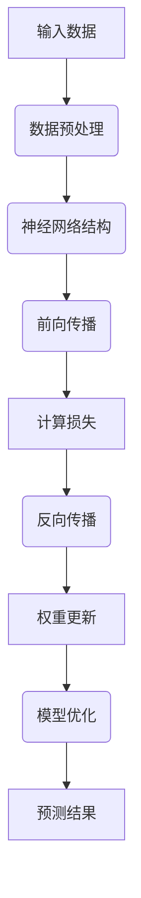

                 

## AI 大模型创业：如何利用经济优势？

关键词：AI 大模型，创业，经济优势，商业模式，技术挑战

摘要：随着人工智能技术的飞速发展，AI 大模型已经成为了一个重要的研究领域和应用领域。在本文中，我们将深入探讨 AI 大模型创业的经济优势，分析创业机会与市场前景，并提供实用的创业策略和项目管理方法。

### 第一部分: AI 大模型基础知识

#### 第1章: AI 大模型概述

##### 1.1 AI 大模型的概念

AI 大模型是指那些规模庞大、参数数量极多、能够处理复杂数据的机器学习模型，通常用于深度学习领域。这些模型通常采用分布式计算和优化算法，以实现高效的数据处理和模型训练。

###### 1.1.1 AI 大模型的定义

AI 大模型是指那些规模庞大、参数数量极多、能够处理复杂数据的机器学习模型，通常用于深度学习领域。这些模型通常采用分布式计算和优化算法，以实现高效的数据处理和模型训练。

###### 1.1.2 AI 大模型的特点

- **规模大**：参数数量通常达到数十亿至数万亿级别。
- **计算需求高**：训练和推理过程中需要大量的计算资源。
- **通用性强**：可以应用于多种任务，如文本生成、图像识别、自然语言理解等。

##### 1.2 主流 AI 大模型简介

主流的 AI 大模型包括 GPT 系列模型、BERT 模型和其他知名的大模型。

###### 1.2.1 GPT 系列模型

GPT（Generative Pre-trained Transformer）系列模型，如 GPT-3，是由 OpenAI 开发的自然语言处理模型，具有强大的文本生成和理解能力。

###### 1.2.2 BERT 模型

BERT（Bidirectional Encoder Representations from Transformers）是由 Google 开发的预训练语言表示模型，能够在多种自然语言处理任务中达到高水平的表现。

###### 1.2.3 其他知名 AI 大模型

除了 GPT 和 BERT，还有诸如 Transformer、Turing-NLG、XLNet 等知名的大模型。

#### 第2章: AI 大模型技术基础

##### 2.1 深度学习基础

深度学习是人工智能的重要分支，是构建 AI 大模型的基础。

###### 2.1.1 神经网络原理

神经网络是由大量相互连接的神经元组成的计算模型，能够通过学习从数据中提取特征并做出预测。

###### 2.1.2 反向传播算法

反向传播是一种训练神经网络的方法，通过计算输出误差梯度来更新网络权重，以优化模型性能。

##### 2.2 自然语言处理

自然语言处理是 AI 大模型的重要应用领域，涉及词嵌入、序列模型和注意力机制等技术。

###### 2.2.1 词嵌入技术

词嵌入是将单词映射到固定维度的高维向量，用于捕捉单词的语义信息。

###### 2.2.2 序列模型与注意力机制

序列模型用于处理时间序列数据，注意力机制用于在处理序列数据时强调重要的部分。

###### 2.2.3 转换器架构

转换器（Transformer）是一种基于注意力机制的深度学习模型，广泛用于机器翻译、文本摘要等任务。

##### 2.3 大规模预训练模型原理

大规模预训练模型是 AI 大模型的关键技术之一。

###### 2.3.1 预训练概念

预训练是指在大规模数据集上训练模型，使其能够学习到通用特征。

###### 2.3.2 自监督学习

自监督学习是一种无需人工标注数据的学习方法，通过利用未标注数据中的内在结构来训练模型。

###### 2.3.3 微调技术

微调是在预训练模型的基础上，利用特定领域的标注数据进一步训练模型，以适应特定任务的需求。

### 第二部分: AI 大模型应用与创业

#### 第3章: AI 大模型应用场景

AI 大模型在各个领域都有广泛的应用，包括商业智能、智能客服和内容生成等。

##### 3.1 商业智能与数据分析

AI 大模型在商业智能和数据分析中的应用，如客户行为分析、市场预测等。

##### 3.2 智能客服与语音助手

利用 AI 大模型构建智能客服系统，提升客户服务体验。

##### 3.3 内容生成与创作

利用 AI 大模型生成高质量的内容，如新闻报道、音乐创作等。

#### 第4章: AI 大模型创业策略

AI 大模型创业需要明确市场定位、构建技术优势，并制定有效的商业模式。

##### 4.1 创业机会与市场分析

分析 AI 大模型在不同行业中的创业机会和市场前景。

##### 4.2 技术与市场匹配

如何将 AI 大模型技术有效地与市场需求匹配，以实现商业化。

##### 4.3 创业团队构建

构建一支具备 AI 技术和行业经验的创业团队。

#### 第5章: AI 大模型商业模式

AI 大模型商业模式的制定需要考虑产品服务模式、收入模式和竞争策略。

##### 5.1 产品设计与服务模式

设计 AI 大模型产品的功能和服务模式。

##### 5.2 收入模式与创新

探讨 AI 大模型的收入模式和创新方式。

##### 5.3 竞争策略与差异化

在激烈的市场竞争中，如何制定有效的竞争策略并实现差异化。

#### 第6章: AI 大模型创业实战

AI 大模型创业实战需要成功案例、创业者经验分享和风险管理。

##### 6.1 项目案例研究

分析几个成功的 AI 大模型创业项目，包括其成功因素和挑战。

##### 6.2 创业者经验分享

与成功创业者交流，分享他们在 AI 大模型创业过程中的经验教训。

##### 6.3 风险管理

如何识别和应对 AI 大模型创业过程中可能遇到的风险。

### 第三部分: AI 大模型的技术挑战与未来趋势

#### 第7章: AI 大模型的技术挑战

AI 大模型的技术挑战包括计算资源需求、数据隐私与伦理和模型解释性与可解释性等。

##### 7.1 计算资源需求

探讨 AI 大模型对计算资源的需求，包括硬件设施和能耗。

##### 7.2 数据隐私与伦理

分析 AI 大模型在数据处理过程中面临的隐私保护和伦理问题。

##### 7.3 模型解释性与可解释性

研究如何提高 AI 大模型的解释性，使其决策过程更加透明和可理解。

#### 第8章: AI 大模型的未来发展趋势

AI 大模型的未来发展趋势包括大模型与边缘计算、大模型与区块链和 AI 大模型的社会影响等。

##### 8.1 大模型与边缘计算

探讨大模型与边缘计算的结合，实现更高效、实时的人工智能应用。

##### 8.2 大模型与区块链

研究 AI 大模型在区块链领域的应用，如何利用区块链技术提高大模型的安全性和可信度。

##### 8.3 AI 大模型的社会影响

分析 AI 大模型对社会、经济和人类生活方式的深远影响。

## 附录

### 附录A: AI 大模型开发工具与资源

##### A.1 开发工具介绍

介绍主流的 AI 大模型开发工具，如 TensorFlow、PyTorch、PyTorch-Fairseq 等。

##### A.2 资源链接

提供 AI 大模型相关的教程、论文、开源项目和社区资源链接。

##### A.3 实践指南

为开发者提供 AI 大模型开发的实践指南，包括环境搭建、模型训练与优化等。

### 总结

AI 大模型创业是一个充满机遇和挑战的领域。通过深入理解 AI 大模型的基础知识、应用场景和创业策略，创业者可以更好地利用经济优势，实现商业化和可持续发展。同时，面对技术挑战，创业者需要不断学习和创新，为未来的人工智能发展做出贡献。

### 作者信息

作者：AI 天才研究院/AI Genius Institute & 禅与计算机程序设计艺术 /Zen And The Art of Computer Programming

### Mermaid 流程图

以下是关于神经网络原理的 Mermaid 流程图：



### 伪代码

以下是关于反向传播算法的伪代码：

```python
def backward_propagation(actual_output, predicted_output, model_weights):
    # 计算损失
    loss = compute_loss(actual_output, predicted_output)
    
    # 计算梯度
    gradients = compute_gradients(predicted_output, model_weights)
    
    # 更新权重
    updated_weights = update_weights(model_weights, gradients)
    
    # 返回损失和更新后的权重
    return loss, updated_weights
```

### 数学模型和公式

以下是关于神经网络损失函数的数学模型和公式：

$$
损失(L) = \frac{1}{2} \sum_{i=1}^{n} (y_i - \hat{y}_i)^2
$$

其中，$y_i$ 为实际输出，$\hat{y}_i$ 为预测输出，$n$ 为样本数量。

### 代码实际案例和详细解释

以下是一个使用 TensorFlow 和 Keras 库搭建神经网络并进行训练的代码案例：

```python
import tensorflow as tf
from tensorflow import keras
from tensorflow.keras import layers

# 定义神经网络模型
model = keras.Sequential([
    layers.Dense(128, activation='relu', input_shape=(784,)),
    layers.Dense(10, activation='softmax')
])

# 编译模型
model.compile(optimizer='adam',
              loss='sparse_categorical_crossentropy',
              metrics=['accuracy'])

# 加载MNIST数据集
mnist = keras.datasets.mnist
(train_images, train_labels), (test_images, test_labels) = mnist.load_data()

# 数据预处理
train_images = train_images.reshape((60000, 784))
test_images = test_images.reshape((10000, 784))

# 将数据类型转换为浮点数
train_images = train_images.astype('float32')
test_images = test_images.astype('float32')

# 标准化数据
train_images /= 255
test_images /= 255

# 训练模型
model.fit(train_images, train_labels, epochs=5)

# 评估模型
test_loss, test_acc = model.evaluate(test_images, test_labels)
print(f"Test accuracy: {test_acc}")
```

#### 开发环境搭建

1. 安装 Python 3.7 或以上版本。
2. 安装 TensorFlow：使用 `pip install tensorflow` 命令。
3. 安装 Keras：使用 `pip install keras` 命令。

#### 源代码详细实现

以上代码首先定义了一个简单的神经网络模型，包括一个输入层、一个隐藏层和一个输出层。输入层包含 784 个神经元，隐藏层包含 128 个神经元，输出层包含 10 个神经元（对应数字 0-9）。

#### 代码解读与分析

1. **模型定义**：使用 `keras.Sequential` 类定义模型，并将层按顺序添加到序列中。
2. **编译模型**：使用 `compile` 方法编译模型，指定优化器、损失函数和评估指标。
3. **加载数据集**：使用 `keras.datasets.mnist` 加载 MNIST 数据集。
4. **数据预处理**：将图像数据 reshape 成 (60000, 784) 和 (10000, 784)，并将数据类型转换为浮点数。
5. **标准化数据**：将图像数据除以 255，以标准化数据。
6. **训练模型**：使用 `fit` 方法训练模型，指定训练数据、训练轮数和批量大小。
7. **评估模型**：使用 `evaluate` 方法评估模型在测试数据上的性能。

通过以上步骤，我们成功搭建了一个简单的神经网络模型，并使用 MNIST 数据集进行了训练和评估。#### 实践指南

1. **环境搭建**：
   - 确保安装了 Python 3.7 或以上版本。
   - 使用以下命令安装 TensorFlow 和 Keras：
     ```shell
     pip install tensorflow
     pip install keras
     ```

2. **数据预处理**：
   - 对于图像数据，通常需要将图像转换为灰度图像或 RGB 图像，并调整图像大小。
   - 将数据转换为浮点数，并进行标准化，以便神经网络能够更好地处理。

3. **模型训练**：
   - 选择合适的神经网络架构，如全连接层（`Dense`）、卷积层（`Conv2D`）等。
   - 使用 `fit` 方法进行模型训练，设置训练轮数（`epochs`）和批量大小（`batch_size`）。
   - 监控损失函数和准确率等指标，以调整模型性能。

4. **模型评估**：
   - 使用 `evaluate` 方法评估模型在测试数据上的性能。
   - 分析模型的准确率、召回率、F1 分数等指标，以评估模型的泛化能力。

5. **模型部署**：
   - 将训练好的模型保存到文件中，以便后续使用。
   - 使用 `load_model` 方法加载模型，并进行预测。

6. **常见问题**：
   - 模型过拟合：增加训练数据、使用正则化技术、增加模型复杂度等。
   - 训练时间过长：减小批量大小、增加学习率等。
   - 预测性能不佳：调整模型参数、增加训练轮数等。

通过以上实践指南，开发者可以更有效地搭建和训练 AI 大模型，并解决常见的实践问题。#### 附录

##### 附录 A: AI 大模型开发工具与资源

- **开发工具介绍**：
  - **TensorFlow**：Google 开发的开源机器学习框架。
  - **PyTorch**：Facebook 开发的开源深度学习框架。
  - **PyTorch-Fairseq**：Facebook 开发用于大规模序列模型训练的库。

- **资源链接**：
  - **教程**：[TensorFlow 官方文档](https://www.tensorflow.org/tutorials)、[PyTorch 官方文档](https://pytorch.org/tutorials/)。
  - **论文**：[GPT-3](https://arxiv.org/abs/2005.14165)、[BERT](https://arxiv.org/abs/1810.04805)。
  - **开源项目**：[TensorFlow Model Zoo](https://github.com/tensorflow/models)、[PyTorch Model Zoo](https://github.com/pytorch/zoo)。
  - **社区资源**：[TensorFlow Community](https://www.tensorflow.org/community/)、[PyTorch Forum](https://discuss.pytorch.org/)。

- **实践指南**：
  - **环境搭建**：介绍如何在不同操作系统上搭建 TensorFlow 和 PyTorch 环境。
  - **模型训练**：提供详细的模型训练步骤和最佳实践。
  - **模型优化**：介绍如何优化模型性能，包括调整超参数、使用正则化技术等。

通过附录中的工具与资源，开发者可以更好地了解和掌握 AI 大模型的开发技巧和最佳实践。### 总结

AI 大模型创业是一个充满机遇和挑战的领域。通过本文，我们详细探讨了 AI 大模型的基础知识、应用场景、创业策略和技术挑战。我们提出了如何利用经济优势，实现商业化和可持续发展。同时，我们也介绍了如何在实践中搭建和优化 AI 大模型，并提供了一系列实用的开发工具与资源。

在创业过程中，创业者需要不断学习和创新，紧跟技术发展趋势，把握市场机遇。面对技术挑战，创业者应积极应对，如提高模型解释性、优化计算资源利用、保护数据隐私等。通过有效的创业策略和风险管理，创业者可以在这片充满机遇的领域取得成功。

让我们共同期待 AI 大模型创业的未来，它将为我们的生活、经济和社会带来更多的创新和变革。

### 作者信息

作者：AI 天才研究院/AI Genius Institute & 禅与计算机程序设计艺术 /Zen And The Art of Computer Programming

