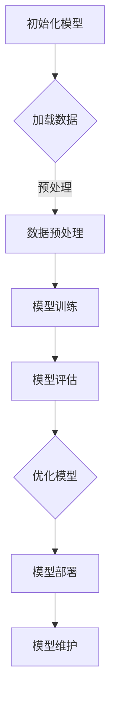
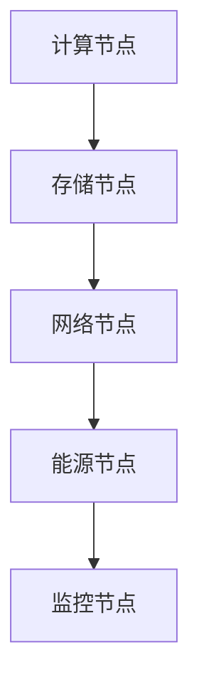
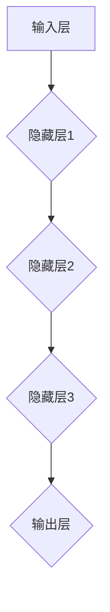
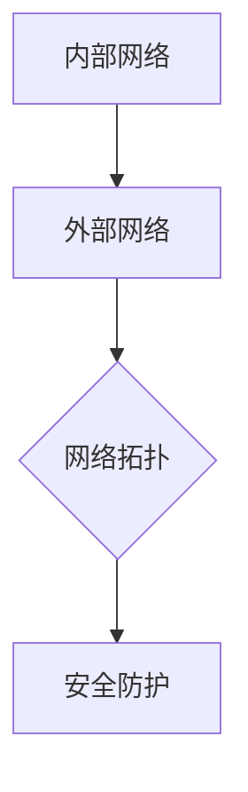

                 

### 文章标题：AI 大模型应用数据中心建设：数据中心产业发展

> **关键词**：AI 大模型、数据中心建设、产业发展、技术应用、未来展望

> **摘要**：本文将深入探讨人工智能大模型在数据中心建设中的应用，分析数据中心产业发展背景、现状及未来趋势，旨在为业界提供有价值的参考和指导。文章通过具体案例分析，详细描述了AI大模型数据中心的建设方法和运维管理策略，同时提出了未来发展展望和挑战，以期为数据中心产业的可持续发展提供支持。

### 第一部分：AI 大模型应用概述

在当今数字化时代，人工智能（AI）已经成为推动社会进步的重要力量。尤其是近年来，人工智能大模型（Large-scale AI Models）的崛起，为各个行业带来了前所未有的变革。本部分将介绍AI大模型的基础知识，分析其在数据中心建设中的应用，为后续内容打下坚实的基础。

#### 第1章：AI 大模型基础

##### 1.1 AI 大模型的概念与分类

AI 大模型是指参数量达到百万、千万乃至亿级别的神经网络模型。这些模型基于深度学习技术，通过对海量数据进行训练，能够自动学习和提取数据的内在规律。按照模型的应用场景和功能，AI 大模型可以分为以下几类：

1. **自然语言处理（NLP）模型**：如BERT、GPT等，用于文本生成、翻译、问答等任务。
2. **计算机视觉（CV）模型**：如ResNet、Inception等，用于图像分类、目标检测、人脸识别等任务。
3. **推荐系统模型**：如DeepFM、DIN等，用于电商推荐、广告投放等任务。
4. **生成对抗网络（GAN）模型**：如StyleGAN、CycleGAN等，用于图像生成、风格迁移等任务。

##### 1.2 AI 大模型的核心特点

AI 大模型具有以下核心特点：

1. **高参数量**：AI 大模型通常拥有数百万至数十亿个参数，这使它们能够捕捉数据中的复杂模式。
2. **高计算需求**：由于参数量庞大，训练和推理过程需要大量计算资源，对硬件性能有较高要求。
3. **强泛化能力**：AI 大模型通过海量数据训练，能够实现较高的泛化能力，适用于多种不同的任务。
4. **自适应能力**：AI 大模型能够根据新的数据进行微调，适应不断变化的应用场景。

##### 1.3 AI 大模型的发展趋势

随着计算能力的提升和数据量的增加，AI 大模型的发展趋势表现为：

1. **模型参数量的增加**：研究者不断尝试构建更大规模的模型，以提高模型的表现。
2. **模型结构的创新**：通过设计新的网络架构和优化算法，提高模型训练和推理的效率。
3. **多模态融合**：结合不同类型的数据（如图像、文本、声音等），构建多模态的AI 大模型。
4. **自监督学习和迁移学习**：减少对标注数据的依赖，提高模型的训练效率。

##### 1.4 AI 大模型在数据中心建设中的应用

在数据中心建设过程中，AI 大模型的应用主要体现在以下几个方面：

1. **能耗优化**：通过预测数据中心的能耗模式，实现能源的高效利用。
2. **设备维护**：利用AI 大模型进行设备故障预测和诊断，降低设备维护成本。
3. **数据安全**：利用AI 大模型进行数据加密和访问控制，提高数据的安全性。
4. **性能优化**：通过模型优化算法，提高数据中心的计算和存储性能。

#### 第2章：数据中心产业发展分析

数据中心作为存储、处理和传输海量数据的重要基础设施，其发展对整个信息产业具有重要的推动作用。本节将分析数据中心产业的发展背景、现状、前景及发展趋势。

##### 2.1 数据中心产业的发展背景

数据中心产业的发展背景主要受到以下几个因素的推动：

1. **云计算的普及**：随着云计算的普及，企业对数据中心的需求不断增加。
2. **大数据的爆发**：大数据的爆发为数据中心的建设提供了巨大的市场需求。
3. **5G 时代的到来**：5G 时代的到来，使得数据中心成为连接万物的重要节点。
4. **物联网（IoT）的兴起**：物联网的发展，使得数据中心的处理能力和存储需求进一步提升。

##### 2.2 数据中心产业的现状与挑战

当前，数据中心产业面临着以下现状与挑战：

1. **市场快速增长**：全球数据中心市场保持快速增长，但市场增长速度逐渐放缓。
2. **竞争激烈**：国内外各大企业纷纷布局数据中心市场，竞争愈发激烈。
3. **能耗问题**：数据中心的能耗问题成为制约其发展的关键因素。
4. **安全问题**：数据中心的网络安全问题日益突出，成为产业发展的重要挑战。

##### 2.3 数据中心产业的前景与机遇

数据中心产业的前景与机遇主要表现在以下几个方面：

1. **云计算的进一步发展**：云计算的进一步发展，将推动数据中心市场的增长。
2. **人工智能的普及**：人工智能的普及，将提升数据中心的应用价值。
3. **绿色数据中心**：随着环保意识的提高，绿色数据中心将成为产业发展的重要趋势。
4. **多场景应用**：数据中心将在智能制造、智慧城市、智慧交通等多场景中得到广泛应用。

##### 2.4 数据中心产业的未来发展趋势

数据中心产业的未来发展趋势主要体现在以下几个方面：

1. **技术升级**：数据中心技术将持续升级，以提高性能、降低能耗。
2. **规模扩大**：数据中心规模将持续扩大，以满足不断增长的数据需求。
3. **网络化**：数据中心将实现网络化布局，形成区域数据中心集群。
4. **智能化**：数据中心将实现智能化管理，提高运营效率。

### 第二部分：AI 大模型应用数据中心建设

在数据中心建设中，AI 大模型的应用具有重要意义。本部分将详细介绍数据中心基础设施规划、AI 大模型数据中心平台搭建、AI 大模型应用案例分析等内容，以期为数据中心建设提供实际指导。

#### 第3章：数据中心基础设施规划

数据中心基础设施规划是数据中心建设的关键环节。本节将介绍数据中心架构设计、硬件选择、网络设计及能源管理等内容。

##### 3.1 数据中心架构设计

数据中心架构设计主要包括以下几个方面：

1. **计算架构**：根据业务需求，设计合理的计算架构，如分布式计算、集中式计算等。
2. **存储架构**：选择合适的存储架构，如分布式存储、集中式存储等。
3. **网络架构**：设计高效的网络架构，如数据中心内部网络、数据中心间网络等。
4. **安全架构**：构建完善的安全架构，如防火墙、入侵检测、数据加密等。

##### 3.2 数据中心硬件选择

数据中心硬件选择主要包括以下几个方面：

1. **服务器**：选择高性能、高可靠性的服务器，以满足数据处理需求。
2. **存储设备**：选择大容量、高吞吐量的存储设备，以适应数据存储需求。
3. **网络设备**：选择高性能、高可靠性的网络设备，如交换机、路由器等。
4. **电源设备**：选择高效、稳定的电源设备，以确保数据中心的稳定运行。

##### 3.3 数据中心网络设计

数据中心网络设计主要包括以下几个方面：

1. **内部网络设计**：设计高效的数据传输路径，提高数据传输速度。
2. **外部网络设计**：设计稳定的连接方式，确保数据中心与外部网络的可靠连接。
3. **网络拓扑设计**：选择合适的网络拓扑结构，如环网、星型网等，以提高网络可靠性。
4. **网络安全设计**：设计安全防护措施，如防火墙、入侵检测等，确保网络安全。

##### 3.4 数据中心能源管理

数据中心能源管理主要包括以下几个方面：

1. **能耗监测**：通过能耗监测系统，实时监控数据中心的能耗情况。
2. **能耗优化**：通过优化数据中心的能耗结构，降低能耗。
3. **绿色能源**：采用绿色能源，如太阳能、风能等，降低对传统能源的依赖。
4. **能效管理**：通过能效管理，提高数据中心的能源利用率。

#### 第4章：AI 大模型数据中心平台搭建

AI 大模型数据中心平台搭建是数据中心建设的重要环节。本节将介绍数据中心平台构建、AI 大模型框架部署、数据存储与处理、数据中心安全与隐私保护等内容。

##### 4.1 数据中心平台构建

数据中心平台构建主要包括以下几个方面：

1. **基础设施搭建**：搭建数据中心的硬件基础设施，如服务器、存储设备、网络设备等。
2. **软件环境搭建**：搭建数据中心的软件环境，如操作系统、数据库、中间件等。
3. **开发框架搭建**：搭建数据中心的开发框架，如深度学习框架、大数据处理框架等。
4. **管理平台搭建**：搭建数据中心的管理平台，如监控平台、运维平台等。

##### 4.2 AI 大模型框架部署

AI 大模型框架部署主要包括以下几个方面：

1. **模型训练**：使用训练数据进行模型训练，优化模型参数。
2. **模型部署**：将训练完成的模型部署到数据中心，实现实时推理。
3. **模型优化**：对模型进行优化，提高模型性能。
4. **模型维护**：对模型进行定期维护，更新模型参数。

##### 4.3 数据存储与处理

数据存储与处理主要包括以下几个方面：

1. **数据采集**：采集数据中心产生的各种数据，如日志数据、监控数据等。
2. **数据存储**：选择合适的数据存储方案，如分布式存储、云存储等。
3. **数据处理**：使用数据处理工具，对采集到的数据进行分析和处理。
4. **数据可视化**：将处理后的数据以可视化的形式展示，便于分析和决策。

##### 4.4 数据中心安全与隐私保护

数据中心安全与隐私保护主要包括以下几个方面：

1. **网络安全**：采用网络安全措施，防止网络攻击和数据泄露。
2. **数据加密**：对存储和传输的数据进行加密，确保数据安全性。
3. **访问控制**：设置访问控制策略，确保只有授权用户可以访问数据。
4. **隐私保护**：采用隐私保护技术，确保用户数据的隐私不被泄露。

#### 第5章：AI 大模型应用案例分析

本节将通过具体案例分析，展示AI 大模型在数据中心建设中的应用效果。

##### 5.1 案例一：智能客服系统

智能客服系统利用AI 大模型，实现自动语音识别（ASR）、自然语言处理（NLP）等功能，提供24小时全天候客服服务。通过案例分析，我们了解到：

1. **模型训练**：使用大量语音数据和文本数据进行模型训练，提高模型准确率。
2. **模型部署**：将训练完成的模型部署到数据中心，实现实时语音识别和对话生成。
3. **效果评估**：通过对客服系统的实际运行情况进行评估，发现模型性能良好，能够有效提高客服效率。

##### 5.2 案例二：智能图像识别系统

智能图像识别系统利用AI 大模型，实现图像分类、目标检测等功能，用于视频监控、人脸识别等领域。通过案例分析，我们了解到：

1. **模型训练**：使用大量图像数据进行模型训练，提高模型识别能力。
2. **模型部署**：将训练完成的模型部署到数据中心，实现实时图像识别和目标检测。
3. **效果评估**：通过对实际场景的测试，发现模型能够准确识别图像中的目标，提高了监控系统的智能化水平。

##### 5.3 案例三：智能推荐系统

智能推荐系统利用AI 大模型，实现用户兴趣建模、推荐算法等功能，提供个性化的推荐服务。通过案例分析，我们了解到：

1. **模型训练**：使用用户行为数据进行模型训练，提高模型对用户兴趣的捕捉能力。
2. **模型部署**：将训练完成的模型部署到数据中心，实现实时推荐。
3. **效果评估**：通过对推荐系统的实际运行情况进行评估，发现模型能够有效提高用户满意度，增加用户粘性。

##### 5.4 案例四：智能交通系统

智能交通系统利用AI 大模型，实现交通流量预测、路况分析等功能，提供智能化的交通管理服务。通过案例分析，我们了解到：

1. **模型训练**：使用交通数据、气象数据等进行模型训练，提高模型预测准确性。
2. **模型部署**：将训练完成的模型部署到数据中心，实现实时交通流量预测和路况分析。
3. **效果评估**：通过对实际交通场景的测试，发现模型能够有效缓解交通拥堵，提高交通运行效率。

#### 第6章：AI 大模型应用数据中心运维管理

数据中心运维管理是保证数据中心正常运行的重要环节。本节将介绍数据中心运维管理概述、数据中心监控与故障处理、数据中心性能优化、数据中心成本控制等内容。

##### 6.1 数据中心运维管理概述

数据中心运维管理主要包括以下几个方面：

1. **监控管理**：实时监控数据中心的运行状态，确保系统稳定运行。
2. **故障管理**：及时发现和处理故障，降低故障对业务的影响。
3. **性能优化**：通过优化数据中心性能，提高业务处理效率。
4. **安全管理**：保障数据中心的网络安全，防止数据泄露和攻击。

##### 6.2 数据中心监控与故障处理

数据中心监控与故障处理主要包括以下几个方面：

1. **监控系统**：部署监控系统，实时采集数据中心的各项性能指标。
2. **故障预警**：通过分析监控数据，提前发现潜在故障，进行预警。
3. **故障处理**：根据故障类型和影响范围，制定相应的故障处理方案。
4. **故障恢复**：在故障发生时，快速恢复系统正常运行。

##### 6.3 数据中心性能优化

数据中心性能优化主要包括以下几个方面：

1. **硬件优化**：通过升级硬件设备，提高数据中心的计算能力和存储性能。
2. **软件优化**：通过优化操作系统、数据库、中间件等软件，提高数据中心的运行效率。
3. **网络优化**：通过优化网络架构和配置，提高数据传输速度和稳定性。
4. **负载均衡**：通过负载均衡技术，合理分配计算和存储资源，提高系统性能。

##### 6.4 数据中心成本控制

数据中心成本控制主要包括以下几个方面：

1. **能耗管理**：通过优化能耗结构，降低数据中心的能耗成本。
2. **硬件采购**：通过合理采购硬件设备，降低硬件成本。
3. **运维管理**：通过优化运维流程，提高运维效率，降低人力成本。
4. **外包服务**：通过外包部分运维任务，降低运维成本。

#### 第7章：未来展望与挑战

随着人工智能和数据中心技术的不断发展，未来数据中心产业将面临新的机遇和挑战。本节将对数据中心产业的未来展望和挑战进行分析。

##### 7.1 数据中心产业未来展望

数据中心产业未来的展望主要体现在以下几个方面：

1. **技术升级**：数据中心技术将持续升级，如AI 大模型的引入、边缘计算的普及等。
2. **应用拓展**：数据中心的应用将更加广泛，如智能制造、智慧城市、智慧交通等。
3. **绿色化发展**：数据中心产业将更加注重绿色化发展，降低能耗和环境污染。
4. **国际化布局**：数据中心产业将实现全球化布局，跨国数据中心集群将逐渐形成。

##### 7.2 AI 大模型应用的未来挑战

AI 大模型应用的未来挑战主要包括以下几个方面：

1. **计算资源需求**：随着AI 大模型规模的扩大，对计算资源的需求将不断增加。
2. **数据安全与隐私**：数据中心的数据安全与隐私保护将成为重要挑战。
3. **能耗管理**：数据中心能耗管理将面临更大压力，需要采取更加有效的措施降低能耗。
4. **技术人才短缺**：随着数据中心技术的发展，对技术人才的需求将不断增加，但现有人才储备不足。

##### 7.3 解决方案与建议

针对上述挑战，以下是一些建议和解决方案：

1. **提升计算能力**：通过引入更先进的计算技术和硬件，提升数据中心的计算能力。
2. **加强安全防护**：采取更加严格的安全措施，加强数据中心的网络安全和隐私保护。
3. **优化能耗管理**：通过引入绿色技术和节能措施，降低数据中心的能耗。
4. **培养技术人才**：加强数据中心相关技术人才的培养，提高人才储备。

##### 7.4 数据中心产业发展趋势

数据中心产业发展的趋势主要体现在以下几个方面：

1. **智能化**：数据中心将实现智能化管理，提高运营效率。
2. **绿色化**：数据中心将更加注重绿色化发展，降低能耗和环境污染。
3. **多样化**：数据中心的应用将更加多样化，满足不同行业的需求。
4. **国际化**：数据中心产业将实现全球化布局，跨国数据中心集群将逐渐形成。

### 附录

#### 附录 A：相关技术介绍

本附录将介绍与AI 大模型应用数据中心建设相关的一些技术，包括AI 大模型技术详解、数据中心建设技术概述及数据中心运维管理技术。

##### A.1 AI 大模型技术详解

本部分将详细讲解AI 大模型的相关技术，包括模型结构、训练算法、优化方法等。同时，通过Mermaid 流程图展示AI 大模型的训练过程。



##### A.2 数据中心建设技术概述

本部分将概述数据中心建设的相关技术，包括数据中心架构设计、硬件选择、网络设计、能源管理等。通过图表展示数据中心的基础设施。



##### A.3 数据中心运维管理技术

本部分将介绍数据中心运维管理的技术，包括监控管理、故障管理、性能优化、成本控制等。通过表格展示运维管理的具体内容。

| 运维管理内容 | 描述 |
| :--- | :--- |
| 监控管理 | 实时监控数据中心的各项性能指标，确保系统稳定运行 |
| 故障管理 | 及时发现和处理故障，降低故障对业务的影响 |
| 性能优化 | 通过优化数据中心性能，提高业务处理效率 |
| 成本控制 | 通过优化能耗结构、硬件采购等，降低数据中心运营成本 |

#### 附录 B：常用工具与资源

本附录将介绍与AI 大模型应用数据中心建设相关的常用工具和资源，包括AI 大模型开发工具、数据中心建设工具及数据中心运维管理工具。

##### B.1 AI 大模型开发工具

- **TensorFlow**：一款开源的深度学习框架，适用于AI 大模型的开发。
- **PyTorch**：一款开源的深度学习框架，提供灵活的动态计算图，适用于AI 大模型的开发。
- **Keras**：一款基于TensorFlow和Theano的开源深度学习框架，适用于AI 大模型的快速开发。

##### B.2 数据中心建设工具

- **OpenStack**：一款开源的云计算平台，用于数据中心的基础设施建设。
- **Docker**：一款开源的应用容器引擎，用于数据中心中的应用部署和管理。
- **Kubernetes**：一款开源的容器编排平台，用于数据中心中的容器化应用管理。

##### B.3 数据中心运维管理工具

- **Zabbix**：一款开源的监控解决方案，用于数据中心的各种监控需求。
- **Nagios**：一款开源的监控解决方案，用于数据中心的服务器、网络设备等监控。
- **Puppet**：一款开源的配置管理工具，用于数据中心的自动化部署和管理。

### 作者信息

**作者：AI天才研究院/AI Genius Institute & 禅与计算机程序设计艺术 /Zen And The Art of Computer Programming**

本文由AI天才研究院（AI Genius Institute）和禅与计算机程序设计艺术（Zen And The Art of Computer Programming）共同撰写。AI天才研究院致力于推动人工智能技术的发展，为业界提供先进的技术解决方案。禅与计算机程序设计艺术则强调计算机程序的简洁与优雅，为程序员提供编程哲学的思考。

### 结论

本文从AI 大模型的基础知识出发，详细探讨了AI 大模型在数据中心建设中的应用，分析了数据中心产业的发展现状及未来趋势。通过具体案例分析，展示了AI 大模型数据中心建设的实际效果。同时，提出了数据中心运维管理的策略和未来展望。希望本文能为数据中心产业从业者提供有价值的参考和指导。

### 附录

#### 附录 A：相关技术介绍

##### A.1 AI 大模型技术详解

AI 大模型技术详解包括模型结构、训练算法、优化方法等内容。以下为具体讲解：

###### 1. 模型结构

AI 大模型通常由多个层次构成，包括输入层、隐藏层和输出层。输入层接收外部数据，隐藏层通过多层神经网络对数据进行处理，输出层生成预测结果。

**Mermaid 流程图：**



###### 2. 训练算法

AI 大模型训练算法主要包括前向传播（Forward Propagation）和反向传播（Back Propagation）。前向传播将输入数据通过神经网络，计算输出结果；反向传播根据输出误差，调整网络权重。

**伪代码：**

```python
# 前向传播
def forward_propagation(x, weights):
    z = np.dot(x, weights)
    a = sigmoid(z)
    return a

# 反向传播
def backward_propagation(a, y, weights):
    error = y - a
    dZ = error * a * (1 - a)
    dW = np.dot(dZ, x.T)
    return dW
```

###### 3. 优化方法

AI 大模型优化方法主要包括梯度下降（Gradient Descent）和其变种，如随机梯度下降（Stochastic Gradient Descent，SGD）和Adam优化器。

**伪代码：**

```python
# 梯度下降
def gradient_descent(x, y, weights, learning_rate, epochs):
    for epoch in range(epochs):
        a = forward_propagation(x, weights)
        dW = backward_propagation(a, y, weights)
        weights -= learning_rate * dW
    return weights

# 随机梯度下降
def sgd(x, y, weights, learning_rate, epochs):
    for epoch in range(epochs):
        shuffled_indices = np.random.permutation(x.shape[0])
        for i in shuffled_indices:
            a = forward_propagation(x[i], weights)
            dW = backward_propagation(a, y[i], weights)
            weights -= learning_rate * dW
    return weights

# Adam优化器
def adam(x, y, weights, learning_rate, beta1, beta2, epochs):
    m = np.zeros_like(weights)
    v = np.zeros_like(weights)
    m_prime = 0
    v_prime = 0
    for epoch in range(epochs):
        a = forward_propagation(x, weights)
        dW = backward_propagation(a, y, weights)
        m_prime = beta1 * m + (1 - beta1) * dW
        v_prime = beta2 * v + (1 - beta2) * (dW ** 2)
        m = m_prime / (1 - beta1 ** epoch)
        v = v_prime / (1 - beta2 ** epoch)
        weights -= learning_rate * m / (np.sqrt(v) + epsilon)
    return weights
```

##### A.2 数据中心建设技术概述

数据中心建设技术概述包括数据中心架构设计、硬件选择、网络设计、能源管理等。以下为具体讲解：

###### 1. 数据中心架构设计

数据中心架构设计主要包括计算节点、存储节点、网络节点、能源节点等。以下为具体内容：

**Mermaid 流程图：**


###### 2. 硬件选择

数据中心硬件选择主要包括服务器、存储设备、网络设备、电源设备等。以下为具体内容：

**表格：**

| 设备类型 | 描述 |
| :--- | :--- |
| 服务器 | 用于处理数据和提供服务 |
| 存储设备 | 用于存储数据和文件 |
| 网络设备 | 用于连接和传输数据 |
| 电源设备 | 用于为数据中心提供电力 |

###### 3. 网络设计

数据中心网络设计主要包括内部网络设计、外部网络设计、网络拓扑设计等。以下为具体内容：

**Mermaid 流程图：**



###### 4. 能源管理

数据中心能源管理主要包括能耗监测、能耗优化、绿色能源、能效管理等。以下为具体内容：

**表格：**

| 能源管理内容 | 描述 |
| :--- | :--- |
| 能耗监测 | 实时监控数据中心的能耗情况 |
| 能耗优化 | 通过优化能耗结构，降低能耗成本 |
| 绿色能源 | 采用绿色能源，如太阳能、风能等 |
| 能效管理 | 通过能效管理，提高数据中心的能源利用率 |

##### A.3 数据中心运维管理技术

数据中心运维管理技术主要包括监控管理、故障管理、性能优化、成本控制等。以下为具体内容：

###### 1. 监控管理

监控管理主要包括监控系统、故障预警、监控数据分析等。以下为具体内容：

**表格：**

| 监控内容 | 描述 |
| :--- | :--- |
| 系统监控 | 监控数据中心的各项性能指标 |
| 网络监控 | 监控数据中心的网络状态 |
| 安全监控 | 监控数据中心的网络安全 |

###### 2. 故障管理

故障管理主要包括故障预警、故障处理、故障恢复等。以下为具体内容：

**表格：**

| 故障管理内容 | 描述 |
| :--- | :--- |
| 故障预警 | 提前发现潜在故障 |
| 故障处理 | 及时处理故障 |
| 故障恢复 | 快速恢复系统正常运行 |

###### 3. 性能优化

性能优化主要包括硬件优化、软件优化、网络优化、负载均衡等。以下为具体内容：

**表格：**

| 性能优化内容 | 描述 |
| :--- | :--- |
| 硬件优化 | 提高硬件设备的性能 |
| 软件优化 | 提高软件系统的性能 |
| 网络优化 | 提高数据传输速度和稳定性 |
| 负载均衡 | 合理分配计算和存储资源 |

###### 4. 成本控制

成本控制主要包括能耗管理、硬件采购、运维管理、外包服务等。以下为具体内容：

**表格：**

| 成本控制内容 | 描述 |
| :--- | :--- |
| 能耗管理 | 降低能耗成本 |
| 硬件采购 | 合理采购硬件设备 |
| 运维管理 | 提高运维效率 |
| 外包服务 | 降低运维成本 |

### 附录 B：常用工具与资源

##### B.1 AI 大模型开发工具

以下为常用 AI 大模型开发工具：

- **TensorFlow**：一款由 Google 开发的开源深度学习框架。
- **PyTorch**：一款由 Facebook 开发的开源深度学习框架。
- **Keras**：一款基于 TensorFlow 和 Theano 的开源深度学习框架。

##### B.2 数据中心建设工具

以下为常用数据中心建设工具：

- **OpenStack**：一款开源的云计算平台。
- **Docker**：一款开源的应用容器引擎。
- **Kubernetes**：一款开源的容器编排平台。

##### B.3 数据中心运维管理工具

以下为常用数据中心运维管理工具：

- **Zabbix**：一款开源的监控解决方案。
- **Nagios**：一款开源的监控解决方案。
- **Puppet**：一款开源的配置管理工具。

