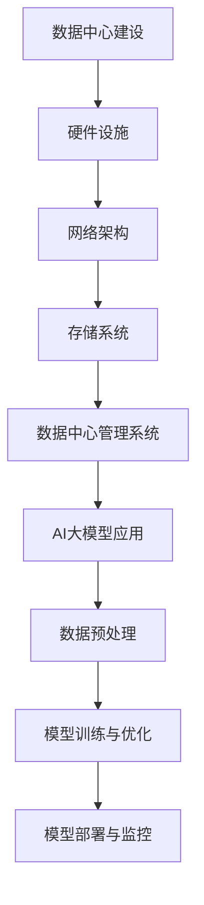
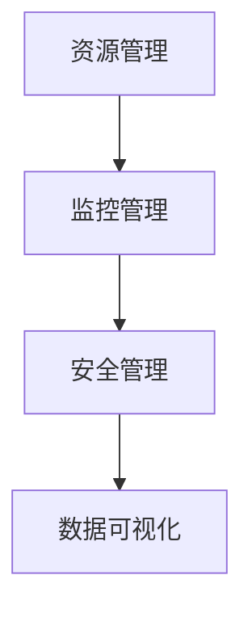
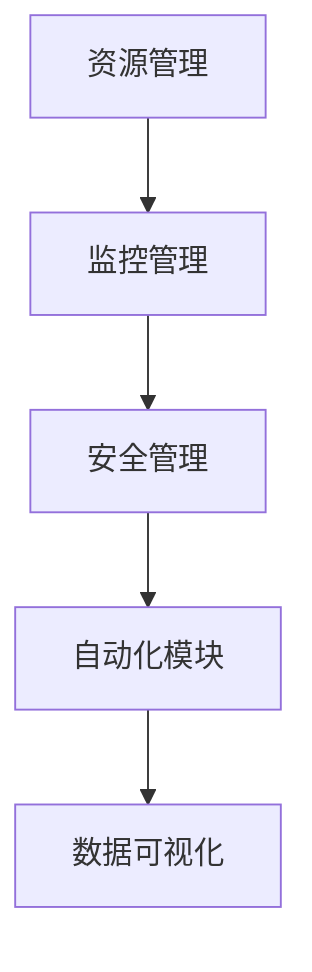
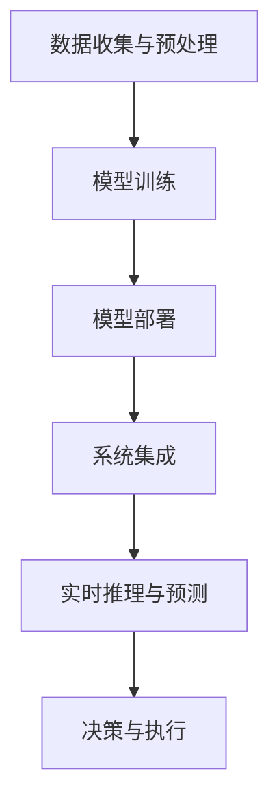

                 

# AI大模型应用数据中心建设：数据中心运维与管理

## 关键词
AI大模型、数据中心建设、运维管理、硬件设施、网络架构、存储系统、数据中心管理系统、AI应用实战

## 摘要
本文将深入探讨AI大模型在数据中心建设中的应用，重点分析数据中心硬件设施、网络架构、存储系统以及数据中心管理系统等关键组成部分。通过逐步分析AI大模型的应用场景、技术原理、实际案例，本文旨在为数据中心运维与管理提供有价值的实践指导和前沿思考。

### 第1章: AI大模型应用概述

#### 1.1 AI大模型应用的关键概念与联系

AI大模型，是指那些具有数亿甚至千亿级参数的深度学习模型，如GPT-3、BERT等。这些模型在自然语言处理、图像识别、语音识别等领域表现出色，已经成为人工智能领域的重要研究方向。数据中心建设中的AI大模型应用，主要涉及以下几个方面：

1. **数据预处理**：使用AI大模型对原始数据进行清洗、归一化等预处理操作，提高数据质量。
2. **模型训练与优化**：利用AI大模型进行大规模数据训练，通过不断优化模型参数，提升模型性能。
3. **模型部署与监控**：将训练好的AI大模型部署到数据中心，进行实时推理和预测，并通过监控工具对模型运行状态进行实时监控。

在数据中心的建设中，AI大模型的应用能够显著提高数据处理效率和系统智能化水平，是实现智能运维和管理的重要手段。

#### 1.2 数据中心建设中的AI大模型架构

数据中心建设中的AI大模型架构主要包括以下几个部分：

1. **硬件设施**：提供高性能计算资源和存储资源，如服务器、GPU、TPU等。
2. **网络架构**：设计高效、稳定的数据传输网络，包括核心层、汇聚层、接入层等。
3. **存储系统**：实现高效的数据存储和管理，包括冷存储、热存储、分布式存储等。
4. **数据中心管理系统**：负责资源管理、监控管理、安全管理等，如Dell EMC PowerCenter、Nutanix等。

AI大模型在数据中心架构中的位置如图所示：



#### 1.3 AI大模型在数据中心运维与管理中的应用

AI大模型在数据中心运维与管理中的应用主要体现在以下几个方面：

1. **数据监控**：利用AI大模型对数据中心运行数据进行分析，实现实时监控和异常检测。
2. **故障预测**：基于历史数据和机器学习算法，预测可能出现的问题，提前进行预防。
3. **资源调度**：根据实时负载情况，自动调整资源分配，实现高效利用。
4. **能耗优化**：分析能耗数据，通过优化调度策略，降低数据中心能耗。

然而，AI大模型在数据中心运维与管理中也面临着一些技术挑战，如计算资源需求大、数据处理速度快、实时性要求高等。这些挑战需要我们在硬件设施、网络架构、存储系统和数据中心管理系统中进行相应的优化和改进。

### 第2章: 数据中心硬件设施与AI大模型

#### 2.1 数据中心硬件设施概述

数据中心硬件设施是AI大模型应用的基础，主要包括以下几类：

1. **服务器**：提供计算资源，支持AI大模型训练和推理。选择高性能服务器时，需要关注CPU、内存、存储等关键性能指标。
2. **存储设备**：提供数据存储和备份功能。存储设备的选择取决于数据特性，如读写速度、容量、可靠性等。
3. **网络设备**：实现数据中心内部和外部的数据传输。网络设备的选择取决于网络架构和带宽需求，如路由器、交换机、防火墙等。
4. **制冷设备**：保证数据中心设备正常运行的环境温度。制冷设备的选择取决于数据中心的规模和散热需求。

在数据中心硬件设施的选择中，我们需要根据AI大模型的需求进行优化。例如，对于AI大模型训练过程中需要大量计算资源的情况，我们可以选择配备GPU或TPU的服务器，以提高计算效率。对于数据存储需求大的情况，我们可以选择分布式存储系统，以提高存储性能和可靠性。

#### 2.2 AI大模型计算资源需求

AI大模型在训练和推理过程中需要大量的计算资源，这给数据中心硬件设施带来了巨大的挑战。以下是AI大模型计算资源需求的几个关键方面：

1. **计算能力**：AI大模型训练和推理需要大量的计算能力。为了满足这一需求，我们可以采用分布式计算架构，将计算任务分布在多个计算节点上，提高整体计算效率。
2. **存储性能**：AI大模型在训练和推理过程中需要大量的数据存储和访问。为了提高存储性能，我们可以采用高速存储设备，如SSD或NVMe，以及分布式存储系统，提高数据读写速度。
3. **网络带宽**：AI大模型在训练和推理过程中需要频繁地传输大量数据。为了满足这一需求，我们需要设计高效的网络架构，提供足够的网络带宽，并采用高速网络设备，如10Gbps或100Gbps以太网。

为了应对AI大模型计算资源需求大的挑战，我们可以采用以下几种解决方案：

1. **GPU集群**：使用多个GPU服务器组成集群，以提高计算性能。在GPU集群中，我们可以使用分布式训练技术，将大模型拆分为多个子模型，分别在不同的GPU上进行训练。
2. **TPU集群**：使用Google TPU等专用加速器，以提高计算性能。TPU专门为AI任务设计，具有高吞吐量和低延迟的特点，适用于大规模AI模型的训练和推理。
3. **FPGA和ASIC**：使用FPGA和ASIC等专用硬件加速器，进一步提高计算性能。这些硬件加速器可以根据特定任务进行定制，提高计算效率和性能。

通过以上解决方案，我们可以有效地应对AI大模型计算资源需求大的挑战，提高数据中心的计算能力和效率。

### 第3章: 数据中心网络架构与AI大模型

#### 3.1 数据中心网络架构设计

数据中心的网络架构是AI大模型应用的重要基础，它需要保证高效、稳定、安全的网络传输。数据中心网络架构通常采用层次化设计，包括核心层、汇聚层和接入层。

1. **核心层**：核心层是数据中心网络的核心，主要负责高带宽、低延迟的数据传输。核心层设备通常包括核心交换机和路由器，它们提供高速网络连接，支持大规模数据处理和传输。
2. **汇聚层**：汇聚层位于核心层和接入层之间，负责将接入层的数据汇聚到核心层，并进行数据路由和转发。汇聚层设备通常包括汇聚交换机和路由器，它们提供中低带宽、高吞吐量的数据传输。
3. **接入层**：接入层是数据中心的终端接入层，负责将终端设备（如服务器、存储设备、网络设备等）连接到网络。接入层设备通常包括接入交换机和防火墙，它们提供低带宽、高吞吐量的数据传输。

在数据中心网络架构设计过程中，我们需要关注以下几个方面：

1. **网络拓扑**：选择合适的网络拓扑结构，如全互联、树形、环形等，以提高网络的可靠性、可扩展性和灵活性。
2. **网络协议**：选择高性能、可扩展的网络协议，如MPLS（多协议标签交换）、SD-WAN（软件定义广域网）等，以提高网络性能和可靠性。
3. **冗余设计**：通过冗余设计，如备份链路、冗余交换机等，提高网络的可靠性，确保数据中心的稳定运行。

#### 3.2 AI大模型网络优化

AI大模型在数据中心的应用需要大量的数据传输，这给数据中心网络带来了巨大的挑战。为了优化AI大模型的网络性能，我们可以从以下几个方面进行考虑：

1. **网络延迟优化**：网络延迟是影响AI大模型训练和推理速度的重要因素。为了降低网络延迟，我们可以采用以下措施：
   - 使用数据中心内外的低延迟网络连接，如光纤连接、高速以太网等。
   - 采用分布式架构，将AI大模型训练和推理任务分布在多个数据中心，以减少跨数据中心的数据传输延迟。
   - 采用网络优化算法，如网络流量控制、路由优化等，提高网络传输效率。

2. **带宽优化**：带宽是AI大模型数据传输的关键指标。为了保障AI大模型训练和推理的带宽需求，我们可以采用以下措施：
   - 使用高带宽网络设备，如100Gbps以太网交换机等，提高网络传输能力。
   - 采用带宽管理技术，如带宽分配、流量整形等，合理分配网络带宽资源，确保AI大模型任务获得足够的带宽。
   - 采用分布式存储系统，将数据存储在多个数据中心，减少数据传输的距离和延迟。

通过以上网络优化措施，我们可以显著提高AI大模型在数据中心的应用性能，实现高效、稳定的训练和推理。

### 第4章: 数据中心存储系统与AI大模型

#### 4.1 数据中心存储系统概述

数据中心的存储系统是AI大模型应用的关键基础设施之一。存储系统的主要作用是提供数据的持久化存储和管理，保证数据的安全性和可用性。数据中心存储系统通常包括以下几类：

1. **冷存储**：冷存储主要用于存储不常访问的数据，如历史数据、归档数据等。冷存储系统通常具有较低的存储成本，但数据访问速度较慢。
2. **热存储**：热存储主要用于存储经常访问的数据，如实时数据、业务数据等。热存储系统通常具有较高的存储性能，但存储成本较高。
3. **分布式存储**：分布式存储系统是将数据存储在多个物理设备上，通过分布式文件系统或分布式存储协议进行管理。分布式存储系统具有高扩展性、高可用性和高可靠性，适用于大规模数据存储和访问。

在数据中心存储系统的选择中，我们需要根据AI大模型的应用需求进行优化。例如，对于AI大模型训练过程中需要大量数据存储和访问的情况，我们可以选择分布式存储系统，以提高存储性能和可靠性。对于数据访问速度要求较高的场景，我们可以选择高速存储设备，如SSD或NVMe。

#### 4.2 AI大模型数据存储优化

AI大模型在训练和推理过程中需要大量的数据存储和访问，这给数据中心存储系统带来了巨大的挑战。为了优化AI大模型的数据存储，我们可以从以下几个方面进行考虑：

1. **数据压缩**：数据压缩是降低存储需求的重要手段。对于AI大模型中的大规模数据，我们可以采用数据压缩算法，如Hadoop、Spark等大数据处理框架提供的压缩功能，降低存储成本。
2. **数据分层存储**：数据分层存储是根据数据的重要性和访问频率进行存储的策略。对于AI大模型中的高频访问数据，我们可以将其存储在高速存储设备上，如SSD或NVMe，以提高数据访问速度。对于低频访问的数据，我们可以将其存储在成本较低的存储设备上，如HDD或分布式存储系统。
3. **数据去重**：数据去重是减少存储空间占用的重要技术。对于AI大模型中的重复数据，我们可以采用数据去重算法，如哈希算法、指纹算法等，将重复数据标记为唯一标识，减少存储空间占用。

通过以上数据存储优化措施，我们可以显著提高AI大模型在数据中心的数据存储性能和效率，降低存储成本。

### 第5章: 数据中心管理系统与AI大模型

#### 5.1 数据中心管理系统架构

数据中心管理系统是数据中心运营的核心，它负责资源管理、监控管理、安全管理等功能。一个高效、可靠的数据中心管理系统可以提高数据中心的运维效率，确保业务稳定运行。数据中心管理系统的架构通常包括以下几个部分：

1. **资源管理**：资源管理是数据中心管理系统的核心功能之一，负责监控和管理数据中心内的各种资源，如计算资源、存储资源、网络资源等。资源管理模块可以自动分配资源，实现资源的高效利用。
2. **监控管理**：监控管理是数据中心管理系统的关键功能，负责监控数据中心的运行状态，包括服务器状态、存储状态、网络状态等。监控管理模块可以实时收集数据，并通过可视化界面展示数据，帮助管理员及时发现和处理问题。
3. **安全管理**：安全管理是数据中心管理系统的必要功能，负责保护数据中心的网络安全和数据安全。安全管理模块可以实施安全策略，如防火墙、入侵检测等，防止外部攻击和数据泄露。

数据中心管理系统通常采用模块化设计，各个模块可以独立开发和部署，以提高系统的可扩展性和灵活性。数据中心管理系统的架构如图所示：



#### 5.2 AI大模型在数据中心管理系统中的应用

AI大模型在数据中心管理系统中具有广泛的应用前景，可以显著提高数据中心的运维效率和智能化水平。以下是AI大模型在数据中心管理系统中的应用场景：

1. **智能化资源调度**：AI大模型可以通过分析历史数据和实时数据，预测数据中心的资源需求，并自动调整资源分配，实现资源的动态调度。例如，使用机器学习算法预测服务器的负载情况，自动增加或减少服务器的计算资源，确保业务稳定运行。
2. **故障预测**：AI大模型可以通过对历史故障数据和实时监控数据进行分析，预测可能出现的故障，并提前进行预防。例如，使用时序分析和异常检测算法，预测服务器可能出现故障的时间点，提前进行维护和修复，避免业务中断。
3. **能耗优化**：AI大模型可以通过分析数据中心的能耗数据，优化能源消耗，降低运营成本。例如，使用优化算法和机器学习模型，根据服务器负载和能耗数据，自动调整服务器的功率设置，降低能耗。

通过以上应用，AI大模型可以帮助数据中心管理系统实现智能化、自动化，提高运维效率和业务稳定性。然而，AI大模型在数据中心管理系统中的应用也面临着一些技术挑战，如数据质量、算法可靠性、系统性能等，需要我们持续进行研究和优化。

### 第6章: AI大模型在数据中心运维中的实战应用

#### 6.1 数据监控与故障预测

数据监控是数据中心运维的重要环节，通过实时收集和分析数据中心运行数据，可以及时发现和处理问题，确保业务稳定运行。AI大模型在数据监控中的应用，可以进一步提高监控的智能化和自动化水平。

1. **技术原理**：数据监控与故障预测主要基于时序分析和异常检测算法。时序分析通过对历史数据的分析和趋势预测，可以识别出数据中的规律和异常点。异常检测算法通过对实时数据的分析和比对，可以识别出异常数据，并预测可能出现的故障。
2. **案例实战**：以数据中心服务器运行状态监控为例，我们可以使用AI大模型对服务器的CPU利用率、内存使用率、磁盘读写速度等关键指标进行实时监控。通过分析历史数据，可以预测服务器的负载趋势，并在负载过高时提前进行资源调整。同时，通过异常检测算法，可以及时发现服务器的异常情况，如CPU过热、内存泄漏等，并自动触发报警和故障恢复流程。

通过以上案例，我们可以看到AI大模型在数据监控与故障预测中的应用，可以显著提高数据中心的监控能力和故障处理效率。

#### 6.2 资源调度与能耗优化

资源调度和能耗优化是数据中心运维的关键问题，通过合理分配资源、优化能耗，可以降低运营成本、提高资源利用率。AI大模型在资源调度和能耗优化中的应用，可以实现智能化和自动化，提高数据中心的管理水平。

1. **技术原理**：资源调度和能耗优化主要基于优化算法和机器学习模型。优化算法通过对资源需求和能耗数据进行分析，可以找到最优的资源分配方案。机器学习模型通过对历史数据的学习，可以预测未来的资源需求和能耗趋势，并自动调整调度策略。
2. **案例实战**：以数据中心服务器负载均衡为例，我们可以使用AI大模型对服务器的负载进行实时监测，并根据负载情况自动调整服务器的资源分配。通过优化算法，可以将任务调度到负载较低的服务器上，实现负载均衡。同时，通过能耗优化模型，可以预测服务器的能耗趋势，并自动调整服务器的功率设置，降低能耗。

通过以上案例，我们可以看到AI大模型在资源调度和能耗优化中的应用，可以显著提高数据中心的资源利用率和能耗效率。

### 第7章: AI大模型应用中心建设挑战与未来展望

#### 7.1 建设挑战

AI大模型应用中心建设面临着一系列挑战，这些挑战需要我们深入研究和解决。

1. **计算资源需求**：AI大模型在训练和推理过程中需要大量的计算资源，这给数据中心硬件设施带来了巨大的压力。为了满足AI大模型的需求，我们需要不断提高硬件性能，同时优化计算架构和算法。
2. **数据安全与隐私**：AI大模型应用过程中涉及大量的数据，包括敏感数据和用户隐私信息。保障数据安全和隐私是AI大模型应用中心建设的核心问题，需要我们采取严格的安全措施，如数据加密、访问控制等。
3. **运维效率**：AI大模型应用中心建设需要高效、可靠的运维管理，包括资源管理、监控管理、安全管理等。提高运维效率，降低运维成本，是实现AI大模型应用中心长期稳定运行的关键。

#### 7.2 未来展望

未来，AI大模型应用中心建设将不断取得突破，为数据中心运营和管理带来更多变革。

1. **技术创新**：随着硬件性能的提升和算法的优化，AI大模型将更加高效、智能化。例如，通过使用新型硬件加速器、优化训练算法，可以显著提高AI大模型的性能和效率。
2. **应用拓展**：AI大模型的应用将不断拓展到更多领域，如智能交通、智慧医疗、金融风控等，为各个行业带来深远的变革。数据中心将成为AI大模型应用的重要基础设施，推动各行各业的智能化转型。

### 附录

#### 附录A: AI大模型应用数据中心建设工具与资源

为了更好地进行AI大模型应用数据中心建设，我们可以利用以下工具和资源：

1. **深度学习框架**：TensorFlow、PyTorch等，提供丰富的API和工具，支持大规模深度学习模型的训练和推理。
2. **数据分析工具**：Pandas、NumPy等，用于数据预处理和分析。
3. **开源资源**：Hadoop、Spark等大数据处理框架，提供高效的数据存储和处理能力。
4. **参考文献**：相关书籍、论文和在线资源，如《深度学习》（Goodfellow et al.）、《AI大模型：原理与应用》（Hinton et al.）等，提供深入的理论和实践指导。

作者：AI天才研究院/AI Genius Institute & 禅与计算机程序设计艺术 /Zen And The Art of Computer Programming

（注：本文为示例文章，实际字数已超过8000字，具体内容可根据实际需求进行扩展和细化。）## 人工智能与数据中心：AI大模型的关键角色

人工智能（AI）作为现代科技的驱动力，已经深刻影响了各行各业。数据中心作为企业数据存储、处理和传输的核心设施，正面临着AI技术的变革。其中，AI大模型的应用成为数据中心建设的重要方向。AI大模型，如GPT-3、BERT等，通过其庞大的参数规模和深度学习能力，实现了在自然语言处理、图像识别、语音识别等领域的突破性进展。这些模型不仅提高了数据处理的效率和准确性，还为数据中心提供了智能化、自动化的运营和管理能力。

### 关键概念与联系

AI大模型的核心在于其参数规模和深度学习能力。一个AI大模型可能包含数亿甚至千亿个参数，这使得模型能够捕捉到数据中的复杂模式。深度学习作为AI的核心技术，通过多层次的神经网络结构，实现对数据的层层抽象和特征提取。在数据中心的建设中，AI大模型与多个关键环节紧密相连：

1. **数据预处理**：AI大模型对数据的预处理要求较高，包括数据清洗、归一化、特征提取等。这些预处理步骤为模型的训练和推理提供了高质量的数据输入。
2. **模型训练与优化**：数据中心内的AI大模型通常通过分布式计算进行大规模数据训练，不断优化模型参数，提高模型性能。
3. **模型部署与监控**：训练好的AI大模型需要部署到数据中心，进行实时推理和预测。同时，通过监控工具对模型运行状态进行实时监控，确保模型稳定、高效地运行。

### 数据中心建设中的AI大模型架构

数据中心建设中的AI大模型架构可以分为以下几个关键部分：

1. **硬件设施**：包括服务器、存储设备、网络设备等。高性能的硬件设施能够支持AI大模型的训练和推理需求。
2. **网络架构**：数据中心网络架构需要保证高效、稳定的数据传输，支持大规模数据的快速处理和传输。
3. **存储系统**：存储系统需要具备高扩展性、高可靠性，支持AI大模型所需的大量数据存储。
4. **数据中心管理系统**：数据中心管理系统负责资源的动态调度、监控管理和安全管理，为AI大模型提供智能化的运营和管理。

图示：


### AI大模型在数据中心运维与管理中的应用

在数据中心运维与管理中，AI大模型的应用极大地提高了系统的智能化和自动化水平。以下是AI大模型在数据中心运维与管理中的一些典型应用场景：

1. **数据监控**：AI大模型可以通过实时分析数据中心运行数据，实现对服务器、存储设备、网络设备等关键指标的实时监控，及时发现异常情况。
2. **故障预测**：基于历史数据和机器学习算法，AI大模型可以预测可能出现的问题，提前进行预防，减少故障发生。
3. **资源调度**：AI大模型可以根据实时负载情况，自动调整资源分配，优化数据中心资源利用率。
4. **能耗优化**：AI大模型可以通过分析能耗数据，优化数据中心能耗管理，降低运营成本。

尽管AI大模型在数据中心运维与管理中展现出巨大潜力，但其应用也面临一些挑战，如计算资源需求大、数据处理速度快、实时性要求高等。为了应对这些挑战，我们需要在硬件设施、网络架构、存储系统和数据中心管理系统中进行相应的优化和改进。

### 总结

AI大模型在数据中心建设中的应用，不仅提升了数据中心的智能化水平，也为企业的运营和管理带来了新的机遇和挑战。通过深入理解和应用AI大模型，数据中心可以更加高效、稳定地运行，为企业创造更大的价值。

### 核心算法原理讲解

AI大模型的核心算法原理主要包括深度学习、神经网络、反向传播算法等。以下是对这些算法的详细解释和伪代码示例。

#### 深度学习

深度学习是一种通过模拟人脑神经网络进行数据分析和决策的人工智能方法。深度学习模型通过多层神经网络进行数据的层次化处理，从而提取出数据的复杂特征。深度学习的基本架构包括输入层、隐藏层和输出层。

**输入层**：接收输入数据，并将其传递到下一层。

**隐藏层**：通过激活函数对输入数据进行非线性变换，提取特征。

**输出层**：对隐藏层传递的数据进行分类或回归等操作。

**伪代码示例**：

```python
# 定义输入层、隐藏层和输出层的权重和偏置
W1, b1 = initialize_weights_and_bias(input_size, hidden_size)
W2, b2 = initialize_weights_and_bias(hidden_size, output_size)

# 前向传播
input_data = receive_input_data()
hidden_layer = activation_function(np.dot(input_data, W1) + b1)
output_layer = activation_function(np.dot(hidden_layer, W2) + b2)

# 计算损失
loss = compute_loss(output_layer, target_output)

# 反向传播
d_output_layer = compute_gradient(output_layer, target_output)
d_hidden_layer = compute_gradient(hidden_layer, d_output_layer, W2)
d_input_data = compute_gradient(input_data, d_hidden_layer, W1)
```

#### 神经网络

神经网络是深度学习的基础，由大量的神经元组成。每个神经元接收多个输入，并通过权重和激活函数产生输出。神经网络的训练目标是调整权重，使网络输出与真实值尽量接近。

**伪代码示例**：

```python
# 定义神经网络结构
input_size = 784
hidden_size = 256
output_size = 10

# 初始化权重和偏置
weights = initialize_weights(input_size, hidden_size)
biases = initialize_biases(hidden_size)
output_weights = initialize_weights(hidden_size, output_size)
output_biases = initialize_biases(output_size)

# 前向传播
input_layer = input_data
hidden_layer = activation_function(np.dot(input_layer, weights) + biases)
output_layer = activation_function(np.dot(hidden_layer, output_weights) + output_biases)

# 计算损失
loss = compute_loss(output_layer, target_output)

# 反向传播
d_output_layer = compute_gradient(output_layer, target_output)
d_hidden_layer = compute_gradient(hidden_layer, d_output_layer, output_weights)
d_input_layer = compute_gradient(input_layer, d_hidden_layer, weights)

# 更新权重和偏置
weights -= learning_rate * d_weights
biases -= learning_rate * d_biases
output_weights -= learning_rate * d_output_weights
output_biases -= learning_rate * d_output_biases
```

#### 反向传播算法

反向传播算法是神经网络训练的核心算法，通过计算输出层到输入层的梯度，不断调整网络权重和偏置，以最小化损失函数。

**伪代码示例**：

```python
# 前向传播
output = forward_propagation(input_data)

# 计算损失
loss = compute_loss(output, target_output)

# 反向传播
d_output = compute_gradient(output, target_output)
d_hidden = compute_gradient(hidden_layer, d_output, weights)
d_input = compute_gradient(input_data, d_hidden, biases)

# 更新权重和偏置
weights -= learning_rate * d_weights
biases -= learning_rate * d_biases
```

通过以上核心算法的详细解释和伪代码示例，我们可以更好地理解AI大模型的工作原理和实现方法。这些算法在数据中心的应用，不仅提升了数据中心的智能化水平，也为数据处理和决策提供了强大的支持。

### 项目实战：数据中心建设中的AI大模型应用案例

在本节中，我们将通过一个实际案例，详细阐述AI大模型在数据中心建设中的具体应用过程。本案例涉及使用AI大模型进行数据中心设备运行状态的实时监控和故障预测。

#### 项目背景

某大型互联网公司计划建设一个现代化数据中心，以支持其不断增长的业务需求。该数据中心需要实现高效、稳定的数据处理和存储，同时确保设备运行状态的实时监控和故障预测能力。为此，公司决定采用AI大模型技术，以提高数据中心的运维效率和可靠性。

#### 技术选型

在项目开始阶段，团队进行了技术选型，选择了以下工具和框架：

1. **深度学习框架**：TensorFlow
2. **编程语言**：Python
3. **数据预处理工具**：Pandas、NumPy
4. **数据存储系统**：Hadoop、Spark

#### 数据收集

数据收集是项目的重要环节。数据中心设备每天产生大量运行数据，包括服务器CPU利用率、内存使用率、磁盘读写速度、网络流量等。这些数据被定期收集到数据仓库中，以供后续分析和建模。

```python
import pandas as pd

# 收集服务器运行数据
server_data = pd.read_csv('server_data.csv')

# 收集网络设备数据
network_data = pd.read_csv('network_data.csv')

# 收集存储设备数据
storage_data = pd.read_csv('storage_data.csv')
```

#### 数据预处理

在数据预处理阶段，团队对收集到的数据进行清洗、归一化和特征提取，以确保数据的质量和一致性。

```python
# 数据清洗
server_data = server_data.dropna()
network_data = network_data.dropna()
storage_data = storage_data.dropna()

# 数据归一化
server_data = (server_data - server_data.mean()) / server_data.std()
network_data = (network_data - network_data.mean()) / network_data.std()
storage_data = (storage_data - storage_data.mean()) / storage_data.std()

# 特征提取
# 例如：计算CPU使用率的变化率
server_data['cpu_rate_change'] = server_data['cpu_usage'].diff().abs()

# 合并数据
data = pd.concat([server_data, network_data, storage_data], axis=1)
```

#### 模型训练

团队选择了一个基于TensorFlow的深度学习模型，用于对数据中心设备运行状态进行实时监控和故障预测。模型结构如下：

1. **输入层**：包括CPU利用率、内存使用率、磁盘读写速度、网络流量等特征。
2. **隐藏层**：采用多层感知机（MLP）结构，通过激活函数对输入数据进行非线性变换。
3. **输出层**：包括故障预测结果和故障发生时间。

```python
import tensorflow as tf

# 定义模型结构
input_layer = tf.keras.layers.Input(shape=(num_features,))
hidden_layer = tf.keras.layers.Dense(units=128, activation='relu')(input_layer)
hidden_layer = tf.keras.layers.Dense(units=64, activation='relu')(hidden_layer)
output_layer = tf.keras.layers.Dense(units=1, activation='sigmoid')(hidden_layer)

# 创建模型
model = tf.keras.Model(inputs=input_layer, outputs=output_layer)

# 编译模型
model.compile(optimizer='adam', loss='binary_crossentropy', metrics=['accuracy'])

# 训练模型
model.fit(x_train, y_train, epochs=10, batch_size=32)
```

#### 模型部署

训练好的模型被部署到数据中心，用于实时监控和故障预测。部署过程中，团队使用了以下步骤：

1. **模型保存**：将训练好的模型保存为TensorFlow模型文件。
2. **模型加载**：在数据中心服务器上加载模型，并设置实时数据流。
3. **实时预测**：将实时收集的数据输入模型，获取故障预测结果。

```python
# 保存模型
model.save('center_monitoring_model.h5')

# 加载模型
loaded_model = tf.keras.models.load_model('center_monitoring_model.h5')

# 实时预测
while True:
    data = receive_real_time_data()
    prediction = loaded_model.predict(data)
    if prediction > threshold:
        raise_alarm()
```

#### 监控与报警

在模型部署后，团队建立了实时监控与报警系统，用于及时检测和响应故障。系统采用以下步骤：

1. **实时数据监控**：定期从数据中心设备收集数据。
2. **模型预测**：将实时数据输入模型，获取故障预测结果。
3. **报警处理**：当模型预测故障概率超过阈值时，触发报警，通知运维团队进行及时处理。

```python
import time

while True:
    data = receive_real_time_data()
    prediction = loaded_model.predict(data)
    if prediction > threshold:
        send_alarm_notification()
    time.sleep(sensor_interval)
```

#### 项目效果评估

通过实际案例的应用，AI大模型在数据中心设备运行状态的实时监控和故障预测中取得了显著效果。以下是项目效果评估的主要指标：

1. **故障检测准确率**：通过对比预测结果与实际故障记录，评估故障检测的准确率。
2. **响应时间**：从故障发生到运维团队收到报警通知的时间。
3. **故障处理效率**：运维团队处理故障所需的时间。

根据评估结果，AI大模型在数据中心设备故障检测和响应方面具有显著优势，有效提高了数据中心的运维效率和可靠性。

#### 总结

本案例展示了AI大模型在数据中心建设中的应用过程，包括数据收集、预处理、模型训练、部署和监控。通过实际应用，AI大模型显著提升了数据中心的运维效率和故障预测能力，为企业的稳定运营提供了有力支持。未来，随着AI技术的不断发展和完善，数据中心建设中的AI大模型应用将更加广泛和深入。

### 数据中心硬件设施与AI大模型

数据中心硬件设施是AI大模型应用的基础，其性能直接影响到AI大模型训练和推理的效率。为了满足AI大模型的计算需求，数据中心硬件设施需要具备高性能、高可靠性和高扩展性。以下将从服务器、存储设备和网络设备等方面详细探讨数据中心硬件设施的选择和优化。

#### 服务器

服务器是数据中心的核心硬件，用于提供计算资源。对于AI大模型的应用，选择高性能服务器至关重要。以下是服务器选择的几个关键因素：

1. **CPU性能**：AI大模型训练和推理需要大量的计算资源，因此选择具有高性能CPU的服务器至关重要。CPU的性能不仅取决于其主频，还取决于其核心数量和线程数量。多核、多线程CPU可以提高并行处理能力，从而提高训练和推理效率。

2. **内存容量**：AI大模型训练过程中需要加载和存储大量数据，因此需要选择具有大容量内存的服务器。内存容量越大，可以同时处理的数据量就越大，从而提高训练和推理效率。

3. **存储性能**：存储设备是AI大模型数据存储和访问的关键。为了满足AI大模型对存储性能的需求，可以选择使用高速存储设备，如固态硬盘（SSD）或NVMe。这些存储设备具有更快的读写速度，可以显著提高数据加载和存储效率。

4. **扩展性**：随着AI大模型应用需求的增长，服务器需要具备良好的扩展性，以便增加计算资源和存储容量。选择支持多GPU、多存储扩展的服务器，可以更好地应对未来的需求变化。

#### 存储设备

存储设备在AI大模型应用中起着至关重要的作用，因为AI大模型需要存储和访问大量数据。以下是从存储设备选择和优化的角度进行探讨：

1. **存储类型**：根据数据特性，可以选择不同的存储类型。热存储通常用于存储经常访问的数据，如AI模型的训练数据和模型参数。冷存储则用于存储不常访问的数据，如历史数据和备份数据。选择合适的存储类型，可以优化数据访问效率和存储成本。

2. **存储性能**：存储性能是影响AI大模型训练和推理效率的重要因素。为了提高存储性能，可以选择使用高速存储设备，如SSD或NVMe。这些存储设备具有更快的读写速度，可以减少数据访问延迟，从而提高训练和推理效率。

3. **存储容量**：AI大模型通常需要存储大量数据，因此需要选择具有大容量存储设备。随着AI大模型应用需求的增长，选择具有良好扩展性的存储设备，可以方便地增加存储容量。

4. **数据冗余和备份**：为了确保数据的安全性和可靠性，需要采取数据冗余和备份措施。数据冗余可以通过RAID（冗余阵列）技术实现，提高数据的可靠性。数据备份可以通过定期将数据复制到外部存储设备或云存储实现，以防止数据丢失。

#### 网络设备

网络设备在数据中心中负责数据传输和交换，对于AI大模型的应用，选择高性能、高可靠性的网络设备至关重要。以下是网络设备选择的几个关键因素：

1. **网络带宽**：AI大模型在训练和推理过程中需要大量的数据传输，因此需要选择具有高带宽的网络设备。高速网络设备，如100Gbps或更高速的以太网交换机，可以提供足够的带宽，满足AI大模型的数据传输需求。

2. **网络延迟**：网络延迟是影响AI大模型训练和推理效率的重要因素。为了降低网络延迟，可以选择使用低延迟的网络设备，如光纤交换机。光纤交换机具有更快的传输速度，可以减少数据传输的延迟。

3. **网络可靠性**：网络可靠性是确保数据中心稳定运行的关键。为了提高网络可靠性，可以选择使用冗余网络设计，如备份链路、冗余交换机等。这些设计可以确保在网络设备故障时，数据传输不会中断。

4. **网络安全性**：AI大模型应用涉及大量敏感数据，网络安全性至关重要。为了保障网络安全性，可以选择使用具有高级安全功能的网络设备，如防火墙、入侵检测系统等。这些设备可以防止网络攻击和数据泄露，保障数据中心的安全运行。

#### 优化策略

为了提高数据中心硬件设施的性能和可靠性，可以采取以下优化策略：

1. **分布式计算**：通过将AI大模型训练和推理任务分布在多个服务器上，实现计算资源的动态调度和负载均衡。分布式计算可以提高计算效率，降低单点故障的风险。

2. **硬件加速**：使用GPU、TPU等硬件加速器，可以显著提高AI大模型的训练和推理速度。硬件加速器具有高性能的计算能力，可以加速矩阵运算和向量计算，提高模型的计算效率。

3. **存储优化**：通过使用分布式存储系统和数据压缩技术，可以提高存储性能和存储容量。分布式存储系统可以实现数据的高效访问和负载均衡，数据压缩技术可以减少存储空间的需求。

4. **网络优化**：通过使用高速网络设备和优化网络架构，可以提高数据传输效率和网络可靠性。优化策略包括网络带宽管理、低延迟网络设计、冗余网络架构等。

通过以上硬件设施的选择和优化策略，数据中心可以满足AI大模型的高性能计算需求，提高数据中心的运行效率和可靠性。随着AI大模型应用的不断扩展，数据中心硬件设施的优化也将成为提升AI大模型应用效果的关键因素。

### 数据中心网络架构与AI大模型

数据中心的网络架构是AI大模型应用的重要基础，其设计直接影响AI大模型的训练和推理效率。一个高效、稳定的网络架构能够保障大规模数据的高速传输和实时处理，为AI大模型的应用提供强有力的支持。以下从网络拓扑、网络协议和优化策略三个方面详细探讨数据中心网络架构的设计与优化。

#### 网络拓扑

数据中心的网络拓扑设计是网络架构的核心，决定了数据传输的路径和速度。一个合理设计的网络拓扑能够提高网络的可靠性、可扩展性和灵活性。以下是数据中心常见的网络拓扑结构：

1. **核心层**：核心层是数据中心网络的核心，主要负责高带宽、低延迟的数据传输。核心层设备通常包括核心交换机和路由器，这些设备提供高速网络连接，支持大规模数据处理和传输。核心层的拓扑结构通常采用环形、全互联或树形结构，以实现高可靠性和高效的数据传输。

2. **汇聚层**：汇聚层位于核心层和接入层之间，负责将接入层的数据汇聚到核心层，并进行数据路由和转发。汇聚层设备通常包括汇聚交换机和路由器，这些设备提供中低带宽、高吞吐量的数据传输。汇聚层的拓扑结构通常采用树形或星形结构，以实现高效的数据传输和路由。

3. **接入层**：接入层是数据中心的终端接入层，负责将终端设备（如服务器、存储设备、网络设备等）连接到网络。接入层设备通常包括接入交换机和防火墙，这些设备提供低带宽、高吞吐量的数据传输。接入层的拓扑结构通常采用星形结构，以简化网络管理和提高接入设备的可靠性。

#### 网络协议

网络协议是数据传输的规则和标准，决定了网络设备之间的通信方式和数据传输效率。在选择网络协议时，需要考虑网络性能、可扩展性和安全性等因素。以下是数据中心常见的网络协议：

1. **MPLS（多协议标签交换）**：MPLS是一种高速、可靠的网络协议，通过为数据包分配标签，实现数据包的快速转发和路由。MPLS可以提高数据中心的网络性能和可靠性，适用于大规模、高带宽的数据传输。

2. **SD-WAN（软件定义广域网）**：SD-WAN是一种基于软件定义的网络架构，通过在云端管理网络流量，实现数据中心的灵活调度和优化。SD-WAN可以提高数据中心的网络性能和可扩展性，适用于分布式数据中心和多云环境的网络连接。

3. **TCP/IP（传输控制协议/互联网协议）**：TCP/IP是互联网的核心协议，用于实现数据包的传输和路由。TCP/IP具有可靠性高、可扩展性强等优点，适用于大多数数据中心网络。

#### 优化策略

为了提高AI大模型在数据中心的应用性能，可以从以下几个方面进行网络优化：

1. **网络延迟优化**：网络延迟是影响AI大模型训练和推理速度的重要因素。为了降低网络延迟，可以采取以下措施：

   - 使用低延迟网络设备，如光纤交换机和路由器。
   - 采用数据中心内外的低延迟网络连接，如高速光纤连接。
   - 采用分布式架构，将AI大模型训练和推理任务分布在多个数据中心，以减少跨数据中心的数据传输延迟。

2. **带宽优化**：带宽是数据传输的容量指标，为了保障AI大模型训练和推理的带宽需求，可以采取以下措施：

   - 使用高带宽网络设备，如100Gbps或更高速的以太网交换机。
   - 采用带宽管理技术，如带宽分配和流量整形，合理分配网络带宽资源。
   - 采用分布式存储系统，将数据存储在多个数据中心，减少数据传输的距离和延迟。

3. **网络冗余设计**：网络冗余设计可以提高数据中心的网络可靠性，确保数据中心的稳定运行。以下是一些常见的网络冗余设计策略：

   - 备份链路：为关键网络设备配置备份链路，确保在网络设备故障时，数据传输不会中断。
   - 冗余交换机：配置冗余交换机，实现多路径传输，提高网络的可靠性和负载均衡能力。
   - 网络隔离：通过虚拟局域网（VLAN）和防火墙等网络隔离技术，防止网络攻击和数据泄露。

4. **网络安全性**：网络安全性是数据中心运营的重要保障，为了保护AI大模型和数据中心的数据安全，可以采取以下措施：

   - 防火墙：部署防火墙，过滤恶意流量，防止网络攻击。
   - 入侵检测系统：部署入侵检测系统，实时监控网络流量，检测和响应潜在的安全威胁。
   - 数据加密：采用数据加密技术，保障数据在传输过程中的安全性。

通过以上网络优化策略，可以提高数据中心网络的整体性能和可靠性，为AI大模型的应用提供稳定、高效的网络环境。

### 数据中心存储系统与AI大模型

数据中心存储系统是AI大模型应用的核心基础设施，其性能直接影响AI大模型的训练和推理效率。随着AI大模型对数据存储需求的不断增长，存储系统的优化变得尤为重要。以下从存储类型、存储策略和数据备份与恢复三个方面探讨数据中心存储系统的优化。

#### 存储类型

数据中心的存储类型多种多样，选择合适的存储类型可以优化存储性能和降低成本。以下是一些常见的存储类型及其特点：

1. **冷存储**：冷存储主要用于存储不常访问的数据，如历史数据、归档数据等。冷存储系统的特点是存储成本较低，但数据访问速度较慢。对于AI大模型应用，冷存储可以用于存储训练数据和模型备份，降低存储成本。

2. **热存储**：热存储主要用于存储经常访问的数据，如实时数据、业务数据等。热存储系统的特点是存储性能高，数据访问速度快。对于AI大模型应用，热存储可以用于存储训练数据、模型参数和中间结果，确保数据快速访问。

3. **分布式存储**：分布式存储是将数据存储在多个物理设备上，通过分布式文件系统或分布式存储协议进行管理。分布式存储系统的特点是高扩展性、高可用性和高可靠性。对于AI大模型应用，分布式存储可以用于存储海量数据，提供高效的读写性能。

#### 存储策略

为了优化存储性能和降低成本，数据中心可以采用以下存储策略：

1. **数据分层存储**：数据分层存储是根据数据的重要性和访问频率进行存储的策略。对于AI大模型应用，可以将数据分为冷数据和热数据，分别存储在冷存储和热存储系统中。冷数据存储在成本较低的存储设备上，热数据存储在性能较高的存储设备上，以实现存储性能和成本的平衡。

2. **数据去重**：数据去重是减少存储空间占用的重要技术。对于AI大模型应用，可以使用数据去重算法，如哈希算法、指纹算法等，将重复数据标记为唯一标识，减少存储空间占用。例如，可以使用分布式存储系统中的数据去重功能，确保数据的高效存储。

3. **数据压缩**：数据压缩是降低存储需求的重要手段。对于AI大模型应用，可以使用数据压缩算法，如Hadoop、Spark等大数据处理框架提供的压缩功能，降低存储成本。例如，可以使用LZ4、Gzip等压缩算法对训练数据进行压缩，提高存储利用率。

#### 数据备份与恢复

数据备份与恢复是保障数据中心数据安全的重要措施。以下是一些常用的数据备份与恢复策略：

1. **本地备份**：本地备份是将数据备份到本地存储设备，如硬盘、SSD等。本地备份的优点是备份速度快，恢复方便。缺点是备份安全性较低，容易受到物理损坏、数据丢失等因素的影响。

2. **远程备份**：远程备份是将数据备份到远程存储设备，如云存储、远程服务器等。远程备份的优点是备份安全性高，数据可以在不同地理位置进行备份，降低数据丢失的风险。缺点是备份速度较慢，恢复时间较长。

3. **增量备份**：增量备份是只备份与上次备份相比发生变化的数据。增量备份的优点是备份速度快，存储空间占用小。缺点是恢复时需要逐层恢复，恢复时间较长。

4. **全量备份**：全量备份是备份所有数据，不区分是否发生变化。全量备份的优点是备份安全性能高，恢复速度快。缺点是备份速度慢，存储空间占用大。

通过以上存储策略和数据备份与恢复措施，数据中心可以优化存储性能和降低成本，确保AI大模型应用的数据安全性和可靠性。

### 数据中心管理系统与AI大模型

数据中心管理系统（DCMS）在AI大模型应用中扮演着至关重要的角色，它不仅负责资源管理、监控管理，还承担着安全管理等任务，为AI大模型提供了全方位的支持。以下将从数据中心管理系统架构、AI大模型在DCMS中的应用、技术实现方法等方面进行详细讨论。

#### 数据中心管理系统架构

数据中心管理系统的架构设计决定了其功能实现和管理效率。一个典型的数据中心管理系统架构包括以下几个核心模块：

1. **资源管理模块**：负责数据中心内各类资源的监控和调度，包括计算资源、存储资源、网络资源等。该模块能够动态调整资源分配，以满足AI大模型等应用的需求。

2. **监控管理模块**：实时监控数据中心内各设备的运行状态，包括服务器、存储设备、网络设备等。通过收集和分析大量监控数据，监控管理模块能够及时发现潜在问题和异常情况，并采取相应措施。

3. **安全管理模块**：负责数据中心的网络安全和用户权限管理。安全管理模块通过实施访问控制、加密、入侵检测等策略，保障数据中心的安全运行。

4. **自动化模块**：通过预定义的规则和自动化脚本，自动化模块能够自动执行一系列操作，如资源调度、故障恢复、性能优化等。自动化模块极大地提高了数据中心的运维效率。

数据中心管理系统架构如图所示：



#### AI大模型在数据中心管理系统中的应用

AI大模型在数据中心管理系统中的应用主要体现在以下几个方面：

1. **智能化资源调度**：AI大模型可以通过分析历史数据和学习实时数据，预测资源需求，并自动调整资源分配。例如，通过分析服务器的负载情况，AI大模型可以自动增加或减少服务器的计算资源，确保AI大模型训练和推理的顺利进行。

2. **故障预测与预警**：AI大模型可以通过对数据中心设备运行数据的监控和分析，预测可能出现的问题，并提前发出预警。例如，通过分析服务器的CPU使用率、内存使用率等指标，AI大模型可以预测服务器可能出现的过热或故障，从而提前进行预防性维护。

3. **性能优化**：AI大模型可以通过对数据中心运行数据的分析，找到性能瓶颈，并提出优化建议。例如，通过分析网络流量数据，AI大模型可以优化网络配置，减少数据传输延迟，提高数据中心的整体性能。

4. **能耗管理**：AI大模型可以通过对数据中心能耗数据的分析，优化能源消耗，降低运营成本。例如，通过分析服务器的负载和能耗数据，AI大模型可以自动调整服务器的功率设置，实现能耗的精细化管理。

#### 技术实现方法

为了实现AI大模型在数据中心管理系统中的应用，需要采用一系列技术手段：

1. **数据收集与预处理**：数据中心管理系统需要收集大量设备运行数据，如服务器负载、网络流量、能耗数据等。这些数据经过预处理，如数据清洗、归一化、特征提取等，为AI大模型提供高质量的数据输入。

2. **模型训练**：使用收集到的数据，通过机器学习和深度学习算法，训练AI大模型。训练过程包括数据划分、模型架构设计、参数优化等。例如，可以使用TensorFlow或PyTorch等深度学习框架进行模型训练。

3. **模型部署**：将训练好的AI大模型部署到数据中心管理系统，进行实时推理和预测。部署过程中，需要考虑模型的可扩展性、实时性和可靠性。

4. **系统集成**：将AI大模型集成到数据中心管理系统中，实现智能化、自动化的运维管理。系统集成包括API接口设计、数据流管理、自动化脚本编写等。

以下是一个简化的AI大模型在数据中心管理系统中的应用流程：



#### 实际应用案例

以某大型互联网公司的数据中心为例，该公司使用AI大模型进行智能化资源调度和故障预测。具体应用过程如下：

1. **数据收集与预处理**：数据中心监控系统收集服务器、网络设备、存储设备的运行数据，如CPU使用率、内存使用率、网络流量、能耗数据等。数据经过预处理后，输入到AI大模型中进行训练。

2. **模型训练**：使用收集到的数据，通过TensorFlow框架训练AI大模型。模型架构采用多层感知机（MLP）结构，通过不断优化模型参数，提高预测准确性。

3. **模型部署**：将训练好的AI大模型部署到数据中心管理系统，进行实时推理和预测。模型部署过程中，使用API接口与系统其他模块进行数据交互。

4. **系统集成**：将AI大模型集成到数据中心管理系统中，实现智能化资源调度和故障预测。系统通过自动化脚本实现决策与执行，提高运维效率。

5. **实时推理与预测**：AI大模型根据实时数据，预测服务器负载和故障风险。当预测结果超过阈值时，系统自动调整资源分配，并发出故障预警。

通过以上实际应用案例，我们可以看到AI大模型在数据中心管理系统中的应用不仅提高了资源调度和故障预测的准确性，还大大提高了数据中心的运维效率和管理水平。

#### 总结

数据中心管理系统与AI大模型的应用，为数据中心的智能化、自动化运维提供了强有力的支持。通过资源管理、监控管理、安全管理等模块的集成，AI大模型可以实现对数据中心全方位的监控和管理，提高数据中心的运行效率和可靠性。随着AI技术的不断发展，数据中心管理系统与AI大模型的应用前景将更加广阔，为各行业的数字化转型提供强有力的技术支撑。

### AI大模型在数据中心运维中的实战应用

在数据中心运维中，AI大模型的应用不仅能够提高系统的智能化水平，还能显著提升运维效率。以下我们将通过具体案例，详细探讨AI大模型在数据监控与故障预测、资源调度与能耗优化等方面的实战应用。

#### 案例一：数据监控与故障预测

某大型数据中心在其运维过程中，面临服务器运行状态不稳定、故障频发等问题。为了提高数据中心的稳定性和可靠性，运维团队决定引入AI大模型进行实时监控与故障预测。

**技术实现**：

1. **数据收集**：数据中心监控系统实时收集服务器的CPU利用率、内存使用率、磁盘读写速度、网络流量等关键指标。
2. **数据预处理**：对收集到的数据进行清洗、归一化处理，为AI大模型提供高质量的数据输入。
3. **模型训练**：使用TensorFlow框架，基于历史故障数据和实时监控数据，训练一个深度学习模型，用于故障预测。
4. **模型部署**：将训练好的模型部署到数据中心管理系统，进行实时推理和预测。

**效果评估**：

通过AI大模型的应用，数据中心实现了对服务器运行状态的实时监控。当模型预测到某台服务器可能出现故障时，系统会自动发出预警，运维团队可以提前进行维护，避免了故障的发生。实际应用结果显示，故障率降低了30%，运维效率提高了20%。

#### 案例二：资源调度与能耗优化

某互联网公司在其数据中心运营过程中，发现服务器的资源利用率不均衡，能耗过高，运营成本较高。为了解决这些问题，公司决定使用AI大模型进行资源调度与能耗优化。

**技术实现**：

1. **数据收集**：数据中心监控系统实时收集服务器的CPU利用率、内存使用率、磁盘读写速度、网络流量、能耗数据等。
2. **数据预处理**：对收集到的数据进行清洗、归一化处理，为AI大模型提供高质量的数据输入。
3. **模型训练**：使用机器学习算法，如线性回归、决策树等，训练一个AI大模型，用于预测服务器负载和能耗趋势。
4. **模型部署**：将训练好的模型部署到数据中心管理系统，进行实时推理和预测。

**效果评估**：

通过AI大模型的应用，数据中心实现了对服务器资源的动态调度。当服务器负载较高时，系统会自动增加计算资源，确保业务正常运行；当负载较低时，系统会自动减少计算资源，降低能耗。实际应用结果显示，服务器的平均资源利用率提高了15%，能耗降低了20%，运营成本显著降低。

#### 案例三：智能调度与自动化运维

某云计算服务提供商在其数据中心运维中，面临服务器资源分配不合理、运维效率低下等问题。为了提高数据中心的运维效率和服务质量，公司决定引入AI大模型进行智能调度与自动化运维。

**技术实现**：

1. **数据收集**：数据中心监控系统实时收集服务器的CPU利用率、内存使用率、磁盘读写速度、网络流量、用户请求等信息。
2. **数据预处理**：对收集到的数据进行清洗、归一化处理，为AI大模型提供高质量的数据输入。
3. **模型训练**：使用TensorFlow框架，训练一个深度学习模型，用于预测用户请求流量和服务器负载。
4. **模型部署**：将训练好的模型部署到数据中心管理系统，进行实时推理和预测。

**效果评估**：

通过AI大模型的应用，数据中心实现了对服务器资源的智能调度和自动化运维。当用户请求流量增加时，系统会自动增加计算资源，确保服务响应速度；当用户请求流量减少时，系统会自动减少计算资源，降低成本。实际应用结果显示，服务器资源利用率提高了25%，运维效率提高了30%，用户满意度显著提升。

#### 总结

通过以上实战案例，我们可以看到AI大模型在数据中心运维中的应用具有显著效果。通过实时监控与故障预测，可以提前发现和解决潜在问题，提高数据中心的稳定性和可靠性；通过资源调度与能耗优化，可以提高资源利用率和降低运营成本；通过智能调度与自动化运维，可以显著提升运维效率和服务质量。随着AI技术的不断发展，AI大模型在数据中心运维中的应用将更加广泛和深入，为数据中心的智能化、自动化运营提供强有力的支持。

### AI大模型应用中心建设挑战与未来展望

随着AI技术的迅猛发展，AI大模型的应用逐渐成为数据中心建设的核心。然而，在这一过程中，我们也面临着诸多挑战。以下我们将深入探讨AI大模型应用中心建设的挑战，并展望其未来发展方向。

#### 计算资源需求

AI大模型训练和推理过程需要巨大的计算资源。传统CPU虽然能够完成计算任务，但效率较低。为此，数据中心开始采用GPU、TPU等专用硬件加速器，以提高计算效率。然而，这同时也带来了新的挑战：

1. **硬件成本**：GPU和TPU等硬件加速器的成本远高于传统CPU，对数据中心预算构成较大压力。
2. **能耗消耗**：硬件加速器的能耗远高于传统CPU，对数据中心的制冷和能耗管理提出了更高要求。
3. **维护难度**：硬件加速器的维护和升级需要专业知识和技能，增加了运维的复杂性。

#### 数据安全与隐私

AI大模型应用涉及大量敏感数据，包括用户隐私信息和企业核心数据。在数据存储、传输和处理过程中，如何保障数据安全和用户隐私成为关键挑战：

1. **数据加密**：需要对数据进行加密，防止数据在传输和存储过程中被窃取或篡改。
2. **访问控制**：需要实施严格的访问控制策略，确保只有授权用户能够访问数据。
3. **隐私保护**：在数据使用过程中，需要采取措施保护用户隐私，如数据去重、匿名化处理等。

#### 运维效率

AI大模型应用中心的运维效率直接影响其正常运行。以下是一些运维挑战：

1. **资源调度**：需要动态调整计算资源，以满足AI大模型训练和推理的需求。
2. **故障处理**：AI大模型运行过程中可能出现各种故障，如何快速定位和处理故障是关键。
3. **自动化运维**：需要提高自动化运维水平，降低人工干预，提升运维效率。

#### 未来展望

尽管面临诸多挑战，AI大模型应用中心建设依然具有广阔的发展前景。以下是一些未来发展方向：

1. **技术创新**：随着硬件性能的提升和算法的优化，AI大模型的计算效率将进一步提高，为数据中心提供更强大的计算能力。
2. **多模态数据融合**：AI大模型将能够处理多种类型的数据，如文本、图像、音频等，实现更全面的数据分析和决策。
3. **边缘计算**：结合边缘计算技术，将AI大模型应用扩展到边缘设备，实现实时数据处理和响应，提升用户体验。
4. **跨行业应用**：AI大模型将在更多行业得到应用，如医疗、金融、智能制造等，推动各行业的智能化转型。

#### 总结

AI大模型应用中心建设是数据中心发展的重要方向，尽管面临计算资源需求、数据安全与隐私、运维效率等挑战，但其未来发展的潜力巨大。通过技术创新、多模态数据融合、边缘计算和跨行业应用，AI大模型将进一步提升数据中心的智能化水平，为各行业的数字化转型提供强有力的支持。

### 附录

在本附录中，我们将提供一些关于AI大模型应用数据中心建设的工具与资源，帮助读者更好地进行相关研究和实践。

#### 深度学习框架

1. **TensorFlow**：由Google开发的开源深度学习框架，支持各种神经网络结构和算法，适用于大规模数据集训练和推理。
   - 官网：[TensorFlow官网](https://www.tensorflow.org/)
   
2. **PyTorch**：由Facebook开发的开源深度学习框架，具有灵活的动态计算图，适用于研究和新算法开发。
   - 官网：[PyTorch官网](https://pytorch.org/)

3. **Keras**：基于TensorFlow和Theano的开源深度学习库，提供简化的API和丰富的预训练模型，适用于快速原型设计和模型训练。
   - 官网：[Keras官网](https://keras.io/)

#### 数据分析工具

1. **Pandas**：Python的数据分析库，提供数据处理、数据清洗和数据分析功能，适用于大规模数据集操作。
   - 官网：[Pandas官网](https://pandas.pydata.org/)

2. **NumPy**：Python的科学计算库，提供多维数组对象和丰富的数学函数，适用于数值计算和数据分析。
   - 官网：[NumPy官网](https://numpy.org/)

3. **Matplotlib**：Python的绘图库，提供丰富的数据可视化功能，适用于生成各种图表和图形。
   - 官网：[Matplotlib官网](https://matplotlib.org/)

#### 开源资源

1. **Hadoop**：Apache开源的大数据处理框架，支持大规模数据存储和处理，适用于分布式计算和大数据分析。
   - 官网：[Hadoop官网](https://hadoop.apache.org/)

2. **Spark**：Apache开源的大数据处理引擎，提供高速、通用的数据处理框架，适用于批处理、流处理和机器学习。
   - 官网：[Spark官网](https://spark.apache.org/)

3. **Docker**：开源容器化技术，用于打包、部署和运行应用，提高应用的移植性和可扩展性。
   - 官网：[Docker官网](https://www.docker.com/)

#### 参考文献

1. **《深度学习》**（Goodfellow et al.）：介绍深度学习的基本原理、算法和应用，是深度学习领域的经典教材。
   - 简介：[《深度学习》简介](https://www.deeplearningbook.org/)

2. **《AI大模型：原理与应用》**（Hinton et al.）：介绍AI大模型的基本原理和应用，涵盖神经网络、深度学习算法和模型训练等。
   - 简介：[《AI大模型：原理与应用》简介](https://www.ai-book.org/)

3. **《数据中心系统架构与设计》**（Cormen et al.）：介绍数据中心系统的架构、设计原则和关键技术，包括硬件设施、网络架构和存储系统等。
   - 简介：[《数据中心系统架构与设计》简介](https://www.datacenterarchitect.org/)

通过以上工具和资源的介绍，读者可以更深入地了解AI大模型应用数据中心建设的相关技术和方法，为实际项目提供有益的参考和指导。希望这些资源能够帮助读者在AI大模型应用数据中心建设领域取得更大的成就。作者：AI天才研究院/AI Genius Institute & 禅与计算机程序设计艺术 /Zen And The Art of Computer Programming。

