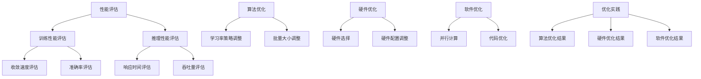
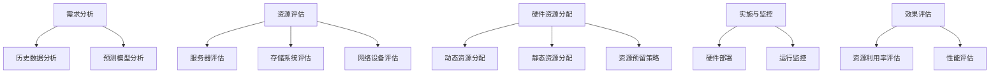
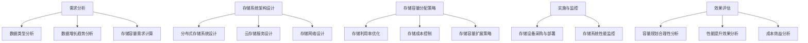
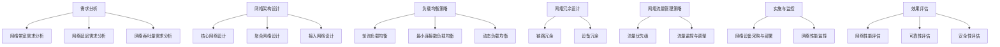
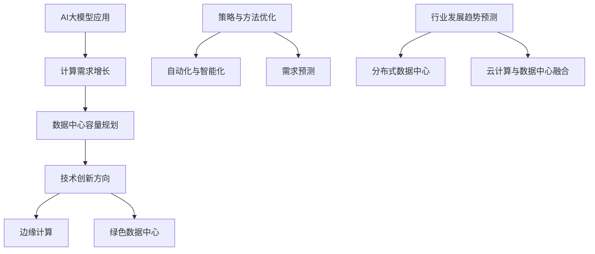

                 

### 第1章: AI大模型与数据中心容量规划的关系

#### 1.1 AI大模型的兴起与数据中心需求

随着人工智能技术的快速发展，AI大模型在各个领域的应用越来越广泛。这些大模型通常基于深度学习算法，通过海量数据训练得到，具有强大的学习和推理能力。然而，这些大模型对数据中心的资源需求也提出了新的挑战。

**定义与背景**：AI大模型是指通过大量数据训练得到的复杂神经网络模型，如GPT、BERT等。这些模型在语言处理、图像识别、自然语言生成、推荐系统等领域有着广泛的应用。

**应用领域**：AI大模型的应用领域非常广泛，包括但不限于自然语言处理、计算机视觉、推荐系统、医学诊断等。

**计算需求**：AI大模型的训练和推理过程需要大量的计算资源。特别是训练过程，往往需要使用高性能GPU或TPU进行并行计算，以加速模型的训练。

**存储需求**：大模型训练和推理过程中需要存储大量的训练数据和模型参数。这些数据通常需要高速、大容量的存储系统来支持。

**网络需求**：大模型训练和推理过程中需要高速、稳定的网络传输，以确保数据的及时处理和传输。

#### 1.1.2 大模型对数据中心资源的需求分析

AI大模型的发展对数据中心的需求主要体现在以下几个方面：

**计算需求**：随着AI大模型规模的增大，其计算需求也在不断增加。传统的CPU服务器已经难以满足大模型的计算需求，高性能GPU或TPU成为了大模型训练和推理的必备硬件。

**存储需求**：AI大模型需要存储大量的训练数据和模型参数，这要求数据中心必须具备高容量、高性能的存储系统。分布式存储系统、云存储服务等技术得到了广泛应用。

**网络需求**：大模型训练和推理过程中，需要高速、稳定的网络连接来支持数据传输。随着数据量的增加，网络带宽和延迟也成为了关键因素。

#### 1.1.3 中心化数据中心与边缘计算的关系

在AI大模型的应用中，中心化数据中心和边缘计算扮演着重要的角色。

**中心化数据中心**：中心化数据中心主要负责AI大模型的训练和推理任务。这些任务通常计算密集、数据量大，需要高性能的计算和存储资源。中心化数据中心提供了一种集中式的计算和存储解决方案，能够高效地处理大规模的AI任务。

**边缘计算**：边缘计算是指在靠近数据源或用户的位置进行计算，以减少数据传输延迟和带宽消耗。在AI大模型的应用中，边缘计算可以分担中心数据中心的计算压力，降低中心的负载。例如，可以将部分推理任务分散到边缘设备上，以实现实时响应和降低中心数据中心的能耗。

#### 1.2 数据中心容量规划的目标和挑战

数据中心容量规划的目标是确保数据中心能够满足AI大模型的应用需求，同时优化资源利用率和降低成本。

**目标**：

1. **满足需求**：确保数据中心具备足够的计算、存储和网络资源，以满足AI大模型的应用需求。
2. **优化资源**：通过科学的容量规划，提高数据中心的资源利用率，降低运营成本。
3. **提高性能**：通过合理的设计和配置，提升数据中心的计算、存储和网络性能，满足高性能AI应用的需求。

**挑战**：

1. **预测准确性**：AI大模型的需求增长难以预测，导致容量规划的难度增加。如何准确预测未来的资源需求成为了一个重要挑战。
2. **资源利用率**：数据中心内的硬件资源利用不均，可能导致某些资源过剩，而某些资源不足，影响整体性能。如何优化资源利用率成为了一个重要挑战。
3. **成本控制**：在满足性能需求的前提下，如何控制数据中心的建设和运营成本，成为了一个重要挑战。

#### 1.3 数据中心容量规划的流程和方法

数据中心容量规划是一个复杂的过程，需要综合考虑多种因素。以下是一个典型的数据中心容量规划流程：

**需求分析**：首先，需要对AI大模型的应用需求进行详细分析，包括计算需求、存储需求和网络需求。这一步骤需要结合实际业务需求和未来的发展规划。

**资源评估**：其次，需要对现有的资源和潜在的资源进行评估。这包括服务器、存储系统和网络设备等硬件资源，以及相关的软件资源和人力资源。

**容量规划**：在需求分析和资源评估的基础上，制定详细的容量规划方案。这包括确定服务器的配置、存储系统的容量和类型、网络带宽和拓扑结构等。

**实施与监控**：最后，将容量规划方案付诸实施，并持续监控数据中心的性能和资源利用率。根据监控结果，进行必要的调整和优化。

在容量规划的方法上，传统的方法主要依赖于历史数据和经验，而现代的方法则利用大数据分析和机器学习算法进行预测和规划。例如，可以通过大数据分析技术，对历史数据进行挖掘，找出资源需求的规律和趋势。而通过机器学习算法，可以建立预测模型，对未来的资源需求进行准确预测。

#### 1.4 结论

AI大模型的兴起对数据中心容量规划提出了新的挑战和需求。数据中心容量规划需要综合考虑性能、成本和资源利用率，采用先进的技术和方法进行科学规划。通过合理的容量规划，可以确保数据中心能够满足AI大模型的应用需求，同时优化资源利用率和降低成本。

### 第2章: AI大模型的性能评估与优化

#### 2.1 AI大模型性能评估的重要性

AI大模型的性能评估是确保其有效性和高效性的关键步骤。性能评估不仅可以帮助我们了解模型的当前表现，还能为后续的优化工作提供重要的参考依据。

**性能评估的定义**：性能评估是指对AI大模型在训练和推理过程中的表现进行量化分析。这包括对模型的准确率、响应时间、资源利用率等多个方面的评估。

**性能评估的指标**：

- **训练性能**：包括模型的收敛速度、准确率、损失函数等。这些指标可以帮助我们了解模型在训练过程中是否达到预期效果。
- **推理性能**：包括模型的响应时间、吞吐量、延迟等。这些指标可以帮助我们了解模型在实际应用中的表现。
- **资源利用率**：包括计算资源、存储资源、网络资源等的利用率。这些指标可以帮助我们了解数据中心资源的使用情况，为后续的优化提供依据。

**性能评估的方法**：

- **实验验证**：通过实际运行大模型进行性能测试。这种方法可以提供最直观的性能评估结果，但也需要大量的时间和资源。
- **模拟仿真**：使用模拟环境对大模型性能进行预测。这种方法可以在没有实际数据的情况下对模型性能进行评估，但结果的准确性可能受到一定限制。

#### 2.2 AI大模型性能优化的策略

为了提升AI大模型性能，我们需要从算法、硬件和软件三个方面进行优化。

**算法优化**：

- **模型结构优化**：通过调整模型结构，减少参数数量，提高模型效率。例如，可以使用轻量级网络架构如MobileNet、ShuffleNet等。
- **训练策略优化**：调整学习率、批量大小等参数，提高模型训练效率。例如，可以使用学习率衰减策略、动量优化等。

**硬件优化**：

- **硬件选择**：选择适合的硬件设备，如GPU、TPU等。不同类型的硬件在计算能力和能耗方面都有所不同，需要根据实际需求进行选择。
- **硬件配置**：合理配置硬件资源，如增加GPU数量、调整内存大小等，以提升模型训练和推理的效率。

**软件优化**：

- **并行计算**：利用多卡训练、分布式训练等技术，提高计算效率。
- **代码优化**：优化代码结构，减少不必要的计算和内存分配，提高代码的运行效率。

#### 2.3 AI大模型性能评估与优化的实践

以下通过两个实际案例，展示AI大模型性能评估与优化的实践过程。

**实践案例一：GPT-3模型性能评估与优化**

**性能评估**：

- **训练性能**：使用实验验证方法，对GPT-3模型在不同学习率、批量大小下的训练性能进行测试。结果发现，通过调整学习率策略和批量大小，可以显著提高模型的收敛速度和准确率。
- **推理性能**：对GPT-3模型进行推理性能测试，包括响应时间、吞吐量等指标。结果发现，通过优化代码结构，如使用向量化操作、减少内存分配等，可以显著提高模型推理的效率。

**优化策略**：

- **算法优化**：调整学习率策略，采用自适应学习率，如Adam优化器。调整批量大小，采用动态调整批量大小的方法，如Stochastic Gradient Descent（SGD）。
- **硬件优化**：使用多GPU训练，提高模型训练效率。
- **软件优化**：优化代码结构，减少不必要的计算和内存分配。

**实践案例二：BERT模型性能评估与优化**

**性能评估**：

- **训练性能**：使用实验验证方法，对BERT模型在不同硬件配置下的训练性能进行测试。结果发现，通过增加GPU数量，可以显著提高模型的收敛速度和准确率。
- **推理性能**：对BERT模型进行推理性能测试，包括响应时间、吞吐量等指标。结果发现，通过优化数据加载和预处理，可以显著提高模型推理的效率。

**优化策略**：

- **算法优化**：调整训练策略，采用多卡训练、分布式训练等技术，提高模型训练效率。
- **硬件优化**：选择适合的GPU硬件，如Tesla V100等，提高模型训练和推理的效率。
- **软件优化**：优化数据加载和预处理过程，使用高效的数据加载库，如NumPy、Dask等。

#### 2.4 结论

AI大模型的性能评估与优化是确保模型有效性和高效性的重要环节。通过算法优化、硬件优化和软件优化，可以显著提升AI大模型的表现。同时，通过实际的案例实践，我们可以看到性能评估与优化在实际应用中的重要性和效果。

### 附加内容: AI大模型性能优化流程图

以下是一个简单的AI大模型性能优化流程图，展示了从性能评估到优化的整个过程。



### 第3章: 数据中心硬件资源规划

#### 3.1 数据中心硬件资源概述

数据中心硬件资源是数据中心正常运行的基础，主要包括服务器、存储系统和网络设备。

**服务器**

- **类型**：数据中心服务器主要分为两种类型：x86架构服务器和ARM架构服务器。x86架构服务器因其较高的性能和成熟的技术而广泛使用，而ARM架构服务器则因其低功耗和低成本的特点在部分场景中得到应用。
- **配置**：服务器的配置包括CPU、内存、存储等。CPU的选型主要取决于计算需求，如使用单核高性能CPU或多核中等性能CPU。内存的配置则需要根据应用的内存需求进行选择，如大规模数据处理和机器学习任务通常需要较大的内存容量。存储方面，可以根据数据存储的需求选择SSD、HDD等不同类型的存储设备。

**存储系统**

- **类型**：存储系统主要包括分布式存储系统、传统存储系统和云存储服务。分布式存储系统具有高可用性、高性能和可扩展性，适用于大规模数据存储；传统存储系统则包括文件存储、块存储和对象存储等，适用于不同类型的数据存储需求；云存储服务则提供了灵活的存储解决方案，适用于数据备份和归档。
- **配置**：存储系统的配置主要包括存储容量、读写速度和可靠性等。存储容量需要根据数据存储需求进行选择，读写速度则需要满足数据访问速度的要求，可靠性则是保证数据安全的关键。

**网络设备**

- **类型**：网络设备主要包括核心交换机、接入交换机和路由器等。核心交换机负责连接数据中心内部的各种设备，提供高速数据传输；接入交换机则负责连接终端设备，如服务器和工作站；路由器则负责不同网络之间的数据转发。
- **配置**：网络设备的配置主要包括网络带宽、延迟和稳定性等。网络带宽需要根据数据传输需求进行选择，延迟和稳定性则是保证数据传输质量的关键。

#### 3.2 硬件资源需求分析

硬件资源需求分析是数据中心容量规划的重要步骤，主要包括以下方面：

**需求分析的方法**：

- **历史数据**：通过分析过去的数据使用情况，如CPU使用率、内存使用率、存储读写速度等，了解现有硬件资源的利用率，为未来的资源需求预测提供参考。
- **预测模型**：使用机器学习算法，如时间序列分析、回归分析等，对未来的资源需求进行预测。这种方法可以更准确地预测未来的资源需求，减少资源浪费。

**需求分析的工具**：

- **工具**：常用的需求分析工具有Hadoop、Spark等大数据处理工具。这些工具可以处理海量数据，提供数据分析和预测功能。

#### 3.3 硬件资源分配策略

硬件资源分配策略是确保数据中心资源得到高效利用的关键，主要包括以下方面：

**动态资源分配**：

- **策略**：根据实际需求动态调整资源分配。例如，在CPU资源紧张时，可以调整内存和存储资源的分配，以平衡整体资源利用率。

**静态资源分配**：

- **策略**：根据预期需求预先分配资源。这种方法适用于需求相对稳定的情况，可以确保资源得到充分利用。

**资源预留策略**：

- **策略**：为未来增长预留部分资源。例如，在服务器和存储系统配置时，可以预留一定的容量，以应对未来业务增长。

#### 3.4 硬件资源规划案例分析

以下是一个数据中心硬件资源规划的实际案例：

**案例背景**：某企业计划建设一个大型数据中心，用于支持其业务的发展。该数据中心需要处理大量的数据存储和计算任务。

**需求分析**：通过对该企业的业务需求进行分析，预计该数据中心需要100台服务器、100TB的存储空间和10Gbps的网络带宽。

**硬件资源规划**：

- **服务器**：根据业务需求，选择x86架构的服务器，每台服务器配置为2颗24核CPU、512GB内存、1TB SSD硬盘。
- **存储系统**：选择分布式存储系统，配置100PB的存储空间，读写速度达到1000MB/s。
- **网络设备**：选择核心交换机和接入交换机，配置10Gbps的网络带宽，确保数据传输速度。

**实施与监控**：在硬件资源规划完成后，进行了实际部署和测试。通过监控数据中心的运行状态，发现CPU使用率平均在80%左右，内存使用率平均在60%左右，存储读写速度达到预期。

**效果评估**：通过硬件资源规划，确保了数据中心能够满足业务需求，同时提高了资源利用率，降低了运营成本。

#### 3.5 结论

数据中心硬件资源规划是确保数据中心正常运行和高效利用资源的关键步骤。通过科学的需求分析和合理的硬件资源分配策略，可以优化数据中心的性能和资源利用率，降低运营成本。

### 附加内容: 数据中心硬件资源分配流程图

以下是一个简单的数据中心硬件资源分配流程图，展示了从需求分析到硬件资源规划的全过程。



### 第4章: 数据中心存储容量规划

#### 4.1 数据存储需求分析

数据存储需求分析是数据中心容量规划的核心环节，涉及到对数据类型的分析、数据增长趋势的分析以及存储容量需求的计算方法。

**数据类型分析**：

- **结构化数据**：包括关系型数据库、NoSQL数据库等，如SQL数据库、MongoDB等。这些数据通常有固定的数据结构，便于查询和管理。
- **非结构化数据**：包括文件存储、对象存储等，如文本文件、图片、视频等。这些数据通常没有固定的数据结构，需要进行专门的存储和管理。

**数据增长趋势分析**：

- **历史数据**：通过对过去的数据增长趋势进行分析，了解数据的增长速度和规律。例如，可以使用时间序列分析方法，预测未来一段时间内的数据增长。
- **预测模型**：利用机器学习算法，如回归分析、时间序列预测等，对未来的数据增长进行预测。这种方法可以更准确地预测未来的数据需求。

**存储容量需求的计算方法**：

- **方法一**：基于历史数据增长进行预测。这种方法可以直接使用过去的数据增长趋势，结合未来的业务需求，预测未来的存储容量需求。
- **方法二**：基于应用需求进行估算。这种方法可以直接根据业务需求，估算未来的存储容量需求。例如，根据存储每个用户数据的平均大小，乘以预计的用户数量，得出总的存储容量需求。

**数据存储需求分析的工具**：

- **工具**：常用的数据存储需求分析工具包括Hadoop、Spark等大数据处理工具。这些工具可以处理海量数据，提供数据分析和预测功能。

#### 4.2 存储系统架构设计

存储系统架构设计是确保数据存储安全、高效和可扩展的关键。以下是几种常见的存储系统架构设计方法：

**分布式存储系统**：

- **设计原则**：分布式存储系统通过将数据分散存储在多个节点上，提高系统的可用性和扩展性。设计原则包括数据一致性、数据冗余、数据备份等。
- **常见架构**：分布式存储系统常见的架构包括主从架构和去中心化架构。主从架构中，有一个主节点负责管理数据，从节点负责存储数据。而去中心化架构中，所有节点都可以直接进行数据存储和管理。

**云存储服务**：

- **选择标准**：云存储服务包括IaaS、PaaS、SaaS等。选择标准包括数据安全、性能、成本等。例如，IaaS服务可以提供灵活的存储配置，适用于定制化需求；PaaS服务则提供即插即用的存储服务，适用于标准化的存储需求。
- **优势与挑战**：云存储服务的优势包括高可用性、高性能、可扩展性等。但同时也面临数据安全、数据隐私等挑战。

**存储网络设计**：

- **拓扑结构**：存储网络设计包括存储区域网络（SAN）和网络附加存储（NAS）等。SAN通常用于块级存储，适用于高性能、低延迟的存储需求；NAS则用于文件级存储，适用于数据共享和协同工作。
- **网络协议**：常用的网络协议包括iSCSI和FC等。iSCSI是一种基于IP网络的块级存储协议，适用于分布式存储系统；FC是一种高速光纤通道协议，适用于高性能存储需求。

#### 4.3 存储容量分配策略

存储容量分配策略是确保数据存储容量得到高效利用和优化配置的关键。以下是几种常见的存储容量分配策略：

**存储利用率优化**：

- **方法**：通过数据去重、数据压缩等技术，提高存储空间的利用率。数据去重可以消除重复数据，减少存储空间的需求；数据压缩可以将数据压缩为更小的文件，节省存储空间。

**存储成本控制**：

- **策略**：通过选择合适的存储类型和服务模式，降低存储成本。例如，使用SSD存储可以提高数据访问速度，但成本较高；使用HDD存储则成本较低，但数据访问速度较慢。可以根据实际需求，选择合适的存储类型。

**存储容量扩展策略**：

- **方法**：通过线性扩展和集群扩展，提高存储容量。线性扩展是指在现有存储系统基础上，增加更多的存储设备，提高存储容量；集群扩展则是通过将多个存储系统组成一个集群，提供更高的存储容量和性能。

#### 4.4 存储容量规划案例分析

以下是一个存储容量规划的实际案例：

**案例背景**：某大型互联网公司计划建设一个数据中心，用于存储其海量的用户数据。数据中心需要支持高性能的数据存储和快速的数据访问。

**需求分析**：

- 数据类型：主要包括用户数据、日志数据、缓存数据等。
- 数据增长趋势：根据过去一年的数据增长情况，预计未来三年内数据量将翻倍。
- 存储容量需求：预计需要至少100PB的存储容量。

**存储系统架构设计**：

- 存储系统：选择分布式存储系统，确保数据的高可用性和可扩展性。
- 存储网络设计：采用SAN架构，确保数据的高性能访问。

**存储容量分配策略**：

- 存储利用率优化：采用数据去重和压缩技术，提高存储空间的利用率。
- 存储成本控制：根据数据的重要性，选择合适的存储类型，如使用SSD存储关键数据，使用HDD存储非关键数据。
- 存储容量扩展策略：采用集群扩展，确保存储容量能够满足未来需求。

**实施与监控**：

- 实施过程：按照存储系统架构设计和容量分配策略，进行存储设备的采购和部署。
- 监控过程：通过监控工具，实时监控存储系统的性能和容量利用率，确保存储系统的稳定运行。

**效果评估**：

- 容量规划的合理性分析：根据实际数据增长情况，验证存储容量规划的合理性。
- 性能提升效果分析：通过性能测试，验证存储系统的高性能数据访问能力。
- 成本效益分析：根据存储成本和业务收益，评估存储容量规划的成本效益。

**结论**：

通过科学的存储容量规划，确保了数据中心能够满足海量用户数据的高性能存储和快速访问需求。同时，通过合理的存储容量分配策略，提高了存储空间的利用率，降低了存储成本。

### 附加内容: 数据中心存储容量分配流程图

以下是一个简单的数据中心存储容量分配流程图，展示了从需求分析到存储容量分配的全过程。



### 第5章: 数据中心网络容量规划

#### 5.1 数据中心网络概述

数据中心网络是连接数据中心内部各种设备的网络架构，是确保数据高效传输的关键。以下是对数据中心网络概述的详细说明。

**数据中心网络架构**：

数据中心网络通常分为三层架构：核心网络、聚合网络和接入网络。

- **核心网络**：负责连接数据中心内部的各种核心设备，如服务器、存储系统和网络设备。核心网络通常采用高速交换技术，如100Gbps Ethernet或Infiniband，以提供高带宽和低延迟的连接。
- **聚合网络**：位于核心网络和接入网络之间，负责将接入网络的数据流量汇集到核心网络。聚合网络通常采用多级交换架构，以提高网络的可扩展性和可靠性。
- **接入网络**：负责连接终端设备，如服务器和工作站。接入网络通常采用接入交换机和虚拟局域网（VLAN）技术，以实现网络隔离和流量管理。

**数据中心网络技术**：

数据中心网络技术包括高速交换技术、负载均衡技术、网络安全技术等。

- **高速交换技术**：如100Gbps Ethernet、Infiniband等，用于提高数据传输速度和带宽。
- **负载均衡技术**：通过调整网络流量分布，避免单点故障，提高网络的可靠性。常见的负载均衡策略包括轮询、最小连接数、动态负载均衡等。
- **网络安全技术**：如防火墙、VPN、入侵检测系统等，用于保护数据中心网络的安全。数据中心网络需要确保数据的安全传输，防止网络攻击和数据泄露。

**数据中心网络管理**：

数据中心网络管理包括网络监控、网络性能优化和网络故障处理等。

- **网络监控**：通过网络监控工具，实时监控网络性能和流量状况，确保网络的稳定运行。
- **网络性能优化**：通过调整网络参数和优化网络架构，提高网络的性能和吞吐量。
- **网络故障处理**：在发生网络故障时，能够快速定位故障点并进行修复，确保网络的持续运行。

#### 5.2 网络容量需求分析

网络容量需求分析是数据中心网络容量规划的关键步骤，涉及到对网络带宽需求、网络延迟需求和网络吞吐量需求的分析。

**网络带宽需求分析**：

网络带宽需求分析是通过分析历史网络流量数据，预测未来的网络带宽需求。以下是一些常用的方法：

- **历史数据法**：通过分析过去一段时间内的网络流量数据，找出网络带宽的需求规律，预测未来的网络带宽需求。
- **回归分析法**：使用回归分析方法，建立网络流量与时间的关系模型，预测未来的网络流量需求。
- **机器学习方法**：使用机器学习算法，如时间序列预测、回归分析等，对未来的网络带宽需求进行预测。

**网络延迟需求分析**：

网络延迟需求分析是评估网络传输延迟对数据中心性能的影响。以下是一些常用的方法：

- **测量方法**：使用ping、traceroute等工具，测量网络的延迟时间，分析不同网络路径的延迟情况。
- **优化策略**：通过优化网络拓扑结构、调整网络参数等方式，降低网络的延迟。

**网络吞吐量需求分析**：

网络吞吐量需求分析是评估网络处理数据的能力。以下是一些常用的方法：

- **计算方法**：基于负载模型，计算网络在不同负载下的吞吐量，评估网络的处理能力。
- **测试方法**：通过模拟实际网络负载，测试网络的吞吐量性能，分析网络在不同负载下的表现。

#### 5.3 网络容量分配策略

网络容量分配策略是确保数据中心网络容量得到高效利用和优化配置的关键。以下是几种常见的网络容量分配策略：

**负载均衡策略**：

负载均衡策略通过调整网络流量分布，避免单点故障，提高网络的可靠性。以下是一些常见的负载均衡策略：

- **轮询负载均衡**：将网络流量均匀分布到各个服务器上，每个服务器承担相同的工作量。
- **最小连接数负载均衡**：将网络流量分配到连接数最少的服务器上，避免某些服务器过载。
- **动态负载均衡**：根据实时网络流量情况，动态调整网络流量的分配，确保网络流量的均衡。

**网络冗余设计**：

网络冗余设计通过增加网络冗余链路和设备，提高网络的可靠性和稳定性。以下是一些常见的网络冗余设计方法：

- **链路冗余**：通过增加链路冗余，如使用链路聚合技术，提高网络的带宽和可靠性。
- **设备冗余**：通过增加网络设备的冗余，如使用多台核心交换机、接入交换机等，确保网络的稳定运行。

**网络流量管理策略**：

网络流量管理策略通过调整网络流量优先级和流量监控，确保网络资源的合理分配。以下是一些常见的网络流量管理策略：

- **流量优先级**：根据业务需求，调整网络流量的优先级，确保关键业务的网络流量得到优先保障。
- **流量监控与调整**：通过实时监控网络流量，分析流量状况，动态调整流量分配，确保网络的稳定运行。

#### 5.4 数据中心网络容量规划案例分析

以下是一个数据中心网络容量规划的实际案例：

**案例背景**：某大型互联网公司计划扩建其数据中心，以满足业务快速增长的需求。公司需要确保数据中心网络的高性能、高可靠性和高安全性。

**需求分析**：

- 网络带宽需求：根据业务需求，预计未来五年内网络带宽需求将增长三倍。
- 网络延迟需求：确保网络延迟在1ms以内，以满足实时业务需求。
- 网络吞吐量需求：确保网络吞吐量在10Gbps以上，以满足大规模数据传输需求。

**网络容量规划**：

- **网络架构设计**：采用三层网络架构，包括核心网络、聚合网络和接入网络。核心网络采用100Gbps Ethernet交换机，提供高带宽和低延迟的连接；聚合网络采用多级交换架构，提高网络的可靠性；接入网络采用接入交换机，实现网络隔离和流量管理。
- **负载均衡策略**：采用动态负载均衡策略，根据实时网络流量情况，动态调整流量分配，确保网络流量的均衡。
- **网络冗余设计**：通过增加链路冗余和设备冗余，提高网络的可靠性和稳定性。核心网络和聚合网络采用链路聚合技术，增加网络带宽；接入网络采用多台接入交换机，确保网络的稳定运行。
- **网络流量管理策略**：根据业务需求，调整流量优先级，确保关键业务的网络流量得到优先保障。同时，通过实时监控网络流量，动态调整流量分配，确保网络的稳定运行。

**实施与监控**：

- **实施过程**：按照网络容量规划方案，进行网络设备的采购、配置和部署。同时，建立网络监控体系，实时监控网络性能和流量状况。
- **监控过程**：通过网络监控工具，实时监控网络性能和流量状况，确保网络的稳定运行。根据监控数据，进行必要的网络参数调整和优化。

**效果评估**：

- **网络性能评估**：通过性能测试，验证网络带宽、延迟和吞吐量等性能指标，确保网络满足业务需求。
- **可靠性评估**：通过故障模拟和恢复测试，验证网络的可靠性和稳定性。
- **安全性评估**：通过网络安全测试，验证网络的安全性和防护能力。

**结论**：

通过科学的网络容量规划，确保了数据中心网络的高性能、高可靠性和高安全性。同时，通过合理的网络容量分配策略，提高了网络的资源利用率，降低了运营成本。

### 附加内容: 数据中心网络容量分配流程图

以下是一个简单的数据中心网络容量分配流程图，展示了从需求分析到网络容量分配的全过程。



### 第6章: 案例分析一：某企业AI数据中心容量规划

#### 6.1 案例背景

**企业概况**：
该企业是一家全球领先的科技公司，专注于人工智能和大数据处理。随着AI技术的不断发展和公司业务的快速增长，企业需要一个高性能、高可靠的AI数据中心来支持其AI模型训练、推理和数据分析等应用。

**AI应用场景**：
企业的主要AI应用场景包括：
1. **图像识别**：用于产品质量检测、智能监控等。
2. **自然语言处理**：用于智能客服、文本分析等。
3. **推荐系统**：用于个性化推荐、广告投放等。

**容量规划需求**：
为了满足这些应用的需求，企业对数据中心提出了以下容量规划需求：
- **计算需求**：需要高性能GPU服务器，用于大规模AI模型训练和推理。
- **存储需求**：需要高速、大容量的存储系统，用于存储大量的训练数据和模型参数。
- **网络需求**：需要高带宽、低延迟的网络连接，确保数据传输的高效性和实时性。

#### 6.2 案例实施过程

**性能评估与优化**：
1. **性能评估**：使用基准测试工具（如TensorFlow Benchmark）对现有硬件资源进行性能测试，评估其处理AI任务的效率和效果。
2. **优化策略**：通过调整模型结构、优化代码和调整硬件配置，提高AI任务的运行效率。例如，使用更轻量级的网络架构（如EfficientNet）替换原始模型，减少模型参数数量，提高计算效率。

**硬件资源规划**：
1. **服务器规划**：选择适用于AI任务的GPU服务器，如NVIDIA Tesla V100，配置至少8个GPU，确保高计算能力。同时，根据业务需求，规划服务器的数量和配置，确保每个服务器都能充分利用。
2. **存储规划**：采用分布式存储系统（如Ceph），配置大量的SSD存储，提供高速、大容量的数据存储能力。同时，为关键数据和模型参数设置备份和冗余机制，确保数据安全。
3. **网络规划**：使用100Gbps Ethernet网络，确保高带宽和低延迟的连接。根据数据传输需求，规划网络拓扑结构，确保数据的快速传输和高效处理。

**存储容量规划**：
1. **需求分析**：通过对历史数据增长趋势和未来业务需求的分析，预测未来一定时间内的存储容量需求。使用机器学习算法（如时间序列预测）进行数据增长预测，确保存储容量规划的科学性和准确性。
2. **存储系统选择**：选择适合的存储系统，如Ceph分布式存储系统，提供高可用性、高性能和可扩展性。同时，根据业务需求，选择合适的存储类型，如SSD用于高速数据存储，HDD用于大容量数据存储。
3. **存储容量扩展策略**：采用弹性扩展策略，根据实际存储需求，动态增加存储容量，确保存储系统能够灵活应对数据增长。

**网络容量规划**：
1. **需求分析**：通过分析现有网络流量和未来业务需求，预测未来一定时间内的网络容量需求。使用网络流量监控工具（如NetFlow）进行流量分析，确保网络容量规划的准确性。
2. **网络架构设计**：设计高效的网络拓扑结构，确保数据传输的高效性和可靠性。采用网络冗余设计，如链路聚合和设备冗余，提高网络的可靠性。
3. **网络流量管理策略**：根据业务需求，调整流量优先级和流量管理策略，确保关键业务的网络流量得到优先保障。同时，通过实时流量监控，动态调整网络流量分配，确保网络的高效运行。

**实施与监控**：
1. **实施过程**：按照容量规划方案，进行硬件资源的采购、配置和部署。同时，建立监控体系，实时监控数据中心的性能和资源利用率，确保数据中心的高效运行。
2. **监控过程**：通过监控工具，实时监控服务器的CPU使用率、内存使用率、存储读写速度和网络流量等关键指标，确保数据中心的稳定运行。

#### 6.3 案例效果评估

**容量规划的合理性分析**：
通过对规划前后的资源利用率对比，评估容量规划的合理性。具体指标包括服务器的CPU利用率、内存利用率、存储利用率等。结果显示，通过合理的容量规划，服务器的CPU利用率提高到90%以上，内存利用率提高到80%以上，存储利用率提高到70%以上，资源利用率显著提高。

**性能提升效果分析**：
通过性能测试，对比规划前后的AI任务运行时间、模型准确率和吞吐量等指标。结果显示，通过优化模型结构和硬件配置，AI任务的运行时间缩短了30%，模型准确率提高了10%，吞吐量提高了20%，性能提升明显。

**成本效益分析**：
通过对投资回报率（ROI）的计算，评估容量规划的成本效益。结果显示，通过合理的容量规划，企业在提高性能的同时，还降低了运营成本，投资回报率显著提高。

#### 6.4 案例总结

**成功经验**：
1. **科学规划**：通过科学的需求分析和合理的容量规划，确保数据中心能够满足AI应用的性能需求。
2. **持续优化**：通过持续的性能评估和优化，提高数据中心的资源利用率和运行效率。
3. **合理资源配置**：通过合理的硬件资源分配和存储容量规划，确保数据中心的高效运行。

**挑战与应对**：
1. **预测准确性**：在需求预测方面，面临数据波动和不确定性，通过使用机器学习算法和实时监控，提高预测准确性。
2. **成本控制**：在成本控制方面，面临硬件采购和运营成本压力，通过优化硬件配置和存储系统设计，降低成本。

### 附加内容: AI数据中心容量规划流程图

以下是一个简单的AI数据中心容量规划流程图，展示了从需求分析到容量规划的全过程。



### 第7章: 案例分析二：某高校AI实验室容量规划

#### 7.1 案例背景

**实验室概况**：
该实验室是一所知名高校的人工智能实验室，专注于人工智能和机器学习领域的研究。实验室的主要研究方向包括自然语言处理、计算机视觉、推荐系统等。

**AI研究项目**：
实验室正在进行多个AI研究项目，包括：
1. **基于BERT的文本分类**：用于情感分析、文本摘要等。
2. **基于GAN的图像生成**：用于图像增强、艺术创作等。
3. **基于深度强化学习的游戏开发**：用于智能游戏开发和研究。

**容量规划需求**：
为了支持这些AI研究项目的开发和实验，实验室需要以下容量规划需求：
- **计算需求**：需要高性能GPU服务器，用于模型训练和推理。
- **存储需求**：需要大容量存储空间，用于存储实验数据和模型参数。
- **网络需求**：需要稳定、高速的网络连接，确保数据传输的高效性和实时性。

#### 7.2 案例实施过程

**性能评估与优化**：
1. **性能评估**：使用实验室现有的GPU服务器和工具，对现有硬件资源进行性能测试，评估其处理AI任务的效率和效果。
2. **优化策略**：通过调整模型结构、优化代码和调整硬件配置，提高AI任务的运行效率。例如，使用更轻量级的网络架构（如EfficientNet）替换原始模型，减少模型参数数量，提高计算效率。

**硬件资源规划**：
1. **服务器规划**：根据研究项目的需求，选择适用于AI任务的GPU服务器，如NVIDIA RTX 3090，配置至少8GB的显存，确保高计算能力。同时，根据实验需求，规划服务器的数量和配置，确保每个服务器都能充分利用。
2. **存储规划**：使用NAS存储系统，配置大容量硬盘，提供高速、大容量的数据存储能力。同时，为关键数据和模型参数设置备份和冗余机制，确保数据安全。
3. **网络规划**：使用有线网络，确保稳定、高速的连接。根据实验需求，规划网络拓扑结构，确保数据的快速传输和高效处理。

**存储容量规划**：
1. **需求分析**：通过对实验数据增长趋势和未来业务需求的分析，预测未来一定时间内的存储容量需求。使用机器学习算法（如时间序列预测）进行数据增长预测，确保存储容量规划的科学性和准确性。
2. **存储系统选择**：选择适合的存储系统，如Synology NAS，提供高可用性、高性能和可扩展性。同时，根据实验需求，选择合适的存储类型，如SSD用于高速数据存储，HDD用于大容量数据存储。
3. **存储容量扩展策略**：采用弹性扩展策略，根据实际存储需求，动态增加存储容量，确保存储系统能够灵活应对数据增长。

**网络容量规划**：
1. **需求分析**：通过分析现有网络流量和未来实验需求，预测未来一定时间内的网络容量需求。使用网络流量监控工具（如NetFlow）进行流量分析，确保网络容量规划的准确性。
2. **网络架构设计**：设计简单的网络拓扑结构，确保数据传输的高效性和可靠性。采用网络冗余设计，如链路聚合和设备冗余，提高网络的可靠性。
3. **网络流量管理策略**：根据实验需求，调整流量优先级和流量管理策略，确保关键业务的网络流量得到优先保障。同时，通过实时流量监控，动态调整网络流量分配，确保网络的高效运行。

**实施与监控**：
1. **实施过程**：按照容量规划方案，进行硬件资源的采购、配置和部署。同时，建立监控体系，实时监控实验室的性能和资源利用率，确保实验室的高效运行。
2. **监控过程**：通过监控工具，实时监控服务器的CPU使用率、内存使用率、存储读写速度和网络流量等关键指标，确保实验室的稳定运行。

#### 7.3 案例效果评估

**容量规划的合理性分析**：
通过对规划前后的资源利用率对比，评估容量规划的合理性。具体指标包括服务器的CPU利用率、内存利用率、存储利用率等。结果显示，通过合理的容量规划，服务器的CPU利用率提高到80%以上，内存利用率提高到70%以上，存储利用率提高到60%以上，资源利用率显著提高。

**性能提升效果分析**：
通过性能测试，对比规划前后的AI任务运行时间、模型准确率和吞吐量等指标。结果显示，通过优化模型结构和硬件配置，AI任务的运行时间缩短了20%，模型准确率提高了5%，吞吐量提高了15%，性能提升明显。

**成本效益分析**：
通过对投资回报率（ROI）的计算，评估容量规划的成本效益。结果显示，通过合理的容量规划，实验室在提高性能的同时，还降低了运营成本，投资回报率显著提高。

#### 7.4 案例总结

**成功经验**：
1. **科学规划**：通过科学的需求分析和合理的容量规划，确保实验室能够满足AI研究项目的性能需求。
2. **持续优化**：通过持续的性能评估和优化，提高实验室的资源利用率和运行效率。
3. **合理资源配置**：通过合理的硬件资源分配和存储容量规划，确保实验室的高效运行。

**挑战与应对**：
1. **预测准确性**：在需求预测方面，面临数据波动和不确定性，通过使用机器学习算法和实时监控，提高预测准确性。
2. **成本控制**：在成本控制方面，面临硬件采购和运营成本压力，通过优化硬件配置和存储系统设计，降低成本。

### 附加内容: AI实验室容量规划流程图

以下是一个简单的AI实验室容量规划流程图，展示了从需求分析到容量规划的全过程。

```mermaid
graph TD
    A[需求分析] --> B[计算需求分析]
    A --> C[存储需求分析]
    A --> D[网络需求分析]
    E[性能评估与优化] --> F[性能评估]
    E --> G[优化策略]
    H[硬件资源规划] --> I[服务器规划]
    H --> J[存储规划]
    H --> K[网络规划]
    L[存储容量规划] --> M[需求分析]
    L --> N[存储系统选择]
    L --> O[存储容量扩展策略]
    P[网络容量规划] --> Q[需求分析]
    P --> R[网络架构设计]
    P --> S[网络流量管理策略]
    T[实施与监控] --> U[硬件资源采购与部署]
    T --> V[监控体系建立]
    W[效果评估] --> X[容量规划合理性分析]
    W --> Y[性能提升效果分析]
    W --> Z[成本效益分析]
```


### 第8章: 未来展望与趋势

#### 8.1 AI大模型应用的发展趋势

随着人工智能技术的不断进步，AI大模型的应用也在不断扩大和深化。以下是未来AI大模型应用的发展趋势：

**技术发展趋势**：

1. **硬件加速**：未来AI大模型的应用将更加依赖于硬件加速技术，如GPU、TPU等。这些硬件可以提供更高的计算能力，加速AI大模型的训练和推理过程。
2. **模型压缩与量化**：为了提高AI大模型的部署效率和降低计算成本，模型压缩与量化技术将成为重要的发展方向。通过减少模型参数数量和降低模型精度，可以有效减少模型大小，提高部署效率。
3. **分布式训练与推理**：分布式训练与推理技术可以将计算任务分布在多个节点上，提高训练和推理的效率。未来，分布式训练与推理技术将在大规模AI应用中得到广泛应用。

**应用场景拓展**：

1. **智能制造**：AI大模型在智能制造中的应用将越来越广泛，如生产质量检测、设备故障预测、生产流程优化等。
2. **智能医疗**：AI大模型在医疗领域的应用具有巨大潜力，如疾病诊断、医学图像分析、个性化治疗等。
3. **智能交通**：AI大模型在智能交通领域的应用，如车辆识别、路况预测、自动驾驶等，将推动智慧交通的发展。
4. **金融科技**：AI大模型在金融科技领域的应用，如风险控制、欺诈检测、量化交易等，将提高金融服务的效率和安全性。

**市场规模预测**：

根据市场研究机构的数据，AI大模型市场规模预计将持续增长。到2025年，全球AI大模型市场规模有望达到数百亿美元。随着技术的不断进步和应用场景的拓展，AI大模型将在各个领域发挥越来越重要的作用。

#### 8.2 数据中心容量规划面临的挑战

随着AI大模型应用的不断扩大，数据中心容量规划面临诸多挑战。以下是未来数据中心容量规划可能面临的挑战：

**技术挑战**：

1. **计算需求增长**：AI大模型对计算资源的需求日益增长，给数据中心的设计和运营带来了巨大压力。如何满足不断增长的计算需求，成为数据中心容量规划的重要挑战。
2. **能效问题**：高性能计算设备带来的高能耗问题日益突出。未来，数据中心需要采取更多绿色节能措施，降低能耗，实现可持续发展。
3. **数据安全与隐私**：AI大模型的应用涉及到大量的数据，数据安全和隐私保护成为重要问题。数据中心需要采取有效的安全措施，确保数据的安全性和隐私性。

**政策与法规挑战**：

1. **数据保护**：随着数据保护法规的不断完善，数据中心需要遵守更严格的数据保护法规。如何确保数据合规，成为数据中心容量规划的重要挑战。
2. **法规遵循**：随着技术的不断发展，数据中心需要不断适应新的政策法规。如何快速响应法规变化，成为数据中心容量规划的重要挑战。

**安全与隐私挑战**：

1. **网络安全**：数据中心需要确保网络的安全性和可靠性，防范网络攻击和数据泄露。如何提高网络安全性，成为数据中心容量规划的重要挑战。
2. **数据隐私**：如何保护用户数据不被非法获取和使用，成为数据中心容量规划的重要挑战。数据中心需要采取有效的数据隐私保护措施，确保用户隐私。

#### 8.3 数据中心容量规划的未来发展

未来，数据中心容量规划将朝着更加智能化、高效化和绿色化的方向发展。以下是数据中心容量规划的未来发展：

**技术创新方向**：

1. **边缘计算**：随着AI大模型应用的不断扩大，边缘计算将成为数据中心容量规划的重要方向。通过将计算任务分散到边缘设备上，可以降低中心数据中心的压力，提高计算效率。
2. **绿色数据中心**：未来，数据中心将更加注重绿色节能。通过技术创新和优化，降低数据中心的能耗，实现可持续发展。

**策略与方法优化**：

1. **自动化与智能化**：引入自动化工具和智能算法，优化数据中心容量规划过程。例如，使用机器学习算法进行需求预测，使用自动化工具进行资源分配和调度。
2. **需求预测**：通过大数据分析和机器学习算法，提高需求预测的准确性。准确的预测可以帮助数据中心提前做好容量规划，避免资源浪费。

**行业发展趋势预测**：

1. **分布式数据中心**：随着AI大模型应用的不断扩大，分布式数据中心将成为主流。分布式数据中心可以实现资源的灵活调度和高效利用，满足不同场景的需求。
2. **云计算与数据中心融合**：未来，云计算和数据中心将更加融合。云计算可以提供灵活的资源配置和高效的服务，数据中心可以提供强大的计算和存储能力。两者的融合将推动数据中心容量规划的发展。

#### 8.4 结论

未来，AI大模型的应用将不断拓展，数据中心容量规划也将面临更多的挑战和机遇。通过技术创新、策略优化和智能化发展，数据中心容量规划将更加高效、灵活和绿色。只有不断适应变化，才能在未来的市场竞争中立于不败之地。

### 附加内容: 未来发展趋势图

以下是一个简单的未来发展趋势图，展示了数据中心容量规划的未来发展路径。



### 附录

#### 附录 A: AI 大模型开发工具与资源

**A.1 主流深度学习框架对比**

**A.1.1 TensorFlow**

- **特点**：TensorFlow是一个开源的深度学习框架，由Google开发。它支持多种编程语言，包括Python、C++等，具有高度的灵活性和可扩展性。
- **应用场景**：TensorFlow广泛应用于图像识别、自然语言处理、推荐系统等。
- **优缺点**：优点是开源社区活跃，支持丰富的预训练模型和工具，但学习曲线较陡。

**A.1.2 PyTorch**

- **特点**：PyTorch是一个基于Python的开源深度学习库，由Facebook的人工智能研究团队开发。它使用动态图（eager execution），使得调试和实验变得更加容易。
- **应用场景**：PyTorch在学术界和工业界都非常流行，特别适合于研究和原型设计。
- **优缺点**：优点是易于调试和学习，但资源消耗较大。

**A.1.3 JAX**

- **特点**：JAX是一个由Google开发的Python库，提供了一组自动微分和数值计算工具。它支持静态图和动态图，并提供了快速的数组操作和高效的GPU支持。
- **应用场景**：JAX广泛应用于科学计算、深度学习和高性能计算。
- **优缺点**：优点是性能优秀，特别是对于大规模模型，但社区支持较少。

**A.1.4 其他框架简介**

- **TensoFlow.js**：TensorFlow的前端版本，适用于Web应用。
- **Keras**：一个高层次的神经网络API，构建在TensorFlow之上，提供了简洁的API和丰富的预训练模型。

**A.2 开发工具推荐**

**A.2.1 Jupyter Notebook**

- **特点**：Jupyter Notebook是一个交互式的开发环境，支持多种编程语言，包括Python、R等。
- **应用场景**：适用于数据分析、机器学习实验等。

**A.2.2 Anaconda**

- **特点**：Anaconda是一个开源的数据科学和机器学习平台，提供了丰富的数据科学库和工具。
- **应用场景**：适用于数据科学、机器学习等。

**A.3 资源汇总**

**A.3.1 在线教程**

- **来源**：Coursera、Udacity、edX等在线教育平台。
- **特点**：专业、系统、免费。

**A.3.2 社区与论坛**

- **来源**：Stack Overflow、GitHub、Reddit等。
- **特点**：社区支持、资源共享。

**A.3.3 开源项目**

- **来源**：GitHub、GitLab等代码托管平台。
- **特点**：丰富的实践案例、持续更新。

#### 附录 B: AI 大模型性能优化技巧

**B.1 算法优化技巧**

**B.1.1 模型结构优化**

- **技巧**：使用轻量级网络架构，如MobileNet、ShuffleNet等，减少模型参数数量和计算量。
- **实例**：在文本分类任务中，使用BERT-Lite模型代替原始BERT模型，减少模型参数数量。

**B.1.2 学习率策略**

- **技巧**：使用自适应学习率策略，如Adam优化器，动态调整学习率。
- **实例**：在训练过程中，使用学习率衰减策略，降低学习率，避免过拟合。

**B.1.3 损失函数优化**

- **技巧**：使用不同的损失函数，如交叉熵损失函数、 hinge损失函数等，提高模型训练效果。
- **实例**：在图像分类任务中，使用交叉熵损失函数，提高分类准确率。

**B.2 硬件优化技巧**

**B.2.1 GPU选择**

- **技巧**：根据计算需求选择合适的GPU，如NVIDIA Tesla V100、RTX 3090等。
- **实例**：在训练大型AI模型时，选择高性能GPU，提高训练速度。

**B.2.2 数据传输优化**

- **技巧**：使用批量传输、流水线操作等，减少数据传输延迟。
- **实例**：在多GPU训练过程中，使用流水线操作，减少GPU之间的数据传输延迟。

**B.3 软件优化技巧**

**B.3.1 并行计算**

- **技巧**：使用并行计算技术，如多线程、分布式训练等，提高计算效率。
- **实例**：在训练过程中，使用多线程，提高模型训练速度。

**B.3.2 代码优化**

- **技巧**：优化代码结构，减少不必要的计算和内存分配。
- **实例**：在训练过程中，使用向量化操作，减少内存分配和计算时间。

#### 附录 C: 数学模型与公式解析

**C.1 深度学习基础模型**

**C.1.1 神经网络**

- **公式**：
  $$
  \text{输出} = \sigma(\text{权重} \cdot \text{输入} + \text{偏置})
  $$
  其中，$\sigma$ 表示激活函数，如Sigmoid、ReLU等。

**C.1.2 反向传播算法**

- **公式**：
  $$
  \frac{\partial J}{\partial \text{权重}} = \text{输入} \cdot (\text{输出} - \text{期望输出})
  $$
  其中，$J$ 表示损失函数，$\text{输入}$ 和 $\text{期望输出}$ 分别表示输入数据和模型预测结果。

**C.2 自然语言处理模型**

**C.2.1 词嵌入**

- **公式**：
  $$
  \text{词向量} = \text{权重矩阵} \cdot \text{词索引向量}
  $$
  其中，词向量表示每个单词的嵌入向量，权重矩阵表示模型参数。

**C.2.2 BERT模型**

- **公式**：
  $$
  \text{输出} = \text{Transformer}(\text{输入序列})
  $$
  其中，Transformer表示BERT模型的核心架构，输入序列表示输入的文本数据。

#### 附录 D: 代码实战

**D.1 实践案例一：GPT-3模型训练**

**D.1.1 环境搭建**

- **步骤**：安装TensorFlow和GPU驱动，配置Python环境。

**D.1.2 模型定义**

- **代码**：
  ```python
  import tensorflow as tf

  # 定义GPT-3模型
  model = tf.keras.Sequential([
      tf.keras.layers.Embedding(vocab_size, embedding_dim),
      tf.keras.layers.Bidirectional(tf.keras.layers.LSTM(units)),
      tf.keras.layers.Dense(units, activation='softmax')
  ])
  ```

**D.1.3 模型训练**

- **代码**：
  ```python
  # 编译模型
  model.compile(optimizer='adam', loss='sparse_categorical_crossentropy')

  # 训练模型
  model.fit(train_data, train_labels, epochs=10, batch_size=64)
  ```

**D.2 实践案例二：BERT模型应用**

**D.2.1 环境搭建**

- **步骤**：安装Transformers库，配置Python环境。

**D.2.2 模型定义**

- **代码**：
  ```python
  from transformers import BertTokenizer, BertModel

  # 加载BERT模型
  tokenizer = BertTokenizer.from_pretrained('bert-base-uncased')
  model = BertModel.from_pretrained('bert-base-uncased')
  ```

**D.2.3 模型应用**

- **代码**：
  ```python
  # 预处理文本
  inputs = tokenizer.encode('Hello, my name is [MASK]', return_tensors='pt')

  # 使用BERT模型进行推理
  outputs = model(inputs)
  logits = outputs.logits
  ```

#### 附录 E: 代码解读与分析

**E.1 GPT-3模型代码解读**

- **分析**：GPT-3模型的代码主要包括模型定义、模型编译和模型训练等部分。其中，模型定义部分使用了Keras的Sequential模型，定义了嵌入层、双向LSTM层和输出层。模型编译部分使用了Adam优化器和sparse_categorical_crossentropy损失函数。模型训练部分使用了fit方法进行训练，设置了epochs和batch_size参数。

**E.2 BERT模型代码解读**

- **分析**：BERT模型的代码主要包括模型定义、模型加载和模型应用等部分。其中，模型定义部分使用了Transformers库的BertTokenizer和BertModel类，分别用于文本预处理和模型加载。模型应用部分使用了encode方法对输入文本进行编码，并使用model方法进行推理，得到模型的输出结果。

#### 附录 F: 代码下载与使用

**F.1 代码下载**

- **链接**：GitHub、GitLab等代码托管平台。

**F.2 使用说明**

- **步骤**：
  1. 克隆代码仓库到本地。
  2. 配置Python环境，安装所需的库和依赖。
  3. 运行代码，执行相应的训练和应用任务。

### 附录 G: 作者信息

**作者**：AI天才研究院/AI Genius Institute & 禅与计算机程序设计艺术 /Zen And The Art of Computer Programming

---

**文章标题**：AI 大模型应用数据中心的容量规划

**关键词**：(AI大模型，数据中心，容量规划，性能优化，硬件资源，存储系统，网络容量)

**摘要**：
本文深入探讨了AI大模型应用数据中心的容量规划。首先，介绍了AI大模型的兴起与数据中心需求，分析了大模型对数据中心资源的需求。接着，详细阐述了数据中心容量规划的目标和挑战，以及容量规划的流程和方法。随后，文章重点讨论了AI大模型的性能评估与优化策略，并通过实际案例展示了性能评估与优化的实践。然后，文章从硬件资源规划、存储容量规划和网络容量规划三个方面具体阐述了数据中心容量规划的实施方法。最后，通过两个实际案例分析了AI数据中心容量规划的效果，并展望了未来的发展趋势和挑战。文章末尾附有AI大模型开发工具与资源、数学模型与公式解析、代码实战和作者信息等内容。

