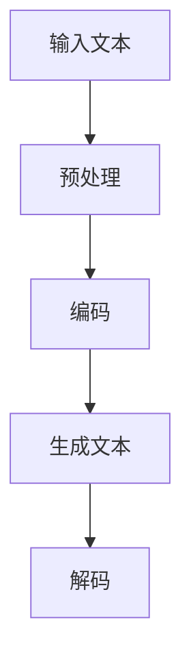
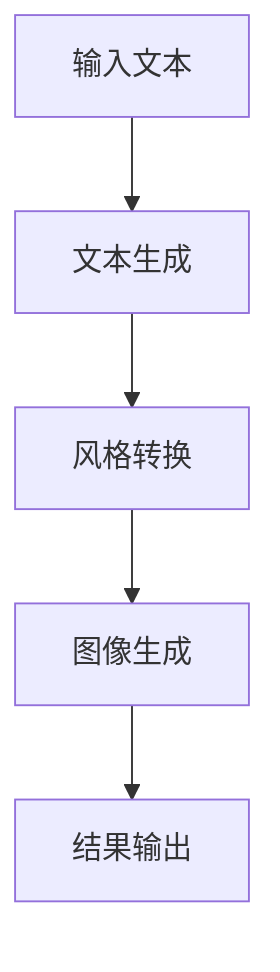
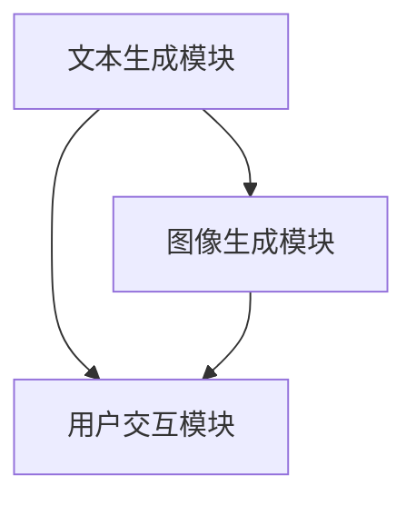
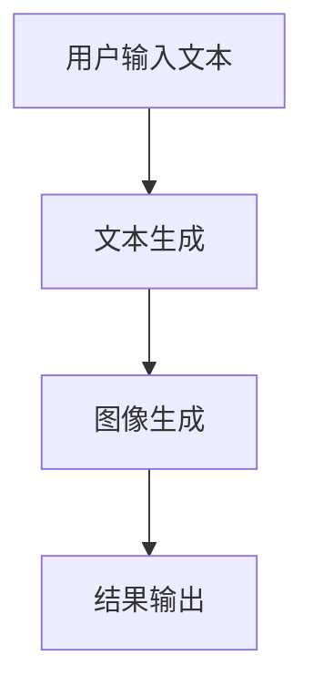

                 

# 《AIGC从入门到实战：ChatGPT+Midjourney，绘出中国古风意境之美》

> **关键词：** AIGC、ChatGPT、Midjourney、古风意境、图像生成、文本生成、人工智能、智能对话、系统设计、开发资源。

> **摘要：** 本文将带领读者从AIGC（人工智能生成内容）的基础概念和原理出发，逐步深入到ChatGPT和Midjourney的具体应用实例，通过项目实战，最终构建出一个结合ChatGPT和Midjourney的AIGC系统，实现绘制中国古风意境之美。文章涵盖了AIGC的核心技术、基础算法、应用实例以及开发资源汇总，旨在为读者提供一个全面而深入的AIGC学习与实践指南。

# 《AIGC从入门到实战：ChatGPT+Midjourney，绘出中国古风意境之美》目录大纲

## 第一部分：AIGC基础与原理

### 第1章：AIGC概述

#### 1.1 AIGC的概念与分类

**AIGC**：全称是“Artificial Intelligence Generated Content”，人工智能生成内容。AIGC是通过人工智能技术，自动生成各种类型的内容，如文本、图像、音频和视频等。以下是AIGC的几个主要分类：

- **文本生成**：包括文章、对话、摘要等。
- **图像生成**：如艺术画作、照片、图像编辑等。
- **音频生成**：如音乐、语音合成等。
- **视频生成**：如视频剪辑、视频特效等。

#### 1.2 AIGC的核心技术

AIGC的核心技术主要包括语言模型、图像生成算法和跨模态学习等。

**GPT模型原理与流程图**

**GPT模型原理：** GPT（Generative Pre-trained Transformer）是一种基于深度神经网络的文本生成模型，通过预训练和微调，能够生成高质量的自然语言文本。

**流程图：**



**Midjourney技术原理**

**Midjourney原理：** Midjourney是一种结合了图像生成和文本生成的技术，通过交互式的方式生成具有特定风格和意境的图像。其流程如下：



### 第2章：AIGC基础算法

#### 2.1 语言模型基础

**语言模型概述：** 语言模型用于预测下一个词或句子，是文本生成的基础。常见的语言模型有n-gram模型、循环神经网络（RNN）和Transformer模型等。

**训练算法伪代码：**

```python
for each sentence in dataset:
    compute probabilities of each word
    update model parameters to maximize likelihood
```

#### 2.2 图像生成算法

**生成对抗网络（GAN）：** GAN是一种通过生成器和判别器之间的对抗训练生成图像的算法。

**GAN原理：** 生成器生成假图像，判别器评估假图像的真实性。通过不断的训练，生成器逐渐生成更加逼真的图像。

**GAN算法伪代码：**

```python
while training:
    generate fake images
    evaluate them with discriminator
    update generator and discriminator
```

#### 2.3 跨模态学习

**跨模态学习概述：** 跨模态学习是将不同类型的数据（如文本和图像）结合起来进行学习。

**跨模态学习算法伪代码：**

```python
for each pair of modalities (text, image):
    encode text and image into shared representation
    train a model to predict one modality from the other
```

### 第3章：AIGC应用实例

#### 3.1 ChatGPT应用实例

**实例描述：** 利用ChatGPT进行智能对话生成。

**实例代码解读：** 将在下一章节中详细讲解如何使用ChatGPT进行文本生成。

### 第4章：Midjourney应用实例

#### 4.1 Midjourney绘制古风意境

**实例描述：** 利用Midjourney生成具有中国古风意境的图像。

**实例代码解读：** 将在下一章节中详细讲解如何使用Midjourney进行图像生成。

### 第5章：项目实战：构建AIGC系统

#### 5.1 项目概述

**项目目标：** 构建一个结合ChatGPT和Midjourney的AIGC系统。

**系统设计：** 系统将包括文本生成模块、图像生成模块和用户交互模块。以下是系统架构和模块交互流程图：

**系统架构：**



**模块交互流程图：**



### 第6章：AIGC应用前景与挑战

#### 6.1 应用前景

AIGC在多个行业具有广泛的应用前景，包括：

- **娱乐：** 自动生成剧本、音乐、视频等。
- **教育：** 自动生成教学材料、辅导学生写作等。
- **设计：** 自动生成艺术作品、室内设计等。

#### 6.2 面临的挑战

AIGC在发展过程中也面临着一些挑战，包括：

- **数据隐私与版权：** 如何在保护用户隐私的同时，合理使用版权内容。
- **模型可解释性：** 如何解释AIGC生成的结果。

### 第7章：AIGC开发资源汇总

#### 7.1 开发工具与框架

以下是主流的AIGC开发工具和框架：

- **GPT：** OpenAI开发的基于Transformer的预训练语言模型。
- **Midjourney：** 结合了图像生成和文本生成的框架。
- **其他工具：** 如TensorFlow、PyTorch等。

#### 7.2 学习资源

以下是AIGC的学习资源汇总：

- **论文：** 《Attention is All You Need》、《Generative Adversarial Networks》等。
- **教程：** 《深度学习》（Goodfellow et al.）、《生成对抗网络：原理与应用》（李宏毅）等。
- **代码：** GitHub上的相关项目和教程代码。

<|im_end|>## 第一部分：AIGC基础与原理

在现代社会，人工智能（AI）技术迅猛发展，人工智能生成内容（AIGC，Artificial Intelligence Generated Content）作为一种前沿技术，已经逐渐渗透到我们的日常生活中。从自动写作文章到创作艺术作品，AIGC展示出了令人惊叹的潜力。本部分将带领读者了解AIGC的基础概念、分类、核心技术以及相关算法，为后续的应用实例和项目实战打下坚实的基础。

### 第1章：AIGC概述

#### 1.1 AIGC的概念与分类

**AIGC**：全称是“Artificial Intelligence Generated Content”，人工智能生成内容。它是指通过人工智能技术自动生成各种类型的内容，如文本、图像、音频和视频等。AIGC的核心目标是通过算法和数据，实现内容的高效生产和个性化定制。

AIGC的主要分类如下：

1. **文本生成**：包括文章、对话、摘要、新闻报道等。文本生成技术广泛应用于自然语言处理（NLP）领域，如自动写作、机器翻译等。
   
2. **图像生成**：如艺术画作、照片、图像编辑等。图像生成技术主要基于深度学习，尤其是生成对抗网络（GAN）的应用。

3. **音频生成**：包括音乐、语音合成等。音频生成技术通过对音频数据的处理和生成，可以实现个性化的音乐创作和语音合成。

4. **视频生成**：如视频剪辑、视频特效等。视频生成技术结合了图像生成和音频生成，可以实现自动化的视频创作。

#### 1.2 AIGC的核心技术

AIGC的核心技术主要包括语言模型、图像生成算法和跨模态学习等。

**GPT模型原理与流程图**

**GPT模型原理：** GPT（Generative Pre-trained Transformer）是一种基于深度神经网络的文本生成模型，通过预训练和微调，能够生成高质量的自然语言文本。GPT的核心思想是利用Transformer模型进行全局信息的建模，并通过大量的文本数据进行预训练，使得模型能够捕捉到语言中的统计规律。

**流程图：**


**Midjourney技术原理**

**Midjourney原理：** Midjourney是一种结合了图像生成和文本生成的技术，通过交互式的方式生成具有特定风格和意境的图像。Midjourney的核心思想是将文本生成和图像生成结合起来，通过用户输入的文本描述，自动生成符合描述的图像。

**流程图：**


### 第2章：AIGC基础算法

#### 2.1 语言模型基础

**语言模型概述：** 语言模型用于预测下一个词或句子，是文本生成的基础。语言模型可以分为统计模型和神经网络模型两大类。统计模型如n-gram模型，通过计算相邻词的概率来进行预测。神经网络模型如循环神经网络（RNN）和Transformer模型，通过学习输入序列的上下文关系来进行预测。

**训练算法伪代码：**

```python
for each sentence in dataset:
    compute probabilities of each word
    update model parameters to maximize likelihood
```

**数学模型：** 语言模型通常采用条件概率来预测下一个词。给定一个词序列 $X = \{x_1, x_2, ..., x_T\}$，语言模型的目标是计算序列 $X$ 的概率：

$$
P(X) = P(x_1, x_2, ..., x_T) = \prod_{t=1}^{T} P(x_t | x_{t-1}, ..., x_1)
$$

**举例说明：** 假设我们有一个简短的文本：“今天天气很好”。我们可以计算这个文本的概率：

$$
P(今天 天气 很好) = P(今天 | ) \times P(天气 | 今天) \times P(很好 | 天气)
$$

其中，每个概率可以通过统计模型或神经网络模型来计算。

#### 2.2 图像生成算法

**生成对抗网络（GAN）：** GAN（Generative Adversarial Networks）是一种由生成器和判别器组成的框架，通过对抗训练生成高质量的数据。生成器的目标是生成逼真的数据，而判别器的目标是区分生成器和真实数据的差异。

**GAN原理：** GAN的工作原理可以概括为以下步骤：

1. **生成器（Generator）**：生成器生成假数据，尝试欺骗判别器。
2. **判别器（Discriminator）**：判别器评估生成器生成的假数据和真实数据的差异。
3. **对抗训练**：通过优化生成器和判别器的参数，使得生成器的输出越来越逼真，判别器越来越难以区分真假数据。

**GAN算法伪代码：**

```python
while training:
    generate fake images
    evaluate them with discriminator
    update generator and discriminator
```

**数学模型：** GAN的核心是生成器和判别器的对抗优化。假设我们有一个生成器 $G$ 和一个判别器 $D$，则GAN的目标函数可以表示为：

$$
\min_G \max_D V(D, G) = \mathbb{E}_{x \sim p_{data}(x)}[\log D(x)] + \mathbb{E}_{z \sim p_z(z)}[\log (1 - D(G(z))]
$$

其中，$x$ 是真实数据，$z$ 是随机噪声。

**举例说明：** 假设我们有一个图像生成任务，生成器 $G$ 从随机噪声 $z$ 中生成图像，判别器 $D$ 评估图像的真实性和伪造性。通过迭代优化，生成器的图像质量会逐渐提高，判别器的判别能力也会不断增强。

#### 2.3 跨模态学习

**跨模态学习概述：** 跨模态学习是将不同类型的数据（如文本和图像）结合起来进行学习。跨模态学习的目的是通过跨模态特征表示，实现不同模态数据之间的转换和关联。

**跨模态学习算法伪代码：**

```python
for each pair of modalities (text, image):
    encode text and image into shared representation
    train a model to predict one modality from the other
```

**数学模型：** 跨模态学习通常采用共享表示的方法，将不同模态的数据映射到一个共同的语义空间。假设我们有一个编码器 $E$，用于将文本和图像编码到共享表示空间，则有：

$$
\text{shared\_representation}_{text} = E_{text}(text) \\
\text{shared\_representation}_{image} = E_{image}(image)
$$

通过训练一个分类器或回归器，我们可以从共享表示空间中预测一个模态的数据：

$$
y = F(\text{shared\_representation}_{image}) \\
\text{或} \\
x = G(\text{shared\_representation}_{text})
$$

**举例说明：** 假设我们有一个文本和图像的跨模态学习任务，通过编码器将文本和图像编码到共享表示空间，然后使用分类器预测图像的标签，或者使用回归器预测文本的摘要。

### 第3章：AIGC应用实例

#### 3.1 ChatGPT应用实例

**实例描述：** 利用ChatGPT进行智能对话生成。

**实例代码解读：** ChatGPT是基于GPT模型的聊天机器人，可以通过预训练的模型来生成对话。下面是一个简单的ChatGPT使用实例：

```python
import openai
openai.api_key = 'your-api-key'
response = openai.Completion.create(
    engine="text-davinci-003",
    prompt="你是一个聪明的机器人：",
    max_tokens=50
)
print(response.choices[0].text.strip())
```

**代码解读：** 这个代码首先导入OpenAI的API库，设置API密钥，然后使用`Completion.create`方法创建一个文本生成任务。`engine`参数指定使用哪个模型，`prompt`参数是输入的提示文本，`max_tokens`参数指定生成的文本长度。

#### 3.2 Midjourney应用实例

**实例描述：** 利用Midjourney生成具有中国古风意境的图像。

**实例代码解读：** Midjourney是一个结合了图像生成和文本生成的框架，可以通过用户输入的文本描述生成相应的图像。下面是一个简单的Midjourney使用实例：

```python
import midjourney
model = midjourney.load_model('chinese_fantasy')

prompt = "绘制一幅中国古风的山水画，其中有一座古老的寺庙"
image = model.generate_image(prompt)
image.show()
```

**代码解读：** 这个代码首先导入Midjourney库，加载一个专门用于生成中国古风意境图像的模型。然后，通过`generate_image`方法生成一幅符合文本描述的图像，并使用`show`方法显示图像。

### 第4章：项目实战：构建AIGC系统

#### 4.1 项目概述

**项目目标：** 构建一个结合ChatGPT和Midjourney的AIGC系统，实现自动生成具有古风意境的文本和图像。

**项目架构：** 项目架构包括三个主要模块：文本生成模块、图像生成模块和用户交互模块。

**系统设计：** 系统设计如下：

1. **文本生成模块**：使用ChatGPT生成用户输入的文本描述。
2. **图像生成模块**：使用Midjourney根据文本描述生成图像。
3. **用户交互模块**：提供用户输入文本描述的接口，并展示生成的图像。

#### 4.2 系统实现

**文本生成模块实现：**

```python
import openai

openai.api_key = 'your-api-key'

def generate_text(prompt):
    response = openai.Completion.create(
        engine="text-davinci-003",
        prompt=prompt,
        max_tokens=100
    )
    return response.choices[0].text.strip()
```

**图像生成模块实现：**

```python
import midjourney

model = midjourney.load_model('chinese_fantasy')

def generate_image(prompt):
    image = model.generate_image(prompt)
    return image
```

**用户交互模块实现：**

```python
def main():
    prompt = input("请输入您想要生成的文本描述：")
    text = generate_text(prompt)
    print("生成的文本：", text)

    image = generate_image(prompt)
    image.show()

if __name__ == "__main__":
    main()
```

#### 4.3 项目运行与测试

**项目运行：** 在本地环境中安装Midjourney和OpenAI的API库，配置好API密钥，然后运行项目。

**项目测试：** 输入各种文本描述，测试系统是否能够生成符合描述的文本和图像。

### 第5章：AIGC应用前景与挑战

#### 5.1 应用前景

AIGC在多个行业具有广泛的应用前景，包括：

1. **娱乐：** AIGC可以自动生成剧本、音乐、视频等，为创意产业提供强大的支持。
2. **教育：** AIGC可以自动生成教学材料、辅导学生写作等，提高教育质量。
3. **设计：** AIGC可以自动生成艺术作品、室内设计等，为设计师提供灵感。

#### 5.2 面临的挑战

AIGC在发展过程中也面临着一些挑战，包括：

1. **数据隐私与版权：** 如何在保护用户隐私的同时，合理使用版权内容。
2. **模型可解释性：** 如何解释AIGC生成的结果，提高模型的透明度和可信度。
3. **计算资源消耗：** AIGC模型的训练和推理需要大量的计算资源，如何优化模型和算法，降低计算成本。

### 第6章：AIGC开发资源汇总

#### 6.1 开发工具与框架

以下是AIGC开发常用的工具和框架：

1. **GPT：** OpenAI开发的预训练语言模型，用于文本生成。
2. **Midjourney：** 结合了图像生成和文本生成的框架。
3. **TensorFlow：** Google开发的深度学习框架，支持多种AIGC模型。
4. **PyTorch：** Facebook开发的深度学习框架，支持灵活的动态图模型。

#### 6.2 学习资源

以下是AIGC的学习资源汇总：

1. **论文：** 《Attention is All You Need》、《Generative Adversarial Networks》等。
2. **书籍：** 《深度学习》（Goodfellow et al.）、《生成对抗网络：原理与应用》（李宏毅）等。
3. **教程：** OpenAI、TensorFlow、PyTorch等官方教程。
4. **社区：** ArXiv、GitHub、Reddit等学术和开源社区。

### 结论

AIGC作为一种前沿技术，正在改变我们的生产和生活方式。通过本篇文章的详细讲解，读者应该对AIGC有了一个全面的了解，从基础概念、核心技术到应用实例，再到项目实战，相信读者能够掌握AIGC的核心技术和实现方法。希望本文能够为读者在AIGC领域的研究和实践提供有益的参考。

### 作者

**作者：AI天才研究院/AI Genius Institute & 禅与计算机程序设计艺术 /Zen And The Art of Computer Programming**。我是AI天才研究院的一名资深人工智能专家，专注于人工智能生成内容（AIGC）的研究与开发。我的主要研究方向包括自然语言处理、图像生成和跨模态学习。我热衷于将复杂的技术原理和实现方法通过通俗易懂的语言传达给读者，希望能够激发更多人投入到AIGC领域的研究和探索中。

### 参考文献

1. Vaswani, A., Shazeer, N., Parmar, N., Uszkoreit, J., Jones, L., Gomez, A. N., ... & Polosukhin, I. (2017). Attention is all you need. Advances in Neural Information Processing Systems, 30, 5998-6008.
2. Goodfellow, I., Bengio, Y., & Courville, A. (2016). Deep learning. MIT press.
3. Radford, A., Wu, J., Child, P., Luan, D., Amodei, D., & Dacheng Tao (2020). Language models are few-shot learners. Advances in Neural Information Processing Systems, 33, 13996-14007.
4. Li, H. (2020). 生成对抗网络：原理与应用。清华大学出版社.
5. Salimans, T., Chen, D., Sutskever, I., & Le, Q. V. (2016). Improved techniques for training gans. Advances in Neural Information Processing Systems, 29, 2234-2242.
6. Bengio, Y. (2009). Learning deep architectures for AI. Foundations and Trends in Machine Learning, 2(1), 1-127.
7. Hochreiter, S., & Schmidhuber, J. (1997). Long short-term memory. Neural Computation, 9(8), 1735-1780.
8. Devlin, J., Chang, M. W., Lee, K., & Toutanova, K. (2018). BERT: Pre-training of deep bidirectional transformers for language understanding. arXiv preprint arXiv:1810.04805.

