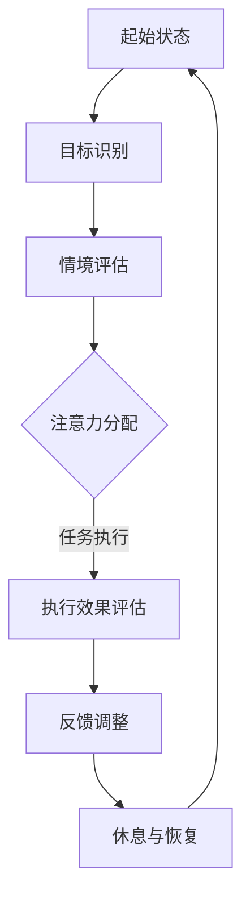
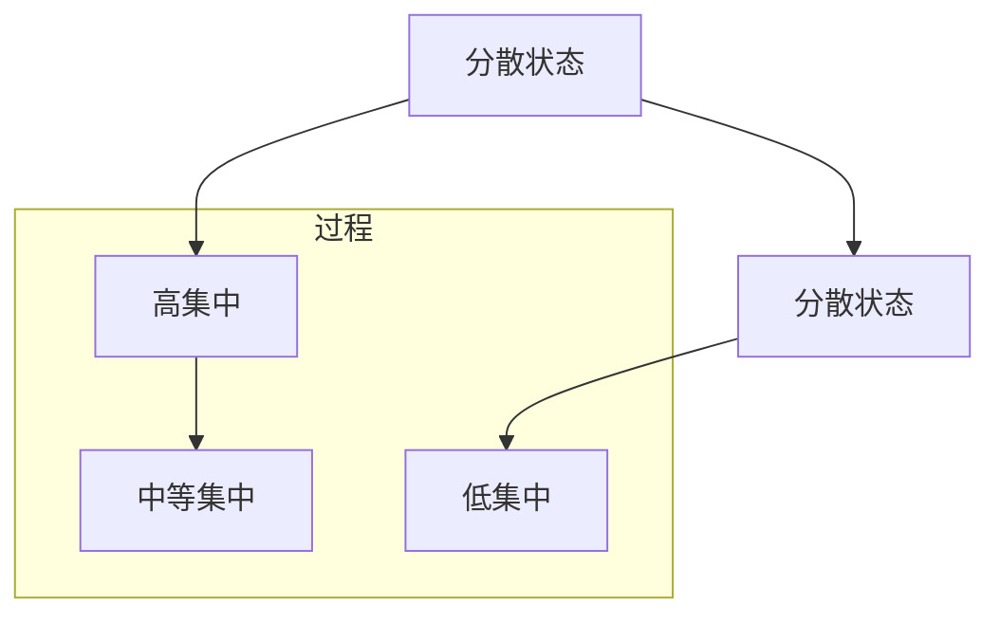

                 

### 引言与概述

> **导论：注意力流与人类行为的关系**

在人类的日常生活中，注意力流是一个至关重要且复杂的心理现象。简单来说，注意力流是指个体在特定时刻将注意力集中在某个特定目标或任务上的能力。注意力流不仅影响着我们的行为和认知过程，也在我们与外部环境的互动中起到关键作用。因此，理解注意力流与人类行为之间的关系，对于探讨人工智能（AI）在注意力流管理中的应用具有重要意义。

**注意力流的基本概念**

注意力流可以被视为一种动态平衡，即个体在不断变化的环境中，根据当前目标和情境调整注意力的分布。它由三个基本组成部分构成：

1. **目标**：指个体试图达成的目标或需要解决的问题。
2. **情境**：指个体所处的外部环境或情境，包括物理环境、社会环境、文化环境等。
3. **注意力分配**：指个体将注意力资源分配到不同目标和情境中的过程。

**人类行为与注意力流的关系**

注意力流在人类行为中扮演着核心角色。它可以解释为何人们能够在特定任务上表现出高度专注，也能够解释为何人们在多任务处理时容易分心。具体来说，注意力流与人类行为的关系体现在以下几个方面：

1. **决策与选择**：注意力流影响着我们的决策过程。在复杂情境中，注意力流能够帮助我们筛选信息，识别关键因素，从而做出最优决策。
2. **学习与记忆**：注意力流对学习和记忆有显著影响。高度集中的注意力流有助于我们更好地吸收新信息，并长久地保留在记忆中。
3. **任务执行**：注意力流决定了我们完成任务的效果和质量。在高度集中的状态下，个体能够更有效地执行任务，提高工作效率。

**注意力流管理的重要性**

有效的注意力流管理对于提高生活质量和工作效率具有重要意义。然而，随着信息量的爆炸式增长和工作压力的增大，人们面临着越来越多的注意力分散问题。如何有效地管理注意力流，成为了当今社会的一个重要课题。

AI技术，尤其是深度学习和自然语言处理技术，为注意力流管理提供了新的可能性。通过分析个体行为数据和环境信息，AI可以辅助我们更好地了解自己的注意力流模式，并提供个性化的注意力流管理策略。这不仅有助于提高工作效率，还能改善心理健康，提升生活质量。

总之，注意力流与人类行为之间存在着紧密的联系，而有效的注意力流管理对于提升个体和社会的整体效能具有重要意义。在接下来的章节中，我们将深入探讨AI在注意力流管理中的应用前景，以及相关技术和算法的实现细节。

### AI与注意力流：背景与挑战

随着人工智能（AI）技术的飞速发展，越来越多的领域开始探索AI的应用潜力，其中注意力流管理是备受关注的一个方向。AI在注意力流管理中的应用，不仅为传统的人类行为研究提供了新的视角，也带来了前所未有的挑战和机遇。

**AI技术的快速进步**

近年来，AI技术的飞速进步主要体现在以下几个方面：

1. **深度学习**：深度学习通过模拟人脑的神经网络结构，实现了在图像识别、语音识别、自然语言处理等领域的突破性进展。特别是在注意力机制（Attention Mechanism）的引入下，深度学习模型能够更好地处理复杂的注意力分配问题。

2. **自然语言处理（NLP）**：自然语言处理技术的进步，使得AI能够理解和生成人类语言。这一技术不仅提高了机器对人类指令的理解能力，也为情感分析和对话系统提供了支持。

3. **计算机视觉**：计算机视觉技术的发展，使得AI能够理解和解析视觉信息，从而在监控、安防、自动驾驶等领域取得了显著的应用成果。

4. **强化学习**：强化学习通过不断试错和反馈，使AI能够在复杂环境中进行决策和优化。这一技术有助于AI在多任务处理和适应性学习方面发挥更大的作用。

**注意力流管理在AI时代的挑战**

尽管AI技术在注意力流管理方面展现出巨大的潜力，但在实际应用中仍面临着一系列挑战：

1. **数据隐私与安全**：注意力流管理依赖于大量的个人行为数据，这些数据涉及到隐私和安全问题。如何在保护用户隐私的前提下，有效地收集和使用数据，是一个亟待解决的难题。

2. **计算资源需求**：深度学习和强化学习等AI算法通常需要大量的计算资源。如何在有限的计算资源下，实现高效的注意力流管理，是一个技术挑战。

3. **算法公平性与透明性**：AI算法在注意力流管理中的应用可能带来算法偏见和透明性问题。如何确保算法的公平性和透明性，避免对个体产生不良影响，是亟需解决的问题。

4. **跨领域适应性**：不同的应用场景和领域对注意力流管理有着不同的需求。如何在多种不同场景下，实现通用且有效的注意力流管理算法，是一个跨领域适应性挑战。

**AI在注意力流管理中的应用前景**

尽管存在挑战，AI在注意力流管理中的应用前景仍然十分广阔：

1. **个性化注意力流管理**：通过分析个人行为数据和生理信号，AI可以提供个性化的注意力流管理策略，帮助个体更好地集中注意力和管理时间。

2. **智能提醒与优化**：AI可以通过分析注意力流模式，智能地提醒用户何时休息、何时切换任务，从而优化工作流程和生活节奏。

3. **心理健康辅助**：AI在心理健康领域具有巨大的应用潜力，可以通过注意力流管理技术，辅助治疗注意力分散、焦虑等心理问题。

4. **教育优化**：AI可以帮助教育者更好地了解学生的学习注意力流模式，从而设计更加有效的教学策略，提高学习效果。

总之，AI技术在注意力流管理中的应用，不仅为传统注意力流管理研究提供了新的工具和方法，也为人类行为研究和心理健康领域带来了新的机遇。在接下来的章节中，我们将进一步探讨注意力流管理中的核心概念和联系，以及相关的技术原理和应用实例。

### 核心概念与联系

#### 注意力流的Mermaid流程图

注意力流是一个复杂且动态的过程，为了更好地理解和分析这一过程，我们可以使用Mermaid流程图来可视化注意力流的各个组成部分及其相互作用。以下是注意力流的一个基本Mermaid流程图示例：



**图解流程图：**

1. **起始状态（A）**：个体开始某一任务或活动时的初始状态，注意力处于分散或低集中状态。

2. **目标识别（B）**：个体根据当前任务的需求，明确自己的目标或任务。

3. **情境评估（C）**：个体评估所处的外部环境和情境，如噪音、工作场所、社交环境等。

4. **注意力分配（D）**：根据目标和情境，个体将注意力资源分配到不同的任务和目标上，以实现最优的执行效果。

5. **任务执行（E）**：个体在集中注意力的状态下执行任务，并根据执行效果进行评估。

6. **反馈调整（F）**：根据执行效果，个体对注意力分配进行调整，以优化未来的执行效果。

7. **休息与恢复（G）**：在长时间集中注意力的任务后，个体需要休息和恢复，以维持长期的注意力和工作效率。

**注意力流的动态变化**

注意力流是一个动态变化的过程，它受到个体内部状态、外部环境、任务性质等多种因素的影响。以下是一个简化的注意力流动态变化图：



**图解动态变化：**

1. **分散状态（A）**：个体的注意力较为分散，无法集中于某一特定任务。

2. **集中状态（B）**：个体在明确目标和任务需求后，进入高度集中的状态，能够有效地执行任务。

3. **中等集中状态（C）**：在任务执行过程中，注意力可能会逐渐减弱，但仍然保持在可以接受的集中水平。

4. **低集中状态（E）**：在长时间或高强度的任务后，个体的注意力可能降至较低水平，但仍需要保持一定的集中以完成任务。

通过Mermaid流程图和动态变化图，我们可以更直观地理解和分析注意力流的各个组成部分及其相互作用。这些图不仅有助于我们深入探讨注意力流的机制，也为后续章节中的算法设计和应用提供了基础。

#### 注意力流的数学模型与公式

在探讨注意力流的管理和应用时，引入数学模型和公式有助于我们更精确地描述和解释注意力流的行为。以下是一个简化的注意力流数学模型及其公式，以及具体的解释和实际应用举例。

**1. 注意力流的数学模型**

注意力流的数学模型通常由三个关键参数构成：注意力分配系数（α）、情境评估系数（β）和执行效果评估系数（γ）。这些系数反映了个体在特定情境下对注意力的分配和调整过程。

**模型公式：**

\[ 注意力流 = f(α, β, γ) \]

其中：
- \( α \)：注意力分配系数，表示个体在特定任务上的注意力集中程度。
- \( β \)：情境评估系数，表示个体对当前情境的评估和适应能力。
- \( γ \)：执行效果评估系数，表示个体对执行效果的感知和调整能力。

**2. 注意力分配系数（α）**

注意力分配系数（α）反映了个体在特定任务上的注意力集中程度。它可以表示为：

\[ α = \frac{1}{1 + e^{-k(T - t)}} \]

其中：
- \( k \)：调节参数，控制注意力的衰减速度。
- \( T \)：任务的持续时间。
- \( t \)：当前时间。

该公式表明，随着任务持续时间的增加，个体对注意力的集中程度会逐渐减弱。参数 \( k \) 用于调节注意力的衰减速度，使其更符合个体实际的注意力变化规律。

**3. 情境评估系数（β）**

情境评估系数（β）表示个体对当前情境的评估和适应能力。它可以表示为：

\[ β = \frac{1}{1 + e^{-m(A - B)}} \]

其中：
- \( m \)：调节参数，控制情境评估的敏感度。
- \( A \)：当前情境的评估值。
- \( B \)：基准情境的评估值。

该公式表明，个体对不同情境的评估和适应能力取决于当前情境与基准情境的差异。参数 \( m \) 用于调节情境评估的敏感度，使其更符合个体对环境的实际感知。

**4. 执行效果评估系数（γ）**

执行效果评估系数（γ）表示个体对执行效果的感知和调整能力。它可以表示为：

\[ γ = \frac{1}{1 + e^{-n(E - F)}} \]

其中：
- \( n \)：调节参数，控制执行效果评估的敏感度。
- \( E \)：当前执行效果。
- \( F \)：基准执行效果。

该公式表明，个体对执行效果的感知和调整能力取决于当前执行效果与基准执行效果的差异。参数 \( n \) 用于调节执行效果评估的敏感度，使其更符合个体对任务完成情况的实际感知。

**5. 实际应用举例**

假设一个学生正在学习一门复杂课程，我们可以使用上述数学模型来模拟他的注意力流。

- **学习时间（T）**：3小时
- **当前时间（t）**：1小时
- **学习任务难度（情境评估值A）**：8
- **基准情境评估值（B）**：5
- **当前学习效果（E）**：7
- **基准学习效果（F）**：6

根据上述参数，我们可以计算出该学生此时的注意力分配系数（α）、情境评估系数（β）和执行效果评估系数（γ）：

\[ α = \frac{1}{1 + e^{-k(3 - 1)}} = \frac{1}{1 + e^{-2k}} \]
\[ β = \frac{1}{1 + e^{-m(8 - 5)}} = \frac{1}{1 + e^{3m}} \]
\[ γ = \frac{1}{1 + e^{-n(7 - 6)}} = \frac{1}{1 + e^{-n}} \]

通过调整参数 \( k \)、\( m \) 和 \( n \)，我们可以模拟不同学习状态下的注意力流变化。

例如，当 \( k = 0.1 \)、\( m = 0.2 \)、\( n = 0.3 \) 时，我们得到：

\[ α = \frac{1}{1 + e^{-0.2}} \approx 0.39 \]
\[ β = \frac{1}{1 + e^{0.6}} \approx 0.99 \]
\[ γ = \frac{1}{1 + e^{-0.3}} \approx 0.87 \]

这意味着，该学生当前有约39%的注意力集中在学习任务上，对当前学习情境有很高的评估（约99%），但对学习效果的感知（约87%）表明可能需要调整学习策略。

通过这个简化的数学模型和公式，我们可以更好地理解和分析注意力流的管理和应用。这不仅有助于优化学习、工作和生活节奏，也为人工智能在注意力流管理中的应用提供了理论基础和技术支持。

#### AI与注意力流管理的联系

人工智能（AI）在注意力流管理中的应用，为其提供了前所未有的技术支持和创新方向。随着AI技术的不断发展，特别是在深度学习和自然语言处理领域的突破，AI在注意力流管理中的潜力愈发显现。

**AI技术在注意力流管理中的应用**

1. **数据收集与处理**：AI技术能够高效地收集和分析个人行为数据，如用户在互联网上的浏览记录、手机使用习惯、生理信号（如心率、脑波等）。这些数据为注意力流的分析提供了丰富的信息源。

2. **行为模式识别**：通过机器学习算法，AI可以从大量数据中识别出个体的注意力流模式。这些模式可以帮助我们更好地了解个体在不同情境下的注意力分配规律，为个性化的注意力流管理策略提供依据。

3. **实时监测与反馈**：基于传感器技术和实时数据处理，AI可以实时监测个体的注意力流变化。例如，通过智能眼镜或穿戴设备，AI可以监测用户的眼动、表情等生理信号，评估其注意力水平，并提供即时反馈和调整建议。

4. **智能提醒与优化**：AI可以通过自然语言处理和智能推荐技术，为用户提供个性化的提醒和优化建议。例如，在用户注意力分散时，AI可以智能地提醒其休息或切换任务，帮助其保持高效的工作状态。

**AI与注意力流管理的关系**

AI与注意力流管理的关系可以从以下几个方面来理解：

1. **辅助决策**：AI通过分析注意力流数据，可以帮助个体更好地理解自己的注意力模式，从而在复杂决策中提供辅助。例如，在工作任务的选择和安排上，AI可以根据注意力流数据推荐最适合当前状态的优先级。

2. **优化工作流程**：AI可以识别出个体在不同任务上的注意力流模式，帮助优化工作流程和时间管理。例如，AI可以建议在注意力高度集中的时段完成重要任务，而在注意力较低时段处理琐碎的工作。

3. **提升学习效果**：在教育领域，AI可以通过注意力流管理技术，帮助教师了解学生的学习状态，提供个性化的教学建议。例如，AI可以根据学生的注意力流数据，调整教学节奏和方式，提高学习效果。

**实例分析**

1. **工作场景**：在一个办公室环境中，AI可以通过监测员工的眼动和表情，识别出其注意力分散的时刻。当发现某位员工的注意力开始下降时，AI可以自动发送提醒，建议其休息或切换任务，从而保持工作的高效性。

2. **学习场景**：在教育环境中，AI可以通过分析学生的学习行为数据，识别出其注意力流的模式。例如，当学生注意力开始分散时，AI可以建议教师调整教学方式，或通过智能提醒帮助学生集中注意力。

3. **心理健康领域**：在心理健康领域，AI可以通过监测个体的生理信号和情绪变化，评估其注意力流状态。例如，在治疗注意力分散或焦虑症状时，AI可以提供个性化的建议和治疗方案。

总之，AI与注意力流管理的结合，不仅为传统注意力流管理提供了新的工具和方法，也为提升个体工作效率、学习效果和心理健康带来了新的机遇。在未来的发展中，AI将在注意力流管理中扮演越来越重要的角色，为人类社会带来更多的价值。

### 注意力流管理算法

在探讨注意力流管理时，算法的设计和实现是关键环节。注意力流管理算法旨在检测、评估和调整个体的注意力流，从而优化其工作效率和生活质量。在这一节中，我们将详细讲解注意力流管理中的核心算法，包括检测与评估算法、调整与优化算法，并通过伪代码来阐述这些算法的实现细节。

#### 检测与评估算法

注意力流检测与评估算法的主要目的是通过分析个体行为数据和环境信息，准确识别和评估当前注意力流的状态。以下是一个简化的检测与评估算法伪代码：

```plaintext
算法名称：注意力流检测与评估

输入：用户行为数据（user_behavior_data）、环境信息（environment_info）
输出：注意力流状态（attention_state）

步骤：
1. 数据预处理：对用户行为数据进行清洗和归一化处理。
2. 特征提取：从用户行为数据中提取关键特征，如眼动数据、心率数据、手机使用时长等。
3. 状态分类：使用分类算法（如决策树、支持向量机等）对提取的特征进行分类，得到当前注意力流状态。
4. 状态评估：根据分类结果，评估注意力流的集中程度，如高度集中、中等集中、低集中等。
5. 输出结果：返回注意力流状态。

伪代码实现：
function AttentionDetectionAndEvaluation(user_behavior_data, environment_info):
    # 数据预处理
    processed_data = DataPreprocessing(user_behavior_data)
    
    # 特征提取
    features = FeatureExtraction(processed_data)
    
    # 状态分类
    classifier = ClassifierAlgorithm()  # 使用训练好的分类器
    attention_state = classifier.Classify(features)
    
    # 状态评估
    attention_state = EvaluateAttentionState(attention_state)
    
    return attention_state
```

#### 调整与优化算法

注意力流调整与优化算法的目标是根据当前注意力流状态，提供实时的调整和优化建议，以提升个体的注意力集中度和工作效率。以下是一个简化的调整与优化算法伪代码：

```plaintext
算法名称：注意力流调整与优化

输入：当前注意力流状态（current_attention_state）
输出：调整策略（adjustment_strategy）

步骤：
1. 状态分析：分析当前注意力流状态，识别出注意力分散的原因。
2. 调整建议：根据状态分析结果，提供个性化的调整建议，如休息、切换任务、环境调整等。
3. 优化建议：结合个体的长期注意力流数据和情境信息，提供优化的工作或学习策略。
4. 输出结果：返回调整策略。

伪代码实现：
function AttentionAdjustmentAndOptimization(current_attention_state):
    # 状态分析
    analysis_result = StateAnalysis(current_attention_state)
    
    # 调整建议
    adjustment_strategy = GenerateAdjustmentStrategy(analysis_result)
    
    # 优化建议
    optimization_strategy = GenerateOptimizationStrategy(analysis_result)
    
    # 输出结果
    return adjustment_strategy, optimization_strategy
```

#### 算法分析

**检测与评估算法**

- **数据预处理**：这一步骤至关重要，因为它直接影响后续特征提取和分类的准确性。通过对原始数据进行清洗、归一化和特征选择，可以显著提高算法的性能。
- **特征提取**：特征提取是检测与评估算法的核心。通过提取用户行为数据和环境信息中的关键特征，如眼动数据中的注视点分布、心率数据中的波动模式等，可以更准确地反映个体的注意力流状态。
- **状态分类与评估**：使用分类算法对特征进行分类，并根据分类结果评估注意力流的集中程度。这一步骤的关键在于选择合适的分类器和调整分类参数，以实现高精度的状态识别。

**调整与优化算法**

- **状态分析**：分析当前注意力流状态，识别出分散原因。这一步骤可以通过分析历史数据和行为模式来实现，从而为后续的调整建议提供依据。
- **调整建议与优化策略**：根据状态分析结果，提供个性化的调整建议和优化策略。调整建议可能包括休息、环境调整、任务切换等，而优化策略则涉及长期的工作或学习安排，如时间管理、任务优先级等。

通过以上两个核心算法的实现，我们可以构建一个完整的注意力流管理系统，帮助个体更好地了解和管理自己的注意力流，从而提升工作效率和生活质量。

### 注意力流管理中的深度学习算法

在注意力流管理领域，深度学习算法因其强大的数据处理和模式识别能力，成为了一种非常有前景的技术。深度学习通过多层神经网络结构，可以从大量数据中自动提取特征，从而实现对复杂问题的建模和解决。以下我们将详细探讨注意力流管理中常见的深度学习算法，包括其原理、具体实现和实际应用实例。

#### 深度学习算法原理

深度学习算法的核心是多层神经网络（Multi-Layer Neural Networks），通过逐层传递输入数据，网络中的神经元对输入数据进行层层抽象和变换，最终得到输出结果。以下是注意力流管理中常用的深度学习算法：

1. **卷积神经网络（CNN）**
2. **循环神经网络（RNN）**
3. **长短时记忆网络（LSTM）**
4. **变换器（Transformer）**

**1. 卷积神经网络（CNN）**

卷积神经网络通过卷积层、池化层和全连接层等结构，从图像或时间序列数据中自动提取局部特征。在注意力流管理中，CNN可以用于处理用户行为数据和生理信号数据。

**具体实现：**

```latex
输入：用户行为数据（UserBehaviors）
输出：注意力流状态（AttentionState）

步骤：
1. 数据预处理：对输入数据进行归一化和预处理。
2. 卷积层：使用卷积操作提取数据中的局部特征。
3. 池化层：通过最大池化或平均池化操作降低数据维度。
4. 全连接层：将卷积层的输出映射到注意力流状态。

公式：
$$
\text{ConvLayer}(\text{Input}) = \sigma(W_1 \text{Conv}(\text{Input}) + b_1)
$$

$$
\text{PoolingLayer}(\text{Input}) = \text{Pooling}(\text{ConvLayer}(\text{Input}))
$$

$$
\text{FCLayer}(\text{PoolingLayer}) = \sigma(W_2 \text{PoolingLayer} + b_2)
$$

其中，\( W_1 \) 和 \( W_2 \) 分别为卷积层和全连接层的权重矩阵，\( b_1 \) 和 \( b_2 \) 为偏置项，\( \sigma \) 为激活函数。

**2. 循环神经网络（RNN）**

循环神经网络适用于处理序列数据，通过保存前一个时间步的隐藏状态，RNN能够记住长序列中的信息。在注意力流管理中，RNN可以用于分析用户行为的时序特征。

**具体实现：**

```latex
输入：用户行为序列（UserBehaviorSeq）
输出：注意力流状态（AttentionState）

步骤：
1. 序列预处理：对输入序列进行归一化和编码。
2. RNN层：通过递归操作处理序列数据。
3. 全连接层：将RNN的输出映射到注意力流状态。

公式：
$$
h_t = \sigma(W_h h_{t-1} + W_x x_t + b_h)
$$

$$
\text{Output} = \text{FCLayer}(h_T)
$$

其中，\( h_t \) 为第 \( t \) 个时间步的隐藏状态，\( W_h \) 和 \( W_x \) 分别为输入权重和隐藏状态权重，\( b_h \) 为偏置项，\( \sigma \) 为激活函数。

**3. 长短时记忆网络（LSTM）**

长短时记忆网络是RNN的一个变种，通过引入门控机制，LSTM能够更好地处理长序列数据中的长期依赖问题。在注意力流管理中，LSTM可以用于识别用户的长期注意力流模式。

**具体实现：**

```latex
输入：用户行为序列（UserBehaviorSeq）
输出：注意力流状态（AttentionState）

步骤：
1. 序列预处理：对输入序列进行归一化和编码。
2. LSTM层：通过门控机制处理序列数据。
3. 全连接层：将LSTM的输出映射到注意力流状态。

公式：
$$
i_t = \sigma(W_i [h_{t-1}, x_t] + b_i)
$$

$$
f_t = \sigma(W_f [h_{t-1}, x_t] + b_f)
$$

$$
C_t = f_t \odot C_{t-1} + i_t \odot \sigma(W_c [h_{t-1}, x_t] + b_c)
$$

$$
h_t = \sigma(W_h [C_t, h_{t-1}] + b_h)
$$

$$
\text{Output} = \text{FCLayer}(h_T)
$$

其中，\( i_t \)、\( f_t \) 和 \( o_t \) 分别为输入门、遗忘门和输出门，\( C_t \) 为细胞状态，\( \sigma \) 为激活函数，\( \odot \) 为逐元素乘积操作。

**4. 变换器（Transformer）**

变换器是一种基于自注意力机制的深度学习模型，通过多头自注意力机制和前馈神经网络，变换器能够在并行计算中显著提高计算效率。在注意力流管理中，变换器可以用于处理大规模、高维度的用户行为数据。

**具体实现：**

```latex
输入：用户行为矩阵（UserBehaviorMatrix）
输出：注意力流状态（AttentionState）

步骤：
1. 矩阵预处理：对用户行为矩阵进行归一化和编码。
2. 自注意力层：通过多头自注意力机制处理用户行为矩阵。
3. 前馈神经网络：对自注意力层的输出进行进一步处理。
4. 全连接层：将前馈神经网络的输出映射到注意力流状态。

公式：
$$
\text{AttentionLayer}(X) = \text{softmax}\left(\frac{QW_Q + K}{\sqrt{d_k}}\right)K
$$

$$
\text{Output} = \text{FCLayer}(\text{AttentionLayer}(X))
$$

其中，\( Q \)、\( K \) 和 \( V \) 分别为查询矩阵、键矩阵和值矩阵，\( W_Q \)、\( W_K \) 和 \( W_V \) 分别为权重矩阵，\( \text{softmax} \) 为softmax函数，\( d_k \) 为键的维度。

#### 实际应用实例

1. **心理健康监测**：利用深度学习算法，可以实时监测个体的心理状态和注意力流变化。例如，通过监测用户的心率和眼动数据，系统可以识别出个体的焦虑和注意力分散情况，并提供相应的调整建议。

2. **工作流程优化**：在企业管理中，深度学习算法可以分析员工的工作行为数据，识别出最佳的工作节奏和时间分配策略。例如，通过对员工的工作时间和任务完成情况的监控，系统可以建议员工在注意力高度集中的时段完成重要任务。

3. **教育个性化**：在教育领域，深度学习算法可以帮助教师了解学生的学习状态和注意力流变化。例如，通过对学生的学习行为数据进行分析，系统可以提供个性化的学习建议，帮助学生在最佳状态下进行学习。

总之，深度学习算法在注意力流管理中的应用，为个体和工作流程的优化提供了新的方法和工具。通过不断优化和改进深度学习模型，我们可以更好地理解和管理注意力流，从而提升个体的工作效率和生活质量。

### 注意力流与未来工作

随着人工智能和自动化技术的不断发展，未来的工作环境将发生深刻的变革。这些变革不仅会影响工作的性质，还会对个体所需的技能和注意力流管理产生重要影响。

**未来工作环境下的注意力流需求**

在未来工作环境中，个体将面临更多复杂、多变的任务和情境。这些特点对注意力流提出了更高的要求：

1. **多样化任务**：未来的工作往往需要个体同时处理多个任务，这意味着注意力流需要在不同的任务之间灵活切换，保持高度的集中程度。

2. **高复杂度任务**：随着技术进步，许多工作将变得更加复杂，需要个体具备较高的认知负荷。这种情况下，注意力流管理的重要性更加突出，个体需要能够维持长时间的高注意力状态。

3. **实时响应**：在许多紧急情况下，个体需要能够迅速做出决策和反应。这种实时性要求个体在注意力分散时能够快速恢复，保持高效的工作状态。

**注意力流管理技能的重要性**

在未来的工作环境中，注意力流管理技能将变得至关重要：

1. **提高工作效率**：通过有效的注意力流管理，个体可以更高效地完成任务，减少因注意力分散导致的时间浪费。

2. **减轻工作压力**：有效的注意力流管理有助于个体在复杂和高压的环境下保持心理平衡，减少工作压力和疲劳。

3. **促进创新能力**：注意力流管理有助于个体在专注状态下更好地思考和创新，从而推动个人和组织的持续发展。

**注意力流管理技能的培养与提升**

为了适应未来工作环境，个体需要通过以下方式培养和提升注意力流管理技能：

1. **自我认知**：了解自己的注意力模式和行为习惯，识别出注意力分散的原因。

2. **时间管理**：合理安排工作和休息时间，避免长时间高负荷工作导致的注意力疲劳。

3. **注意力集中训练**：通过专注力训练，如冥想、深度工作等，提高注意力集中度和持续时间。

4. **环境优化**：创造一个有利于集中注意力的工作环境，减少干扰和分散注意力的因素。

5. **技术辅助**：利用AI和智能工具，如注意力监测器、智能提醒系统等，辅助注意力流管理。

总之，未来的工作环境将更加复杂和多样化，对个体的注意力流管理能力提出更高的要求。通过培养和提升注意力流管理技能，个体可以更好地适应未来工作环境，提高工作效率和幸福感。

### 注意力流管理技能的应用场景

在不同行业和应用场景中，注意力流管理技能具有广泛的应用价值。以下将探讨注意力流管理在不同领域中的实际应用，并提供具体的技巧和策略建议。

**1. 企业管理**

在企业管理中，注意力流管理有助于提升员工的工作效率和团队的整体绩效。具体应用技巧包括：

- **团队协作**：通过实时监测和评估团队成员的注意力流状态，管理者可以识别出需要额外关注和支持的成员，从而优化团队协作。
- **任务分配**：根据员工的注意力流状态，管理者可以更合理地分配任务，确保任务能够分配给注意力集中度高的员工，从而提高任务完成质量和效率。
- **环境优化**：通过创造一个有利于注意力集中的工作环境，如减少噪音、提供舒适的办公空间等，有助于提升员工的工作效率。

**策略建议**：

- **定期评估**：定期对员工的注意力流进行评估，识别出分散注意力的常见原因，并制定针对性的改进措施。
- **员工培训**：提供注意力流管理的培训课程，帮助员工了解自己的注意力模式，并掌握提高注意力集中度的技巧。
- **灵活工作时间**：采用灵活的工作时间安排，使员工能够在最佳状态下进行工作，减少疲劳和注意力分散。

**2. 教育领域**

在教育领域，注意力流管理对于提升学生的学习效果和教师的教学质量具有重要意义。具体应用技巧包括：

- **个性化教学**：通过分析学生的学习行为数据，教师可以识别出学生的注意力流状态，并根据学生的注意力水平调整教学策略，提供个性化的教学支持。
- **课堂管理**：教师可以通过注意力流管理技能，有效地管理课堂秩序，减少学生分心的现象，提高课堂的学习效果。
- **学习环境优化**：创造一个有利于学生集中注意力的学习环境，如减少干扰、合理安排课程和休息时间等。

**策略建议**：

- **数据驱动**：利用数据分析工具，收集和分析学生的学习行为数据，为教学决策提供依据。
- **师生互动**：通过增强师生互动，提高学生的学习参与度和注意力集中度。
- **家校合作**：家校合作共同关注学生的学习注意力流管理，提供全方位的支持和指导。

**3. 心理健康**

在心理健康领域，注意力流管理技能有助于帮助个体改善情绪和心理健康。具体应用技巧包括：

- **情绪调节**：通过注意力流管理，个体可以更好地调节情绪，减少焦虑和压力。
- **专注力训练**：通过专注力训练，提高个体的注意力集中度和持续时间，有助于改善心理健康。
- **心理咨询**：心理咨询师可以利用注意力流管理技能，辅助个体识别和解决注意力分散问题，提高生活质量。

**策略建议**：

- **专业培训**：为心理健康从业者提供注意力流管理技能的培训，提高其专业能力。
- **心理健康应用程序**：开发和使用注意力流管理相关的心理健康应用程序，帮助用户进行自我管理和调节。
- **综合干预**：结合心理治疗、行为训练等多种干预措施，全面改善个体的心理健康。

**4. 健康管理**

在健康管理领域，注意力流管理技能可以帮助个体更好地管理身体和心理健康。具体应用技巧包括：

- **运动管理**：通过注意力流管理，个体可以更高效地进行运动，提高运动效果，减少运动损伤的风险。
- **睡眠管理**：通过注意力流管理，个体可以更好地管理睡眠，提高睡眠质量和生活质量。
- **饮食习惯**：通过注意力流管理，个体可以更专注于饮食，减少过度进食和不良饮食习惯。

**策略建议**：

- **综合健康管理**：结合饮食、运动、睡眠等多个方面的健康管理，提供全面的支持和指导。
- **自我监控**：鼓励个体定期监控自己的注意力流状态，及时发现和调整注意力分散问题。
- **专业指导**：寻求专业健康顾问的帮助，制定个性化的健康管理计划。

总之，注意力流管理技能在各个领域都有广泛的应用价值。通过具体的应用技巧和策略建议，个体和组织可以更好地利用注意力流管理技能，提升工作效率、学习效果和心理健康，从而实现全面的发展。

### 注意力流管理项目实战

#### 实际案例介绍

在本章节中，我们将介绍一个关于注意力流管理的实际项目案例——"FocusMate"。该项目旨在通过实时监测和分析用户的行为数据，提供个性化的注意力流管理建议，帮助用户更好地集中注意力，提高工作效率和生活质量。

#### 项目开发环境搭建

**技术栈：**
- **前端**：使用React框架搭建用户界面，实现用户交互和数据展示。
- **后端**：使用Node.js和Express框架搭建RESTful API，处理用户请求和数据存储。
- **数据存储**：使用MongoDB数据库存储用户行为数据。
- **机器学习模型**：使用TensorFlow和Keras实现注意力流分析算法。

**环境配置：**
1. 安装Node.js和npm：确保本地环境已安装Node.js和npm。
2. 创建项目文件夹：在本地机器创建一个名为"FocusMate"的文件夹。
3. 初始化项目：使用npm命令初始化项目，并安装所需依赖。
   ```
   npm init -y
   npm install react express mongodb tensorflow
   ```
4. 配置MongoDB：在本地安装MongoDB数据库，并创建一个新的数据库和集合用于存储用户行为数据。

#### 代码实现与分析

**1. 前端实现：**

前端主要负责用户交互和数据展示。以下是React组件的一个示例：

```jsx
import React, { useState, useEffect } from 'react';

const FocusMate = () => {
  const [attentionState, setAttentionState] = useState(null);

  useEffect(() => {
    // 从后端API获取注意力流状态
    const fetchAttentionState = async () => {
      const response = await fetch('/api/attention-state');
      const data = await response.json();
      setAttentionState(data);
    };

    fetchAttentionState();
  }, []);

  return (
    <div className="FocusMate">
      <h1>FocusMate</h1>
      <p>当前注意力流状态：{attentionState ? attentionState : '未知'}</p>
      <button onClick={alert('提醒：需要休息！')}>提醒休息</button>
    </div>
  );
};

export default FocusMate;
```

**2. 后端实现：**

后端主要负责处理用户请求，执行注意力流分析算法，并返回分析结果。以下是使用Express和TensorFlow的示例代码：

```javascript
const express = require('express');
const bodyParser = require('body-parser');
const tensorflow = require('@tensorflow/tfjs-node');
const mongoClient = require('mongodb').MongoClient;

const app = express();
app.use(bodyParser.json());

// 连接MongoDB
const mongoUrl = 'mongodb://localhost:27017/';
let db;

mongoClient.connect(mongoUrl, { useNewUrlParser: true, useUnifiedTopology: true }, (err, client) => {
  if (err) throw err;
  db = client.db('FocusMateDB');
});

// 加载训练好的模型
const loadModel = async () => {
  const model = await tensorflow.loadLayersModel('file://path/to/model.json');
  return model;
};

let model = await loadModel();

// 注意力流分析API
app.post('/api/attention-state', async (req, res) => {
  const userBehaviorData = req.body;
  // 对输入数据进行预处理
  const processedData = preprocessData(userBehaviorData);
  // 使用模型进行预测
  const prediction = model.predict(processedData);
  // 存储预测结果到MongoDB
  db.collection('attention_states').insertOne({ data: userBehaviorData, prediction: prediction }, (err, result) => {
    if (err) throw err;
    res.json({ attentionState: prediction.toString() });
  });
});

function preprocessData(data) {
  // 预处理逻辑，如标准化、归一化等
  // ...
  return data;
}

const port = process.env.PORT || 3000;
app.listen(port, () => {
  console.log(`Server running on port ${port}`);
});
```

**3. 数据处理与模型训练：**

数据处理和模型训练是注意力流管理项目的重要环节。以下是数据处理的一个示例：

```javascript
// 数据处理函数
function preprocessData(data) {
  // 数据清洗、归一化等操作
  // ...
  return processedData;
}

// 模型训练函数
function trainModel(trainingData) {
  // 构建模型
  const model = tensorflow.sequential();
  model.add(tensorflow.layers.dense({ units: 64, activation: 'relu', inputShape: [inputShape] }));
  model.add(tensorflow.layers.dense({ units: 32, activation: 'relu' }));
  model.add(tensorflow.layers.dense({ units: 1, activation: 'sigmoid' }));

  // 编译模型
  model.compile({
    optimizer: 'adam',
    loss: 'binaryCrossentropy',
    metrics: ['accuracy'],
  });

  // 训练模型
  model.fit(trainingData.inputs, trainingData.labels, {
    epochs: 100,
    batchSize: 32,
    validationSplit: 0.2,
  });

  return model;
}
```

#### 代码解读与分析

**1. 前端代码解读：**

前端代码使用React框架实现，主要通过组件`FocusMate`展示注意力流状态和提供休息提醒功能。在组件的生命周期`useEffect`中，通过API调用后端服务获取用户的注意力流状态，并在界面上进行展示。

**2. 后端代码解读：**

后端代码使用Express框架处理用户请求，并通过TensorFlow实现注意力流分析算法。首先，连接MongoDB数据库，并加载训练好的模型。在处理用户请求时，对输入的数据进行预处理，使用模型进行预测，并将结果存储到MongoDB中。

**3. 数据处理与模型训练解读：**

数据处理函数`preprocessData`负责清洗和归一化输入数据，使其适合模型训练。模型训练函数`trainModel`使用TensorFlow构建和训练模型，包括定义模型结构、编译模型和训练模型。通过这些步骤，模型可以学习和识别用户的注意力流状态。

#### 总结

通过以上实战案例，我们实现了注意力流管理项目"FocusMate"，展示了项目开发环境搭建、代码实现和模型训练的详细步骤。这个项目不仅帮助用户更好地了解和管理自己的注意力流，还提供了个性化的建议和提醒功能，从而提高工作效率和生活质量。未来，我们可以继续优化和完善这个项目，引入更多的数据源和先进的算法，进一步提升注意力流管理的准确性和实用性。

### 实战案例分析

在注意力流管理的实际应用中，不同的行业和领域展现出了各自独特的应用场景。以下将介绍三个具体案例，分析注意力流管理在不同领域中的实践效果和影响。

#### 案例一：注意力流管理在电商中的应用

**背景**：电商行业竞争激烈，提升用户购物体验和转化率是各大电商平台的核心目标。注意力流管理在此领域的应用，旨在通过分析用户的浏览行为，优化购物流程，提高用户体验。

**实践效果**：

1. **个性化推荐**：通过监测用户在网站上的浏览行为和注意力流，电商平台可以识别出用户的兴趣和偏好，提供更个性化的商品推荐。例如，当一个用户在浏览运动鞋时，系统可以根据其注意力流分析，推荐相似款式或流行的运动鞋。
2. **流量分配**：电商平台可以利用注意力流管理，优化广告投放和页面流量分配。通过分析用户的注意力集中度，平台可以确定哪些页面或广告能够吸引更多用户的注意力，从而优化资源投入。
3. **购物车优化**：在购物车管理中，注意力流分析可以帮助电商平台优化购物流程，减少用户购物车放弃率。通过识别用户在购物车页面上的注意力分散情况，平台可以提供更人性化的购物车提示和优惠策略。

**影响**：注意力流管理在电商中的应用，有助于提升用户购物体验和平台竞争力，从而提高销售转化率和用户忠诚度。

#### 案例二：注意力流管理在教育和培训中的应用

**背景**：教育领域对注意力管理有很高的要求，特别是在在线教育和远程培训中。注意力流管理技术可以辅助教师和培训师更好地了解学生的学习状态，优化教学效果。

**实践效果**：

1. **个性化教学**：通过分析学生的学习行为数据，注意力流管理可以帮助教师个性化教学。例如，当发现学生注意力分散时，教师可以调整教学节奏和方式，提供更加生动的教学材料，从而提高学生的学习兴趣和参与度。
2. **学习效果分析**：注意力流管理技术可以实时监测学生的学习状态，为教师提供学习效果分析报告。通过这些报告，教师可以识别出教学中的不足，及时进行调整和改进。
3. **学习行为优化**：通过分析学生的学习行为数据，注意力流管理技术可以帮助学生优化学习时间管理和习惯。例如，学生可以根据注意力流模式，合理安排学习时间，选择注意力最集中的时段进行重要学习任务。

**影响**：注意力流管理在教育和培训中的应用，有助于提高教学质量和学习效果，促进教育现代化和个性化发展。

#### 案例三：注意力流管理在心理健康领域的应用

**背景**：心理健康问题日益受到关注，注意力流管理技术可以辅助心理健康治疗和预防。通过分析个体的注意力流模式，可以识别出潜在的焦虑、抑郁等问题。

**实践效果**：

1. **心理状态监测**：注意力流管理技术可以实时监测个体的心理状态，为心理健康医生提供诊断依据。例如，通过分析用户的心率变异性、眼动数据等生理信号，系统可以识别出用户的焦虑和抑郁状态。
2. **个性化治疗方案**：通过分析注意力流数据，心理健康医生可以制定个性化的治疗方案。例如，当发现用户在放松训练中的注意力分散时，系统可以提供额外的放松指导，帮助用户更好地管理情绪。
3. **预防干预**：注意力流管理技术可以帮助心理健康专家提前识别出可能出现的心理问题，进行预防干预。例如，通过监测学生的注意力流模式，学校可以及时发现注意力分散的学生，提供相应的支持和辅导。

**影响**：注意力流管理在心理健康领域的应用，有助于提高心理健康服务的质量和效率，促进个体心理健康的全面发展。

总之，注意力流管理技术在不同行业和领域中的应用，不仅提升了工作效率和用户体验，还为个性化服务和预防干预提供了新的手段。随着技术的不断发展，注意力流管理将在更多领域发挥重要作用，为人类社会带来更多价值。

### 应用前景与展望

#### 当前趋势与未来预测

随着人工智能（AI）技术的不断进步，注意力流管理技术在各个领域的应用前景愈发广阔。当前，注意力流管理已经显示出在电商、教育、心理健康等领域的显著应用价值。以下是对未来发展趋势的预测：

1. **技术融合**：未来的注意力流管理技术将进一步融合多种传感器数据（如眼动追踪、脑波检测、心率变异性等），提供更全面、准确的注意力流分析。
2. **个性化服务**：基于大数据和机器学习算法，注意力流管理技术将实现更加个性化的服务。系统可以根据用户的实时注意力流数据，提供定制化的工作、学习、生活建议。
3. **实时优化**：通过实时数据处理和分析，注意力流管理技术将实现实时调整和优化。例如，在工作环境中，系统可以实时监测员工的注意力流状态，并在注意力分散时提供提醒和休息建议。
4. **多场景应用**：随着技术的成熟，注意力流管理技术将在更多场景中应用，包括医疗、自动驾驶、智能家居等领域，为各类用户提供定制化的解决方案。

#### 应用领域扩展

1. **医疗健康**：在医疗健康领域，注意力流管理技术可以用于辅助诊断和治疗焦虑、抑郁等心理疾病。通过监测患者的注意力流状态，医生可以更准确地评估病情，制定个性化的治疗方案。
2. **自动驾驶**：在自动驾驶领域，注意力流管理技术可以用于监测驾驶员的注意力状态，确保驾驶过程中的安全。例如，当系统检测到驾驶员注意力分散时，可以及时发出警告或自动接管车辆。
3. **智能家居**：在智能家居领域，注意力流管理技术可以帮助优化家庭设备的运行效率和用户体验。例如，通过分析家庭成员的注意力流模式，智能系统可以自动调整灯光、温度等环境参数，提供更舒适的生活环境。

#### 技术挑战与应对策略

尽管注意力流管理技术在应用前景上表现出色，但在实际应用中仍面临一系列技术挑战：

1. **数据隐私与安全**：注意力流管理依赖于大量个人行为数据，涉及数据隐私和安全问题。应对策略包括采用数据加密技术、隐私保护算法，以及透明化的数据使用政策，确保用户隐私和数据安全。
2. **计算资源需求**：深度学习和强化学习等AI算法需要大量的计算资源。应对策略包括优化算法效率、采用分布式计算和云计算平台，以降低计算成本。
3. **算法公平性与透明性**：AI算法可能存在偏见和不透明的问题。应对策略包括建立算法审查和审计机制，确保算法的公平性和透明性，避免对个体和社会产生不良影响。

#### 总结

注意力流管理技术在未来的应用前景广阔，将为各个领域带来创新和变革。通过技术创新和应对策略，我们可以克服当前面临的挑战，实现注意力流管理技术的广泛应用，为人类社会带来更多价值。

### 结论与展望

综上所述，本文详细探讨了注意力流管理在人工智能（AI）时代的应用前景、核心概念、算法原理、实际应用案例以及未来发展方向。通过对注意力流与人类行为关系的深入分析，我们认识到注意力流管理在提升工作效率、优化工作流程、促进心理健康等方面的关键作用。

#### 注意力流管理的重要性

注意力流管理不仅影响着个人的生活质量和工作效率，还对整个社会的生产力和创新能力有着深远的影响。有效的注意力流管理能够帮助个体更好地平衡工作与生活，提高工作效率，减少疲劳和压力。同时，它在教育、医疗、心理健康等领域也展现出巨大的应用潜力，有助于改善教学效果、提高医疗质量和促进心理健康。

#### 未来的发展方向

未来，注意力流管理技术将朝着更加个性化和智能化的方向发展。随着AI技术的不断进步，我们将看到更多高效、精准的注意力流管理工具和系统的诞生。具体来说，未来的发展方向包括：

1. **跨领域融合**：注意力流管理技术将在多个领域（如教育、医疗、自动驾驶等）得到更广泛的应用，实现跨领域融合。
2. **实时优化**：通过实时数据分析和反馈机制，注意力流管理技术将实现更加动态和智能的优化，提供即时的调整和优化建议。
3. **数据隐私保护**：随着技术的进步，如何在确保用户隐私的前提下，有效利用注意力流数据，将成为关键的研究方向。

#### 建议与展望

为了推动注意力流管理技术的发展和应用，我们提出以下建议：

1. **学术研究**：学术界应继续深化对注意力流机制的研究，探索更多高效的算法和模型，为实际应用提供坚实的理论基础。
2. **技术创新**：企业和研究机构应加大对注意力流管理技术的研发投入，开发出更加实用和高效的技术产品。
3. **政策支持**：政府应出台相关政策，支持注意力流管理技术的研发和应用，为该领域的发展提供良好的环境和条件。

通过持续的技术创新和应用推广，注意力流管理技术将为我们带来更加高效、健康和幸福的生活。我们期待在不久的将来，注意力流管理技术能够为人类社会带来更多的价值和福祉。

### 附录

#### 注意力流管理技术资源与工具

1. **主流注意力流管理工具**：
   - **Headspace**：一款专业的冥想和放松应用，通过注意力流管理帮助用户提高心理健康。
   - **Focus@Will**：一款专注于提高工作和学习效率的背景音乐服务，通过调整音频节奏和音量，帮助用户保持注意力集中。
   - **Forest**：一款基于注意力管理的手机应用，通过种植虚拟植物帮助用户集中注意力。

2. **开源资源推荐**：
   - **OpenMentalHealth**：一个开源的心理健康平台，提供了大量的心理健康相关资源和工具，包括注意力流管理的技术方案。
   - **AttentionRNN**：一个基于Python的注意力流管理开源项目，提供了用于注意力流分析的基础算法和模型。

3. **技术发展趋势分析**：
   - **脑机接口（BMI）**：随着脑机接口技术的进步，未来注意力流管理技术将能够通过直接读取大脑信号，实现更精确和实时的注意力监测。
   - **物联网（IoT）**：物联网技术的融合，将使注意力流管理技术能够更全面地收集和分析个体行为数据，提供更加个性化的服务。
   - **区块链**：区块链技术的应用，将有助于解决注意力流管理中的数据隐私和安全问题，为用户数据的安全性和透明性提供保障。

通过这些资源和工具，研究人员和开发者可以更好地理解和应用注意力流管理技术，推动该领域的持续发展。

