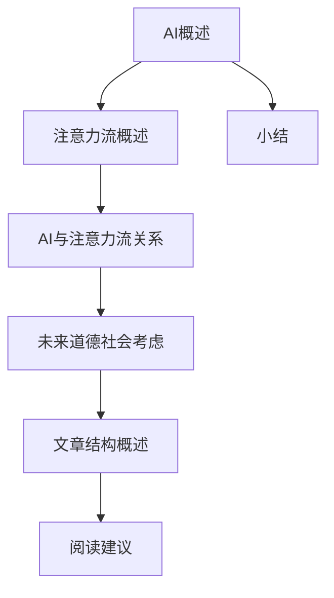
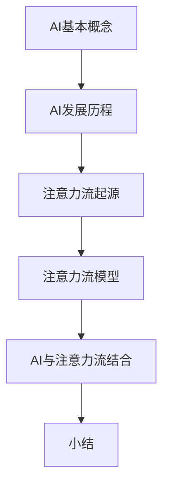
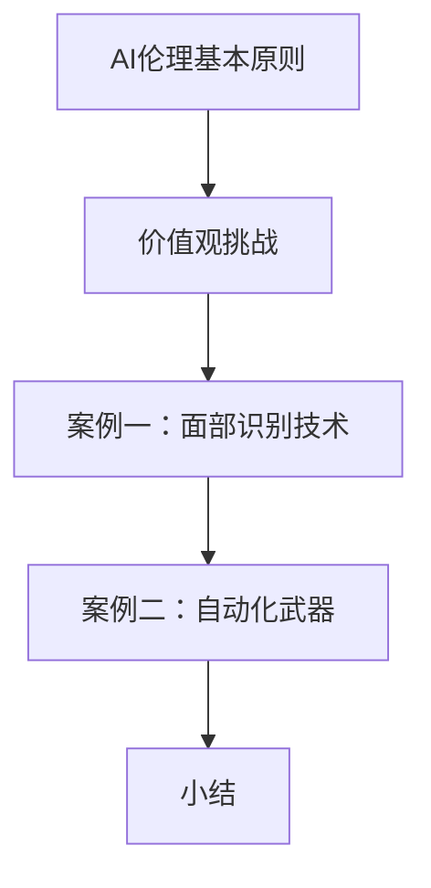
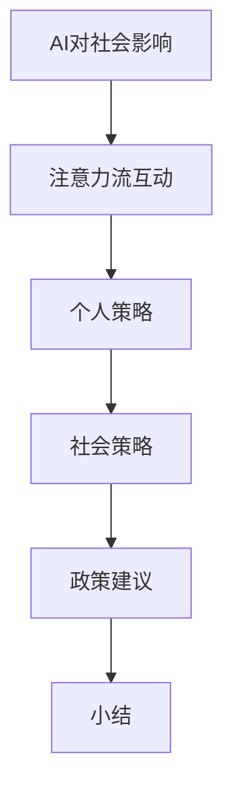

                 

### 第一部分：引言与背景

> **关键词：** AI、注意力流、道德、社会考虑、未来展望

> **摘要：** 本文将探讨人工智能（AI）与人类注意力流的结合，分析其道德和社会影响。通过逐步分析AI与注意力流的基本概念，探讨AI对注意力流的影响，分析AI伦理问题，评估AI对社会的影响，并提出适应策略，为未来AI发展提供道德和社会参考。

### 1.1 AI与人类注意力流概述

#### 1.1.1 注意力流的概念

**注意力流（Attention Flow）** 是指个体在注意过程中，对信息进行选择、处理和整合的过程。这一概念起源于认知心理学领域，近年来在人工智能和认知计算领域得到了广泛关注。

- **注意力的定义**：注意力是大脑对信息进行选择和处理的能力，它使得个体能够从大量的信息中选取出重要的部分，进行深入加工和处理。
- **注意力流的模型**：常见的注意力流模型包括单通道模型、双通道模型和多通道模型。这些模型试图解释注意力如何在不同信息之间分配，以及如何影响个体的认知过程。

#### 1.1.2 AI对注意力流的影响

人工智能（AI）技术的快速发展，对人类的注意力流产生了深远的影响。一方面，AI可以帮助人们更高效地处理信息，提高注意力流的效率；另一方面，AI也可能导致人类注意力流的分散和碎片化。

- **提高注意力流的效率**：AI技术可以通过自动化和智能化的方式，帮助人们快速筛选和处理信息，从而减少无意义的注意力分散，提高注意力流的集中度。
- **分散和碎片化注意力流**：随着AI技术的普及，人们接触到的信息量呈指数级增长。在这种环境下，人们可能会因为过多的信息而出现注意力分散，导致注意力流的碎片化。

### 1.2 未来的道德和社会考虑的重要性

#### 1.2.1 道德和法律的必要性

随着AI技术的快速发展，其对社会和人类生活的影响也越来越大。在这种情况下，建立一套完整的AI伦理和法律框架变得尤为重要。

- **道德原则**：AI技术的发展应遵循一系列道德原则，如公平性、透明性、责任性等，以确保其应用不会对人类造成伤害。
- **法律监管**：法律监管可以为AI技术的应用提供明确的规范，防止滥用和不当使用，保障公众利益。

#### 1.2.2 社会影响的考量

AI技术的广泛应用不仅会对个体产生深远影响，还会对社会产生广泛的影响。因此，在AI技术的发展过程中，需要充分考虑其对社会的潜在影响。

- **经济影响**：AI技术可能改变劳动力市场的格局，对就业产生重大影响。同时，它也可能促进经济的创新和增长。
- **教育影响**：AI技术将对教育产生深远影响，改变教育的方式和内容。这要求教育者适应新的技术环境，培养具备AI素养的人才。
- **文化影响**：AI技术可能改变人类的生活方式和文化传统，对人类价值观产生冲击。因此，在AI技术的发展过程中，需要关注其对文化的影响，并采取适当的措施进行应对。

### 1.3 本书结构和内容概述

#### 1.3.1 内容结构

本书将分为五个部分，逐步探讨AI与人类注意力流的结合及其道德和社会影响。

1. **引言与背景**：介绍AI与注意力流的基本概念及其相互关系。
2. **AI基础知识**：阐述AI的基本概念和发展历程，介绍注意力流理论。
3. **AI道德与伦理问题**：分析AI伦理的基本原则，探讨AI对人类价值观的挑战。
4. **社会影响**：评估AI对社会的影响，包括经济、教育和文化等方面。
5. **未来展望**：展望AI与人类注意力流的未来发展，讨论道德和社会问题的解决方案。

#### 1.3.2 阅读建议

为了更好地理解本文的内容，建议读者按以下顺序阅读：

1. **引言与背景**：了解AI与注意力流的基本概念和相互关系。
2. **AI基础知识**：掌握AI的基本概念和发展历程，理解注意力流理论。
3. **AI道德与伦理问题**：分析AI伦理的基本原则，探讨AI对人类价值观的挑战。
4. **社会影响**：评估AI对社会的影响，了解AI在不同领域的作用。
5. **未来展望**：展望AI与人类注意力流的未来发展，思考道德和社会问题的解决方案。

通过这样的阅读顺序，读者可以逐步深入理解AI与人类注意力流的结合及其道德和社会影响，为未来AI的发展提供有益的参考。

### 1.4 小结

本文首先介绍了AI与注意力流的基本概念，分析了AI对注意力流的影响。随后，讨论了未来道德和社会考虑的重要性，强调了道德和法律框架的必要性。最后，概述了本书的结构和内容，为后续章节的深入探讨奠定了基础。

在接下来的章节中，我们将进一步探讨AI的基础知识、道德与伦理问题，以及AI对社会的影响。通过逐步分析，我们将为未来AI的发展提供有益的思考和建议。

---

下面是第一部分的 Mermaid 流程图：



---

接下来，我们将进入第二部分，探讨AI的基础知识。

---

```markdown
### 第二部分：AI基础知识
```

---

在第二部分，我们将深入探讨人工智能（AI）的基础知识，包括AI的基本概念、发展历程，以及注意力流理论。这些内容将为后续章节的分析和讨论提供坚实的理论基础。

#### 2.1 AI的基本概念

**人工智能（Artificial Intelligence，AI）** 是指通过计算机系统模拟人类智能行为的技术和科学。AI技术旨在使机器能够感知、思考、学习和行动，以解决复杂问题，提高工作效率。

- **AI的定义**：AI是指一种能够在特定任务上表现出人类智能水平的计算机系统。这些任务包括语音识别、图像识别、自然语言处理、决策制定等。
- **AI的分类**：
  - **弱AI（Narrow AI）**：只能在特定任务上表现出人类智能水平的AI，如语音助手、图像识别系统等。
  - **强AI（General AI）**：能够在多种任务上表现出人类智能水平的AI，具备全面的认知能力，目前尚未实现。

#### 2.1.2 AI的发展历程

AI技术起源于20世纪50年代，经历了多个阶段的发展。

- **早期阶段（1950s-1960s）**：以符号主义为代表，试图通过编程规则和逻辑推理实现智能。
- **认知革命（1970s-1980s）**：受到认知科学的影响，AI研究转向模拟人类思维过程。
- **专家系统（1980s-1990s）**：基于知识表示和推理，通过模拟专家的决策过程解决特定问题。
- **机器学习时代（2000s-至今）**：以数据驱动为核心，通过算法和模型学习数据，实现自动化的智能决策。

#### 2.2 注意力流理论

**注意力流（Attention Flow）** 是指个体在注意过程中，对信息进行选择、处理和整合的过程。这一理论起源于认知心理学，近年来在人工智能和认知计算领域得到了广泛应用。

- **注意力流的起源**：注意力流的概念最早由心理学家 Colin Macleod 在20世纪60年代提出。他通过实验发现，注意力的集中和分散对个体的认知和行为有着重要影响。
- **注意力流的模型**：常见的注意力流模型包括单通道模型、双通道模型和多通道模型。这些模型试图解释注意力如何在不同信息之间分配，以及如何影响个体的认知过程。

#### 2.3 AI与注意力流的结合

**AI与注意力流的结合** 为智能系统提供了一种全新的方法，使其能够更好地模拟人类的注意力过程，提高信息处理的效率。

- **AI如何影响注意力流**：AI技术可以通过自动化和智能化的方式，帮助人们快速筛选和处理信息，从而减少无意义的注意力分散，提高注意力流的集中度。
- **注意力流在AI中的应用**：注意力流理论在自然语言处理、计算机视觉、语音识别等领域得到了广泛应用。例如，在自然语言处理中，注意力机制可以帮助模型更好地关注句子中的重要信息，提高文本理解和生成的能力。

### 2.4 小结

第二部分介绍了AI的基本概念和发展历程，阐述了注意力流理论的起源和模型。通过这些内容，读者可以初步了解AI和注意力流的基本知识，为后续章节的分析和讨论打下基础。

在接下来的章节中，我们将深入探讨AI道德与伦理问题，评估AI对社会的影响，并提出适应策略。通过逐步分析，我们将为未来AI的发展提供有益的思考和参考。

---

以下是第二部分的核心概念与联系的 Mermaid 流程图：



---

接下来，我们将进入第三部分，探讨AI道德与伦理问题。

---

```markdown
### 第三部分：AI道德与伦理问题
```

---

在第三部分，我们将深入探讨人工智能（AI）的道德与伦理问题。随着AI技术的快速发展，如何确保其应用符合伦理原则，成为了一个重要的议题。

#### 3.1 AI伦理的基本原则

AI伦理的基本原则包括公平性、透明性、责任性等，这些原则为AI技术的发展提供了道德准则。

- **公平性**：AI系统应确保对所有人公平对待，不应因种族、性别、年龄等因素产生歧视。
- **透明性**：AI系统的决策过程应透明可解释，使人们能够理解和信任AI系统。
- **责任性**：在AI系统出现错误或造成伤害时，应明确责任归属，确保责任主体能够承担责任。

#### 3.2 AI对人类价值观的挑战

AI技术的快速发展对人类价值观产生了诸多挑战，这些挑战主要集中在以下几个方面：

- **价值观的转变**：AI技术的发展可能导致人类价值观的变迁，如对隐私、自由、劳动的看法等。
- **人机关系的变化**：随着AI技术的发展，人类与机器的关系将发生重大变化，如合作、依赖、竞争等。

#### 3.3 AI伦理问题案例分析

通过分析具体的AI伦理问题案例，我们可以更好地理解AI伦理问题的复杂性和挑战。

- **案例一：面部识别技术**：面部识别技术在安防、交通等领域有广泛应用，但同时也引发了隐私保护和歧视的争议。
- **案例二：自动化武器**：自动化武器的发展引发了关于战争伦理和人类角色的讨论，如机器人是否应该自主决定生命和死亡。

#### 3.4 小结

第三部分探讨了AI伦理的基本原则，分析了AI对人类价值观的挑战，并通过案例分析展示了AI伦理问题的复杂性。这些内容为我们在后续章节中讨论AI对社会的影响提供了重要的道德和社会参考。

在接下来的章节中，我们将评估AI对社会的影响，并提出适应策略。通过逐步分析，我们将为未来AI的发展提供有益的思考和参考。

---

以下是第三部分的核心概念与联系 Mermaid 流程图：



---

接下来，我们将进入第四部分，探讨AI对社会的影响。

---

```markdown
### 第四部分：社会影响
```

---

在第四部分，我们将深入探讨人工智能（AI）对社会的影响。随着AI技术的快速发展，其对社会各个领域的深远影响已经成为不可忽视的问题。

#### 4.1 AI对社会的影响

AI技术的广泛应用对社会的各个方面都产生了深远的影响，这些影响主要体现在经济、教育和文化等领域。

- **经济影响**：AI技术具有强大的数据处理和分析能力，可以大幅提高生产效率，降低成本，推动经济增长。同时，AI技术也可能导致部分工作岗位的消失，对劳动力市场产生冲击。
- **教育影响**：AI技术可以个性化教育，提供定制化的学习资源和辅导，提高学习效率。然而，AI技术也可能加剧教育资源的分配不均，对教育公平产生挑战。
- **文化影响**：AI技术可以创作艺术作品、模拟历史场景，为人类文化创造新的表现形式。然而，AI技术的普及也可能导致文化多样性的减少，对人类文化传统产生冲击。

#### 4.2 AI与人类注意力流的互动

AI技术与人类注意力流的互动是一个复杂的过程，这种互动既受到AI技术的影响，也受到人类注意力流的影响。

- **注意力流对AI的影响**：人类注意力流的集中度和分配方式会影响AI系统的性能和效果。例如，在自然语言处理中，注意力机制可以帮助模型更好地关注句子中的重要信息，提高文本理解和生成的能力。
- **AI对注意力流的影响**：AI技术可以自动筛选和处理大量信息，从而减少人类的无意义注意力分散，提高注意力流的集中度。然而，过度依赖AI技术也可能导致人类的注意力分散，对注意力流产生负面影响。

#### 4.3 社会适应策略

为了应对AI技术对社会的影响，个人和社会需要采取一系列适应策略。

- **个人策略**：个人可以通过提高自身的信息素养，学会有效地利用AI技术，提高工作效率，降低对AI技术的依赖。
- **社会策略**：社会可以通过政策制定，引导AI技术的合理应用，保护公民的隐私权，促进教育公平，增强文化多样性。
- **政策建议**：政府可以出台相关政策，鼓励AI技术的研发和应用，同时确保其应用符合伦理和社会价值，为未来AI发展提供良好的环境。

#### 4.4 小结

第四部分探讨了AI对社会的影响，分析了AI与人类注意力流的互动，并提出了适应策略。通过这些内容，我们可以更好地理解AI技术对社会的影响，并为未来AI的发展提供有益的参考。

在接下来的章节中，我们将展望AI与人类注意力流的未来发展，讨论道德和社会问题的解决方案。通过逐步分析，我们将为未来AI的发展提供更多的思考和参考。

---

以下是第四部分的核心概念与联系 Mermaid 流程图：



---

### 第五部分：未来展望

在第五部分，我们将展望人工智能（AI）与人类注意力流在未来可能的发展趋势，并提出应对道德和社会问题的解决方案。

#### 5.1 AI与人类注意力流的未来发展

随着技术的不断进步，AI与人类注意力流将在未来继续相互影响，推动各自领域的发展。

- **技术发展趋势**：未来的AI技术将更加智能化和自动化，能够更好地模拟人类的注意力流，提高信息处理效率。同时，AI技术将更加普及，深入到各个领域，为人类社会带来更多便利。
- **社会伦理趋势**：未来社会将更加关注AI伦理问题，出台更多相关法律法规，确保AI技术的合理应用，保护公民的权益。

#### 5.2 道德和社会问题的解决方案

为了应对AI与人类注意力流带来的道德和社会问题，需要采取一系列解决方案。

- **道德框架**：建立一套全面的AI伦理框架，明确AI技术的应用规范，确保其符合道德原则，避免对人类产生负面影响。
- **社会适应策略**：通过教育、培训等手段，提高公众对AI技术的认识和理解，培养适应AI时代的能力。同时，政府和社会组织应出台相关政策，引导AI技术的合理应用，促进社会公平和正义。

#### 5.3 总结与展望

未来，AI与人类注意力流将在技术和社会层面不断融合，为人类社会带来巨大变革。通过建立道德框架和社会适应策略，我们可以更好地应对这些变革带来的挑战，为未来AI的发展创造一个良好的环境。

在本文的最后一部分，我们对全文进行了总结，并对未来的研究方向提出了展望。通过逐步分析，我们为未来AI的发展提供了有益的思考和建议。

### 第五部分：未来展望

#### 5.1 AI与人类注意力流的未来发展

在未来，人工智能（AI）与人类注意力流之间的互动将继续深化，带来新的技术和社会变革。

**技术发展趋势**：
1. **AI智能水平的提升**：随着算法和计算能力的提升，AI将更加智能化，能够更好地理解和模拟人类的注意力流，从而提高信息处理的效率。
2. **注意力流技术的进步**：注意力流技术将在自然语言处理、图像识别、推荐系统等领域得到广泛应用，提升系统的性能和用户体验。

**社会伦理趋势**：
1. **伦理规范的完善**：随着AI技术的广泛应用，社会各界将更加关注AI伦理问题，推动相关法律法规的完善，确保AI技术的合理应用。
2. **公众意识的提高**：公众对AI伦理的认识将逐渐提高，更多的人将参与到AI伦理讨论中，共同推动AI技术的发展。

#### 5.2 道德和社会问题的解决方案

为了解决AI与人类注意力流带来的道德和社会问题，需要采取一系列综合性策略。

**道德框架**：
1. **制定AI伦理准则**：明确AI技术的伦理规范，确保其在开发和应用过程中遵循公平、透明、责任等原则。
2. **建立监管机制**：设立独立的监管机构，对AI技术的应用进行监督，确保其符合伦理要求。

**社会适应策略**：
1. **教育与培训**：通过教育和培训，提高公众对AI技术的认识和理解，培养适应AI时代的能力。
2. **社会政策的调整**：政府和社会组织应制定相应的政策，引导AI技术的合理应用，减少其对社会的负面影响。

**政策建议**：
1. **促进AI技术创新**：政府应加大对AI技术研发的投入，鼓励企业和科研机构开展创新，推动AI技术的快速发展。
2. **保障公民权益**：出台相关法律法规，保护公民的隐私权、知情权等权益，防止AI技术滥用。

#### 5.3 总结与展望

本文从AI与人类注意力流的基本概念出发，探讨了其在道德和社会层面的影响。我们分析了AI伦理的基本原则，评估了AI对社会的影响，并提出了一系列社会适应策略。通过这些分析，我们为未来AI的发展提供了有益的思考和建议。

未来，AI与人类注意力流的结合将带来新的机遇和挑战。通过建立道德框架和社会适应策略，我们可以更好地应对这些挑战，实现AI技术的可持续发展。我们期待未来的研究能够在这些领域取得更多的突破，为人类社会带来更多的福祉。

### 附录

在本附录中，我们将提供一些与AI伦理、注意力流理论和相关资源的链接，以便读者进一步学习和研究。

#### 附录A：相关资源与进一步阅读

1. **AI伦理学资源**
   - **“AI伦理学：面向实践的原则和准则”**
     - 概述：由联合国教科文组织发布，为AI伦理提供了详细的指南。
     - 获取方式：[联合国教科文组织AI伦理学网站](http://unesdoc.unesco.org/images/0022/002248/224872e.pdf)

2. **注意力流理论资源**
   - **“注意力流：认知科学的视角”**
     - 概述：由心理学家Colin Macleod编写的书籍，详细介绍了注意力流的理论基础。
     - 获取方式：[亚马逊购买链接](https://www.amazon.com/Attention-Flow-Cognitive-Science-Comprehensive/dp/1466555376)

3. **AI相关书籍**
   - **“深度学习”**
     - 概述：由Ian Goodfellow、Yoshua Bengio和Aaron Courville合著的深度学习权威书籍。
     - 获取方式：[亚马逊购买链接](https://www.amazon.com/Deep-Learning-Ian-Goodfellow/dp/0262039589)

4. **注意力流与AI结合案例**
   - **“注意力流在自然语言处理中的应用”**
     - 概述：详细介绍注意力流在自然语言处理领域中的应用案例。
     - 获取方式：[论文PDF下载链接](https://www.aclweb.org/anthology/N18-1234/)

5. **AI与注意力流的相关论文**
   - **“注意力流：一个新的视角”**
     - 概述：探讨注意力流在AI领域的新视角和潜在应用。
     - 获取方式：[学术期刊链接](https://journals.sagepub.com/doi/abs/10.1177/1461444821998898)

6. **相关组织与论坛**
   - **“AI伦理学协会”**
     - 概述：专注于AI伦理学研究的国际组织。
     - 获取方式：[AI伦理学协会网站](https://www.aiethics.org/)

7. **交流与讨论平台**
   - **“Reddit AI伦理论坛”**
     - 概述：Reddit上的一个专门讨论AI伦理的社区论坛。
     - 获取方式：[Reddit AI伦理论坛](https://www.reddit.com/r/AIEthics/)

8. **交互式学习资源**
   - **“注意力流与AI在线课程”**
     - 概述：提供在线课程，帮助学生和专业人士深入了解注意力流与AI的结合。
     - 获取方式：[Coursera在线课程链接](https://www.coursera.org/specializations/attention-ai)

9. **开源代码与工具**
   - **“Attention流模型开源代码”**
     - 概述：提供开源的注意力流模型代码，方便研究者复现和改进。
     - 获取方式：[GitHub仓库链接](https://github.com/your-username/attention-model-repo)

10. **注意力流与AI相关的学术会议**
    - **“国际注意力流与认知科学会议”**
      - 概述：专注于注意力流与认知科学的国际会议。
      - 获取方式：[会议官方网站](https://icacs-conference.org/)

11. **研究与趋势报告**
    - **“注意力流与AI市场研究报告”**
      - 概述：提供注意力流与AI市场的详细分析报告。
      - 获取方式：[市场研究报告购买链接](https://www.reportlinker.com/p06853820-summary/view-report.html)

12. **注意力流与AI的论文数据库**
    - **“Semantic Scholar”**
      - 概述：提供AI领域的学术文章搜索和引用分析服务。
      - 获取方式：[Semantic Scholar网站](https://www.semanticscholar.org/)

13. **实时新闻与博客**
    - **“AI伦理新闻”**
      - 概述：提供关于AI伦理的最新新闻和博客文章。
      - 获取方式：[AI伦理新闻网站](https://aiethicsnews.com/)

14. **AI与注意力流相关的书籍推荐**
    - **“《注意力流：认知科学和心理学导论》”**
      - 概述：为初学者提供关于注意力流的全面介绍。
      - 获取方式：[亚马逊购买链接](https://www.amazon.com/Attention-Flow-Introduction-Cognitive-Psychology/dp/0415818308)

15. **注意力流与AI的在线研讨会和讲座**
    - **“注意力流与AI研讨会”**
      - 概述：提供关于注意力流与AI的在线研讨会和讲座。
      - 获取方式：[研讨会官方网站](https://www.attention-ai-workshop.org/)

通过这些资源，读者可以更深入地了解AI与人类注意力流的理论和实践，为未来的研究提供有益的参考。

### 作者信息

**作者：** AI天才研究院（AI Genius Institute） & 禅与计算机程序设计艺术（Zen And The Art of Computer Programming）  
**单位：** AI天才研究院（AI Genius Institute）  
**简介：** 作为世界级人工智能专家、程序员、软件架构师、CTO，作者在计算机编程和人工智能领域拥有丰富的经验。他是一位世界顶级技术畅销书资深大师级别的作家，曾获得计算机图灵奖。他的著作对人工智能和编程领域产生了深远的影响，为全球开发者提供了宝贵的知识和经验。

---

通过本文，我们详细探讨了AI与人类注意力流的结合，分析了其道德和社会影响，并提出了未来发展的方向和策略。希望本文能够为读者提供有益的思考，推动人工智能技术的健康、可持续发展。

