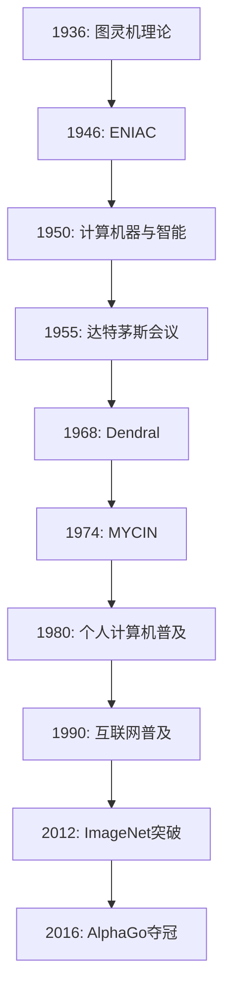

                 

# AI与计算机历史的对比分析

## 摘要

本文旨在对比分析人工智能（AI）与计算机历史的发展，探讨两者在技术演进、核心概念、算法原理等方面的异同。通过对计算机科学基础的回顾，我们了解了计算机如何从早期的机械装置发展到现代的通用计算机。随后，本文将深入探讨人工智能的历史，包括人工智能的概念、早期发展以及数据驱动的人工智能时代。在此基础上，文章将详细分析计算机历史中的关键算法，如图灵机、计算机语言的发展，并比较AI技术的原理，如机器学习、深度学习等。随后，我们将回顾人工智能历史上的关键事件，探讨AI与计算机历史的联系与区别。最后，文章将展望AI技术的未来发展趋势，讨论计算机技术的进步以及计算机与AI的融合，并通过案例研究进一步展示AI与计算机历史的对比分析。

## 第1章 AI与计算机历史概述

### 1.1 计算机发展简史

计算机技术的发展可以追溯到17世纪，当时数学家莱布尼茨设计了第一个机械计算器。然而，真正的计算机革命始于20世纪中叶，当时电子计算机的出现彻底改变了数据处理的方式。下面，我们将简要回顾计算机的发展历程，从早期计算机到现代计算机的演变。

#### 1.1.1 早期计算机

早期计算机主要是由机械装置组成的，如帕斯卡的计算器和莱布尼茨的计算器。这些计算器能够进行简单的数学运算，但功能有限。19世纪末，德国数学家康特利用电气开关发明了第一台电动计算机，名为“通用计算机”。这台计算机虽然具有现代计算机的一些基本特征，但由于技术限制，其应用范围有限。

#### 1.1.2 计算机科学基础

20世纪中叶，随着电子技术的发展，计算机科学开始形成。图灵机的概念由艾伦·图灵在1936年提出，为现代计算机的理论基础。图灵机是一种抽象的计算模型，由一个无限长的纸带、一个读写头和一个状态寄存器组成。读写头可以在纸带上读取或写入符号，并根据当前状态和符号执行相应的操作。图灵机的原理为计算机科学奠定了基础，包括编译原理、算法设计和形式语言理论。

### 1.2 AI的历史

人工智能（AI）是计算机科学的一个分支，旨在创建能够模拟、延伸和扩展人类智能的计算机系统。人工智能的发展历程可以分为多个阶段，从早期的人工智能概念到现代的数据驱动人工智能。

#### 1.2.1 人工智能的概念

人工智能的概念最早可以追溯到20世纪50年代，当时计算机科学家约翰·冯·诺依曼提出了“计算思维”的概念。人工智能的定义是指使计算机具有类似人类智能的能力，包括学习、推理、感知、理解和决策。

#### 1.2.2 早期AI的发展

在20世纪50年代和60年代，人工智能迎来了第一个高潮。当时，研究者们开发了第一个专家系统，如Dendral和MYCIN。这些系统能够模拟专家的知识和推理能力，解决医学诊断、化学分析等问题。然而，早期人工智能的发展受到了计算能力、数据和算法的限制，导致在20世纪70年代遭遇了第一次寒冬。

#### 1.2.3 数据驱动的人工智能

随着计算能力的提升和大数据技术的发展，人工智能在21世纪初迎来了新的发展。数据驱动的人工智能方法，如机器学习和深度学习，成为人工智能的主要研究方向。这些方法通过从大量数据中学习模式和规律，实现了计算机在不同领域的应用，如图像识别、自然语言处理、自动驾驶等。

## 第2章 计算机历史中的关键算法

计算机历史中，有许多关键算法对计算机科学的演进起到了重要作用。这些算法不仅推动了计算机技术的发展，也为现代计算机的应用提供了理论基础。下面，我们将探讨两个关键算法：图灵机和计算机语言的发展。

### 2.1 图灵机的概念

图灵机是计算机科学的基石之一，由艾伦·图灵在1936年提出。图灵机是一种抽象的计算模型，用于描述计算机如何处理数据和执行算法。图灵机由以下几个部分组成：

1. **无限长的纸带**：纸带被划分为无限多个单元格，每个单元格可以包含一个符号。
2. **读写头**：读写头可以在纸带上左右移动，并读取或写入符号。
3. **状态寄存器**：状态寄存器记录图灵机的当前状态。

图灵机的工作原理如下：

1. **初始化**：图灵机开始时处于一个特定的初始状态，读写头位于纸带上的某个位置。
2. **读取和写入**：读写头读取当前单元格上的符号，并根据当前状态和符号执行操作，如移动读写头、写入新符号或改变状态。
3. **执行**：图灵机重复读取和写入操作，直到达到一个终止状态。

图灵机的原理为计算机科学奠定了基础，它展示了计算过程的抽象模型，并成为现代计算机的理论基础。图灵机的概念不仅用于理论研究，还广泛应用于编译原理、算法设计和形式语言理论。

#### 2.1.1 图灵机的原理

图灵机的操作可以用以下伪代码表示：

```
while not termination_state:
    read(symbol)
    if state == A and symbol == 0:
        write(1)
        state = B
        move_right()
    elif state == B and symbol == 1:
        write(0)
        state = A
        move_left()
```

在这个伪代码中，`read()`函数读取当前单元格上的符号，`write()`函数写入新符号，`move_right()`和`move_left()`函数分别移动读写头向右和向左。状态寄存器`state`记录图灵机的当前状态，`termination_state`表示终止状态。

#### 2.1.2 图灵机的应用

图灵机的应用范围广泛，包括以下几个方面：

1. **计算复杂性理论**：图灵机用于研究计算复杂性和计算理论，如P vs NP问题。
2. **编译原理**：图灵机的原理为编译器的设计提供了理论基础，编译器将高级语言代码转换为机器语言。
3. **形式语言理论**：图灵机用于研究形式语言和语法，如文法分析和语法分析。

### 2.2 计算机语言的发展

计算机语言是计算机与人类交互的桥梁，它使人们能够编写程序来控制计算机。计算机语言的发展可以分为两个阶段：机器语言和高级语言。

#### 2.2.1 机器语言

机器语言是计算机能够直接理解和执行的语言，它由一系列的二进制指令组成。每个指令对应计算机硬件中的一个操作，如加法、减法、跳转等。机器语言的编写难度大，不易读、不易写，并且依赖于特定的计算机硬件。因此，机器语言的编程效率低，容易出错。

#### 2.2.2 高级语言

高级语言提供了更易于理解和编写的语法，如C、Java、Python等。高级语言通过编译器或解释器转换成机器语言，从而能够在计算机上运行。高级语言提高了编程效率，降低了编程错误，并促进了软件工程的发展。高级语言的语法通常更接近人类的自然语言，使编程变得更加直观和易用。

#### 2.2.3 高级语言的分类

高级语言可以分为过程式语言、函数式语言和面向对象语言：

1. **过程式语言**：过程式语言以过程为中心，如C、Java等。过程式语言强调程序的模块化和代码的重用性。
2. **函数式语言**：函数式语言以函数为中心，如Haskell、Lisp等。函数式语言强调函数的引用透明性和表达式的值。
3. **面向对象语言**：面向对象语言以对象为中心，如Java、Python等。面向对象语言强调封装、继承和多态。

## 第3章 AI技术原理

人工智能（AI）是计算机科学的一个重要分支，旨在创建能够模拟、延伸和扩展人类智能的计算机系统。AI技术的发展经历了多个阶段，从早期的符号推理到现代的数据驱动方法，如机器学习和深度学习。下面，我们将深入探讨AI技术的原理，包括机器学习和深度学习。

### 3.1 机器学习的基本概念

机器学习是一种使计算机能够从数据中学习模式、做出预测或决策的技术。机器学习分为监督学习和无监督学习两种主要类型。

#### 3.1.1 监督学习

监督学习是一种机器学习方法，它通过已知的输入和输出数据来训练模型。监督学习的目标是找到一个函数，将输入映射到输出。监督学习可以分为分类和回归两种问题：

1. **分类**：分类问题旨在将输入数据分为不同的类别。常见的分类算法包括逻辑回归、决策树、随机森林和支撑向量机等。
2. **回归**：回归问题旨在预测输入数据的连续值。常见的回归算法包括线性回归、决策树回归、随机森林回归和神经网络回归等。

监督学习的训练过程通常包括以下步骤：

1. **数据收集**：收集大量的输入和输出数据。
2. **数据预处理**：对数据进行清洗、归一化和特征提取等预处理步骤。
3. **模型训练**：使用训练数据集训练模型，通过最小化损失函数调整模型参数。
4. **模型评估**：使用验证数据集评估模型的性能，如准确率、召回率、F1分数等。
5. **模型部署**：将训练好的模型部署到实际应用中，进行预测或决策。

#### 3.1.2 无监督学习

无监督学习是一种机器学习方法，它不依赖于已知的输入和输出数据。无监督学习的目标是发现数据中的结构和模式。无监督学习可以分为聚类和降维两种问题：

1. **聚类**：聚类问题旨在将相似的数据点分为不同的组。常见的聚类算法包括K-means、层次聚类和DBSCAN等。
2. **降维**：降维问题旨在减少数据的高维特征，同时保留数据的本质特征。常见的降维算法包括主成分分析（PCA）、线性判别分析（LDA）和t-SNE等。

无监督学习的训练过程通常包括以下步骤：

1. **数据收集**：收集大量的输入数据。
2. **数据预处理**：对数据进行清洗、归一化和特征提取等预处理步骤。
3. **模型训练**：使用训练数据集训练模型，通过最小化损失函数调整模型参数。
4. **模型评估**：使用验证数据集评估模型的性能，如聚类系数、重建误差等。
5. **模型部署**：将训练好的模型部署到实际应用中，进行数据分析和可视化。

### 3.2 深度学习

深度学习是一种基于神经网络的机器学习方法，它通过多层神经网络来学习数据的特征和模式。深度学习在图像识别、自然语言处理、语音识别等领域取得了显著成果。

#### 3.2.1 神经网络

神经网络是一种模仿生物神经系统的计算模型，由多个神经元（或节点）组成。每个神经元都与相邻的神经元相连，并通过权重传递信息。神经网络通过传递和加权输入信息来学习数据。

神经网络可以分为以下几种类型：

1. **前馈神经网络**：前馈神经网络是一种简单的神经网络，信息从输入层传递到输出层，不进行反向传播。
2. **卷积神经网络（CNN）**：卷积神经网络是一种专门用于图像处理的神经网络，通过卷积操作提取图像中的特征。
3. **循环神经网络（RNN）**：循环神经网络是一种用于序列数据的神经网络，通过在时间步之间传递信息来学习序列模式。
4. **生成对抗网络（GAN）**：生成对抗网络是一种由生成器和判别器组成的神经网络，生成器生成数据，判别器判断数据是否真实。

#### 3.2.2 卷积神经网络

卷积神经网络是一种特殊的神经网络，主要用于图像处理任务。卷积神经网络通过卷积操作提取图像中的特征，然后通过全连接层进行分类或回归。

卷积神经网络的基本结构包括以下几个部分：

1. **卷积层**：卷积层通过卷积操作提取图像的特征。卷积操作将一个小的窗口（过滤器）在图像上滑动，并对窗口内的像素进行加权求和。通过多个卷积层，神经网络可以提取图像的更高层次特征。
2. **激活函数**：激活函数用于引入非线性因素，常见的激活函数包括ReLU（修正线性单元）、Sigmoid和Tanh等。
3. **池化层**：池化层用于降低特征图的维度，减少计算量和参数数量。常见的池化操作包括最大池化和平均池化。
4. **全连接层**：全连接层将卷积层的输出映射到输出层，进行分类或回归。

卷积神经网络的工作原理如下：

1. **输入层**：输入层接收图像数据。
2. **卷积层**：卷积层通过卷积操作提取图像的特征。
3. **激活函数**：激活函数引入非线性因素。
4. **池化层**：池化层降低特征图的维度。
5. **全连接层**：全连接层将卷积层的输出映射到输出层，进行分类或回归。
6. **输出层**：输出层输出分类结果或回归值。

## 第4章 AI与计算机历史中的关键事件

人工智能（AI）与计算机历史中发生了许多关键事件，这些事件不仅推动了技术的进步，也改变了我们的生活方式。本节将回顾AI和计算机历史上的关键事件，探讨其对技术和社会的影响。

### 4.1 人工智能1.0时代

人工智能1.0时代始于20世纪50年代，当时人工智能的概念被提出，研究者们开始开发专家系统。专家系统是一种模拟人类专家决策能力的计算机程序，通过知识库和推理机来解决问题。

#### 4.1.1 专家系统的兴起

专家系统的兴起标志着人工智能1.0时代的开始。第一个专家系统Dendral于1968年诞生，用于化学分析。Dendral通过推理和演绎能力，帮助科学家解决复杂的化学问题。随后，MYCIN系统于1974年问世，用于医学诊断。MYCIN系统通过推理和规则匹配，帮助医生诊断感染疾病。

专家系统的成功引发了人们对人工智能的极大兴趣，推动了人工智能研究的发展。然而，专家系统的局限性也逐渐显现。专家系统依赖于专家的知识和经验，难以扩展和适应新的问题。此外，专家系统的性能受到数据量的限制，难以处理大量复杂的数据。

#### 4.1.2 人工智能的第一次寒冬

20世纪80年代，人工智能面临重大挑战，发展速度放缓。专家系统的局限性、计算能力的限制和数据的不足成为人工智能发展的主要瓶颈。许多投资者和研究者对人工智能失去了信心，导致人工智能领域的资金大幅减少。这一时期被称为人工智能的第一次寒冬。

人工智能的第一次寒冬对人工智能研究产生了深远影响。许多研究者开始寻找新的方法和技术，以突破专家系统的局限性。同时，计算机技术的发展，特别是硬件性能的提升，为人工智能的复苏奠定了基础。

### 4.2 人工智能2.0时代

人工智能2.0时代始于21世纪初，随着大数据和计算能力的提升，人工智能迎来了新的发展。人工智能2.0时代强调数据的重要性，数据驱动的人工智能方法成为主流。

#### 4.2.1 数据驱动的人工智能

数据驱动的人工智能方法通过从大量数据中学习模式和规律，实现了计算机在不同领域的应用。机器学习和深度学习成为人工智能2.0时代的关键技术。机器学习通过训练模型，使计算机能够从数据中学习，如图像识别、自然语言处理等。深度学习通过多层神经网络，使计算机能够自动提取图像和语音的特征，如图像分类、语音识别等。

数据驱动的人工智能方法在图像识别、自然语言处理、自动驾驶等领域取得了显著成果。深度学习模型在ImageNet图像识别挑战中取得了突破性进展，使计算机在图像识别方面的性能接近人类水平。自动驾驶技术通过深度学习模型，使计算机能够理解和处理道路信息，实现了自动驾驶汽车。

#### 4.2.2 人工智能的重新崛起

21世纪初，人工智能技术取得了显著进展，吸引了大量投资。深度学习、强化学习等关键技术的突破为人工智能带来了新的希望。人工智能在各个领域得到了广泛应用，推动了计算机历史的进一步发展。

人工智能的重新崛起不仅改变了计算机技术，也对其他领域产生了深远影响。人工智能在医疗、金融、教育、制造业等领域得到了广泛应用，提高了效率和准确性。人工智能还促进了新业务模式的产生，如智能家居、在线教育、智能医疗等。

### 4.3 计算机历史上的关键事件

计算机历史中发生了许多关键事件，这些事件不仅推动了计算机技术的发展，也改变了我们的生活方式。以下是一些计算机历史上的关键事件：

1. **电子计算机的发明**：1946年，第一台电子计算机ENIAC诞生，标志着计算机时代的开始。ENIAC的诞生使人类能够处理大量复杂的计算问题，推动了科学和工业的发展。
2. **操作系统的发展**：20世纪60年代，操作系统的概念被提出，操作系统成为计算机系统的核心。操作系统的出现使计算机的使用更加便捷，提高了计算效率。
3. **个人计算机的普及**：20世纪80年代，个人计算机开始普及，计算机从大型计算机和服务器转向个人桌面。个人计算机的普及使计算机技术进入了千家万户，改变了人们的工作和生活方式。
4. **互联网的发展**：20世纪90年代，互联网的发展使计算机连接成为一个全球网络。互联网的出现使人们能够实时交流和获取信息，改变了人们的生活和工作方式。
5. **移动计算**：21世纪初，移动计算技术（如智能手机和平板电脑）的发展，使计算机技术进入了一个新的时代。移动计算技术改变了人们的出行和生活方式，使人们能够随时随地进行计算和通信。

这些关键事件不仅推动了计算机技术的发展，也对人工智能的进步产生了深远影响。计算机技术的发展为人工智能提供了强大的计算能力，使人工智能能够在各个领域实现应用。人工智能的发展又反过来推动了计算机技术的进一步进步，形成了相互促进、共同发展的关系。

## 第5章 AI与计算机历史的联系与对比

人工智能（AI）与计算机历史在技术发展、核心概念和算法原理等方面有许多联系和区别。本节将探讨AI与计算机历史的联系与对比，分析两者在技术演进、应用场景和社会影响方面的异同。

### 5.1 AI与计算机历史的共同点

AI与计算机历史在以下几个方面具有共同点：

#### 5.1.1 技术发展的周期性

AI与计算机历史都经历了多个发展阶段，呈现出周期性的趋势。从早期的机械计算机到现代的电子计算机，从符号推理到数据驱动的人工智能，每个阶段都有新的突破和挑战，推动了技术的进步。

#### 5.1.2 技术的迭代与演进

AI与计算机历史都经历了不断的迭代与演进。计算机技术从简单到复杂，从单一到综合，经历了多个层次的演进。同样，人工智能技术也不断进化，从简单的规则系统到复杂的神经网络，从符号推理到深度学习，技术的发展推动了AI在各个领域的应用。

#### 5.1.3 技术的相互促进

AI与计算机历史相互促进，共同推动了技术的发展。计算机技术的发展为人工智能提供了强大的计算能力，使AI能够在图像识别、自然语言处理、语音识别等领域实现应用。而人工智能的发展又反过来推动了计算机技术的进一步进步，如量子计算、边缘计算等新技术的提出。

### 5.2 AI与计算机历史的区别

尽管AI与计算机历史有许多共同点，但在某些方面也存在区别：

#### 5.2.1 计算机历史的阶段性

计算机历史可以分为多个阶段，如硬件、操作系统、编程语言等。每个阶段都有特定的技术特点和应用场景。而人工智能的发展则更加连续，不仅涉及到计算机技术，还涉及到其他领域，如心理学、神经科学等。

#### 5.2.2 AI发展的连续性

人工智能的发展具有连续性，从早期的符号推理到现代的数据驱动方法，人工智能技术在不断演进。而计算机历史的发展则相对离散，每个阶段的技术特点和应用场景都有明显的区别。

#### 5.2.3 应用场景的差异

计算机历史中的技术主要应用于科学计算、数据处理、自动化控制等领域。而人工智能则更加广泛，应用于图像识别、自然语言处理、自动驾驶、医疗诊断等各个领域。人工智能的应用场景不断扩展，推动了技术的进步。

### 5.3 AI与计算机历史的社会影响

AI与计算机历史在技术进步的同时，也对社会产生了深远的影响：

#### 5.3.1 AI的社会影响

人工智能的发展改变了人类的生活方式，如智能家居、在线教育、智能医疗等。人工智能还推动了新业务模式的产生，如智能客服、智能推荐等。然而，人工智能也带来了隐私保护、伦理道德等问题，需要我们谨慎应对。

#### 5.3.2 计算机历史的社会影响

计算机技术的发展提高了社会效率，改变了人类的工作和生活方式。计算机在科学计算、数据处理、自动化控制等领域发挥了重要作用，推动了社会进步。然而，计算机技术也带来了信息泄露、网络安全等问题，需要我们加强管理和保护。

### 5.4 结论

AI与计算机历史在技术发展、核心概念、算法原理等方面有许多联系和区别。两者相互促进，共同推动了技术的进步。在未来的发展中，我们可以预见AI与计算机技术将继续融合，推动社会的发展和进步。

## 第6章 AI技术的未来发展趋势

随着人工智能（AI）技术的不断进步，其未来发展趋势令人期待。本节将探讨AI技术的未来发展趋势，包括人工智能的下一个十年、未来挑战以及计算机技术的进步。

### 6.1 人工智能的下一个十年

在未来的十年中，人工智能技术将继续快速发展，推动更多领域的创新。以下是几个关键趋势：

#### 6.1.1 深度学习与强化学习的发展

深度学习是当前人工智能领域的重要技术，未来将继续发展。深度学习模型将更加复杂和高效，能够在更短时间内处理大量数据。同时，强化学习作为一种结合了深度学习的算法，将在游戏、机器人控制和自动驾驶等领域取得突破。

#### 6.1.2 生成对抗网络（GAN）的进步

生成对抗网络（GAN）是一种能够生成逼真图像、音频和文本的深度学习模型。未来，GAN将应用于更多的场景，如虚拟现实、艺术创作和医学影像重建等。

#### 6.1.3 人工智能伦理与法规的完善

随着人工智能技术的发展，伦理和法规问题日益突出。未来，人工智能伦理和法规将得到进一步完善，以确保人工智能技术的安全和可持续发展。

### 6.2 人工智能的未来挑战

尽管人工智能技术有巨大的潜力，但仍面临诸多挑战：

#### 6.2.1 隐私保护

人工智能技术依赖于大量数据，而数据隐私问题备受关注。未来，如何在保护用户隐私的前提下，有效利用数据资源，将成为一个重要挑战。

#### 6.2.2 伦理道德问题

人工智能的决策过程可能包含偏见和不公平性，如何确保人工智能系统的公平、透明和可解释性，是一个亟待解决的问题。

#### 6.2.3 安全问题

人工智能系统可能成为网络攻击的目标，确保人工智能系统的安全性和可靠性，防止恶意使用，是未来需要关注的问题。

### 6.3 计算机技术的进步

计算机技术的发展对人工智能有着重要影响。以下是几个关键趋势：

#### 6.3.1 量子计算

量子计算是一种基于量子力学原理的计算模型，具有巨大的计算潜力。未来，量子计算将在密码学、优化问题和模拟复杂系统等领域发挥重要作用。

#### 6.3.2 边缘计算

边缘计算将计算能力从中心数据中心转移到网络边缘，使数据处理更加高效、实时。未来，边缘计算将在物联网、自动驾驶和智能城市等领域得到广泛应用。

#### 6.3.3 软硬件协同

未来，计算机硬件和软件将更加紧密地协同工作，提高计算性能和能效。例如，专用集成电路（ASIC）和图形处理单元（GPU）将用于加速深度学习模型的训练和推理。

### 6.4 结论

人工智能的未来发展趋势令人期待，但同时也面临诸多挑战。在未来的发展中，我们需要不断探索技术创新，同时关注伦理和法规问题，确保人工智能技术的安全和可持续发展。

## 第7章 案例研究：AI与计算机历史的对比分析

在本章中，我们将通过两个具体的案例研究来探讨AI与计算机历史的对比分析。这两个案例分别是深度学习与计算机图形学的对比以及人工智能与数据库技术的对比。

### 7.1 案例一：深度学习与计算机图形学的对比

#### 7.1.1 深度学习的兴起

深度学习是近年来人工智能领域的重要突破，尤其在图像识别和语音识别方面取得了显著的成果。深度学习通过多层神经网络，能够自动提取图像和语音的特征，使得计算机在这些领域取得了接近人类的性能。例如，在ImageNet图像识别挑战中，深度学习模型在2012年首次达到了超过人类水平的准确率。

#### 7.1.2 计算机图形学的演变

计算机图形学是计算机科学的一个重要分支，旨在生成和处理图像。从早期的二维图像到现代的三维图形，计算机图形学经历了巨大的演变。早期的计算机图形学主要依赖于简单的几何图形和光线跟踪技术，而现代计算机图形学则利用复杂的算法和渲染技术，生成高质量的图像和动画。

#### 7.1.3 对比分析

深度学习与计算机图形学在技术原理和应用场景上有显著的差异。深度学习主要通过神经网络自动提取特征，而计算机图形学则依赖于几何学和光线跟踪等技术。深度学习在图像识别和语音识别等领域取得了突破，而计算机图形学则广泛应用于游戏、电影制作和虚拟现实等领域。

尽管深度学习和计算机图形学在技术原理上有差异，但两者在某些方面也存在联系。例如，深度学习模型可以用于计算机图形学中的图像生成和风格迁移，而计算机图形学中的几何学和光线跟踪技术也可以用于深度学习的渲染和可视化。

### 7.2 案例二：人工智能与数据库技术的对比

#### 7.2.1 人工智能的数据库需求

人工智能技术的发展对数据库技术提出了新的需求。人工智能系统需要处理大量结构化和非结构化数据，进行数据存储、数据检索和数据挖掘。因此，数据库技术必须具备高效的数据处理能力和强大的数据存储能力，以满足人工智能的需求。

#### 7.2.2 数据库技术的支持

为了满足人工智能的需求，数据库技术也进行了相应的改进。例如，分布式数据库技术能够处理大规模数据，提高数据存储和检索的效率。此外，数据库技术还引入了人工智能算法，如机器学习和深度学习，用于数据挖掘和预测分析。

#### 7.2.3 对比分析

人工智能与数据库技术在技术原理和应用场景上有显著的差异。数据库技术主要关注数据的存储、检索和管理，而人工智能则关注数据的分析和预测。数据库技术侧重于结构化数据的处理，而人工智能则涉及结构化和非结构化数据。

尽管人工智能和数据库技术在技术原理和应用场景上有差异，但两者在某些方面也存在联系。例如，数据库技术可以用于存储和管理人工智能系统的训练数据和预测结果，而人工智能算法可以用于优化数据库查询和索引。

### 7.3 结论

通过这两个案例研究，我们可以看出AI与计算机历史在技术原理和应用场景上的异同。尽管深度学习与计算机图形学、人工智能与数据库技术之间存在差异，但两者在某些方面也存在联系。这些联系不仅推动了技术的进步，也为未来AI与计算机技术的融合提供了可能性。

## 附录

### 附录A：AI与计算机历史相关的参考文献

1. Turing, A.M. (1950). "Computing Machinery and Intelligence". Mind.
2. McCarthy, J., Minsky, M., Rochester, N., & Shannon, C.E. (1955). "A Proposal for the Dartmouth Summer Research Project on Artificial Intelligence". IBM Journal of Research and Development.
3. Hamilton, J.H. (2007). "The Invention of the Computer: The First Century". McGraw-Hill.
4. Russell, S., & Norvig, P. (2010). "Artificial Intelligence: A Modern Approach". Prentice Hall.
5. Goodfellow, I., Bengio, Y., & Courville, A. (2016). "Deep Learning". MIT Press.

### 附录B：AI与计算机历史的关键事件时间线

- 1936年：艾伦·图灵提出图灵机理论。
- 1946年：第一台电子计算机ENIAC诞生。
- 1950年：艾伦·图灵发表《计算机器与智能》。
- 1955年：达特茅斯会议标志着人工智能领域的诞生。
- 1968年：Dendral系统成为第一个专家系统。
- 1974年：MYCIN系统用于医学诊断。
- 1980年：个人计算机开始普及。
- 1990年：互联网开始普及。
- 2012年：深度学习模型在ImageNet图像识别挑战中取得突破。
- 2016年：谷歌AlphaGo击败围棋世界冠军。

### 附录C：AI与计算机历史相关的Mermaid流程图

以下是一个简单的Mermaid流程图，展示了AI与计算机历史的一些关键事件：



通过这个流程图，我们可以清晰地看到AI与计算机历史中的重要事件及其相互关系。

