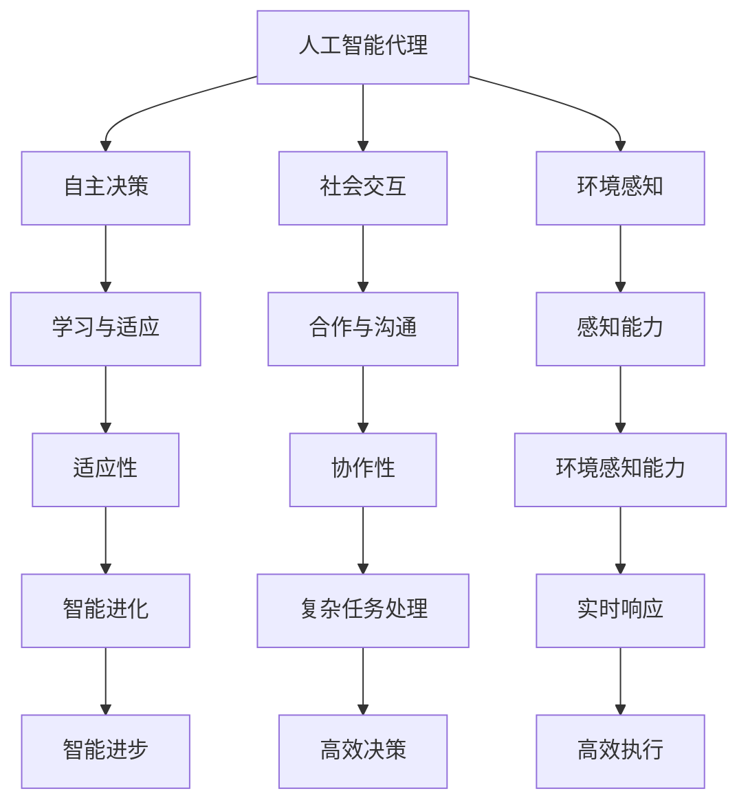
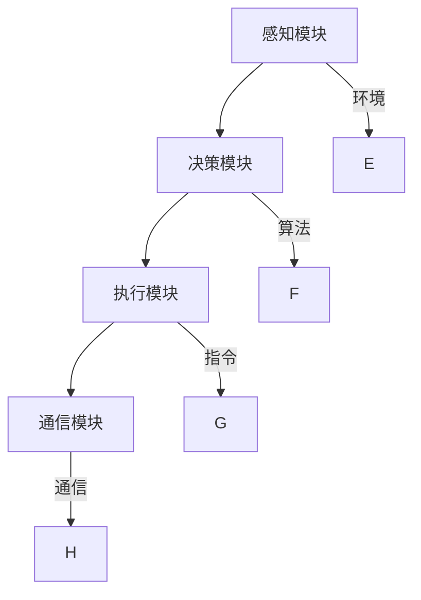

                 

# 《AI人工智能 Agent：制造业中智能体的应用》

## 关键词

- 人工智能（AI）
- 智能体（Agent）
- 制造业
- 生产线管理
- 物流管理
- 人力资源管理
- 人工智能技术
- 通信技术
- 安全与隐私保护

## 摘要

本文旨在探讨人工智能（AI）在制造业中的智能体（Agent）应用。首先，我们将概述AI与制造业的关系，接着介绍智能体的基本概念与架构。随后，文章将详细分析智能体在制造业中各个方面的应用，包括生产线管理、物流管理和人力资源管理。此外，我们还将深入探讨智能体的关键技术，如人工智能技术、通信技术、安全与隐私保护等。最后，文章将通过实战案例展示智能体在制造业中的实际应用，并提供智能体开发的相关工具与资源。通过本文的阅读，读者将全面了解智能体在制造业中的应用潜力与挑战。

## 第一部分：AI与制造业概述

### 第1章：AI与制造业的关系

#### 1.1 AI技术的发展与应用

人工智能（AI）作为计算机科学的一个分支，其核心目标是使计算机系统具备类似于人类智能的能力，包括学习、推理、感知、理解和决策。近年来，随着计算能力的提升、算法的进步以及大数据的广泛应用，AI技术得到了快速发展，并开始渗透到各个领域，制造业也不例外。

AI技术在制造业中的应用主要包括以下几个方面：

1. **智能制造**：利用AI技术实现生产过程的自动化、智能化，提高生产效率和质量。例如，通过机器学习算法优化生产流程、预测设备故障等。

2. **质量控制**：AI技术能够对生产过程中的产品进行实时检测和评估，确保产品质量符合标准。

3. **物流管理**：AI技术在物流管理中发挥着重要作用，如路径规划、运输调度、库存管理等。

4. **人力资源管理**：AI技术在招聘、培训、绩效评估等方面提供支持，提高人力资源管理效率。

#### 1.2 制造业的智能化需求

制造业正面临一系列挑战，如全球化竞争加剧、生产成本上升、产品需求多样化等。为了应对这些挑战，制造业迫切需要实现智能化转型，提高生产效率和产品质量。以下是制造业智能化需求的几个方面：

1. **生产效率**：通过自动化和智能化技术减少人力成本，提高生产效率。

2. **产品质量**：确保产品质量的稳定性和一致性，降低次品率。

3. **灵活性与定制化**：满足客户个性化需求，提高市场竞争力。

4. **资源优化**：优化资源利用，降低能源消耗和废弃物产生。

#### 1.3 智能体在制造业中的应用

智能体（Agent）是能够感知环境、自主决策并采取行动的计算机系统。在制造业中，智能体可以应用于以下几个方面：

1. **生产线管理**：智能体可以实时监控生产线运行状态，进行调度优化和故障预测。

2. **物流管理**：智能体可以优化物流路径，提高运输效率，降低成本。

3. **人力资源管理**：智能体可以协助招聘、培训、绩效评估等人力资源管理工作。

4. **质量控制**：智能体可以实时检测产品质量，提高质量控制效率。

### 总结

综上所述，AI技术的发展为制造业提供了强大的技术支持，而制造业的智能化需求也为AI技术提供了广阔的应用场景。智能体作为AI技术的重要组成部分，在制造业中具有广泛的应用前景。接下来的章节将详细介绍智能体的基本概念与架构，以及智能体在制造业中各个方面的应用。

## 第二部分：智能体的基本概念与架构

### 第2章：智能体的基本概念与架构

#### 2.1 智能体的定义

智能体（Agent）是一个具有自主性、社会性和反应性的计算机系统，能够在动态环境中感知、思考并采取行动。智能体可以分为三类：人工智能代理（AI Agent）、人机代理（Human-Machine Agent）和机器人代理（Robotic Agent）。

- **人工

#### 2.2 智能体的架构

智能体通常由感知模块、决策模块、执行模块和通信模块组成。

- **感知模块**：负责收集环境信息，包括视觉、听觉、触觉等多种传感器数据。
- **决策模块**：根据感知到的环境信息，通过算法进行推理和决策。
- **执行模块**：执行决策模块生成的行动指令，如控制机械臂、发送通信指令等。
- **通信模块**：与其他智能体或人类进行信息交换和协同工作。

智能体的基本架构如下图所示：

#### 2.3 智能体的基本功能

智能体具备以下基本功能：

1. **自主决策**：智能体能够根据感知到的环境信息和预定的目标，自主生成行动方案。
2. **社会交互**：智能体能够与其他智能体或人类进行信息交换和协作。
3. **环境感知**：智能体能够通过传感器感知环境变化，做出实时响应。
4. **执行能力**：智能体能够执行决策模块生成的行动指令，实现目标。
5. **适应性**：智能体能够根据环境变化和学习经验，不断优化自身行为。

#### 2.4 智能体的分类与特点

根据智能体的应用场景和功能特点，可以将其分为以下几类：

1. **任务型智能体**：专注于完成特定任务的智能体，如自动客服机器人、生产线调度系统等。
2. **反应型智能体**：对环境中的特定事件做出反应的智能体，如智能家居控制系统、自动驾驶车辆等。
3. **认知型智能体**：具备更高层次认知能力的智能体，如自然语言处理系统、智能诊断系统等。
4. **混合型智能体**：结合了多种智能体特性的智能体，能够适应更复杂和多变的环境。

#### 2.5 智能体的应用领域

智能体在制造业中的应用十分广泛，以下是一些主要的应用领域：

1. **生产线管理**：智能体可以实时监控生产线状态，优化生产调度，提高生产效率。
2. **质量管理**：智能体可以实时检测产品质量，预测生产故障，提高产品质量。
3. **物流管理**：智能体可以优化物流路径，提高运输效率，降低成本。
4. **人力资源管理**：智能体可以协助招聘、培训、绩效评估等人力资源管理任务。

#### 2.6 智能体的优势与挑战

智能体在制造业中的应用具有以下优势：

- **提高生产效率**：通过自动化和智能化技术，减少人力成本，提高生产效率。
- **提高产品质量**：实时监控和检测，确保产品质量的稳定性和一致性。
- **降低运营成本**：优化资源利用，降低能源消耗和废弃物产生。
- **提高客户满意度**：个性化定制和快速响应，提高客户满意度。

然而，智能体在制造业中的应用也面临着一些挑战：

- **技术难题**：如传感器精度、决策算法优化等。
- **成本问题**：如初始投资、维护成本等。
- **数据安全与隐私**：如数据泄露、隐私保护等。

### 总结

智能体作为AI技术在制造业中的重要组成部分，具有广泛的应用前景和潜力。通过深入了解智能体的基本概念、架构和功能，我们可以更好地理解和应用智能体技术，推动制造业的智能化转型。

### 第3章：智能体在生产线管理中的应用

#### 3.1 智能体在生产线调度中的应用

智能体在生产线调度中的应用，是制造业智能化转型的关键领域之一。生产线调度涉及到生产任务分配、设备利用率优化、工序安排等多个方面，是提高生产效率、降低成本、保证产品质量的重要手段。

**3.1.1 智能体在生产线调度中的作用**

智能体在生产线调度中主要发挥以下作用：

1. **实时监控与数据分析**：智能体可以实时监控生产线的运行状态，收集设备使用情况、生产进度、质量数据等信息，通过对这些数据的分析，为调度决策提供依据。
2. **优化调度方案**：根据实时数据和预设的目标，智能体可以自动生成调度方案，优化生产任务分配，提高设备利用率，减少生产周期。
3. **故障预测与预防**：智能体可以通过对历史数据的分析和机器学习算法，预测设备故障，提前进行预防性维护，减少生产中断和损失。

**3.1.2 智能体在生产线调度中的工作流程**

智能体在生产线调度中的工作流程可以概括为以下几个步骤：

1. **数据收集**：通过传感器和监控系统，智能体实时收集生产线的运行数据，包括设备状态、生产进度、质量数据等。
2. **数据分析**：智能体对收集到的数据进行预处理和分析，识别出潜在的问题和优化空间。
3. **调度决策**：基于分析结果，智能体自动生成调度方案，包括生产任务的分配、设备的优化使用等。
4. **执行调度**：智能体将调度方案转化为具体的行动指令，指导生产线操作人员进行生产调度。
5. **反馈调整**：执行调度后，智能体收集生产线运行状态和结果数据，对调度方案进行反馈调整，优化调度效果。

**3.1.3 智能体在生产线调度中的应用案例**

以下是智能体在生产线调度中的一个实际应用案例：

在一个制造工厂中，智能体被用于优化生产线的调度。智能体首先收集了生产线的运行数据，包括设备状态、生产进度、质量数据等。通过对这些数据的分析，智能体发现某条生产线的设备利用率较低，生产周期较长。

智能体基于分析结果，自动生成了一个优化调度方案。方案中，智能体调整了生产任务的分配，将一些任务分配到了其他利用率较高的生产线，同时优化了生产线的设备使用顺序，提高了设备利用率。

在执行调度方案后，智能体继续收集生产线的运行数据，并对调度方案进行反馈调整。经过几次优化后，该条生产线的设备利用率得到了显著提高，生产周期也相应缩短。

**3.1.4 智能体在生产线调度中的优势与挑战**

智能体在生产线调度中的优势主要体现在以下几个方面：

1. **实时性**：智能体能够实时监控生产线的运行状态，快速响应生产变化，提高调度效率。
2. **优化性**：智能体通过数据分析，能够自动生成优化调度方案，提高生产效率。
3. **灵活性**：智能体可以根据实时数据和环境变化，动态调整调度方案，适应生产需求。

然而，智能体在生产线调度中也面临着一些挑战：

1. **数据准确性**：智能体依赖传感器和监控系统的数据，数据的准确性和完整性直接影响调度效果。
2. **系统稳定性**：智能体调度系统的稳定性和可靠性是保障生产连续性的关键。
3. **人员培训**：智能体调度系统的应用需要相关人员具备一定的技术知识和操作能力。

#### 3.2 智能体在质量控制中的应用

质量控制是制造业中至关重要的一环，直接关系到产品的质量和企业的声誉。智能体在质量控制中的应用，可以提高检测精度、降低次品率、缩短检测周期，从而提升产品质量。

**3.2.1 智能体在质量控制中的作用**

智能体在质量控制中主要发挥以下作用：

1. **实时检测**：智能体可以利用计算机视觉、传感器等技术，实时监测生产线上的产品，对产品的质量进行自动检测。
2. **异常检测与报警**：智能体能够对生产过程中的异常情况进行实时监控，一旦检测到质量问题，立即报警并记录相关信息，便于后续分析和处理。
3. **数据统计与分析**：智能体可以对生产过程中的质量数据进行分析，识别出质量问题的根源，为改进生产过程提供依据。

**3.2.2 智能体在质量控制中的工作流程**

智能体在质量控制中的工作流程可以概括为以下几个步骤：

1. **数据采集**：智能体通过传感器和计算机视觉设备，实时采集生产线上的产品质量数据。
2. **数据预处理**：智能体对采集到的数据进行预处理，包括滤波、去噪等操作，确保数据的质量和准确性。
3. **质量检测**：智能体利用预设的检测算法，对预处理后的数据进行质量检测，识别出合格品和次品。
4. **异常报警**：若检测到次品或异常情况，智能体会立即报警，并记录相关信息，便于后续处理。
5. **数据统计与分析**：智能体对质量检测数据进行分析，识别出质量问题的根源，为生产过程改进提供依据。

**3.2.3 智能体在质量控制中的应用案例**

以下是智能体在质量控制中的一个实际应用案例：

在一个电子产品制造工厂中，智能体被用于实时监测生产过程的质量。智能体通过计算机视觉系统，实时捕捉生产线上电子元件的图像，并利用深度学习算法进行质量检测。

在某个生产环节中，智能体检测到一个电子元件存在异常，立即报警并记录相关信息。生产人员立即停止生产线，检查发现该电子元件确实存在质量问题，及时进行了处理，避免了后续生产出更多次品。

通过智能体的应用，该工厂的次品率得到了显著降低，生产效率也得到了提高。

**3.2.4 智能体在质量控制中的优势与挑战**

智能体在质量控制中的优势主要体现在以下几个方面：

1. **高效性**：智能体能够实时检测产品质量，快速识别出次品，减少次品率。
2. **准确性**：智能体利用先进的数据处理和算法，提高检测的准确性和可靠性。
3. **自动化**：智能体可以自动进行质量检测和报警，减少人力投入。

然而，智能体在质量控制中也面临着一些挑战：

1. **技术成熟度**：智能体质量控制技术尚未完全成熟，部分领域仍需进一步研究和改进。
2. **数据准确性**：智能体的检测效果依赖于数据质量，数据采集和处理中的误差可能影响检测准确性。
3. **成本问题**：智能体质量控制系统的建设和维护成本较高，可能对企业的预算和投资能力造成压力。

### 总结

智能体在生产线管理和质量控制中的应用，显著提升了制造业的生产效率和质量控制水平。通过智能体的实时监控、优化调度、异常检测和数据分析，制造业企业能够更好地应对市场变化和竞争压力，实现持续改进和发展。未来，随着技术的不断进步和成熟，智能体在制造业中的应用将更加广泛和深入。

### 第4章：智能体在物流管理中的应用

#### 4.1 智能体在仓库管理中的应用

仓库管理是物流管理中至关重要的环节，直接影响到物流效率和成本控制。智能体在仓库管理中的应用，通过自动化和智能化的手段，极大地提升了仓库管理的效率和质量。

**4.1.1 智能体在仓库管理中的作用**

智能体在仓库管理中主要发挥以下作用：

1. **库存监控**：智能体可以实时监控仓库中的库存情况，包括库存数量、库存位置、库存状态等，确保库存数据的准确性和实时性。
2. **货物调度**：智能体可以根据库存情况和订单需求，自动进行货物调度，优化库存利用率和货物配送效率。
3. **仓库布局优化**：智能体可以通过对仓库运作数据的分析，优化仓库布局，提高仓库空间利用率和操作效率。
4. **异常处理**：智能体可以实时检测仓库中的异常情况，如货物损坏、库存错误等，并及时采取相应的措施进行处理。

**4.1.2 智能体在仓库管理中的工作流程**

智能体在仓库管理中的工作流程主要包括以下几个步骤：

1. **数据采集**：智能体通过传感器、RFID（射频识别）等技术，实时采集仓库中的各类数据，包括库存数据、操作数据、环境数据等。
2. **数据处理**：智能体对采集到的数据进行预处理和存储，确保数据的质量和完整性。
3. **数据分析**：智能体利用机器学习和数据挖掘技术，对仓库运作数据进行分析，识别出潜在的问题和优化空间。
4. **决策生成**：基于数据分析结果，智能体生成相应的决策，如库存调整、货物调度、仓库布局优化等。
5. **执行决策**：智能体将生成的决策转化为具体的行动指令，指导仓库操作人员进行操作。
6. **反馈调整**：智能体对执行决策后的仓库运作情况进行监控和分析，对决策进行调整和优化。

**4.1.3 智能体在仓库管理中的应用案例**

以下是智能体在仓库管理中的一个实际应用案例：

在一个大型电商仓库中，智能体被用于优化库存管理和货物调度。智能体通过RFID技术实时监控仓库中的库存情况，并通过机器学习算法分析订单数据，预测未来的库存需求和订单量。

根据分析结果，智能体自动生成了一个优化库存调整方案。方案中，智能体将部分库存转移到需求较高的仓库，同时调整了部分商品的库存位置，提高了库存利用率和货物配送效率。

在实施优化方案后，该仓库的库存利用率得到了显著提升，订单处理速度也明显加快。

**4.1.4 智能体在仓库管理中的优势与挑战**

智能体在仓库管理中的优势主要体现在以下几个方面：

1. **实时监控**：智能体能够实时监控仓库中的库存情况和操作过程，确保数据的准确性和实时性。
2. **优化调度**：智能体可以根据实时数据和分析结果，自动生成优化方案，提高库存利用率和配送效率。
3. **异常处理**：智能体能够及时发现和处理仓库中的异常情况，减少操作失误和库存损失。

然而，智能体在仓库管理中也面临着一些挑战：

1. **技术成熟度**：智能体在仓库管理中的应用仍处于发展阶段，部分技术尚未完全成熟，可能影响系统的稳定性和可靠性。
2. **数据准确性**：智能体依赖的数据质量直接影响其决策效果，数据采集和处理中的误差可能影响系统的准确性。
3. **成本问题**：智能体仓库管理系统的建设和维护成本较高，可能对企业的预算和投资能力造成压力。

#### 4.2 智能体在运输管理中的应用

运输管理是物流管理的另一个关键环节，直接关系到物流的整体效率和成本。智能体在运输管理中的应用，通过自动化和智能化的手段，提升了运输管理的效率和可靠性。

**4.2.1 智能体在运输管理中的作用**

智能体在运输管理中主要发挥以下作用：

1. **路径规划**：智能体可以根据实时交通信息和运输需求，自动生成最优的运输路径，提高运输效率。
2. **运输调度**：智能体可以实时监控运输车辆的状态和位置，根据实际运输需求和车辆情况，动态调整运输计划，确保运输过程的顺利进行。
3. **运输监控**：智能体可以实时监控运输过程中的车辆状态、货物状态和环境状况，确保运输安全和货物完好。
4. **异常处理**：智能体可以及时发现和处理运输过程中的异常情况，如交通拥堵、车辆故障等，减少运输延误和损失。

**4.2.2 智能体在运输管理中的工作流程**

智能体在运输管理中的工作流程主要包括以下几个步骤：

1. **数据采集**：智能体通过GPS、传感器等技术，实时采集运输过程中的各类数据，包括车辆位置、行驶速度、交通状况等。
2. **数据处理**：智能体对采集到的数据进行预处理和存储，确保数据的质量和完整性。
3. **路径规划**：智能体利用路径规划算法，根据实时交通信息和运输需求，自动生成最优的运输路径。
4. **运输调度**：智能体根据运输路径和车辆状态，动态调整运输计划，确保运输过程的顺利进行。
5. **运输监控**：智能体实时监控运输过程中的车辆状态、货物状态和环境状况，确保运输安全和货物完好。
6. **异常处理**：智能体及时发现和处理运输过程中的异常情况，如交通拥堵、车辆故障等，减少运输延误和损失。

**4.2.3 智能体在运输管理中的应用案例**

以下是智能体在运输管理中的一个实际应用案例：

在一个物流公司中，智能体被用于优化运输路径规划和运输调度。智能体通过GPS和传感器技术，实时采集车辆的位置、行驶速度、交通状况等信息。

根据实时交通信息和运输需求，智能体自动生成了一个优化运输路径。在实际运输过程中，智能体根据车辆状态和交通状况，动态调整运输计划，确保运输路径的最优性和运输过程的顺利进行。

通过智能体的应用，该物流公司的运输效率得到了显著提升，运输成本也得到了有效控制。

**4.2.4 智能体在运输管理中的优势与挑战**

智能体在运输管理中的优势主要体现在以下几个方面：

1. **路径优化**：智能体可以根据实时交通信息和运输需求，自动生成最优的运输路径，提高运输效率。
2. **实时调度**：智能体可以实时监控运输车辆的状态和位置，动态调整运输计划，确保运输过程的顺利进行。
3. **运输监控**：智能体可以实时监控运输过程中的车辆状态、货物状态和环境状况，确保运输安全和货物完好。

然而，智能体在运输管理中也面临着一些挑战：

1. **数据实时性**：智能体依赖的数据需要实时性和准确性，数据延迟或错误可能影响运输管理和决策。
2. **系统稳定性**：智能体运输管理系统的稳定性和可靠性是保障运输过程顺利进行的关键。
3. **成本问题**：智能体运输管理系统的建设和维护成本较高，可能对企业的预算和投资能力造成压力。

### 总结

智能体在仓库管理和运输管理中的应用，显著提升了物流管理的效率和可靠性。通过智能体的实时监控、优化调度和异常处理，物流企业能够更好地应对市场变化和客户需求，实现物流管理的智能化和高效化。未来，随着技术的不断进步和成熟，智能体在物流管理中的应用将更加广泛和深入。

### 第5章：智能体在人力资源管理中的应用

#### 5.1 智能体在招聘管理中的应用

招聘管理是人力资源管理的重要组成部分，对于企业的发展至关重要。智能体在招聘管理中的应用，通过自动化和智能化的手段，提高了招聘效率，降低了招聘成本，并提升了招聘质量。

**5.1.1 智能体在招聘管理中的作用**

智能体在招聘管理中主要发挥以下作用：

1. **简历筛选**：智能体可以通过自然语言处理和机器学习算法，对大量简历进行自动筛选，识别出符合条件的候选人，大大提高招聘效率。
2. **面试评估**：智能体可以通过语音识别和自然语言理解技术，对面试过程进行自动记录和评估，帮助招聘人员快速了解候选人的能力和素质。
3. **人才库管理**：智能体可以建立和维护企业的人才库，对候选人进行分类和标签管理，为招聘决策提供数据支持。
4. **招聘流程优化**：智能体可以分析招聘流程中的各个环节，识别出瓶颈和优化空间，提出优化建议，提高招聘流程的效率。

**5.1.2 智能体在招聘管理中的工作流程**

智能体在招聘管理中的工作流程主要包括以下几个步骤：

1. **简历收集**：智能体通过企业官网、社交媒体等渠道收集简历，并将其存储在人才库中。
2. **简历筛选**：智能体利用自然语言处理和机器学习算法，对简历进行自动筛选，识别出符合条件的候选人。
3. **面试安排**：智能体根据候选人情况和招聘需求，自动安排面试时间和面试官，提高面试效率。
4. **面试评估**：智能体通过语音识别和自然语言理解技术，对面试过程进行自动记录和评估，帮助招聘人员快速了解候选人的能力和素质。
5. **人才库更新**：智能体根据面试结果和候选人的情况，更新人才库，为后续招聘提供数据支持。
6. **流程优化**：智能体对招聘流程进行分析，识别出瓶颈和优化空间，提出优化建议。

**5.1.3 智能体在招聘管理中的应用案例**

以下是智能体在招聘管理中的一个实际应用案例：

在一个科技公司中，智能体被用于优化招聘流程。智能体通过自动筛选简历，快速识别出符合条件的候选人，并将这些候选人安排到面试环节。

在面试环节，智能体通过语音识别和自然语言理解技术，自动记录和评估面试过程，帮助招聘人员快速了解候选人的能力和素质。同时，智能体根据面试结果，更新人才库，为后续招聘提供数据支持。

通过智能体的应用，该公司的招聘流程效率得到了显著提升，招聘质量也得到了提高。

**5.1.4 智能体在招聘管理中的优势与挑战**

智能体在招聘管理中的优势主要体现在以下几个方面：

1. **高效筛选**：智能体能够快速筛选大量简历，提高招聘效率。
2. **客观评估**：智能体通过自然语言处理和机器学习算法，对候选人进行客观评估，减少主观因素干扰。
3. **流程优化**：智能体能够分析招聘流程，识别出瓶颈和优化空间，提出优化建议。

然而，智能体在招聘管理中也面临着一些挑战：

1. **数据准确性**：智能体的筛选和评估结果依赖于简历数据和面试过程的准确性，数据错误可能影响招聘效果。
2. **算法偏见**：智能体的筛选和评估算法可能存在偏见，需要不断优化和调整，以确保公平性和客观性。
3. **人机协作**：智能体和招聘人员的协作需要进一步优化，以确保招聘决策的科学性和有效性。

#### 5.2 智能体在员工培训中的应用

员工培训是企业持续发展的重要保障，通过培训可以提高员工的技能和素质，增强企业的核心竞争力。智能体在员工培训中的应用，通过自动化和智能化的手段，提高了培训效率，提升了培训效果。

**5.2.1 智能体在员工培训中的作用**

智能体在员工培训中主要发挥以下作用：

1. **个性化培训方案**：智能体可以根据员工的学习历史、工作内容和技能需求，生成个性化的培训方案，确保培训的针对性和有效性。
2. **自动评估**：智能体可以通过在线测试、作业批改等方式，自动评估员工的学习效果，及时反馈培训成果。
3. **学习路径推荐**：智能体可以根据员工的学习情况，推荐合适的学习资源和路径，帮助员工高效学习。
4. **培训资源管理**：智能体可以管理培训资源，包括课程、教材、视频等，确保资源的可用性和便捷性。

**5.2.2 智能体在员工培训中的工作流程**

智能体在员工培训中的工作流程主要包括以下几个步骤：

1. **需求分析**：智能体通过分析员工的学习历史、工作内容和技能需求，确定培训需求。
2. **方案生成**：智能体根据培训需求，生成个性化的培训方案，包括课程安排、学习资源推荐等。
3. **培训实施**：智能体根据培训方案，提供在线学习平台，组织培训课程，并自动评估员工的学习效果。
4. **学习跟踪**：智能体对员工的学习过程进行跟踪，记录学习进度，并根据学习情况调整培训方案。
5. **培训评估**：智能体通过在线测试、作业批改等方式，自动评估员工的学习效果，及时反馈培训成果。
6. **资源管理**：智能体管理培训资源，包括课程、教材、视频等，确保资源的可用性和便捷性。

**5.2.3 智能体在员工培训中的应用案例**

以下是智能体在员工培训中的一个实际应用案例：

在一个制造企业中，智能体被用于优化员工培训。智能体通过分析员工的学习历史、工作内容和技能需求，生成个性化的培训方案，包括技能培训、课程学习等。

智能体提供了在线学习平台，组织了多门培训课程，并自动评估员工的学习效果。通过智能体的应用，该企业的员工培训效率得到了显著提升，员工的学习效果也得到了提高。

**5.2.4 智能体在员工培训中的优势与挑战**

智能体在员工培训中的优势主要体现在以下几个方面：

1. **个性化培训**：智能体能够根据员工的需求和情况，生成个性化的培训方案，提高培训的针对性和有效性。
2. **自动评估**：智能体能够自动评估员工的学习效果，及时反馈培训成果，提高培训质量。
3. **资源管理**：智能体能够管理培训资源，确保资源的可用性和便捷性。

然而，智能体在员工培训中也面临着一些挑战：

1. **培训质量**：智能体的培训效果依赖于培训资源的质量和培训内容的科学性，需要确保培训资源的质量。
2. **人机协作**：智能体和培训人员的协作需要进一步优化，以确保培训决策的科学性和有效性。
3. **培训投入**：智能体的培训系统建设和维护成本较高，可能对企业的预算和投资能力造成压力。

#### 5.3 智能体在员工绩效评估中的应用

员工绩效评估是人力资源管理中的重要环节，对于激励员工、提升工作效率具有重要意义。智能体在员工绩效评估中的应用，通过自动化和智能化的手段，提高了绩效评估的客观性和准确性。

**5.3.1 智能体在员工绩效评估中的作用**

智能体在员工绩效评估中主要发挥以下作用：

1. **数据收集与分析**：智能体可以收集员工的绩效数据，如工作成果、工作质量、工作效率等，通过数据分析和机器学习算法，评估员工的绩效表现。
2. **绩效目标设定**：智能体可以根据企业战略和部门目标，为员工设定合理的绩效目标，提高员工的工作动力和绩效。
3. **绩效反馈**：智能体可以通过自然语言生成技术，生成个性化的绩效反馈报告，帮助员工了解自己的绩效表现，明确改进方向。
4. **绩效优化**：智能体可以根据绩效评估结果，提出优化建议，如改进工作方法、提升工作效率等，帮助员工提高绩效。

**5.3.2 智能体在员工绩效评估中的工作流程**

智能体在员工绩效评估中的工作流程主要包括以下几个步骤：

1. **数据收集**：智能体通过工作管理系统、绩效评估系统等，收集员工的绩效数据。
2. **数据预处理**：智能体对收集到的数据进行预处理，包括清洗、标准化等操作，确保数据的质量和一致性。
3. **数据分析**：智能体利用数据分析和机器学习算法，分析员工的绩效数据，评估员工的绩效表现。
4. **目标设定**：智能体根据企业战略和部门目标，为员工设定合理的绩效目标，提高员工的工作动力。
5. **绩效反馈**：智能体通过自然语言生成技术，生成个性化的绩效反馈报告，帮助员工了解自己的绩效表现。
6. **绩效优化**：智能体根据绩效评估结果，提出优化建议，如改进工作方法、提升工作效率等，帮助员工提高绩效。

**5.3.3 智能体在员工绩效评估中的应用案例**

以下是智能体在员工绩效评估中的一个实际应用案例：

在一个科技企业中，智能体被用于优化员工绩效评估。智能体通过工作管理系统和绩效评估系统，收集员工的绩效数据，并利用数据分析和机器学习算法，评估员工的绩效表现。

智能体根据评估结果，为员工设定合理的绩效目标，并通过自然语言生成技术，生成个性化的绩效反馈报告。同时，智能体根据绩效评估结果，提出优化建议，如改进工作方法、提升工作效率等，帮助员工提高绩效。

**5.3.4 智能体在员工绩效评估中的优势与挑战**

智能体在员工绩效评估中的优势主要体现在以下几个方面：

1. **客观评估**：智能体能够根据数据分析和机器学习算法，客观评估员工的绩效表现，减少主观因素干扰。
2. **个性化反馈**：智能体可以通过自然语言生成技术，生成个性化的绩效反馈报告，帮助员工明确改进方向。
3. **优化建议**：智能体可以根据绩效评估结果，提出优化建议，帮助员工提升绩效。

然而，智能体在员工绩效评估中也面临着一些挑战：

1. **数据质量**：智能体的绩效评估结果依赖于数据质量，数据不准确可能影响评估效果。
2. **算法偏见**：智能体的评估算法可能存在偏见，需要不断优化和调整，以确保公平性和准确性。
3. **人机协作**：智能体和绩效评估人员的协作需要进一步优化，以确保评估决策的科学性和有效性。

### 总结

智能体在人力资源管理中的应用，通过自动化和智能化的手段，提高了招聘、培训和绩效评估的效率和质量，为企业的人力资源管理提供了有力支持。未来，随着技术的不断进步和成熟，智能体在人力资源管理中的应用将更加广泛和深入，为企业的发展提供更强动力。

## 第三部分：智能体的关键技术

### 第6章：智能体的人工智能技术

#### 6.1 机器学习技术

机器学习（Machine Learning，ML）是人工智能（AI）的核心技术之一，旨在通过数据驱动的方式，使计算机系统能够自动改进其性能。在智能体开发中，机器学习技术扮演着至关重要的角色，它使得智能体能够从数据中学习并自主优化其行为。

**6.1.1 机器学习的基本概念**

- **监督学习（Supervised Learning）**：监督学习通过标注的数据集来训练模型，模型通过学习输入和输出之间的映射关系来预测新数据的结果。常见的监督学习算法包括线性回归、决策树、支持向量机（SVM）等。
- **无监督学习（Unsupervised Learning）**：无监督学习没有预先标注的数据集，目标是发现数据中的结构和模式。常见的无监督学习算法包括聚类、关联规则挖掘、主成分分析（PCA）等。
- **强化学习（Reinforcement Learning）**：强化学习通过与环境的交互来学习最优策略。智能体在执行任务的过程中，通过反馈信号（奖励或惩罚）来不断调整其行为，以实现长期目标。常见的强化学习算法包括Q学习、深度强化学习（DRL）等。

**6.1.2 机器学习在智能体中的应用**

- **分类与预测**：智能体可以利用监督学习算法，对生产数据进行分析，预测生产故障、预测设备维护需求等，从而提高生产效率和设备利用率。
- **聚类与降维**：智能体可以利用无监督学习算法，对生产线上的操作数据进行分析，发现异常操作模式，从而优化生产过程。
- **决策优化**：智能体可以利用强化学习算法，通过与环境交互，学习最优的生产调度策略、物流路径规划策略等，从而提高调度效率和运输效率。

**6.1.3 机器学习技术的优势与挑战**

- **优势**：
  - **自动化**：机器学习能够自动从大量数据中学习，减少了人工干预的需求。
  - **泛化能力**：通过训练，机器学习模型能够在新数据上实现良好的预测效果。
  - **自适应**：机器学习模型能够根据环境变化和新的数据，不断优化其性能。

- **挑战**：
  - **数据质量**：机器学习的效果高度依赖于数据质量，数据的准确性和完整性对模型性能有重要影响。
  - **过拟合**：模型在训练数据上表现良好，但在新数据上表现不佳，需要通过正则化等方法进行防止。
  - **算法复杂性**：一些复杂的机器学习算法需要大量的计算资源和时间，增加了应用的难度。

#### 6.2 自然语言处理技术

自然语言处理（Natural Language Processing，NLP）是人工智能领域的一个分支，旨在使计算机能够理解、生成和处理自然语言。在智能体开发中，NLP技术广泛应用于对话系统、文本分析、语言翻译等领域。

**6.2.1 自然语言处理的基本概念**

- **文本分类（Text Classification）**：文本分类是将文本数据按照类别进行分类的过程。常见的文本分类算法包括朴素贝叶斯、支持向量机（SVM）、卷积神经网络（CNN）等。
- **实体识别（Named Entity Recognition，NER）**：实体识别是识别文本中的命名实体，如人名、地名、机构名等。常用的实体识别算法包括基于规则的方法、基于统计的方法和基于神经网络的方法。
- **情感分析（Sentiment Analysis）**：情感分析是判断文本的情感倾向，如正面、负面或中性。常见的情感分析算法包括基于词典的方法、基于情感词典的方法和基于机器学习的方法。
- **机器翻译（Machine Translation）**：机器翻译是将一种自然语言文本翻译成另一种自然语言文本的过程。常见的机器翻译模型包括基于规则的方法、统计机器翻译和神经机器翻译。

**6.2.2 自然语言处理在智能体中的应用**

- **智能客服**：智能体可以利用NLP技术，实现与用户的自然语言交互，提供高效的客服服务。
- **文本分析**：智能体可以利用NLP技术，对大量的文本数据进行分析，提取关键信息，为决策提供支持。
- **多语言支持**：智能体可以利用机器翻译技术，实现跨语言的信息交流，为全球化企业提供支持。

**6.2.3 自然语言处理技术的优势与挑战**

- **优势**：
  - **高效性**：NLP技术能够快速处理大量文本数据，提高信息处理的效率。
  - **灵活性**：NLP技术能够处理各种形式的自然语言数据，如文本、语音等。
  - **多语言支持**：NLP技术支持多种语言的文本处理，为全球化企业提供了便利。

- **挑战**：
  - **语言复杂性**：自然语言具有高度的复杂性和多样性，使得NLP技术面临巨大的挑战。
  - **数据质量**：NLP模型的训练依赖于大量的高质量数据，数据的缺乏或错误会影响模型的性能。
  - **跨领域适应性**：不同领域的文本具有不同的特点，NLP技术需要具备良好的跨领域适应性。

#### 6.3 计算机视觉技术

计算机视觉（Computer Vision，CV）是人工智能领域的一个重要分支，旨在使计算机具备理解和解释图像和视频的能力。在智能体开发中，计算机视觉技术广泛应用于图像识别、目标检测、视频分析等领域。

**6.3.1 计算机视觉的基本概念**

- **图像识别（Image Recognition）**：图像识别是计算机对图像中的内容进行识别和理解的过程。常见的图像识别算法包括卷积神经网络（CNN）、循环神经网络（RNN）等。
- **目标检测（Object Detection）**：目标检测是计算机在图像或视频中识别并定位出特定目标的过程。常见的目标检测算法包括R-CNN、Fast R-CNN、Faster R-CNN等。
- **图像分割（Image Segmentation）**：图像分割是将图像划分为多个区域，每个区域表示图像中的一个对象。常见的图像分割算法包括基于阈值的方法、基于区域生长的方法和基于深度学习的方法。
- **视频分析（Video Analysis）**：视频分析是对视频数据进行分析和处理，以提取有价值的信息。常见的视频分析算法包括运动检测、异常检测、行为识别等。

**6.3.2 计算机视觉在智能体中的应用**

- **质量控制**：智能体可以利用计算机视觉技术，对生产过程中的产品质量进行实时检测，识别出不合格产品。
- **安全监控**：智能体可以利用计算机视觉技术，监控生产环境，识别出潜在的安全隐患，提高生产安全性。
- **机器人导航**：智能机器人可以利用计算机视觉技术，实现自主导航和避障，提高机器人的灵活性和自主性。

**6.3.3 计算机视觉技术的优势与挑战**

- **优势**：
  - **实时性**：计算机视觉技术能够快速处理图像和视频数据，实现实时分析和识别。
  - **准确性**：随着深度学习技术的发展，计算机视觉技术的准确性得到了显著提高。
  - **灵活性**：计算机视觉技术能够处理多种类型的数据，如图像、视频、多模态数据等。

- **挑战**：
  - **数据量**：计算机视觉模型需要大量的训练数据，数据量的不足或质量不高会影响模型的效果。
  - **计算资源**：深度学习模型的计算复杂度较高，需要大量的计算资源和时间。
  - **环境适应性**：不同环境和场景下的数据具有较大的差异，计算机视觉技术需要具备良好的环境适应性。

### 总结

智能体在制造业中的应用离不开人工智能技术，包括机器学习、自然语言处理和计算机视觉。这些关键技术使得智能体能够从数据中学习、理解自然语言和处理图像，从而在生产线管理、物流管理、人力资源管理等方面发挥重要作用。未来，随着人工智能技术的不断发展和成熟，智能体在制造业中的应用将更加广泛和深入。

### 第7章：智能体的通信技术

#### 7.1 物联网技术

物联网（Internet of Things，IoT）是智能体通信技术的重要基础，通过将各种设备连接到互联网，实现数据的实时传输和共享。在制造业中，物联网技术为智能体的通信提供了强有力的支持，使得智能体能够高效地收集、处理和利用数据。

**7.1.1 物联网的基本概念**

- **物联网架构**：物联网架构通常包括感知层、网络层和应用层。感知层负责数据的采集，网络层负责数据的传输，应用层负责数据的处理和应用。
- **物联网通信协议**：物联网通信协议是连接设备和网络的标准和规范，常见的协议包括Wi-Fi、蓝牙、Zigbee、LoRa等。
- **物联网平台**：物联网平台是连接设备和应用的核心，负责数据的存储、处理和分析，并提供接口供开发者使用。

**7.1.2 物联网在智能体中的应用**

- **数据采集**：智能体可以通过物联网设备，实时采集生产过程中的各种数据，如温度、湿度、压力等，为智能决策提供数据支持。
- **设备监控**：智能体可以通过物联网技术，实现对生产设备的实时监控，及时发现设备故障，并采取相应的维护措施。
- **远程控制**：智能体可以通过物联网技术，实现对设备的远程控制，如调整设备参数、启动或停止设备等，提高生产效率。

**7.1.3 物联网技术的优势与挑战**

- **优势**：
  - **实时性**：物联网技术能够实现数据的实时传输和处理，提高智能体的响应速度。
  - **高效性**：物联网技术能够连接大量的设备，实现大规模数据的高效传输和共享。
  - **灵活性**：物联网技术支持多种通信协议，能够适应不同的应用场景和需求。

- **挑战**：
  - **数据安全**：物联网设备连接的网络存在安全隐患，数据的安全性和隐私保护是一个重要挑战。
  - **能耗管理**：物联网设备通常需要长时间运行，能耗管理是一个重要的挑战。
  - **标准化**：物联网技术的标准化工作仍不完善，不同设备和平台之间的兼容性有待提高。

#### 7.2 云计算技术

云计算（Cloud Computing）是智能体通信技术的另一个重要组成部分，通过云计算平台，智能体能够高效地存储、处理和共享数据。云计算技术为智能体提供了强大的计算和存储能力，使得智能体能够更好地应对复杂的生产和业务场景。

**7.2.1 云计算的基本概念**

- **云计算架构**：云计算架构通常包括基础设施即服务（IaaS）、平台即服务（PaaS）和软件即服务（SaaS）三种模式。
- **云计算平台**：常见的云计算平台包括亚马逊AWS、微软Azure、谷歌云等，这些平台提供了丰富的云计算服务和工具。
- **云计算服务模型**：云计算服务模型包括计算服务、存储服务、网络服务、数据库服务等。

**7.2.2 云计算在智能体中的应用**

- **数据存储**：智能体可以将采集到的数据存储在云计算平台，实现数据的高效存储和管理。
- **数据计算**：智能体可以利用云计算平台的计算资源，进行大规模的数据分析和处理，提高数据处理效率。
- **应用部署**：智能体可以将应用程序部署在云计算平台，实现应用的灵活部署和扩展。

**7.2.3 云计算技术的优势与挑战**

- **优势**：
  - **弹性扩展**：云计算平台能够根据需求动态扩展计算和存储资源，提高系统的弹性和可用性。
  - **成本效益**：云计算技术能够实现资源共享，降低企业的运营成本。
  - **灵活性**：云计算平台提供了丰富的服务和工具，能够满足各种应用场景和需求。

- **挑战**：
  - **安全性**：云计算平台的安全性和数据隐私保护是一个重要挑战。
  - **依赖性**：智能体对云计算平台的依赖性较高，平台故障可能影响智能体的正常运行。
  - **数据迁移**：智能体需要将现有的数据和应用程序迁移到云计算平台，数据迁移的复杂性是一个挑战。

#### 7.3 大数据技术

大数据（Big Data）技术是处理海量数据的重要手段，通过大数据技术，智能体能够高效地处理和分析大量的生产数据，提取有价值的信息。大数据技术在智能体通信技术中的应用，使得智能体能够更好地理解和应对复杂的制造过程。

**7.3.1 大数据的基本概念**

- **大数据特征**：大数据具有4V特征，即Volume（大量）、Velocity（高速）、Variety（多样性）和Veracity（真实性）。
- **大数据处理技术**：大数据处理技术包括数据采集、数据存储、数据清洗、数据分析和数据可视化等。
- **大数据平台**：常见的大数据平台包括Hadoop、Spark等，这些平台提供了强大的数据处理和分析能力。

**7.3.2 大数据在智能体中的应用**

- **数据分析**：智能体可以利用大数据技术，对生产过程中的海量数据进行分析，识别出生产过程中的问题和优化空间。
- **预测分析**：智能体可以利用大数据技术，对历史数据进行挖掘和分析，建立预测模型，预测生产趋势和设备故障等。
- **决策支持**：智能体可以利用大数据技术，为决策者提供数据支持和分析报告，辅助决策。

**7.3.3 大数据技术的优势与挑战**

- **优势**：
  - **数据处理能力**：大数据技术能够处理海量数据，提高数据处理和分析效率。
  - **洞察力**：大数据技术能够挖掘数据中的隐藏信息和趋势，提高智能体的决策能力和洞察力。
  - **灵活性**：大数据技术支持多种数据处理和分析方法，能够适应不同的应用场景。

- **挑战**：
  - **数据质量**：大数据的质量直接影响分析结果，数据质量问题可能影响智能体的决策效果。
  - **技术复杂性**：大数据技术的复杂性较高，对技术人员的要求较高。
  - **成本问题**：大数据技术的建设和维护成本较高，可能对企业的预算和投资能力造成压力。

### 总结

智能体的通信技术是制造业智能化的关键支撑，物联网技术、云计算技术和大数据技术共同构成了智能体通信技术的基础。物联网技术提供了数据的实时传输和采集能力，云计算技术提供了强大的计算和存储能力，大数据技术则提供了数据分析和处理的手段。通过这些通信技术的应用，智能体能够高效地收集、处理和利用数据，为制造业的智能化转型提供有力支持。未来，随着通信技术的不断发展和成熟，智能体在制造业中的应用将更加广泛和深入。

### 第8章：智能体的安全与隐私保护

#### 8.1 智能体的安全性保障

随着智能体在制造业中的广泛应用，其安全性问题也日益凸显。保障智能体的安全性，不仅关系到生产线的稳定运行，还涉及到企业的信息安全和经济利益。以下是智能体安全性保障的几个关键方面：

**8.1.1 安全架构设计**

- **多层防护**：智能体的安全架构应包括感知层、传输层、处理层和应用层，各层之间相互独立，形成多层次的防护体系。
- **访问控制**：在智能体的各个层级，应实施严格的访问控制策略，确保只有授权用户才能访问敏感数据和功能。
- **加密技术**：对传输的数据进行加密处理，防止数据在传输过程中被窃取或篡改。

**8.1.2 数据安全措施**

- **数据加密存储**：敏感数据在存储过程中应进行加密处理，防止数据泄露。
- **数据备份与恢复**：定期备份数据，并确保在数据丢失或损坏时能够快速恢复。
- **异常检测与响应**：通过部署异常检测系统，实时监控智能体的运行状态，及时发现并响应安全事件。

**8.1.3 系统安全维护**

- **安全审计**：定期进行安全审计，评估智能体的安全性，及时发现和修复安全漏洞。
- **安全培训**：对智能体的操作人员和管理人员进行安全意识培训，提高其安全意识和应对能力。
- **安全更新与补丁**：及时更新智能体的系统和软件，安装安全补丁，防止已知漏洞被利用。

#### 8.2 智能体的隐私保护

隐私保护是智能体应用中不可忽视的重要问题，尤其是在涉及个人信息和商业机密的情况下。智能体的隐私保护主要包括以下几个方面：

**8.2.1 隐私保护策略**

- **最小化数据收集**：仅收集实现智能体功能所必需的数据，减少不必要的个人信息收集。
- **数据匿名化**：对收集到的个人信息进行匿名化处理，消除个人识别信息。
- **权限控制**：对数据的访问权限进行严格管理，确保只有授权用户才能访问敏感数据。

**8.2.2 隐私保护措施**

- **数据加密传输**：在数据传输过程中，对数据进行加密处理，防止数据在传输过程中被窃取。
- **数据脱敏**：对敏感数据进行脱敏处理，防止敏感信息被泄露。
- **隐私安全审计**：定期进行隐私安全审计，评估隐私保护措施的有效性，及时调整和优化。

**8.2.3 隐私政策与合规性**

- **隐私政策说明**：制定明确的隐私政策，告知用户数据收集、使用和共享的方式，提高用户的知情权。
- **法律法规遵循**：确保智能体的隐私保护措施符合相关法律法规要求，如《通用数据保护条例》（GDPR）等。
- **用户知情同意**：在数据收集和使用前，获取用户的知情同意，确保用户对数据的处理有充分的了解和掌控权。

#### 8.3 安全与隐私保护的挑战与对策

**8.3.1 挑战**

- **技术复杂性**：智能体的安全与隐私保护涉及多个技术领域，如加密技术、网络安全、隐私保护算法等，技术复杂性高。
- **数据多样性**：智能体处理的数据类型多样，包括结构化数据、半结构化数据和非结构化数据，数据多样性增加了隐私保护难度。
- **法律法规差异**：不同国家和地区对数据隐私保护的法律要求不同，智能体在全球化应用中需要面对不同的法律法规挑战。
- **攻击手段多样化**：网络攻击手段层出不穷，智能体的安全与隐私保护需要不断适应新的攻击方式和防御策略。

**8.3.2 对策**

- **多层次防护**：采用多层次防护策略，构建智能体的安全防护体系，确保从各个层面防止安全威胁。
- **持续监控与更新**：持续监控智能体的运行状态，及时更新安全策略和补丁，应对新的安全威胁。
- **国际合作与标准**：加强国际间的合作，制定和推广智能体安全与隐私保护的标准，促进全球范围内的协同保护。
- **用户教育与参与**：加强用户的安全教育和参与，提高用户的安全意识和隐私保护能力。

### 总结

智能体的安全与隐私保护是确保其在制造业中可靠应用的关键。通过多层次的安全架构设计、严格的数据安全措施、隐私保护策略和持续的安全维护，智能体可以有效地抵御安全威胁和隐私泄露。同时，智能体的隐私保护需要遵循相关法律法规，确保用户的数据权益得到保障。未来，随着智能体技术的不断发展，安全与隐私保护也将不断演进，以应对新的挑战和需求。

### 第9章：智能体的开发流程

智能体的开发是一个复杂的过程，涉及到需求分析、系统设计、功能实现、测试与部署等多个阶段。下面我们将详细讨论这些阶段，并介绍智能体开发中的一些关键步骤。

#### 9.1 需求分析与规划

**9.1.1 需求分析**

需求分析是智能体开发的第一步，旨在明确智能体的功能、性能和约束条件。以下是需求分析的关键步骤：

- **功能需求**：明确智能体的主要功能，如感知环境、决策、执行和通信等。
- **性能需求**：确定智能体的性能指标，如响应时间、处理能力和可靠性等。
- **约束条件**：识别智能体开发和使用中的约束，如计算资源、数据来源和通信限制等。
- **用户需求**：了解用户的实际需求和期望，确保智能体能够满足用户的期望。

**9.1.2 规划与设计**

在明确需求后，需要制定详细的开发计划，包括项目进度、资源分配和风险评估等。以下是一些关键的规划与设计步骤：

- **项目进度计划**：制定项目的时间表，明确每个阶段的起始和结束时间。
- **资源分配**：确定项目所需的资源，包括人力资源、硬件设备和软件工具等。
- **风险评估**：识别项目中的风险，制定相应的应对措施，减少风险带来的影响。

#### 9.2 系统设计

系统设计是智能体开发的重要阶段，包括架构设计、模块划分和数据流程设计等。

**9.2.1 架构设计**

智能体的架构设计应考虑可扩展性、可维护性和安全性。以下是架构设计的几个关键点：

- **模块化设计**：将智能体的功能划分为多个模块，每个模块负责特定的功能。
- **层次化架构**：采用层次化的架构设计，将智能体分为感知层、决策层、执行层和通信层等。
- **安全性设计**：在架构设计中考虑安全性，如数据加密、访问控制和身份认证等。

**9.2.2 模块划分**

智能体的模块划分应基于功能需求和架构设计，以下是模块划分的几个关键步骤：

- **功能分解**：将智能体的功能分解为更小的功能单元，为模块划分提供依据。
- **模块定义**：明确每个模块的功能、输入输出和数据流，确保模块的独立性。
- **接口设计**：定义模块之间的接口，确保模块之间的通信和数据交换。

**9.2.3 数据流程设计**

数据流程设计是确保智能体能够高效地收集、处理和利用数据的关键。以下是数据流程设计的几个关键步骤：

- **数据收集**：设计数据收集方案，包括传感器的选择、数据采集频率和数据存储等。
- **数据处理**：设计数据处理流程，包括数据清洗、去噪、融合和预处理等。
- **数据存储**：设计数据存储方案，包括数据存储格式、存储位置和备份策略等。

#### 9.3 功能实现

功能实现是智能体开发的核心阶段，包括编码、调试和集成等。

**9.3.1 编码**

编码是将系统设计转化为实际代码的过程。以下是编码的关键步骤：

- **代码规范**：遵循统一的编码规范，确保代码的可读性和可维护性。
- **模块化编码**：将功能划分为多个模块，分别进行编码和测试。
- **代码复用**：通过编写可复用的代码组件，提高开发效率和代码质量。

**9.3.2 调试**

调试是识别和修复代码中的错误的过程。以下是调试的关键步骤：

- **单元测试**：编写单元测试用例，验证每个模块的功能是否符合预期。
- **集成测试**：将各个模块集成到一起，进行集成测试，确保系统整体功能的正确性。
- **系统测试**：对整个系统进行测试，验证系统在各种条件下的性能和稳定性。

**9.3.3 集成与部署**

集成是将各个模块和组件整合到一起，形成一个完整系统的过程。以下是集成与部署的关键步骤：

- **集成测试**：在集成过程中进行集成测试，确保系统各个部分能够协同工作。
- **部署**：将系统部署到实际环境中，进行部署测试，确保系统在实际运行中的性能和稳定性。
- **监控与维护**：部署后，对系统进行监控和维护，及时发现和解决潜在的问题。

#### 9.4 测试与部署

**9.4.1 测试**

测试是确保智能体功能正确、性能满足要求的重要环节。以下是测试的关键步骤：

- **功能测试**：验证智能体的各项功能是否符合需求规格。
- **性能测试**：测试智能体的响应时间、处理能力和稳定性等性能指标。
- **安全测试**：验证智能体的安全性和隐私保护措施，确保系统的安全性。

**9.4.2 部署**

部署是将智能体部署到实际生产环境中，使其能够正常运行的过程。以下是部署的关键步骤：

- **环境配置**：配置智能体运行所需的环境，包括操作系统、数据库和网络等。
- **安装部署**：将智能体安装到目标环境中，并进行配置和初始化。
- **监控与维护**：部署后，对系统进行实时监控和维护，确保系统的稳定运行。

### 总结

智能体的开发是一个系统性的过程，需要从需求分析、系统设计、功能实现到测试与部署的各个环节进行精心设计和规划。通过科学的方法和严格的流程，可以确保智能体的高效、安全和可靠运行。未来，随着智能体技术的不断发展和成熟，智能体的开发流程也将不断优化和完善。

### 第10章：制造业中智能体的实战案例

#### 10.1 案例一：智能体在生产线调度中的应用

**背景**：

某汽车制造厂面临生产任务多样化、生产周期缩短和资源利用率不高等问题，希望通过引入智能体技术实现生产线的优化调度。

**目标**：

通过智能体技术，提高生产线的资源利用率、缩短生产周期、提高生产效率。

**方案**：

1. **需求分析与规划**：
   - 分析现有生产线的运行数据，包括设备利用率、生产周期、物料配送情况等。
   - 确定智能体的功能需求，包括实时监控、数据分析、调度优化和故障预测等。

2. **系统设计**：
   - 设计智能体的架构，包括感知层、决策层、执行层和通信层。
   - 划分功能模块，如传感器数据收集模块、数据分析模块、调度决策模块和设备控制模块等。

3. **功能实现**：
   - 编写传感器数据收集模块，实时收集生产线上的各种数据。
   - 利用机器学习算法对生产线运行数据进行分析，预测生产周期和设备故障。
   - 设计调度决策模块，根据实时数据和预设目标，自动生成优化调度方案。

4. **测试与部署**：
   - 进行单元测试和集成测试，确保各个模块的功能和性能满足要求。
   - 在实际生产线上部署智能体系统，进行部署测试，确保系统在实际运行中的稳定性和可靠性。

**效果**：

通过智能体的应用，该汽车制造厂的生产周期缩短了15%，设备利用率提高了20%，生产效率得到了显著提升。

#### 10.2 案例二：智能体在物流管理中的应用

**背景**：

某物流公司面临运输成本高、运输效率低和物流资源利用率不高等问题，希望通过引入智能体技术优化物流管理。

**目标**：

通过智能体技术，降低物流成本、提高运输效率、优化物流资源利用率。

**方案**：

1. **需求分析与规划**：
   - 分析现有物流管理中的问题，如运输路径规划不合理、库存管理混乱、运输调度不灵活等。
   - 确定智能体的功能需求，包括路径规划、运输调度、库存管理和异常处理等。

2. **系统设计**：
   - 设计智能体的架构，包括感知层、决策层、执行层和通信层。
   - 划分功能模块，如GPS定位模块、数据采集模块、路径规划模块、调度决策模块和设备控制模块等。

3. **功能实现**：
   - 编写GPS定位模块，实时获取运输车辆的位置信息。
   - 利用数据挖掘技术分析运输数据，优化运输路径规划。
   - 设计调度决策模块，根据实时数据和预设目标，自动生成优化调度方案。

4. **测试与部署**：
   - 进行单元测试和集成测试，确保各个模块的功能和性能满足要求。
   - 在物流运输过程中部署智能体系统，进行部署测试，确保系统在实际运行中的稳定性和可靠性。

**效果**：

通过智能体的应用，该物流公司的物流成本降低了10%，运输效率提高了15%，物流资源利用率得到了显著提升。

#### 10.3 案例三：智能体在人力资源管理中的应用

**背景**：

某制造企业面临招聘效率低、员工培训效果不佳和绩效评估不科学等问题，希望通过引入智能体技术优化人力资源管理。

**目标**：

通过智能体技术，提高招聘效率、提升员工培训效果、优化绩效评估。

**方案**：

1. **需求分析与规划**：
   - 分析现有人力资源管理的流程和问题，如招聘流程复杂、培训内容不针对性、绩效评估不准确等。
   - 确定智能体的功能需求，包括简历筛选、面试评估、人才库管理和绩效评估等。

2. **系统设计**：
   - 设计智能体的架构，包括感知层、决策层、执行层和通信层。
   - 划分功能模块，如简历筛选模块、面试评估模块、人才库管理模块和绩效评估模块等。

3. **功能实现**：
   - 利用自然语言处理技术，自动筛选和评估简历，提高招聘效率。
   - 利用大数据分析技术，制定个性化的员工培训方案，提升培训效果。
   - 利用机器学习技术，对员工绩效进行科学评估，提供优化建议。

4. **测试与部署**：
   - 进行单元测试和集成测试，确保各个模块的功能和性能满足要求。
   - 在人力资源管理系统中部署智能体系统，进行部署测试，确保系统在实际运行中的稳定性和可靠性。

**效果**：

通过智能体的应用，该制造企业的招聘效率提高了30%，员工培训效果显著提升，绩效评估的准确性得到了提高，员工满意度得到了显著提升。

### 总结

通过以上实战案例，我们可以看到智能体技术在制造业中具有广泛的应用前景和显著的效果。智能体通过优化生产线调度、物流管理和人力资源管理，提高了生产效率、降低了运营成本、提升了员工满意度。未来，随着智能体技术的不断发展和成熟，其在制造业中的应用将更加深入和广泛。

### 附录

#### 附录A：智能体开发工具与资源

**A.1 智能体开发工具简介**

1. **Python**：Python是一种广泛使用的编程语言，具有丰富的库和框架，适合于智能体开发。例如，Python的`scikit-learn`库适用于机器学习，`TensorFlow`和`PyTorch`库适用于深度学习。
2. **ROS（Robot Operating System）**：ROS是一个用于机器人开发的框架，提供了丰富的库和工具，支持多种硬件平台，适用于机器人代理的开发。
3. **AI Engine Studio**：AI Engine Studio是一个集成开发环境，提供了智能体开发所需的工具和资源，适用于工业场景中的智能体开发。

**A.2 智能体开发资源链接**

1. **机器学习资源**：
   - [Machine Learning Mastery](https://machinelearningmastery.com/)
   - [Kaggle](https://www.kaggle.com/)
2. **深度学习资源**：
   - [Deep Learning Specialization](https://www.deeplearning.ai/)
   - [Fast.ai](https://www.fast.ai/)
3. **机器人资源**：
   - [ROS官网](https://www.ros.org/)
   - [Robotics Stack Exchange](https://robotics.stackexchange.com/)

**A.3 智能体开源项目介绍**

1. **OpenAI Gym**：OpenAI Gym是一个开源的虚拟环境，提供了多种任务和评估指标，适用于测试和训练智能体。
2. **Open Autonomous Vehicles**：Open Autonomous Vehicles是一个开源项目，旨在开发通用的自动驾驶系统，适用于自动驾驶智能体的开发。
3. **MOSS**：MOSS是一个开源的智能体模拟器，提供了多种场景和工具，适用于智能体开发和研究。

通过上述工具和资源，开发者可以更有效地进行智能体开发，提高开发效率和项目质量。

## 结束语

### 作者

作者：AI天才研究院/AI Genius Institute & 禅与计算机程序设计艺术 /Zen And The Art of Computer Programming

在这篇技术博客文章中，我们深入探讨了人工智能（AI）在制造业中智能体（Agent）的应用。从AI与制造业的关系出发，我们详细介绍了智能体的基本概念、架构和功能，以及智能体在生产线管理、物流管理、人力资源管理等方面的具体应用。此外，我们还介绍了智能体的关键技术，如机器学习、自然语言处理、计算机视觉、物联网、云计算和大数据技术，并探讨了智能体的安全与隐私保护。

通过实战案例，我们展示了智能体在制造业中的实际应用效果，包括生产线调度、物流管理和人力资源管理等方面的优化。同时，我们还提供了智能体开发的相关工具和资源，以帮助开发者更好地进行智能体开发。

未来，随着AI技术的不断发展和成熟，智能体在制造业中的应用将更加广泛和深入。我们期待更多开发者能够参与到智能体技术的研发和应用中，共同推动制造业的智能化转型。

最后，感谢您的阅读，希望这篇文章能对您在智能体技术应用方面有所启发和帮助。如果您有任何疑问或建议，欢迎在评论区留言，我们一起交流学习。再次感谢您的支持！

