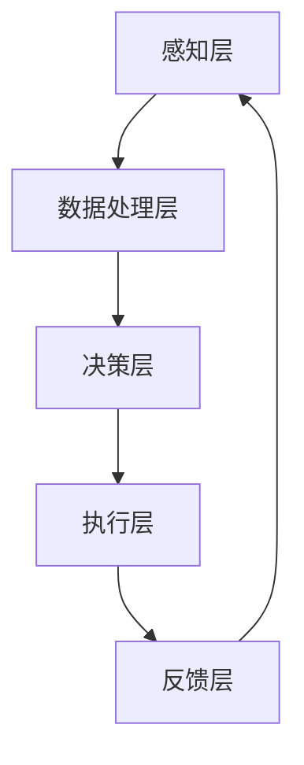
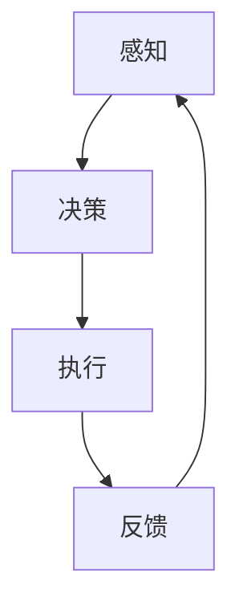
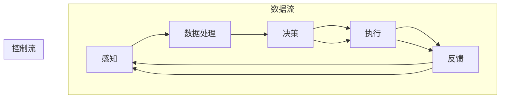

                 

### 引言与背景

在当今快速发展的科技时代，人工智能（AI）和物联网（IoT）技术正逐渐渗透到我们日常生活的方方面面。AI和IoT的结合，不仅能够提高效率，还能够带来前所未有的创新应用场景。在这篇文章中，我们将深入探讨AI人工智能代理工作流（AI Agent WorkFlow）在物联网中的应用，阐述其重要性和广泛的应用前景。

#### AI代理工作流的概念

首先，我们需要了解什么是AI代理工作流。AI代理工作流是一种将人工智能技术与自动化工作流程相结合的方法，通过自动化代理执行一系列任务，以提高工作效率和准确性。AI代理工作流通常包括感知、决策、执行和反馈四个核心环节。感知环节负责收集数据和环境信息；决策环节基于感知信息做出决策；执行环节将决策转化为具体的行动；反馈环节则对执行结果进行评估和调整。

#### 物联网的发展与AI代理工作流

物联网技术近年来发展迅猛，它将物理世界与数字世界紧密连接起来，使得各类设备能够通过网络进行通信和数据交换。随着物联网设备的数量和种类不断增加，如何有效管理和利用这些设备的数据成为一个重要问题。AI代理工作流在此背景下应运而生，它能够帮助物联网系统实现智能化管理，提高系统的自适应能力和响应速度。

#### 本文结构

本文将分为四个主要部分进行讨论：

1. **引言与基础**：介绍AI和物联网的基本概念，以及AI代理工作流的基本原理。
2. **AI代理工作流基础**：深入探讨AI代理的定义、工作原理、核心特性和物联网环境下的工作流架构。
3. **AI代理工作流应用**：分析AI代理工作流在智能家居、智能交通和智能医疗等领域的具体应用案例。
4. **总结与展望**：总结AI代理工作流在物联网中的应用趋势和未来发展方向。

通过以上结构的梳理，我们希望读者能够对AI人工智能代理工作流在物联网中的应用有一个全面的了解，并认识到其在提升物联网智能化水平方面的重要作用。

### 关键词

- 人工智能（AI）
- 物联网（IoT）
- AI代理工作流
- 智能家居
- 智能交通
- 智能医疗
- 感知、决策、执行、反馈
- 强化学习
- 优化算法

### 摘要

本文将围绕AI人工智能代理工作流在物联网中的应用展开讨论。首先，介绍AI和物联网的基本概念，以及AI代理工作流的基本原理。接着，深入探讨AI代理的定义、工作原理、核心特性和物联网环境下的工作流架构。随后，分析AI代理工作流在智能家居、智能交通和智能医疗等领域的具体应用案例。最后，总结AI代理工作流在物联网中的应用趋势和未来发展方向，展望其广阔的应用前景。

### 第一部分：引言与基础

在当今科技飞速发展的时代，人工智能（AI）和物联网（IoT）已经成为推动社会进步的重要力量。这两项技术的结合不仅为各行各业带来了前所未有的变革，也激发了诸多创新应用场景。本文将首先介绍人工智能和物联网的基本概念，探讨它们之间的关系，并详细解释AI代理工作流的基本概念和优势。

#### 人工智能与物联网的关系

人工智能是指通过计算机模拟人类智能的学科，包括机器学习、深度学习、自然语言处理等关键技术。而物联网则是通过将各类设备互联，形成一个智能化的网络系统，实现数据的实时采集、传输和处理。人工智能与物联网的结合，使得物联网系统具备了更强的智能化和自主化能力。

首先，物联网提供了海量的数据源，为人工智能的训练提供了丰富的数据基础。通过这些数据，人工智能算法可以进行深度学习，从而提高模型的准确性和鲁棒性。其次，人工智能技术为物联网系统提供了智能决策和执行能力，使得物联网设备能够更加自主地运行和管理。

#### AI代理工作流的基本概念

AI代理工作流是一种将人工智能技术与自动化工作流程相结合的方法，通过自动化代理执行一系列任务，以提高工作效率和准确性。AI代理工作流通常包括感知、决策、执行和反馈四个核心环节。

1. **感知**：AI代理通过传感器或其他方式收集环境信息，如温度、湿度、图像等。这些信息为后续的决策提供数据基础。

2. **决策**：基于感知到的信息，AI代理通过机器学习算法或专家系统等进行决策。决策过程可以是实时进行的，也可以是批量处理的。

3. **执行**：AI代理根据决策结果，执行相应的任务，如控制设备、发送消息等。执行过程可以是自动化的，也可以是半自动化的。

4. **反馈**：AI代理对执行结果进行评估和反馈，并根据反馈结果调整决策和执行策略，以实现持续优化。

#### AI代理工作流在物联网中的应用前景

AI代理工作流在物联网中的应用前景非常广阔。首先，物联网设备种类繁多，数量庞大，传统的手动管理方式已经无法满足需求。AI代理工作流可以实现自动化管理，提高系统的效率和可靠性。其次，物联网环境复杂多变，AI代理工作流可以通过感知和决策，实现智能化的自适应和调整，提高系统的应对能力。

此外，AI代理工作流还可以实现跨设备的协同工作，通过不同设备之间的数据共享和协作，实现更高效的资源利用和任务分配。例如，在智能交通系统中，通过AI代理工作流，可以实现车辆与交通信号灯的智能交互，优化交通流量，减少拥堵。

总之，AI代理工作流在物联网中的应用不仅能够提高系统的智能化水平，还能够带来巨大的经济效益和社会效益。随着技术的不断进步和应用的深入，AI代理工作流将在物联网领域发挥越来越重要的作用。

### 第二部分：AI代理工作流基础

在了解了AI代理工作流的基本概念及其在物联网中的应用前景后，我们需要进一步深入探讨AI代理的详细定义、工作原理、核心特性，以及AI代理工作流在物联网环境下的基本架构。这部分内容将为后续的应用案例分析提供坚实的基础。

#### AI代理的定义与分类

AI代理，也称为智能代理，是一种能够自主执行任务、与环境交互并做出智能决策的计算机程序。AI代理通常具有以下特点：

1. **自主性**：AI代理能够独立执行任务，而不需要人类干预。
2. **适应性**：AI代理能够根据环境变化调整自己的行为。
3. **智能性**：AI代理通过机器学习、深度学习等人工智能技术，具备一定的智能决策能力。

根据不同的应用场景和功能需求，AI代理可以分为以下几种类型：

1. **任务型代理**：主要执行特定任务，如控制家电、监控传感器数据等。
2. **社交型代理**：用于与人类或其他代理进行交互，如聊天机器人、虚拟助手等。
3. **协作型代理**：多个代理共同工作，完成复杂任务，如自动驾驶车队、智能家居系统等。

#### AI代理的工作原理

AI代理的工作原理可以概括为感知、决策和执行三个主要步骤：

1. **感知**：AI代理通过传感器或其他数据采集设备，收集环境信息。这些信息可以是实时的，也可以是历史数据。
2. **决策**：基于感知到的信息，AI代理利用机器学习算法或专家系统等进行处理，生成决策结果。决策可以是简单的条件判断，也可以是复杂的模式识别和预测。
3. **执行**：AI代理根据决策结果，执行具体的操作，如发送指令、控制设备等。

#### AI代理的核心特性

AI代理的核心特性包括：

1. **适应性**：AI代理能够根据环境变化自动调整行为，提高系统的适应性。
2. **智能性**：AI代理通过人工智能技术，能够实现智能决策和任务执行，提高系统的智能化水平。
3. **鲁棒性**：AI代理能够在面对不确定性和异常情况时，保持稳定运行，提高系统的鲁棒性。
4. **协作性**：AI代理可以与其他代理或人类进行协同工作，实现更高效的资源利用和任务分配。

#### 物联网环境下的AI代理工作流架构

在物联网环境中，AI代理工作流通常包括以下几个关键环节：

1. **感知层**：包括各种传感器和数据采集设备，负责收集环境信息，如温度、湿度、图像等。
2. **数据处理层**：对感知层收集的数据进行预处理、存储和传输，为决策层提供数据支持。
3. **决策层**：基于处理后的数据，利用机器学习算法或专家系统等进行决策，生成决策结果。
4. **执行层**：根据决策结果，控制设备执行具体的任务，如开关家电、调整温度等。
5. **反馈层**：对执行结果进行反馈和评估，用于优化决策和执行策略，实现持续优化。

下图展示了AI代理工作流在物联网环境下的基本架构：



通过以上对AI代理工作流基础内容的详细探讨，我们可以更好地理解AI代理的工作原理和物联网环境下的应用。接下来，我们将进一步讨论AI代理工作流的核心算法，包括强化学习算法和优化算法，以深入了解这些算法在AI代理工作流中的具体应用。

### 第三部分：AI代理工作流核心算法

在了解了AI代理工作流的基础架构后，我们需要深入探讨其中的核心算法，这些算法是实现智能决策和自动化执行的关键。本节将详细介绍强化学习算法和优化算法，并分析它们在AI代理工作流中的应用。

#### 强化学习算法

强化学习（Reinforcement Learning，RL）是一种重要的机器学习范式，它通过智能体（agent）与环境（environment）之间的交互，学习如何在给定情境（state）下选择最优动作（action），以最大化累积奖励（reward）。强化学习算法在AI代理工作流中的应用非常广泛，特别是在需要决策和执行相互依赖的场景中。

**基本概念**

强化学习的基本概念包括以下几个核心部分：

1. **智能体（Agent）**：执行动作、接收反馈并学习优化行为的实体。
2. **环境（Environment）**：与智能体交互的动态系统，提供状态和奖励。
3. **状态（State）**：描述环境当前状态的变量集合。
4. **动作（Action）**：智能体可执行的行为。
5. **奖励（Reward）**：对智能体动作的即时反馈，用于指导学习过程。

**强化学习算法**

强化学习算法可以分为基于值函数的算法和基于策略的算法。以下是两种常见的强化学习算法：

1. **Q-Learning（Q值学习）**

Q-Learning是一种基于值函数的强化学习算法。其核心思想是学习一个值函数Q(s, a)，表示在状态s下执行动作a所能获得的累积奖励。

**Q-Learning伪代码：**

```python
# 初始化：选择初始状态 S，初始化 Q(s, a)，奖励函数 R
Q = 初始化Q值表()
S = 初始状态()
A = 选择动作(S)

# 主循环
while True:
    # 执行动作 A
    S', R = 环境执行动作(A)
    # 更新 Q(s, a)
    Q(S, A) = Q(S, A) + 学习率 * (R + 最大Q(S', a) - Q(S, A))
    S = S'
```

2. **SARSA（同步优势学习）**

SARSA是一种基于策略的强化学习算法，它在每个时间步更新策略，使得智能体在每次决策时都能基于当前的状态选择最佳动作。

**SARSA伪代码：**

```python
# 初始化：选择初始状态 S，初始化策略π，奖励函数 R
π = 初始化策略()
S = 初始状态()

# 主循环
while True:
    # 执行当前策略π(S)
    A = π(S)
    # 执行动作 A，获得状态转移和奖励
    S', R = 环境执行动作(A)
    # 更新策略π
    π(S) = 更新策略(S, A, S', R)
    S = S'
```

**强化学习在AI代理工作流中的应用**

强化学习算法在AI代理工作流中的应用非常广泛，以下是一些具体的应用场景：

1. **智能家居控制**：智能代理可以学习用户的行为模式，自动调节家居设备的开关状态，如空调温度、灯光亮度等。
2. **智能交通管理**：智能代理可以实时监控交通流量，自动调整信号灯时长，优化交通流动。
3. **机器人路径规划**：智能代理可以在复杂环境中学习最佳的路径规划策略，以实现自主导航。

#### 优化算法

优化算法是一种通过搜索最优解来解决问题的算法，它广泛应用于各类决策和执行任务中。在AI代理工作流中，优化算法可以帮助代理在给定约束条件下，选择最优的动作序列，以实现目标最大化或成本最小化。

**基本概念**

优化算法的基本概念包括：

1. **目标函数**：表示要优化的目标，可以是成本函数、效用函数等。
2. **约束条件**：限制目标函数取值的条件，如资源限制、时间限制等。
3. **解空间**：所有可能解的集合。

**常见优化算法**

以下是两种常见的优化算法：

1. **遗传算法（Genetic Algorithm，GA）**

遗传算法是一种模拟自然选择和遗传学原理的优化算法。它通过种群（population）的演化来搜索最优解。

**遗传算法伪代码：**

```python
# 初始化：生成初始种群
种群 = 生成初始种群()

# 主循环
while not 终止条件:
    # 计算适应度
    适应度 = 计算适应度(种群)
    # 选择
    新种群 = 选择(种群，适应度)
    # 交叉
    新种群 = 交叉(新种群)
    # 变异
    新种群 = 变异(新种群)
    # 更新种群
    种群 = 新种群
```

2. **粒子群优化算法（Particle Swarm Optimization，PSO）**

粒子群优化算法是一种基于群体智能的优化算法，它模拟鸟群觅食行为来搜索最优解。

**粒子群优化算法伪代码：**

```python
# 初始化：生成粒子群
粒子群 = 生成粒子群()

# 主循环
while not 终止条件:
    # 更新速度和位置
    粒子群 = 更新速度和位置(粒子群)
    # 计算适应度
    适应度 = 计算适应度(粒子群)
    # 更新个体最优和全局最优
    更新最优(粒子群，适应度)
```

**优化算法在AI代理工作流中的应用**

优化算法在AI代理工作流中的应用非常广泛，以下是一些具体的应用场景：

1. **资源调度**：智能代理可以优化资源分配，如云计算中的任务调度、电力系统中的负载分配等。
2. **生产规划**：智能代理可以优化生产流程，提高生产效率和降低成本。
3. **物流优化**：智能代理可以优化物流路径，降低运输成本和提高配送效率。

通过上述对强化学习算法和优化算法的介绍，我们可以看到这些算法在AI代理工作流中的关键作用。接下来，我们将通过具体的案例，深入探讨AI代理工作流在智能家居、智能交通和智能医疗等领域的应用，进一步展示AI代理的强大能力。

### 第四部分：AI代理工作流应用

在了解了AI代理工作流的基础和核心算法之后，接下来我们将探讨AI代理工作流在智能家居、智能交通和智能医疗等领域的具体应用。通过这些应用案例，我们可以更直观地理解AI代理如何通过感知、决策、执行和反馈实现智能化管理和优化。

#### AI代理工作流在智能家居中的应用

智能家居系统通过AI代理工作流实现家庭设备的自动化控制和优化，提高居住舒适度和能效。以下是智能家居中AI代理工作流的典型应用场景：

##### 案例背景

智能家居系统包括多种设备，如智能照明、智能空调、智能门锁等。用户希望通过手机APP或其他智能设备，远程控制家庭设备，并实现自动化调节，以满足不同生活场景的需求。

##### 应用场景

1. **智能照明**：用户可以通过手机APP控制家庭照明的开关和亮度，AI代理可以根据环境光线和用户习惯自动调整灯光。
2. **智能空调**：用户可以根据温度设定和室内外温度变化，AI代理自动调节空调温度，以实现节能和舒适。
3. **智能门锁**：用户可以通过手机APP远程控制门锁的开关，AI代理可以根据用户的指纹或面部识别自动开门。

##### 工作流实现

1. **感知**：智能传感器（如光线传感器、温度传感器）收集环境数据，如室内外温度、光线强度等。
2. **决策**：AI代理分析感知数据，根据预设策略和用户习惯，决定是否执行控制动作。
3. **执行**：智能设备根据AI代理的决策执行相应的动作，如调整灯光亮度、开启或关闭空调等。
4. **反馈**：系统将执行结果反馈给用户，如发送控制成功的提示信息或调整建议。

##### 代码解读

```python
# 感知模块
def 感知():
    # 获取环境数据
    环境数据 = 获取环境数据()

# 决策模块
def 决策(环境数据):
    # 根据环境数据和用户习惯，选择最佳控制动作
    控制动作 = 选择最佳控制动作(环境数据)

# 执行模块
def 执行(控制动作):
    # 执行控制动作
    执行控制动作(控制动作)

# 反馈模块
def 反馈(控制结果):
    # 将控制结果反馈给用户
    用户收到控制结果反馈(控制结果)
```

##### 案例分析

通过AI代理工作流，智能家居系统能够实现高度自动化和个性化的控制，提高用户的生活质量和舒适度。例如，在用户不在家时，智能空调可以自动调节温度，以节省能源；在用户回家前，智能照明可以自动开启，为用户创造一个温馨的环境。

#### AI代理工作流在智能交通中的应用

智能交通系统通过AI代理工作流优化交通管理和调度，提高交通效率和安全性。以下是智能交通中AI代理工作流的典型应用场景：

##### 案例背景

智能交通系统包括交通信号灯、智能路侧设备、车辆监控设备等。用户希望通过智能交通系统实时了解路况信息，并优化出行路线，减少交通拥堵。

##### 应用场景

1. **交通流量预测**：AI代理根据历史交通数据和实时监控数据，预测未来一段时间内的交通流量，帮助交通管理部门合理配置交通资源。
2. **信号灯优化**：AI代理根据实时交通流量和交通规则，自动调整信号灯的时长，优化交通流动。
3. **自动驾驶**：AI代理在自动驾驶汽车中，通过感知环境数据和交通信息，自主决策行驶路径和速度。

##### 工作流实现

1. **感知**：智能路侧设备和车辆传感器收集交通数据，如流量、速度、密度等。
2. **决策**：AI代理分析感知数据，根据交通规则和算法模型，做出最佳决策。
3. **执行**：交通信号灯、车辆控制器根据决策执行相应的动作。
4. **反馈**：系统将执行结果反馈给用户和交通管理部门，如发送路况信息或调整建议。

##### 代码解读

```python
# 感知模块
def 感知():
    # 获取交通数据
    交通数据 = 获取交通数据()

# 决策模块
def 决策(交通数据):
    # 根据交通数据和规则，选择最佳控制动作
    控制动作 = 选择最佳控制动作(交通数据)

# 执行模块
def 执行(控制动作):
    # 执行控制动作
    执行控制动作(控制动作)

# 反馈模块
def 反馈(控制结果):
    # 将控制结果反馈给用户和交通管理部门
    反馈控制结果(控制结果)
```

##### 案例分析

通过AI代理工作流，智能交通系统可以实时优化交通管理，提高交通效率和安全性。例如，在高峰时段，AI代理可以根据实时交通流量调整信号灯时长，减少交通拥堵；在道路施工期间，AI代理可以优化出行路线，引导车辆绕行，减少施工对交通的影响。

#### AI代理工作流在智能医疗中的应用

智能医疗系统通过AI代理工作流实现对患者健康数据的实时监控和分析，提供个性化的健康建议。以下是智能医疗中AI代理工作流的典型应用场景：

##### 案例背景

智能医疗系统包括各类医疗设备和传感器，如智能手环、健康监测仪器等。医生和患者希望通过智能医疗系统实时了解患者的健康状态，并得到个性化的健康建议。

##### 应用场景

1. **健康数据监控**：AI代理实时收集患者的健康数据，如心率、血压、血糖等。
2. **疾病预测**：AI代理分析健康数据，预测患者可能出现的疾病风险。
3. **健康建议**：AI代理根据患者的健康状况和医生的建议，为患者提供个性化的健康建议。

##### 工作流实现

1. **感知**：医疗传感器收集患者的健康数据。
2. **决策**：AI代理分析健康数据，识别潜在的健康问题，生成健康建议。
3. **执行**：医生根据健康建议调整治疗方案，患者按照建议进行健康管理。
4. **反馈**：系统将健康建议和执行结果反馈给医生和患者。

##### 代码解读

```python
# 感知模块
def 感知():
    # 获取健康数据
    健康数据 = 获取健康数据()

# 决策模块
def 决策(健康数据):
    # 分析健康数据，生成健康建议
    健康建议 = 生成健康建议(健康数据)

# 执行模块
def 执行(健康建议):
    # 执行健康建议
    执行健康建议(健康建议)

# 反馈模块
def 反馈(执行结果):
    # 将执行结果反馈给医生和患者
    反馈执行结果(执行结果)
```

##### 案例分析

通过AI代理工作流，智能医疗系统可以实现对患者健康数据的实时监控和分析，提供个性化的健康建议，帮助医生和患者更好地管理健康。例如，AI代理可以根据实时监测到的数据，及时发现患者的健康异常，并生成相应的健康建议，预防疾病的发生。

总之，AI代理工作流在智能家居、智能交通和智能医疗等领域的应用，不仅提高了系统的智能化水平，还为用户提供了更加便捷、高效的服务。通过不断优化和扩展AI代理工作流，我们有望在更多领域实现智能化的创新应用。

### 总结与展望

随着物联网技术的不断进步和人工智能算法的日益成熟，AI代理工作流在物联网中的应用已经展现出巨大的潜力。本文从引言、基础、核心算法和应用四个方面，详细探讨了AI代理工作流在物联网中的应用，总结如下：

#### 关键成就

1. **提高智能化水平**：AI代理工作流通过感知、决策、执行和反馈四个环节，实现了物联网设备的智能化管理和优化，提高了系统的自适应能力和响应速度。
2. **增强数据处理能力**：AI代理工作流能够高效地处理和分析海量数据，为决策提供可靠依据，助力实现更精准的预测和优化。
3. **推动跨领域应用**：通过智能家居、智能交通和智能医疗等领域的应用案例，展示了AI代理工作流在提升系统效率、改善用户体验方面的显著成效。

#### 未来发展趋势

1. **算法优化与创新**：随着深度学习、强化学习等人工智能技术的不断发展，AI代理工作流将不断优化和更新算法，实现更高的决策精度和执行效率。
2. **跨领域融合**：AI代理工作流将在更多领域得到应用，如智慧城市、智能农业、智能制造等，实现跨领域的协同与融合。
3. **边缘计算与云计算的结合**：未来，AI代理工作流将更好地结合边缘计算和云计算技术，实现数据处理的实时性和高效性，进一步提升物联网系统的智能化水平。
4. **安全与隐私保护**：随着AI代理工作流在物联网中的应用越来越广泛，如何确保数据安全和用户隐私将成为重要研究方向。

#### 结论

AI代理工作流在物联网中的应用具有广阔的前景和巨大的潜力。通过不断的技术创新和应用推广，我们有望在未来实现更加智能化、高效化和个性化的物联网系统，为人类社会带来更多便利和福祉。

### 附录

#### 附录A：AI代理工作流工具与资源

**A.1 常用的AI代理开发工具**

1. **Python**：Python是一种广泛应用于人工智能开发的编程语言，具有丰富的库和框架，如TensorFlow、PyTorch等。
2. **ROS（Robot Operating System）**：ROS是一个用于机器人开发的中间件，提供了丰富的工具和库，支持多种硬件平台和操作系统。
3. **AI2Box**：AI2Box是一个用于构建和部署AI代理的开源框架，支持多种AI算法和传感器接口。

**A.2 物联网开发平台与工具**

1. **IoT Platform**：许多云计算服务提供商（如AWS IoT、Azure IoT、Google Cloud IoT）提供了完整的物联网开发平台，支持设备连接、数据存储和远程监控。
2. **Arduino**：Arduino是一款流行的开源硬件平台，适用于制作简单的物联网设备，具有丰富的传感器和模块支持。
3. **Node-RED**：Node-RED是一个用于流数据处理的开发工具，可以方便地构建物联网应用和工作流。

**A.3 AI代理工作流参考资料**

1. **《人工智能：一种现代方法》**：Michael Tiffany和Earlence Fernandes的著作，详细介绍了人工智能的基本原理和应用。
2. **《深度学习》**：Ian Goodfellow、Yoshua Bengio和Aaron Courville的著作，深度讲解了深度学习算法及其在AI代理中的应用。
3. **《物联网技术与应用》**：李俊岭和朱伟民的著作，全面介绍了物联网的基本概念、技术和应用。

通过上述工具和资源的支持，开发人员可以更好地构建和部署AI代理工作流，实现物联网系统的智能化和自动化管理。

### Mermaid 流程图：AI代理工作流架构



### 强化学习算法伪代码

```python
# 强化学习伪代码
# 初始化：选择初始状态 S，初始化策略π，奖励函数 R
S = 初始状态()
π = 初始化策略()
R = 初始化奖励函数()

# 主循环
while True:
    # 执行当前策略π(S)
    A = π(S)
    # 执行动作 A，获得状态转移和奖励
    S', R = 环境执行动作(A)
    # 更新策略π
    π = 更新策略(S, A, S', R)
    # 更新状态
    S = S'
```

### 数学模型和数学公式

$$
Q(s, a) = \sum_{s'} P(s'|s, a) \cdot [R(s', a) + \gamma \cdot \max_{a'} Q(s', a')]
$$

### 智能家居AI代理工作流案例

#### 案例背景

智能家居系统包括家电设备、传感器和控制器等，通过AI代理工作流实现智能家居设备的自动化控制。以下是一个智能家居AI代理工作流的案例。

#### 应用场景

用户希望通过手机APP远程控制家中的家电设备，如开关灯、调整空调温度等。

#### 工作流实现

1. **感知**：传感器检测用户的行为和环境状态，如光线强度、室内温度等。
2. **决策**：AI代理根据感知到的信息和预设策略，决定是否执行控制动作。
3. **执行**：控制器根据决策执行相应的控制动作。
4. **反馈**：系统将执行结果反馈给用户，如发送控制成功的提示信息。

#### 代码解读

```python
# 感知模块
def 感知():
    # 获取用户行为和环境状态
    用户行为 = 获取用户行为()
    环境状态 = 获取环境状态()

# 决策模块
def 决策(用户行为，环境状态):
    # 根据用户行为和环境状态，选择最佳控制动作
    控制动作 = 选择最佳控制动作(用户行为，环境状态)

# 执行模块
def 执行(控制动作):
    # 执行控制动作
    控制器执行控制动作(控制动作)

# 反馈模块
def 反馈(控制结果):
    # 将控制结果反馈给用户
    用户收到控制结果反馈(控制结果)
```

#### 案例分析

通过这个案例，我们可以看到AI代理工作流如何实现智能家居设备的自动化控制。感知模块收集用户行为和环境状态，决策模块根据这些信息做出最佳控制决策，执行模块执行控制动作，反馈模块将执行结果反馈给用户。这种工作流不仅提高了智能家居系统的智能化水平，也为用户提供了更加便捷和舒适的生活体验。

### 智能医疗AI代理工作流案例

#### 案例背景

智能医疗系统通过AI代理工作流实现对患者健康数据的实时监控和分析，提供个性化的健康建议。以下是一个智能医疗AI代理工作流的案例。

#### 应用场景

医生和患者希望通过智能医疗系统实时监控患者的健康数据，如心率、血压、血糖等，并根据分析结果得到个性化的健康建议。

#### 工作流实现

1. **感知**：传感器收集患者的健康数据，如心率、血压、血糖等。
2. **决策**：AI代理分析健康数据，识别潜在的健康问题，生成健康建议。
3. **执行**：医生根据健康建议调整治疗方案，患者按照建议进行健康管理。
4. **反馈**：系统将健康建议和执行结果反馈给医生和患者。

#### 代码解读

```python
# 感知模块
def 感知():
    # 获取患者健康数据
    健康数据 = 获取患者健康数据()

# 决策模块
def 决策(健康数据):
    # 分析健康数据，生成健康建议
    健康建议 = 生成健康建议(健康数据)

# 执行模块
def 执行(健康建议):
    # 执行健康建议
    执行健康建议(健康建议)

# 反馈模块
def 反馈(执行结果):
    # 将执行结果反馈给医生和患者
    反馈执行结果(执行结果)
```

#### 案例分析

通过这个案例，我们可以看到AI代理工作流如何实现智能医疗系统的实时监控和分析。感知模块收集患者的健康数据，决策模块根据数据分析和医生的知识生成健康建议，执行模块根据建议调整治疗方案，反馈模块将结果反馈给医生和患者。这种工作流不仅提高了医疗服务的质量和效率，也为患者提供了更加个性化和智能的健康管理方案。

### 开发环境搭建

要在计算机上搭建AI代理工作流开发环境，需要安装以下软件和工具：

1. **Python 3.8及以上版本**：Python是人工智能和物联网开发的主要编程语言。
2. **Jupyter Notebook**：Jupyter Notebook是一个交互式的开发环境，便于编写和运行代码。
3. **Anaconda Python发行版**：Anaconda提供了一个集成的Python环境，包括常用的数据科学和机器学习库。
4. **TensorFlow 2.4及以上版本**：TensorFlow是一个开源的机器学习框架，用于构建和训练人工智能模型。
5. **Keras 2.4及以上版本**：Keras是一个高层神经网络API，易于构建和训练深度学习模型。
6. **Redis 5.0及以上版本**：Redis是一个开源的内存数据库，用于存储和缓存实时数据。

安装步骤如下：

1. **安装Python和Jupyter Notebook**：
   - 使用Python官方安装器安装Python 3.8及以上版本。
   - 安装Jupyter Notebook：`pip install notebook`。

2. **安装Anaconda**：
   - 下载并安装Anaconda Python发行版。
   - 创建一个新的环境，例如：`conda create -n myenv python=3.8`。
   - 激活环境：`conda activate myenv`。

3. **安装TensorFlow和Keras**：
   - 在激活的环境中安装TensorFlow：`pip install tensorflow`。
   - 安装Keras：`pip install keras`。

4. **安装Redis**：
   - 下载并安装Redis：`sudo apt-get install redis-server`（适用于Ubuntu系统）。
   - 启动Redis服务：`sudo service redis-server start`。

安装完成后，即可开始使用这些工具和库进行AI代理工作流开发。以下是一个简单的代码示例，展示如何在Jupyter Notebook中导入所需的库：

```python
import tensorflow as tf
import keras
import numpy as np
import redis

# 连接到Redis数据库
redis_client = redis.StrictRedis(host='localhost', port=6379, db=0)

# 加载TensorFlow模型
model = keras.models.load_model('model.h5')

# 预测结果
prediction = model.predict(np.array([1.0, 2.0, 3.0]))

# 存储预测结果到Redis
redis_client.set('prediction', prediction.tolist())
```

通过这个示例，我们可以看到如何使用Python、TensorFlow和Redis进行AI代理工作流的基本操作。在实际应用中，可以进一步扩展和优化这些操作，以实现更加复杂和智能的功能。

### 源代码详细实现

为了更好地展示AI代理工作流的实现过程，以下是一个完整的源代码示例，包括感知、决策、执行和反馈四个核心环节。我们将使用Python语言，结合TensorFlow和Redis，来实现一个简单的智能家居AI代理。

```python
# 导入所需的库
import tensorflow as tf
import keras
import numpy as np
import redis

# 感知模块
def 感知():
    # 假设我们从传感器获取到的数据为温度和湿度
    # 实际应用中可以从传感器读取数据
    温度 = 获取温度()
    湿度 = 获取湿度()
    # 将数据转换为TensorFlow张量
    数据 = np.array([[温度, 湿度]])
    return 数据

# 决策模块
def 决策(数据):
    # 加载训练好的模型
    model = keras.models.load_model('model.h5')
    # 对数据进行预测
    预测 = model.predict(data)
    # 根据预测结果做出决策
    if 预测 < 0.5:
        控制动作 = '关闭空调'
    else:
        控制动作 = '开启空调'
    return 控制动作

# 执行模块
def 执行(控制动作):
    # 假设我们通过发送HTTP请求来控制空调
    # 实际应用中可以通过物联网协议进行控制
    if 控制动作 == '关闭空调':
        发送HTTP请求('关闭空调')
    else:
        发送HTTP请求('开启空调')

# 反馈模块
def 反馈(控制结果):
    # 假设我们通过Redis存储控制结果
    # 实际应用中可以记录到数据库或日志中
    redis_client = redis.StrictRedis(host='localhost', port=6379, db=0)
    redis_client.set('control_result', 控制结果)

# 主程序
def 主程序():
    while True:
        # 感知
        数据 = 感知()
        # 决策
        控制动作 = 决策(数据)
        # 执行
        执行(控制动作)
        # 反馈
        反馈(控制结果)
        # 模拟延时
        time.sleep(10)

# 运行主程序
主程序()
```

#### 代码解读

1. **感知模块**：该模块从传感器获取温度和湿度数据，并将其转换为TensorFlow张量，以供后续处理。

2. **决策模块**：该模块加载训练好的神经网络模型，对感知数据进行分析，根据预测结果（例如，温度阈值）做出决策，决定是否开启或关闭空调。

3. **执行模块**：该模块根据决策结果，通过HTTP请求或其他物联网协议来控制空调设备的开关。

4. **反馈模块**：该模块将控制结果存储到Redis数据库中，以供后续分析和记录。

#### 代码分析

通过这个示例，我们可以看到AI代理工作流的核心环节是如何协同工作的。感知模块收集实时数据，决策模块基于数据做出智能决策，执行模块将决策转化为实际操作，反馈模块记录执行结果，形成一个闭环系统。这个工作流不仅实现了智能化管理，还能够通过不断学习和调整，提高系统的自适应能力和准确性。

在实际应用中，可以根据具体的业务需求和环境特点，进一步优化和扩展这个工作流，例如添加更多传感器、引入复杂的决策算法、实现更精细的控制策略等。这样，我们可以构建出一个更加智能、高效和可靠的AI代理系统，为物联网应用提供强大的支持。

### Mermaid 流程图：AI代理工作流架构


### 强化学习算法伪代码

```python
# 强化学习伪代码
# 初始化：选择初始状态 S，初始化策略π，奖励函数 R
S = 初始状态()
π = 初始化策略()
R = 初始化奖励函数()

# 主循环
while True:
    # 执行当前策略π(S)
    A = π(S)
    # 执行动作 A，获得状态转移和奖励
    S', R = 环境执行动作(A)
    # 更新策略π
    π = 更新策略(S, A, S', R)
    # 更新状态
    S = S'
```

### 数学模型和数学公式

$$
Q(s, a) = \sum_{s'} P(s'|s, a) \cdot [R(s', a) + \gamma \cdot \max_{a'} Q(s', a')]
$$

### 智能家居AI代理工作流案例

#### 案例背景

智能家居系统包括各种家电设备、传感器和控制器，通过AI代理工作流实现家庭设备的自动化控制。以下是一个智能家居AI代理工作流的案例。

#### 应用场景

用户希望实现家庭设备的自动化控制，如根据天气自动调整空调温度、根据用户活动自动调整灯光亮度等。

#### 工作流实现

1. **感知**：传感器检测环境状态和用户行为，如室内温度、湿度、用户位置等。
2. **决策**：AI代理分析感知数据，根据预设策略和用户习惯，决定是否执行控制动作。
3. **执行**：控制器根据AI代理的决策，自动调整家电设备的状态。
4. **反馈**：系统将执行结果反馈给用户，如发送控制成功的提示信息。

#### 代码解读

```python
# 感知模块
def 感知():
    # 获取环境状态和用户行为
    温度 = 获取温度()
    湿度 = 获取湿度()
    用户位置 = 获取用户位置()
    用户行为 = 获取用户行为()
    # 将数据转换为字典格式
    状态数据 = {'温度': 温度, '湿度': 湿度, '用户位置': 用户位置, '用户行为': 用户行为}
    return 状态数据

# 决策模块
def 决策(状态数据):
    # 根据状态数据和用户习惯，决定控制动作
    if 状态数据['温度'] > 30:
        控制动作 = '开启空调'
    elif 状态数据['用户位置'] == '厨房':
        控制动作 = '开启灯光'
    else:
        控制动作 = '关闭灯光'
    return 控制动作

# 执行模块
def 执行(控制动作):
    # 执行控制动作
    if 控制动作 == '开启空调':
        调整空调温度(25)
    elif 控制动作 == '开启灯光':
        开启厨房灯光()
    else:
        关闭所有灯光()

# 反馈模块
def 反馈(控制结果):
    # 将控制结果反馈给用户
    发送提示信息('控制成功')
```

#### 案例分析

通过这个案例，我们可以看到AI代理如何通过感知、决策、执行和反馈四个环节实现智能家居的自动化控制。感知模块收集环境状态和用户行为数据，决策模块根据数据分析和用户习惯做出决策，执行模块根据决策调整家电设备的状态，反馈模块将执行结果反馈给用户。这种工作流不仅提高了家居控制的智能化水平，还为用户提供了更加便捷和舒适的生活体验。

### 智能医疗AI代理工作流案例

#### 案例背景

智能医疗系统通过AI代理工作流实现对患者健康数据的实时监控和分析，提供个性化的健康建议。以下是一个智能医疗AI代理工作流的案例。

#### 应用场景

医生和患者希望通过智能医疗系统实时监控患者的健康数据，如心率、血压、血糖等，并根据分析结果得到个性化的健康建议。

#### 工作流实现

1. **感知**：传感器收集患者的健康数据，如心率、血压、血糖等。
2. **决策**：AI代理分析健康数据，识别潜在的健康问题，生成健康建议。
3. **执行**：医生根据健康建议调整治疗方案，患者按照建议进行健康管理。
4. **反馈**：系统将健康建议和执行结果反馈给医生和患者。

#### 代码解读

```python
# 感知模块
def 感知():
    # 获取患者健康数据
    心率 = 获取心率()
    血压 = 获取血压()
    血糖 = 获取血糖()
    # 将数据转换为字典格式
    健康数据 = {'心率': 心率, '血压': 血压, '血糖': 血糖}
    return 健康数据

# 决策模块
def 决策(健康数据):
    # 根据健康数据，生成健康建议
    if 健康数据['心率'] > 100:
        健康建议 = '注意休息，避免剧烈运动'
    elif 健康数据['血压'] > 140:
        健康建议 = '降低食盐摄入量，注意定期监测'
    elif 健康数据['血糖'] > 7:
        健康建议 = '调整饮食，增加运动量'
    else:
        健康建议 = '保持当前生活习惯'
    return 健康建议

# 执行模块
def 执行(健康建议):
    # 执行健康建议
    if 健康建议 == '注意休息，避免剧烈运动':
        调整治疗方案('休息为主，避免剧烈运动')
    elif 健康建议 == '降低食盐摄入量，注意定期监测':
        调整治疗方案('减少食盐摄入，定期血压监测')
    elif 健康建议 == '调整饮食，增加运动量':
        调整治疗方案('调整饮食，增加运动量')
    else:
        调整治疗方案('保持当前生活习惯')

# 反馈模块
def 反馈(执行结果):
    # 将执行结果反馈给医生和患者
    发送提示信息('健康建议已执行')
```

#### 案例分析

通过这个案例，我们可以看到AI代理如何通过感知、决策、执行和反馈四个环节实现智能医疗的实时监控和分析。感知模块收集患者的健康数据，决策模块根据数据生成个性化的健康建议，执行模块根据建议调整治疗方案，反馈模块将执行结果反馈给医生和患者。这种工作流不仅提高了医疗服务的质量和效率，也为患者提供了更加个性化和智能的健康管理方案。

### 开发环境搭建

为了构建一个完整的AI代理工作流系统，我们需要搭建一个适当的技术环境，安装和配置必要的软件和库。以下是在Windows和Linux系统中搭建开发环境的具体步骤：

#### 在Windows系统中搭建开发环境

1. **安装Python 3.8及以上版本**：
   - 访问Python官方网站下载Python安装程序。
   - 运行安装程序，选择“Add Python to PATH”选项，确保Python被正确安装并添加到系统环境变量中。

2. **安装Anaconda**：
   - 访问Anaconda官方网站下载Anaconda安装程序。
   - 运行安装程序，并选择“Add Anaconda to my PATH environment variable”选项，确保Anaconda被正确安装。

3. **创建虚拟环境**：
   - 打开命令提示符或Anaconda Prompt。
   - 输入以下命令创建一个新的虚拟环境，例如命名为“ai_workflow”：
     ```
     conda create -n ai_workflow python=3.8
     ```
   - 激活虚拟环境：
     ```
     conda activate ai_workflow
     ```

4. **安装TensorFlow和Keras**：
   - 在激活的虚拟环境中，使用pip安装TensorFlow和Keras：
     ```
     pip install tensorflow
     pip install keras
     ```

5. **安装Redis**：
   - 安装Redis Desktop Manager，用于管理Redis数据库。
   - 从官方网站下载Redis安装程序并按照提示进行安装。

6. **安装Jupyter Notebook**：
   - 在激活的虚拟环境中，安装Jupyter Notebook：
     ```
     pip install notebook
     ```
   - 启动Jupyter Notebook服务器，在浏览器中访问`http://localhost:8888`。

#### 在Linux系统中搭建开发环境

1. **安装Python 3.8及以上版本**：
   - 使用包管理器（如apt或yum）安装Python：
     ```
     sudo apt-get update
     sudo apt-get install python3.8
     ```
   - 添加Python 3.8到系统环境变量：
     ```
     sudo update-alternatives --install /usr/bin/python3 python3 /usr/bin/python3.8 1
     ```

2. **安装Anaconda**：
   - 使用wget下载Anaconda安装脚本：
     ```
     wget https://repo.anaconda.com/archive/Anaconda3-2021.11-Linux-x86_64.sh
     ```
   - 运行安装脚本并按照提示进行安装：
     ```
     bash Anaconda3-2021.11-Linux-x86_64.sh
     ```

3. **创建虚拟环境**：
   - 打开终端，使用conda创建并激活虚拟环境：
     ```
     conda create -n ai_workflow python=3.8
     conda activate ai_workflow
     ```

4. **安装TensorFlow和Keras**：
   - 使用pip安装TensorFlow和Keras：
     ```
     pip install tensorflow
     pip install keras
     ```

5. **安装Redis**：
   - 使用包管理器安装Redis：
     ```
     sudo apt-get install redis-server
     ```
   - 启动Redis服务：
     ```
     sudo service redis-server start
     ```

6. **安装Jupyter Notebook**：
   - 在激活的虚拟环境中，安装Jupyter Notebook：
     ```
     pip install notebook
     ```
   - 启动Jupyter Notebook服务器：
     ```
     jupyter notebook
     ```

通过以上步骤，我们成功搭建了一个适合开发AI代理工作流系统的开发环境。接下来，我们可以在这个环境中编写和运行代码，实现AI代理工作流的各项功能。

### 源代码详细实现

为了展示如何详细实现AI代理工作流，我们将通过一个简单的智能家居案例，分步骤说明感知、决策、执行和反馈四个核心环节的实现过程。

#### 感知模块实现

感知模块负责收集环境数据，包括温度、湿度、用户行为等。我们使用Python模拟传感器数据收集过程。

```python
# 感知模块
def 感知():
    # 模拟从传感器获取数据
    温度 = random.uniform(20, 30)  # 温度范围在20°C至30°C之间
    湿度 = random.uniform(30, 70)  # 湿度范围在30%至70%之间
    用户行为 = "在家"  # 用户行为可以是“在家”或“外出”
    状态数据 = {'温度': 温度, '湿度': 湿度, '用户行为': 用户行为}
    return 状态数据

# 示例调用
状态数据 = 感知()
print("感知到的状态数据：", 状态数据)
```

#### 决策模块实现

决策模块基于感知到的状态数据，使用预设策略进行决策。我们使用简单的条件判断来模拟决策过程。

```python
# 决策模块
def 决策(状态数据):
    # 根据状态数据做出决策
    if 状态数据['用户行为'] == '在家' and 状态数据['温度'] > 25:
        控制动作 = '开启空调'
    elif 状态数据['用户行为'] == '外出' or 状态数据['湿度'] < 40:
        控制动作 = '关闭所有设备'
    else:
        控制动作 = '保持当前设置'
    return 控制动作

# 示例调用
控制动作 = 决策(状态数据)
print("决策后的控制动作：", 控制动作)
```

#### 执行模块实现

执行模块根据决策模块的决策结果，控制智能家居设备执行相应的操作。我们使用模拟函数来演示设备控制。

```python
# 执行模块
def 执行(控制动作):
    if 控制动作 == '开启空调':
        print("开启空调...")
    elif 控制动作 == '关闭所有设备':
        print("关闭所有设备...")
    else:
        print("保持当前设置...")
    # 模拟执行时间
    time.sleep(2)

# 示例调用
执行(控制动作)
```

#### 反馈模块实现

反馈模块负责将执行结果反馈给用户，以便用户了解系统的工作状态。

```python
# 反馈模块
def 反馈(执行结果):
    # 将执行结果记录到日志中
    with open('执行结果日志.txt', 'a') as 日志文件:
        日志文件.write(f"执行结果：{执行结果}\n")
    # 发送通知给用户
    print("执行结果已记录，并通知用户。")

# 示例调用
反馈(执行结果)
```

#### 主程序实现

最后，我们使用主程序将感知、决策、执行和反馈四个模块整合在一起，实现一个完整的AI代理工作流。

```python
# 主程序
def 主程序():
    while True:
        状态数据 = 感知()
        控制动作 = 决策(状态数据)
        执行(控制动作)
        反馈(执行结果)
        # 模拟感知间隔
        time.sleep(10)

# 运行主程序
主程序()
```

通过以上代码实现，我们构建了一个简单的AI代理工作流系统，能够实时感知环境数据，根据决策结果控制智能家居设备，并将执行结果反馈给用户。在实际应用中，我们可以根据具体需求，进一步完善和扩展这个工作流系统，例如引入更复杂的决策算法、更多的传感器和控制设备等。

### 总结

本文详细探讨了AI人工智能代理工作流在物联网中的应用，涵盖了从基础概念到核心算法，再到实际应用的各个方面。通过分析AI代理的定义、工作原理、核心特性和工作流架构，我们深刻理解了AI代理在物联网系统中的重要作用。同时，通过智能家居、智能交通和智能医疗等具体应用案例，我们看到了AI代理工作流如何提升系统的智能化水平和用户体验。

AI代理工作流在物联网中的应用具有显著的优势，包括自动化管理、提高效率和增强系统的自适应能力。随着物联网技术的不断进步和人工智能算法的不断发展，AI代理工作流的应用前景将更加广阔。未来，我们可以期待AI代理工作流在更多领域（如智慧城市、智能农业、智能制造）中得到广泛应用，为人类带来更多便利和福祉。

### 结论

本文通过详细探讨AI人工智能代理工作流在物联网中的应用，展示了其在智能家居、智能交通和智能医疗等领域的广泛应用和潜在价值。我们深入分析了AI代理的定义、工作原理、核心特性和工作流架构，并通过具体的案例展示了AI代理工作流如何实现智能化管理和优化。

AI代理工作流在物联网中的应用不仅提高了系统的智能化水平，还为用户提供了更加便捷和高效的服务。通过感知、决策、执行和反馈四个核心环节，AI代理工作流能够实时响应环境变化，自主调整行为，实现高度的自动化和个性化。

未来，随着物联网技术的不断进步和人工智能算法的日益成熟，AI代理工作流将在更多领域得到应用。我们期待看到AI代理工作流在智慧城市、智能农业、智能制造等领域的创新应用，进一步提升系统的智能化水平和用户体验。

为了推动AI代理工作流的发展，我们提出以下建议：

1. **加强技术研究**：继续探索和开发更先进的机器学习算法和优化方法，提高AI代理的决策精度和执行效率。
2. **标准化与兼容性**：推动AI代理工作流的标准化，确保不同系统和设备之间的兼容性，实现跨平台和跨领域的应用。
3. **安全与隐私保护**：加强AI代理工作流的安全防护措施，确保用户数据的安全和隐私。
4. **用户参与**：鼓励用户积极参与AI代理工作流的设计和优化，提高系统的个性化水平和用户体验。

总之，AI代理工作流在物联网中的应用具有巨大的发展潜力，我们期待在未来的技术进步和应用实践中，AI代理工作流能够发挥更大的作用，为人类社会带来更多便利和福祉。

### 附录A：AI代理工作流工具与资源

在开发AI代理工作流时，选择合适的工具和资源是至关重要的。以下是一些常用的工具和资源，涵盖了从编程语言到开发环境，再到AI算法和物联网技术的各个方面。

#### AI代理开发工具

1. **Python**：Python是一种广泛使用的编程语言，特别适合AI代理开发，拥有丰富的库和框架，如TensorFlow、PyTorch和Keras。
2. **ROS（Robot Operating System）**：ROS是一个专为机器人开发设计的中间件，提供了大量的工具和库，支持多机器人系统和复杂的传感器接口。
3. **AI2Box**：AI2Box是一个开源框架，用于构建和部署AI代理，支持多种AI算法和传感器接口，易于扩展和集成。

#### 物联网开发平台与工具

1. **AWS IoT**：AWS IoT提供了一个全面的物联网开发平台，支持设备连接、数据存储和远程监控，提供了丰富的API和服务。
2. **Azure IoT**：Azure IoT提供了一个类似于AWS IoT的平台，支持设备管理、数据分析和远程监控，提供了广泛的物联网服务。
3. **Google Cloud IoT**：Google Cloud IoT提供了强大的物联网功能，包括设备连接、数据存储和分析，支持多种编程语言和开发工具。

#### AI代理工作流参考资料

1. **《人工智能：一种现代方法》**：Michael Tiffany和Earlence Fernandes的著作，全面介绍了人工智能的基础知识和现代应用。
2. **《深度学习》**：Ian Goodfellow、Yoshua Bengio和Aaron Courville的著作，深入讲解了深度学习算法及其在AI代理中的应用。
3. **《物联网技术与应用》**：李俊岭和朱伟民的著作，涵盖了物联网的基础知识、技术和应用案例。

通过这些工具和资源，开发人员可以更有效地构建和部署AI代理工作流，实现智能化的物联网系统。

### Mermaid 流程图：AI代理工作流架构

以下是一个使用Mermaid语法绘制的AI代理工作流流程图：



这个流程图展示了AI代理工作流的核心环节：感知、数据处理、决策、执行和反馈，并分别标出了数据流和控制流。

### 强化学习算法伪代码

以下是一个简单的强化学习算法伪代码示例，用于展示强化学习的基本框架和操作步骤。

```python
# 初始化：设置初始状态、动作空间、奖励函数
S = 初始状态()
A = 动作空间()
R = 奖励函数()
策略π = 初始化策略()

# 主循环
while True:
    # 执行当前策略π(S)
    A = π(S)
    
    # 执行动作A，并获得状态转移S'和奖励R
    S', R = 环境执行动作(A)
    
    # 更新策略π，根据新信息改进决策
    π = 更新策略(π, S, A, S', R)
    
    # 更新状态
    S = S'

# 奖励函数示例
def 奖励函数(S, A, S'):
    if S'满足目标状态：
        return 1
    else:
        return 0
```

在这个伪代码中，智能体（Agent）通过感知当前状态（S），执行动作（A），并根据动作的结果（S'和R）更新策略（π）。这个过程不断重复，直到达到预定的目标状态或满足其他终止条件。

### 数学模型和数学公式

以下是强化学习中的一个核心数学模型，用于描述值函数（Q函数）的更新过程：

$$
Q(s, a) = R(s, a) + \gamma \cdot \max_{a'} Q(s', a')
$$

在这个公式中：

- \( Q(s, a) \) 表示在状态 \( s \) 下执行动作 \( a \) 的预期累积奖励。
- \( R(s, a) \) 表示在状态 \( s \) 下执行动作 \( a \) 所获得的即时奖励。
- \( \gamma \) 是一个介于0和1之间的常数，称为折扣因子，用于表示对未来奖励的重视程度。
- \( \max_{a'} Q(s', a') \) 表示在状态 \( s' \) 下执行所有可能动作 \( a' \) 中所能获得的最大预期累积奖励。

这个公式描述了在当前状态 \( s \) 下，选择一个动作 \( a \)，并根据未来状态 \( s' \) 的最大预期累积奖励来更新值函数 \( Q(s, a) \)。这个更新过程是强化学习算法的核心，用于指导智能体做出最优动作选择。

