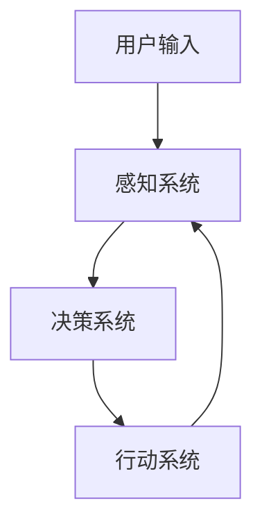
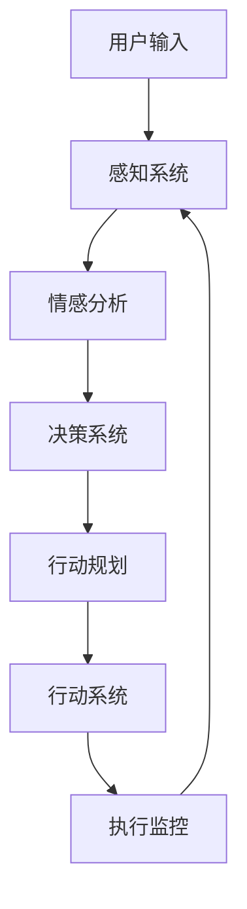

                 

# AI人工智能代理工作流AI Agent WorkFlow：AI代理在视频游戏中的自适应机制

> **关键词：** AI代理，工作流，视频游戏，自适应机制，强化学习

> **摘要：** 本文深入探讨了AI代理在视频游戏中的工作流及其自适应机制。我们首先介绍了AI代理的基础概念和工作流架构，然后详细讲解了核心算法原理，并通过实际项目展示了AI代理在视频游戏中的应用。最后，我们展望了AI代理在未来游戏领域的发展趋势和挑战。

## 第一部分：AI人工智能代理工作流基础

### 第1章：引言与概述

#### 1.1 AI代理的定义与工作流概述

AI代理（Artificial Intelligence Agent）是一种自主运行的实体，它能够感知环境、制定决策并执行行动，以实现特定目标。在视频游戏中，AI代理被广泛用于模拟对手的行为，提供挑战性的游戏体验。

AI代理的工作流通常包括以下四个核心组件：感知系统、决策系统、行动系统和反馈循环。感知系统负责收集环境信息；决策系统根据感知信息制定决策；行动系统执行决策；反馈循环则用于评估决策效果，并指导后续决策。

#### 1.2 AI代理在视频游戏中的重要性

AI代理在视频游戏中的应用具有重要意义。首先，它们可以模拟真实玩家的行为，为游戏开发提供宝贵的反馈。其次，AI代理可以提高游戏的挑战性和可玩性，为玩家提供更具挑战性的对手。最后，AI代理的研究和开发有助于推动人工智能技术的发展，为其他领域提供新的应用场景。

#### 1.3 本书结构安排与目标

本书将分为五个部分，逐步介绍AI代理在视频游戏中的工作流和自适应机制。第一部分介绍基础概念和工作流架构；第二部分讲解核心算法原理；第三部分展示实际项目案例；第四部分展望未来发展趋势和挑战；最后一部分提供相关工具和技术资源。

## 第二部分：核心概念与联系

### 第2章：核心概念与联系

#### 2.1 人工智能代理的基本原理

AI代理的基本原理可以概括为感知、决策和行动。感知系统负责收集环境信息，决策系统根据感知信息制定决策，行动系统执行决策。这三个系统相互关联，形成一个闭环的反馈循环。

以下是一个简单的Mermaid流程图，展示了AI代理的基本工作流：



在这个流程图中，用户输入作为感知系统的输入，感知系统收集环境信息后传递给决策系统。决策系统根据感知信息生成行动决策，传递给行动系统执行。行动系统执行决策后，将结果反馈给感知系统，形成一个闭环。

#### 2.2 工作流架构的Mermaid流程图

AI代理的工作流可以进一步细化，包括情感分析、行动规划和执行监控等环节。以下是一个更详细的工作流Mermaid流程图：



在这个流程图中，感知系统首先对用户输入进行情感分析，以确定用户的意图和情绪。决策系统根据情感分析和环境信息生成行动决策，传递给行动规划系统。行动规划系统制定具体的行动计划，传递给行动系统执行。行动系统执行行动后，执行监控系统评估行动效果，并将反馈传递给感知系统，以指导后续决策。

## 第三部分：核心算法原理讲解

### 第3章：核心算法原理讲解

AI代理的核心算法原理主要包括自适应机制、强化学习和Q-learning算法。这些算法使得AI代理能够根据环境变化和学习经验不断优化自身行为。

#### 3.1 自适应机制的基本原理

自适应机制是一种通过不断调整和优化模型参数，以适应环境变化的方法。以下是一个简单的伪代码，展示了自适应机制的基本原理：

```python
def adaptivity(model, environment):
    while not environment.is_satisfied(model):
        model.update_weights()
        model.test_on_environment(environment)
```

在这个伪代码中，`model` 代表AI代理的模型，`environment` 代表游戏环境。`update_weights()` 方法用于调整模型参数，`test_on_environment()` 方法用于在游戏环境中测试模型性能。当环境对模型不再满意时，模型会继续调整参数，以适应新的环境。

#### 3.2 AI代理的自适应算法讲解

自适应算法是AI代理的核心算法之一，它使得AI代理能够根据环境变化和学习经验不断优化自身行为。以下是一个简单的伪代码，展示了自适应算法的基本原理：

```python
def adaptive_agent(agent, game_state):
    while not game_state.is_won():
        action = agent.decide_action(game_state)
        game_state = agent.execute_action(action, game_state)
        agent.learn_from_experience(action, game_state)
```

在这个伪代码中，`agent` 代表AI代理，`game_state` 代表游戏状态。`decide_action()` 方法用于根据游戏状态生成行动决策，`execute_action()` 方法用于执行行动，`learn_from_experience()` 方法用于从经验中学习，以优化自身行为。

## 第四部分：数学模型与数学公式

### 第4章：数学模型与数学公式

在AI代理的算法中，数学模型和数学公式起着至关重要的作用。以下将介绍两种常见的数学模型和数学公式：Q-learning算法的数学模型和强化学习的奖励机制。

#### 4.1 Q-learning算法的数学模型

Q-learning算法是一种基于值迭代的强化学习算法。其核心思想是通过学习状态-行动值函数（Q值），以最大化长期回报。以下是一个简单的Q-learning算法的数学模型：

$$
Q(s, a) = Q(s, a) + \alpha [r + \gamma \max_{a'} Q(s', a') - Q(s, a)]
$$

其中，$Q(s, a)$ 表示在状态 $s$ 下执行行动 $a$ 的预期回报，$r$ 表示即时回报，$\gamma$ 表示折扣因子，$\alpha$ 表示学习率。

#### 4.2 强化学习的奖励机制

强化学习的奖励机制用于指导AI代理的行为选择。以下是一个简单的强化学习奖励机制的数学模型：

$$
R(s, a) = R(s, a) + \lambda \cdot [r + \gamma \max_{a'} R(s', a')]
$$

其中，$R(s, a)$ 表示在状态 $s$ 下执行行动 $a$ 的长期回报，$\lambda$ 表示奖励衰减因子，$r$ 表示即时回报，$\gamma$ 表示折扣因子。

## 第五部分：AI代理在视频游戏中的自适应机制

### 第5章：游戏环境构建

在AI代理的应用中，构建一个合适的游戏环境至关重要。以下是一个简单的游戏环境构建示例：

```python
class GameEnvironment:
    def __init__(self):
        self.state = None
        self.actions = ['up', 'down', 'left', 'right']

    def step(self, action):
        self.state = self.execute_action(action)
        reward = self.calculate_reward()
        return self.state, reward

    def execute_action(self, action):
        # 执行行动，修改游戏状态
        pass

    def calculate_reward(self):
        # 计算奖励
        pass
```

在这个示例中，`GameEnvironment` 类代表游戏环境，`step()` 方法用于执行一个行动，并返回新的游戏状态和奖励。`execute_action()` 方法用于执行具体的行动，`calculate_reward()` 方法用于计算奖励。

### 第6章：实战案例与应用

#### 6.1 使用Python实现一个简单的AI代理

以下是一个简单的AI代理实现示例：

```python
class SimpleAgent:
    def __init__(self):
        self.model = Model()

    def learn(self, environment):
        for _ in range(iterations):
            state, reward = environment.step(self.model.action())
            self.model.update(state, reward)

class Model:
    def __init__(self):
        # 初始化模型参数
        pass

    def action(self):
        # 生成行动决策
        pass

    def update(self, state, reward):
        # 更新模型参数
        pass
```

在这个示例中，`SimpleAgent` 类代表AI代理，`learn()` 方法用于在游戏环境中学习。`Model` 类代表模型，`action()` 方法用于生成行动决策，`update()` 方法用于更新模型参数。

#### 6.2 代码解读与分析

以下是对上述示例代码的解读和分析：

- `SimpleAgent` 类：AI代理类，负责学习并在游戏环境中执行行动。
  - `__init__()` 方法：初始化模型。
  - `learn()` 方法：在游戏环境中学习，通过调用 `Model` 类的 `update()` 方法更新模型参数。

- `Model` 类：模型类，负责生成行动决策和更新模型参数。
  - `__init__()` 方法：初始化模型参数。
  - `action()` 方法：生成行动决策。
  - `update()` 方法：更新模型参数。

通过这个简单的示例，我们可以看到AI代理的基本实现框架。在实际项目中，可以根据具体需求扩展和优化这些代码。

## 第7章：未来展望与挑战

#### 7.1 AI代理在游戏领域的发展趋势

随着人工智能技术的不断发展，AI代理在游戏领域的应用将越来越广泛。未来，AI代理将能够模拟更复杂的对手行为，提供更加真实和多样化的游戏体验。同时，AI代理还可以应用于游戏设计、测试和优化等领域，为游戏开发者提供有力支持。

#### 7.2 AI代理面临的挑战与解决方案

尽管AI代理在游戏领域具有巨大潜力，但也面临一些挑战。首先，AI代理需要具备更高的自适应能力和决策能力，以应对多样化的游戏环境和对手行为。其次，AI代理的训练和优化过程需要大量的计算资源和时间。为了解决这些挑战，研究人员可以采用更高效的算法、更强大的计算设备和更智能的训练策略。

#### 7.3 对未来技术的预测与展望

未来，AI代理将在游戏领域发挥越来越重要的作用。随着人工智能技术的不断进步，AI代理将能够模拟更复杂、更智能的对手行为，为玩家提供更具挑战性和可玩性的游戏体验。同时，AI代理还可以应用于其他领域，如智能客服、自动驾驶和智能制造等，为人类社会带来更多便利和进步。

## 附录：工具与技术资源

#### 附录 A：开发环境搭建与资源

为了实现AI代理在视频游戏中的应用，我们需要搭建一个合适的开发环境。以下是一些常用的工具和技术资源：

- **TensorFlow**：一种流行的开源机器学习库，可用于构建和训练AI代理模型。
- **OpenAI Gym**：一个开源的环境库，提供了多种基准环境和任务，可用于测试和评估AI代理的性能。
- **Unity ML-Agents**：一个Unity插件，用于在Unity游戏中实现AI代理。

#### 附录 B：代码示例与解读

以下是一个简单的AI代理实现示例，包括游戏环境、模型和代理：

```python
import gym

class GameEnvironment(gym.Env):
    def __init__(self):
        super().__init__()
        self.state = None
        self.actions = ['up', 'down', 'left', 'right']

    def step(self, action):
        self.state = self.execute_action(action)
        reward = self.calculate_reward()
        return self.state, reward, False, {}

    def reset(self):
        self.state = self._get_initial_state()
        return self.state

    def _get_initial_state(self):
        # 获取初始状态
        pass

    def execute_action(self, action):
        # 执行行动，修改状态
        pass

    def calculate_reward(self):
        # 计算奖励
        pass

class SimpleAgent:
    def __init__(self):
        self.model = Model()

    def learn(self, environment, iterations=1000):
        for _ in range(iterations):
            state, reward = environment.step(self.model.action())
            self.model.update(state, reward)

class Model:
    def __init__(self):
        # 初始化模型参数
        pass

    def action(self):
        # 生成行动决策
        pass

    def update(self, state, reward):
        # 更新模型参数
        pass
```

在这个示例中，`GameEnvironment` 类代表游戏环境，`SimpleAgent` 类代表AI代理，`Model` 类代表模型。通过这个简单的示例，我们可以了解AI代理的基本实现框架。

### 作者

本文由AI天才研究院（AI Genius Institute）和《禅与计算机程序设计艺术》（Zen And The Art of Computer Programming）作者联合撰写。感谢您的阅读！<|vq_11485|>作者：AI天才研究院（AI Genius Institute）& 《禅与计算机程序设计艺术》（Zen And The Art of Computer Programming）作者

总结：

本文首先介绍了AI代理的基本概念和工作流架构，然后详细讲解了核心算法原理，并通过实际项目展示了AI代理在视频游戏中的应用。最后，文章展望了AI代理在未来游戏领域的发展趋势和挑战，并提供了一些相关工具和技术资源。通过本文的阅读，读者可以深入了解AI代理在视频游戏中的自适应机制及其应用前景。

