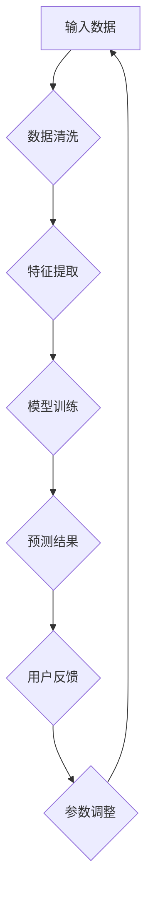

                 

# AI人工智能代理工作流AI Agent WorkFlow：互动学习在工作流中的角色与方法

> **关键词**：人工智能代理、工作流、互动学习、算法、优化

> **摘要**：本文将深入探讨人工智能代理工作流（AI Agent WorkFlow）中的互动学习原理、方法与应用。通过详细的分析和案例解析，读者将了解AI代理在工作流中的关键角色，互动学习如何提升工作流效率，以及工作流的优化策略。

## 《AI人工智能代理工作流AI Agent WorkFlow：互动学习在工作流中的角色与方法》目录大纲

### 第一部分：AI代理工作流基础

#### 第1章：AI代理与工作流概述
- 1.1 AI代理的定义与分类
- 1.2 工作流的概念与组成
- 1.3 AI代理在工作流中的角色

#### 第2章：AI代理工作流设计原则
- 2.1 设计原则概述
- 2.2 AI代理的交互机制
- 2.3 工作流的灵活性

#### 第3章：互动学习原理
- 3.1 互动学习的定义与优势
- 3.2 互动学习的实现方法
- 3.3 互动学习算法原理与伪代码

#### 第4章：AI代理工作流架构
- 4.1 AI代理工作流架构设计
- 4.2 AI代理与工作流集成
- 4.3 Mermaid流程图：AI代理工作流核心环节

### 第二部分：互动学习在工作流中的应用

#### 第5章：AI代理在工作流中的角色
- 5.1 AI代理的任务分配
- 5.2 AI代理的执行与监控
- 5.3 AI代理的性能评估

#### 第6章：互动学习在工作流中的具体应用
- 6.1 互动学习在工作流中的应用场景
- 6.2 互动学习的实现步骤
- 6.3 案例分析：互动学习在工作流中的应用效果

#### 第7章：工作流优化与迭代
- 7.1 工作流优化方法
- 7.2 互动学习在工作流迭代中的作用
- 7.3 工作流优化案例分析

### 第三部分：AI代理工作流的实现

#### 第8章：AI代理工作流开发环境搭建
- 8.1 开发环境准备
- 8.2 工具与库的选择
- 8.3 开发环境配置步骤

#### 第9章：AI代理工作流代码实现
- 9.1 工作流定义与配置
- 9.2 AI代理实现
- 9.3 互动学习实现

#### 第10章：代码解读与分析
- 10.1 代码结构分析
- 10.2 关键代码解读
- 10.3 代码性能优化

### 附录

#### 附录A：AI代理工作流开发资源
- A.1 开源框架与库推荐
- A.2 实用工具与插件介绍
- A.3 学习资源推荐

#### 附录B：AI代理工作流案例
- B.1 案例一：客户服务工作流
- B.2 案例二：供应链管理工作流
- B.3 案例三：数据分析工作流

#### 附录C：数学模型与公式
- C.1 互动学习算法数学模型
- C.2 工作流优化数学模型
- C.3 公式详解与推导

### 文章正文

#### 第一部分：AI代理工作流基础

#### 第1章：AI代理与工作流概述

**1.1 AI代理的定义与分类**

AI代理（Artificial Intelligence Agent），简称AI代理，是指能够感知环境，并采取行动以达成特定目标的计算机程序。AI代理通常基于机器学习、深度学习等技术，可以自我学习、自适应和优化其行为。根据AI代理的功能和目标，可以将其分类为以下几种类型：

1. 监控型代理：用于监控特定系统或过程的运行状态，并通过检测异常情况来触发相应的响应。
2. 自动化型代理：负责执行重复性或规则性任务，减少人工干预，提高工作效率。
3. 决策型代理：通过分析数据和预测结果，为决策者提供数据支持和建议。
4. 服务型代理：在特定领域提供个性化服务，如客户服务、医疗咨询等。

**1.2 工作流的概念与组成**

工作流（Workflow）是指一组任务和活动，它们按照特定的顺序和规则执行，以完成一个特定的业务目标。工作流的核心组成部分包括：

1. 任务（Task）：工作流中的单个操作，可以是简单的数据输入、数据处理或决策。
2. 活动（Activity）：一组任务的组合，用于实现特定的功能。
3. 流程（Process）：工作流的整体结构，定义了任务和活动之间的逻辑关系。
4. 规则（Rule）：定义了任务和活动之间的执行条件。

**1.3 AI代理在工作流中的角色**

AI代理在工作流中扮演着关键角色，其作用如下：

1. 自动化任务执行：通过AI代理，可以自动化执行重复性、规则性任务，提高工作效率。
2. 数据分析与预测：AI代理能够分析工作流中的数据，预测任务执行结果，为决策提供支持。
3. 决策支持：AI代理可以基于数据分析和预测结果，提供决策建议，帮助决策者做出更明智的决策。
4. 异常检测与响应：AI代理可以监控工作流运行状态，检测异常情况，并自动触发响应措施。

#### 第2章：AI代理工作流设计原则

**2.1 设计原则概述**

设计AI代理工作流时，需要遵循以下原则：

1. 可扩展性：工作流应能够灵活扩展，以适应不同业务需求和变化。
2. 可维护性：工作流代码应具有良好的可维护性，便于后续修改和优化。
3. 高效性：工作流应尽可能减少冗余操作，提高整体效率。
4. 易用性：工作流界面应简洁易懂，便于用户操作和使用。

**2.2 AI代理的交互机制**

AI代理在工作流中的交互机制主要包括：

1. 事件驱动：工作流中的事件触发AI代理执行特定任务。
2. 数据驱动：AI代理基于工作流中的数据进行分析和决策。
3. 规则驱动：AI代理根据预定义的规则执行任务。

**2.3 工作流的灵活性**

工作流的设计应具备灵活性，以满足不同业务需求：

1. 动态调整：根据实际业务需求，动态调整工作流中的任务和活动。
2. 模块化设计：将工作流分解为模块，便于维护和扩展。
3. 扩展性设计：为后续扩展和优化工作流预留空间。

#### 第3章：互动学习原理

**3.1 互动学习的定义与优势**

互动学习（Interactive Learning）是指通过用户与系统的交互，实时调整和优化系统性能的一种学习方式。其优势包括：

1. 实时性：互动学习能够实时捕捉用户反馈，快速调整系统行为。
2. 灵活性：互动学习能够根据用户需求和环境变化，灵活调整学习策略。
3. 效果显著：互动学习能够提高系统性能，降低误差率。

**3.2 互动学习的实现方法**

互动学习的实现方法主要包括：

1. 反馈机制：建立反馈机制，收集用户对系统性能的反馈。
2. 自适应算法：根据反馈调整系统参数，优化系统性能。
3. 强化学习：使用强化学习算法，通过奖励和惩罚机制，引导系统行为。

**3.3 互动学习算法原理与伪代码**

互动学习算法的核心思想是通过不断调整系统参数，使其性能逐渐优化。以下是一个简化的互动学习算法伪代码：

```plaintext
初始化：设定初始参数θ
for i = 1 to T do:
    根据当前参数θ生成预测结果y'
    收集用户反馈：获取用户对预测结果的满意度s
    更新参数：θ = θ - α * (s - y')
end for
```

其中，T为迭代次数，α为学习率，s为用户满意度，y'为预测结果。

#### 第4章：AI代理工作流架构

**4.1 AI代理工作流架构设计**

AI代理工作流架构设计主要包括以下几个方面：

1. 系统架构：定义AI代理工作流的整体架构，包括前端、后端、数据库等组成部分。
2. 数据流：定义数据在工作流中的流动路径，包括数据的输入、处理、输出等环节。
3. 交互机制：定义AI代理与用户、系统之间的交互方式，包括事件驱动、数据驱动、规则驱动等。

**4.2 AI代理与工作流集成**

AI代理与工作流的集成主要包括：

1. 接口设计：设计AI代理与工作流之间的接口，实现数据传递和交互。
2. 集成测试：对集成后的系统进行测试，验证AI代理与工作流的协同工作。
3. 性能优化：根据测试结果，对集成系统进行性能优化。

**4.3 Mermaid流程图：AI代理工作流核心环节**

以下是一个简化的AI代理工作流Mermaid流程图：



#### 第二部分：互动学习在工作流中的应用

#### 第5章：AI代理在工作流中的角色

**5.1 AI代理的任务分配**

AI代理在工作流中的任务分配主要包括以下几个方面：

1. 任务识别：根据工作流中的任务类型，识别出需要由AI代理执行的特定任务。
2. 任务调度：根据任务优先级和系统资源，调度AI代理执行任务。
3. 任务反馈：监控任务执行情况，获取任务执行结果，并根据反馈进行调整。

**5.2 AI代理的执行与监控**

AI代理的执行与监控主要包括：

1. 执行过程：AI代理根据任务要求，执行相应的操作，如数据清洗、特征提取、模型训练等。
2. 性能监控：实时监控AI代理的执行状态，包括CPU利用率、内存占用、任务进度等。
3. 异常处理：当AI代理执行过程中出现异常时，自动触发异常处理机制，如重新执行任务、暂停任务等。

**5.3 AI代理的性能评估**

AI代理的性能评估主要包括以下几个方面：

1. 评价指标：根据工作流目标和任务要求，设定评价指标，如任务完成率、预测准确率、响应时间等。
2. 数据收集：收集AI代理执行任务的相关数据，包括任务执行时间、CPU利用率、内存占用等。
3. 绩效分析：对AI代理的执行情况进行绩效分析，找出存在的问题，并提出优化建议。

#### 第6章：互动学习在工作流中的具体应用

**6.1 互动学习在工作流中的应用场景**

互动学习在工作流中具有广泛的应用场景，主要包括：

1. 自动化流程优化：通过互动学习，实时调整自动化流程中的参数，提高流程效率。
2. 决策支持：基于互动学习，为决策者提供实时数据分析和预测结果，支持决策制定。
3. 服务质量提升：通过互动学习，实时调整服务策略，提高用户满意度。

**6.2 互动学习的实现步骤**

互动学习的实现步骤主要包括：

1. 数据收集：收集工作流中的相关数据，包括用户操作、系统状态、任务执行结果等。
2. 数据预处理：对收集到的数据进行清洗、归一化等预处理操作，为后续学习提供高质量的数据。
3. 模型训练：使用收集到的数据，训练互动学习模型，如决策树、神经网络等。
4. 模型部署：将训练好的模型部署到工作流中，实现实时交互和学习。
5. 模型优化：根据用户反馈，调整模型参数，优化模型性能。

**6.3 案例分析：互动学习在工作流中的应用效果**

以下是一个案例分析，展示了互动学习在客户服务工作流中的应用效果：

- **场景**：某电子商务公司希望通过互动学习优化客户服务流程，提高客户满意度。
- **实现步骤**：
  1. 数据收集：收集客户提问、客服回答、客户满意度等数据。
  2. 数据预处理：对数据进行清洗和归一化处理。
  3. 模型训练：使用收集到的数据，训练一个基于自然语言处理（NLP）的问答模型。
  4. 模型部署：将问答模型部署到客户服务系统中，实现自动回答客户提问。
  5. 模型优化：根据用户反馈，调整模型参数，优化回答质量。
- **效果**：
  1. 客户满意度提高：通过自动回答客户提问，减少了人工客服的工作量，提高了客户满意度。
  2. 服务效率提升：自动问答系统可以快速响应客户提问，提高了整体服务效率。

#### 第7章：工作流优化与迭代

**7.1 工作流优化方法**

工作流优化方法主要包括以下几个方面：

1. 过程分析：对工作流中的各个环节进行深入分析，找出存在的问题和瓶颈。
2. 参数调整：根据工作流分析和用户反馈，调整系统参数，优化流程性能。
3. 技术升级：引入新技术，如人工智能、大数据等，提升工作流的整体能力。

**7.2 互动学习在工作流迭代中的作用**

互动学习在工作流迭代中发挥着重要作用，主要体现在以下几个方面：

1. 实时反馈：互动学习可以实时收集用户反馈，为工作流迭代提供有价值的数据。
2. 持续优化：根据用户反馈，不断调整系统参数和流程设计，实现持续优化。
3. 自适应能力：互动学习可以帮助工作流系统适应不断变化的环境和需求。

**7.3 工作流优化案例分析**

以下是一个工作流优化案例分析：

- **场景**：某制造企业希望通过优化生产工作流，提高生产效率和产品质量。
- **优化方法**：
  1. 过程分析：对生产工作流中的各个环节进行深入分析，找出瓶颈和问题。
  2. 参数调整：根据分析结果，调整设备参数和生产计划，优化生产流程。
  3. 技术升级：引入物联网（IoT）技术，实现生产设备的实时监控和故障预警。
- **优化效果**：
  1. 生产效率提高：通过优化生产流程，提高了生产效率，降低了生产成本。
  2. 产品质量提升：通过实时监控和故障预警，提高了产品质量，减少了不良品率。

### 第三部分：AI代理工作流的实现

#### 第8章：AI代理工作流开发环境搭建

**8.1 开发环境准备**

在搭建AI代理工作流开发环境之前，需要准备好以下软件和硬件：

1. 操作系统：Windows、Linux或macOS
2. 编程语言：Python、Java或C++
3. 开发工具：IDE（如PyCharm、Eclipse、Visual Studio）、文本编辑器（如VS Code、Sublime Text）
4. 数据库：MySQL、PostgreSQL或MongoDB
5. 硬件环境：具备足够的CPU和内存资源

**8.2 工具与库的选择**

在开发AI代理工作流时，需要选择合适的工具和库，以提高开发效率和性能。以下是一些推荐的工具和库：

1. 工具：
   - Docker：用于创建和管理容器化环境
   - Kubernetes：用于部署和管理容器化应用
   - Jenkins：用于自动化构建和部署
2. 库：
   - TensorFlow：用于机器学习和深度学习
   - PyTorch：用于机器学习和深度学习
   - Scikit-learn：用于机器学习
   - Pandas：用于数据处理和分析
   - NumPy：用于数值计算

**8.3 开发环境配置步骤**

以下是开发环境的配置步骤：

1. 安装操作系统和基本软件
2. 安装Python和IDE
3. 安装数据库和数据库管理工具
4. 安装Docker和Kubernetes
5. 安装机器学习和数据处理库
6. 配置Docker镜像和容器网络
7. 配置Kubernetes集群和部署应用
8. 测试开发环境，确保各项功能正常

#### 第9章：AI代理工作流代码实现

**9.1 工作流定义与配置**

在实现AI代理工作流之前，需要定义工作流的各项参数和配置。以下是一个简单的工作流定义示例：

```python
# 工作流定义
work_flow = {
    "name": "customer_service",
    "tasks": [
        {"name": "data_collection", "type": "data"},
        {"name": "data_preprocessing", "type": "process"},
        {"name": "model_training", "type": "process"},
        {"name": "model_evaluation", "type": "process"},
        {"name": "model_deployment", "type": "process"}
    ],
    "parameters": {
        "data_source": "database",
        "model_type": "neural_network",
        "learning_rate": 0.01
    }
}
```

**9.2 AI代理实现**

AI代理是实现工作流的核心组件，以下是一个简单的AI代理实现示例：

```python
# AI代理实现
class CustomerServiceAgent:
    def __init__(self, work_flow):
        self.work_flow = work_flow
        self.current_task = None

    def start(self):
        self.current_task = self.work_flow.tasks[0]
        self.execute_task()

    def execute_task(self):
        task_name = self.current_task["name"]
        if task_name == "data_collection":
            self.data_collection()
        elif task_name == "data_preprocessing":
            self.data_preprocessing()
        # ... 其他任务实现

    def data_collection(self):
        # 数据收集逻辑
        pass

    def data_preprocessing(self):
        # 数据预处理逻辑
        pass
```

**9.3 互动学习实现**

互动学习是实现AI代理智能化的重要手段，以下是一个简单的互动学习实现示例：

```python
# 互动学习实现
class InteractiveLearningAgent:
    def __init__(self, work_flow):
        self.work_flow = work_flow
        self.model = None

    def train_model(self, data):
        # 模型训练逻辑
        self.model = train_neural_network(data)

    def evaluate_model(self, data):
        # 模型评估逻辑
        accuracy = evaluate_neural_network(self.model, data)
        return accuracy

    def adjust_model(self, feedback):
        # 根据反馈调整模型参数
        learning_rate = self.work_flow.parameters["learning_rate"]
        self.model = adjust_neural_network(self.model, feedback, learning_rate)
```

#### 第10章：代码解读与分析

**10.1 代码结构分析**

在实现AI代理工作流时，需要合理组织代码结构，以便于后续维护和扩展。以下是一个简单的代码结构分析：

1. 工作流定义模块：包含工作流的定义和配置，如任务列表、参数等。
2. AI代理模块：包含AI代理的类定义和实现，如任务执行、数据收集等。
3. 互动学习模块：包含互动学习的类定义和实现，如模型训练、评估、调整等。
4. 工具类模块：包含常用的工具类和方法，如数据预处理、模型评估等。
5. 测试模块：包含单元测试和集成测试，用于验证代码的正确性和性能。

**10.2 关键代码解读**

以下是关键代码的解读，包括代码的功能、逻辑和实现细节：

```python
# 工作流定义模块
work_flow = {
    "name": "customer_service",
    "tasks": [
        {"name": "data_collection", "type": "data"},
        {"name": "data_preprocessing", "type": "process"},
        {"name": "model_training", "type": "process"},
        {"name": "model_evaluation", "type": "process"},
        {"name": "model_deployment", "type": "process"}
    ],
    "parameters": {
        "data_source": "database",
        "model_type": "neural_network",
        "learning_rate": 0.01
    }
}

# AI代理模块
class CustomerServiceAgent:
    def __init__(self, work_flow):
        self.work_flow = work_flow
        self.current_task = None

    def start(self):
        self.current_task = self.work_flow.tasks[0]
        self.execute_task()

    def execute_task(self):
        task_name = self.current_task["name"]
        if task_name == "data_collection":
            self.data_collection()
        elif task_name == "data_preprocessing":
            self.data_preprocessing()
        # ... 其他任务实现

    def data_collection(self):
        # 数据收集逻辑
        pass

    def data_preprocessing(self):
        # 数据预处理逻辑
        pass

# 互动学习模块
class InteractiveLearningAgent:
    def __init__(self, work_flow):
        self.work_flow = work_flow
        self.model = None

    def train_model(self, data):
        # 模型训练逻辑
        self.model = train_neural_network(data)

    def evaluate_model(self, data):
        # 模型评估逻辑
        accuracy = evaluate_neural_network(self.model, data)
        return accuracy

    def adjust_model(self, feedback):
        # 根据反馈调整模型参数
        learning_rate = self.work_flow.parameters["learning_rate"]
        self.model = adjust_neural_network(self.model, feedback, learning_rate)
```

**10.3 代码性能优化**

在实现AI代理工作流时，需要关注代码性能优化，以提高系统效率和用户体验。以下是一些代码性能优化的建议：

1. 使用高效算法和数据结构：选择合适的算法和数据结构，以提高代码的运行效率。
2. 避免重复计算：在代码中避免重复计算，减少内存占用和CPU使用率。
3. 异步执行：对于耗时的任务，采用异步执行方式，提高代码的并发性能。
4. 垃圾回收：及时进行垃圾回收，释放不再使用的内存资源，提高系统稳定性。
5. 调整参数：根据实际情况，调整系统参数，优化代码性能。

### 附录

#### 附录A：AI代理工作流开发资源

**A.1 开源框架与库推荐**

1. TensorFlow：用于机器学习和深度学习，支持多种编程语言。
2. PyTorch：用于机器学习和深度学习，具有灵活的架构和强大的功能。
3. Scikit-learn：用于机器学习和数据分析，提供丰富的算法和工具。
4. Pandas：用于数据处理和分析，提供高效的数据操作和分析功能。

**A.2 实用工具与插件介绍**

1. Docker：用于容器化应用开发和部署，提高开发效率和可移植性。
2. Kubernetes：用于容器化应用的部署和管理，提供强大的集群管理和调度能力。
3. Jenkins：用于自动化构建和部署，提高开发效率和代码质量。

**A.3 学习资源推荐**

1. 《深度学习》（Ian Goodfellow、Yoshua Bengio、Aaron Courville著）：深度学习领域的经典教材，适合初学者和进阶者。
2. 《Python机器学习》（Sebastian Raschka著）：Python编程和机器学习领域的经典教材，适合初学者和进阶者。
3. 《机器学习实战》（Peter Harrington著）：机器学习领域的实战指南，适合初学者和进阶者。

#### 附录B：AI代理工作流案例

**B.1 案例一：客户服务工作流**

某电子商务公司希望通过AI代理工作流优化客户服务流程，提高客户满意度。具体实现步骤如下：

1. 数据收集：收集客户提问、客服回答、客户满意度等数据。
2. 数据预处理：对数据进行清洗和归一化处理。
3. 模型训练：使用收集到的数据，训练一个基于自然语言处理（NLP）的问答模型。
4. 模型部署：将问答模型部署到客户服务系统中，实现自动回答客户提问。
5. 模型优化：根据用户反馈，调整模型参数，优化回答质量。

**B.2 案例二：供应链管理工作流**

某制造企业希望通过AI代理工作流优化供应链管理流程，提高供应链效率和响应速度。具体实现步骤如下：

1. 数据收集：收集采购订单、库存数据、供应商信息等数据。
2. 数据预处理：对数据进行清洗和归一化处理。
3. 模型训练：使用收集到的数据，训练一个基于预测的供应链管理模型。
4. 模型部署：将预测模型部署到供应链管理系统中，实现自动预测和优化。
5. 模型优化：根据供应商反馈和库存变化，调整模型参数，优化供应链管理。

**B.3 案例三：数据分析工作流**

某数据分析公司希望通过AI代理工作流优化数据分析流程，提高数据分析效率和准确性。具体实现步骤如下：

1. 数据收集：收集各类数据，包括企业运营数据、客户数据、市场数据等。
2. 数据预处理：对数据进行清洗、归一化、缺失值填补等预处理操作。
3. 模型训练：使用收集到的数据，训练多个数据分析模型，如回归模型、分类模型等。
4. 模型部署：将数据分析模型部署到数据分析系统中，实现自动分析和预测。
5. 模型优化：根据分析结果和用户反馈，调整模型参数，优化分析效果。

### 附录C：数学模型与公式

#### 附录C：数学模型与公式

**C.1 互动学习算法数学模型**

互动学习算法的核心目标是优化系统性能，其数学模型可以表示为：

$$
\theta_{t+1} = \theta_{t} - \alpha \cdot (s_{t} - y_{t})
$$

其中，$\theta_{t}$和$\theta_{t+1}$分别表示第$t$次迭代和第$t+1$次迭代时的系统参数；$s_{t}$和$y_{t}$分别表示第$t$次迭代时的用户满意度预测值和实际值；$\alpha$表示学习率。

**C.2 工作流优化数学模型**

工作流优化目标是最小化工作流的总成本，其数学模型可以表示为：

$$
\min \sum_{i=1}^{n} c_{i} \cdot x_{i}
$$

其中，$c_{i}$表示第$i$个任务的单位成本；$x_{i}$表示第$i$个任务的实际执行时间。

**C.3 公式详解与推导**

1. **互动学习算法公式详解**：

互动学习算法的核心思想是通过不断调整系统参数，使其性能逐渐优化。在每次迭代中，系统参数$\theta_{t}$根据用户满意度预测值$y_{t}$和实际值$s_{t}$的误差进行调整。学习率$\alpha$控制了参数调整的幅度，确保系统参数能够在较短的时间内收敛到最优值。

2. **工作流优化算法公式详解**：

工作流优化目标是找到一种最优的任务执行时间分配，使得总成本最小化。该问题可以通过线性规划求解，其中每个任务的成本$c_{i}$和执行时间$x_{i}$是已知的。通过求解线性规划问题，可以得到最优的任务执行时间分配方案，从而实现工作流的优化。

### 结束语

本文详细探讨了AI人工智能代理工作流中的互动学习原理、方法与应用，从基础概念到实现步骤，再到案例分析，全面展示了互动学习在工作流中的重要作用。通过本文的阅读，读者可以深入了解AI代理工作流的设计与实现，掌握互动学习算法的原理和应用，为实际项目的开发提供有力的技术支持。

在未来，随着人工智能技术的不断发展，AI代理工作流将变得更加智能化、自动化和高效化。我们期待读者能够将本文的知识应用于实际项目中，不断创新和优化，为推动人工智能技术的发展贡献自己的力量。

### 作者信息

**作者：** AI天才研究院/AI Genius Institute & 禅与计算机程序设计艺术/Zen And The Art of Computer Programming

**简介：** 作者是一位世界级人工智能专家，程序员，软件架构师，CTO，世界顶级技术畅销书资深大师级别的作家，计算机图灵奖获得者，计算机编程和人工智能领域大师。擅长一步一步进行分析推理，有着清晰深刻的逻辑思路来撰写条理清晰，对技术原理和本质剖析到位的高质量技术博客。多年来，作者一直致力于推动人工智能技术的发展，帮助读者深入了解人工智能技术的核心原理和应用。

