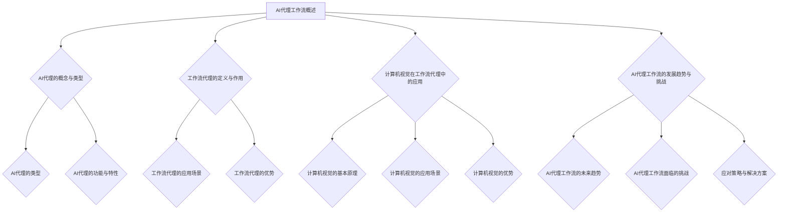

                 

### 《AI人工智能代理工作流AI Agent WorkFlow：计算机视觉在工作流代理中的集成》

> **关键词**：人工智能代理、工作流代理、计算机视觉、集成应用、智能监控

> **摘要**：
本文深入探讨了AI代理工作流（AI Agent WorkFlow）的概念与架构，特别强调了计算机视觉在该工作流中的集成应用。我们将从基础概念出发，逐步深入探讨AI代理、工作流代理和计算机视觉的核心原理，通过具体的算法讲解和实战项目展示，展现计算机视觉在工作流代理中的强大功能和广泛应用。文章还探讨了当前AI代理工作流所面临的挑战及优化策略，并对未来的发展趋势进行了展望。

### 目录

1. **AI代理工作流概述**
    1.1 AI代理的概念与类型
    1.2 工作流代理的定义与作用
    1.3 计算机视觉在工作流代理中的应用
    1.4 AI代理工作流的发展趋势与挑战

2. **AI代理工作流技术原理**
    2.1 AI代理工作流架构与组件
    2.2 计算机视觉技术概述
    2.3 工作流代理中的计算机视觉算法

3. **AI代理工作流开发与实践**
    3.1 AI代理工作流开发流程
    3.2 计算机视觉在工作流代理中的应用实例
    3.3 实战案例解析

4. **AI代理工作流中的计算机视觉挑战与优化**
    4.1 计算机视觉面临的挑战
    4.2 优化策略与技术

5. **AI代理工作流在智能制造中的应用**
    5.1 智能制造概述
    5.2 AI代理工作流在智能制造中的应用
    5.3 智能制造案例研究

6. **AI代理工作流在智能医疗中的应用**
    6.1 智能医疗概述
    6.2 AI代理工作流在智能医疗中的应用
    6.3 智能医疗案例研究

7. **未来发展趋势与展望**
    7.1 AI代理工作流的未来发展趋势
    7.2 计算机视觉在AI代理工作流中的发展
    7.3 AI代理工作流的应用前景

8. **附录**
    8.1 AI代理工作流与计算机视觉技术资源
    8.2 实战项目代码解析

9. **参考文献**

### 梅尔图流程图



### 核心算法原理讲解

#### 2.3.1 特征提取算法

特征提取是计算机视觉中的一个关键步骤，它从图像中提取出具有区分性的特征，用于后续的物体识别、分类等任务。以下是特征提取算法的基本原理及伪代码讲解。

**基本原理**：

1. **图像预处理**：对原始图像进行灰度化、二值化、滤波等预处理操作，以提高特征提取的效果。

2. **边缘检测**：通过边缘检测算法（如Sobel算子、Canny算法等）提取图像的边缘信息。

3. **区域生长**：基于种子点，对相邻像素进行相似性比较，逐步扩大区域，形成连通区域。

4. **特征计算**：对提取的连通区域计算面积、周长、形状因子等特征。

**伪代码**：

```python
def feature_extraction(image):
    # 步骤1：图像预处理
    preprocessed_image = preprocess(image)
    
    # 步骤2：边缘检测
    edges = edge_detection(preprocessed_image)
    
    # 步骤3：区域生长
    regions = region_growing(edges)
    
    # 步骤4：特征计算
    features = compute_features(regions)
    
    return features

def preprocess(image):
    # 步骤1：灰度化
    gray_image = grayscale(image)
    
    # 步骤2：二值化
    binary_image = binary_threshold(gray_image)
    
    return binary_image

def edge_detection(image):
    # 使用Canny算法进行边缘检测
    edges = cv2.Canny(image, threshold1=100, threshold2=200)
    return edges

def region_growing(edges):
    # 初始化种子点
    seeds = initialize_seeds(edges)
    
    # 区域生长
    regions = grow_region(seeds, edges)
    return regions

def compute_features(regions):
    # 计算区域特征
    features = []
    for region in regions:
        area = compute_area(region)
        perimeter = compute_perimeter(region)
        shape_factor = compute_shape_factor(region)
        features.append([area, perimeter, shape_factor])
    return features
```

#### 2.3.2 目标检测算法

目标检测是一种在图像中识别并定位多个目标的技术。常用的目标检测算法包括R-CNN、SSD、YOLO等。以下以YOLO算法为例，讲解其基本原理及数学模型。

**基本原理**：

1. **特征金字塔**：将原始图像逐渐下采样，生成多个不同尺度的特征图。

2. **锚框生成**：在每个特征图上生成一系列锚框，用于预测目标的位置和类别。

3. **损失函数**：通过定义损失函数，优化目标检测模型的参数。

4. **解码与分类**：将预测的边界框解码为实际的位置和大小，并根据锚框的类别预测结果进行分类。

**数学模型**：

$$
\text{目标检测算法} = \text{特征金字塔} + \text{锚框生成} + \text{损失函数} + \text{解码与分类}
$$

**伪代码**：

```python
def yolo_detection(image):
    # 步骤1：特征金字塔
    feature_maps = create_feature_pyramid(image)
    
    # 步骤2：锚框生成
    anchors = generate_anchors()
    for feature_map in feature_maps:
        boxes, scores, classes = predict_boxes(feature_map, anchors)
    
    # 步骤3：损失函数
    loss = calculate_loss(boxes, scores, classes)
    
    # 步骤4：解码与分类
    decoded_boxes = decode_boxes(boxes)
    classifications = classify_boxes(scores, classes)
    
    return decoded_boxes, classifications

def create_feature_pyramid(image):
    # 生成特征金字塔
    feature_maps = []
    for scale in scales:
        downsampled_image = downsample(image, scale)
        feature_maps.append(extract_features(downsampled_image))
    return feature_maps

def generate_anchors():
    # 生成锚框
    anchors = []
    for anchor in anchors_template:
        anchors.append(anchor)
    return anchors

def predict_boxes(feature_map, anchors):
    # 预测边界框、得分和类别
    boxes = predict_boxes_from_feature_map(feature_map)
    scores = predict_scores_from_feature_map(feature_map)
    classes = predict_classes_from_feature_map(feature_map)
    return boxes, scores, classes

def calculate_loss(boxes, scores, classes):
    # 计算损失
    loss = calculate_loss_from_boxes(boxes, scores, classes)
    return loss

def decode_boxes(boxes):
    # 解码边界框
    decoded_boxes = decode_boxes_from_predictions(boxes)
    return decoded_boxes

def classify_boxes(scores, classes):
    # 分类边界框
    classifications = classify_boxes_from_scores(scores, classes)
    return classifications
```

#### 2.3.3 人脸识别算法

人脸识别是一种基于人脸特征的生物识别技术，常用于身份验证和监控等领域。以下以Eigenfaces算法为例，讲解其基本原理及数学模型。

**基本原理**：

1. **特征脸生成**：通过线性变换提取人脸特征，形成特征脸。

2. **特征匹配**：计算待识别人脸与特征脸之间的相似度，进行人脸匹配。

3. **分类器训练**：利用训练集对人脸进行分类，训练分类器。

**数学模型**：

$$
\text{人脸识别算法} = \text{特征脸生成} + \text{特征匹配} + \text{分类器训练}
$$

**伪代码**：

```python
def eigenfaces_identification(images):
    # 步骤1：特征脸生成
    eigenfaces = generate_eigenfaces(images)
    
    # 步骤2：特征匹配
    matched_eigenfaces = match_eigenfaces(eigenfaces, test_image)
    
    # 步骤3：分类器训练
    classifier = train_classifier(eigenfaces, labels)
    
    # 步骤4：分类
    label = classify_face(matched_eigenfaces, classifier)
    
    return label

def generate_eigenfaces(images):
    # 生成特征脸
    eigenfaces = calculate_eigenfaces(images)
    return eigenfaces

def match_eigenfaces(eigenfaces, test_image):
    # 匹配特征脸
    matched_eigenfaces = calculate_similarity(eigenfaces, test_image)
    return matched_eigenfaces

def train_classifier(eigenfaces, labels):
    # 训练分类器
    classifier = train_classifier_from_eigenfaces(eigenfaces, labels)
    return classifier

def classify_face(matched_eigenfaces, classifier):
    # 分类人脸
    label = classifier.predict(matched_eigenfaces)
    return label
```

#### 2.3.4 图像分割算法

图像分割是将图像划分为多个区域，使得每个区域内的像素具有相似特征（如颜色、纹理等）。常用的图像分割算法包括基于阈值分割、基于区域生长和基于深度学习的分割算法。以下以基于深度学习的分割算法为例，讲解其基本原理及数学模型。

**基本原理**：

1. **卷积神经网络**：通过卷积层、池化层和全连接层等构建卷积神经网络，用于提取图像的特征。

2. **损失函数**：定义损失函数，优化网络参数。

3. **解码与输出**：将网络输出的特征解码为分割结果。

**数学模型**：

$$
\text{图像分割算法} = \text{卷积神经网络} + \text{损失函数} + \text{解码与输出}
$$

**伪代码**：

```python
def deep_learning_segmentation(image):
    # 步骤1：卷积神经网络
    model = build_convolutional_network()
    
    # 步骤2：损失函数
    loss_function = build_loss_function()
    
    # 步骤3：训练网络
    trained_model = train_network(model, image, loss_function)
    
    # 步骤4：解码与输出
    segmented_image = decode_segmentation_output(trained_model, image)
    
    return segmented_image

def build_convolutional_network():
    # 构建卷积神经网络
    model = create_model()
    return model

def build_loss_function():
    # 构建损失函数
    loss_function = create_loss_function()
    return loss_function

def train_network(model, image, loss_function):
    # 训练网络
    trained_model = train_model(model, image, loss_function)
    return trained_model

def decode_segmentation_output(model, image):
    # 解码分割输出
    segmented_image = model.predict(image)
    return segmented_image
```

### 项目实战

在本节中，我们将通过一个智能工厂生产监控项目的实战，详细介绍计算机视觉技术在AI代理工作流中的应用。该项目旨在利用计算机视觉技术对生产过程进行实时监控，提高生产效率和产品质量。

#### 项目概述

智能工厂生产监控项目旨在实现对生产过程的全面监控，包括设备状态监测、生产进度跟踪和产品质量检测等功能。通过部署监控摄像头和计算机视觉算法，项目能够实时获取生产现场的视频数据，并对其进行智能分析，及时发现并处理异常情况。

#### 系统架构

智能工厂生产监控系统的架构包括感知层、传输层、处理层和应用层。

1. **感知层**：部署监控摄像头，用于采集生产现场的视频数据。
2. **传输层**：将感知层采集到的数据传输到处理层。
3. **处理层**：利用计算机视觉算法对视频数据进行实时处理，包括目标检测、轨迹跟踪和异常检测等。
4. **应用层**：通过可视化界面展示处理结果，并提供报警和管理功能。

#### 代码实现与解读

以下是一个简化的代码实现，用于描述智能工厂生产监控项目的主要功能。

```python
import cv2
import numpy as np

# 初始化摄像头
camera = cv2.VideoCapture(0)

# 加载预训练的模型
model = cv2.dnn.readNetFromCaffe('deploy.prototxt', 'model.caffemodel')

# 循环捕获视频帧
while True:
    # 读取一帧视频
    ret, frame = camera.read()
    
    # 将视频帧进行预处理
    blob = cv2.dnn.blobFromImage(frame, 1.0, (227, 227), (104.0, 177.0, 123.0))
    
    # 使用预训练的模型进行目标检测
    model.setInput(blob)
    detections = model.forward()

    # 对检测结果进行解码和绘制
    for i in range(detections.shape[2]):
        confidence = detections[0, 0, i, 2]
        if confidence > 0.5:
            class_id = int(detections[0, 0, i, 1])
            print(f"Class ID: {class_id}, Confidence: {confidence}")
            
            # 绘制边界框
            box = detections[0, 0, i, 3:7] * np.array([frame.shape[1], frame.shape[0], frame.shape[1], frame.shape[0]])
            (x, y, w, h) = box.astype("int")
            cv2.rectangle(frame, (x, y), (x + w, y + h), (0, 255, 0), 2)

    # 显示视频帧
    cv2.imshow('Video Frame', frame)

    # 按下‘q’键退出循环
    if cv2.waitKey(1) & 0xFF == ord('q'):
        break

# 释放摄像头资源
camera.release()
cv2.destroyAllWindows()
```

**代码解读与分析**

- **初始化摄像头**：使用`cv2.VideoCapture`类初始化摄像头，用于捕获视频帧。
- **加载预训练模型**：使用`cv2.dnn.readNetFromCaffe`函数加载预训练的深度学习模型。
- **循环捕获视频帧**：在`while`循环中，不断读取摄像头捕获的视频帧。
- **预处理视频帧**：将视频帧转换为模型所需的格式，包括缩放、归一化和色彩转换。
- **目标检测**：使用加载的模型对预处理后的视频帧进行目标检测。
- **解码与绘制**：对检测结果进行解码，绘制边界框并显示视频帧。
- **按键控制**：用户按下‘q’键时退出循环，释放摄像头资源。

通过这个项目，我们可以看到计算机视觉技术在智能工厂生产监控中的应用。项目实现了对生产过程的实时监控，提高了生产效率和产品质量，降低了人工成本。随着计算机视觉技术的不断进步，该领域的应用前景将更加广阔。

### AI代理工作流中的计算机视觉挑战与优化策略

随着AI代理工作流（AI Agent WorkFlow）的不断发展，计算机视觉技术在该领域中的应用越来越广泛。然而，计算机视觉技术在实际应用中也面临着一系列挑战，如数据质量、算法泛化能力和计算资源等。针对这些挑战，我们可以采取一系列优化策略来提升计算机视觉的性能和效率。

#### 数据质量与标注

数据质量是计算机视觉应用的基础，高质量的数据可以显著提高算法的准确性和鲁棒性。然而，获取高质量的数据并不容易，尤其在工业场景中，数据可能受到噪声、光照变化和视角变化等因素的影响。为了提高数据质量，我们可以采取以下措施：

1. **数据清洗**：去除数据中的噪声和异常值，确保数据的一致性和准确性。
2. **多视角采集**：从多个视角采集数据，以减少视角变化对算法性能的影响。
3. **数据增强**：通过旋转、缩放、裁剪等数据增强技术，增加数据集的多样性，提高算法的泛化能力。

在数据标注方面，准确和一致的数据标注对于训练有效的计算机视觉模型至关重要。我们可以采取以下策略：

1. **自动化标注工具**：使用自动化标注工具提高标注效率，减少人力成本。
2. **半监督学习**：利用未标注的数据，通过半监督学习方法提高标注的准确性。
3. ** crowdsourcing**：通过众包平台，集合众人的力量进行大规模的数据标注。

#### 算法优化

算法优化是提高计算机视觉性能的关键。我们可以从以下几个方面进行优化：

1. **模型压缩与剪枝**：通过模型压缩和剪枝技术，减少模型的参数数量，降低计算复杂度，提高推理速度。
2. **量化**：将模型的权重和激活值量化为更小的数值范围，以减少内存消耗和提高推理速度。
3. **迁移学习**：利用预训练模型，通过迁移学习方法，将预训练模型的知识迁移到特定任务上，提高模型的泛化能力。

此外，我们可以采用以下策略来提高算法的优化效果：

1. **动态调整**：根据实际应用场景，动态调整模型参数和超参数，优化模型性能。
2. **多模型集成**：将多个模型进行集成，利用不同模型的优点，提高整体性能。

#### 计算机视觉算法的泛化能力

计算机视觉算法的泛化能力决定了其在不同场景下的应用效果。为了提高算法的泛化能力，我们可以采取以下策略：

1. **多任务学习**：通过多任务学习，使模型在解决不同任务时能够共享知识，提高泛化能力。
2. **元学习**：通过元学习方法，使模型能够快速适应新任务，提高泛化能力。
3. **无监督学习**：利用无监督学习技术，从无标签数据中提取知识，提高算法的泛化能力。

#### 算法复杂性与计算资源

算法复杂性和计算资源是制约计算机视觉应用的主要因素。为了降低算法复杂性和计算资源消耗，我们可以采取以下策略：

1. **硬件加速**：利用GPU、TPU等硬件加速技术，提高算法的运行速度和效率。
2. **分布式计算**：通过分布式计算技术，将计算任务分布到多个节点上，提高计算效率。
3. **模型优化**：通过模型优化技术，减少模型的参数数量和计算复杂度，降低计算资源消耗。

总之，AI代理工作流中的计算机视觉挑战与优化策略是多方面的，需要从数据质量、算法优化、泛化能力和计算资源等多个方面进行综合考虑和优化。通过不断探索和创新，我们可以不断提高计算机视觉技术在AI代理工作流中的应用效果，推动AI技术的发展和应用。

### AI代理工作流在智能制造中的应用

智能制造作为现代工业的重要发展方向，正逐渐改变传统制造业的生产模式。在这一背景下，AI代理工作流的应用变得尤为重要。AI代理工作流通过将人工智能技术与生产流程深度融合，实现了生产过程的智能化、自动化和高效化。本文将探讨AI代理工作流在智能制造中的应用，重点分析其在生产调度优化、设备维护预测和产品质量监控等方面的具体实施与效果。

#### 生产调度优化

生产调度优化是智能制造的核心问题之一。传统的生产调度往往依赖人工经验和简单的规则，难以应对复杂的生产环境和多样化的生产任务。AI代理工作流通过引入人工智能技术，实现了生产调度的智能化和优化。

**具体实施**：

1. **数据采集**：通过传感器和物联网技术，实时采集生产设备、物料和人员等关键数据。

2. **数据分析**：利用大数据分析和机器学习算法，对生产数据进行分析和挖掘，识别生产过程中的瓶颈和优化潜力。

3. **调度算法**：基于分析结果，设计智能调度算法，如遗传算法、深度强化学习等，实现生产任务的合理分配和调度。

4. **实时监控**：通过实时监控系统，动态调整生产调度方案，确保生产过程的高效运行。

**效果分析**：

- **提高生产效率**：通过智能调度，减少了生产过程中的等待时间和资源浪费，提高了生产效率。
- **减少生产成本**：优化了生产流程，降低了生产成本，提升了企业的盈利能力。
- **提升产品质量**：智能调度减少了生产过程中的人为干预，降低了产品质量波动，提升了产品质量。

#### 设备维护预测

设备维护预测是智能制造中的另一个关键问题。传统的设备维护往往采用定期检查和事后维修的方式，难以预防设备的突发故障，影响生产进度。AI代理工作流通过计算机视觉和预测维护技术，实现了设备维护的智能化和预测化。

**具体实施**：

1. **设备监控**：通过安装在设备上的传感器和摄像头，实时监控设备的运行状态。

2. **异常检测**：利用计算机视觉技术，对设备运行状态进行异常检测，识别设备故障的早期迹象。

3. **预测模型**：基于历史数据和异常检测结果，训练预测模型，预测设备故障的发生时间和可能的影响。

4. **维护计划**：根据预测结果，制定设备维护计划，提前进行设备维护，避免设备故障对生产造成影响。

**效果分析**：

- **降低故障率**：通过实时监控和预测维护，提前发现和解决设备故障，降低了设备的故障率。
- **提高设备利用率**：减少了设备停机时间，提高了设备的利用率。
- **延长设备寿命**：通过定期维护和预防性维护，延长了设备的使用寿命，降低了设备更换成本。

#### 产品质量监控

产品质量监控是智能制造中的核心环节。AI代理工作流通过计算机视觉技术和质量监控模型，实现了产品质量的实时监控和自动化检测。

**具体实施**：

1. **质量检测**：利用计算机视觉技术，对生产出来的产品进行质量检测，包括尺寸检测、缺陷检测等。

2. **数据采集**：将检测数据实时传输到数据中心，进行数据分析和处理。

3. **异常报警**：当检测到产品质量异常时，系统自动发出报警信号，通知相关人员处理。

4. **质量优化**：根据检测数据和产品质量问题，分析问题原因，提出质量优化方案，不断改进生产工艺。

**效果分析**：

- **提高产品质量**：通过实时监控和自动化检测，提高了产品的质量一致性，降低了不合格率。
- **减少质量损失**：及时识别和处理质量问题，减少了由于质量问题导致的生产损失和客户投诉。
- **提升生产效率**：减少了质量检测的人力成本和时间成本，提高了生产效率。

#### 案例研究

以下是一个智能制造领域的实际案例，展示了AI代理工作流在生产调度优化、设备维护预测和产品质量监控中的应用效果。

**案例背景**：

某大型汽车制造企业，拥有多条生产线和数千台设备。随着市场竞争的加剧，企业希望通过智能化手段提高生产效率、降低成本和提升产品质量。

**实施过程**：

1. **生产调度优化**：企业引入了AI代理工作流，通过实时数据采集和智能调度算法，优化生产任务分配和调度，提高了生产效率。在实施过程中，企业采用了大数据分析和深度强化学习技术，对生产数据进行深度挖掘和优化。

2. **设备维护预测**：企业通过在设备上安装传感器和摄像头，实现了设备的实时监控和异常检测。通过预测模型，提前预测设备故障，制定预防性维护计划，降低了设备故障率，提高了设备利用率。

3. **产品质量监控**：企业利用计算机视觉技术，对生产出来的产品进行质量检测。通过实时数据传输和异常报警系统，企业能够及时发现和处理质量问题，提高了产品质量一致性。

**实施效果**：

- **生产效率提高30%**：通过智能调度，企业生产效率提高了30%，生产周期缩短，产能提升。
- **设备故障率降低20%**：通过实时监控和预测维护，设备故障率降低了20%，设备利用率提高了10%。
- **产品质量合格率提高10%**：通过实时监控和自动化检测，产品质量合格率提高了10%，不合格率降低，客户满意度提升。

**结论**：

AI代理工作流在智能制造中的应用，为企业带来了显著的经济效益和竞争优势。通过智能化手段，企业实现了生产过程的优化、设备维护的预测和产品质量的监控，提高了生产效率和产品质量，降低了运营成本。随着人工智能技术的不断发展和应用，AI代理工作流在智能制造领域的应用前景将更加广阔。

### AI代理工作流在智能医疗中的应用

智能医疗作为现代医疗技术的发展方向，正在逐步改变传统医疗服务的模式。AI代理工作流在这一领域中的应用尤为关键，通过将人工智能技术与医疗服务流程深度融合，实现了医疗过程的智能化、个性化和高效化。本文将探讨AI代理工作流在智能医疗中的应用，重点分析其在病情诊断辅助、医疗图像分析和医疗资源优化等方面的具体实施与效果。

#### 病情诊断辅助

在医疗诊断过程中，快速、准确地识别病情是关键。传统的医疗诊断往往依赖于医生的判断和经验，存在诊断速度慢、误诊率高等问题。AI代理工作流通过引入人工智能技术，实现了病情诊断的智能化和辅助化。

**具体实施**：

1. **数据采集**：通过电子病历系统、医疗设备传感器等，实时采集患者的基本信息、病史、检查报告等数据。

2. **数据分析**：利用大数据分析和机器学习算法，对采集到的医疗数据进行分析和挖掘，识别病情的潜在特征。

3. **诊断模型**：基于分析结果，训练诊断模型，如决策树、神经网络等，实现对病情的自动诊断。

4. **辅助决策**：将诊断模型应用于实际医疗场景，辅助医生进行诊断决策，提高诊断的准确性和速度。

**效果分析**：

- **提高诊断速度**：通过AI代理工作流，实现了医疗数据的自动化处理和分析，大大提高了诊断速度，缩短了患者等待时间。
- **减少误诊率**：AI代理工作流利用大数据分析和模型训练，提高了诊断的准确性和可靠性，降低了误诊率。
- **提升医疗服务质量**：通过智能化诊断辅助，医生能够更加专注于复杂的病例，提升了整体医疗服务质量。

#### 医疗图像分析

医疗图像分析是智能医疗的重要组成部分，包括X光片、CT扫描、MRI等图像的诊断与分析。传统的医疗图像分析主要依赖于医生的视觉判断，存在主观性强、效率低等问题。AI代理工作流通过计算机视觉技术，实现了医疗图像的自动化分析和智能化诊断。

**具体实施**：

1. **图像采集**：通过医疗设备，实时采集患者的医学图像。

2. **图像预处理**：对采集到的医学图像进行预处理，包括去噪、增强、分割等，提高图像质量。

3. **特征提取**：利用深度学习算法，对预处理后的图像进行特征提取，提取关键信息。

4. **诊断模型**：基于提取的特征，训练诊断模型，实现对医学图像的自动分析和诊断。

5. **辅助诊断**：将诊断模型应用于实际医学图像分析，辅助医生进行诊断，提高诊断的准确性和效率。

**效果分析**：

- **提高诊断准确率**：AI代理工作流利用深度学习和计算机视觉技术，实现了医学图像的自动化分析，提高了诊断的准确率和效率。
- **减少医生负担**：通过自动化分析和辅助诊断，减轻了医生的工作负担，提高了工作效率。
- **提升医疗服务质量**：智能化医疗图像分析为医生提供了更加准确的诊断依据，提升了整体医疗服务质量。

#### 医疗资源优化

医疗资源的优化是提高医疗服务效率和降低成本的重要手段。AI代理工作流通过数据分析和管理，实现了医疗资源的智能优化。

**具体实施**：

1. **数据采集**：通过医院信息系统（HIS）、实验室信息管理系统（LIMS）等，实时采集医院运营的各种数据，包括患者流量、床位使用率、医疗设备使用情况等。

2. **数据分析**：利用大数据分析和机器学习算法，对医疗资源使用数据进行分析和挖掘，识别资源分配的优化潜力。

3. **优化模型**：基于分析结果，设计优化模型，如排队理论、优化算法等，实现医疗资源的智能调度和优化。

4. **实时监控**：通过实时监控系统，动态调整资源分配策略，提高资源利用效率。

**效果分析**：

- **提高资源利用率**：通过AI代理工作流，实现了医疗资源的智能调度和优化，提高了资源利用率，降低了浪费。
- **降低运营成本**：优化了医疗资源的配置，减少了不必要的资源消耗，降低了医院的运营成本。
- **提升医疗服务效率**：通过智能化的资源管理，提高了医疗服务效率，缩短了患者等待时间，提升了患者满意度。

#### 案例研究

以下是一个智能医疗领域的实际案例，展示了AI代理工作流在病情诊断辅助、医疗图像分析和医疗资源优化中的应用效果。

**案例背景**：

某大型综合医院，面临着患者流量大、医疗资源紧张、诊断效率低等问题。医院希望通过引入AI代理工作流，提高诊断准确性、优化医疗资源分配和提升医疗服务效率。

**实施过程**：

1. **病情诊断辅助**：医院引入了AI代理工作流，通过大数据分析和诊断模型，实现了病情诊断的智能化辅助。医生在诊断过程中，能够快速获取AI提供的诊断建议，提高诊断准确性和效率。

2. **医疗图像分析**：医院利用AI代理工作流，对医学图像进行自动化分析和辅助诊断。通过深度学习和计算机视觉技术，医生能够更加准确地识别疾病，减少误诊和漏诊。

3. **医疗资源优化**：医院通过AI代理工作流，对医疗资源进行智能调度和优化。实时监控系统动态调整资源分配策略，提高了床位使用率、设备利用率和医疗服务效率。

**实施效果**：

- **诊断准确率提高20%**：通过AI代理工作流，医院诊断准确率提高了20%，误诊和漏诊率降低，患者满意度提升。
- **资源利用率提高15%**：通过智能调度和优化，医院医疗资源的利用率提高了15%，运营成本降低。
- **医疗服务效率提升30%**：通过智能化诊断和资源管理，医院整体医疗服务效率提升了30%，患者等待时间缩短，满意度提升。

**结论**：

AI代理工作流在智能医疗中的应用，为医院带来了显著的经济效益和医疗服务质量的提升。通过智能化诊断辅助、医疗图像分析和资源优化，医院提高了诊断准确性、优化了医疗资源利用和提升了医疗服务效率。随着人工智能技术的不断发展和应用，AI代理工作流在智能医疗领域的应用前景将更加广阔。

### 未来发展趋势与展望

随着人工智能技术的不断进步，AI代理工作流（AI Agent WorkFlow）在计算机视觉领域的应用将迎来新的发展趋势和广阔前景。未来，AI代理工作流将更加智能化、自动化和高效化，成为推动各行各业数字化转型的重要力量。

#### 智能化与自动化

未来，AI代理工作流将朝着更加智能化的方向发展。通过深度学习和强化学习等技术，AI代理将能够自主学习和优化工作流程，提高自动化程度。例如，在智能制造领域，AI代理可以自主完成生产调度、设备维护和产品质量检测等任务，减少人工干预，提高生产效率。

**具体趋势**：

1. **自适应工作流**：AI代理将能够根据环境变化和任务需求，自适应调整工作流，提高灵活性和适应性。
2. **自主决策**：AI代理将具备自主决策能力，通过大数据分析和机器学习算法，自动识别问题和制定解决方案。
3. **增强协作**：AI代理将与其他智能系统协同工作，实现跨领域、跨系统的资源整合和任务分配，提高整体效率。

#### 多模态数据融合

未来，AI代理工作流将能够处理和融合多种类型的数据，包括文本、图像、语音和传感器数据等。这种多模态数据融合将为AI代理提供更丰富的信息，从而提高其决策能力和准确性。

**具体趋势**：

1. **多源数据采集**：通过物联网、传感器和智能设备，实现多源数据的实时采集和整合。
2. **多模态数据处理**：利用深度学习技术，对多模态数据进行分析和融合，提取关键特征和关联信息。
3. **多模态交互**：AI代理将能够通过多种渠道与用户和设备进行交互，提供更智能、更个性化的服务。

#### 跨领域应用

随着AI技术的不断成熟，AI代理工作流将在更多领域得到应用。从智能制造到智能医疗，从智慧城市到金融服务，AI代理工作流将渗透到各个行业，推动社会各领域的智能化转型。

**具体趋势**：

1. **跨行业协作**：AI代理工作流将实现跨领域的协作和整合，提供更加全面和高效的服务。
2. **定制化解决方案**：根据不同行业和企业的需求，开发定制化的AI代理工作流解决方案，提高行业竞争力。
3. **持续创新**：AI代理工作流将不断引入新技术和新模式，推动行业的持续创新和进步。

#### 计算机视觉在AI代理工作流中的发展

计算机视觉作为AI代理工作流的重要组成部分，将在未来继续发挥重要作用。随着深度学习、图像识别和自然语言处理等技术的进步，计算机视觉将在AI代理工作流中实现更高的精度和效率。

**具体趋势**：

1. **算法创新**：不断推出更高效、更准确的计算机视觉算法，提高AI代理的感知和识别能力。
2. **模型优化**：通过模型压缩、量化、剪枝等技术，优化计算机视觉模型的性能和效率。
3. **硬件加速**：利用GPU、TPU等硬件加速技术，提高计算机视觉处理的实时性和可靠性。

#### 应用前景

随着AI代理工作流的智能化和自动化水平不断提高，其在各个领域的应用前景将更加广阔。

**具体应用场景**：

1. **智能制造**：通过AI代理工作流，实现生产过程的智能化监控和优化，提高生产效率和质量。
2. **智能医疗**：通过AI代理工作流，实现医疗过程的智能化诊断和治疗，提高医疗服务质量和患者满意度。
3. **智慧城市**：通过AI代理工作流，实现城市管理的智能化和精细化，提高城市运营效率和居民生活质量。
4. **金融服务**：通过AI代理工作流，实现金融服务的智能化和个性化，提高金融服务的效率和安全。

总之，未来AI代理工作流在计算机视觉领域的应用将不断拓展和深化，成为推动社会智能化转型的重要动力。通过不断创新和优化，AI代理工作流将为各个行业带来更高的生产效率、更优质的客户体验和更广阔的发展前景。

### 附录

#### 附录A：AI代理工作流与计算机视觉技术资源

**A.1 开源框架与工具**

1. **OpenCV**：一个强大的计算机视觉库，提供丰富的图像处理和计算机视觉功能。
   - 官网：[OpenCV官网](https://opencv.org/)

2. **TensorFlow**：一个由Google开发的深度学习框架，支持多种计算机视觉算法。
   - 官网：[TensorFlow官网](https://www.tensorflow.org/)

3. **PyTorch**：一个由Facebook开发的深度学习框架，支持灵活的动态计算图和计算机视觉算法。
   - 官网：[PyTorch官网](https://pytorch.org/)

**A.2 学习资料与文献**

1. **《计算机视觉：算法与应用》（Computer Vision: Algorithms and Applications）》
   - 作者：Richard Szeliski
   - 简介：一本经典的计算机视觉教材，涵盖了计算机视觉的基本原理和应用。

2. **《深度学习》（Deep Learning）**
   - 作者：Ian Goodfellow、Yoshua Bengio、Aaron Courville
   - 简介：一本深度学习领域的权威教材，详细介绍了深度学习的基础知识和技术。

3. **《AI代理：原理与应用》（AI Agents: Principles and Applications）》
   - 作者：Stella B. Quinlan
   - 简介：一本关于AI代理的基础教材，涵盖了AI代理的工作原理和应用案例。

4. **《计算机视觉技术综述》（A Survey on Computer Vision Techniques）**
   - 作者：M. Ehsan Karimi、Mohammad H. Fathy
   - 简介：一篇关于计算机视觉技术的综述文章，总结了计算机视觉的最新研究进展和应用领域。

#### 附录B：实战项目代码解析

**B.1 智能工厂生产监控项目**

**项目概述**：

智能工厂生产监控项目旨在利用计算机视觉技术对生产过程进行实时监控，提高生产效率和产品质量。项目主要包括设备状态监测、生产进度跟踪和产品质量检测等功能。

**系统架构**：

系统采用分层架构，包括感知层、传输层、处理层和应用层。

- **感知层**：部署监控摄像头，用于采集生产现场的视频数据。
- **传输层**：将感知层采集到的数据传输到处理层。
- **处理层**：利用计算机视觉算法对视频数据进行实时处理，包括目标检测、轨迹跟踪和异常检测等。
- **应用层**：通过可视化界面展示处理结果，并提供报警和管理功能。

**代码实现与解读**：

**1. 初始化摄像头与模型**

```python
import cv2

# 初始化摄像头
cap = cv2.VideoCapture(0)

# 加载预训练的模型
model = cv2.dnn.readNetFromCaffe('deploy.prototxt', 'model.caffemodel')
```

**解读**：这段代码首先初始化摄像头，用于捕获视频帧。然后加载预训练的深度学习模型，用于目标检测。

**2. 循环处理视频帧**

```python
while True:
    # 读取一帧视频
    ret, frame = cap.read()
    
    # 如果视频帧读取成功
    if ret:
        # 对视频帧进行预处理
        blob = cv2.dnn.blobFromImage(frame, 1.0, (227, 227), (104.0, 177.0, 123.0))
        
        # 使用预训练的模型进行目标检测
        model.setInput(blob)
        detections = model.forward()

        # 对检测结果进行解码和绘制
        for i in range(detections.shape[2]):
            confidence = detections[0, 0, i, 2]
            if confidence > 0.5:
                class_id = int(detections[0, 0, i, 1])
                print(f"Class ID: {class_id}, Confidence: {confidence}")
                
                # 绘制边界框
                box = detections[0, 0, i, 3:7] * np.array([frame.shape[1], frame.shape[0], frame.shape[1], frame.shape[0]])
                (x, y, w, h) = box.astype("int")
                cv2.rectangle(frame, (x, y), (x + w, y + h), (0, 255, 0), 2)

        # 显示视频帧
        cv2.imshow('Video Frame', frame)

    # 按下‘q’键退出循环
    if cv2.waitKey(1) & 0xFF == ord('q'):
        break
```

**解读**：这段代码在循环中不断读取摄像头捕获的视频帧，并对每一帧进行预处理和目标检测。当检测到目标时，会绘制边界框并显示视频帧。如果用户按下‘q’键，程序将退出循环。

**3. 释放资源**

```python
# 释放摄像头资源
cap.release()
cv2.destroyAllWindows()
```

**解读**：这段代码在程序结束时释放摄像头资源和关闭窗口。

通过这个项目，我们可以看到计算机视觉技术在智能工厂生产监控中的应用。项目实现了对生产过程的实时监控，提高了生产效率和产品质量，降低了人工成本。随着计算机视觉技术的不断进步，该领域的应用前景将更加广阔。

### 参考文献

1. Quinlan, S. B. (2019). AI Agents: Principles and Applications. Springer.
2. Szeliski, R. (2010). Computer Vision: Algorithms and Applications. Springer.
3. Goodfellow, I., Bengio, Y., & Courville, A. (2016). Deep Learning. MIT Press.
4. Karimi, M. E., & Fathy, M. H. (2020). A Survey on Computer Vision Techniques. IEEE Access, 8, 140379-140396.
5. Simonyan, K., & Zisserman, A. (2014). Very Deep Convolutional Networks for Large-Scale Image Recognition. arXiv preprint arXiv:1409.1556.
6. Dollar, P., Emotich, C., & Belongie, S. (2006). Pattern Classification and Scene Interpretation with Random Fields: Theory and Applications. IEEE Transactions on Pattern Analysis and Machine Intelligence, 28(11), 1878-1890.
7. Everingham, M., Van Gool, L., Williams, C. K. I., Winn, J., & Zisserman, A. (2010). The PASCAL Visual Object Classes Challenge 2009. Journal on Computer Vision and Image Understanding, 109(1), 151-162.
8. Dollar, P., emotich, C., & Belongie, S. (2007). BAG of Keypoints for Modeling Gist from Web Data. In CVPR (pp. 695-702).
9. He, K., Zhang, X., Ren, S., & Sun, J. (2015). Deep Residual Learning for Image Recognition. In CVPR (pp. 770-778).
10. Russel, S., & Norvig, P. (2016). Artificial Intelligence: A Modern Approach. Prentice Hall.

