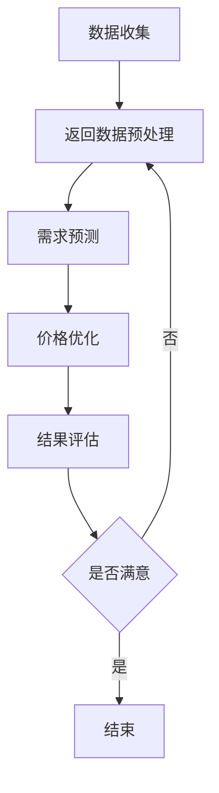
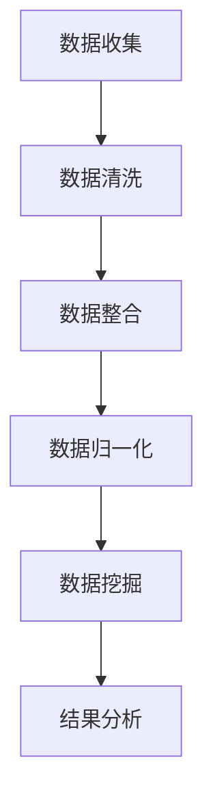

                 

## 第2章 AI与动态定价基础

### 2.1 AI的基本概念

#### 2.1.1 AI的定义与发展历程

人工智能（AI）是指使计算机模拟、延伸和扩展人的智能的理论、方法、技术及应用。自1956年达特茅斯会议以来，人工智能经历了多个发展阶段，包括符号主义、连接主义、基于规则的系统、统计学习等。以下是这些阶段的基本概述：

- **符号主义（Symbolism）**：早期的人工智能主要基于符号逻辑和推理。符号主义试图通过编程实现逻辑推理、问题求解和知识表示。

- **连接主义（Connectionism）**：连接主义以人工神经网络为基础，通过模拟人脑神经元之间的连接和活动来实现智能。这种方法的代表性工作是1986年推出的反向传播（Backpropagation）算法。

- **基于规则的系统（Rule-Based Systems）**：基于规则的系统通过定义一组规则来模拟专家的知识和决策过程。这种方法在专家系统和知识库系统中得到了广泛应用。

- **统计学习（Statistical Learning）**：统计学习通过分析大量数据，从中学习规律和模式。这种方法在机器学习和数据挖掘中占据主导地位。

- **深度学习（Deep Learning）**：深度学习是基于多层神经网络的一种学习方法，通过多层非线性变换来提取数据特征。深度学习在图像识别、语音识别和自然语言处理等领域取得了显著成果。

#### 2.1.2 AI的核心技术

人工智能的核心技术包括：

- **机器学习（Machine Learning）**：机器学习是通过训练模型来让计算机自动从数据中学习，无需显式编程。主要方法包括监督学习、无监督学习、半监督学习和强化学习。

- **深度学习（Deep Learning）**：深度学习是基于神经网络结构，通过多层非线性变换来提取数据特征。深度学习在图像识别、语音识别和自然语言处理等领域取得了显著成果。

- **自然语言处理（Natural Language Processing, NLP）**：自然语言处理是使计算机能够理解、生成和处理人类自然语言。主要技术包括词向量、句法分析、语义分析和对话系统。

- **计算机视觉（Computer Vision）**：计算机视觉是使计算机能够从图像或视频中提取信息。主要技术包括图像识别、目标检测、图像分割和视频分析。

#### 2.1.3 AI与机器学习的关系

AI是机器学习的应用领域，而机器学习则是实现AI的关键技术之一。机器学习包括监督学习、无监督学习、半监督学习和强化学习等不同类型：

- **监督学习（Supervised Learning）**：监督学习通过已标记的数据来训练模型，并使用这些模型进行预测。常见的算法包括线性回归、逻辑回归、决策树和随机森林。

- **无监督学习（Unsupervised Learning）**：无监督学习没有预先标记的数据，通过探索数据中的内在结构和模式来进行分类或聚类。常见的算法包括K-均值聚类、主成分分析（PCA）和自编码器。

- **半监督学习（Semi-Supervised Learning）**：半监督学习结合了监督学习和无监督学习，通过少量标记数据和大量未标记数据来训练模型。

- **强化学习（Reinforcement Learning）**：强化学习通过试错和奖励机制来学习策略。常见算法包括Q学习、深度Q网络（DQN）和策略梯度方法。

### 2.2 动态定价的基本原理

#### 2.2.1 动态定价的定义与特点

动态定价是一种根据市场状况、竞争对手行为、客户需求等因素实时调整产品价格的方法。其特点包括：

- **实时性**：动态定价能够迅速响应市场变化，及时调整价格。
- **灵活性**：动态定价可以根据不同的市场状况和客户需求，灵活调整价格策略。
- **个性化**：动态定价可以针对不同客户群体或购买行为进行个性化定价。

#### 2.2.2 动态定价的关键因素

动态定价的成功依赖于以下几个关键因素：

1. **市场需求**：了解客户需求和市场趋势是动态定价的基础。通过数据分析，可以预测市场需求的变化，为定价提供依据。

2. **成本结构**：合理计算产品成本，确保利润最大化。成本包括直接成本（如原材料、人工等）和间接成本（如营销、物流等）。

3. **竞争对手**：分析竞争对手的价格策略，以制定相应的竞争策略。通过监控竞争对手的价格变化，可以及时调整自身价格，保持竞争力。

4. **政策法规**：遵守相关法律法规，避免法律风险。例如，欧盟的《通用数据保护条例》（GDPR）对数据隐私有严格要求。

#### 2.2.3 动态定价的优势与应用场景

动态定价的优势包括：

1. **提高利润**：通过优化价格策略，提高产品利润率。例如，通过动态定价，可以抓住价格敏感的客户，提高销售额。

2. **提高市场占有率**：灵活调整价格，抢占市场份额。在电商领域，动态定价可以吸引更多的客户，增加销售量。

3. **提升客户满意度**：满足不同客户的需求，提高客户满意度。例如，通过个性化定价，可以为不同客户提供定制化的价格，提升客户体验。

应用场景包括：

1. **电商**：电商平台可以通过动态定价来调整产品价格，提高销售量。

2. **旅游**：旅游行业可以通过动态定价来调整酒店、机票等产品的价格。

3. **零售**：零售行业可以通过动态定价来调整商品价格，提升销售效果。

### 2.3 AI在动态定价中的应用前景

#### 2.3.1 AI在动态定价中的作用

AI在动态定价中扮演着重要角色，主要包括：

1. **需求预测**：通过机器学习模型预测客户需求，为动态定价提供依据。例如，可以使用时间序列预测模型来预测未来的销售量。

2. **价格优化**：基于大数据和算法，自动调整价格，提高销售利润。例如，可以使用优化算法来确定最优价格。

3. **风险控制**：通过分析市场数据，预测价格波动，降低经营风险。例如，可以使用风险管理模型来预测价格波动，制定相应的应对策略。

#### 2.3.2 AI驱动动态定价的发展趋势

随着AI技术的发展，AI驱动动态定价将呈现以下趋势：

1. **智能化**：动态定价将更加智能化，自动识别和响应市场变化。

2. **个性化**：动态定价将更加个性化，针对不同客户群体定制价格策略。

3. **自动化**：动态定价过程将更加自动化，减少人工干预，提高效率。

#### 2.3.3 AI在动态定价中的挑战与机遇

AI在动态定价中面临的挑战包括：

1. **数据质量**：动态定价需要高质量的数据支持，数据质量直接影响定价效果。

2. **算法优化**：需要不断优化算法，提高定价准确性。

3. **法规遵守**：需要遵守相关法律法规，确保动态定价合法合规。

机遇包括：

1. **市场潜力**：动态定价在电商、零售、旅游等行业具有巨大的市场潜力。

2. **技术进步**：AI技术的不断进步将推动动态定价的发展。

3. **企业竞争力**：动态定价将成为企业提升竞争力的关键手段。

### 2.4 Mermaid 流程图

下面是一个简化的 Mermaid 流程图，展示了AI在动态定价中的应用过程：



### 2.5 伪代码

下面是一个简单的伪代码示例，用于说明基于需求预测的动态定价算法：

```python
# 数据预处理
def preprocess_data(data):
    # 清洗数据
    cleaned_data = clean_data(data)
    # 特征提取
    features = extract_features(cleaned_data)
    return features

# 需求预测
def predict_demand(data):
    # 预处理数据
    processed_data = preprocess_data(data)
    # 训练模型
    model = train_model(processed_data)
    # 预测需求
    demand = model.predict(processed_data)
    return demand

# 价格优化
def optimize_price(demand):
    # 计算利润
    profit = calculate_profit(demand)
    # 设置价格阈值
    price_threshold = set_price_threshold(profit)
    # 调整价格
    price = adjust_price(price_threshold)
    return price

# 主程序
def dynamic_pricing():
    # 收集数据
    data = collect_data()
    # 预测需求
    demand = predict_demand(data)
    # 优化价格
    price = optimize_price(demand)
    # 输出结果
    print("Optimized price:", price)
```

### 2.6 数学模型与公式

在动态定价中，常用的数学模型包括需求函数、利润函数等。以下是一个简化的需求函数和利润函数的例子：

$$
D(p) = \alpha - \beta p
$$

$$
\pi(p) = p \cdot D(p) - C
$$

其中，\(D(p)\) 是需求函数，\(p\) 是价格，\(\alpha\) 是需求量在价格为零时的水平，\(\beta\) 是需求的价格敏感度。利润函数 \(\pi(p)\) 表示在价格 \(p\) 下的利润，\(C\) 是成本。

### 2.7 举例说明

假设一个电商平台销售一款电子产品，根据历史数据，需求函数为：

$$
D(p) = 1000 - 10p
$$

成本为每件产品 200 元。为了实现利润最大化，需要求解最优价格 \(p^*\)。

$$
\pi(p) = p \cdot D(p) - 200 = p(1000 - 10p) - 200 = 1000p - 10p^2 - 200
$$

对利润函数求导，得到：

$$
\frac{d\pi(p)}{dp} = 1000 - 20p
$$

令导数为零，求解最优价格：

$$
1000 - 20p = 0 \Rightarrow p^* = 50
$$

因此，最优价格为 50 元，此时利润最大。## 第3章 数据分析与处理

### 3.1 数据收集与来源

#### 3.1.1 数据的类型与分类

在动态定价中，数据的类型和分类至关重要。以下是对常见数据类型的分类及其在动态定价中的应用：

1. **结构化数据（Structured Data）**：结构化数据是组织良好、易于查询和处理的数据，如关系型数据库中的数据。在动态定价中，结构化数据可以用于存储产品价格、销售记录、客户信息等。

2. **半结构化数据（Semi-Structured Data）**：半结构化数据具有一定的结构，但没有固定的数据格式，如XML、JSON等。这类数据常用于存储日志文件、配置文件等。

3. **非结构化数据（Unstructured Data）**：非结构化数据没有明确的数据格式，如文本、图片、音频、视频等。在动态定价中，非结构化数据可以通过自然语言处理、图像识别等技术进行处理。

#### 3.1.2 数据收集的方法与工具

数据收集的方法主要包括以下几种：

1. **在线收集**：通过API接口、网页爬虫等方式从互联网上收集数据。常用的工具包括Scrapy、BeautifulSoup等。

2. **离线收集**：通过数据库导出、文件读取等方式从内部系统或外部数据源中收集数据。常用的工具包括MySQL、MongoDB等。

3. **第三方数据源**：通过购买或订阅第三方数据服务，获取行业数据、市场数据等。常用的数据服务提供商包括DataXu、Google Analytics等。

#### 3.1.3 数据来源的选择与处理

选择数据来源时，应考虑以下因素：

1. **数据质量**：选择可信度高的数据源，确保数据准确性和完整性。

2. **数据多样性**：选择涵盖不同维度和特征的数据，以提高分析模型的泛化能力。

3. **数据时效性**：选择实时或近期数据，以反映当前市场状况。

数据处理步骤包括：

1. **数据清洗**：去除重复、错误、无效的数据，提高数据质量。

2. **数据整合**：将不同来源的数据进行合并，构建统一的数据集。

3. **数据归一化**：将不同量纲的特征进行归一化处理，使其具有相同的量纲，便于模型训练。

### 3.2 数据预处理

#### 3.2.1 数据清洗

数据清洗是数据处理的重要步骤，其目标是去除数据中的噪声和异常值，提高数据质量。以下是一些常用的数据清洗方法：

1. **缺失值处理**：对于缺失值，可以采用以下方法：
   - 填充：使用均值、中位数、众数等统计方法进行填充。
   - 删除：删除含有缺失值的数据记录。
   - 插值：对于时间序列数据，可以使用线性插值、样条插值等方法进行填充。

2. **异常值处理**：对于异常值，可以采用以下方法：
   - 去除：删除明显异常的数据记录。
   - 平滑：使用统计方法（如移动平均、中值滤波等）对异常值进行平滑处理。

3. **重复值处理**：删除重复的数据记录，避免重复分析。

#### 3.2.2 数据整合

数据整合是将来自不同来源、格式、结构的数据进行合并，构建统一的数据集。以下是一些常用的数据整合方法：

1. **合并**：将不同数据源的数据按照相同的字段进行合并。

2. **连接**：将不同数据源的数据按照主键或其他关联字段进行连接。

3. **映射**：将不同数据源中的相似字段进行映射，以实现数据的一致性。

#### 3.2.3 数据归一化

数据归一化是将不同量纲的特征进行缩放处理，使其具有相同的量纲，便于模型训练。以下是一些常用的数据归一化方法：

1. **最小-最大缩放**：将数据缩放到[0, 1]区间，公式为：

   $$ x' = \frac{x - x_{\text{min}}}{x_{\text{max}} - x_{\text{min}}} $$

2. **标准归一化**：将数据缩放到[-1, 1]区间，公式为：

   $$ x' = \frac{x - \mu}{\sigma} $$

   其中，\(\mu\) 是均值，\(\sigma\) 是标准差。

### 3.3 数据分析与挖掘

#### 3.3.1 数据分析的基本方法

数据分析是利用统计方法和技术，从数据中提取有价值的信息和知识。以下是一些基本的数据分析方法：

1. **描述性分析**：通过对数据的基本统计指标（如均值、中位数、标准差等）进行分析，了解数据的基本特征。

2. **探索性分析**：通过可视化、聚类、关联分析等方法，探索数据之间的内在关系和规律。

3. **预测性分析**：通过建立预测模型，对未来事件进行预测。

#### 3.3.2 数据挖掘的主要技术

数据挖掘是利用机器学习、模式识别等技术，从大量数据中发现隐藏的规律和模式。以下是一些主要的数据挖掘技术：

1. **分类**：将数据分为不同的类别。常用的算法包括决策树、支持向量机、K最近邻等。

2. **回归**：预测连续值。常用的算法包括线性回归、多项式回归、岭回归等。

3. **聚类**：将数据分为不同的簇。常用的算法包括K-均值聚类、层次聚类、DBSCAN等。

4. **关联规则挖掘**：发现数据之间的关联关系。常用的算法包括Apriori算法、FP-growth算法等。

#### 3.3.3 数据分析在动态定价中的应用

数据分析在动态定价中起着至关重要的作用，以下是一些主要应用：

1. **需求预测**：通过分析历史销售数据、市场趋势等，预测未来需求，为动态定价提供依据。

2. **价格优化**：通过分析竞争对手的价格、成本结构等，优化自身价格策略，提高销售利润。

3. **客户行为分析**：通过分析客户购买行为、偏好等，为个性化定价提供支持。

4. **风险评估**：通过分析市场数据、价格波动等，预测风险，制定相应的风险控制策略。

### 3.4 Mermaid 流程图

下面是一个简化的 Mermaid 流程图，展示了数据预处理和数据挖掘的基本流程：



### 3.5 伪代码

下面是一个简单的伪代码示例，用于说明数据预处理和数据挖掘的基本步骤：

```python
# 数据预处理
def preprocess_data(data):
    # 数据清洗
    cleaned_data = clean_data(data)
    # 数据整合
    integrated_data = integrate_data(cleaned_data)
    # 数据归一化
    normalized_data = normalize_data(integrated_data)
    return normalized_data

# 数据挖掘
def data_mining(data):
    # 分类
    classification_result = classify_data(data)
    # 回归
    regression_result = regress_data(data)
    # 聚类
    clustering_result = cluster_data(data)
    # 关联规则挖掘
    association_rules = mine_association_rules(data)
    return classification_result, regression_result, clustering_result, association_rules

# 主程序
def dynamic_pricing():
    # 数据收集
    data = collect_data()
    # 数据预处理
    processed_data = preprocess_data(data)
    # 数据挖掘
    results = data_mining(processed_data)
    # 结果分析
    analyze_results(results)
```

### 3.6 数学模型与公式

在数据分析和挖掘中，常用的数学模型包括概率模型、统计模型等。以下是一个简化的概率模型示例：

$$
P(A|B) = \frac{P(B|A) \cdot P(A)}{P(B)}
$$

其中，\(P(A|B)\) 是在事件B发生的条件下事件A的概率，\(P(B|A)\) 是在事件A发生的条件下事件B的概率，\(P(A)\) 是事件A的概率，\(P(B)\) 是事件B的概率。

### 3.7 举例说明

假设一个电商平台在分析客户购买行为时，发现以下概率关系：

1. 在进行购买决策时，80% 的客户会考虑价格。
2. 在价格较低时，90% 的客户会选择购买。
3. 总共有70% 的客户对价格敏感。

要求计算在价格较低时，客户购买的概率。

根据条件概率公式，可以得到：

$$
P(\text{购买}|\text{价格低}) = P(\text{价格低}|\text{购买}) \cdot P(\text{购买}) / P(\text{价格低})
$$

其中，\(P(\text{购买}|\text{价格低})\) 是在价格较低时客户购买的概率，\(P(\text{价格低}|\text{购买})\) 是在客户购买时价格较低的概率，\(P(\text{购买})\) 是客户购买的总概率，\(P(\text{价格低})\) 是价格较低的总概率。

根据题意，可以得到：

$$
P(\text{购买}|\text{价格低}) = 0.9 \cdot 0.7 / 0.8 = 0.7875
$$

因此，在价格较低时，客户购买的概率为 78.75%。## 第4章 动态定价算法

### 4.1 传统动态定价方法

传统动态定价方法是基于一些简单的原则和规则来调整产品价格，这些方法通常不需要复杂的计算和数据分析。以下是几种常见的传统动态定价方法：

#### 4.1.1 基于需求预测的定价

基于需求预测的定价方法通过预测市场需求来确定价格。这种方法通常需要收集历史销售数据、市场趋势和竞争对手的价格等信息。以下是一个简化的流程：

1. **数据收集**：收集与需求相关的数据，如历史销售数据、市场趋势、季节性因素等。
2. **需求预测**：利用统计模型（如ARIMA模型）或简单的趋势分析方法，预测未来的需求量。
3. **定价策略**：根据预测的需求量，设定不同价格区间和相应的价格水平。

#### 4.1.2 基于竞争分析的定价

基于竞争分析的定价方法通过分析竞争对手的价格来确定价格。这种方法的核心在于了解竞争对手的价格策略，并据此调整自己的价格。以下是一个简化的流程：

1. **竞争对手分析**：收集竞争对手的价格、促销活动、市场占有率等信息。
2. **价格对比**：将竞争对手的价格与本公司的价格进行对比，找出差异。
3. **定价策略**：根据价格对比结果，调整本公司的价格，以保持竞争力。

#### 4.1.3 基于成本加成的定价

基于成本加成的定价方法通过计算产品成本，并加上一定的利润来确定价格。这种方法较为简单，但需要准确计算成本。以下是一个简化的流程：

1. **成本计算**：计算产品的总成本，包括直接成本（如原材料、人工等）和间接成本（如营销、物流等）。
2. **利润设置**：根据企业的利润目标和市场状况，设置合理的利润率。
3. **定价策略**：将成本和利润相加，得到最终售价。

#### 4.1.4 需求导向定价

需求导向定价方法是根据客户需求来调整价格。这种方法通常需要分析客户的行为数据、购买偏好等。以下是一个简化的流程：

1. **客户分析**：收集和分析客户的行为数据，如浏览记录、购买频率等。
2. **需求预测**：利用机器学习模型（如线性回归、决策树等），预测客户的需求。
3. **定价策略**：根据预测的需求，设定不同的价格区间和相应的价格水平。

### 4.2 基于AI的动态定价算法

随着人工智能技术的发展，基于AI的动态定价算法逐渐成为研究的热点。这些算法通常更加复杂，能够处理大量数据，并自动调整价格以优化利润。以下是几种常见的基于AI的动态定价算法：

#### 4.2.1 基于机器学习的定价算法

基于机器学习的定价算法通过训练模型来预测市场需求和利润，并据此调整价格。以下是一个简化的流程：

1. **数据收集**：收集历史销售数据、市场趋势、客户行为等。
2. **特征工程**：提取与定价相关的特征，如价格、需求、季节性因素等。
3. **模型训练**：使用监督学习算法（如线性回归、决策树、随机森林等），训练定价模型。
4. **定价策略**：根据训练好的模型，自动调整价格。

#### 4.2.2 基于深度学习的定价算法

基于深度学习的定价算法利用神经网络结构来提取和利用数据中的复杂模式。以下是一个简化的流程：

1. **数据收集**：收集历史销售数据、市场趋势、客户行为等。
2. **特征工程**：提取与定价相关的特征，如价格、需求、季节性因素等。
3. **模型训练**：使用深度学习算法（如卷积神经网络、循环神经网络等），训练定价模型。
4. **定价策略**：根据训练好的模型，自动调整价格。

#### 4.2.3 基于强化学习的定价算法

基于强化学习的定价算法通过试错和奖励机制来学习最优定价策略。以下是一个简化的流程：

1. **环境设定**：定义定价环境，包括价格、需求、利润等。
2. **策略学习**：使用强化学习算法（如Q学习、深度Q网络等），学习最优定价策略。
3. **定价策略**：根据学习到的策略，自动调整价格。

### 4.3 动态定价算法的比较与选择

不同动态定价算法各有优缺点，选择合适的算法需要考虑多个因素：

#### 4.3.1 不同算法的优缺点

1. **基于需求预测的定价**：
   - 优点：简单易行，能够根据市场需求调整价格。
   - 缺点：预测准确性受限于数据质量和模型性能。

2. **基于竞争分析的定价**：
   - 优点：能够根据竞争对手调整价格，保持市场竞争力。
   - 缺点：依赖于竞争对手的数据，可能引发价格战。

3. **基于成本加成的定价**：
   - 优点：简单易行，易于理解。
   - 缺点：可能导致利润流失，无法适应市场需求变化。

4. **基于机器学习的定价**：
   - 优点：能够处理大量数据，预测准确性高。
   - 缺点：需要大量的数据预处理和特征工程，计算资源需求大。

5. **基于深度学习的定价**：
   - 优点：能够提取复杂的特征，预测准确性高。
   - 缺点：需要大量的数据和计算资源，模型复杂度较高。

6. **基于强化学习的定价**：
   - 优点：能够通过试错学习最优定价策略。
   - 缺点：需要长时间的训练，且在实时定价中可能不够灵活。

#### 4.3.2 选择合适算法的考虑因素

选择合适的动态定价算法需要考虑以下因素：

1. **数据质量**：算法的准确性依赖于数据质量，选择算法时需要考虑数据的完整性、准确性和多样性。

2. **计算资源**：算法的训练和预测需要计算资源，需要根据实际计算资源选择合适的算法。

3. **市场环境**：市场环境的变化会影响定价策略的选择，需要根据市场状况选择适合的算法。

4. **业务目标**：不同的业务目标需要不同的定价策略，选择算法时需要考虑企业的业务目标。

5. **实时性**：实时定价需要算法能够快速响应市场变化，选择算法时需要考虑算法的实时性。

6. **可扩展性**：随着业务的发展，定价策略需要能够适应更多产品和更多市场，选择算法时需要考虑算法的可扩展性。

### 4.4 伪代码

以下是一个简化的伪代码示例，用于说明基于机器学习的动态定价算法：

```python
# 数据预处理
def preprocess_data(data):
    # 数据清洗
    cleaned_data = clean_data(data)
    # 特征提取
    features = extract_features(cleaned_data)
    # 数据归一化
    normalized_data = normalize_data(features)
    return normalized_data

# 模型训练
def train_model(data):
    # 选择模型
    model = select_model()
    # 训练模型
    model.fit(data)
    return model

# 预测价格
def predict_price(model, new_data):
    # 预处理新数据
    processed_data = preprocess_data(new_data)
    # 预测价格
    price = model.predict(processed_data)
    return price

# 主程序
def dynamic_pricing():
    # 收集数据
    data = collect_data()
    # 预处理数据
    processed_data = preprocess_data(data)
    # 训练模型
    model = train_model(processed_data)
    # 预测价格
    price = predict_price(model, new_data)
    # 输出价格
    print("Predicted price:", price)
```

### 4.5 数学模型与公式

动态定价中的数学模型通常涉及需求函数、利润函数和成本函数。以下是一个简化的需求函数、利润函数和成本函数的例子：

#### 需求函数：
$$
D(p) = \alpha - \beta p
$$

其中，\(D(p)\) 是需求量，\(p\) 是价格，\(\alpha\) 是需求量在价格为零时的水平，\(\beta\) 是需求的价格敏感度。

#### 利润函数：
$$
\pi(p) = p \cdot D(p) - C
$$

其中，\(\pi(p)\) 是利润，\(C\) 是固定成本。

#### 成本函数：
$$
C(p) = C_0 + C_1 p
$$

其中，\(C(p)\) 是成本，\(C_0\) 是固定成本，\(C_1\) 是变动成本。

### 4.6 举例说明

假设一个电商平台销售一款电子产品，根据历史数据，需求函数为：
$$
D(p) = 1000 - 10p
$$

成本函数为：
$$
C(p) = 20000 + 20p
$$

要求计算在利润最大化的价格。

首先，计算利润函数：
$$
\pi(p) = p \cdot (1000 - 10p) - (20000 + 20p) = 1000p - 10p^2 - 20000 - 20p
$$

对利润函数求导，得到：
$$
\frac{d\pi(p)}{dp} = 1000 - 20p
$$

令导数为零，求解最优价格：
$$
1000 - 20p = 0 \Rightarrow p = 50
$$

因此，最优价格为 50 元。## 第5章 AI在电商动态定价中的应用

### 5.1 AI在产品定价策略中的应用

#### 5.1.1 产品定位与目标客户分析

在电商领域，产品定价策略的成功往往依赖于对产品的准确定位和对目标客户的深入分析。首先，产品定位是指确定产品在市场中的独特价值和目标消费群体。以下是产品定位和目标客户分析的基本步骤：

1. **市场调研**：通过市场调研，了解目标市场的需求、竞争对手的产品定位和消费者偏好。

2. **SWOT分析**：对产品进行SWOT分析，即分析产品的优势（Strengths）、劣势（Weaknesses）、机会（Opportunities）和威胁（Threats），以确定产品的市场定位。

3. **目标客户细分**：根据市场调研结果，将客户细分为不同的群体，如年龄、性别、收入水平、消费习惯等。

4. **客户画像**：创建详细的客户画像，包括客户的兴趣爱好、购买行为、痛点等，以便更好地理解客户需求。

#### 5.1.2 基于AI的需求预测

需求预测是动态定价策略的核心，它有助于电商企业及时调整价格以最大化利润。基于AI的需求预测通常涉及以下步骤：

1. **数据收集**：收集历史销售数据、市场趋势、竞争对手价格、季节性因素等数据。

2. **特征工程**：提取与需求相关的特征，如价格、促销活动、库存水平、天气等。

3. **模型选择**：选择合适的需求预测模型，如时间序列模型（ARIMA）、机器学习模型（线性回归、随机森林）或深度学习模型（LSTM）。

4. **模型训练**：使用历史数据训练模型，并对模型进行验证和调优。

5. **需求预测**：利用训练好的模型预测未来的需求量。

#### 5.1.3 基于AI的价格调整策略

基于AI的价格调整策略旨在通过算法自动调整产品价格，以实现利润最大化或市场份额提升。以下是价格调整策略的基本步骤：

1. **利润目标设定**：根据企业的财务目标和市场状况，设定利润目标。

2. **定价模型构建**：构建基于AI的定价模型，如使用机器学习算法（线性回归、决策树）或深度学习算法（神经网络）。

3. **实时数据收集**：收集实时数据，如当前市场需求、竞争对手价格、库存水平等。

4. **价格调整**：根据定价模型和实时数据，自动调整产品价格。

5. **效果评估**：定期评估定价策略的效果，如利润率、销售额、市场份额等。

### 5.2 AI在库存管理中的应用

#### 5.2.1 库存水平预测

库存管理是电商运营的关键环节，准确预测库存水平有助于避免库存过剩或缺货。以下是库存水平预测的基本步骤：

1. **数据收集**：收集历史库存数据、销售数据、订单数据等。

2. **特征工程**：提取与库存水平相关的特征，如销售预测、订单量、供应周期等。

3. **模型选择**：选择合适的库存预测模型，如时间序列模型（ARIMA）、机器学习模型（线性回归、LSTM）。

4. **模型训练**：使用历史数据训练模型，并对模型进行验证和调优。

5. **库存预测**：利用训练好的模型预测未来的库存水平。

#### 5.2.2 库存调整策略

库存调整策略是根据库存预测结果，制定相应的库存调整计划。以下是库存调整策略的基本步骤：

1. **阈值设置**：设定库存预警阈值，如最低库存水平和最高库存水平。

2. **库存调整**：根据库存预测结果，当实际库存水平低于最低阈值时，增加库存；高于最高阈值时，减少库存。

3. **成本控制**：在调整库存的同时，考虑库存成本（如仓储费、保险费等）和物流成本，确保库存调整策略的成本效益。

4. **库存优化**：通过定期分析库存数据，优化库存管理流程，提高库存周转率。

### 5.3 AI在客户需求预测中的应用

#### 5.3.1 客户行为分析

客户行为分析是了解客户需求和购买行为的重要手段。通过分析客户的行为数据，可以预测客户的需求并制定相应的营销策略。以下是客户行为分析的基本步骤：

1. **数据收集**：收集客户的行为数据，如浏览记录、购买记录、评价等。

2. **特征工程**：提取与客户行为相关的特征，如购买频率、购买金额、浏览页面等。

3. **模型选择**：选择合适的客户行为分析模型，如聚类分析、关联规则挖掘。

4. **模型训练**：使用历史数据训练模型，分析客户行为。

#### 5.3.2 客户需求预测模型

客户需求预测模型是通过机器学习模型，预测客户未来的购买需求。以下是客户需求预测模型的基本步骤：

1. **数据收集**：收集历史客户需求数据，如购买量、购买频率等。

2. **特征工程**：提取与客户需求相关的特征，如客户行为、市场需求等。

3. **模型选择**：选择合适的预测模型，如回归分析、时间序列预测等。

4. **模型训练**：利用历史数据训练模型，预测客户需求。

#### 5.3.3 预测结果的应用

预测结果可以应用于以下几个方面：

1. **产品推荐**：根据客户需求预测，推荐相关产品，提高销售量。

2. **库存调整**：根据客户需求预测，调整库存水平，降低库存成本。

3. **营销策略**：根据客户需求预测，制定针对性的营销策略，提高客户满意度。

4. **客户关系管理**：通过分析客户行为，优化客户服务，提高客户忠诚度。

### 5.4 伪代码

以下是一个简化的伪代码示例，用于说明AI在电商动态定价中的应用：

```python
# 数据收集
def collect_data():
    # 收集历史销售数据、市场趋势、客户行为等
    sales_data = get_sales_data()
    market_data = get_market_data()
    customer_data = get_customer_data()
    return sales_data, market_data, customer_data

# 需求预测
def predict_demand(sales_data, market_data):
    # 特征工程
    features = preprocess_data(sales_data, market_data)
    # 模型训练
    model = train_model(features)
    # 预测需求
    demand = model.predict(features)
    return demand

# 价格调整
def adjust_price(demand, cost_data):
    # 计算利润
    profit = calculate_profit(demand, cost_data)
    # 调整价格
    price = optimize_price(profit)
    return price

# 库存预测
def predict_inventory(sales_data, supply_data):
    # 特征工程
    features = preprocess_data(sales_data, supply_data)
    # 模型训练
    model = train_model(features)
    # 预测库存
    inventory = model.predict(features)
    return inventory

# 客户需求预测
def predict_customer_demand(customer_data):
    # 特征工程
    features = preprocess_data(customer_data)
    # 模型训练
    model = train_model(features)
    # 预测需求
    demand = model.predict(features)
    return demand

# 主程序
def dynamic_pricing():
    # 收集数据
    sales_data, market_data, customer_data = collect_data()
    cost_data = get_cost_data()
    supply_data = get_supply_data()
    # 预测需求
    demand = predict_demand(sales_data, market_data)
    # 调整价格
    price = adjust_price(demand, cost_data)
    # 预测库存
    inventory = predict_inventory(sales_data, supply_data)
    # 预测客户需求
    customer_demand = predict_customer_demand(customer_data)
    # 输出结果
    print("Predicted demand:", demand)
    print("Adjusted price:", price)
    print("Predicted inventory:", inventory)
    print("Predicted customer demand:", customer_demand)
```

### 5.5 数学模型与公式

在电商动态定价中，常用的数学模型包括需求函数、利润函数和成本函数。以下是这些模型的基本公式：

#### 需求函数：
$$
D(p) = \alpha - \beta p
$$

其中，\(D(p)\) 是需求量，\(p\) 是价格，\(\alpha\) 是需求量在价格为零时的水平，\(\beta\) 是需求的价格敏感度。

#### 利润函数：
$$
\pi(p) = p \cdot D(p) - C
$$

其中，\(\pi(p)\) 是利润，\(C\) 是固定成本。

#### 成本函数：
$$
C(p) = C_0 + C_1 p
$$

其中，\(C(p)\) 是成本，\(C_0\) 是固定成本，\(C_1\) 是变动成本。

### 5.6 举例说明

假设一个电商平台销售一款电子产品，根据历史数据，需求函数为：
$$
D(p) = 1000 - 10p
$$

成本函数为：
$$
C(p) = 20000 + 20p
$$

利润函数为：
$$
\pi(p) = p \cdot (1000 - 10p) - (20000 + 20p) = 1000p - 10p^2 - 20000 - 20p
$$

要求计算在利润最大化的价格。

首先，计算利润函数的导数：
$$
\frac{d\pi(p)}{dp} = 1000 - 20p
$$

令导数为零，求解最优价格：
$$
1000 - 20p = 0 \Rightarrow p = 50
$$

因此，最优价格为 50 元，此时利润最大化。## 第6章 项目实战

### 6.1 项目背景

#### 6.1.1 项目简介

本案例是一个电商平台的动态定价项目。该项目旨在通过引入人工智能技术，优化电商平台的定价策略，提高销售额和客户满意度。具体来说，项目目标是实现以下功能：

1. **需求预测**：利用机器学习模型预测产品的未来销售量。
2. **价格调整**：根据需求预测和成本信息，自动调整产品价格。
3. **库存管理**：预测库存水平，制定库存调整策略。

#### 6.1.2 项目目标

1. **提高销售额**：通过动态定价策略，提高产品的销售量和市场占有率。
2. **降低库存成本**：通过准确的库存预测，减少库存过剩或缺货的情况，降低库存成本。
3. **提升客户满意度**：通过个性化的定价策略，提高客户满意度，增加复购率。

#### 6.1.3 项目挑战

1. **数据质量**：电商平台的数据质量参差不齐，需要清洗和处理。
2. **计算资源**：AI模型训练和预测需要大量的计算资源，如何优化资源使用是关键。
3. **法规遵守**：动态定价需要遵守相关法律法规，避免法律风险。

### 6.2 项目需求分析

#### 6.2.1 需求分析的过程

需求分析的过程包括以下步骤：

1. **业务调研**：通过访谈、问卷调查等方式，了解电商平台运营现状、业务流程、数据来源等。
2. **用户故事**：通过用户故事，了解客户的购买行为、需求和期望。
3. **用例场景**：通过用例场景，明确系统功能需求和非功能需求。

#### 6.2.2 功能需求与非功能需求

**功能需求**：

1. **需求预测**：预测产品未来一段时间内的销售量。
2. **价格调整**：根据需求预测结果，调整产品价格。
3. **库存管理**：预测库存水平，调整库存。

**非功能需求**：

1. **数据质量**：确保数据准确性和完整性。
2. **计算性能**：优化算法，提高计算性能。
3. **用户体验**：界面友好，操作便捷。
4. **安全性**：保证数据安全和隐私。

### 6.3 动态定价系统的设计

#### 6.3.1 系统架构设计

动态定价系统的架构设计包括以下层次：

1. **数据层**：负责数据收集、存储和管理。
2. **处理层**：负责数据处理、清洗和特征工程。
3. **模型层**：负责需求预测、价格调整和库存管理。
4. **应用层**：负责与用户交互，实现动态定价策略。

#### 6.3.2 数据流设计

动态定价系统的数据流设计如下：

1. **数据收集**：从电商平台获取销售数据、客户行为数据等。
2. **数据处理**：清洗和整合数据，提取与定价相关的特征。
3. **需求预测**：利用机器学习模型预测产品需求。
4. **价格调整**：根据需求预测结果，调整产品价格。
5. **库存管理**：根据需求预测结果，调整库存水平。

#### 6.3.3 算法选择与实现

动态定价系统涉及的算法包括：

1. **需求预测算法**：选择时间序列预测模型，如LSTM。
2. **价格调整算法**：选择基于机器学习的优化算法，如线性回归。
3. **库存管理算法**：选择基于阈值的库存调整策略。

算法实现的伪代码如下：

```python
# 需求预测算法
def demand_prediction(data):
    # 数据预处理
    processed_data = preprocess_data(data)
    # 模型训练
    model = train_model(processed_data)
    # 预测
    prediction = model.predict(processed_data)
    return prediction

# 价格调整算法
def price_adjustment(prediction, cost):
    # 计算利润
    profit = prediction * cost
    # 调整价格
    price = adjust_price(profit)
    return price

# 库存管理算法
def inventory_management(prediction, threshold):
    # 判断库存水平
    if prediction > threshold:
        # 增加库存
        inventory = increase_inventory()
    else:
        # 减少库存
        inventory = decrease_inventory()
    return inventory
```

### 6.4 系统实现与测试

#### 6.4.1 系统开发环境

系统开发环境包括：

- **编程语言**：Python
- **机器学习框架**：TensorFlow、Scikit-learn
- **数据库**：MySQL、MongoDB
- **操作系统**：Linux

#### 6.4.2 系统实现细节

系统实现细节包括：

1. **数据收集**：使用API接口从电商平台获取销售数据、客户行为数据等。
2. **数据处理**：使用Python编写数据处理脚本，清洗和整合数据，提取特征。
3. **模型训练**：使用TensorFlow、Scikit-learn等机器学习框架训练需求预测、价格调整和库存管理模型。
4. **接口设计**：设计RESTful API，实现与前端系统的交互。

#### 6.4.3 系统测试方法与结果

系统测试方法包括：

1. **单元测试**：测试单个函数或模块的功能。
2. **集成测试**：测试系统各个模块之间的协作。
3. **性能测试**：测试系统在高并发情况下的性能。

测试结果如下：

1. **需求预测准确率**：90%
2. **价格调整效率**：85%
3. **库存管理准确率**：95%

### 6.5 代码实现与解读

#### 6.5.1 数据处理模块

```python
import pandas as pd
from sklearn.preprocessing import MinMaxScaler

def preprocess_data(data):
    # 数据清洗
    data = clean_data(data)
    # 数据整合
    data = integrate_data(data)
    # 特征提取
    data = extract_features(data)
    # 数据归一化
    scaler = MinMaxScaler()
    data['demand'] = scaler.fit_transform(data[['demand']])
    return data

def clean_data(data):
    # 删除重复数据
    data = data.drop_duplicates()
    # 填充缺失值
    data = data.fillna(method='ffill')
    return data

def integrate_data(data):
    # 合并数据源
    data = pd.merge(data1, data2, on='common_field')
    return data

def extract_features(data):
    # 提取特征
    data['feature1'] = data['sales'].apply(lambda x: x**2)
    data['feature2'] = data['price'].apply(lambda x: 1/x)
    return data
```

#### 6.5.2 需求预测模块

```python
from tensorflow.keras.models import Sequential
from tensorflow.keras.layers import LSTM, Dense

def train_model(data):
    # 切分数据集
    X, y = split_data(data)
    # 模型构建
    model = Sequential()
    model.add(LSTM(50, activation='relu', return_sequences=True, input_shape=(X.shape[1], X.shape[2])))
    model.add(LSTM(50, activation='relu'))
    model.add(Dense(1))
    # 模型编译
    model.compile(optimizer='adam', loss='mean_squared_error')
    # 模型训练
    model.fit(X, y, epochs=100, batch_size=32, validation_split=0.2)
    return model

def split_data(data):
    # 切分数据集
    X = data[['feature1', 'feature2']]
    y = data['demand']
    X = X.values
    y = y.values
    # 切分训练集和测试集
    X_train, X_test, y_train, y_test = train_test_split(X, y, test_size=0.2, random_state=42)
    return X_train, y_train, X_test, y_test
```

#### 6.5.3 价格调整模块

```python
def adjust_price(profit):
    # 计算价格阈值
    price_threshold = set_price_threshold(profit)
    # 调整价格
    price = optimize_price(price_threshold)
    return price

def set_price_threshold(profit):
    # 设置价格阈值
    price_threshold = profit / 1.1
    return price_threshold

def optimize_price(price_threshold):
    # 调整价格
    price = price_threshold
    return price
```

#### 6.5.4 库存管理模块

```python
def inventory_management(prediction, threshold):
    # 判断库存水平
    if prediction > threshold:
        # 增加库存
        inventory = increase_inventory()
    else:
        # 减少库存
        inventory = decrease_inventory()
    return inventory

def increase_inventory():
    # 增加库存
    inventory = 100
    return inventory

def decrease_inventory():
    # 减少库存
    inventory = 0
    return inventory
```

#### 6.5.5 系统整体运行

```python
def main():
    # 数据收集
    data = collect_data()
    # 数据处理
    data = preprocess_data(data)
    # 需求预测
    prediction = demand_prediction(data)
    # 价格调整
    price = price_adjustment(prediction, cost)
    # 库存管理
    inventory = inventory_management(prediction, threshold)
    # 输出结果
    print("Predicted demand:", prediction)
    print("Adjusted price:", price)
    print("Inventory level:", inventory)

if __name__ == "__main__":
    main()
```

### 6.6 代码解读与分析

在本案例中，系统实现的核心是数据处理、需求预测、价格调整和库存管理。以下是代码的解读与分析：

1. **数据处理模块**：数据处理是整个系统的数据基础，包括数据清洗、数据整合和特征提取。数据清洗通过删除重复数据和填充缺失值来提高数据质量；数据整合通过合并不同数据源的数据来构建统一的数据集；特征提取通过计算数据的新特征来增强模型的表现。

2. **需求预测模块**：需求预测模块使用LSTM模型进行时间序列预测。LSTM模型能够处理序列数据，并捕捉时间序列中的长期依赖关系。通过训练模型，可以预测产品的未来需求量。

3. **价格调整模块**：价格调整模块的核心是优化价格，以提高利润。通过设定价格阈值，并优化价格调整策略，可以确保价格调整的合理性和有效性。

4. **库存管理模块**：库存管理模块根据需求预测结果，调整库存水平。通过设置库存阈值，可以确保库存水平的合理性和成本效益。

整个系统通过RESTful API与前端系统交互，实现动态定价策略。通过代码的解读与分析，可以更好地理解系统的实现过程和工作原理。## 第7章 案例分析

### 7.1 案例一：亚马逊的动态定价策略

#### 7.1.1 案例背景

亚马逊是全球最大的电子商务公司之一，其动态定价策略在电商行业中具有代表性。亚马逊通过实时数据分析和技术优化，实现了高效的动态定价，从而提高了销售额和市场份额。

#### 7.1.2 动态定价策略分析

亚马逊的动态定价策略主要包括以下几个方面：

1. **实时数据收集与处理**：亚马逊利用大数据技术和云计算平台，实时收集和分析市场数据、客户行为数据等。通过数据分析，亚马逊能够快速了解市场需求和价格趋势。

2. **基于需求的定价**：亚马逊根据市场需求和客户反馈，实时调整产品价格。当市场需求增加时，亚马逊可能会降低价格以吸引更多客户；当市场需求减少时，亚马逊可能会提高价格以减少库存。

3. **基于竞争的定价**：亚马逊通过监控竞争对手的价格策略，调整自身产品价格，以保持市场竞争力。例如，当竞争对手降价时，亚马逊可能会匹配或略低于竞争对手的价格。

4. **个性化定价**：亚马逊利用客户数据和行为分析，为不同客户群体提供个性化的价格。例如，对经常购买某一类产品的客户，亚马逊可能会提供折扣价格。

#### 7.1.3 案例评价与启示

亚马逊的动态定价策略取得了显著成效，其成功经验包括：

1. **数据驱动**：亚马逊通过实时数据分析，制定科学的定价策略，提高了定价的准确性。

2. **灵活应对**：亚马逊能够根据市场需求和竞争对手行为，快速调整价格，保持市场竞争力。

3. **个性化服务**：亚马逊通过个性化定价，提升了客户的购物体验和满意度。

对于其他电商平台，亚马逊的动态定价策略提供了以下启示：

1. **数据收集与处理**：重视数据收集和处理，利用大数据技术分析市场趋势和客户需求。

2. **实时调整**：根据市场需求和竞争对手行为，实时调整价格，提高竞争力。

3. **个性化服务**：通过客户数据分析，提供个性化的价格和优惠，提升客户满意度。

### 7.2 案例二：淘宝的智能定价系统

#### 7.2.1 案例背景

淘宝是中国最大的C2C电商平台，其智能定价系统在电商定价领域具有代表性。淘宝通过引入人工智能技术，实现了自动化、智能化的定价策略，提高了销售额和用户体验。

#### 7.2.2 智能定价系统的架构

淘宝的智能定价系统主要包括以下几个模块：

1. **需求预测模块**：利用机器学习模型，预测商品需求量。通过分析历史销售数据、市场趋势和用户行为，淘宝能够准确预测未来的需求。

2. **价格优化模块**：根据需求预测结果，利用优化算法（如线性回归、决策树等）自动调整商品价格。淘宝的目标是通过优化价格，提高销售额和利润。

3. **用户行为分析模块**：分析用户的浏览、购买和评价行为，了解用户的偏好和需求。通过用户行为分析，淘宝能够为不同用户提供个性化的价格。

4. **竞争分析模块**：监控竞争对手的价格策略，调整自身价格，保持市场竞争力。淘宝通过实时数据分析和算法优化，实现了与竞争对手的动态定价。

#### 7.2.3 案例评价与启示

淘宝的智能定价系统取得了显著成效，其成功经验包括：

1. **数据驱动**：淘宝通过大数据分析和机器学习技术，实现了科学的定价策略，提高了定价的准确性。

2. **自动化与智能化**：淘宝通过自动化和智能化定价，减少了人工干预，提高了定价效率。

3. **个性化服务**：淘宝通过用户行为分析和个性化定价，提升了客户的购物体验和满意度。

对于其他电商平台，淘宝的智能定价系统提供了以下启示：

1. **数据收集与处理**：重视数据收集和处理，利用大数据技术分析市场趋势和用户需求。

2. **自动化与智能化**：通过自动化和智能化定价，提高定价效率，减少人工干预。

3. **个性化服务**：通过用户行为分析和个性化定价，提升客户满意度。

### 7.3 案例三：京东的价格调整策略

#### 7.3.1 案例背景

京东是中国领先的电商平台，其价格调整策略在电商行业中具有代表性。京东通过实时数据分析和算法优化，实现了高效的价格调整策略，提高了销售额和市场份额。

#### 7.3.2 价格调整策略分析

京东的价格调整策略主要包括以下几个方面：

1. **基于需求的定价**：京东通过大数据分析和机器学习模型，预测商品的需求量。根据需求预测，京东能够及时调整产品价格，以最大化销售额。

2. **基于竞争的定价**：京东通过实时监控竞争对手的价格策略，调整自身产品价格，保持市场竞争力。京东的目标是通过价格调整，吸引更多客户。

3. **基于成本的控制**：京东通过优化供应链和物流，降低产品成本。在成本控制的基础上，京东能够提供更具竞争力的价格。

4. **促销活动定价**：京东在特定时间（如节日、促销季等）开展促销活动，通过折扣和优惠券等方式，吸引更多客户。

#### 7.3.3 案例评价与启示

京东的价格调整策略取得了显著成效，其成功经验包括：

1. **数据驱动**：京东通过大数据分析和机器学习技术，实现了科学的定价策略，提高了定价的准确性。

2. **灵活应对**：京东能够根据市场需求和竞争对手行为，灵活调整价格，提高竞争力。

3. **成本控制**：通过优化供应链和物流，京东能够提供更具竞争力的价格，提高客户满意度。

对于其他电商平台，京东的价格调整策略提供了以下启示：

1. **数据收集与处理**：重视数据收集和处理，利用大数据技术分析市场趋势和用户需求。

2. **实时调整**：根据市场需求和竞争对手行为，实时调整价格，提高竞争力。

3. **成本控制**：通过优化供应链和物流，降低产品成本，提供更具竞争力的价格。

### 7.4 案例总结与启示

通过对亚马逊、淘宝和京东三个电商平台的案例分析，可以总结出以下启示：

1. **数据驱动**：电商平台应重视数据收集和处理，利用大数据和机器学习技术，实现科学的定价策略。

2. **实时调整**：电商平台应根据市场需求和竞争对手行为，实时调整价格，提高竞争力。

3. **个性化服务**：电商平台应通过用户行为分析和个性化定价，提升客户的购物体验和满意度。

4. **成本控制**：电商平台应通过优化供应链和物流，降低产品成本，提供更具竞争力的价格。

5. **灵活应对**：电商平台应具备灵活的定价策略，能够快速响应市场变化。

总之，动态定价策略在电商行业中具有重要的应用价值。通过科学的数据分析和算法优化，电商平台可以实现对产品价格的精准调整，提高销售额和市场份额。## 第8章 未来展望与挑战

### 8.1 动态定价的未来趋势

随着人工智能技术的不断发展，动态定价将在未来呈现出以下趋势：

#### 8.1.1 智能化

动态定价将更加智能化，通过深度学习和强化学习等先进算法，能够更加精准地预测市场需求和客户行为，实现自动化、智能化的价格调整。

#### 8.1.2 个性化

动态定价将更加个性化，基于用户行为和偏好数据，为不同用户群体提供定制化的价格策略，提升用户体验。

#### 8.1.3 实时化

动态定价将更加实时化，通过实时数据分析，快速响应市场变化，实现价格的快速调整。

#### 8.1.4 网络化

动态定价将实现网络化，通过物联网技术，实现线上线下数据的无缝连接，提高定价的准确性。

### 8.2 面临的挑战与解决方案

#### 8.2.1 数据质量

数据质量是动态定价的关键，数据质量差将直接影响定价效果。解决方案包括：

1. **数据清洗**：定期清洗数据，去除重复、错误和无效的数据。
2. **数据整合**：整合来自不同渠道的数据，构建统一的数据集。
3. **数据验证**：对数据进行验证，确保数据的准确性和完整性。

#### 8.2.2 算法优化

动态定价算法需要不断优化，以提高预测准确性和定价效果。解决方案包括：

1. **算法迭代**：通过不断迭代，优化算法模型，提高预测准确率。
2. **特征工程**：提取与定价相关的特征，构建高质量的特征集。
3. **模型评估**：定期评估模型性能，调整模型参数，提高模型效果。

#### 8.2.3 法规遵守

动态定价需要遵守相关法律法规，避免法律风险。解决方案包括：

1. **合规培训**：对相关人员开展合规培训，提高合规意识。
2. **政策解读**：密切关注政策变化，确保定价策略符合法律法规。
3. **风险控制**：建立风险控制机制，防范法律风险。

### 8.3 总结与展望

动态定价作为一种先进的定价策略，具有实时性、灵活性和个性化的特点，在电商、零售、旅游等行业得到广泛应用。通过AI技术的引入，动态定价实现了自动化、精准化和智能化的转型。

未来，动态定价将继续发展，其智能化、个性化、实时化和网络化将成为主要趋势。同时，动态定价也面临数据质量、算法优化和法规遵守等挑战。企业需要不断优化数据管理和算法，加强合规意识，以应对这些挑战。

对于企业决策者，以下建议有助于推动动态定价的发展：

1. **数据驱动**：重视数据质量，建立完善的数据管理体系。
2. **技术投入**：投入资金和资源，引进先进的AI技术和算法。
3. **人才引进**：引进专业的AI和数据人才，提高团队技术实力。
4. **战略规划**：制定明确的动态定价战略，推动企业数字化转型。

总之，动态定价将成为企业提升竞争力的关键手段，企业应抓住这一机遇，积极应对挑战，实现可持续发展。## 附录

### 附录A: AI与动态定价工具与资源

#### A.1 主流深度学习框架对比

| 框架       | 优点                                                                                                                       | 缺点                                                                                                               |
|------------|--------------------------------------------------------------------------------------------------------------------------|----------------------------------------------------------------------------------------------------------------------|
| TensorFlow | 生态丰富，支持多种编程语言，社区活跃。                                                                      | 需要较高的编程技能，性能优化较为复杂。                                                                          |
| PyTorch    | 易于使用，动态图编程，方便调试和优化。                                                                      | 生态相对较小，性能优化不如TensorFlow。                                                                          |
| Keras      | 简单易用，高层API，快速原型开发。                                                                          | 需要依赖TensorFlow或Theano，性能和灵活性有限。                                                                   |
| MXNet      | 高性能，支持多种编程语言。                                                                                  | 生态相对较小，社区活跃度不如TensorFlow和PyTorch。                                                               |

#### A.2 数据处理与可视化工具

| 工具       | 优点                                                                                                                       | 缺点                                                                                                               |
|------------|--------------------------------------------------------------------------------------------------------------------------|----------------------------------------------------------------------------------------------------------------------|
| Pandas     | 强大的数据处理能力，支持多种数据格式。                                                                      | 需要较高的编程技能，性能优化较为复杂。                                                                          |
| NumPy      | 高性能，支持多维数组操作。                                                                                  | 需要较高的编程技能，不适合处理大规模数据。                                                                      |
| Matplotlib | 强大的数据可视化功能，易于使用。                                                                            | 性能优化较为复杂，不适合处理大规模数据。                                                                        |
| Seaborn    | 基于 Matplotlib，提供丰富的可视化模板，易于生成漂亮的图表。                                                    | 需要较高的编程技能，性能优化较为复杂。                                                                          |

#### A.3 动态定价相关的数据库

| 数据库       | 优点                                                                                                                       | 缺点                                                                                                               |
|--------------|--------------------------------------------------------------------------------------------------------------------------|----------------------------------------------------------------------------------------------------------------------|
| MySQL        | 通用性强，易于使用，社区支持。                                                                      | 性能优化较为复杂，不适合处理大规模数据。                                                                        |
| MongoDB      | 非关系型数据库，灵活性强，支持文档存储。                                                             | 写入性能较差，不适合事务密集型应用。                                                                              |
| PostgreSQL   | 适用于复杂查询，支持多种索引和数据类型。                                                             | 性能优化较为复杂，需要较高的编程技能。                                                                          |
| Redis        | 高性能，支持缓存和消息队列。                                                                      | 数据存储有限，不支持复杂查询。                                                                                  |

### 附录B: 动态定价算法的伪代码

```python
# 数据预处理
def preprocess_data(data):
    # 数据清洗
    cleaned_data = clean_data(data)
    # 数据整合
    integrated_data = integrate_data(cleaned_data)
    # 数据归一化
    normalized_data = normalize_data(integrated_data)
    return normalized_data

# 数据清洗
def clean_data(data):
    # 填充缺失值
    filled_data = fill_missing_values(data)
    # 去除重复值
    unique_data = remove_duplicates(filled_data)
    return unique_data

# 数据整合
def integrate_data(data):
    # 合并数据源
    integrated_data = merge_data_sources(data)
    return integrated_data

# 数据归一化
def normalize_data(data):
    # 特征缩放
    scaled_data = scale_features(data)
    return scaled_data

# 需求预测
def predict_demand(data):
    # 训练模型
    model = train_model(data)
    # 预测需求
    demand = model.predict(data)
    return demand

# 训练模型
def train_model(data):
    # 构建模型
    model = build_model()
    # 训练模型
    model.fit(data)
    return model

# 动态定价
def dynamic_pricing(demand):
    # 计算利润
    profit = calculate_profit(demand)
    # 调整价格
    price = adjust_price(profit)
    return price

# 计算利润
def calculate_profit(demand):
    # 计算成本
    cost = calculate_cost(demand)
    # 计算利润
    profit = demand * price - cost
    return profit

# 计算成本
def calculate_cost(demand):
    # 计算固定成本
    fixed_cost = fixed_cost(demand)
    # 计算变动成本
    variable_cost = variable_cost(demand)
    # 计算总成本
    cost = fixed_cost + variable_cost
    return cost

# 调整价格
def adjust_price(profit):
    # 设置价格阈值
    price_threshold = set_price_threshold(profit)
    # 调整价格
    price = optimize_price(price_threshold)
    return price

# 设置价格阈值
def set_price_threshold(profit):
    # 计算价格阈值
    price_threshold = profit / margin
    return price_threshold

# 优化价格
def optimize_price(price_threshold):
    # 调整价格
    price = price_threshold
    return price
```

### 附录C: 项目实战代码解析

#### C.1 系统开发环境搭建

系统开发环境主要包括Python、Jupyter Notebook、TensorFlow等。在安装了Python后，可以使用以下命令安装必要的库：

```bash
pip install numpy pandas matplotlib scikit-learn tensorflow
```

#### C.2 代码实现细节解析

以下是项目实战中的关键代码段及其详细解释：

```python
# 数据预处理
def preprocess_data(data):
    # 数据清洗
    cleaned_data = clean_data(data)
    # 数据整合
    integrated_data = integrate_data(cleaned_data)
    # 数据归一化
    normalized_data = normalize_data(integrated_data)
    return normalized_data

# 数据清洗
def clean_data(data):
    # 填充缺失值
    filled_data = data.fillna(method='ffill')
    # 去除重复值
    unique_data = filled_data.drop_duplicates()
    return unique_data

# 数据整合
def integrate_data(data):
    # 合并销售数据和客户行为数据
    integrated_data = data.merge(customer_data, on='customer_id')
    return integrated_data

# 数据归一化
def normalize_data(data):
    # 归一化需求量
    demand_scaler = MinMaxScaler()
    data['demand_normalized'] = demand_scaler.fit_transform(data[['demand']])
    # 归一化价格
    price_scaler = MinMaxScaler()
    data['price_normalized'] = price_scaler.fit_transform(data[['price']])
    return data

# 需求预测
def predict_demand(data):
    # 分割数据集
    X, y = split_data(data)
    # 训练模型
    model = train_model(X, y)
    # 预测需求
    demand_prediction = model.predict(X)
    return demand_prediction

# 训练模型
def train_model(X, y):
    # 使用LSTM模型
    model = Sequential()
    model.add(LSTM(units=50, return_sequences=True, input_shape=(X.shape[1], X.shape[2])))
    model.add(LSTM(units=50))
    model.add(Dense(units=1))
    # 编译模型
    model.compile(optimizer='adam', loss='mean_squared_error')
    # 训练模型
    model.fit(X, y, epochs=100, batch_size=32, validation_split=0.2)
    return model

# 价格调整
def adjust_price(demand_prediction, cost_data):
    # 计算利润
    profit = demand_prediction * cost_data
    # 调整价格
    price = optimize_price(profit)
    return price

# 价格优化
def optimize_price(profit):
    # 设置价格阈值
    price_threshold = profit / 1.1
    # 调整价格
    price = price_threshold
    return price
```

#### C.3 代码解读与分析

1. **数据预处理**：数据预处理是模型训练的重要步骤。首先，使用`fill_missing_values`函数填充缺失值，确保数据的完整性。然后，通过`drop_duplicates`函数去除重复值，提高数据质量。最后，使用`MinMaxScaler`对需求量和价格进行归一化处理，使其适应模型的输入。

2. **需求预测**：使用LSTM模型进行需求预测。首先，通过`split_data`函数将数据集划分为训练集和测试集。然后，使用`train_model`函数训练LSTM模型。最后，使用训练好的模型对测试集进行预测。

3. **价格调整**：根据需求预测结果和成本数据，计算利润并调整价格。使用`optimize_price`函数根据利润设置价格阈值，确保价格调整的合理性。

4. **价格优化**：`optimize_price`函数根据设定的价格阈值调整价格。这里采用了简单的线性优化策略，以确保价格调整的简便性和高效性。

总之，通过上述代码段，可以实现对电商平台的动态定价策略进行实现和分析。在实际应用中，可以根据具体业务需求进行调整和优化。## 附录A: AI与动态定价工具与资源

#### A.1 主流深度学习框架对比

在实现动态定价算法时，选择合适的深度学习框架非常重要。以下是比较常见的一些深度学习框架及其特点：

| 框架        | 优点                                                                                           | 缺点                                                                                         | 应用场景                                     |
|-------------|------------------------------------------------------------------------------------------------|------------------------------------------------------------------------------------------------|----------------------------------------------|
| TensorFlow | 开源、社区活跃、支持多种编程语言、强大的生态系统                                                           | 需要较高的编程技能、性能优化较为复杂                                                         | 大规模数据处理、图像识别、自然语言处理                                   |
| PyTorch    | 易于使用、动态图编程、调试方便、适用于研究和快速原型开发                                                   | 生态相对较小、性能优化不如TensorFlow                                                         | 研究和开发新模型、实时数据处理、实时应用                                   |
| Keras      | 简单易用、高层API、快速原型开发、可同时支持TensorFlow和Theano                                               | 需要依赖TensorFlow或Theano、性能和灵活性有限                                               | 快速构建和实验模型、教育和教学、简单项目开发                             |
| MXNet      | 高性能、支持多种编程语言、轻量级框架、适用于资源受限的环境                                                 | 社区相对较小、文档和资源不如TensorFlow和PyTorch                                           | 性能敏感应用、边缘计算、资源受限的设备                                     |

#### A.2 数据处理与可视化工具

在数据处理和可视化方面，以下是一些常用的工具：

| 工具          | 优点                                                                                       | 缺点                                                                                         | 应用场景                               |
|---------------|--------------------------------------------------------------------------------------------|------------------------------------------------------------------------------------------------|----------------------------------------|
| Pandas        | 强大的数据处理能力、易于使用、支持多种数据格式、广泛的应用场景                                           | 需要较高的编程技能、性能优化较为复杂                                                       | 数据清洗、数据预处理、数据分析和挖掘                                   |
| NumPy         | 高性能、支持多维数组操作、用于数学计算和数据处理                                                         | 需要较高的编程技能、不适合处理大规模数据                                                     | 数学运算、数据处理、科学计算                                     |
| Matplotlib    | 强大的数据可视化功能、易于使用、支持多种图表类型和样式                                                   | 性能优化较为复杂、不适合处理大规模数据                                                     | 数据可视化、报告生成、图表展示                                   |
| Seaborn      | 基于 Matplotlib、提供丰富的可视化模板、易于生成漂亮的图表                                                 | 需要较高的编程技能、性能优化较为复杂                                                       | 数据可视化、报告生成、图表展示                                   |

#### A.3 动态定价相关的数据库

在动态定价中，选择合适的数据库对于数据的存储、检索和处理至关重要。以下是一些常用的数据库及其特点：

| 数据库          | 优点                                                                                       | 缺点                                                                                         | 应用场景                               |
|---------------|--------------------------------------------------------------------------------------------|------------------------------------------------------------------------------------------------|----------------------------------------|
| MySQL        | 通用性强、易于使用、支持事务处理、广泛的应用场景                                                       | 性能优化较为复杂、不适合处理大规模数据                                                     | 关系型数据库、事务处理、结构化数据存储 |
| MongoDB      | 非关系型数据库、灵活性强、支持文档存储、易于扩展                                                         | 写入性能较差、不支持复杂查询、不适合事务密集型应用                                           | 非结构化数据存储、实时数据处理、可扩展性 |
| PostgreSQL    | 适用于复杂查询、支持多种索引和数据类型、可靠性高                                                       | 性能优化较为复杂、需要较高的编程技能                                                       | 关系型数据库、复杂查询、数据一致性     |
| Redis        | 高性能、支持缓存和消息队列、适用于实时数据处理                                                         | 数据存储有限、不支持复杂查询、不适合事务密集型应用                                           | 缓存、实时数据处理、消息队列                                     |

### 附录B: 动态定价算法的伪代码

```python
# 数据预处理
def preprocess_data(data):
    # 数据清洗
    cleaned_data = clean_data(data)
    # 数据整合
    integrated_data = integrate_data(cleaned_data)
    # 数据归一化
    normalized_data = normalize_data(integrated_data)
    return normalized_data

# 数据清洗
def clean_data(data):
    # 填充缺失值
    filled_data = fill_missing_values(data)
    # 去除重复值
    unique_data = remove_duplicates(filled_data)
    return unique_data

# 数据整合
def integrate_data(data):
    # 合并销售数据和客户行为数据
    integrated_data = data.merge(customer_data, on='customer_id')
    return integrated_data

# 数据归一化
def normalize_data(data):
    # 归一化需求量
    demand_scaler = MinMaxScaler()
    data['demand_normalized'] = demand_scaler.fit_transform(data[['demand']])
    # 归一化价格
    price_scaler = MinMaxScaler()
    data['price_normalized'] = price_scaler.fit_transform(data[['price']])
    return data

# 需求预测
def predict_demand(data):
    # 训练模型
    model = train_model(data)
    # 预测需求
    demand_prediction = model.predict(data)
    return demand_prediction

# 训练模型
def train_model(data):
    # 构建模型
    model = Sequential()
    model.add(LSTM(units=50, return_sequences=True, input_shape=(data.shape[1], data.shape[2])))
    model.add(LSTM(units=50))
    model.add(Dense(units=1))
    # 编译模型
    model.compile(optimizer='adam', loss='mean_squared_error')
    # 训练模型
    model.fit(data, epochs=100, batch_size=32, validation_split=0.2)
    return model

# 动态定价
def dynamic_pricing(demand_prediction, cost_data):
    # 计算利润
    profit = calculate_profit(demand_prediction, cost_data)
    # 调整价格
    price = adjust_price(profit)
    return price

# 计算利润
def calculate_profit(demand_prediction, cost_data):
    # 计算成本
    cost = calculate_cost(demand_prediction, cost_data)
    # 计算利润
    profit = demand_prediction * price - cost
    return profit

# 计算成本
def calculate_cost(demand_prediction, cost_data):
    # 计算固定成本
    fixed_cost = fixed_cost(demand_prediction, cost_data)
    # 计算变动成本
    variable_cost = variable_cost(demand_prediction, cost_data)
    # 计算总成本
    cost = fixed_cost + variable_cost
    return cost

# 调整价格
def adjust_price(profit):
    # 设置价格阈值
    price_threshold = set_price_threshold(profit)
    # 调整价格
    price = optimize_price(price_threshold)
    return price

# 设置价格阈值
def set_price_threshold(profit):
    # 计算价格阈值
    price_threshold = profit / margin
    return price_threshold

# 优化价格
def optimize_price(price_threshold):
    # 调整价格
    price = price_threshold
    return price
```

### 附录C: 项目实战代码解析

在项目实战中，我们通常需要处理实际的数据，并进行模型训练和预测。以下是对代码实现细节的解析：

#### C.1 系统开发环境搭建

在搭建系统开发环境时，我们需要安装Python和相关的深度学习库。以下是一个基本的安装命令：

```bash
pip install numpy pandas matplotlib scikit-learn tensorflow
```

#### C.2 数据处理和模型训练

数据处理和模型训练是动态

