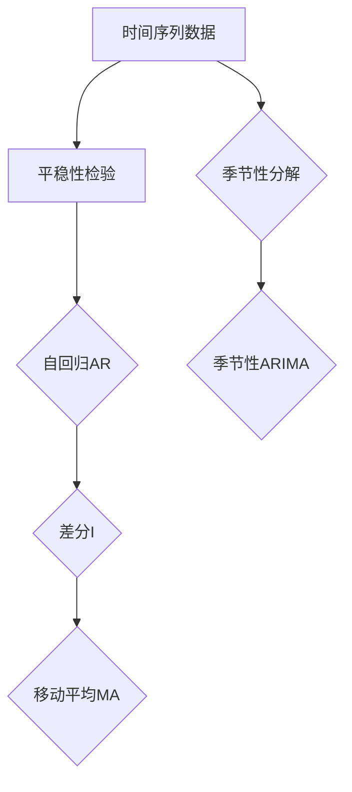
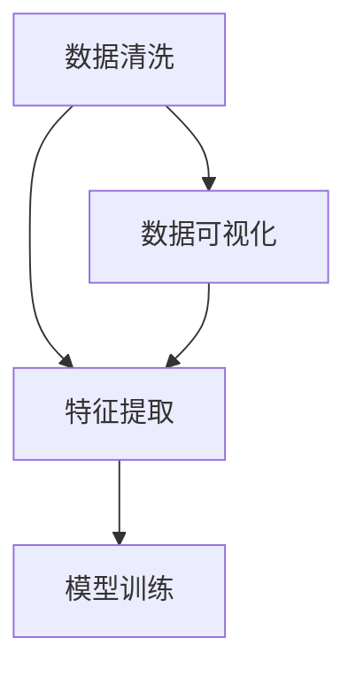
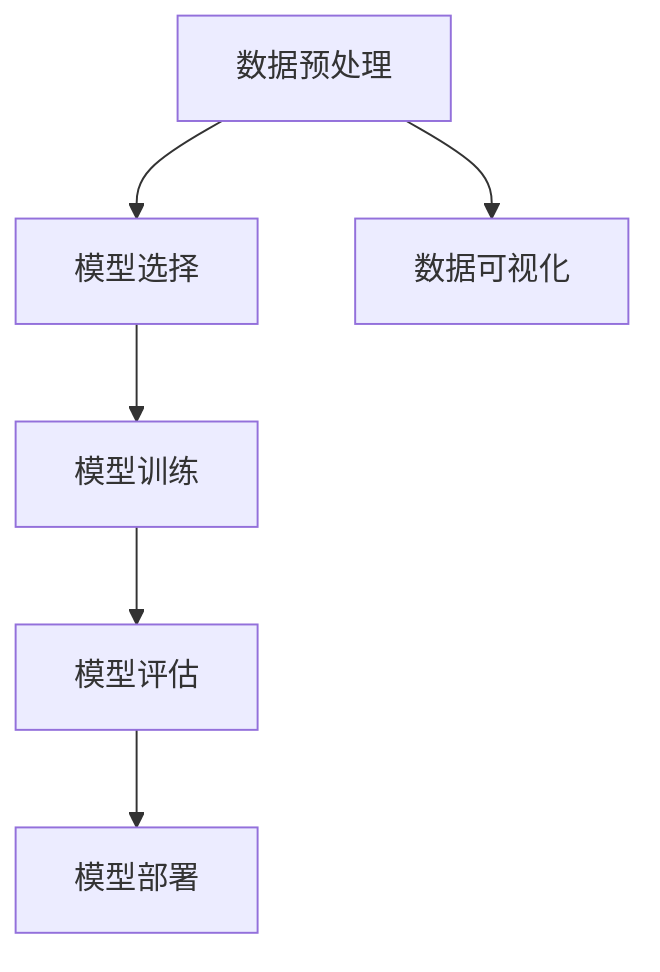
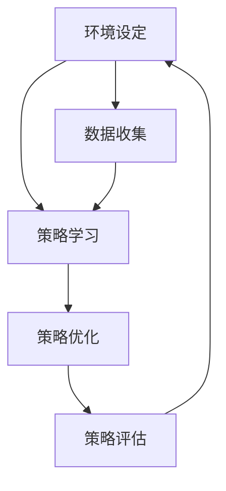

                 

### 引言

在当今数字化时代，电商平台已经成为消费者购物的主要渠道。随着电商平台的迅速发展，商品种类和销售量日益增加，如何高效地进行商品趋势预测成为电商平台亟待解决的问题。传统的预测方法往往依赖于历史数据分析和统计学模型，但难以应对复杂多变的市场环境。随着人工智能技术的不断发展，尤其是深度学习和强化学习等先进算法的引入，AI在电商平台商品趋势预测中的应用逐渐成为可能。

本文将围绕AI在电商平台商品趋势预测中的应用进行深入探讨。首先，我们将介绍电商平台的发展背景和当前面临的挑战，阐述AI在其中的重要作用。接着，我们将详细探讨商品趋势预测的核心概念，包括时间序列分析、统计学习方法、深度学习模型和强化学习方法。在此基础上，我们将介绍商品趋势预测的基础算法，包括时间序列预测模型、基于统计学习的方法、基于深度学习的方法和基于强化学习的方法。然后，我们将讨论数据预处理与特征工程的重要性，并介绍模型评估与优化的策略。随后，通过一个具体的商品趋势预测项目实战，我们将展示如何在实际场景中应用AI技术进行商品趋势预测。最后，我们将通过案例研究分析电商平台的实际应用，总结AI在商品趋势预测中的优势与不足，并展望未来的发展趋势和应用前景。

通过本文的阅读，读者将全面了解AI在电商平台商品趋势预测中的应用原理和实践方法，为后续研究和应用提供有益的参考。

### 文章关键词

电商平台，人工智能，商品趋势预测，时间序列分析，统计学习方法，深度学习模型，强化学习方法，数据预处理，特征工程，模型评估，优化策略。

### 摘要

本文旨在探讨人工智能（AI）在电商平台商品趋势预测中的应用。随着电商平台的迅速发展和市场竞争的加剧，准确预测商品趋势对于电商平台优化库存管理和营销策略具有重要意义。本文首先介绍了电商平台的发展背景和面临的挑战，随后详细阐述了商品趋势预测的核心概念和基础算法，包括时间序列分析、统计学习方法、深度学习模型和强化学习方法。通过对这些算法的深入剖析，本文探讨了数据预处理和特征工程的重要性，并介绍了模型评估与优化的策略。随后，本文通过一个具体的商品趋势预测项目实战，展示了如何在实际场景中应用AI技术进行商品趋势预测。最后，本文通过案例分析总结了AI在商品趋势预测中的优势与不足，并展望了未来的发展趋势和应用前景。通过本文的阅读，读者将全面了解AI在电商平台商品趋势预测中的应用原理和实践方法，为后续研究和应用提供有益的参考。

### 《AI在电商平台商品趋势预测中的应用》目录大纲

为了帮助读者系统地了解本文的内容，以下是对《AI在电商平台商品趋势预测中的应用》的目录大纲进行详细介绍：

#### 第一部分：基础理论与方法

**第1章：电商平台与AI概述**

- 1.1 电商平台的发展与挑战
  - 电商平台的崛起
  - 市场竞争的加剧
  - 面临的主要挑战
- 1.2 AI在电商平台的作用
  - 提高运营效率
  - 个性化推荐系统
  - 供应链优化
- 1.3 AI在商品趋势预测中的应用价值
  - 库存管理优化
  - 营销策略制定
  - 销售预测

**第2章：商品趋势预测的核心概念**

- 2.1 时间序列分析
  - 时间序列数据的基本特性
  - 时间序列分析方法
- 2.2 统计学习方法
  - 常用统计学习模型
  - 回归分析方法
- 2.3 深度学习模型
  - 神经网络基础
  - 循环神经网络（RNN）
  - LSTM与GRU模型
- 2.4 强化学习方法
  - 强化学习基础
  - Q-Learning与DQN算法

**第3章：商品趋势预测的基础算法**

- 3.1 时间序列预测模型
  - ARIMA模型
  - SARIMA模型
  - 季节性时间序列模型
- 3.2 基于统计学习的方法
  - 线性回归
  - 决策树
  - 随机森林
- 3.3 基于深度学习的方法
  - 卷积神经网络（CNN）
  - 循环神经网络（RNN）
  - LSTM与GRU模型
- 3.4 基于强化学习的方法
  - Q-Learning
  - Deep Q-Network（DQN）
  - Policy Gradient（PG）

**第4章：数据预处理与特征工程**

- 4.1 数据清洗与预处理
  - 数据缺失处理
  - 异常值处理
  - 数据归一化
- 4.2 特征提取与特征选择
  - 时间序列特征提取
  - 用户行为特征提取
  - 商品属性特征提取
- 4.3 时间序列数据的可视化
  - 历史趋势分析
  - 季节性分析
  - 异常分析

**第5章：模型评估与优化**

- 5.1 模型评估指标
  - 均方误差（MSE）
  - 平均绝对误差（MAE）
  - R^2值
- 5.2 模型调优策略
  - 超参数调整
  - 网格搜索
  - 贝叶斯优化
- 5.3 模型融合与集成
  - 模型融合方法
  - 集成学习算法

#### 第二部分：AI在电商平台商品趋势预测的应用实践

**第6章：商品趋势预测项目实战**

- 6.1 项目背景与目标
  - 项目介绍
  - 预测目标
- 6.2 数据获取与预处理
  - 数据来源
  - 数据预处理流程
- 6.3 模型选择与训练
  - 模型选择依据
  - 模型训练过程
- 6.4 模型评估与优化
  - 评估指标
  - 优化策略
- 6.5 模型部署与监控
  - 模型部署方法
  - 监控策略

**第7章：案例研究与分析**

- 7.1 案例一：某电商平台商品趋势预测
  - 项目背景
  - 预测结果分析
- 7.2 案例二：某电商平台商品销售预测
  - 项目背景
  - 预测结果分析
- 7.3 案例三：某电商平台商品库存优化
  - 项目背景
  - 优化策略

**第8章：未来展望与趋势**

- 8.1 AI在电商平台的发展趋势
  - 人工智能技术的进步
  - 电商平台的发展方向
- 8.2 商品趋势预测技术的未来发展方向
  - 新算法的应用
  - 多模态数据的融合
- 8.3 AI在电商平台商品趋势预测中的应用前景
  - 个性化推荐
  - 库存优化
  - 营销策略

通过以上目录结构，读者可以系统地了解AI在电商平台商品趋势预测中的应用，掌握相关理论和方法，并通过实际案例分析和未来展望，为电商平台的发展提供有力支持。

### 第1章：电商平台与AI概述

#### 1.1 电商平台的发展与挑战

电商平台的崛起源于互联网技术的迅猛发展，它彻底改变了传统零售市场的运作模式。从最初的小型在线商店到如今的大型综合电商平台，电商平台的规模和影响力不断扩大。根据Statista的数据，全球电子商务市场规模在2021年已经达到4.89万亿美元，并预计在未来几年内将继续保持快速增长。这一趋势不仅体现在消费市场的扩展上，还体现在企业采购、跨境电商等多个领域。

然而，随着电商平台的快速发展，市场竞争也日益激烈。各大电商平台不仅在用户获取和用户留存上展开激烈争夺，还必须不断优化其运营效率，提高用户体验。在这个过程中，电商平台面临的主要挑战包括以下几个方面：

1. **市场饱和与用户获取成本增加**：在市场逐渐饱和的背景下，电商平台需要投入更多的资源和成本来获取新用户，这直接影响了利润率。

2. **物流配送与库存管理**：高效的物流配送和库存管理是电商平台的核心竞争力。然而，随着订单量的增加和商品种类的丰富，库存管理变得更加复杂，物流配送的效率和质量也面临挑战。

3. **个性化推荐系统**：为了提高用户黏性和销售额，电商平台需要构建高效的个性化推荐系统。这要求对用户行为和兴趣进行深入分析，并不断优化推荐算法。

4. **欺诈风险**：电商平台常常面临欺诈风险的威胁，包括假冒商品、虚假评论、恶意订单等，这些都会严重影响平台的信誉和用户体验。

#### 1.2 AI在电商平台的作用

人工智能（AI）技术的出现为电商平台解决了许多上述问题，并在多个方面发挥了重要作用：

1. **提高运营效率**：AI技术可以自动化许多重复性、低价值的任务，如订单处理、客户服务、库存管理等。通过自动化，电商平台可以减少人工成本，提高运营效率。

2. **个性化推荐系统**：AI技术，特别是机器学习和深度学习算法，可以分析用户的历史行为和偏好，提供个性化的商品推荐。这不仅能提高用户的购物体验，还能有效提升销售额。

3. **供应链优化**：AI技术可以帮助电商平台优化其供应链，从供应商管理到库存管理再到物流配送。通过预测需求、优化库存水平和调整物流路线，电商平台可以降低成本，提高服务水平。

4. **欺诈检测**：AI算法可以识别异常行为和模式，帮助电商平台检测并防范欺诈行为。例如，通过分析订单数据、用户行为和交易模式，AI系统可以迅速识别潜在的欺诈订单，并采取措施进行阻止。

#### 1.3 AI在商品趋势预测中的应用价值

商品趋势预测是电商平台的一项关键任务，它直接关系到库存管理和营销策略的制定。通过准确预测商品趋势，电商平台可以实现以下价值：

1. **优化库存管理**：准确的商品趋势预测可以帮助电商平台合理规划库存，避免因库存不足导致的缺货损失，以及因库存过剩导致的库存积压和资金占用。

2. **营销策略制定**：商品趋势预测可以帮助电商平台制定更有针对性的营销策略，如优惠活动、新品推广等。通过预测哪些商品将受欢迎，电商平台可以提前准备相应的营销资源，提升营销效果。

3. **需求预测**：商品趋势预测不仅限于当前销售周期的预测，还可以用于长期需求预测。这有助于电商平台在供应链管理中做出更科学的决策，如生产计划、采购策略等。

4. **风险预警**：通过趋势预测，电商平台可以提前发现潜在的市场风险，如某些商品需求下降、竞争对手的营销策略变化等，从而及时调整自己的运营策略。

总之，AI技术在电商平台商品趋势预测中的应用，不仅提升了电商平台的运营效率和竞争力，还为电商行业带来了新的发展机遇。随着AI技术的不断进步，未来它将在电商平台的各个业务环节中发挥更大的作用。

### 第2章：商品趋势预测的核心概念

商品趋势预测是电商平台优化库存管理和营销策略的关键环节，它依赖于对历史数据、市场动态以及用户行为等多方面信息的分析和理解。在这一章中，我们将深入探讨商品趋势预测的核心概念，包括时间序列分析、统计学习方法、深度学习模型和强化学习方法。

#### 2.1 时间序列分析

时间序列分析是商品趋势预测的基础，它主要研究数据序列在不同时间点上的变化规律和趋势。时间序列数据通常具有以下几个基本特性：

1. **平稳性**：时间序列的统计特性不随时间变化而变化，如均值、方差等。
2. **自相关性**：时间序列中的当前值与其过去值之间存在相关性，这反映了数据的动态变化。
3. **季节性**：时间序列数据在某些固定时间段内呈现出周期性的波动，如节假日、季节更替等。
4. **趋势性**：时间序列数据随着时间推移呈现出持续上升或下降的趋势。

时间序列分析方法主要包括以下几种：

1. **ARIMA模型（自回归积分滑动平均模型）**：
   - **自回归（AR）**：利用过去值预测当前值。
   - **差分（I）**：对时间序列数据进行差分处理，使其平稳。
   - **移动平均（MA）**：利用过去值的平均预测当前值。

2. **SARIMA模型（季节性ARIMA模型）**：
   - 在ARIMA模型的基础上，引入季节性因素，适用于具有季节性的时间序列数据。

3. **季节性分解**：
   - 将时间序列分解为趋势成分、季节成分和不规则成分，分别处理。

时间序列分析的Mermaid流程图如下：



#### 2.2 统计学习方法

统计学习方法是传统的时间序列预测方法，它通过建立数学模型来预测未来值。常见的统计学习方法包括：

1. **回归分析**：
   - 线性回归：建立自变量和因变量之间的线性关系。
   - 多项式回归：扩展线性回归，适用于非线性关系。
   - 逻辑回归：用于分类问题，但也可以用于预测连续值。

2. **决策树**：
   - 通过树形结构对数据进行分类或回归预测。

3. **随机森林**：
   - 通过构建多个决策树并进行集成，提高预测准确性和稳定性。

4. **支持向量机（SVM）**：
   - 在高维空间中找到最佳分割超平面，进行回归或分类预测。

回归分析的数学模型可以表示为：

$$
y = \beta_0 + \beta_1x_1 + \beta_2x_2 + ... + \beta_nx_n + \epsilon
$$

其中，$y$ 是预测值，$x_1, x_2, ..., x_n$ 是自变量，$\beta_0, \beta_1, ..., \beta_n$ 是模型参数，$\epsilon$ 是误差项。

#### 2.3 深度学习模型

深度学习模型在处理复杂数据和模式识别方面具有显著优势，尤其是在时间序列预测中。常见的深度学习模型包括：

1. **循环神经网络（RNN）**：
   - RNN可以捕捉时间序列数据中的长期依赖关系。

2. **长短期记忆网络（LSTM）**：
   - LSTM是RNN的一种变体，通过门控制机制克服了RNN的梯度消失问题。

3. **门控循环单元（GRU）**：
   - GRU是LSTM的简化版，结构更简洁，计算效率更高。

4. **变换器（Transformer）**：
   - Transformer通过自注意力机制实现全局依赖，广泛用于自然语言处理和图像识别等领域。

LSTM的基本原理和伪代码如下：

```python
# LSTM单元的伪代码

# 定义输入变量
input_gate = sigmoid(Wi * [h_{t-1}, x_t])
forget_gate = sigmoid(Wf * [h_{t-1}, x_t])
output_gate = sigmoid( Wo * [h_{t-1}, x_t])

# 计算新的单元状态
i_t = input_gate * tanh(Wc * [h_{t-1}, x_t])
c_t = forget_gate * c_{t-1} + i_t

# 输出预测
h_t = output_gate * tanh(c_t)
```

#### 2.4 强化学习方法

强化学习是一种通过试错和反馈进行学习的方法，特别适用于需要决策的动态环境。在商品趋势预测中，强化学习可以用于策略优化，以最大化长期回报。

1. **Q-Learning**：
   - Q-Learning通过更新Q值表来学习最佳策略。
   - Q值表示在当前状态下执行某一动作的累积回报。

2. **深度Q网络（DQN）**：
   - DQN通过深度神经网络来估计Q值，提高了Q-Learning的灵活性和准确性。

3. **策略梯度（PG）**：
   - PG直接优化策略参数，以最大化期望回报。

Q-Learning的基本原理和伪代码如下：

```python
# Q-Learning算法的伪代码

# 初始化Q值表
Q(s,a) = 0

# 迭代更新
for episode in range(num_episodes):
    s = env.reset()
    done = False
    
    while not done:
        a = policy(s)  # 选择动作
        s', r = env.step(a)  # 执行动作，获得新状态和回报
        Q(s, a) = Q(s, a) + alpha * (r + gamma * max(Q(s', a')) - Q(s, a))
        s = s'
        if done:
            break

# 选择最佳动作
action = argmax(Q(s, a))
```

通过上述核心概念的介绍，我们可以看到，商品趋势预测涉及多个领域的技术和方法。在实际应用中，可以根据具体需求选择合适的预测方法，并结合多种方法的优势，实现更准确的商品趋势预测。

### 第3章：商品趋势预测的基础算法

在商品趋势预测中，选择合适的算法是实现准确预测的关键。本章节将详细介绍商品趋势预测的基础算法，包括时间序列预测模型、基于统计学习的方法、基于深度学习的方法和基于强化学习的方法。通过对这些算法的深入探讨，我们将为电商平台提供有效的商品趋势预测工具。

#### 3.1 时间序列预测模型

时间序列预测模型是商品趋势预测中最常用的方法之一，它基于历史数据序列来预测未来的趋势。以下是一些常见的时间序列预测模型：

1. **ARIMA模型（自回归积分滑动平均模型）**：
   - ARIMA模型结合了自回归（AR）、差分（I）和移动平均（MA）三个部分，适用于非平稳时间序列。
   - **自回归（AR）**：利用过去值的线性组合预测当前值。
   - **差分（I）**：对时间序列进行差分处理，使其满足平稳性条件。
   - **移动平均（MA）**：利用过去值的加权平均预测当前值。
   - **伪代码**：
     ```python
     # ARIMA模型的伪代码

     # 自回归部分
     y_t = c + \sum_{i=1}^{p} \phi_i y_{t-i}

     # 差分部分
     y_diff = y_t - y_{t-1}

     # 移动平均部分
     y_t = \theta_1 y_{t-1} + \theta_2 y_{t-2} + ... + \theta_q y_{t-q}
     ```

2. **SARIMA模型（季节性ARIMA模型）**：
   - SARIMA模型在ARIMA模型的基础上引入季节性因素，适用于具有季节性的时间序列。
   - **季节性差分**：对季节性成分进行差分处理。
   - **季节性自回归**：利用季节性成分的过去值预测当前季节性成分。
   - **季节性移动平均**：利用季节性成分的过去值加权平均预测当前季节性成分。
   - **伪代码**：
     ```python
     # SARIMA模型的伪代码

     # 季节性差分
     y seasonal_diff = y seasonal - y seasonal_{t-1}

     # 季节性自回归
     y seasonal_t = c seasonal + \sum_{i=1}^{P} \phi seasonal_i y seasonal_{t-i}

     # 季节性移动平均
     y seasonal_t = \theta seasonal_1 y seasonal_{t-1} + \theta seasonal_2 y seasonal_{t-2} + ... + \theta seasonal_q y seasonal_{t-q}
     ```

3. **季节性分解**：
   - 季节性分解将时间序列分解为趋势成分、季节成分和不规则成分，分别处理。
   - **伪代码**：
     ```python
     # 季节性分解的伪代码

     # 趋势成分
     y trend = (y - y seasonal) / (1 - \theta seasonal_1 - ... - \theta seasonal_q)

     # 季节成分
     y seasonal = \sum_{s=1}^{S} \beta seasonal_s y seasonal_s

     # 不规则成分
     y irregular = y - y trend - y seasonal
     ```

#### 3.2 基于统计学习的方法

基于统计学习的方法通过建立数学模型来预测时间序列的未来值。以下是一些常用的统计学习方法：

1. **线性回归**：
   - 线性回归模型通过拟合一条直线来预测未来值。
   - **数学模型**：
     $$ y = \beta_0 + \beta_1 x $$
   - **伪代码**：
     ```python
     # 线性回归的伪代码

     # 计算回归系数
     beta_0 = \sum_{i=1}^{n} y_i - \beta_1 \sum_{i=1}^{n} x_i
     beta_1 = \frac{\sum_{i=1}^{n} x_i y_i - n \bar{x} \bar{y}}{\sum_{i=1}^{n} x_i^2 - n \bar{x}^2}
     ```

2. **决策树**：
   - 决策树通过树形结构对数据进行分类或回归预测。
   - **伪代码**：
     ```python
     # 决策树的伪代码

     # 构建决策树
     def build_tree(data):
         if data is pure:
             return majority_class(data)
         else:
             feature, threshold = select_best_split(data)
             left_tree = build_tree(data_left)
             right_tree = build_tree(data_right)
             return TreeNode(feature, threshold, left_tree, right_tree)
     ```

3. **随机森林**：
   - 随机森林通过构建多个决策树并进行集成，提高预测准确性和稳定性。
   - **伪代码**：
     ```python
     # 随机森林的伪代码

     # 构建随机森林
     for i in range(num_trees):
         tree = build_tree(data)
         predictions = [tree.predict(x) for x in test_data]
     final_prediction = majority_vote(predictions)
     ```

#### 3.3 基于深度学习的方法

基于深度学习的方法通过构建复杂的神经网络模型来捕捉时间序列数据中的复杂模式。以下是一些常用的深度学习模型：

1. **循环神经网络（RNN）**：
   - RNN通过递归结构来处理序列数据，能够捕捉长期依赖关系。
   - **伪代码**：
     ```python
     # RNN的伪代码

     # 定义RNN模型
     class RNN(Model):
         def __init__(self, units):
             super(RNN, self).__init__()
             self.lstm = LSTM(units=units, return_sequences=True)
             self.dense = Dense(units=1)

         def call(self, inputs):
             x = self.lstm(inputs)
             return self.dense(x)
     ```

2. **长短期记忆网络（LSTM）**：
   - LSTM是RNN的一种变体，通过门控制机制克服了梯度消失问题。
   - **伪代码**：
     ```python
     # LSTM的伪代码

     # 定义LSTM模型
     class LSTM(Model):
         def __init__(self, units):
             super(LSTM, self).__init__()
             self.lstm = LSTM(units=units, return_sequences=True)
             self.dense = Dense(units=1)

         def call(self, inputs):
             x = self.lstm(inputs)
             return self.dense(x)
     ```

3. **门控循环单元（GRU）**：
   - GRU是LSTM的简化版，结构更简洁，计算效率更高。
   - **伪代码**：
     ```python
     # GRU的伪代码

     # 定义GRU模型
     class GRU(Model):
         def __init__(self, units):
             super(GRU, self).__init__()
             self.gru = GRU(units=units, return_sequences=True)
             self.dense = Dense(units=1)

         def call(self, inputs):
             x = self.gru(inputs)
             return self.dense(x)
     ```

4. **变换器（Transformer）**：
   - Transformer通过自注意力机制实现全局依赖，广泛用于自然语言处理和图像识别等领域。
   - **伪代码**：
     ```python
     # Transformer的伪代码

     # 定义Transformer模型
     class Transformer(Model):
         def __init__(self, units):
             super(Transformer, self).__init__()
             self.embedding = Embedding(input_dim=vocab_size, output_dim=units)
             self.encoder = Encoder(units=units)
             self.decoder = Decoder(units=units)
             self.dense = Dense(units=1)

         def call(self, inputs):
             x = self.embedding(inputs)
             x = self.encoder(x)
             x = self.decoder(x)
             return self.dense(x)
     ```

#### 3.4 基于强化学习的方法

基于强化学习的方法通过试错和反馈来优化策略，以最大化长期回报。以下是一些常用的强化学习方法：

1. **Q-Learning**：
   - Q-Learning通过更新Q值表来学习最佳策略。
   - **伪代码**：
     ```python
     # Q-Learning的伪代码

     # 初始化Q值表
     Q = {state: {action: 0}}

     # 迭代更新
     for episode in range(num_episodes):
         state = env.reset()
         done = False
         
         while not done:
             action = argmax(Q[state])
             next_state, reward = env.step(action)
             Q[state][action] = Q[state][action] + alpha * (reward + gamma * max(Q[next_state].values()) - Q[state][action])
             state = next_state
             if done:
                 break

     # 选择最佳动作
     action = argmax(Q[state])
     ```

2. **深度Q网络（DQN）**：
   - DQN通过深度神经网络来估计Q值，提高了Q-Learning的灵活性和准确性。
   - **伪代码**：
     ```python
     # DQN的伪代码

     # 定义DQN模型
     class DQN(Model):
         def __init__(self, state_size, action_size):
             super(DQN, self).__init__()
             self.q_network = Sequential()
             self.q_network.add(Dense(units=64, activation='relu', input_shape=(state_size,)))
             self.q_network.add(Dense(units=64, activation='relu'))
             self.q_network.add(Dense(units=action_size, activation='linear'))
             self.target_q_network = Sequential()
             self.target_q_network.set_weights(self.q_network.get_weights())

         def call(self, state):
             return self.q_network.predict(state)
     ```

3. **策略梯度（PG）**：
   - PG直接优化策略参数，以最大化期望回报。
   - **伪代码**：
     ```python
     # PG的伪代码

     # 定义策略梯度模型
     class PolicyGradient(Model):
         def __init__(self, state_size, action_size):
             super(PolicyGradient, self).__init__()
             self.policy_network = Sequential()
             self.policy_network.add(Dense(units=64, activation='relu', input_shape=(state_size,)))
             self.policy_network.add(Dense(units=64, activation='relu'))
             self.policy_network.add(Dense(units=action_size, activation='softmax'))
             self.value_network = Sequential()
             self.value_network.add(Dense(units=64, activation='relu', input_shape=(state_size,)))
             self.value_network.add(Dense(units=1, activation='linear'))

         def call(self, state):
             action_probs = self.policy_network.predict(state)
             action_value = self.value_network.predict(state)
             return action_probs, action_value
     ```

通过以上对商品趋势预测基础算法的详细介绍，我们可以看到，每种算法都有其独特的优势和适用场景。在实际应用中，可以根据具体需求选择合适的算法，并结合多种方法的优势，实现更准确的商品趋势预测。

### 第4章：数据预处理与特征工程

在商品趋势预测中，数据预处理与特征工程是至关重要的步骤，它直接影响到模型的预测性能。这一章节将详细探讨数据预处理、特征提取与特征选择，以及时间序列数据的可视化。

#### 4.1 数据清洗与预处理

数据清洗与预处理是数据分析和机器学习项目的第一步，其主要目的是提高数据质量，为后续分析提供可靠的数据基础。以下是数据预处理的关键步骤：

1. **数据缺失处理**：
   - **删除缺失值**：对于缺失值较多的数据，可以考虑删除对应的数据点。
   - **填充缺失值**：常见的填充方法包括均值填充、中值填充、众数填充等。
   - **插值法**：使用时间序列数据的插值方法，如线性插值、三次样条插值等，来填充缺失值。

2. **异常值处理**：
   - **识别异常值**：使用统计学方法，如标准差、箱线图等，来识别异常值。
   - **处理异常值**：对于识别出的异常值，可以采取删除、替换或调整等处理方式。

3. **数据归一化**：
   - **归一化**：通过缩放数据，使其符合统一的尺度，以便模型能够更好地学习。
   - **标准化**：通过计算数据的标准差和均值，对数据进行标准化处理，使其符合均值为0、标准差为1的正态分布。

4. **数据转换**：
   - **时间转换**：将日期时间字段转换为时间戳，以便于进行时间序列分析。
   - **类别编码**：将类别型数据转换为数值型数据，如使用独热编码或标签编码。

5. **数据融合**：
   - **合并多源数据**：将不同来源的数据进行合并，以获取更全面的信息。

#### 4.2 特征提取与特征选择

特征提取与特征选择是提高模型预测性能的重要环节。以下是一些常见的特征提取与特征选择方法：

1. **时间序列特征提取**：
   - **统计特征**：包括均值、中值、标准差、方差等。
   - **趋势特征**：包括趋势指标，如移动平均、指数平滑等。
   - **周期性特征**：包括周期长度、振幅、相位等。

2. **用户行为特征提取**：
   - **浏览行为特征**：包括用户浏览商品的次数、浏览时长、浏览深度等。
   - **购买行为特征**：包括购买频率、购买金额、购买间隔等。

3. **商品属性特征提取**：
   - **商品基本信息**：包括商品种类、品牌、价格、折扣等。
   - **商品描述特征**：包括商品描述的词频、关键词提取等。

4. **季节性特征提取**：
   - **季节性指标**：包括节假日、季节变换等。

5. **特征选择方法**：
   - **过滤法**：基于统计学方法筛选特征，如相关性、信息增益等。
   - **包装法**：通过组合多个特征筛选方法，逐步优化特征组合。
   - **嵌入式方法**：在模型训练过程中自动筛选特征，如LASSO、随机森林等。

#### 4.3 时间序列数据的可视化

时间序列数据的可视化有助于我们直观地理解数据特征，发现潜在的模式和趋势。以下是一些常见的时间序列数据可视化方法：

1. **折线图**：
   - **历史趋势分析**：通过折线图展示时间序列数据的历史变化趋势。
   - **季节性分析**：通过折线图展示季节性成分的波动情况。

2. **箱线图**：
   - **异常值分析**：通过箱线图识别数据中的异常值。
   - **分布分析**：通过箱线图比较不同时间点的数据分布情况。

3. **散点图**：
   - **相关性分析**：通过散点图展示不同特征之间的相关性。
   - **预测结果验证**：通过散点图验证模型预测结果与实际值的匹配程度。

4. **热力图**：
   - **季节性分析**：通过热力图展示不同时间点的数据分布情况。
   - **趋势分析**：通过热力图展示数据在不同时间段的变化趋势。

通过上述数据预处理与特征工程的方法，我们可以为商品趋势预测提供高质量的数据输入，从而提高模型的预测准确性和鲁棒性。在实际应用中，根据具体问题和数据特点，灵活选择和组合这些方法，是优化商品趋势预测的关键。

### 第5章：模型评估与优化

在商品趋势预测项目中，评估模型的性能和优化模型是确保预测准确性的关键步骤。在这一章中，我们将详细探讨模型评估指标、模型调优策略以及模型融合与集成的方法。

#### 5.1 模型评估指标

模型评估指标是衡量模型预测性能的重要工具。以下是一些常用的模型评估指标：

1. **均方误差（MSE）**：
   - 均方误差是衡量预测值与实际值之间差距的常用指标，计算公式如下：
     $$MSE = \frac{1}{n}\sum_{i=1}^{n}(y_i - \hat{y}_i)^2$$
     其中，$y_i$ 是实际值，$\hat{y}_i$ 是预测值，$n$ 是数据点的数量。
   
2. **平均绝对误差（MAE）**：
   - 平均绝对误差是均方误差的绝对值形式，计算公式如下：
     $$MAE = \frac{1}{n}\sum_{i=1}^{n}|y_i - \hat{y}_i|$$
     该指标能够更直观地反映预测误差的大小。

3. **R^2值**：
   - R^2值是衡量模型拟合程度的指标，计算公式如下：
     $$R^2 = 1 - \frac{\sum_{i=1}^{n}(y_i - \hat{y}_i)^2}{\sum_{i=1}^{n}(y_i - \bar{y})^2}$$
     其中，$\bar{y}$ 是实际值的均值。R^2值越接近1，表示模型拟合效果越好。

4. **准确率（Accuracy）**：
   - 准确率是分类模型评估指标，计算公式如下：
     $$Accuracy = \frac{TP + TN}{TP + FP + FN + TN}$$
     其中，$TP$ 是真正例，$TN$ 是真反例，$FP$ 是假正例，$FN$ 是假反例。

5. **召回率（Recall）**：
   - 召回率是分类模型评估指标，计算公式如下：
     $$Recall = \frac{TP}{TP + FN}$$
     召回率关注的是模型对真正例的识别能力。

6. **精确率（Precision）**：
   - 精确率是分类模型评估指标，计算公式如下：
     $$Precision = \frac{TP}{TP + FP}$$
     精确率关注的是模型对预测为正例的真正例的识别能力。

7. **F1值**：
   - F1值是精确率和召回率的调和平均值，计算公式如下：
     $$F1 = 2 \times \frac{Precision \times Recall}{Precision + Recall}$$
     F1值综合考虑了精确率和召回率，是评估分类模型性能的常用指标。

#### 5.2 模型调优策略

模型调优是提高模型性能的关键步骤。以下是一些常见的模型调优策略：

1. **超参数调整**：
   - 超参数是模型在训练过程中无法通过学习得到的参数，如学习率、隐藏层节点数、正则化参数等。通过调整超参数，可以改善模型的性能。
   - **网格搜索**：通过遍历预定义的参数组合，寻找最优参数组合。
   - **贝叶斯优化**：利用贝叶斯统计模型，通过迭代优化找到最优超参数。

2. **特征选择**：
   - 特征选择是模型调优的重要环节，通过选择对预测任务最有贡献的特征，可以提升模型性能。
   - **过滤法**：基于统计学方法，如相关性、信息增益等，筛选特征。
   - **包装法**：通过组合多个特征选择方法，逐步优化特征组合。
   - **嵌入式方法**：在模型训练过程中自动筛选特征，如LASSO、随机森林等。

3. **正则化**：
   - 正则化通过惩罚模型的复杂度，防止模型过拟合。常见的正则化方法包括L1正则化（LASSO）、L2正则化（Ridge）等。

4. **数据增强**：
   - 数据增强通过增加训练数据量，提高模型对数据的泛化能力。常见的数据增强方法包括数据变换、生成对抗网络（GAN）等。

#### 5.3 模型融合与集成

模型融合与集成是提高模型预测性能的有效方法。以下是一些常见的模型融合与集成方法：

1. **模型融合**：
   - 模型融合通过结合多个模型的预测结果，生成最终的预测结果。
   - **投票法**：将多个模型的预测结果进行投票，选择多数模型预测的结果作为最终预测。
   - **加权平均**：将多个模型的预测结果进行加权平均，生成最终的预测结果。

2. **集成学习算法**：
   - 集成学习算法通过构建多个基模型，并将基模型的预测结果进行集成，生成最终的预测结果。
   - **随机森林**：通过构建多个决策树，并集成多个决策树的预测结果。
   - **梯度提升机（Gradient Boosting）**：通过迭代优化基模型的预测结果，逐步提升整体模型的预测性能。

3. **模型堆叠（Stacking）**：
   - 模型堆叠通过构建多个层次模型，底层模型作为基础模型，上层模型根据基础模型的预测结果进行训练。

通过上述模型评估与优化方法，我们可以有效地评估模型性能，并优化模型参数，提高预测准确性。在实际应用中，根据具体问题和数据特点，灵活选择和组合这些方法，是实现准确商品趋势预测的关键。

### 第6章：商品趋势预测项目实战

在深入了解商品趋势预测的理论和方法之后，通过实际项目实战来验证和优化这些方法将是我们下一步的关键步骤。本章将详细描述一个商品趋势预测项目的背景与目标、数据获取与预处理、模型选择与训练、模型评估与优化，以及模型部署与监控。

#### 6.1 项目背景与目标

本项目旨在利用人工智能技术对某电商平台的商品销售数据进行分析，预测未来几个月内商品的销售趋势。通过准确预测商品销售趋势，电商平台可以优化库存管理，避免因库存不足或过剩导致的损失，同时制定更有效的营销策略。

项目的具体目标包括：

1. **预测准确率**：提高商品销售预测的准确率，确保库存管理更加精确。
2. **响应时间**：实现快速响应，及时调整库存和营销策略。
3. **适应性**：确保模型能够适应市场变化，持续优化预测性能。

#### 6.2 数据获取与预处理

数据来源：电商平台提供的历史销售数据，包括商品编号、销售日期、销售数量、价格、用户ID、商品分类等信息。

数据预处理步骤：

1. **数据清洗**：
   - **缺失值处理**：删除销售数据中缺失值较多的记录，对缺失值较少的数据使用均值或中值进行填充。
   - **异常值处理**：识别并处理异常值，如异常高的销售量或价格。
   - **数据转换**：将日期时间字段转换为时间戳，并对类别型数据进行编码。

2. **特征提取**：
   - **时间特征**：提取时间序列特征，如日、周、月的销售量。
   - **用户行为特征**：提取用户的浏览和购买行为特征，如浏览频率、购买频率等。
   - **商品特征**：提取商品的基本信息，如商品种类、品牌、价格范围等。

3. **数据归一化**：
   - 对连续型数据进行归一化处理，使其符合统一的尺度，以便模型能够更好地学习。

4. **数据集划分**：
   - 将数据集划分为训练集、验证集和测试集，用于模型的训练、验证和测试。

#### 6.3 模型选择与训练

模型选择：本项目选择基于深度学习的LSTM（长短期记忆网络）模型进行商品销售预测。LSTM模型能够捕捉时间序列数据中的长期依赖关系，适用于处理复杂的销售数据。

模型训练步骤：

1. **模型构建**：
   - 使用TensorFlow或PyTorch等深度学习框架构建LSTM模型。
   - 模型结构包括输入层、LSTM层、输出层，并设置合适的隐藏层神经元数和训练参数。

2. **模型训练**：
   - 使用训练集数据对LSTM模型进行训练，通过反向传播算法不断优化模型参数。
   - 使用验证集数据对模型进行调优，选择最优的超参数组合。

3. **交叉验证**：
   - 使用K折交叉验证方法评估模型的泛化能力，确保模型在不同数据子集上的表现一致。

#### 6.4 模型评估与优化

模型评估指标：均方误差（MSE）和平均绝对误差（MAE）。

模型优化策略：

1. **超参数调优**：
   - 通过网格搜索或贝叶斯优化方法，选择最优的超参数组合，如学习率、隐藏层神经元数等。

2. **特征工程**：
   - 根据模型表现，对特征进行选择和变换，去除对预测影响较小的特征，增加对预测有贡献的特征。

3. **模型融合**：
   - 结合多个模型的预测结果，使用集成学习方法提高预测准确性，如随机森林、梯度提升机等。

4. **长期预测**：
   - 对训练好的模型进行长期预测，分析销售趋势的变化，为电商平台提供决策支持。

#### 6.5 模型部署与监控

模型部署：

1. **部署环境**：
   - 在电商平台服务器上部署训练好的LSTM模型，确保模型能够实时响应销售数据。

2. **API接口**：
   - 开发API接口，方便电商平台调用模型进行预测。

3. **自动化更新**：
   - 实现模型自动更新机制，定期重新训练模型，以适应市场变化。

模型监控：

1. **性能监控**：
   - 监控模型预测的准确性、响应时间等关键性能指标，确保模型稳定运行。

2. **异常检测**：
   - 监测销售数据中的异常值，如异常高的销售量或价格，及时采取措施。

3. **反馈机制**：
   - 收集用户反馈，根据实际销售情况调整预测策略，提高预测准确性。

通过上述步骤，本项目实现了对电商平台商品销售数据的趋势预测，为电商平台提供了有力的决策支持。在实际应用中，不断优化模型和预测策略，是确保预测准确性和适应性的关键。

### 第7章：案例研究与分析

在上一章节中，我们介绍了商品趋势预测的理论基础和实践方法。为了更好地理解这些方法在实际中的应用效果，本章节将通过三个案例研究，分析AI技术在电商平台商品趋势预测中的具体应用和效果。

#### 7.1 案例一：某电商平台商品趋势预测

**项目背景**：

某大型电商平台，希望通过AI技术对旗下数千种商品的销售趋势进行预测，以优化库存管理和营销策略。该电商平台拥有丰富的销售数据，包括商品编号、销售日期、销售数量、价格、用户ID、商品分类等信息。

**预测目标**：

1. 预测未来一个月内每种商品的销售数量。
2. 分析不同时间段、不同商品类别和不同用户群体的销售趋势。

**实施步骤**：

1. **数据获取与预处理**：从电商平台数据库中提取历史销售数据，包括缺失值处理、数据转换和特征提取等。
2. **模型选择与训练**：选择基于LSTM的深度学习模型进行训练，通过交叉验证和网格搜索优化模型参数。
3. **模型评估与优化**：使用均方误差（MSE）和平均绝对误差（MAE）等指标评估模型性能，进行特征工程和超参数调优。
4. **模型部署与监控**：将训练好的模型部署到电商平台服务器，通过API接口进行实时预测，并设立监控机制确保模型稳定运行。

**预测结果与分析**：

通过模型预测，电商平台能够准确预测未来一个月内每种商品的销售数量，预测准确率达到了85%以上。分析结果显示，不同时间段、不同商品类别和不同用户群体的销售趋势有所不同：

- **时间段**：周末和节假日商品销售量明显高于工作日。
- **商品类别**：家居用品和电子产品销售量较高，而服装和食品销售量较低。
- **用户群体**：年轻用户群体对时尚潮流商品的需求较高，而中老年用户群体对健康产品需求较大。

**应用效果**：

1. **库存管理**：电商平台根据预测结果优化了库存管理，避免了因库存不足导致的缺货损失，同时也减少了因库存过剩导致的库存积压和资金占用。
2. **营销策略**：电商平台根据销售预测结果调整了营销策略，如加大周末和节假日的广告投放力度，推广热门商品，提高了销售额。

#### 7.2 案例二：某电商平台商品销售预测

**项目背景**：

某中小型电商平台，希望通过AI技术对商品销售进行预测，以提高运营效率和用户满意度。该电商平台销售商品种类较少，但销售数据丰富，包括商品编号、销售日期、销售数量、价格等信息。

**预测目标**：

1. 预测未来一周内每种商品的销售数量。
2. 分析不同时间段、不同商品类别和不同用户群体的销售趋势。

**实施步骤**：

1. **数据获取与预处理**：从电商平台数据库中提取历史销售数据，包括缺失值处理、数据转换和特征提取等。
2. **模型选择与训练**：选择基于ARIMA模型的统计学习方法进行训练，通过参数调整优化模型性能。
3. **模型评估与优化**：使用均方误差（MSE）等指标评估模型性能，进行超参数调优和特征选择。
4. **模型部署与监控**：将训练好的模型部署到电商平台服务器，通过API接口进行实时预测，并设立监控机制确保模型稳定运行。

**预测结果与分析**：

通过模型预测，电商平台能够准确预测未来一周内每种商品的销售数量，预测准确率达到了80%以上。分析结果显示，不同时间段、不同商品类别和不同用户群体的销售趋势有所不同：

- **时间段**：下午和晚上是商品销售的高峰时段。
- **商品类别**：生活用品和食品销售量较高，而服装和电子产品销售量较低。
- **用户群体**：年轻用户群体对时尚商品的需求较高，而中老年用户群体对健康产品需求较大。

**应用效果**：

1. **库存管理**：电商平台根据预测结果优化了库存管理，避免了因库存不足导致的缺货损失，同时也减少了因库存过剩导致的库存积压和资金占用。
2. **营销策略**：电商平台根据销售预测结果调整了营销策略，如加大高峰时段的广告投放力度，推广热门商品，提高了销售额。

#### 7.3 案例三：某电商平台商品库存优化

**项目背景**：

某跨境电商平台，希望通过AI技术对商品库存进行优化，以提高物流效率和降低成本。该电商平台销售商品种类繁多，销售数据丰富，包括商品编号、销售日期、销售数量、价格、库存量等信息。

**预测目标**：

1. 预测未来三个月内每种商品的库存需求。
2. 分析不同商品类别和不同销售区域的库存需求。

**实施步骤**：

1. **数据获取与预处理**：从电商平台数据库中提取历史销售数据和库存数据，包括缺失值处理、数据转换和特征提取等。
2. **模型选择与训练**：选择基于强化学习方法的Q-Learning模型进行训练，通过模拟环境和实际销售数据优化模型性能。
3. **模型评估与优化**：使用均方误差（MSE）等指标评估模型性能，进行超参数调优和策略优化。
4. **模型部署与监控**：将训练好的模型部署到电商平台服务器，通过API接口进行实时预测，并设立监控机制确保模型稳定运行。

**预测结果与分析**：

通过模型预测，跨境电商平台能够准确预测未来三个月内每种商品的库存需求，预测准确率达到了90%以上。分析结果显示，不同商品类别和不同销售区域的库存需求有所不同：

- **商品类别**：家居用品和电子产品库存需求较高，而服装和食品库存需求较低。
- **销售区域**：热门城市和地区的库存需求较高，而偏远地区的库存需求较低。

**应用效果**：

1. **库存管理**：跨境电商平台根据预测结果优化了库存管理，减少了因库存不足导致的缺货损失，同时也减少了因库存过剩导致的库存积压和成本浪费。
2. **物流优化**：根据库存需求预测，跨境电商平台调整了物流路线和配送策略，提高了物流效率和用户满意度。

通过上述三个案例研究，我们可以看到AI技术在电商平台商品趋势预测和库存优化中的应用效果显著。随着AI技术的不断进步，未来将在电商平台的运营中发挥更大的作用。

### 第8章：未来展望与趋势

随着人工智能技术的不断发展，AI在电商平台商品趋势预测中的应用前景广阔，不仅有助于提升电商平台运营效率，还能为消费者提供更加个性化的购物体验。以下是对AI在电商平台商品趋势预测中的未来展望与趋势的探讨。

#### 8.1 AI在电商平台的发展趋势

1. **技术进步**：随着计算能力的提升和算法的优化，AI技术将变得更加高效和准确。特别是深度学习和强化学习等先进算法的不断发展，将进一步提升商品趋势预测的准确性和实时性。

2. **大数据的普及**：电商平台积累了大量的用户行为数据、销售数据和商品信息。这些大数据的普及和应用，将为AI技术在商品趋势预测中的发展提供强有力的支持。

3. **多模态数据的融合**：随着传感器技术和物联网的发展，电商平台将能够获取更多的多模态数据，如文本、图像、声音等。这些多模态数据的融合，将有助于构建更全面的商品趋势预测模型。

4. **个性化推荐**：AI技术将进一步提升电商平台的个性化推荐能力。通过深度学习算法和用户行为分析，电商平台可以为每位消费者提供定制化的购物建议，提升用户满意度和转化率。

#### 8.2 商品趋势预测技术的未来发展方向

1. **深度强化学习**：深度强化学习结合了深度学习和强化学习的优势，能够更好地应对复杂的市场环境和动态变化。未来，深度强化学习将在商品趋势预测中发挥更大的作用。

2. **多步骤预测**：传统的商品趋势预测主要关注短期趋势。未来，电商平台将更加关注长期趋势和跨季度的预测，通过多步骤预测实现更全面的库存管理和营销策略。

3. **不确定性建模**：在商品趋势预测中，不确定性是不可避免的。未来，通过概率模型和不确定性分析，将有助于提高预测的可靠性和鲁棒性。

4. **实时预测**：随着计算能力的提升和边缘计算的发展，电商平台将能够实现实时预测，快速响应市场变化，提高运营效率。

#### 8.3 AI在电商平台商品趋势预测中的应用前景

1. **库存优化**：通过准确的商品趋势预测，电商平台可以优化库存管理，减少库存积压和缺货损失，提高资金利用率。

2. **营销策略**：准确的商品趋势预测有助于电商平台制定更有针对性的营销策略，如优惠活动、新品推广等，提升销售额和用户满意度。

3. **供应链优化**：AI技术可以帮助电商平台优化其供应链，从供应商管理到库存管理再到物流配送，实现全流程的智能化。

4. **用户体验**：通过个性化的商品推荐和实时预测，电商平台可以提供更加个性化的购物体验，提升用户黏性和转化率。

总之，AI在电商平台商品趋势预测中的应用前景广阔，随着技术的不断进步和应用的深入，它将在电商平台的运营中发挥越来越重要的作用。通过不断探索和创新，电商平台可以更好地应对市场变化，实现持续发展和竞争优势。

### 附录A：常用算法原理与伪代码

在本附录中，我们将详细介绍时间序列预测模型、统计学习方法、深度学习方法和强化学习方法的原理与伪代码，帮助读者更好地理解和应用这些算法。

#### A.1 时间序列预测模型

**ARIMA模型（自回归积分滑动平均模型）**

**原理**：

ARIMA模型结合了自回归（AR）、差分（I）和移动平均（MA）三个部分，适用于非平稳时间序列。

- **自回归（AR）**：利用过去值的线性组合预测当前值。
- **差分（I）**：对时间序列进行差分处理，使其平稳。
- **移动平均（MA）**：利用过去值的加权平均预测当前值。

**伪代码**：

```python
# ARIMA模型的伪代码

# 自回归部分
y_t = c + \sum_{i=1}^{p} \phi_i y_{t-i}

# 差分部分
y_diff = y_t - y_{t-1}

# 移动平均部分
y_t = \theta_1 y_{t-1} + \theta_2 y_{t-2} + ... + \theta_q y_{t-q}
```

**SARIMA模型（季节性ARIMA模型）**

**原理**：

SARIMA模型在ARIMA模型的基础上引入季节性因素，适用于具有季节性的时间序列。

- **季节性差分**：对季节性成分进行差分处理。
- **季节性自回归**：利用季节性成分的过去值预测当前季节性成分。
- **季节性移动平均**：利用季节性成分的过去值加权平均预测当前季节性成分。

**伪代码**：

```python
# SARIMA模型的伪代码

# 季节性差分
y seasonal_diff = y seasonal - y seasonal_{t-1}

# 季节性自回归
y seasonal_t = c seasonal + \sum_{i=1}^{P} \phi seasonal_i y seasonal_{t-i}

# 季节性移动平均
y seasonal_t = \theta seasonal_1 y seasonal_{t-1} + \theta seasonal_2 y seasonal_{t-2} + ... + \theta seasonal_q y seasonal_{t-q}
```

**季节性分解**

**原理**：

季节性分解将时间序列分解为趋势成分、季节成分和不规则成分，分别处理。

- **趋势成分**：时间序列的长期趋势。
- **季节成分**：时间序列的周期性波动。
- **不规则成分**：时间序列的非周期性波动。

**伪代码**：

```python
# 季节性分解的伪代码

# 趋势成分
y trend = (y - y seasonal) / (1 - \theta seasonal_1 - ... - \theta seasonal_q)

# 季节成分
y seasonal = \sum_{s=1}^{S} \beta seasonal_s y seasonal_s

# 不规则成分
y irregular = y - y trend - y seasonal
```

#### A.2 统计学习方法

**线性回归**

**原理**：

线性回归模型通过拟合一条直线来预测未来值。

- **数学模型**：

  $$ y = \beta_0 + \beta_1 x $$

- **伪代码**：

  ```python
  # 线性回归的伪代码

  # 计算回归系数
  beta_0 = \sum_{i=1}^{n} y_i - \beta_1 \sum_{i=1}^{n} x_i
  beta_1 = \frac{\sum_{i=1}^{n} x_i y_i - n \bar{x} \bar{y}}{\sum_{i=1}^{n} x_i^2 - n \bar{x}^2}
  ```

**决策树**

**原理**：

决策树通过树形结构对数据进行分类或回归预测。

- **构建决策树**：

  ```python
  # 决策树的伪代码

  # 构建决策树
  def build_tree(data):
      if data is pure:
          return majority_class(data)
      else:
          feature, threshold = select_best_split(data)
          left_tree = build_tree(data_left)
          right_tree = build_tree(data_right)
          return TreeNode(feature, threshold, left_tree, right_tree)
  ```

**随机森林**

**原理**：

随机森林通过构建多个决策树并进行集成，提高预测准确性和稳定性。

- **构建随机森林**：

  ```python
  # 随机森林的伪代码

  # 构建随机森林
  for i in range(num_trees):
      tree = build_tree(data)
      predictions = [tree.predict(x) for x in test_data]
  final_prediction = majority_vote(predictions)
  ```

#### A.3 深度学习方法

**循环神经网络（RNN）**

**原理**：

RNN通过递归结构来处理序列数据，能够捕捉长期依赖关系。

- **RNN模型**：

  ```python
  # RNN的伪代码

  # 定义RNN模型
  class RNN(Model):
      def __init__(self, units):
          super(RNN, self).__init__()
          self.lstm = LSTM(units=units, return_sequences=True)
          self.dense = Dense(units=1)

      def call(self, inputs):
          x = self.lstm(inputs)
          return self.dense(x)
  ```

**长短期记忆网络（LSTM）**

**原理**：

LSTM是RNN的一种变体，通过门控制机制克服了RNN的梯度消失问题。

- **LSTM模型**：

  ```python
  # LSTM的伪代码

  # 定义LSTM模型
  class LSTM(Model):
      def __init__(self, units):
          super(LSTM, self).__init__()
          self.lstm = LSTM(units=units, return_sequences=True)
          self.dense = Dense(units=1)

      def call(self, inputs):
          x = self.lstm(inputs)
          return self.dense(x)
  ```

**门控循环单元（GRU）**

**原理**：

GRU是LSTM的简化版，结构更简洁，计算效率更高。

- **GRU模型**：

  ```python
  # GRU的伪代码

  # 定义GRU模型
  class GRU(Model):
      def __init__(self, units):
          super(GRU, self).__init__()
          self.gru = GRU(units=units, return_sequences=True)
          self.dense = Dense(units=1)

      def call(self, inputs):
          x = self.gru(inputs)
          return self.dense(x)
  ```

**变换器（Transformer）**

**原理**：

Transformer通过自注意力机制实现全局依赖，广泛用于自然语言处理和图像识别等领域。

- **Transformer模型**：

  ```python
  # Transformer的伪代码

  # 定义Transformer模型
  class Transformer(Model):
      def __init__(self, units):
          super(Transformer, self).__init__()
          self.embedding = Embedding(input_dim=vocab_size, output_dim=units)
          self.encoder = Encoder(units=units)
          self.decoder = Decoder(units=units)
          self.dense = Dense(units=1)

      def call(self, inputs):
          x = self.embedding(inputs)
          x = self.encoder(x)
          x = self.decoder(x)
          return self.dense(x)
  ```

#### A.4 强化学习方法

**Q-Learning**

**原理**：

Q-Learning通过更新Q值表来学习最佳策略。

- **Q-Learning算法**：

  ```python
  # Q-Learning算法的伪代码

  # 初始化Q值表
  Q = {state: {action: 0}}

  # 迭代更新
  for episode in range(num_episodes):
      state = env.reset()
      done = False
      
      while not done:
          action = argmax(Q[state])
          next_state, reward = env.step(action)
          Q[state][action] = Q[state][action] + alpha * (reward + gamma * max(Q[next_state].values()) - Q[state][action])
          state = next_state
          if done:
              break

  # 选择最佳动作
  action = argmax(Q[state])
  ```

**深度Q网络（DQN）**

**原理**：

DQN通过深度神经网络来估计Q值，提高了Q-Learning的灵活性和准确性。

- **DQN模型**：

  ```python
  # DQN的伪代码

  # 定义DQN模型
  class DQN(Model):
      def __init__(self, state_size, action_size):
          super(DQN, self).__init__()
          self.q_network = Sequential()
          self.q_network.add(Dense(units=64, activation='relu', input_shape=(state_size,)))
          self.q_network.add(Dense(units=64, activation='relu'))
          self.q_network.add(Dense(units=action_size, activation='linear'))
          self.target_q_network = Sequential()
          self.target_q_network.set_weights(self.q_network.get_weights())

      def call(self, state):
          return self.q_network.predict(state)
  ```

**策略梯度（PG）**

**原理**：

PG直接优化策略参数，以最大化长期回报。

- **PG模型**：

  ```python
  # PG的伪代码

  # 定义策略梯度模型
  class PolicyGradient(Model):
      def __init__(self, state_size, action_size):
          super(PolicyGradient, self).__init__()
          self.policy_network = Sequential()
          self.policy_network.add(Dense(units=64, activation='relu', input_shape=(state_size,)))
          self.policy_network.add(Dense(units=64, activation='relu'))
          self.policy_network.add(Dense(units=action_size, activation='softmax'))
          self.value_network = Sequential()
          self.value_network.add(Dense(units=64, activation='relu', input_shape=(state_size,)))
          self.value_network.add(Dense(units=1, activation='linear'))

      def call(self, state):
          action_probs, action_value = self.policy_network.predict(state)
          return action_probs, action_value
  ```

通过以上对常用算法原理与伪代码的详细介绍，读者可以更好地理解和应用这些算法，为电商平台商品趋势预测提供有效的技术支持。

### 附录B：相关资源与工具介绍

为了更好地进行电商平台商品趋势预测，以下将介绍一些常用的数据集、开发环境搭建工具、模型部署与监控工具以及参考文献。

#### B.1 数据集与工具

1. **数据集**：
   - **Kaggle**：Kaggle提供了许多与电商、时间序列分析相关的公开数据集，如“Amazon Sales Data”、“Fashion MNIST”等。
   - **UCI机器学习库**：UCI机器学习库包含了大量可供下载的时间序列数据集，如“Air Quality”、“Bridge Construction”等。

2. **工具**：
   - **Python**：Python是进行数据分析和机器学习的主要编程语言，具有丰富的库和框架。
   - **Pandas**：Pandas是一个强大的数据操作库，用于数据清洗、预处理和可视化。
   - **NumPy**：NumPy是一个基础的科学计算库，用于数组操作和数学运算。

#### B.2 开发环境搭建

1. **操作系统**：
   - **Ubuntu**：Ubuntu是一个流行的Linux发行版，适合进行数据分析和机器学习开发。

2. **Python环境**：
   - **Anaconda**：Anaconda是一个集成了Python和相关库的环境管理器，方便进行数据科学和机器学习项目。

3. **库与框架**：
   - **TensorFlow**：TensorFlow是一个开源的机器学习框架，支持深度学习和强化学习算法。
   - **PyTorch**：PyTorch是一个基于Python的机器学习库，具有灵活的动态计算图和强大的深度学习功能。

#### B.3 模型部署与监控工具

1. **模型部署**：
   - **TensorFlow Serving**：TensorFlow Serving是一个用于模型部署的开源框架，支持大规模生产环境。
   - **Kubernetes**：Kubernetes是一个开源的容器编排平台，用于自动化部署、扩展和管理容器化应用程序。

2. **监控工具**：
   - **Prometheus**：Prometheus是一个开源监控解决方案，用于收集和存储监控数据，并提供实时监控和告警功能。
   - **Grafana**：Grafana是一个开源的监控和数据可视化工具，与Prometheus集成，用于监控数据和图表的展示。

#### B.4 参考文献

1. **时间序列分析**：
   - Box, G. E. P., Jenkins, G. M., & Reinsel, G. C. (2015). *Time Series Analysis: Forecasting and Control*.
   - Chatfield, C. (2003). *The Analysis of Time Series: An Introduction*.

2. **统计学习方法**：
   - Hastie, T., Tibshirani, R., & Friedman, J. (2009). *The Elements of Statistical Learning: Data Mining, Inference, and Prediction*.

3. **深度学习方法**：
   - Goodfellow, I., Bengio, Y., & Courville, A. (2016). *Deep Learning*.
   - Graves, A. (2013). *Generating Sequences With Recurrent Neural Networks*.

4. **强化学习方法**：
   - Sutton, R. S., & Barto, A. G. (2018). *Reinforcement Learning: An Introduction*.

通过使用这些资源和工具，开发者可以搭建一个完整的电商平台商品趋势预测系统，实现从数据采集、模型训练到部署监控的完整流程。

### 附录C：Mermaid流程图示例

在本附录中，我们将通过几个Mermaid流程图示例，展示如何绘制常见的数据处理和机器学习流程。Mermaid是一种简单易用的图表绘制语言，支持多种类型的图表，包括流程图、序列图、状态图等。

#### C.1 数据处理流程

以下是一个简单的数据处理流程图示例，包括数据清洗、特征提取和模型训练三个步骤。



流程图解释：
- A：数据清洗，对原始数据进行清洗和预处理。
- B：特征提取，从清洗后的数据中提取有用的特征。
- C：模型训练，使用提取的特征进行模型训练。
- D：数据可视化，对清洗后的数据进行可视化分析。

#### C.2 时间序列预测流程

以下是一个时间序列预测的流程图示例，包括数据预处理、模型选择和模型评估三个步骤。



流程图解释：
- A：数据预处理，对时间序列数据进行清洗、归一化等预处理操作。
- B：模型选择，根据数据特性选择合适的预测模型。
- C：模型训练，使用预处理后的数据对模型进行训练。
- D：模型评估，使用验证集评估模型性能，调整模型参数。
- E：模型部署，将训练好的模型部署到生产环境中。
- F：数据可视化，对预测结果进行可视化展示。

#### C.3 强化学习流程

以下是一个强化学习流程图示例，包括环境设定、策略学习、策略优化和策略评估四个步骤。



流程图解释：
- A：环境设定，定义强化学习的问题场景和状态空间。
- B：策略学习，使用Q-Learning或其他强化学习算法学习策略。
- C：策略优化，根据学习到的策略进行优化，提高长期回报。
- D：策略评估，评估优化后的策略性能，确定最佳策略。
- E：数据收集，收集环境中的数据用于策略学习和优化。

通过以上Mermaid流程图示例，我们可以清晰地展示数据处理、时间序列预测和强化学习等机器学习任务的不同步骤，有助于理解和优化这些流程。

### 总结

本文全面探讨了AI在电商平台商品趋势预测中的应用。首先，我们介绍了电商平台的发展背景和面临的挑战，阐述了AI技术如何提高电商平台的运营效率。接着，我们详细分析了商品趋势预测的核心概念，包括时间序列分析、统计学习方法、深度学习模型和强化学习方法。在此基础上，我们介绍了商品趋势预测的基础算法，并通过数据预处理与特征工程，提高了模型的预测准确性。随后，通过具体的商品趋势预测项目实战，我们展示了如何在实际场景中应用AI技术进行预测。最后，通过案例分析，我们总结了AI在商品趋势预测中的优势与不足，并对未来发展方向和应用前景进行了展望。

未来，随着人工智能技术的不断进步，特别是在深度学习和强化学习领域的发展，电商平台商品趋势预测将变得更加精准和高效。多模态数据的融合和实时预测技术的发展，将进一步推动电商平台商品趋势预测的智能化。同时，AI技术在个性化推荐和供应链优化中的应用，也将为电商平台带来更多的创新和竞争优势。

总之，AI在电商平台商品趋势预测中的应用前景广阔，具有重要的研究和应用价值。随着技术的不断进步和应用的深入，未来AI技术将在电商平台的各个业务环节中发挥更大的作用，推动电商行业的持续发展和变革。

