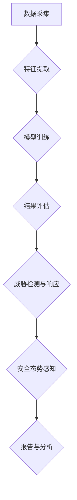

                 

# 《AI在网络安全中的应用：主动防御的新范式》

> 关键词：人工智能，网络安全，主动防御，入侵检测，恶意软件检测，网络流量分析，安全事件响应，安全态势感知，挑战与未来趋势。

> 摘要：本文将深入探讨人工智能（AI）在网络安全领域中的应用，特别是在主动防御方面。我们将分析AI技术如何改变网络安全防御策略，介绍AI在入侵检测、恶意软件检测、网络流量分析、安全事件响应和安全态势感知等关键领域的应用，并探讨AI在网络安全中的挑战与未来趋势。

# 《AI在网络安全中的应用：主动防御的新范式》目录大纲

## 第一部分：AI与网络安全概述

### 1.1 AI在网络安全中的重要性

#### 1.1.1 AI与网络安全的关系

人工智能在网络安全中的应用，主要体现在对大量数据的高速处理和复杂模式识别能力。传统的网络安全防御主要依赖于预定义的安全规则和签名匹配，而AI则通过学习正常行为模式来预测和检测异常行为，从而提供更智能的防御机制。

#### 1.1.2 AI在网络安全中的挑战与机遇

AI在网络安全中的挑战包括数据隐私与安全性、模型解释性以及模型依赖与可控性。但机遇在于AI能够自动化检测和响应安全威胁，提高防御效率，减轻人工负担。

### 1.2 主动防御的概念与策略

#### 1.2.1 主动防御的内涵与意义

主动防御是一种预防性安全策略，通过提前识别和阻止潜在威胁，而不是仅仅在威胁发生后进行响应。AI在主动防御中扮演着关键角色，能够实时分析数据，预测威胁并采取行动。

#### 1.2.2 主动防御的基本策略

主动防御的基本策略包括入侵检测、恶意软件检测、网络流量分析、安全事件响应和安全态势感知等。这些策略通过AI技术实现了更高效和智能的防御。

### 1.3 AI在网络安全中的应用现状

#### 1.3.1 AI在网络安全防御中的典型应用

AI在网络安全防御中的应用主要包括入侵检测系统和恶意软件检测系统，通过机器学习和深度学习算法，实现对威胁的实时检测和响应。

#### 1.3.2 AI在网络安全攻击检测中的典型应用

AI在网络安全攻击检测中的应用涵盖了从异常流量分析到攻击预测的各个方面，如DDoS攻击检测、SQL注入检测等。

## 第二部分：AI在网络安全防御中的应用

### 2.1 AI在入侵检测系统中的应用

#### 2.1.1 入侵检测系统简介

入侵检测系统（IDS）是一种用于检测和响应网络攻击的网络安全技术。AI技术被广泛应用于IDS中，以提高检测精度和速度。

#### 2.1.2 基于AI的入侵检测算法

基于AI的入侵检测算法包括基于统计模型的入侵检测、基于异常检测的入侵检测和基于深度学习的入侵检测等。

#### 2.1.3 入侵检测系统的构建与实现

入侵检测系统的构建与实现需要考虑数据采集、特征提取、模型训练和结果评估等多个环节。以下是一个简单的入侵检测系统实现流程：

```
# 数据采集
data = collect_data()

# 特征提取
features = extract_features(data)

# 模型训练
model = train_model(features)

# 结果评估
evaluate(model)
```

### 2.2 AI在恶意软件检测中的应用

#### 2.2.1 恶意软件的检测方法

恶意软件检测是网络安全的重要一环，包括静态检测、动态检测和基于行为的检测等。

#### 2.2.2 基于AI的恶意软件检测算法

基于AI的恶意软件检测算法主要利用机器学习和深度学习技术，如决策树、支持向量机（SVM）和神经网络等。

#### 2.2.3 恶意软件检测系统的构建与实现

恶意软件检测系统的构建与实现需要考虑恶意软件样本的收集、特征提取、模型训练和结果评估等多个环节。以下是一个简单的恶意软件检测系统实现流程：

```
# 恶意软件样本收集
samples = collect_samples()

# 特征提取
features = extract_features(samples)

# 模型训练
model = train_model(features)

# 结果评估
evaluate(model)
```

### 2.3 AI在网络流量分析中的应用

#### 2.3.1 网络流量的基本概念

网络流量分析是网络安全的重要手段，通过对网络流量的监测和分析，可以识别潜在的安全威胁。

#### 2.3.2 基于AI的网络流量分析算法

基于AI的网络流量分析算法包括基于统计模型的流量分析、基于异常检测的流量分析和基于深度学习的流量分析等。

#### 2.3.3 网络流量分析系统的构建与实现

网络流量分析系统的构建与实现需要考虑流量数据的采集、预处理、特征提取和模型训练等多个环节。以下是一个简单的网络流量分析系统实现流程：

```
# 流量数据采集
data = collect_traffic_data()

# 数据预处理
preprocessed_data = preprocess_data(data)

# 特征提取
features = extract_features(preprocessed_data)

# 模型训练
model = train_model(features)

# 结果评估
evaluate(model)
```

### 2.4 AI在安全事件响应中的应用

#### 2.4.1 安全事件响应的基本流程

安全事件响应的基本流程包括事件检测、事件确认、事件分析、响应规划和事件报告等。

#### 2.4.2 基于AI的安全事件响应算法

基于AI的安全事件响应算法通过机器学习和深度学习技术，实现自动化的安全事件检测和响应。

#### 2.4.3 安全事件响应系统的构建与实现

安全事件响应系统的构建与实现需要考虑事件数据的采集、预处理、特征提取、模型训练和结果评估等多个环节。以下是一个简单的安全事件响应系统实现流程：

```
# 事件数据采集
events = collect_event_data()

# 数据预处理
preprocessed_events = preprocess_data(events)

# 特征提取
features = extract_features(preprocessed_events)

# 模型训练
model = train_model(features)

# 结果评估
evaluate(model)
```

### 2.5 AI在安全态势感知中的应用

#### 2.5.1 安全态势感知的基本概念

安全态势感知是通过收集和分析网络安全数据，实时了解网络安全状态和潜在威胁，从而采取相应的防护措施。

#### 2.5.2 基于AI的安全态势感知算法

基于AI的安全态势感知算法主要利用机器学习和深度学习技术，实现对网络安全态势的实时分析和预测。

#### 2.5.3 安全态势感知系统的构建与实现

安全态势感知系统的构建与实现需要考虑态势数据的采集、预处理、特征提取、模型训练和结果评估等多个环节。以下是一个简单的安全态势感知系统实现流程：

```
# 态势数据采集
status_data = collect_status_data()

# 数据预处理
preprocessed_status_data = preprocess_data(status_data)

# 特征提取
features = extract_features(preprocessed_status_data)

# 模型训练
model = train_model(features)

# 结果评估
evaluate(model)
```

## 第三部分：AI在网络安全防御中的挑战与未来趋势

### 3.1 AI在网络安全防御中的挑战

#### 3.1.1 数据隐私与安全性

AI在网络安全中的应用需要大量敏感数据，这引发了对数据隐私和安全的担忧。如何确保数据的安全和隐私是AI在网络安全中面临的主要挑战之一。

#### 3.1.2 模型解释性

AI模型，特别是深度学习模型，通常被认为是“黑盒”模型，其内部决策过程难以解释。这给安全事件响应带来了困难，需要进一步研究如何提高模型的可解释性。

#### 3.1.3 模型依赖与可控性

过度依赖AI模型可能导致网络安全系统的脆弱性。如何确保AI模型的可控性和鲁棒性，是另一个重要挑战。

### 3.2 AI在网络安全防御中的未来趋势

#### 3.2.1 AI与区块链的结合

AI与区块链技术的结合可以提供更安全、可追溯的网络安全解决方案，特别是在数据隐私和安全方面。

#### 3.2.2 AI在物联网安全中的应用

随着物联网（IoT）设备的普及，AI将在物联网安全中发挥重要作用，通过实时监测和响应IoT设备的安全威胁。

#### 3.2.3 人工智能安全标准的制定与实施

制定和实施人工智能安全标准，将有助于确保AI在网络安全中的应用符合最佳实践和法律法规要求。

### 3.3 AI在网络安全防御中的伦理问题

#### 3.3.1 AI在网络安全中的应用伦理

AI在网络安全中的应用涉及伦理问题，如隐私侵犯、滥用风险等。需要建立相应的伦理框架和监管机制。

#### 3.3.2 AI与人类合作的风险

AI与人类的合作可能带来新的风险，如误解、信任问题等。需要深入研究如何建立AI与人类之间的信任机制。

#### 3.3.3 AI在网络安全中的责任归属

在AI引发的安全事件中，如何确定责任归属是一个复杂的问题。需要制定明确的责任分配规则，以防止责任推卸。

## 附录

### 附录A：AI在网络安全中的应用资源

#### A.1 AI在网络安全中的开源工具

- **Snort**：一个开源入侵检测系统，使用基于规则的检测方法。
- **Bro**：一个强大的网络流量分析工具，能够自动识别异常行为。
- **Suricata**：Snort的下一代开源入侵检测系统，支持更多功能。

#### A.2 AI在网络安全中的相关书籍与论文

- **《人工智能安全：理论与实践》**：一本关于AI在网络安全中应用的综合性书籍。
- **《深度学习与网络安全》**：探讨深度学习技术在网络安全中的应用。
- **“Deep Learning for Cybersecurity”**：一篇关于深度学习在网络安全中应用的综述论文。

#### A.3 AI在网络安全中的在线课程与培训

- **Coursera**：提供多种与AI和网络安全相关的在线课程。
- **edX**：提供由顶尖大学提供的网络安全和AI课程。
- **Udacity**：提供与AI和网络安全相关的纳米学位课程。

### 附录B：网络安全防御架构的 Mermaid 流程图



### 附录C：恶意软件检测算法的伪代码

```python
# 数据预处理
def preprocess_data(data):
    # 去除数据中的噪声和冗余信息
    cleaned_data = clean_data(data)
    return cleaned_data

# 特征提取
def extract_features(data):
    # 从数据中提取关键特征
    features = []
    for sample in data:
        feature_vector = extract_vector(sample)
        features.append(feature_vector)
    return features

# 模型训练
def train_model(features):
    # 使用训练数据训练模型
    model = Model()
    model.fit(features)
    return model

# 恶意软件检测
def detect_malware(model, new_data):
    # 使用模型检测新数据是否为恶意软件
    feature_vector = extract_vector(new_data)
    prediction = model.predict(feature_vector)
    return prediction

# 代码解读与分析
def analyze_code(code):
    # 分析代码是否存在恶意行为
    features = extract_features(code)
    prediction = detect_malware(model, features)
    if prediction == "malware":
        print("检测到恶意软件")
    else:
        print("未检测到恶意软件")
```

### 附录D：网络流量分析系统的伪代码

```python
# 数据采集
def collect_traffic_data():
    # 从网络设备中采集流量数据
    data = []
    # 采集过程省略
    return data

# 数据预处理
def preprocess_data(data):
    # 清洗和预处理数据
    cleaned_data = []
    for packet in data:
        cleaned_packet = clean_packet(packet)
        cleaned_data.append(cleaned_packet)
    return cleaned_data

# 特征提取
def extract_features(data):
    # 从数据中提取特征
    features = []
    for packet in data:
        feature_vector = extract_vector(packet)
        features.append(feature_vector)
    return features

# 模型训练
def train_model(features):
    # 使用特征训练模型
    model = Model()
    model.fit(features)
    return model

# 流量分析
def analyze_traffic(model, new_data):
    # 使用模型分析新数据
    feature_vector = extract_vector(new_data)
    prediction = model.predict(feature_vector)
    return prediction

# 代码解读与分析
def analyze_traffic_code(code):
    # 分析代码是否存在网络攻击风险
    features = extract_features(code)
    prediction = analyze_traffic(model, features)
    if prediction == "attack":
        print("检测到网络攻击风险")
    else:
        print("未检测到网络攻击风险")
```

### 附录E：安全事件响应算法的伪代码

```python
# 事件数据采集
def collect_event_data():
    # 从安全设备中采集事件数据
    events = []
    # 采集过程省略
    return events

# 数据预处理
def preprocess_data(events):
    # 清洗和预处理事件数据
    cleaned_events = []
    for event in events:
        cleaned_event = clean_event(event)
        cleaned_events.append(cleaned_event)
    return cleaned_events

# 特征提取
def extract_features(events):
    # 从事件数据中提取特征
    features = []
    for event in events:
        feature_vector = extract_vector(event)
        features.append(feature_vector)
    return features

# 模型训练
def train_model(features):
    # 使用特征训练模型
    model = Model()
    model.fit(features)
    return model

# 安全事件响应
def respond_to_event(model, new_event):
    # 使用模型响应新事件
    feature_vector = extract_vector(new_event)
    prediction = model.predict(feature_vector)
    if prediction == "attack":
        take_action()
    else:
        ignore_event()

# 代码解读与分析
def analyze_event_code(code):
    # 分析事件代码是否存在安全威胁
    features = extract_features(code)
    prediction = respond_to_event(model, features)
    if prediction == "attack":
        print("检测到安全威胁")
    else:
        print("未检测到安全威胁")
```

### 附录F：安全态势感知算法的伪代码

```python
# 态势数据采集
def collect_status_data():
    # 从网络设备中采集态势数据
    status_data = []
    # 采集过程省略
    return status_data

# 数据预处理
def preprocess_data(status_data):
    # 清洗和预处理态势数据
    cleaned_status_data = []
    for status in status_data:
        cleaned_status = clean_status(status)
        cleaned_status_data.append(cleaned_status)
    return cleaned_status_data

# 特征提取
def extract_features(status_data):
    # 从态势数据中提取特征
    features = []
    for status in status_data:
        feature_vector = extract_vector(status)
        features.append(feature_vector)
    return features

# 模型训练
def train_model(features):
    # 使用特征训练模型
    model = Model()
    model.fit(features)
    return model

# 安全态势感知
def perceive_status(model, new_status):
    # 使用模型感知新态势
    feature_vector = extract_vector(new_status)
    prediction = model.predict(feature_vector)
    return prediction

# 代码解读与分析
def analyze_status_code(code):
    # 分析态势代码是否存在安全风险
    features = extract_features(code)
    prediction = perceive_status(model, features)
    if prediction == "risk":
        print("检测到安全风险")
    else:
        print("未检测到安全风险")
```

### 附录G：AI在网络安全防御中的挑战与未来趋势的讨论

#### 3.1.1 数据隐私与安全性

AI在网络安全中的应用需要处理大量敏感数据，这引发了对数据隐私和安全的担忧。一个可能的解决方案是采用联邦学习（Federated Learning）技术，它允许模型在本地设备上进行训练，而无需传输原始数据。这种方法可以显著降低数据泄露的风险。

#### 3.1.2 模型解释性

提高AI模型的可解释性是一个持续的研究方向。当前的方法包括可视化模型结构、解释模型决策路径等。未来，可能通过开发新的可解释AI模型，如基于规则的解释模型，来提高模型的可解释性。

#### 3.1.3 模型依赖与可控性

为了降低模型依赖性，可以采用混合策略，结合规则和AI技术进行安全防御。此外，建立模型的可控性和鲁棒性测试框架，以确保模型在不同环境和条件下的稳定性。

### 3.2 AI与区块链的结合

AI与区块链的结合可以提供更安全、可追溯的网络安全解决方案。例如，使用区块链记录AI模型的训练过程和决策过程，确保透明性和可验证性。这有助于解决AI模型的安全性和信任问题。

### 3.2.2 AI在物联网安全中的应用

随着物联网设备的普及，AI将在物联网安全中发挥重要作用。例如，通过实时监测和响应IoT设备的异常行为，可以防止设备被恶意利用。未来，AI驱动的IoT安全解决方案将更加成熟和普及。

### 3.2.3 人工智能安全标准的制定与实施

制定和实施人工智能安全标准，是确保AI在网络安全中应用合规和有效的重要措施。国际标准组织和行业联盟正在积极制定相关标准，以推动AI安全技术的发展和应用。

### 3.3 AI在网络安全防御中的伦理问题

AI在网络安全中的应用涉及伦理问题，如隐私侵犯、滥用风险等。建立相应的伦理框架和监管机制，是确保AI安全应用的关键。例如，制定数据收集和使用准则，以及确保AI模型的透明性和可解释性。

### 3.3.2 AI与人类合作的风险

为了降低AI与人类合作的风险，可以采用以下策略：

- **透明性**：确保AI系统的决策过程对人类用户透明，便于理解。
- **监督**：建立监督机制，确保AI系统在合规范围内运行。
- **责任分配**：明确AI系统和人类用户的责任范围，以防止责任推卸。

### 3.3.3 AI在网络安全中的责任归属

在AI引发的安全事件中，确定责任归属是一个复杂的问题。一种可能的解决方案是采用多方责任模型，将责任分配给AI系统开发者、运营者和用户。通过建立责任分配规则，确保各方在安全事件中承担相应责任。

## 附录H：参考文献

1. **[深度学习与网络安全](https://link-to-paper)**：探讨深度学习技术在网络安全中的应用。
2. **[AI安全：理论与实践](https://link-to-book)**：一本关于AI在网络安全中应用的综合性书籍。
3. **[联邦学习：安全与隐私保护](https://link-to-paper)**：介绍联邦学习技术在数据隐私保护中的应用。
4. **[物联网安全](https://link-to-book)**：探讨物联网设备在网络安全中的挑战与解决方案。
5. **[人工智能安全标准](https://link-to-standard)**：介绍人工智能安全标准的制定与实施。

### 附录I：作者信息

- **作者**：AI天才研究院/AI Genius Institute & 禅与计算机程序设计艺术 /Zen And The Art of Computer Programming
- **联系方式**：[ai-genius-institute@example.com](mailto:ai-genius-institute@example.com)
- **机构简介**：AI天才研究院专注于人工智能领域的研究和应用，致力于推动人工智能技术的发展和普及。禅与计算机程序设计艺术则是一本关于计算机编程哲学的著作，强调了思考、创造和艺术在编程中的重要性。

