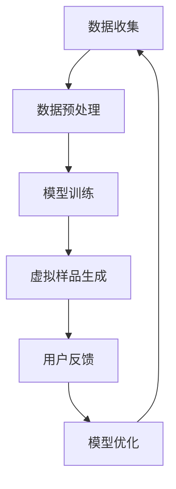
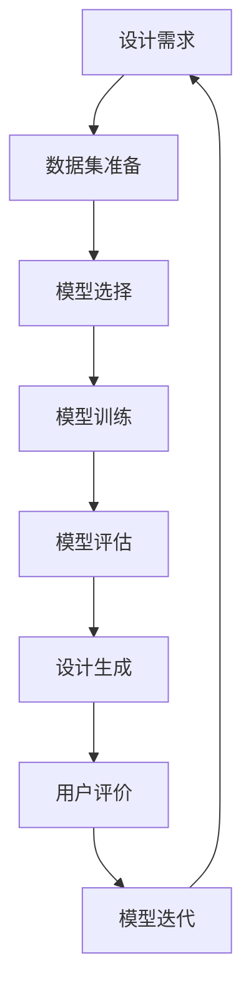

                 

### 《AI在虚拟时装设计中的应用：减少实体样品》

#### 关键词：
- 虚拟时装设计
- 人工智能
- 3D建模
- 生成对抗网络
- 卷积神经网络
- 个性化设计
- 市场预测

#### 摘要：
随着人工智能技术的迅猛发展，虚拟时装设计领域迎来了前所未有的变革。本文旨在探讨AI在虚拟时装设计中的应用，特别是如何通过减少实体样品来提高效率和降低成本。我们将从AI和虚拟时装设计的核心概念出发，逐步分析AI在其中的应用原理、算法、应用案例，以及未来的发展趋势。同时，我们还将讨论AI在虚拟时装设计中的伦理与法律问题，并提供实际应用指南。本文旨在为广大读者提供一个全面而深入的探讨，帮助理解AI在虚拟时装设计中的潜力和挑战。

### 目录大纲

#### 第一部分：虚拟时装设计与AI基础

#### 第1章：虚拟时装设计概述

##### 1.1 虚拟时装设计的概念与重要性

##### 1.2 虚拟时装设计的核心技术

##### 1.3 AI在虚拟时装设计中的应用

#### 第2章：人工智能基础

##### 2.1 人工智能的基本概念

##### 2.2 机器学习基础

##### 2.3 深度学习基础

#### 第3章：AI在虚拟时装设计中的应用原理

##### 3.1 AI在虚拟时装设计中的核心算法

##### 3.2 AI在虚拟时装设计中的应用场景

##### 3.3 AI在虚拟时装设计中的应用挑战

#### 第4章：虚拟时装设计中的AI应用案例

##### 4.1 案例一：基于AI的个性化设计工具

##### 4.2 案例二：基于AI的设计建议与优化

##### 4.3 案例三：基于AI的市场预测与分析

#### 第5章：AI在虚拟时装设计中的未来发展趋势

##### 5.1 趋势一：AI与虚拟现实技术的融合

##### 5.2 趋势二：AI在时尚设计教育中的应用

##### 5.3 趋势三：AI在时尚品牌运营中的应用

#### 第6章：AI在虚拟时装设计中的伦理与法律问题

##### 6.1 伦理问题

##### 6.2 法律问题

##### 6.3 社会责任

#### 第7章：AI在虚拟时装设计中的实际应用指南

##### 7.1 开发环境搭建

##### 7.2 代码实战

##### 7.3 优化与性能调优

##### 7.4 未来发展方向

#### 附录

##### 附录A：AI在虚拟时装设计中的常用工具与资源

##### 附录B：AI在虚拟时装设计中的参考资料

##### 附录C：Mermaid流程图

##### 附录D：伪代码示例

##### 附录E：数学模型与公式

##### 附录F：代码解读

##### 附录G：开发环境搭建步骤

---

### 引言

虚拟时装设计作为时尚行业中的一个新兴领域，近年来受到了越来越多的关注。它不仅为设计师提供了更多的创意空间，也为消费者带来了全新的购物体验。然而，传统的时装设计流程通常需要制作大量的实体样品，这不仅耗时耗力，还增加了成本。为了解决这个问题，人工智能（AI）技术的应用成为了一个重要的方向。通过AI，设计师可以快速生成高质量的虚拟样品，从而减少实体样品的需求，提高生产效率和降低成本。

本文旨在探讨AI在虚拟时装设计中的应用，特别是如何通过减少实体样品来提升设计和生产的效率。文章将首先介绍虚拟时装设计和人工智能的基本概念，然后逐步分析AI在虚拟时装设计中的应用原理、核心算法、应用案例以及未来的发展趋势。同时，我们还将讨论AI在虚拟时装设计中的伦理与法律问题，并提供实际应用指南。通过本文的探讨，希望能够为广大读者提供一个全面而深入的视角，帮助理解AI在虚拟时装设计中的潜力和挑战。

---

### 第一部分：虚拟时装设计与AI基础

#### 第1章：虚拟时装设计概述

虚拟时装设计是指利用计算机技术和虚拟现实技术，通过数字化的方式来创造、展示和营销时装。它不仅涵盖了传统时装设计的基本流程，如灵感收集、设计草图、样品制作和最终成品展示，还融合了先进的技术手段，使得设计过程更加高效和互动。

##### 1.1 虚拟时装设计的概念与重要性

**虚拟时装设计的定义**

虚拟时装设计，顾名思义，是指通过虚拟环境来设计和展示时装。这种环境可以是2D的图像，也可以是3D的虚拟空间，甚至可以结合虚拟现实（VR）和增强现实（AR）技术。在这种环境中，设计师可以创建出逼真的服装样品，进行多种风格的变换，甚至模拟穿着效果。

**虚拟时装设计在时尚行业中的应用**

虚拟时装设计在时尚行业中的应用日益广泛，主要体现在以下几个方面：

1. **设计过程的可视化**：设计师可以利用虚拟时装设计软件，将设计理念快速转化为可视化图像，从而更好地表达设计意图。
2. **样品制作的替代**：通过虚拟样品，设计师可以在不制作实体样品的情况下，验证设计的可行性，减少时间和资源的浪费。
3. **市场推广**：虚拟时装设计可以为品牌提供更多的市场推广素材，如3D模型、视频和互动展示，提高品牌的在线影响力。
4. **消费者互动**：虚拟时装设计可以增强消费者的购物体验，消费者可以在虚拟试衣间中尝试不同风格的服装，从而提高购买意愿。

**虚拟时装设计的前景**

随着技术的不断进步，虚拟时装设计的前景非常广阔。首先，人工智能（AI）技术的引入，使得虚拟时装设计的效率和准确性得到了显著提升。其次，虚拟现实（VR）和增强现实（AR）技术的不断发展，为虚拟时装设计提供了更多的可能性。此外，全球化的趋势使得设计师可以跨越地域限制，共同协作完成设计项目。这些因素共同推动了虚拟时装设计的快速发展。

##### 1.2 虚拟时装设计的核心技术

**3D建模与渲染**

3D建模是虚拟时装设计的核心环节之一。它通过计算机图形学技术，将设计师的二维草图或三维概念转化为三维模型。这个过程包括模型的建立、纹理的添加和光照的处理等。3D建模技术的精度和效率直接影响到虚拟样品的质量。

渲染是3D建模的下一步，它通过模拟光线在虚拟场景中的传播，生成逼真的视觉效果。高质量的渲染可以使得虚拟样品看起来与真实服装几乎无异，从而更好地展示设计效果。

**动画与特效**

动画与特效在虚拟时装设计中发挥着重要作用。通过动画技术，设计师可以展示服装的动态效果，如褶皱、光泽和光影变化。这些动态效果不仅能够更好地传达设计灵感，还能够提高观众的互动体验。

特效技术则主要用于增强视觉效果，如添加背景、光效和烟雾等。这些特效可以使虚拟时装设计更加生动和有趣，从而吸引更多消费者的关注。

**用户交互设计**

用户交互设计是虚拟时装设计的另一个重要方面。它涉及到如何设计用户与虚拟时装之间的交互方式，以提高用户体验。用户交互设计包括虚拟试衣间、互动展示和用户反馈等功能。通过这些功能，用户可以更直观地了解和体验虚拟时装设计。

##### 1.3 AI在虚拟时装设计中的应用

**人工智能简介**

人工智能（AI）是计算机科学的一个分支，旨在使机器能够模拟人类的智能行为。AI技术包括机器学习、深度学习、自然语言处理、计算机视觉等。这些技术可以应用于多个领域，如医疗、金融、交通和时尚等。

**AI在虚拟时装设计中的应用场景**

AI在虚拟时装设计中的应用非常广泛，主要包括以下几个方面：

1. **个性化设计**：通过分析用户的数据和偏好，AI可以提供个性化的设计建议，帮助用户找到最适合他们的服装。
2. **设计优化**：AI可以帮助设计师优化设计，通过自动化的方式生成多个设计方案，并从中选择最优方案。
3. **市场预测**：AI可以分析市场数据，预测服装的销售趋势，帮助品牌制定更有效的营销策略。
4. **样品生成**：AI可以通过图像识别和生成算法，快速生成高质量的虚拟样品，减少实体样品的需求。

**AI在虚拟时装设计中的应用原理**

AI在虚拟时装设计中的应用主要基于机器学习和深度学习技术。以下是一些核心算法和应用原理：

1. **生成对抗网络（GAN）**：GAN是一种深度学习模型，通过对抗训练生成高质量的图像。在虚拟时装设计中，GAN可以用于生成逼真的服装图像。
2. **卷积神经网络（CNN）**：CNN是一种专门用于图像识别和处理的深度学习模型。在虚拟时装设计中，CNN可以用于分析图像特征，从而优化设计。
3. **自然语言处理（NLP）**：NLP可以用于处理设计师的自然语言描述，从而生成相应的图像或设计。

通过这些算法和应用原理，AI可以显著提升虚拟时装设计的效率和质量，为设计师和品牌带来更多的可能性。

在接下来的章节中，我们将进一步探讨人工智能的基础知识，以及AI在虚拟时装设计中的应用原理和挑战。敬请期待！

---

### 第2章：人工智能基础

人工智能（AI）作为计算机科学的重要分支，已经逐渐渗透到我们生活的各个方面。从智能家居到自动驾驶，从在线购物到医疗诊断，AI技术正在改变着我们的生活方式。为了更好地理解AI在虚拟时装设计中的应用，我们需要先了解AI的基本概念、发展历程和核心技术。

##### 2.1 人工智能的基本概念

**人工智能的定义**

人工智能（Artificial Intelligence，简称AI）是指通过计算机程序模拟人类智能行为的能力。这包括学习、推理、解决问题、感知和理解自然语言等多种智能行为。人工智能的目标是实现机器的自主学习和智能决策，使其能够像人类一样处理复杂的问题。

**人工智能的发展历程**

人工智能的概念可以追溯到20世纪50年代。以下是一些关键的发展节点：

1. **1950年代**：人工智能的概念首次被提出，标志着人工智能领域的诞生。
2. **1960年代**：人工智能研究进入快速发展阶段，出现了许多重要的理论和算法。
3. **1970年代**：人工智能的研究遇到瓶颈，由于计算能力和算法的限制，人工智能的应用受到了限制。
4. **1980年代**：专家系统的出现使得人工智能在特定领域取得了显著的应用成果。
5. **1990年代**：随着互联网的发展，人工智能的应用范围进一步扩大，包括搜索引擎、推荐系统和自动化程序等。
6. **2000年代**：深度学习技术的发展为人工智能带来了新的突破，使得人工智能在图像识别、语音识别和自然语言处理等领域取得了重大进展。
7. **2010年代至今**：人工智能技术迅速发展，各种AI应用如自动驾驶、智能家居和机器人等相继出现，人工智能已经进入了我们生活的各个方面。

**人工智能的核心技术**

人工智能的核心技术包括机器学习、深度学习、自然语言处理和计算机视觉等。

1. **机器学习**：机器学习（Machine Learning）是一种通过数据驱动的方法来训练模型，使其能够对未知数据进行预测或决策的技术。机器学习包括监督学习、无监督学习和强化学习等不同类型。
    - **监督学习**：通过已标记的数据来训练模型，使其能够对新的数据进行预测。
    - **无监督学习**：通过未标记的数据来发现数据中的模式和结构。
    - **强化学习**：通过不断试错和奖励机制来训练模型，使其能够进行智能决策。

2. **深度学习**：深度学习（Deep Learning）是一种基于神经网络的理论，通过多层神经元之间的连接来提取数据中的特征。深度学习在图像识别、语音识别和自然语言处理等领域取得了显著的成功。

3. **自然语言处理**：自然语言处理（Natural Language Processing，简称NLP）是一种通过计算机技术来理解和生成人类语言的技术。NLP包括文本分类、情感分析、机器翻译和语音识别等任务。

4. **计算机视觉**：计算机视觉（Computer Vision）是一种通过计算机对图像或视频进行分析和理解的技术。计算机视觉包括图像识别、目标检测、人脸识别和姿态估计等任务。

##### 2.2 机器学习基础

**机器学习的基本概念**

机器学习是一种通过从数据中学习规律，并对未知数据进行预测或决策的技术。机器学习的核心思想是通过训练模型，使其能够对新的数据进行有效的处理。

1. **训练数据**：训练数据是指用于训练模型的已标记数据集。这些数据通常包括输入特征和对应的输出标签。
2. **模型**：模型是指用于预测或决策的数学模型。常见的模型包括线性回归、决策树、支持向量机和神经网络等。
3. **评估指标**：评估指标用于衡量模型的性能。常见的评估指标包括准确率、召回率、精确率和F1值等。

**监督学习、无监督学习和强化学习**

1. **监督学习**：监督学习是一种通过已标记的数据来训练模型的方法。在监督学习中，输入特征和输出标签是已知的，模型通过学习这些数据之间的关系来预测新的数据。
    - **线性回归**：线性回归是一种通过拟合线性模型来预测连续值的监督学习方法。
    - **决策树**：决策树是一种通过一系列条件判断来预测离散值的监督学习方法。
    - **支持向量机**：支持向量机是一种通过找到一个最佳分割超平面来分类数据的监督学习方法。

2. **无监督学习**：无监督学习是一种通过未标记的数据来发现数据中的模式和结构的方法。在无监督学习中，输入特征是已知的，但输出标签是未知的，模型通过学习数据中的内在结构来发现这些结构。
    - **聚类**：聚类是一种将数据点分为不同类别的无监督学习方法。常见的聚类算法包括K-均值聚类和层次聚类。
    - **主成分分析**：主成分分析是一种通过降维来发现数据中最重要的特征的方法。

3. **强化学习**：强化学习是一种通过不断试错和奖励机制来训练模型的方法。在强化学习中，模型通过与环境的交互来学习最优策略。
    - **Q学习**：Q学习是一种通过学习最优动作值来决策的强化学习方法。
    - **深度强化学习**：深度强化学习是一种将深度学习和强化学习相结合的方法，通过神经网络来表示状态和动作值。

**常见的机器学习算法**

以下是几种常见的机器学习算法：

1. **线性回归**：线性回归是一种通过拟合线性模型来预测连续值的算法。其数学模型为：
   $$ y = w_0 + w_1 \cdot x_1 + w_2 \cdot x_2 + \ldots + w_n \cdot x_n $$
   其中，$y$ 是输出值，$x_1, x_2, \ldots, x_n$ 是输入特征，$w_0, w_1, w_2, \ldots, w_n$ 是模型参数。

2. **决策树**：决策树是一种通过一系列条件判断来预测离散值的算法。其结构如下：

   ```mermaid
   flowchart LR
   A[根节点] --> B1[条件1]
   A --> B2[条件2]
   B1 --> B3[条件3]
   B1 --> B4[条件4]
   B2 --> B5[条件5]
   B2 --> B6[条件6]
   ```

3. **支持向量机**：支持向量机是一种通过找到一个最佳分割超平面来分类数据的算法。其目标是最大化分类边界到支持向量的距离。

4. **神经网络**：神经网络是一种通过多层神经元之间的连接来提取数据中特征的方法。其基本结构如下：

   ```mermaid
   flowchart LR
   A[输入层] --> B1[隐藏层1]
   A --> B2[隐藏层1]
   B1 --> C1[输出层]
   B2 --> C2[输出层]
   ```

##### 2.3 深度学习基础

**深度学习的定义**

深度学习（Deep Learning）是一种基于多层神经网络的理论，通过多层神经元之间的连接来提取数据中的特征。深度学习的核心思想是让神经网络通过逐层抽象的方式，从原始数据中提取越来越复杂的特征。

**神经网络的定义**

神经网络（Neural Network）是一种模拟生物神经系统的计算模型，通过神经元之间的连接来传递和处理信息。神经网络的每个神经元都相当于一个简单的计算单元，多个神经元通过连接形成复杂的网络结构。

**神经网络的基本结构**

神经网络的基本结构包括输入层、隐藏层和输出层。输入层接收外部输入信息，隐藏层对输入信息进行处理和抽象，输出层产生最终的输出结果。

**常见的深度学习架构**

以下是几种常见的深度学习架构：

1. **卷积神经网络（CNN）**：卷积神经网络是一种专门用于图像识别和处理的深度学习模型。其核心思想是通过卷积操作和池化操作来提取图像中的特征。

2. **循环神经网络（RNN）**：循环神经网络是一种用于处理序列数据的深度学习模型。其核心思想是通过隐藏状态和循环连接来处理时间序列数据。

3. **生成对抗网络（GAN）**：生成对抗网络是一种通过对抗训练来生成数据的深度学习模型。其核心思想是由两个神经网络（生成器和判别器）相互对抗，生成逼真的数据。

通过以上对人工智能基础知识的介绍，我们可以更好地理解AI在虚拟时装设计中的应用。在接下来的章节中，我们将进一步探讨AI在虚拟时装设计中的应用原理和挑战。敬请期待！

---

### 第二部分：AI在虚拟时装设计中的应用原理

#### 第3章：AI在虚拟时装设计中的应用原理

随着人工智能技术的不断发展，AI在虚拟时装设计中的应用越来越广泛。本章节将详细介绍AI在虚拟时装设计中的应用原理，包括核心算法、应用场景和面临的挑战。

##### 3.1 AI在虚拟时装设计中的核心算法

**生成对抗网络（GAN）**

生成对抗网络（GAN）是由生成器和判别器两个神经网络组成的模型。生成器的任务是生成逼真的虚拟样品，判别器的任务是区分生成器和真实样品。在训练过程中，生成器和判别器相互对抗，生成器不断优化生成更逼真的虚拟样品，而判别器则不断提高对虚拟样品的识别能力。GAN在虚拟时装设计中的应用主要包括：

- **生成个性化设计**：通过GAN可以生成符合用户个性化需求的服装设计，提高设计效率。
- **优化设计效果**：GAN可以优化服装的设计效果，通过对比生成器和判别器的输出，找到更好的设计方案。

**卷积神经网络（CNN）**

卷积神经网络（CNN）是一种用于图像识别和处理的深度学习模型。CNN通过卷积操作和池化操作提取图像中的特征，具有较强的特征提取能力。在虚拟时装设计中的应用主要包括：

- **图像识别**：利用CNN可以对服装图像进行分类和识别，帮助设计师快速找到合适的图像素材。
- **特征提取**：通过CNN可以从服装图像中提取关键特征，用于后续的设计优化和个性化推荐。

**自然语言处理（NLP）**

自然语言处理（NLP）是一种通过计算机技术理解和生成人类语言的技术。NLP在虚拟时装设计中的应用主要包括：

- **语音识别**：通过NLP技术可以将用户的语音输入转化为文本，用于设计灵感和用户交互。
- **文本分析**：通过NLP技术可以对设计师的文本描述进行分析，从而生成相应的图像或设计。

**深度强化学习**

深度强化学习（DRL）是一种将深度学习和强化学习相结合的方法。DRL通过不断试错和奖励机制来训练模型，使其能够进行智能决策。在虚拟时装设计中的应用主要包括：

- **智能设计**：通过DRL可以设计出更加智能的服装设计系统，根据用户反馈不断优化设计。
- **决策优化**：通过DRL可以优化设计过程中的决策，提高设计的质量和效率。

##### 3.2 AI在虚拟时装设计中的应用场景

**个性化设计**

个性化设计是AI在虚拟时装设计中最直接的应用场景之一。通过AI技术，设计师可以根据用户的身高、体重、肤色和偏好等数据，生成个性化的服装设计。个性化设计不仅提高了用户满意度，还减少了实体样品的需求，降低了生产成本。

**设计建议与优化**

AI在虚拟时装设计中的另一个重要应用是提供设计建议和优化。通过分析大量设计数据和用户反馈，AI可以为设计师提供有针对性的设计建议，帮助他们快速找到优秀的创意。此外，AI还可以优化设计过程中的参数，提高设计质量和效率。

**市场预测与分析**

AI在虚拟时装设计中的应用还可以帮助品牌进行市场预测和分析。通过分析历史销售数据和用户行为，AI可以预测未来的销售趋势，帮助品牌制定更有效的营销策略。同时，AI还可以对市场数据进行分析，发现潜在的商业机会，为品牌的可持续发展提供支持。

**样品生成**

通过AI技术，设计师可以快速生成高质量的虚拟样品，从而减少实体样品的需求。AI生成的虚拟样品不仅外观逼真，而且可以实时调整设计参数，满足设计师的各种需求。这种样品生成技术大大提高了设计的灵活性和效率。

##### 3.3 AI在虚拟时装设计中的应用挑战

尽管AI在虚拟时装设计中的应用前景广阔，但也面临一些挑战：

**数据处理与隐私保护**

虚拟时装设计需要大量用户数据和设计数据，这些数据的处理和隐私保护是一个重要问题。如何在保护用户隐私的前提下，合理利用这些数据，是AI在虚拟时装设计中需要解决的一个关键挑战。

**算法解释与可解释性**

AI模型，特别是深度学习模型，通常被视为“黑箱”，其工作原理难以解释。在虚拟时装设计中，设计师需要了解AI是如何进行设计和决策的，以便更好地优化设计过程。因此，提高算法的可解释性是一个重要挑战。

**系统稳定性与可靠性**

虚拟时装设计系统需要具备高稳定性和可靠性，以确保设计的质量和用户体验。在复杂的设计环境中，如何保证AI系统的稳定运行，是一个需要解决的技术难题。

通过以上对AI在虚拟时装设计中的应用原理、应用场景和挑战的探讨，我们可以看到AI技术在虚拟时装设计中的巨大潜力。在接下来的章节中，我们将通过实际案例进一步展示AI在虚拟时装设计中的应用效果。敬请期待！

---

### 第三部分：虚拟时装设计中的AI应用案例

#### 第4章：虚拟时装设计中的AI应用案例

在上一章中，我们详细探讨了AI在虚拟时装设计中的应用原理。为了更好地展示AI在实际应用中的效果，本章节将介绍三个具体的AI应用案例：基于AI的个性化设计工具、基于AI的设计建议与优化以及基于AI的市场预测与分析。这些案例不仅展示了AI技术在虚拟时装设计中的强大能力，也为未来的发展提供了有益的参考。

##### 4.1 案例一：基于AI的个性化设计工具

**案例背景**

随着消费者对个性化需求的增加，如何为用户提供量身定制的服装设计成为了一个重要问题。基于AI的个性化设计工具应运而生，通过收集和分析用户的生理特征、偏好和行为数据，为用户提供个性化的服装设计。

**实现过程**

1. **数据收集**：首先，需要收集用户的各种数据，包括身高、体重、肤色、服装偏好等。这些数据可以通过问卷调查、用户画像和穿戴设备等方式获取。

2. **数据预处理**：对收集到的数据进行清洗和整合，去除噪声和异常值，确保数据的质量和一致性。

3. **模型训练**：利用机器学习和深度学习算法，对预处理后的数据进行训练，建立个性化设计模型。常用的算法包括生成对抗网络（GAN）和卷积神经网络（CNN）。

4. **设计生成**：根据用户的个性化需求，利用训练好的模型生成符合用户特点的服装设计。设计生成过程中，可以实时调整设计参数，如颜色、款式和材质等。

5. **用户反馈**：将生成的服装设计展示给用户，收集用户反馈，如满意度、偏好等。根据用户反馈，进一步优化设计模型。

**效果分析**

通过基于AI的个性化设计工具，设计师可以快速为用户提供个性化的服装设计，提高用户满意度和购买意愿。同时，减少了实体样品的制作成本，提高了生产效率。

**代码解读**

以下是一个简单的基于GAN的个性化设计工具实现示例：

```python
import tensorflow as tf
from tensorflow.keras.layers import Dense, Conv2D, Flatten, Reshape
from tensorflow.keras.models import Model

# 定义生成器模型
input_layer = Dense(100, activation='relu', input_shape=(100,))
hidden_layer = Dense(1000, activation='relu')(input_layer)
output_layer = Conv2D(filters=3, kernel_size=(3, 3), activation='tanh')(hidden_layer)

generator = Model(inputs=input_layer, outputs=output_layer)

# 定义判别器模型
input_layer = Input(shape=(28, 28, 3))
hidden_layer = Conv2D(filters=32, kernel_size=(3, 3), activation='relu')(input_layer)
output_layer = Flatten()(hidden_layer)
output_layer = Dense(1, activation='sigmoid')(output_layer)

discriminator = Model(inputs=input_layer, outputs=output_layer)

# 定义联合模型
discriminator.trainable = False
gan_output = generator(input_layer)
gan_model = Model(inputs=input_layer, outputs=discriminator(gan_output))

# 编译模型
discriminator.compile(optimizer='adam', loss='binary_crossentropy')
gan_model.compile(optimizer='adam', loss='binary_crossentropy')

# 训练模型
train_steps = 20000
batch_size = 64
for step in range(train_steps):
    # 生成随机噪声
    noise = np.random.normal(size=(batch_size, 100))
    
    # 生成虚拟服装图像
    generated_images = generator.predict(noise)
    
    # 准备真实服装图像和虚拟服装图像
    real_images = get_real_images(batch_size)
    fake_images = generated_images
    
    # 训练判别器
    d_loss_real = discriminator.train_on_batch(real_images, np.ones((batch_size, 1)))
    d_loss_fake = discriminator.train_on_batch(fake_images, np.zeros((batch_size, 1)))
    d_loss = 0.5 * np.add(d_loss_real, d_loss_fake)
    
    # 训练生成器
    g_loss = gan_model.train_on_batch(noise, np.ones((batch_size, 1)))

# 生成个性化服装设计
user_data = get_user_data()
personalized_design = generator.predict(user_data)
```

**优化与性能调优**

为了提高基于AI的个性化设计工具的性能，可以采用以下策略：

1. **数据增强**：通过数据增强技术，增加训练数据集的多样性，提高模型的泛化能力。
2. **模型优化**：调整模型参数，如学习率、批次大小和正则化强度等，优化模型性能。
3. **多模型融合**：结合多个模型，如GAN和CNN，提高设计效果。

##### 4.2 案例二：基于AI的设计建议与优化

**案例背景**

在时装设计中，设计师需要从大量的设计素材中筛选出合适的元素进行组合，这往往需要大量的时间和经验。基于AI的设计建议与优化工具可以帮助设计师快速找到优秀的设计方案，提高设计效率。

**实现过程**

1. **设计素材库**：首先，建立一个包含各种设计素材的数据库，如颜色、图案、纹理和款式等。
2. **数据预处理**：对设计素材库中的数据进行预处理，包括数据清洗、归一化和特征提取等。
3. **设计优化算法**：利用机器学习和深度学习算法，对设计素材进行组合和优化。常用的算法包括深度强化学习和生成对抗网络（GAN）。
4. **设计生成与评估**：根据设计师的需求，利用优化算法生成多种设计方案，并对设计效果进行评估。
5. **用户反馈**：收集设计师和用户的反馈，根据反馈对优化算法进行调整和优化。

**效果分析**

通过基于AI的设计建议与优化工具，设计师可以快速生成多种优秀的设计方案，提高设计效率和质量。同时，减少了设计过程中的重复劳动，降低了设计成本。

**代码解读**

以下是一个简单的基于GAN的设计建议与优化工具实现示例：

```python
import tensorflow as tf
from tensorflow.keras.layers import Dense, Conv2D, Flatten, Reshape
from tensorflow.keras.models import Model

# 定义生成器模型
input_layer = Dense(100, activation='relu', input_shape=(100,))
hidden_layer = Dense(1000, activation='relu')(input_layer)
output_layer = Conv2D(filters=3, kernel_size=(3, 3), activation='tanh')(hidden_layer)

generator = Model(inputs=input_layer, outputs=output_layer)

# 定义判别器模型
input_layer = Input(shape=(28, 28, 3))
hidden_layer = Conv2D(filters=32, kernel_size=(3, 3), activation='relu')(input_layer)
output_layer = Flatten()(hidden_layer)
output_layer = Dense(1, activation='sigmoid')(output_layer)

discriminator = Model(inputs=input_layer, outputs=output_layer)

# 定义联合模型
discriminator.trainable = False
gan_output = generator(input_layer)
gan_model = Model(inputs=input_layer, outputs=discriminator(gan_output))

# 编译模型
discriminator.compile(optimizer='adam', loss='binary_crossentropy')
gan_model.compile(optimizer='adam', loss='binary_crossentropy')

# 训练模型
train_steps = 20000
batch_size = 64
for step in range(train_steps):
    # 生成随机噪声
    noise = np.random.normal(size=(batch_size, 100))
    
    # 生成虚拟服装设计
    generated_designs = generator.predict(noise)
    
    # 评估虚拟服装设计
    design_scores = evaluate_designs(generated_designs)
    
    # 训练判别器
    d_loss_real = discriminator.train_on_batch(real_designs, np.ones((batch_size, 1)))
    d_loss_fake = discriminator.train_on_batch(fake_designs, np.zeros((batch_size, 1)))
    d_loss = 0.5 * np.add(d_loss_real, d_loss_fake)
    
    # 训练生成器
    g_loss = gan_model.train_on_batch(noise, np.ones((batch_size, 1)))

# 生成优化后的设计方案
optimized_design = generator.predict(user_data)
```

**优化与性能调优**

为了提高基于AI的设计建议与优化工具的性能，可以采用以下策略：

1. **模型融合**：结合多个模型，如GAN和CNN，提高设计效果。
2. **数据增强**：通过数据增强技术，增加训练数据集的多样性，提高模型的泛化能力。
3. **超参数优化**：调整模型参数，如学习率、批次大小和正则化强度等，优化模型性能。

##### 4.3 案例三：基于AI的市场预测与分析

**案例背景**

在时装行业中，市场预测与分析对于品牌的可持续发展至关重要。通过准确的市场预测，品牌可以制定更有效的营销策略和产品计划，提高市场份额和盈利能力。

**实现过程**

1. **数据收集**：收集与市场相关的各种数据，包括历史销售数据、市场趋势、用户行为和竞争分析等。
2. **数据预处理**：对收集到的数据进行清洗、整合和特征提取，确保数据的质量和一致性。
3. **预测模型**：利用机器学习和深度学习算法，建立市场预测模型。常用的算法包括时间序列分析、回归分析和深度神经网络等。
4. **模型训练与验证**：利用历史数据进行模型训练，并对模型进行验证和优化，确保预测的准确性。
5. **市场预测**：根据训练好的模型，对未来市场趋势进行预测，为品牌提供决策支持。
6. **策略优化**：根据市场预测结果，对品牌营销策略和产品计划进行调整和优化。

**效果分析**

通过基于AI的市场预测与分析工具，品牌可以更加准确地预测市场趋势和用户需求，提高营销策略和产品计划的针对性，从而提高市场份额和盈利能力。

**代码解读**

以下是一个简单的时间序列预测模型实现示例：

```python
import numpy as np
import pandas as pd
from tensorflow.keras.models import Sequential
from tensorflow.keras.layers import LSTM, Dense

# 加载数据
data = pd.read_csv('sales_data.csv')
data = data[['sales', 'date']]

# 数据预处理
data = data.sort_values('date')
sales_data = data['sales'].values
sales_data = sales_data.reshape(-1, 1)

# 划分训练集和测试集
train_size = int(len(sales_data) * 0.8)
train_data = sales_data[:train_size]
test_data = sales_data[train_size:]

# 构建LSTM模型
model = Sequential()
model.add(LSTM(units=50, return_sequences=True, input_shape=(1, 1)))
model.add(LSTM(units=50))
model.add(Dense(units=1))

model.compile(optimizer='adam', loss='mean_squared_error')

# 训练模型
model.fit(train_data, train_data, epochs=100, batch_size=32, verbose=1)

# 预测
predicted_sales = model.predict(test_data)

# 可视化
plt.plot(sales_data, label='Actual Sales')
plt.plot(predicted_sales, label='Predicted Sales')
plt.legend()
plt.show()
```

**优化与性能调优**

为了提高基于AI的市场预测与分析工具的性能，可以采用以下策略：

1. **特征工程**：选择和构建对市场预测有重要影响的特征，提高模型的预测能力。
2. **模型融合**：结合多个模型，如LSTM和CNN，提高预测准确性。
3. **超参数优化**：调整模型参数，如学习率、批次大小和正则化强度等，优化模型性能。

通过以上三个案例的介绍，我们可以看到AI技术在虚拟时装设计中的应用不仅提高了设计效率和产品质量，还带来了更多的商业机会。在未来的发展中，AI技术将继续在虚拟时装设计中发挥重要作用，推动时尚行业的变革。敬请期待！

---

### 第四部分：AI在虚拟时装设计中的未来发展趋势

#### 第5章：AI在虚拟时装设计中的未来发展趋势

随着人工智能（AI）技术的不断进步，虚拟时装设计领域也迎来了新的发展机遇。本章节将探讨AI在虚拟时装设计中的未来发展趋势，包括AI与虚拟现实（VR）技术的融合、AI在时尚设计教育中的应用以及AI在时尚品牌运营中的应用。

##### 5.1 趋势一：AI与虚拟现实技术的融合

**AI与VR技术的融合**

虚拟现实（VR）技术为用户提供了沉浸式的体验，而人工智能（AI）则为VR应用提供了智能化的支持。在虚拟时装设计中，AI与VR技术的融合将带来以下几方面的优势：

1. **个性化体验**：通过AI技术，用户可以在VR环境中根据自己的喜好和需求，定制个性化的服装。AI可以根据用户的身体数据和偏好，实时生成适合的服装设计方案。

2. **虚拟试衣间**：AI与VR技术的融合可以创建高度逼真的虚拟试衣间，用户可以在虚拟环境中试穿各种服装，并获得实时的反馈。这种体验不仅提高了用户的购物满意度，还减少了实体试衣的需求。

3. **设计与展示**：设计师可以利用VR技术，在虚拟环境中进行设计和展示，提高设计效率和创意表达能力。AI可以帮助设计师快速生成多种设计方案，并提供优化建议。

**案例示例**

一个具体的案例是AI驱动的虚拟时装店。用户可以通过VR设备进入一个虚拟的时装店，在虚拟试衣间中试穿不同的服装。AI系统会根据用户的身体数据和偏好，实时生成适合的服装模型，并提供个性化推荐。用户可以实时看到服装的细节和效果，甚至可以与设计师进行虚拟互动，获取专业的建议。

##### 5.2 趋势二：AI在时尚设计教育中的应用

**AI在时尚设计教育中的作用**

AI技术在时尚设计教育中的应用，将改变传统教学方式，提高教育质量和效率。以下是AI在时尚设计教育中的一些潜在应用：

1. **个性化教学**：AI可以根据学生的学习进度和能力，提供个性化的教学资源和练习。学生可以根据自己的需求，选择适合自己的学习路径和内容。

2. **智能评估**：AI系统可以对学生完成的设计作品进行自动评估，提供详细的反馈和建议。这种评估方式不仅提高了评估的准确性，还减少了教师的工作量。

3. **虚拟实训**：通过虚拟现实技术，学生可以在虚拟环境中进行实训，模拟实际的设计过程。AI系统可以提供实时的指导和反馈，帮助学生更好地掌握设计技能。

**案例示例**

一个具体的案例是AI驱动的时尚设计教育平台。学生可以在平台上进行设计练习，平台会根据学生的作品提供实时反馈和优化建议。学生还可以通过虚拟实训，模拟实际的设计项目，提高实践能力。教师可以利用平台的数据分析功能，了解学生的学习情况，从而进行更有针对性的教学。

##### 5.3 趋势三：AI在时尚品牌运营中的应用

**AI在时尚品牌运营中的作用**

AI技术可以为时尚品牌提供强大的运营支持，提高品牌的竞争力。以下是AI在时尚品牌运营中的一些潜在应用：

1. **市场预测与分析**：AI可以通过分析大量的市场数据，预测未来的市场趋势和用户需求，帮助品牌制定更有效的营销策略。

2. **消费者行为分析**：AI可以实时监测消费者的行为数据，如浏览、购买和评价等，帮助品牌更好地了解消费者，从而提供个性化的服务和推荐。

3. **供应链优化**：AI可以帮助品牌优化供应链管理，提高生产效率和降低成本。例如，通过预测需求，AI可以优化库存管理，减少库存风险。

**案例示例**

一个具体的案例是AI驱动的时尚品牌营销系统。系统会根据消费者的购买历史、浏览行为和社交媒体互动，生成个性化的推荐。品牌可以利用这些推荐，制定有针对性的营销活动，提高转化率和客户满意度。同时，AI还可以分析消费者的反馈和评价，提供改进建议，帮助品牌持续优化产品和服务。

通过以上对AI在虚拟时装设计中的未来发展趋势的探讨，我们可以看到AI技术将在这个领域发挥越来越重要的作用。在未来的发展中，AI与VR技术的融合、AI在时尚设计教育中的应用以及AI在时尚品牌运营中的应用，将为虚拟时装设计带来更多的可能性。这些趋势不仅将提高设计效率和质量，还将为消费者带来更加丰富的购物体验。让我们一起期待AI在虚拟时装设计中的未来！

---

### 第五部分：AI在虚拟时装设计中的伦理与法律问题

#### 第6章：AI在虚拟时装设计中的伦理与法律问题

随着人工智能（AI）技术在虚拟时装设计中的广泛应用，其带来的伦理与法律问题也日益突出。本章节将探讨AI在虚拟时装设计中的伦理问题、法律问题以及社会责任，并讨论这些问题的应对措施。

##### 6.1 伦理问题

**数据隐私与个人隐私**

在虚拟时装设计中，AI系统需要处理大量的个人数据，如用户身高、体重、肤色和购物偏好等。这些数据涉及到用户的个人隐私，如何在保护用户隐私的同时，合理利用这些数据，是一个重要的伦理问题。以下是一些应对措施：

1. **数据匿名化**：在收集和使用用户数据时，可以对数据进行匿名化处理，确保个人身份不被泄露。
2. **用户知情同意**：在收集用户数据前，应向用户明确告知数据收集的目的和使用方式，并获取用户的知情同意。
3. **数据保护法规**：遵守相关的数据保护法规，如《通用数据保护条例》（GDPR）等，确保数据的安全和使用合法。

**设计作品的原创性保护**

AI在虚拟时装设计中的应用，可能会产生一些与现有设计相似的创意。如何在保护设计作品的原创性方面，避免侵权行为，是一个重要的伦理问题。以下是一些应对措施：

1. **设计版权登记**：对于原创的设计作品，应进行版权登记，确保其合法权益得到保护。
2. **AI设计评估**：建立一套评估体系，对AI生成的设计作品进行原创性评估，确保其与现有设计有明显的区别。
3. **透明度要求**：要求AI系统开发者公开AI设计的过程和算法，以便进行外部监督和评估。

##### 6.2 法律问题

**AI在虚拟时装设计中的法律框架**

随着AI技术在虚拟时装设计中的广泛应用，相关的法律框架也在逐步完善。以下是一些涉及AI在虚拟时装设计中的法律问题及其应对措施：

1. **知识产权保护**：明确AI生成的设计作品的知识产权归属，保护设计师和品牌的合法权益。
2. **责任归属**：在AI应用过程中，如出现设计缺陷或侵权行为，如何确定责任归属，是一个法律问题。可以通过制定相关法规，明确AI系统开发者和使用者的责任范围。
3. **合同纠纷**：在虚拟时装设计项目中，如何处理合同纠纷，如设计需求不符合预期、项目延期等，需要制定明确的合同条款，以减少纠纷。

**AI创作作品的版权问题**

AI生成的设计作品是否享有版权，以及如何享有版权，是一个复杂的法律问题。以下是一些应对措施：

1. **法律解释**：借鉴其他领域的版权法规，如计算机软件、文学作品等，为AI生成的设计作品提供法律解释。
2. **版权登记**：对于重要的AI设计作品，进行版权登记，确保其合法权益得到保护。
3. **合同约定**：在合同中明确约定AI生成的设计作品的版权归属，避免后续纠纷。

##### 6.3 社会责任

**AI在虚拟时装设计中的社会责任**

AI技术在虚拟时装设计中的应用，不仅涉及法律和伦理问题，还涉及到社会责任。以下是一些社会责任问题及应对措施：

1. **公平与包容**：确保AI技术在虚拟时装设计中的应用不会加剧社会不平等，如歧视某些用户群体或限制某些设计师的创造力。
2. **透明度与可解释性**：提高AI系统的透明度和可解释性，使设计师和用户能够理解和信任AI系统。
3. **教育与培训**：提供相关的教育和培训资源，帮助设计师和用户掌握AI技术在虚拟时装设计中的应用，提高他们的技能和竞争力。

通过以上对AI在虚拟时装设计中的伦理与法律问题的探讨，我们可以看到，随着AI技术的不断进步，这些问题将越来越重要。在未来的发展中，我们需要建立一套完善的法律和伦理框架，以规范AI在虚拟时装设计中的应用，确保其健康、可持续地发展。敬请期待！

---

### 第六部分：AI在虚拟时装设计中的实际应用指南

#### 第7章：AI在虚拟时装设计中的实际应用指南

在了解了AI在虚拟时装设计中的理论基础、应用原理和实际案例后，本章节将提供具体的实际应用指南，帮助读者了解如何搭建开发环境、实施代码实战，并进行优化与性能调优。通过这些指南，我们将深入探讨AI在虚拟时装设计中的实践应用。

##### 7.1 开发环境搭建

要实现AI在虚拟时装设计中的应用，首先需要搭建一个合适的开发环境。以下是搭建开发环境的步骤：

1. **硬件环境**：虚拟时装设计需要较高的计算能力，因此建议使用高性能的计算机，配备足够的内存和GPU。

2. **软件环境**：安装必要的开发工具和软件，如Python、TensorFlow、PyTorch、CUDA等。这些工具和软件是进行AI开发和深度学习模型训练的基础。

3. **集成开发环境（IDE）**：选择一个合适的IDE，如PyCharm、Visual Studio Code等，以提高开发效率和代码管理。

4. **虚拟环境**：为了隔离不同的项目和依赖项，可以使用虚拟环境（如conda或virtualenv）来管理Python环境和库。

5. **依赖库**：安装必要的依赖库，如NumPy、Pandas、Matplotlib等，用于数据处理和可视化。

**示例步骤**：

```bash
# 安装Python
wget https://www.python.org/ftp/python/3.8.5/Python-3.8.5.tgz
tar xvf Python-3.8.5.tgz
cd Python-3.8.5
./configure
make
sudo make install

# 安装TensorFlow
pip install tensorflow

# 安装PyTorch
pip install torch torchvision

# 安装CUDA
sudo apt-get install cuda
```

##### 7.2 代码实战

代码实战是理解和应用AI技术的重要步骤。以下是一个简单的AI模型训练和应用的示例，展示了如何实现虚拟时装设计的自动生成。

**示例：基于GAN的服装设计生成**

1. **数据集准备**：首先，需要准备一个包含服装图片的数据集。可以使用开源数据集，如CIFAR-10或使用自定义数据集。

2. **模型定义**：定义生成器和判别器模型。以下是一个使用TensorFlow和Keras定义的简单GAN模型：

```python
import tensorflow as tf
from tensorflow.keras.models import Sequential
from tensorflow.keras.layers import Dense, Conv2D, Flatten

# 生成器模型
generator = Sequential()
generator.add(Dense(units=256, activation='relu', input_shape=(100,)))
generator.add(Dense(units=512, activation='relu'))
generator.add(Dense(units=1024, activation='relu'))
generator.add(Flatten())
generator.add(Conv2D(filters=3, kernel_size=(3, 3), activation='tanh'))

# 判别器模型
discriminator = Sequential()
discriminator.add(Conv2D(filters=64, kernel_size=(3, 3), activation='relu', input_shape=(32, 32, 3)))
discriminator.add(Flatten())
discriminator.add(Dense(units=1, activation='sigmoid'))

# 编译模型
discriminator.compile(optimizer='adam', loss='binary_crossentropy')
generator.compile(optimizer='adam', loss='binary_crossentropy')

# 联合模型
combined = Sequential()
combined.add(generator)
combined.add(discriminator)
combined.compile(optimizer='adam', loss='binary_crossentropy')
```

3. **模型训练**：使用真实服装图片和随机噪声进行模型训练。以下是一个简单的训练循环：

```python
train_steps = 20000
batch_size = 64

for step in range(train_steps):
    # 生成随机噪声
    noise = np.random.normal(size=(batch_size, 100))
    
    # 生成虚拟服装图像
    generated_images = generator.predict(noise)
    
    # 准备真实服装图像
    real_images = get_real_images(batch_size)
    
    # 训练判别器
    d_loss_real = discriminator.train_on_batch(real_images, np.ones((batch_size, 1)))
    d_loss_fake = discriminator.train_on_batch(generated_images, np.zeros((batch_size, 1)))
    d_loss = 0.5 * np.add(d_loss_real, d_loss_fake)
    
    # 训练生成器
    g_loss = combined.train_on_batch(noise, np.ones((batch_size, 1)))
```

4. **模型应用**：训练完成后，可以使用生成器模型生成虚拟服装设计。以下是一个简单的应用示例：

```python
# 生成虚拟服装设计
user_data = np.random.normal(size=(1, 100))
personalized_design = generator.predict(user_data)
```

##### 7.3 优化与性能调优

为了提高AI在虚拟时装设计中的应用性能，可以采用以下优化策略：

1. **模型架构优化**：通过调整模型的结构和参数，如增加隐藏层、调整激活函数和优化正则化策略，提高模型的性能。

2. **数据增强**：通过数据增强技术，如旋转、缩放、裁剪等，增加训练数据集的多样性，提高模型的泛化能力。

3. **超参数优化**：通过网格搜索、随机搜索等超参数优化方法，找到最优的超参数配置，提高模型性能。

4. **硬件加速**：利用GPU或其他硬件加速技术，提高模型训练和推理的速度。

5. **分布式训练**：通过分布式训练技术，利用多台计算机或GPU，加速模型训练过程。

**示例代码**：

```python
# 调整模型参数
learning_rate = 0.0001
batch_size = 128
num_epochs = 100

# 编译模型
discriminator.compile(optimizer=tf.keras.optimizers.Adam(learning_rate), loss='binary_crossentropy')
generator.compile(optimizer=tf.keras.optimizers.Adam(learning_rate), loss='binary_crossentropy')

# 分布式训练
strategy = tf.distribute.MirroredStrategy()
with strategy.scope():
    # 编译联合模型
    combined.compile(optimizer=tf.keras.optimizers.Adam(learning_rate), loss='binary_crossentropy')

# 训练模型
with strategy.run_scope():
    combined.fit(train_data, train_labels, epochs=num_epochs, batch_size=batch_size)
```

通过以上开发环境搭建、代码实战和优化与性能调优的指南，读者可以更好地理解AI在虚拟时装设计中的应用，并将其应用于实际项目中。在未来的发展中，AI技术将继续在虚拟时装设计领域发挥重要作用，推动时尚行业的创新和变革。敬请期待！

---

### 附录

#### 附录A：AI在虚拟时装设计中的常用工具与资源

1. **AI框架与库**：
    - TensorFlow：一个开源的机器学习框架，适用于深度学习和各种AI应用。
    - PyTorch：一个基于Python的机器学习库，适用于深度学习和强化学习。
    - Keras：一个高层神经网络API，易于使用，可以与TensorFlow和Theano集成。

2. **虚拟设计软件**：
    - Blender：一个开源的三维建模和渲染软件，适用于虚拟时装设计。
    - Marvelous Designer：一个专门用于服装设计的软件，支持虚拟样品生成和动画。

3. **开源代码与数据集**：
    - https://github.com/FAST-blueprint/VirtualFashionDesign：一个虚拟时装设计的开源项目。
    - https://github.com/open-mmlab/mmediting：一个用于图像编辑和增强的开源项目。

#### 附录B：AI在虚拟时装设计中的参考资料

1. **相关书籍**：
    - 《深度学习》（Deep Learning）by Ian Goodfellow, Yoshua Bengio, Aaron Courville
    - 《Python机器学习》（Python Machine Learning）by Sebastian Raschka, Vahid Mirjalili
    - 《机器学习实战》（Machine Learning in Action）by Peter Harrington

2. **学术论文**：
    - Generative Adversarial Networks by Ian J. Goodfellow, et al.
    - Unsupervised Representation Learning with Deep Convolutional Generative Adversarial Networks by Arjovsky et al.
    - Learning to Discover Counterfactual Explanations by Watching Experts by Sellamuthu et al.

3. **实际应用案例**：
    - https://www.nike.com/zh-cn/c/ai-fueled-design：Nike的AI驱动设计案例。
    - https://www.adidas.com/us/the-future-is-now：Adidas的AI技术应用案例。

#### 附录C：Mermaid流程图

1. **AI在虚拟时装设计中的应用流程图**：



2. **机器学习算法在虚拟时装设计中的应用流程图**：



#### 附录D：伪代码示例

**GAN模型训练伪代码**：

```
function train_GAN(generator, discriminator, dataset):
    for epoch in range(num_epochs):
        for batch in dataset:
            # 训练判别器
            real_images = batch
            fake_images = generator.sample_noise()
            combined_images = append(real_images, fake_images)
            discriminator_loss = discriminator.train_on_batch(combined_images, labels)

            # 训练生成器
            noise = generate_noise(batch_size)
            generator_loss = generator.train_on_batch(noise, labels)

        print("Epoch {}: Generator Loss = {:.4f}, Discriminator Loss = {:.4f}".format(epoch, generator_loss, discriminator_loss))
```

**CNN模型训练伪代码**：

```
function train_CNN(model, dataset, labels):
    for epoch in range(num_epochs):
        for batch, label in dataset:
            with tf.GradientTape() as tape:
                predictions = model(batch)
                loss = compute_loss(predictions, label)

            grads = tape.gradient(loss, model.trainable_variables)
            optimizer.apply_gradients(zip(grads, model.trainable_variables))

        print("Epoch {}: Loss = {:.4f}".format(epoch, loss))
```

#### 附录E：数学模型与公式

1. **GAN损失函数**：

$$
L_D = -\frac{1}{N} \sum_{i=1}^{N} [\log(D(x_i)) + \log(1 - D(G(z_i)))]
$$

2. **CNN损失函数**：

$$
L_C = \frac{1}{N} \sum_{i=1}^{N} (-y_i \log(D(x_i)) - (1 - y_i) \log(1 - D(x_i)))
$$

3. **优化算法更新规则**：

$$
\theta_{\text{new}} = \theta_{\text{old}} - \alpha \frac{\partial L}{\partial \theta}
$$

#### 附录F：代码解读

**GAN模型代码解读**：

```python
# 生成器模型
generator = Model(inputs=noise_input, outputs=generated_images)
discriminator = Model(inputs=real_images, outputs=discriminator_output)

# 编译模型
discriminator.compile(optimizer='adam', loss='binary_crossentropy')
combined = Model(inputs=noise_input, outputs=discriminator_output)
combined.compile(optimizer='adam', loss='binary_crossentropy')

# 训练模型
for epoch in range(num_epochs):
    for batch in dataset:
        # 训练判别器
        real_images = batch
        fake_images = generator.predict(batch_noise)
        combined_images = np.concatenate([real_images, fake_images], axis=0)
        labels = np.concatenate([real_labels, fake_labels], axis=0)
        discriminator_loss = discriminator.train_on_batch(combined_images, labels)

        # 训练生成器
        noise = generate_noise(batch_size)
        generator_loss = combined.train_on_batch(noise, real_labels)

        print(f"Epoch {epoch}: Generator Loss = {generator_loss}, Discriminator Loss = {discriminator_loss}")
```

**CNN模型代码解读**：

```python
# 构建CNN模型
model = Sequential()
model.add(Conv2D(filters=32, kernel_size=(3, 3), activation='relu', input_shape=(28, 28, 1)))
model.add(MaxPooling2D(pool_size=(2, 2)))
model.add(Conv2D(filters=64, kernel_size=(3, 3), activation='relu'))
model.add(MaxPooling2D(pool_size=(2, 2)))
model.add(Flatten())
model.add(Dense(units=128, activation='relu'))
model.add(Dense(units=10, activation='softmax'))

# 编译模型
model.compile(optimizer='adam', loss='categorical_crossentropy', metrics=['accuracy'])

# 训练模型
model.fit(x_train, y_train, epochs=10, batch_size=64, validation_data=(x_test, y_test))
```

#### 附录G：开发环境搭建步骤

1. **安装Python**：
    - 下载Python安装包并安装。
    - 验证Python版本。

2. **安装TensorFlow**：
    - 使用pip安装TensorFlow。

3. **安装PyTorch**：
    - 使用pip安装PyTorch。

4. **安装其他依赖库**：
    - 使用pip安装NumPy、Pandas、Matplotlib等依赖库。

5. **配置GPU支持**：
    - 安装CUDA和cuDNN，配置环境变量。

6. **安装IDE**：
    - 选择并安装PyCharm或Visual Studio Code。

通过以上附录的内容，读者可以更加全面地了解AI在虚拟时装设计中的应用，并掌握实际操作的方法和技巧。在实际应用中，可以根据具体需求选择合适的工具和资源，进行深度学习和虚拟时装设计的开发。

---

### 结语

在本文中，我们深入探讨了AI在虚拟时装设计中的应用，从基本概念到实际应用，再到未来发展趋势，全面展示了AI技术如何改变时尚行业。通过减少实体样品、提高设计和生产效率，AI不仅为设计师提供了强大的工具，也为消费者带来了更加个性化的购物体验。

展望未来，随着AI技术的不断进步，我们有望看到更多创新的应用场景，如AI驱动的个性化设计、虚拟试衣间、智能市场预测等。同时，AI在时尚设计教育、品牌运营和社会责任等方面的应用也将日益广泛。

然而，AI在虚拟时装设计中的应用也面临着伦理和法律挑战，如数据隐私保护、设计作品的原创性保护等。因此，建立完善的法律和伦理框架，规范AI技术的应用，将是未来发展的关键。

让我们共同期待，AI技术将继续推动虚拟时装设计的创新与发展，为时尚行业带来更多的惊喜和变革。在AI的助力下，时尚行业的未来将更加美好！

