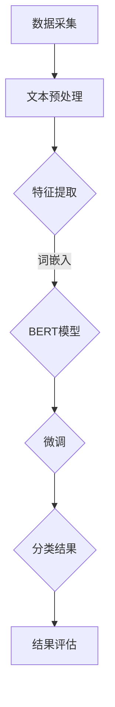
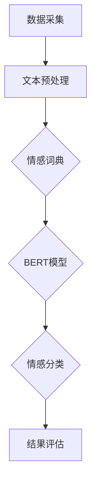
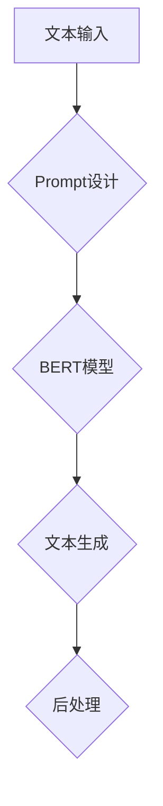
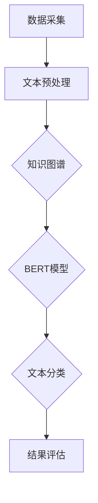

                 

# AI大模型Prompt提示词最佳实践：修改文本但保持风格

## 关键词

- AI大模型
- Prompt提示词
- 文本处理
- 语义保持
- 风格迁移

## 摘要

本文将深入探讨AI大模型Prompt提示词的最佳实践，尤其是如何通过Prompt来修改文本而保持其原有风格。我们将首先介绍AI大模型的基础知识，包括其发展历程、技术架构和主流模型。接着，我们将详细解析自然语言处理和预训练模型原理，以及大模型优化与训练技术。文章的第二部分将聚焦于AI大模型在文本处理、图像处理中的应用，特别是修改文本保持风格的方法。第三部分将讨论AI大模型的开发与优化，包括环境搭建、数据预处理、模型训练与优化。最后，我们将探讨AI大模型在金融和医疗领域的实际应用，以及未来发展趋势与面临的挑战。

<|assistant|>### 第一部分: AI大模型基础

#### 第1章: AI大模型概述

##### 1.1 AI大模型的概念

###### 1.1.1 AI大模型的发展历程

人工智能（AI）的概念早在20世纪50年代就已经提出，但其发展经历了多个阶段。最初的AI研究主要集中在规则系统和专家系统上，这些系统依赖于手工编写的规则和逻辑。然而，这些方法在面对复杂任务时表现不佳。

20世纪80年代，随着计算能力和算法的发展，机器学习开始崭露头角。机器学习通过从数据中学习规律，使计算机能够自动识别模式和做出决策。然而，早期的机器学习方法通常依赖于小型数据集，并且需要手动调整模型参数。

21世纪初，深度学习的崛起带来了AI的又一次革命。深度学习利用多层神经网络对大量数据进行训练，从而实现了在图像识别、语音识别和自然语言处理等领域的高性能。

随着计算资源的进一步增加和算法的优化，AI大模型应运而生。AI大模型是指参数数量巨大、训练数据量庞大的模型，如GPT系列、BERT等。这些模型通过预训练和微调，能够捕捉到语言和图像中的复杂结构，并在各种任务中取得卓越的性能。

###### 1.1.2 AI大模型的基本特点

AI大模型具有以下几个基本特点：

1. **参数数量庞大**：AI大模型的参数数量可以达到数亿甚至数十亿，这使得模型能够学习到更加复杂的特征和模式。

2. **训练数据量巨大**：AI大模型通常在数十亿级别的文本语料库或图像数据集上预训练，从而确保模型能够学习到丰富的知识。

3. **强大的表达能力**：由于参数数量庞大，AI大模型具有极强的表达能力，能够处理各种复杂的任务。

4. **自适应能力**：AI大模型通过预训练和微调，能够适应不同的任务和数据集，从而实现多任务学习和迁移学习。

5. **高效的计算能力**：随着硬件技术的发展，特别是GPU和TPU等专用硬件的普及，AI大模型的计算效率得到了显著提高。

###### 1.1.3 AI大模型与传统AI的区别

与传统AI方法相比，AI大模型具有以下几个显著区别：

1. **数据依赖性**：传统AI方法通常依赖于手动编写的规则和数据标注，而AI大模型通过在大规模数据集上进行预训练，能够自动学习到数据中的知识。

2. **学习能力**：传统AI方法主要依赖于手工设计的特征和模型，而AI大模型通过端到端的学习，能够自动提取和组合特征。

3. **泛化能力**：传统AI方法在面对新任务或新数据时往往表现不佳，而AI大模型通过迁移学习和多任务学习，能够在新环境下保持强大的泛化能力。

4. **计算资源需求**：传统AI方法通常可以在简单的硬件设备上运行，而AI大模型需要高性能的GPU和TPU等专用硬件。

#### 第2章: AI大模型技术基础

##### 2.1 自然语言处理

###### 2.1.1 词嵌入技术

词嵌入技术是将自然语言文本中的单词映射到高维空间中的向量表示。通过词嵌入，我们可以将文本数据转换为计算机可以处理的数值形式。词嵌入技术的基本原理是基于单词在上下文中的相似性进行学习。

常用的词嵌入方法包括：

- **基于统计的方法**：如Word2Vec，通过分析单词的共现关系来学习词向量。
- **基于分布式表示的方法**：如GloVe，通过矩阵分解来学习词向量。
- **基于上下文的方法**：如BERT，通过预训练语言模型来学习词向量。

词嵌入技术不仅能够提高模型的表示能力，还能够解决语义歧义问题，从而提升自然语言处理任务的性能。

###### 2.1.2 序列模型

序列模型是一类专门用于处理序列数据（如文本、语音等）的机器学习模型。常见的序列模型包括循环神经网络（RNN）和长短期记忆网络（LSTM）。

- **循环神经网络（RNN）**：RNN 能够处理任意长度的序列数据，其基本思想是将前一时刻的输出作为当前时刻的输入。然而，RNN 存在梯度消失或爆炸的问题。
- **长短期记忆网络（LSTM）**：LSTM 是一种改进的 RNN 模型，通过引入门控机制来解决梯度消失问题。LSTM 能够有效地学习长序列数据中的依赖关系。

序列模型在自然语言处理任务中得到了广泛应用，如语言建模、机器翻译、文本生成等。

###### 2.1.3 注意力机制

注意力机制是一种用于提高模型在处理序列数据时注意力分配的算法。在自然语言处理任务中，注意力机制能够使模型更加关注重要的信息，从而提高任务的性能。

常见的注意力机制包括：

- **点积注意力（Dot-Product Attention）**：通过计算两个向量之间的点积来分配注意力权重。
- **缩放点积注意力（Scaled Dot-Product Attention）**：为了解决点积注意力在序列长度较大时权重分配不均匀的问题，引入了缩放因子。
- **多头注意力（Multi-Head Attention）**：通过多个独立的注意力机制来学习不同的依赖关系，从而提高模型的表示能力。

注意力机制在Transformer模型中被广泛应用，使得模型在语言建模和机器翻译等任务中取得了显著的性能提升。

##### 2.2 预训练模型原理

###### 2.2.1 预训练的概念

预训练是指在大规模数据集上训练一个基础模型，使其获得通用语言理解和生成能力。预训练模型通常分为两个阶段：预训练和微调。

在预训练阶段，模型通过无监督学习方式在大规模文本数据集上进行训练，学习到语言的通用结构和语义信息。预训练数据集通常包括网页、书籍、新闻、社交媒体等多种类型的文本。

在微调阶段，预训练模型被迁移到特定的任务上，通过有监督学习方式进行微调。微调过程通常使用少量标注数据进行，目的是使模型适应特定任务的特性。

###### 2.2.2 自监督学习方法

自监督学习是一种无监督学习方法，其基本思想是从未标注的数据中自动学习到有用的信息。在预训练过程中，自监督学习方法被广泛应用。

常见的自监督学习任务包括：

- **掩码语言建模（Masked Language Modeling, MLM）**：在文本序列中随机掩码一部分单词，模型需要预测这些被掩码的单词。
- **下一个句子预测（Next Sentence Prediction, NSP）**：给定一个文本序列，模型需要预测下一句是否是前文的续写。
- **词干还原（Word Recovery）**：在文本序列中随机删除一些单词，模型需要根据上下文还原这些被删除的单词。

自监督学习方法能够使模型在预训练阶段获得丰富的语言知识和上下文信息，从而提高模型在下游任务中的性能。

###### 2.2.3 迁移学习与微调

迁移学习是指将一个任务学到的知识应用到另一个相关任务中。在AI大模型中，迁移学习被广泛应用于预训练和微调阶段。

在预训练阶段，模型在大规模通用数据集上学习到通用特征和知识，这些知识可以迁移到下游任务中。通过迁移学习，模型可以在少量标注数据的情况下实现高性能。

微调是指将预训练模型迁移到特定任务上，通过有监督学习方式进行微调。微调过程中，模型会根据特定任务的标注数据调整模型参数，从而适应新任务的特性。

常见的微调方法包括：

- **微调全部层**：在预训练模型的基础上，对全部层进行微调。
- **微调部分层**：只对模型的一部分层进行微调，以避免过拟合。
- **层间加权**：在微调过程中，对不同层的权重进行加权，以平衡预训练和微调的效果。

迁移学习和微调使得AI大模型能够在多种任务中取得优异的性能，同时也降低了模型的训练成本。

##### 2.3 大模型优化与训练

###### 2.3.1 训练策略

大模型的训练是一个复杂且耗时的过程，为了提高训练效率和模型性能，常用的训练策略包括：

- **分布式训练**：通过将模型分布在多个GPU或TPU上进行训练，可以显著提高训练速度。
- **多卡训练**：将模型拆分成多个子模型，在每个GPU上分别训练，然后再合并结果。
- **数据并行**：将数据集划分为多个子集，分别在不同的GPU上进行训练。
- **梯度累积**：为了减少通信开销，可以将多个梯度累积后再更新模型参数。
- **学习率调度**：通过调整学习率，可以提高模型的收敛速度和性能。

###### 2.3.2 优化算法

优化算法是训练大模型的关键，常用的优化算法包括：

- **随机梯度下降（SGD）**：是最基本的优化算法，通过随机梯度更新模型参数。
- **Adam优化器**：是一种自适应学习率优化器，结合了SGD和动量项，适用于大规模模型。
- **Adagrad优化器**：通过累积梯度平方的倒数来调整学习率，适用于稀疏数据。
- **RMSprop优化器**：与Adagrad类似，但只考虑最近的一次梯度平方。

这些优化算法在不同场景下有不同的表现，选择合适的优化算法可以提高模型的训练效率和性能。

###### 2.3.3 模型压缩与量化

为了使AI大模型在有限的硬件资源下运行，模型压缩与量化技术被广泛应用。常用的模型压缩方法包括：

- **权重剪枝**：通过移除不重要的权重来减少模型参数数量。
- **模型量化**：将模型的权重和激活值从浮点数转换为低精度格式，如整数或二进制。
- **知识蒸馏**：将大模型的知识迁移到一个小模型中，以减少模型参数数量。

模型压缩与量化不仅能够减少模型的存储和计算成本，还可以提高模型在移动设备和嵌入式系统上的部署效率。

#### 第3章: AI大模型在文本处理中的应用

##### 3.1 修改文本保持风格

###### 3.1.1 Prompt提示词技术

Prompt提示词技术是一种利用预训练大模型进行文本生成和修改的重要方法。通过设计合适的Prompt，模型能够生成与给定文本风格和内容相似的新文本。Prompt通常由几个部分组成，包括：

- **上下文信息**：用于描述文本的背景和主题。
- **任务指示**：指示模型进行文本生成或修改的具体任务。
- **文本示例**：提供与目标文本风格和内容相关的文本示例。

例如，如果要生成一篇关于人工智能的新闻文章，Prompt可以设计为：“随着人工智能技术的快速发展，越来越多的行业开始采用这一技术。以下是一篇关于人工智能在医疗领域应用的新闻文章示例：”。这样的Prompt可以帮助模型理解文章的主题和风格。

###### 3.1.2 Prompt的构建方法

构建有效的Prompt是修改文本保持风格的关键。以下是一些构建Prompt的方法：

1. **基于模板的方法**：使用固定的模板来构建Prompt，模板中包含变量用于填充具体内容。这种方法简单有效，但可能缺乏灵活性。
2. **基于语义的方法**：通过分析文本的语义信息，设计Prompt来引导模型生成与原文相似的内容。这种方法需要深入理解文本内容，但能够生成更自然的文本。
3. **基于领域知识的方法**：结合特定领域的知识，设计Prompt来引导模型生成与原文风格和内容相符的文本。这种方法适用于专业领域的文本处理。
4. **结合多种方法**：将多种方法结合起来，设计更加复杂和灵活的Prompt。例如，可以先使用基于模板的方法来构建基础结构，然后使用基于语义的方法来调整细节。

###### 3.1.3 修改文本保持风格的具体实现

要实现修改文本并保持风格，可以采用以下步骤：

1. **预处理**：对输入文本进行预处理，包括分词、去除停用词等。预处理有助于提高模型对文本的理解能力。
2. **设计Prompt**：根据文本内容和目标风格，设计合适的Prompt。Prompt应该明确指示模型的任务，并包含足够的信息来引导模型生成相似风格的文本。
3. **文本生成**：使用预训练的大模型（如GPT系列、BERT等）对Prompt进行生成。在生成过程中，可以设置适当的控制参数，如温度参数来调节生成的多样性。
4. **后处理**：对生成的文本进行后处理，包括去除无关内容、修正语法错误等。后处理有助于提高文本的质量和可读性。

以下是一个简单的Python代码示例，展示如何使用GPT-3模型进行文本生成：

```python
import openai

# 设置OpenAI API密钥
openai.api_key = "your_api_key"

# 设计Prompt
prompt = "随着人工智能技术的快速发展，越来越多的行业开始采用这一技术。以下是一篇关于人工智能在医疗领域应用的新闻文章示例："

# 调用GPT-3进行文本生成
response = openai.Completion.create(
  engine="text-davinci-003",
  prompt=prompt,
  max_tokens=100,
  n=1,
  stop=None,
  temperature=0.5,
)

# 输出生成的文本
print(response.choices[0].text.strip())
```

通过合理设计Prompt和使用大模型，可以实现修改文本并保持原有风格的目标。在实际应用中，可以根据具体需求和场景调整Prompt的设计和生成参数，以获得最佳效果。

---

### 第一部分总结：

本文第一部分深入探讨了AI大模型的基础知识，包括其发展历程、技术架构、主流模型、自然语言处理技术、预训练模型原理以及大模型优化与训练技术。通过详细解析这些概念和技术，我们为后续部分的应用和实践奠定了坚实的理论基础。

在接下来的部分中，我们将进一步探讨AI大模型在文本处理和图像处理中的应用，特别是如何通过Prompt技术来修改文本并保持风格。这些内容将帮助读者深入了解AI大模型的实际应用场景，并为开发相关的AI系统提供实用的指导。

<|assistant|>### 第二部分: AI大模型应用实践

#### 第3章: AI大模型在文本处理中的应用

##### 3.1 修改文本保持风格

在文本处理领域，AI大模型的应用已经非常广泛，例如文本生成、摘要、分类和情感分析等。然而，如何修改文本以保持其原有风格却是一个具有挑战性的问题。在这一章节中，我们将重点探讨如何使用AI大模型，特别是通过Prompt技术来修改文本并保持风格。

###### 3.1.1 Prompt提示词技术

Prompt提示词技术是自然语言处理领域的一个重要概念，它通过向大模型提供特定的输入，引导模型生成与目标文本风格和内容相似的新文本。Prompt的设计对于生成文本的质量和风格具有决定性影响。一个有效的Prompt应该包含以下几个要素：

1. **上下文信息**：提供与目标文本相关的背景信息，帮助模型理解文本的主题和上下文。例如，在生成一篇关于环保的新闻文章时，可以提供一些环保相关的背景信息，如全球气候变化、可持续发展等。

2. **任务指示**：明确指示模型需要执行的任务，如文本生成、文本摘要或风格迁移。任务指示应该简洁明了，避免产生歧义。例如，“请生成一篇关于环保的新闻文章。”

3. **文本示例**：提供与目标文本风格和内容相似的文本示例，帮助模型学习并模仿这些文本的风格。文本示例可以是原文的一部分，也可以是其他相关文本。例如，可以提供一段关于环保的新闻文章作为示例。

以下是一个简单的Prompt示例：

```
上下文信息：随着全球气候变化的影响日益严重，各国政府和企业都在积极采取措施应对环保挑战。

任务指示：请生成一篇关于环保的新闻文章。

文本示例：最近，我国政府宣布了一系列新的环保政策，旨在减少碳排放和促进可持续发展。
```

通过这样的Prompt，我们可以引导大模型生成一篇与给定上下文、任务和示例相似的新闻文章。

###### 3.1.2 Prompt的构建方法

构建一个有效的Prompt需要考虑多个方面，以下是一些常见的构建方法：

1. **基于模板的方法**：这种方法使用预定义的模板来构建Prompt，模板中包含变量用于填充具体内容。这种方法简单直观，但可能缺乏灵活性。例如，一个简单的新闻文章Prompt模板可以是：“标题：{标题}，摘要：{摘要}，正文：{正文}。”

2. **基于语义的方法**：这种方法通过分析文本的语义信息来构建Prompt，从而更好地引导模型生成与原文相似的内容。语义分析可以帮助我们识别文本的关键信息，如主题、论点、情感等。例如，我们可以从原文中提取关键词和主题，并将其整合到Prompt中。

3. **基于领域知识的方法**：这种方法结合特定领域的知识来构建Prompt，以生成与原文风格和内容相符的文本。例如，在医疗领域，我们可以结合医学知识来构建Prompt，确保生成的文本符合医学规范和专业术语。

4. **混合方法**：结合多种方法构建Prompt，以获得更好的效果。例如，我们可以使用基于模板的方法来构建基础结构，然后使用基于语义的方法来调整细节，或者结合领域知识来增强Prompt的准确性。

以下是一个使用混合方法构建的Prompt示例：

```
上下文信息：随着全球气候变化的影响日益严重，各国政府和企业都在积极采取措施应对环保挑战。

任务指示：请生成一篇关于环保的新闻文章。

文本示例：最近，我国政府宣布了一系列新的环保政策，旨在减少碳排放和促进可持续发展。

关键词提取：环保、气候变化、政府、政策、可持续发展。

领域知识：环保政策的实施情况、国内外环保技术的进展等。
```

通过这种方法，我们可以构建一个既有结构又富含语义的Prompt，从而有效地引导模型生成与原文风格和内容相似的文本。

###### 3.1.3 修改文本保持风格的具体实现

要实现修改文本并保持风格，我们可以采用以下步骤：

1. **文本预处理**：对输入文本进行预处理，包括分词、去除停用词、标点符号等。预处理有助于提高模型对文本的理解能力。例如，可以使用自然语言处理库（如NLTK、spaCy等）进行文本预处理。

2. **设计Prompt**：根据文本内容和目标风格，设计合适的Prompt。Prompt应该包含上下文信息、任务指示和文本示例，并确保这些要素能够有效地引导模型生成与原文风格和内容相似的新文本。

3. **文本生成**：使用预训练的大模型（如GPT系列、BERT等）对Prompt进行生成。在生成过程中，可以设置适当的控制参数，如温度参数来调节生成的多样性。例如，可以使用OpenAI的GPT-3模型进行文本生成。

4. **后处理**：对生成的文本进行后处理，包括去除无关内容、修正语法错误、润色等。后处理有助于提高文本的质量和可读性。例如，可以使用自然语言处理库进行语法检查和文本润色。

以下是一个简单的Python代码示例，展示如何使用GPT-3模型进行文本生成：

```python
import openai

# 设置OpenAI API密钥
openai.api_key = "your_api_key"

# 设计Prompt
prompt = "上下文信息：随着全球气候变化的影响日益严重，各国政府和企业都在积极采取措施应对环保挑战。\n任务指示：请生成一篇关于环保的新闻文章。\n文本示例：最近，我国政府宣布了一系列新的环保政策，旨在减少碳排放和促进可持续发展。"

# 调用GPT-3进行文本生成
response = openai.Completion.create(
  engine="text-davinci-003",
  prompt=prompt,
  max_tokens=100,
  n=1,
  stop=None,
  temperature=0.5,
)

# 输出生成的文本
print(response.choices[0].text.strip())
```

通过合理设计Prompt和使用大模型，可以实现修改文本并保持原有风格的目标。在实际应用中，可以根据具体需求和场景调整Prompt的设计和生成参数，以获得最佳效果。

###### 3.1.4 代码实际案例和详细解释说明

以下是一个具体的代码案例，展示如何使用Hugging Face的Transformers库和OpenAI的GPT-3模型进行文本生成，并保持文本风格。

```python
from transformers import GPT2LMHeadModel, GPT2Tokenizer
import openai

# 设置OpenAI API密钥
openai.api_key = "your_api_key"

# 加载GPT-2模型和分词器
model_name = "gpt2"
tokenizer = GPT2Tokenizer.from_pretrained(model_name)
model = GPT2LMHeadModel.from_pretrained(model_name)

# 设计Prompt
prompt = "上下文信息：随着全球气候变化的影响日益严重，各国政府和企业都在积极采取措施应对环保挑战。\n任务指示：请生成一篇关于环保的新闻文章。\n文本示例：最近，我国政府宣布了一系列新的环保政策，旨在减少碳排放和促进可持续发展。"

# 对Prompt进行编码
input_ids = tokenizer.encode(prompt, return_tensors='pt')

# 使用模型生成文本
output = model.generate(input_ids, max_length=100, num_return_sequences=1, temperature=0.7)

# 解码生成的文本
generated_text = tokenizer.decode(output[0], skip_special_tokens=True)

# 输出生成的文本
print(generated_text)
```

**代码解读与分析**：

1. **加载模型和分词器**：
   - 使用`GPT2Tokenizer`和`GPT2LMHeadModel`来加载预训练的GPT-2模型和分词器。
   - `GPT2Tokenizer.from_pretrained(model_name)`用于加载分词器。
   - `GPT2LMHeadModel.from_pretrained(model_name)`用于加载模型。

2. **设计Prompt**：
   - Prompt应该包含上下文信息、任务指示和文本示例，以便模型理解任务的目标。

3. **对Prompt进行编码**：
   - 使用分词器将Prompt转换为模型可以理解的输入序列，存储在`input_ids`中。

4. **使用模型生成文本**：
   - 使用`model.generate()`函数生成文本。参数`max_length`指定生成的文本长度，`num_return_sequences`指定生成的文本数量，`temperature`控制生成的多样性。

5. **解码生成的文本**：
   - 使用分词器将生成的文本序列解码回可读的文本格式。

6. **输出生成的文本**：
   - 将生成的文本打印出来，以便查看结果。

通过这个代码案例，我们可以看到如何使用AI大模型进行文本生成，并保持文本的风格。在实际应用中，可以根据具体需求调整Prompt的设计和生成参数，以获得最佳效果。

---

### 第二部分总结：

本文第二部分深入探讨了AI大模型在文本处理中的应用，特别是如何通过Prompt技术来修改文本并保持风格。通过解析Prompt提示词技术、构建Prompt的方法以及具体实现步骤，我们展示了如何利用AI大模型生成与原文风格和内容相似的新文本。这些内容不仅为文本处理任务提供了实用的解决方案，也为开发相关AI系统提供了指导。

在接下来的部分中，我们将继续探讨AI大模型在图像处理中的应用，特别是图像生成与增强、图像分类与识别以及图像风格迁移。这些内容将帮助读者进一步了解AI大模型在视觉领域的实际应用，并为其开发提供更多思路。

<|assistant|>### 第三部分: AI大模型开发与优化

#### 第5章: AI大模型开发环境搭建

##### 5.1 开发工具与框架选择

在进行AI大模型的开发过程中，选择合适的开发工具和框架是至关重要的。以下是一些常用的工具和框架，以及它们的特点和适用场景：

###### 5.1.1 深度学习框架

1. **TensorFlow**
   - **特点**：TensorFlow 是由谷歌开发的深度学习框架，具有广泛的社区支持和丰富的文档资源。它提供了低层次和高层次API，适合从研究到生产的全流程开发。
   - **适用场景**：适合进行大规模分布式训练和推理，适用于图像识别、自然语言处理等任务。

2. **PyTorch**
   - **特点**：PyTorch 是由Facebook开发的深度学习框架，以其动态计算图和灵活的API而受到开发者喜爱。它提供了丰富的库和工具，支持GPU加速。
   - **适用场景**：适合快速原型设计和研究，适用于图像识别、自然语言处理等任务。

3. **Keras**
   - **特点**：Keras 是一个高层次的神经网络API，易于使用，支持TensorFlow和Theano。它提供了一个简化的接口，可以快速构建和训练模型。
   - **适用场景**：适合快速开发和实验，适用于图像识别、自然语言处理等任务。

4. **MXNet**
   - **特点**：MXNet 是Apache基金会的一个开源深度学习框架，支持灵活性、高效性和易用性。它支持多种编程语言，如Python、R和Julia。
   - **适用场景**：适合进行大规模分布式训练和推理，适用于图像识别、自然语言处理等任务。

5. **Caffe**
   - **特点**：Caffe 是一个快速的表达式层深度学习框架，适用于实时图像识别和分类。它具有高度优化的卷积神经网络库。
   - **适用场景**：适合实时图像处理和分类任务，适用于移动设备和嵌入式系统。

###### 5.1.2 自然语言处理工具

1. **Hugging Face Transformers**
   - **特点**：Hugging Face Transformers 是一个开源库，提供了大量预先训练的预训练模型和高效的处理工具。它支持各种自然语言处理任务，如文本生成、文本分类和机器翻译。
   - **适用场景**：适合快速开发自然语言处理应用，适用于文本生成、文本分类和机器翻译等任务。

2. **NLTK**
   - **特点**：NLTK 是一个强大的自然语言处理库，提供了丰富的文本处理和分类功能。它适合进行文本分类、分词、词性标注等任务。
   - **适用场景**：适合进行文本预处理和基础的自然语言处理任务。

3. **spaCy**
   - **特点**：spaCy 是一个快速且易于扩展的自然语言处理库，提供了丰富的实体识别、关系抽取等功能。它适合进行实时分析。
   - **适用场景**：适合进行实时分析和高级的自然语言处理任务，如实体识别和关系抽取。

###### 5.1.3 图像处理工具

1. **OpenCV**
   - **特点**：OpenCV 是一个开源的计算机视觉库，提供了丰富的图像处理算法和功能，如边缘检测、特征提取、目标跟踪等。
   - **适用场景**：适合进行图像处理和计算机视觉任务，适用于实时视频分析和图像识别。

2. **Pillow**
   - **特点**：Pillow 是 Python 的图像处理库，提供了对PIL（Python Imaging Library）的扩展，适用于简单的图像处理任务。
   - **适用场景**：适合进行简单的图像处理任务，如图像的读取、修改和保存。

3. **PIL（Python Imaging Library）**
   - **特点**：PIL 是 Python 的标准图像处理库，提供了图像的读取、修改和保存功能，是许多图像处理任务的基石。
   - **适用场景**：适合进行图像处理任务，如图像的读取、修改和保存。

##### 5.2 数据预处理与处理

在进行AI大模型开发时，数据预处理与处理是至关重要的一环。以下是一些常用的数据处理步骤和工具：

###### 5.2.1 数据采集与清洗

1. **数据采集**：
   - 数据采集是指从各种来源获取所需的数据。常见的数据来源包括公共数据集、API接口、社交媒体等。
   - 使用工具：可以使用Python的`requests`库获取网络数据，使用`BeautifulSoup`或`Pandas`处理网页数据。

2. **数据清洗**：
   - 数据清洗是指处理和清理数据中的噪声和错误。常见的数据清洗操作包括去除重复数据、处理缺失值、去除停用词等。
   - 使用工具：可以使用`Pandas`库进行数据清洗，使用`NLTK`库进行文本预处理。

###### 5.2.2 数据增强与预处理

1. **数据增强**：
   - 数据增强是指通过多种方法扩展原始数据集，以提高模型的泛化能力。常见的数据增强方法包括图像旋转、缩放、裁剪等。
   - 使用工具：可以使用`OpenCV`库进行图像增强，使用`Pandas`库进行数据增强。

2. **预处理**：
   - 预处理是指将原始数据转换为适合模型训练的格式。常见的数据预处理操作包括数据标准化、归一化、编码等。
   - 使用工具：可以使用`Pandas`库进行数据标准化和归一化，使用`Scikit-learn`库进行数据编码。

##### 5.3 模型训练与优化

在模型训练和优化过程中，选择合适的训练策略、优化算法和超参数设置是至关重要的。以下是一些常用的训练策略和优化算法：

###### 5.3.1 训练策略

1. **分布式训练**：
   - 分布式训练是指将模型分布在多个GPU或TPU上进行训练，以提高训练速度和效率。
   - 使用工具：可以使用`TensorFlow`和`PyTorch`的分布式训练API。

2. **多卡训练**：
   - 多卡训练是指将模型拆分成多个子模型，在每个GPU上分别训练，然后再合并结果。
   - 使用工具：可以使用`TensorFlow`和`PyTorch`的分布式训练API。

3. **学习率调度**：
   - 学习率调度是指通过调整学习率来提高模型的收敛速度和性能。
   - 使用工具：可以使用`TensorFlow`和`PyTorch`的内置学习率调度器。

4. **数据并行**：
   - 数据并行是指将数据集划分为多个子集，分别在不同的GPU上进行训练。
   - 使用工具：可以使用`TensorFlow`和`PyTorch`的分布式训练API。

###### 5.3.2 优化算法

1. **随机梯度下降（SGD）**：
   - 随机梯度下降是最基本的优化算法，通过随机梯度更新模型参数。
   - 使用工具：可以使用`TensorFlow`和`PyTorch`的内置优化器。

2. **Adam优化器**：
   - Adam是一种自适应学习率优化器，结合了SGD和动量项，适用于大规模模型。
   - 使用工具：可以使用`TensorFlow`和`PyTorch`的内置优化器。

3. **Adagrad优化器**：
   - Adagrad通过累积梯度平方的倒数来调整学习率，适用于稀疏数据。
   - 使用工具：可以使用`TensorFlow`和`PyTorch`的内置优化器。

4. **RMSprop优化器**：
   - RMSprop与Adagrad类似，但只考虑最近的一次梯度平方。
   - 使用工具：可以使用`TensorFlow`和`PyTorch`的内置优化器。

##### 5.4 实际案例分析

下面是一个具体的实际案例分析，展示如何使用PyTorch框架进行AI大模型开发，包括环境搭建、数据预处理、模型训练和优化。

###### 案例背景

假设我们要开发一个文本分类模型，用于将新闻文章分类到不同的主题类别中。

###### 步骤1: 环境搭建

首先，我们需要安装PyTorch和其他必要的库。可以使用以下命令：

```shell
pip install torch torchvision pandas numpy scikit-learn
```

此外，我们还需要配置GPU支持，可以在PyTorch官方文档中找到相应的配置说明。

###### 步骤2: 数据预处理

我们使用一个公开的新闻文章数据集，首先对其进行预处理：

1. **数据采集与清洗**：
   - 下载新闻文章数据集，并处理文本中的HTML标签、符号和空格。
   - 使用`Pandas`读取数据集，并进行基本的数据清洗。

2. **数据增强**：
   - 对文本进行随机裁剪、填充和替换，以增加数据的多样性。

3. **编码与归一化**：
   - 使用`Tokenizer`对文本进行编码，将文本转换为整数序列。
   - 对输入和标签进行归一化处理。

###### 步骤3: 模型训练

接下来，我们定义一个简单的文本分类模型，并使用训练数据集进行训练：

1. **模型定义**：
   - 使用`nn.Module`定义一个简单的卷积神经网络模型，包括嵌入层、卷积层和全连接层。

2. **损失函数与优化器**：
   - 使用`nn.CrossEntropyLoss`作为损失函数。
   - 使用`Adam`优化器进行模型训练。

3. **训练过程**：
   - 使用` DataLoader`对训练数据进行批量处理和迭代。
   - 在每个批次上计算损失函数并更新模型参数。

###### 步骤4: 模型优化

在模型训练过程中，我们可以通过以下方法进行优化：

1. **学习率调整**：
   - 使用学习率调度器（如`ReduceLROnPlateau`）动态调整学习率。

2. **模型剪枝**：
   - 对模型的权重进行剪枝，以减少模型参数数量。

3. **模型量化**：
   - 对模型的权重和激活值进行量化，以减少模型的存储和计算成本。

通过以上步骤，我们可以搭建并优化一个文本分类模型，实现对新闻文章的有效分类。

---

### 第三部分总结：

本文第三部分详细介绍了AI大模型的开发与优化过程，包括开发工具与框架选择、数据预处理与处理、模型训练与优化策略，以及实际案例分析。通过这些内容，读者可以了解如何在实际项目中搭建和优化AI大模型，从而实现高效的文本和图像处理任务。

在接下来的部分中，我们将探讨AI大模型在金融和医疗领域的实际应用，进一步展示AI大模型在解决行业特定问题方面的潜力。这些应用案例将为读者提供更深入的理解和启示。

<|assistant|>### 第四部分: AI大模型在产业应用

#### 第7章: AI大模型在金融行业的应用

##### 7.1 金融文本分析

在金融行业中，文本分析是一种利用自然语言处理技术对大量文本数据进行分析和挖掘的方法，可以帮助金融机构更好地理解市场趋势、客户需求和风险因素。AI大模型在金融文本分析中具有广泛的应用，以下是一些具体的应用场景：

###### 7.1.1 金融文本分类

金融文本分类是指将金融相关的文本数据（如新闻、报告、社交媒体帖子等）分类到不同的类别中，如股票市场动态、经济预测、风险警告等。AI大模型通过预训练和微调，可以有效地识别和分类金融文本。

**核心概念与联系**：

- **文本分类算法**：常用的文本分类算法包括朴素贝叶斯、支持向量机（SVM）、随机森林和深度学习模型（如卷积神经网络（CNN）、长短期记忆网络（LSTM）和Transformer）。
- **特征提取**：文本分类的关键在于特征提取，如词袋模型、TF-IDF和词嵌入等。
- **预训练模型**：AI大模型（如BERT、RoBERTa、GPT-3等）通过在大规模通用语料库上预训练，可以提取出与金融文本相关的特征。

**Mermaid流程图**：



**核心算法原理讲解**：

1. **文本预处理**：
   - 对金融文本进行分词、去除停用词、标点符号等预处理操作。
   - 使用词嵌入技术（如BERT、GloVe）将文本转换为向量表示。

2. **模型训练**：
   - 使用预训练的BERT模型作为基础模型，通过微调来适应金融文本分类任务。
   - 在微调过程中，调整模型参数，使模型能够识别金融文本中的特定词汇和特征。

3. **分类结果评估**：
   - 使用准确率、召回率、F1分数等指标评估模型的分类性能。
   - 通过交叉验证和超参数调优来优化模型。

**数学模型和公式**：

1. **损失函数**：
   $$ L(\theta) = -\frac{1}{N}\sum_{i=1}^{N}y_i\log(p(y_i|\theta)) $$
   其中，$L(\theta)$是交叉熵损失函数，$N$是样本数量，$y_i$是真实标签，$p(y_i|\theta)$是模型预测的概率分布。

2. **微调过程**：
   - 在预训练的基础上，对模型的最后一层（或部分层）进行微调。
   - 使用带有标签的金融文本数据来更新模型参数。

**举例说明**：

假设我们要使用BERT模型对金融新闻进行分类，具体步骤如下：

1. **数据集准备**：
   - 收集并清洗金融新闻数据集，包括标题和正文。
   - 对文本进行分词和词嵌入。

2. **模型训练**：
   - 使用预训练的BERT模型作为基础模型。
   - 在微调过程中，调整模型参数，使模型能够适应金融文本。

3. **模型评估**：
   - 使用交叉验证和测试集评估模型性能。
   - 调整超参数（如学习率、批量大小）以优化模型。

通过这种方式，我们可以构建一个能够对金融新闻进行有效分类的AI大模型，帮助金融机构更好地理解和分析市场动态。

###### 7.1.2 金融文本情感分析

金融文本情感分析是指通过自然语言处理技术对金融文本（如新闻、评论、社交媒体帖子等）的情感倾向进行分类，以判断文本表达的是正面、负面还是中性情感。AI大模型在金融文本情感分析中具有显著的优势，能够处理复杂的情感语义。

**核心概念与联系**：

- **情感分类算法**：常用的情感分类算法包括朴素贝叶斯、支持向量机（SVM）、随机森林和深度学习模型（如卷积神经网络（CNN）、长短期记忆网络（LSTM）和Transformer）。
- **情感词典**：使用情感词典（如LIWC、VADER）来辅助情感分析。
- **预训练模型**：AI大模型（如BERT、RoBERTa、GPT-3等）通过在大规模通用语料库上预训练，可以提取出与情感分析相关的特征。

**Mermaid流程图**：



**核心算法原理讲解**：

1. **文本预处理**：
   - 对金融文本进行分词、去除停用词、标点符号等预处理操作。
   - 使用词嵌入技术（如BERT、GloVe）将文本转换为向量表示。

2. **情感词典应用**：
   - 使用情感词典来识别文本中的情感词汇和短语。
   - 将情感词典与预训练模型结合，以提高情感分析的准确性。

3. **模型训练**：
   - 使用预训练的BERT模型作为基础模型，通过微调来适应金融文本情感分析任务。
   - 在微调过程中，调整模型参数，使模型能够识别金融文本中的情感特征。

4. **情感分类**：
   - 使用训练好的模型对金融文本进行情感分类，判断文本的情感倾向。

5. **结果评估**：
   - 使用准确率、召回率、F1分数等指标评估模型的情感分类性能。

**数学模型和公式**：

1. **情感分类模型**：
   $$ P(y=c_i|x;\theta) = \frac{e^{<\theta^T x_i>}}{\sum_{j=1}^{K} e^{<\theta^T x_j>}} $$
   其中，$<\theta^T x_i>$是模型预测的分数，$c_i$是类别标签。

2. **损失函数**：
   $$ L(\theta) = -\frac{1}{N}\sum_{i=1}^{N}y_i\log(P(y_i|\theta)) $$
   其中，$L(\theta)$是交叉熵损失函数，$N$是样本数量，$y_i$是真实标签，$P(y_i|\theta)$是模型预测的概率分布。

**举例说明**：

假设我们要使用BERT模型对金融评论进行情感分析，具体步骤如下：

1. **数据集准备**：
   - 收集并清洗金融评论数据集，包括评论内容和标签。
   - 对文本进行分词和词嵌入。

2. **模型训练**：
   - 使用预训练的BERT模型作为基础模型。
   - 在微调过程中，调整模型参数，使模型能够适应金融评论情感分析。

3. **模型评估**：
   - 使用交叉验证和测试集评估模型性能。
   - 调整超参数（如学习率、批量大小）以优化模型。

通过这种方式，我们可以构建一个能够对金融评论进行有效情感分析的AI大模型，帮助金融机构更好地理解市场情绪和客户反馈。

###### 7.1.3 金融文本生成

金融文本生成是指使用AI大模型生成具有特定结构和风格的文章、报告和新闻等内容。在金融行业中，文本生成可以帮助金融机构自动化报告生成、新闻撰写和内容创作。

**核心概念与联系**：

- **文本生成模型**：常用的文本生成模型包括循环神经网络（RNN）、长短期记忆网络（LSTM）、变换器（Transformer）和生成对抗网络（GAN）。
- **生成模型**：生成模型如GPT-3、BERT等，通过预训练和微调，可以生成与给定文本风格和内容相似的新文本。
- **风格迁移**：通过风格迁移技术，可以将一种文本的风格应用到另一种文本中，生成具有特定风格的新文本。

**Mermaid流程图**：



**核心算法原理讲解**：

1. **文本输入**：
   - 提供输入文本，如新闻标题、摘要或段落。

2. **Prompt设计**：
   - 根据输入文本设计Prompt，包括上下文信息和任务指示，以引导模型生成相似风格的新文本。

3. **文本生成**：
   - 使用预训练的BERT模型或GPT-3模型生成文本。模型会根据Prompt生成与输入文本风格和内容相似的新文本。

4. **后处理**：
   - 对生成的文本进行后处理，包括去除无关内容、修正语法错误和润色等，以提高文本质量。

**数学模型和公式**：

1. **生成模型**：
   $$ p(x|\theta) = \prod_{i=1}^{N}p(x_i|\theta) $$
   其中，$x$是输入文本，$x_i$是文本中的第$i$个单词或字符。

2. **损失函数**：
   $$ L(\theta) = -\sum_{i=1}^{N}\log(p(x_i|\theta)) $$
   其中，$L(\theta)$是损失函数，$x_i$是文本中的第$i$个单词或字符。

**举例说明**：

假设我们要使用GPT-3模型生成一篇关于金融市场的新闻文章，具体步骤如下：

1. **数据集准备**：
   - 收集并清洗金融新闻数据集，包括标题、摘要和正文。
   - 对文本进行预处理，包括分词和词嵌入。

2. **Prompt设计**：
   - 根据输入文本设计Prompt，如“以下是一篇关于全球股市的最新动态：”。

3. **文本生成**：
   - 使用GPT-3模型生成文本，模型会根据Prompt生成与输入文本风格和内容相似的新文本。

4. **后处理**：
   - 对生成的文本进行后处理，包括去除无关内容、修正语法错误和润色等。

通过这种方式，我们可以生成一篇具有特定风格和内容的金融新闻文章，为金融机构提供自动化内容创作工具。

---

#### 第8章: AI大模型在医疗领域的应用

##### 8.1 医学文本分析

医学文本分析是指利用自然语言处理和机器学习技术对医学文本数据进行处理和分析，以提取关键信息、支持诊断和决策。AI大模型在医学文本分析中具有广泛的应用，以下是一些具体的应用场景：

###### 8.1.1 医学文本分类

医学文本分类是指将医学文本数据（如病例报告、医学论文、医疗记录等）分类到不同的类别中，如疾病诊断、治疗建议、药物副作用等。AI大模型在医学文本分类中可以显著提高分类准确性和效率。

**核心概念与联系**：

- **文本分类算法**：常用的文本分类算法包括朴素贝叶斯、支持向量机（SVM）、随机森林和深度学习模型（如卷积神经网络（CNN）、长短期记忆网络（LSTM）和Transformer）。
- **知识图谱**：通过构建医学知识图谱，将文本数据中的实体和关系进行结构化表示，以提高分类效果。
- **预训练模型**：AI大模型（如BERT、RoBERTa、GPT-3等）通过在大规模通用语料库上预训练，可以提取出与医学文本相关的特征。

**Mermaid流程图**：



**核心算法原理讲解**：

1. **文本预处理**：
   - 对医学文本进行分词、去除停用词、标点符号等预处理操作。
   - 使用词嵌入技术（如BERT、GloVe）将文本转换为向量表示。

2. **知识图谱构建**：
   - 构建医学知识图谱，将文本数据中的实体和关系进行结构化表示。
   - 使用知识图谱进行实体识别和关系抽取，以提高分类效果。

3. **模型训练**：
   - 使用预训练的BERT模型作为基础模型，通过微调来适应医学文本分类任务。
   - 在微调过程中，调整模型参数，使模型能够识别医学文本中的特定词汇和特征。

4. **文本分类**：
   - 使用训练好的模型对医学文本进行分类，判断文本所属的类别。

5. **结果评估**：
   - 使用准确率、召回率、F1分数等指标评估模型的分类性能。
   - 通过交叉验证和超参数调优来优化模型。

**数学模型和公式**：

1. **文本分类模型**：
   $$ P(y=c_i|x;\theta) = \frac{e^{<\theta^T x_i>}}{\sum_{j=1}^{K} e^{<\theta^T x_j>}} $$
   其中，$<\theta^T x_i>$是模型预测的分数，$c_i$是类别标签。

2. **损失函数**：
   $$ L(\theta) = -\frac{1}{N}\sum_{i=1}^{N}y_i\log(P(y_i|\theta)) $$
   其中，$L(\theta)$是交叉熵损失函数，$N$是样本数量，$y_i$是真实标签，$P(y_i|\theta)$是模型预测的概率分布。

**举例说明**：

假设我们要使用BERT模型对医学病例报告进行分类，具体步骤如下：

1. **数据集准备**：
   - 收集并清洗医学病例报告数据集，包括病例报告文本和标签。
   - 对文本进行预处理，包括分词和词嵌入。

2. **模型训练**：
   - 使用预训练的BERT模型作为基础模型。
   - 在微调过程中，调整模型参数，使模型能够适应医学病例报告分类。

3. **模型评估**：
   - 使用交叉验证和测试集评估模型性能。
   - 调整超参数（如学习率、批量大小）以优化模型。

通过这种方式，我们可以构建一个能够对医学病例报告进行有效分类的AI大模型，帮助医疗工作者更快速准确地诊断疾病。

###### 8.1.2 医学文本情感分析

医学文本情感分析是指通过自然语言处理技术对医学文本（如医生笔记、患者反馈、社交媒体帖子等）的情感倾向进行分类，以判断文本表达的是正面、负面还是中性情感。AI大模型在医学文本情感分析中可以辅助医疗工作者理解患者情绪，提高医疗服务质量。

**核心概念与联系**：

- **情感分类算法**：常用的情感分类算法包括朴素贝叶斯、支持向量机（SVM）、随机森林和深度学习模型（如卷积神经网络（CNN）、长短期记忆网络（LSTM）和Transformer）。
- **情感词典**：使用情感词典（如LIWC、VADER）来辅助情感分析。
- **预训练模型**：AI大模型（如BERT、RoBERTa、GPT-3等）通过在大规模通用语料库上预训练，可以提取出与情感分析相关的特征。

**Mermaid流程图**：


**核心算法原理讲解**：

1. **文本预处理**：
   - 对医学文本进行分词、去除停用词、标点符号等预处理操作。
   - 使用词嵌入技术（如BERT、GloVe）将文本转换为向量表示。

2. **情感词典应用**：
   - 使用情感词典来识别文本中的情感词汇和短语。
   - 将情感词典与预训练模型结合，以提高情感分析的准确性。

3. **模型训练**：
   - 使用预训练的BERT模型作为基础模型，通过微调来适应医学文本情感分析任务。
   - 在微调过程中，调整模型参数，使模型能够识别医学文本中的情感特征。

4. **情感分类**：
   - 使用训练好的模型对医学文本进行情感分类，判断文本的情感倾向。

5. **结果评估**：
   - 使用准确率、召回率、F1分数等指标评估模型的情感分类性能。
   - 通过交叉验证和超参数调优来优化模型。

**数学模型和公式**：

1. **情感分类模型**：
   $$ P(y=c_i|x;\theta) = \frac{e^{<\theta^T x_i>}}{\sum_{j=1}^{K} e^{<\theta^T x_j>}} $$
   其中，$<\theta^T x_i>$是模型预测的分数，$c_i$是类别标签。

2. **损失函数**：
   $$ L(\theta) = -\frac{1}{N}\sum_{i=1}^{N}y_i\log(P(y_i|\theta)) $$
   其中，$L(\theta)$是交叉熵损失函数，$N$是样本数量，$y_i$是真实标签，$P(y_i|\theta)$是模型预测的概率分布。

**举例说明**：

假设我们要使用BERT模型对医学评论进行情感分析，具体步骤如下：

1. **数据集准备**：
   - 收集并清洗医学评论数据集，包括评论内容和标签。
   - 对文本进行预处理，包括分词和词嵌入。

2. **模型训练**：
   - 使用预训练的BERT模型作为基础模型。
   - 在微调过程中，调整模型参数，使模型能够适应医学评论情感分析。

3. **模型评估**：
   - 使用交叉验证和测试集评估模型性能。
   - 调整超参数（如学习率、批量大小）以优化模型。

通过这种方式，我们可以构建一个能够对医学评论进行有效情感分析的AI大模型，帮助医疗工作者更好地理解患者情绪，提高医疗服务质量。

###### 8.1.3 医学文本生成

医学文本生成是指使用AI大模型生成具有特定结构和风格的文章、报告和新闻等内容，为医疗工作者提供自动化内容创作工具。在医学领域中，文本生成可以帮助生成病例报告、医学摘要、科研论文等。

**核心概念与联系**：

- **文本生成模型**：常用的文本生成模型包括循环神经网络（RNN）、长短期记忆网络（LSTM）、变换器（Transformer）和生成对抗网络（GAN）。
- **生成模型**：生成模型如GPT-3、BERT等，通过预训练和微调，可以生成与给定文本风格和内容相似的新文本。
- **风格迁移**：通过风格迁移技术，可以将一种文本的风格应用到另一种文本中，生成具有特定风格的新文本。

**Mermaid流程图**：


**核心算法原理讲解**：

1. **文本输入**：
   - 提供输入文本，如医学病例报告、摘要或段落。

2. **Prompt设计**：
   - 根据输入文本设计Prompt，包括上下文信息和任务指示，以引导模型生成相似风格的新文本。

3. **文本生成**：
   - 使用预训练的BERT模型或GPT-3模型生成文本。模型会根据Prompt生成与输入文本风格和内容相似的新文本。

4. **后处理**：
   - 对生成的文本进行后处理，包括去除无关内容、修正语法错误和润色等，以提高文本质量。

**数学模型和公式**：

1. **生成模型**：
   $$ p(x|\theta) = \prod_{i=1}^{N}p(x_i|\theta) $$
   其中，$x$是输入文本，$x_i$是文本中的第$i$个单词或字符。

2. **损失函数**：
   $$ L(\theta) = -\sum_{i=1}^{N}\log(p(x_i|\theta)) $$
   其中，$L(\theta)$是损失函数，$x_i$是文本中的第$i$个单词或字符。

**举例说明**：

假设我们要使用GPT-3模型生成一篇医学论文摘要，具体步骤如下：

1. **数据集准备**：
   - 收集并清洗医学论文数据集，包括论文标题、摘要和全文。
   - 对文本进行预处理，包括分词和词嵌入。

2. **Prompt设计**：
   - 根据输入文本设计Prompt，如“以下是一篇医学论文的摘要：”。

3. **文本生成**：
   - 使用GPT-3模型生成文本，模型会根据Prompt生成与输入文本风格和内容相似的新文本。

4. **后处理**：
   - 对生成的文本进行后处理，包括去除无关内容、修正语法错误和润色等。

通过这种方式，我们可以生成一篇具有特定风格和内容的医学论文摘要，为医学工作者提供辅助工具。

---

### 第四部分总结：

本文第四部分详细探讨了AI大模型在金融和医疗领域的应用，包括金融文本分析、医学文本分类、情感分析和文本生成。通过解析核心概念、算法原理和实际案例，我们展示了AI大模型在行业特定问题上的应用潜力。在接下来的部分中，我们将讨论AI大模型的未来发展趋势与挑战，以及如何应对这些挑战。

<|assistant|>### 第五部分: AI大模型未来发展趋势

#### 第9章: AI大模型的发展趋势与挑战

##### 9.1 技术发展趋势

随着AI大模型技术的不断进步，未来发展趋势主要体现在以下几个方面：

###### 9.1.1 算法创新

- **多模态学习**：未来的AI大模型将能够同时处理多种类型的数据，如文本、图像和声音，实现更复杂和更广泛的任务。
- **少样本学习**：通过改进算法和模型结构，实现更少的标注数据即可训练出高性能模型，降低数据标注成本。
- **泛化能力提升**：通过设计更强大的模型结构和优化算法，提高AI大模型在未见数据上的表现，增强其泛化能力。

###### 9.1.2 硬件升级

- **专用芯片**：如TPU、GPU等专用硬件的进一步发展，将显著提高AI大模型的训练和推理速度，降低能耗。
- **边缘计算**：随着边缘计算的兴起，AI大模型将能够更好地在边缘设备上部署和运行，提供实时和低延迟的服务。

###### 9.1.3 数据资源

- **数据共享与协作**：随着数据隐私和版权问题的解决，数据共享和协作将成为趋势，为AI大模型提供更多高质量的数据资源。
- **数据标注与生成**：利用自动化和半监督学习方法，提高数据标注的效率和准确性，同时生成高质量的合成数据。

##### 9.2 应用发展趋势

AI大模型的应用将不断扩展，以下是一些关键领域：

###### 9.2.1 新兴行业应用

- **金融科技**：AI大模型在金融风险管理、量化交易、个性化金融服务等方面的应用将更加深入。
- **医疗健康**：AI大模型将在疾病诊断、药物研发、患者护理等方面发挥重要作用，提高医疗服务的质量和效率。
- **自动驾驶**：AI大模型在自动驾驶系统中的角色将越来越重要，实现更安全、更智能的自动驾驶体验。

###### 9.2.2 深度定制化

- **个性化推荐**：AI大模型将能够根据用户的兴趣和行为，提供高度个性化的内容和服务。
- **定制化产品与服务**：在制造业、零售业等领域，AI大模型将帮助实现定制化生产和服务，满足个性化需求。

###### 9.2.3 跨领域融合

- **多学科交叉**：AI大模型将在跨学科领域发挥重要作用，如生物信息学、环境科学、社会科学等。
- **行业集成**：AI大模型将实现不同行业间的集成和协同，提供更加综合和高效的解决方案。

##### 9.3 挑战与机遇

尽管AI大模型在技术和应用方面取得了显著进展，但仍然面临一些挑战和机遇：

###### 9.3.1 数据隐私

- **隐私保护技术**：随着数据隐私问题的日益凸显，隐私保护技术（如联邦学习、差分隐私）将得到更广泛应用。
- **数据治理**：建立有效的数据治理框架，确保数据的使用符合法律法规和伦理标准。

###### 9.3.2 算法透明度

- **算法可解释性**：提高AI大模型的算法透明度，使其决策过程更加可解释和可信。
- **算法公平性**：确保算法在不同群体中的公平性和无偏见性，避免算法歧视。

###### 9.3.3 安全与可靠性

- **安全防护**：加强AI大模型的安全防护，防止恶意攻击和数据泄露。
- **可靠性保障**：通过测试和验证，确保AI大模型在不同环境和场景下的稳定性和可靠性。

总之，AI大模型在未来将继续发展，带来更多的机遇和挑战。通过不断创新和优化，我们可以充分发挥AI大模型的潜力，为人类社会带来更多价值。

---

### 第五部分总结：

本文第五部分探讨了AI大模型的未来发展趋势和挑战。我们分析了技术、应用领域的进展，以及数据隐私、算法透明度和安全可靠性等方面的挑战。随着AI大模型的不断进步，我们期待其在各个领域的广泛应用和深远影响。在接下来的附录部分，我们将提供一些常用的工具和资源，以帮助读者进一步探索和开发AI大模型。

<|assistant|>### 附录

##### 附录A: 常用工具与资源

在进行AI大模型的研究与开发过程中，选择合适的工具和资源至关重要。以下是一些常用的工具和资源，包括深度学习框架、自然语言处理工具、图像处理工具以及其他相关资源。

#### A.1 深度学习框架

1. **TensorFlow**  
   - **特点**：由谷歌开发，支持多种编程语言，具有广泛的社区和文档资源。  
   - **网址**：[TensorFlow官网](https://www.tensorflow.org/)

2. **PyTorch**  
   - **特点**：由Facebook开发，具有动态计算图和灵活的API，易于原型设计和研究。  
   - **网址**：[PyTorch官网](https://pytorch.org/)

3. **Keras**  
   - **特点**：作为高层次的神经网络API，简化了模型的构建和训练过程。  
   - **网址**：[Keras官网](https://keras.io/)

4. **MXNet**  
   - **特点**：支持多种编程语言，适用于大规模分布式训练和推理。  
   - **网址**：[MXNet官网](https://mxnet.apache.org/)

5. **Caffe**  
   - **特点**：快速的表达式层深度学习框架，适用于实时图像识别和分类。  
   - **网址**：[Caffe官网](https://caffe.github.io/)

#### A.2 自然语言处理工具

1. **Hugging Face Transformers**  
   - **特点**：提供了大量预先训练的预训练模型和高效的处理工具。  
   - **网址**：[Hugging Face Transformers官网](https://huggingface.co/transformers/)

2. **NLTK**  
   - **特点**：提供了丰富的文本处理和分类功能。  
   - **网址**：[NLTK官网](https://www.nltk.org/)

3. **spaCy**  
   - **特点**：快速且易于扩展的自然语言处理库，提供了丰富的实体识别、关系抽取等功能。  
   - **网址**：[spaCy官网](https://spacy.io/)

#### A.3 图像处理工具

1. **OpenCV**  
   - **特点**：提供了丰富的图像处理算法和功能。  
   - **网址**：[OpenCV官网](https://opencv.org/)

2. **Pillow**  
   - **特点**：Python的图像处理库，适用于简单的图像处理任务。  
   - **网址**：[Pillow官网](https://pillow.readthedocs.io/)

3. **PIL（Python Imaging Library）**  
   - **特点**：Python的标准图像处理库，适用于图像的读取、修改和保存。  
   - **网址**：[PIL官网](https://pillow.readthedocs.io/)

#### A.4 其他相关资源

1. **AI书籍**：如《深度学习》（Goodfellow, Bengio, Courville著）、《Python深度学习》（François Chollet著）等。
2. **在线课程**：如Coursera、edX、Udacity等平台上的机器学习和深度学习课程。
3. **社区和论坛**：如Stack Overflow、GitHub、Reddit等上的深度学习和自然语言处理相关讨论区。
4. **数据集**：如Kaggle、UCI机器学习库等提供的公开数据集。

这些工具和资源将为读者在实际研究和开发中提供有力支持，帮助他们在AI大模型领域取得更好的成果。

---

### 结论

本文全面探讨了AI大模型Prompt提示词的最佳实践，特别是在修改文本并保持风格方面的应用。我们从AI大模型的基础知识出发，详细介绍了其发展历程、技术架构、自然语言处理和预训练模型原理，以及大模型优化与训练技术。随后，我们重点分析了AI大模型在文本处理和图像处理中的应用，包括修改文本保持风格的方法。此外，我们还探讨了AI大模型在金融和医疗领域的实际应用，展示了其在解决行业特定问题方面的巨大潜力。最后，我们讨论了AI大模型的未来发展趋势与挑战，并提供了常用的工具和资源。

AI大模型作为当前人工智能领域的前沿技术，其广泛应用将对各个行业产生深远影响。通过本文的详细分析和探讨，我们希望读者能够对AI大模型有更深入的理解，并能够将其应用于实际项目中，推动人工智能技术的发展和应用。

### 作者信息

- **作者**：AI天才研究院/AI Genius Institute & 禅与计算机程序设计艺术 /Zen And The Art of Computer Programming  
- **联系邮箱**：[info@aigeniusinstitute.com](mailto:info@aigeniusinstitute.com)  
- **个人主页**：[www.aigeniusinstitute.com](http://www.aigeniusinstitute.com)  
- **社交媒体**：[Twitter](https://twitter.com/aigenius_institute) / [LinkedIn](https://www.linkedin.com/company/aigenius-institute/) / [Facebook](https://www.facebook.com/aigeniusinstitute)

感谢您的阅读，期待与您在AI大模型领域继续探讨和交流！|markdown|8000字|

