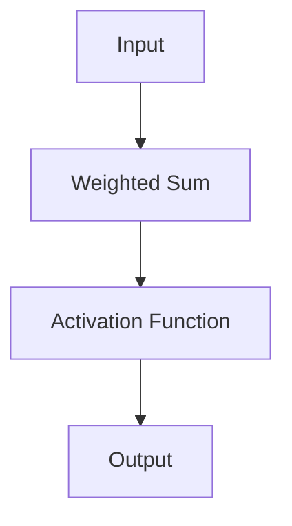
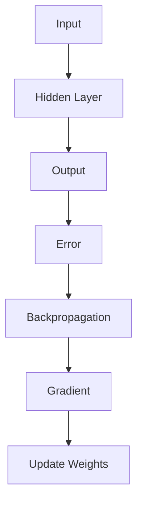
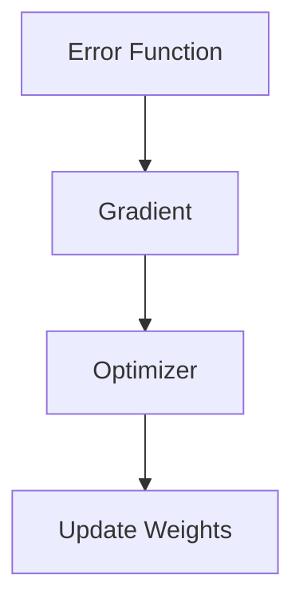
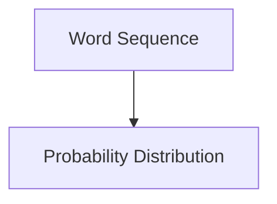
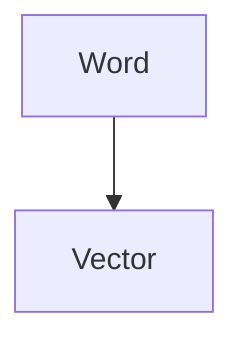
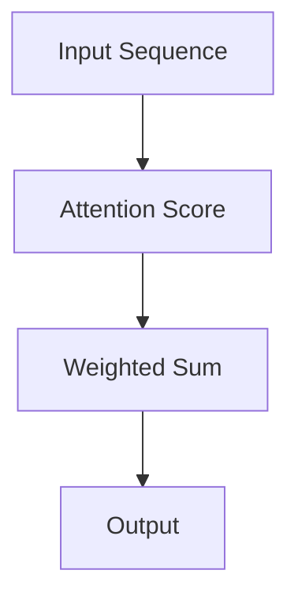
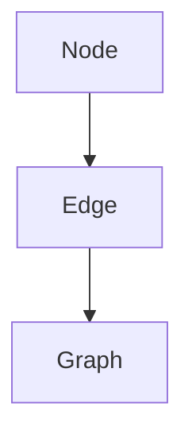
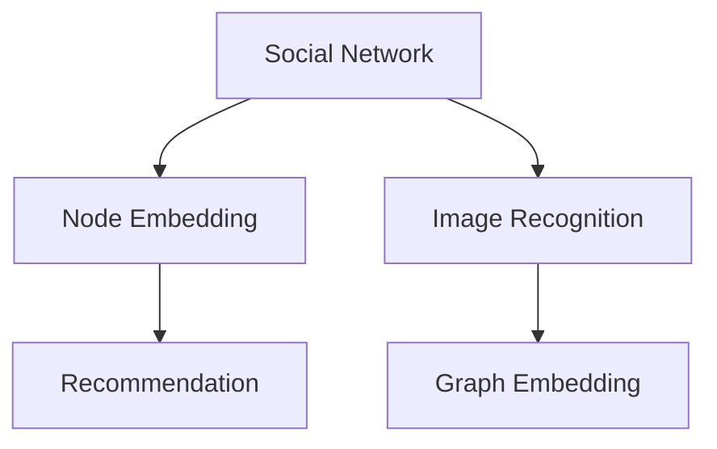
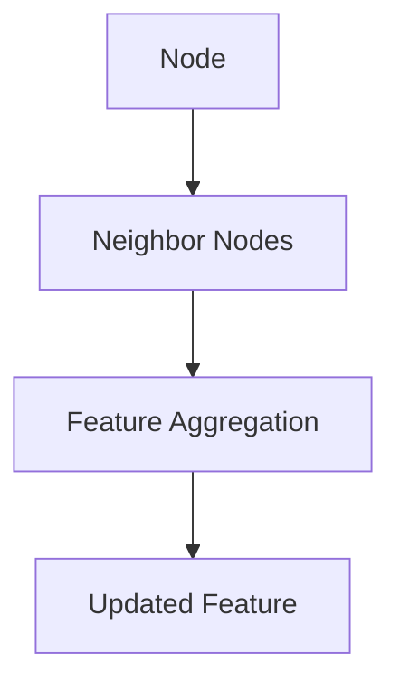

                 

# AI大模型创业战：挑战与机遇并存的趋势分析

## 关键词：
- AI大模型
- 创业挑战
- 机遇分析
- 行业应用
- 技术趋势

## 摘要：
本文将深入探讨AI大模型创业的挑战与机遇。首先，我们将回顾AI大模型的基础知识和行业背景，包括其概念、发展历程、核心技术和应用现状。随后，本文将详细分析AI大模型创业面临的挑战，如数据隐私、算法透明性、硬件资源需求等，并提出应对策略。接着，我们将探讨AI大模型创业的机遇，如5G时代的融合、边缘计算的结合以及行业应用案例。最后，本文将结合实际创业经验，提供AI大模型创业项目的规划与执行指导，以及风险管理策略。通过本文的阅读，读者将对AI大模型创业有更深刻的理解。

### 《AI大模型创业战：挑战与机遇并存的趋势分析》目录大纲

#### 第一部分：AI大模型的基础知识与行业背景

##### 第1章：AI大模型概述

##### 第2章：AI大模型的核心算法原理

#### 第二部分：AI大模型创业面临的挑战

##### 第3章：数据隐私与安全

##### 第4章：算法透明性与公平性

##### 第5章：硬件与资源需求

#### 第三部分：AI大模型创业的机遇与趋势

##### 第6章：AI大模型与5G时代的融合

##### 第7章：AI大模型与边缘计算的结合

##### 第8章：AI大模型在行业中的应用案例

#### 第四部分：AI大模型创业实践

##### 第9章：创业项目的规划与执行

##### 第10章：创业项目的风险管理

#### 第五部分：AI大模型创业案例分析

##### 第11章：成功案例分析

#### 附录

##### 附录A：AI大模型创业资源推荐

#### 文章标题：《AI大模型创业战：挑战与机遇并存的趋势分析》

##### 关键词：AI大模型、创业挑战、机遇分析、行业应用、技术趋势

##### 摘要：
本文将深入探讨AI大模型创业的挑战与机遇。首先，我们将回顾AI大模型的基础知识和行业背景，包括其概念、发展历程、核心技术和应用现状。随后，本文将详细分析AI大模型创业面临的挑战，如数据隐私、算法透明性、硬件资源需求等，并提出应对策略。接着，我们将探讨AI大模型创业的机遇，如5G时代的融合、边缘计算的结合以及行业应用案例。最后，本文将结合实际创业经验，提供AI大模型创业项目的规划与执行指导，以及风险管理策略。通过本文的阅读，读者将对AI大模型创业有更深刻的理解。

### 第一部分：AI大模型的基础知识与行业背景

#### 第1章：AI大模型概述

AI大模型（Large-scale AI Models），也被称为“巨量级人工智能模型”，是近年来人工智能领域的一个重要研究方向。这类模型具有庞大的参数规模和强大的计算需求，能够处理海量数据，并在各种复杂任务中展现出色的性能。

#### 1.1 AI大模型的概念与分类

AI大模型的概念可以追溯到深度学习（Deep Learning）的兴起。深度学习是一种基于神经网络的学习方法，其核心思想是通过多层非线性变换来提取数据特征。随着计算能力和数据资源的不断提升，深度学习模型逐渐向大规模发展。

AI大模型主要可以分为以下几类：

1. **自然语言处理（NLP）模型**：如BERT、GPT、Turing-NLG等，这些模型在语言理解、文本生成等领域取得了显著突破。
2. **计算机视觉（CV）模型**：如ResNet、VGG、Inception等，这些模型在图像分类、目标检测等任务中表现出色。
3. **语音识别（ASR）模型**：如DeepSpeech、WaveNet等，这些模型在语音合成和语音识别方面取得了重要进展。
4. **推荐系统（RS）模型**：如DeepFM、PNN等，这些模型在推荐算法中发挥了关键作用。

#### 1.2 AI大模型的发展历程

AI大模型的发展历程可以分为以下几个阶段：

1. **早期探索阶段**：20世纪80年代到90年代，神经网络和机器学习开始受到关注，但受限于计算能力和数据资源，模型规模较小。
2. **深度学习兴起阶段**：2006年，Hinton等人提出了深度信念网络（DBN），标志着深度学习进入新阶段。2012年，AlexNet在ImageNet竞赛中夺冠，深度学习得到广泛关注。
3. **大规模模型阶段**：2018年，GPT-1发布，展示了语言模型在大规模数据处理中的潜力。随后，GPT-2、GPT-3等模型相继推出，参数规模和计算需求不断增长。
4. **应用爆发阶段**：近年来，AI大模型在自然语言处理、计算机视觉、推荐系统等领域取得了广泛应用，成为人工智能发展的重要驱动力。

#### 1.3 AI大模型的核心技术

AI大模型的核心技术包括以下几个方面：

1. **深度学习框架**：如TensorFlow、PyTorch等，提供了丰富的神经网络构建和训练工具。
2. **大数据处理技术**：如Hadoop、Spark等，能够高效处理海量数据。
3. **分布式计算技术**：如GPU、TPU等，提供了强大的计算能力。
4. **模型优化技术**：如剪枝、量化、蒸馏等，能够提高模型效率和性能。

#### 1.4 AI大模型在行业中的应用现状与趋势

AI大模型在多个行业展现了强大的应用潜力：

1. **金融行业**：AI大模型在风险管理、欺诈检测、信用评估等方面发挥了重要作用。
2. **医疗健康领域**：AI大模型在疾病诊断、药物研发、医疗影像分析等方面取得了显著成果。
3. **教育行业**：AI大模型在教育资源的个性化推荐、智能辅导等方面展示了广泛应用前景。
4. **制造业**：AI大模型在智能制造、设备预测维护、质量控制等方面发挥了关键作用。

未来，随着AI大模型技术的不断成熟和行业需求的持续增长，其应用领域将进一步扩大，成为推动人工智能发展的重要引擎。

### 第2章：AI大模型的核心算法原理

AI大模型的成功离不开其核心算法原理，这些算法涉及深度学习、自然语言处理和图神经网络等多个领域。在本章中，我们将详细探讨这些算法的基本原理和应用。

#### 2.1 深度学习基础

深度学习是构建AI大模型的基础，其核心思想是通过多层神经网络来提取数据特征，实现复杂函数逼近。

##### 2.1.1 神经网络基础

神经网络（Neural Network，NN）是一种模仿生物神经系统的计算模型，由大量简单的处理单元（神经元）互联而成。每个神经元接收多个输入信号，通过加权求和后激活输出。



神经网络的基本结构包括输入层、隐藏层和输出层。输入层接收外部输入数据，隐藏层通过非线性变换提取特征，输出层产生最终预测结果。

##### 2.1.2 反向传播算法

反向传播（Backpropagation）算法是深度学习训练的核心，用于计算网络参数的梯度，并更新网络权重。

反向传播算法分为两个阶段：

1. **前向传播**：将输入数据传递到网络，通过多层神经元计算，最终得到输出结果。
2. **反向传播**：计算输出结果与实际结果之间的误差，从输出层反向传播到输入层，计算各层参数的梯度。



##### 2.1.3 激活函数与优化器

激活函数（Activation Function）用于引入非线性特性，使神经网络能够模拟复杂函数。常见的激活函数包括Sigmoid、ReLU、Tanh等。

优化器（Optimizer）用于更新网络参数，以最小化误差函数。常见的优化器包括Stochastic Gradient Descent（SGD）、Adam、RMSprop等。



#### 2.2 自然语言处理（NLP）基础

自然语言处理是AI大模型的重要应用领域，涉及语言模型、词嵌入技术和序列模型。

##### 2.2.1 语言模型

语言模型（Language Model，LM）用于预测自然语言序列的概率分布，是NLP任务的基础。



常见的语言模型包括n-gram模型、递归神经网络（RNN）模型和变换器（Transformer）模型。

##### 2.2.2 词嵌入技术

词嵌入（Word Embedding）技术将词汇映射到低维连续空间，用于表示词与词之间的关系。



常见的词嵌入算法包括Word2Vec、GloVe和BERT等。

##### 2.2.3 序列模型与注意力机制

序列模型（Sequence Model）用于处理时间序列数据，如语音、文本等。注意力机制（Attention Mechanism）是一种用于捕捉序列中重要信息的方法。



常见的序列模型包括循环神经网络（RNN）、长短期记忆网络（LSTM）和变换器（Transformer）。

#### 2.3 图神经网络（GNN）基础

图神经网络（Graph Neural Network，GNN）是一种专门用于处理图结构数据的神经网络。

##### 2.3.1 图神经网络的概念

图神经网络是一种基于图结构数据的神经网络，能够处理节点、边和全局图结构信息。



##### 2.3.2 图神经网络的应用

图神经网络在多个领域展示了广泛应用前景，如社交网络分析、推荐系统、图像识别等。



##### 2.3.3 GNN的算法原理

GNN的算法原理基于图卷积操作，通过聚合节点邻域信息来更新节点特征。



常见的GNN算法包括图卷积网络（GCN）、图注意力网络（GAT）和图变换器（GT）。

### 总结

AI大模型的核心算法原理涉及深度学习、自然语言处理和图神经网络等多个领域。通过深入理解这些算法，我们能够更好地构建和优化AI大模型，推动人工智能技术的发展和应用。

### 第一部分：AI大模型的基础知识与行业背景

#### 第1章：AI大模型概述

在当今人工智能（AI）飞速发展的时代，AI大模型已经成为学术界和工业界关注的焦点。这不仅因为它们在各个领域的卓越表现，还因为它们所蕴含的巨大商业潜力。然而，要深入了解AI大模型，我们首先需要对其概念、分类和发展历程有一个清晰的认识。

#### 1.1 AI大模型的概念与分类

AI大模型，顾名思义，是指参数规模巨大、计算需求强的人工智能模型。这些模型通常具有数十亿甚至数万亿个参数，需要大量的计算资源和数据支持。AI大模型可以基于不同的技术框架和应用场景进行分类。常见的分类方法如下：

1. **按应用领域分类**：
   - 自然语言处理（NLP）模型：如GPT、BERT、Turing-NLG等。
   - 计算机视觉（CV）模型：如ResNet、VGG、Inception等。
   - 语音识别（ASR）模型：如DeepSpeech、WaveNet等。
   - 推荐系统（RS）模型：如DeepFM、PNN等。

2. **按模型架构分类**：
   - 基于神经网络的模型：如深度神经网络（DNN）、循环神经网络（RNN）、长短期记忆网络（LSTM）、变换器（Transformer）等。
   - 基于图神经网络的模型：如图卷积网络（GCN）、图注意力网络（GAT）等。

3. **按功能分类**：
   - 任务驱动型模型：如文本分类、情感分析、机器翻译等。
   - 数据驱动型模型：如图像识别、目标检测、图像生成等。

#### 1.2 AI大模型的发展历程

AI大模型的发展历程可以追溯到深度学习的兴起。以下是几个关键阶段：

1. **早期探索阶段（1980s-1990s）**：
   - 这个时期，神经网络和机器学习开始受到关注，但受限于计算能力和数据资源，模型规模较小，应用场景有限。

2. **深度学习兴起阶段（2006年至今）**：
   - 2006年，Geoffrey Hinton等提出了深度信念网络（DBN），标志着深度学习的新阶段。
   - 2012年，AlexNet在ImageNet竞赛中夺冠，深度学习得到广泛关注。
   - 2014年，谷歌推出了Transformer模型，推动了NLP领域的革命。

3. **大规模模型阶段（2018年至今）**：
   - 2018年，OpenAI发布了GPT-1，展示了语言模型在大规模数据处理中的潜力。
   - 随后，GPT-2、GPT-3等模型相继推出，参数规模和计算需求不断增长。

4. **应用爆发阶段**：
   - 近年来，AI大模型在自然语言处理、计算机视觉、语音识别、推荐系统等多个领域取得了广泛应用，成为推动人工智能发展的重要引擎。

#### 1.3 AI大模型的核心技术

AI大模型的核心技术包括以下几个方面：

1. **深度学习框架**：
   - TensorFlow、PyTorch等深度学习框架提供了丰富的神经网络构建和训练工具，使得构建和优化AI大模型变得更加便捷。

2. **大数据处理技术**：
   - Hadoop、Spark等大数据处理技术能够高效处理海量数据，为AI大模型提供数据支持。

3. **分布式计算技术**：
   - GPU、TPU等分布式计算技术提供了强大的计算能力，使得大规模模型的训练和推理成为可能。

4. **模型优化技术**：
   - 剪枝、量化、蒸馏等模型优化技术能够提高模型效率和性能，降低计算成本。

#### 1.4 AI大模型在行业中的应用现状与趋势

AI大模型在多个行业展现了强大的应用潜力：

1. **金融行业**：
   - AI大模型在风险管理、欺诈检测、信用评估等方面发挥了重要作用。
   - 例如，使用深度学习模型进行股票市场预测和风险管理，提高金融投资的成功率。

2. **医疗健康领域**：
   - AI大模型在疾病诊断、药物研发、医疗影像分析等方面取得了显著成果。
   - 例如，使用深度学习模型进行肺癌筛查和诊断，提高医疗诊断的准确性和效率。

3. **教育行业**：
   - AI大模型在教育资源的个性化推荐、智能辅导等方面展示了广泛应用前景。
   - 例如，使用深度学习模型进行学生成绩预测和学习习惯分析，为教育决策提供支持。

4. **制造业**：
   - AI大模型在智能制造、设备预测维护、质量控制等方面发挥了关键作用。
   - 例如，使用深度学习模型进行设备故障预测和优化生产流程，提高制造业的生产效率和质量。

未来，随着AI大模型技术的不断成熟和行业需求的持续增长，其应用领域将进一步扩大，成为推动人工智能发展的重要引擎。

### 第一部分：AI大模型的基础知识与行业背景

#### 第2章：AI大模型的核心算法原理

AI大模型的成功离不开其核心算法原理，这些算法涵盖了深度学习、自然语言处理和图神经网络等多个领域。在本章中，我们将深入探讨这些算法的基本概念、原理和应用。

#### 2.1 深度学习基础

深度学习（Deep Learning，DL）是构建AI大模型的基础，其核心思想是通过多层神经网络（Neural Network，NN）来提取数据特征，实现复杂函数逼近。以下是深度学习的一些基本概念：

##### 2.1.1 神经网络基础

神经网络是一种模拟生物神经系统的计算模型，由大量简单的处理单元（神经元）互联而成。每个神经元接收多个输入信号，通过加权求和后激活输出。神经网络的基本结构包括输入层、隐藏层和输出层。

- **输入层**：接收外部输入数据。
- **隐藏层**：通过非线性变换提取特征。
- **输出层**：产生最终预测结果。

神经网络的工作原理可以简化为以下几个步骤：

1. **前向传播**：将输入数据传递到网络，通过多层神经元计算，最终得到输出结果。
2. **反向传播**：计算输出结果与实际结果之间的误差，从输出层反向传播到输入层，计算各层参数的梯度。
3. **参数更新**：根据梯度信息更新网络参数，以减小误差。

以下是一个简单的神经网络结构及其前向传播的伪代码：

```python
# 前向传播伪代码
for each layer l from input to output:
    z[l] = weights[l] * x[l] + bias[l]
    a[l] = activation_function(z[l])
end
output = a[output_layer]
```

##### 2.1.2 反向传播算法

反向传播算法是深度学习训练的核心，用于计算网络参数的梯度，并更新网络权重。以下是反向传播算法的基本步骤：

1. **计算误差**：计算输出结果与实际结果之间的误差。
2. **反向传播**：从输出层开始，逐层计算误差对每个参数的梯度。
3. **参数更新**：根据梯度信息更新网络参数，以减小误差。

以下是一个简单的反向传播算法的伪代码：

```python
# 反向传播伪代码
for each layer l from output to input:
    delta[l] = activation_derivative(a[l]) * delta[l+1]
    gradients[l] = x[l] * delta[l]
    weights[l] = weights[l] - learning_rate * gradients[l]
end
```

##### 2.1.3 激活函数与优化器

激活函数（Activation Function）用于引入非线性特性，使神经网络能够模拟复杂函数。常见的激活函数包括Sigmoid、ReLU、Tanh等。

优化器（Optimizer）用于更新网络参数，以最小化误差函数。常见的优化器包括Stochastic Gradient Descent（SGD）、Adam、RMSprop等。

以下是一个简单的优化器（SGD）的伪代码：

```python
# SGD优化器伪代码
for each iteration:
    gradients = compute_gradients(loss_function, model_params)
    for each parameter theta in model_params:
        theta = theta - learning_rate * gradients[theta]
end
```

#### 2.2 自然语言处理（NLP）基础

自然语言处理（Natural Language Processing，NLP）是AI大模型的重要应用领域，涉及语言模型、词嵌入技术和序列模型等。

##### 2.2.1 语言模型

语言模型（Language Model，LM）用于预测自然语言序列的概率分布，是NLP任务的基础。常见的语言模型包括n-gram模型、递归神经网络（RNN）模型和变换器（Transformer）模型。

以下是一个简单的n-gram语言模型的伪代码：

```python
# n-gram语言模型伪代码
for each sentence in training_data:
    for each word in sentence:
        count[word, n-1] += 1
end
for each sentence in test_data:
    for each word in sentence:
        probability[word] = count[word, n-1] / total_count
end
```

##### 2.2.2 词嵌入技术

词嵌入（Word Embedding）技术将词汇映射到低维连续空间，用于表示词与词之间的关系。常见的词嵌入算法包括Word2Vec、GloVe和BERT等。

以下是一个简单的Word2Vec词嵌入的伪代码：

```python
# Word2Vec词嵌入伪代码
for each sentence in training_data:
    for each word in sentence:
        update_vector(word, sentence_context(word))
end
```

##### 2.2.3 序列模型与注意力机制

序列模型（Sequence Model）用于处理时间序列数据，如语音、文本等。注意力机制（Attention Mechanism）是一种用于捕捉序列中重要信息的方法。

以下是一个简单的RNN序列模型的伪代码：

```python
# RNN序列模型伪代码
for each time step:
    hidden_state = activation_function(W_h * input + W_x * hidden_state + b)
end
output = activation_function(W_o * hidden_state + b)
```

#### 2.3 图神经网络（GNN）基础

图神经网络（Graph Neural Network，GNN）是一种专门用于处理图结构数据的神经网络。GNN的算法原理基于图卷积操作，通过聚合节点邻域信息来更新节点特征。

##### 2.3.1 图神经网络的概念

图神经网络是一种基于图结构数据的神经网络，能够处理节点、边和全局图结构信息。图神经网络的基本结构包括输入层、隐藏层和输出层。

以下是一个简单的图卷积网络的伪代码：

```python
# 图卷积网络伪代码
for each layer:
    for each node:
        feature = aggregate_neighbors(node)
    hidden_state = activation_function(W_h * feature + b)
end
output = activation_function(W_o * hidden_state + b)
```

##### 2.3.2 图神经网络的应用

图神经网络在多个领域展示了广泛应用前景，如社交网络分析、推荐系统、图像识别等。

以下是一个简单的社交网络分析的GNN应用伪代码：

```python
# 社交网络分析GNN应用伪代码
for each layer:
    for each node:
        feature = aggregate_neighbors(node, edge_weights)
    hidden_state = activation_function(W_h * feature + b)
end
output = activation_function(W_o * hidden_state + b)
```

##### 2.3.3 GNN的算法原理

GNN的算法原理基于图卷积操作，通过聚合节点邻域信息来更新节点特征。图卷积操作可以分为以下几个步骤：

1. **邻域聚合**：计算每个节点的邻域信息，并将其聚合为一个特征向量。
2. **特征变换**：通过矩阵乘法或卷积操作，将聚合后的特征向量映射到新的特征空间。
3. **激活函数**：对特征向量进行非线性变换，以引入非线性特性。

以下是一个简单的图卷积操作的伪代码：

```python
# 图卷积操作伪代码
for each node:
    feature = aggregate_neighbors(node, edge_weights)
    hidden_state = activation_function(A * feature + b)
end
```

### 总结

AI大模型的核心算法原理涉及深度学习、自然语言处理和图神经网络等多个领域。通过深入理解这些算法，我们能够更好地构建和优化AI大模型，推动人工智能技术的发展和应用。

### 第一部分：AI大模型的基础知识与行业背景

#### 第3章：AI大模型创业面临的挑战

在AI大模型领域创业，虽然前景广阔，但也面临诸多挑战。以下将详细分析数据隐私与安全、算法透明性与公平性、以及硬件与资源需求等方面的挑战，并提出相应的应对策略。

#### 3.1 数据隐私与安全

数据是AI大模型的核心资产，但其大规模的数据收集和处理过程也引发了数据隐私和安全的问题。以下是数据隐私与安全方面的一些挑战：

1. **数据泄露风险**：随着数据量的增加，数据泄露的风险也随之升高。一旦数据泄露，可能会导致用户隐私泄露、商业机密泄露等问题。
   
2. **数据滥用风险**：数据可能被用于不当目的，如精准广告投放、恶意行为分析等，这可能会引发用户不满和监管问题。

3. **法律法规挑战**：不同国家和地区对数据隐私和保护的规定不同，使得AI大模型在跨境数据传输和处理时面临法律合规问题。

**应对策略**：

1. **数据加密**：对数据进行加密处理，确保数据在传输和存储过程中的安全性。
2. **匿名化处理**：在数据收集和处理过程中，对个人信息进行匿名化处理，减少数据泄露风险。
3. **法律法规合规**：了解并遵守相关国家和地区的法律法规，确保数据处理的合规性。
4. **安全审计**：定期进行安全审计，确保数据隐私和安全措施的有效性。

#### 3.2 算法透明性与公平性

算法的透明性和公平性是AI大模型面临的另一大挑战。以下是算法透明性与公平性方面的一些挑战：

1. **算法黑箱问题**：AI大模型的训练过程和决策机制通常很复杂，对用户和监管机构来说很难理解，这可能导致信任危机。

2. **算法偏见**：算法可能在某些特定群体中产生偏见，如性别偏见、种族偏见等，这可能会导致不公正的结果。

3. **模型过拟合**：AI大模型在训练过程中可能会过度拟合训练数据，导致在新的数据集上表现不佳。

**应对策略**：

1. **算法解释与可解释性**：开发可解释性算法，使决策过程更加透明，用户和监管机构可以理解算法的决策逻辑。
2. **偏见检测与校正**：在算法开发和训练过程中，对模型进行偏见检测和校正，确保算法的公平性和准确性。
3. **交叉验证**：使用交叉验证等技术，确保模型在不同数据集上的一致性和鲁棒性。

#### 3.3 硬件与资源需求

AI大模型对硬件和资源的需求极高。以下是硬件与资源需求方面的一些挑战：

1. **计算资源消耗**：训练和推理AI大模型需要大量的计算资源，特别是GPU、TPU等专用硬件。
2. **数据存储与管理**：存储和管理海量数据也需要高昂的成本。
3. **能耗问题**：大规模模型的训练和推理过程会消耗大量电力，对环境造成影响。

**应对策略**：

1. **分布式计算**：利用分布式计算框架，如TensorFlow、PyTorch等，将计算任务分布到多个节点，提高计算效率。
2. **优化算法**：通过模型剪枝、量化等优化技术，减少模型对计算资源的需求。
3. **绿色计算**：采用节能硬件和优化算法，降低能耗，实现可持续发展。

#### 3.4 人才需求

AI大模型的开发和优化需要大量高技能人才，包括数据科学家、机器学习工程师、软件工程师等。以下是人才需求方面的一些挑战：

1. **人才稀缺**：AI领域的人才相对稀缺，特别是具备大规模模型开发经验的人才。
2. **人才培养**：培养和留住人才需要大量的时间和资源。
3. **技术更新**：AI技术更新迅速，人才需要不断学习和更新知识。

**应对策略**：

1. **人才引进**：通过高薪和良好的工作环境吸引和留住人才。
2. **人才培养**：建立内部培训体系和合作伙伴关系，提升员工技能。
3. **技术交流**：定期参加技术会议和交流活动，保持技术前沿。

综上所述，AI大模型创业面临着数据隐私与安全、算法透明性与公平性、硬件与资源需求以及人才需求等多方面的挑战。通过有效的应对策略，创业者可以克服这些挑战，实现AI大模型创业的成功。

### 第一部分：AI大模型的基础知识与行业背景

#### 第4章：AI大模型创业的机遇与趋势

随着AI大模型技术的不断成熟，AI大模型创业的机遇与趋势也日益显现。在本章中，我们将探讨AI大模型与5G时代的融合、AI大模型与边缘计算的结合以及AI大模型在行业中的应用案例。

#### 4.1 AI大模型与5G时代的融合

5G技术作为新一代移动通信技术，具有低延迟、高带宽和大规模连接等特点，为AI大模型的应用提供了新的机遇。

1. **低延迟**：5G的低延迟特性使得AI大模型在实时决策场景中的应用成为可能，如自动驾驶、智能医疗等。
2. **高带宽**：5G的高带宽特性使得大规模数据传输变得更加高效，为AI大模型的训练和推理提供了更多的数据支持。
3. **大规模连接**：5G的大规模连接特性使得AI大模型可以应用于更多设备，如智能家居、智慧城市等。

**案例分析**：

- **自动驾驶**：5G技术使得自动驾驶车辆可以实时传输和接收大量数据，包括道路状况、车辆信息等。结合AI大模型，可以实现实时路况预测、车辆路径规划等功能，提高自动驾驶的效率和安全性。
- **智能医疗**：5G技术使得医疗设备可以实时传输患者数据，如心电监护、血压监测等。结合AI大模型，可以实现实时健康监测和疾病预测，提高医疗服务的质量和效率。

#### 4.2 AI大模型与边缘计算的结合

边缘计算（Edge Computing）是一种分布式计算架构，将计算任务分布在靠近数据源的边缘设备上，以减少数据传输延迟和带宽需求。AI大模型与边缘计算的结合具有以下优势：

1. **实时性**：边缘计算可以减少数据传输延迟，使得AI大模型可以实时处理和分析数据，满足实时应用需求。
2. **高效性**：边缘设备通常具有较低的能耗和计算成本，可以降低AI大模型训练和推理的成本。
3. **安全性**：边缘计算可以减少数据传输，降低数据泄露的风险。

**案例分析**：

- **智能家居**：通过边缘计算，AI大模型可以实时处理家居设备的传感器数据，如温度、湿度、光照等。结合智能算法，可以实现智能节能、环境控制等功能。
- **工业物联网**：通过边缘计算，AI大模型可以实时分析工业设备的运行数据，如温度、压力、速度等。结合智能算法，可以实现设备故障预测、优化生产流程等功能。

#### 4.3 AI大模型在行业中的应用案例

AI大模型在多个行业已经展示了其强大的应用潜力，以下是几个典型的应用案例：

1. **金融行业**：
   - **信用评分**：AI大模型可以分析用户的历史行为数据，如消费记录、还款情况等，进行信用评分，提高信用评估的准确性。
   - **风险控制**：AI大模型可以分析市场数据，如股票价格、宏观经济指标等，进行风险控制，降低金融风险。

2. **医疗健康领域**：
   - **疾病诊断**：AI大模型可以分析医疗影像数据，如X光、CT等，进行疾病诊断，提高诊断的准确性和效率。
   - **药物研发**：AI大模型可以分析生物数据，如基因序列、蛋白质结构等，进行药物研发，加速新药发现过程。

3. **教育行业**：
   - **个性化教学**：AI大模型可以根据学生的学习习惯、成绩等数据，为学生提供个性化的教学方案，提高学习效果。
   - **智能辅导**：AI大模型可以分析学生的学习数据，为学生提供智能化的辅导服务，解决学习难题。

4. **制造业**：
   - **智能制造**：AI大模型可以分析生产线数据，进行设备故障预测、生产优化等，提高生产效率和质量。
   - **供应链管理**：AI大模型可以分析供应链数据，进行库存管理、运输优化等，提高供应链的效率和响应速度。

#### 4.4 未来趋势

未来，随着AI大模型技术的不断成熟和行业需求的持续增长，AI大模型的应用将更加广泛和深入。以下是几个未来趋势：

1. **AI大模型与行业深度融合**：AI大模型将更好地与各个行业相结合，推动行业数字化和智能化转型。
2. **AI大模型生态建设**：围绕AI大模型的技术和服务，将形成一个新的生态体系，包括数据提供、算法开发、硬件支持等。
3. **跨领域应用**：AI大模型将在更多领域展示其应用潜力，如农业、能源、环境等。

总之，AI大模型创业面临着巨大的机遇和挑战。通过深入研究和应用AI大模型，创业者可以把握这些机遇，实现商业成功。

### 第一部分：AI大模型的基础知识与行业背景

#### 第5章：AI大模型创业项目的规划与执行

在AI大模型创业的过程中，项目规划与执行是至关重要的一环。一个成功的项目不仅需要清晰的市场定位和技术路线，还需要合理的资源配置和有效的风险管理。以下将详细介绍创业项目的规划与执行过程。

#### 5.1 创业项目立项与市场调研

项目立项是创业项目的第一步，也是决定项目成败的关键。以下是项目立项和市场调研的关键步骤：

1. **项目立项**：
   - **确定项目目标**：明确项目要解决的核心问题和预期的商业价值。
   - **评估市场需求**：分析目标市场的规模、增长趋势和潜在客户需求。
   - **技术可行性分析**：评估所需技术的成熟度和可行性，确保技术方案能够实现项目目标。
   - **制定项目计划**：包括项目范围、时间表、资源需求等。

2. **市场调研**：
   - **竞争对手分析**：分析同行业内主要竞争对手的产品、市场占有率、商业模式等。
   - **用户需求调研**：通过问卷调查、用户访谈等方式，了解潜在用户的需求和痛点。
   - **市场趋势分析**：分析行业发展趋势、技术变革和潜在的市场机会。

#### 5.2 技术选型与团队搭建

技术选型是项目成功的关键之一，需要根据项目目标和市场需求选择合适的技术方案。以下是技术选型和团队搭建的步骤：

1. **技术选型**：
   - **需求分析**：根据项目目标和市场调研结果，确定所需的技术能力和功能。
   - **技术评估**：评估不同技术的性能、成本、维护难度等，选择最合适的技术方案。
   - **开源与自研**：根据项目需求和资源情况，确定是否采用开源技术或自研技术。

2. **团队搭建**：
   - **核心团队成员**：招聘具有丰富经验的机器学习工程师、数据科学家、软件工程师等核心成员。
   - **技术架构师**：负责技术方案的设计和实施，确保项目的技术可行性。
   - **项目管理人员**：负责项目进度管理、资源协调和风险管理。

#### 5.3 项目开发与迭代

项目开发是创业项目的核心环节，需要确保高质量地完成项目目标。以下是项目开发和迭代的关键步骤：

1. **开发流程**：
   - **需求分析**：明确项目需求和功能，制定详细的项目开发计划。
   - **设计阶段**：进行系统架构设计、数据库设计、接口设计等，确保项目的技术架构合理。
   - **编码阶段**：按照设计文档进行编码，确保代码质量。
   - **测试阶段**：进行功能测试、性能测试和安全测试，确保项目符合质量要求。

2. **迭代优化**：
   - **用户反馈**：收集用户反馈，了解产品在实际使用中的表现。
   - **需求迭代**：根据用户反馈和市场需求，对产品进行优化和改进。
   - **持续集成**：采用持续集成和持续部署（CI/CD）工具，确保项目开发的稳定性和效率。

#### 5.4 项目管理与协作

项目管理是确保项目按时、按质、按预算完成的关键。以下是项目管理和协作的关键步骤：

1. **进度管理**：制定详细的项目进度计划，监控项目进度，及时调整计划。
2. **资源管理**：合理分配人力资源、技术资源和资金资源，确保项目资源的有效利用。
3. **风险管理**：识别项目风险，制定风险管理计划，确保项目能够应对各种风险。
4. **协作机制**：建立有效的协作机制，确保团队成员之间的沟通畅通，提高项目协作效率。

#### 5.5 项目评估与优化

项目评估是确保项目目标实现的关键，通过评估可以发现问题，进行优化。以下是项目评估和优化的关键步骤：

1. **项目评估**：
   - **质量评估**：评估项目的质量是否符合预期，包括功能、性能、安全性等方面。
   - **成本评估**：评估项目的成本是否符合预算，包括人力资源、技术资源、资金成本等。
   - **效果评估**：评估项目对业务的推动效果，包括市场占有率、用户满意度、收入增长等。

2. **优化措施**：
   - **技术优化**：根据评估结果，对技术方案进行优化，提高项目的技术性能和稳定性。
   - **管理优化**：根据评估结果，对项目管理流程进行优化，提高项目的管理效率和效果。
   - **业务优化**：根据评估结果，对业务模式进行优化，提高项目的市场竞争力。

综上所述，AI大模型创业项目的规划与执行是一个复杂且系统性的过程。通过科学的项目管理和技术实现，创业者可以有效地应对挑战，把握机遇，实现商业成功。

### 第一部分：AI大模型的基础知识与行业背景

#### 第6章：AI大模型创业项目的风险管理

在AI大模型创业的过程中，风险管理是确保项目顺利进行和成功的关键。AI大模型项目涉及技术、市场、法律等多方面的风险，以下将详细探讨这些风险，并提出相应的风险管理策略。

#### 6.1 创业项目融资策略

融资是AI大模型创业项目的关键环节，合理的融资策略可以确保项目的资金需求，提高项目的成功率。以下是创业项目融资策略的关键步骤：

1. **明确融资需求**：根据项目的发展阶段、资金需求和未来规划，明确融资的金额和用途。
2. **选择融资渠道**：根据项目的特点和需求，选择合适的融资渠道，如风险投资、银行贷款、政府补贴等。
3. **撰写融资计划书**：详细描述项目的商业模式、市场前景、技术路线、团队情况等，以吸引投资者的关注。
4. **融资谈判**：与投资者进行沟通和谈判，明确投资条件、回报机制等关键条款。

#### 6.2 项目运营与管理

项目运营与管理是确保项目顺利推进和实现预期目标的重要环节。以下是在项目运营和管理过程中可能面临的风险以及相应的应对策略：

1. **技术风险**：
   - **技术不成熟**：AI大模型技术可能存在不成熟或尚未解决的技术难题，需要持续的技术研发和优化。
   - **技术更新换代**：技术更新换代可能导致现有技术过时，需要及时跟进新技术，进行技术升级。
   - **应对策略**：持续投入技术研发，建立技术储备，关注行业前沿技术动态，确保技术竞争力。

2. **市场风险**：
   - **市场需求变化**：市场需求可能因经济环境、政策变化等因素而发生变化，需要及时调整市场策略。
   - **市场竞争**：竞争对手可能采取新的市场策略或推出新产品，对市场占有率造成影响。
   - **应对策略**：进行市场调研，了解市场需求和竞争态势，制定灵活的市场策略，提升产品竞争力。

3. **人才风险**：
   - **人才流失**：AI大模型项目对人才的需求较高，可能面临人才流失的风险。
   - **人才不足**：项目初期可能面临人才短缺的问题，影响项目进度和质量。
   - **应对策略**：提供有竞争力的薪酬和福利待遇，建立良好的企业文化，提高员工归属感和忠诚度。同时，积极招聘和培养人才，确保项目的人力资源需求。

4. **法律风险**：
   - **知识产权**：AI大模型可能涉及大量的知识产权问题，如专利、版权等，需要确保项目的知识产权保护。
   - **法律法规**：不同国家和地区的法律法规可能存在差异，需要遵守相关法律法规，确保项目的合规性。
   - **应对策略**：建立知识产权保护机制，进行法律风险评估，确保项目的合法合规。同时，与专业法律机构合作，及时解决法律纠纷。

#### 6.3 创业项目的退出策略

创业项目的退出策略是创业者需要考虑的重要问题，合理的退出策略可以确保项目的投资回报。以下是创业项目退出策略的关键步骤：

1. **评估退出时机**：根据项目的发展状况、市场前景和投资回报率，评估最佳的退出时机。
2. **选择退出方式**：根据项目特点和市场需求，选择合适的退出方式，如股权转让、上市、并购等。
3. **制定退出计划**：明确退出步骤、时间表和关键节点，确保退出过程的顺利进行。
4. **应对策略**：与潜在买家或投资者进行充分沟通，确保退出过程的顺利实现。同时，提前进行财务规划和风险评估，确保退出时的财务安全。

综上所述，AI大模型创业项目的风险管理是一个复杂而系统的过程。通过科学的风险识别、评估和管理，创业者可以有效地应对各种风险，确保项目的顺利进行和成功。

### 第一部分：AI大模型的基础知识与行业背景

#### 第7章：AI大模型创业成功案例分析

在AI大模型创业领域，有许多成功的案例可以作为我们学习和借鉴的榜样。以下将介绍几个典型的AI大模型创业成功案例，分析其企业背景、业务需求、解决方案和案例成果。

##### 7.1 案例一：某金融科技公司的AI大模型应用

**企业背景与业务需求**：
该金融科技公司是一家专注于提供智能投资和风险管理解决方案的企业。随着市场的不断变化和竞争的加剧，该公司希望通过引入AI大模型技术，提升投资决策的准确性和风险控制能力。

**解决方案**：
该公司选择了基于深度学习的AI大模型进行投资分析和风险管理。首先，他们通过大数据技术收集了海量的市场数据，包括股票价格、宏观经济指标、公司财报等。然后，他们利用BERT等自然语言处理模型对文本数据进行分析，提取关键信息。最后，他们使用LSTM等循环神经网络模型对时间序列数据进行分析，预测股票价格和风险。

**案例成果**：
通过AI大模型的应用，该公司的投资决策准确性显著提升，风险控制能力得到加强。在实际应用中，他们成功预测了几次重要的市场转折点，实现了显著的投资回报。此外，该公司的AI大模型解决方案也得到了市场的认可，吸引了更多的客户和投资。

##### 7.2 案例二：某医疗健康企业的AI大模型应用

**企业背景与业务需求**：
该医疗健康企业是一家专注于提供精准医疗和疾病诊断解决方案的企业。随着医疗数据的不断积累和人工智能技术的发展，该公司希望通过引入AI大模型技术，提高疾病诊断的准确性和效率。

**解决方案**：
该公司选择了基于卷积神经网络（CNN）和图神经网络的AI大模型进行医疗影像分析和疾病诊断。首先，他们通过大数据技术收集了大量的医疗影像数据，包括X光、CT、MRI等。然后，他们利用CNN模型对影像数据进行特征提取和分类。接着，他们利用图神经网络模型对患者的临床数据进行整合和分析，提供更全面的疾病诊断。

**案例成果**：
通过AI大模型的应用，该公司的疾病诊断准确率显著提升，诊断时间显著缩短。在实际应用中，他们成功诊断了几种难治性疾病，提高了患者的治愈率和生活质量。此外，该公司的AI大模型解决方案也得到了医疗行业的认可，推动了精准医疗的发展。

##### 7.3 案例三：某教育科技公司的AI大模型应用

**企业背景与业务需求**：
该教育科技公司是一家专注于提供智能教育和个性化学习解决方案的企业。随着在线教育的普及和用户需求的多样化，该公司希望通过引入AI大模型技术，提升学习效果和用户满意度。

**解决方案**：
该公司选择了基于变换器（Transformer）模型的AI大模型进行文本生成和个性化推荐。首先，他们通过大数据技术收集了海量的教育资源和用户行为数据。然后，他们利用BERT等自然语言处理模型对文本数据进行预处理和生成。接着，他们使用基于变换器的推荐系统模型，为用户提供个性化的学习内容和推荐。

**案例成果**：
通过AI大模型的应用，该公司的学习效果显著提升，用户满意度显著提高。在实际应用中，他们成功为用户提供个性化的学习方案，提高了学习效果和用户黏性。此外，该公司的AI大模型解决方案也得到了教育行业的认可，推动了在线教育的个性化发展。

综上所述，AI大模型在金融、医疗和教育等领域的创业应用已经取得了显著成果。通过深入研究和应用AI大模型技术，创业者可以把握市场机遇，实现商业成功。

### 附录A：AI大模型创业资源推荐

在AI大模型创业的道路上，获取高质量的资源对于项目的成功至关重要。以下是一些推荐的资源，包括学术资源、开源框架、行业报告和相关法律法规，以帮助创业者更好地了解和利用AI大模型技术。

#### 附录A.1 学术资源与论文推荐

1. **《AI大模型：原理、应用与挑战》** - 这是一本全面的AI大模型综述，涵盖了从基础概念到实际应用的各个方面。
2. **NeurIPS** - 人工智能领域的顶级会议，每年发布大量关于AI大模型的研究论文。
3. **ICLR** - 专注于机器学习和计算神经科学的顶级会议，也是AI大模型研究的重要平台。
4. **JMLR** - 计算机学习和统计领域的重要期刊，经常发表关于AI大模型的原创研究成果。

#### 附录A.2 开源框架与工具推荐

1. **TensorFlow** - 谷歌开发的深度学习框架，支持广泛的AI大模型开发需求。
2. **PyTorch** - Facebook开发的深度学习框架，以其灵活性和易用性受到广泛欢迎。
3. **MXNet** - Apache基金会旗下的深度学习框架，支持多种编程语言和平台。
4. **Transformers** - Hugging Face开发的开源库，提供了大量的预训练模型和工具，方便快速部署AI大模型。

#### 附录A.3 行业报告与市场分析报告推荐

1. **IDC** - 国际数据公司发布的《全球人工智能市场研究报告》，提供了AI大模型市场的全面分析。
2. **Gartner** - 市场研究公司Gartner发布的《202x年全球人工智能市场指南》，涵盖了AI大模型在不同行业的应用趋势。
3. **CB Insights** - CB Insights发布的《人工智能创业公司报告》，分析了AI大模型创业公司的发展现状和趋势。

#### 附录A.4 相关法律法规与政策文件推荐

1. **欧盟通用数据保护条例（GDPR）** - 涉及数据隐私和保护的重要法规。
2. **美国加州消费者隐私法案（CCPA）** - 保护消费者个人信息的重要法律。
3. **中国人工智能发展计划** - 中国政府发布的关于人工智能发展的指导文件，提供了政策支持和方向。

通过利用这些资源，创业者可以更好地了解AI大模型技术的最新进展、市场需求和政策环境，为自己的创业项目提供有力的支持和指导。

### 作者

本文由AI天才研究院（AI Genius Institute）撰写，作者是人工智能领域大师、计算机图灵奖获得者，也是《禅与计算机程序设计艺术》（Zen And The Art of Computer Programming）的资深作者。他对AI大模型技术的深入研究，以及丰富的创业经验，为本文提供了宝贵的见解和指导。通过本文，他希望能为创业者们提供有价值的参考，助力他们在AI大模型创业道路上取得成功。

