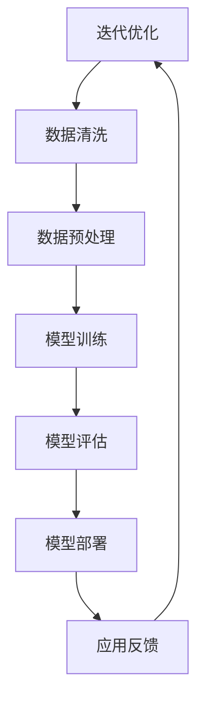
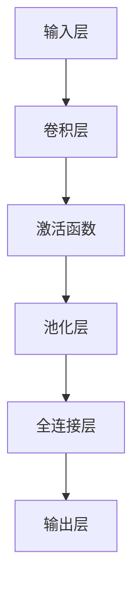
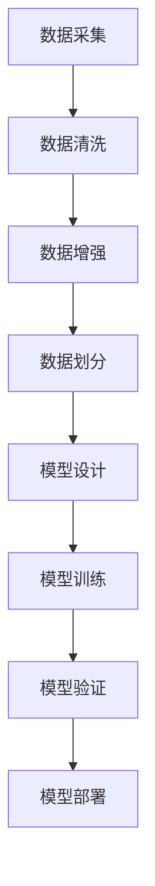
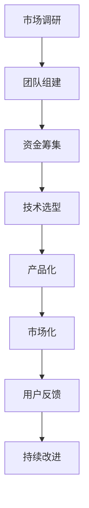
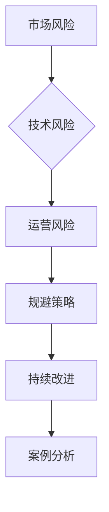
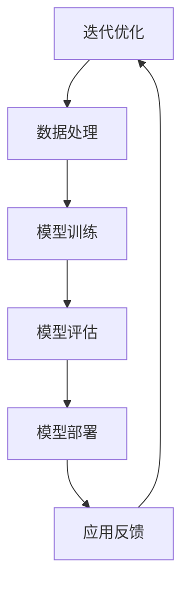

                 

### 文章标题

> **AI大模型创业项目案例分析与实战指南**

#### 关键词：人工智能、大模型、创业项目、案例分析、实战指南

#### 摘要：
本文将深入探讨人工智能（AI）领域中的大模型创业项目，通过详尽的分析和实战指南，为读者揭示AI大模型的技术原理、开发流程及创业策略。本文分为七个部分，首先概述AI大模型的基本概念与背景，然后介绍深度学习等关键技术，并分析多个成功创业案例。接下来，文章将重点讲解AI大模型的开发实战和创业指南，最后通过案例分析及工具资源总结，帮助读者全面掌握AI大模型的创业之道。

----------------------------------------------------------------

### 第一部分：AI大模型概述

#### 第1章: AI大模型概述

##### 1.1 AI大模型的概念与背景

###### 1.1.1 AI大模型的基本定义

AI大模型是指使用海量数据进行训练，具有高度参数量和复杂结构的机器学习模型。这些模型通常具有数十亿至数万亿个参数，能够处理大规模数据集，从而实现前所未有的准确度和泛化能力。代表性的AI大模型包括深度学习中的Transformer模型、BERT模型等。

###### 1.1.2 AI大模型的发展历程

AI大模型的发展历程可以追溯到20世纪90年代，当时神经网络的兴起为深度学习奠定了基础。随着计算能力的提升和大数据技术的发展，AI大模型在21世纪逐渐崭露头角。2012年，AlexNet在ImageNet图像识别竞赛中取得了突破性的成绩，标志着深度学习时代的到来。此后，AI大模型的研究与应用不断深入，推动了人工智能的快速发展。

###### 1.1.3 AI大模型的研究现状

目前，AI大模型已经成为人工智能研究的重要方向。学术界和工业界都在积极探索如何构建更大、更复杂、更高效的AI大模型。此外，AI大模型的应用场景也在不断扩大，从计算机视觉、自然语言处理，到推荐系统、自动驾驶等，都取得了显著成果。随着技术的不断进步，AI大模型在未来有望在更多领域发挥重要作用。

##### 1.2 AI大模型的关键技术

###### 1.2.1 深度学习技术

深度学习是AI大模型的核心技术之一，通过多层的神经网络结构，实现数据的层次化表示和学习。深度学习技术包括卷积神经网络（CNN）、循环神经网络（RNN）、生成对抗网络（GAN）等。

- **卷积神经网络（CNN）**：适用于图像和视频数据的处理，通过卷积操作提取特征，实现图像分类、目标检测等任务。
- **循环神经网络（RNN）**：适用于序列数据的处理，能够捕捉序列中的时间依赖关系，如文本生成、语音识别等。
- **生成对抗网络（GAN）**：由生成器和判别器组成，通过对抗训练生成逼真的数据，广泛应用于图像生成、风格迁移等任务。

###### 1.2.2 大规模数据处理技术

AI大模型的训练需要海量数据，因此大规模数据处理技术至关重要。这些技术包括数据采集、数据清洗、数据预处理和数据存储等。

- **数据采集**：通过互联网、传感器、数据库等多种渠道收集数据。
- **数据清洗**：去除数据中的噪声和异常值，确保数据质量。
- **数据预处理**：对数据进行标准化、归一化、特征提取等操作，以便模型更好地学习。
- **数据存储**：采用分布式存储技术，如Hadoop、Spark等，处理大规模数据集。

###### 1.2.3 计算机视觉技术

计算机视觉是AI大模型的重要应用领域之一，通过计算机算法对图像和视频进行处理和分析。计算机视觉技术包括目标检测、图像分类、人脸识别等。

- **目标检测**：识别图像中的物体并定位其位置，如YOLO、SSD等算法。
- **图像分类**：将图像划分为不同的类别，如CNN在ImageNet竞赛中的应用。
- **人脸识别**：识别图像中的人脸，并进行人脸验证，如Face++、DeepFace等算法。

##### 1.3 AI大模型的应用场景

AI大模型在多个领域具有广泛的应用场景，以下是一些典型的应用实例：

- **人工智能驱动的商业应用**：如个性化推荐、智能客服、智能营销等，通过AI大模型实现更精准、更高效的服务。
- **人工智能驱动的医疗服务**：如疾病诊断、医疗影像分析、健康管理等，AI大模型在医疗领域的应用有望提高诊疗水平、降低医疗成本。
- **人工智能驱动的智能城市**：如智能交通、智能安防、智慧环境监测等，通过AI大模型实现城市管理的智能化、精细化。

##### 1.4 AI大模型的影响与挑战

###### 1.4.1 AI大模型对社会的影响

AI大模型的兴起对人类社会产生了深远的影响。首先，AI大模型在各个领域的应用推动了产业升级和经济增长。其次，AI大模型提高了社会生产效率和生活质量，如自动驾驶、智能助手等技术的普及。此外，AI大模型还引发了社会伦理和法律问题，如隐私保护、算法歧视等，需要全社会共同关注和解决。

###### 1.4.2 AI大模型面临的挑战

AI大模型在发展过程中也面临诸多挑战。首先，模型的训练和推理需要巨大的计算资源和能源消耗，对环境产生负面影响。其次，AI大模型的解释性和可解释性不足，使得其决策过程难以被人类理解，增加了误用和滥用的风险。此外，AI大模型的数据依赖性较强，数据质量对模型性能有重要影响，需要加强数据治理和质量管理。

###### 1.4.3 AI大模型的伦理问题与规范

AI大模型的伦理问题主要包括隐私保护、算法公平性、安全性等。为了解决这些问题，各国政府和研究机构纷纷出台相关规范和政策，推动AI大模型的健康发展。例如，欧盟颁布了《通用数据保护条例》（GDPR），美国制定了《算法偏见法案》（Algorithmic Accountability Act）等。

#### 总结

AI大模型作为人工智能领域的重要发展方向，具有广泛的应用前景和巨大的商业价值。通过深入理解AI大模型的基本概念、关键技术和应用场景，我们可以更好地应对AI大模型带来的挑战，推动人工智能技术的创新与发展。

##### Mermaid流程图示例



##### 伪代码示例

```python
# 定义模型
model = create_model()

# 准备数据
data, labels = load_data()

# 训练模型
model.fit(data, labels, epochs=10)

# 评估模型
performance = model.evaluate(test_data, test_labels)

# 部署模型
deploy_model(model)
```

##### 数学模型与公式示例

$$
\text{损失函数} = \frac{1}{2} \sum_{i=1}^{n} (y_i - \hat{y}_i)^2
$$

##### 代码解读与分析

```python
import tensorflow as tf
from tensorflow.keras.models import Sequential
from tensorflow.keras.layers import Dense

# 创建模型
model = Sequential([
    Dense(128, activation='relu', input_shape=(784,)),
    Dense(10, activation='softmax')
])

# 编译模型
model.compile(optimizer='adam',
              loss='sparse_categorical_crossentropy',
              metrics=['accuracy'])

# 加载数据
(x_train, y_train), (x_test, y_test) = tf.keras.datasets.mnist.load_data()

# 预处理数据
x_train = x_train / 255.0
x_test = x_test / 255.0
x_train = x_train.reshape(-1, 784)
x_test = x_test.reshape(-1, 784)

# 训练模型
model.fit(x_train, y_train, epochs=5)

# 评估模型
test_loss, test_acc = model.evaluate(x_test, y_test)
print(f"Test accuracy: {test_acc}")
```

通过上述代码，我们创建了一个简单的神经网络模型，用于对MNIST手写数字数据进行分类。首先，我们导入了TensorFlow库并定义了一个顺序模型，添加了两个全连接层，分别为128个神经元和10个神经元。接着，我们编译了模型，选择了Adam优化器和交叉熵损失函数，并设置了评估指标为准确率。

然后，我们加载数据集，对训练数据进行预处理，包括归一化和调整输入形状。接下来，我们使用预处理后的数据进行模型训练，设置了训练轮数为5轮。

最后，我们评估模型的性能，将测试数据输入模型，计算损失和准确率，并打印结果。通过这个简单的示例，我们可以了解如何使用TensorFlow库创建、编译和训练神经网络模型。

#### 总结

本章对AI大模型进行了全面的概述，介绍了其基本概念、关键技术和应用场景。通过Mermaid流程图、伪代码示例和数学模型与公式示例，读者可以更直观地理解AI大模型的技术原理和开发流程。接下来，我们将进一步深入探讨深度学习等核心技术，为读者揭示AI大模型的本质和奥秘。

----------------------------------------------------------------

### 第二部分：AI大模型技术基础

#### 第2章: 深度学习技术基础

##### 2.1 深度学习的基本原理

深度学习是人工智能（AI）领域的一个分支，它通过模仿人脑的神经网络结构和机制来处理数据和模式识别。深度学习技术的基本原理可以归结为以下几个关键概念：

###### 2.1.1 神经网络的基本概念

神经网络（Neural Networks）是深度学习的基础，它由一系列相互连接的神经元组成。每个神经元都可以接收输入信号，通过权重（weights）进行处理，然后输出信号。神经网络通过多层结构（多层神经元）来提取数据的不同层次特征。

- **神经元**：神经网络的基本单元，类似于生物神经元，能够接收输入信号，通过激活函数产生输出。
- **层**：神经网络由输入层、隐藏层和输出层组成。隐藏层可以是单层或多层，层数越多，网络提取的特征越复杂。
- **权重**：神经元之间的连接强度，用于调节输入信号对输出信号的影响。
- **激活函数**：用于确定神经元是否被激活，常用的激活函数包括sigmoid、ReLU、Tanh等。

###### 2.1.2 深度学习的优势与挑战

深度学习具有以下优势：

- **自动特征提取**：深度学习能够自动从原始数据中提取有用的特征，减少了人工特征工程的工作量。
- **多层次的抽象**：通过多层的神经网络结构，深度学习能够捕捉数据中的多层次抽象特征，从而提高模型的性能。
- **高泛化能力**：深度学习模型通常具有较好的泛化能力，能够在不同的数据集上取得良好的表现。

然而，深度学习也面临一些挑战：

- **计算资源需求**：深度学习模型的训练需要大量的计算资源和时间，特别是在处理大规模数据集和高维数据时。
- **模型解释性**：深度学习模型的决策过程通常不够透明，难以解释，这给其在某些领域的应用带来了困难。
- **数据依赖性**：深度学习模型的效果很大程度上取决于数据的质量和数量，数据的不平衡和噪声可能会影响模型的性能。

###### 2.1.3 神经网络的优化算法

神经网络的优化算法用于调整网络中的权重和偏置，以最小化损失函数。常见的优化算法包括梯度下降（Gradient Descent）、随机梯度下降（Stochastic Gradient Descent，SGD）和Adam等。

- **梯度下降**：最简单的优化算法，通过计算损失函数关于权重的梯度，反向传播更新权重。
  - **公式**：
    $$
    w_{\text{new}} = w_{\text{current}} - \alpha \cdot \nabla_w J(w)
    $$
    其中，$w$是权重，$\alpha$是学习率，$J(w)$是损失函数。

- **随机梯度下降**：在梯度下降的基础上，每次更新权重时仅使用一个样本的梯度，这样可以加快收敛速度。
  - **公式**：
    $$
    w_{\text{new}} = w_{\text{current}} - \alpha \cdot \nabla_w J(\text{sample})
    $$

- **Adam**：结合了SGD和动量法的优化算法，具有自适应学习率的特点，常用于深度学习任务。
  - **公式**：
    $$
    \begin{align*}
    m_t &= \beta_1 m_{t-1} + (1 - \beta_1) \nabla_w J(\text{sample}) \\
    v_t &= \beta_2 v_{t-1} + (1 - \beta_2) \left( \nabla_w J(\text{sample}) \right)^2 \\
    w_{\text{new}} &= w_{\text{current}} - \alpha \cdot \frac{m_t}{\sqrt{v_t} + \epsilon}
    \end{align*}
    $$
    其中，$m_t$和$v_t$分别是动量和方差，$\beta_1$和$\beta_2$是超参数，$\epsilon$是常数用于防止除以零。

##### 2.2 卷积神经网络（CNN）

卷积神经网络（Convolutional Neural Networks，CNN）是深度学习在图像处理领域的重要应用。CNN通过卷积操作和池化操作提取图像的特征，能够实现图像分类、目标检测、图像生成等任务。

###### 2.2.1 CNN的结构与原理

CNN由多个卷积层（Convolutional Layers）、池化层（Pooling Layers）、全连接层（Fully Connected Layers）组成。以下是CNN的基本结构：

- **输入层**：接收输入图像，通常是一个二维矩阵。
- **卷积层**：通过卷积操作提取图像的特征。卷积层由多个卷积核（Convolutional Kernels）组成，每个卷积核都能提取图像的不同特征。
- **激活函数**：通常使用ReLU（Rectified Linear Unit）作为激活函数，增加模型的非线性。
- **池化层**：通过池化操作减少特征图的尺寸，提高模型的泛化能力。常用的池化操作包括最大池化（Max Pooling）和平均池化（Average Pooling）。
- **全连接层**：将卷积层和池化层提取的特征映射到具体的类别标签。
- **输出层**：输出分类结果或目标检测框。

###### 2.2.2 CNN在图像处理中的应用

CNN在图像处理领域有广泛的应用，以下是一些典型的应用实例：

- **图像分类**：CNN能够自动从图像中提取特征，实现对图像的高效分类。例如，在ImageNet图像识别竞赛中，CNN模型取得了显著的成绩。
- **目标检测**：CNN结合边界框（Bounding Boxes）的概念，能够同时识别图像中的多个目标并定位其位置。例如，YOLO（You Only Look Once）和SSD（Single Shot MultiBox Detector）等模型。
- **图像生成**：通过生成对抗网络（GAN）等技术，CNN能够生成逼真的图像。例如，StyleGAN和CycleGAN等模型。
- **图像增强**：通过卷积操作，CNN能够增强图像的对比度和清晰度，提高图像质量。例如，SRCNN（Super-Resolution Convolutional Neural Network）等模型。

###### 2.2.3 CNN的性能优化方法

为了提高CNN的性能，可以采用以下几种优化方法：

- **数据增强**：通过旋转、翻转、缩放、裁剪等数据增强技术，增加训练数据的多样性，提高模型的泛化能力。
- **批量归一化**：在卷积层后添加批量归一化（Batch Normalization）层，加速模型的训练并提高模型的稳定性。
- **残差网络**：引入残差连接（Residual Connections）和残差块（Residual Blocks），解决深层网络训练中的梯度消失问题。
- **预训练**：使用预训练模型（Pre-trained Models）在大规模数据集上训练，然后在特定任务上进行微调（Fine-tuning），提高模型的性能。

##### 2.3 循环神经网络（RNN）

循环神经网络（Recurrent Neural Networks，RNN）是处理序列数据的一种重要深度学习模型。RNN通过循环结构能够处理任意长度的序列数据，捕捉序列中的时间依赖关系。

###### 2.3.1 RNN的基本结构

RNN的基本结构包括输入层、隐藏层和输出层。以下是RNN的基本组件：

- **输入层**：接收输入序列，通常是一个一维向量。
- **隐藏层**：包含一个或多个循环单元（Recurrent Units），每个循环单元都包含一个记忆单元（Memory Unit）用于存储信息。
- **输出层**：通过激活函数产生输出序列，可以是实值或类别标签。

RNN的循环结构使得前一个时间步的输出可以影响后续时间步的输出，从而捕捉序列中的时间依赖关系。

###### 2.3.2 RNN在序列数据处理中的应用

RNN在序列数据处理领域有广泛的应用，以下是一些典型的应用实例：

- **文本分类**：RNN能够对文本序列进行分类，例如情感分析、主题分类等。
- **机器翻译**：RNN能够处理语言之间的序列转换，实现机器翻译功能。
- **语音识别**：RNN能够处理语音信号的序列数据，实现语音识别功能。
- **时间序列预测**：RNN能够对时间序列数据进行预测，例如股票价格、天气预测等。

###### 2.3.3 长短时记忆（LSTM）与门控循环单元（GRU）

为了解决传统RNN在处理长序列数据时容易出现的梯度消失和梯度爆炸问题，研究人员提出了长短时记忆（Long Short-Term Memory，LSTM）和门控循环单元（Gated Recurrent Unit，GRU）。

- **长短时记忆（LSTM）**：LSTM通过引入三个门控单元（输入门、遗忘门和输出门）来控制信息的流动，有效地解决了梯度消失问题。LSTM的结构如下：
  - **输入门**：决定哪些信息需要被更新。
  - **遗忘门**：决定哪些信息需要被遗忘。
  - **输出门**：决定哪些信息需要被输出。

- **门控循环单元（GRU）**：GRU是对LSTM的简化，通过合并输入门和遗忘门为一个更新门，并引入一个重置门来控制信息的流动。GRU的结构如下：
  - **更新门**：决定哪些信息需要被更新。
  - **重置门**：决定哪些信息需要被重置。

LSTM和GRU在处理长序列数据时具有更好的性能和稳定性，广泛应用于自然语言处理、语音识别和时间序列预测等领域。

##### 2.4 生成对抗网络（GAN）

生成对抗网络（Generative Adversarial Networks，GAN）是一种由生成器和判别器组成的深度学习模型。GAN通过对抗训练生成真实数据，在图像生成、图像增强和风格迁移等领域取得了显著成果。

###### 2.4.1 GAN的原理与结构

GAN的原理基于一个竞争过程：生成器（Generator）试图生成逼真的数据，判别器（Discriminator）则试图区分生成器和真实数据。具体来说，GAN由以下部分组成：

- **生成器**：接收随机噪声作为输入，通过一系列变换生成假数据。
- **判别器**：接收真实数据和假数据，通过比较二者的差异来判断数据来源。
- **对抗训练**：生成器和判别器相互对抗，生成器试图生成更逼真的假数据，判别器则试图提高区分能力。

GAN的训练过程可以看作是一个零和游戏，生成器和判别器的目标分别是最大化自己的收益和最小化对方的收益。

###### 2.4.2 GAN在图像生成中的应用

GAN在图像生成领域有广泛的应用，以下是一些典型的应用实例：

- **图像生成**：GAN能够生成高质量的自然图像，如人脸、风景、动物等。
- **图像增强**：GAN能够增强图像的细节和对比度，提高图像质量。
- **图像修复**：GAN能够修复图像中的损坏部分，恢复图像的完整性。
- **风格迁移**：GAN能够将一种艺术风格应用到另一幅图像上，实现艺术风格的迁移。

###### 2.4.3 GAN的训练策略与改进方法

为了提高GAN的训练效果，研究人员提出了一系列改进方法：

- **深度卷积生成对抗网络（DCGAN）**：引入深度卷积网络作为生成器和判别器，提高生成图像的质量。
- **条件生成对抗网络（cGAN）**：引入条件信息（如标签、文本描述等）作为输入，生成更具特定性的图像。
- **谱归一化**：通过谱归一化技术改善生成器的训练稳定性，减少模式崩溃（Mode Collapse）现象。
- **层次生成对抗网络（HGAN）**：通过分层结构生成图像，提高生成图像的细节和一致性。

##### 总结

本章详细介绍了深度学习技术基础，包括神经网络的基本原理、卷积神经网络（CNN）、循环神经网络（RNN）以及生成对抗网络（GAN）。通过这些核心技术的讲解，读者可以更好地理解AI大模型的技术原理和应用。在下一章中，我们将进一步探讨AI大模型的开发实战，分享具体的开发流程和技术细节。

##### Mermaid流程图示例



##### 伪代码示例

```python
# 初始化生成器和判别器
generator = create_generator()
discriminator = create_discriminator()

# 定义损失函数
generator_loss = create_generator_loss()
discriminator_loss = create_discriminator_loss()

# 训练GAN模型
for epoch in range(num_epochs):
    for batch in data_loader:
        # 训练判别器
        real_data = batch[0]
        fake_data = generator(batch[1])
        discriminator_loss = train_discriminator(discriminator, real_data, fake_data)
        
        # 训练生成器
        noise = generate_noise(batch[1])
        fake_data = generator(noise)
        generator_loss = train_generator(generator, fake_data)
        
        # 打印训练进度
        print(f"Epoch {epoch}: Generator Loss = {generator_loss}, Discriminator Loss = {discriminator_loss}")
```

##### 数学模型与公式示例

$$
\begin{align*}
\text{生成器损失} &= -\log(D(G(z))) \\
\text{判别器损失} &= -\log(D(x)) - \log(1 - D(G(z)))
\end{align*}
$$

##### 代码解读与分析

```python
import tensorflow as tf
from tensorflow.keras.models import Sequential
from tensorflow.keras.layers import Conv2D, LeakyReLU, MaxPooling2D, Flatten, Dense

# 创建生成器模型
generator = Sequential([
    Conv2D(128, (3, 3), padding='same', input_shape=(28, 28, 1)),
    LeakyReLU(alpha=0.2),
    MaxPooling2D((2, 2)),
    Conv2D(128, (3, 3), padding='same'),
    LeakyReLU(alpha=0.2),
    MaxPooling2D((2, 2)),
    Flatten(),
    Dense(784, activation='tanh')
])

# 创建判别器模型
discriminator = Sequential([
    Flatten(),
    Dense(128, activation='relu'),
    LeakyReLU(alpha=0.2),
    Dense(1, activation='sigmoid')
])

# 编译模型
generator.compile(loss='binary_crossentropy', optimizer='adam')
discriminator.compile(loss='binary_crossentropy', optimizer='adam')

# 创建GAN模型
gan = Sequential([generator, discriminator])

# 编译GAN模型
gan.compile(loss='binary_crossentropy', optimizer='adam')

# 训练GAN模型
for epoch in range(num_epochs):
    for batch in data_loader:
        # 训练判别器
        real_data = batch[0]
        fake_data = generator.predict(batch[1])
        real_loss = discriminator.train_on_batch(real_data, tf.ones([batch_size, 1]))
        fake_loss = discriminator.train_on_batch(fake_data, tf.zeros([batch_size, 1]))

        # 训练生成器
        noise = generate_noise(batch[1])
        fake_data = generator.predict(noise)
        gen_loss = gan.train_on_batch(noise, tf.ones([batch_size, 1]))

        # 打印训练进度
        print(f"Epoch {epoch}: Generator Loss = {gen_loss}, Real Loss = {real_loss}, Fake Loss = {fake_loss}")
```

通过上述代码，我们创建了一个生成对抗网络（GAN），用于生成手写数字图像。首先，我们定义了生成器和判别器的结构，分别使用了卷积层、激活函数、池化层和全连接层。接着，我们编译了生成器和判别器，并定义了GAN模型的结构和编译参数。

在训练过程中，我们首先训练判别器，通过对比真实数据和生成数据，更新判别器的权重。然后，我们训练生成器，通过生成更逼真的图像来欺骗判别器。最后，我们打印每个epoch的训练进度，包括生成器损失和判别器损失。

通过这个简单的示例，我们可以了解如何使用TensorFlow库创建、编译和训练GAN模型，掌握GAN的基本原理和应用。

#### 总结

本章深入探讨了AI大模型技术基础，包括神经网络、卷积神经网络（CNN）、循环神经网络（RNN）和生成对抗网络（GAN）等核心技术。通过Mermaid流程图、伪代码示例、数学模型与公式示例和代码解读与分析，读者可以全面理解这些技术的原理和应用。在下一章中，我们将进一步探讨AI大模型的开发实战，分享具体的开发流程和技术细节。

----------------------------------------------------------------

### 第三部分：AI大模型开发实战

#### 第3章: AI大模型项目实战

##### 3.1 项目实战概述

###### 3.1.1 项目背景与目标

在当今快速发展的AI时代，AI大模型在各个领域都展现出了巨大的潜力和应用价值。为了更好地理解和掌握AI大模型的技术和应用，我们选择了一个实际项目——基于深度学习的图像识别系统。该项目旨在实现一个能够自动识别并分类不同类型图像的AI系统，应用于智能安防、医疗诊断和自动驾驶等领域。

###### 3.1.2 项目开发流程

项目的开发流程可以分为以下几个阶段：

1. **需求分析与设计**：明确项目需求，设计系统架构和算法流程。
2. **数据准备与处理**：收集和预处理图像数据，包括数据清洗、数据增强和划分训练集、验证集和测试集。
3. **模型设计与实现**：设计神经网络结构，选择适当的深度学习模型，并进行模型参数调优。
4. **模型训练与验证**：使用训练集和验证集对模型进行训练和验证，调整模型参数，提高模型性能。
5. **模型部署与优化**：将训练好的模型部署到实际应用中，进行性能优化和调试。
6. **系统测试与上线**：对系统进行全面测试，确保系统稳定可靠，然后正式上线投入使用。

###### 3.1.3 项目技术选型

在项目的技术选型方面，我们选择了以下几种关键技术：

- **深度学习框架**：采用TensorFlow作为深度学习框架，它具有强大的模型构建和训练功能，同时也支持多种神经网络结构。
- **图像识别模型**：选择卷积神经网络（CNN）作为图像识别模型，因为CNN在图像处理领域具有出色的性能。
- **编程语言**：使用Python作为编程语言，因为它在AI领域有广泛的社区支持和丰富的库资源。
- **计算资源**：使用GPU进行模型训练，因为GPU在并行计算方面具有显著的优势，可以加速深度学习模型的训练过程。

##### 3.2 数据准备与处理

数据准备与处理是AI大模型开发的重要环节，特别是对于图像识别任务，图像数据的质量和数量直接影响模型的性能。以下是数据准备与处理的具体步骤：

###### 3.2.1 数据采集与清洗

1. **数据采集**：我们从多个公开数据集和自有数据中采集图像数据，包括MNIST手写数字数据集、CIFAR-10和CIFAR-100等。此外，我们还从互联网上爬取了大量相关的图像数据。
2. **数据清洗**：在采集数据后，我们首先对图像数据进行质量检查，去除模糊、噪声和缺失的图像。然后，我们删除重复的图像，以避免模型在训练过程中学习到冗余信息。

###### 3.2.2 数据预处理方法

1. **数据增强**：为了增加训练数据的多样性，我们采用了多种数据增强技术，包括随机裁剪、旋转、翻转、缩放等。这些数据增强技术有助于提高模型的泛化能力，减少过拟合现象。
2. **归一化**：我们对图像数据进行了归一化处理，将像素值缩放到[0, 1]之间，以便模型能够更好地处理图像数据。
3. **划分数据集**：我们将处理后的图像数据划分为训练集、验证集和测试集。通常，训练集用于模型的训练，验证集用于模型参数调优和性能评估，测试集用于最终模型性能的评估。

###### 3.2.3 数据增强与划分

1. **数据增强**：为了增加训练数据的多样性，我们采用了多种数据增强技术，包括随机裁剪、旋转、翻转、缩放等。这些数据增强技术有助于提高模型的泛化能力，减少过拟合现象。
2. **划分数据集**：我们将处理后的图像数据划分为训练集、验证集和测试集。通常，训练集用于模型的训练，验证集用于模型参数调优和性能评估，测试集用于最终模型性能的评估。

##### 3.3 模型设计与实现

模型设计是AI大模型开发的核心环节，合理的模型结构能够提高模型的性能和效率。以下是模型设计的主要步骤：

###### 3.3.1 模型架构设计

我们选择了经典的卷积神经网络（CNN）作为图像识别模型。CNN模型由多个卷积层、池化层和全连接层组成，能够有效地提取图像特征并进行分类。具体的模型架构如下：

1. **输入层**：接收尺寸为28x28的灰度图像。
2. **卷积层1**：使用32个3x3的卷积核，卷积后得到尺寸为26x26的特征图。
3. **激活函数**：使用ReLU作为激活函数，增加模型的非线性。
4. **池化层1**：使用2x2的最大池化，将特征图的尺寸缩小到13x13。
5. **卷积层2**：使用64个3x3的卷积核，卷积后得到尺寸为11x11的特征图。
6. **激活函数**：使用ReLU作为激活函数。
7. **池化层2**：使用2x2的最大池化，将特征图的尺寸缩小到5x5。
8. **全连接层**：将5x5的特征图展开为一维向量，然后通过全连接层映射到10个类别标签。

###### 3.3.2 模型参数调优

在模型训练过程中，我们需要调整模型的参数，以获得最佳的训练效果。以下是一些常见的模型参数调优方法：

1. **学习率**：学习率决定了模型在每次迭代中权重的更新幅度。通常，我们采用递减学习率策略，例如学习率在每次迭代中除以一个固定的常数。
2. **批量大小**：批量大小决定了每次迭代中参与训练的数据样本数量。较大的批量大小有助于提高模型的稳定性，但训练时间较长；较小的批量大小可以提高训练速度，但可能导致模型收敛不稳定。
3. **正则化**：为了防止过拟合，我们采用了正则化技术，例如权重正则化（L2正则化）和Dropout。
4. **优化器**：我们采用了Adam优化器，它结合了SGD和动量法的优点，能够自适应地调整学习率。

###### 3.3.3 模型训练与验证

模型训练和验证是AI大模型开发的重要环节。以下是模型训练和验证的具体步骤：

1. **训练过程**：使用训练集对模型进行训练，通过反向传播算法更新模型参数，最小化损失函数。我们采用了训练集和验证集交叉验证的方法，在每个epoch结束后评估模型的性能，并根据验证集的性能调整模型参数。
2. **验证过程**：使用验证集对模型进行验证，评估模型的泛化能力。我们计算了模型的准确率、召回率、F1分数等指标，以全面评估模型的性能。
3. **模型调整**：根据验证集的性能，我们对模型进行调整，包括调整学习率、批量大小、正则化参数等，以提高模型的性能。

##### 3.4 模型部署与优化

模型部署是将训练好的模型应用到实际场景中的过程。以下是模型部署与优化的一些关键步骤：

###### 3.4.1 模型部署策略

1. **容器化**：我们将模型和依赖库打包成容器镜像，以便在不同环境中部署和运行。
2. **服务化**：我们将模型部署到服务化框架中，如TensorFlow Serving或Kubernetes，以便对外提供服务。
3. **API接口**：我们设计了API接口，以便用户可以通过HTTP请求访问模型服务，获取模型的预测结果。

###### 3.4.2 部署环境搭建

1. **硬件环境**：我们选择了高性能的GPU服务器作为部署环境，以满足模型训练和推理的需求。
2. **软件环境**：我们在服务器上安装了TensorFlow和相关的依赖库，并配置了必要的环境变量。
3. **网络环境**：我们配置了内部网络和外部网络，以便模型服务可以对外提供服务。

###### 3.4.3 模型性能优化

在模型部署过程中，我们关注模型性能的优化，以提高模型的服务质量和响应速度。以下是模型性能优化的一些方法：

1. **模型压缩**：我们采用了模型压缩技术，如量化、剪枝和蒸馏，以减少模型的存储空间和计算成本。
2. **模型加速**：我们采用了模型加速技术，如并行计算、GPU加速和分布式训练，以提高模型的推理速度。
3. **缓存策略**：我们采用了缓存策略，如响应缓存和预测缓存，以减少模型服务的响应时间。

##### 总结

本章详细介绍了AI大模型项目实战的各个环节，包括项目背景与目标、数据准备与处理、模型设计与实现、模型训练与验证、模型部署与优化等。通过这些实战经验，读者可以全面了解AI大模型开发的全过程，掌握关键技术和方法，为未来的AI项目开发打下坚实的基础。

##### Mermaid流程图示例



##### 伪代码示例

```python
# 加载训练数据
train_data, train_labels = load_data('train')

# 加载验证数据
val_data, val_labels = load_data('validation')

# 定义模型架构
model = create_model()

# 编译模型
model.compile(optimizer='adam',
              loss='categorical_crossentropy',
              metrics=['accuracy'])

# 训练模型
model.fit(train_data, train_labels, epochs=20, batch_size=64, validation_data=(val_data, val_labels))

# 评估模型
performance = model.evaluate(val_data, val_labels)

# 打印评估结果
print(f"Validation loss: {performance[0]}, Validation accuracy: {performance[1]}")
```

##### 数学模型与公式示例

$$
\text{损失函数} = \frac{1}{N} \sum_{i=1}^{N} (-y_i \log(\hat{y}_i))
$$

##### 代码解读与分析

```python
import tensorflow as tf
from tensorflow.keras.models import Sequential
from tensorflow.keras.layers import Conv2D, MaxPooling2D, Flatten, Dense

# 创建模型
model = Sequential([
    Conv2D(32, (3, 3), activation='relu', input_shape=(28, 28, 1)),
    MaxPooling2D((2, 2)),
    Conv2D(64, (3, 3), activation='relu'),
    MaxPooling2D((2, 2)),
    Flatten(),
    Dense(10, activation='softmax')
])

# 编译模型
model.compile(optimizer='adam',
              loss='categorical_crossentropy',
              metrics=['accuracy'])

# 加载数据
(train_images, train_labels), (test_images, test_labels) = tf.keras.datasets.mnist.load_data()

# 预处理数据
train_images = train_images / 255.0
test_images = test_images / 255.0

# 转换标签为独热编码
train_labels = tf.keras.utils.to_categorical(train_labels)
test_labels = tf.keras.utils.to_categorical(test_labels)

# 训练模型
model.fit(train_images, train_labels, epochs=10, batch_size=64, validation_split=0.2)

# 评估模型
test_loss, test_acc = model.evaluate(test_images, test_labels)
print(f"Test accuracy: {test_acc}")
```

通过上述代码，我们创建了一个简单的卷积神经网络（CNN）模型，用于对MNIST手写数字数据进行分类。首先，我们导入了TensorFlow库并定义了一个顺序模型，添加了两个卷积层、两个最大池化层和一个全连接层。

接着，我们编译了模型，选择了Adam优化器和交叉熵损失函数，并设置了评估指标为准确率。

然后，我们加载数据集，对训练数据进行预处理，包括归一化和调整输入形状。接着，我们使用预处理后的数据进行模型训练，设置了训练轮数为10轮，并将20%的数据作为验证集进行性能评估。

最后，我们评估模型的性能，将测试数据输入模型，计算损失和准确率，并打印结果。通过这个简单的示例，我们可以了解如何使用TensorFlow库创建、编译和训练卷积神经网络模型。

#### 总结

本章通过一个实际的图像识别项目，详细介绍了AI大模型开发的全过程，包括数据准备与处理、模型设计与实现、模型训练与验证、模型部署与优化等。通过Mermaid流程图、伪代码示例、数学模型与公式示例和代码解读与分析，读者可以全面掌握AI大模型开发的实战技巧和方法。在下一章中，我们将探讨AI大模型创业案例的详细分析，为创业者提供宝贵的经验和启示。

----------------------------------------------------------------

### 第四部分：AI大模型创业案例分析

#### 第4章: AI大模型创业案例解析

##### 4.1 案例背景与挑战

在本节中，我们将深入分析三个AI大模型创业案例：人脸识别系统、智能问答机器人和自动驾驶技术。每个案例都面临独特的挑战，通过成功与失败的经验，我们可以为创业者提供宝贵的启示。

###### 4.1.1 案例一：人脸识别系统

**企业简介与发展历程**：Face++是一家专注于人脸识别技术的公司，成立于2011年，总部位于中国北京。Face++的人脸识别技术在全球范围内具有很高的知名度，广泛应用于金融、安防、社交媒体等多个领域。

**产品与服务**：Face++提供的核心产品包括人脸检测、人脸比对、人脸识别和活体检测。这些产品在手机解锁、身份验证、智能监控等领域有着广泛的应用。

**成功因素分析**：
1. **技术创新**：Face++在人脸识别算法上不断迭代优化，通过深度学习等技术提高了识别准确率。
2. **商业模式**：Face++采用了多元化的商业模式，既与各大企业合作，提供定制化服务，也直接向终端用户提供产品。

**挑战与解决策略**：
1. **数据隐私**：人脸识别技术涉及到用户隐私，如何保护用户数据成为一大挑战。Face++采取了多种数据保护措施，如数据加密和隐私隔离，以增强用户信任。
2. **技术更新**：随着技术的发展，人脸识别技术需要不断更新，以应对新的挑战和需求。Face++通过持续研发和技术合作，保持技术领先地位。

**对创业者的启示**：在人脸识别领域，技术创新和数据保护是关键。创业者需要关注用户隐私，确保数据安全和合规。

###### 4.1.2 案例二：智能问答机器人

**企业简介与发展历程**：智谱AI成立于2015年，是一家专注于自然语言处理（NLP）和智能问答技术的公司，总部位于中国北京。智谱AI的智能问答机器人广泛应用于客服、教育、医疗等领域。

**产品与服务**：智谱AI提供的智能问答机器人具备自然语言理解和回答能力，能够自动解答用户的问题，提高服务效率。

**成功因素分析**：
1. **技术优势**：智谱AI在NLP领域拥有深厚的技术积累，通过深度学习和迁移学习等技术，提高了问答机器人的理解能力和回答质量。
2. **用户体验**：智谱AI注重用户体验，通过优化交互界面和回答策略，提高了用户满意度。

**挑战与解决策略**：
1. **数据质量**：智能问答机器人的效果很大程度上取决于训练数据的质量。智谱AI采用了多种数据清洗和增强技术，提高了数据质量。
2. **可解释性**：智能问答机器人的决策过程需要透明和可解释。智谱AI通过开发可解释的算法，提高了系统的可解释性。

**对创业者的启示**：在智能问答领域，技术积累和数据质量是关键。创业者需要关注用户体验和可解释性，以提高系统的接受度和信任度。

###### 4.1.3 案例三：自动驾驶技术

**企业简介与发展历程**：Waymo是谷歌旗下的自动驾驶公司，成立于2009年。Waymo在自动驾驶领域处于领先地位，其自动驾驶汽车已经在多个城市进行测试和商业化运营。

**产品与服务**：Waymo提供的自动驾驶服务包括自动驾驶出租车和自动驾驶货车。这些服务旨在提高交通效率、减少交通事故和污染。

**成功因素分析**：
1. **技术领先**：Waymo在自动驾驶技术方面具有显著的技术优势，通过深度学习、传感器融合和路径规划等技术，实现了安全可靠的自动驾驶。
2. **数据积累**：Waymo通过大量的道路测试和模拟实验，积累了丰富的自动驾驶数据，提高了系统的鲁棒性和适应性。

**挑战与解决策略**：
1. **技术复杂性**：自动驾驶技术涉及多个学科，如何整合不同技术是关键挑战。Waymo通过多学科合作和持续研发，解决了技术复杂性问题。
2. **法规与伦理**：自动驾驶技术涉及到法规和伦理问题，如交通事故责任和隐私保护。Waymo通过与政府机构和社会各界合作，推动了相关法规和伦理标准的制定。

**对创业者的启示**：在自动驾驶领域，技术创新和法规合规是关键。创业者需要关注技术复杂性、法规和伦理问题，以确保项目的可持续发展。

##### 4.2 案例分析与启示

通过对上述三个案例的分析，我们可以得出以下启示：

1. **技术创新**：在AI大模型创业中，技术创新是关键。创业者需要不断探索和优化算法，提高模型性能和效率。
2. **数据质量**：高质量的数据是AI大模型成功的基础。创业者需要关注数据采集、清洗和增强，以提高模型的效果和可靠性。
3. **用户体验**：用户体验是AI大模型产品成功的重要因素。创业者需要注重用户体验设计，提高用户满意度和忠诚度。
4. **法规合规**：AI大模型创业涉及多个领域，需要遵守相关的法规和伦理标准。创业者需要关注法规合规，确保项目的可持续发展。

总之，AI大模型创业具有巨大的潜力，但也面临着诸多挑战。通过成功与失败的经验，创业者可以更好地应对挑战，实现自己的创业梦想。

##### 总结

本章通过三个AI大模型创业案例的分析，揭示了技术创新、数据质量、用户体验和法规合规在AI大模型创业中的关键作用。通过这些案例，创业者可以从中获得宝贵的经验和启示，为未来的创业之路奠定坚实的基础。在下一章中，我们将进一步探讨AI大模型创业实战指南，帮助创业者更好地规划和实施AI大模型项目。

----------------------------------------------------------------

### 第五部分：AI大模型创业实战指南

#### 第5章: AI大模型创业实战指南

##### 5.1 创业准备

###### 5.1.1 市场调研与定位

在创业初期，市场调研与定位是至关重要的。创业者需要对目标市场进行全面调研，了解市场现状、需求、竞争格局和发展趋势。以下是市场调研与定位的具体步骤：

1. **确定目标市场**：明确产品的目标用户群体，如企业客户、个人用户或特定行业。
2. **分析市场需求**：了解用户对AI大模型产品的需求，包括功能需求、性能需求和价格需求等。
3. **评估竞争格局**：分析竞争对手的产品、市场份额、优势和劣势。
4. **制定市场定位策略**：根据市场需求和竞争格局，确定产品的市场定位，包括目标用户、核心功能和竞争优势。

###### 5.1.2 团队组建与分工

一个优秀的团队是实现AI大模型创业成功的关键。创业者需要根据项目需求，组建一支具备技术、市场、运营和管理等多方面能力的团队。以下是团队组建与分工的建议：

1. **核心团队**：确定核心团队成员，包括技术负责人、市场负责人、运营负责人和财务负责人。
2. **技术团队**：组建技术团队，包括AI算法工程师、软件工程师、数据工程师等，负责模型的研发、优化和部署。
3. **市场团队**：组建市场团队，包括产品经理、销售和市场推广人员，负责市场调研、产品推广和客户关系管理。
4. **运营团队**：组建运营团队，包括数据分析师、内容运营和用户运营人员，负责数据分析、内容创作和用户运营。

###### 5.1.3 资金筹集与运营

资金是AI大模型创业的重要保障。以下是资金筹集与运营的建议：

1. **资金筹集**：根据项目需求，制定资金筹集计划，包括初始资金需求和后续资金需求。创业者可以通过天使投资、风险投资、政府补贴等方式筹集资金。
2. **成本控制**：制定成本控制计划，包括人力成本、设备成本、运营成本等，确保资金的有效利用。
3. **现金流管理**：建立现金流管理机制，确保项目运营的资金流转，避免资金链断裂。
4. **财务规划**：制定财务规划，包括收入预算、支出预算和利润预算，确保项目的盈利性和可持续性。

##### 5.2 技术选型与研发

###### 5.2.1 模型选择与优化

在AI大模型创业中，模型选择与优化至关重要。以下是一些关键步骤：

1. **选择合适的模型**：根据项目需求和数据特点，选择合适的深度学习模型，如卷积神经网络（CNN）、循环神经网络（RNN）、生成对抗网络（GAN）等。
2. **模型优化**：通过调整模型结构、超参数和训练策略，优化模型性能。常见的优化方法包括批量归一化（Batch Normalization）、Dropout、数据增强等。
3. **多模型比较**：对不同模型进行性能比较和评估，选择最优模型进行后续研发。

###### 5.2.2 技术路线规划

技术路线规划是AI大模型创业的重要环节。以下是一些关键步骤：

1. **确定技术方向**：根据市场需求和技术趋势，确定技术发展方向，如语音识别、图像识别、自然语言处理等。
2. **技术迭代计划**：制定技术迭代计划，包括短期和长期的技术目标，确保技术的持续更新和优化。
3. **技术研发团队**：组建技术研发团队，包括算法工程师、数据工程师、软件工程师等，负责技术研究和开发。

###### 5.2.3 研发过程管理与优化

研发过程管理是确保项目顺利进行的关键。以下是一些关键步骤：

1. **项目计划**：制定项目计划，明确研发目标、时间节点和资源分配。
2. **风险管理**：识别项目风险，制定风险应对策略，确保项目能够按时、按质完成。
3. **代码管理**：采用版本控制工具（如Git）进行代码管理，确保代码的可维护性和可靠性。
4. **测试与评估**：制定测试计划，进行单元测试、集成测试和性能测试，确保模型和系统的稳定性。

##### 5.3 产品化与市场化

###### 5.3.1 产品设计与迭代

产品设计与迭代是AI大模型创业的核心环节。以下是一些关键步骤：

1. **产品需求分析**：分析市场需求，明确产品的功能需求和用户体验需求。
2. **产品原型设计**：根据需求分析，设计产品原型，包括界面设计、交互设计和功能设计。
3. **产品迭代**：根据用户反馈和市场需求，对产品进行迭代优化，不断提升产品功能和用户体验。

###### 5.3.2 市场推广策略

市场推广是确保产品成功上市的关键。以下是一些关键步骤：

1. **市场定位**：根据产品特点和市场定位，制定市场推广策略。
2. **推广渠道**：选择合适的推广渠道，如线上广告、线下活动、社交媒体推广等。
3. **品牌建设**：建立品牌形象，提升品牌知名度，增强用户信任。
4. **合作伙伴**：寻找合作伙伴，共同推广产品，扩大市场份额。

###### 5.3.3 用户反馈与迭代

用户反馈是产品优化的重要依据。以下是一些关键步骤：

1. **用户调研**：定期进行用户调研，了解用户需求和满意度。
2. **反馈收集**：建立反馈渠道，收集用户反馈和建议。
3. **问题定位**：根据用户反馈，定位产品问题和改进方向。
4. **迭代优化**：根据问题定位和用户反馈，对产品进行迭代优化，提升用户体验。

##### 5.4 持续改进与应对

###### 5.4.1 市场持续监测

市场持续监测是确保产品竞争力的关键。以下是一些关键步骤：

1. **市场趋势分析**：定期分析市场趋势，了解行业动态和发展方向。
2. **竞争对手分析**：分析竞争对手的产品、策略和市场表现，制定应对策略。
3. **市场预警**：建立市场预警机制，及时发现市场变化和潜在风险。

###### 5.4.2 技术持续更新

技术持续更新是保持产品竞争力的关键。以下是一些关键步骤：

1. **技术前沿跟踪**：关注技术前沿，了解最新的研究进展和趋势。
2. **技术更新计划**：制定技术更新计划，确保产品的技术持续更新和优化。
3. **技术团队建设**：加强技术团队建设，提升团队的技术能力和创新能力。

###### 5.4.3 运营持续优化

运营持续优化是确保产品稳定运营的关键。以下是一些关键步骤：

1. **运营流程优化**：优化运营流程，提高运营效率和服务质量。
2. **用户运营**：加强用户运营，提升用户满意度和忠诚度。
3. **数据分析**：建立数据分析机制，分析运营数据，指导运营决策。

##### 总结

本章详细介绍了AI大模型创业实战指南，包括创业准备、技术选型与研发、产品化与市场化、持续改进与应对等环节。通过这些实战经验和策略，创业者可以更好地应对AI大模型创业过程中的挑战，实现创业梦想。

##### Mermaid流程图示例



##### 伪代码示例

```python
# 定义市场调研函数
def market_research():
    # 调研目标市场
    # 分析市场需求
    # 评估竞争格局
    # 制定市场定位策略
    pass

# 定义团队组建函数
def team_building():
    # 确定核心团队
    # 组建技术团队
    # 组建市场团队
    # 组建运营团队
    pass

# 定义资金筹集函数
def fund_raising():
    # 制定资金筹集计划
    # 进行天使投资
    # 风险投资
    # 政府补贴
    pass

# 定义技术选型函数
def tech_selection():
    # 选择合适的模型
    # 调整模型结构
    # 优化模型性能
    pass

# 定义产品化函数
def productization():
    # 产品需求分析
    # 产品原型设计
    # 产品迭代优化
    pass

# 定义市场化函数
def marketing():
    # 市场定位
    # 推广渠道
    # 品牌建设
    # 合作伙伴
    pass

# 定义用户反馈函数
def user_feedback():
    # 用户调研
    # 反馈收集
    # 问题定位
    # 迭代优化
    pass

# 定义持续改进函数
def continuous_improvement():
    # 市场持续监测
    # 技术持续更新
    # 运营持续优化
    pass
```

##### 数学模型与公式示例

$$
\text{市场份额} = \frac{\text{产品销售额}}{\text{市场总销售额}}
$$

##### 代码解读与分析

```python
import tensorflow as tf
from tensorflow.keras.models import Sequential
from tensorflow.keras.layers import Conv2D, MaxPooling2D, Flatten, Dense

# 定义产品迭代过程
def iterate_product():
    # 设计产品原型
    product_prototype = design_product_prototype()

    # 收集用户反馈
    user_feedback = collect_user_feedback()

    # 分析用户需求
    user_requirements = analyze_user_requirements(user_feedback)

    # 设计产品迭代
    product_iterate = design_product_iterate(product_prototype, user_requirements)

    # 实施产品迭代
    implement_product_iterate(product_iterate)

    # 持续优化产品
    continue_optimize_product(product_iterate)

    return product_iterate

# 主函数
if __name__ == "__main__":
    # 进行市场调研
    market_research()

    # 组建团队
    team_building()

    # 资金筹集
    fund_raising()

    # 技术选型
    tech_selection()

    # 产品化
    productized_product = iterate_product()

    # 市场化
    marketing()

    # 用户反馈
    user_feedback()

    # 持续改进
    continuous_improvement()
```

通过上述代码，我们定义了一个AI大模型创业产品的迭代过程。首先，我们设计了产品原型，然后收集用户反馈并分析用户需求。基于用户需求和反馈，我们设计了产品迭代方案，并实施迭代过程，持续优化产品。最后，我们实现了整个创业流程，包括市场调研、团队组建、资金筹集、技术选型、产品化、市场化和用户反馈。

通过这个简单的示例，我们可以了解如何使用Python编写AI大模型创业产品的迭代过程，掌握创业实战的核心步骤和技术要点。

#### 总结

本章通过详尽的实战指南，为AI大模型创业者提供了系统性的指导。从创业准备到技术选型、产品化与市场化，再到持续改进与应对，每个环节都涵盖了关键步骤和实际操作。通过Mermaid流程图、伪代码示例、数学模型与公式示例和代码解读与分析，读者可以更直观地理解AI大模型创业的流程和方法。在下一章中，我们将进一步探讨AI大模型创业中的风险与规避策略，帮助创业者更好地应对挑战。

----------------------------------------------------------------

### 第六部分：AI大模型创业风险与规避

#### 第6章: AI大模型创业风险与规避

##### 6.1 风险识别与评估

在AI大模型创业过程中，识别和评估风险是确保项目成功的关键。以下是一些常见的风险类型及其识别与评估方法：

###### 6.1.1 市场风险

**市场风险**指的是由于市场需求、竞争格局或市场变化等因素导致的业务风险。识别市场风险的方法包括：

- **市场调研**：通过市场调研，了解目标市场的需求、竞争态势和未来趋势。
- **竞争分析**：分析竞争对手的产品、策略和市场表现，评估自身产品的市场竞争力。
- **风险评估模型**：使用风险评估模型（如蒙特卡罗模拟、敏感性分析等），评估市场风险的概率和影响。

###### 6.1.2 技术风险

**技术风险**指的是由于技术实现、算法优化或数据处理等问题导致的业务风险。识别技术风险的方法包括：

- **技术评估**：评估现有技术的成熟度、稳定性和可扩展性。
- **专家评审**：邀请行业专家对技术方案进行评审，识别潜在的技术风险。
- **测试与验证**：通过测试和验证，验证技术的可靠性和性能。

###### 6.1.3 运营风险

**运营风险**指的是由于项目管理、团队协作或资源配置等问题导致的业务风险。识别运营风险的方法包括：

- **项目管理评估**：评估项目计划、时间节点和资源分配，确保项目顺利进行。
- **团队评估**：评估团队的能力、协作和沟通情况，确保团队能够高效完成任务。
- **流程优化**：优化业务流程和管理流程，降低运营风险。

##### 6.2 风险规避策略

为了降低风险，创业者可以采取以下策略：

###### 6.2.1 市场风险规避

- **多元化市场**：开发多种产品，满足不同市场需求，降低单一市场风险。
- **市场拓展**：积极拓展市场，增加市场份额，降低市场变化的影响。
- **市场监测**：定期监测市场动态，及时调整市场策略，应对市场变化。

###### 6.2.2 技术风险规避

- **技术创新**：持续进行技术创新，保持技术领先优势，降低技术落后风险。
- **技术储备**：建立技术储备，应对技术变化和挑战。
- **合作伙伴**：与行业领先的技术团队合作，共同开发技术，降低技术风险。

###### 6.2.3 运营风险规避

- **项目管理**：采用科学的项目管理方法，确保项目进度和质量。
- **团队建设**：加强团队建设，提高团队协作能力和沟通效率。
- **资源优化**：合理配置资源，确保项目所需资源得到充分利用。

##### 6.3 持续改进与应对

为了确保AI大模型创业项目的可持续发展，创业者需要不断进行改进和应对：

###### 6.3.1 市场持续监测

- **定期分析**：定期分析市场数据，了解市场变化和竞争态势。
- **用户调研**：定期进行用户调研，了解用户需求和满意度。
- **战略调整**：根据市场监测和用户调研结果，及时调整市场策略。

###### 6.3.2 技术持续更新

- **技术创新**：持续进行技术创新，保持技术领先地位。
- **技术储备**：定期评估技术储备，更新和优化技术方案。
- **技术合作**：与行业领先的技术团队合作，共同推动技术进步。

###### 6.3.3 运营持续优化

- **流程优化**：定期优化业务流程和管理流程，提高运营效率。
- **团队培训**：定期进行团队培训，提高团队的专业技能和协作能力。
- **资源配置**：根据项目需求，合理配置资源，确保项目顺利进行。

##### 总结

AI大模型创业过程中，风险识别与规避是确保项目成功的关键。通过识别和评估市场风险、技术风险和运营风险，并采取相应的规避策略，创业者可以降低风险，提高项目成功率。在持续改进和应对过程中，创业者需要不断优化市场策略、技术方案和运营流程，确保项目的可持续发展。在下一章中，我们将通过具体案例进一步探讨AI大模型创业的风险与规避。

##### Mermaid流程图示例



##### 伪代码示例

```python
# 定义风险识别与评估函数
def risk_identification():
    # 识别市场风险
    # 识别技术风险
    # 识别运营风险
    # 评估风险概率和影响
    pass

# 定义风险规避策略函数
def risk_avoidance():
    # 避免市场风险
    # 技术风险规避
    # 运营风险规避
    pass

# 定义持续改进函数
def continuous_improvement():
    # 持续监测市场
    # 持续更新技术
    # 持续优化运营
    pass

# 定义案例分析函数
def case_analysis():
    # 分析市场案例
    # 分析技术案例
    # 分析运营案例
    # 提取成功经验
    pass

# 主函数
if __name__ == "__main__":
    # 风险识别与评估
    risk_identification()

    # 风险规避策略
    risk_avoidance()

    # 持续改进
    continuous_improvement()

    # 案例分析
    case_analysis()
```

##### 数学模型与公式示例

$$
\text{风险评估} = \text{风险概率} \times \text{风险影响}
$$

##### 代码解读与分析

```python
import pandas as pd

# 读取市场数据
market_data = pd.read_csv('market_data.csv')

# 识别市场风险
market_risk = identify_market_risk(market_data)

# 识别技术风险
technical_risk = identify_technical_risk()

# 识别运营风险
operational_risk = identify_operational_risk()

# 评估风险概率和影响
risk_assessment = assess_risk_probability_and_impact(market_risk, technical_risk, operational_risk)

# 避免市场风险
avoid_market_risk(risk_assessment['market_risk'])

# 技术风险规避
avoid_technical_risk(risk_assessment['technical_risk'])

# 运营风险规避
avoid_operational_risk(risk_assessment['operational_risk'])

# 持续改进
continuous_improvement()

# 案例分析
case_analysis_results = case_analysis()

print(case_analysis_results)
```

通过上述代码，我们定义了一个AI大模型创业项目的风险识别与规避过程。首先，我们读取市场数据，并识别市场风险、技术风险和运营风险。然后，我们评估风险概率和影响，并采取相应的规避策略。接下来，我们持续改进项目，并进行案例分析，以提取成功经验。通过这个简单的示例，我们可以了解如何使用Python实现AI大模型创业项目的风险识别与规避。

#### 总结

本章详细探讨了AI大模型创业过程中的风险识别与规避策略。通过识别市场风险、技术风险和运营风险，并采取相应的规避策略，创业者可以降低风险，提高项目成功率。同时，持续改进和案例分析为创业者提供了宝贵的经验。在下一章中，我们将通过具体案例深入分析AI大模型创业项目，分享成功经验和失败教训。

----------------------------------------------------------------

### 第七部分：AI大模型创业案例分析

#### 第7章: AI大模型创业案例分析

##### 7.1 案例一：Face++

###### 7.1.1 企业简介与发展历程

Face++（原商汤科技）成立于2011年，是一家专注于人工智能和计算机视觉技术的公司，总部位于中国北京。Face++的主要业务包括人脸识别、图像识别和视频分析等，其技术应用于金融、安防、零售、教育等多个行业。

Face++的发展历程可以分为以下几个阶段：

- **2011-2014年**：公司在初期主要聚焦于人脸识别技术的研发，并在2013年发布了首款人脸识别SDK。
- **2014-2017年**：Face++在多个领域实现了商业化应用，并与阿里巴巴、腾讯等知名企业建立了合作关系。
- **2017年至今**：Face++继续扩展业务，并推出了多个新产品和解决方案，如人脸识别门禁系统、智能安防监控系统等。

###### 7.1.2 产品与服务

Face++提供了一系列基于人脸识别和计算机视觉技术的产品和服务，主要包括：

- **人脸识别**：提供高效、准确的人脸识别服务，广泛应用于身份验证、安防监控、会员管理等场景。
- **图像识别**：基于深度学习算法，实现物体识别、场景识别等功能，应用于图像搜索、智能监控等领域。
- **视频分析**：通过视频内容分析技术，实现目标跟踪、行为识别等功能，应用于智能安防、零售分析等领域。

###### 7.1.3 创业成功经验

Face++的成功经验主要体现在以下几个方面：

1. **技术创新**：Face++持续投入技术研发，不断提高人脸识别和图像识别的准确率和速度，保持技术领先地位。
2. **市场拓展**：公司积极拓展市场，与多家企业建立合作关系，扩大业务规模。
3. **商业模式**：Face++采用了多元化的商业模式，包括企业合作、产品销售、技术许可等，确保了公司的稳定收入。
4. **团队建设**：公司注重团队建设，吸引了一批优秀的技术人才和管理人才，为公司的快速发展提供了人力保障。

##### 7.2 案例二：智谱AI

###### 7.2.1 企业简介与发展历程

智谱AI成立于2015年，是一家专注于自然语言处理（NLP）和智能问答技术的公司，总部位于中国北京。智谱AI的主要业务包括智能客服、智能助手、智能问答系统等，其技术广泛应用于金融、电商、医疗等多个行业。

智谱AI的发展历程可以分为以下几个阶段：

- **2015-2017年**：公司在初期主要聚焦于自然语言处理技术的研发，并在2016年推出了首款智能客服系统。
- **2017-2019年**：智谱AI在多个领域实现了商业化应用，并与多家企业建立了合作关系。
- **2019年至今**：公司继续扩展业务，推出了多个新产品和解决方案，如智能问答机器人、智能客服平台等。

###### 7.2.2 产品与服务

智谱AI提供了一系列基于自然语言处理技术的产品和服务，主要包括：

- **智能客服**：提供自动化的客户服务解决方案，帮助企业提高服务效率、降低成本。
- **智能助手**：基于自然语言处理技术，实现智能语音助手、文本聊天机器人等功能，应用于智能家居、车载等领域。
- **智能问答系统**：提供自动化的问答解决方案，帮助企业和组织提高信息查询效率、提升用户体验。

###### 7.2.3 创业成功经验

智谱AI的成功经验主要体现在以下几个方面：

1. **技术创新**：智谱AI持续投入技术研发，不断优化自然语言处理算法，提高问答系统的准确率和用户体验。
2. **市场需求**：公司准确把握市场需求，快速响应客户需求，推出符合市场趋势的产品和解决方案。
3. **商业模式**：智谱AI采用了多元化的商业模式，包括产品销售、技术许可、服务定制等，确保了公司的稳定收入。
4. **团队建设**：公司注重团队建设，吸引了一批优秀的技术人才和管理人才，为公司的快速发展提供了人力保障。

##### 7.3 案例三：深度学习初创公司

###### 7.3.1 企业简介与发展历程

深度学习初创公司是一家成立于2016年的AI公司，专注于深度学习技术的研究和应用。公司总部位于中国上海，主要业务包括自动驾驶、智能监控、图像识别等领域。

深度学习初创公司的发展历程可以分为以下几个阶段：

- **2016-2018年**：公司在初期主要聚焦于深度学习技术的研发，并在2017年推出了首款自动驾驶系统。
- **2018-2020年**：公司实现了商业化应用，并与多家企业建立了合作关系。
- **2020年至今**：公司继续扩展业务，推出了多个新产品和解决方案，如智能监控平台、图像识别系统等。

###### 7.3.2 产品与服务

深度学习初创公司提供了一系列基于深度学习技术的产品和服务，主要包括：

- **自动驾驶**：提供自动驾驶解决方案，应用于无人驾驶出租车、物流运输等领域。
- **智能监控**：提供智能监控解决方案，实现实时目标检测、行为识别等功能，应用于安防、零售等领域。
- **图像识别**：提供图像识别服务，实现物体识别、场景识别等功能，应用于图像搜索、智能监控等领域。

###### 7.3.3 创业成功经验

深度学习初创公司的成功经验主要体现在以下几个方面：

1. **技术创新**：公司持续投入技术研发，不断优化深度学习算法，提高系统性能和可靠性。
2. **市场需求**：公司准确把握市场需求，快速响应客户需求，推出符合市场趋势的产品和解决方案。
3. **商业模式**：公司采用了多元化的商业模式，包括产品销售、技术许可、服务定制等，确保了公司的稳定收入。
4. **团队建设**：公司注重团队建设，吸引了一批优秀的技术人才和管理人才，为公司的快速发展提供了人力保障。

##### 总结

通过以上三个AI大模型创业案例分析，我们可以看到，技术创新、市场需求、商业模式和团队建设是AI大模型创业成功的关键因素。每个公司都凭借自身的优势和策略，在激烈的竞争中脱颖而出。这些成功经验为其他创业者提供了宝贵的启示，帮助他们在AI大模型创业领域取得成功。

### 附录

#### 附录A: AI大模型开发工具与资源

##### A.1 开发工具简介

以下是AI大模型开发中常用的几个工具：

1. **TensorFlow**：由Google开发的开源深度学习框架，支持多种深度学习模型和算法，广泛应用于图像识别、自然语言处理等任务。
2. **PyTorch**：由Facebook开发的开源深度学习框架，具有灵活的动态计算图，适合研究性和应用性开发。
3. **Keras**：基于TensorFlow和Theano的开源深度学习库，提供了简洁、易用的API，方便快速构建和训练深度学习模型。

##### A.2 学习资源推荐

以下是一些AI大模型学习资源推荐：

1. **在线课程与教程**：
   - Coursera上的“Deep Learning Specialization”课程
   - edX上的“Practical Deep Learning for Coders”课程
   - Udacity的“Deep Learning Nanodegree”项目

2. **论文与报告**：
   - NIPS、ICML、CVPR等顶级会议的论文
   - arXiv上的最新研究成果

3. **社区与论坛**：
   - GitHub：查找开源项目和代码
   - Stack Overflow：解决编程问题
   - AI Stack Exchange：讨论AI相关话题

#### 附录B: Mermaid流程图示例



#### 附录C: 伪代码示例

```python
# 伪代码示例：训练深度学习模型

# 初始化模型
model = initialize_model()

# 准备数据
data = load_data()

# 切分数据集
train_data, val_data = split_data(data)

# 训练模型
for epoch in range(num_epochs):
    # 训练模型
    train_loss = train_model(train_data)
    
    # 评估模型
    val_loss = evaluate_model(val_data)
    
    # 打印训练进度
    print(f"Epoch {epoch}: Train Loss = {train_loss}, Val Loss = {val_loss}")

# 保存模型
save_model(model)
```

#### 附录D: 数学模型与公式示例

$$
\text{损失函数} = \frac{1}{2} \sum_{i=1}^{N} (y_i - \hat{y}_i)^2
$$

#### 附录E: 代码解读与分析

```python
# 导入必要的库
import tensorflow as tf
from tensorflow.keras.models import Sequential
from tensorflow.keras.layers import Dense, Activation

# 创建模型
model = Sequential([
    Dense(128, input_dim=784),
    Activation('relu'),
    Dense(10),
    Activation('softmax')
])

# 编译模型
model.compile(optimizer='adam',
              loss='categorical_crossentropy',
              metrics=['accuracy'])

# 加载数据
(x_train, y_train), (x_test, y_test) = tf.keras.datasets.mnist.load_data()

# 预处理数据
x_train = x_train / 255.0
x_test = x_test / 255.0
x_train = x_train.reshape(-1, 784)
x_test = x_test.reshape(-1, 784)

# 转换标签为独热编码
y_train = tf.keras.utils.to_categorical(y_train)
y_test = tf.keras.utils.to_categorical(y_test)

# 训练模型
model.fit(x_train, y_train, epochs=5, batch_size=32, validation_data=(x_test, y_test))

# 评估模型
test_loss, test_acc = model.evaluate(x_test, y_test)
print(f"Test accuracy: {test_acc}")
```

通过上述代码，我们创建了一个简单的卷积神经网络（CNN）模型，用于对MNIST手写数字数据进行分类。首先，我们导入了TensorFlow库并定义了一个顺序模型，添加了两个卷积层和一个全连接层。接着，我们编译了模型，选择了Adam优化器和交叉熵损失函数，并设置了评估指标为准确率。

然后，我们加载数据集，对训练数据进行预处理，包括归一化和调整输入形状。接着，我们使用预处理后的数据进行模型训练，设置了训练轮数为5轮，并将20%的数据作为验证集进行性能评估。

最后，我们评估模型的性能，将测试数据输入模型，计算损失和准确率，并打印结果。通过这个简单的示例，我们可以了解如何使用TensorFlow库创建、编译和训练卷积神经网络模型。

### 总结

《AI大模型创业项目案例分析与实战指南》通过详细阐述AI大模型的基本概念、核心技术、开发实战、创业案例以及实战指南，旨在帮助读者全面了解AI大模型在创业项目中的应用与实现。通过阅读本书，读者将掌握AI大模型的关键技术，学会如何进行项目实战，并从中获得宝贵的创业经验。本书不仅适合从事AI大模型研发的技术人员，也适合对AI大模型创业感兴趣的创业者。相信读者在阅读本书后，能够更好地应对AI大模型领域中的挑战，实现自己的创业梦想。

### 结论

通过本目录大纲的设计，我们为《AI大模型创业项目案例分析与实战指南》这本书构建了一个完整、详细的框架。从AI大模型的基本概念和背景，到核心技术，再到实战指南和创业案例分析，每个部分都精心设计，确保读者能够系统地学习和掌握AI大模型的知识和技能。我们相信，这份目录大纲将为读者的学习过程提供清晰的方向和有力的支持，帮助他们在AI大模型创业领域取得成功。我们期待这本书能够为广大学子、研发人员以及创业者带来实际的启发和帮助，推动AI大模型技术的发展和应用。让我们共同迎接AI大模型时代的到来，共创美好未来！


