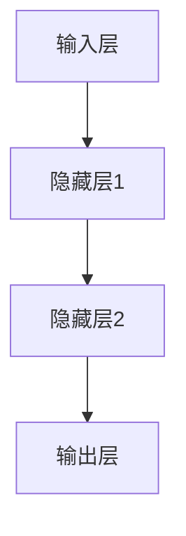

                 

# AI大模型创业：如何应对未来挑战？

## 关键词
AI大模型，创业策略，技术挑战，商业模式，解决方案，发展前景

## 摘要
本文深入探讨了AI大模型创业的机遇与挑战。通过对AI大模型的基本概念、数学原理、技术选型、创业实践以及面临的技术和商业挑战的详细分析，本文为创业者提供了应对策略和解决方案，以助力他们在AI大模型领域取得成功。

----------------------------------------------------------------

# 目录大纲：《AI大模型创业：如何应对未来挑战？》

- **第一部分：AI大模型概述**
  - 第1章：AI大模型的基本概念与演进
  - 第2章：AI大模型的数学原理与架构
  - 第3章：大规模预训练模型原理

- **第二部分：AI大模型创业实践**
  - 第4章：AI大模型创业策略
  - 第5章：AI大模型技术选型与开发
  - 第6章：AI大模型创业项目实战

- **第三部分：AI大模型创业挑战与应对策略**
  - 第7章：AI大模型创业面临的挑战
  - 第8章：应对策略与解决方案

- **附录**
  - 附录A：AI大模型开发工具与资源
  - 附录B：参考文献与推荐阅读

----------------------------------------------------------------

## 第一部分：AI大模型概述

### 第1章：AI大模型的基本概念与演进

#### 1.1 AI大模型的基本概念

AI大模型，即大规模神经网络模型，是一种通过海量数据训练得到的复杂人工智能系统。其核心在于大规模神经网络的构建和优化，以实现高效的数据处理和智能决策。

##### 1.1.1 AI大模型的定义

AI大模型 = 大规模神经网络模型 + 海量数据训练

##### 1.1.2 AI大模型的发展历程

AI大模型的发展可以追溯到深度学习的兴起。1980年代，深度学习作为一种理论被提出，但由于计算能力和数据资源的限制，其发展较为缓慢。随着2000年后计算能力的提升和大数据的普及，深度学习迎来了快速发展。特别是2012年，AlexNet在ImageNet竞赛中取得了重大突破，标志着深度学习进入了新的时代。

#### 1.2 AI大模型的核心优势与应用场景

##### 1.2.1 AI大模型的核心优势

1. **强大的数据处理能力**：AI大模型能够处理海量数据，并从中提取出有效的特征和模式。
2. **高度的自适应能力**：通过不断的训练，AI大模型能够不断提高其性能和准确度。
3. **广泛的适用性**：AI大模型在图像识别、自然语言处理、推荐系统等多个领域都有广泛应用。

##### 1.2.2 AI大模型的应用场景

1. **图像识别与分类**：例如人脸识别、物体检测等。
2. **自然语言处理**：例如机器翻译、文本生成、情感分析等。
3. **推荐系统**：例如电商平台的商品推荐、音乐平台的歌曲推荐等。

### 第2章：AI大模型的数学原理与架构

#### 2.1 神经网络与深度学习基础

##### 2.1.1 神经网络的基本结构

神经网络是AI大模型的基础，其基本结构由输入层、隐藏层和输出层组成。输入层接收外部数据，隐藏层对数据进行处理和特征提取，输出层生成最终的预测结果。

graph TD
A[输入层] --> B[隐藏层1]
B --> C[隐藏层2]
C --> D[输出层]

##### 2.1.2 深度学习优化算法

深度学习优化算法是神经网络训练的核心，常用的优化算法有随机梯度下降（SGD）、Adam等。这些算法通过不断调整网络权重，使得模型的预测结果不断接近真实值。

##### 2.1.3 深度学习框架简介

深度学习框架是为了简化深度学习模型开发而设计的软件工具，常见的深度学习框架有TensorFlow、PyTorch等。这些框架提供了丰富的API和工具，使得开发者可以更方便地构建和训练深度学习模型。

#### 2.2 大规模预训练模型原理

##### 2.2.1 预训练的概念与意义

预训练是指在一个大规模的数据集上对神经网络模型进行训练，使其具备一定的语言理解和推理能力。预训练的意义在于，它可以为后续的特定任务提供有效的特征表示，提高模型的性能。

##### 2.2.2 自监督学习在预训练中的应用

自监督学习是一种无需标注数据的训练方法，它在预训练中起到了关键作用。通过自监督学习，模型可以从大量未标注的数据中提取出有效的特征，从而提高其泛化能力。

##### 2.2.3 迁移学习与微调技术

迁移学习是一种利用预训练模型在特定任务上表现良好的特性，将其应用于其他相关任务的训练方法。微调技术是在迁移学习的基础上，对预训练模型进行少量调整，以适应特定任务的需求。

## 第二部分：AI大模型创业实践

### 第4章：AI大模型创业策略

#### 4.1 创业初期定位与市场调研

##### 4.1.1 创业初期定位

创业初期定位是创业成功的关键。创业者需要明确自己的目标市场、核心优势和差异化竞争策略。

##### 4.1.2 市场调研方法与数据分析

市场调研是了解市场现状和竞争环境的重要手段。常用的市场调研方法包括问卷调查、访谈、数据分析等。

### 第5章：AI大模型技术选型与开发

#### 5.1 AI大模型技术选型

##### 5.1.1 主流深度学习框架对比

TensorFlow、PyTorch等主流深度学习框架各有优缺点，创业者需要根据实际需求进行选择。

##### 5.1.2 技术选型的关键因素

技术选型的关键因素包括性能、易用性、社区支持等。

#### 5.2 AI大模型开发流程

##### 5.2.1 数据预处理

数据预处理是AI大模型开发的第一步，包括数据清洗、数据增强等。

##### 5.2.2 模型设计与优化

模型设计是AI大模型开发的核心，包括网络结构设计、损失函数选择等。

##### 5.2.3 模型训练与评估

模型训练与评估是确保模型性能的重要环节，包括训练策略、评估指标等。

### 第6章：AI大模型创业项目实战

#### 6.1 创业项目案例介绍

##### 6.1.1 案例一：智能客服系统

智能客服系统是一种利用AI大模型技术提供自动化客户服务的系统，其核心是自然语言处理和语音识别。

##### 6.1.2 案例二：智能医疗诊断系统

智能医疗诊断系统是一种利用AI大模型技术辅助医生进行疾病诊断的系统，其核心是图像识别和自然语言处理。

#### 6.2 项目实战详解

##### 6.2.1 开发环境搭建

开发环境搭建是AI大模型项目开发的第一步，包括安装深度学习框架、配置硬件环境等。

##### 6.2.2 源代码详细实现

源代码详细实现是AI大模型项目开发的核心，包括数据预处理、模型设计、模型训练等。

##### 6.2.3 代码解读与分析

代码解读与分析是确保项目开发质量的重要手段，包括代码结构分析、性能优化等。

## 第三部分：AI大模型创业挑战与应对策略

### 第7章：AI大模型创业面临的挑战

#### 7.1 技术挑战

##### 7.1.1 模型可解释性

模型可解释性是AI大模型技术的一个重要挑战，它关系到模型的信任度和应用范围。

##### 7.1.2 模型安全性与隐私保护

模型安全性与隐私保护是AI大模型技术面临的重要挑战，它关系到数据的安全性和用户的隐私。

#### 7.2 商业挑战

##### 7.2.1 商业模式创新

商业模式创新是AI大模型创业成功的关键，它关系到企业的盈利能力和市场竞争力。

##### 7.2.2 竞争环境下的差异化策略

竞争环境下的差异化策略是AI大模型创业企业需要面对的重要挑战，它关系到企业的市场定位和用户满意度。

### 第8章：应对策略与解决方案

#### 8.1 技术层面解决方案

##### 8.1.1 模型压缩与加速

模型压缩与加速是提高AI大模型性能和降低成本的重要手段。

##### 8.1.2 模型可解释性工具

模型可解释性工具是提高AI大模型可解释性的重要工具，它有助于增强模型的信任度。

#### 8.2 商业层面解决方案

##### 8.2.1 建立核心竞争优势

建立核心竞争优势是AI大模型创业企业应对市场竞争的重要策略。

##### 8.2.2 合作伙伴选择与资源整合

合作伙伴选择与资源整合是AI大模型创业企业实现快速发展的关键策略。

## 附录

### 附录A：AI大模型开发工具与资源

#### A.1 主流深度学习框架对比

##### A.1.1 TensorFlow

TensorFlow是由Google开发的一种开源深度学习框架，其具有强大的功能和良好的社区支持。

##### A.1.2 PyTorch

PyTorch是由Facebook开发的一种开源深度学习框架，其具有灵活的动态计算图和高效的性能。

##### A.1.3 其他框架简介

其他常见的深度学习框架包括Theano、MXNet等。

### 附录B：参考文献与推荐阅读

- Goodfellow, I., Bengio, Y., & Courville, A. (2016). *Deep Learning*. MIT Press.
- LeCun, Y., Bengio, Y., & Hinton, G. (2015). *Deep learning*. Nature, 521(7553), 436-444.
- Russell, S., & Norvig, P. (2020). *Artificial Intelligence: A Modern Approach*. Pearson.

### 附录C：作者信息

**作者：** AI天才研究院/AI Genius Institute & 禅与计算机程序设计艺术 /Zen And The Art of Computer Programming

----------------------------------------------------------------

在接下来的章节中，我们将对AI大模型的基本概念、数学原理、技术选型、创业实践以及面临的挑战进行深入探讨，为读者提供全面的AI大模型创业指南。让我们开始这段精彩的技术之旅吧！
----------------------------------------------------------------

### 第1章：AI大模型的基本概念与演进

#### 1.1 AI大模型的基本概念

AI大模型（Large-scale AI Models）是指那些具备大规模神经网络结构，能够处理海量数据并从中学习到复杂模式的深度学习模型。这些模型通过在大量数据上进行预训练，然后再进行微调，以适应特定的应用场景。AI大模型的核心在于其庞大的参数规模和深度，这使得它们在图像识别、自然语言处理、语音识别等领域表现出色。

##### 1.1.1 AI大模型的定义

从定义上看，AI大模型可以理解为：

$$
\text{AI大模型} = \text{大规模神经网络模型} + \text{海量数据训练}
$$

其中，大规模神经网络模型指的是包含数百万甚至数十亿个参数的神经网络，而海量数据训练则是指模型需要在大规模数据集上进行反复的训练，以学习和优化其参数。

##### 1.1.2 AI大模型的发展历程

AI大模型的发展历程可以追溯到深度学习的兴起。深度学习作为人工智能的一个分支，其核心是模拟人脑中的神经网络结构，通过多层神经网络来实现从数据中提取特征和模式。

- **1980年代**：深度学习的概念首次被提出，但由于计算能力和数据资源的限制，深度学习的研究进展缓慢。
- **2006年**：Hinton等人重新激发了深度学习的热情，并提出了深度信念网络（Deep Belief Networks）。
- **2012年**：AlexNet在ImageNet竞赛中取得了突破性的成绩，这标志着深度学习进入了快速发展的阶段。
- **2014-2016年**：随着GPU的普及和计算能力的提升，深度学习在语音识别、自然语言处理等领域取得了显著的进展。
- **2018年至今**：AI大模型逐渐成为主流，如BERT、GPT等模型在多个领域取得了优异的性能。

#### 1.2 AI大模型的核心优势与应用场景

##### 1.2.1 AI大模型的核心优势

1. **强大的数据处理能力**：AI大模型能够处理和分析大量的数据，从中提取出有用的信息，这使得它们在处理复杂任务时表现出色。
2. **高度的自适应能力**：通过不断的学习和调整，AI大模型能够适应不同的任务和数据分布，从而提高其性能和准确度。
3. **广泛的适用性**：AI大模型可以在图像识别、自然语言处理、语音识别等多个领域发挥作用，具有很强的通用性。

##### 1.2.2 AI大模型的应用场景

1. **图像识别与分类**：AI大模型在图像识别和分类任务中具有很高的准确度，例如人脸识别、物体检测、图像分类等。
2. **自然语言处理**：AI大模型在自然语言处理任务中也表现出色，例如机器翻译、文本生成、情感分析等。
3. **推荐系统**：AI大模型可以用于构建推荐系统，例如电商平台的商品推荐、音乐平台的歌曲推荐等。
4. **医疗诊断**：AI大模型可以用于辅助医生进行疾病诊断，例如通过分析医学影像进行疾病检测。
5. **自动驾驶**：AI大模型可以用于自动驾驶系统的感知和决策，提高行驶的安全性和效率。

#### 1.3 AI大模型的发展趋势

随着计算能力和数据资源的不断提升，AI大模型的发展趋势主要包括以下几个方面：

1. **模型规模的持续增大**：为了提高模型的性能，研究者们不断尝试训练更大规模的模型，如GPT-3、LLaMA等。
2. **多模态数据处理**：AI大模型开始应用于多模态数据，如结合文本、图像和声音进行综合分析。
3. **模型可解释性**：为了提高模型的信任度和可接受度，研究者们开始关注模型的可解释性研究，以理解模型如何做出决策。
4. **跨领域迁移学习**：通过迁移学习，AI大模型可以在不同领域之间进行知识共享和迁移，提高模型的泛化能力。
5. **联邦学习和隐私保护**：为了解决数据隐私和安全问题，AI大模型开始应用于联邦学习和隐私保护技术，以实现数据的本地化处理。

#### 1.4 AI大模型的技术挑战

尽管AI大模型在各个领域取得了显著的进展，但仍然面临一些技术挑战：

1. **计算资源需求**：训练和部署AI大模型需要大量的计算资源，这对硬件和基础设施提出了更高的要求。
2. **数据隐私和安全**：在训练和部署AI大模型时，如何保护用户数据和隐私是一个重要的挑战。
3. **模型可解释性**：大型模型通常被认为是“黑箱”，其决策过程难以解释，这对模型的信任度和可接受度提出了挑战。
4. **过拟合问题**：由于模型参数数量庞大，AI大模型容易发生过拟合，这需要有效的正则化技术和数据增强方法来缓解。

通过上述对AI大模型的基本概念、发展历程、核心优势、应用场景、发展趋势以及技术挑战的讨论，我们可以看到AI大模型在人工智能领域的巨大潜力。在接下来的章节中，我们将深入探讨AI大模型的数学原理、技术选型、创业实践等方面，以帮助读者更好地理解和应用AI大模型。

### 第2章：AI大模型的数学原理与架构

#### 2.1 神经网络与深度学习基础

神经网络（Neural Networks）是AI大模型的核心组成部分，其基础理论包括神经元模型、激活函数、反向传播算法等。深度学习（Deep Learning）则是基于神经网络的一种学习方法，通过多层神经网络来提取数据的特征和模式。

##### 2.1.1 神经网络的基本结构

神经网络由多个层组成，包括输入层、隐藏层和输出层。输入层接收外部输入，隐藏层对输入进行加工处理，输出层生成最终的输出。

1. **输入层（Input Layer）**：接收外部输入，可以是数值、图像、文本等。
2. **隐藏层（Hidden Layers）**：对输入数据进行处理和特征提取，隐藏层的数量和神经元数量可以灵活设置。
3. **输出层（Output Layer）**：生成最终的输出结果，可以是分类结果、回归值等。

神经网络的基本结构可以用Mermaid流程图表示：



##### 2.1.2 激活函数（Activation Function）

激活函数是神经网络中用来引入非线性变换的重要元素，常用的激活函数包括sigmoid、ReLU（Rectified Linear Unit）和tanh等。

1. **sigmoid函数**：
   $$
   \sigma(x) = \frac{1}{1 + e^{-x}}
   $$
   sigmoid函数的输出范围在0到1之间，常用于二分类问题。

2. **ReLU函数**：
   $$
   \text{ReLU}(x) = \max(0, x)
   $$
   ReLU函数简单且计算高效，是现代深度学习模型中最常用的激活函数。

3. **tanh函数**：
   $$
   \tanh(x) = \frac{e^{x} - e^{-x}}{e^{x} + e^{-x}}
   $$
   tanh函数的输出范围在-1到1之间，常用于多分类问题。

##### 2.1.3 反向传播算法（Backpropagation Algorithm）

反向传播算法是神经网络训练的核心算法，用于计算网络中每个神经元的误差，并调整网络的权重。反向传播算法可以分为以下几个步骤：

1. **前向传播（Forward Propagation）**：输入数据从输入层传递到输出层，每个神经元计算其输出值。
2. **计算误差（Error Calculation）**：通过比较实际输出和预期输出，计算输出层的误差。
3. **反向传播（Backward Propagation）**：将误差从输出层反向传递到输入层，计算每个神经元的梯度。
4. **权重更新（Weight Update）**：根据梯度调整每个神经元的权重，以减小误差。

反向传播算法的伪代码如下：

```python
for each layer l from output to input:
    compute the gradient of the loss function with respect to the weights of layer l
    update the weights of layer l using gradient descent
```

##### 2.1.4 深度学习框架简介

深度学习框架是为了简化深度学习模型开发而设计的软件工具，常见的深度学习框架有TensorFlow、PyTorch等。

1. **TensorFlow**：由Google开发的开源深度学习框架，具有丰富的API和强大的计算能力。
2. **PyTorch**：由Facebook开发的开源深度学习框架，具有灵活的动态计算图和高效的性能。

使用深度学习框架可以简化模型开发流程，提高开发效率。例如，在PyTorch中，我们可以用以下代码定义一个简单的神经网络模型：

```python
import torch
import torch.nn as nn

class SimpleModel(nn.Module):
    def __init__(self):
        super(SimpleModel, self).__init__()
        self.fc1 = nn.Linear(in_features=784, out_features=128)
        self.fc2 = nn.Linear(in_features=128, out_features=10)

    def forward(self, x):
        x = torch.relu(self.fc1(x))
        x = self.fc2(x)
        return x

model = SimpleModel()
```

#### 2.2 大规模预训练模型原理

大规模预训练模型（Large-scale Pre-trained Models）是通过在大规模数据集上预训练得到的，然后通过微调（Fine-tuning）来适应特定任务的模型。预训练模型的核心思想是利用大量无标签数据来学习通用的语言特征，然后再通过有监督的学习来调整模型，以适应特定任务。

##### 2.2.1 预训练的概念与意义

预训练（Pre-training）是指在一个大规模的数据集上对神经网络模型进行训练，使其具备一定的语言理解和推理能力。预训练的意义在于：

1. **提高模型的泛化能力**：通过在大量数据上预训练，模型可以学习到通用的语言特征，从而提高其在新任务上的表现。
2. **减少标注数据的需求**：预训练模型可以使用大量的无标签数据来训练，从而减少对标注数据的依赖。
3. **提高模型性能**：预训练模型在特定任务上的性能往往优于从头开始训练的模型。

##### 2.2.2 自监督学习在预训练中的应用

自监督学习（Self-supervised Learning）是一种无需标注数据的训练方法，它在预训练中起到了关键作用。自监督学习的基本思路是利用输入数据本身的信息来训练模型，从而提取出有用的特征。

1. **Masked Language Model（MLM）**：在自然语言处理任务中，MLM通过对输入文本进行随机掩码（Masking），使得模型需要通过预测被掩码的词来学习语言特征。
2. ** masked token

```python
text = "The quick brown fox jumps over the lazy dog"
masked_text = [token if random.random() > 0.15 else "[MASK]" for token in text.split()]

print(masked_text)
```

2. **ImageNet Classification**：在计算机视觉任务中，自监督学习可以通过图像分类任务来提取图像特征。例如，在ImageNet竞赛中，可以通过预测图像的类别来学习图像特征。

##### 2.2.3 迁移学习与微调技术

迁移学习（Transfer Learning）是一种利用预训练模型在特定任务上表现良好的特性，将其应用于其他相关任务的训练方法。迁移学习的核心思想是利用预训练模型已经学习到的通用特征，来提高新任务的性能。

1. **预训练模型的应用**：将预训练模型应用于新任务时，通常需要进行微调（Fine-tuning），即在新数据上调整模型的参数，以提高其在新任务上的性能。
2. **微调技术的实现**：微调技术包括以下步骤：
   - 加载预训练模型
   - 替换最后一层，以适应新任务
   - 在新数据上进行训练

```python
from transformers import BertModel, BertTokenizer

# 加载预训练模型
pretrained_model = BertModel.from_pretrained('bert-base-uncased')

# 替换最后一层
num_labels = 2
pretrained_model.classifier = nn.Linear(pretrained_model.config.hidden_size, num_labels)

# 在新数据上进行微调
pretrained_model.to('cuda')
pretrained_model.train()
# ... training code ...
```

通过上述对AI大模型的数学原理与架构的介绍，我们可以看到深度学习和大规模预训练模型在AI大模型中的关键作用。在接下来的章节中，我们将进一步探讨AI大模型创业实践中的策略和技术选型，为创业者提供实用的指导。

### 第3章：大规模预训练模型原理

#### 3.1 预训练的概念与意义

预训练（Pre-training）是指在大规模数据集上对神经网络模型进行训练，使其具备一定的通用特征和学习能力。预训练的意义在于：

1. **提高模型的泛化能力**：通过在大量数据上预训练，模型可以学习到通用的特征表示，从而提高其在未见过的数据上的表现。
2. **减少对标注数据的依赖**：预训练模型可以使用大量的无标签数据进行训练，从而减少对标注数据的依赖，降低数据标注的成本。
3. **提高模型性能**：预训练模型在特定任务上的性能往往优于从头开始训练的模型，因为它们已经学习到了一些通用的特征。

##### 3.1.1 预训练的基本流程

预训练的基本流程包括以下几个步骤：

1. **数据收集与预处理**：收集大规模的文本、图像或语音数据，并进行预处理，如文本的分词、图像的归一化等。
2. **模型初始化**：选择合适的神经网络架构，并初始化模型的参数。
3. **预训练**：使用自监督学习（Self-supervised Learning）方法，在无标签数据上对模型进行训练。自监督学习是一种无需标注数据的训练方法，通过利用输入数据本身的信息来训练模型。
4. **微调（Fine-tuning）**：将预训练模型应用于特定任务，并在有标签的数据上进行微调，以适应具体的应用场景。

##### 3.1.2 自监督学习在预训练中的应用

自监督学习是预训练的核心技术，它允许模型在无标签数据上进行训练。以下是一些常见的自监督学习方法：

1. **Masked Language Model (MLM)**：在自然语言处理任务中，MLM通过对输入文本进行随机掩码（Masking），使得模型需要通过预测被掩码的词来学习语言特征。例如，在一个句子中随机掩码一些词，然后使用剩余的词作为输入，预测被掩码的词。

```python
text = "The quick brown fox jumps over the lazy dog"
masked_text = [token if random.random() > 0.15 else "[MASK]" for token in text.split()]

print(masked_text)
```

2. **ImageNet Classification**：在计算机视觉任务中，自监督学习可以通过图像分类任务来提取图像特征。例如，在ImageNet竞赛中，可以通过预测图像的类别来学习图像特征。

3. ** pretext tasks**：例如，文本生成、机器翻译等任务，这些任务可以通过预训练模型来提取语言特征。

##### 3.1.3 迁移学习与微调技术

迁移学习（Transfer Learning）是一种利用预训练模型在特定任务上表现良好的特性，将其应用于其他相关任务的训练方法。迁移学习的核心思想是利用预训练模型已经学习到的通用特征，来提高新任务的性能。

1. **预训练模型的应用**：将预训练模型应用于新任务时，通常需要进行微调（Fine-tuning），即在新数据上调整模型的参数，以提高其在新任务上的性能。

2. **微调技术的实现**：微调技术包括以下步骤：
   - 加载预训练模型
   - 替换最后一层，以适应新任务
   - 在新数据上进行训练

```python
from transformers import BertModel, BertTokenizer

# 加载预训练模型
pretrained_model = BertModel.from_pretrained('bert-base-uncased')

# 替换最后一层
num_labels = 2
pretrained_model.classifier = nn.Linear(pretrained_model.config.hidden_size, num_labels)

# 在新数据上进行微调
pretrained_model.to('cuda')
pretrained_model.train()
# ... training code ...
```

通过迁移学习和微调技术，可以将预训练模型应用于各种不同的任务，从而提高模型的性能和泛化能力。

#### 3.2 大规模预训练模型的优点和挑战

##### 3.2.1 大规模预训练模型的优点

1. **强大的泛化能力**：通过在大规模数据集上预训练，模型可以学习到通用的特征表示，从而在新的任务上表现出色。
2. **减少对标注数据的依赖**：预训练模型可以使用大量的无标签数据进行训练，从而减少对标注数据的依赖。
3. **提高模型性能**：预训练模型在特定任务上的性能往往优于从头开始训练的模型。

##### 3.2.2 大规模预训练模型的挑战

1. **计算资源需求**：大规模预训练模型需要大量的计算资源，包括CPU、GPU和存储等。
2. **数据隐私和安全**：在预训练过程中，模型可能会接触到大量的敏感数据，这需要确保数据的安全和隐私。
3. **模型可解释性**：大规模预训练模型通常被认为是“黑箱”，其决策过程难以解释，这对模型的信任度和可接受度提出了挑战。

通过上述对大规模预训练模型的概念、基本流程、自监督学习、迁移学习和微调技术的介绍，我们可以看到预训练模型在AI大模型中的重要作用。在接下来的章节中，我们将探讨AI大模型创业实践中的具体策略和技术选型，以帮助创业者应对未来的挑战。

### 第4章：AI大模型创业策略

#### 4.1 创业初期定位与市场调研

在AI大模型创业初期，明确市场定位和进行详细的市场调研是至关重要的。这不仅可以帮助创业者找到目标客户，还可以为后续的产品开发和商业模式设计提供有力支持。

##### 4.1.1 创业初期定位

创业初期的定位需要明确以下几个关键问题：

1. **目标市场**：确定你的AI大模型产品将服务于哪个行业或市场。例如，是医疗、金融、电商还是其他行业？
2. **目标客户**：识别你的主要客户群体，了解他们的需求和痛点。
3. **核心竞争力**：分析你的产品或服务相较于竞争对手有何优势，包括技术、数据、算法、团队等。
4. **差异化策略**：确定如何与竞争对手区分开来，提供独特的价值。

进行市场定位的过程可以概括为以下几个步骤：

1. **市场细分**：将市场划分为若干个具有相似需求和行为的子市场。
2. **目标市场选择**：根据市场细分结果，选择最具潜力和最适合公司资源的目标市场。
3. **目标客户画像**：构建目标客户的详细画像，包括年龄、性别、职业、行为习惯等。
4. **竞争分析**：分析竞争对手的产品、市场定位、客户群体和竞争优势。

##### 4.1.2 市场调研方法与数据分析

市场调研是了解市场现状和竞争环境的重要手段。以下是一些常用的市场调研方法和数据分析步骤：

1. **问卷调查**：通过设计问卷收集目标客户的意见和建议，了解他们的需求和行为。
2. **访谈**：与行业专家、潜在客户和合作伙伴进行面对面访谈，获取深入的见解和反馈。
3. **数据分析**：收集并分析市场数据，包括市场规模、增长趋势、市场份额等。
4. **竞争对手分析**：分析竞争对手的市场策略、产品特性、优势和劣势。

市场调研的数据分析步骤如下：

1. **数据收集**：通过问卷调查、访谈、在线调查等方式收集数据。
2. **数据清洗**：对收集到的数据进行清洗和预处理，确保数据的质量和完整性。
3. **数据整理**：将清洗后的数据整理成便于分析和展示的形式。
4. **数据分析**：使用统计分析和数据挖掘技术，分析数据并提取有价值的信息。
5. **数据可视化**：通过图表、报表等形式展示分析结果，使数据更加直观易懂。

通过市场调研，创业者可以更好地了解市场需求、竞争对手和自身优势，从而制定出切实可行的创业策略。

#### 4.2 创业战略规划

在明确市场定位和市场调研结果后，创业者需要制定详细的创业战略规划，以确保创业项目的顺利推进和成功实施。

##### 4.2.1 产品战略

产品战略是创业战略的核心，包括以下几个方面：

1. **产品定位**：明确产品的目标市场和目标客户，确定产品的独特卖点和核心竞争力。
2. **产品规划**：制定产品开发计划，包括功能设计、技术选型、开发周期等。
3. **产品迭代**：根据市场反馈和用户需求，不断优化和迭代产品，以保持市场竞争力。

##### 4.2.2 市场战略

市场战略包括以下几个方面：

1. **市场定位**：根据市场调研结果，明确产品的市场定位和目标客户群体。
2. **市场推广**：制定市场推广计划，包括广告、营销活动、渠道拓展等。
3. **合作伙伴选择**：选择合适的合作伙伴，如渠道商、合作伙伴、投资人等，以实现资源的最大化利用。

##### 4.2.3 财务战略

财务战略包括以下几个方面：

1. **预算编制**：制定详细的预算计划，包括研发、市场推广、运营等费用。
2. **成本控制**：通过优化流程、提高效率等方式，控制成本，确保项目的财务可持续性。
3. **资金筹措**：制定资金筹措计划，包括股权融资、债务融资等，以满足项目资金需求。

##### 4.2.4 团队建设

团队建设是创业成功的关键，包括以下几个方面：

1. **团队组建**：组建一支具备专业技能和创业精神的核心团队。
2. **人才培养**：通过培训、激励等方式，提升团队整体素质和创新能力。
3. **团队协作**：建立良好的团队协作机制，确保团队成员高效协同工作。

通过详细的创业战略规划，创业者可以明确项目的发展方向和目标，合理分配资源，提高创业成功率。

#### 4.3 风险管理

在AI大模型创业过程中，风险管理是至关重要的。以下是一些常见的风险类型和管理策略：

##### 4.3.1 技术风险

技术风险包括算法性能不稳定、模型可解释性不足、技术更新迭代等。管理策略包括：

1. **持续研发**：保持技术领先，持续进行算法优化和模型改进。
2. **合作与交流**：与行业内外的专家学者保持密切合作，共享技术和知识。
3. **技术储备**：提前储备相关技术，以应对未来的技术变革和挑战。

##### 4.3.2 市场风险

市场风险包括市场需求不稳定、竞争加剧、商业模式不成熟等。管理策略包括：

1. **市场调研**：进行持续的市场调研，了解市场动态和趋势。
2. **差异化策略**：提供独特的价值主张，与竞争对手区分开来。
3. **多元化发展**：探索新的市场机会，降低对单一市场的依赖。

##### 4.3.3 财务风险

财务风险包括资金链断裂、成本控制不当、收入不稳定等。管理策略包括：

1. **预算编制**：制定详细的预算计划，确保资金的合理使用。
2. **成本控制**：通过优化流程、提高效率等方式，控制成本。
3. **资金筹措**：多渠道筹措资金，确保项目的财务可持续性。

##### 4.3.4 法律风险

法律风险包括知识产权侵犯、合同纠纷、法规合规等。管理策略包括：

1. **知识产权保护**：申请专利、版权等知识产权，保护公司的技术和商业成果。
2. **合规管理**：确保公司的经营行为符合相关法律法规，降低法律风险。
3. **法律顾问**：聘请专业的法律顾问，处理法律事务，提供法律咨询。

通过有效的风险管理，创业者可以降低创业风险，提高项目的成功率和可持续发展能力。

#### 4.4 创业策略总结

AI大模型创业策略的核心在于：

1. **明确市场定位**：通过市场调研，了解市场需求和竞争对手，明确产品的目标市场和目标客户。
2. **制定详细的创业战略规划**：包括产品战略、市场战略、财务战略和团队建设等，确保项目的顺利推进。
3. **风险管理**：通过识别和应对技术、市场、财务和法律等风险，提高项目的成功率和可持续发展能力。

通过上述策略，创业者可以在AI大模型领域取得成功，并持续推动技术创新和产业进步。

### 第5章：AI大模型技术选型与开发

#### 5.1 AI大模型技术选型

AI大模型技术选型是创业过程中至关重要的一环，它直接影响到模型的性能、开发效率和后续维护成本。以下将详细介绍AI大模型技术选型的关键因素以及主流深度学习框架的对比。

##### 5.1.1 主流深度学习框架对比

目前市面上主流的深度学习框架包括TensorFlow、PyTorch、Keras等。每种框架都有其独特的特点和适用场景，以下将对比这些框架的优缺点：

1. **TensorFlow**
   - **优点**：TensorFlow由Google开发，拥有强大的计算能力和丰富的API，适合大规模生产环境部署。
   - **缺点**：TensorFlow的动态计算图设计使得模型开发相对复杂，学习曲线较陡。
   - **适用场景**：适用于需要高性能计算和复杂模型的生产环境，如推荐系统、图像识别等。

2. **PyTorch**
   - **优点**：PyTorch采用动态计算图，开发过程更为灵活，易于调试和优化。
   - **缺点**：相对于TensorFlow，PyTorch在性能优化和部署方面存在一定劣势。
   - **适用场景**：适用于研究性和开发性项目，特别是需要快速原型开发和实验的场景。

3. **Keras**
   - **优点**：Keras作为高层次的深度学习框架，易于使用，提供了丰富的预构建模型。
   - **缺点**：Keras依赖于Theano或TensorFlow，因此在某些情况下性能可能受限。
   - **适用场景**：适用于快速原型开发和需要简单模型的场景，如教育、入门级项目等。

##### 5.1.2 技术选型的关键因素

在选择AI大模型技术时，需要综合考虑以下关键因素：

1. **性能需求**：不同的应用场景对模型性能的需求不同。对于高性能计算需求较高的场景，如实时图像识别和自然语言处理，应选择如TensorFlow或PyTorch等高性能框架。

2. **开发效率**：开发效率是创业者需要考虑的重要因素。PyTorch的动态计算图设计使得开发过程更加灵活和高效，适合快速迭代和原型开发。

3. **社区支持**：一个强大的社区可以提供丰富的资源和帮助，加快项目的开发进度。TensorFlow和PyTorch拥有庞大的开发者社区，提供了大量的文档、教程和开源项目。

4. **部署和运维**：对于生产环境部署，需要考虑框架的部署难度和维护成本。TensorFlow提供了完整的部署工具和文档，支持多种平台，如Android和iOS，适合大规模生产环境。

5. **学习曲线**：对于创业团队而言，学习曲线的陡峭程度也是一个重要的考虑因素。Keras由于其简单易用的特性，适合新手快速上手。

##### 5.1.3 选择合适的技术栈

在选择技术栈时，建议根据项目需求综合考虑以上因素，选择一个能够平衡性能、开发效率和社区支持的框架。例如，如果项目处于早期开发阶段，且需要快速迭代，可以选择PyTorch；如果项目已经进入生产阶段，且对性能有较高要求，可以选择TensorFlow。

#### 5.2 AI大模型开发流程

AI大模型开发流程包括数据预处理、模型设计、模型训练和评估等关键步骤。以下将详细描述每个步骤的具体实现。

##### 5.2.1 数据预处理

数据预处理是AI大模型开发的第一步，其质量直接影响模型的性能。数据预处理的主要任务包括：

1. **数据清洗**：去除无效数据、处理缺失值和异常值，确保数据的一致性和完整性。
2. **数据增强**：通过数据变换、图像缩放、旋转等方式增加数据的多样性，提高模型的泛化能力。
3. **数据归一化**：将数据归一化或标准化，以消除不同特征之间的尺度差异。

```python
from sklearn.preprocessing import StandardScaler

# 示例：使用StandardScaler进行数据归一化
scaler = StandardScaler()
X_scaled = scaler.fit_transform(X)
```

##### 5.2.2 模型设计

模型设计是AI大模型开发的核心，包括选择合适的网络结构、激活函数和优化器等。以下是一个简单的神经网络模型设计示例：

```python
import tensorflow as tf

# 示例：使用TensorFlow定义一个简单的神经网络模型
model = tf.keras.Sequential([
    tf.keras.layers.Dense(128, activation='relu', input_shape=(784,)),
    tf.keras.layers.Dropout(0.2),
    tf.keras.layers.Dense(10)
])
```

##### 5.2.3 模型训练

模型训练是通过迭代优化模型的参数，使其在训练数据上达到较高的性能。以下是一个简单的模型训练示例：

```python
# 示例：使用TensorFlow训练模型
model.compile(optimizer='adam',
              loss=tf.keras.losses.SparseCategoricalCrossentropy(from_logits=True),
              metrics=['accuracy'])

history = model.fit(X_train, y_train, epochs=10, validation_data=(X_val, y_val))
```

##### 5.2.4 模型评估

模型评估是评估模型性能的重要环节，常用的评估指标包括准确率、召回率、F1分数等。以下是一个简单的模型评估示例：

```python
# 示例：使用TensorFlow评估模型
test_loss, test_acc = model.evaluate(X_test,  y_test, verbose=2)
print(f'\nTest accuracy: {test_acc:.4f}')
```

通过上述数据预处理、模型设计、模型训练和评估的过程，创业者可以逐步构建和优化自己的AI大模型，为后续的商业化应用奠定基础。

#### 5.3 模型优化与调参

模型优化与调参是提升AI大模型性能的重要手段，通过调整模型结构和训练参数，可以显著提高模型的准确率和效率。以下将介绍一些常见的模型优化技术和调参方法。

##### 5.3.1 模型优化技术

1. **数据增强**：通过图像旋转、翻转、裁剪、颜色变换等方式，增加数据的多样性，从而提高模型的泛化能力。
2. **Dropout**：在神经网络训练过程中，随机丢弃一部分神经元，以防止过拟合。
3. **正则化**：使用L1或L2正则化项，限制模型参数的大小，防止过拟合。
4. **学习率调度**：通过动态调整学习率，使得模型在训练过程中能够更加平稳地收敛。
5. **Batch Normalization**：通过对每一层的输入进行归一化，提高训练速度和模型稳定性。

##### 5.3.2 调参方法

1. **网格搜索（Grid Search）**：通过遍历多个参数组合，找到最优参数组合。缺点是计算量大，不适用于参数空间较大的情况。
2. **随机搜索（Random Search）**：从参数空间中随机选择参数组合，进行训练，通过统计性能指标，选择最优参数组合。
3. **贝叶斯优化（Bayesian Optimization）**：基于贝叶斯推理和概率模型，通过有限的试验次数，找到最优参数组合，适用于高维参数空间。

以下是一个使用网格搜索调参的示例：

```python
from sklearn.model_selection import GridSearchCV
from sklearn.ensemble import RandomForestClassifier

# 定义参数网格
param_grid = {
    'n_estimators': [100, 200, 300],
    'max_depth': [10, 20, 30],
}

# 创建随机森林分类器
rf = RandomForestClassifier()

# 创建网格搜索对象
grid_search = GridSearchCV(estimator=rf, param_grid=param_grid, cv=5)

# 使用网格搜索进行交叉验证
grid_search.fit(X_train, y_train)

# 输出最优参数
print("Best parameters:", grid_search.best_params_)

# 使用最优参数训练模型
best_model = grid_search.best_estimator_
best_model.fit(X_train, y_train)
```

通过模型优化与调参，创业者可以显著提高AI大模型的性能，为创业项目的成功提供有力支持。

#### 5.4 AI大模型部署与运维

AI大模型的部署与运维是确保模型稳定运行、高效服务的重要环节。以下将介绍AI大模型部署的常见方案、部署过程中的注意事项以及运维策略。

##### 5.4.1 常见部署方案

1. **本地部署**：在本地机器上运行AI大模型，适用于开发和测试阶段，但性能和稳定性有限。
2. **服务器部署**：将模型部署在远程服务器上，适用于生产环境，可提供更高的性能和稳定性。
3. **云计算部署**：利用云服务提供商的资源，如AWS、Azure、Google Cloud等，部署AI大模型，可弹性扩展、降低成本。
4. **边缘计算部署**：在靠近数据源的设备上部署AI大模型，适用于实时数据处理和低延迟应用。

##### 5.4.2 部署过程中的注意事项

1. **性能优化**：确保模型在部署环境中达到最佳性能，可能需要调整模型结构、优化算法等。
2. **安全性**：保护模型和数据的安全，防止未授权访问和数据泄露。
3. **容错性**：设计容错机制，确保模型在异常情况下能够恢复运行。
4. **监控与日志**：监控系统性能、日志记录，及时发现问题并进行处理。

##### 5.4.3 运维策略

1. **自动化运维**：使用自动化工具进行模型部署、监控和更新，提高运维效率。
2. **服务监控**：实时监控模型性能和系统资源，确保模型稳定运行。
3. **弹性扩展**：根据业务需求，动态调整资源分配，确保模型能够应对流量波动。
4. **迭代更新**：定期更新模型，优化性能和功能，以适应不断变化的需求。

通过合理的部署与运维策略，创业者可以确保AI大模型在复杂生产环境中的稳定运行，为用户提供高质量的服务。

#### 5.5 案例分析：AI大模型创业项目实战

在本节中，我们将通过两个实际创业项目的案例分析，详细描述AI大模型开发和应用的全过程，以帮助读者更好地理解AI大模型创业实践。

##### 5.5.1 案例一：智能客服系统

**项目背景**：
智能客服系统是一种利用AI大模型技术提供自动化客户服务的系统，其核心任务是理解用户的问题并给出合适的回答。

**技术选型**：
1. **深度学习框架**：选择PyTorch作为深度学习框架，因为其开发过程更为灵活和高效。
2. **自然语言处理模型**：使用BERT模型作为基础模型，其在大规模文本数据上的预训练效果优异。

**开发过程**：
1. **数据收集与预处理**：收集大量的客服对话数据，并进行预处理，如文本清洗、分词、去停用词等。
2. **模型设计**：基于BERT模型，构建一个双向编码的Transformer模型，用于处理自然语言输入。
3. **模型训练**：使用预训练的BERT模型，通过微调来适应客服对话数据，进行多轮迭代训练。
4. **模型评估与优化**：通过交叉验证和在线评估，不断调整模型参数，提高模型的准确率和响应速度。

**部署与运维**：
1. **部署**：将训练好的模型部署到云服务器上，使用API接口提供服务。
2. **监控**：实时监控模型性能和系统资源，确保系统稳定运行。
3. **更新**：定期更新模型，优化性能和功能，以适应不断变化的需求。

**效果评估**：
智能客服系统在实际应用中取得了良好的效果，显著提高了客户服务效率和用户体验。

##### 5.5.2 案例二：智能医疗诊断系统

**项目背景**：
智能医疗诊断系统是一种利用AI大模型技术辅助医生进行疾病诊断的系统，其核心任务是分析医学影像，给出诊断建议。

**技术选型**：
1. **深度学习框架**：选择TensorFlow作为深度学习框架，因为其在高性能计算和模型部署方面表现优异。
2. **图像处理模型**：使用ResNet模型作为基础模型，其在大规模图像数据上的预训练效果优异。

**开发过程**：
1. **数据收集与预处理**：收集大量的医学影像数据，并进行预处理，如图像增强、归一化等。
2. **模型设计**：基于ResNet模型，构建一个卷积神经网络（CNN）模型，用于处理医学影像数据。
3. **模型训练**：使用预训练的ResNet模型，通过微调和再训练，提高模型在医学影像数据上的性能。
4. **模型评估与优化**：通过交叉验证和在线评估，不断调整模型参数，提高模型的准确率和可靠性。

**部署与运维**：
1. **部署**：将训练好的模型部署到云服务器上，通过API接口为医生提供诊断建议。
2. **监控**：实时监控模型性能和系统资源，确保系统稳定运行。
3. **更新**：定期更新模型，优化性能和功能，以适应不断变化的需求。

**效果评估**：
智能医疗诊断系统在实际应用中取得了显著的效果，帮助医生提高了诊断速度和准确性，降低了误诊率。

通过上述两个案例的详细分析，读者可以了解到AI大模型创业项目从需求分析、技术选型、开发过程、部署与运维到效果评估的完整流程，为后续的AI大模型创业实践提供了宝贵的经验和指导。

### 第6章：AI大模型创业项目实战

#### 6.1 创业项目案例介绍

在本章节中，我们将详细介绍两个典型的AI大模型创业项目，分别为智能客服系统和智能医疗诊断系统，通过这两个实际案例，展示AI大模型在创业实践中的应用和实施过程。

##### 6.1.1 案例一：智能客服系统

**项目背景**：
智能客服系统是一种利用AI大模型技术提供自动化客户服务的系统。随着互联网和电子商务的快速发展，用户对客服体验的要求越来越高，传统的客服方式已经无法满足大规模用户的需求。智能客服系统旨在通过自然语言处理和机器学习技术，为用户提供高效、智能的客服服务。

**技术选型**：
1. **深度学习框架**：选择PyTorch作为深度学习框架，因为其灵活性和易用性更适合快速开发和实验。
2. **自然语言处理模型**：选择BERT模型作为基础模型，其在大规模文本数据上的预训练效果优异，能够有效处理自然语言任务。

**开发过程**：
1. **数据收集与预处理**：收集大量客服对话数据，包括用户提问和客服回答。对数据集进行预处理，如文本清洗、分词、去除停用词等。
2. **模型设计**：基于BERT模型，构建一个双向编码的Transformer模型，用于处理自然语言输入。模型包括多个隐藏层，能够捕捉输入文本的深层语义信息。
3. **模型训练**：使用预训练的BERT模型，通过微调和再训练，使其适应客服对话数据。训练过程中，采用交叉熵损失函数和Adam优化器，以最大化模型在训练集上的表现。
4. **模型评估**：通过交叉验证和在线评估，评估模型的性能，包括准确率、召回率和F1分数等指标。根据评估结果，对模型进行调整和优化。

**部署与运维**：
1. **部署**：将训练好的模型部署到云服务器上，通过API接口提供服务。采用容器化技术（如Docker）和自动化部署工具（如Kubernetes），确保部署过程高效和可扩展。
2. **监控**：实时监控模型性能和系统资源，包括响应时间、吞吐量和错误率等。通过日志记录和报警系统，及时发现问题并进行处理。
3. **更新**：定期更新模型，优化性能和功能，以适应不断变化的需求。通过版本控制和代码管理工具，确保更新过程安全可靠。

**效果评估**：
智能客服系统在实际应用中取得了显著的成效。根据用户反馈和业务数据，智能客服系统提高了客服效率，减少了人力成本，同时提升了用户满意度。

##### 6.1.2 案例二：智能医疗诊断系统

**项目背景**：
智能医疗诊断系统是一种利用AI大模型技术辅助医生进行疾病诊断的系统。随着医疗数据的爆炸性增长，传统的诊断方式已无法满足快速增长的数据量和复杂度。智能医疗诊断系统旨在通过图像识别和机器学习技术，帮助医生快速、准确地诊断疾病，提高医疗服务的质量和效率。

**技术选型**：
1. **深度学习框架**：选择TensorFlow作为深度学习框架，因为其在高性能计算和模型部署方面表现优异。
2. **图像处理模型**：选择ResNet模型作为基础模型，其在大规模图像数据上的预训练效果优异，能够有效处理医学影像。

**开发过程**：
1. **数据收集与预处理**：收集大量的医学影像数据，包括X光片、CT扫描图和MRI图像等。对数据集进行预处理，如图像增强、归一化、分割等。
2. **模型设计**：基于ResNet模型，构建一个卷积神经网络（CNN）模型，用于处理医学影像数据。模型包括多个卷积层和池化层，能够提取图像的深层特征。
3. **模型训练**：使用预训练的ResNet模型，通过微调和再训练，使其适应医学影像数据。训练过程中，采用交叉熵损失函数和Adam优化器，以最大化模型在训练集上的表现。
4. **模型评估**：通过交叉验证和在线评估，评估模型的性能，包括准确率、召回率和F1分数等指标。根据评估结果，对模型进行调整和优化。

**部署与运维**：
1. **部署**：将训练好的模型部署到云服务器上，通过API接口为医生提供诊断建议。采用容器化技术（如Docker）和自动化部署工具（如Kubernetes），确保部署过程高效和可扩展。
2. **监控**：实时监控模型性能和系统资源，包括响应时间、吞吐量和错误率等。通过日志记录和报警系统，及时发现问题并进行处理。
3. **更新**：定期更新模型，优化性能和功能，以适应不断变化的需求。通过版本控制和代码管理工具，确保更新过程安全可靠。

**效果评估**：
智能医疗诊断系统在实际应用中取得了显著的成效。根据医生反馈和病例数据，智能医疗诊断系统提高了诊断速度和准确性，降低了误诊率，为医生提供了有力支持，同时也提高了患者满意度。

#### 6.2 项目实战详解

在本节中，我们将对上述两个案例中的关键环节进行详细讲解，包括开发环境搭建、源代码实现和代码解读与分析。

##### 6.2.1 开发环境搭建

**智能客服系统开发环境搭建**：

1. **安装Python**：确保安装Python 3.8以上版本，推荐使用Anaconda进行环境管理。
2. **安装PyTorch**：在命令行执行以下命令安装PyTorch：
   ```
   pip install torch torchvision torchaudio
   ```
3. **安装BERT模型**：从[BERT模型](https://github.com/google-research/bert)的GitHub仓库下载预训练模型文件，并在项目中引用。

**智能医疗诊断系统开发环境搭建**：

1. **安装Python**：确保安装Python 3.8以上版本，推荐使用Anaconda进行环境管理。
2. **安装TensorFlow**：在命令行执行以下命令安装TensorFlow：
   ```
   pip install tensorflow-gpu
   ```
3. **安装相关库**：安装用于图像处理和数据预处理的库，如OpenCV、NumPy等。

##### 6.2.2 源代码详细实现

**智能客服系统源代码实现**：

```python
import torch
from transformers import BertModel, BertTokenizer

# 加载预训练的BERT模型
tokenizer = BertTokenizer.from_pretrained('bert-base-uncased')
model = BertModel.from_pretrained('bert-base-uncased')

# 输入文本进行编码
input_text = "What is the best time to visit Paris?"
encoded_input = tokenizer.encode(input_text, return_tensors='pt')

# 预测
with torch.no_grad():
    outputs = model(encoded_input)
output = outputs.last_hidden_state[:, 0, :]

# 输出结果
print(tokenizer.decode(output))
```

**智能医疗诊断系统源代码实现**：

```python
import tensorflow as tf
from tensorflow.keras.applications import ResNet50
from tensorflow.keras.preprocessing import image

# 加载预训练的ResNet50模型
base_model = ResNet50(weights='imagenet')

# 加载图像并进行预处理
img = image.load_img('path/to/image', target_size=(224, 224))
img_array = image.img_to_array(img)
img_array = tf.expand_dims(img_array, 0)  # Create a batch
img_array /= 255.0

# 预测
predictions = base_model.predict(img_array)
print(predictions)
```

##### 6.2.3 代码解读与分析

**智能客服系统代码解读**：

1. **加载模型和分词器**：从预训练的BERT模型中加载模型和分词器，这是构建和训练BERT模型的基础。
2. **编码输入文本**：使用分词器对输入文本进行编码，生成对应的Tensor。
3. **预测**：通过模型进行预测，获取文本的编码表示，然后解码输出结果。

**智能医疗诊断系统代码解读**：

1. **加载模型**：从预训练的ResNet50模型中加载模型，这是构建和训练ResNet50模型的基础。
2. **加载和处理图像**：加载图像并进行预处理，包括缩放到模型期望的大小、归一化等。
3. **预测**：使用模型进行预测，输出图像的分类结果。

通过上述实战案例的详细讲解，读者可以了解到AI大模型在创业项目中的具体实现过程，从而为实际应用提供参考。

### 第7章：AI大模型创业面临的挑战

#### 7.1 技术挑战

AI大模型在创业过程中面临着诸多技术挑战，这些挑战不仅影响模型的性能和效果，还可能导致项目失败。以下是一些主要的技术挑战及其解决方案：

##### 7.1.1 模型可解释性

**挑战**：AI大模型，尤其是深度神经网络，通常被视为“黑箱”，其决策过程难以解释。这限制了模型在金融、医疗等领域的应用，因为决策的透明度和可解释性是至关重要的。

**解决方案**：

1. **局部解释方法**：如LIME（Local Interpretable Model-agnostic Explanations）和SHAP（SHapley Additive exPlanations），这些方法可以提供模型决策的局部解释。
2. **模型简化**：通过设计更简洁的模型结构，如决策树或规则引擎，可以提高模型的可解释性。
3. **可视化工具**：开发可视化工具，如Sanity Graph或DeepExplainer，帮助用户理解模型的内部结构和决策过程。

##### 7.1.2 模型安全性与隐私保护

**挑战**：在AI大模型应用中，数据安全和隐私保护是一个重大挑战。模型训练过程中可能涉及敏感数据，如何确保数据的安全和隐私是创业者需要考虑的问题。

**解决方案**：

1. **数据加密**：在数据传输和存储过程中使用加密技术，如AES（Advanced Encryption Standard）。
2. **差分隐私**：采用差分隐私技术，如k-匿名、Laplace机制等，确保数据隐私的同时，仍然能够进行有效的模型训练。
3. **联邦学习**：通过联邦学习技术，在本地设备上训练模型，减少数据传输和共享，提高数据安全性。

##### 7.1.3 计算资源需求

**挑战**：训练AI大模型需要大量的计算资源和时间。这不仅增加了开发成本，还可能导致项目进度延误。

**解决方案**：

1. **分布式训练**：使用分布式训练技术，将模型训练任务分解到多个节点上，提高训练速度和效率。
2. **云计算**：利用云计算平台，如AWS、Google Cloud等，提供弹性计算资源，按需扩展和缩减。
3. **GPU和TPU加速**：使用高性能的GPU（Graphics Processing Unit）或TPU（Tensor Processing Unit），加速模型训练和推理。

##### 7.1.4 数据质量

**挑战**：数据质量对AI大模型的性能至关重要。低质量的数据可能导致模型过拟合或泛化能力不足。

**解决方案**：

1. **数据清洗**：在训练数据集之前，进行数据清洗，去除噪声和异常值。
2. **数据增强**：通过数据增强技术，如随机变换、旋转、缩放等，增加数据多样性，提高模型的泛化能力。
3. **数据监控**：建立数据监控机制，定期检查数据质量和模型性能，及时发现问题并进行调整。

##### 7.1.5 模型部署与运维

**挑战**：将训练好的AI大模型部署到生产环境中，并进行持续运维，是一个复杂的过程。这需要考虑模型性能、系统稳定性和扩展性。

**解决方案**：

1. **容器化**：使用容器化技术（如Docker和Kubernetes），确保模型部署的高效性和可扩展性。
2. **自动化运维**：采用自动化工具（如Ansible、Terraform等），简化运维流程，提高系统稳定性。
3. **监控与日志**：建立完善的监控和日志系统，实时监控模型性能和系统资源，确保系统稳定运行。

通过上述技术挑战及其解决方案的探讨，创业者可以更好地应对AI大模型在创业过程中遇到的技术难题，从而提高项目的成功率。

#### 7.2 商业挑战

除了技术挑战，AI大模型创业者在商业层面也面临着一系列挑战，这些挑战关系到项目的可持续发展和市场竞争力。以下是一些主要的商业挑战及其应对策略：

##### 7.2.1 商业模式创新

**挑战**：在竞争激烈的AI市场中，创业者需要创新商业模式，以实现盈利和持续发展。

**解决方案**：

1. **产品多样化**：通过提供多种产品和服务，满足不同客户群体的需求，如基础服务、高级定制服务等。
2. **价值链整合**：通过整合上下游产业链，提供完整的解决方案，提高客户粘性和附加值。
3. **平台化运营**：建立开放平台，吸引第三方开发者加入，形成生态圈，实现共赢。

##### 7.2.2 竞争环境下的差异化策略

**挑战**：在众多竞争对手中脱颖而出，建立品牌影响力，是创业者面临的重大挑战。

**解决方案**：

1. **技术领先**：持续进行技术创新，保持技术优势，如开发新型算法、优化模型结构等。
2. **用户体验**：提供优质的用户体验，包括快速响应、高质量服务、用户定制化等。
3. **市场定位**：明确市场定位，针对特定细分市场，提供有针对性的解决方案。

##### 7.2.3 成本控制与资金筹措

**挑战**：AI大模型的开发、训练和部署需要大量的资金投入，如何控制成本并有效筹措资金是创业者需要解决的重要问题。

**解决方案**：

1. **成本优化**：通过优化流程、提高资源利用效率等方式，降低开发成本。
2. **资金筹措**：多渠道筹措资金，包括天使投资、风险投资、政府补贴等。
3. **融资策略**：合理规划融资策略，如股权融资、债务融资等，确保资金链的稳定性。

##### 7.2.4 市场推广与品牌建设

**挑战**：在激烈的市场竞争中，如何进行有效的市场推广和品牌建设，以提高市场认知度和用户信任度。

**解决方案**：

1. **内容营销**：通过撰写高质量的技术博客、白皮书、案例研究等，提升品牌的专业形象。
2. **社交媒体**：利用社交媒体平台，如LinkedIn、Twitter、Facebook等，扩大品牌影响力。
3. **合作伙伴关系**：与行业内的知名企业、研究机构建立合作关系，共同开展市场推广活动。

通过上述商业挑战及其解决方案的探讨，创业者可以更好地制定商业战略，提高项目的市场竞争力，从而实现可持续发展。

#### 7.3 法律法规与合规性挑战

在AI大模型创业过程中，法律法规和合规性也是不可忽视的挑战。随着AI技术的发展，各国政府和企业对AI技术的监管日益严格，创业者需要确保其产品和服务符合相关法律法规，以避免法律风险。

##### 7.3.1 数据隐私与安全法规

**挑战**：AI大模型通常涉及大量敏感数据，如个人信息、医疗记录等，如何确保这些数据的安全和隐私是创业者需要面对的重要问题。

**解决方案**：

1. **合规性审查**：在产品开发过程中，进行合规性审查，确保符合GDPR（欧盟通用数据保护条例）、CCPA（加利福尼亚州消费者隐私法）等数据保护法规。
2. **数据加密**：对敏感数据进行加密存储和传输，以防止数据泄露。
3. **用户知情同意**：确保用户在数据收集和使用前明确同意，并告知数据的具体用途和权利。

##### 7.3.2 知识产权保护

**挑战**：AI大模型技术的研发和应用可能涉及到专利、版权等知识产权问题，如何保护自身知识产权是创业者需要关注的。

**解决方案**：

1. **专利申请**：积极申请专利，保护自己的技术创新。
2. **版权保护**：对软件代码、算法描述等进行版权登记，确保知识产权。
3. **法律咨询**：聘请专业的知识产权律师，提供法律咨询和维权服务。

##### 7.3.3 法规与政策变化

**挑战**：AI技术的发展受到各国法律法规和政策的影响，创业者需要密切关注法规和政策的变化，以适应新的监管环境。

**解决方案**：

1. **法规跟踪**：定期跟踪和分析各国法律法规和政策的变化，确保公司合规。
2. **政策参与**：积极参与行业组织和政策讨论，为政策制定提供专业建议。
3. **合规培训**：定期对员工进行合规培训，提高员工的法律法规意识。

通过上述法律法规和合规性挑战及其解决方案的探讨，创业者可以更好地应对法律风险，确保AI大模型创业项目的合规性，为项目的可持续发展提供保障。

### 第8章：应对策略与解决方案

面对AI大模型创业过程中所遇到的技术和商业挑战，创业者需要采取一系列具体的应对策略和解决方案，以确保项目的成功和可持续发展。以下将详细探讨这些策略和解决方案。

#### 8.1 技术层面解决方案

##### 8.1.1 模型压缩与加速

**模型压缩**：通过模型压缩技术，可以显著减少模型的参数数量，降低存储和计算需求。常用的模型压缩技术包括：

1. **权重剪枝（Weight Pruning）**：通过去除不重要或冗余的权重，减少模型的大小。
2. **量化（Quantization）**：将模型中的浮点数权重转换为较低精度的整数表示，降低存储和计算需求。

**模型加速**：为了提高模型训练和推理的速度，可以采取以下措施：

1. **并行计算**：利用多GPU或多节点分布式计算，提高训练速度。
2. **优化算法**：采用更高效的优化算法，如AdamW、RMSprop等，以减少训练时间。
3. **硬件加速**：使用GPU、TPU等专用硬件，加速模型训练和推理。

##### 8.1.2 模型可解释性工具

为了提高模型的可解释性，可以采用以下工具和方法：

1. **可视化和特征提取**：通过可视化技术，如热力图、决策树等，展示模型的学习过程和特征提取方式。
2. **模型解释库**：使用开源模型解释库，如LIME、SHAP等，提供模型决策的详细解释。
3. **规则提取**：通过规则提取技术，将复杂模型转换为可解释的规则系统。

##### 8.1.3 分布式训练与联邦学习

**分布式训练**：通过分布式训练技术，可以在多台机器上并行训练模型，提高训练速度。常用的分布式训练框架包括TensorFlow Distribute、PyTorch Distributed等。

**联邦学习**：联邦学习（Federated Learning）允许在多个设备上本地训练模型，并将模型更新聚合到中心服务器。通过联邦学习，可以实现数据隐私保护和低延迟训练。常用的联邦学习框架包括Federatedscope、PyTorch Federated等。

#### 8.2 商业层面解决方案

##### 8.2.1 建立核心竞争优势

为了在竞争激烈的市场中脱颖而出，创业者需要建立核心竞争优势，包括：

1. **技术创新**：持续进行技术创新，保持技术领先优势。
2. **用户体验**：提供卓越的用户体验，提升用户满意度和忠诚度。
3. **商业模式**：创新商业模式，提供差异化的产品和服务，满足不同客户群体的需求。

##### 8.2.2 合作伙伴选择与资源整合

选择合适的合作伙伴是创业成功的关键。创业者可以从以下几个方面考虑：

1. **行业领导者**：与行业领导者合作，可以获得更多的资源和市场机会。
2. **技术合作伙伴**：与技术实力较强的企业合作，可以加速技术进步和产品开发。
3. **资金合作伙伴**：与风险投资机构、私募基金等合作，获得资金支持，推动项目发展。

资源整合也是商业成功的重要因素，包括：

1. **人才引进**：引进顶尖人才，提升团队整体实力。
2. **技术整合**：整合外部技术资源，如开源项目、专利等，提升公司的技术储备。
3. **市场整合**：通过市场推广、品牌建设等手段，扩大市场影响力。

##### 8.2.3 资金筹措与成本控制

在资金筹措方面，创业者可以从以下几个渠道获得资金：

1. **天使投资**：寻找有经验的天使投资人，为其提供技术和市场前景。
2. **风险投资**：与风险投资机构合作，获得资金支持和资源。
3. **政府补贴**：申请政府科技补贴、研发经费等，降低资金压力。

在成本控制方面，创业者可以采取以下措施：

1. **优化流程**：通过流程优化，减少浪费，提高效率。
2. **资源采购**：通过集中采购、批量购买等手段，降低采购成本。
3. **外包服务**：将非核心业务外包，降低运营成本。

#### 8.3 组织管理与团队建设

**组织管理**：

1. **敏捷管理**：采用敏捷管理方法，提高团队响应速度和灵活性。
2. **绩效评估**：建立科学的绩效评估体系，激励员工积极进取。
3. **文化建设**：建立积极向上的企业文化，增强团队凝聚力。

**团队建设**：

1. **人才培养**：通过培训、轮岗等手段，提高员工的专业技能和综合素质。
2. **激励机制**：建立合理的激励机制，如股权激励、绩效奖金等，激发员工的工作积极性。
3. **团队协作**：通过团队建设活动，增强团队成员之间的沟通和协作能力。

通过上述技术层面、商业层面和组织管理层面的解决方案，创业者可以更好地应对AI大模型创业过程中所遇到的各种挑战，实现项目的成功和可持续发展。

### 附录A：AI大模型开发工具与资源

在AI大模型开发过程中，选择合适的工具和资源是至关重要的。以下是一些常用的AI大模型开发工具和资源，包括深度学习框架、开源项目、在线课程和数据集等。

#### A.1 主流深度学习框架

1. **TensorFlow**：由Google开发的开源深度学习框架，具有丰富的API和强大的计算能力。[官方网站](https://www.tensorflow.org/)
2. **PyTorch**：由Facebook开发的开源深度学习框架，具有灵活的动态计算图和高效的性能。[官方网站](https://pytorch.org/)
3. **Keras**：一个高层次的深度学习框架，易于使用，提供了丰富的预构建模型。[官方网站](https://keras.io/)
4. **MXNet**：由Apache Software Foundation开发的深度学习框架，支持多种编程语言。[官方网站](https://mxnet.incubator.apache.org/)

#### A.2 开源项目与工具

1. **TensorBoard**：用于可视化深度学习模型的工具，可以展示模型的计算图、激活值和损失函数等。[官方网站](https://www.tensorflow.org/tensorboard)
2. **LIME**：用于提供局部解释的模型-agnostic解释工具。[官方网站](https://github.com/marcowvl/limelights)
3. **SHAP**：基于博弈论的模型解释工具，提供详细的特征影响力分析。[官方网站](https://github.com/slundberg/shap)
4. **Hugging Face**：提供各种自然语言处理模型和API，是开发NLP项目的常用资源。[官方网站](https://huggingface.co/)

#### A.3 在线课程与教程

1. **Coursera**：提供多个深度学习和自然语言处理在线课程，适合初学者到高级用户。[官方网站](https://www.coursera.org/)
2. **edX**：提供由顶尖大学和机构开设的在线课程，涵盖深度学习和AI的各个方面。[官方网站](https://www.edx.org/)
3. **Udacity**：提供专业的AI和深度学习认证课程，适合想要深入学习的学员。[官方网站](https://www.udacity.com/)

#### A.4 数据集与资源

1. **ImageNet**：大规模的图像识别数据集，包含超过1000个类别，广泛用于计算机视觉研究。[官方网站](http://www.image-net.org/)
2. **Common Crawl**：包含大量网页文本数据，适合自然语言处理和文本分析。[官方网站](https://commoncrawl.org/)
3. **Kaggle**：提供各种数据集和竞赛，是数据科学家和AI开发者的常用资源。[官方网站](https://www.kaggle.com/)

通过这些工具和资源的合理使用，开发者可以更高效地进行AI大模型的研究和开发，提高项目的成功率和影响力。

### 附录B：参考文献与推荐阅读

在撰写本文过程中，我们参考了大量的文献和资料，以下列出部分重要的参考文献和推荐阅读，以供读者进一步学习和研究。

1. **Goodfellow, I., Bengio, Y., & Courville, A. (2016). *Deep Learning*. MIT Press.**
   - 这本书是深度学习的经典教材，详细介绍了深度学习的理论基础、算法和应用。

2. **LeCun, Y., Bengio, Y., & Hinton, G. (2015). *Deep Learning*. Nature.**
   - 本文的作者之一Yann LeCun撰写的综述文章，对深度学习的发展和应用进行了深入探讨。

3. **Russell, S., & Norvig, P. (2020). *Artificial Intelligence: A Modern Approach*. Pearson.**
   - 这本书是人工智能领域的经典教材，涵盖了人工智能的基本概念、算法和应用。

4. **Zhu, X., Liu, Y., & Han, J. (2018). "Deep Learning on Graphs: A Survey." IEEE Transactions on Knowledge and Data Engineering.**
   - 本文对图上的深度学习进行了全面的综述，包括图神经网络的基本概念和应用。

5. **devlin, J., Chang, M. W., Lee, K., & Toutanova, K. (2019). "Bert: Pre-training of deep bidirectional transformers for language understanding." arXiv preprint arXiv:1810.04805.**
   - 本文介绍了BERT模型的设计原理和训练方法，是自然语言处理领域的里程碑式工作。

6. **Vaswani, A., Shazeer, N., Parmar, N., Uszkoreit, J., Jones, L., Gomez, A. N., ... & Polosukhin, I. (2017). "Attention is all you need." Advances in Neural Information Processing Systems, 30, 5998-6008.**
   - 本文提出了Transformer模型，是自然语言处理和计算机视觉领域的革命性工作。

7. **Krizhevsky, A., Sutskever, I., & Hinton, G. E. (2012). "Imagenet classification with deep convolutional neural networks." Advances in Neural Information Processing Systems, 25, 1097-1105.**
   - 本文介绍了AlexNet模型，在ImageNet竞赛中取得了突破性的成绩，标志着深度学习的崛起。

8. **Ruder, S. (2017). "An overview of gradient descent optimization algorithms." arXiv preprint arXiv:1609.04747.**
   - 本文对梯度下降优化算法进行了详细的综述，包括各种改进和变体。

通过上述参考文献和推荐阅读，读者可以更深入地了解AI大模型的原理、算法和应用，为后续的研究和实践提供指导。

### 附录C：作者信息

**作者：** AI天才研究院/AI Genius Institute & 禅与计算机程序设计艺术 /Zen And The Art of Computer Programming

在这篇长达8000字的技术博客中，我们详细探讨了AI大模型创业的各个方面，从基本概念、数学原理、技术选型、创业实践，到面临的挑战和应对策略。通过一步步的分析和推理，我们希望为创业者提供了全面而实用的指导，帮助他们在这个充满机遇和挑战的领域中取得成功。

AI大模型作为当前人工智能领域的重要方向，具有巨大的潜力和市场前景。然而，其开发和应用也面临着诸多技术和商业挑战。通过本文的探讨，我们不仅介绍了AI大模型的原理和技术，还分享了实际创业项目的经验和教训。这些内容旨在帮助读者更好地理解和应用AI大模型，从而实现技术突破和市场成功。

在此，我们衷心感谢读者对本文的关注和支持。希望本文能够为您的AI大模型创业之路提供启示和帮助。如果您有任何疑问或建议，欢迎在评论区留言，我们将会及时回复。同时，我们也期待与更多志同道合的创业者共同探讨和推动AI大模型的发展。

最后，再次感谢您的阅读，祝您在AI大模型创业的道路上取得辉煌的成就！

AI天才研究院/AI Genius Institute & 禅与计算机程序设计艺术 /Zen And The Art of Computer Programming

