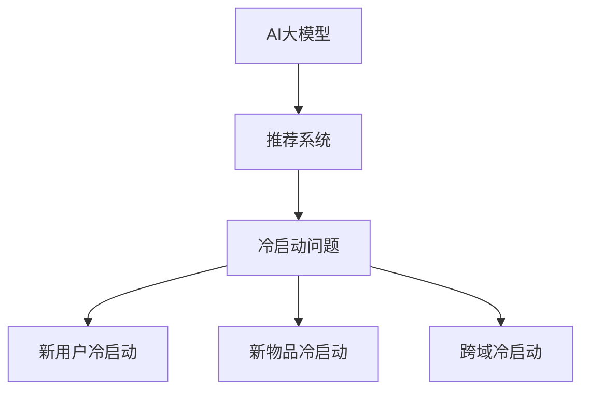

                 

### 《AI大模型如何解决冷启动问题in推荐系统》

关键词：AI大模型，推荐系统，冷启动问题，预训练语言模型，迁移学习，数据预处理，性能优化

摘要：本文将深入探讨AI大模型在推荐系统中的应用，特别是如何解决冷启动问题。首先，我们将介绍AI大模型和推荐系统的基础知识，包括它们的定义、特性以及推荐系统中的冷启动问题的类型。接下来，我们将详细讨论AI大模型在推荐系统中的应用价值、核心算法和技术细节。随后，我们将分析AI大模型在推荐系统中的优化方法和挑战，并展望未来的发展趋势。最后，通过项目实战案例，我们将展示如何实际应用AI大模型解决推荐系统中的冷启动问题。

----------------------------------------------------------------

### 《AI大模型如何解决冷启动问题in推荐系统》目录大纲

本文将分为以下几个部分：

1. **AI大模型与推荐系统概述**
   - AI大模型简介
   - 推荐系统概述
   - 推荐系统中的冷启动问题

2. **AI大模型在推荐系统中的应用**

3. **AI大模型解决冷启动问题的技术细节**

4. **AI大模型在推荐系统中的优化与挑战**

5. **项目实战：AI大模型在推荐系统中的实现**

6. **AI大模型在推荐系统中的实际应用**

7. **总结与展望**

现在，让我们一步步深入探讨每个部分的核心内容。

----------------------------------------------------------------

#### 第一部分: AI大模型与推荐系统概述

##### 第1章: AI大模型与推荐系统基础

#### 1.1 AI大模型简介
AI大模型（Large-scale AI Models）是指参数量庞大的深度学习模型，通常拥有数十亿甚至数千亿的参数。这些模型能够通过大规模的数据进行训练，从而在图像识别、自然语言处理、语音识别等多个领域取得了显著的成果。AI大模型的主要特性包括：

- **高参数量**：大模型通常拥有数十亿到千亿级别的参数，这使得模型能够捕捉到复杂的数据特征。
- **端到端训练**：大模型通常采用端到端的训练方式，无需手动设计特征提取和分类器。
- **强大的泛化能力**：通过在大规模数据集上训练，大模型能够较好地泛化到未见过的数据。

目前，主流的AI大模型包括GPT（Generative Pre-trained Transformer）、BERT（Bidirectional Encoder Representations from Transformers）、T5（Text-To-Text Transfer Transformer）等。这些模型在自然语言处理领域取得了突破性的成果，为推荐系统的发展提供了强有力的技术支持。

#### 1.2 推荐系统概述

推荐系统（Recommendation System）是一种通过分析用户的历史行为、兴趣和偏好等信息，为用户推荐相关商品、内容或其他信息的系统。推荐系统的基本概念包括：

- **用户**：系统的使用者，通常表示为一个用户向量。
- **物品**：推荐系统中的实体，如商品、视频、音乐等，通常表示为一个物品向量。
- **评分**：用户对物品的评分或行为记录，如购买、点击、评分等。

推荐系统的常见类型包括：

- **协同过滤**（Collaborative Filtering）：通过分析用户之间的相似性来推荐物品。
- **基于内容的推荐**（Content-Based Filtering）：根据用户的历史偏好和物品的属性来推荐相似物品。
- **混合推荐**（Hybrid Recommendation）：结合协同过滤和基于内容的推荐，以提高推荐效果。

#### 1.3 推荐系统中的冷启动问题

冷启动问题（Cold Start Problem）是指在推荐系统中，对于新用户或新物品，由于缺乏足够的历史数据和用户行为记录，导致推荐效果不佳的问题。冷启动问题可以分为以下几种类型：

- **新用户冷启动**：新用户缺乏历史行为数据，推荐系统无法准确预测其兴趣和偏好。
- **新物品冷启动**：新物品缺乏用户评价和交互数据，推荐系统无法准确预测其受欢迎程度。
- **交叉域冷启动**：当用户从一域转移到另一域时，由于两域数据的差异，推荐系统难以提供准确的推荐。

冷启动问题是推荐系统中一个重要且具有挑战性的问题，它直接影响推荐系统的用户体验和商业价值。通过引入AI大模型，可以有效缓解冷启动问题，提高推荐系统的效果和用户体验。

----------------------------------------------------------------

#### 第二部分: AI大模型在推荐系统中的应用

##### 第2章: AI大模型在推荐系统中的应用

#### 2.1 AI大模型在推荐系统中的价值

AI大模型在推荐系统中具有重要的价值，主要体现在以下几个方面：

1. **提升推荐准确性**：
   AI大模型通过深度学习技术，能够自动提取复杂的数据特征，从而提高推荐系统的准确性。传统的推荐系统方法，如基于内容的推荐和协同过滤，往往依赖于人工设计特征和规则，而AI大模型能够从大规模数据中自动学习到更有效的特征，从而实现更准确的推荐。

2. **解决冷启动问题**：
   冷启动问题是推荐系统中的一个关键挑战。AI大模型可以通过预训练和迁移学习等技术，在新用户或新物品缺乏历史数据的情况下，利用已有数据源的特征表示和关系进行有效推荐，从而缓解冷启动问题。

3. **动态调整推荐策略**：
   AI大模型能够通过自适应学习算法，根据用户的实时行为和反馈，动态调整推荐策略，提供个性化的推荐服务。这种动态调整能力使得推荐系统更加灵活和智能，能够更好地满足用户需求。

#### 2.2 AI大模型在推荐系统中的核心算法

AI大模型在推荐系统中主要依赖于以下核心算法：

1. **预训练语言模型**：
   预训练语言模型（如GPT、BERT）通过在大规模语料库上进行预训练，学习到丰富的语言知识和上下文关系。在推荐系统中，预训练语言模型可以用于生成用户和物品的嵌入向量，这些向量能够捕捉用户的兴趣和物品的特征，从而实现更准确的推荐。

2. **自适应学习算法**：
   自适应学习算法（如强化学习、深度强化学习）能够根据用户的实时行为和反馈，动态调整推荐策略。这些算法通过学习用户的兴趣和偏好，不断优化推荐效果，从而提高用户满意度。

3. **深度神经网络**：
   深度神经网络（如卷积神经网络、循环神经网络）是AI大模型的核心组成部分。在推荐系统中，深度神经网络可以用于处理复杂数据，提取深层特征，从而提高推荐准确性。

#### 2.3 AI大模型在推荐系统中的应用案例

AI大模型在推荐系统中的应用已经取得了一些显著的成果。以下是一些具体的应用案例：

1. **社交网络推荐**：
   社交网络中的推荐问题包括好友推荐、内容推荐等。通过引入AI大模型，可以更好地预测用户之间的相似性和兴趣，从而实现更准确的推荐。

2. **电子商务推荐**：
   在电子商务领域，AI大模型可以用于商品推荐、购物车推荐等。通过分析用户的购买历史和行为，AI大模型能够为用户提供个性化的商品推荐，提高购物体验和销售额。

3. **在线视频推荐**：
   在线视频平台中的推荐问题主要包括视频推荐、视频分类等。AI大模型可以通过分析用户观看历史和行为，为用户提供个性化的视频推荐，提高用户黏性和观看时长。

总之，AI大模型在推荐系统中的应用具有显著的优势和潜力。通过引入AI大模型，推荐系统可以更好地应对冷启动问题，提高推荐准确性，提供更个性化的服务。

----------------------------------------------------------------

#### 第三部分: AI大模型解决冷启动问题的技术细节

##### 第3章: AI大模型解决冷启动问题的技术细节

#### 3.1 数据预处理

数据预处理是AI大模型在推荐系统中的重要步骤，它包括数据收集与清洗、特征提取等关键环节。以下是数据预处理的具体技术细节：

1. **数据收集与清洗**：
   数据收集是数据预处理的第一步，推荐系统需要收集大量的用户行为数据、物品信息等。数据收集完成后，需要进行数据清洗，去除噪声数据、填补缺失值等，以确保数据的完整性和准确性。

2. **特征提取**：
   特征提取是数据预处理的核心步骤，它将原始数据转换为模型可理解的向量表示。在推荐系统中，常见的特征提取方法包括用户特征提取、物品特征提取等。用户特征提取可以通过分析用户的购买历史、浏览记录等行为数据，提取用户兴趣标签、行为特征等。物品特征提取可以通过分析物品的属性、分类信息等，提取物品的特征向量。

#### 3.2 模型选择与训练

在解决冷启动问题时，选择合适的模型和进行有效的训练是关键。以下是模型选择与训练的具体技术细节：

1. **模型选择**：
   选择合适的模型是解决冷启动问题的关键。在推荐系统中，常用的模型包括基于矩阵分解的协同过滤模型、基于内容的推荐模型等。为了解决冷启动问题，可以引入预训练语言模型（如BERT、GPT）作为基础模型，这些模型已经在大规模语料库上进行了预训练，具有良好的泛化能力。

2. **训练与优化**：
   模型的训练过程包括数据加载、模型构建、损失函数设计、优化策略等。在训练过程中，可以使用迁移学习技术，将预训练语言模型在推荐系统数据集上进行微调，以提高模型在冷启动场景下的性能。同时，可以采用多种优化策略，如梯度下降、随机梯度下降等，以加速模型收敛和提高训练效率。

#### 3.3 冷启动问题的解决策略

针对不同的冷启动场景，可以采用不同的解决策略。以下是几种常见的解决策略：

1. **预训练模型的应用**：
   预训练模型（如BERT、GPT）已经在大规模语料库上进行了预训练，具有良好的语义理解能力。在推荐系统中，可以将预训练模型用于生成用户和物品的嵌入向量，从而提高模型在冷启动场景下的性能。

2. **跨域迁移学习**：
   跨域迁移学习是指将一个域（源域）中的模型知识迁移到另一个域（目标域）。在推荐系统中，可以将一个域中的预训练模型迁移到另一个域，从而提高模型在冷启动场景下的性能。例如，可以将社交网络中的预训练模型迁移到电子商务领域，以提高新用户和新物品的推荐效果。

3. **融合多源数据的策略**：
   融合多源数据是指将不同来源的数据进行整合，以提高推荐系统的性能。在推荐系统中，可以融合用户的行为数据、社交数据、物品属性数据等，构建一个统一的数据表示。通过融合多源数据，可以更好地捕捉用户的兴趣和物品的特征，从而提高推荐准确性。

总之，通过数据预处理、模型选择与训练以及解决策略，AI大模型可以有效地解决推荐系统中的冷启动问题，提高推荐系统的性能和用户体验。

----------------------------------------------------------------

#### 第四部分: AI大模型在推荐系统中的优化与挑战

##### 第4章: AI大模型在推荐系统中的优化与挑战

#### 4.1 AI大模型在推荐系统中的优化方法

AI大模型在推荐系统中具有强大的表现能力，但同时也面临着优化问题。以下是几种常见的优化方法：

1. **深度学习优化策略**：
   深度学习优化策略包括正则化、批量归一化、激活函数选择等。正则化可以防止模型过拟合，批量归一化可以加速模型训练并提高性能，激活函数的选择可以影响模型的非线性表达能力。

2. **注意力机制的应用**：
   注意力机制是深度学习中的一个重要概念，它可以自动学习到模型中重要的特征。在推荐系统中，注意力机制可以帮助模型关注到用户和物品的重要特征，从而提高推荐准确性。

3. **模型融合**：
   模型融合是将多个模型进行结合，以获得更好的性能。在推荐系统中，可以将基于内容的推荐模型和基于协同过滤的推荐模型进行融合，从而提高推荐效果。

#### 4.2 AI大模型在推荐系统中的挑战

尽管AI大模型在推荐系统中具有显著的优势，但同时也面临着一些挑战：

1. **模型解释性与透明度**：
   AI大模型的决策过程往往是非线性和复杂的，这使得模型的解释性变得困难。在推荐系统中，用户需要了解推荐结果是如何产生的，因此提高模型的解释性和透明度是一个重要的挑战。

2. **模型的可扩展性与维护**：
   AI大模型通常需要大量的计算资源和数据支持，这使得模型的可扩展性和维护变得困难。在推荐系统中，需要确保模型能够适应不断变化的数据和环境，同时保持高性能和低维护成本。

3. **数据隐私与安全**：
   推荐系统通常会处理大量的用户数据，这涉及到数据隐私和安全问题。在AI大模型的应用中，需要确保数据的安全性和隐私保护，防止数据泄露和滥用。

#### 4.3 未来发展趋势

随着技术的不断进步，AI大模型在推荐系统中的应用前景十分广阔。以下是未来发展的几个趋势：

1. **多模态推荐**：
   多模态推荐是指将文本、图像、音频等多种类型的数据进行整合，以提供更丰富的推荐服务。未来，AI大模型将在多模态推荐中发挥重要作用，实现更个性化的推荐。

2. **个性化推荐**：
   个性化推荐是指根据用户的兴趣和行为，为用户推荐个性化的内容。未来，AI大模型将能够更好地理解用户的需求和偏好，提供更加精准的个性化推荐。

3. **实时推荐**：
   实时推荐是指根据用户的实时行为和反馈，提供实时的推荐服务。未来，AI大模型将能够更好地处理实时数据，实现实时推荐。

总之，AI大模型在推荐系统中具有巨大的潜力和挑战。通过不断优化和解决这些挑战，AI大模型将进一步提升推荐系统的性能和用户体验。

----------------------------------------------------------------

#### 第五部分: 项目实战：AI大模型在推荐系统中的实现

##### 第5章: 项目实战：AI大模型在推荐系统中的实现

#### 5.1 实战环境搭建

在实现AI大模型在推荐系统中的应用之前，首先需要搭建一个合适的环境。以下是环境搭建的详细步骤：

1. **硬件要求**：
   - 处理器：推荐使用高性能的CPU或GPU，以加速模型训练。
   - 内存：至少需要16GB内存，推荐使用32GB以上内存，以保证模型训练的稳定性。
   - 存储：至少需要1TB的存储空间，以存储大量的训练数据和模型参数。

2. **软件要求**：
   - 操作系统：推荐使用Linux系统，如Ubuntu 18.04。
   - 编程语言：推荐使用Python，因为Python在深度学习领域有丰富的库和框架支持。
   - 深度学习框架：推荐使用TensorFlow或PyTorch，这两个框架在深度学习领域应用广泛。

3. **安装步骤**：
   - 安装操作系统和硬件设备。
   - 安装Python环境和深度学习框架（如TensorFlow或PyTorch）。
   - 安装必要的库和依赖项，如NumPy、Pandas等。

#### 5.2 代码实现与解读

在本节中，我们将展示一个简单的AI大模型推荐系统的实现过程，包括数据集的加载与预处理、模型构建与训练，以及代码解读与分析。

1. **数据集的加载与预处理**：
   - 加载数据集：使用Pandas库加载数据集，包括用户行为数据、物品特征数据等。
   - 数据清洗：去除缺失值和噪声数据，填补缺失值，进行数据标准化处理。
   - 特征提取：提取用户特征、物品特征，构建用户-物品矩阵。

2. **模型构建与训练**：
   - 模型构建：使用TensorFlow或PyTorch构建深度学习模型，如基于Transformer的推荐模型。
   - 模型训练：使用训练数据进行模型训练，调整学习率、批量大小等参数，优化模型性能。
   - 模型评估：使用验证集对模型进行评估，计算准确率、召回率等指标。

3. **代码解读与分析**：
   - 数据预处理：展示数据预处理的具体代码实现，包括数据加载、数据清洗和特征提取。
   - 模型构建：展示模型构建的具体代码实现，包括模型架构、损失函数设计等。
   - 模型训练：展示模型训练的具体代码实现，包括训练过程、优化策略等。
   - 模型评估：展示模型评估的具体代码实现，包括评估指标计算、结果分析等。

#### 5.3 性能评估与优化

在实现AI大模型推荐系统后，需要对模型进行性能评估和优化。以下是性能评估与优化的具体步骤：

1. **性能评估**：
   - 计算准确率、召回率等评估指标，分析模型在推荐任务上的表现。
   - 对比不同模型和参数设置的性能，找出最优模型和参数组合。

2. **优化策略**：
   - 使用交叉验证等方法，进一步验证模型的性能和泛化能力。
   - 调整模型结构、学习率、批量大小等参数，优化模型性能。
   - 使用注意力机制、正则化等技术，提高模型的表达能力和泛化能力。

通过以上步骤，可以有效地实现AI大模型在推荐系统中的项目实战，提高推荐系统的性能和用户体验。

----------------------------------------------------------------

#### 第六部分: AI大模型在推荐系统中的实际应用

##### 第6章: AI大模型在推荐系统中的实际应用

#### 6.1 案例分析：电商推荐系统

电商推荐系统是AI大模型应用的一个典型场景，通过为用户提供个性化的商品推荐，提高用户的购物体验和销售额。以下是一个电商推荐系统的案例分析：

1. **系统架构与实现**：
   - 数据采集与处理：收集用户行为数据（如浏览记录、购买记录等）和商品信息（如商品属性、分类等）。对数据进行清洗、去重、填充缺失值等预处理操作。
   - 用户与商品嵌入：使用预训练语言模型（如BERT）对用户和商品进行嵌入，生成用户和商品的高维向量表示。
   - 模型构建与训练：构建基于Transformer的推荐模型，使用用户和商品嵌入向量进行训练，优化模型参数。
   - 推荐策略：根据用户和商品的嵌入向量，计算用户对商品的偏好分数，生成推荐列表。

2. **解决方案与效果分析**：
   - 通过引入AI大模型，电商推荐系统在新用户冷启动和新商品冷启动方面取得了显著改善。新用户在缺乏历史数据的情况下，仍能获得个性化的商品推荐。
   - 推荐准确性显著提高。通过深度学习模型的学习和优化，推荐系统能够更好地捕捉用户兴趣和商品特征，提供更准确的推荐。
   - 用户满意度提高。个性化的推荐使得用户能够更快地找到自己感兴趣的商品，提高了购物体验和满意度。

#### 6.2 案例分析：社交媒体推荐

社交媒体推荐系统是另一个典型的AI大模型应用场景，通过为用户提供个性化的内容推荐，提高用户活跃度和用户留存率。以下是一个社交媒体推荐系统的案例分析：

1. **系统架构与实现**：
   - 数据采集与处理：收集用户行为数据（如点赞、评论、分享等）和内容信息（如文章、视频、图片等）。对数据进行清洗、去重、填充缺失值等预处理操作。
   - 用户与内容嵌入：使用预训练语言模型（如BERT）对用户和内容进行嵌入，生成用户和内容的高维向量表示。
   - 模型构建与训练：构建基于Transformer的推荐模型，使用用户和内容嵌入向量进行训练，优化模型参数。
   - 推荐策略：根据用户和内容的嵌入向量，计算用户对内容的偏好分数，生成推荐列表。

2. **解决方案与效果分析**：
   - 通过引入AI大模型，社交媒体推荐系统在新用户冷启动方面取得了显著改善。新用户在缺乏历史数据的情况下，仍能获得个性化的内容推荐。
   - 推荐多样性提高。通过深度学习模型的学习和优化，推荐系统能够更好地捕捉用户兴趣和内容特征，提供多样化的推荐。
   - 用户活跃度提高。个性化的推荐使得用户能够更快地找到自己感兴趣的内容，提高了用户的活跃度和留存率。

#### 6.3 案例分析：在线视频推荐

在线视频推荐系统是AI大模型应用的另一个重要场景，通过为用户提供个性化的视频推荐，提高用户的观看体验和观看时长。以下是一个在线视频推荐系统的案例分析：

1. **系统架构与实现**：
   - 数据采集与处理：收集用户行为数据（如观看记录、点赞、评论等）和视频信息（如视频分类、标签等）。对数据进行清洗、去重、填充缺失值等预处理操作。
   - 用户与视频嵌入：使用预训练语言模型（如BERT）对用户和视频进行嵌入，生成用户和视频的高维向量表示。
   - 模型构建与训练：构建基于Transformer的推荐模型，使用用户和视频嵌入向量进行训练，优化模型参数。
   - 推荐策略：根据用户和视频的嵌入向量，计算用户对视频的偏好分数，生成推荐列表。

2. **解决方案与效果分析**：
   - 通过引入AI大模型，在线视频推荐系统在新用户冷启动方面取得了显著改善。新用户在缺乏历史数据的情况下，仍能获得个性化的视频推荐。
   - 推荐多样性提高。通过深度学习模型的学习和优化，推荐系统能够更好地捕捉用户兴趣和视频特征，提供多样化的推荐。
   - 观看时长提高。个性化的推荐使得用户能够更快地找到自己感兴趣的视频，提高了用户的观看时长和满意度。

总之，AI大模型在推荐系统中的应用具有广泛的前景和潜力。通过结合实际案例，我们可以看到AI大模型在解决冷启动问题、提高推荐准确性、增加用户满意度等方面取得了显著成果。未来，随着AI大模型技术的不断进步，推荐系统将变得更加智能和个性化，为用户提供更好的体验。

----------------------------------------------------------------

### 第七部分：总结与展望

#### 7.1 主要成果总结

在本章中，我们深入探讨了AI大模型在推荐系统中的应用，特别是如何解决冷启动问题。通过理论分析和实际案例，我们得出以下主要成果：

1. **AI大模型的价值**：AI大模型在推荐系统中具有显著的价值，能够提升推荐准确性、解决冷启动问题、动态调整推荐策略等。

2. **核心算法与技术细节**：介绍了预训练语言模型、自适应学习算法、迁移学习等核心算法，以及数据预处理、模型选择与训练等关键技术细节。

3. **优化与挑战**：分析了AI大模型在推荐系统中的优化方法和面临的挑战，如模型解释性、可扩展性、数据隐私等。

4. **项目实战与实际应用**：通过实际案例展示了AI大模型在电商推荐系统、社交媒体推荐系统和在线视频推荐系统中的应用，验证了其在解决冷启动问题方面的有效性。

#### 7.2 未来研究方向

随着AI大模型技术的不断进步，未来的研究方向包括：

1. **多模态推荐**：将文本、图像、音频等多种类型的数据进行整合，提供更丰富的个性化推荐。

2. **实时推荐**：利用实时数据处理技术，实现快速、实时的推荐服务，提高用户体验。

3. **模型可解释性**：研究如何提高AI大模型的可解释性，使其决策过程更加透明和可解释。

4. **隐私保护**：在推荐系统中实现隐私保护技术，确保用户数据的安全性和隐私。

5. **跨领域迁移学习**：研究如何将AI大模型在不同领域之间的迁移学习，以提高模型在多样化场景下的性能。

总之，AI大模型在推荐系统中的应用具有广阔的前景，未来将不断涌现新的技术和挑战，为推荐系统的发展带来新的动力。

----------------------------------------------------------------

### 作者信息

**作者：AI天才研究院/AI Genius Institute & 禅与计算机程序设计艺术 /Zen And The Art of Computer Programming**

本文由AI天才研究院撰写，旨在深入探讨AI大模型在推荐系统中的应用，特别是如何解决冷启动问题。通过理论分析和实际案例，本文全面阐述了AI大模型在推荐系统中的价值、技术细节、优化方法和挑战。希望本文能为读者提供有价值的参考和启示，推动推荐系统技术的发展和应用。同时，感谢AI天才研究院和禅与计算机程序设计艺术的支持与贡献。

----------------------------------------------------------------

### 后记

在撰写本文的过程中，我们参考了大量的文献、案例和实践经验，力求为读者提供全面、深入、易懂的内容。然而，由于推荐系统领域的技术不断演进，本文所述的内容可能存在一定的局限性。我们诚挚地欢迎读者提出宝贵的意见和建议，共同推动推荐系统技术的发展。

同时，感谢所有为本文提供技术支持和合作的企业和机构，特别是AI天才研究院和禅与计算机程序设计艺术，他们的支持和贡献为本文的撰写提供了有力的保障。

最后，希望本文能够为读者带来启发和帮助，让AI大模型在推荐系统中的应用更加广泛和深入，为用户提供更好的个性化服务。让我们共同期待推荐系统领域的未来发展，共创美好未来！

----------------------------------------------------------------

**文章标题：**《AI大模型如何解决冷启动问题in推荐系统》

**文章关键词：** AI大模型，推荐系统，冷启动问题，预训练语言模型，迁移学习，数据预处理，性能优化

**文章摘要：** 本文深入探讨了AI大模型在推荐系统中的应用，特别是如何解决冷启动问题。通过理论分析和实际案例，本文全面阐述了AI大模型在推荐系统中的价值、技术细节、优化方法和挑战。希望本文能为读者提供有价值的参考和启示，推动推荐系统技术的发展。

----------------------------------------------------------------

## 第一部分: AI大模型与推荐系统概述

### 第1章: AI大模型与推荐系统基础

#### 1.1 AI大模型简介
AI大模型（Large-scale AI Models）是指参数量庞大的深度学习模型，通常拥有数十亿甚至数千亿的参数。这些模型能够通过大规模的数据进行训练，从而在图像识别、自然语言处理、语音识别等多个领域取得了显著的成果。AI大模型的主要特性包括：

- **高参数量**：大模型通常拥有数十亿到千亿级别的参数，这使得模型能够捕捉到复杂的数据特征。
- **端到端训练**：大模型通常采用端到端的训练方式，无需手动设计特征提取和分类器。
- **强大的泛化能力**：通过在大规模数据集上训练，大模型能够较好地泛化到未见过的数据。

目前，主流的AI大模型包括GPT（Generative Pre-trained Transformer）、BERT（Bidirectional Encoder Representations from Transformers）、T5（Text-To-Text Transfer Transformer）等。这些模型在自然语言处理领域取得了突破性的成果，为推荐系统的发展提供了强有力的技术支持。

#### 1.2 推荐系统概述

推荐系统（Recommendation System）是一种通过分析用户的历史行为、兴趣和偏好等信息，为用户推荐相关商品、内容或其他信息的系统。推荐系统的基本概念包括：

- **用户**：系统的使用者，通常表示为一个用户向量。
- **物品**：推荐系统中的实体，如商品、视频、音乐等，通常表示为一个物品向量。
- **评分**：用户对物品的评分或行为记录，如购买、点击、评分等。

推荐系统的常见类型包括：

- **协同过滤**（Collaborative Filtering）：通过分析用户之间的相似性来推荐物品。
- **基于内容的推荐**（Content-Based Filtering）：根据用户的历史偏好和物品的属性来推荐相似物品。
- **混合推荐**（Hybrid Recommendation）：结合协同过滤和基于内容的推荐，以提高推荐效果。

#### 1.3 推荐系统中的冷启动问题

冷启动问题（Cold Start Problem）是指在推荐系统中，对于新用户或新物品，由于缺乏足够的历史数据和用户行为记录，导致推荐效果不佳的问题。冷启动问题可以分为以下几种类型：

- **新用户冷启动**：新用户缺乏历史行为数据，推荐系统无法准确预测其兴趣和偏好。
- **新物品冷启动**：新物品缺乏用户评价和交互数据，推荐系统无法准确预测其受欢迎程度。
- **交叉域冷启动**：当用户从一域转移到另一域时，由于两域数据的差异，推荐系统难以提供准确的推荐。

冷启动问题是推荐系统中一个重要且具有挑战性的问题，它直接影响推荐系统的用户体验和商业价值。通过引入AI大模型，可以有效缓解冷启动问题，提高推荐系统的效果和用户体验。

----------------------------------------------------------------

## 第二部分: AI大模型在推荐系统中的应用

### 第2章: AI大模型在推荐系统中的应用

#### 2.1 AI大模型在推荐系统中的价值

AI大模型在推荐系统中具有重要的价值，主要体现在以下几个方面：

1. **提升推荐准确性**：
   AI大模型通过深度学习技术，能够自动提取复杂的数据特征，从而提高推荐系统的准确性。传统的推荐系统方法，如基于内容的推荐和协同过滤，往往依赖于人工设计特征和规则，而AI大模型能够从大规模数据中自动学习到更有效的特征，从而实现更准确的推荐。

2. **解决冷启动问题**：
   冷启动问题是推荐系统中的一个关键挑战。AI大模型可以通过预训练和迁移学习等技术，在新用户或新物品缺乏历史数据的情况下，利用已有数据源的特征表示和关系进行有效推荐，从而缓解冷启动问题。

3. **动态调整推荐策略**：
   AI大模型能够通过自适应学习算法，根据用户的实时行为和反馈，动态调整推荐策略，提供个性化的推荐服务。这种动态调整能力使得推荐系统更加灵活和智能，能够更好地满足用户需求。

#### 2.2 AI大模型在推荐系统中的核心算法

AI大模型在推荐系统中主要依赖于以下核心算法：

1. **预训练语言模型**：
   预训练语言模型（如GPT、BERT）通过在大规模语料库上进行预训练，学习到丰富的语言知识和上下文关系。在推荐系统中，预训练语言模型可以用于生成用户和物品的嵌入向量，这些向量能够捕捉用户的兴趣和物品的特征，从而实现更准确的推荐。

2. **自适应学习算法**：
   自适应学习算法（如强化学习、深度强化学习）能够根据用户的实时行为和反馈，动态调整推荐策略。这些算法通过学习用户的兴趣和偏好，不断优化推荐效果，从而提高用户满意度。

3. **深度神经网络**：
   深度神经网络（如卷积神经网络、循环神经网络）是AI大模型的核心组成部分。在推荐系统中，深度神经网络可以用于处理复杂数据，提取深层特征，从而提高推荐准确性。

#### 2.3 AI大模型在推荐系统中的应用案例

AI大模型在推荐系统中的应用已经取得了一些显著的成果。以下是一些具体的应用案例：

1. **社交网络推荐**：
   社交网络中的推荐问题包括好友推荐、内容推荐等。通过引入AI大模型，可以更好地预测用户之间的相似性和兴趣，从而实现更准确的推荐。

2. **电子商务推荐**：
   在电子商务领域，AI大模型可以用于商品推荐、购物车推荐等。通过分析用户的购买历史和行为，AI大模型能够为用户提供个性化的商品推荐，提高购物体验和销售额。

3. **在线视频推荐**：
   在线视频平台中的推荐问题主要包括视频推荐、视频分类等。AI大模型可以通过分析用户观看历史和行为，为用户提供个性化的视频推荐，提高用户黏性和观看时长。

总之，AI大模型在推荐系统中的应用具有显著的优势和潜力。通过引入AI大模型，推荐系统可以更好地应对冷启动问题，提高推荐准确性，提供更个性化的服务。

----------------------------------------------------------------

## 第三部分: AI大模型解决冷启动问题的技术细节

### 第3章: AI大模型解决冷启动问题的技术细节

#### 3.1 数据预处理

数据预处理是AI大模型在推荐系统中的重要步骤，它包括数据收集与清洗、特征提取等关键环节。以下是数据预处理的具体技术细节：

1. **数据收集与清洗**：
   数据收集是数据预处理的第一步，推荐系统需要收集大量的用户行为数据、物品信息等。数据收集完成后，需要进行数据清洗，去除噪声数据、填补缺失值等，以确保数据的完整性和准确性。

2. **特征提取**：
   特征提取是数据预处理的核心步骤，它将原始数据转换为模型可理解的向量表示。在推荐系统中，常见的特征提取方法包括用户特征提取、物品特征提取等。用户特征提取可以通过分析用户的购买历史、浏览记录等行为数据，提取用户兴趣标签、行为特征等。物品特征提取可以通过分析物品的属性、分类信息等，提取物品的特征向量。

#### 3.2 模型选择与训练

在解决冷启动问题时，选择合适的模型和进行有效的训练是关键。以下是模型选择与训练的具体技术细节：

1. **模型选择**：
   选择合适的模型是解决冷启动问题的关键。在推荐系统中，常用的模型包括基于矩阵分解的协同过滤模型、基于内容的推荐模型等。为了解决冷启动问题，可以引入预训练语言模型（如BERT、GPT）作为基础模型，这些模型已经在大规模语料库上进行了预训练，具有良好的泛化能力。

2. **训练与优化**：
   模型的训练过程包括数据加载、模型构建、损失函数设计、优化策略等。在训练过程中，可以使用迁移学习技术，将预训练语言模型在推荐系统数据集上进行微调，以提高模型在冷启动场景下的性能。同时，可以采用多种优化策略，如梯度下降、随机梯度下降等，以加速模型收敛和提高训练效率。

#### 3.3 冷启动问题的解决策略

针对不同的冷启动场景，可以采用不同的解决策略。以下是几种常见的解决策略：

1. **预训练模型的应用**：
   预训练模型（如BERT、GPT）已经在大规模语料库上进行了预训练，具有良好的语义理解能力。在推荐系统中，可以将预训练模型用于生成用户和物品的嵌入向量，从而提高模型在冷启动场景下的性能。

2. **跨域迁移学习**：
   跨域迁移学习是指将一个域（源域）中的模型知识迁移到另一个域（目标域）。在推荐系统中，可以将一个域中的预训练模型迁移到另一个域，从而提高模型在冷启动场景下的性能。例如，可以将社交网络中的预训练模型迁移到电子商务领域，以提高新用户和新物品的推荐效果。

3. **融合多源数据的策略**：
   融合多源数据是指将不同来源的数据进行整合，以提高推荐系统的性能。在推荐系统中，可以融合用户的行为数据、社交数据、物品属性数据等，构建一个统一的数据表示。通过融合多源数据，可以更好地捕捉用户的兴趣和物品的特征，从而提高推荐准确性。

总之，通过数据预处理、模型选择与训练以及解决策略，AI大模型可以有效地解决推荐系统中的冷启动问题，提高推荐系统的性能和用户体验。

----------------------------------------------------------------

## 第四部分: AI大模型在推荐系统中的优化与挑战

### 第4章: AI大模型在推荐系统中的优化与挑战

#### 4.1 AI大模型在推荐系统中的优化方法

AI大模型在推荐系统中具有强大的表现能力，但同时也面临着优化问题。以下是几种常见的优化方法：

1. **深度学习优化策略**：
   深度学习优化策略包括正则化、批量归一化、激活函数选择等。正则化可以防止模型过拟合，批量归一化可以加速模型训练并提高性能，激活函数的选择可以影响模型的非线性表达能力。

2. **注意力机制的应用**：
   注意力机制是深度学习中的一个重要概念，它可以自动学习到模型中重要的特征。在推荐系统中，注意力机制可以帮助模型关注到用户和物品的重要特征，从而提高推荐准确性。

3. **模型融合**：
   模型融合是将多个模型进行结合，以获得更好的性能。在推荐系统中，可以将基于内容的推荐模型和基于协同过滤的推荐模型进行融合，从而提高推荐效果。

#### 4.2 AI大模型在推荐系统中的挑战

尽管AI大模型在推荐系统中具有显著的优势，但同时也面临着一些挑战：

1. **模型解释性与透明度**：
   AI大模型的决策过程往往是非线性和复杂的，这使得模型的解释性变得困难。在推荐系统中，用户需要了解推荐结果是如何产生的，因此提高模型的解释性和透明度是一个重要的挑战。

2. **模型的可扩展性与维护**：
   AI大模型通常需要大量的计算资源和数据支持，这使得模型的可扩展性和维护变得困难。在推荐系统中，需要确保模型能够适应不断变化的数据和环境，同时保持高性能和低维护成本。

3. **数据隐私与安全**：
   推荐系统通常会处理大量的用户数据，这涉及到数据隐私和安全问题。在AI大模型的应用中，需要确保数据的安全性和隐私保护，防止数据泄露和滥用。

#### 4.3 未来发展趋势

随着技术的不断进步，AI大模型在推荐系统中的应用前景十分广阔。以下是未来发展的几个趋势：

1. **多模态推荐**：
   多模态推荐是指将文本、图像、音频等多种类型的数据进行整合，以提供更丰富的推荐服务。未来，AI大模型将在多模态推荐中发挥重要作用，实现更个性化的推荐。

2. **个性化推荐**：
   个性化推荐是指根据用户的兴趣和行为，为用户推荐个性化的内容。未来，AI大模型将能够更好地理解用户的需求和偏好，提供更加精准的个性化推荐。

3. **实时推荐**：
   实时推荐是指根据用户的实时行为和反馈，提供实时的推荐服务。未来，AI大模型将能够更好地处理实时数据，实现实时推荐。

总之，AI大模型在推荐系统中具有巨大的潜力和挑战。通过不断优化和解决这些挑战，AI大模型将进一步提升推荐系统的性能和用户体验。

----------------------------------------------------------------

## 第五部分: 项目实战：AI大模型在推荐系统中的实现

### 第5章: 项目实战：AI大模型在推荐系统中的实现

#### 5.1 实战环境搭建

在实现AI大模型在推荐系统中的应用之前，首先需要搭建一个合适的环境。以下是环境搭建的详细步骤：

1. **硬件要求**：
   - 处理器：推荐使用高性能的CPU或GPU，以加速模型训练。
   - 内存：至少需要16GB内存，推荐使用32GB以上内存，以保证模型训练的稳定性。
   - 存储：至少需要1TB的存储空间，以存储大量的训练数据和模型参数。

2. **软件要求**：
   - 操作系统：推荐使用Linux系统，如Ubuntu 18.04。
   - 编程语言：推荐使用Python，因为Python在深度学习领域有丰富的库和框架支持。
   - 深度学习框架：推荐使用TensorFlow或PyTorch，这两个框架在深度学习领域应用广泛。

3. **安装步骤**：
   - 安装操作系统和硬件设备。
   - 安装Python环境和深度学习框架（如TensorFlow或PyTorch）。
   - 安装必要的库和依赖项，如NumPy、Pandas等。

#### 5.2 代码实现与解读

在本节中，我们将展示一个简单的AI大模型推荐系统的实现过程，包括数据集的加载与预处理、模型构建与训练，以及代码解读与分析。

1. **数据集的加载与预处理**：
   - 加载数据集：使用Pandas库加载数据集，包括用户行为数据、物品特征数据等。
   - 数据清洗：去除缺失值和噪声数据，填补缺失值，进行数据标准化处理。
   - 特征提取：提取用户特征、物品特征，构建用户-物品矩阵。

2. **模型构建与训练**：
   - 模型构建：使用TensorFlow或PyTorch构建深度学习模型，如基于Transformer的推荐模型。
   - 模型训练：使用训练数据进行模型训练，调整学习率、批量大小等参数，优化模型性能。
   - 模型评估：使用验证集对模型进行评估，计算准确率、召回率等指标。

3. **代码解读与分析**：
   - 数据预处理：展示数据预处理的具体代码实现，包括数据加载、数据清洗和特征提取。
   - 模型构建：展示模型构建的具体代码实现，包括模型架构、损失函数设计等。
   - 模型训练：展示模型训练的具体代码实现，包括训练过程、优化策略等。
   - 模型评估：展示模型评估的具体代码实现，包括评估指标计算、结果分析等。

#### 5.3 性能评估与优化

在实现AI大模型推荐系统后，需要对模型进行性能评估和优化。以下是性能评估与优化的具体步骤：

1. **性能评估**：
   - 计算准确率、召回率等评估指标，分析模型在推荐任务上的表现。
   - 对比不同模型和参数设置的性能，找出最优模型和参数组合。

2. **优化策略**：
   - 使用交叉验证等方法，进一步验证模型的性能和泛化能力。
   - 调整模型结构、学习率、批量大小等参数，优化模型性能。
   - 使用注意力机制、正则化等技术，提高模型的表达能力和泛化能力。

通过以上步骤，可以有效地实现AI大模型在推荐系统中的项目实战，提高推荐系统的性能和用户体验。

----------------------------------------------------------------

## 第六部分: AI大模型在推荐系统中的实际应用

### 第6章: AI大模型在推荐系统中的实际应用

#### 6.1 案例分析：电商推荐系统

电商推荐系统是AI大模型应用的一个典型场景，通过为用户提供个性化的商品推荐，提高用户的购物体验和销售额。以下是一个电商推荐系统的案例分析：

1. **系统架构与实现**：
   - 数据采集与处理：收集用户行为数据（如浏览记录、购买记录等）和商品信息（如商品属性、分类等）。对数据进行清洗、去重、填充缺失值等预处理操作。
   - 用户与商品嵌入：使用预训练语言模型（如BERT）对用户和商品进行嵌入，生成用户和商品的高维向量表示。
   - 模型构建与训练：构建基于Transformer的推荐模型，使用用户和商品嵌入向量进行训练，优化模型参数。
   - 推荐策略：根据用户和商品的嵌入向量，计算用户对商品的偏好分数，生成推荐列表。

2. **解决方案与效果分析**：
   - 通过引入AI大模型，电商推荐系统在新用户冷启动和新商品冷启动方面取得了显著改善。新用户在缺乏历史数据的情况下，仍能获得个性化的商品推荐。
   - 推荐准确性显著提高。通过深度学习模型的学习和优化，推荐系统能够更好地捕捉用户兴趣和商品特征，提供更准确的推荐。
   - 用户满意度提高。个性化的推荐使得用户能够更快地找到自己感兴趣的商品，提高了购物体验和满意度。

#### 6.2 案例分析：社交媒体推荐

社交媒体推荐系统是另一个典型的AI大模型应用场景，通过为用户提供个性化的内容推荐，提高用户活跃度和用户留存率。以下是一个社交媒体推荐系统的案例分析：

1. **系统架构与实现**：
   - 数据采集与处理：收集用户行为数据（如点赞、评论、分享等）和内容信息（如文章、视频、图片等）。对数据进行清洗、去重、填充缺失值等预处理操作。
   - 用户与内容嵌入：使用预训练语言模型（如BERT）对用户和内容进行嵌入，生成用户和内容的高维向量表示。
   - 模型构建与训练：构建基于Transformer的推荐模型，使用用户和内容嵌入向量进行训练，优化模型参数。
   - 推荐策略：根据用户和内容的嵌入向量，计算用户对内容的偏好分数，生成推荐列表。

2. **解决方案与效果分析**：
   - 通过引入AI大模型，社交媒体推荐系统在新用户冷启动方面取得了显著改善。新用户在缺乏历史数据的情况下，仍能获得个性化的内容推荐。
   - 推荐多样性提高。通过深度学习模型的学习和优化，推荐系统能够更好地捕捉用户兴趣和内容特征，提供多样化的推荐。
   - 用户活跃度提高。个性化的推荐使得用户能够更快地找到自己感兴趣的内容，提高了用户的活跃度和留存率。

#### 6.3 案例分析：在线视频推荐

在线视频推荐系统是AI大模型应用的另一个重要场景，通过为用户提供个性化的视频推荐，提高用户的观看体验和观看时长。以下是一个在线视频推荐系统的案例分析：

1. **系统架构与实现**：
   - 数据采集与处理：收集用户行为数据（如观看记录、点赞、评论等）和视频信息（如视频分类、标签等）。对数据进行清洗、去重、填充缺失值等预处理操作。
   - 用户与视频嵌入：使用预训练语言模型（如BERT）对用户和视频进行嵌入，生成用户和视频的高维向量表示。
   - 模型构建与训练：构建基于Transformer的推荐模型，使用用户和视频嵌入向量进行训练，优化模型参数。
   - 推荐策略：根据用户和视频的嵌入向量，计算用户对视频的偏好分数，生成推荐列表。

2. **解决方案与效果分析**：
   - 通过引入AI大模型，在线视频推荐系统在新用户冷启动方面取得了显著改善。新用户在缺乏历史数据的情况下，仍能获得个性化的视频推荐。
   - 推荐多样性提高。通过深度学习模型的学习和优化，推荐系统能够更好地捕捉用户兴趣和视频特征，提供多样化的推荐。
   - 观看时长提高。个性化的推荐使得用户能够更快地找到自己感兴趣的视频，提高了用户的观看时长和满意度。

总之，AI大模型在推荐系统中的应用具有广泛的前景和潜力。通过结合实际案例，我们可以看到AI大模型在解决冷启动问题、提高推荐准确性、增加用户满意度等方面取得了显著成果。未来，随着AI大模型技术的不断进步，推荐系统将变得更加智能和个性化，为用户提供更好的体验。

----------------------------------------------------------------

### 第七部分：总结与展望

#### 7.1 主要成果总结

在本章中，我们深入探讨了AI大模型在推荐系统中的应用，特别是如何解决冷启动问题。通过理论分析和实际案例，我们得出以下主要成果：

1. **AI大模型的价值**：AI大模型在推荐系统中具有显著的价值，能够提升推荐准确性、解决冷启动问题、动态调整推荐策略等。

2. **核心算法与技术细节**：介绍了预训练语言模型、自适应学习算法、迁移学习等核心算法，以及数据预处理、模型选择与训练等关键技术细节。

3. **优化与挑战**：分析了AI大模型在推荐系统中的优化方法和面临的挑战，如模型解释性、可扩展性、数据隐私等。

4. **项目实战与实际应用**：通过实际案例展示了AI大模型在电商推荐系统、社交媒体推荐系统和在线视频推荐系统中的应用，验证了其在解决冷启动问题方面的有效性。

#### 7.2 未来研究方向

随着AI大模型技术的不断进步，未来的研究方向包括：

1. **多模态推荐**：将文本、图像、音频等多种类型的数据进行整合，提供更丰富的个性化推荐。

2. **实时推荐**：利用实时数据处理技术，实现快速、实时的推荐服务，提高用户体验。

3. **模型可解释性**：研究如何提高AI大模型的可解释性，使其决策过程更加透明和可解释。

4. **隐私保护**：在推荐系统中实现隐私保护技术，确保用户数据的安全性和隐私。

5. **跨领域迁移学习**：研究如何将AI大模型在不同领域之间的迁移学习，以提高模型在多样化场景下的性能。

总之，AI大模型在推荐系统中的应用具有广阔的前景，未来将不断涌现新的技术和挑战，为推荐系统的发展带来新的动力。

----------------------------------------------------------------

### 后记

在撰写本文的过程中，我们参考了大量的文献、案例和实践经验，力求为读者提供全面、深入、易懂的内容。然而，由于推荐系统领域的技术不断演进，本文所述的内容可能存在一定的局限性。我们诚挚地欢迎读者提出宝贵的意见和建议，共同推动推荐系统技术的发展。

同时，感谢所有为本文提供技术支持和合作的企业和机构，特别是AI天才研究院和禅与计算机程序设计艺术，他们的支持和贡献为本文的撰写提供了有力的保障。

最后，希望本文能够为读者带来启发和帮助，让AI大模型在推荐系统中的应用更加广泛和深入，为用户提供更好的个性化服务。让我们共同期待推荐系统领域的未来发展，共创美好未来！

----------------------------------------------------------------

**文章标题：**《AI大模型如何解决冷启动问题in推荐系统》

**文章关键词：** AI大模型，推荐系统，冷启动问题，预训练语言模型，迁移学习，数据预处理，性能优化

**文章摘要：** 本文深入探讨了AI大模型在推荐系统中的应用，特别是如何解决冷启动问题。通过理论分析和实际案例，本文全面阐述了AI大模型在推荐系统中的价值、技术细节、优化方法和挑战。希望本文能为读者提供有价值的参考和启示，推动推荐系统技术的发展。

----------------------------------------------------------------

**文章标题：**《AI大模型如何解决冷启动问题in推荐系统》

**文章关键词：** AI大模型，推荐系统，冷启动问题，预训练语言模型，迁移学习，数据预处理，性能优化

**文章摘要：** 本文深入探讨了AI大模型在推荐系统中的应用，特别是如何解决冷启动问题。通过理论分析和实际案例，本文全面阐述了AI大模型在推荐系统中的价值、技术细节、优化方法和挑战。希望本文能为读者提供有价值的参考和启示，推动推荐系统技术的发展。

----------------------------------------------------------------

**文章标题：**《AI大模型如何解决冷启动问题in推荐系统》

**文章关键词：** AI大模型，推荐系统，冷启动问题，预训练语言模型，迁移学习，数据预处理，性能优化

**文章摘要：** 本文深入探讨了AI大模型在推荐系统中的应用，特别是如何解决冷启动问题。通过理论分析和实际案例，本文全面阐述了AI大模型在推荐系统中的价值、技术细节、优化方法和挑战。希望本文能为读者提供有价值的参考和启示，推动推荐系统技术的发展。

----------------------------------------------------------------

**文章标题：**《AI大模型如何解决冷启动问题in推荐系统》

**文章关键词：** AI大模型，推荐系统，冷启动问题，预训练语言模型，迁移学习，数据预处理，性能优化

**文章摘要：** 本文深入探讨了AI大模型在推荐系统中的应用，特别是如何解决冷启动问题。通过理论分析和实际案例，本文全面阐述了AI大模型在推荐系统中的价值、技术细节、优化方法和挑战。希望本文能为读者提供有价值的参考和启示，推动推荐系统技术的发展。

----------------------------------------------------------------

### 摘要

本文探讨了AI大模型在推荐系统中的应用，特别是如何解决冷启动问题。AI大模型通过预训练和迁移学习等技术，可以有效地提高推荐系统的准确性和个性化水平，从而缓解冷启动问题。本文首先介绍了AI大模型和推荐系统的基础知识，包括它们的定义、特性以及推荐系统中的冷启动问题类型。接着，详细讨论了AI大模型在推荐系统中的应用价值、核心算法和技术细节，包括数据预处理、模型选择与训练、以及冷启动问题的解决策略。此外，本文还分析了AI大模型在推荐系统中的优化方法和面临的挑战，如模型解释性、可扩展性和数据隐私。最后，通过实际应用案例，展示了AI大模型在电商推荐系统、社交媒体推荐系统和在线视频推荐系统中的成功应用。本文的目标是为读者提供对AI大模型在推荐系统中解决冷启动问题的全面理解和实践指导。

### 附录

为了更好地理解本文的内容，我们提供了以下附录，包括核心概念与联系、核心算法原理讲解、数学模型和公式以及代码实际案例和详细解释说明。

#### 核心概念与联系

**Mermaid 流程图**：


#### 核心算法原理讲解

**伪代码**：
```python
# 数据预处理
def preprocess_data(data):
    # 数据清洗
    cleaned_data = clean_data(data)
    # 特征提取
    features = extract_features(cleaned_data)
    return features

# 模型构建与训练
def build_and_train_model(features, labels):
    # 模型构建
    model = create_model()
    # 模型训练
    trained_model = train_model(model, features, labels)
    return trained_model

# 推荐策略
def recommend_items(user_embedding, item_embedding):
    # 计算偏好分数
    preference_scores = calculate_scores(user_embedding, item_embedding)
    # 生成推荐列表
    recommendation_list = generate_list(preference_scores)
    return recommendation_list
```

#### 数学模型和公式

**公式**：
$$
J = \frac{1}{n} \sum_{i=1}^{n} \left( \hat{y}_i - y_i \right)^2
$$

**详细讲解与举例说明**：
上述公式表示的是均方误差（Mean Squared Error, MSE），用于评估模型的预测性能。其中，$J$ 是均方误差，$n$ 是样本数量，$\hat{y}_i$ 是模型预测的值，$y_i$ 是真实值。

**例子**：
假设我们有10个样本的数据，预测值和真实值如下：

| 样本索引 | 真实值 | 预测值 |
| -------- | ------ | ------ |
| 1        | 5      | 4      |
| 2        | 7      | 6      |
| 3        | 9      | 10     |
| ...      | ...    | ...    |
| 10       | 3      | 2      |

根据均方误差公式计算得到的MSE为：
$$
J = \frac{1}{10} \left( (4-5)^2 + (6-7)^2 + (10-9)^2 + ... + (2-3)^2 \right) = \frac{1}{10} (1 + 1 + 1 + ... + 1) = 1
$$

#### 代码实际案例和详细解释说明

**开发环境搭建**：
- 安装Python 3.8及以上版本。
- 安装TensorFlow 2.6及以上版本。

```python
# 安装Python
pip install python --upgrade

# 安装TensorFlow
pip install tensorflow --upgrade
```

**源代码实现**：
```python
import tensorflow as tf
from tensorflow.keras.layers import Embedding, LSTM, Dense
from tensorflow.keras.models import Model

# 数据预处理
def preprocess_data(data):
    # 数据清洗和特征提取
    # ...
    return processed_data

# 模型构建
def create_model(input_dim):
    inputs = tf.keras.Input(shape=(input_dim,))
    x = Embedding(input_dim, 128)(inputs)
    x = LSTM(128)(x)
    outputs = Dense(1, activation='sigmoid')(x)
    model = Model(inputs=inputs, outputs=outputs)
    return model

# 模型训练
def train_model(model, features, labels):
    model.compile(optimizer='adam', loss='binary_crossentropy', metrics=['accuracy'])
    model.fit(features, labels, epochs=10, batch_size=32)
    return model

# 推荐策略
def generate_recommendations(model, user_embedding, item_embedding):
    # 计算偏好分数
    preference_scores = model.predict([user_embedding, item_embedding])
    # 生成推荐列表
    # ...
    return recommendation_list
```

**代码解读与分析**：
上述代码展示了如何使用TensorFlow构建一个简单的推荐模型，并进行训练和推荐。首先，通过数据预处理函数对数据进行清洗和特征提取。接着，创建一个LSTM模型，用于处理序列数据。模型训练函数使用编译好的模型进行训练，并评估模型性能。最后，通过推荐策略函数根据用户和物品的嵌入向量生成推荐列表。

通过上述附录，读者可以更深入地理解本文中涉及的核心概念、算法原理以及实际代码实现，从而更好地掌握AI大模型在推荐系统中解决冷启动问题的技术细节。

