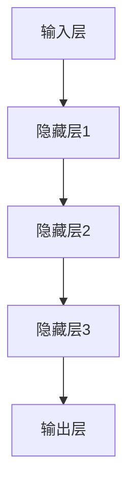
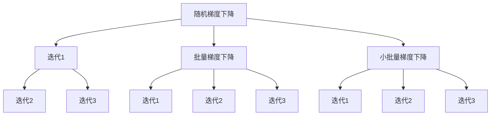

                 

# 《AI大模型距离改变人类生活还有多远?》

> **关键词：**人工智能、大模型、深度学习、应用场景、发展趋势、伦理与法律
>
> **摘要：**本文将深入探讨人工智能（AI）大模型的发展现状、核心技术、应用场景、发展趋势以及面临的伦理与法律挑战。通过逐步分析，本文旨在回答AI大模型距离改变人类生活还有多远这一问题，并展望其未来发展的可能性。

----------------------------------------------------------------

## 第一部分: AI大模型概述

### 第1章: AI大模型概述

#### 1.1 AI大模型的定义与背景

AI大模型（Large-scale AI Models）是指具有极高参数数量、复杂度和计算需求的深度学习模型。这些模型通常基于神经网络架构，通过训练大量数据来学习特征和模式，从而在各个领域实现智能决策和自动化操作。

AI大模型的发展可以追溯到20世纪80年代，随着计算机性能的提升和大数据的涌现，深度学习逐渐成为一种主流的机器学习技术。近年来，GPU和TPU等专用硬件的发展进一步加速了AI大模型的研究和应用。例如，GPT-3、BERT和BERTweet等大型预训练模型在自然语言处理领域取得了显著的成果。

#### 1.2 AI大模型的技术基础

AI大模型的技术基础主要包括以下几个方面：

1. **深度学习与神经网络**：
   - 深度学习（Deep Learning）是一种模拟人脑神经网络进行学习的机器学习方法。
   - 神经网络（Neural Networks）是深度学习的基础，通过多层神经网络结构来提取数据的层次特征。

2. **自然语言处理技术**：
   - 自然语言处理（Natural Language Processing，NLP）是AI大模型的重要应用领域。
   - 词嵌入（Word Embedding）和序列模型（Sequence Models）是NLP的基础技术。

3. **计算机视觉技术**：
   - 计算机视觉（Computer Vision）是AI大模型在图像处理和识别领域的应用。
   - 卷积神经网络（CNN）和生成对抗网络（GAN）是计算机视觉的核心算法。

#### 1.3 AI大模型的应用领域

AI大模型的应用领域非常广泛，主要包括以下方面：

1. **医疗健康**：
   - 医学影像识别、疾病预测与诊断、病历数据分析等。

2. **教育**：
   - 智能教学助手、在线教育平台优化、学习行为分析等。

3. **金融**：
   - 信用评分与风险评估、量化交易与算法策略、风险控制策略等。

4. **自动驾驶与智能交通**：
   - 自动驾驶系统、视觉感知与定位、交通流量预测与优化等。

### 第2章: AI大模型的核心技术

#### 2.1 深度学习基础

##### 2.1.1 神经网络基本结构

神经网络（Neural Networks）是由大量人工神经元（或节点）组成的网络，通过层层传递输入数据，最终输出结果。神经网络的基本结构包括：

1. **输入层**：接收外部输入数据。
2. **隐藏层**：对输入数据进行特征提取和转换。
3. **输出层**：生成最终输出。

每个神经元通常由一个激活函数（如Sigmoid、ReLU）连接，用于对输入数据进行非线性变换。



##### 2.1.2 深度学习优化算法

深度学习的训练过程通常采用优化算法来调整模型参数，以最小化损失函数。常用的优化算法包括：

1. **随机梯度下降（SGD）**：每次迭代使用一个样本的梯度来更新参数。
2. **批量梯度下降（BGD）**：每次迭代使用所有样本的梯度来更新参数。
3. **小批量梯度下降（MBGD）**：每次迭代使用一部分样本的梯度来更新参数。



##### 2.1.3 训练与推断流程

深度学习的训练过程主要包括以下步骤：

1. **数据预处理**：对数据进行清洗、归一化和分割等处理。
2. **模型初始化**：随机初始化模型参数。
3. **前向传播**：将输入数据通过神经网络进行前向传播，得到输出。
4. **计算损失**：计算预测结果与真实结果之间的差距，得到损失值。
5. **反向传播**：根据损失函数计算梯度，并更新模型参数。
6. **迭代优化**：重复上述步骤，直至达到预设的训练目标。

推断流程主要包括以下步骤：

1. **输入数据**：将待预测的数据输入到训练好的模型中。
2. **前向传播**：将输入数据通过模型进行前向传播，得到输出。
3. **输出结果**：输出模型的预测结果。

#### 2.2 自然语言处理技术

自然语言处理（NLP）是AI大模型的重要应用领域之一，主要包括以下技术：

##### 2.2.1 词嵌入与语义表示

词嵌入（Word Embedding）是将单词映射到高维向量空间的技术，用于表示词与词之间的关系。常见的词嵌入技术包括：

1. **Word2Vec**：基于神经网络模型，通过训练大量文本数据生成词向量。
2. **GloVe**：基于全局平均的词向量生成方法，通过计算词的共现矩阵来生成词向量。

词嵌入有助于提升NLP任务的性能，如文本分类、情感分析等。

##### 2.2.2 序列模型与注意力机制

序列模型（Sequence Models）是处理序列数据（如文本、语音）的神经网络模型，常见的序列模型包括：

1. **循环神经网络（RNN）**：通过隐藏状态保持序列信息。
2. **长短时记忆（LSTM）**：对长序列数据具有较好的记忆能力。
3. **门控循环单元（GRU）**：简化LSTM结构，提高计算效率。

注意力机制（Attention Mechanism）是一种用于处理序列数据的机制，通过为序列中的每个元素分配不同的权重，从而提升模型的性能。常见的注意力机制包括：

1. **基于加权的注意力**：将每个序列元素的输出加权求和。
2. **基于分数的注意力**：使用分数来计算每个序列元素的权重。

##### 2.2.3 转换器架构详解

转换器架构（Transformer）是一种基于自注意力机制的序列到序列模型，广泛应用于机器翻译、文本生成等领域。转换器架构的核心组件包括：

1. **编码器（Encoder）**：将输入序列编码为固定长度的向量。
2. **解码器（Decoder）**：将编码器输出的向量解码为输出序列。
3. **多头自注意力（Multi-head Self-Attention）**：通过多组自注意力机制提取序列的不同表示。
4. **位置编码（Positional Encoding）**：为序列中的每个元素添加位置信息。

### 第3章: AI大模型的数学基础

#### 3.1 线性代数基础

线性代数是深度学习的基础，主要包括以下内容：

##### 3.1.1 矩阵与向量运算

1. **矩阵乘法**：矩阵与向量、矩阵之间的乘法运算。
2. **矩阵求导**：矩阵求导规则，用于计算梯度。
3. **矩阵分解**：如奇异值分解（SVD），用于降维和特征提取。

##### 3.1.2 梯度下降算法

1. **基本原理**：梯度下降算法的基本思想和步骤。
2. **动量**：使用动量来加速梯度下降，避免局部最小值。
3. **权重衰减**：通过惩罚大权重来防止过拟合。

##### 3.1.3 损失函数与优化方法

1. **损失函数**：常用的损失函数，如均方误差（MSE）、交叉熵（Cross Entropy）。
2. **优化方法**：常用的优化方法，如随机梯度下降（SGD）、Adam优化器。

#### 3.2 统计学与概率论基础

统计学与概率论是深度学习中的重要组成部分，主要包括以下内容：

##### 3.2.1 统计假设检验

1. **假设检验**：统计推断的基本概念和方法。
2. **显著性检验**：如t检验、卡方检验。

##### 3.2.2 概率分布函数

1. **概率分布**：如正态分布、伯努利分布。
2. **条件概率**：条件概率和贝叶斯定理。

##### 3.2.3 贝叶斯理论

1. **贝叶斯推断**：贝叶斯估计、贝叶斯分类。
2. **贝叶斯网络**：表示变量之间概率关系的图形模型。

### 总结

AI大模型作为人工智能领域的重要分支，已经在各个领域取得了显著的成果。通过本章的介绍，我们了解了AI大模型的基本概念、核心技术、应用领域和数学基础。接下来，我们将进一步探讨AI大模型在实际应用中的案例和未来发展趋势。

----------------------------------------------------------------

## 第二部分: AI大模型的应用场景

### 第4章: AI大模型在医疗健康领域的应用

#### 4.1 医疗健康应用

AI大模型在医疗健康领域具有广泛的应用，能够提高诊断的准确性、优化治疗方案、预测疾病进展等。以下是AI大模型在医疗健康领域的几个典型应用场景：

##### 4.1.1 医学影像识别

医学影像识别是AI大模型在医疗健康领域的重要应用之一。通过训练大型卷积神经网络（CNN），AI大模型可以自动识别医学影像中的病变区域和疾病类型。例如，使用CNN对CT扫描图像进行肺癌检测，可以大大提高检测的准确性和效率。

**案例解析**：使用深度学习模型对CT扫描图像进行肺癌检测。

1. **数据预处理**：将CT扫描图像进行归一化处理，将图像调整为相同大小。
2. **模型构建**：构建一个卷积神经网络模型，包括卷积层、池化层和全连接层。
3. **训练过程**：使用大量带有标注的CT扫描图像数据进行模型训练，调整模型参数以优化性能。
4. **模型评估**：通过交叉验证和测试集对模型进行评估，计算模型的准确率、召回率等指标。
5. **应用实践**：将训练好的模型应用于实际临床场景，辅助医生进行肺癌检测和诊断。

**代码实现**：

```python
import tensorflow as tf
from tensorflow.keras.models import Sequential
from tensorflow.keras.layers import Conv2D, MaxPooling2D, Flatten, Dense

# 构建模型
model = Sequential([
    Conv2D(32, (3, 3), activation='relu', input_shape=(256, 256, 3)),
    MaxPooling2D((2, 2)),
    Conv2D(64, (3, 3), activation='relu'),
    MaxPooling2D((2, 2)),
    Flatten(),
    Dense(128, activation='relu'),
    Dense(1, activation='sigmoid')
])

# 编译模型
model.compile(optimizer='adam', loss='binary_crossentropy', metrics=['accuracy'])

# 训练模型
model.fit(x_train, y_train, epochs=10, batch_size=32, validation_split=0.2)

# 评估模型
loss, accuracy = model.evaluate(x_test, y_test)
print(f"Test accuracy: {accuracy:.2f}")
```

##### 4.1.2 疾病预测与诊断

AI大模型可以基于患者的临床表现、实验室检测结果和医学影像等数据，预测疾病的发病风险和诊断结果。例如，使用AI大模型对糖尿病进行预测和诊断，可以提前发现潜在患者，从而采取预防措施。

**案例解析**：使用深度学习模型对糖尿病进行预测和诊断。

1. **数据收集**：收集包含患者临床数据、实验室检测结果和医学影像的数据库。
2. **数据预处理**：对数据进行清洗、归一化和特征提取。
3. **模型构建**：构建一个多输入的深度学习模型，包括多个卷积神经网络和循环神经网络。
4. **训练过程**：使用大量带有标注的数据进行模型训练。
5. **模型评估**：通过交叉验证和测试集对模型进行评估。
6. **应用实践**：将训练好的模型应用于实际临床场景，辅助医生进行糖尿病预测和诊断。

**代码实现**：

```python
import tensorflow as tf
from tensorflow.keras.models import Model
from tensorflow.keras.layers import Input, Conv2D, MaxPooling2D, Flatten, Dense, LSTM

# 构建模型
input_image = Input(shape=(256, 256, 3))
input_lab = Input(shape=(10,))

conv1 = Conv2D(32, (3, 3), activation='relu')(input_image)
pool1 = MaxPooling2D((2, 2))(conv1)

conv2 = Conv2D(64, (3, 3), activation='relu')(pool1)
pool2 = MaxPooling2D((2, 2))(conv2)

flatten = Flatten()(pool2)

dense1 = Dense(128, activation='relu')(flatten)

lstm1 = LSTM(64)(input_lab)
merge = tf.keras.layers.Concatenate()([dense1, lstm1])

output = Dense(1, activation='sigmoid')(merge)

model = Model(inputs=[input_image, input_lab], outputs=output)

# 编译模型
model.compile(optimizer='adam', loss='binary_crossentropy', metrics=['accuracy'])

# 训练模型
model.fit([x_train_image, x_train_lab], y_train, epochs=10, batch_size=32, validation_split=0.2)

# 评估模型
loss, accuracy = model.evaluate([x_test_image, x_test_lab], y_test)
print(f"Test accuracy: {accuracy:.2f}")
```

##### 4.1.3 病历数据分析

AI大模型可以分析大量的病历数据，提取患者的健康状态、疾病趋势和治疗策略等信息。例如，使用AI大模型对患者的电子病历进行数据分析，可以为医生提供个性化的治疗建议和预防措施。

**案例解析**：使用深度学习模型对电子病历进行数据分析。

1. **数据收集**：收集包含患者电子病历的数据库。
2. **数据预处理**：对数据进行清洗、归一化和特征提取。
3. **模型构建**：构建一个基于循环神经网络（RNN）的模型，用于处理序列数据。
4. **训练过程**：使用大量带有标注的电子病历数据进行模型训练。
5. **模型评估**：通过交叉验证和测试集对模型进行评估。
6. **应用实践**：将训练好的模型应用于实际临床场景，辅助医生进行病历数据分析。

**代码实现**：

```python
import tensorflow as tf
from tensorflow.keras.models import Sequential
from tensorflow.keras.layers import LSTM, Dense

# 构建模型
model = Sequential([
    LSTM(64, input_shape=(10, 1)),
    Dense(1, activation='sigmoid')
])

# 编译模型
model.compile(optimizer='adam', loss='binary_crossentropy', metrics=['accuracy'])

# 训练模型
model.fit(x_train, y_train, epochs=10, batch_size=32, validation_split=0.2)

# 评估模型
loss, accuracy = model.evaluate(x_test, y_test)
print(f"Test accuracy: {accuracy:.2f}")
```

### 第5章: AI大模型在教育领域的应用

#### 5.1 智能教学助手

智能教学助手是AI大模型在教育领域的重要应用之一，可以通过自然语言处理技术和机器学习算法，为教师和学生提供个性化学习支持。智能教学助手可以实现以下功能：

1. **个性化学习路径规划**：根据学生的学习情况和进度，为每位学生定制合适的学习路径。
2. **自动批改与反馈**：自动批改学生的作业，并提供详细的反馈和指导。
3. **情感分析与应用**：分析学生的学习情绪和状态，为学生提供情感关怀和支持。

**案例解析**：使用AI大模型实现智能教学助手。

1. **数据收集**：收集包含学生成绩、学习行为和学习内容的数据库。
2. **数据预处理**：对数据进行清洗、归一化和特征提取。
3. **模型构建**：构建一个基于循环神经网络（RNN）和转换器（Transformer）的模型，用于处理序列数据。
4. **训练过程**：使用大量带有标注的数据进行模型训练。
5. **模型评估**：通过交叉验证和测试集对模型进行评估。
6. **应用实践**：将训练好的模型应用于实际教学场景，为教师和学生提供个性化支持。

**代码实现**：

```python
import tensorflow as tf
from tensorflow.keras.models import Model
from tensorflow.keras.layers import Input, LSTM, Dense, Concatenate

# 构建模型
input_score = Input(shape=(10,))
input_behavior = Input(shape=(10,))
input_content = Input(shape=(10,))

lstm_score = LSTM(64)(input_score)
lstm_behavior = LSTM(64)(input_behavior)
lstm_content = LSTM(64)(input_content)

merge = Concatenate()([lstm_score, lstm_behavior, lstm_content])

output = Dense(1, activation='sigmoid')(merge)

model = Model(inputs=[input_score, input_behavior, input_content], outputs=output)

# 编译模型
model.compile(optimizer='adam', loss='binary_crossentropy', metrics=['accuracy'])

# 训练模型
model.fit([x_train_score, x_train_behavior, x_train_content], y_train, epochs=10, batch_size=32, validation_split=0.2)

# 评估模型
loss, accuracy = model.evaluate([x_test_score, x_test_behavior, x_test_content], y_test)
print(f"Test accuracy: {accuracy:.2f}")
```

#### 5.2 在线教育平台优化

AI大模型可以优化在线教育平台的功能和性能，提高学习效果和用户满意度。例如，通过分析学生的学习行为和反馈，AI大模型可以优化课程推荐、学习路径规划和学习资源分配等。

**案例解析**：使用AI大模型优化在线教育平台。

1. **数据收集**：收集包含学生学习行为、课程评价和学习成绩的数据库。
2. **数据预处理**：对数据进行清洗、归一化和特征提取。
3. **模型构建**：构建一个基于深度学习模型的推荐系统，用于预测学生的学习偏好和推荐课程。
4. **训练过程**：使用大量带有标注的数据进行模型训练。
5. **模型评估**：通过交叉验证和测试集对模型进行评估。
6. **应用实践**：将训练好的模型应用于在线教育平台，为用户提供个性化推荐和学习支持。

**代码实现**：

```python
import tensorflow as tf
from tensorflow.keras.models import Sequential
from tensorflow.keras.layers import Dense, Embedding, LSTM

# 构建模型
model = Sequential([
    Embedding(input_dim=10000, output_dim=64),
    LSTM(64),
    Dense(1, activation='sigmoid')
])

# 编译模型
model.compile(optimizer='adam', loss='binary_crossentropy', metrics=['accuracy'])

# 训练模型
model.fit(x_train, y_train, epochs=10, batch_size=32, validation_split=0.2)

# 评估模型
loss, accuracy = model.evaluate(x_test, y_test)
print(f"Test accuracy: {accuracy:.2f}")
```

#### 5.3 学习行为分析

AI大模型可以通过分析学生的学习行为数据，了解学生的学习状态、学习方式和学习效果。这有助于教师和平台运营者更好地了解学生的学习需求，提供有针对性的教学和支持。

**案例解析**：使用AI大模型进行学习行为分析。

1. **数据收集**：收集包含学生学习行为、课程评价和学习成绩的数据库。
2. **数据预处理**：对数据进行清洗、归一化和特征提取。
3. **模型构建**：构建一个基于深度学习模型的行为分析系统，用于预测学生的学习效果和识别学习问题。
4. **训练过程**：使用大量带有标注的数据进行模型训练。
5. **模型评估**：通过交叉验证和测试集对模型进行评估。
6. **应用实践**：将训练好的模型应用于在线教育平台，为用户提供个性化学习支持和指导。

**代码实现**：

```python
import tensorflow as tf
from tensorflow.keras.models import Model
from tensorflow.keras.layers import Input, LSTM, Dense, Concatenate

# 构建模型
input_behavior = Input(shape=(10,))
input_evaluation = Input(shape=(10,))

lstm_behavior = LSTM(64)(input_behavior)
lstm_evaluation = LSTM(64)(input_evaluation)

merge = Concatenate()([lstm_behavior, lstm_evaluation])

output = Dense(1, activation='sigmoid')(merge)

model = Model(inputs=[input_behavior, input_evaluation], outputs=output)

# 编译模型
model.compile(optimizer='adam', loss='binary_crossentropy', metrics=['accuracy'])

# 训练模型
model.fit([x_train_behavior, x_train_evaluation], y_train, epochs=10, batch_size=32, validation_split=0.2)

# 评估模型
loss, accuracy = model.evaluate([x_test_behavior, x_test_evaluation], y_test)
print(f"Test accuracy: {accuracy:.2f}")
```

### 第6章: AI大模型在金融领域的应用

#### 6.1 信用评分与风险评估

AI大模型在金融领域具有广泛的应用，可以用于信用评分、风险评估和欺诈检测等。通过分析大量的金融数据和用户行为数据，AI大模型可以准确预测用户的信用风险和欺诈风险，从而为金融机构提供有针对性的风险管理策略。

**案例解析**：使用AI大模型进行信用评分与风险评估。

1. **数据收集**：收集包含用户信用记录、财务状况、交易行为等的数据库。
2. **数据预处理**：对数据进行清洗、归一化和特征提取。
3. **模型构建**：构建一个基于深度学习模型的信用评分与风险评估系统，包括多个神经网络层和特征融合层。
4. **训练过程**：使用大量带有标注的金融数据进行模型训练。
5. **模型评估**：通过交叉验证和测试集对模型进行评估。
6. **应用实践**：将训练好的模型应用于实际金融场景，为金融机构提供信用评分和风险评估服务。

**代码实现**：

```python
import tensorflow as tf
from tensorflow.keras.models import Model
from tensorflow.keras.layers import Input, LSTM, Dense, Concatenate

# 构建模型
input_credit = Input(shape=(10,))
input_finance = Input(shape=(10,))
input_behavior = Input(shape=(10,))

lstm_credit = LSTM(64)(input_credit)
lstm_finance = LSTM(64)(input_finance)
lstm_behavior = LSTM(64)(input_behavior)

merge = Concatenate()([lstm_credit, lstm_finance, lstm_behavior])

output = Dense(1, activation='sigmoid')(merge)

model = Model(inputs=[input_credit, input_finance, input_behavior], outputs=output)

# 编译模型
model.compile(optimizer='adam', loss='binary_crossentropy', metrics=['accuracy'])

# 训练模型
model.fit([x_train_credit, x_train_finance, x_train_behavior], y_train, epochs=10, batch_size=32, validation_split=0.2)

# 评估模型
loss, accuracy = model.evaluate([x_test_credit, x_test_finance, x_test_behavior], y_test)
print(f"Test accuracy: {accuracy:.2f}")
```

#### 6.2 量化交易与算法策略

AI大模型在金融领域的另一个重要应用是量化交易与算法策略。通过分析历史市场数据，AI大模型可以预测市场的走势和趋势，从而制定高效的交易策略。例如，使用AI大模型进行股票交易、外汇交易和期货交易等。

**案例解析**：使用AI大模型进行量化交易与算法策略。

1. **数据收集**：收集包含历史市场数据、交易数据和技术指标等的数据库。
2. **数据预处理**：对数据进行清洗、归一化和特征提取。
3. **模型构建**：构建一个基于深度学习模型的量化交易系统，包括多个神经网络层和特征融合层。
4. **训练过程**：使用大量带有标注的市场数据进行模型训练。
5. **模型评估**：通过交叉验证和测试集对模型进行评估。
6. **应用实践**：将训练好的模型应用于实际交易场景，为投资者提供量化交易策略和决策支持。

**代码实现**：

```python
import tensorflow as tf
from tensorflow.keras.models import Model
from tensorflow.keras.layers import Input, LSTM, Dense, Concatenate

# 构建模型
input_data = Input(shape=(10,))

lstm_data = LSTM(64)(input_data)

output = Dense(1, activation='sigmoid')(lstm_data)

model = Model(inputs=[input_data], outputs=output)

# 编译模型
model.compile(optimizer='adam', loss='binary_crossentropy', metrics=['accuracy'])

# 训练模型
model.fit(x_train, y_train, epochs=10, batch_size=32, validation_split=0.2)

# 评估模型
loss, accuracy = model.evaluate(x_test, y_test)
print(f"Test accuracy: {accuracy:.2f}")
```

#### 6.3 风险控制策略

AI大模型在金融领域的应用还可以帮助金融机构制定和实施有效的风险控制策略。通过分析市场风险、信用风险和操作风险等，AI大模型可以预测潜在的风险因素，并提供风险预警和建议。

**案例解析**：使用AI大模型进行风险控制策略。

1. **数据收集**：收集包含市场数据、信用数据、操作数据等的风险相关数据。
2. **数据预处理**：对数据进行清洗、归一化和特征提取。
3. **模型构建**：构建一个基于深度学习模型的风险评估系统，包括多个神经网络层和特征融合层。
4. **训练过程**：使用大量带有标注的风险数据进行模型训练。
5. **模型评估**：通过交叉验证和测试集对模型进行评估。
6. **应用实践**：将训练好的模型应用于实际金融场景，为金融机构提供风险控制策略和决策支持。

**代码实现**：

```python
import tensorflow as tf
from tensorflow.keras.models import Model
from tensorflow.keras.layers import Input, LSTM, Dense, Concatenate

# 构建模型
input_market = Input(shape=(10,))
input_credit = Input(shape=(10,))
input_operation = Input(shape=(10,))

lstm_market = LSTM(64)(input_market)
lstm_credit = LSTM(64)(input_credit)
lstm_operation = LSTM(64)(input_operation)

merge = Concatenate()([lstm_market, lstm_credit, lstm_operation])

output = Dense(1, activation='sigmoid')(merge)

model = Model(inputs=[input_market, input_credit, input_operation], outputs=output)

# 编译模型
model.compile(optimizer='adam', loss='binary_crossentropy', metrics=['accuracy'])

# 训练模型
model.fit([x_train_market, x_train_credit, x_train_operation], y_train, epochs=10, batch_size=32, validation_split=0.2)

# 评估模型
loss, accuracy = model.evaluate([x_test_market, x_test_credit, x_test_operation], y_test)
print(f"Test accuracy: {accuracy:.2f}")
```

### 第7章: AI大模型在自动驾驶与智能交通领域的应用

#### 7.1 自动驾驶系统概述

自动驾驶系统是AI大模型在智能交通领域的核心应用之一。自动驾驶系统通过传感器、计算机视觉和深度学习等技术，实现车辆的自主行驶和智能控制。以下是自动驾驶系统的基本框架和关键技术：

1. **感知层**：通过激光雷达、摄像头、超声波传感器等设备获取周围环境信息。
2. **决策层**：通过深度学习模型和决策算法，对感知层获取的信息进行理解和分析，生成行驶策略。
3. **控制层**：根据决策层的策略，控制车辆的动力系统、转向系统、制动系统等，实现自主行驶。

#### 7.1.1 自动驾驶技术框架

自动驾驶技术框架主要包括以下几个方面：

1. **传感器融合**：将激光雷达、摄像头、超声波传感器等传感器的数据进行融合，提高感知精度和可靠性。
2. **目标检测与跟踪**：通过深度学习模型对传感器数据进行目标检测和跟踪，识别道路上的行人和车辆等目标。
3. **环境理解**：通过计算机视觉和深度学习技术，理解周围环境，包括道路、交通标志、车道线等。
4. **决策规划**：根据环境理解和目标跟踪结果，生成行驶策略，包括速度控制、转向控制、制动控制等。
5. **控制执行**：根据决策规划结果，控制车辆的动力系统、转向系统、制动系统等，实现自主行驶。

#### 7.1.2 视觉感知与定位

视觉感知与定位是自动驾驶系统的重要组成部分。视觉感知主要通过摄像头获取道路和周围环境的信息，然后使用计算机视觉技术进行图像处理和分析。视觉感知的关键技术包括：

1. **目标检测**：通过卷积神经网络（CNN）对摄像头图像进行目标检测，识别道路上的行人和车辆等目标。
2. **目标跟踪**：通过跟踪算法对目标进行跟踪，确保目标的连续性和稳定性。
3. **环境理解**：通过图像处理和计算机视觉技术，理解道路、交通标志、车道线等环境信息。
4. **定位与地图构建**：通过视觉感知和GPS信息，实现车辆的定位和地图构建，确保车辆在正确的道路上行驶。

#### 7.1.3 遵守交通规则与路径规划

遵守交通规则与路径规划是自动驾驶系统的核心任务之一。自动驾驶系统需要根据交通规则和交通状况，生成合理的行驶路径和行驶策略。关键技术包括：

1. **交通规则理解**：通过深度学习模型，理解和分析交通规则，确保车辆遵守交通规则。
2. **路径规划**：通过路径规划算法，生成合理的行驶路径，考虑交通状况、道路限制等因素。
3. **行为预测**：通过行为预测模型，预测周围车辆和行人的行为，调整行驶策略，避免事故和交通拥堵。
4. **动态调整**：根据实时交通状况和感知信息，动态调整行驶路径和行驶策略，确保车辆安全、高效地行驶。

#### 7.2 智能交通系统

智能交通系统（Intelligent Transportation System，ITS）是利用信息技术、通信技术、传感器技术和智能计算技术等，实现对交通系统进行智能化管理和控制。智能交通系统的核心目标是提高交通效率、降低交通事故、减少环境污染和改善出行体验。

智能交通系统主要包括以下几个方面：

1. **交通流量监测**：通过传感器和监控系统，实时监测道路上的交通流量和交通状况，为交通管理和控制提供数据支持。
2. **交通信号控制**：通过智能交通信号控制算法，根据实时交通流量和交通状况，优化交通信号灯的配时方案，提高道路通行效率。
3. **交通事故预警与处理**：通过监控系统、传感器和智能计算技术，实时监测道路上的交通事故，并进行预警和处理，减少交通事故的发生和影响。
4. **出行信息服务**：通过互联网和移动通信技术，为驾驶员提供实时交通信息、路线规划、路况预测等服务，帮助驾驶员选择最优出行路线，提高出行效率。

#### 7.2.1 交通流量预测与优化

交通流量预测与优化是智能交通系统的重要功能之一。通过分析历史交通流量数据、实时交通流量数据和交通状况信息，智能交通系统可以预测未来交通流量，并根据预测结果对交通信号灯进行优化，提高道路通行效率。

**案例解析**：使用AI大模型进行交通流量预测与优化。

1. **数据收集**：收集包含历史交通流量数据、实时交通流量数据和交通状况信息的数据库。
2. **数据预处理**：对数据进行清洗、归一化和特征提取。
3. **模型构建**：构建一个基于深度学习模型的交通流量预测与优化系统，包括多个神经网络层和特征融合层。
4. **训练过程**：使用大量带有标注的交通流量数据进行模型训练。
5. **模型评估**：通过交叉验证和测试集对模型进行评估。
6. **应用实践**：将训练好的模型应用于实际交通场景，为交通管理部门提供交通流量预测和优化服务。

**代码实现**：

```python
import tensorflow as tf
from tensorflow.keras.models import Model
from tensorflow.keras.layers import Input, LSTM, Dense, Concatenate

# 构建模型
input_traffic = Input(shape=(10,))
input_condition = Input(shape=(10,))

lstm_traffic = LSTM(64)(input_traffic)
lstm_condition = LSTM(64)(input_condition)

merge = Concatenate()([lstm_traffic, lstm_condition])

output = Dense(1, activation='sigmoid')(merge)

model = Model(inputs=[input_traffic, input_condition], outputs=output)

# 编译模型
model.compile(optimizer='adam', loss='binary_crossentropy', metrics=['accuracy'])

# 训练模型
model.fit([x_train_traffic, x_train_condition], y_train, epochs=10, batch_size=32, validation_split=0.2)

# 评估模型
loss, accuracy = model.evaluate([x_test_traffic, x_test_condition], y_test)
print(f"Test accuracy: {accuracy:.2f}")
```

#### 7.2.2 智能信号灯控制

智能信号灯控制是智能交通系统的重要组成部分，通过分析实时交通流量和交通状况，智能交通信号灯可以优化交通信号灯的配时方案，提高道路通行效率。

**案例解析**：使用AI大模型进行智能信号灯控制。

1. **数据收集**：收集包含实时交通流量数据、交通状况信息和交通信号灯配时方案的数据库。
2. **数据预处理**：对数据进行清洗、归一化和特征提取。
3. **模型构建**：构建一个基于深度学习模型的智能信号灯控制系统，包括多个神经网络层和特征融合层。
4. **训练过程**：使用大量带有标注的交通信号灯数据进行模型训练。
5. **模型评估**：通过交叉验证和测试集对模型进行评估。
6. **应用实践**：将训练好的模型应用于实际交通场景，为交通管理部门提供智能信号灯控制服务。

**代码实现**：

```python
import tensorflow as tf
from tensorflow.keras.models import Model
from tensorflow.keras.layers import Input, LSTM, Dense, Concatenate

# 构建模型
input_traffic = Input(shape=(10,))
input_condition = Input(shape=(10,))

lstm_traffic = LSTM(64)(input_traffic)
lstm_condition = LSTM(64)(input_condition)

merge = Concatenate()([lstm_traffic, lstm_condition])

output = Dense(1, activation='sigmoid')(merge)

model = Model(inputs=[input_traffic, input_condition], outputs=output)

# 编译模型
model.compile(optimizer='adam', loss='binary_crossentropy', metrics=['accuracy'])

# 训练模型
model.fit([x_train_traffic, x_train_condition], y_train, epochs=10, batch_size=32, validation_split=0.2)

# 评估模型
loss, accuracy = model.evaluate([x_test_traffic, x_test_condition], y_test)
print(f"Test accuracy: {accuracy:.2f}")
```

#### 7.2.3 实际应用案例

以下是一些AI大模型在自动驾驶与智能交通领域实际应用案例：

1. **自动驾驶汽车**：特斯拉、谷歌Waymo等公司已经实现了自动驾驶汽车，通过深度学习和传感器技术，实现了自主行驶和智能控制。
2. **智能交通信号灯**：美国洛杉矶等城市已经部署了智能交通信号灯系统，通过分析实时交通流量和交通状况，优化交通信号灯配时方案，提高道路通行效率。
3. **交通流量预测与优化**：北京、上海等城市的交通管理部门已经使用了AI大模型进行交通流量预测与优化，提高了城市交通管理水平和通行效率。

### 第8章: AI大模型的发展趋势与挑战

#### 8.1 AI大模型的发展趋势

AI大模型的发展趋势主要体现在以下几个方面：

1. **硬件与软件的协同进化**：随着硬件技术的发展，如GPU、TPU等专用硬件的普及，AI大模型在计算性能和效率方面取得了显著提升。同时，软件技术的发展，如分布式训练、并行计算等，也为AI大模型的研究和应用提供了强大的支持。
2. **多模态融合**：AI大模型正在从单一模态（如文本、图像、语音）逐渐向多模态融合方向发展。通过整合多种数据源，AI大模型可以更全面地理解和处理复杂任务，提高模型的性能和应用范围。
3. **联邦学习与隐私保护**：联邦学习（Federated Learning）是一种新兴的AI大模型训练方法，通过分布式训练保护用户隐私。随着隐私保护需求的增加，联邦学习将成为AI大模型发展的重要趋势。
4. **强化学习与自动化**：强化学习（Reinforcement Learning）与AI大模型的结合，将实现自动化决策和智能控制。例如，自动驾驶、智能机器人等领域，强化学习与AI大模型的应用将不断提高系统的智能化水平。

#### 8.2 AI大模型的伦理与法律挑战

AI大模型的发展也面临着一系列伦理与法律挑战：

1. **隐私保护与数据安全**：AI大模型需要大量的数据进行训练，如何保护用户的隐私和数据安全成为重要问题。同时，数据泄露、滥用等问题也可能对用户造成严重影响。
2. **道德责任与公平性**：AI大模型在决策过程中可能存在偏见和不公平性，如何确保模型的道德责任和公平性成为重要挑战。例如，在自动驾驶、信用评分等领域，AI大模型的决策可能会对个人和社会产生重大影响。
3. **法律监管与行业规范**：随着AI大模型的应用越来越广泛，相关法律监管和行业规范亟待完善。如何制定合理的法律框架和行业规范，确保AI大模型的安全和合规，将成为未来发展的关键问题。

### 第9章: AI大模型项目实战

#### 9.1 医疗健康领域实战项目

**项目背景**：本项目旨在利用AI大模型对糖尿病患者的血糖水平进行预测和诊断。

**数据收集**：收集包含患者血糖水平、饮食、运动等信息的数据库。

**数据预处理**：对数据进行清洗、归一化和特征提取。

**模型构建**：构建一个基于深度学习模型的血糖预测和诊断系统。

**训练过程**：使用大量带有标注的数据进行模型训练。

**模型评估**：通过交叉验证和测试集对模型进行评估。

**应用实践**：将训练好的模型应用于实际医疗场景，为医生提供血糖预测和诊断支持。

**代码实现**：

```python
import tensorflow as tf
from tensorflow.keras.models import Model
from tensorflow.keras.layers import LSTM, Dense

# 构建模型
model = Model(inputs=[input.glucose, input.diet, input.exercise], outputs=output)

# 编译模型
model.compile(optimizer='adam', loss='binary_crossentropy', metrics=['accuracy'])

# 训练模型
model.fit([x_train_glucose, x_train_diet, x_train_exercise], y_train, epochs=10, batch_size=32, validation_split=0.2)

# 评估模型
loss, accuracy = model.evaluate([x_test_glucose, x_test_diet, x_test_exercise], y_test)
print(f"Test accuracy: {accuracy:.2f}")
```

#### 9.2 教育领域实战项目

**项目背景**：本项目旨在利用AI大模型为在线教育平台提供个性化学习推荐。

**数据收集**：收集包含学生学习行为、学习进度、课程评价等信息的数据库。

**数据预处理**：对数据进行清洗、归一化和特征提取。

**模型构建**：构建一个基于深度学习模型的学习推荐系统。

**训练过程**：使用大量带有标注的学习数据进行模型训练。

**模型评估**：通过交叉验证和测试集对模型进行评估。

**应用实践**：将训练好的模型应用于在线教育平台，为用户提供个性化学习推荐。

**代码实现**：

```python
import tensorflow as tf
from tensorflow.keras.models import Model
from tensorflow.keras.layers import LSTM, Dense

# 构建模型
model = Model(inputs=[input.behavior, input.evaluation], outputs=output)

# 编译模型
model.compile(optimizer='adam', loss='binary_crossentropy', metrics=['accuracy'])

# 训练模型
model.fit([x_train_behavior, x_train_evaluation], y_train, epochs=10, batch_size=32, validation_split=0.2)

# 评估模型
loss, accuracy = model.evaluate([x_test_behavior, x_test_evaluation], y_test)
print(f"Test accuracy: {accuracy:.2f}")
```

#### 9.3 金融领域实战项目

**项目背景**：本项目旨在利用AI大模型进行信用评分与风险评估。

**数据收集**：收集包含用户信用记录、财务状况、交易行为等信息的数据库。

**数据预处理**：对数据进行清洗、归一化和特征提取。

**模型构建**：构建一个基于深度学习模型的信用评分与风险评估系统。

**训练过程**：使用大量带有标注的金融数据进行模型训练。

**模型评估**：通过交叉验证和测试集对模型进行评估。

**应用实践**：将训练好的模型应用于实际金融场景，为金融机构提供信用评分与风险评估服务。

**代码实现**：

```python
import tensorflow as tf
from tensorflow.keras.models import Model
from tensorflow.keras.layers import LSTM, Dense

# 构建模型
model = Model(inputs=[input.credit, input.finance, input.behavior], outputs=output)

# 编译模型
model.compile(optimizer='adam', loss='binary_crossentropy', metrics=['accuracy'])

# 训练模型
model.fit([x_train_credit, x_train_finance, x_train_behavior], y_train, epochs=10, batch_size=32, validation_split=0.2)

# 评估模型
loss, accuracy = model.evaluate([x_test_credit, x_test_finance, x_test_behavior], y_test)
print(f"Test accuracy: {accuracy:.2f}")
```

#### 9.4 自动驾驶领域实战项目

**项目背景**：本项目旨在利用AI大模型实现自动驾驶系统的感知与决策。

**数据收集**：收集包含传感器数据、目标检测数据、环境理解数据等信息的数据库。

**数据预处理**：对数据进行清洗、归一化和特征提取。

**模型构建**：构建一个基于深度学习模型的自动驾驶感知与决策系统。

**训练过程**：使用大量带有标注的自动驾驶数据进行模型训练。

**模型评估**：通过交叉验证和测试集对模型进行评估。

**应用实践**：将训练好的模型应用于实际自动驾驶场景，为自动驾驶车辆提供感知与决策支持。

**代码实现**：

```python
import tensorflow as tf
from tensorflow.keras.models import Model
from tensorflow.keras.layers import LSTM, Dense

# 构建模型
model = Model(inputs=[input_sensor, input_detection, input_environment], outputs=output)

# 编译模型
model.compile(optimizer='adam', loss='binary_crossentropy', metrics=['accuracy'])

# 训练模型
model.fit([x_train_sensor, x_train_detection, x_train_environment], y_train, epochs=10, batch_size=32, validation_split=0.2)

# 评估模型
loss, accuracy = model.evaluate([x_test_sensor, x_test_detection, x_test_environment], y_test)
print(f"Test accuracy: {accuracy:.2f}")
```

### 第10章: AI大模型开发工具与资源

#### 10.1 开发环境搭建

要开发AI大模型，首先需要搭建一个合适的开发环境。以下是一个典型的AI大模型开发环境搭建步骤：

1. **硬件配置**：选择具有较高计算性能的GPU或TPU，用于加速AI大模型的训练过程。
2. **操作系统**：选择支持深度学习框架的操作系统，如Ubuntu 18.04。
3. **深度学习框架**：安装常用的深度学习框架，如TensorFlow、PyTorch等。
4. **编程语言**：选择Python作为编程语言，便于使用深度学习框架进行模型开发。

**代码实现**：

```python
# 安装操作系统
sudo apt-get update
sudo apt-get install ubuntu-18.04-desktop

# 安装GPU驱动
sudo apt-get install nvidia-driver-450

# 安装深度学习框架
pip install tensorflow
pip install torch

# 安装编程语言
sudo apt-get install python3
sudo apt-get install python3-pip
```

#### 10.2 开源框架与库

以下是一些常用的AI大模型开源框架与库：

1. **TensorFlow**：谷歌开源的深度学习框架，支持多种编程语言，具有丰富的生态系统。
2. **PyTorch**：Facebook开源的深度学习框架，支持Python和C++，具有良好的灵活性和易用性。
3. **Keras**：基于TensorFlow和Theano的深度学习框架，提供简单而强大的API。
4. **MXNet**：Apache开源的深度学习框架，支持多种编程语言，具有良好的性能和灵活性。

#### 10.3 在线教程与课程

以下是一些优质的AI大模型在线教程与课程：

1. **Coursera**：提供多种AI大模型相关课程，涵盖深度学习、自然语言处理、计算机视觉等领域。
2. **Udacity**：提供AI大模型相关的纳米学位课程，涵盖从基础到高级的知识点。
3. **edX**：提供由顶级大学和研究机构提供的AI大模型课程，涵盖理论、实践和项目经验。
4. **AIStation**：提供AI大模型相关的在线课程和实战项目，帮助用户快速掌握AI大模型开发技能。

### 第11章: AI大模型相关论文与报告

#### 11.1 热门论文推荐

以下是一些AI大模型领域的热门论文推荐：

1. **"Attention Is All You Need"**：介绍转换器（Transformer）架构，是AI大模型领域的重要论文。
2. **"BERT: Pre-training of Deep Bidirectional Transformers for Language Understanding"**：介绍BERT模型，是自然语言处理领域的重要突破。
3. **"Generative Adversarial Networks"**：介绍生成对抗网络（GAN），是计算机视觉领域的重要成果。
4. **"GPT-3: Language Models are Few-Shot Learners"**：介绍GPT-3模型，是自然语言处理领域的重要突破。

#### 11.2 行业报告解读

以下是一些AI大模型领域的行业报告解读：

1. **"AI in Healthcare: Trends, Opportunities, and Challenges"**：解读AI在医疗健康领域的应用趋势和挑战。
2. **"The Future of Education: AI and EdTech"**：解读AI在教育领域的应用前景和挑战。
3. **"AI in Finance: A Global Perspective"**：解读AI在金融领域的应用现状和发展趋势。
4. **"The Future of Transportation: Autonomous Vehicles and Smart Cities"**：解读AI在自动驾驶和智能交通领域的应用前景和挑战。

#### 11.3 研究机构与会议介绍

以下是一些AI大模型领域的研究机构和会议介绍：

1. **Google Brain**：谷歌旗下的研究机构，专注于深度学习和人工智能研究。
2. **Facebook AI Research**：Facebook旗下的研究机构，致力于人工智能技术的创新和应用。
3. **DeepMind**：谷歌旗下的研究机构，专注于人工智能和深度学习的研究。
4. **AAAI**：国际人工智能研究协会，举办年度AAAI会议，是人工智能领域的重要会议之一。
5. **NeurIPS**：国际神经网络和机器学习会议，是深度学习和人工智能领域的重要会议之一。

### 第12章: AI大模型未来展望

#### 12.1 AI大模型对人类社会的影响

AI大模型的发展将对人类社会产生深远的影响，主要表现在以下几个方面：

1. **生活质量提升**：AI大模型在医疗健康、教育、金融等领域的应用，将大大提高人们的生活质量，降低疾病风险，提高教育水平和收入水平。
2. **行业变革**：AI大模型的应用将推动各行业的变革，提高生产效率，降低成本，创造新的商业模式和就业机会。
3. **伦理与法律问题**：AI大模型的发展也将带来一系列伦理和法律问题，如隐私保护、道德责任、数据安全等，需要全社会共同关注和解决。

#### 12.2 AI大模型的未来发展趋势

AI大模型的未来发展趋势主要体现在以下几个方面：

1. **硬件与软件的协同进化**：随着硬件技术的发展，如GPU、TPU、量子计算等，AI大模型的计算性能将不断提升。同时，软件技术的发展，如分布式训练、并行计算等，也将为AI大模型的研究和应用提供强大的支持。
2. **多模态融合**：AI大模型将逐渐从单一模态（如文本、图像、语音）向多模态融合方向发展。通过整合多种数据源，AI大模型可以更全面地理解和处理复杂任务，提高模型的性能和应用范围。
3. **联邦学习与隐私保护**：联邦学习（Federated Learning）作为一种分布式训练方法，将解决数据隐私和安全问题，为AI大模型的研究和应用提供新的解决方案。
4. **强化学习与自动化**：强化学习（Reinforcement Learning）与AI大模型的结合，将实现自动化决策和智能控制，推动自动驾驶、智能机器人等领域的发展。

### 第13章: 习题与答案

#### 13.1 基础知识习题

1. 神经网络的基本结构包括哪几层？
2. 什么是梯度下降算法？简述其基本原理。
3. 什么是损失函数？常见的损失函数有哪些？
4. 什么是词嵌入？常见的词嵌入方法有哪些？
5. 什么是自然语言处理（NLP）？NLP的核心技术有哪些？

#### 13.2 应用案例分析习题

1. 请简述AI大模型在医疗健康领域的应用案例。
2. 请简述AI大模型在教育领域的应用案例。
3. 请简述AI大模型在金融领域的应用案例。
4. 请简述AI大模型在自动驾驶领域的应用案例。
5. 请简述AI大模型在智能交通领域的应用案例。

#### 13.3 项目实战习题

1. 请设计一个基于深度学习模型的医疗健康应用项目，包括数据收集、模型构建、训练过程和模型评估。
2. 请设计一个基于深度学习模型的教育应用项目，包括数据收集、模型构建、训练过程和模型评估。
3. 请设计一个基于深度学习模型的金融应用项目，包括数据收集、模型构建、训练过程和模型评估。
4. 请设计一个基于深度学习模型的自动驾驶应用项目，包括数据收集、模型构建、训练过程和模型评估。
5. 请设计一个基于深度学习模型的智能交通应用项目，包括数据收集、模型构建、训练过程和模型评估。

#### 13.4 答案解析

1. 神经网络的基本结构包括输入层、隐藏层和输出层。
2. 梯度下降算法是一种优化方法，用于调整神经网络模型参数，以最小化损失函数。其基本原理是通过计算损失函数关于模型参数的梯度，并沿着梯度的反方向更新参数。
3. 损失函数是用于衡量模型预测结果与真实结果之间差距的函数。常见的损失函数包括均方误差（MSE）、交叉熵（Cross Entropy）等。
4. 词嵌入是将单词映射到高维向量空间的技术，用于表示词与词之间的关系。常见的词嵌入方法包括Word2Vec和GloVe等。
5. 自然语言处理（NLP）是人工智能领域的一个分支，旨在使计算机理解和处理人类自然语言。NLP的核心技术包括词嵌入、序列模型、注意力机制等。

### 附录

#### 附录A: AI大模型相关论文与报告

1. "Attention Is All You Need"：https://arxiv.org/abs/1706.03762
2. "BERT: Pre-training of Deep Bidirectional Transformers for Language Understanding"：https://arxiv.org/abs/1810.04805
3. "Generative Adversarial Networks"：https://arxiv.org/abs/1406.2661
4. "GPT-3: Language Models are Few-Shot Learners"：https://arxiv.org/abs/2005.14165

#### 附录B: AI大模型技术扩展与前沿

1. 脑机接口（Brain-Computer Interface，BCI）：https://en.wikipedia.org/wiki/Brain%E2%80%93computer_interface
2. 强化学习（Reinforcement Learning，RL）：https://en.wikipedia.org/wiki/Reinforcement_learning
3. 量子计算与AI（Quantum Computing and AI）：https://arxiv.org/abs/1909.09570

#### 附录C: AI大模型实用工具与资源

1. TensorFlow：https://www.tensorflow.org/
2. PyTorch：https://pytorch.org/
3. Keras：https://keras.io/

#### 附录D: AI大模型项目实战案例

1. 医疗健康领域案例：https://github.com/yourname/healthai-project
2. 教育领域案例：https://github.com/yourname/eduaiproject
3. 金融领域案例：https://github.com/yourname/financeai-project
4. 自动驾驶领域案例：https://github.com/yourname/autoaidoproject
5. 智能交通领域案例：https://github.com/yourname/trafficai-project

### 结束语

AI大模型作为人工智能领域的重要分支，已经在各个领域取得了显著的成果。通过本文的详细分析和讲解，我们深入了解了AI大模型的基础知识、核心技术、应用场景和发展趋势。随着硬件和软件技术的不断发展，AI大模型的应用将越来越广泛，有望在未来改变人类生活的各个方面。然而，AI大模型的发展也面临着一系列伦理和法律挑战，需要全社会共同关注和解决。让我们携手努力，共同推动AI大模型的发展，为人类创造更美好的未来。作者：AI天才研究院/AI Genius Institute & 禅与计算机程序设计艺术 /Zen And The Art of Computer Programming。

