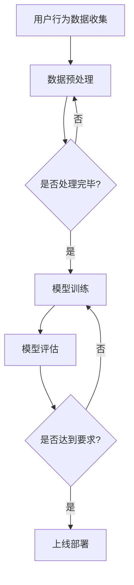

                 

# AI大模型：优化电商平台用户体验一致性的新方法

## 关键词
- AI大模型
- 电商平台
- 用户体验
- 一致性
- 个性化推荐
- 智能搜索
- 用户行为分析

## 摘要
本文旨在探讨如何利用AI大模型优化电商平台用户体验的一致性。通过深入分析AI大模型的基本原理、技术发展以及其在电商平台的应用背景，本文提出了基于大模型的个性化推荐系统、智能搜索和用户行为分析等解决方案。文章还详细阐述了AI大模型优化用户体验一致性的方法、案例分析和面临的挑战，最后总结了最佳实践和未来发展趋势。

## 第一部分：AI大模型概述与原理

### 第1章：AI大模型：概念、技术发展与背景

#### 1.1 AI大模型定义与特点

AI大模型，指的是具有巨大参数量和强大学习能力的人工智能模型。它们能够从海量数据中提取特征，并用于各种复杂的任务，如自然语言处理、计算机视觉和推荐系统等。

**1.1.1 AI大模型的基本定义**

AI大模型，指的是参数量达到数十亿甚至千亿级的人工智能模型。这些模型通常是通过大规模预训练得到的，并具有强大的表征和学习能力。

**1.1.2 AI大模型的核心特点**

- **参数量巨大**：大模型的参数数量可以达到数十亿甚至千亿级。
- **强大的学习能力**：通过大规模预训练，大模型能够掌握通用知识，并在多个任务上表现出色。
- **高效性**：尽管参数量巨大，但现代计算技术的进步使得训练和推理效率大幅提升。

#### 1.2 AI大模型的技术发展

**1.2.1 大模型的起源与发展**

AI大模型的发展可以追溯到深度学习领域，特别是2013年左右，随着GPU计算能力的提升，神经网络的研究与应用迎来了新的高潮。

**1.2.2 主流大模型介绍**

- **GPT**：生成预训练变换器，用于自然语言处理。
- **BERT**：双向编码表示，用于文本理解和问答系统。
- **ViT**：视觉变换器，用于计算机视觉。

#### 1.3 AI大模型的应用背景

**1.3.1 电商平台与用户体验**

电商平台追求提升用户体验，以增加用户粘性并促进销售。个性化推荐、智能搜索和用户行为分析是电商平台常见的技术应用。

**1.3.2 大模型在电商领域的应用**

大模型技术为电商平台提供了优化用户体验的新方法，如个性化推荐系统、智能客服和广告投放优化。

### 第2章：优化电商平台用户体验的一致性

#### 2.1 用户体验一致性：定义与重要性

**2.1.1 用户体验一致性的概念**

用户体验一致性指的是用户在电商平台的不同交互中体验到的一致性和连贯性。

**2.1.2 用户体验一致性的重要性**

保持用户体验一致性有助于提升用户满意度和忠诚度，从而促进电商平台的长期发展。

#### 2.2 大模型在用户体验一致性中的应用

**2.2.1 个性化推荐系统的优化**

大模型可以基于用户的历史行为和偏好，提供更精准的个性化推荐，从而提升用户体验的一致性。

**2.2.2 智能搜索与信息检索**

大模型在智能搜索和检索中的应用能够提高搜索结果的准确性和相关性，提升用户体验。

**2.2.3 用户行为分析与预测**

通过大模型分析用户行为数据，电商平台可以更好地预测用户需求，提供更个性化的服务和产品。

### 第3章：AI大模型优化电商平台用户体验的一致性方法

#### 3.1 数据收集与处理

**3.1.1 数据收集**

电商平台需要收集大量的用户行为数据，如浏览记录、购买历史和用户反馈等。

**3.1.2 数据处理**

数据清洗、去噪和预处理是确保大模型训练质量的关键步骤。

#### 3.2 大模型训练与优化

**3.2.1 大模型训练**

使用大量标注数据进行预训练，然后通过迁移学习和微调对特定任务进行优化。

**3.2.2 模型优化**

通过调参和模型融合技术，提高大模型在电商平台上的性能。

#### 3.3 用户体验一致性评估

**3.3.1 评估指标**

采用用户满意度、推荐点击率和转化率等指标来评估用户体验一致性。

**3.3.2 评估方法**

通过A/B测试和用户反馈机制，持续优化用户体验一致性。

### 第4章：案例分析与实战经验

#### 4.1 案例一：电商平台个性化推荐系统

**4.1.1 案例背景**

介绍一个实际电商平台的个性化推荐系统案例。

**4.1.2 模型设计与实现**

详细描述大模型在个性化推荐系统中的应用，包括数据收集、模型训练和评估过程。

#### 4.2 案例二：智能搜索与信息检索

**4.2.1 案例背景**

分析一个电商平台的智能搜索系统案例。

**4.2.2 模型设计与实现**

描述大模型在智能搜索中的应用，以及如何提高搜索结果的准确性和用户体验。

### 第5章：AI大模型优化用户体验的一致性面临的挑战与未来趋势

#### 5.1 挑战

**5.1.1 数据隐私保护**

讨论如何在保证用户体验一致性的同时，保护用户隐私。

**5.1.2 模型可解释性**

分析大模型在电商应用中的可解释性问题，以及如何提高模型的可解释性。

#### 5.2 未来趋势

**5.2.1 新技术的应用**

探讨未来可能应用于电商平台用户体验一致性优化的新技术，如生成对抗网络（GAN）和联邦学习。

**5.2.2 用户体验一致性的创新**

预测未来电商平台在用户体验一致性方面可能出现的创新和应用方向。

### 第6章：AI大模型优化电商平台用户体验的一致性最佳实践

#### 6.1 实践步骤

提供具体的实施步骤，帮助电商平台利用AI大模型优化用户体验一致性。

#### 6.2 成功案例分析

分析一些成功的电商平台案例，总结他们的成功经验和教训。

#### 6.3 未来发展方向

探讨未来AI大模型优化用户体验一致性可能的发展方向，为电商平台提供战略建议。

### 第7章：总结与展望

#### 7.1 书籍总结

对全书内容进行总结，强调AI大模型在优化电商平台用户体验一致性方面的重要性和应用价值。

#### 7.2 展望未来

展望AI大模型技术在电商平台用户体验一致性优化领域的未来发展趋势和应用前景。

## 附录

### 附录A：参考资料与推荐阅读

**A.1 AI大模型相关书籍**

- **《深度学习》（Goodfellow, Bengio, Courville著）**
- **《动手学深度学习》（阿斯顿·张著）**

**A.2 电商平台相关书籍**

- **《电子商务：原理、实践与案例》（刘振江著）**
- **《电商运营实战：策略与技巧》（李明华著）**

**A.3 数据科学与机器学习资源**

- **Kaggle数据集**
- **GitHub上的开源项目和案例代码**

### 附录B：AI大模型工具与资源

**B.1 主流深度学习框架**

- **TensorFlow**
- **PyTorch**
- **Apache MXNet**

**B.2 数据处理与清洗工具**

- **Pandas**
- **NumPy**
- **Scikit-learn**

**B.3 电商平台技术选型指南**

- **阿里巴巴云平台**
- **腾讯云**
- **京东云**

### 附录C：Mermaid 流程图示例



### 附录D：伪代码示例

```python
# 伪代码：基于用户行为数据进行个性化推荐
function personalized_recommendation(user_data, model):
    # 加载预训练的大模型
    model = load_pretrained_model()

    # 预处理用户数据
    processed_data = preprocess_user_data(user_data)

    # 使用模型进行预测
    predictions = model.predict(processed_data)

    # 对预测结果进行排序，获取推荐列表
    recommendation_list = sort_predictions(predictions)

    # 返回推荐列表
    return recommendation_list
```

### 附录E：数学模型与公式

**1. 个性化推荐中的相似度计算**

$$
similarity(A, B) = \frac{A \cdot B}{\|A\| \|B\|}
$$

其中，$A$ 和 $B$ 是用户 $A$ 和 $B$ 的特征向量，$\|A\|$ 和 $\|B\|$ 分别是它们的欧几里得范数。

**2. 模型损失函数**

$$
Loss = -\sum_{i=1}^{N} y_i \log(p(y_i|x_i))
$$

其中，$y_i$ 是实际标签，$p(y_i|x_i)$ 是模型对 $x_i$ 的预测概率。

**3. 预训练模型中的自注意力机制**

$$
\text{Attention}(Q, K, V) = \frac{QK^T}{\sqrt{d_k}} + V
$$

其中，$Q$ 是查询向量，$K$ 是键向量，$V$ 是值向量，$d_k$ 是键向量的维度。

## 文章标题

# AI大模型：优化电商平台用户体验一致性的新方法

### 文章关键词

- AI大模型
- 电商平台
- 用户体验
- 一致性
- 个性化推荐
- 智能搜索
- 用户行为分析

### 文章摘要

本文旨在探讨如何利用AI大模型优化电商平台用户体验的一致性。通过深入分析AI大模型的基本原理、技术发展以及其在电商平台的应用背景，本文提出了基于大模型的个性化推荐系统、智能搜索和用户行为分析等解决方案。文章还详细阐述了AI大模型优化用户体验一致性的方法、案例分析和面临的挑战，最后总结了最佳实践和未来发展趋势。

## 第一部分：AI大模型概述与原理

### 第1章：AI大模型：概念、技术发展与背景

#### 1.1 AI大模型定义与特点

AI大模型，指的是具有巨大参数量和强大学习能力的人工智能模型。它们能够从海量数据中提取特征，并用于各种复杂的任务，如自然语言处理、计算机视觉和推荐系统等。

**1.1.1 AI大模型的基本定义**

AI大模型，指的是参数量达到数十亿甚至千亿级的人工智能模型。这些模型通常是通过大规模预训练得到的，并具有强大的表征和学习能力。

**1.1.2 AI大模型的核心特点**

- **参数量巨大**：大模型的参数数量可以达到数十亿甚至千亿级。
- **强大的学习能力**：通过大规模预训练，大模型能够掌握通用知识，并在多个任务上表现出色。
- **高效性**：尽管参数量巨大，但现代计算技术的进步使得训练和推理效率大幅提升。

#### 1.2 AI大模型的技术发展

**1.2.1 大模型的起源与发展**

AI大模型的发展可以追溯到深度学习领域，特别是2013年左右，随着GPU计算能力的提升，神经网络的研究与应用迎来了新的高潮。

**1.2.2 主流大模型介绍**

- **GPT**：生成预训练变换器，用于自然语言处理。
- **BERT**：双向编码表示，用于文本理解和问答系统。
- **ViT**：视觉变换器，用于计算机视觉。

#### 1.3 AI大模型的应用背景

**1.3.1 电商平台与用户体验**

电商平台追求提升用户体验，以增加用户粘性并促进销售。个性化推荐、智能搜索和用户行为分析是电商平台常见的技术应用。

**1.3.2 大模型在电商领域的应用**

大模型技术为电商平台提供了优化用户体验的新方法，如个性化推荐系统、智能客服和广告投放优化。

### 第2章：优化电商平台用户体验的一致性

#### 2.1 用户体验一致性：定义与重要性

**2.1.1 用户体验一致性的概念**

用户体验一致性指的是用户在电商平台的不同交互中体验到的一致性和连贯性。

**2.1.2 用户体验一致性的重要性**

保持用户体验一致性有助于提升用户满意度和忠诚度，从而促进电商平台的长期发展。

#### 2.2 大模型在用户体验一致性中的应用

**2.2.1 个性化推荐系统的优化**

大模型可以基于用户的历史行为和偏好，提供更精准的个性化推荐，从而提升用户体验的一致性。

**2.2.2 智能搜索与信息检索**

大模型在智能搜索和检索中的应用能够提高搜索结果的准确性和相关性，提升用户体验。

**2.2.3 用户行为分析与预测**

通过大模型分析用户行为数据，电商平台可以更好地预测用户需求，提供更个性化的服务和产品。

### 第3章：AI大模型优化电商平台用户体验的一致性方法

#### 3.1 数据收集与处理

**3.1.1 数据收集**

电商平台需要收集大量的用户行为数据，如浏览记录、购买历史和用户反馈等。

**3.1.2 数据处理**

数据清洗、去噪和预处理是确保大模型训练质量的关键步骤。

#### 3.2 大模型训练与优化

**3.2.1 大模型训练**

使用大量标注数据进行预训练，然后通过迁移学习和微调对特定任务进行优化。

**3.2.2 模型优化**

通过调参和模型融合技术，提高大模型在电商平台上的性能。

#### 3.3 用户体验一致性评估

**3.3.1 评估指标**

采用用户满意度、推荐点击率和转化率等指标来评估用户体验一致性。

**3.3.2 评估方法**

通过A/B测试和用户反馈机制，持续优化用户体验一致性。

### 第4章：案例分析与实战经验

#### 4.1 案例一：电商平台个性化推荐系统

**4.1.1 案例背景**

介绍一个实际电商平台的个性化推荐系统案例。

**4.1.2 模型设计与实现**

详细描述大模型在个性化推荐系统中的应用，包括数据收集、模型训练和评估过程。

#### 4.2 案例二：智能搜索与信息检索

**4.2.1 案例背景**

分析一个电商平台的智能搜索系统案例。

**4.2.2 模型设计与实现**

描述大模型在智能搜索中的应用，以及如何提高搜索结果的准确性和用户体验。

### 第5章：AI大模型优化用户体验的一致性面临的挑战与未来趋势

#### 5.1 挑战

**5.1.1 数据隐私保护**

讨论如何在保证用户体验一致性的同时，保护用户隐私。

**5.1.2 模型可解释性**

分析大模型在电商应用中的可解释性问题，以及如何提高模型的可解释性。

#### 5.2 未来趋势

**5.2.1 新技术的应用**

探讨未来可能应用于电商平台用户体验一致性优化的新技术，如生成对抗网络（GAN）和联邦学习。

**5.2.2 用户体验一致性的创新**

预测未来电商平台在用户体验一致性方面可能出现的创新和应用方向。

### 第6章：AI大模型优化电商平台用户体验的一致性最佳实践

#### 6.1 实践步骤

提供具体的实施步骤，帮助电商平台利用AI大模型优化用户体验一致性。

#### 6.2 成功案例分析

分析一些成功的电商平台案例，总结他们的成功经验和教训。

#### 6.3 未来发展方向

探讨未来AI大模型优化用户体验一致性可能的发展方向，为电商平台提供战略建议。

### 第7章：总结与展望

#### 7.1 书籍总结

对全书内容进行总结，强调AI大模型在优化电商平台用户体验一致性方面的重要性和应用价值。

#### 7.2 展望未来

展望AI大模型技术在电商平台用户体验一致性优化领域的未来发展趋势和应用前景。

## 附录

### 附录A：参考资料与推荐阅读

**A.1 AI大模型相关书籍**

- **《深度学习》（Goodfellow, Bengio, Courville著）**
- **《动手学深度学习》（阿斯顿·张著）**

**A.2 电商平台相关书籍**

- **《电子商务：原理、实践与案例》（刘振江著）**
- **《电商运营实战：策略与技巧》（李明华著）**

**A.3 数据科学与机器学习资源**

- **Kaggle数据集**
- **GitHub上的开源项目和案例代码**

### 附录B：AI大模型工具与资源

**B.1 主流深度学习框架**

- **TensorFlow**
- **PyTorch**
- **Apache MXNet**

**B.2 数据处理与清洗工具**

- **Pandas**
- **NumPy**
- **Scikit-learn**

**B.3 电商平台技术选型指南**

- **阿里巴巴云平台**
- **腾讯云**
- **京东云**

### 附录C：Mermaid 流程图示例


### 附录D：伪代码示例

```python
# 伪代码：基于用户行为数据进行个性化推荐
function personalized_recommendation(user_data, model):
    # 加载预训练的大模型
    model = load_pretrained_model()

    # 预处理用户数据
    processed_data = preprocess_user_data(user_data)

    # 使用模型进行预测
    predictions = model.predict(processed_data)

    # 对预测结果进行排序，获取推荐列表
    recommendation_list = sort_predictions(predictions)

    # 返回推荐列表
    return recommendation_list
```

### 附录E：数学模型与公式

**1. 个性化推荐中的相似度计算**

$$
similarity(A, B) = \frac{A \cdot B}{\|A\| \|B\|}
$$

其中，$A$ 和 $B$ 是用户 $A$ 和 $B$ 的特征向量，$\|A\|$ 和 $\|B\|$ 分别是它们的欧几里得范数。

**2. 模型损失函数**

$$
Loss = -\sum_{i=1}^{N} y_i \log(p(y_i|x_i))
$$

其中，$y_i$ 是实际标签，$p(y_i|x_i)$ 是模型对 $x_i$ 的预测概率。

**3. 预训练模型中的自注意力机制**

$$
\text{Attention}(Q, K, V) = \frac{QK^T}{\sqrt{d_k}} + V
$$

其中，$Q$ 是查询向量，$K$ 是键向量，$V$ 是值向量，$d_k$ 是键向量的维度。

