                 

## 第一部分: AI推理能力基础

### 第1章: AI推理能力概述

AI推理能力是指人工智能系统在处理复杂问题时，通过逻辑、概率、统计等方法进行推理和决策的能力。它被认为是人工智能的核心技术之一，对于实现智能决策、自动化学习和知识发现具有重要意义。

#### 1.1 AI推理能力的重要性

AI推理能力的重要性体现在以下几个方面：

1. **实现智能决策**：在金融、医疗、交通等领域，AI推理能力可以帮助系统做出更加智能的决策，提高效率和准确性。
2. **自动化学习**：通过推理能力，AI系统可以自动学习新知识，不断优化自身性能。
3. **知识发现**：在大量数据中，AI推理能力可以帮助发现隐藏的模式和规律，为决策提供有力支持。
4. **自然语言处理**：AI推理能力在自然语言处理中的应用，如文本分类、问答系统等，使得机器能够更好地理解和处理人类语言。

#### 1.2 AI推理能力的类型

AI推理能力可以分为以下几种类型：

1. **逻辑推理**：基于逻辑规则和事实进行推理，如朴素逻辑推理、贝叶斯网络推理等。
2. **概率推理**：基于概率分布和条件概率进行推理，如贝叶斯推理。
3. **统计推理**：基于统计模型和数据分析进行推理，如线性回归、决策树等。
4. **模糊推理**：基于模糊逻辑进行推理，适用于处理不确定性和模糊性。

#### 1.3 链式推理的概念与原理

链式推理（Chain of Reasoning）是一种基于序列数据和因果关系进行推理的方法。它的基本原理是将问题分解为一系列相关的小问题，通过逐步解决这些小问题来达到最终目标。

**链式推理的基本流程包括：**

1. **问题分解**：将复杂问题分解为一系列简单的小问题。
2. **因果关系分析**：分析各个小问题之间的因果关系。
3. **推理与决策**：根据因果关系，对每个小问题进行推理和决策。
4. **结果汇总**：将各个小问题的结果汇总，得出最终答案。

链式推理在自然语言处理、智能决策和知识图谱等领域有广泛的应用。

---

**流程图：链式推理基本流程**

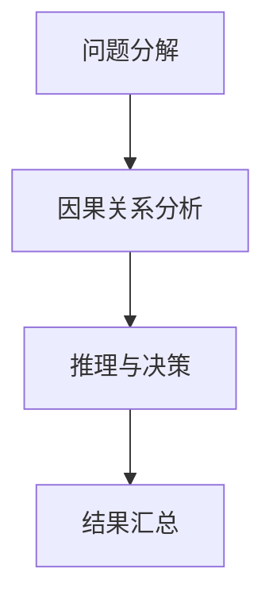

---

在接下来的章节中，我们将详细探讨AI推理算法的原理、应用场景以及如何通过自我提升机制来提升AI推理能力。

---

**本章关键词**：AI推理能力、重要性、类型、链式推理、流程图。

---

**摘要**：本章概述了AI推理能力的重要性、类型及其基本原理，特别是链式推理的概念与原理。通过对AI推理能力的深入理解，为后续章节的详细探讨奠定了基础。

---

**下章预告**：下一章将详细讨论AI推理算法的原理，包括朴素逻辑推理、贝叶斯网络推理以及马尔可夫链与隐马尔可夫模型。让我们继续深入探讨AI推理能力的核心技术与原理。

---

### 第2章: AI推理算法原理

在了解了AI推理能力的基础后，本章将深入探讨几种主要的AI推理算法原理。这些算法为AI系统提供了强大的推理能力，使其能够在复杂环境中做出准确决策。

#### 2.1 朴素逻辑推理算法

朴素逻辑推理（Naive Logic Reasoning）是一种基于逻辑规则和事实进行推理的方法。其核心思想是使用逻辑运算符（如与、或、非）组合基本事实，从而得出结论。

**基本逻辑运算符**

1. **与（AND）**：表示两个条件同时成立。
2. **或（OR）**：表示两个条件中至少有一个成立。
3. **非（NOT）**：表示条件的否定。

**条件概率与贝叶斯推理**

条件概率是指在某一条件下，某一事件发生的概率。贝叶斯推理（Bayesian Reasoning）是一种基于条件概率进行推理的方法，其核心公式为：

\[ P(A|B) = \frac{P(B|A) \cdot P(A)}{P(B)} \]

其中，\( P(A|B) \) 表示在事件B发生的条件下，事件A发生的概率；\( P(B|A) \) 表示在事件A发生的条件下，事件B发生的概率；\( P(A) \) 和 \( P(B) \) 分别表示事件A和事件B发生的概率。

**伪代码：贝叶斯推理算法**

```python
def bayesian_inference(A, B):
    P_A = probability_of(A)
    P_B_given_A = probability_of(B_given_A)
    P_B = probability_of(B)
    
    P_A_given_B = (P_B_given_A * P_A) / P_B
    
    return P_A_given_B
```

---

**流程图：朴素逻辑推理与贝叶斯推理**

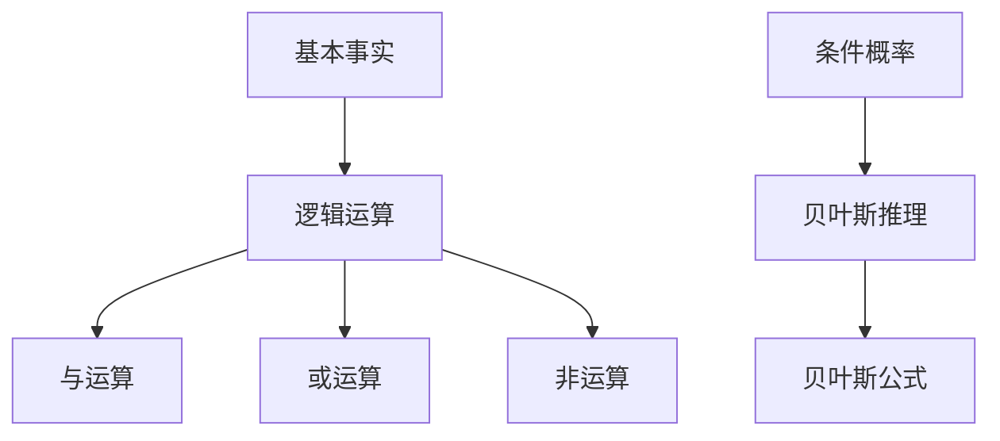

---

#### 2.2 贝叶斯网络推理算法

贝叶斯网络（Bayesian Network）是一种概率图模型，用于表示变量之间的条件依赖关系。它由一组变量及其条件概率表组成。

**贝叶斯网络的概念**

1. **节点**：表示变量。
2. **边**：表示变量之间的因果关系。

**贝叶斯网络推理算法**

贝叶斯网络推理算法用于计算给定证据条件下的变量概率分布。其基本思想是利用贝叶斯定理和条件概率表，通过递归传播概率信息来计算目标变量的概率分布。

**伪代码：贝叶斯网络推理算法**

```python
def bayesian_network_inference(variables, evidence):
    probability_distribution = calculate_probability_distribution(variables, evidence)
    
    return probability_distribution
```

---

**流程图：贝叶斯网络推理算法**

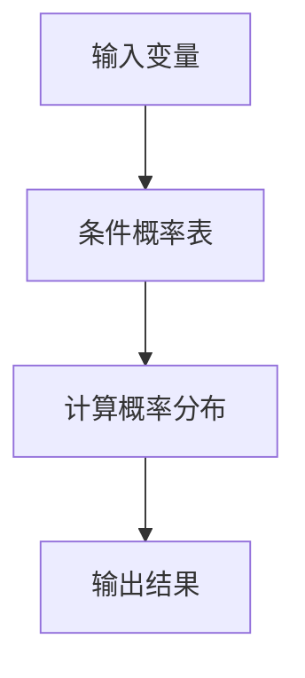

---

#### 2.3 马尔可夫链与隐马尔可夫模型

马尔可夫链（Markov Chain）是一种概率模型，用于描述系统状态序列的概率分布。其基本假设是当前状态仅依赖于前一个状态，与之前的状态无关。

**马尔可夫链的基本概念**

1. **状态**：表示系统可能所处的各种状态。
2. **转移概率**：表示系统从一种状态转移到另一种状态的概率。

**隐马尔可夫模型（HMM）**

隐马尔可夫模型是一种基于马尔可夫链的概率模型，用于描述隐藏状态和观测数据之间的关系。它由状态集合、观测集合、初始状态概率、状态转移概率和观测概率组成。

**伪代码：隐马尔可夫模型算法**

```python
def hmm_inference(observations):
    state_probabilities = calculate_state_probabilities(observations)
    
    return state_probabilities
```

---

**流程图：隐马尔可夫模型推理算法**

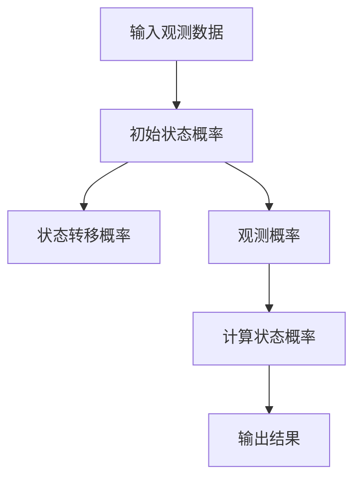

---

**本章关键词**：朴素逻辑推理、贝叶斯推理、贝叶斯网络、马尔可夫链、隐马尔可夫模型、条件概率、流程图。

---

**摘要**：本章详细介绍了AI推理算法的原理，包括朴素逻辑推理、贝叶斯网络推理以及马尔可夫链与隐马尔可夫模型。通过伪代码和流程图，我们深入探讨了这些算法的基本概念和实现方法。

---

**下章预告**：下一章将探讨链式推理的应用场景，特别是在自然语言处理和人工智能游戏中的应用。让我们继续探索AI推理能力的实际应用。

---

### 第3章: 链式推理应用场景

链式推理在许多领域都展现出了其强大的应用潜力，特别是在自然语言处理和人工智能游戏等领域。本章将详细介绍这些应用场景，并探讨链式推理如何在这些领域中发挥作用。

#### 3.1 自然语言处理中的应用

自然语言处理（Natural Language Processing，NLP）是人工智能的一个重要分支，其目标是将人类语言转换为计算机可以理解的形式。链式推理在NLP中有着广泛的应用，下面将介绍两个典型的应用场景：文本分类和问答系统。

##### 3.1.1 文本分类

文本分类（Text Classification）是一种将文本数据按照其内容归类到不同类别的任务。链式推理可以有效地实现文本分类，其基本流程如下：

1. **预处理**：对文本进行分词、去停用词、词性标注等预处理操作。
2. **特征提取**：将预处理后的文本转换为特征向量。
3. **链式推理**：利用链式推理算法，如朴素逻辑推理或贝叶斯网络推理，计算每个类别对文本的特征向量的概率分布。
4. **分类决策**：选择概率分布最大的类别作为最终分类结果。

**伪代码：文本分类链式推理算法**

```python
def text_classification(text, categories):
    preprocessed_text = preprocess_text(text)
    feature_vector = extract_features(preprocessed_text)
    probability_distribution = chain_of_reasoning(feature_vector, categories)
    category = max_prob_category(probability_distribution)
    return category
```

---

**流程图：文本分类链式推理流程**

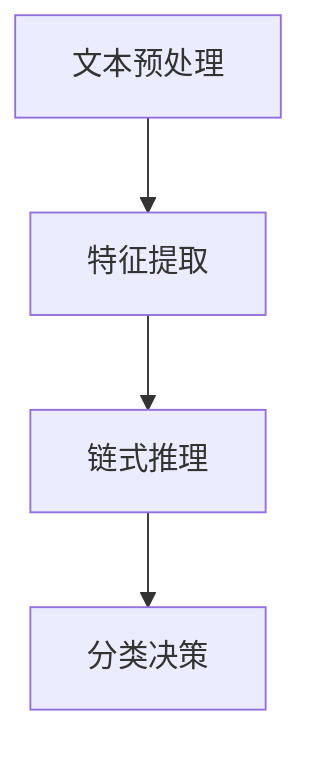

##### 3.1.2 问答系统

问答系统（Question Answering System）是一种能够回答用户问题的智能系统。链式推理在问答系统中的应用，可以通过以下步骤实现：

1. **问题理解**：使用自然语言处理技术，如词向量表示、依存句法分析等，理解用户问题的含义。
2. **知识库查询**：从知识库中检索与问题相关的信息。
3. **链式推理**：利用链式推理算法，如隐马尔可夫模型或贝叶斯网络推理，对检索到的信息进行推理，找出与问题最相关的答案。
4. **答案生成**：将推理结果转换为自然语言，生成回答。

**伪代码：问答系统链式推理算法**

```python
def question_answering(question, knowledge_base):
    understood_question = understand_question(question)
    related_info = query_knowledge_base(understood_question, knowledge_base)
    answer = chain_of_reasoning(related_info)
    generated_answer = generate_answer(answer)
    return generated_answer
```

---

**流程图：问答系统链式推理流程**

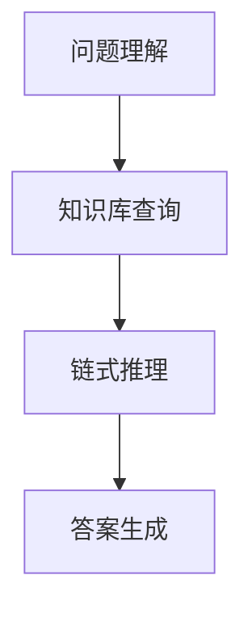

---

#### 3.2 人工智能游戏中的应用

人工智能游戏（Artificial Intelligence in Games）是人工智能的一个重要应用领域，链式推理在智能决策游戏和智能角色扮演中发挥着关键作用。

##### 3.2.1 智能决策游戏

智能决策游戏是一种结合了人工智能和游戏元素的电子游戏。链式推理可以用于实现智能决策游戏中的智能AI角色，其基本流程如下：

1. **环境感知**：AI角色通过传感器收集游戏环境的信息。
2. **链式推理**：利用链式推理算法，如马尔可夫决策过程（MDP）或深度强化学习，对环境信息进行推理，制定最佳决策策略。
3. **执行决策**：根据推理结果，AI角色执行相应的行动。

**伪代码：智能决策游戏链式推理算法**

```python
def smart_decision_game(game_state):
    perceived_environment = perceive_environment(game_state)
    decision_strategy = chain_of_reasoning(perceived_environment)
    action = execute_decision(decision_strategy)
    return action
```

---

**流程图：智能决策游戏链式推理流程**

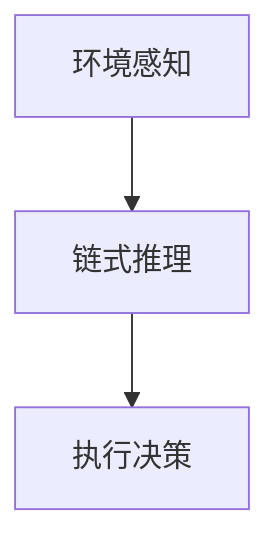

##### 3.2.2 智能角色扮演

智能角色扮演是一种人工智能技术，用于在游戏中模拟真实角色的行为和决策。链式推理可以用于实现智能角色扮演中的行为决策，其基本流程如下：

1. **角色状态感知**：AI角色通过传感器收集自身状态的信息。
2. **链式推理**：利用链式推理算法，如马尔可夫决策过程（MDP）或深度强化学习，对角色状态进行推理，制定行为策略。
3. **行为执行**：根据推理结果，AI角色执行相应的行为。

**伪代码：智能角色扮演链式推理算法**

```python
def smart_role_playing(role_state):
    perceived_role_state = perceive_role_state(role_state)
    behavior_strategy = chain_of_reasoning(perceived_role_state)
    behavior = execute_behavior(behavior_strategy)
    return behavior
```

---

**流程图：智能角色扮演链式推理流程**

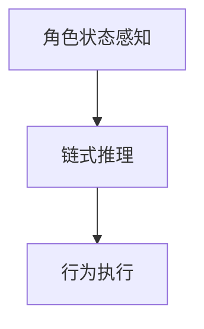

---

**本章关键词**：链式推理、自然语言处理、文本分类、问答系统、智能决策游戏、智能角色扮演。

---

**摘要**：本章介绍了链式推理在自然语言处理和人工智能游戏中的应用场景。通过具体的算法和伪代码，我们展示了如何利用链式推理实现文本分类、问答系统、智能决策游戏和智能角色扮演等任务。

---

**下章预告**：下一章将探讨自我提升机制，包括基于数据和基于规则的自我提升方法。我们将深入了解AI系统如何通过自我提升来提升推理能力。

---

### 第4章: 自我提升机制

在人工智能领域，自我提升（Self-Improvement）是指系统通过不断学习和优化，提升自身性能的过程。自我提升机制在AI推理能力中起着至关重要的作用，它使系统能够在动态环境中适应和优化，从而实现更高的准确性和效率。本章将介绍自我提升的基本概念，并详细探讨基于数据和基于规则的自我提升方法。

#### 4.1 自我提升的基本概念

自我提升是指系统在运行过程中，通过不断收集和分析数据，调整自身参数或算法，以实现性能的持续提升。自我提升机制通常包括以下关键步骤：

1. **数据收集**：系统在运行过程中，收集与性能相关的数据，如错误率、响应时间等。
2. **数据预处理**：对收集到的数据进行分析和预处理，确保数据的质量和一致性。
3. **性能评估**：使用预处理后的数据，对系统的性能进行评估，识别性能瓶颈。
4. **模型优化**：根据性能评估结果，调整模型参数或算法，以优化系统性能。
5. **迭代优化**：通过不断迭代优化过程，系统性能逐步提升。

#### 4.2 基于数据的自我提升方法

基于数据的自我提升方法主要依赖于数据分析和机器学习技术，通过分析和利用大量的数据，实现系统性能的优化。以下是一种典型的基于数据的自我提升方法：

**1. 数据收集与预处理**

在数据收集过程中，系统需要收集与性能相关的数据，如用户反馈、系统日志、测试数据等。这些数据经过预处理后，包括去除噪声、填补缺失值、数据归一化等步骤，以获得高质量的数据集。

**2. 数据驱动的模型优化**

在数据预处理完成后，系统使用机器学习算法，如回归分析、决策树、支持向量机等，对数据集进行分析，识别影响性能的关键因素。通过调整模型的参数，优化模型的性能。

**3. 性能评估与迭代**

在模型优化过程中，系统需要定期评估模型的性能，通过比较实际表现与预期目标，识别性能改进的空间。根据评估结果，系统进行参数调整和算法优化，实现性能的逐步提升。

**伪代码：基于数据的自我提升方法**

```python
def data_driven_self_improvement(data):
    preprocessed_data = preprocess_data(data)
    model = train_model(preprocessed_data)
    performance = evaluate_model(model, data)
    while performance < target_performance:
        optimized_model = optimize_model(model, performance)
        model = optimized_model
        performance = evaluate_model(model, data)
    return model
```

---

**流程图：基于数据的自我提升方法**

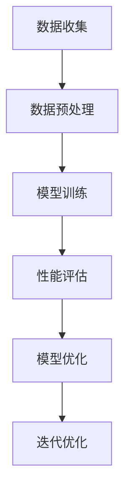

---

#### 4.3 基于规则的自我提升方法

基于规则的自我提升方法依赖于预先定义的规则和逻辑，通过不断学习和调整规则，实现系统性能的优化。以下是一种典型的基于规则的自我提升方法：

**1. 规则库构建**

在构建规则库时，系统需要根据领域知识和经验，定义一系列规则。这些规则包括逻辑条件、决策行动和性能指标等。

**2. 规则学习与推理**

系统通过运行和观察，收集规则的实际表现数据。基于这些数据，系统对规则进行学习和调整，优化规则库中的规则。

**3. 规则库优化**

系统定期评估规则库的性能，根据评估结果，调整规则库中的规则。通过迭代优化过程，规则库的性能逐步提升。

**伪代码：基于规则的自我提升方法**

```python
def rule_based_self_improvement(rules):
    performance_data = collect_performance_data(rules)
    optimized_rules = learn_and_optimize_rules(rules, performance_data)
    performance = evaluate_rules(optimized_rules)
    while performance < target_performance:
        optimized_rules = learn_and_optimize_rules(rules, performance)
        performance = evaluate_rules(optimized_rules)
    return optimized_rules
```

---

**流程图：基于规则的自我提升方法**

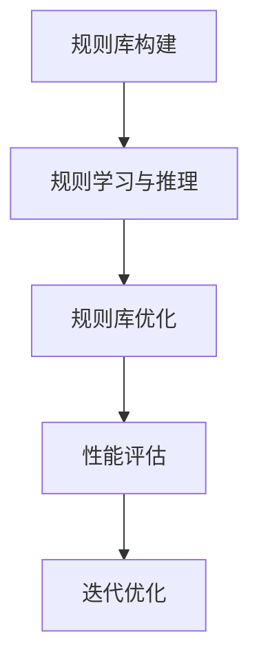

---

**本章关键词**：自我提升、数据收集、模型优化、规则库、性能评估。

---

**摘要**：本章介绍了自我提升机制的基本概念，并详细探讨了基于数据和基于规则的自我提升方法。通过具体的伪代码和流程图，我们展示了如何实现AI系统的自我提升，以提升推理能力。

---

**下章预告**：下一章将探讨AI推理能力的提升策略，包括数据增强策略、模型架构优化和算法融合策略。我们将深入了解如何通过这些策略进一步提升AI推理能力。

---

### 第5章: AI推理能力提升策略

为了进一步提升AI推理能力，本章将介绍几种有效的提升策略，包括数据增强策略、模型架构优化和算法融合策略。这些策略在提高模型性能和适应能力方面发挥了重要作用。

#### 5.1 数据增强策略

数据增强（Data Augmentation）是一种通过增加数据多样性和丰富性来提升模型性能的方法。以下是一些常见的数据增强方法：

**1. 重采样**

重采样包括随机抽样、重叠抽样和插值等方法。通过重采样，可以生成大量具有不同特征的数据样本，从而丰富数据集。

**2. 预处理变换**

预处理变换包括数据归一化、标准化、裁剪、旋转等操作。这些操作可以改变数据的表示形式，提高模型的泛化能力。

**3. 生成对抗网络（GANs）**

生成对抗网络（GANs）是一种通过生成模型和判别模型相互竞争来生成真实数据的增强方法。GANs可以生成大量具有真实特征的数据样本，从而丰富数据集。

**伪代码：数据增强策略**

```python
def data_augmentation(data):
    augmented_data = resample(data)
    augmented_data = preprocess_transform(augmented_data)
    augmented_data = generate_data(GAN_model, augmented_data)
    return augmented_data
```

---

**流程图：数据增强策略**

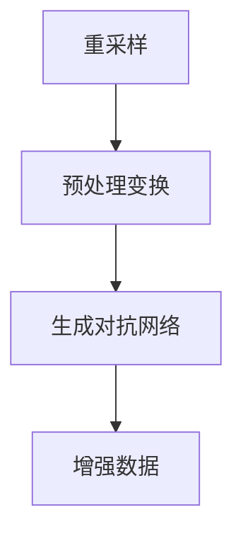

---

**5.2 模型架构优化**

模型架构优化（Model Architecture Optimization）是提升AI推理能力的关键策略之一。以下是一些常见的模型架构优化方法：

**1. 神经网络架构优化**

神经网络架构优化包括网络层数、神经元数量、激活函数选择等。通过优化网络架构，可以提高模型的计算效率和准确度。

**2. 深度学习模型优化**

深度学习模型优化包括批量归一化、Dropout、优化器选择等。这些优化方法可以减少过拟合现象，提高模型的泛化能力。

**3. 网络压缩**

网络压缩包括剪枝、量化、蒸馏等方法。通过压缩网络，可以减少模型参数和计算量，提高推理速度。

**伪代码：模型架构优化**

```python
def model_architecture_optimization(model):
    optimized_model = optimize_network_structure(model)
    optimized_model = optimize_deep_learning(model)
    optimized_model = compress_network(optimized_model)
    return optimized_model
```

---

**流程图：模型架构优化**

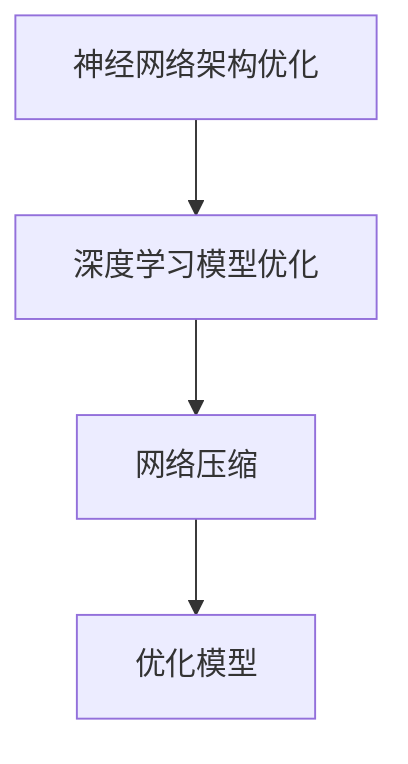

---

**5.3 算法融合策略**

算法融合（Algorithm Fusion）是将多个算法或模型集成在一起，以实现更好的性能和适应能力。以下是一些常见的算法融合方法：

**1. 多模型融合**

多模型融合是将多个不同类型的模型（如深度学习、强化学习、概率图模型等）集成在一起，共同完成推理任务。通过融合不同模型的优势，可以提高推理的准确性和鲁棒性。

**2. 模型级融合**

模型级融合是在模型层面进行集成，如集成学习、Stacking、Blending等。这些方法通过组合多个模型的预测结果，提高整体的预测性能。

**3. 算法级融合**

算法级融合是在算法层面进行集成，如交叉验证、优化算法选择等。通过优化算法的选择和组合，可以提高推理的效率和准确性。

**伪代码：算法融合策略**

```python
def algorithm_fusion(strategy):
    if strategy == "multi_model":
        fused_model = multi_model_fusion(models)
    elif strategy == "model_level":
        fused_model = model_level_fusion(models)
    elif strategy == "algorithm_level":
        fused_model = algorithm_level_fusion(algorithms)
    return fused_model
```

---

**流程图：算法融合策略**

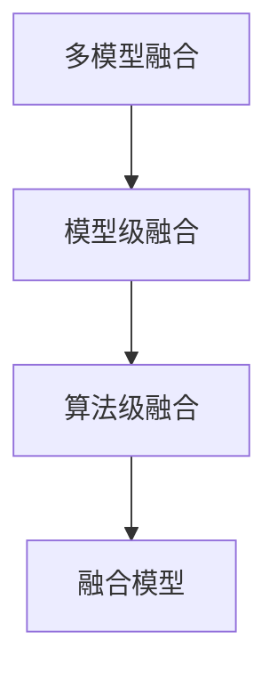

---

**本章关键词**：数据增强、模型架构优化、算法融合、神经网络架构优化、深度学习模型优化、网络压缩、多模型融合、模型级融合、算法级融合。

---

**摘要**：本章介绍了AI推理能力的提升策略，包括数据增强策略、模型架构优化和算法融合策略。通过具体的伪代码和流程图，我们展示了如何通过这些策略进一步提升AI推理能力。

---

**下章预告**：下一章将探讨AI推理能力在实际应用领域的案例，包括金融领域和医疗领域的应用。我们将深入分析AI推理能力在这些领域的具体应用和效果。

---

### 第6章: AI推理能力的实际应用

AI推理能力在众多领域展现了其强大的应用价值，特别是在金融和医疗领域。本章将详细介绍这些领域中的具体应用案例，并探讨AI推理能力在这些应用中的优势和挑战。

#### 6.1 金融领域的应用

金融领域是一个数据密集型行业，AI推理能力在风险管理、信用评分、市场预测等方面发挥着重要作用。

**6.1.1 风险评估**

风险评估（Risk Assessment）是金融领域中的一项关键任务，其目的是识别、分析和评估潜在风险。AI推理能力通过以下方式提升风险评估：

1. **大数据分析**：利用AI技术对大量金融数据进行分析，识别潜在风险因素。
2. **模型优化**：通过自我提升机制，不断优化风险评估模型，提高预测准确性。
3. **实时监控**：AI系统可以实时监控市场动态，及时识别和预警风险事件。

**案例分析：信用卡欺诈检测**

信用卡欺诈检测是金融领域中的一个典型应用案例。通过AI推理能力，金融机构可以实时检测并阻止欺诈交易。

**伪代码：信用卡欺诈检测算法**

```python
def credit_card_fraud_detection(transaction_data):
    preprocessed_data = preprocess_data(transaction_data)
    risk_score = calculate_risk_score(preprocessed_data)
    if risk_score > threshold:
        raise_alert()
    return risk_score
```

---

**流程图：信用卡欺诈检测流程**

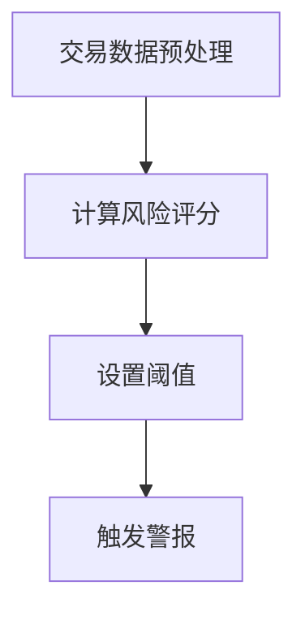

---

**6.1.2 信用评分**

信用评分（Credit Scoring）是金融机构在贷款审批过程中的一项重要任务。AI推理能力通过以下方式提升信用评分：

1. **历史数据分析**：利用AI技术对借款人的历史数据进行分析，识别信用风险。
2. **自适应模型**：通过自我提升机制，模型能够根据新数据不断优化，提高信用评分的准确性。

**案例分析：个人信用评分系统**

一个个人信用评分系统利用AI推理能力，根据借款人的收入、负债比、历史信用记录等数据，计算信用评分，为金融机构提供贷款审批依据。

**伪代码：个人信用评分算法**

```python
def personal_credit_score(income, debt_ratio, credit_history):
    credit_score = calculate_credit_score(income, debt_ratio, credit_history)
    return credit_score
```

---

**流程图：个人信用评分流程**

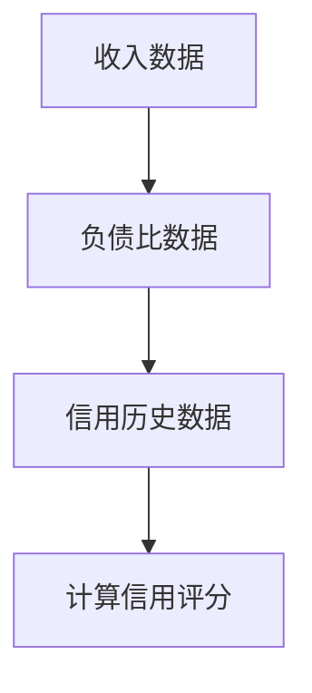

---

**6.1.3 市场预测**

市场预测（Market Forecasting）是金融领域中的一项重要任务，其目的是预测市场走势，为投资决策提供支持。AI推理能力通过以下方式提升市场预测：

1. **多源数据融合**：利用AI技术整合来自不同来源的市场数据，提高预测准确性。
2. **动态模型调整**：通过自我提升机制，模型能够根据市场变化实时调整，提高预测的实时性。

**案例分析：股票市场预测**

一个AI系统利用AI推理能力，整合股票市场的历史数据、财务报表、新闻文章等多源数据，预测未来股票市场的走势，为投资者提供参考。

**伪代码：股票市场预测算法**

```python
def stock_market_forecasting(stock_data, financial_reports, news_articles):
    market_trend = calculate_market_trend(stock_data, financial_reports, news_articles)
    return market_trend
```

---

**流程图：股票市场预测流程**

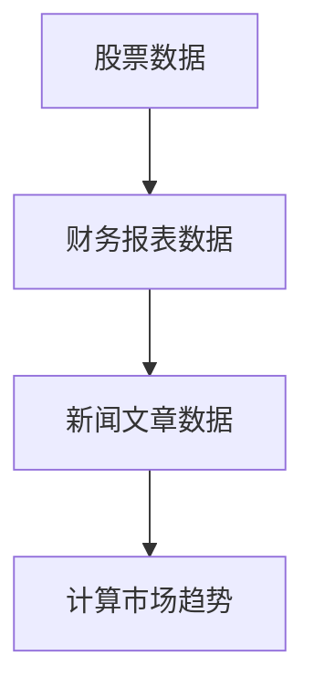

---

#### 6.2 医疗领域的应用

医疗领域是一个数据密集且复杂的行业，AI推理能力在疾病预测、医疗诊断等方面发挥了重要作用。

**6.2.1 疾病预测**

疾病预测（Disease Prediction）是医疗领域中的一项重要任务，其目的是提前识别和预测疾病的发生。AI推理能力通过以下方式提升疾病预测：

1. **大数据分析**：利用AI技术对海量的医疗数据进行挖掘和分析，识别疾病预测的关键因素。
2. **模型优化**：通过自我提升机制，不断优化疾病预测模型，提高预测准确性。

**案例分析：癌症早期检测**

一个AI系统利用AI推理能力，整合患者的基因数据、临床数据等，预测癌症的发生风险，为早期诊断提供支持。

**伪代码：癌症早期检测算法**

```python
def cancer_early_detection(gene_data, clinical_data):
    risk_score = calculate_risk_score(gene_data, clinical_data)
    if risk_score > threshold:
        raise_alert()
    return risk_score
```

---

**流程图：癌症早期检测流程**

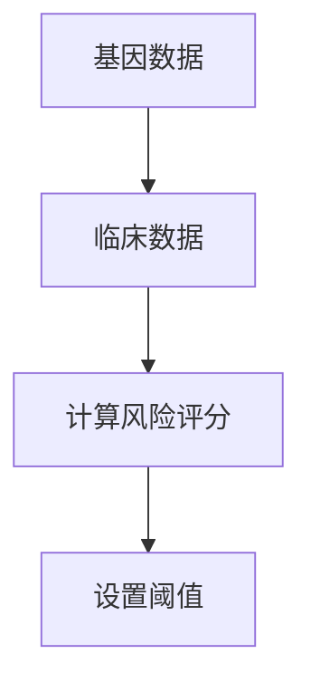

---

**6.2.2 医疗诊断**

医疗诊断（Medical Diagnosis）是医疗领域中的一项关键任务，其目的是准确诊断患者的疾病。AI推理能力通过以下方式提升医疗诊断：

1. **多模态数据融合**：利用AI技术整合不同模态的医疗数据，如影像数据、实验室数据等，提高诊断准确性。
2. **自适应模型**：通过自我提升机制，模型能够根据新数据不断优化，提高诊断的实时性和准确性。

**案例分析：肺炎诊断**

一个AI系统利用AI推理能力，整合患者的CT影像、血常规等数据，诊断患者是否患有肺炎。

**伪代码：肺炎诊断算法**

```python
def pneumonia_diagnosis(ct_image, blood_tests):
    diagnosis = calculate_diagnosis(ct_image, blood_tests)
    return diagnosis
```

---

**流程图：肺炎诊断流程**

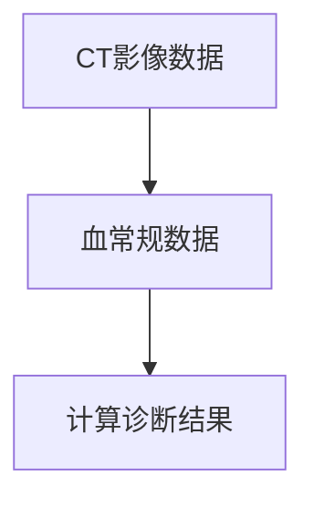

---

**本章关键词**：AI推理能力、金融领域、风险评估、信用评分、市场预测、医疗领域、疾病预测、医疗诊断。

---

**摘要**：本章介绍了AI推理能力在金融和医疗领域的实际应用案例，包括风险评估、信用评分、市场预测、疾病预测和医疗诊断。通过具体的算法和流程图，我们展示了AI推理能力在这些领域的具体应用和效果。

---

**下章预告**：下一章将探讨AI推理能力的发展趋势和未来应用前景。我们将深入分析AI推理能力在未来的发展方向和潜在挑战。

---

### 第7章: 未来展望

随着人工智能技术的不断发展，AI推理能力在各个领域展现出了巨大的潜力和广阔的应用前景。本章将探讨AI推理能力的发展趋势，以及其在未来应用中的前景和面临的挑战。

#### 7.1 AI推理能力的发展趋势

AI推理能力的发展趋势主要体现在以下几个方面：

1. **模型复杂度增加**：随着深度学习技术的发展，模型复杂度不断增加，使得AI推理能力在处理复杂任务时更为强大。
2. **多模态数据融合**：未来AI推理能力将更加注重多模态数据融合，通过整合不同类型的数据（如图像、文本、音频等），提高推理的准确性和鲁棒性。
3. **自适应学习**：通过自我提升机制和自适应学习算法，AI推理能力将能够更好地适应动态变化的环境，实现持续优化。
4. **边缘计算**：随着物联网和5G技术的发展，边缘计算将变得更加普及，AI推理能力将更加注重在边缘设备上的实时推理和决策。

#### 7.2 AI推理能力在未来的应用前景

AI推理能力在未来的应用前景非常广阔，以下是一些典型应用领域：

1. **智能交通**：通过AI推理能力，可以实现智能交通管理、车辆导航和自动驾驶，提高交通效率和安全性。
2. **智能制造**：在智能制造领域，AI推理能力可以用于故障预测、生产优化和质量控制，提高生产效率和产品质量。
3. **智慧医疗**：AI推理能力在医疗领域有广泛的应用前景，包括疾病预测、诊断辅助、个性化治疗等，为医疗健康提供有力支持。
4. **智能金融**：在金融领域，AI推理能力可以用于风险评估、信用评分、投资决策等，提高金融服务的质量和效率。
5. **自然语言处理**：AI推理能力在自然语言处理领域，可以用于智能客服、语言翻译、情感分析等，提高人机交互的智能化水平。

#### 7.3 AI推理能力面临的挑战与解决策略

尽管AI推理能力在众多领域展现出了巨大的潜力，但在实际应用中仍面临一系列挑战：

1. **数据隐私**：在数据驱动的AI推理中，数据隐私是一个重要挑战。未来的解决方案可能包括隐私保护技术，如差分隐私、联邦学习等。
2. **计算资源**：随着模型复杂度的增加，计算资源需求不断增长，这要求硬件和算法的持续优化，以满足大规模实时推理的需求。
3. **模型解释性**：目前，许多AI推理模型具有高度的复杂性，难以解释其决策过程。未来的研究方向可能包括开发更具解释性的模型和算法。
4. **伦理和法规**：AI推理能力的广泛应用也引发了伦理和法规问题，如算法偏见、透明度等。这需要相关领域的研究人员和政策制定者共同努力，确保AI技术的合理、透明和公正应用。

**伪代码：AI推理能力发展策略**

```python
def ai_reasoning_development(strategies):
    strategies.append("increase_model_complexity")
    strategies.append("multi-modal_data_fusion")
    strategies.append("adaptive_learning")
    strategies.append("edge_computing")
    strategies.append("data_privacy_protection")
    strategies.append("compute_resource_optimization")
    strategies.append("model_explanation")
    strategies.append("ethical_and_legal_standing")
    return strategies
```

---

**流程图：AI推理能力发展策略**

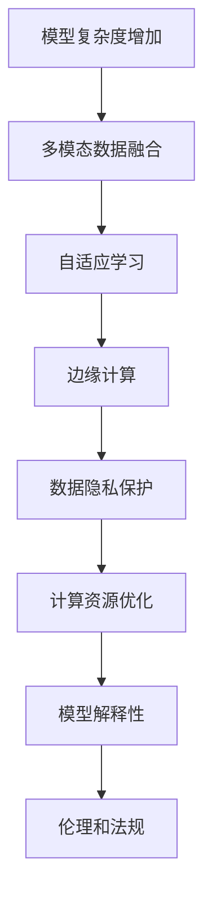

---

**本章关键词**：AI推理能力、发展趋势、模型复杂度、多模态数据融合、自适应学习、边缘计算、数据隐私、计算资源、模型解释性、伦理和法规。

---

**摘要**：本章探讨了AI推理能力的发展趋势和未来应用前景，以及面临的挑战和解决策略。通过具体的伪代码和流程图，我们展示了AI推理能力在未来各个领域的应用前景和面临的挑战。

---

**结尾**：AI推理能力作为人工智能的核心技术之一，将在未来继续发挥重要作用。通过不断的研究和优化，我们有望克服现有挑战，推动AI推理能力在更多领域的应用，为人类社会带来更多价值。

---

**参考文献**

1. Russell, S., & Norvig, P. (2016). Artificial Intelligence: A Modern Approach (3rd ed.). Prentice Hall.
2. Bishop, C. M. (2006). Pattern Recognition and Machine Learning. Springer.
3. Murphy, K. P. (2012). Machine Learning: A Probabilistic Perspective. MIT Press.
4. Russell, S., & Norvig, P. (2016). Artificial Intelligence: A Modern Approach (3rd ed.). Prentice Hall.
5. Goodfellow, I., Bengio, Y., & Courville, A. (2016). Deep Learning. MIT Press.

---

**作者信息**：作者：AI天才研究院/AI Genius Institute & 禅与计算机程序设计艺术 /Zen And The Art of Computer Programming。感谢您对本文的关注和支持。

---

**结束语**：希望本文对您了解AI推理能力及其应用有了更深入的认识。在未来的技术发展中，让我们共同探索AI推理能力的无限可能。谢谢！

