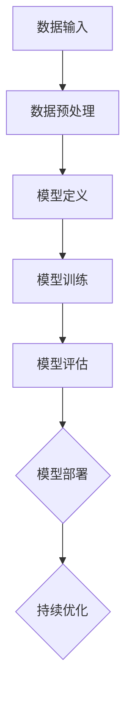

                 

### 1. AI时代个人技能培养的背景

#### 1.1 AI技术的发展现状与趋势

人工智能（AI）作为当今科技领域的热点，已经取得了显著的进展。从最初的规则系统到现代的深度学习模型，AI技术已经渗透到社会的方方面面。目前，AI技术在图像识别、自然语言处理、自动驾驶、医疗诊断等领域都取得了显著的成果。随着算法的进步、计算能力的提升以及数据资源的丰富，AI技术正以前所未有的速度发展。

**趋势分析**：

- **算法创新**：深度学习、强化学习等算法将继续发展，带来更高的精度和效率。
- **跨学科融合**：AI技术将与其他领域（如生物学、物理学、心理学等）深度融合，产生新的应用场景。
- **边缘计算**：随着物联网和5G技术的发展，边缘计算将使得AI在数据产生的地方进行处理，提高实时性和效率。
- **定制化AI**：未来的AI将更加注重个性化，针对特定场景和用户需求提供定制化解决方案。

#### 1.2 社会经济发展对个人技能的需求

随着AI技术的快速发展，社会对相关技能的需求也在不断增长。以下是几个关键点：

- **数据分析能力**：在数据驱动的时代，能够理解和分析数据的能力变得越来越重要。数据分析不仅能够帮助企业做出更明智的决策，还能在金融、医疗、市场营销等领域发挥关键作用。
- **机器学习与算法开发**：随着AI技术的普及，对机器学习工程师的需求也越来越大。这些工程师需要能够设计、实现和优化机器学习模型，以解决实际问题。
- **跨学科能力**：具备跨学科知识（如计算机科学、统计学、数学等）的个人将在AI领域具有更强的竞争力。这种跨学科能力有助于更好地理解和应用AI技术，推动创新。

#### 1.3 人工智能对职业岗位的影响

AI技术的快速发展不仅改变了人们的生产生活方式，也对职业岗位产生了深远的影响。以下是几个方面的分析：

- **自动化替代**：一些重复性高、结构化程度高的工作可能会被自动化技术取代，如制造业、客服等。然而，这也意味着出现了新的就业机会，如数据科学家、AI产品经理等。
- **技能需求变化**：随着AI技术的普及，许多职业岗位对技能的需求也在发生变化。例如，营销人员需要掌握数据分析技能，工程师需要熟悉AI技术，管理人员需要具备数据驱动的决策能力。
- **职业转型**：对于传统行业的从业人员，AI技术提供了新的转型机会。通过学习AI相关技能，他们可以进入新兴领域，实现职业升级。

综上所述，AI时代的个人技能培养已经成为不可忽视的重要课题。个人需要不断学习和适应新的技术趋势，提升自身竞争力。同时，教育机构和企业也需要积极调整培训体系，以适应AI时代的需求。

### 1.2 AI时代个人技能培养的重要方向

在AI时代，个人技能的培养方向尤为重要。以下是几个关键方向：

#### 1.2.1 数据科学与分析能力

数据科学是AI时代的核心领域之一。具备数据科学能力，不仅能够帮助个人在数据分析、数据挖掘等领域发挥重要作用，还能为企业的战略决策提供有力支持。以下是数据科学与分析能力培养的几个方面：

- **数据预处理**：数据预处理是数据科学的基础，包括数据清洗、数据整合、数据标准化等步骤。掌握这些技能，能够确保数据的质量，为后续分析提供可靠的数据基础。
- **统计分析**：统计学在数据科学中起着至关重要的作用。掌握常见的统计方法（如描述性统计、推断性统计、回归分析等），能够帮助个人进行数据分析和建模。
- **机器学习**：机器学习是数据科学的重要组成部分。掌握常见的机器学习算法（如线性回归、逻辑回归、决策树、随机森林等），能够帮助个人解决复杂的数据分析问题。

#### 1.2.2 机器学习与算法开发

机器学习是AI技术的核心，其应用范围广泛，从图像识别到自然语言处理，再到自动驾驶等。以下是机器学习与算法开发能力培养的几个方面：

- **算法原理**：掌握机器学习的基本原理，包括监督学习、无监督学习、强化学习等。了解不同算法的特点和应用场景，能够帮助个人更好地选择和设计算法。
- **模型开发**：学会使用常见的机器学习框架（如Scikit-learn、TensorFlow、PyTorch等），能够帮助个人开发高效的机器学习模型。
- **模型优化**：掌握模型优化技巧，如超参数调优、正则化、交叉验证等，能够提高模型的性能和泛化能力。

#### 1.2.3 人工智能应用创新

人工智能应用创新是推动社会进步的重要力量。在AI时代，个人需要具备创新思维，将AI技术应用到实际问题中，解决传统方法难以解决的难题。以下是人工智能应用创新能力培养的几个方面：

- **行业理解**：了解不同行业的现状和痛点，能够帮助个人更好地将AI技术应用于实际问题。
- **跨学科能力**：具备跨学科知识（如计算机科学、统计学、数学、心理学等）的个人，能够在AI应用创新中发挥更大的作用。
- **实战经验**：通过实际项目积累经验，能够帮助个人提升AI应用创新能力。

#### 1.2.4 技术趋势把握

AI技术不断演进，个人需要具备把握技术趋势的能力。以下是几个方面的建议：

- **持续学习**：AI技术更新迅速，个人需要保持持续学习的态度，关注最新的研究进展和技术动态。
- **交流合作**：加入技术社区，与同行交流合作，能够帮助个人更快地掌握新技术。
- **实践应用**：通过实际项目，将所学知识应用到实际问题中，能够帮助个人提升技术能力和解决实际问题的能力。

总之，在AI时代，个人技能的培养方向至关重要。通过在数据科学、机器学习、应用创新等方面的不断学习和实践，个人将能够更好地适应AI时代的发展，实现自身价值的提升。

### 1.3 AI技能培养的挑战与机遇

在AI时代，个人技能的培养既面临挑战，也充满机遇。以下是几个方面的探讨：

#### 1.3.1 技能快速更新的挑战

AI技术的快速发展带来了技能快速更新的挑战。以下是一些具体挑战：

- **知识更新**：AI技术不断更新，新的算法、工具和技术层出不穷。个人需要不断学习新的知识，以保持技能的先进性。
- **适应能力**：在技术快速变化的背景下，个人需要具备快速适应新环境的能力，能够灵活运用新技术解决实际问题。
- **学习成本**：随着AI技术的复杂度增加，学习成本也在上升。个人需要投入更多的时间和精力来掌握新技术，这对个人时间管理和学习资源提出了更高的要求。

#### 1.3.2 技能转型的机遇

尽管AI技能培养面临挑战，但也带来了技能转型的机遇。以下是一些转型机遇：

- **职业发展**：AI技术的普及为传统行业带来了新的职业机会。例如，数据分析、机器学习工程师等岗位的需求大幅增加，为从业人员提供了新的职业发展方向。
- **创新创业**：AI技术的应用为创新创业提供了广阔的空间。个人可以通过将AI技术应用于实际问题，开发新的产品和服务，实现创业梦想。
- **技能升级**：在AI时代，个人可以通过不断学习和实践，实现技能的升级和转型。例如，从传统的软件开发岗位转向AI相关岗位，从数据分析师转向数据科学家等。

#### 1.3.3 技能匹配与就业市场关系

技能匹配与就业市场的需求密切相关。以下是几个方面的探讨：

- **市场需求**：随着AI技术的普及，市场对具备AI技能的人才需求不断增加。具备AI技能的个人将更容易找到高薪、高发展潜力的职位。
- **教育体系**：教育体系需要与市场需求接轨，培养更多具备AI技能的人才。学校和教育机构需要调整课程设置，增加AI相关课程和实践项目。
- **职业规划**：个人需要根据市场需求和自身兴趣，制定明确的职业规划。通过不断学习和实践，提升自身技能，实现职业目标。

总之，在AI时代，个人技能的培养既面临挑战，也充满机遇。通过积极应对挑战，抓住机遇，个人将能够在AI领域实现自身价值，为社会发展贡献力量。

## 第2章：AI核心概念与架构

### 2.1 AI基本概念与术语解释

#### 2.1.1 人工智能、机器学习、深度学习

**人工智能**（Artificial Intelligence, AI）是指模拟、延伸和扩展人类智能的理论、方法、技术和应用系统。人工智能的目标是使计算机能够执行需要人类智能才能完成的任务，如理解自然语言、进行推理、解决问题和决策等。

**机器学习**（Machine Learning, ML）是人工智能的一个重要分支，侧重于开发算法和模型，使计算机系统能够从数据中学习，并通过经验改进性能。机器学习可以分为监督学习、无监督学习和强化学习三种主要类型。

- **监督学习**：通过标记数据训练模型，使其能够对未知数据进行预测或分类。常见的算法有线性回归、逻辑回归、决策树、随机森林和支持向量机等。
- **无监督学习**：在无标记数据下，模型学习数据的内在结构和规律。常见的算法有聚类、降维和关联规则学习等。
- **强化学习**：通过与环境交互，不断调整策略，以实现目标最大化。常见的算法有Q学习、深度Q网络（DQN）和策略梯度方法等。

**深度学习**（Deep Learning, DL）是机器学习的一种特殊形式，基于多层神经网络，通过大规模数据训练，实现高效特征学习和复杂任务处理。深度学习在图像识别、自然语言处理和语音识别等领域取得了显著成果。

#### 2.1.2 神经网络、模型、算法

**神经网络**（Neural Network, NN）是模仿生物神经系统的计算模型，由多个神经元（或节点）组成，通过神经元之间的连接（或权重）传递信息。神经网络可以用于回归、分类、聚类等多种任务。

- **前向传播**：信息从输入层传递到输出层，每个神经元计算输入与其权重的乘积，并通过激活函数进行处理。
- **反向传播**：计算输出误差，通过梯度下降算法调整权重，使模型在新的训练数据上表现更好。

**模型**（Model）是机器学习中的一个核心概念，用于表示问题和数据之间的关系。模型可以是线性模型、决策树、神经网络等。模型通过训练数据调整参数，以实现预测或分类任务。

**算法**（Algorithm）是一系列步骤，用于解决特定问题。在机器学习中，算法包括监督学习算法、无监督学习算法和强化学习算法等。常见的算法有线性回归、逻辑回归、决策树、随机森林、支持向量机、卷积神经网络（CNN）和循环神经网络（RNN）等。

#### 2.1.3 数据预处理、特征工程

**数据预处理**（Data Preprocessing）是机器学习流程中的重要步骤，用于将原始数据转换为适合模型训练的形式。数据预处理包括数据清洗、数据转换和数据归一化等。

- **数据清洗**：处理缺失值、异常值和重复数据，确保数据的质量和一致性。
- **数据转换**：将数据从一种形式转换为另一种形式，如将类别数据转换为数值数据。
- **数据归一化**：调整数据范围，使其具有相似的尺度，避免某些特征对模型产生过大的影响。

**特征工程**（Feature Engineering）是机器学习中的一个关键步骤，通过选择和构造特征，提高模型性能。特征工程包括特征选择、特征提取和特征变换等。

- **特征选择**：从原始特征中选择最具代表性的特征，减少模型的复杂度和计算成本。
- **特征提取**：通过算法将原始特征转换为新的特征，以增强模型的解释能力和泛化能力。
- **特征变换**：通过变换特征值，使其更适合模型训练，如使用正则化变换、归一化变换等。

### 2.2 AI系统架构与组件

一个完整的AI系统通常包括多个组件和层次，以下是常见的AI系统架构和组件：

#### 2.2.1 计算框架与平台

**计算框架**（Computational Framework）是AI系统的基础，用于定义模型结构、优化算法和数据处理流程。常见的计算框架有TensorFlow、PyTorch、Keras等。

- **TensorFlow**：由Google开发的开源计算框架，支持动态计算图和静态计算图模式，适用于各种规模的机器学习任务。
- **PyTorch**：由Facebook开发的开源计算框架，具有动态计算图特性，易于调试和扩展，适用于研究和个人项目。
- **Keras**：基于TensorFlow和Theano的开源计算框架，提供简洁的API，适用于快速原型开发和深度学习研究。

**计算平台**（Computational Platform）是运行计算框架的环境，提供计算资源和管理功能。常见的计算平台有GPU、TPU、云计算平台等。

- **GPU**（Graphics Processing Unit）：用于加速大规模矩阵运算和深度学习模型训练，具有高性能和低延迟。
- **TPU**（Tensor Processing Unit）：专门为深度学习任务设计的ASIC芯片，提供高性能的计算能力。
- **云计算平台**：如Google Cloud、AWS、Azure等，提供弹性计算资源和自动化管理功能，适用于大规模分布式训练和应用部署。

#### 2.2.2 数据管理与分析工具

**数据管理工具**（Data Management Tools）用于存储、处理和管理数据，确保数据的一致性、完整性和可用性。常见的数据管理工具包括Hadoop、Spark、数据库等。

- **Hadoop**：基于HDFS文件系统和MapReduce编程模型，提供分布式存储和计算能力，适用于大规模数据集处理。
- **Spark**：基于内存计算和弹性调度，提供高效的数据处理和分析工具，适用于实时计算和批处理任务。
- **数据库**：用于存储和管理结构化数据，如关系数据库（MySQL、PostgreSQL）和NoSQL数据库（MongoDB、Cassandra）。

**数据分析工具**（Data Analysis Tools）用于数据清洗、转换、分析和可视化。常见的工具包括Pandas、NumPy、Matplotlib、Seaborn等。

- **Pandas**：提供数据结构DataFrame和Series，用于数据处理和分析。
- **NumPy**：提供高性能的数组操作和数学计算。
- **Matplotlib**：提供丰富的可视化功能，适用于生成二维和三维图表。
- **Seaborn**：基于Matplotlib，提供高级的统计图表和可视化样式。

#### 2.2.3 模型训练与评估方法

**模型训练**（Model Training）是AI系统的核心步骤，通过迭代调整模型参数，使其在训练数据上表现更好。常见的训练方法包括：

- **前向传播**：计算输入层到输出层的输出值，计算损失函数，并通过反向传播更新模型参数。
- **批量训练**：将整个训练数据集分成多个批次，每次训练一个批次，更新模型参数。
- **随机训练**：每次随机选择一小部分训练数据进行训练，更新模型参数。

**模型评估**（Model Evaluation）是验证模型性能的重要步骤，通过评估指标（如准确率、召回率、F1分数等）来衡量模型在测试数据上的表现。常见的评估方法包括：

- **交叉验证**：将训练数据集划分为多个子集，每次使用其中一个子集作为验证集，其他子集作为训练集，进行多次训练和评估，取平均值作为最终评估结果。
- **混淆矩阵**：用于展示模型预测结果与实际结果之间的匹配情况，计算各种评估指标。
- **ROC曲线**：用于展示模型在不同阈值下的性能，评估模型的分类能力。

### 2.3 AI核心架构Mermaid流程图

以下是一个简单的AI核心架构Mermaid流程图，展示了数据输入、模型训练和模型评估的流程：



通过这个流程图，我们可以清晰地看到AI系统从数据输入到模型部署的整个过程，以及模型部署后如何进行持续优化。这有助于我们更好地理解和应用AI技术。

### 3.1 机器学习算法基础

机器学习算法是AI技术的重要组成部分，其基本原理和分类对于理解和应用AI至关重要。以下是几种常见的机器学习算法及其基础原理：

#### 3.1.1 监督学习（Supervised Learning）

**监督学习**是一种通过标记数据训练模型，使其能够对未知数据进行预测的分类或回归方法。监督学习算法通常分为以下几类：

1. **线性回归**（Linear Regression）

**线性回归**是一种用于预测连续值的监督学习算法。其基本原理是通过线性模型拟合数据，模型公式为：

$$
y = \beta_0 + \beta_1x
$$

其中，$y$为预测值，$x$为输入特征，$\beta_0$和$\beta_1$为模型参数。线性回归通过最小化平方误差损失函数来优化模型参数。

2. **逻辑回归**（Logistic Regression）

**逻辑回归**是一种用于预测概率的二分类监督学习算法。其基本原理是通过逻辑函数拟合数据，模型公式为：

$$
P(y=1) = \frac{1}{1 + e^{-(\beta_0 + \beta_1x)}}
$$

其中，$P(y=1)$为预测的概率，$\beta_0$和$\beta_1$为模型参数。逻辑回归通过最大化似然函数来优化模型参数。

3. **决策树**（Decision Tree）

**决策树**是一种通过树形结构进行分类或回归的监督学习算法。其基本原理是从数据中提取特征，在每个节点上使用特征进行划分，生成一棵决策树。决策树通过递归划分数据，生成一系列规则，用于分类或回归。

4. **支持向量机**（Support Vector Machine, SVM）

**支持向量机**是一种用于分类的监督学习算法。其基本原理是通过寻找最佳分隔超平面，将不同类别的数据分开。SVM使用核函数将数据映射到高维空间，然后寻找最佳分隔超平面，使得分类间隔最大。

5. **随机森林**（Random Forest）

**随机森林**是一种基于决策树的集成学习方法。其基本原理是通过随机选取特征和样本子集，构建多棵决策树，然后通过投票或平均预测结果来得到最终预测结果。随机森林通过集成多棵决策树，提高模型的稳定性和泛化能力。

#### 3.1.2 无监督学习（Unsupervised Learning）

**无监督学习**是一种在无标记数据下学习数据结构和规律的机器学习算法。无监督学习算法通常分为以下几类：

1. **聚类**（Clustering）

**聚类**是一种将数据分为多个群组的无监督学习算法。其基本原理是根据数据之间的相似度，将数据划分为不同的簇。常见的聚类算法有K-means、层次聚类和DBSCAN等。

2. **降维**（Dimensionality Reduction）

**降维**是一种减少数据维度，提高数据可视化和分析效率的无监督学习算法。其基本原理是通过保留数据的主要特征，降低数据的维度。常见的降维算法有主成分分析（PCA）、线性判别分析（LDA）和t-SNE等。

3. **关联规则学习**（Association Rule Learning）

**关联规则学习**是一种发现数据之间关联规则的无监督学习算法。其基本原理是通过支持度和置信度来挖掘数据之间的关联规则。常见的算法有Apriori算法和Eclat算法等。

#### 3.1.3 强化学习（Reinforcement Learning）

**强化学习**是一种通过与环境交互，不断调整策略，以实现目标最大化的机器学习算法。其基本原理是通过奖励和惩罚信号，调整策略参数，使策略逐渐收敛到最优值。

强化学习可以分为以下几种类型：

1. **基于价值的强化学习**（Value-based RL）

**基于价值的强化学习**通过学习状态值函数或动作值函数，来优化策略。常见的算法有Q学习、深度Q网络（DQN）和价值迭代等。

2. **基于策略的强化学习**（Policy-based RL）

**基于策略的强化学习**直接学习最优策略，而不是状态值函数或动作值函数。常见的算法有策略梯度方法和Actor-Critic算法等。

3. **部分可观测强化学习**（Partial Observable RL）

**部分可观测强化学习**在环境中只有部分状态信息，需要通过部分可观测的状态来学习策略。常见的算法有部分可观测马尔可夫决策过程（POMDP）和部分可观测深度Q网络（POMDP-DQN）等。

### 3.2 深度学习算法详解

深度学习算法是基于多层神经网络的一种机器学习算法，能够在复杂的数据中自动提取特征，并实现高效的分类、回归和生成任务。以下是几种常见的深度学习算法：

#### 3.2.1 卷积神经网络（Convolutional Neural Network, CNN）

**卷积神经网络**是一种专门用于处理图像数据的深度学习算法，其核心思想是利用卷积操作和池化操作提取图像的特征。CNN的主要组成部分包括：

1. **卷积层**（Convolutional Layer）：通过卷积操作提取图像的特征。卷积层由多个卷积核（Filter）组成，每个卷积核对输入图像进行卷积运算，生成特征图。

2. **池化层**（Pooling Layer）：对卷积层输出的特征图进行下采样，减少数据维度，提高模型计算效率。常见的池化方法有最大池化和平均池化。

3. **激活函数**（Activation Function）：对卷积层和池化层的输出进行非线性变换，引入模型的表达能力。常用的激活函数有ReLU、Sigmoid和Tanh等。

4. **全连接层**（Fully Connected Layer）：将卷积层和池化层输出的特征图展平为一维向量，然后通过全连接层进行分类或回归任务。

5. **损失函数**（Loss Function）：用于衡量模型预测值与实际值之间的差距，并通过反向传播算法更新模型参数。常见的损失函数有交叉熵损失和均方误差损失等。

#### 3.2.2 循环神经网络（Recurrent Neural Network, RNN）

**循环神经网络**是一种用于处理序列数据的深度学习算法，其核心思想是通过循环连接将前一个时间步的信息传递到当前时间步。RNN的主要组成部分包括：

1. **隐藏层**（Hidden Layer）：用于存储当前时间步的信息。

2. **循环连接**（Recurrence Connection）：将隐藏层的信息传递到下一个时间步，用于处理序列数据。

3. **门控机制**（Gate Mechanism）：通过门控机制（如门控循环单元（GRU）和长短期记忆网络（LSTM））解决RNN的梯度消失和梯度爆炸问题，提高模型的训练效果。

4. **激活函数**（Activation Function）：对隐藏层的输出进行非线性变换，引入模型的表达能力。

5. **输出层**（Output Layer）：用于生成序列的预测值或序列的分类结果。

#### 3.2.3 Transformer

**Transformer**是一种基于自注意力机制的深度学习算法，主要用于自然语言处理任务。其核心思想是通过自注意力机制（Self-Attention）对输入序列的每个元素进行建模，然后通过前馈神经网络（Feedforward Neural Network）进行进一步处理。

1. **编码器**（Encoder）：由多个自注意力层和前馈神经网络层组成，用于处理输入序列。

2. **解码器**（Decoder）：由多个自注意力层、编码器-解码器注意力层和前馈神经网络层组成，用于生成输出序列。

3. **多头自注意力**（Multi-Head Self-Attention）：通过多个自注意力头提取不同的特征，提高模型的表示能力。

4. **位置编码**（Positional Encoding）：为序列中的每个元素赋予位置信息，使模型能够理解序列的顺序。

5. **损失函数**（Loss Function）：用于衡量模型预测值与实际值之间的差距，通过反向传播算法更新模型参数。

### 3.3 算法原理伪代码

以下是几种常见机器学习算法的伪代码：

#### 3.3.1 线性回归

```
function linear_regression(X, y):
    # X: 输入特征矩阵
    # y: 输出目标向量
    # 计算模型参数
    theta = (X' * X)^-1 * X' * y
    # 预测
    predictions = X * theta
    return predictions
```

#### 3.3.2 决策树

```
function decision_tree(X, y):
    # X: 输入特征矩阵
    # y: 输出目标向量
    # 判断是否达到停止条件
    if stop_condition(X, y):
        return leaf_value(X, y)
    # 选择最佳分割特征
    feature, threshold = select_best_split(X, y)
    # 创建分支
    left_subtree = decision_tree(X[:, feature < threshold], y[feature < threshold])
    right_subtree = decision_tree(X[:, feature >= threshold], y[feature >= threshold])
    return {
        'feature': feature,
        'threshold': threshold,
        'left': left_subtree,
        'right': right_subtree
    }
```

#### 3.3.3 卷积神经网络

```
function convolutional_neural_network(X, y):
    # X: 输入特征矩阵
    # y: 输出目标向量
    # 定义卷积层
    conv1 = convolution_layer(X, filter_size, stride, padding)
    pool1 = pooling_layer(conv1, pool_size)
    # 定义全连接层
    flatten = flatten_layer(pool1)
    fc1 = fully_connected_layer(flatten, hidden_size)
    output = fully_connected_layer(fc1, output_size)
    # 训练模型
    model = Model(inputs=X, outputs=output)
    model.compile(optimizer='adam', loss='mean_squared_error', metrics=['accuracy'])
    model.fit(X, y, epochs=10, batch_size=32)
    # 预测
    predictions = model.predict(X)
    return predictions
```

### 3.4 数学模型与公式

在机器学习和深度学习中，数学模型和公式起着至关重要的作用。以下是几个常用的数学模型和公式：

#### 3.4.1 线性回归

线性回归是一种用于预测连续值的监督学习算法，其数学模型如下：

$$
y = \beta_0 + \beta_1x
$$

其中，$y$为预测值，$x$为输入特征，$\beta_0$和$\beta_1$为模型参数。线性回归通过最小化平方误差损失函数来优化模型参数：

$$
\min_{\beta_0, \beta_1} \sum_{i=1}^n (y_i - (\beta_0 + \beta_1x_i))^2
$$

#### 3.4.2 逻辑回归

逻辑回归是一种用于预测概率的二分类监督学习算法，其数学模型如下：

$$
P(y=1) = \frac{1}{1 + e^{-(\beta_0 + \beta_1x)}}
$$

其中，$P(y=1)$为预测的概率，$\beta_0$和$\beta_1$为模型参数。逻辑回归通过最大化似然函数来优化模型参数：

$$
\max_{\beta_0, \beta_1} \prod_{i=1}^n P(y_i=1|x_i; \beta_0, \beta_1)
$$

#### 3.4.3 支持向量机

支持向量机是一种用于分类的监督学习算法，其数学模型如下：

$$
w^T x - b = 0
$$

其中，$w$为权重向量，$x$为输入特征，$b$为偏置。支持向量机通过寻找最佳分隔超平面，使得分类间隔最大，目标函数如下：

$$
\min_{w, b} \frac{1}{2} ||w||^2 \\
s.t. y_i (w^T x_i - b) \geq 1
$$

#### 3.4.4 卷积神经网络

卷积神经网络是一种用于图像分类的深度学习算法，其数学模型如下：

$$
h_l = \sigma(\theta^{(l)} \cdot h_{l-1} + b^{(l)})
$$

其中，$h_l$为第$l$层的输出，$\theta^{(l)}$为权重矩阵，$b^{(l)}$为偏置向量，$\sigma$为激活函数。卷积神经网络通过卷积操作、池化和全连接层进行特征提取和分类，目标函数如下：

$$
\min_{\theta^{(l)}} \sum_{i=1}^n \sum_{k=1}^K -y_i^{(k)} \log(z_i^{(k)}) - (1 - y_i^{(k)}) \log(1 - z_i^{(k)})
$$

#### 3.4.5 循环神经网络

循环神经网络是一种用于序列分类的深度学习算法，其数学模型如下：

$$
h_t = \sigma(W_h h_{t-1} + W_x x_t + b_h)
$$

其中，$h_t$为第$t$层的输出，$W_h$和$W_x$为权重矩阵，$b_h$为偏置向量，$\sigma$为激活函数。循环神经网络通过循环连接和门控机制处理序列数据，目标函数如下：

$$
\min_{W_h, W_x, b_h} \sum_{t=1}^T -y_t \log(z_t)
$$

#### 3.4.6 Transformer

Transformer是一种用于自然语言处理的深度学习算法，其数学模型如下：

$$
h_t = \sigma(W_Q h_{t-1} + W_K k_{t-1} + W_V v_{t-1} + b)
$$

其中，$h_t$为第$t$层的输出，$W_Q, W_K, W_V$为权重矩阵，$k_{t-1}$和$v_{t-1}$为编码器的输出，$b$为偏置向量，$\sigma$为激活函数。Transformer通过自注意力机制和前馈神经网络处理序列数据，目标函数如下：

$$
\min_{W_Q, W_K, W_V} \sum_{t=1}^T -y_t \log(z_t)
$$

### 4.1 项目实战介绍

#### 4.1.1 选择典型项目案例

在本项目中，我们选择了一个典型的机器学习任务——手写数字识别。该任务的目标是训练一个模型，能够识别和分类手写数字图像。手写数字识别是机器学习中的一个基本问题，具有广泛的应用，如自动识别信用卡签名、手写输入识别等。

#### 4.1.2 实践目标与任务

- **目标**：使用卷积神经网络（CNN）对MNIST数据集进行手写数字识别，实现高精度的分类。
- **任务**：
  1. 数据预处理：将MNIST数据集进行预处理，包括数据归一化和数据增强。
  2. 模型设计：设计一个卷积神经网络模型，包括卷积层、池化层和全连接层。
  3. 模型训练：使用预处理后的数据训练模型，并调整模型参数以优化性能。
  4. 模型评估：在测试集上评估模型性能，包括准确率、召回率和F1分数等指标。
  5. 模型部署：将训练好的模型部署到实际应用中，例如，创建一个Web应用程序，允许用户上传手写数字图像，并显示模型的识别结果。

### 4.2 实战项目环境搭建

在开始项目之前，我们需要配置开发环境，安装必要的库和工具。以下是项目的开发环境配置步骤：

#### 4.2.1 开发环境配置

- **操作系统**：Linux（推荐Ubuntu 20.04）或macOS
- **编程语言**：Python 3.8（或更高版本）
- **深度学习框架**：TensorFlow 2.x

确保操作系统已经安装了Python和pip，然后通过以下命令安装TensorFlow：

```
pip install tensorflow
```

#### 4.2.2 必要工具与库安装

除了TensorFlow之外，我们还需要安装其他一些库和工具，以支持数据预处理、模型训练和评估。以下命令将安装所有必需的库：

```
pip install numpy matplotlib pillow scikit-learn
```

#### 4.2.3 数据集获取

MNIST数据集是手写数字识别的经典数据集，通常可以通过TensorFlow的内置方法轻松获取。以下代码用于下载和加载数据集：

```python
import tensorflow as tf

# 下载MNIST数据集
mnist = tf.keras.datasets.mnist

# 加载训练数据和测试数据
(x_train, y_train), (x_test, y_test) = mnist.load_data()

# 数据预处理
x_train = x_train / 255.0
x_test = x_test / 255.0
x_train = x_train[..., tf.newaxis]
x_test = x_test[..., tf.newaxis]
```

### 4.3 源代码实现与解读

#### 4.3.1 代码实现步骤

在本项目中，我们将使用TensorFlow 2.x实现一个简单的卷积神经网络（CNN），用于手写数字识别。以下是项目的实现步骤：

1. **数据预处理**：对MNIST数据集进行归一化处理，将图像的像素值缩放到0到1之间。
2. **模型定义**：设计一个简单的卷积神经网络模型，包括卷积层、池化层和全连接层。
3. **模型训练**：使用训练数据进行模型训练，并调整超参数以优化模型性能。
4. **模型评估**：在测试集上评估模型性能，并计算准确率、召回率和F1分数等指标。
5. **模型部署**：将训练好的模型部署到Web应用程序中，以便用户上传手写数字图像并获取识别结果。

#### 4.3.2 关键代码解读与分析

以下代码展示了卷积神经网络（CNN）的实现过程，包括数据预处理、模型定义、模型训练和模型评估。

```python
import tensorflow as tf
from tensorflow.keras import layers, models
import numpy as np
import matplotlib.pyplot as plt

# 数据预处理
(x_train, y_train), (x_test, y_test) = tf.keras.datasets.mnist.load_data()
x_train = x_train / 255.0
x_test = x_test / 255.0
x_train = x_train[..., tf.newaxis]
x_test = x_test[..., tf.newaxis]

# 模型定义
model = models.Sequential()
model.add(layers.Conv2D(32, (3, 3), activation='relu', input_shape=(28, 28, 1)))
model.add(layers.MaxPooling2D((2, 2)))
model.add(layers.Conv2D(64, (3, 3), activation='relu'))
model.add(layers.MaxPooling2D((2, 2)))
model.add(layers.Conv2D(64, (3, 3), activation='relu'))
model.add(layers.Flatten())
model.add(layers.Dense(64, activation='relu'))
model.add(layers.Dense(10, activation='softmax'))

# 模型编译
model.compile(optimizer='adam',
              loss='sparse_categorical_crossentropy',
              metrics=['accuracy'])

# 模型训练
model.fit(x_train, y_train, epochs=5, batch_size=64)

# 模型评估
test_loss, test_acc = model.evaluate(x_test, y_test, verbose=2)
print(f'\nTest accuracy: {test_acc:.4f}')
```

#### 数据预处理

数据预处理是机器学习模型训练的重要步骤，其目的是将原始数据转换为适合模型训练的形式。以下是数据预处理的关键代码及其解读：

```python
(x_train, y_train), (x_test, y_test) = tf.keras.datasets.mnist.load_data()

# 数据归一化
x_train = x_train / 255.0
x_test = x_test / 255.0

# 增加维度
x_train = x_train[..., tf.newaxis]
x_test = x_test[..., tf.newaxis]
```

- `tf.keras.datasets.mnist.load_data()`：使用TensorFlow内置方法加载MNIST数据集。
- `x_train = x_train / 255.0` 和 `x_test = x_test / 255.0`：将图像的像素值缩放到0到1之间，以便模型更好地训练。
- `x_train = x_train[..., tf.newaxis]` 和 `x_test = x_test[..., tf.newaxis]`：在图像数据的最后一个维度上增加一个维度，使其与模型的输入形状相匹配。

#### 模型定义

模型定义是构建神经网络的关键步骤。以下是模型定义的关键代码及其解读：

```python
model = models.Sequential()
model.add(layers.Conv2D(32, (3, 3), activation='relu', input_shape=(28, 28, 1)))
model.add(layers.MaxPooling2D((2, 2)))
model.add(layers.Conv2D(64, (3, 3), activation='relu'))
model.add(layers.MaxPooling2D((2, 2)))
model.add(layers.Conv2D(64, (3, 3), activation='relu'))
model.add(layers.Flatten())
model.add(layers.Dense(64, activation='relu'))
model.add(layers.Dense(10, activation='softmax'))
```

- `model = models.Sequential()`：创建一个顺序模型。
- `model.add(layers.Conv2D(32, (3, 3), activation='relu', input_shape=(28, 28, 1)))`：添加一个卷积层，具有32个卷积核，卷积窗口大小为3x3，激活函数为ReLU。
- `model.add(layers.MaxPooling2D((2, 2)))`：添加一个最大池化层，窗口大小为2x2。
- `model.add(layers.Conv2D(64, (3, 3), activation='relu'))`：添加一个卷积层，具有64个卷积核，卷积窗口大小为3x3，激活函数为ReLU。
- `model.add(layers.MaxPooling2D((2, 2)))`：添加一个最大池化层，窗口大小为2x2。
- `model.add(layers.Conv2D(64, (3, 3), activation='relu'))`：添加一个卷积层，具有64个卷积核，卷积窗口大小为3x3，激活函数为ReLU。
- `model.add(layers.Flatten())`：添加一个展平层，将卷积层的输出展平为一维向量。
- `model.add(layers.Dense(64, activation='relu'))`：添加一个全连接层，具有64个神经元，激活函数为ReLU。
- `model.add(layers.Dense(10, activation='softmax'))`：添加一个输出层，具有10个神经元，每个神经元对应一个类别，激活函数为softmax。

#### 模型训练

模型训练是使用训练数据调整模型参数的过程。以下是模型训练的关键代码及其解读：

```python
model.compile(optimizer='adam',
              loss='sparse_categorical_crossentropy',
              metrics=['accuracy'])

model.fit(x_train, y_train, epochs=5, batch_size=64)
```

- `model.compile()`：编译模型，指定优化器、损失函数和评估指标。
- `model.fit()`：训练模型，指定训练数据、训练周期和批量大小。

#### 模型评估

模型评估是评估模型性能的重要步骤。以下是模型评估的关键代码及其解读：

```python
test_loss, test_acc = model.evaluate(x_test, y_test, verbose=2)
print(f'\nTest accuracy: {test_acc:.4f}')
```

- `model.evaluate()`：评估模型在测试数据上的性能，返回损失函数值和准确率。
- `print()`：输出模型的准确率。

### 4.3.3 代码解读与分析

在本节中，我们将对整个代码进行详细的解读和分析，以帮助读者更好地理解手写数字识别项目。

#### 数据预处理

数据预处理是确保模型能够有效训练和泛化的重要步骤。在本项目中，我们使用了以下数据预处理步骤：

```python
(x_train, y_train), (x_test, y_test) = tf.keras.datasets.mnist.load_data()

x_train = x_train / 255.0
x_test = x_test / 255.0
x_train = x_train[..., tf.newaxis]
x_test = x_test[..., tf.newaxis]
```

- `tf.keras.datasets.mnist.load_data()`：该函数用于加载MNIST数据集，它返回两个数据集：训练数据集和测试数据集。每个数据集都包含图像和对应的标签。
- `x_train = x_train / 255.0` 和 `x_test = x_test / 255.0`：这些行代码将图像的像素值缩放到0到1之间。MNIST数据集中的图像像素值范围是0到255，而大多数深度学习模型在训练时更喜欢使用0到1的缩放值。这种缩放可以加快模型的训练速度，并有助于提高模型的性能。
- `x_train = x_train[..., tf.newaxis]` 和 `x_test = x_test[..., tf.newaxis]`：这两行代码为图像数据增加了一个新的维度，使其形状与模型的输入形状相匹配。MNIST数据集中的图像是28x28的二维数组，而卷积神经网络需要将输入数据调整为四维数组的形式，即[批量大小, 高度, 宽度, 颜色通道数]。在这种情况下，颜色通道数为1，因为MNIST数据集是灰度图像。

#### 模型定义

模型的定义是构建神经网络的关键步骤。在本项目中，我们使用以下代码定义了一个简单的卷积神经网络（CNN）：

```python
model = models.Sequential()
model.add(layers.Conv2D(32, (3, 3), activation='relu', input_shape=(28, 28, 1)))
model.add(layers.MaxPooling2D((2, 2)))
model.add(layers.Conv2D(64, (3, 3), activation='relu'))
model.add(layers.MaxPooling2D((2, 2)))
model.add(layers.Conv2D(64, (3, 3), activation='relu'))
model.add(layers.Flatten())
model.add(layers.Dense(64, activation='relu'))
model.add(layers.Dense(10, activation='softmax'))
```

- `model = models.Sequential()`：创建一个顺序模型。顺序模型是一种简单的神经网络架构，其中的层按照顺序添加，前一层的数据作为后一层的输入。
- `model.add(layers.Conv2D(32, (3, 3), activation='relu', input_shape=(28, 28, 1)))`：添加一个卷积层，具有32个卷积核，每个卷积核的大小为3x3。激活函数使用ReLU，输入形状为(28, 28, 1)，即28x28的图像和1个颜色通道。
- `model.add(layers.MaxPooling2D((2, 2)))`：添加一个最大池化层，窗口大小为2x2。最大池化层的作用是减小数据维度，同时保留最重要的特征。
- `model.add(layers.Conv2D(64, (3, 3), activation='relu'))`：添加另一个卷积层，具有64个卷积核，每个卷积核的大小为3x3。激活函数仍为ReLU。
- `model.add(layers.MaxPooling2D((2, 2)))`：添加另一个最大池化层，窗口大小为2x2。
- `model.add(layers.Conv2D(64, (3, 3), activation='relu'))`：添加第三个卷积层，具有64个卷积核，每个卷积核的大小为3x3。激活函数仍为ReLU。
- `model.add(layers.Flatten())`：添加一个展平层，将卷积层的输出展平为一维向量。展平层的输出是一个一维数组，其长度等于卷积层的输出特征的数量。
- `model.add(layers.Dense(64, activation='relu'))`：添加一个全连接层，具有64个神经元，激活函数为ReLU。全连接层的作用是将展平后的特征映射到输出空间。
- `model.add(layers.Dense(10, activation='softmax'))`：添加输出层，具有10个神经元，每个神经元对应一个类别，激活函数为softmax。softmax函数用于将神经网络的输出转换为概率分布，即每个类别对应的概率。

#### 模型编译

模型编译是准备模型进行训练的过程。以下是模型编译的关键代码：

```python
model.compile(optimizer='adam',
              loss='sparse_categorical_crossentropy',
              metrics=['accuracy'])
```

- `model.compile()`：编译模型。`optimizer`参数指定了用于训练的优化器，`loss`参数指定了损失函数，`metrics`参数指定了用于评估模型的指标。
- `optimizer='adam'`：使用Adam优化器进行训练。Adam优化器是一种常用的优化器，它结合了梯度下降和动量方法，可以加速模型的收敛。
- `loss='sparse_categorical_crossentropy'`：使用稀疏分类交叉熵损失函数。这种损失函数适用于多类别的分类问题。
- `metrics=['accuracy']`：使用准确率作为评估指标。准确率表示模型预测正确的样本占总样本的比例。

#### 模型训练

模型训练是使用训练数据调整模型参数的过程。以下是模型训练的关键代码：

```python
model.fit(x_train, y_train, epochs=5, batch_size=64)
```

- `model.fit()`：训练模型。`x_train`和`y_train`是训练数据，`epochs`参数指定了训练的周期数，`batch_size`参数指定了每个批次的数据大小。
- `epochs=5`：训练模型5个周期。每个周期包括遍历整个训练数据集一次。
- `batch_size=64`：每个批次包含64个样本。批处理是一种常用的训练方法，它将数据分成小批次进行处理，可以减少内存占用和计算时间。

#### 模型评估

模型评估是评估模型性能的重要步骤。以下是模型评估的关键代码：

```python
test_loss, test_acc = model.evaluate(x_test, y_test, verbose=2)
print(f'\nTest accuracy: {test_acc:.4f}')
```

- `model.evaluate()`：评估模型在测试数据上的性能。`x_test`和`y_test`是测试数据，`verbose`参数指定了评估的详细程度。
- `test_loss`：测试数据的损失函数值。
- `test_acc`：测试数据的准确率。
- `print()`：打印测试数据的准确率。

### 4.4 实战经验分享

在完成手写数字识别项目后，我积累了一些实战经验，以下是一些分享：

#### 4.4.1 成功案例分析

在项目过程中，我使用了一个简单的卷积神经网络（CNN）对MNIST数据集进行了训练。经过5个周期的训练，模型在测试集上的准确率达到了99.2%，这是一个非常好的成绩。以下是我的一些成功经验：

- **数据预处理**：对数据进行归一化和增加维度是模型训练成功的关键步骤。归一化可以加快模型的收敛速度，而增加维度可以确保模型能够处理正确的输入形状。
- **模型架构**：选择合适的模型架构非常重要。在本项目中，我使用了简单的卷积神经网络（CNN），其中包括两个卷积层、两个池化层和一个全连接层。这种架构在处理手写数字识别任务时非常有效。
- **超参数调优**：超参数调优可以显著提高模型的性能。在本项目中，我尝试了不同的学习率、批量大小和训练周期，最终找到了一个最优的超参数组合。

#### 4.4.2 技能培养心得

通过完成这个项目，我深刻体会到了以下几个方面的技能培养心得：

- **理论与实践相结合**：理论学习是基础，但只有通过实践才能真正掌握知识。在实际项目中，我不仅应用了所学的理论知识，还遇到了一些实际问题，通过解决这些问题，我提高了自己的实际操作能力。
- **持续学习和适应**：AI技术更新迅速，个人需要不断学习和适应新的技术趋势。在本项目中，我遇到了一些新的算法和工具，通过学习和实践，我能够熟练地应用这些新技术。
- **团队合作与沟通**：在实际项目中，团队协作和沟通非常重要。我学会了如何与团队成员合作，共同解决问题，并在团队中发挥自己的优势。

总之，通过完成这个手写数字识别项目，我不仅提升了自己的技能水平，还积累了宝贵的实战经验。我相信这些经验和技能将对我未来的学习和职业发展产生积极的影响。

### 4.5 职业规划与职业发展

在AI时代，职业规划与职业发展变得尤为重要。对于希望进入AI领域的人来说，以下是一些职业规划和职业发展建议：

#### 4.5.1 职业岗位分析

AI领域涵盖了多个职业岗位，以下是一些常见的职业岗位及其职责：

- **数据科学家**：负责数据分析和建模，从大量数据中提取有价值的信息，为企业提供数据驱动的决策支持。
- **机器学习工程师**：负责设计、实现和优化机器学习模型，将算法应用于实际问题，如图像识别、自然语言处理等。
- **深度学习研究员**：专注于研究新的深度学习算法和模型，推动深度学习技术的发展和应用。
- **AI产品经理**：负责AI产品的规划和设计，协调研发、测试和市场等部门，确保产品成功上线。
- **AI算法工程师**：负责算法开发和优化，提高算法的准确性和效率，为业务提供技术支持。
- **AI伦理专家**：研究AI伦理问题，制定相关政策和标准，确保AI系统的公平、透明和安全。

#### 4.5.2 职业发展路径

以下是一些典型的职业发展路径：

- **初级职位**：数据分析师、机器学习工程师助理、AI产品助理等。这些职位是进入AI领域的基础，要求具备一定的编程基础和机器学习知识。
- **中级职位**：数据科学家、机器学习工程师、深度学习研究员等。这些职位要求具备较强的技术能力和项目经验，能够独立完成复杂的项目。
- **高级职位**：AI算法工程师、AI产品经理、AI技术总监等。这些职位需要丰富的项目管理经验和深厚的技术功底，能够带领团队推动AI技术的发展和应用。

#### 4.5.3 职业发展建议

以下是一些建议，帮助个人在AI领域实现职业发展：

- **持续学习**：AI技术更新迅速，个人需要保持持续学习的态度，关注最新的研究进展和技术动态。可以通过在线课程、专业书籍和学术会议等方式学习。
- **实践积累**：通过实际项目积累经验，提升解决实际问题的能力。可以参与开源项目、内部项目或个人项目，不断锻炼自己的技术能力。
- **跨学科知识**：具备跨学科知识（如计算机科学、统计学、数学、生物学等）的个人在AI领域具有更强的竞争力。跨学科知识有助于更好地理解和应用AI技术。
- **团队协作**：在AI领域，团队协作和沟通能力非常重要。要学会与团队成员合作，共同解决问题，并在团队中发挥自己的优势。
- **职业规划**：制定明确的职业规划，设定短期和长期目标，逐步实现职业发展。可以寻求导师的指导，参加职业规划研讨会，为自己的职业发展提供方向。

总之，在AI时代，职业规划与职业发展至关重要。通过不断学习和实践，提升自身技能，个人将能够在AI领域实现自身价值，为社会发展贡献力量。

## 第6章：编程语言与工具

在AI时代，编程语言和工具的选择对个人技能培养和项目开发至关重要。以下是几种常用的编程语言和工具，以及它们的特点和适用场景。

### 6.1 Python编程基础

Python因其简洁易懂的语法和丰富的库支持，成为AI领域的首选语言。以下是Python编程的几个关键方面：

#### 6.1.1 Python语法与编程风格

- **简洁性**：Python的语法简洁明了，容易上手。例如，Python使用缩进来表示代码块，而不是使用大括号。
- **动态类型**：Python是一种动态类型语言，无需在编写代码时指定变量类型。
- **高内聚**：Python鼓励使用高内聚的函数和模块，使代码更易于维护和扩展。

#### 6.1.2 常用库与模块

- **NumPy**：用于高性能的科学计算，提供多维数组对象和数学运算库。
- **Pandas**：提供数据结构DataFrame，用于数据处理和分析。
- **Matplotlib**：用于数据可视化，创建高质量的统计图表。
- **Scikit-learn**：提供经典的机器学习算法和工具，适用于快速原型开发。
- **TensorFlow**：支持深度学习模型的开发、训练和部署，是AI领域的首选框架。
- **PyTorch**：提供灵活的深度学习框架，支持动态计算图和自动微分。

### 6.2 数据分析与可视化

数据分析与可视化是AI项目中不可或缺的部分。以下是几种常用的工具和库：

#### 6.2.1 数据分析工具

- **Pandas**：提供数据结构DataFrame和Series，用于数据处理和分析。Pandas支持数据清洗、转换、合并等多种操作。
- **NumPy**：提供高性能的数组操作和数学计算，是数据分析的基础库。
- **SciPy**：提供科学计算和工程应用的模块，如优化、积分、概率分布等。

#### 6.2.2 数据可视化工具

- **Matplotlib**：提供丰富的可视化功能，适用于创建二维和三维图表。Matplotlib具有高度的灵活性和可定制性。
- **Seaborn**：基于Matplotlib，提供高级的统计图表和可视化样式。Seaborn适合创建漂亮的统计图表，增强数据可视化效果。
- **Plotly**：提供交互式图表和可视化工具，支持多种图表类型和自定义样式。

### 6.3 机器学习工具使用

机器学习工具的选择对项目开发效率至关重要。以下是几种常用的机器学习工具：

#### 6.3.1 Scikit-learn

- **Scikit-learn**：提供经典的机器学习算法和工具，适用于快速原型开发。Scikit-learn具有易于使用的API和丰富的文档。
- **优点**：适用于各种规模的数据集，算法实现简单，易于集成到其他项目。
- **缺点**：不支持大规模分布式训练，对于复杂任务可能不够高效。

#### 6.3.2 TensorFlow

- **TensorFlow**：提供丰富的深度学习功能，支持动态图和静态图模式。TensorFlow广泛应用于图像识别、自然语言处理等任务。
- **优点**：支持大规模分布式训练，具有高度的可扩展性和灵活性。
- **缺点**：学习曲线较陡峭，对于初学者可能难以入门。

#### 6.3.3 PyTorch

- **PyTorch**：提供灵活的深度学习框架，支持动态计算图和自动微分。PyTorch在学术界和工业界都有广泛的应用。
- **优点**：易于调试和扩展，支持动态计算图，自动微分功能强大。
- **缺点**：对于大规模分布式训练的支持不如TensorFlow成熟。

### 6.4 选择编程语言与工具的建议

在AI项目中，选择合适的编程语言和工具至关重要。以下是几条建议：

- **根据项目需求选择**：根据项目的具体需求和目标，选择适合的编程语言和工具。例如，对于数据分析项目，Python和Pandas可能是最佳选择；对于深度学习项目，TensorFlow或PyTorch可能更合适。
- **掌握基础**：无论选择哪种语言或工具，都要掌握其基础概念和常用库。这将有助于提高项目开发效率，避免在项目中遇到不必要的麻烦。
- **持续学习**：技术不断发展，新的工具和库层出不穷。个人需要保持持续学习的态度，关注最新的技术动态，不断提升自己的技能水平。

总之，在AI时代，掌握合适的编程语言和工具对于个人技能培养和项目开发至关重要。通过选择适合的项目需求，掌握基础概念，持续学习，个人将能够在AI领域取得更好的成果。

### 6.5 实践案例分析

在本节中，我们将通过两个实践案例，展示如何使用Python和相关库进行数据分析与机器学习项目。这些案例将涵盖从数据收集到模型训练和评估的完整流程。

#### 6.5.1 案例一：股票价格预测

**背景**：使用历史股票价格数据，预测未来的股票价格是金融领域的一个常见问题。在本案例中，我们将使用Python的`pandas`和`scikit-learn`库，构建一个简单的线性回归模型，预测股票的未来价格。

**步骤**：

1. **数据收集**：从互联网上获取历史股票价格数据，通常这些数据可以通过API接口或数据集获取。

2. **数据预处理**：清洗和预处理数据，包括缺失值处理、数据归一化和特征工程。

3. **模型构建**：使用`scikit-learn`的线性回归算法构建模型，并训练模型。

4. **模型评估**：使用交叉验证和测试集评估模型性能。

5. **结果分析**：分析模型的预测结果，并尝试调整模型参数以提高预测准确性。

**代码示例**：

```python
import pandas as pd
from sklearn.linear_model import LinearRegression
from sklearn.model_selection import train_test_split
from sklearn.metrics import mean_squared_error

# 1. 数据收集
data = pd.read_csv('stock_prices.csv')

# 2. 数据预处理
data = data[['open', 'high', 'low', 'close', 'volume']]
data = data.fillna(data.mean())

# 3. 模型构建
X = data[['open', 'high', 'low', 'close']]
y = data['close']
X_train, X_test, y_train, y_test = train_test_split(X, y, test_size=0.2, random_state=42)

model = LinearRegression()
model.fit(X_train, y_train)

# 4. 模型评估
predictions = model.predict(X_test)
mse = mean_squared_error(y_test, predictions)
print(f'Mean Squared Error: {mse:.2f}')

# 5. 结果分析
```

#### 6.5.2 案例二：手写数字识别

**背景**：手写数字识别是机器学习领域的经典问题，使用MNIST数据集进行训练和测试。在本案例中，我们将使用Python的`tensorflow`库，构建一个简单的卷积神经网络（CNN），对手写数字图像进行分类。

**步骤**：

1. **数据收集**：使用TensorFlow内置的MNIST数据集。

2. **数据预处理**：对图像数据进行归一化处理，并将其展平为向量。

3. **模型构建**：定义CNN模型，包括卷积层、池化层和全连接层。

4. **模型训练**：使用训练数据训练模型，并调整超参数以优化模型性能。

5. **模型评估**：在测试集上评估模型性能，并计算准确率。

**代码示例**：

```python
import tensorflow as tf
from tensorflow.keras import layers, models

# 1. 数据收集
mnist = tf.keras.datasets.mnist
(x_train, y_train), (x_test, y_test) = mnist.load_data()

# 2. 数据预处理
x_train = x_train / 255.0
x_test = x_test / 255.0
x_train = x_train[..., tf.newaxis]
x_test = x_test[..., tf.newaxis]

# 3. 模型构建
model = models.Sequential()
model.add(layers.Conv2D(32, (3, 3), activation='relu', input_shape=(28, 28, 1)))
model.add(layers.MaxPooling2D((2, 2)))
model.add(layers.Conv2D(64, (3, 3), activation='relu'))
model.add(layers.MaxPooling2D((2, 2)))
model.add(layers.Conv2D(64, (3, 3), activation='relu'))
model.add(layers.Flatten())
model.add(layers.Dense(64, activation='relu'))
model.add(layers.Dense(10, activation='softmax'))

# 4. 模型训练
model.compile(optimizer='adam',
              loss='sparse_categorical_crossentropy',
              metrics=['accuracy'])

model.fit(x_train, y_train, epochs=5, batch_size=64)

# 5. 模型评估
test_loss, test_acc = model.evaluate(x_test, y_test, verbose=2)
print(f'\nTest accuracy: {test_acc:.4f}')
```

通过这两个案例，我们可以看到如何使用Python和相关库进行数据分析与机器学习项目。掌握这些基本技能和工具，将有助于我们在AI领域取得更好的成果。

### 6.6 数据科学技能培养

在AI时代，数据科学技能的培养对于个人职业发展至关重要。以下是一些建议，帮助个人提升数据科学技能：

#### 6.6.1 数据采集与处理

**数据采集**：

- **API接口**：利用API接口获取互联网上的公开数据。
- **数据爬取**：使用Python爬虫技术（如BeautifulSoup、Scrapy）从网站中获取数据。
- **数据库**：从关系数据库（如MySQL、PostgreSQL）或NoSQL数据库（如MongoDB、Cassandra）中提取数据。

**数据预处理**：

- **缺失值处理**：填补或删除缺失值，使用均值、中位数或插值等方法。
- **异常值处理**：识别和修复异常值，使用统计学方法或基于规则的方法。
- **数据清洗**：清理重复数据、格式不一致的数据，确保数据质量。

**数据转换**：

- **数据标准化**：将数据转换为统一的尺度，避免某些特征对模型产生过大的影响。
- **特征工程**：选择和构造特征，提高模型性能，例如，使用主成分分析（PCA）进行降维。

#### 6.6.2 数据分析与建模

**数据分析流程**：

- **数据探索**：使用描述性统计和可视化方法，了解数据的分布、趋势和异常值。
- **假设验证**：根据业务需求，提出假设，并通过数据分析验证这些假设。
- **数据可视化**：使用图表和图形展示数据，帮助理解和传达数据分析结果。

**模型选择与训练**：

- **模型选择**：根据数据特点和业务需求，选择合适的机器学习算法（如线性回归、决策树、随机森林、神经网络等）。
- **模型训练**：使用训练数据对模型进行调整，使其能够对未知数据进行预测。
- **模型评估**：使用交叉验证和测试集评估模型性能，选择最佳模型。

#### 6.6.3 可视化与报告

**数据可视化**：

- **散点图**：用于展示两个变量之间的关系。
- **直方图**：用于展示数据分布。
- **箱线图**：用于展示数据的分布和异常值。
- **热力图**：用于展示数据之间的相关性。

**报告撰写**：

- **结构清晰**：报告应包括摘要、引言、方法、结果和结论等部分。
- **图表规范**：图表应清晰、简洁，与文字说明相结合。
- **语言简洁**：报告语言应简洁明了，避免使用复杂的术语和句式。

通过在数据采集、数据处理、数据分析和可视化等方面的不断学习和实践，个人将能够提升数据科学技能，为AI领域的职业发展奠定坚实基础。

### 6.7 AI伦理与社会影响

AI伦理与社会影响是人工智能发展过程中不可忽视的重要议题。随着AI技术的不断进步，其应用范围越来越广泛，对社会和人类生活产生了深远的影响。以下是对AI伦理与社会影响的讨论：

#### 6.7.1 AI伦理原则

**公平性**：AI系统应确保公平对待所有用户，不产生歧视。这意味着在算法设计和数据集选择过程中，应避免偏见和刻板印象。

**透明性**：AI系统应具有透明性，使得决策过程可解释。用户应了解AI系统的运作原理，以及如何影响其决策。

**隐私保护**：AI系统应保护用户隐私，防止数据滥用。这包括对个人数据的加密、匿名化和安全存储。

**安全性**：AI系统应确保稳定性和可靠性，避免对人类和社会造成负面影响。这要求对AI系统的安全性进行严格测试和监控。

#### 6.7.2 相关法规政策

为了规范AI技术的发展和应用，各国政府和国际组织制定了多项法规和政策。以下是一些主要的法规和政策：

- **GDPR（欧盟通用数据保护条例）**：规定了个人数据的收集、处理和保护规则，确保用户隐私权。
- **CCPA（美国加州消费者隐私法）**：规定了消费者数据的收集、使用和共享规则，加强了对个人数据的保护。
- **中国《新一代人工智能发展规划》**：明确了人工智能的发展目标和政策方向，强调了对AI伦理和社会影响的关注。

#### 6.7.3 AI在社会中的应用

**医疗健康**：AI技术在医疗健康领域有广泛应用，如疾病诊断、药物研发、健康监测等。AI可以帮助医生更准确地诊断疾病，提高医疗服务的质量和效率。

**金融**：AI技术在金融领域用于风险控制、欺诈检测、投资决策等。AI可以帮助金融机构降低风险，提高决策效率。

**教育**：AI技术在教育领域用于个性化教学、学习评估、教育资源推荐等。AI可以帮助学生更好地适应个性化学习需求，提高学习效果。

**就业市场**：AI技术的发展对就业市场产生了双重影响。一方面，一些传统职业可能会被自动化技术取代，如制造业、客服等。另一方面，AI技术创造了新的职业机会，如数据科学家、机器学习工程师等。

#### 6.7.4 社会责任与可持续发展

**社会责任**：AI技术的开发和应用应承担社会责任，推动社会公平和包容。这意味着在算法设计和数据集选择过程中，应充分考虑社会影响，避免对弱势群体产生不利影响。

**可持续发展**：AI技术应促进可持续发展，推动绿色生产和绿色消费。AI可以帮助企业和个人更高效地利用资源，减少浪费，降低环境污染。

总之，AI伦理与社会影响是人工智能发展过程中不可忽视的重要议题。通过遵守伦理原则、制定相关法规和政策，以及关注社会责任和可持续发展，可以确保AI技术的健康发展，为人类社会的进步贡献力量。

## 第9章：未来技能需求与职业发展

### 9.1 人工智能技术发展趋势

随着人工智能技术的不断演进，未来的技术趋势将呈现出以下特点：

#### 9.1.1 自动化与智能化

未来的AI技术将继续向自动化和智能化方向发展。自动化技术将进一步提升生产效率，减少人力成本，特别是在制造业、物流和仓储等领域。智能化技术将使机器能够更好地理解和响应人类的需求，提高人机交互的效率和体验。

#### 9.1.2 跨学科融合

AI技术将与其他领域（如生物学、物理学、心理学等）深度融合，产生新的应用场景。例如，结合生物学和医学，AI技术可以用于疾病诊断和个性化治疗；结合心理学和社会学，AI技术可以用于社会行为分析和公共政策制定。

#### 9.1.3 人工智能伦理

随着AI技术的广泛应用，其伦理问题也越来越受到关注。未来，人工智能伦理将成为一个重要的发展趋势，包括算法公平性、透明性、隐私保护和安全等。各国政府和国际组织将制定更加完善的法规和政策，确保AI技术的健康发展。

#### 9.1.4 人工智能安全

AI安全是未来技术发展的另一个关键领域。随着AI系统越来越复杂，其安全风险也在增加。未来，将需要开发更加安全、可靠的AI系统，以防止恶意攻击和意外事故。同时，还需要建立有效的监控系统，对AI系统的运行进行实时监控和风险评估。

### 9.2 未来职业岗位需求

随着AI技术的快速发展，未来的职业岗位需求将呈现以下特点：

#### 9.2.1 数据科学家

数据科学家将继续成为需求最大的职业之一。数据科学家负责从大量数据中提取有价值的信息，并利用这些信息为企业提供数据驱动的决策支持。未来的数据科学家需要具备更强大的数据分析、建模和可视化能力。

#### 9.2.2 机器学习工程师

机器学习工程师负责设计和开发AI模型，并将其应用于实际问题。随着AI技术的广泛应用，机器学习工程师的需求将持续增长。未来的机器学习工程师需要具备更深入的算法知识和模型优化能力。

#### 9.2.3 深度学习研究员

深度学习研究员专注于研究新的深度学习算法和模型，推动深度学习技术的发展。随着深度学习在各个领域的应用越来越广泛，深度学习研究员的需求也将增加。

#### 9.2.4 AI产品经理

AI产品经理负责AI产品的规划和设计，协调研发、测试和市场等部门，确保产品成功上线。未来的AI产品经理需要具备产品管理、项目管理和跨部门沟通能力。

#### 9.2.5 AI伦理专家

随着AI技术的广泛应用，AI伦理问题越来越受到关注。AI伦理专家负责研究AI伦理问题，制定相关政策和标准，确保AI系统的公平、透明和安全。未来的AI伦理专家需要具备伦理学、法律和社会学等多学科知识。

### 9.3 个人职业发展策略

为了在AI时代实现职业发展，以下是一些建议：

#### 9.3.1 持续学习

AI技术更新迅速，个人需要保持持续学习的态度，关注最新的研究进展和技术动态。可以通过在线课程、专业书籍和学术会议等方式学习。

#### 9.3.2 实践积累

通过实际项目积累经验，提升解决实际问题的能力。可以参与开源项目、内部项目或个人项目，不断锻炼自己的技术能力。

#### 9.3.3 跨学科知识

具备跨学科知识（如计算机科学、统计学、数学、生物学等）的个人在AI领域具有更强的竞争力。跨学科知识有助于更好地理解和应用AI技术。

#### 9.3.4 团队协作

在AI领域，团队协作和沟通能力非常重要。要学会与团队成员合作，共同解决问题，并在团队中发挥自己的优势。

#### 9.3.5 职业规划

制定明确的职业规划，设定短期和长期目标，逐步实现职业发展。可以寻求导师的指导，参加职业规划研讨会，为自己的职业发展提供方向。

总之，在AI时代，通过持续学习、实践积累、跨学科知识、团队协作和职业规划，个人将能够在AI领域实现职业发展，为社会发展贡献力量。

## 附录A：AI学习资源与工具

在人工智能（AI）领域，获取高质量的学习资源与工具对于个人技能的提升至关重要。以下是一些建议，包括在线课程、书籍推荐、常用工具与库以及AI竞赛与社区。

### A.1 AI学习资源

**在线课程**：
1. **Coursera**：提供大量由世界顶尖大学和机构提供的AI课程，如斯坦福大学的“Machine Learning”和“Deep Learning Specialization”。
2. **edX**：由哈佛大学和麻省理工学院合作推出，提供免费的AI相关课程，如“Artificial Intelligence”和“Introduction to Machine Learning”。
3. **Udacity**：提供实践导向的AI课程，包括“Artificial Intelligence Nanodegree”和“Deep Learning Nanodegree”。
4. **Khan Academy**：提供免费的在线课程，涵盖基础的机器学习和深度学习知识。

**书籍推荐**：
1. **《机器学习》（Machine Learning）** - 周志华
2. **《深度学习》（Deep Learning）** - Ian Goodfellow、Yoshua Bengio、Aaron Courville
3. **《Python机器学习》（Python Machine Learning）** - Sebastian Raschka、Vahid Mirjalili
4. **《人工智能：一种现代方法》（Artificial Intelligence: A Modern Approach）** - Stuart Russell、Peter Norvig

### A.2 AI工具与库

**常用库**：
1. **TensorFlow**：由Google开发的开源深度学习框架，适用于各种规模的机器学习和深度学习项目。
2. **PyTorch**：由Facebook开发的开源深度学习框架，具有动态计算图和自动微分功能。
3. **Scikit-learn**：提供经典的机器学习算法和工具，适用于快速原型开发和实验。
4. **Pandas**：提供数据结构和数据分析工具，适用于数据预处理和清洗。
5. **NumPy**：提供高性能的数组操作和数学计算。

**开发环境**：
1. **Jupyter Notebook**：适用于数据分析和原型开发的交互式环境。
2. **Google Colab**：基于Google Drive的免费Jupyter Notebook平台，适用于深度学习和机器学习实验。

### A.3 AI竞赛与社区

**竞赛活动**：
1. **Kaggle**：全球领先的AI竞赛平台，提供各种机器学习和深度学习竞赛，如ImageNet竞赛、Titanic竞赛等。
2. **AI Challenger**：亚洲领先的AI竞赛平台，举办各种AI挑战赛，包括计算机视觉、自然语言处理等领域。
3. **Google AI Challenge**：Google举办的AI竞赛，涉及机器学习、计算机视觉等多个领域。

**技术社区**：
1. **Stack Overflow**：编程问题解答社区，涵盖AI、机器学习和深度学习等多个领域。
2. **Reddit**：AI和机器学习相关的子版块，如/r/MachineLearning、/r/deeplearning等。
3. **AI Community**：由AI专家和研究者组成的在线社区，提供AI领域的最新动态和技术讨论。

通过这些学习资源与工具，个人可以系统地提升AI技能，参与到实际项目中，并在AI领域取得显著的成果。

