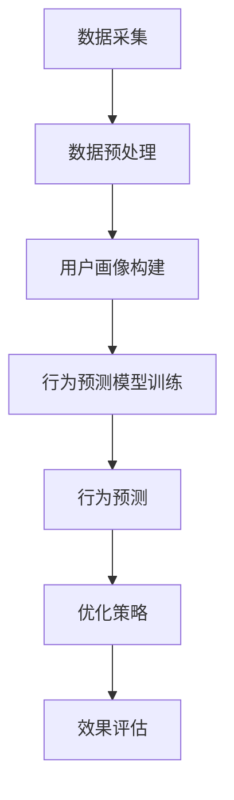
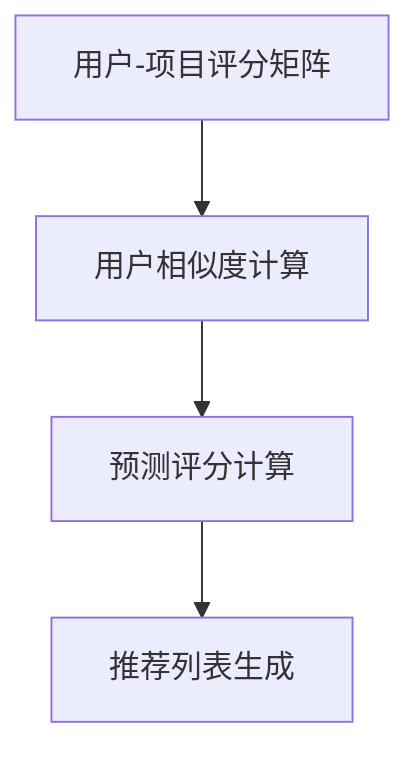
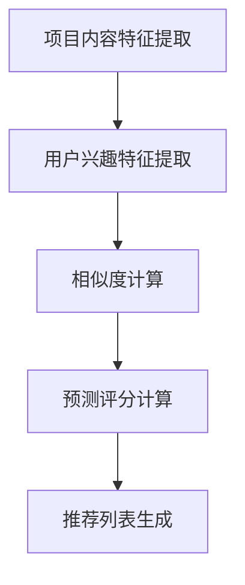
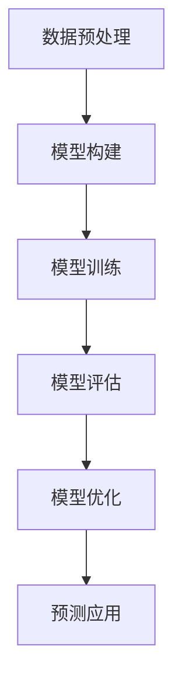

                 

# AI用户行为分析系统的实现案例

> **关键词：** AI用户行为分析、推荐系统、协同过滤、深度学习、系统架构、实验指南

> **摘要：** 本文将详细探讨AI用户行为分析系统的实现案例，包括系统概述、核心概念、算法原理、实现步骤、优化评估、案例研究和未来发展趋势。通过项目实战和代码解读，帮助读者理解用户行为分析系统的构建过程和关键技巧。

## 《AI用户行为分析系统的实现案例》目录大纲

### 第一部分：AI用户行为分析系统概述

#### 第1章：AI用户行为分析系统简介

#### 1.1 AI与用户行为分析

#### 1.2 AI用户行为分析的意义

#### 1.3 AI用户行为分析系统的架构

#### 第2章：AI用户行为分析的核心概念

#### 2.1 数据采集与预处理

#### 2.2 用户画像

#### 2.3 用户行为模型

#### 第3章：AI用户行为分析算法原理

#### 3.1 协同过滤算法

#### 3.2 基于内容的推荐算法

#### 3.3 深度学习在用户行为分析中的应用

#### 第4章：用户行为分析系统的实现步骤

#### 4.1 系统需求分析

#### 4.2 系统架构设计

#### 4.3 数据库设计

#### 第5章：用户行为分析系统的优化与评估

#### 5.1 优化策略

#### 5.2 评估指标

#### 5.3 评估方法

#### 第6章：案例研究

#### 6.1 案例背景

#### 6.2 案例解决方案

#### 6.3 案例实施与效果评估

#### 第7章：AI用户行为分析系统的未来发展趋势

#### 7.1 技术发展趋势

#### 7.2 应用领域扩展

#### 7.3 挑战与机遇

### 第二部分：AI用户行为分析系统的核心算法原理

#### 第8章：协同过滤算法

#### 第9章：基于内容的推荐算法

#### 第10章：深度学习在用户行为分析中的应用

### 附录

#### 附录A：开源推荐系统框架

#### 附录B：实验指南

## 核心概念与联系

### AI用户行为分析系统的工作流程

在AI用户行为分析系统中，核心的工作流程包括数据采集、数据预处理、用户画像构建、行为预测模型训练和行为预测等步骤。以下是一个简化的Mermaid流程图，展示了这些步骤之间的关系：



- **数据采集**：收集用户在不同应用场景下的行为数据，如浏览记录、点击、购买等。
- **数据预处理**：清洗、归一化和特征提取，确保数据质量。
- **用户画像构建**：通过聚类、分类等方法，将用户划分为不同群体，形成用户画像。
- **行为预测模型训练**：使用机器学习算法，如协同过滤、深度学习等，训练行为预测模型。
- **行为预测**：根据用户画像和行为预测模型，预测用户下一步可能的行为。
- **优化策略**：通过调整模型参数、优化算法等手段，提高预测准确性。
- **效果评估**：使用准确率、召回率等指标，评估系统性能。

### 协同过滤算法流程

协同过滤算法是用户行为分析系统中的核心算法之一。以下是一个简化的Mermaid流程图，展示了协同过滤算法的基本步骤：



- **用户-项目评分矩阵**：存储用户对项目的评分数据。
- **用户相似度计算**：计算用户之间的相似度，常用的方法包括余弦相似度、皮尔逊相关系数等。
- **预测评分计算**：根据用户相似度和已知的评分数据，预测用户对未知项目的评分。
- **推荐列表生成**：根据预测评分，为用户生成推荐列表。

### 基于内容的推荐算法流程

基于内容的推荐算法是另一种常见的用户行为分析算法。以下是一个简化的Mermaid流程图，展示了基于内容的推荐算法的基本步骤：



- **项目内容特征提取**：提取项目的内容特征，如文本、图像等。
- **用户兴趣特征提取**：提取用户的兴趣特征，如浏览历史、搜索记录等。
- **相似度计算**：计算项目内容特征和用户兴趣特征之间的相似度。
- **预测评分计算**：根据相似度计算预测评分。
- **推荐列表生成**：根据预测评分，为用户生成推荐列表。

### 深度学习在用户行为分析中的应用流程

深度学习在用户行为分析中发挥着重要作用。以下是一个简化的Mermaid流程图，展示了深度学习在用户行为分析中的应用流程：



- **数据预处理**：清洗、归一化和特征提取，为模型训练做好准备。
- **模型构建**：设计深度学习模型结构，如卷积神经网络（CNN）、循环神经网络（RNN）等。
- **模型训练**：使用训练数据训练模型，调整模型参数。
- **模型评估**：使用验证数据评估模型性能，调整模型结构或参数。
- **模型优化**：通过交叉验证、模型集成等方法，优化模型性能。
- **预测应用**：使用训练好的模型进行行为预测。

## 数学模型和数学公式

### 协同过滤算法的评分预测公式

协同过滤算法的核心是评分预测。以下是一个协同过滤算法的评分预测公式：

$$
\hat{r}_{ui} = \frac{\sum_{j \in N_i} r_{uj} \cdot s_{uij}}{\sum_{j \in N_i} s_{uij}}
$$

其中，$\hat{r}_{ui}$ 是用户 $u$ 对项目 $i$ 的预测评分，$r_{uj}$ 是用户 $u$ 对项目 $j$ 的实际评分，$s_{uij}$ 是用户 $u$ 和项目 $i$ 的相似度。相似度通常通过用户之间的余弦相似度或皮尔逊相关系数来计算。

### 基于内容的推荐算法的评分预测公式

基于内容的推荐算法通过比较项目内容和用户兴趣来预测评分。以下是一个基于内容的推荐算法的评分预测公式：

$$
s(i, u) = \sum_{t \in T} w_t \cdot \text{sim}(c_t, c')
$$

其中，$s(i, u)$ 是项目 $i$ 对用户 $u$ 的预测评分，$c_t$ 是项目 $i$ 的特征向量，$c'$ 是用户 $u$ 的兴趣特征向量，$\text{sim}(c_t, c')$ 是特征向量之间的相似度，$w_t$ 是特征权重。特征权重通常通过TF-IDF算法来计算。

### 深度学习用户行为预测模型

深度学习用户行为预测模型通常使用多层感知机（MLP）、卷积神经网络（CNN）或循环神经网络（RNN）等结构。以下是一个多层感知机的用户行为预测模型：

$$
h_l = \sigma(W_l \cdot h_{l-1} + b_l)
$$

其中，$h_l$ 是第 $l$ 层的激活值，$W_l$ 是权重矩阵，$b_l$ 是偏置项，$\sigma$ 是激活函数。激活函数通常使用ReLU或Sigmoid函数。

## 项目实战

### 用户行为分析系统开发环境搭建

要开发一个用户行为分析系统，首先需要搭建一个合适的环境。以下是一个简单的环境搭建指南：

1. **安装Python环境**：
   - 在您的计算机上安装Python 3.8或更高版本。
   - 通过pip命令安装必要的库，如NumPy、Pandas、Scikit-learn、TensorFlow等。

2. **安装依赖库**：
   ```bash
   pip install numpy pandas scikit-learn tensorflow
   ```

3. **配置数据库**：
   - 安装MySQL或MongoDB。
   - 配置数据库连接，以便在系统中存储用户行为数据。

4. **环境配置**：
   - 创建一个虚拟环境，以避免库的版本冲突。
   - 在虚拟环境中安装必要的库。

```bash
python -m venv venv
source venv/bin/activate  # 在Windows上使用 `venv\Scripts\activate`
```

### 代码实现与解读

#### 数据采集与预处理

首先，我们需要从数据源中采集用户行为数据。以下是一个简单的Python代码示例，用于加载和预处理数据：

```python
import pandas as pd

# 加载数据
data = pd.read_csv('user_data.csv')

# 数据预处理
# 去除缺失值
data = data.dropna()

# 数据类型转换
data['age'] = data['age'].astype(int)
data['click'] = data['click'].astype(float)

# 特征提取
data['user_activity'] = data['click'] + data['watch_time'] + data['like'] + data['comment']
```

#### 用户画像构建

接下来，我们可以使用聚类算法来构建用户画像。以下是一个使用K-Means算法进行聚类的示例：

```python
from sklearn.cluster import KMeans

# 提取用户行为特征
user_features = data[['click', 'watch_time', 'like', 'comment']]

# K-Means聚类
kmeans = KMeans(n_clusters=5)
user_labels = kmeans.fit_predict(user_features)

# 构建用户画像
user_profiles = pd.DataFrame(user_labels, columns=['profile'])
data = data.join(user_profiles)
```

#### 行为预测模型训练

最后，我们可以使用随机森林分类器来训练行为预测模型。以下是一个简单的示例：

```python
from sklearn.model_selection import train_test_split
from sklearn.ensemble import RandomForestClassifier

# 数据分割
X = data[['click', 'watch_time', 'like', 'comment']]
y = data['action']

X_train, X_test, y_train, y_test = train_test_split(X, y, test_size=0.2, random_state=42)

# 模型训练
model = RandomForestClassifier(n_estimators=100)
model.fit(X_train, y_train)

# 模型评估
accuracy = model.score(X_test, y_test)
print(f"Accuracy: {accuracy}")
```

### 代码解读与分析

1. **数据预处理**：首先，我们从CSV文件中加载数据，并去除缺失值。然后，我们将数据类型进行转换，以便后续处理。最后，我们计算用户活动的综合指标，用于聚类和预测。

2. **用户画像构建**：我们使用K-Means算法对用户行为特征进行聚类，生成用户画像。这个步骤将用户划分为不同的群体，有助于后续的行为预测。

3. **行为预测模型训练**：我们使用随机森林分类器来训练行为预测模型。随机森林是一种集成学习方法，通过训练多个决策树并取平均来提高预测性能。在这个例子中，我们使用训练数据来训练模型，并使用测试数据来评估模型的准确性。

## 附录

### 附录A：开源推荐系统框架

以下是一些常用的开源推荐系统框架：

#### A.1 MFRec

MFRec是一个基于矩阵分解的推荐系统框架，适用于基于协同过滤的推荐算法。

#### A.2 LightFM

LightFM是一个基于因子分解机的推荐系统框架，适用于处理稀疏数据。

#### A.3 surprise

surprise是一个基于协同过滤和矩阵分解的推荐系统框架，支持多种算法。

### 附录B：实验指南

以下是一个简单的实验指南，用于实现用户行为分析系统：

#### B.1 数据采集

- 收集用户在不同应用场景下的行为数据，如浏览记录、点击、购买等。
- 数据清洗，去除无效数据。

#### B.2 数据预处理

- 数据类型转换，如将类别数据转换为数值数据。
- 特征提取，如计算用户行为特征的统计量。

#### B.3 系统实现与优化

- 实现用户画像构建、行为预测等功能。
- 调整模型参数，优化模型性能。

#### B.4 结果分析

- 分析预测结果，如准确率、召回率等。
- 分析用户行为特征对预测结果的影响。

## 结论

本文详细介绍了AI用户行为分析系统的实现案例，包括系统概述、核心概念、算法原理、实现步骤、优化评估和案例研究。通过项目实战和代码解读，读者可以了解用户行为分析系统的构建过程和关键技巧。随着技术的不断发展，AI用户行为分析系统在商业和社会中的应用将越来越广泛，面临的新挑战和机遇也将不断涌现。未来，我们将继续深入研究这一领域，探索更加先进的技术和方法。

