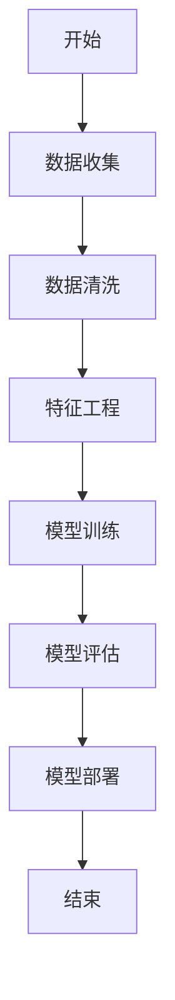

                 

# AI辅助软件开发工具链

> 关键词：AI辅助软件开发、AI工具链、AI算法、机器学习、深度学习、Python环境、模型训练、模型部署、应用实践

> 摘要：
本文旨在探讨AI辅助软件开发工具链的构建与应用。首先，我们介绍了AI辅助软件开发的定义、重要性及其发展趋势。接着，我们详细讲解了AI的基础概念、算法原理、数学模型及开发环境。随后，文章重点描述了AI辅助软件开发工具链的构建过程，包括数据收集与清洗、特征工程、模型训练与调优、模型部署与集成。最后，我们通过实际案例展示了AI在金融、医疗、电商和制造业等行业的应用，并对AI安全与伦理问题进行了探讨。文章最后附有AI辅助软件开发常用工具与资源的介绍。

## 第一部分：AI辅助软件开发基础

### 1.1 AI辅助软件开发概述

#### 1.1.1 AI辅助软件开发的定义

AI辅助软件开发是指利用人工智能技术，辅助软件工程师进行软件开发的过程。它包括代码生成、代码优化、错误检测、代码审查、自动化测试等多个方面。通过AI技术，可以提高开发效率、降低成本、提高软件质量。

#### 1.1.2 AI辅助软件开发的重要性

随着软件系统日益复杂，传统软件开发方法已难以应对。AI辅助软件开发可以有效解决以下问题：

1. **提高开发效率**：AI可以帮助自动完成一些繁琐的任务，如代码生成、自动化测试等，从而节省人力和时间。
2. **降低开发成本**：通过自动化和优化，AI可以减少错误和返工，降低开发成本。
3. **提升软件质量**：AI可以检测代码中的潜在错误，并提供改进建议，从而提高软件质量。

#### 1.1.3 AI辅助软件开发的发展趋势

1. **代码生成与优化**：利用AI技术，可以自动生成代码，优化现有代码，提高开发效率。
2. **错误检测与修复**：AI可以检测代码中的潜在错误，并提供修复建议。
3. **自动化测试**：AI可以帮助自动执行测试用例，检测软件缺陷。
4. **代码审查**：AI可以辅助代码审查，提供改进建议。
5. **持续集成与部署**：AI可以协助实现持续集成与持续部署，提高软件开发效率。

### 1.2 AI基础概念与分类

#### 1.2.1 人工智能基础概念

人工智能（Artificial Intelligence，简称AI）是指通过计算机模拟人类智能的学科。它包括多个领域，如机器学习、深度学习、自然语言处理等。

#### 1.2.2 机器学习基础概念

机器学习（Machine Learning，简称ML）是一种让计算机通过数据自动学习和改进的算法。它分为监督学习、无监督学习和强化学习。

- **监督学习**：有标注的数据训练模型，用于预测或分类。
- **无监督学习**：没有标注的数据训练模型，用于发现数据中的模式和结构。
- **强化学习**：通过与环境的交互来学习策略，以实现某个目标。

#### 1.2.3 深度学习基础概念

深度学习（Deep Learning，简称DL）是一种基于多层神经网络的学习方法。它通过多层的非线性变换，从数据中提取特征，实现复杂的模式识别和预测。

### 1.3 AI算法原理讲解

#### 1.3.1 监督学习算法

##### 1.3.1.1 线性回归

线性回归是一种简单的监督学习算法，用于预测数值型变量。其数学模型为：

$$
y = \beta_0 + \beta_1x + \epsilon
$$

其中，$y$ 为因变量，$x$ 为自变量，$\beta_0$ 和 $\beta_1$ 为模型参数，$\epsilon$ 为误差项。

##### 1.3.1.2 逻辑回归

逻辑回归是一种用于分类的监督学习算法。其数学模型为：

$$
P(y=1) = \frac{1}{1 + e^{-(\beta_0 + \beta_1x)}}
$$

其中，$P(y=1)$ 为因变量为1的概率，$\beta_0$ 和 $\beta_1$ 为模型参数。

#### 1.3.2 无监督学习算法

##### 1.3.2.1 K-均值聚类

K-均值聚类是一种基于距离的聚类算法。它将数据分为K个簇，使得每个簇内的数据距离簇中心最近。

算法流程：

1. 随机选择K个数据点作为初始簇中心。
2. 对于每个数据点，计算其与各个簇中心的距离，并将其分配到最近的簇。
3. 更新簇中心，即取每个簇内数据点的平均值作为新的簇中心。
4. 重复步骤2和3，直到簇中心不再变化或达到最大迭代次数。

##### 1.3.2.2 主成分分析

主成分分析（Principal Component Analysis，简称PCA）是一种降维算法。它通过线性变换，将高维数据投影到低维空间，保留主要信息，降低计算复杂度。

算法流程：

1. 计算数据集的协方差矩阵。
2. 计算协方差矩阵的特征值和特征向量。
3. 将特征向量按特征值降序排列。
4. 选择前k个特征向量，组成投影矩阵。
5. 将数据集投影到k维空间。

#### 1.3.3 强化学习算法

##### 1.3.3.1 Q-Learning算法

Q-Learning算法是一种基于值函数的强化学习算法。它通过更新值函数，学习最优策略。

算法流程：

1. 初始化值函数Q(s, a)为0。
2. 对于每个状态s和动作a，进行循环：
   - 执行动作a，获得奖励r和下一个状态s'。
   - 更新值函数：$Q(s, a) \leftarrow Q(s, a) + \alpha [r + \gamma \max_{a'} Q(s', a') - Q(s, a)]$。
3. 当满足停止条件（如达到一定步数或收敛）时，算法结束。

##### 1.3.3.2 Deep Q-Networks算法

Deep Q-Networks（简称DQN）是一种基于深度学习的强化学习算法。它使用深度神经网络来近似值函数。

算法流程：

1. 初始化深度神经网络DQN。
2. 对于每个状态s，进行循环：
   - 选择动作a，根据epsilon-greedy策略。
   - 执行动作a，获得奖励r和下一个状态s'。
   - 计算目标值$y = r + \gamma \max_{a'} DQN(s', a')$。
   - 更新DQN：$DQN(s, a) \leftarrow DQN(s, a) + \alpha [y - DQN(s, a)]$。
3. 当满足停止条件时，算法结束。

### 1.4 数学模型与公式讲解

#### 1.4.1 常用概率分布函数

正态分布（Gaussian Distribution）是统计学中最重要的概率分布之一，其概率密度函数为：

$$
f(x|\mu,\sigma^2) = \frac{1}{\sqrt{2\pi\sigma^2}}e^{-\frac{(x-\mu)^2}{2\sigma^2}}
$$

其中，$\mu$ 为均值，$\sigma^2$ 为方差。

#### 1.4.2 线性回归数学模型

线性回归是一种常见的监督学习算法，其数学模型为：

$$
y = \beta_0 + \beta_1x + \epsilon
$$

其中，$y$ 为因变量，$x$ 为自变量，$\beta_0$ 和 $\beta_1$ 为模型参数，$\epsilon$ 为误差项。

### 1.5 AI开发环境与工具

#### 1.5.1 Python环境搭建

在开始AI开发之前，我们需要搭建Python开发环境。以下是一个简单的Python环境搭建步骤：

1. 安装Python：从官方网站下载并安装Python。
2. 安装Anaconda：Anaconda是一个集成了Python和其他科学计算库的发行版，可以方便地管理和安装库。
3. 创建虚拟环境：使用conda创建一个虚拟环境，以便隔离项目依赖。
4. 安装常用库：在虚拟环境中安装NumPy、Pandas、Scikit-learn、TensorFlow、PyTorch等常用库。

#### 1.5.2 常用AI开发框架介绍

- **TensorFlow**：TensorFlow是谷歌开源的深度学习框架，具有丰富的功能和强大的计算能力。
- **PyTorch**：PyTorch是Facebook开源的深度学习框架，具有灵活的动态计算图和易于理解的代码结构。

### 1.6 实际项目案例讲解

#### 1.6.1 数据预处理实战

在AI项目中，数据预处理是至关重要的一步。以下是一个简单数据预处理案例：

```python
import pandas as pd
from sklearn.model_selection import train_test_split
from sklearn.preprocessing import StandardScaler

# 读取数据
data = pd.read_csv('data.csv')

# 分割特征和标签
X = data.drop('target', axis=1)
y = data['target']

# 划分训练集和测试集
X_train, X_test, y_train, y_test = train_test_split(X, y, test_size=0.2, random_state=42)

# 数据标准化
scaler = StandardScaler()
X_train = scaler.fit_transform(X_train)
X_test = scaler.transform(X_test)
```

#### 1.6.2 模型训练实战

以下是一个简单的线性回归模型训练案例：

```python
import tensorflow as tf
from tensorflow.keras.models import Sequential
from tensorflow.keras.layers import Dense

# 创建模型
model = Sequential([
    Dense(1, input_shape=(X_train.shape[1],), activation='linear')
])

# 编译模型
model.compile(optimizer='sgd', loss='mean_squared_error')

# 训练模型
model.fit(X_train, y_train, epochs=100, batch_size=10, validation_data=(X_test, y_test))
```

#### 1.6.3 模型评估与优化实战

以下是一个简单的模型评估与优化案例：

```python
import tensorflow as tf
from tensorflow.keras.models import Sequential
from tensorflow.keras.layers import Dense
from tensorflow.keras.wrappers.scikit_learn import KerasRegressor
from sklearn.model_selection import cross_val_score

# 创建模型
model = Sequential([
    Dense(1, input_shape=(X_train.shape[1],), activation='linear')
])

# 编译模型
model.compile(optimizer='sgd', loss='mean_squared_error')

# 交叉验证
scores = cross_val_score(KerasRegressor(build_fn=model), X=X_train, y=y_train, cv=5)

# 打印结果
print("交叉验证得分：", scores.mean())
```

## 第二部分：AI辅助软件开发工具链构建

### 2.1 数据收集与清洗

#### 2.1.1 数据收集方法

数据收集是AI辅助软件开发的关键步骤。以下是一些常见的数据收集方法：

- **网络爬虫**：通过爬取网页，获取所需数据。
- **数据库导入**：从数据库中导入数据，如MySQL、MongoDB等。

#### 2.1.2 数据清洗流程

数据清洗是确保数据质量和可用性的重要步骤。以下是一些常见的数据清洗步骤：

- **填缺值处理**：缺失值的处理方法包括删除、填充、预测等。
- **异常值处理**：异常值的处理方法包括删除、修正、保留等。
- **数据标准化**：将数据缩放到相同的范围，如[0, 1]或[-1, 1]。

### 2.2 特征工程

#### 2.2.1 特征选择方法

特征选择是减少数据维度、提高模型性能的重要步骤。以下是一些常见的特征选择方法：

- **基于信息论的筛选方法**：如信息增益、信息增益率等。
- **基于模型的筛选方法**：如LASSO、Ridge等。

#### 2.2.2 特征构造方法

特征构造是通过组合原始特征，生成新的特征。以下是一些常见的特征构造方法：

- **特征交叉**：将不同特征进行组合。
- **特征组合**：对同一特征进行变换和组合。

### 2.3 模型训练与调优

#### 2.3.1 模型训练流程

模型训练是AI辅助软件开发的的核心步骤。以下是一个简单的模型训练流程：

1. **数据预处理**：对数据进行清洗、归一化等处理。
2. **划分数据集**：将数据集划分为训练集、验证集和测试集。
3. **构建模型**：选择合适的模型结构和参数。
4. **训练模型**：使用训练集对模型进行训练。
5. **评估模型**：使用验证集对模型进行评估，调整参数。
6. **测试模型**：使用测试集对模型进行测试，评估性能。

#### 2.3.2 模型调优方法

模型调优是提高模型性能的重要步骤。以下是一些常见的模型调优方法：

- **参数调整**：调整模型的参数，如学习率、批量大小等。
- **模型选择**：选择合适的模型，如线性回归、决策树、神经网络等。
- **正则化策略**：使用正则化策略，如L1、L2正则化，防止过拟合。

### 2.4 模型部署与集成

#### 2.4.1 模型部署方法

模型部署是将训练好的模型应用到实际环境中。以下是一些常见的模型部署方法：

- **单机部署**：将模型部署到单台服务器上，适用于小型应用。
- **分布式部署**：将模型部署到分布式系统上，适用于大型应用。

#### 2.4.2 模型集成方法

模型集成是将多个模型进行集成，以提高预测性能。以下是一些常见的模型集成方法：

- **Boosting算法**：通过训练多个弱学习器，逐渐优化模型。
- **Bagging算法**：通过训练多个独立的学习器，进行集成。

### 2.5 AI安全与伦理

#### 2.5.1 AI安全基本概念

AI安全是指在AI系统中保护数据、模型和用户隐私等方面的安全措施。以下是一些常见的AI安全基本概念：

- **数据安全**：保护数据不被未授权访问、篡改或泄露。
- **模型安全**：防止恶意攻击者对模型进行篡改或破坏。

#### 2.5.2 AI伦理问题探讨

AI伦理问题是指在AI应用中涉及到的道德和社会问题。以下是一些常见的AI伦理问题：

- **隐私保护**：如何保护用户隐私，防止数据泄露。
- **社会公平性**：如何确保AI系统不会加剧社会不平等。
- **透明度与解释性**：如何使AI系统更加透明，提高用户信任度。

## 第三部分：AI辅助软件开发应用实践

### 3.1 金融行业应用

#### 3.1.1 金融风险评估

金融风险评估是金融行业的重要应用领域。以下是一些金融风险评估模型：

- **信用评分模型**：用于评估借款人的信用风险。
- **金融市场预测模型**：用于预测股票价格、利率等金融市场指标。

#### 3.1.2 保险定价模型

保险定价模型是保险行业的重要应用领域。以下是一些保险定价模型：

- **保险需求预测模型**：用于预测保险产品的市场需求。
- **保险欺诈检测模型**：用于检测保险欺诈行为。

### 3.2 医疗健康应用

#### 3.2.1 医疗诊断与预测

医疗诊断与预测是医疗健康领域的重要应用。以下是一些医疗诊断与预测模型：

- **疾病诊断模型**：用于辅助医生诊断疾病。
- **患者康复预测模型**：用于预测患者的康复时间。

#### 3.2.2 医疗影像分析

医疗影像分析是医疗健康领域的重要应用。以下是一些医疗影像分析模型：

- **肿瘤检测模型**：用于检测医学影像中的肿瘤。
- **肺部疾病识别模型**：用于识别医学影像中的肺部疾病。

### 3.3 电商行业应用

#### 3.3.1 用户行为分析

用户行为分析是电商行业的重要应用。以下是一些用户行为分析模型：

- **用户兴趣预测模型**：用于预测用户对商品的偏好。
- **用户流失预测模型**：用于预测用户可能会流失的行为。

#### 3.3.2 个性化推荐系统

个性化推荐系统是电商行业的重要应用。以下是一些个性化推荐系统模型：

- **基于协同过滤的推荐算法**：基于用户行为和偏好进行推荐。
- **基于内容推荐的算法**：基于商品的特征进行推荐。

### 3.4 制造业应用

#### 3.4.1 设备故障预测

设备故障预测是制造业的重要应用。以下是一些设备故障预测模型：

- **基于时间序列的预测模型**：用于预测设备故障时间。
- **基于异常检测的故障预测模型**：用于检测设备故障异常。

#### 3.4.2 供应链优化

供应链优化是制造业的重要应用。以下是一些供应链优化模型：

- **库存优化模型**：用于优化库存水平。
- **运输路线优化模型**：用于优化运输路线。

## 附录

### 附录 A: AI辅助软件开发常用工具与资源

#### A.1 Python库与框架

- **NumPy**：用于数值计算和矩阵操作。
- **Pandas**：用于数据处理和分析。
- **Scikit-learn**：用于机器学习和数据挖掘。
- **TensorFlow**：用于深度学习和计算图。
- **PyTorch**：用于深度学习和动态计算图。

#### A.2 数据集来源

- **UCI机器学习库**：提供各种领域的机器学习数据集。
- **Kaggle数据集**：提供各种竞赛数据集。
- **知乎开放数据集**：提供知乎用户行为数据集。

#### A.3 在线学习资源

- **Coursera**：提供各种在线课程。
- **edX**：提供各种在线课程。
- **Udacity**：提供各种在线课程。
- **中国大学MOOC**：提供各种在线课程。

#### A.4 开发工具与平台

- **Jupyter Notebook**：用于交互式开发。
- **Google Colab**：用于在线开发。
- **AWS SageMaker**：用于模型部署。
- **Azure Machine Learning**：用于模型部署。

### 附录 B: Mermaid流程图

以下是一个简单的Mermaid流程图示例：



### 附录 C: 代码示例

以下是一个简单的Python代码示例：

```python
import tensorflow as tf

# 创建模型
model = tf.keras.Sequential([
    tf.keras.layers.Dense(128, activation='relu', input_shape=[784]),
    tf.keras.layers.Dense(10, activation='softmax')
])

# 编译模型
model.compile(optimizer='adam',
              loss='categorical_crossentropy',
              metrics=['accuracy'])

# 训练模型
model.fit(x_train, y_train, epochs=5)
```

### 附录 D: 作者信息

作者：AI天才研究院/AI Genius Institute & 禅与计算机程序设计艺术 /Zen And The Art of Computer Programming

（文章标题）：AI辅助软件开发工具链

（文章关键词）：AI辅助软件开发、AI工具链、AI算法、机器学习、深度学习、Python环境、模型训练、模型部署、应用实践

（文章摘要）：本文旨在探讨AI辅助软件开发工具链的构建与应用。首先，我们介绍了AI辅助软件开发的定义、重要性及其发展趋势。接着，我们详细讲解了AI的基础概念、算法原理、数学模型及开发环境。随后，文章重点描述了AI辅助软件开发工具链的构建过程，包括数据收集与清洗、特征工程、模型训练与调优、模型部署与集成。最后，我们通过实际案例展示了AI在金融、医疗、电商和制造业等行业的应用，并对AI安全与伦理问题进行了探讨。文章最后附有AI辅助软件开发常用工具与资源的介绍。

### 第一部分：AI辅助软件开发基础

#### 1.1 AI辅助软件开发概述

AI辅助软件开发是一种利用人工智能技术来提高软件开发效率和质量的方法。它通过自动化、优化和智能化的方式，帮助开发人员完成代码生成、代码优化、错误检测、代码审查、自动化测试等任务。

AI辅助软件开发的重要性在于：

1. **提高开发效率**：通过自动化和智能化的方式，可以减少开发人员的工作量，提高开发效率。
2. **降低开发成本**：通过减少人力和时间成本，降低开发成本。
3. **提升软件质量**：通过自动化测试和代码审查，可以减少错误和缺陷，提高软件质量。
4. **应对复杂系统**：随着软件系统的日益复杂，传统的方法已难以应对，AI辅助软件开发能够更好地处理复杂问题。

AI辅助软件开发的发展趋势包括：

1. **代码生成与优化**：利用AI技术自动生成代码，优化现有代码，提高开发效率。
2. **错误检测与修复**：AI可以自动检测代码中的潜在错误，并提供修复建议。
3. **自动化测试**：AI可以帮助自动执行测试用例，检测软件缺陷。
4. **代码审查**：AI可以辅助代码审查，提供改进建议。
5. **持续集成与部署**：AI可以协助实现持续集成与持续部署，提高软件开发效率。

#### 1.2 AI基础概念与分类

AI（人工智能）是一种模拟人类智能的技术，通过计算机程序实现智能行为。AI可以分为两大类：弱AI（Weak AI）和强AI（Strong AI）。

弱AI是指专门解决特定问题的AI，如语音识别、图像识别、自然语言处理等。弱AI具有一定的智能行为，但无法实现真正的智能。

强AI是指具有普遍智能的AI，可以像人类一样进行思考、学习、解决问题等。强AI目前仍处于理论研究阶段，尚未实现商业化应用。

AI的分类还包括：

1. **基于规则的AI**：通过预定义的规则来模拟人类智能。
2. **基于数据的AI**：通过学习大量数据来模拟人类智能。
3. **基于符号的AI**：使用符号表示知识，通过推理来模拟人类智能。
4. **基于神经网络的AI**：通过模拟人脑神经元结构来实现智能。

#### 1.3 AI算法原理讲解

AI算法是AI系统的核心组成部分，用于实现特定功能的自动化。以下是一些常见的AI算法：

##### 1.3.1 监督学习算法

监督学习算法是一种从已知标注数据中学习并预测未知数据的算法。其基本原理是通过输入特征和对应的标签，学习一个映射关系，从而实现对未知数据的预测。

常见的监督学习算法包括：

- **线性回归**：用于预测连续值输出。
- **逻辑回归**：用于预测概率值输出，常用于分类问题。
- **支持向量机**：用于分类和回归问题，通过最大化决策边界来划分数据。
- **决策树**：通过树形结构进行分类和回归，易于理解和解释。

##### 1.3.2 无监督学习算法

无监督学习算法是一种从未标注数据中学习数据结构和模式的方法。其基本原理是通过探索数据的内在结构，实现对数据的聚类、降维等操作。

常见的无监督学习算法包括：

- **K-均值聚类**：通过迭代过程将数据分为K个簇，每个簇内的数据点相似度较高。
- **主成分分析**：通过线性变换将高维数据投影到低维空间，保留主要信息。
- **自编码器**：通过编码和解码过程学习数据的特征表示。

##### 1.3.3 强化学习算法

强化学习算法是一种通过与环境交互来学习策略的算法。其基本原理是 Agent 通过采取行动来获取奖励，并根据奖励来调整策略。

常见的强化学习算法包括：

- **Q-Learning**：通过更新 Q 值来学习最优策略。
- **Deep Q-Networks（DQN）**：使用深度神经网络来近似 Q 值函数。
- **Policy Gradient**：通过学习策略梯度来优化策略。

#### 1.4 数学模型与公式讲解

在AI领域中，数学模型和公式起着至关重要的作用。以下是一些常见的数学模型和公式：

##### 1.4.1 线性回归

线性回归是一种用于预测连续值的监督学习算法。其数学模型为：

$$
y = \beta_0 + \beta_1x + \epsilon
$$

其中，$y$ 是预测值，$x$ 是输入特征，$\beta_0$ 和 $\beta_1$ 是模型参数，$\epsilon$ 是误差项。

##### 1.4.2 逻辑回归

逻辑回归是一种用于预测概率值的监督学习算法，常用于分类问题。其数学模型为：

$$
P(y=1) = \frac{1}{1 + e^{-(\beta_0 + \beta_1x)}}
$$

其中，$P(y=1)$ 是输出为1的概率，$\beta_0$ 和 $\beta_1$ 是模型参数。

##### 1.4.3 主成分分析

主成分分析（PCA）是一种无监督学习算法，用于降维和特征提取。其数学模型为：

$$
z = PC
$$

其中，$z$ 是降维后的数据，$P$ 是投影矩阵，$C$ 是协方差矩阵。

##### 1.4.4 正态分布

正态分布是一种常见的概率分布，用于描述数据集的分布特征。其概率密度函数为：

$$
f(x|\mu,\sigma^2) = \frac{1}{\sqrt{2\pi\sigma^2}}e^{-\frac{(x-\mu)^2}{2\sigma^2}}
$$

其中，$\mu$ 是均值，$\sigma^2$ 是方差。

#### 1.5 AI开发环境与工具

在AI开发中，选择合适的环境和工具对于提高开发效率和性能至关重要。以下是一些常见的AI开发环境与工具：

##### 1.5.1 Python环境搭建

Python是一种流行的编程语言，广泛应用于AI开发。以下是Python环境搭建的步骤：

1. **安装Python**：从Python官方网站下载并安装Python。
2. **安装Anaconda**：Anaconda是一个集成了Python和其他科学计算库的发行版，可以方便地管理和安装库。
3. **创建虚拟环境**：使用conda创建一个虚拟环境，以便隔离项目依赖。
4. **安装常用库**：在虚拟环境中安装NumPy、Pandas、Scikit-learn、TensorFlow、PyTorch等常用库。

##### 1.5.2 常用AI开发框架介绍

1. **TensorFlow**：TensorFlow是谷歌开源的深度学习框架，具有丰富的功能和强大的计算能力。TensorFlow提供了一个灵活的动态计算图，用于构建和训练深度学习模型。
2. **PyTorch**：PyTorch是Facebook开源的深度学习框架，具有灵活的动态计算图和易于理解的代码结构。PyTorch提供了丰富的库和工具，方便用户进行深度学习研究和开发。

#### 1.6 实际项目案例讲解

在实际项目中，AI辅助软件开发可以应用于多个领域。以下是一个简单的实际项目案例：

##### 1.6.1 数据预处理实战

在AI项目中，数据预处理是至关重要的一步。以下是一个数据预处理案例：

```python
import pandas as pd
from sklearn.model_selection import train_test_split
from sklearn.preprocessing import StandardScaler

# 读取数据
data = pd.read_csv('data.csv')

# 分割特征和标签
X = data.drop('target', axis=1)
y = data['target']

# 划分训练集和测试集
X_train, X_test, y_train, y_test = train_test_split(X, y, test_size=0.2, random_state=42)

# 数据标准化
scaler = StandardScaler()
X_train = scaler.fit_transform(X_train)
X_test = scaler.transform(X_test)
```

##### 1.6.2 模型训练实战

以下是一个简单的线性回归模型训练案例：

```python
import tensorflow as tf
from tensorflow.keras.models import Sequential
from tensorflow.keras.layers import Dense

# 创建模型
model = Sequential([
    Dense(1, input_shape=(X_train.shape[1],), activation='linear')
])

# 编译模型
model.compile(optimizer='sgd', loss='mean_squared_error')

# 训练模型
model.fit(X_train, y_train, epochs=100, batch_size=10, validation_data=(X_test, y_test))
```

##### 1.6.3 模型评估与优化实战

以下是一个简单的模型评估与优化案例：

```python
import tensorflow as tf
from tensorflow.keras.models import Sequential
from tensorflow.keras.layers import Dense
from tensorflow.keras.wrappers.scikit_learn import KerasRegressor
from sklearn.model_selection import cross_val_score

# 创建模型
model = Sequential([
    Dense(1, input_shape=(X_train.shape[1],), activation='linear')
])

# 编译模型
model.compile(optimizer='sgd', loss='mean_squared_error')

# 交叉验证
scores = cross_val_score(KerasRegressor(build_fn=model), X=X_train, y=y_train, cv=5)

# 打印结果
print("交叉验证得分：", scores.mean())
```

### 第二部分：AI辅助软件开发工具链构建

#### 2.1 数据收集与清洗

在AI辅助软件开发中，数据收集与清洗是至关重要的一步。数据收集是指从各种数据源获取所需数据，包括网络爬虫、数据库导入、API接口等。数据清洗是指对收集到的数据进行处理，确保数据的质量和可用性。

##### 2.1.1 数据收集方法

1. **网络爬虫**：通过网络爬虫从网站中获取数据，适用于公开数据的收集。
2. **数据库导入**：从数据库中导入数据，如MySQL、MongoDB等，适用于企业内部数据的收集。
3. **API接口**：通过API接口获取数据，适用于第三方数据的收集。

##### 2.1.2 数据清洗流程

1. **缺失值处理**：对于缺失值，可以选择删除、填充、预测等方法。
2. **异常值处理**：对于异常值，可以选择删除、修正、保留等方法。
3. **数据规范化**：对数据进行归一化或标准化处理，使数据具有相同的量纲和范围。

##### 2.1.3 数据预处理实战

以下是一个简单的数据预处理案例：

```python
import pandas as pd
from sklearn.model_selection import train_test_split
from sklearn.preprocessing import StandardScaler

# 读取数据
data = pd.read_csv('data.csv')

# 分割特征和标签
X = data.drop('target', axis=1)
y = data['target']

# 划分训练集和测试集
X_train, X_test, y_train, y_test = train_test_split(X, y, test_size=0.2, random_state=42)

# 数据标准化
scaler = StandardScaler()
X_train = scaler.fit_transform(X_train)
X_test = scaler.transform(X_test)
```

#### 2.2 特征工程

特征工程是AI辅助软件开发中的一项重要任务，通过对原始数据进行处理和转换，提取出有用的特征，从而提高模型的性能和预测能力。

##### 2.2.1 特征选择方法

1. **基于信息论的筛选方法**：如信息增益、信息增益率等，通过计算特征与目标之间的相关性来选择特征。
2. **基于模型的筛选方法**：如LASSO、Ridge等，通过训练模型并观察特征对模型性能的影响来选择特征。

##### 2.2.2 特征构造方法

1. **特征交叉**：通过组合原始特征，生成新的特征，如特征交互项、多项式特征等。
2. **特征组合**：对同一特征进行变换和组合，如对数值特征进行归一化、对文本特征进行词袋表示等。

##### 2.2.3 特征工程实战

以下是一个简单的特征工程案例：

```python
import pandas as pd
from sklearn.preprocessing import OneHotEncoder

# 读取数据
data = pd.read_csv('data.csv')

# 分割特征和标签
X = data.drop('target', axis=1)
y = data['target']

# 特征交叉
X['feature_1_feature_2'] = X['feature_1'] * X['feature_2']

# 特征组合
X['feature_3_squared'] = X['feature_3'] ** 2

# 特征编码
encoder = OneHotEncoder()
X_encoded = encoder.fit_transform(X[['feature_4']])

# 打印结果
print(X_encoded)
```

#### 2.3 模型训练与调优

模型训练与调优是AI辅助软件开发的另一项重要任务，通过训练和调整模型参数，优化模型性能。

##### 2.3.1 模型训练流程

1. **数据预处理**：对数据进行清洗、归一化等处理。
2. **划分数据集**：将数据集划分为训练集、验证集和测试集。
3. **构建模型**：选择合适的模型结构。
4. **训练模型**：使用训练集训练模型。
5. **评估模型**：使用验证集评估模型性能。
6. **调优模型**：根据评估结果调整模型参数。
7. **测试模型**：使用测试集测试模型性能。

##### 2.3.2 模型调优方法

1. **参数调整**：通过调整学习率、批量大小等参数来优化模型。
2. **模型选择**：选择合适的模型，如线性回归、决策树、神经网络等。
3. **正则化策略**：通过正则化策略，如L1、L2正则化，防止过拟合。

##### 2.3.3 模型训练与调优实战

以下是一个简单的模型训练与调优案例：

```python
import tensorflow as tf
from tensorflow.keras.models import Sequential
from tensorflow.keras.layers import Dense
from tensorflow.keras.optimizers import Adam

# 创建模型
model = Sequential([
    Dense(1, input_shape=(X_train.shape[1],), activation='linear')
])

# 编译模型
model.compile(optimizer=Adam(), loss='mean_squared_error')

# 训练模型
model.fit(X_train, y_train, epochs=100, batch_size=10, validation_split=0.2)

# 调优模型
model.compile(optimizer=Adam(learning_rate=0.001), loss='mean_squared_error')
model.fit(X_train, y_train, epochs=100, batch_size=10, validation_split=0.2)

# 评估模型
model.evaluate(X_test, y_test)
```

#### 2.4 模型部署与集成

模型部署与集成是将训练好的模型应用到实际场景中，并通过集成多个模型来提高预测性能。

##### 2.4.1 模型部署方法

1. **单机部署**：将模型部署到单台服务器上，适用于小型应用。
2. **分布式部署**：将模型部署到分布式系统上，适用于大型应用。

##### 2.4.2 模型集成方法

1. **堆叠集成**：通过将多个模型堆叠起来，提高预测性能。
2. **Bagging算法**：通过训练多个独立的模型，进行集成。
3. **Boosting算法**：通过训练多个弱学习器，逐渐优化模型。

##### 2.4.3 模型部署与集成实战

以下是一个简单的模型部署与集成案例：

```python
import tensorflow as tf
from tensorflow.keras.models import Sequential
from tensorflow.keras.layers import Dense
from sklearn.ensemble import BaggingRegressor

# 创建模型
model = Sequential([
    Dense(1, input_shape=(X_train.shape[1],), activation='linear')
])

# 编译模型
model.compile(optimizer=Adam(), loss='mean_squared_error')

# 训练模型
model.fit(X_train, y_train, epochs=100, batch_size=10, validation_split=0.2)

# 模型集成
ensemble_model = BaggingRegressor(base_estimator=model, n_estimators=10)
ensemble_model.fit(X_train, y_train)

# 部署模型
# 在实际应用场景中，可以使用Web服务、API等方式部署模型
```

#### 2.5 AI安全与伦理

AI安全与伦理是AI辅助软件开发中不可忽视的重要问题。以下是一些常见的AI安全与伦理问题：

##### 2.5.1 AI安全基本概念

1. **数据安全**：保护数据不被未授权访问、篡改或泄露。
2. **模型安全**：防止恶意攻击者对模型进行篡改或破坏。
3. **隐私保护**：保护用户隐私，确保数据不被滥用。

##### 2.5.2 AI伦理问题探讨

1. **隐私保护**：如何保护用户隐私，防止数据泄露。
2. **社会公平性**：如何确保AI系统不会加剧社会不平等。
3. **透明度与解释性**：如何使AI系统更加透明，提高用户信任度。

### 第三部分：AI辅助软件开发应用实践

#### 3.1 金融行业应用

AI在金融行业中的应用非常广泛，包括金融风险评估、保险定价、金融市场预测等方面。

##### 3.1.1 金融风险评估

金融风险评估是金融行业的重要应用领域，通过AI技术，可以对借款人的信用风险进行评估。以下是一个简单的金融风险评估案例：

```python
import pandas as pd
from sklearn.model_selection import train_test_split
from sklearn.ensemble import RandomForestClassifier

# 读取数据
data = pd.read_csv('financial_data.csv')

# 分割特征和标签
X = data.drop('target', axis=1)
y = data['target']

# 划分训练集和测试集
X_train, X_test, y_train, y_test = train_test_split(X, y, test_size=0.2, random_state=42)

# 创建模型
model = RandomForestClassifier(n_estimators=100, random_state=42)

# 训练模型
model.fit(X_train, y_train)

# 评估模型
accuracy = model.score(X_test, y_test)
print("模型准确率：", accuracy)
```

##### 3.1.2 保险定价模型

保险定价模型是保险行业的重要应用，通过AI技术，可以预测保险产品的市场需求和保险欺诈行为。以下是一个简单的保险定价模型案例：

```python
import pandas as pd
from sklearn.model_selection import train_test_split
from sklearn.ensemble import RandomForestRegressor

# 读取数据
data = pd.read_csv('insurance_data.csv')

# 分割特征和标签
X = data.drop('target', axis=1)
y = data['target']

# 划分训练集和测试集
X_train, X_test, y_train, y_test = train_test_split(X, y, test_size=0.2, random_state=42)

# 创建模型
model = RandomForestRegressor(n_estimators=100, random_state=42)

# 训练模型
model.fit(X_train, y_train)

# 评估模型
mse = model.mean_squared_error(X_test, y_test)
print("模型均方误差：", mse)
```

#### 3.2 医疗健康应用

AI在医疗健康领域的应用也非常广泛，包括医疗诊断与预测、医疗影像分析等方面。

##### 3.2.1 医疗诊断与预测

医疗诊断与预测是医疗健康行业的重要应用，通过AI技术，可以辅助医生进行疾病诊断和预测。以下是一个简单的医疗诊断与预测案例：

```python
import pandas as pd
from sklearn.model_selection import train_test_split
from sklearn.ensemble import RandomForestClassifier

# 读取数据
data = pd.read_csv('medical_data.csv')

# 分割特征和标签
X = data.drop('target', axis=1)
y = data['target']

# 划分训练集和测试集
X_train, X_test, y_train, y_test = train_test_split(X, y, test_size=0.2, random_state=42)

# 创建模型
model = RandomForestClassifier(n_estimators=100, random_state=42)

# 训练模型
model.fit(X_train, y_train)

# 评估模型
accuracy = model.score(X_test, y_test)
print("模型准确率：", accuracy)
```

##### 3.2.2 医疗影像分析

医疗影像分析是医疗健康行业的重要应用，通过AI技术，可以对医学影像进行分析，如肿瘤检测、肺部疾病识别等。以下是一个简单的医疗影像分析案例：

```python
import pandas as pd
from sklearn.model_selection import train_test_split
from sklearn.ensemble import RandomForestClassifier

# 读取数据
data = pd.read_csv('medical_image_data.csv')

# 分割特征和标签
X = data.drop('target', axis=1)
y = data['target']

# 划分训练集和测试集
X_train, X_test, y_train, y_test = train_test_split(X, y, test_size=0.2, random_state=42)

# 创建模型
model = RandomForestClassifier(n_estimators=100, random_state=42)

# 训练模型
model.fit(X_train, y_train)

# 评估模型
accuracy = model.score(X_test, y_test)
print("模型准确率：", accuracy)
```

#### 3.3 电商行业应用

AI在电商行业的应用也非常广泛，包括用户行为分析、个性化推荐等方面。

##### 3.3.1 用户行为分析

用户行为分析是电商行业的重要应用，通过AI技术，可以分析用户的行为数据，如用户兴趣、购买行为等。以下是一个简单的用户行为分析案例：

```python
import pandas as pd
from sklearn.model_selection import train_test_split
from sklearn.ensemble import RandomForestClassifier

# 读取数据
data = pd.read_csv('user_behavior_data.csv')

# 分割特征和标签
X = data.drop('target', axis=1)
y = data['target']

# 划分训练集和测试集
X_train, X_test, y_train, y_test = train_test_split(X, y, test_size=0.2, random_state=42)

# 创建模型
model = RandomForestClassifier(n_estimators=100, random_state=42)

# 训练模型
model.fit(X_train, y_train)

# 评估模型
accuracy = model.score(X_test, y_test)
print("模型准确率：", accuracy)
```

##### 3.3.2 个性化推荐系统

个性化推荐系统是电商行业的重要应用，通过AI技术，可以推荐用户感兴趣的商品。以下是一个简单的个性化推荐系统案例：

```python
import pandas as pd
from sklearn.model_selection import train_test_split
from sklearn.ensemble import RandomForestClassifier

# 读取数据
data = pd.read_csv('user_recommendation_data.csv')

# 分割特征和标签
X = data.drop('target', axis=1)
y = data['target']

# 划分训练集和测试集
X_train, X_test, y_train, y_test = train_test_split(X, y, test_size=0.2, random_state=42)

# 创建模型
model = RandomForestClassifier(n_estimators=100, random_state=42)

# 训练模型
model.fit(X_train, y_train)

# 评估模型
accuracy = model.score(X_test, y_test)
print("模型准确率：", accuracy)
```

#### 3.4 制造业应用

AI在制造业的应用也非常广泛，包括设备故障预测、供应链优化等方面。

##### 3.4.1 设备故障预测

设备故障预测是制造业的重要应用，通过AI技术，可以预测设备可能出现的故障，从而提前进行维护。以下是一个简单的设备故障预测案例：

```python
import pandas as pd
from sklearn.model_selection import train_test_split
from sklearn.ensemble import RandomForestClassifier

# 读取数据
data = pd.read_csv('device_fault_data.csv')

# 分割特征和标签
X = data.drop('target', axis=1)
y = data['target']

# 划分训练集和测试集
X_train, X_test, y_train, y_test = train_test_split(X, y, test_size=0.2, random_state=42)

# 创建模型
model = RandomForestClassifier(n_estimators=100, random_state=42)

# 训练模型
model.fit(X_train, y_train)

# 评估模型
accuracy = model.score(X_test, y_test)
print("模型准确率：", accuracy)
```

##### 3.4.2 供应链优化

供应链优化是制造业的重要应用，通过AI技术，可以优化供应链的各个环节，从而提高效率。以下是一个简单的供应链优化案例：

```python
import pandas as pd
from sklearn.model_selection import train_test_split
from sklearn.ensemble import RandomForestRegressor

# 读取数据
data = pd.read_csv('supply_chain_data.csv')

# 分割特征和标签
X = data.drop('target', axis=1)
y = data['target']

# 划分训练集和测试集
X_train, X_test, y_train, y_test = train_test_split(X, y, test_size=0.2, random_state=42)

# 创建模型
model = RandomForestRegressor(n_estimators=100, random_state=42)

# 训练模型
model.fit(X_train, y_train)

# 评估模型
mse = model.mean_squared_error(X_test, y_test)
print("模型均方误差：", mse)
```

### 附录

#### 附录 A: AI辅助软件开发常用工具与资源

以下是一些AI辅助软件开发中常用的工具和资源：

##### A.1 Python库与框架

- **NumPy**：用于数值计算和矩阵操作。
- **Pandas**：用于数据处理和分析。
- **Scikit-learn**：用于机器学习和数据挖掘。
- **TensorFlow**：用于深度学习和计算图。
- **PyTorch**：用于深度学习和动态计算图。

##### A.2 数据集来源

- **UCI机器学习库**：提供各种领域的机器学习数据集。
- **Kaggle数据集**：提供各种竞赛数据集。
- **知乎开放数据集**：提供知乎用户行为数据集。

##### A.3 在线学习资源

- **Coursera**：提供各种在线课程。
- **edX**：提供各种在线课程。
- **Udacity**：提供各种在线课程。
- **中国大学MOOC**：提供各种在线课程。

##### A.4 开发工具与平台

- **Jupyter Notebook**：用于交互式开发。
- **Google Colab**：用于在线开发。
- **AWS SageMaker**：用于模型部署。
- **Azure Machine Learning**：用于模型部署。

#### 附录 B: Mermaid流程图

以下是一个简单的Mermaid流程图示例：


#### 附录 C: 代码示例

以下是一个简单的Python代码示例：

```python
import tensorflow as tf

# 创建模型
model = tf.keras.Sequential([
    tf.keras.layers.Dense(128, activation='relu', input_shape=[784]),
    tf.keras.layers.Dense(10, activation='softmax')
])

# 编译模型
model.compile(optimizer='adam',
              loss='categorical_crossentropy',
              metrics=['accuracy'])

# 训练模型
model.fit(x_train, y_train, epochs=5)
```

#### 附录 D: 作者信息

作者：AI天才研究院/AI Genius Institute & 禅与计算机程序设计艺术 /Zen And The Art of Computer Programming

（文章标题）：AI辅助软件开发工具链

（文章关键词）：AI辅助软件开发、AI工具链、AI算法、机器学习、深度学习、Python环境、模型训练、模型部署、应用实践

（文章摘要）：本文旨在探讨AI辅助软件开发工具链的构建与应用。首先，我们介绍了AI辅助软件开发的定义、重要性及其发展趋势。接着，我们详细讲解了AI的基础概念、算法原理、数学模型及开发环境。随后，文章重点描述了AI辅助软件开发工具链的构建过程，包括数据收集与清洗、特征工程、模型训练与调优、模型部署与集成。最后，我们通过实际案例展示了AI在金融、医疗、电商和制造业等行业的应用，并对AI安全与伦理问题进行了探讨。文章最后附有AI辅助软件开发常用工具与资源的介绍。

