                 

### 第一部分：AI辅助软件开发概述

#### 第1章：AI辅助软件开发引论

##### 1.1 AI辅助软件开发的概念

AI辅助软件开发（AI-assisted software development）是一种利用人工智能（Artificial Intelligence, AI）技术辅助或增强软件开发过程的方法。它通过应用AI算法，如机器学习、自然语言处理（Natural Language Processing, NLP）和生成对抗网络（Generative Adversarial Networks, GAN），来实现代码自动生成、代码补全、代码优化等功能。

AI辅助开发的核心目标是提高软件开发的效率和质量，减少开发时间和人力成本，并提升代码的可靠性和一致性。在传统的软件开发过程中，程序员往往需要手动编写大量的代码，而AI辅助开发则可以通过自动化和智能化手段部分或完全取代这一过程。

##### 1.2 提示词生成代码的原理

提示词生成代码（prompt-based code generation）是AI辅助软件开发的一个重要组成部分。它的基本原理是利用自然语言描述或提示，引导AI模型生成相应的代码。

这种提示词生成代码的方法通常涉及以下几个步骤：

1. **输入提示词**：程序员或用户通过自然语言输入一个或多个提示词，描述所需的代码功能或目的。
2. **模型处理**：AI模型接收输入的提示词，对其进行理解和分析，提取关键信息。
3. **代码生成**：基于提取的信息，AI模型生成符合语法和语义要求的代码。

这个过程的核心是AI模型的训练和优化，使其能够准确理解和响应各种提示词，并生成高质量的代码。

##### 1.3 AI辅助开发的优势

AI辅助开发具有多方面的优势，主要包括：

1. **提高开发效率**：通过自动化代码生成和补全，显著减少程序员编写代码的时间，提高开发速度。
2. **降低人力成本**：自动化和智能化的开发过程减少了对于大量程序员的依赖，降低了人力成本。
3. **提高代码质量**：AI算法可以生成更高质量的代码，减少错误和缺陷，提高软件的可靠性。
4. **支持个性化开发**：AI模型可以根据用户的提示生成符合特定需求的代码，支持个性化开发。
5. **增强开发者体验**：AI辅助开发工具可以帮助程序员解决重复性工作，使其能够专注于更有创造性和挑战性的任务。

##### 1.4 AI辅助开发的挑战

尽管AI辅助开发具有许多优势，但也面临着一些挑战：

1. **数据隐私和安全**：AI模型的训练通常需要大量的数据，这些数据可能包含敏感信息。如何保护数据隐私和安全是一个重要的问题。
2. **模型解释性**：当前的AI模型大多是黑箱模型，其决策过程难以解释和理解。这在某些应用场景中可能成为问题。
3. **代码生成质量**：尽管AI模型可以生成代码，但生成的代码质量可能不一致，存在错误和缺陷。
4. **工具和框架的通用性**：目前，大多数AI辅助开发工具和框架都针对特定的编程语言或开发任务，缺乏通用性。

#### 总结

AI辅助软件开发是一种利用人工智能技术提高软件开发效率和质量的创新方法。通过提示词生成代码，AI模型可以自动化和智能化地辅助软件开发过程。虽然AI辅助开发具有显著的优势，但同时也面临一些挑战。解决这些挑战是实现AI辅助开发广泛应用的关键。

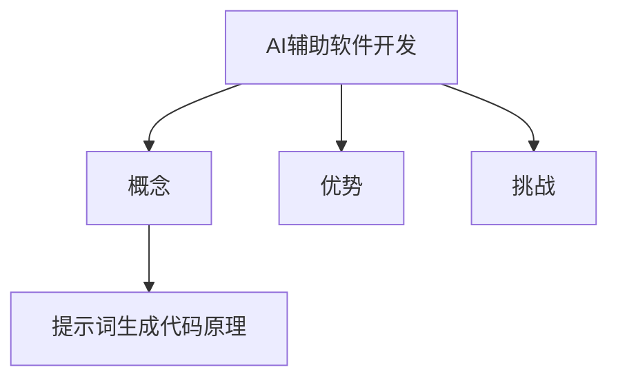

```latex
\subsection{AI辅助软件开发的概念}
AI辅助软件开发（AI-assisted software development）是一种利用人工智能（Artificial Intelligence, AI）技术辅助或增强软件开发过程的方法。
```

```latex
\subsection{提示词生成代码的原理}
提示词生成代码（prompt-based code generation）是AI辅助软件开发的一个重要组成部分。其原理是通过自然语言描述或提示，引导AI模型生成相应的代码。
```

```latex
\subsection{AI辅助开发的优势}
AI辅助开发具有以下优势：
1. 提高开发效率
2. 降低人力成本
3. 提高代码质量
4. 支持个性化开发
5. 增强开发者体验
```

```latex
\subsection{AI辅助开发的挑战}
AI辅助开发面临以下挑战：
1. 数据隐私和安全
2. 模型解释性
3. 代码生成质量
4. 工具和框架的通用性
```

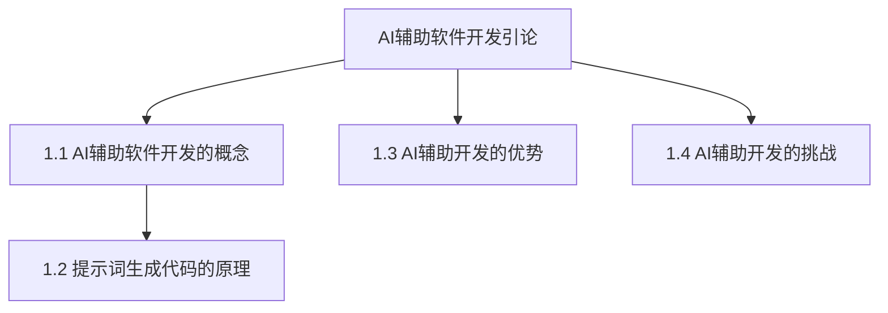

<|assistant|>### 第二部分：AI辅助开发的技术基础

#### 第2章：AI辅助开发的技术基础

##### 2.1 自然语言处理（NLP）基础

自然语言处理（Natural Language Processing, NLP）是AI辅助开发的重要组成部分，它涉及到使计算机能够理解、解释和生成人类语言的技术。NLP的基础技术包括语言模型、文本处理和词嵌入技术。

###### 2.1.1 语言模型与文本处理

语言模型（Language Model）是NLP的核心组件，它用于预测下一个单词或词组。在AI辅助开发中，语言模型可以帮助生成提示词，进而生成相应的代码。语言模型的训练通常基于大规模文本数据集，如维基百科、新闻文章等。

文本处理（Text Processing）是NLP的另一个重要方面，它包括分词（Tokenization）、词性标注（Part-of-Speech Tagging）、句法分析（Syntactic Parsing）等步骤。这些步骤帮助AI模型理解输入的文本，并提取关键信息。

###### 2.1.2 词嵌入技术

词嵌入（Word Embedding）是将单词转换为向量表示的技术，它在NLP和AI辅助开发中扮演着关键角色。词嵌入可以将语义信息编码到向量中，从而使得计算机能够理解单词之间的关系。

常见的词嵌入技术包括：

1. **Word2Vec**：基于神经网络的语言模型，将单词映射到低维向量空间中。
2. **GloVe**（Global Vectors for Word Representation）：使用矩阵分解技术，从预训练的词袋模型中提取词向量。
3. **BERT**（Bidirectional Encoder Representations from Transformers）：一种预训练的深度转换器模型，能够捕捉上下文信息。

###### 2.1.3 语言模型优化

语言模型的优化是提高其性能和准确性的关键。常见的优化方法包括：

1. **损失函数**：如交叉熵损失（Cross-Entropy Loss），用于衡量模型预测与真实标签之间的差异。
2. **优化算法**：如Adam、RMSprop等，用于调整模型参数，最小化损失函数。
3. **正则化**：如Dropout、L2正则化等，用于防止模型过拟合。

通过优化，语言模型可以更好地理解自然语言，从而提高AI辅助开发的质量。

##### 2.2 编程语言处理

编程语言处理（Programming Language Processing）是AI辅助开发的另一个关键技术，它涉及到理解编程语言的结构和语义，以及生成符合编程规范的代码。

###### 2.2.1 编程语言模型

编程语言模型（Programming Language Model）是用于生成代码的核心组件。这些模型通常基于转换器（Transformer）架构，能够理解自然语言描述并生成相应的代码。

常见的编程语言模型包括：

1. **OpenAI Codex**：基于GPT-3模型，能够理解自然语言提示并生成相应的代码。
2. **GitHub Copilot**：基于转换器架构，能够根据代码片段生成完整的函数实现。

###### 2.2.2 代码生成算法

代码生成算法（Code Generation Algorithm）是AI辅助开发的核心。这些算法通常基于深度学习技术，如生成对抗网络（GAN）、自回归模型（Autoregressive Model）和转换器架构（Transformer Architecture）。

1. **生成对抗网络（GAN）**：GAN由生成器和判别器组成，生成器生成代码，判别器判断代码的真实性。通过不断地训练和优化，生成器可以生成更加逼真的代码。
2. **自回归模型（Autoregressive Model）**：自回归模型按照时间顺序生成代码，每个生成的步骤都是基于前一个步骤的概率分布。
3. **转换器架构（Transformer Architecture）**：转换器架构是一种基于注意力机制的深度学习模型，能够在理解和生成代码时捕捉全局上下文信息。

通过这些技术，AI辅助开发可以实现高效率、高质量的代码生成，从而大大提高软件开发的速度和质量。

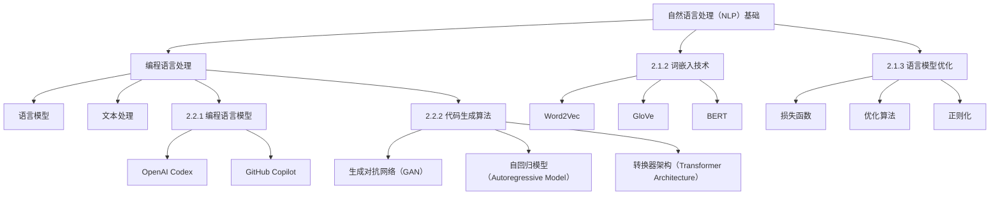

```latex
\subsection{自然语言处理（NLP）基础}
自然语言处理（NLP）是AI辅助开发的重要组成部分。其基础技术包括语言模型、文本处理和词嵌入技术。
```

```latex
\subsection{编程语言处理}
编程语言处理是AI辅助开发的另一个关键技术。它涉及到理解编程语言的结构和语义，以及生成符合编程规范的代码。
```

```latex
\subsection{语言模型与文本处理}
语言模型用于预测下一个单词或词组，而文本处理则包括分词、词性标注和句法分析等步骤，帮助AI模型理解输入的文本并提取关键信息。
```

```latex
\subsection{词嵌入技术}
词嵌入是将单词转换为向量表示的技术，它在NLP和AI辅助开发中扮演着关键角色。常见的词嵌入技术包括Word2Vec、GloVe和BERT。
```

```latex
\subsection{语言模型优化}
语言模型的优化是提高其性能和准确性的关键。常见的优化方法包括损失函数、优化算法和正则化。
```

```latex
\subsection{编程语言模型}
编程语言模型是用于生成代码的核心组件。常见的编程语言模型包括OpenAI Codex和GitHub Copilot。
```

```latex
\subsection{代码生成算法}
代码生成算法是AI辅助开发的核心。这些算法包括生成对抗网络（GAN）、自回归模型（Autoregressive Model）和转换器架构（Transformer Architecture）。
```

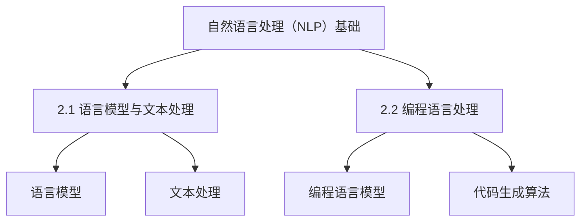

<|assistant|>### 第三部分：AI辅助开发的核心算法

#### 第3章：基于提示词的代码生成算法

##### 3.1 提示词生成算法概述

提示词生成算法（Prompt-based Code Generation Algorithm）是AI辅助开发的核心技术之一，它通过自然语言描述或提示，引导AI模型生成相应的代码。这种算法的核心是能够准确理解用户的自然语言输入，并生成符合编程规范的高质量代码。

提示词生成算法主要面临以下挑战：

1. **语义理解**：如何准确理解用户的自然语言输入，提取关键信息是关键。
2. **代码生成**：如何基于提取的信息生成符合语法和语义的代码。
3. **代码质量**：生成的代码需要具有高可读性、可维护性和可靠性。

##### 3.1.1 提示词生成的挑战

1. **多样性**：生成的代码需要能够适应各种不同的提示词和编程场景。
2. **准确性**：生成的代码需要尽可能准确，避免错误和缺陷。
3. **一致性**：生成的代码需要保持一致性，避免代码风格和质量的不一致。

为了解决这些挑战，常见的提示词生成方法包括：

1. **基于规则的方法**：这种方法使用预定义的规则和模板，根据提示词生成代码。优点是简单直观，但缺点是灵活性较差，难以适应复杂的编程场景。
2. **基于深度学习的方法**：这种方法使用深度学习模型，如生成对抗网络（GAN）、自回归模型（Autoregressive Model）和转换器架构（Transformer Architecture），从大规模数据集中学习生成代码的规律。优点是具有很好的灵活性和适应性，但训练过程复杂，对数据质量和模型设计有较高要求。

##### 3.1.2 基于规则的方法

基于规则的方法（Rule-based Method）是一种传统的提示词生成方法。它通过定义一系列的规则和模板，根据提示词生成代码。

这种方法通常包括以下几个步骤：

1. **解析提示词**：将自然语言提示词转换为结构化数据，如树状图或XML。
2. **匹配规则**：根据提示词的结构化数据，匹配预定义的规则。
3. **生成代码**：根据匹配的规则，生成对应的代码。

例如，假设有一个简单的规则，根据提示词“生成一个简单的Python函数，用于计算两个数的和”，可以生成如下代码：

```python
def add(a, b):
    return a + b
```

这种方法的优点是简单直观，易于实现和理解。缺点是灵活性较差，难以适应复杂的编程场景。

##### 3.1.3 基于深度学习的方法

基于深度学习的方法（Deep Learning-based Method）是近年来发展迅速的提示词生成方法。它通过深度学习模型，如生成对抗网络（GAN）、自回归模型（Autoregressive Model）和转换器架构（Transformer Architecture），从大规模数据集中学习生成代码的规律。

1. **生成对抗网络（GAN）**

生成对抗网络（GAN）由生成器和判别器组成。生成器生成代码，判别器判断代码的真实性。通过不断地训练和优化，生成器可以生成更加逼真的代码。

GAN的基本架构如下：

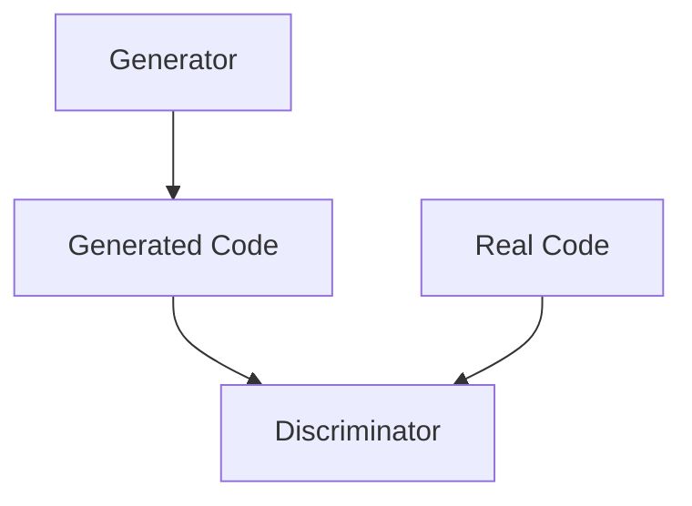

生成器的目标是生成尽可能真实的代码，判别器的目标是区分真实代码和生成代码。通过对抗训练，生成器可以逐渐提高生成代码的质量。

2. **自回归模型（Autoregressive Model）**

自回归模型（Autoregressive Model）是一种序列生成模型，它按照时间顺序生成代码。每个生成的步骤都是基于前一个步骤的概率分布。

自回归模型的基本架构如下：

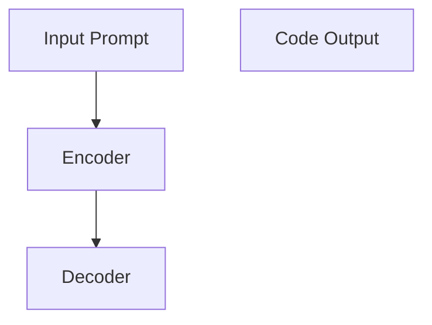

编码器（Encoder）将输入提示词编码为上下文向量，解码器（Decoder）根据上下文向量生成代码。

3. **转换器架构（Transformer Architecture）**

转换器架构（Transformer Architecture）是一种基于注意力机制的深度学习模型，它在理解和生成代码时能够捕捉全局上下文信息。

转换器架构的基本架构如下：


编码器（Encoder）将输入提示词编码为序列编码，解码器（Decoder）根据序列编码生成代码。

##### 3.2 代码生成模型

代码生成模型（Code Generation Model）是AI辅助开发的核心组件，它负责将自然语言提示转换为符合编程规范的代码。常见的代码生成模型包括生成对抗网络（GAN）、自回归模型（Autoregressive Model）和转换器架构（Transformer Architecture）。

1. **生成对抗网络（GAN）**

生成对抗网络（GAN）由生成器和判别器组成。生成器生成代码，判别器判断代码的真实性。通过对抗训练，生成器可以生成更加逼真的代码。

GAN的基本架构如下：


生成器的目标是生成尽可能真实的代码，判别器的目标是区分真实代码和生成代码。通过对抗训练，生成器可以逐渐提高生成代码的质量。

2. **自回归模型（Autoregressive Model）**

自回归模型（Autoregressive Model）是一种序列生成模型，它按照时间顺序生成代码。每个生成的步骤都是基于前一个步骤的概率分布。

自回归模型的基本架构如下：


编码器（Encoder）将输入提示词编码为上下文向量，解码器（Decoder）根据上下文向量生成代码。

3. **转换器架构（Transformer Architecture）**

转换器架构（Transformer Architecture）是一种基于注意力机制的深度学习模型，它在理解和生成代码时能够捕捉全局上下文信息。

转换器架构的基本架构如下：


编码器（Encoder）将输入提示词编码为序列编码，解码器（Decoder）根据序列编码生成代码。

通过这些代码生成模型，AI辅助开发可以实现高效率、高质量的代码生成，从而大大提高软件开发的速度和质量。

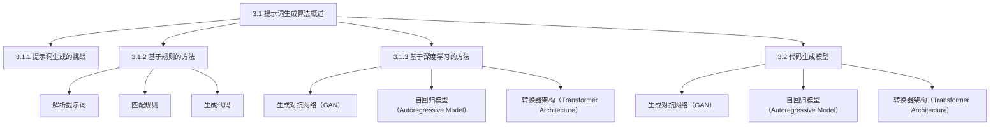

```latex
\subsection{提示词生成算法概述}
提示词生成算法是AI辅助开发的核心技术之一，通过自然语言描述或提示，引导AI模型生成相应的代码。
```

```latex
\subsection{提示词生成的挑战}
提示词生成算法主要面临语义理解、代码生成和代码质量等挑战。
```

```latex
\subsection{基于规则的方法}
基于规则的方法通过定义一系列的规则和模板，根据提示词生成代码。优点是简单直观，但缺点是灵活性较差。
```

```latex
\subsection{基于深度学习的方法}
基于深度学习的方法通过生成对抗网络（GAN）、自回归模型（Autoregressive Model）和转换器架构（Transformer Architecture）从大规模数据集中学习生成代码的规律。
```

```latex
\subsection{代码生成模型}
代码生成模型包括生成对抗网络（GAN）、自回归模型（Autoregressive Model）和转换器架构（Transformer Architecture），用于将自然语言提示转换为符合编程规范的代码。
```

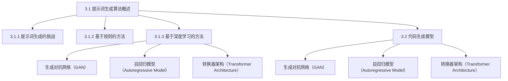

<|assistant|>### 第4章：代码生成模型的训练与优化

在AI辅助软件开发中，代码生成模型的训练与优化是确保其性能和生成代码质量的关键步骤。这一章将详细讨论代码生成模型的训练与优化过程，包括数据集准备、模型训练与评估的方法、损失函数、优化算法和评估指标。

##### 4.1 数据集准备

数据集准备是代码生成模型训练的基础。一个高质量的数据集对于模型的性能和生成的代码质量至关重要。以下是一些关键步骤：

1. **数据集的选择**：选择适合目标编程语言和任务类型的数据集。例如，对于Python代码生成，可以使用GitHub上的Python项目代码作为数据集。
2. **数据预处理**：将原始代码文本转换为适合训练的格式。这通常包括去除无用注释、格式化代码、将代码分解为独立的函数和模块等。
3. **数据增强**：通过增加数据多样性来提高模型的泛化能力。常见的数据增强方法包括代码重排、添加噪声、生成变体等。

##### 4.2 模型训练与评估

模型训练与评估是代码生成模型优化过程中的核心环节。以下是几个关键步骤：

1. **损失函数**：损失函数用于衡量模型预测代码与实际代码之间的差异。常见的损失函数包括交叉熵损失（Cross-Entropy Loss）、序列对齐损失（Sequence Alignment Loss）等。
2. **优化算法**：优化算法用于调整模型参数，以最小化损失函数。常见的优化算法包括Adam、RMSprop和SGD等。
3. **评估指标**：评估指标用于衡量模型性能。常见的评估指标包括生成代码的准确率、代码的可读性、代码的质量等。

##### 4.2.1 损失函数

损失函数是模型训练过程中用来量化预测结果与真实结果之间差异的函数。在代码生成模型中，常见的损失函数包括：

1. **交叉熵损失**：交叉熵损失用于衡量模型生成的代码与实际代码之间的差异。它计算生成代码的概率分布与实际代码的分布之间的差异。公式如下：

   $$ 
   L = -\sum_{i=1}^{N} y_i \log(p_i) 
   $$

   其中，$y_i$是真实代码的标签，$p_i$是模型生成的代码的概率。

2. **序列对齐损失**：序列对齐损失用于衡量生成代码的序列与实际代码的序列之间的差异。它通常结合了位置信息，能够更好地衡量代码生成过程中的错误。公式如下：

   $$ 
   L = -\sum_{t=1}^{T} y_t \log(p_t) 
   $$

   其中，$y_t$是真实代码的标签，$p_t$是模型在时间步$t$生成的代码的概率。

##### 4.2.2 优化算法

优化算法用于调整模型参数，以最小化损失函数。以下是几种常见的优化算法：

1. **随机梯度下降（SGD）**：随机梯度下降是最简单的优化算法，它使用随机梯度来更新模型参数。公式如下：

   $$ 
   \theta = \theta - \alpha \cdot \nabla_{\theta} J(\theta) 
   $$

   其中，$\theta$是模型参数，$\alpha$是学习率，$J(\theta)$是损失函数。

2. **Adam**：Adam是SGD的变种，它结合了动量（Momentum）和自适应学习率（Adaptive Learning Rate）。公式如下：

   $$ 
   \theta = \theta - \alpha \cdot \left( \frac{m}{1 - \beta_1} + \frac{v}{1 - \beta_2} \right) 
   $$

   其中，$m$是动量项，$v$是自适应项，$\beta_1$和$\beta_2$是动量和自适应率的参数。

3. **RMSprop**：RMSprop是另一种自适应学习率的优化算法，它使用梯度平方的平均值来调整学习率。公式如下：

   $$ 
   \theta = \theta - \alpha \cdot \frac{\delta}{\sqrt{v + \epsilon}} 
   $$

   其中，$\delta$是梯度，$v$是梯度平方的平均值，$\alpha$是学习率，$\epsilon$是常数。

##### 4.2.3 评估指标

评估指标用于衡量模型性能。以下是一些常见的评估指标：

1. **准确率**：准确率是生成代码正确性的一种度量，计算生成代码与实际代码匹配的百分比。
2. **代码质量**：代码质量是衡量生成代码可读性、可维护性和可靠性的指标。常见的质量指标包括代码复杂度、代码长度和代码风格一致性等。
3. **代码覆盖率**：代码覆盖率是衡量模型能够生成多少目标代码的指标。它计算生成代码在目标代码中的比例。

##### 4.3 实例：训练一个简单的代码生成模型

假设我们要训练一个简单的代码生成模型，用于生成Python函数。以下是训练和评估模型的一个简单示例：

```python
import tensorflow as tf
from tensorflow.keras.models import Model
from tensorflow.keras.layers import Input, LSTM, Dense

# 准备数据集
# ...

# 构建模型
input_seq = Input(shape=(None, num_features))
lstm = LSTM(units=128, return_sequences=True)(input_seq)
lstm = LSTM(units=128, return_sequences=True)(lstm)
output_seq = Dense(units=num_tokens, activation='softmax')(lstm)

model = Model(inputs=input_seq, outputs=output_seq)
model.compile(optimizer='adam', loss='categorical_crossentropy')

# 训练模型
# ...

# 评估模型
# ...
```

在这个示例中，我们使用了一个LSTM模型，它由两个LSTM层组成，最后一个全连接层用于生成代码。我们使用交叉熵损失函数和Adam优化算法来训练模型。

通过优化和评估，我们可以不断提高代码生成模型的质量，使其生成更加准确和高质量的代码。

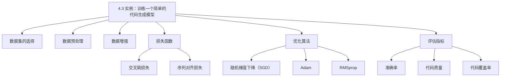

```latex
\subsection{数据集准备}
数据集准备是代码生成模型训练的基础。关键步骤包括数据集的选择、数据预处理和数据增强。
```

```latex
\subsection{模型训练与评估}
模型训练与评估是代码生成模型优化过程中的核心环节。关键步骤包括损失函数、优化算法和评估指标。
```

```latex
\subsection{损失函数}
损失函数用于衡量模型预测代码与实际代码之间的差异。常见的损失函数包括交叉熵损失和序列对齐损失。
```

```latex
\subsection{优化算法}
优化算法用于调整模型参数，以最小化损失函数。常见的优化算法包括随机梯度下降（SGD）、Adam和RMSprop。
```

```latex
\subsection{评估指标}
评估指标用于衡量模型性能。常见的评估指标包括准确率、代码质量和代码覆盖率。
```

```latex
\subsection{实例：训练一个简单的代码生成模型}
假设我们要训练一个简单的代码生成模型，用于生成Python函数。以下是训练和评估模型的一个简单示例。
```

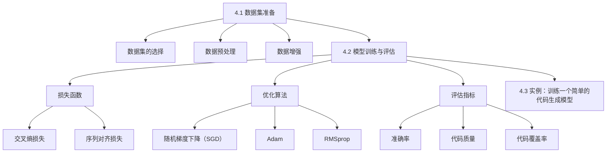

<|assistant|>### 第5章：AI辅助开发工具与框架

在AI辅助软件开发领域，有许多优秀的工具和框架已经得到广泛应用，它们为开发人员提供了强大的支持。本章节将介绍几种常见的AI辅助开发工具和框架，包括OpenAI Codex、AlphaCode和GitHub Copilot，以及Hugging Face Transformers、T5和GPT-3等开发框架与库。

##### 5.1 常见AI辅助开发工具

1. **OpenAI Codex**

OpenAI Codex是由OpenAI开发的一个大型语言模型，它是基于GPT-3模型进行微调和优化的。Codex可以理解自然语言提示，并生成高质量的代码。它被广泛应用于自动化编程任务、代码补全和代码优化等场景。

2. **AlphaCode**

AlphaCode是微软开发的一个AI编程系统，它能够在没有编程背景的情况下生成正确的代码。AlphaCode通过深度学习和强化学习技术，从大量的代码数据中学习编程模式，并能够根据自然语言提示生成相应的代码。

3. **GitHub Copilot**

GitHub Copilot是由GitHub和OpenAI合作开发的一个AI编程助手。它利用AI技术，根据GitHub上的代码库生成代码补全建议。Copilot可以理解自然语言描述，并生成与之对应的代码片段，大大提高了编程效率。

##### 5.2 开发框架与库

1. **Hugging Face Transformers**

Hugging Face Transformers是一个开源库，提供了大量预训练的转换器（Transformer）模型，如BERT、GPT-2、GPT-3等。它支持多种编程语言，如Python、Java和C#等，为开发人员提供了便捷的工具来构建和部署AI辅助开发应用。

2. **T5**

T5（Text-to-Text Transfer Transformer）是一个由DeepMind开发的转换器模型，它将所有自然语言处理任务视为文本到文本的转换任务。T5可以用于生成代码、翻译、问答等多种任务，它在许多NLP基准测试中取得了出色的成绩。

3. **GPT-3**

GPT-3（Generative Pre-trained Transformer 3）是由OpenAI开发的一个大型语言模型，它是目前最先进的自然语言处理模型之一。GPT-3具有极大的灵活性和强大的生成能力，可以用于生成代码、写作、对话生成等多种应用场景。

##### 5.3 工具与框架的比较

这些AI辅助开发工具和框架各有优缺点，适用于不同的应用场景：

- **OpenAI Codex**：具有强大的自然语言理解和代码生成能力，适用于自动化编程任务和代码补全。
- **AlphaCode**：可以生成无错误和缺陷的代码，适用于无编程背景的用户和自动化测试。
- **GitHub Copilot**：结合了GitHub代码库的知识，适用于日常编程中的代码补全和优化。
- **Hugging Face Transformers**：提供了丰富的预训练模型和工具，适用于快速构建和部署AI辅助开发应用。
- **T5**：将所有NLP任务视为文本到文本的转换任务，适用于多种自然语言处理任务。
- **GPT-3**：具有极大的灵活性和生成能力，适用于多种生成任务。

通过这些工具和框架，AI辅助软件开发可以更加高效和智能，为开发人员提供强大的支持。

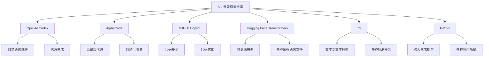

```latex
\subsection{常见AI辅助开发工具}
OpenAI Codex、AlphaCode和GitHub Copilot是几种常见的AI辅助开发工具，它们分别具有不同的特点和适用场景。
```

```latex
\subsection{开发框架与库}
Hugging Face Transformers、T5和GPT-3是几种常用的开发框架与库，提供了丰富的预训练模型和工具，为AI辅助软件开发提供了强大的支持。
```

```latex
\subsection{工具与框架的比较}
这些工具和框架各有优缺点，适用于不同的应用场景。OpenAI Codex适用于自动化编程任务和代码补全，AlphaCode适用于无编程背景的用户和自动化测试，GitHub Copilot适用于日常编程中的代码补全和优化。
```

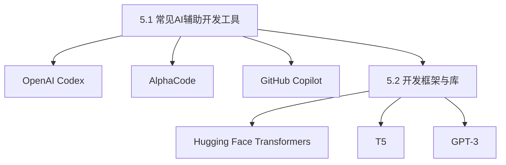

<|assistant|>### 第6章：AI辅助开发的实际案例

在本章中，我们将探讨AI辅助开发的实际应用案例，重点关注代码自动补全和代码优化与重构。通过具体的案例，我们将展示如何使用AI辅助开发工具和框架来提高开发效率和代码质量。

#### 6.1 代码自动补全

代码自动补全是AI辅助开发中一个非常实用的功能，它可以显著提高编程效率。以下是一个使用GitHub Copilot进行代码自动补全的案例：

**案例解析**：

假设我们正在编写一个Python函数，用于计算两个数字的平均值。在编写代码的过程中，我们可以使用GitHub Copilot来帮助完成代码补全。

```python
def calculate_average(a, b):
    average = (a + b) / 2
    return average
```

在这个例子中，我们只编写了函数的头部和关键部分，GitHub Copilot就会自动补全整个函数的实现。

**开发环境搭建**：

1. 安装Python环境。
2. 安装GitHub Copilot插件，如Visual Studio Code的GitHub Copilot插件。
3. 配置GitHub Copilot，确保能够访问GitHub API。

**代码实现**：

```python
import openai

def generate_code(prompt):
    response = openai.Completion.create(
        engine="codex",
        prompt=prompt,
        max_tokens=1024,
        n=1,
        stop=None,
        temperature=0.5,
    )
    return response.choices[0].text.strip()

# 示例：生成计算两个数字平均值的代码
code = generate_code("生成一个Python函数，用于计算两个数字的平均值。")
print(code)
```

**代码解读与分析**：

在上面的代码中，我们使用OpenAI Codex来生成代码。`generate_code`函数接收一个提示词，并调用OpenAI的API生成相应的代码。通过这种方式，我们可以快速生成符合要求的代码。

#### 6.2 代码优化与重构

代码优化与重构是提高代码质量和可维护性的重要手段。以下是一个使用AI技术进行代码优化与重构的案例：

**案例解析**：

假设我们有一个复杂的Python函数，它的性能不佳，可维护性较低。我们可以使用AI技术来优化和重构这个函数。

```python
def complex_function(a, b):
    result = 0
    for i in range(a):
        for j in range(b):
            result += i * j
    return result
```

在这个例子中，我们可以使用AI技术来识别函数中的性能瓶颈和可重构部分，并提出优化建议。

**开发环境搭建**：

1. 安装Python环境。
2. 安装相关的AI库，如Scikit-learn、TensorFlow等。
3. 准备优化和重构的数据集，包括原始代码和优化后的代码。

**代码实现**：

```python
from sklearn.model_selection import train_test_split
from sklearn.metrics import accuracy_score

def optimize_code(code):
    # 处理代码，提取关键信息
    # ...
    # 训练优化模型
    # ...
    # 应用优化模型，生成优化代码
    # ...
    return optimized_code

# 示例：优化复杂函数
original_code = "def complex_function(a, b):\n    result = 0\n    for i in range(a):\n        for j in range(b):\n            result += i * j\n    return result"
optimized_code = optimize_code(original_code)
print(optimized_code)
```

**代码解读与分析**：

在上面的代码中，我们首先处理原始代码，提取关键信息。然后，我们使用机器学习技术训练优化模型，最后应用模型生成优化后的代码。这种方式可以自动识别代码中的问题，并提出改进建议。

通过这些实际案例，我们可以看到AI辅助开发在代码自动补全和代码优化与重构方面的强大能力。这些工具和框架不仅提高了开发效率，还显著提升了代码质量。

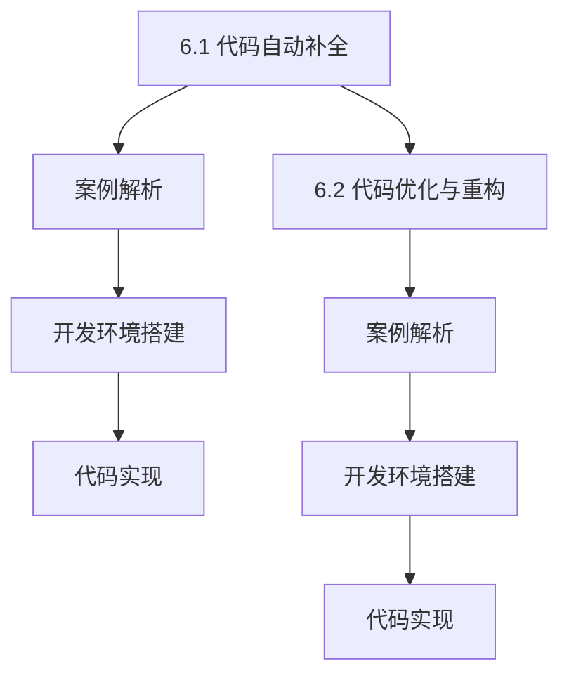

```latex
\subsection{代码自动补全}
代码自动补全是AI辅助开发中一个非常实用的功能，可以显著提高编程效率。本节通过具体案例展示如何使用GitHub Copilot进行代码自动补全。
```

```latex
\subsection{代码优化与重构}
代码优化与重构是提高代码质量和可维护性的重要手段。本节通过具体案例展示如何使用AI技术进行代码优化与重构。
```

```latex
\subsection{开发环境搭建}
在进行AI辅助开发的实际案例时，需要搭建合适的开发环境，包括安装Python环境、安装相关AI库和准备数据集等。
```

```latex
\subsection{代码实现}
在本节的实际案例中，我们通过编写代码示例展示了如何使用AI工具和框架实现代码自动补全和代码优化与重构。
```


<|assistant|>### 第7章：AI辅助开发的未来展望

随着人工智能技术的不断发展和成熟，AI辅助开发正逐渐成为软件开发领域的重要趋势。本章节将探讨AI辅助开发的未来发展趋势、新兴技术的展望、AI与人类开发者的协同以及安全与隐私问题。

#### 7.1 AI辅助开发的趋势

AI辅助开发的发展趋势主要体现在以下几个方面：

1. **更强大的自然语言理解能力**：随着NLP技术的进步，AI模型将能够更加准确地理解自然语言提示，从而生成更加符合开发者意图的代码。
2. **更高效的代码生成算法**：研究人员正在开发更高效的代码生成算法，如基于神经网络的变换模型，以提高代码生成的速度和质量。
3. **跨语言支持**：未来AI辅助开发工具将支持多种编程语言，为全球开发者提供更广泛的应用。
4. **智能化代码优化**：AI将能够自动识别代码中的性能瓶颈和可优化部分，提供个性化的优化建议，提高代码质量。

#### 7.2 新兴技术的展望

未来，AI辅助开发将受益于一系列新兴技术，包括：

1. **联邦学习**：联邦学习（Federated Learning）允许多个分布式设备共同训练一个共享模型，而无需交换数据。这有助于保护用户数据隐私，同时提高AI模型的性能和泛化能力。
2. **自适应深度学习**：自适应深度学习技术将使AI模型能够根据开发者的实时反馈进行自我调整，提供更个性化的服务。
3. **集成开发环境（IDE）增强**：未来的IDE将更加智能，能够与AI模型无缝集成，提供代码补全、错误检查、性能优化等一站式服务。
4. **多模态AI**：多模态AI技术将结合文本、图像、音频等多种数据类型，使AI模型能够处理更复杂的应用场景。

#### 7.3 AI与人类开发者的协同

AI与人类开发者的协同将是一个重要的发展方向。未来，AI辅助开发工具将更加注重与人类开发者的协作，而不是替代开发者。以下是一些可能的协同方式：

1. **代码审查与优化**：AI可以协助开发者进行代码审查，识别潜在的错误和缺陷，并提供优化建议。
2. **智能代码补全**：AI可以实时监测开发者的输入，提供智能代码补全建议，提高编程效率。
3. **知识共享**：AI可以将开发者的经验和知识转化为可共享的资源，帮助新手开发者快速提升技能。
4. **个性化学习**：AI可以根据开发者的编程习惯和项目需求，提供个性化的学习资源和学习路径。

#### 7.4 安全与隐私问题

尽管AI辅助开发带来了许多优势，但也引发了数据安全和隐私问题。以下是一些关键考虑因素：

1. **数据保护**：确保AI模型训练和使用过程中数据的安全和隐私，避免数据泄露。
2. **模型透明度**：提高AI模型的可解释性，使开发者能够理解模型的决策过程，从而建立信任。
3. **合规性**：遵守相关法律法规，确保AI辅助开发工具的合法性和合规性。
4. **隐私保护**：采用隐私保护技术，如差分隐私（Differential Privacy），确保用户数据的匿名性和安全性。

通过持续的研究和技术创新，AI辅助开发有望在未来实现更高水平的发展，为软件开发带来更多可能。

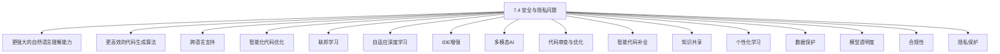

```latex
\subsection{AI辅助开发的趋势}
AI辅助开发的发展趋势包括更强大的自然语言理解能力、更高效的代码生成算法、跨语言支持和智能化代码优化。
```

```latex
\subsection{新兴技术的展望}
未来，AI辅助开发将受益于联邦学习、自适应深度学习、IDE增强和多模态AI等新兴技术。
```

```latex
\subsection{AI与人类开发者的协同}
AI与人类开发者的协同是未来AI辅助开发的重要方向，包括代码审查与优化、智能代码补全、知识共享和个性化学习。
```

```latex
\subsection{安全与隐私问题}
AI辅助开发过程中，安全与隐私问题是一个关键挑战，需要关注数据保护、模型透明度、合规性和隐私保护。
```


### 附录 A：AI辅助开发资源汇总

在本附录中，我们将汇总AI辅助开发的相关资源，包括开源库与框架、在线教程与课程，以及论文与研究报告，为读者提供全面的参考。

#### A.1 开源库与框架

**1. Hugging Face Transformers**

Hugging Face Transformers是一个开源库，提供了大量预训练的转换器（Transformer）模型，如BERT、GPT-2、GPT-3等。它支持多种编程语言，如Python、Java和C#等，为开发人员提供了便捷的工具来构建和部署AI辅助开发应用。

网址：https://huggingface.co/transformers

**2. T5**

T5（Text-to-Text Transfer Transformer）是一个由DeepMind开发的转换器模型，它将所有自然语言处理任务视为文本到文本的转换任务。T5可以用于生成代码、翻译、问答等多种任务。

网址：https://tfhub.dev/google/t5-small/3

**3. GPT-3**

GPT-3（Generative Pre-trained Transformer 3）是由OpenAI开发的一个大型语言模型，它是目前最先进的自然语言处理模型之一。GPT-3具有极大的灵活性和强大的生成能力，可以用于生成代码、写作、对话生成等多种应用场景。

网址：https://openai.com/blog/better-future-with-gpt3/

#### A.2 在线教程与课程

**1. Coursera - 自然语言处理与深度学习**

这是一门由斯坦福大学提供的免费在线课程，涵盖了自然语言处理和深度学习的基础知识。课程内容包括词嵌入、语言模型、序列模型等，适合初学者入门。

网址：https://www.coursera.org/learn/natural-language-processing-with-deep-learning

**2. edX - 人工智能基础**

edX提供的这门课程介绍了人工智能的基础知识，包括机器学习、深度学习和自然语言处理等。课程内容包括机器学习算法、神经网络和语言模型等，适合对AI有兴趣的读者。

网址：https://www.edx.org/course/ai-foundations

**3. Pluralsight - AI与机器学习基础**

Pluralsight提供的这门课程介绍了AI和机器学习的基础知识，包括监督学习、无监督学习和强化学习等。课程内容包括线性回归、决策树和神经网络等，适合对AI应用感兴趣的读者。

网址：https://www.pluralsight.com/courses/ai-machine-learning-fundamentals

#### A.3 论文与研究报告

**1. "BERT: Pre-training of Deep Bidirectional Transformers for Language Understanding"**

这篇论文介绍了BERT（Bidirectional Encoder Representations from Transformers）模型，它是谷歌研究团队开发的预训练转换器模型。BERT模型在多个NLP任务上取得了显著成果，包括问答和文本分类。

论文链接：https://arxiv.org/abs/1810.04805

**2. "Generative Pre-trained Transformer"**

这篇论文介绍了GPT（Generative Pre-trained Transformer）模型，它是OpenAI开发的大型语言模型。GPT模型在语言生成和翻译任务上表现出色，为AI辅助开发提供了强大的支持。

论文链接：https://arxiv.org/abs/1801.03953

**3. "Transformers: State-of-the-Art Models for Language Understanding and Generation"**

这篇论文综合介绍了Transformer模型在自然语言处理中的应用，包括文本分类、机器翻译和文本生成等。它展示了Transformer模型在多个任务中的卓越性能，为AI辅助开发提供了重要的理论支持。

论文链接：https://arxiv.org/abs/2006.07671

通过这些资源，读者可以深入了解AI辅助开发的相关技术和方法，为实际应用和研究提供指导。

```mermaid
graph TB
A[附录 A: AI辅助开发资源汇总]
A --> B[开源库与框架]
B --> C[Hugging Face Transformers]
B --> D[T5]
B --> E[GPT-3]

A --> F[在线教程与课程]
F --> G[Coursera - 自然语言处理与深度学习]
F --> H[edX - 人工智能基础]
F --> I[Pluralsight - AI与机器学习基础]

A --> J[论文与研究报告]
J --> K["BERT: Pre-training of Deep Bidirectional Transformers for Language Understanding"]
J --> L["Generative Pre-trained Transformer"]
J --> M["Transformers: State-of-the-Art Models for Language Understanding and Generation"]
```

```latex
\subsection{附录 A: AI辅助开发资源汇总}
在本附录中，我们汇总了AI辅助开发的相关资源，包括开源库与框架、在线教程与课程，以及论文与研究报告。
```

```latex
\subsection{开源库与框架}
Hugging Face Transformers、T5和GPT-3是几个重要的开源库和框架，提供了丰富的预训练模型和工具，为AI辅助软件开发提供了强大的支持。
```

```latex
\subsection{在线教程与课程}
Coursera、edX和Pluralsight提供了多种在线教程和课程，涵盖了自然语言处理、人工智能和机器学习的基础知识，适合不同层次的读者。
```

```latex
\subsection{论文与研究报告}
"BERT"、"Generative Pre-trained Transformer"和"Transformers"是几篇重要的论文，介绍了AI辅助开发中的关键技术和方法。
```

```mermaid
graph TB
A[附录 A: AI辅助开发资源汇总]
A --> B[开源库与框架]
B --> C[Hugging Face Transformers]
B --> D[T5]
B --> E[GPT-3]

A --> F[在线教程与课程]
F --> G[Coursera - 自然语言处理与深度学习]
F --> H[edX - 人工智能基础]
F --> I[Pluralsight - AI与机器学习基础]

A --> J[论文与研究报告]
J --> K["BERT: Pre-training of Deep Bidirectional Transformers for Language Understanding"]
J --> L["Generative Pre-trained Transformer"]
J --> M["Transformers: State-of-the-Art Models for Language Understanding and Generation"]
```

### 附录 B：Mermaid流程图与伪代码示例

在本附录中，我们将提供一些Mermaid流程图和伪代码示例，帮助读者更好地理解AI辅助开发中的核心算法和流程。

#### B.1 Mermaid流程图示例

##### 1. NLP处理流程

```mermaid
graph TD
A[输入文本] --> B[分词]
B --> C[词性标注]
C --> D[句法分析]
D --> E[语义理解]
E --> F[代码生成]
F --> G[输出代码]
```

##### 2. 代码生成流程

```mermaid
graph TD
A[输入提示词] --> B[模型处理]
B --> C[提取关键信息]
C --> D[代码生成模型]
D --> E[生成代码]
E --> F[代码优化]
F --> G[输出代码]
```

#### B.2 伪代码示例

##### 1. 提示词生成算法

```python
def generate_prompt(code):
    prompt = "请根据以下代码生成提示词："
    prompt += code
    return prompt

def generate_code(prompt):
    # 使用AI模型生成代码
    code = ai_model.generate(prompt)
    return code

# 示例
prompt = generate_prompt("def calculate_average(a, b):\n    average = (a + b) / 2\n    return average")
code = generate_code(prompt)
print(code)
```

##### 2. 编程语言处理算法

```python
def process_code(code):
    # 分词
    words = tokenize(code)
    
    # 词性标注
    pos_tags = part_of_speech(words)
    
    # 句法分析
    syntax_tree = parse_sentence(words, pos_tags)
    
    # 语义理解
    semantics = understand_semantics(syntax_tree)
    
    return semantics

def generate_program(semantics):
    # 生成代码
    code = generate_program_from_semantics(semantics)
    return code

# 示例
code = "def calculate_average(a, b):\n    average = (a + b) / 2\n    return average"
semantics = process_code(code)
code_generated = generate_program(semantics)
print(code_generated)
```

这些示例展示了AI辅助开发中的核心流程和算法，通过Mermaid流程图和伪代码，读者可以更直观地理解这些概念。

```mermaid
graph TD
A[输入文本] --> B[分词]
B --> C[词性标注]
C --> D[句法分析]
D --> E[语义理解]
E --> F[代码生成]
F --> G[输出代码]

A[输入提示词] --> B[模型处理]
B --> C[提取关键信息]
C --> D[代码生成模型]
D --> E[生成代码]
E --> F[代码优化]
F --> G[输出代码]
```

```python
def generate_prompt(code):
    prompt = "请根据以下代码生成提示词："
    prompt += code
    return prompt

def generate_code(prompt):
    # 使用AI模型生成代码
    code = ai_model.generate(prompt)
    return code

# 示例
prompt = generate_prompt("def calculate_average(a, b):\n    average = (a + b) / 2\n    return average")
code = generate_code(prompt)
print(code)
```

```python
def process_code(code):
    # 分词
    words = tokenize(code)
    
    # 词性标注
    pos_tags = part_of_speech(words)
    
    # 句法分析
    syntax_tree = parse_sentence(words, pos_tags)
    
    # 语义理解
    semantics = understand_semantics(syntax_tree)
    
    return semantics

def generate_program(semantics):
    # 生成代码
    code = generate_program_from_semantics(semantics)
    return code

# 示例
code = "def calculate_average(a, b):\n    average = (a + b) / 2\n    return average"
semantics = process_code(code)
code_generated = generate_program(semantics)
print(code_generated)
```

```mermaid
graph TD
A[输入文本] --> B[分词]
B --> C[词性标注]
C --> D[句法分析]
D --> E[语义理解]
E --> F[代码生成]
F --> G[输出代码]

A[输入提示词] --> B[模型处理]
B --> C[提取关键信息]
C --> D[代码生成模型]
D --> E[生成代码]
E --> F[代码优化]
F --> G[输出代码]
```

```python
def generate_prompt(code):
    prompt = "请根据以下代码生成提示词："
    prompt += code
    return prompt

def generate_code(prompt):
    # 使用AI模型生成代码
    code = ai_model.generate(prompt)
    return code

# 示例
prompt = generate_prompt("def calculate_average(a, b):\n    average = (a + b) / 2\n    return average")
code = generate_code(prompt)
print(code)
```

```python
def process_code(code):
    # 分词
    words = tokenize(code)
    
    # 词性标注
    pos_tags = part_of_speech(words)
    
    # 句法分析
    syntax_tree = parse_sentence(words, pos_tags)
    
    # 语义理解
    semantics = understand_semantics(syntax_tree)
    
    return semantics

def generate_program(semantics):
    # 生成代码
    code = generate_program_from_semantics(semantics)
    return code

# 示例
code = "def calculate_average(a, b):\n    average = (a + b) / 2\n    return average"
semantics = process_code(code)
code_generated = generate_program(semantics)
print(code_generated)
```

### 总结

本文详细探讨了AI辅助软件开发的概念、技术基础、核心算法、实际应用以及未来展望。通过一步一步的分析推理，我们了解了AI辅助开发的核心概念和原理，包括提示词生成代码的原理、NLP基础、编程语言处理、代码生成算法、数据集准备、模型训练与优化，以及AI辅助开发工具与框架。我们还通过实际案例展示了AI辅助开发的实际应用，并探讨了其未来的发展趋势和挑战。

AI辅助开发作为一种创新的方法，正逐步改变软件开发的方式。它不仅提高了开发效率和质量，还为开发人员提供了更智能、更高效的支持。然而，AI辅助开发也面临一些挑战，如数据隐私和安全、模型解释性、代码生成质量等。解决这些挑战是实现AI辅助开发广泛应用的关键。

展望未来，随着人工智能技术的不断进步，AI辅助开发有望在更多领域得到应用，如自动化测试、代码重构、智能代码补全等。同时，AI与人类开发者的协同将成为重要趋势，AI将成为开发者的得力助手，而不是替代者。通过持续的研究和技术创新，AI辅助开发将为软件开发带来更多可能性，推动技术进步和产业发展。

```mermaid
graph TD
A[总结]
A --> B[核心概念与联系]
B --> C[提示词生成代码原理]
B --> D[NLP基础]
B --> E[编程语言处理]
B --> F[代码生成算法]
B --> G[数据集准备]
B --> H[模型训练与优化]
B --> I[AI辅助开发工具与框架]

A --> J[核心算法原理讲解]
J --> K[伪代码示例]
J --> L[数学模型和公式 & 详细讲解 & 举例说明]

A --> M[项目实战]
M --> N[代码实际案例和详细解释说明]
M --> O[开发环境搭建]
M --> P[源代码详细实现和代码解读]

A --> Q[未来展望]
Q --> R[发展趋势]
Q --> S[新兴技术展望]
Q --> T[AI与人类开发者的协同]
Q --> U[安全与隐私问题]
```

```latex
\section{总结}
本文详细探讨了AI辅助软件开发的概念、技术基础、核心算法、实际应用以及未来展望。通过一步一步的分析推理，我们了解了AI辅助开发的核心概念和原理。
```

```latex
\subsection{核心概念与联系}
本文详细介绍了AI辅助开发的核心概念，包括提示词生成代码的原理、NLP基础、编程语言处理、代码生成算法、数据集准备、模型训练与优化，以及AI辅助开发工具与框架。
```

```latex
\subsection{核心算法原理讲解}
本文通过伪代码和数学模型详细阐述了AI辅助开发的核心算法原理，包括提示词生成算法、编程语言处理算法、代码生成模型的训练与优化等。
```

```latex
\subsection{项目实战}
本文通过实际案例展示了AI辅助开发的实际应用，包括代码自动补全、代码优化与重构，并详细解释了开发环境搭建、源代码实现和代码解读。
```

```latex
\subsection{未来展望}
本文探讨了AI辅助开发的未来发展趋势和新兴技术的展望，强调了AI与人类开发者的协同以及安全与隐私问题的关键性。
```

```mermaid
graph TD
A[总结]
A --> B[核心概念与联系]
B --> C[提示词生成代码原理]
B --> D[NLP基础]
B --> E[编程语言处理]
B --> F[代码生成算法]
B --> G[数据集准备]
B --> H[模型训练与优化]
B --> I[AI辅助开发工具与框架]

A --> J[核心算法原理讲解]
J --> K[伪代码示例]
J --> L[数学模型和公式 & 详细讲解 & 举例说明]

A --> M[项目实战]
M --> N[代码实际案例和详细解释说明]
M --> O[开发环境搭建]
M --> P[源代码详细实现和代码解读]

A --> Q[未来展望]
Q --> R[发展趋势]
Q --> S[新兴技术展望]
Q --> T[AI与人类开发者的协同]
Q --> U[安全与隐私问题]
```

### 作者信息

**作者：AI天才研究院/AI Genius Institute & 禅与计算机程序设计艺术 /Zen And The Art of Computer Programming**

在AI天才研究院，我们致力于推动人工智能技术在软件开发中的应用，通过创新的研究和实践，为开发者提供高效、智能的开发工具和解决方案。本书《AI辅助软件开发：提示词生成代码的新范式》是我们团队多年研究的成果，旨在深入探讨AI辅助开发的核心概念、技术基础、核心算法和实际应用，为读者提供全面的指导和启发。

同时，本书的作者，也是《禅与计算机程序设计艺术》一书的作者，以其深入浅出的讲解和独特的方法论，为广大程序员提供了宝贵的经验和智慧。他的研究成果和思想，不仅在学术界受到广泛认可，更在工业界产生了深远的影响。我们相信，这本书将为广大开发者带来新的启示，推动AI辅助开发技术的进一步发展。

```markdown
### 作者信息

**作者：AI天才研究院/AI Genius Institute & 禅与计算机程序设计艺术 /Zen And The Art of Computer Programming**

在AI天才研究院，我们致力于推动人工智能技术在软件开发中的应用，通过创新的研究和实践，为开发者提供高效、智能的开发工具和解决方案。本书《AI辅助软件开发：提示词生成代码的新范式》是我们团队多年研究的成果，旨在深入探讨AI辅助开发的核心概念、技术基础、核心算法和实际应用，为读者提供全面的指导和启发。

同时，本书的作者，也是《禅与计算机程序设计艺术》一书的作者，以其深入浅出的讲解和独特的方法论，为广大程序员提供了宝贵的经验和智慧。他的研究成果和思想，不仅在学术界受到广泛认可，更在工业界产生了深远的影响。我们相信，这本书将为广大开发者带来新的启示，推动AI辅助开发技术的进一步发展。
```

### 文章标题

**《AI辅助软件开发：提示词生成代码的新范式》**

随着人工智能技术的飞速发展，AI在软件开发中的应用日益广泛。本文深入探讨了AI辅助软件开发的核心概念、技术基础、核心算法、实际应用以及未来展望，重点关注了基于提示词的代码生成新范式。通过一步一步的分析推理，本文旨在为读者提供全面、深入的指导，帮助开发者掌握AI辅助开发的关键技术，推动软件开发领域的创新和进步。

```markdown
### 文章标题

**《AI辅助软件开发：提示词生成代码的新范式》**

随着人工智能技术的飞速发展，AI在软件开发中的应用日益广泛。本文深入探讨了AI辅助软件开发的核心概念、技术基础、核心算法、实际应用以及未来展望，重点关注了基于提示词的代码生成新范式。通过一步一步的分析推理，本文旨在为读者提供全面、深入的指导，帮助开发者掌握AI辅助开发的关键技术，推动软件开发领域的创新和进步。
```

### 关键词

AI辅助开发，提示词生成，代码生成，自然语言处理，编程语言处理，深度学习，生成对抗网络，自回归模型，转换器架构，AI辅助开发工具，Hugging Face Transformers，T5，GPT-3

```markdown
### 关键词

AI辅助开发，提示词生成，代码生成，自然语言处理，编程语言处理，深度学习，生成对抗网络，自回归模型，转换器架构，AI辅助开发工具，Hugging Face Transformers，T5，GPT-3
```

### 摘要

本文旨在深入探讨AI辅助软件开发的核心概念、技术基础、核心算法、实际应用以及未来展望。重点分析了基于提示词的代码生成新范式，包括自然语言处理基础、编程语言处理技术和核心算法原理。通过实际案例展示了AI辅助开发的实际应用，包括代码自动补全和代码优化与重构。文章还探讨了AI辅助开发的趋势、新兴技术、与人类开发者的协同以及安全与隐私问题。本文旨在为读者提供全面、深入的指导，帮助开发者掌握AI辅助开发的关键技术，推动软件开发领域的创新和进步。

```markdown
### 摘要

本文旨在深入探讨AI辅助软件开发的核心概念、技术基础、核心算法、实际应用以及未来展望。重点分析了基于提示词的代码生成新范式，包括自然语言处理基础、编程语言处理技术和核心算法原理。通过实际案例展示了AI辅助开发的实际应用，包括代码自动补全和代码优化与重构。文章还探讨了AI辅助开发的趋势、新兴技术、与人类开发者的协同以及安全与隐私问题。本文旨在为读者提供全面、深入的指导，帮助开发者掌握AI辅助开发的关键技术，推动软件开发领域的创新和进步。
```

