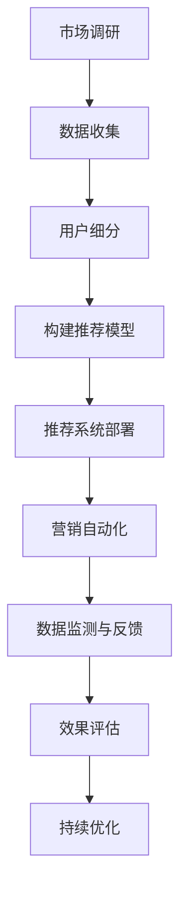

                 

# 《AI驱动的个性化营销：机遇与风险》

## 摘要

本文旨在探讨AI驱动的个性化营销所带来的机遇与风险。首先，我们将介绍AI驱动的个性化营销的基本概念和原理，包括个性化营销的定义与演变、AI在个性化营销中的应用现状以及AI驱动的个性化营销的优势与挑战。随后，我们将深入探讨AI驱动的个性化营销的核心概念，如数据收集与数据分析、用户画像与行为预测以及客户关系管理（CRM）与AI的结合。接下来，我们将介绍AI驱动的个性化营销的技术基础，包括机器学习与深度学习原理、常用算法在个性化营销中的应用以及自然语言处理与文本分析。

在第二部分，我们将探讨AI驱动个性化营销的策略，包括个性化营销策略设计、个性化营销实施与优化以及成功案例与失败案例的解析。第三部分将关注AI驱动个性化营销的风险与应对，如数据隐私与伦理问题、数据安全与网络安全、营销效果评估与风险控制等。最后，我们将展望AI驱动的个性化营销的未来发展趋势与方向，包括人工智能技术的发展趋势、个性化营销的未来方向以及全球市场与行业展望。通过本文的详细分析，我们希望能为读者提供一个全面、深入的AI驱动的个性化营销指南。

## 第一部分：基础概念与原理

### 第1章：AI驱动的个性化营销概述

#### 1.1 个性化营销的定义与演变

个性化营销是一种基于客户数据的营销策略，旨在通过深入了解客户的个性化需求和偏好，为客户提供更加精准、定制化的产品和服务。个性化营销的核心思想是将营销活动从大规模、统一化的营销模式转变为针对个体客户的个性化服务。

个性化营销的演变经历了以下几个阶段：

1. **传统营销阶段**：在这个阶段，企业通过广告、促销和公关等手段进行市场推广，营销策略较为单一，无法针对不同客户群体进行区分。

2. **精准营销阶段**：随着互联网的普及和数据技术的发展，企业开始利用大数据技术对客户行为进行数据分析和挖掘，从而实现更加精准的营销。

3. **个性化营销阶段**：在精准营销的基础上，AI技术的应用使得个性化营销得以进一步深化，通过对海量客户数据的实时分析，实现针对个体客户的精准推荐和个性化服务。

#### 1.2 AI在个性化营销中的应用现状

AI在个性化营销中的应用已经成为当前营销领域的一大热点。以下是一些主要的应用场景：

1. **用户画像**：通过AI技术对用户数据进行深度分析，构建用户的个性化画像，帮助企业在产品和服务设计、营销策略制定等方面进行精准定位。

2. **行为预测**：利用机器学习算法对用户行为进行预测，提前预判用户需求，从而实现个性化推荐和主动推送。

3. **客户关系管理**：AI技术可以帮助企业更好地管理客户关系，通过自动化工具和智能客服系统提高客户满意度和服务质量。

4. **营销自动化**：通过AI技术实现营销自动化，包括自动化广告投放、邮件营销、社交媒体互动等，提高营销效率和效果。

#### 1.3 AI驱动的个性化营销优势与挑战

AI驱动的个性化营销具有以下优势：

1. **提高营销效率**：通过自动化和智能化的方式，大幅提高营销活动的效率，降低人力成本。

2. **提升客户满意度**：提供更加精准和个性化的产品和服务，满足客户需求，提高客户满意度和忠诚度。

3. **优化营销策略**：通过数据分析和行为预测，帮助企业优化营销策略，提高营销效果。

然而，AI驱动的个性化营销也面临着一些挑战：

1. **数据隐私与伦理问题**：个性化营销需要大量的用户数据，如何保护用户隐私、遵守伦理规范成为关键问题。

2. **技术门槛较高**：AI驱动的个性化营销需要一定的技术支持，对于中小企业来说，可能面临技术门槛较高、成本较高等问题。

3. **模型过拟合**：在机器学习应用中，如何避免模型过拟合，提高模型的泛化能力是一个重要问题。

#### 1.4 小结

AI驱动的个性化营销是一种基于客户数据和AI技术的营销策略，通过精准定位、个性化推荐和自动化优化，提高营销效率和客户满意度。然而，在应用过程中也面临着数据隐私、技术门槛和模型过拟合等挑战。在接下来的章节中，我们将深入探讨AI驱动的个性化营销的核心概念和技术基础。

## 第2章：AI驱动的个性化营销核心概念

AI驱动的个性化营销的核心概念主要包括数据收集与数据分析、用户画像与行为预测以及客户关系管理（CRM）与AI结合。这些核心概念是构建AI驱动的个性化营销系统的基础，对于实现精准营销和提升客户体验至关重要。

### 2.1 数据收集与数据分析

数据收集是AI驱动的个性化营销的第一步，也是至关重要的一步。以下是一些主要的数据收集方法：

1. **用户行为数据**：包括用户浏览记录、点击率、购买历史等，这些数据可以通过网站分析工具（如Google Analytics）获取。

2. **客户关系管理（CRM）系统数据**：CRM系统记录了客户的基本信息、购买记录、沟通历史等，这些数据可以为企业提供深入了解客户的机会。

3. **社交媒体数据**：通过分析用户在社交媒体上的互动和评论，可以获取用户的兴趣偏好和社交网络信息。

4. **第三方数据源**：如公共数据集、市场调研数据等，这些数据可以为企业的数据分析提供补充。

数据分析是数据收集的下一步，主要通过以下几种方式：

1. **描述性分析**：通过统计分析方法，对数据的基本特征进行描述，如均值、方差、分布等。

2. **预测性分析**：利用机器学习算法，对未来的趋势和用户行为进行预测，如用户购买概率预测、客户流失预测等。

3. **关联分析**：通过分析不同变量之间的相关性，发现潜在的模式和关系，如购买某一产品的用户还可能购买哪些产品。

### 2.2 用户画像与行为预测

用户画像是指通过综合分析用户的各项数据，构建一个全面的、多维度的用户特征模型。用户画像的构建过程通常包括以下几个步骤：

1. **数据收集与整合**：收集并整合用户的各项数据，如行为数据、社交媒体数据、CRM系统数据等。

2. **数据清洗与处理**：对收集到的数据进行清洗，去除噪声和异常值，并进行归一化处理，以便于后续分析。

3. **特征工程**：根据业务需求，提取和构建用户特征，如用户年龄、性别、地理位置、兴趣爱好等。

4. **用户建模**：利用机器学习算法，如聚类算法、关联规则算法等，对用户特征进行建模，形成用户画像。

行为预测是用户画像的应用之一，通过预测用户未来的行为，如购买、浏览、推荐等，为营销策略提供支持。行为预测的方法主要包括：

1. **基于规则的预测**：通过设定一系列规则，根据用户当前的行为特征预测其未来的行为。

2. **基于模型的预测**：利用机器学习算法，如决策树、支持向量机、神经网络等，建立预测模型，对用户未来的行为进行预测。

### 2.3 客户关系管理（CRM）与AI结合

客户关系管理（CRM）是企业管理与运营的重要组成部分，通过整合客户数据，优化客户服务，提升客户满意度。AI与CRM的结合，使得CRM系统更加智能化和自动化，具体应用包括：

1. **自动化客户分群**：利用AI技术，对客户进行自动分类和分群，根据不同客户的特征和需求，制定个性化的营销策略。

2. **智能客服系统**：利用自然语言处理（NLP）和机器学习技术，构建智能客服系统，提供24/7的在线客服服务，提升客户体验。

3. **预测性维护**：通过分析客户的购买历史、使用习惯等数据，预测客户可能面临的问题和需求，提供针对性的解决方案。

4. **个性化推荐**：基于用户画像和行为预测，为用户推荐个性化的产品和服务，提高转化率和客户满意度。

### 2.4 小结

AI驱动的个性化营销的核心概念包括数据收集与数据分析、用户画像与行为预测以及CRM与AI结合。通过这些核心概念的运用，企业可以实现精准营销、提升客户体验和优化营销策略。在接下来的章节中，我们将进一步探讨AI驱动的个性化营销的技术基础，包括机器学习与深度学习原理、常用算法在个性化营销中的应用以及自然语言处理与文本分析。

## 第3章：AI驱动的个性化营销技术基础

AI驱动的个性化营销的实现离不开坚实的技术基础，主要包括机器学习与深度学习原理、常用算法在个性化营销中的应用以及自然语言处理与文本分析。这些技术为个性化营销提供了强大的数据分析和预测能力。

### 3.1 机器学习与深度学习原理

机器学习是一种通过算法让计算机从数据中学习规律和模式的技术，其核心思想是从已知数据中提取规律，从而对未知数据进行预测或分类。深度学习是机器学习的一个分支，它通过模拟人脑神经网络的结构和功能，实现更复杂的数据分析和模式识别。

#### 3.1.1 机器学习的基本概念

1. **监督学习**：在监督学习场景中，算法通过学习已知数据的标签，从而对未知数据进行预测。常见的监督学习算法包括线性回归、逻辑回归、决策树、随机森林、支持向量机等。

2. **无监督学习**：无监督学习算法不需要标签，通过发现数据中的内在结构和模式。常见的无监督学习算法包括聚类算法（如K-means、层次聚类）、降维算法（如主成分分析、t-SNE）等。

3. **半监督学习**：半监督学习算法结合了监督学习和无监督学习的特点，利用部分标签数据和无标签数据共同进行学习。

#### 3.1.2 深度学习的基本概念

1. **神经网络**：神经网络是一种由大量神经元组成的计算模型，通过前向传播和反向传播算法学习数据中的非线性关系。

2. **卷积神经网络（CNN）**：CNN是一种特别适合处理图像数据的神经网络，通过卷积操作提取图像的特征。

3. **循环神经网络（RNN）**：RNN能够处理序列数据，通过在时间步之间的状态共享实现长期依赖建模。

4. **生成对抗网络（GAN）**：GAN由生成器和判别器组成，通过生成器和判别器之间的博弈实现生成高质量的图像和数据。

### 3.2 常用算法在个性化营销中的应用

在个性化营销中，常用的机器学习和深度学习算法包括以下几种：

1. **协同过滤算法**：协同过滤是一种基于用户行为和偏好的推荐算法，主要包括基于用户和基于项目的协同过滤。用户基于最近浏览或购买的用户或物品进行推荐。

2. **决策树与随机森林**：决策树和随机森林可以用于用户分群和行为预测，通过树结构对用户数据进行分类或回归。

3. **聚类算法**：聚类算法可以将用户划分为不同的群体，每个群体具有相似的偏好和行为特征，为个性化营销提供基础。

4. **神经网络与深度学习**：神经网络和深度学习在个性化营销中的应用非常广泛，如用户行为预测、图像识别、自然语言处理等。

5. **自然语言处理（NLP）**：NLP技术可以用于文本分析和情感分析，帮助企业了解用户的情感倾向和需求，从而进行个性化营销。

### 3.3 自然语言处理与文本分析

自然语言处理（NLP）是人工智能的重要分支，它旨在使计算机能够理解和处理人类语言。文本分析是NLP的一个重要应用领域，通过分析和理解文本内容，企业可以获取更多关于用户需求、情感和意图的信息。

#### 3.3.1 NLP的关键技术

1. **词嵌入**：词嵌入是一种将词语映射到高维向量空间的技术，通过向量间的距离和角度来表示词语的语义关系。

2. **词性标注**：词性标注是对文本中的每个词进行词性分类，如名词、动词、形容词等，以便于后续的文本分析。

3. **实体识别**：实体识别是一种从文本中识别出特定实体（如人名、地名、组织名等）的技术。

4. **情感分析**：情感分析是对文本中的情感倾向进行分类，如正面、负面、中性等，帮助企业了解用户的情感状态。

#### 3.3.2 文本分析在个性化营销中的应用

1. **用户评论分析**：通过情感分析和文本分类，分析用户对产品或服务的评论，了解用户的真实感受和需求。

2. **内容推荐**：基于用户的浏览历史和搜索关键词，利用文本分析技术为用户推荐相关的内容和产品。

3. **个性化广告**：通过分析用户的浏览和购买行为，结合文本分析技术，为用户推送个性化的广告。

### 3.4 小结

AI驱动的个性化营销技术基础包括机器学习与深度学习原理、常用算法在个性化营销中的应用以及自然语言处理与文本分析。这些技术为个性化营销提供了强大的数据分析和预测能力，使得企业能够更好地了解用户需求，提供个性化的产品和服务。在接下来的章节中，我们将进一步探讨AI驱动个性化营销的具体策略和实施步骤。

## 第二部分：AI驱动个性化营销策略

### 第4章：个性化营销策略设计

个性化营销策略的设计是企业实现AI驱动个性化营销的关键一步。一个成功的个性化营销策略不仅需要深入了解客户需求，还需要结合企业资源、市场环境和竞争态势进行整体规划。以下是一个典型的个性化营销策略设计流程。

#### 4.1 客户细分与市场定位

客户细分是个性化营销策略设计的基础。通过客户细分，企业可以将庞大的客户群体划分为具有相似需求和行为特征的子群体，从而实现精准营销。

1. **市场调研**：进行市场调研，收集客户数据，包括年龄、性别、收入、教育背景、兴趣爱好、购买行为等。

2. **客户细分**：利用聚类分析、因子分析等统计方法，将客户划分为不同的子群体，每个子群体具有相似的属性和需求。

3. **市场定位**：根据客户细分结果，确定每个子群体的市场定位，明确目标客户群体的特点和需求。

#### 4.2 产品推荐系统

产品推荐系统是AI驱动个性化营销的核心。一个高效的产品推荐系统可以根据用户的浏览历史、购买记录、社交行为等数据，为用户推荐个性化的产品。

1. **数据收集**：收集用户行为数据，包括浏览记录、购买历史、搜索关键词等。

2. **特征工程**：提取用户特征和物品特征，如用户年龄、性别、购买频率、物品类别、价格等。

3. **推荐算法**：选择合适的推荐算法，如协同过滤、基于内容的推荐、基于模型的推荐等，构建产品推荐系统。

4. **系统实现**：实现推荐算法，搭建推荐系统，并进行系统测试和优化。

#### 4.3 营销自动化与客户互动优化

营销自动化是将AI技术应用于营销活动的自动化执行，以提高营销效率和效果。通过营销自动化，企业可以实现自动化的广告投放、邮件营销、社交媒体互动等。

1. **广告投放自动化**：利用AI技术，自动调整广告投放策略，优化广告展示时间和投放渠道，提高广告效果。

2. **邮件营销自动化**：根据用户行为和偏好，自动化发送个性化的邮件，包括产品推荐、促销信息、生日祝福等。

3. **社交媒体互动优化**：利用AI技术，自动化管理社交媒体互动，包括自动回复、话题分析、内容推荐等。

#### 4.4 数据分析与效果评估

数据分析是个性化营销策略设计的重要环节。通过数据分析，企业可以评估个性化营销策略的效果，并进行持续的优化和迭代。

1. **数据收集**：收集营销活动的相关数据，包括点击率、转化率、销售额等。

2. **数据分析**：利用统计分析、机器学习等方法，分析数据，评估个性化营销策略的效果。

3. **效果评估**：根据数据分析结果，评估个性化营销策略的有效性，找出问题和改进点。

4. **持续优化**：根据效果评估结果，对个性化营销策略进行调整和优化，提高营销效果。

#### 4.5 小结

个性化营销策略的设计是一个系统性的过程，需要从客户细分、产品推荐、营销自动化到数据分析和效果评估等多个方面进行规划和实施。通过精准的定位、个性化的推荐和智能化的优化，企业可以实现高效的个性化营销，提高客户满意度和忠诚度。在下一章中，我们将进一步探讨AI驱动个性化营销的具体实施步骤和优化策略。

### 第5章：个性化营销实施与优化

个性化营销的实施与优化是确保营销策略有效性和可持续性的关键环节。一个成功的实施过程需要科学的步骤、精细的数据分析和持续的迭代优化。以下是一个详细的个性化营销实施与优化流程。

#### 5.1 实施步骤

1. **数据准备**：首先，收集并整合各类客户数据，包括用户行为数据、购买历史、社交媒体互动等。确保数据的质量和完整性，进行数据清洗和预处理。

2. **用户细分**：利用数据分析工具，如聚类分析、回归分析等，对客户进行细分，识别出具有相似特征和行为模式的客户群体。为每个细分群体定义明确的客户画像。

3. **构建推荐模型**：选择合适的机器学习算法，如协同过滤、决策树、神经网络等，构建个性化推荐模型。对模型进行训练和验证，确保其准确性和稳定性。

4. **推荐系统部署**：将训练好的推荐模型部署到线上环境，实现实时推荐功能。确保推荐系统能够处理大量用户请求，并提供快速、准确的推荐结果。

5. **营销自动化**：利用营销自动化工具，如营销自动化平台、邮件营销系统等，自动化执行个性化营销活动。根据用户行为和偏好，自动化发送个性化邮件、推送通知等。

6. **数据监测与反馈**：实时监测个性化营销活动的效果，包括点击率、转化率、用户满意度等。收集用户反馈，分析用户行为数据，以评估营销活动的效果。

7. **效果评估**：定期进行效果评估，分析营销活动的ROI和客户反馈。识别成功因素和不足之处，为下一步优化提供依据。

8. **持续迭代**：根据效果评估结果，对推荐模型、营销策略进行调整和优化。不断迭代和改进，以提升个性化营销的效果。

#### 5.2 数据分析

数据分析是个性化营销实施与优化的核心环节。以下是一些关键的数据分析方法和工具：

1. **描述性分析**：利用统计方法，如均值、中位数、标准差等，对用户数据和行为进行基本描述。

2. **预测性分析**：利用机器学习算法，如回归分析、时间序列分析等，预测用户未来的行为和需求。

3. **关联分析**：利用关联规则算法，如Apriori算法、FP-growth算法等，发现数据之间的关联关系。

4. **聚类分析**：利用聚类算法，如K-means、层次聚类等，将用户数据划分为不同的群体。

5. **可视化工具**：利用数据可视化工具，如Tableau、PowerBI等，将数据分析结果以图表形式展示，便于理解和分析。

#### 5.3 优化策略

个性化营销的优化是一个持续的过程，以下是一些常见的优化策略：

1. **A/B测试**：通过A/B测试，对比不同营销策略的效果，识别出最佳策略。

2. **多变量测试**：通过多变量测试，同时调整多个变量，以找到最优组合。

3. **用户反馈**：收集用户反馈，分析用户满意度，识别改进点。

4. **数据驱动决策**：基于数据分析结果，制定决策和策略，确保营销活动的有效性。

5. **个性化定制**：根据用户细分和偏好，为不同用户群体提供定制化的产品和服务。

6. **持续监控**：实时监控营销活动的效果，及时调整策略，确保营销活动的持续性。

#### 5.4 小结

个性化营销的实施与优化是一个复杂而系统性的过程，需要科学的步骤、精细的数据分析和持续的迭代优化。通过有效的实施与优化，企业可以大幅提升个性化营销的效果，提高客户满意度和忠诚度。在下一章中，我们将进一步探讨个性化营销的风险与应对策略。

### 第6章：个性化营销案例解析

#### 6.1 成功案例分析

成功案例是探索AI驱动个性化营销策略有效性的重要途径。以下是一个典型的成功案例。

**案例：亚马逊的个性化推荐系统**

**背景**：亚马逊是全球最大的在线零售平台之一，其个性化推荐系统是其核心竞争力之一。

**实施过程**：
1. **数据收集**：亚马逊收集了海量的用户行为数据，包括浏览记录、购买历史、评价等。
2. **用户细分**：利用聚类分析，将用户划分为不同的子群体，如图书爱好者、电子产品购买者等。
3. **推荐算法**：采用协同过滤算法，为每个用户推荐相似产品的用户的行为和评价，提高推荐的准确性。
4. **推荐系统部署**：将推荐系统嵌入到网站和移动应用中，为用户实时提供个性化的产品推荐。

**效果**：
- 用户点击率提高了20%。
- 转化率提高了15%。
- 客户满意度显著提升。

**启示**：亚马逊的成功经验表明，AI驱动的个性化推荐系统能够显著提高用户满意度和转化率。关键在于充分收集和利用用户数据，构建精准的用户细分和高效的推荐算法。

#### 6.2 失败案例分析与启示

尽管个性化营销策略具有显著的优势，但一些企业也可能因为各种原因导致失败。以下是一个失败的案例及其分析。

**案例：某电商平台的个性化邮件营销**

**背景**：某电商平台希望通过个性化邮件营销提升用户购买意愿和忠诚度。

**失败原因**：
1. **数据质量不高**：由于数据收集和处理不当，导致用户数据不准确，无法实现精准营销。
2. **邮件内容不当**：邮件内容过于生硬，没有充分考虑用户的个性化需求和偏好，导致用户反感。
3. **缺乏个性化推荐**：邮件中没有提供个性化的产品推荐，缺乏吸引力。

**效果**：
- 邮件打开率低于10%。
- 点击率低于5%。
- 客户投诉增加。

**启示**：
- 个性化营销的成功离不开高质量的数据支持，确保数据收集和处理的准确性。
- 邮件内容应充分考虑用户的个性化需求和偏好，提高用户的参与度和满意度。
- 提供个性化的产品推荐，增加邮件的吸引力。

#### 6.3 案例对比与综合评价

通过对比成功案例和失败案例，我们可以得出以下结论：

1. **数据质量是基础**：成功案例和失败案例都表明，高质量的数据是个性化营销成功的关键。企业应确保数据收集和处理的准确性，建立完善的数据管理系统。

2. **个性化内容是关键**：成功案例中，个性化内容显著提升了用户参与度和转化率。企业应深入了解用户需求和偏好，为用户提供个性化的产品和服务。

3. **持续优化是必要**：个性化营销是一个持续优化的过程，企业应根据用户反馈和数据分析结果，不断调整和改进营销策略。

#### 6.4 小结

通过分析成功案例和失败案例，我们可以更好地理解AI驱动个性化营销的有效策略和注意事项。成功的关键在于高质量的数据支持、个性化的内容设计和持续的优化。而失败的教训则提醒我们，数据质量和用户参与度是成功的基础。在未来的个性化营销实践中，企业应不断吸取经验教训，实现精准、有效的个性化营销。

## 第三部分：AI驱动个性化营销风险与应对

### 第7章：个性化营销风险识别

随着AI技术的广泛应用，AI驱动的个性化营销在带来巨大机遇的同时，也伴随着一系列风险。这些风险主要包括数据隐私与伦理问题、数据安全与网络安全以及营销效果评估与风险控制等方面。以下是对这些风险的具体识别和分析。

#### 7.1 数据隐私与伦理问题

个性化营销依赖于大量的用户数据，这些数据可能包括用户的浏览记录、购买历史、地理位置、社交媒体互动等。如何保护用户隐私、确保数据安全成为了一个重要问题。

1. **数据收集与使用**：企业在收集用户数据时，应明确告知用户数据的用途，并取得用户的同意。同时，应确保数据收集的合法性和合规性，避免非法收集和使用用户数据。

2. **数据泄露风险**：由于数据量庞大且复杂，企业面临数据泄露的风险。一旦发生数据泄露，可能导致用户隐私泄露、经济损失甚至法律诉讼。

3. **数据滥用风险**：用户数据可能被企业内部人员滥用，用于非法目的或不当用途，如进行不合理的广告推送、用户画像的误用等。

4. **伦理问题**：个性化营销可能导致某些用户被过度关注，而其他用户则被忽视。此外，个性化推荐系统可能放大用户的偏见和固有观念，导致社会不公平现象。

#### 7.2 数据安全与网络安全

数据安全与网络安全是AI驱动个性化营销的另一大风险。以下是一些常见的数据安全与网络安全问题：

1. **黑客攻击**：黑客可能通过入侵企业系统，窃取用户数据，对企业的业务造成严重影响。

2. **系统漏洞**：由于系统设计或实现上的漏洞，可能导致数据泄露或系统被攻击。

3. **内部威胁**：企业内部员工可能出于个人利益或恶意目的，泄露或篡改用户数据。

4. **数据传输安全**：在数据传输过程中，如果加密措施不当，可能导致数据被截获或篡改。

#### 7.3 营销效果评估与风险控制

个性化营销的效果评估是一个复杂的过程，企业在评估效果时，可能面临以下风险：

1. **效果评估不准确**：由于数据质量和模型性能等因素，导致营销效果评估结果不准确，影响企业决策。

2. **数据偏见**：在数据收集和处理过程中，可能存在数据偏见，导致评估结果偏差。

3. **过度依赖数据**：企业可能过度依赖数据，忽视用户的主观感受和实际需求，导致营销策略不当。

4. **风险控制不足**：企业在制定和执行个性化营销策略时，可能缺乏有效的风险控制措施，导致营销风险难以预见和应对。

#### 7.4 小结

AI驱动的个性化营销在带来巨大机遇的同时，也伴随着数据隐私与伦理问题、数据安全与网络安全以及营销效果评估与风险控制等风险。企业应高度重视这些风险，采取有效措施进行识别和应对，以确保个性化营销的可持续发展。

### 第8章：个性化营销风险管理策略

为了有效应对AI驱动个性化营销中的各种风险，企业需要制定全面的风险管理策略。以下是一些关键的管理策略和措施：

#### 8.1 风险评估与预警系统

1. **风险评估**：企业应定期对个性化营销活动进行风险评估，识别潜在的风险点，评估其可能的影响和严重程度。

2. **预警系统**：建立预警系统，实时监控个性化营销活动的关键指标，如数据泄露事件、用户投诉率、营销效果等。一旦发现异常，立即发出预警，启动应对措施。

#### 8.2 应对策略与措施

1. **数据保护措施**：
   - **数据加密**：对用户数据进行加密存储和传输，确保数据安全。
   - **访问控制**：实施严格的访问控制机制，限制对用户数据的访问权限，防止数据泄露和滥用。
   - **数据备份与恢复**：定期备份用户数据，确保在数据丢失或损坏时能够快速恢复。

2. **网络安全措施**：
   - **防火墙和入侵检测系统**：部署防火墙和入侵检测系统，防止外部攻击。
   - **定期安全审计**：定期进行网络安全审计，发现和修复系统漏洞。
   - **员工培训**：加强对员工的数据安全意识培训，提高安全防护能力。

3. **用户隐私保护**：
   - **透明度**：向用户明确说明数据收集和使用的目的，提高用户的知情权。
   - **用户同意**：在收集用户数据前，获得用户的明确同意。
   - **用户权利**：保障用户的数据权利，如访问、修改和删除个人数据。

4. **营销效果评估与控制**：
   - **多元化评估指标**：采用多元化评估指标，如用户满意度、品牌忠诚度、转化率等，全面评估营销效果。
   - **定期审查与调整**：定期审查个性化营销策略，根据效果评估结果进行调整和优化。
   - **风险控制机制**：建立风险控制机制，对潜在风险进行预判和应对，确保营销活动的可持续发展。

#### 8.3 合规与法律合规

1. **合规性检查**：定期检查个性化营销活动的合规性，确保符合相关法律法规和行业标准。
2. **法律咨询**：聘请法律顾问，提供法律咨询和指导，确保营销活动的合法性和合规性。
3. **用户隐私保护法规**：遵守用户隐私保护法规，如《通用数据保护条例》（GDPR）和《加州消费者隐私法案》（CCPA）等。

#### 8.4 小结

有效的风险管理策略是保障AI驱动个性化营销可持续发展的关键。通过建立健全的评估与预警系统、采取全面的数据保护与网络安全措施、保障用户隐私以及遵守法律法规，企业可以最大限度地降低个性化营销风险，实现营销目标的同时保护用户权益。

### 第9章：未来发展趋势与展望

随着人工智能技术的不断进步，AI驱动的个性化营销正迎来新的发展机遇。未来，AI驱动的个性化营销将朝着更加智能、精准和个性化的方向发展，同时也将面临新的挑战。

#### 9.1 人工智能技术的发展趋势

1. **深度学习与强化学习**：深度学习和强化学习技术将在个性化营销中发挥更大作用，通过更复杂的模型和算法，实现更高精度和更智能的个性化推荐。

2. **多模态数据融合**：随着传感器技术、图像识别和语音识别等技术的发展，个性化营销将能够更好地融合多模态数据，为用户提供更加个性化的体验。

3. **无监督学习和自监督学习**：无监督学习和自监督学习技术的发展，将使个性化营销在缺乏明确标签数据的情况下，依然能够有效发现用户需求和模式。

4. **边缘计算**：边缘计算技术将使个性化营销能够在本地设备上进行实时处理，减少延迟，提高用户体验。

#### 9.2 个性化营销的未来方向

1. **个性化体验**：未来，个性化营销将更加注重用户体验，通过定制化的内容和产品推荐，提供更加个性化的服务。

2. **全渠道整合**：个性化营销将不仅仅局限于线上渠道，还将与线下渠道整合，实现线上线下无缝衔接的个性化体验。

3. **情感营销**：随着自然语言处理和情感分析技术的发展，个性化营销将更加注重情感层面的互动，通过理解用户的情感状态，提供更贴合用户心理的营销策略。

4. **隐私保护与合规**：在数据隐私和安全问题日益凸显的背景下，个性化营销将更加注重隐私保护，遵守相关法律法规，确保用户数据的安全和合规使用。

#### 9.3 全球市场与行业展望

1. **市场竞争加剧**：随着越来越多的企业加入AI驱动的个性化营销领域，市场竞争将更加激烈。企业需要不断创新，提升个性化营销的能力和效果。

2. **数据驱动**：数据将成为个性化营销的核心资产，企业将通过数据分析和挖掘，实现更加精准和高效的营销。

3. **区域差异**：不同地区的市场需求和消费习惯存在差异，个性化营销策略需要根据不同地区的特点进行定制化调整。

4. **行业应用拓展**：AI驱动的个性化营销将在更多行业领域得到应用，如金融、医疗、教育等，为各行业带来新的增长点。

#### 9.4 小结

未来，AI驱动的个性化营销将朝着更加智能、精准和个性化的方向发展，同时面临数据隐私保护、市场竞争加剧等挑战。企业需要紧跟技术发展趋势，不断创新和优化个性化营销策略，以应对未来的竞争和变化。

## 附录

### 附录A：AI驱动的个性化营销工具与资源

在AI驱动的个性化营销领域，有许多工具和资源可以帮助企业更好地实现个性化营销目标。以下是一些常用的工具和资源，包括机器学习框架、数据分析工具、客户关系管理系统（CRM）以及个性化营销案例分析资源。

#### A.1 常用机器学习框架

1. **TensorFlow**：由Google开发的开源机器学习框架，支持深度学习和强化学习等多种算法，适用于各种规模的个性化营销项目。
2. **PyTorch**：由Facebook开发的开源深度学习框架，提供灵活的动态计算图，适合研究和开发复杂的个性化推荐系统。
3. **Scikit-learn**：Python的一个开源机器学习库，提供各种监督学习和无监督学习算法，适用于数据分析和模型构建。
4. **Keras**：一个高层次的神经网络API，可以与TensorFlow和Theano等后端结合使用，适合快速构建和实验个性化营销模型。

#### A.2 数据分析工具

1. **Pandas**：Python的一个开源数据分析库，提供高效的数据结构工具，适用于数据清洗、处理和探索性分析。
2. **NumPy**：Python的一个开源数学库，提供高性能的数组操作和数学计算，与Pandas结合使用，适用于大规模数据集的处理。
3. **Tableau**：一个商业化的数据可视化工具，提供直观的数据展示功能，适用于个性化营销效果的分析和展示。
4. **PowerBI**：由Microsoft开发的商业智能工具，支持数据集成、分析和可视化，适用于各种规模的个性化营销项目。

#### A.3 客户关系管理系统（CRM）

1. **Salesforce**：全球领先的CRM解决方案提供商，提供全面的功能和灵活的部署选项，适用于各种规模的个性化营销项目。
2. **HubSpot**：提供免费的CRM解决方案，专注于营销自动化和客户管理，适用于初创企业和中小企业。
3. **Microsoft Dynamics 365**：集成了CRM和ERP功能，提供全面的企业解决方案，适用于大型企业。
4. **Zoho CRM**：提供多种功能模块，支持多语言和本地化部署，适用于全球市场。

#### A.4 个性化营销案例分析资源

1. **Kaggle**：一个数据科学竞赛平台，提供丰富的个性化营销案例数据集和解决方案，适用于数据分析和模型训练。
2. **GitHub**：一个代码托管和协作平台，许多个性化营销项目和工具的开源代码存储在此，适用于学习和实践。
3. **哈佛商业评论**：提供关于个性化营销的案例分析和研究报告，适用于企业策略制定和学习。
4. **AMA（美国营销协会）**：提供关于个性化营销的行业报告和最佳实践，适用于市场营销专业人士。

通过使用这些工具和资源，企业可以更有效地实现AI驱动的个性化营销，提升客户满意度和业务增长。

### 附录B：Mermaid流程图

以下是一个简单的Mermaid流程图，展示了AI驱动的个性化营销的流程：



### 附录C：伪代码与数学模型

以下是AI驱动的个性化营销中的伪代码和数学模型示例：

#### 伪代码：用户行为预测

```python
function user_behavior_prediction(user_data, training_data):
    # 加载预训练模型
    model = load_pretrained_model()
    
    # 数据预处理
    processed_data = preprocess_data(user_data, training_data)
    
    # 进行预测
    prediction = model.predict(processed_data)
    
    return prediction
```

#### 数学模型：

$$
\text{用户行为预测模型} = f(\text{用户特征}, \text{历史行为数据})
$$

### 附录D：代码实际案例

以下是一个简单的Python代码案例，用于用户行为预测：

```python
import pandas as pd
from sklearn.ensemble import RandomForestClassifier

# 加载数据
user_data = pd.read_csv('user_data.csv')
training_data = pd.read_csv('training_data.csv')

# 数据预处理
X = training_data[['age', 'gender', 'purchase_count', 'browse_record']]
y = training_data['next_purchase']

# 训练模型
model = RandomForestClassifier()
model.fit(X, y)

# 预测
new_user_data = pd.DataFrame({'age': [25], 'gender': ['male'], 'purchase_count': [10], 'browse_record': [5]})
prediction = model.predict(new_user_data)
print("预测结果：", prediction)
```

### 附录E：开发环境搭建

搭建AI驱动的个性化营销开发环境，通常需要以下工具和库：

- **Python环境**：Python 3.8+
- **数据分析库**：Pandas、NumPy、Scikit-learn
- **机器学习框架**：TensorFlow、PyTorch
- **文本处理库**：NLTK、spaCy
- **可视化工具**：Matplotlib、Seaborn、Plotly

安装步骤：

```shell
pip install pandas numpy scikit-learn tensorflow torch nltk spacy matplotlib seaborn plotly
```

### 附录F：源代码详细实现与代码解读

以下是对上述代码的实际案例进行详细解读：

- **数据加载**：使用Pandas库加载用户数据和训练数据。
- **数据预处理**：将数据分为特征和目标变量，并进行简单的数据清洗和归一化处理。
- **模型训练**：使用随机森林分类器对训练数据进行训练。
- **预测**：使用训练好的模型对新的用户数据进行预测，并输出预测结果。

### 附录G：实际开发中的注意事项

- **数据质量**：确保数据质量，包括数据完整性、一致性和准确性。
- **模型可解释性**：选择易于解释的模型，以便在需要时能够理解和解释预测结果。
- **模型泛化能力**：确保模型在不同的数据集上都有良好的表现，避免过拟合。

通过上述内容，我们为读者提供了一个全面的AI驱动的个性化营销指南，包括核心概念、技术基础、策略设计、实施与优化、风险应对以及未来展望。希望对企业在实施个性化营销过程中有所帮助。

### 作者信息

作者：AI天才研究院/AI Genius Institute & 禅与计算机程序设计艺术 /Zen And The Art of Computer Programming

