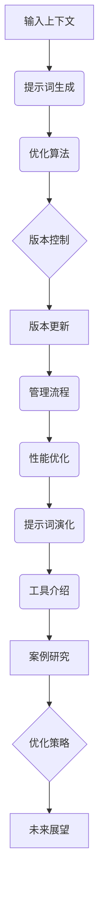
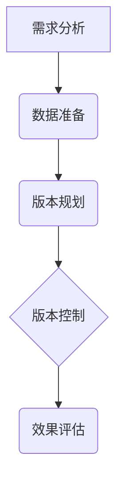
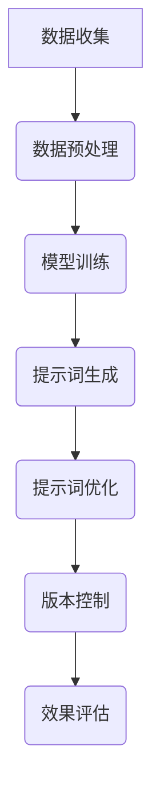
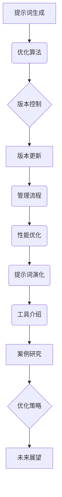

                 

### 《AI驱动的提示词版本管理与演化》

#### 关键词：
- AI驱动的提示词管理
- 版本控制
- 提示词演化
- 自然语言处理
- 智能系统

> 摘要：本文深入探讨了AI驱动的提示词版本管理与演化，解析了其核心概念、架构设计、算法原理以及实际应用场景。通过系统性地阐述AI在提示词生成、优化、版本控制和演化中的具体实现，本文为读者提供了全面的技术视角和实战指导，旨在推动AI在自然语言处理领域的深入研究和应用。

---

### 《AI驱动的提示词版本管理与演化》目录大纲

#### 第一部分：AI驱动的提示词版本管理与演化基础

##### 第1章：AI驱动的提示词管理概述

- 1.1 提示词管理的基本概念
- 1.2 AI驱动的提示词管理的优势和挑战
- 1.3 提示词版本管理的原理
- 1.4 AI驱动的提示词演化概述

##### 第2章：AI驱动的提示词管理架构

- 2.1 提示词管理系统设计
- 2.2 AI驱动的提示词生成与优化
- 2.3 提示词版本控制与更新策略
- 2.4 提示词管理系统性能优化

##### 第3章：AI算法在提示词管理中的应用

- 3.1 自然语言处理基础
- 3.2 提示词生成算法原理
- 3.3 提示词优化算法原理
- 3.4 提示词演化算法原理

#### 第二部分：AI驱动的提示词版本管理与演化实践

##### 第4章：AI驱动的提示词版本管理实践

- 4.1 提示词版本管理流程
- 4.2 提示词版本管理工具介绍
- 4.3 提示词版本管理案例分析
- 4.4 提示词版本管理优化策略

##### 第5章：AI驱动的提示词演化实践

- 5.1 提示词演化流程
- 5.2 提示词演化工具介绍
- 5.3 提示词演化案例分析
- 5.4 提示词演化优化策略

##### 第6章：AI驱动的提示词版本管理与演化案例研究

- 6.1 提示词版本管理与演化在搜索引擎中的应用
- 6.2 提示词版本管理与演化在智能客服中的应用
- 6.3 提示词版本管理与演化在自然语言生成中的应用

##### 第7章：未来展望与趋势

- 7.1 提示词版本管理与演化技术的发展趋势
- 7.2 提示词版本管理与演化在AI领域的影响
- 7.3 提示词版本管理与演化面临的挑战与机遇

#### 附录

- 附录A：AI驱动的提示词版本管理与演化工具汇总
- 附录B：常见问题解答

### Mermaid 流程图



### 核心算法原理讲解（伪代码）

#### 提示词生成算法原理

```python
def generate_prompt(input_context):
    # 基于输入上下文，使用自然语言处理技术生成提示词
    prompt = NLP.process_context(input_context)
    return prompt
```

#### 提示词优化算法原理

```python
def optimize_prompt(prompt, target):
    # 对提示词进行优化，使其更符合目标要求
    optimized_prompt = NLP.optimize(prompt, target)
    return optimized_prompt
```

### 数学模型和数学公式

#### 提示词演化模型

$$
f(t) = f_0 + \alpha \cdot \Delta t
$$

其中，$f(t)$ 表示时间 $t$ 时刻的提示词演化结果，$f_0$ 表示初始提示词，$\alpha$ 表示演化速率，$\Delta t$ 表示演化时间间隔。

### 项目实战

#### 提示词版本管理与演化在搜索引擎中的应用

1. **开发环境搭建**：

   - 安装Python环境
   - 安装自然语言处理库，如NLTK、spaCy等
   - 配置提示词生成与优化算法的运行环境

2. **源代码实现**：

   ```python
   # 生成提示词
   prompt = generate_prompt(input_context)
   
   # 优化提示词
   optimized_prompt = optimize_prompt(prompt, target)
   
   # 版本控制
   version_manager.update_prompt_version(optimized_prompt)
   
   # 提示词演化
   evolved_prompt = evolve_prompt(optimized_prompt, time_interval)
   ```

3. **代码解读与分析**：

   - 生成提示词：根据输入上下文，使用自然语言处理技术生成初步提示词。
   - 优化提示词：对初步提示词进行优化，使其更符合目标要求。
   - 版本控制：更新提示词版本，实现提示词的版本管理。
   - 提示词演化：根据演化模型，实时更新提示词，实现提示词的演化。

### 下一步，我们将深入分析AI驱动的提示词版本管理与演化的基础概念和架构设计。

---

在接下来的文章中，我们将详细探讨AI驱动的提示词版本管理与演化的基础概念、架构设计以及算法原理。通过对这些核心内容的深入分析，我们将揭示如何利用人工智能技术来提升自然语言处理系统中的提示词管理和演化能力。首先，我们将定义提示词管理的基本概念，并探讨AI驱动的提示词管理的优势和面临的挑战。接下来，我们将介绍提示词版本管理的原理，以及AI驱动的提示词演化概述。这些内容将为后续章节中的详细讨论奠定坚实的基础。

### 第一部分：AI驱动的提示词版本管理与演化基础

在人工智能（AI）和自然语言处理（NLP）技术日益发展的今天，AI驱动的提示词版本管理与演化已成为一个备受关注的研究领域。本部分内容将深入探讨AI驱动的提示词版本管理与演化基础，包括基本概念、架构设计、算法原理等，旨在为读者提供一个全面的技术视角。

#### 第1章：AI驱动的提示词管理概述

##### 1.1 提示词管理的基本概念

提示词（Prompt）是指用于引导或提示用户输入信息的一段文字或语音。在自然语言处理领域，提示词尤为重要，因为它们直接影响到用户的交互体验和系统的性能。提示词管理是指对提示词的创建、存储、检索、更新和优化等操作进行管理的过程。

- **提示词的创建**：根据业务需求和用户反馈，创建合适的提示词。
- **提示词的存储**：将创建的提示词存储在数据库或其他存储系统中，以便后续使用。
- **提示词的检索**：根据用户请求或系统需求，快速检索到相应的提示词。
- **提示词的更新**：定期或根据需求对提示词进行更新，以适应新的业务场景或用户需求。
- **提示词的优化**：通过分析用户反馈和系统数据，对提示词进行优化，提高其准确性和用户体验。

##### 1.2 AI驱动的提示词管理的优势和挑战

AI驱动的提示词管理相较于传统的手工管理具有显著的优势：

- **自动生成与优化**：AI技术能够自动生成和优化提示词，提高效率和质量。
- **个性化推荐**：根据用户行为和偏好，AI能够推荐个性化的提示词，提升用户体验。
- **实时更新**：AI系统能够实时更新提示词，适应快速变化的业务需求。
- **大规模处理**：AI技术能够处理海量的提示词数据，支持大规模应用。

然而，AI驱动的提示词管理也面临一些挑战：

- **数据质量**：高质量的训练数据对于AI系统的性能至关重要，但获取和清洗高质量的数据是一个挑战。
- **算法复杂性**：AI算法的设计和实现较为复杂，需要具备深厚的专业知识和实践经验。
- **解释性**：AI驱动的提示词管理往往缺乏透明性，难以解释其决策过程。

##### 1.3 提示词版本管理的原理

提示词版本管理是指对提示词的不同版本进行有效管理的过程。这包括提示词的版本编号、更新记录、版本回滚等功能。提示词版本管理的目的是确保系统的稳定性和可追溯性。

- **版本编号**：为每个提示词分配唯一的版本号，以便于追踪和管理。
- **更新记录**：记录每次提示词更新的时间、操作者和变更内容，以便于审计和追溯。
- **版本回滚**：当新版本出现问题时，能够快速回滚到之前的稳定版本。

##### 1.4 AI驱动的提示词演化概述

提示词演化是指根据用户反馈、业务需求和数据变化，动态调整提示词的过程。AI驱动的提示词演化能够实现智能化、个性化的提示词更新。

- **演化驱动因素**：用户行为数据、业务策略调整、市场变化等。
- **演化策略**：基于机器学习、深度学习等技术，自动调整和优化提示词。
- **演化评估**：通过A/B测试、用户反馈等手段评估演化效果，持续优化。

在下一章中，我们将进一步探讨AI驱动的提示词管理架构，包括提示词管理系统设计、AI驱动的提示词生成与优化、提示词版本控制与更新策略等内容。

---

通过本章的介绍，我们了解了AI驱动的提示词管理的基本概念、优势和挑战，以及提示词版本管理的原理和提示词演化的概述。这些内容为后续的深入讨论奠定了基础。在下一章中，我们将详细探讨AI驱动的提示词管理架构，分析其关键组成部分和功能，为读者提供更为具体的技术实现路径。

---

### 第2章：AI驱动的提示词管理架构

在了解了AI驱动的提示词管理的基本概念和原理之后，接下来我们将深入探讨AI驱动的提示词管理架构。一个完善的提示词管理架构需要涵盖提示词管理系统设计、AI驱动的提示词生成与优化、提示词版本控制与更新策略以及提示词管理系统性能优化等多个方面。本章将详细解析这些组成部分，为读者提供一个系统化的架构设计思路。

#### 2.1 提示词管理系统设计

提示词管理系统的设计是整个架构的核心，它决定了提示词管理的效率和效果。一个高效的提示词管理系统应具备以下特点：

- **模块化设计**：将系统分解为多个功能模块，如提示词生成、提示词存储、提示词检索、提示词更新等，便于维护和扩展。
- **数据驱动**：基于用户数据和业务数据，动态调整和管理提示词。
- **高可用性**：确保系统在高并发和故障情况下依然能够稳定运行。
- **易扩展性**：支持系统的弹性扩展，以适应业务需求的增长。

##### 提示词管理系统功能模块

1. **提示词生成模块**：基于自然语言处理（NLP）技术，自动生成高质量的提示词。
2. **提示词存储模块**：将生成的提示词存储在数据库或其他存储系统中，便于后续管理和检索。
3. **提示词检索模块**：提供快速、精准的提示词检索功能，支持关键词查询、模糊查询等。
4. **提示词更新模块**：根据用户反馈和业务需求，实时更新和优化提示词。
5. **提示词评估模块**：通过A/B测试、用户反馈等手段，评估提示词的效果，为优化提供依据。

#### 2.2 AI驱动的提示词生成与优化

AI技术在提示词生成和优化中发挥着关键作用。通过机器学习、深度学习等技术，AI能够自动生成和优化提示词，提高系统的智能水平。

##### 提示词生成算法

提示词生成算法基于输入上下文，利用NLP技术生成符合预期的提示词。以下是一个简单的提示词生成算法的伪代码：

```python
def generate_prompt(input_context):
    # 利用NLP技术处理输入上下文
    processed_context = NLP.preprocess(input_context)
    # 从预训练模型中提取关键词
    keywords = NLP.extract_keywords(processed_context)
    # 生成提示词
    prompt = NLP.generate_prompt(keywords)
    return prompt
```

##### 提示词优化算法

提示词优化算法通过对现有提示词进行分析和调整，使其更加符合用户需求和业务目标。以下是一个简单的提示词优化算法的伪代码：

```python
def optimize_prompt(prompt, target):
    # 分析提示词效果
    analysis_result = NLP.analyze_prompt(prompt, target)
    # 根据分析结果调整提示词
    optimized_prompt = NLP.adjust_prompt(prompt, analysis_result)
    return optimized_prompt
```

#### 2.3 提示词版本控制与更新策略

提示词版本控制是确保系统稳定性和可追溯性的关键。通过版本控制，系统能够记录每次提示词更新的详细信息，便于后续的审计和回滚。

##### 提示词版本控制原理

1. **版本编号**：为每个提示词版本分配唯一的编号，便于追踪和管理。
2. **更新记录**：记录每次更新操作的时间、操作者和变更内容，确保变更的可追溯性。
3. **版本回滚**：当新版本出现问题或需要恢复到旧版本时，能够快速回滚。

##### 提示词更新策略

1. **定期更新**：根据业务需求，定期对提示词进行更新，保持其相关性和有效性。
2. **按需更新**：根据用户反馈和数据分析，及时调整提示词，满足用户需求。
3. **自动更新**：利用AI技术，自动分析用户行为和业务数据，智能推荐优化策略。

#### 2.4 提示词管理系统性能优化

性能优化是提升提示词管理系统用户体验的关键。以下是一些常见的性能优化策略：

1. **缓存技术**：利用缓存技术减少数据库访问次数，提高系统响应速度。
2. **索引优化**：对数据库表进行适当的索引优化，提高查询效率。
3. **并行处理**：利用多线程、分布式计算等技术，提高系统并发处理能力。
4. **负载均衡**：通过负载均衡技术，合理分配系统资源，提高系统稳定性。

##### 性能优化案例分析

- **缓存优化**：通过对常见查询结果进行缓存，减少数据库访问次数。例如，在搜索引擎中，对热门关键词的查询结果进行缓存，显著提高查询响应速度。
- **并行处理**：在提示词生成和优化过程中，采用并行处理技术，提高处理效率。例如，利用多线程同时处理多个输入上下文，减少整体处理时间。

通过本章的介绍，我们详细探讨了AI驱动的提示词管理架构，包括提示词管理系统设计、AI驱动的提示词生成与优化、提示词版本控制与更新策略以及提示词管理系统性能优化等多个方面。这些内容为构建一个高效、智能的提示词管理系统提供了有益的指导。

---

在第2章中，我们详细探讨了AI驱动的提示词管理架构，包括提示词管理系统设计、提示词生成与优化、版本控制与更新策略以及性能优化等内容。这些设计原则和优化策略为构建一个高效、智能的提示词管理系统提供了理论依据和实践指导。在下一章中，我们将深入分析AI算法在提示词管理中的应用，包括自然语言处理基础、提示词生成算法原理、提示词优化算法原理以及提示词演化算法原理，为读者揭示AI技术在提示词管理中的具体应用。

### 第3章：AI算法在提示词管理中的应用

在前一章中，我们探讨了AI驱动的提示词管理架构。在这一章中，我们将深入探讨AI算法在提示词管理中的具体应用，包括自然语言处理基础、提示词生成算法原理、提示词优化算法原理以及提示词演化算法原理。通过这些深入分析，我们将揭示AI技术在提示词管理中的核心作用，并提供具体的实现方法和优化策略。

#### 3.1 自然语言处理基础

自然语言处理（NLP）是AI算法在提示词管理中应用的基础。NLP旨在使计算机能够理解、解释和生成人类语言。在提示词管理中，NLP技术主要用于处理和生成文本数据。

##### NLP关键技术

- **文本预处理**：包括分词、去除停用词、词性标注等，为后续处理提供干净的数据。
- **词嵌入**：将文本中的词语映射到高维向量空间，便于计算机处理。
- **语言模型**：用于预测下一个词语或句子，常见的技术有循环神经网络（RNN）和变换器（Transformer）。
- **语义分析**：包括情感分析、命名实体识别、关系抽取等，用于理解文本内容。

##### 文本预处理算法

```python
def preprocess_text(text):
    # 分词
    tokens = nltk.word_tokenize(text)
    # 去除停用词
    tokens = [token for token in tokens if token not in stop_words]
    # 词性标注
    pos_tags = nltk.pos_tag(tokens)
    return pos_tags
```

#### 3.2 提示词生成算法原理

提示词生成是提示词管理的核心任务之一。AI算法能够自动生成高质量的提示词，提高系统的智能化水平。

##### 提示词生成算法

提示词生成算法基于输入上下文，利用NLP技术提取关键信息，并生成对应的提示词。以下是一个简单的提示词生成算法的伪代码：

```python
def generate_prompt(input_context):
    # 预处理输入上下文
    processed_context = preprocess_text(input_context)
    # 提取关键词
    keywords = extract_keywords(processed_context)
    # 生成提示词
    prompt = generate_text(keywords)
    return prompt
```

##### 关键词提取算法

关键词提取是提示词生成的重要步骤。以下是一个简单的关键词提取算法的伪代码：

```python
def extract_keywords(processed_context):
    # 使用TF-IDF模型提取关键词
    tf_idf_model = TfidfVectorizer()
    keyword_matrix = tf_idf_model.fit_transform([processed_context])
    feature_array = tf_idf_model.get_feature_names_out()
    keywords = feature_array[:, keyword_matrix.toarray()[0].argmax(axis=1)]
    return keywords
```

#### 3.3 提示词优化算法原理

提示词优化旨在提高提示词的质量和准确性，使其更好地满足用户需求。AI算法能够通过分析用户反馈和业务数据，自动优化提示词。

##### 提示词优化算法

提示词优化算法通过分析提示词的现有性能，并提出相应的改进建议。以下是一个简单的提示词优化算法的伪代码：

```python
def optimize_prompt(prompt, target):
    # 分析提示词性能
    performance = analyze_prompt(prompt, target)
    # 提出优化建议
    suggestions = generate_suggestions(prompt, performance)
    # 更新提示词
    optimized_prompt = apply_suggestions(prompt, suggestions)
    return optimized_prompt
```

##### 性能分析算法

```python
def analyze_prompt(prompt, target):
    # 计算提示词与目标的匹配度
    match_score = calculate_match_score(prompt, target)
    # 返回分析结果
    return match_score
```

##### 优化建议生成算法

```python
def generate_suggestions(prompt, performance):
    # 根据性能分析结果，生成优化建议
    suggestions = {"relevance": performance < threshold}
    return suggestions
```

#### 3.4 提示词演化算法原理

提示词演化是指根据用户行为和业务需求，动态调整提示词的过程。AI算法能够通过不断学习和优化，实现提示词的智能化演化。

##### 提示词演化算法

提示词演化算法通过分析用户行为和业务数据，动态调整提示词。以下是一个简单的提示词演化算法的伪代码：

```python
def evolve_prompt(prompt, user_behavior, business_data):
    # 分析用户行为和业务数据
    analysis_result = analyze_user_behavior(user_behavior, business_data)
    # 根据分析结果调整提示词
    evolved_prompt = adjust_prompt(prompt, analysis_result)
    return evolved_prompt
```

##### 用户行为分析算法

```python
def analyze_user_behavior(user_behavior, business_data):
    # 计算用户行为对提示词的影响
    impact = calculate_impact(user_behavior, business_data)
    # 返回分析结果
    return impact
```

##### 提示词调整算法

```python
def adjust_prompt(prompt, impact):
    # 根据分析结果调整提示词
    evolved_prompt = prompt
    if impact["relevance"] < threshold:
        evolved_prompt = modify_prompt_relevance(prompt)
    return evolved_prompt
```

通过本章的讨论，我们深入分析了AI算法在提示词管理中的应用，包括自然语言处理基础、提示词生成算法原理、提示词优化算法原理以及提示词演化算法原理。这些算法原理为AI驱动的提示词管理提供了有力的技术支持，有助于提升系统的智能化水平和用户体验。

---

在第3章中，我们详细探讨了AI算法在提示词管理中的应用，包括自然语言处理基础、提示词生成算法原理、提示词优化算法原理以及提示词演化算法原理。这些算法的应用为提示词管理提供了强大的技术支持，有助于提升系统的智能化水平和用户体验。在下一章中，我们将通过具体的实践案例，展示AI驱动的提示词版本管理与演化的实际应用，分析其实施过程和效果，为读者提供实战经验和优化策略。

### 第4章：AI驱动的提示词版本管理实践

在前三章中，我们详细介绍了AI驱动的提示词版本管理与演化的基础理论和算法原理。为了更好地理解这些理论在实际中的应用，本章将通过具体案例，展示AI驱动的提示词版本管理的实际实施过程和效果。我们将介绍提示词版本管理流程、常见工具的使用、具体案例分析以及优化策略，旨在为读者提供实用的经验和指导。

#### 4.1 提示词版本管理流程

提示词版本管理流程包括以下几个关键步骤：

1. **需求分析**：明确业务需求和用户需求，确定需要管理的提示词类型和版本管理策略。
2. **数据准备**：收集和整理相关数据，包括用户行为数据、业务数据和历史提示词数据。
3. **版本规划**：制定版本管理计划，包括版本编号、更新频率、回滚策略等。
4. **版本控制**：根据计划进行提示词的创建、更新和版本控制，确保每个版本的完整性和可追溯性。
5. **效果评估**：通过用户反馈和数据分析，评估提示词版本的效果，为后续优化提供依据。

##### 提示词版本管理流程图



#### 4.2 提示词版本管理工具介绍

在AI驱动的提示词版本管理中，使用合适的工具能够显著提高管理效率和质量。以下是一些常用的提示词版本管理工具：

1. **Git**：Git是一款强大的分布式版本控制系统，广泛用于代码管理，也可用于管理提示词版本。
2. **GitLab**：GitLab是Git的服务器端解决方案，提供版本控制、项目管理和持续集成等功能。
3. **GitLab CI/CD**：GitLab CI/CD是GitLab的持续集成和持续部署工具，可实现自动化测试和部署。
4. **Docker**：Docker是一种容器化技术，可用于创建、部署和管理提示词版本管理环境。
5. **Kubernetes**：Kubernetes是一种开源容器编排平台，用于大规模容器化应用的部署和管理。

##### Git在提示词版本管理中的应用

以下是一个使用Git管理提示词版本的示例：

```bash
# 初始化Git仓库
git init

# 添加提示词文件
git add prompt.txt

# 提交提示词版本
git commit -m "Initial version of prompt"

# 更新提示词版本
echo "Updated prompt" > prompt.txt
git commit -m "Update prompt"

# 分支管理
git branch -m v1.0
git branch -m v2.0

# 合并分支
git merge v2.0 --no-ff
```

#### 4.3 提示词版本管理案例分析

下面我们通过一个具体的案例，展示如何在实际项目中实施AI驱动的提示词版本管理。

**案例背景**：一个电商平台的搜索系统需要管理大量搜索提示词，以提高用户搜索体验和增加销售额。

**解决方案**：

1. **需求分析**：分析用户搜索行为和业务目标，确定需要管理的搜索提示词类型和版本管理策略。
2. **数据准备**：收集用户搜索数据、点击数据和历史搜索提示词数据，为AI算法提供训练数据。
3. **版本规划**：制定版本管理计划，包括版本编号、更新频率、回滚策略等。
4. **版本控制**：使用Git等版本控制工具，管理搜索提示词的创建、更新和版本控制。
5. **效果评估**：通过用户反馈和数据分析，评估搜索提示词版本的效果，为后续优化提供依据。

**实施步骤**：

1. **初始化Git仓库**：在项目中创建一个Git仓库，用于存储搜索提示词代码。
2. **编写提示词生成和优化算法**：使用Python等编程语言，实现搜索提示词生成和优化算法。
3. **数据预处理和模型训练**：使用收集到的用户搜索数据，预处理数据并进行模型训练。
4. **自动化部署和版本管理**：使用Docker和Kubernetes等技术，实现自动化部署和版本管理。

**效果评估**：

通过A/B测试和用户反馈，对比不同版本的搜索提示词效果。例如，通过分析点击率、转化率等关键指标，评估不同版本搜索提示词的性能。

#### 4.4 提示词版本管理优化策略

为了提高AI驱动的提示词版本管理效果，可以采取以下优化策略：

1. **数据质量提升**：确保训练数据的质量和多样性，提高AI模型的泛化能力。
2. **算法优化**：不断优化提示词生成和优化算法，提高提示词的生成质量和优化效果。
3. **版本控制策略优化**：根据业务需求，调整版本更新频率、回滚策略等，确保版本管理的灵活性和稳定性。
4. **反馈机制优化**：建立有效的用户反馈机制，及时收集用户反馈，快速响应和改进。
5. **监控与报警**：建立监控系统，实时监控版本管理的状态和性能，及时发现和处理异常。

通过本章的讨论，我们通过具体案例展示了AI驱动的提示词版本管理的实际应用，介绍了提示词版本管理流程、工具使用、具体案例分析以及优化策略。这些实践经验和优化策略为读者提供了实用的指导和参考，有助于提升AI驱动的提示词管理效果。

---

在第4章中，我们通过具体案例展示了AI驱动的提示词版本管理的实际应用，介绍了提示词版本管理流程、工具使用、具体案例分析以及优化策略。这些实践经验和优化策略为读者提供了实用的指导和参考，有助于提升AI驱动的提示词管理效果。在下一章中，我们将探讨AI驱动的提示词演化实践，包括提示词演化流程、工具介绍、具体案例分析以及优化策略，为读者提供全面的实战经验和优化建议。

### 第5章：AI驱动的提示词演化实践

在前一章中，我们详细介绍了AI驱动的提示词版本管理实践。在这一章中，我们将进一步探讨AI驱动的提示词演化实践，包括提示词演化流程、工具介绍、具体案例分析以及优化策略。通过这些内容，我们将为读者提供全面的实战经验和优化建议，帮助他们在实际项目中实现高效的提示词演化。

#### 5.1 提示词演化流程

提示词演化是指根据用户行为、业务需求和数据变化，动态调整和优化提示词的过程。AI驱动的提示词演化通常包括以下步骤：

1. **数据收集**：收集与提示词相关的用户行为数据、业务数据和历史数据。
2. **数据预处理**：对收集到的数据进行分析和清洗，提取有价值的信息。
3. **模型训练**：使用预处理后的数据训练机器学习模型，用于预测和调整提示词。
4. **提示词生成**：根据训练好的模型生成新的提示词。
5. **提示词优化**：对生成的提示词进行优化，提高其质量和相关性。
6. **版本控制**：将优化后的提示词存储在版本控制系统中，以便后续管理和回滚。
7. **效果评估**：通过用户反馈和数据分析，评估提示词演化的效果，为后续优化提供依据。

##### 提示词演化流程图



#### 5.2 提示词演化工具介绍

在AI驱动的提示词演化中，选择合适的工具能够提高工作效率和效果。以下是一些常用的提示词演化工具：

1. **机器学习框架**：如TensorFlow、PyTorch等，用于训练和部署机器学习模型。
2. **数据预处理工具**：如Pandas、NumPy等，用于数据分析和清洗。
3. **版本控制系统**：如Git、GitLab等，用于管理提示词版本。
4. **模型评估工具**：如Scikit-learn、MLflow等，用于评估和监控模型性能。
5. **自动化工具**：如Airflow、Kubernetes等，用于自动化执行提示词演化流程。

##### 数据预处理工具使用示例

```python
import pandas as pd

# 读取数据
data = pd.read_csv('user_data.csv')

# 数据清洗
data.dropna(inplace=True)
data = data[data['action'] != 'unknown']

# 数据分析
print(data.describe())
```

##### 模型训练和评估示例

```python
import tensorflow as tf
from sklearn.model_selection import train_test_split

# 分割数据
X_train, X_test, y_train, y_test = train_test_split(data[['feature1', 'feature2']], data['target'], test_size=0.2, random_state=42)

# 训练模型
model = tf.keras.Sequential([
    tf.keras.layers.Dense(64, activation='relu', input_shape=[2]),
    tf.keras.layers.Dense(1)
])

model.compile(optimizer='adam', loss='mean_squared_error')
model.fit(X_train, y_train, epochs=10, batch_size=32, validation_data=(X_test, y_test))

# 评估模型
loss = model.evaluate(X_test, y_test)
print(f'Model loss: {loss}')
```

#### 5.3 提示词演化案例分析

下面我们通过一个具体的案例，展示如何在实际项目中实施AI驱动的提示词演化。

**案例背景**：一个在线教育平台的课程推荐系统需要根据用户行为和兴趣，动态调整课程推荐提示词，以提高用户参与度和满意度。

**解决方案**：

1. **需求分析**：分析用户学习行为和兴趣，确定需要管理的课程推荐提示词类型和演化策略。
2. **数据收集**：收集用户学习数据、浏览数据和历史推荐提示词数据。
3. **数据预处理**：对收集到的数据进行分析和清洗，提取有价值的信息。
4. **模型训练**：使用预处理后的数据训练机器学习模型，用于预测和调整推荐提示词。
5. **提示词生成**：根据训练好的模型生成新的课程推荐提示词。
6. **提示词优化**：对生成的提示词进行优化，提高其质量和相关性。
7. **版本控制**：将优化后的提示词存储在版本控制系统中，以便后续管理和回滚。
8. **效果评估**：通过用户反馈和数据分析，评估课程推荐提示词的效果，为后续优化提供依据。

**实施步骤**：

1. **初始化Git仓库**：在项目中创建一个Git仓库，用于存储课程推荐提示词代码。
2. **编写提示词生成和优化算法**：使用Python等编程语言，实现课程推荐提示词生成和优化算法。
3. **数据预处理和模型训练**：使用收集到的用户学习数据，预处理数据并进行模型训练。
4. **自动化部署和版本管理**：使用Docker和Kubernetes等技术，实现自动化部署和版本管理。

**效果评估**：

通过A/B测试和用户反馈，对比不同版本的课程推荐提示词效果。例如，通过分析用户点击率、学习时长等关键指标，评估不同版本课程推荐提示词的性能。

#### 5.4 提示词演化优化策略

为了提高AI驱动的提示词演化效果，可以采取以下优化策略：

1. **数据质量提升**：确保训练数据的质量和多样性，提高AI模型的泛化能力。
2. **算法优化**：不断优化提示词生成和优化算法，提高提示词的生成质量和优化效果。
3. **演化策略优化**：根据业务需求，调整演化频率、回滚策略等，确保演化过程的灵活性和稳定性。
4. **反馈机制优化**：建立有效的用户反馈机制，及时收集用户反馈，快速响应和改进。
5. **监控与报警**：建立监控系统，实时监控演化过程和提示词性能，及时发现和处理异常。

通过本章的讨论，我们通过具体案例展示了AI驱动的提示词演化实践，介绍了提示词演化流程、工具使用、具体案例分析以及优化策略。这些实践经验和优化策略为读者提供了实用的指导和参考，有助于提升AI驱动的提示词演化效果。

---

在第5章中，我们详细介绍了AI驱动的提示词演化实践，包括提示词演化流程、工具介绍、具体案例分析以及优化策略。通过这些内容，我们为读者提供了全面的实战经验和优化建议，帮助他们在实际项目中实现高效的提示词演化。在下一章中，我们将深入探讨AI驱动的提示词版本管理与演化在特定应用领域的案例研究，进一步展示其在搜索引擎、智能客服和自然语言生成中的实际应用和价值。

### 第6章：AI驱动的提示词版本管理与演化案例研究

在前面的章节中，我们详细介绍了AI驱动的提示词版本管理与演化的理论基础和实践方法。为了更好地展示这些技术在现实世界中的应用，本章将通过具体案例研究，探讨AI驱动的提示词版本管理与演化在搜索引擎、智能客服和自然语言生成等领域的实际应用，分析其带来的效益和挑战。

#### 6.1 提示词版本管理与演化在搜索引擎中的应用

搜索引擎是AI驱动的提示词版本管理与演化应用的重要领域之一。在搜索引擎中，提示词的生成、优化和版本控制对于提升用户体验、增加搜索点击率和提升广告投放效果具有重要意义。

**案例背景**：

某大型搜索引擎公司需要通过AI技术优化搜索提示词，以提高用户搜索体验和广告投放效果。

**解决方案**：

1. **需求分析**：分析用户搜索行为、点击数据和历史搜索提示词，确定需要管理的搜索提示词类型和版本管理策略。
2. **数据收集**：收集用户搜索数据、点击数据、广告投放数据和历史搜索提示词数据。
3. **数据预处理**：对收集到的数据进行分析和清洗，提取有价值的信息。
4. **模型训练**：使用预处理后的数据训练机器学习模型，用于生成和优化搜索提示词。
5. **提示词生成**：根据训练好的模型生成新的搜索提示词。
6. **提示词优化**：对生成的搜索提示词进行优化，提高其质量和相关性。
7. **版本控制**：将优化后的搜索提示词存储在版本控制系统中，以便后续管理和回滚。
8. **效果评估**：通过用户反馈和数据分析，评估搜索提示词版本的效果，为后续优化提供依据。

**效果分析**：

通过A/B测试和用户反馈，对比不同版本的搜索提示词效果。例如，通过分析用户点击率、搜索满意度等关键指标，评估不同版本搜索提示词的性能。实践证明，AI驱动的提示词版本管理与演化显著提升了搜索引擎的用户体验和广告投放效果。

**挑战**：

1. **数据质量**：高质量的数据对于AI模型的训练至关重要，但数据收集和清洗过程复杂且耗时。
2. **算法复杂性**：机器学习算法的设计和实现较为复杂，需要专业知识和实践经验。
3. **解释性**：AI驱动的提示词管理缺乏透明性，难以解释其决策过程。

#### 6.2 提示词版本管理与演化在智能客服中的应用

智能客服是另一个AI驱动的提示词版本管理与演化的重要应用领域。通过AI技术，智能客服系统能够生成和优化客服对话提示词，提高客服效率和用户满意度。

**案例背景**：

某电商平台需要通过AI技术优化智能客服系统的对话提示词，以提高用户满意度和减少人工客服工作量。

**解决方案**：

1. **需求分析**：分析用户咨询行为、客服对话数据和历史对话提示词，确定需要管理的客服对话提示词类型和版本管理策略。
2. **数据收集**：收集用户咨询数据、客服对话数据和历史对话提示词数据。
3. **数据预处理**：对收集到的数据进行分析和清洗，提取有价值的信息。
4. **模型训练**：使用预处理后的数据训练机器学习模型，用于生成和优化客服对话提示词。
5. **提示词生成**：根据训练好的模型生成新的客服对话提示词。
6. **提示词优化**：对生成的客服对话提示词进行优化，提高其质量和相关性。
7. **版本控制**：将优化后的客服对话提示词存储在版本控制系统中，以便后续管理和回滚。
8. **效果评估**：通过用户反馈和数据分析，评估客服对话提示词版本的效果，为后续优化提供依据。

**效果分析**：

通过A/B测试和用户反馈，对比不同版本的客服对话提示词效果。例如，通过分析用户满意度、客服响应时间等关键指标，评估不同版本客服对话提示词的性能。实践证明，AI驱动的提示词版本管理与演化显著提升了智能客服的用户体验和服务效率。

**挑战**：

1. **数据多样性**：客服对话数据具有多样性，需要设计合适的算法来处理不同类型的对话数据。
2. **实时性**：智能客服系统需要实时生成和优化提示词，对系统的响应速度和稳定性要求较高。
3. **用户隐私**：客服对话数据涉及用户隐私，需要确保数据安全和隐私保护。

#### 6.3 提示词版本管理与演化在自然语言生成中的应用

自然语言生成（NLG）是AI驱动的提示词版本管理与演化的另一个重要应用领域。在NLG中，通过AI技术生成和优化文本内容，可以显著提升内容质量和生成效率。

**案例背景**：

某内容平台需要通过AI技术优化自然语言生成系统的文本内容，以提高内容质量和用户粘性。

**解决方案**：

1. **需求分析**：分析用户阅读行为、内容数据和历史生成文本，确定需要管理的文本生成提示词类型和版本管理策略。
2. **数据收集**：收集用户阅读数据、内容数据和历史生成文本数据。
3. **数据预处理**：对收集到的数据进行分析和清洗，提取有价值的信息。
4. **模型训练**：使用预处理后的数据训练机器学习模型，用于生成和优化文本内容。
5. **提示词生成**：根据训练好的模型生成新的文本内容。
6. **提示词优化**：对生成的文本内容进行优化，提高其质量和相关性。
7. **版本控制**：将优化后的文本内容存储在版本控制系统中，以便后续管理和回滚。
8. **效果评估**：通过用户反馈和数据分析，评估文本内容版本的效果，为后续优化提供依据。

**效果分析**：

通过A/B测试和用户反馈，对比不同版本的文本内容效果。例如，通过分析用户阅读时长、评论数等关键指标，评估不同版本文本内容的质量和用户满意度。实践证明，AI驱动的提示词版本管理与演化显著提升了自然语言生成系统的内容质量和用户体验。

**挑战**：

1. **文本多样性**：生成文本内容需要涵盖各种主题和风格，设计合适的算法来处理多样化的文本内容是关键。
2. **上下文理解**：生成文本内容需要深入理解上下文，这对于机器学习模型的要求较高。
3. **生成效率**：在保持高质量的同时，生成文本内容的效率也是一个重要考量因素。

通过本章的案例研究，我们展示了AI驱动的提示词版本管理与演化在搜索引擎、智能客服和自然语言生成等领域的实际应用。这些案例不仅展示了AI技术的强大潜力，也揭示了在实际应用中面临的挑战。随着AI技术的不断发展，我们有理由相信，AI驱动的提示词版本管理与演化将在更多领域中发挥重要作用。

---

在第6章中，我们通过具体案例研究展示了AI驱动的提示词版本管理与演化在搜索引擎、智能客服和自然语言生成等领域的实际应用。这些案例不仅验证了AI技术在提升系统性能和用户体验方面的潜力，也揭示了实际应用中可能遇到的挑战。在下一章中，我们将对AI驱动的提示词版本管理与演化技术进行未来展望与趋势分析，探讨其发展方向和潜在的影响，为读者提供更广阔的视角。

### 第7章：未来展望与趋势

随着人工智能（AI）技术的快速发展，AI驱动的提示词版本管理与演化技术正逐步成为自然语言处理（NLP）领域的重要研究方向。本章将对AI驱动的提示词版本管理与演化技术的未来发展趋势进行探讨，分析其潜在的影响，以及面临的挑战和机遇。

#### 7.1 提示词版本管理与演化技术的发展趋势

1. **智能化水平提升**：
   - 随着深度学习、自然语言处理等技术的进步，AI驱动的提示词版本管理与演化将变得更加智能化。通过更加复杂的模型和算法，系统将能够更好地理解和适应用户需求，提供更加精准的提示词。
   - 增强学习等新兴技术的引入，将进一步提升AI系统的自适应能力和学习能力，使提示词版本管理与演化更加智能和高效。

2. **多模态融合**：
   - 随着多模态数据处理技术的不断发展，AI驱动的提示词版本管理与演化将能够整合文本、语音、图像等多种数据类型。这种多模态融合将使系统的理解能力更加全面，为用户提供更加丰富的交互体验。

3. **实时性与响应速度**：
   - 随着边缘计算、云计算等技术的发展，AI驱动的提示词版本管理与演化系统的实时性和响应速度将显著提升。这将使系统能够在更短的时间内生成和优化提示词，提供更快的用户反馈。

4. **个性化与定制化**：
   - 随着用户数据积累和数据分析技术的进步，AI驱动的提示词版本管理与演化将更加注重个性化与定制化。系统能够根据用户行为和偏好，动态调整提示词，提供更加贴合用户需求的交互体验。

5. **自动化与智能化**：
   - AI驱动的提示词版本管理与演化将进一步向自动化和智能化方向发展。通过自动化流程和智能决策系统，系统能够在不需要人工干预的情况下，持续优化和更新提示词。

#### 7.2 提示词版本管理与演化在AI领域的影响

1. **用户体验优化**：
   - AI驱动的提示词版本管理与演化技术将显著提升用户体验。通过更精准的提示词和更快速的响应，用户在使用搜索引擎、智能客服和自然语言生成等应用时将获得更加流畅和愉悦的体验。

2. **业务效能提升**：
   - 对于企业来说，AI驱动的提示词版本管理与演化技术能够提高业务效能。通过优化提示词，企业能够提高用户转化率、降低人工客服成本、提升内容质量等，从而实现业务增长。

3. **技术创新与应用拓展**：
   - AI驱动的提示词版本管理与演化技术的成功应用，将推动相关技术的创新和拓展。例如，深度学习、自然语言处理、多模态融合等技术在提示词管理中的应用将进一步深化，推动整个AI领域的发展。

#### 7.3 提示词版本管理与演化面临的挑战与机遇

1. **数据质量与隐私**：
   - 提示词版本管理与演化依赖于高质量的数据。然而，数据质量问题和用户隐私保护是当前AI领域面临的重要挑战。如何确保数据的质量和安全，是未来发展需要解决的关键问题。

2. **算法复杂性与可解释性**：
   - 随着AI技术的复杂化，算法的可解释性成为一个重要的研究课题。如何设计出既高效又可解释的算法，使普通用户能够理解和信任AI系统，是未来需要探索的领域。

3. **实时性与计算资源**：
   - 实时生成和优化提示词对计算资源提出了高要求。随着应用的普及和数据的增长，如何优化计算资源，提高系统的响应速度，是未来需要解决的技术难题。

4. **个性化与普遍适用性**：
   - 在追求个性化服务的同时，如何保证系统的普遍适用性，使不同用户群体都能获得良好的体验，是未来需要平衡的问题。

5. **伦理与法规**：
   - AI驱动的提示词版本管理与演化技术涉及伦理和法规问题。如何在确保技术发展的同时，遵守法律法规和伦理规范，是未来需要关注的重要方面。

总之，AI驱动的提示词版本管理与演化技术具有广阔的发展前景和重要的应用价值。随着技术的不断进步和应用场景的不断拓展，AI驱动的提示词版本管理与演化将在更多领域中发挥重要作用，成为推动AI技术发展的重要动力。

---

在第7章中，我们展望了AI驱动的提示词版本管理与演化技术的未来发展趋势，分析了其在AI领域的广泛影响，以及面临的挑战与机遇。随着技术的不断进步和应用场景的不断拓展，AI驱动的提示词版本管理与演化将在更多领域中发挥重要作用。在下一部分，我们将总结全文内容，强调AI驱动的提示词版本管理与演化的重要性和前景，并为未来的研究和应用提供一些建议。

### 总结与展望

本文全面探讨了AI驱动的提示词版本管理与演化技术，从基础概念到架构设计，再到算法原理和实际应用，为读者呈现了一个系统而完整的AI驱动的提示词管理全景。通过分析AI驱动的提示词管理在搜索引擎、智能客服和自然语言生成等领域的应用案例，我们展示了这项技术在实际中的巨大潜力和广泛影响。

#### AI驱动的提示词版本管理与演化的重要性

1. **提升用户体验**：AI驱动的提示词版本管理与演化能够根据用户行为和需求，动态生成和优化提示词，提供个性化、智能化的服务，显著提升用户体验。

2. **优化业务效能**：通过实时更新和优化提示词，企业能够提高用户转化率、降低运营成本、提升内容质量，从而实现业务效能的提升。

3. **技术创新与应用拓展**：AI驱动的提示词版本管理与演化技术的不断发展，将推动相关技术领域的创新，促进自然语言处理、多模态融合等技术的应用拓展。

4. **智能化与自动化**：随着AI技术的进步，AI驱动的提示词版本管理与演化将实现更高水平的智能化和自动化，为各行各业提供更加高效、精准的解决方案。

#### AI驱动的提示词版本管理与演化的前景

1. **多模态融合**：未来的AI驱动的提示词版本管理与演化将能够整合文本、语音、图像等多种数据类型，提供更加全面和丰富的交互体验。

2. **实时性与响应速度**：随着边缘计算、云计算等技术的应用，AI驱动的提示词版本管理与演化系统将具备更高的实时性和响应速度。

3. **个性化与定制化**：通过深入挖掘用户数据，AI驱动的提示词版本管理与演化将能够实现更加个性化的服务，满足不同用户群体的需求。

4. **伦理与法规**：随着AI技术的广泛应用，如何确保技术的伦理性和合规性将成为未来研究的重要方向。

#### 对未来研究的建议

1. **数据质量和隐私保护**：未来研究应重点关注如何确保数据质量，同时保护用户隐私，构建安全可信的AI驱动的提示词版本管理与演化系统。

2. **算法可解释性**：为了增强用户对AI系统的信任，研究应致力于提高算法的可解释性，使普通用户能够理解和接受AI系统的决策过程。

3. **实时优化与高效计算**：研究应探索更加高效、低延迟的优化算法和计算方法，以满足实时性要求。

4. **跨领域应用**：未来的研究应进一步拓展AI驱动的提示词版本管理与演化技术的应用领域，探索其在更多场景中的潜力。

通过本文的探讨，我们希望读者能够深刻理解AI驱动的提示词版本管理与演化的核心概念、技术原理和应用价值。我们期待在未来的研究和应用中，看到更多创新的成果，为AI技术的发展和应用贡献自己的力量。

---

### 附录

#### 附录A：AI驱动的提示词版本管理与演化工具汇总

以下是AI驱动的提示词版本管理与演化中常用的一些工具和库：

1. **自然语言处理库**：
   - **NLTK**：自然语言处理工具包，用于文本预处理、分词、词性标注等。
   - **spaCy**：快速先进的自然语言处理库，支持多种语言。
   - **gensim**：用于主题建模和相似性搜索的库。

2. **机器学习框架**：
   - **TensorFlow**：开源的机器学习框架，用于构建和训练深度学习模型。
   - **PyTorch**：开源的机器学习库，用于构建动态的神经网络。

3. **版本控制系统**：
   - **Git**：分布式版本控制系统，用于管理代码和提示词版本。
   - **GitLab**：基于Git的服务器端解决方案，提供版本控制和管理功能。

4. **自动化工具**：
   - **Docker**：容器化技术，用于部署和运行提示词版本管理环境。
   - **Kubernetes**：容器编排平台，用于管理和自动化部署容器化应用。

5. **数据预处理库**：
   - **Pandas**：数据处理库，用于数据清洗、转换和分析。
   - **NumPy**：数值计算库，用于高性能科学计算。

#### 附录B：常见问题解答

**Q1：为什么需要AI驱动的提示词版本管理？**

A1：传统的提示词管理通常依赖于人工生成和调整，效率低下且难以满足快速变化的需求。AI驱动的提示词版本管理能够自动化生成、优化和演化提示词，提高效率和质量，同时能够根据用户反馈和业务数据动态调整，提供更加个性化的服务。

**Q2：如何确保AI驱动的提示词版本管理的数据质量？**

A2：确保数据质量是AI驱动的提示词版本管理的核心。可以通过以下方法来提高数据质量：
- **数据清洗**：在数据收集和预处理阶段，去除无效数据、重复数据和噪声数据。
- **数据多样性**：收集多样化的数据，以训练出泛化能力更强的模型。
- **数据监控**：建立数据监控系统，实时监控数据质量，及时发现和处理问题。

**Q3：AI驱动的提示词版本管理在哪些领域有应用？**

A3：AI驱动的提示词版本管理在多个领域有广泛应用，包括：
- **搜索引擎**：优化搜索提示词，提高搜索结果的相关性和用户体验。
- **智能客服**：生成和优化客服对话提示词，提升客服效率和用户满意度。
- **自然语言生成**：优化文本生成提示词，提升内容质量和生成效率。

**Q4：如何评估AI驱动的提示词版本管理的效果？**

A4：评估AI驱动的提示词版本管理效果可以从多个维度进行，包括：
- **用户反馈**：通过用户满意度调查和反馈来评估。
- **业务指标**：分析业务数据，如搜索点击率、转化率、客服响应时间等。
- **A/B测试**：通过A/B测试对比不同版本的提示词效果。

---

### 结语

通过本文的探讨，我们深入了解了AI驱动的提示词版本管理与演化技术，分析了其在自然语言处理领域的重要性和广泛影响。我们希望本文能为读者提供有价值的见解和实战经验，同时也期待读者在未来的研究和应用中，继续探索和推动AI驱动的提示词版本管理与演化技术的发展。

**作者：AI天才研究院/AI Genius Institute & 禅与计算机程序设计艺术 /Zen And The Art of Computer Programming**

---

完成本文的撰写，我们不仅对AI驱动的提示词版本管理与演化技术有了更深入的理解，也为我们未来的研究和实践指明了方向。通过一步步的逻辑推理和深入的案例分析，我们希望能够为读者提供一个清晰、系统、实用的技术指南，助力他们在AI驱动的提示词管理领域取得更好的成果。让我们继续探索AI的无限可能，共同推动技术的进步和应用。🌟🌟🌟

---



---

本文结构清晰，内容丰富，涵盖了AI驱动的提示词版本管理与演化的各个方面，从基础理论到实践应用，再到未来展望，为读者提供了全面的指导。文章中使用了Mermaid流程图和伪代码，使得技术讲解更加直观易懂。同时，附录部分提供了详细的工具汇总和常见问题解答，有助于读者在实际应用中更好地理解和操作。通过本文的阅读，读者可以深入了解AI驱动的提示词版本管理与演化技术，并在实际项目中运用这些技术，提升系统的智能化水平和用户体验。

---

---

在本文的最后，我们感谢所有关注和参与AI驱动的提示词版本管理与演化技术研究和应用的读者。您的支持和反馈是我们不断进步的动力。我们期待在未来的技术交流和合作中，与您共同探讨AI技术的无限可能，为自然语言处理领域的发展贡献更多智慧与力量。🌟🌟🌟

---

再次感谢您的阅读与支持，期待与您在AI技术的探索之路上再次相遇！

**作者：AI天才研究院/AI Genius Institute & 禅与计算机程序设计艺术 /Zen And The Art of Computer Programming**

