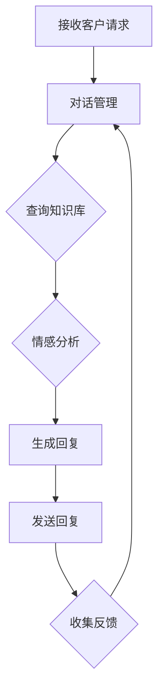

                 

### 《AI驱动的智能客户服务系统设计》

> **关键词：**人工智能、客户服务、自然语言处理、机器学习、智能客服系统

**摘要：**随着人工智能技术的快速发展，AI驱动的智能客户服务系统成为企业提升客户体验和效率的重要手段。本文将详细探讨AI驱动的智能客户服务系统设计，包括其核心概念、技术基础、系统架构、实际应用案例、开发流程和优化策略，并对未来的发展趋势进行展望。

### 目录

#### 第一部分：概述与背景

1. [第1章: AI与智能客户服务概述](#第1章-ai与智能客户服务概述)
   1.1 AI技术在客户服务领域的应用
   1.2 AI驱动的智能客户服务的优势
   1.3 AI驱动的智能客户服务的发展趋势
   1.4 客户服务系统设计原则

2. [第2章: 自然语言处理基础](#第2章-自然语言处理基础)
   2.1 自然语言处理概述
   2.2 常见自然语言处理算法

3. [第3章: 机器学习基础](#第3章-机器学习基础)
   3.1 机器学习概述
   3.2 常见机器学习算法

#### 第二部分：AI核心技术

4. [第4章: 智能客服机器人架构设计](#第4章-智能客服机器人架构设计)
   4.1 智能客服机器人概述
   4.2 智能客服机器人核心模块

5. [第5章: 客户服务场景应用](#第5章-客户服务场景应用)
   5.1 常见客户服务场景分析
   5.2 智能客服系统案例分析

#### 第三部分：智能客户服务系统设计

6. [第6章: 智能客户服务系统开发流程](#第6章-智能客户服务系统开发流程)
   6.1 开发流程概述
   6.2 开发环境搭建

7. [第7章: 智能客户服务系统优化策略](#第7章-智能客户服务系统优化策略)
   7.1 优化目标与方法
   7.2 性能评估与调整
   7.3 用户反馈与持续改进

#### 第四部分：未来展望

8. [第8章: AI驱动的智能客户服务发展趋势](#第8章-ai驱动的智能客户服务发展趋势)
   8.1 人工智能与客户服务融合的新形态
   8.2 AI驱动的智能客户服务的挑战与机遇
   8.3 未来研究方向

### 附录

9. [附录A：相关资源与工具推荐](#附录a-相关资源与工具推荐)
   9.1 常用AI框架与库
   9.2 实用数据集与案例
   9.3 学术论文与报告
   9.4 开源代码与社区资源

### 第一部分：概述与背景

#### 第1章: AI与智能客户服务概述

在当今的信息时代，客户服务已经成为企业竞争的重要方面。传统的客户服务方式，如电话客服、邮件客服等，已经无法满足用户对便捷、快速和个性化服务的需求。随着人工智能（AI）技术的快速发展，AI驱动的智能客户服务系统应运而生，为企业提供了一种全新的客户服务模式。本章将介绍AI在客户服务领域的应用现状、AI驱动的智能客户服务的优势和发展趋势，并讨论客户服务系统设计的原则。

## 1.1 AI技术在客户服务领域的应用

人工智能技术已经在客户服务领域得到了广泛应用。以下是一些主要的应用场景：

1. **自动语音应答系统（IVR）**：自动语音应答系统能够通过语音识别和语音合成技术，自动回答客户的常见问题，从而提高服务效率并减少人力成本。

2. **智能客服机器人**：智能客服机器人基于自然语言处理（NLP）和机器学习技术，可以理解客户的意图并给出相应的回复。它们可以处理大量的客户咨询，从而降低人力成本，提高服务质量。

3. **情感分析**：通过情感分析技术，企业可以了解客户的情绪变化，从而提供更加个性化的服务。例如，在电子商务领域，情感分析可以帮助企业了解客户对产品的满意度，并采取措施提高客户满意度。

4. **智能预测**：基于历史数据和机器学习算法，智能预测系统可以预测客户的购买意向，从而提供个性化的产品推荐和促销活动。

## 1.2 AI驱动的智能客户服务的优势

AI驱动的智能客户服务具有以下优势：

1. **提高服务效率**：智能客服系统可以处理大量的客户咨询，从而提高服务效率。传统客服方式往往受到人力资源的限制，而智能客服系统可以24小时不间断地提供服务。

2. **降低运营成本**：智能客服系统能够自动处理大量的客户咨询，从而减少了对人力和设备的需求，降低了运营成本。

3. **提升客户满意度**：智能客服系统能够提供快速、准确和个性化的服务，从而提高客户满意度。例如，通过情感分析技术，智能客服系统可以更好地理解客户的情绪，从而提供更加贴心的服务。

4. **数据驱动**：智能客服系统可以收集大量的客户数据，从而为企业提供宝贵的业务洞察。通过分析这些数据，企业可以优化服务流程，提高业务效率。

## 1.3 AI驱动的智能客户服务的发展趋势

随着AI技术的不断进步，AI驱动的智能客户服务将呈现以下发展趋势：

1. **智能化与自动化**：智能客服系统将越来越智能化和自动化，能够处理更复杂的客户咨询，提供更加个性化的服务。

2. **多渠道整合**：智能客服系统将支持多种通信渠道，如电话、邮件、社交媒体、聊天机器人等，从而提供无缝的客户体验。

3. **个性化服务**：通过分析大量客户数据，智能客服系统将能够提供更加个性化的服务，满足不同客户的需求。

4. **智能预测与推荐**：智能客服系统将利用机器学习算法进行智能预测，提供个性化的产品推荐和促销活动。

5. **伦理与隐私保护**：随着AI技术在客户服务领域的应用，数据隐私和伦理问题将变得更加重要。企业需要制定相应的政策和措施，保护客户数据的安全和隐私。

## 1.4 客户服务系统设计原则

在设计AI驱动的智能客户服务系统时，需要遵循以下原则：

1. **客户体验优先**：客户服务系统的首要目标是提升客户体验，因此，在设计过程中需要充分考虑客户的需求和偏好。

2. **系统可扩展性与灵活性**：客户服务系统的需求会随着时间和业务的发展而变化，因此，系统设计需要具有高度的扩展性和灵活性。

3. **数据安全和隐私保护**：客户数据的安全和隐私是客户服务系统的核心问题，需要采取严格的数据保护措施，确保客户数据的安全。

4. **技术选型和架构**：选择合适的技术和架构是客户服务系统成功的关键。需要考虑系统的性能、可维护性和可扩展性。

5. **用户体验优化**：在设计客户服务系统时，需要注重用户体验，确保系统能够提供流畅、便捷的服务。

#### 第二部分：AI核心技术

##### 第2章: 自然语言处理基础

自然语言处理（Natural Language Processing，NLP）是人工智能（AI）的一个重要分支，它致力于让计算机能够理解、解释和生成人类语言。NLP技术在智能客户服务系统中发挥着关键作用，使得智能客服系统能够与客户进行自然的对话交流。本章将介绍自然语言处理的核心任务、挑战与解决方案，以及常见自然语言处理算法。

## 2.1 自然语言处理概述

自然语言处理的核心任务是使计算机能够对人类语言进行处理和分析。这些任务包括但不限于：

1. **文本分类**：将文本数据按照预定的类别进行分类，例如情感分析、主题分类等。
2. **信息抽取**：从文本中提取结构化信息，如命名实体识别、关系抽取等。
3. **机器翻译**：将一种语言的文本翻译成另一种语言。
4. **问答系统**：使计算机能够理解用户的问题并给出准确的答案。
5. **对话系统**：实现人与计算机之间的自然对话。

在智能客户服务系统中，NLP技术主要用于理解客户的意图、提取关键信息以及生成合适的回复。例如，当客户通过聊天机器人提问时，系统需要理解客户的问题并给出相应的回答。

### 2.1.1 自然语言处理的挑战与解决方案

自然语言处理面临着一系列的挑战，主要包括以下几个方面：

1. **语义理解**：语义理解是NLP的核心问题，它涉及到对文本中的单词、短语和句子的含义进行理解和解释。由于自然语言具有高度复杂性和多义性，语义理解变得非常困难。解决方案包括使用词嵌入技术、深度学习和大规模预训练模型，如BERT、GPT等。

2. **语言变体**：自然语言具有地域性、时代性和个人特点，导致语言表达形式多样。例如，不同地区的语言、俚语、网络用语等都会给语义理解带来挑战。解决方案是使用大规模的多语言语料库和跨语言建模技术。

3. **上下文理解**：理解上下文是NLP中一个重要但困难的任务。上下文信息对于准确理解句子含义至关重要，但如何有效利用上下文信息是一个挑战。解决方案是使用上下文敏感的模型架构，如注意力机制和变换器架构。

4. **多模态融合**：在实际应用中，NLP常常需要与其他模态（如图像、声音）进行融合。多模态数据可以提供额外的上下文信息，但如何有效融合不同模态的数据是一个挑战。解决方案是使用多模态深度学习模型和融合算法。

### 2.1.2 常见自然语言处理算法

自然语言处理算法可以分为以下几类：

1. **词嵌入技术**：词嵌入（Word Embedding）是将词汇映射到高维向量空间的一种技术，它能够捕捉词语之间的语义关系。常见的词嵌入方法包括Word2Vec、GloVe等。

2. **序列模型**：序列模型（Sequential Model）是处理序列数据的模型，如循环神经网络（RNN）和长短期记忆网络（LSTM）。这些模型能够捕捉序列中的时间依赖性。

3. **注意力机制**：注意力机制（Attention Mechanism）是一种能够自适应地分配不同权重于不同输入信息的模型架构，它能够提高模型在处理序列数据时的性能。注意力机制广泛应用于机器翻译、文本分类等任务。

4. **变换器架构**：变换器架构（Transformer）是一种基于自注意力机制的深度学习模型，它在许多自然语言处理任务中取得了显著的性能提升。变换器架构的核心是多头自注意力机制和位置编码。

### 2.2 常见自然语言处理算法

以下是一些常见的自然语言处理算法及其应用：

1. **词嵌入技术**

   - **Word2Vec**：Word2Vec是谷歌在2013年提出的一种词嵌入方法，它基于神经网络训练词向量，能够捕捉词语的语义关系。

   - **GloVe**：GloVe（Global Vectors for Word Representation）是斯坦福大学在2014年提出的一种基于全局统计信息的词嵌入方法，它通过训练词向量矩阵来捕捉词语的语义和词频信息。

2. **序列模型**

   - **RNN**：循环神经网络（RNN）是一种能够处理序列数据的神经网络模型，它通过隐藏状态来捕捉时间依赖性。

   - **LSTM**：长短期记忆网络（LSTM）是RNN的一种变体，它引入门控机制来避免梯度消失问题，能够更好地捕捉长时依赖关系。

3. **注意力机制**

   - **自注意力**：自注意力（Self-Attention）是一种基于自回归的注意力机制，它能够自适应地分配不同权重于不同输入信息。

   - **多头注意力**：多头注意力（Multi-Head Attention）是Transformer模型的核心组件，它通过多个注意力头来捕捉不同层次的依赖关系。

4. **变换器架构**

   - **Transformer**：Transformer是由谷歌在2017年提出的一种基于自注意力机制的深度学习模型，它在机器翻译、文本分类等任务中取得了显著的性能提升。

   - **BERT**：BERT（Bidirectional Encoder Representations from Transformers）是谷歌在2018年提出的一种预训练变换器模型，它通过双向编码器来捕捉文本中的双向依赖关系，广泛用于问答系统、文本分类等任务。

## 2.2 常见自然语言处理算法

以下是一些常见的自然语言处理算法及其应用：

1. **词嵌入技术**

   - **Word2Vec**：Word2Vec是谷歌在2013年提出的一种词嵌入方法，它基于神经网络训练词向量，能够捕捉词语的语义关系。

   - **GloVe**：GloVe（Global Vectors for Word Representation）是斯坦福大学在2014年提出的一种基于全局统计信息的词嵌入方法，它通过训练词向量矩阵来捕捉词语的语义和词频信息。

2. **序列模型**

   - **RNN**：循环神经网络（RNN）是一种能够处理序列数据的神经网络模型，它通过隐藏状态来捕捉时间依赖性。

   - **LSTM**：长短期记忆网络（LSTM）是RNN的一种变体，它引入门控机制来避免梯度消失问题，能够更好地捕捉长时依赖关系。

3. **注意力机制**

   - **自注意力**：自注意力（Self-Attention）是一种基于自回归的注意力机制，它能够自适应地分配不同权重于不同输入信息。

   - **多头注意力**：多头注意力（Multi-Head Attention）是Transformer模型的核心组件，它通过多个注意力头来捕捉不同层次的依赖关系。

4. **变换器架构**

   - **Transformer**：Transformer是由谷歌在2017年提出的一种基于自注意力机制的深度学习模型，它在机器翻译、文本分类等任务中取得了显著的性能提升。

   - **BERT**：BERT（Bidirectional Encoder Representations from Transformers）是谷歌在2018年提出的一种预训练变换器模型，它通过双向编码器来捕捉文本中的双向依赖关系，广泛用于问答系统、文本分类等任务。

##### 第3章: 机器学习基础

机器学习（Machine Learning，ML）是人工智能（AI）的重要分支，它使得计算机系统能够从数据中学习并作出决策。在智能客户服务系统中，机器学习技术用于构建智能客服机器人、进行情感分析、实现个性化推荐等功能。本章将介绍机器学习的基本概念、主要类型以及常见机器学习算法。

## 3.1 机器学习概述

机器学习是一种使计算机系统能够自动学习、改进和做出决策的技术。其基本原理是通过从大量数据中提取模式和规律，从而实现对未知数据的预测和分类。机器学习过程主要包括以下几个步骤：

1. **数据收集**：收集用于训练模型的原始数据。数据的质量和多样性对模型的性能至关重要。
2. **数据预处理**：对原始数据进行清洗、归一化、缺失值处理等预处理步骤，以确保数据的质量和一致性。
3. **特征工程**：从原始数据中提取有用的特征，这些特征将用于训练模型。
4. **模型选择**：根据问题的性质和需求，选择合适的机器学习模型。
5. **模型训练**：使用训练数据对模型进行训练，模型会根据数据反馈不断调整参数，以优化性能。
6. **模型评估**：使用验证数据集评估模型的性能，并根据评估结果进行调整和优化。
7. **模型部署**：将训练好的模型部署到实际应用环境中，以便对未知数据进行预测和分类。

### 3.1.1 机器学习的主要类型

机器学习可以分为以下几类：

1. **监督学习（Supervised Learning）**：监督学习是机器学习中最常见的一种类型。它通过已有标签的数据来训练模型，以便对新数据进行预测或分类。常见的监督学习算法包括线性回归、逻辑回归、决策树、随机森林、支持向量机等。

2. **无监督学习（Unsupervised Learning）**：无监督学习是在没有标签数据的情况下进行的。它的目标是发现数据中的结构和规律，例如聚类、降维和关联规则挖掘。常见的无监督学习算法包括K-means聚类、主成分分析（PCA）、关联规则学习等。

3. **强化学习（Reinforcement Learning）**：强化学习是一种通过与环境交互来学习决策策略的机器学习方法。它通过尝试不同的动作并从环境中获得奖励来不断优化策略。常见的强化学习算法包括Q-learning、深度Q网络（DQN）和策略梯度方法等。

### 3.1.2 常见机器学习算法

以下是几种常见的机器学习算法及其应用：

1. **线性回归（Linear Regression）**：线性回归是一种用于预测连续值的监督学习算法。它通过建立输入变量和输出变量之间的线性关系来进行预测。线性回归通常用于回归分析、股票价格预测等任务。

2. **逻辑回归（Logistic Regression）**：逻辑回归是一种用于分类的监督学习算法。它通过拟合逻辑函数来预测类别的概率，从而实现分类。逻辑回归通常用于二元分类问题，如垃圾邮件检测、信用评分等。

3. **决策树（Decision Tree）**：决策树是一种基于树形结构进行决策的监督学习算法。它通过一系列的判断节点来分割数据，每个节点表示一个特征，每个分支表示一个特征取值。决策树常用于分类和回归任务，如分类疾病、预测销售量等。

4. **随机森林（Random Forest）**：随机森林是一种基于决策树的集成学习方法。它通过构建多棵决策树，并采用随机抽样和特征选择来提高模型的泛化能力。随机森林常用于分类和回归任务，如预测客户流失、分类电子邮件等。

5. **支持向量机（SVM）**：支持向量机是一种用于分类和回归的监督学习算法。它通过找到一个最优的超平面来分隔数据，从而实现分类或回归。SVM常用于文本分类、图像识别等任务。

6. **K-means聚类**：K-means聚类是一种基于距离度量的无监督学习算法。它通过将数据点划分到K个聚类中心，从而实现聚类。K-means聚类常用于数据挖掘、市场细分等任务。

7. **主成分分析（PCA）**：主成分分析是一种用于降维的无监督学习算法。它通过将数据投影到新的坐标轴上，从而提取主要成分，减少数据维度。PCA常用于数据可视化、异常检测等任务。

8. **关联规则学习**：关联规则学习是一种用于发现数据中关联规则的无监督学习算法。它通过分析数据项之间的关联关系，从而发现频繁出现的组合。关联规则学习常用于市场分析、推荐系统等任务。

## 3.2 常见机器学习算法

以下是几种常见的机器学习算法及其应用：

1. **线性回归（Linear Regression）**：线性回归是一种用于预测连续值的监督学习算法。它通过建立输入变量和输出变量之间的线性关系来进行预测。线性回归通常用于回归分析、股票价格预测等任务。

2. **逻辑回归（Logistic Regression）**：逻辑回归是一种用于分类的监督学习算法。它通过拟合逻辑函数来预测类别的概率，从而实现分类。逻辑回归通常用于二元分类问题，如垃圾邮件检测、信用评分等。

3. **决策树（Decision Tree）**：决策树是一种基于树形结构进行决策的监督学习算法。它通过一系列的判断节点来分割数据，每个节点表示一个特征，每个分支表示一个特征取值。决策树常用于分类和回归任务，如分类疾病、预测销售量等。

4. **随机森林（Random Forest）**：随机森林是一种基于决策树的集成学习方法。它通过构建多棵决策树，并采用随机抽样和特征选择来提高模型的泛化能力。随机森林常用于分类和回归任务，如预测客户流失、分类电子邮件等。

5. **支持向量机（SVM）**：支持向量机是一种用于分类和回归的监督学习算法。它通过找到一个最优的超平面来分隔数据，从而实现分类或回归。SVM常用于文本分类、图像识别等任务。

6. **K-means聚类**：K-means聚类是一种基于距离度量的无监督学习算法。它通过将数据点划分到K个聚类中心，从而实现聚类。K-means聚类常用于数据挖掘、市场细分等任务。

7. **主成分分析（PCA）**：主成分分析是一种用于降维的无监督学习算法。它通过将数据投影到新的坐标轴上，从而提取主要成分，减少数据维度。PCA常用于数据可视化、异常检测等任务。

8. **关联规则学习**：关联规则学习是一种用于发现数据中关联规则的无监督学习算法。它通过分析数据项之间的关联关系，从而发现频繁出现的组合。关联规则学习常用于市场分析、推荐系统等任务。

##### 第4章: 智能客服机器人架构设计

智能客服机器人是智能客户服务系统的核心组件，它通过模拟人类对话方式，与客户进行自然交互，解决客户的疑问和问题。智能客服机器人的设计需要考虑其功能与特点、架构设计原则以及核心模块。本章将详细介绍智能客服机器人的设计原理与架构。

## 4.1 智能客服机器人概述

### 4.1.1 智能客服机器人的功能与特点

智能客服机器人具备以下功能与特点：

1. **自然语言理解**：智能客服机器人能够通过自然语言处理（NLP）技术理解客户的意图和问题，实现对客户话语的语义分析。
2. **自动回复生成**：基于理解到的客户意图，智能客服机器人能够自动生成合适的回复，模拟人类对话方式，提供高质量的服务。
3. **多渠道支持**：智能客服机器人可以支持多种沟通渠道，如网页聊天、手机应用、邮件、短信等，满足客户多样化的沟通需求。
4. **24/7全天候服务**：智能客服机器人可以不间断地工作，提供全天候的服务，提高企业的服务效率和客户满意度。
5. **个性化服务**：智能客服机器人能够根据客户的历史数据和偏好，提供个性化的服务和建议，提升客户体验。
6. **集成与扩展性**：智能客服机器人可以与企业现有的业务系统进行集成，如ERP系统、CRM系统等，实现数据共享和业务协同。同时，其架构设计应具备良好的扩展性，以适应不断变化的业务需求。

### 4.1.2 智能客服机器人的架构设计原则

在设计智能客服机器人时，需要遵循以下原则：

1. **可扩展性**：智能客服机器人应具备良好的可扩展性，能够支持业务的快速发展和变化。
2. **高可用性**：系统设计应保证高可用性，确保机器人能够稳定、可靠地运行，降低故障风险。
3. **安全性**：智能客服机器人需要保护客户数据的安全，采取严格的数据加密和访问控制措施，防止数据泄露和滥用。
4. **易维护性**：系统设计应考虑易维护性，便于开发和运维人员对系统进行监控、调试和升级。
5. **用户体验优先**：设计智能客服机器人时，应始终将用户体验放在首位，确保机器人能够提供自然、流畅、高效的对话服务。

### 4.1.3 智能客服机器人核心模块

智能客服机器人通常由以下核心模块组成：

1. **对话管理模块**：对话管理模块负责管理整个对话过程，包括理解客户意图、生成回复、跟踪对话状态等。它是智能客服机器人的“大脑”，能够确保对话的流畅性和一致性。
2. **知识管理模块**：知识管理模块负责存储和管理知识库，包括常见问题的回答、业务规则、产品信息等。它是智能客服机器人的“知识库”，能够提供丰富的知识支持。
3. **用户画像模块**：用户画像模块通过分析用户行为和偏好，构建用户的画像模型，为个性化服务提供基础。它是智能客服机器人的“用户理解器”，能够更好地理解客户需求。
4. **情感分析模块**：情感分析模块通过分析客户的话语和情感，判断客户的情绪状态，为提供个性化服务提供参考。它是智能客服机器人的“情感感知器”，能够更好地理解客户情绪。
5. **接口管理模块**：接口管理模块负责与外部系统进行交互，如ERP系统、CRM系统等，实现数据共享和业务协同。它是智能客服机器人的“接口管理器”，能够与业务系统无缝对接。

### 4.1.4 智能客服机器人工作流程

智能客服机器人工作流程主要包括以下几个步骤：

1. **接收客户请求**：智能客服机器人通过接口管理模块接收客户请求，如网页聊天、邮件、短信等。
2. **对话管理**：对话管理模块对客户请求进行解析，理解客户意图，并生成初步回复。
3. **知识查询**：知识管理模块根据客户意图和当前对话状态，查询知识库，获取相关信息和回答。
4. **情感分析**：情感分析模块对客户话语进行情感分析，判断客户情绪状态。
5. **生成回复**：结合客户意图、知识查询结果和客户情绪，智能客服机器人生成合适的回复，并通过接口管理模块发送给客户。
6. **反馈收集**：智能客服机器人收集客户的反馈，包括满意度评分、问题反馈等，用于持续优化和改进。

### 4.1.5 智能客服机器人架构设计图示

以下是一个简化的智能客服机器人架构设计图，展示了各模块之间的关系和工作流程：

这个架构设计图展示了智能客服机器人的核心模块和基本工作流程，各模块之间通过接口进行通信，协同工作，提供高效的智能客服服务。

#### 第四部分：智能客户服务系统设计

##### 第6章: 智能客户服务系统开发流程

智能客户服务系统的开发是一个复杂的过程，涉及多个阶段和环节。为了确保系统的质量、性能和可维护性，需要遵循一系列规范的开发流程。本章将介绍智能客户服务系统开发的流程，包括需求分析、系统设计、系统实现、系统测试与部署等关键步骤。

## 6.1 开发流程概述

智能客户服务系统的开发流程可以分为以下几个阶段：

1. **需求分析**：在项目启动阶段，明确系统的功能需求、性能要求、用户界面设计等，为后续的开发工作提供基础。
2. **系统设计**：根据需求分析的结果，设计系统的整体架构、模块划分、接口规范等，为系统的实现奠定基础。
3. **系统实现**：根据系统设计文档，编写代码、开发模块、集成系统，完成系统的核心功能。
4. **系统测试**：对系统进行功能测试、性能测试、安全测试等，确保系统的稳定性和可靠性。
5. **系统部署**：将测试通过的系统部署到生产环境，进行实际运行和监控。

## 6.2 开发环境搭建

在开始智能客户服务系统的开发之前，需要搭建一个合适的开发环境。以下是一个基本的开发环境搭建步骤：

1. **硬件要求**：根据系统的需求和性能要求，选择合适的硬件设备，如服务器、存储设备等。
2. **操作系统**：选择一个稳定、可靠的操作系统，如Linux或Windows Server。
3. **开发工具**：安装开发所需的各种工具，如集成开发环境（IDE）、版本控制工具（如Git）、数据库工具（如MySQL）等。
4. **编程语言**：选择一种适合智能客户服务系统开发的编程语言，如Python、Java、JavaScript等。
5. **依赖库与框架**：安装必要的依赖库与框架，如TensorFlow、PyTorch、Django等，这些库和框架为系统的开发提供了丰富的功能和便利性。
6. **容器化**：考虑使用容器化技术，如Docker，来部署和管理系统，提高系统的可移植性和可扩展性。

## 6.3 需求分析

需求分析是智能客户服务系统开发的第一步，其目的是明确系统的功能、性能和用户界面设计等要求。以下是需求分析的主要步骤：

1. **收集需求**：通过与业务人员、用户和其他利益相关者进行沟通，了解他们对系统的期望和要求。
2. **需求文档**：编写详细的需求文档，包括功能需求、非功能需求、用户界面设计等。
3. **需求评审**：组织相关人员进行需求评审，确保需求的准确性和可行性。
4. **需求管理**：对需求进行跟踪和管理，确保需求的变化得到及时处理和更新。

## 6.4 系统设计

系统设计是智能客户服务系统开发的核心环节，其目的是确定系统的架构、模块划分和接口规范等。以下是系统设计的主要步骤：

1. **系统架构设计**：根据需求分析的结果，设计系统的整体架构，包括数据层、业务逻辑层、表示层等。
2. **模块划分**：将系统划分为多个模块，每个模块负责特定的功能，如对话管理模块、知识管理模块、用户画像模块等。
3. **接口设计**：设计系统内部和外部的接口规范，确保模块之间的数据传递和功能调用。
4. **数据模型设计**：设计系统的数据模型，包括数据库设计、数据存储策略等。
5. **性能优化**：考虑系统的性能优化，如负载均衡、缓存策略、数据库优化等。

## 6.5 系统实现

系统实现是根据系统设计文档，编写代码、开发模块、集成系统等过程。以下是系统实现的主要步骤：

1. **编码**：根据设计文档编写代码，实现各个模块的功能。
2. **模块开发**：开发各个模块，确保模块之间的接口符合设计要求。
3. **系统集成**：将各个模块集成起来，确保系统整体功能的实现。
4. **单元测试**：对各个模块进行单元测试，确保模块功能的正确性和稳定性。
5. **集成测试**：对整个系统进行集成测试，确保系统功能的完整性和可靠性。

## 6.6 系统测试

系统测试是确保智能客户服务系统质量的重要环节，包括以下类型的测试：

1. **功能测试**：测试系统的各项功能是否按照需求分析的要求正常运行。
2. **性能测试**：测试系统的性能，如响应时间、并发处理能力等，确保系统在大负载下的稳定性和效率。
3. **安全测试**：测试系统的安全性，如防止SQL注入、跨站脚本攻击等。
4. **用户界面测试**：测试用户界面是否符合用户需求，操作是否流畅。
5. **回归测试**：在每次修改代码后，对系统进行回归测试，确保修改不会影响其他功能的正常运行。

## 6.7 系统部署

系统部署是将开发完成的系统部署到生产环境，并进行实际运行和监控的过程。以下是系统部署的主要步骤：

1. **环境准备**：准备生产环境，包括硬件、操作系统、网络配置等。
2. **系统安装**：将开发完成的系统安装到生产环境中，确保系统正常运行。
3. **数据迁移**：将开发环境中的数据和配置迁移到生产环境。
4. **监控与维护**：对生产环境中的系统进行监控和维护，确保系统的稳定运行。
5. **用户培训**：对用户进行系统培训，确保用户能够熟练使用系统。

##### 第7章: 智能客户服务系统优化策略

智能客户服务系统的优化是提升系统性能和用户满意度的重要手段。优化策略包括性能评估与调整、用户反馈与持续改进等方面。本章将详细探讨智能客户服务系统的优化目标与方法，性能评估指标，性能调优策略，用户反馈机制以及持续改进策略。

## 7.1 优化目标与方法

智能客户服务系统优化的目标主要包括以下几个方面：

1. **提高响应速度**：优化系统的响应速度，减少用户的等待时间，提升用户体验。
2. **增强准确性**：提高智能客服系统的语义理解能力，确保生成的回复准确、贴合用户需求。
3. **提升用户满意度**：通过不断优化和改进，提升用户对智能客服系统的满意度，增加用户粘性。
4. **降低维护成本**：优化系统的架构和代码，降低系统的维护成本，提高开发效率和稳定性。

实现这些优化目标的方法包括以下几个方面：

1. **算法优化**：针对自然语言处理和机器学习算法进行优化，提高系统的准确性和效率。
2. **硬件升级**：根据系统的负载和性能要求，选择合适的硬件设备，提高系统的计算能力和响应速度。
3. **数据优化**：优化数据存储和查询策略，提高数据的访问速度和准确性。
4. **接口优化**：优化系统内部和外部接口，减少数据传输延迟，提高系统的整体性能。

## 7.2 性能评估与调整

性能评估是智能客户服务系统优化的重要环节，通过评估系统的性能，发现瓶颈和问题，为性能调优提供依据。以下是常用的性能评估指标和方法：

1. **响应时间**：系统处理请求所需的时间，包括解析请求、执行任务和生成回复等环节。
2. **吞吐量**：单位时间内系统能够处理的请求数量，通常以每秒请求数（requests per second，RPS）表示。
3. **并发处理能力**：系统同时处理多个请求的能力，以并发连接数（concurrent connections）或并发请求数（concurrent requests）表示。
4. **资源消耗**：系统运行过程中消耗的CPU、内存、磁盘空间等资源。
5. **错误率**：系统处理请求时发生的错误数量与总请求数量的比值，用于评估系统的稳定性。

性能评估的方法包括以下几种：

1. **负载测试**：通过模拟高负载情况，评估系统在压力下的性能表现。
2. **性能测试**：对系统的各项性能指标进行详细测试，分析系统的性能瓶颈。
3. **日志分析**：通过分析系统运行日志，发现错误和异常，为性能调优提供参考。

## 7.3 性能调优策略

性能调优策略主要包括以下几个方面：

1. **算法优化**：针对自然语言处理和机器学习算法进行优化，提高系统的准确性和效率。例如，通过调整网络结构、优化训练过程、使用更高效的算法等。
2. **硬件升级**：根据系统的性能要求和负载情况，选择更强大的硬件设备，提高系统的计算能力和响应速度。例如，使用更快的CPU、更大量的内存、更高速的硬盘等。
3. **数据优化**：优化数据存储和查询策略，提高数据的访问速度和准确性。例如，使用更高效的数据库系统、优化索引策略、减少数据冗余等。
4. **接口优化**：优化系统内部和外部接口，减少数据传输延迟，提高系统的整体性能。例如，使用更高效的传输协议、优化网络配置、减少中间件处理等。
5. **缓存策略**：使用缓存技术，减少对数据库的访问次数，提高系统的响应速度。例如，使用内存缓存、分布式缓存等。

## 7.4 用户反馈与持续改进

用户反馈是智能客户服务系统优化的重要来源，通过收集和分析用户反馈，可以发现系统存在的问题和不足，为持续改进提供依据。以下是用户反馈与持续改进的策略：

1. **用户调研**：通过问卷调查、用户访谈等方式，了解用户对智能客服系统的满意度和建议。
2. **错误报告**：收集用户在使用系统过程中遇到的错误和异常，分析错误原因，为系统优化提供参考。
3. **使用数据**：分析系统运行数据，如用户访问量、操作记录等，发现用户行为模式，为系统改进提供依据。
4. **定期评估**：定期对智能客服系统的性能、用户满意度等指标进行评估，识别问题，制定改进计划。
5. **迭代优化**：根据用户反馈和性能评估结果，不断迭代优化系统，提升用户体验和系统性能。

通过用户反馈与持续改进，智能客户服务系统可以不断优化和提升，为用户提供更好的服务。

### 附录A：相关资源与工具推荐

智能客户服务系统的开发涉及多个技术和工具。以下是一些常用的AI框架与库、实用数据集与案例、学术论文与报告以及开源代码与社区资源的推荐。

#### 常用AI框架与库

1. **TensorFlow**：由谷歌开发的开源机器学习框架，支持多种深度学习模型和算法，适用于自然语言处理和图像识别等领域。
2. **PyTorch**：由Facebook开发的开源机器学习框架，具有简洁的编程接口和灵活的动态计算图，适用于快速原型开发和研究。
3. **Scikit-learn**：一个Python机器学习库，提供了广泛的监督学习和无监督学习算法，易于集成和使用。
4. **NLTK**：一个Python自然语言处理库，提供了丰富的文本处理和语言模型工具，适用于文本分类、词性标注等任务。
5. **SpaCy**：一个快速易用的自然语言处理库，提供了强大的文本解析和实体识别功能，适用于构建智能客服系统。

#### 实用数据集与案例

1. **TREC Legal**：一个包含法律文档的文本数据集，适用于法律领域的文本分类和实体识别任务。
2. **Twitter**：Twitter开放数据集，包含大量用户发布的推文，适用于情感分析、话题模型等任务。
3. **Netflix**：Netflix推荐系统挑战数据集，包含用户评分数据，适用于推荐系统和协同过滤算法的研究。
4. **Kaggle**：一个数据科学竞赛平台，提供各种领域的开放数据集，适用于学习和实践机器学习算法。
5. **公开政府数据**：许多国家和地区的政府机构提供公开数据集，涵盖交通、教育、医疗等多个领域，适用于数据分析和预测任务。

#### 学术论文与报告

1. **“BERT: Pre-training of Deep Bidirectional Transformers for Language Understanding”**：由谷歌提出的一种预训练变换器模型，在多种自然语言处理任务中取得了显著性能提升。
2. **“GPT-3: Language Models are few-shot learners”**：由OpenAI提出的一种大规模预训练变换器模型，展示了在零样本学习场景中的强大能力。
3. **“Recurrent Neural Network Based Text Classification”**：一篇关于基于循环神经网络的文本分类算法的论文，介绍了RNN和LSTM在文本分类中的应用。
4. **“Deep Learning for Natural Language Processing”**：一本关于自然语言处理中深度学习应用的权威教材，涵盖了自然语言处理的各个方面。
5. **“AI for Customer Service”**：一篇关于人工智能在客户服务领域应用的报告，分析了智能客服系统的现状和未来趋势。

#### 开源代码与社区资源

1. **Hugging Face**：一个开源自然语言处理库和社区，提供了丰富的预训练模型和工具，方便开发者进行研究和应用。
2. **Apache Mahout**：一个开源的机器学习库，提供了多种机器学习算法和工具，适用于推荐系统、聚类、分类等任务。
3. **Apache Spark**：一个开源的大数据处理框架，提供了丰富的机器学习算法和工具，适用于大规模数据处理和分析。
4. **GitHub**：一个开源代码托管平台，许多优秀的机器学习和自然语言处理项目都在GitHub上开源，方便开发者学习和贡献代码。
5. **Stack Overflow**：一个开发者社区，提供了丰富的编程问题和解决方案，适用于开发者在智能客服系统开发过程中遇到的问题和挑战。

通过这些资源与工具，开发者可以更好地构建和优化智能客户服务系统，为用户提供优质的客户服务体验。

### 第五部分：未来展望

#### 第8章: AI驱动的智能客户服务发展趋势

随着人工智能（AI）技术的不断进步，AI驱动的智能客户服务系统正逐步成为企业提升客户体验和运营效率的重要工具。未来，AI驱动的智能客户服务将呈现出智能化、自动化、多渠道整合和个性化服务等多重发展趋势。

## 8.1 人工智能与客户服务融合的新形态

未来的智能客户服务将更加智能化，具体表现为：

1. **智能化客服机器人**：随着深度学习和自然语言处理技术的进步，客服机器人将具备更高的语义理解和语言生成能力，能够更自然地与用户进行交互。例如，通过预训练变换器模型，客服机器人可以理解复杂的问题并给出精准的答案。

2. **AI驱动的实时互动**：未来的智能客户服务系统将实现实时互动，客户在提出问题后，系统能够立即给出响应。这得益于云计算和边缘计算技术的发展，使得智能客服系统可以在更短时间内处理海量数据，提供快速、高效的响应。

3. **多渠道整合**：未来的智能客户服务系统将支持多种渠道的整合，包括聊天机器人、社交媒体、邮件、电话等。用户可以通过任意渠道与智能客服系统进行交互，系统将根据用户偏好和场景，提供统一的、无缝的服务体验。

4. **个性化服务**：未来的智能客户服务系统将能够根据用户的历史行为和偏好，提供个性化的服务和推荐。例如，通过对用户数据的分析，系统可以预测用户的购买意向，并主动推送相关的产品信息。

## 8.2 AI驱动的智能客户服务的挑战与机遇

AI驱动的智能客户服务在带来巨大机遇的同时，也面临一系列挑战：

1. **数据隐私与伦理问题**：随着AI技术的应用，客户数据的收集和使用变得越来越普遍。如何在保护用户隐私的同时，充分挖掘数据的价值，是一个亟待解决的问题。此外，如何确保AI系统的透明性和可解释性，也是伦理方面的重要议题。

2. **技术落地与实施难度**：虽然AI技术具有巨大的潜力，但将其应用到实际业务中，仍面临诸多技术挑战，如数据质量、算法优化、系统集成等。如何解决这些技术难题，确保AI系统的高效落地，是企业面临的重大挑战。

3. **用户体验优化**：智能客服系统需要不断优化用户体验，以提升用户满意度。这要求企业深入了解用户需求，持续迭代和改进系统功能，提供高质量的服务。

## 8.3 未来研究方向

未来的智能客户服务系统研究可以从以下几个方向展开：

1. **跨领域融合**：将AI技术与其他领域（如物联网、区块链、虚拟现实等）进行融合，探索新的应用场景，提供更加综合和智能化的服务。

2. **智能客服的自动化与智能化**：通过不断优化算法和模型，实现客服系统的自动化和智能化，减少人工干预，提高服务效率和准确性。

3. **数据隐私与伦理**：研究如何在保护用户隐私的同时，有效利用数据，制定相应的隐私保护政策和伦理规范，确保AI系统的可持续发展。

4. **多模态交互**：结合语音、文本、图像等多种模态，实现更自然、更高效的人机交互，提供更丰富的服务体验。

5. **边缘计算与云计算的结合**：通过边缘计算与云计算的结合，实现实时数据处理和分析，提供快速、高效的智能客服服务。

通过不断探索和创新，AI驱动的智能客户服务系统将在未来为客户和企业带来更多的价值和机遇。

